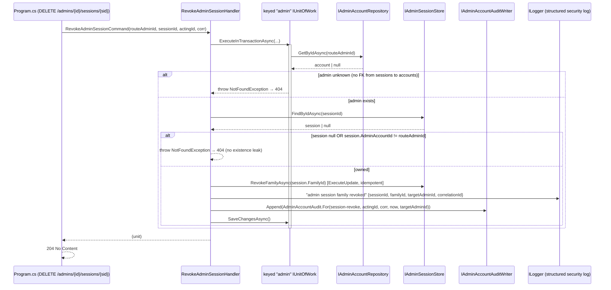

# Design: Admin Account Management

> Status: approved 2026-07-06

## Architecture Overview

Six additive endpoints on the Admin module, following the existing Clean
Architecture + CQRS slice already used by `admin-role-rbac`. No new module, no new
table, no migration. Every layer clones an in-repo exemplar:

- **Domain** (`Admin.Domain`) — one new state-transition method
  `AdminAccount.Reactivate()` and two `AdminAuditAction` constants
  (`reactivate`, `session-revoke`). Nothing else in the domain changes.
- **Application** (`Admin.Application`) — four read queries + two write commands,
  each a Mediator `IQuery`/`ICommand` with a handler. New read models
  (`AdminAccountListItem`, `AdminAccountDetail`, `AdminSessionView`) and three new
  port methods on existing interfaces. Writes go through the keyed `"admin"`
  `IUnitOfWork.ExecuteInTransactionAsync`; the host composes nothing.
- **Infrastructure** (`Admin.Infrastructure`) — new `AdminAccountSfs` whitelist
  (clone of `AdminRoleSfs`), an `AdminAccountRepository.ListAsync`, one
  `AdminRoleRepository` method for role codes, and two `AdminSessionStore` reads.
  All on the one keyed pol_admin `ProducerDbContext` (`AdminHostWiring.cs:177-188`).
- **Host** (`Hosts/Api/Program.cs`) — six endpoint maps (list on `api`, the rest on
  the `admin` group), host-local wire records, and explicit enum→lowercase
  projection mappers (no global enum converter, mirroring `RoleToWire`).

Authorization: the three READS gate on `RequirePermission(AdminPermissions.UserView)`
(`user.view`); reactivate + both session ops gate on `RequireAdminTier(AdminTier.Super)`,
mirroring the existing suspend/invite/tenant gates. All six carry `RequireAuthorization("admin")`.

### Route map (all under `/api/v1/admins`)

| Verb + path | Mapped on | Gate | Handler |
|---|---|---|---|
| `GET /admins` | `api` (empty group-root would render forbidden trailing slash — same as existing `POST /admins`); carries `.WithMetadata(new SfsQueryParamsMarker())` so the SFS query params show in OpenAPI (F2 / REQ-7.6) | `user.view` | `ListAdminsQuery` |
| `GET /admins/{id:guid}` | `admin` group | `user.view` | `GetAdminByIdQuery` |
| `POST /admins/{id:guid}/reactivate` | `admin` group | `Super` | `ReactivateAdminCommand` |
| `GET /admins/{id:guid}/sessions` | `admin` group | `Super` | `ListAdminSessionsQuery` |
| `DELETE /admins/{id:guid}/sessions/{sessionId:guid}` | `admin` group | `Super` | `RevokeAdminSessionCommand` |
| `GET /admins/{id:guid}/effective-permissions` | `admin` group | `user.view` | `GetAdminEffectivePermissionsQuery` |

Every admin-id route carries the `:guid` constraint so a GUID route never shadows
the literal `/me`, `/roles`, `/permissions` siblings on the same group (ASP.NET
routing prefers the literal segment; the constraint makes it unambiguous).

## Sequence Diagrams

### Reactivate (Suspended → Active, atomic revoke + status + audit)

```mermaid
sequenceDiagram
    participant SPA as Admin SPA
    participant H as Program.cs (POST /admins/{id}/reactivate)
    participant M as ReactivateAdminHandler
    participant UoW as keyed "admin" IUnitOfWork
    participant Acc as IAdminAccountRepository
    participant Sess as IAdminSessionStore
    participant Aud as IAdminAccountAuditWriter

    SPA->>H: POST (session cookie + CSRF)
    Note over H: RequireAuthorization("admin") + RequireAdminTier(Super)
    H->>M: ReactivateAdminCommand(targetId, actingId, correlationId)
    M->>UoW: ExecuteInTransactionAsync(...)
    activate UoW
    UoW->>Acc: GetByIdAsync(targetId)  [tracked]
    Acc-->>UoW: account | null
    alt account is null
        UoW-->>M: throw NotFoundException  → 404
    else account found
        Note over M: wasSuspended = (Status == Suspended)
        M->>Acc: account.Reactivate()  [Status = Active, idempotent]
        opt wasSuspended
            M->>Sess: RevokeAllForAdminAsync(targetId)  [ExecuteUpdate, same txn]
        end
        M->>Aud: Append(AdminAccountAudit.For(reactivate, actingId, corr, now, targetAdminId))
        M->>UoW: SaveChangesAsync()  [status + audit commit; revoke enrolled]
    end
    deactivate UoW
    M-->>H: status
    H-->>SPA: 204 No Content
```

### Revoke a session (ownership-checked family revoke)



## Data Models & Interfaces

### Domain (`Admin.Domain`)

```csharp
// AdminAccount.cs — new method (mirrors Suspend, but no self-guard: a suspended
// admin cannot authenticate, so self-reactivate cannot arise; idempotent).
/// <summary>Restores access (REQ-3). Idempotent: an already-Active account stays
/// Active. Session revocation on the Suspended→Active transition is the caller's
/// responsibility (the handler owns the transaction).</summary>
public void Reactivate() => Status = AdminStatus.Active;

// AdminAccountAudit.cs — two new action constants
public const string Reactivate = "reactivate";
public const string SessionRevoke = "session-revoke";
```

### Application read models

```csharp
// One list row (REQ-1.2). subjectBound = the invite has been claimed (Subject != null).
public sealed record AdminAccountListItem(
    Guid AdminId, string Email, AdminTier Tier, AdminStatus Status,
    DateTime CreatedAt, bool SubjectBound);

// Detail (REQ-2.1): list fields + accessible tenants (ids; host maps to codes like
// /me) + ALL assigned role codes incl. Inactive roles.
public sealed record AdminAccountDetail(
    Guid AdminId, string Email, AdminTier Tier, AdminStatus Status, DateTime CreatedAt,
    bool SubjectBound, AccessibleTenants Accessible, IReadOnlyList<string> RoleCodes);

// One session row (REQ-4.2). isLive computed at read time from the domain rule.
// NO TokenHash — never leaves the store (REQ-4.3).
public sealed record AdminSessionView(
    Guid SessionId, Guid FamilyId, AdminSessionStatus Status, DateTime IssuedAt,
    DateTime IdleExpiresAt, DateTime AbsoluteExpiresAt, string? CreatedIp,
    string? UserAgent, bool IsLive);
```

### Application ports (added to existing interfaces)

```csharp
// IAdminAccountRepository (AdminPorts.cs)
Task<PagedResult<AdminAccountListItem>> ListAsync(PagedQuery query, CancellationToken ct); // REQ-1

// IAdminRoleRepository (AdminRolePorts.cs) — all assigned role codes incl. Inactive
// (assignment truth for the detail view; effect lives in ListEffectivePermissionsAsync).
Task<IReadOnlyList<string>> ListRoleCodesForAdminAsync(Guid adminId, CancellationToken ct); // REQ-2.1

// IAdminSessionStore (AdminSessionPorts.cs)
Task<IReadOnlyList<AdminSession>> ListByAdminAsync(Guid adminAccountId, CancellationToken ct); // REQ-4
Task<AdminSession?> FindByIdAsync(Guid sessionId, CancellationToken ct);                       // REQ-5 (ownership + FamilyId)
```

### Application queries & commands

```csharp
// Reads — null result ⇒ host maps to 404 (mirrors GetRoleQuery).
public sealed record ListAdminsQuery : PagedQuery, IQuery<PagedResult<AdminAccountListItem>>;
public sealed record GetAdminByIdQuery(Guid AdminId) : IQuery<AdminAccountDetail?>;
public sealed record ListAdminSessionsQuery(Guid AdminId) : IQuery<IReadOnlyList<AdminSessionView>?>; // null = admin unknown
// F1: an ordered List, NOT a Set — REQ-6.2 requires a deterministic ascending array and HashSet has no order.
public sealed record GetAdminEffectivePermissionsQuery(Guid AdminId) : IQuery<IReadOnlyList<string>?>; // null = admin unknown

// Writes — Super-only at the host; keyed "admin" UoW inside the handler. Both use a bespoke result record
// (there is NO ICommand<Unit> usage anywhere in the repo — every 204 command returns a small result record:
// SuspendAdminResult, UnassignTenantResult, DeleteRoleResult; the host ignores it and returns NoContent). F5.
public sealed record ReactivateAdminCommand(Guid TargetAdminId, Guid ActingAdminId, string CorrelationId)
    : ICommand<ReactivateAdminResult>;
public sealed record ReactivateAdminResult(Guid AdminId, string Status);

public sealed record RevokeAdminSessionCommand(Guid TargetAdminId, Guid SessionId, Guid ActingAdminId, string CorrelationId)
    : ICommand<RevokeAdminSessionResult>;
public sealed record RevokeAdminSessionResult(Guid AdminId, Guid SessionId);
```

**Handler rules that matter:**

- `GetAdminEffectivePermissionsQuery` MUST resolve the account first
  (`IAdminAccountRepository.GetByIdAsync`) and return null (→404) when unknown —
  `ListEffectivePermissionsAsync` returns an empty set for a nonexistent id, so an
  empty set alone cannot be read as "not found" (REQ-6.3). On a real account it
  returns the union over ACTIVE roles as an ordinal-sorted List
  (`[.. set.OrderBy(k => k, StringComparer.Ordinal)]` in the handler — the repo
  returns an unordered `HashSet`, so the handler owns the sort, REQ-6.2), and works
  for a Suspended target (REQ-6.4 — no status gate on the query).
- `ListAdminSessionsQuery` resolves the account first; null → 404 (REQ-4.4);
  otherwise returns the (possibly empty, REQ-4.5) list. `IsLive` = `session.IsLiveAt(clock.UtcNow)`.
- `GetAdminByIdQuery` resolves the account (null → 404, REQ-2.2), then reuses the
  canonical `ResolveAdminHandler.ResolveAccessibleAsync(account, _admins, ct)`
  (`ResolveAdmin.cs:62-66` — Super → `AccessibleTenants.All`, Scoped →
  `Of(assigned)`) for the accessible set rather than reimplementing it (F7), and
  `ListRoleCodesForAdminAsync` for role codes.
- `ReactivateAdminHandler` loads the account INSIDE the transaction lambda (so the
  UoW execution-strategy retry re-loads on a transient fault, matching
  `SuspendAdminHandler`); computes `wasSuspended` before `Reactivate()`; revokes all
  sessions only when `wasSuspended` (REQ-3.5/3.6); appends the audit on every
  accepted call incl. the idempotent already-Active case (REQ-3.2/3.3); a null load
  → `NotFoundException` (REQ-3.4).
- `RevokeAdminSessionHandler` resolves the route admin first (→404, because
  `AdminSessions` has NO FK to `AdminAccounts` — a session could carry an orphan
  `AdminAccountId`); then `FindByIdAsync`; null OR `AdminAccountId != TargetAdminId`
  → `NotFoundException` (REQ-5.4, no existence leak); `RevokeFamilyAsync(FamilyId)`
  (whole family — a single-row revoke leaves the live successor usable, REQ-5.1);
  idempotent when the family is already revoked BUT the rows still exist
  (ExecuteUpdate affects 0 rows → 204, REQ-5.5); emits the structured security-log
  line then the audit, all in one transaction (REQ-5.2). F4 edge: if the session
  row was pruned (`PruneAsync` deletes rows past `AbsoluteExpiresAt`; current default = 168h)
  between a list and a delete, `FindByIdAsync` returns null → 404 — acceptable, the
  session no longer exists; REQ-5.5's 204 covers a still-present already-revoked
  family, not a pruned one.

### Infrastructure

`AdminAccountSfs` (clone `AdminRoleSfs`) — deny-by-default `FrozenDictionary`:

- filter: `email` (eq/ne/in/not_in/like/ilike/contains), `tier` (eq/in),
  `status` (eq/in). `tier`/`status` values parse strictly from the lowercase wire
  domain (`super`/`scoped`, `active`/`suspended`) via a local `ParseTier`/`ParseStatus`
  (`ToLowerInvariant` switch, bad value → `ArgumentException` → 400, REQ-1.7),
  exactly like `AdminRoleSfs.ParseStatus`.
- sort: `email`, `createdAt`. `ApplySort` closes the surviving chain with ONE final
  `ThenBy(a => a.Id)` — e.g. `sort=email` → `OrderBy(Email).ThenBy(Id)`,
  `sort=email,createdAt` → `OrderBy(Email).ThenBy(CreatedAt).ThenBy(Id)` (F3: id is
  the LAST tiebreak, not inserted after every key — inserting it per-key would kill
  every later key since id is already unique). No surviving key → default
  `OrderByDescending(CreatedAt).ThenBy(Id)` (REQ-1.3). NOTE: the `AdminRoleSfs`
  exemplar has NO id tiebreak (`AdminRoleSfs.cs:122-152`, default `OrderByDescending(Code)`
  only) — this feature adds it deliberately, so do not "match the exemplar" here.
- search: `email` (escaped `EF.Functions.Like`, REQ-1.4).
- Unknown field/operator silently dropped + logged by name at debug (REQ-1.8),
  matching the SFS convention.

`AdminAccountRepository.ListAsync` — `_db.Set<AdminAccount>().AsNoTracking()`,
`ApplyFilters → ApplySearch → LongCountAsync (total after filter, before paging) →
ApplySort → Skip/Take → project to AdminAccountListItem` (Subject != null →
SubjectBound). Returns `PagedResult<AdminAccountListItem>`.

`AdminRoleRepository.ListRoleCodesForAdminAsync` — join `AdminRoleAssignment` →
`AdminRole` on the admin id, select `AdminRole.Code` (ALL statuses), ordered by
code. (Mirrors `ListEffectivePermissionsAsync`'s join but without the Active filter
and returning codes.)

`AdminSessionStore.ListByAdminAsync` — `AsNoTracking().Where(AdminAccountId ==).
OrderByDescending(IssuedAt).ThenBy(Id)` (REQ-4.1). `FindByIdAsync` —
`AsNoTracking().FirstOrDefault(Id ==)` (read for ownership + FamilyId; the revoke
itself is the existing set-based `RevokeFamilyAsync`).

### Host wire records + projection (tail of `Program.cs`)

```csharp
internal sealed record AdminListItemResponse(
    Guid AdminId, string Email, string Tier, string Status, DateTime CreatedAt, bool SubjectBound);
internal sealed record AdminDetailResponse(
    Guid AdminId, string Email, string Tier, string Status, DateTime CreatedAt, bool SubjectBound,
    AdminAccessibleResponse Accessible, IReadOnlyList<string> RoleCodes);   // reuse existing AdminAccessibleResponse
internal sealed record AdminSessionResponse(
    Guid SessionId, Guid FamilyId, string Status, DateTime IssuedAt, DateTime IdleExpiresAt,
    DateTime AbsoluteExpiresAt, string? CreatedIp, string? UserAgent, bool IsLive);

static string TierToWire(AdminTier t) => t == AdminTier.Super ? "super" : "scoped";
static string AccountStatusToWire(AdminStatus s) => s == AdminStatus.Active ? "active" : "suspended";
static string SessionStatusToWire(AdminSessionStatus s) => s switch {
    AdminSessionStatus.Active => "active",
    AdminSessionStatus.Superseded => "superseded",
    _ => "revoked" };
```

The detail endpoint maps `Accessible` to `{tenantId, code}` pairs via the existing
`IAdminTenantDirectory.GetCodesByIdsAsync` in the HOST — byte-for-byte the `/me`
pattern (`Program.cs:1286`) — so the query handler stays free of the tenant
directory.

### Interface-widening blast radius (F6 — do in the SAME slice or the build breaks)

Adding methods to shipped interfaces breaks every existing implementer + test
double the moment the interface changes. All must be updated together:

- `IAdminSessionStore.ListByAdminAsync`/`FindByIdAsync` → real impl
  `AdminSessionStore`; plus test fakes `FakeSessionStore`
  (`tests/Admin.Tests/AdminLoginServiceTests.cs`) and `FakeStore`
  (`AdminSessionAuthHandlerTests.cs`). `AdminFakes.cs` has NO session-store fake yet
  — a new one is needed for the revoke/sessions handler tests.
- `IAdminAccountRepository.ListAsync` → `AdminAccountRepository` + `FakeAdminAccountRepository` (`AdminFakes.cs`).
- `IAdminRoleRepository.ListRoleCodesForAdminAsync` → `AdminRoleRepository` + `FakeAdminRoleRepository` (`AdminFakes.cs`).

## Technology Decisions

- **CQRS slice cloned, not invented** — `admin-role-rbac` already ships the exact
  list/detail/command shapes; every new type has a named exemplar (`ListRolesQuery`,
  `GetRoleQuery`, `CreateScopedAdminHandler`, `SuspendAdminHandler`, `AdminRoleSfs`).
- **Keyed `"admin"` UoW for every write** (`AdminScopedServices.cs:77`,
  `[FromKeyedServices("admin")]`) — the session store, account repo, and audit
  writer all resolve the SAME scoped keyed `ProducerDbContext`
  (`AdminHostWiring.cs:177-188`), so a set-based `ExecuteUpdateAsync` revoke enrolls
  in the transaction opened by `ExecuteInTransactionAsync` and commits/rolls back
  atomically with the change-tracked status flip + audit insert. No distributed tx,
  no host-side composition.
- **Zero migration** — reuse the `user.view` catalog key (`AdminPermissions.cs:32`)
  and existing tables. New audit actions are code-only constants (the catalog seeds
  permissions, not audit-action strings).
- **No new permission key for session ops** — Super-tier already fences them,
  matching suspend; a finer `user.sessions` grant is deferred (YAGNI) until a real
  need appears.
- **Nullable query results for 404** — the established host idiom (`GetRoleQuery`
  → `role is null ? 404`), avoiding an exception on the read path.
- **Audit granularity without a schema change** — `AdminAccountAudit` has no
  session column; a `session-revoke` row records who/whom/when
  (action + actorId + targetAdminId + correlationId), and the specific
  session/family id is on the structured security-log line sharing that
  correlationId. Deliberately no migration (see REQ-5.2 + finding 15).

## Error Handling Strategy

Single mapping seam — `BuildingBlocks.Web/ProblemDetailsExceptionHandler.cs`; handlers
throw typed exceptions, endpoints never format ProblemDetails by hand.

| Condition | Mechanism | Status |
|---|---|---|
| No / invalid admin session | `RequireAuthorization("admin")` | 401 |
| Missing `user.view` / wrong tier / CSRF fail | `RequirePermission` / `RequireAdminTier` / `AdminCsrfFilter` | 403 |
| Malformed SFS query (bad JSON, over-cap) | `SfsQueryParser` → `ArgumentException` | 400 |
| Filter value wrong JSON type / out-of-domain `tier`/`status` | `AdminAccountSfs` `Str`/`ParseTier`/`ParseStatus` → `ArgumentException` | 400 |
| Unknown admin id (any id route) | handler → `NotFoundException` | 404 |
| Unknown session id, or session not owned by route admin | handler → `NotFoundException` | 404 |
| Reactivate ok / session revoke ok | — | 204 |
| List / detail / sessions / effective-permissions ok | — | 200 |

No 409 anywhere: no unique-constraint write, no conflict state (reactivate and
revoke are both idempotent).

## Testing Strategy

| Layer / file | Cases | REQ |
|---|---|---|
| `tests/Admin.Tests` — `AdminAccountTests` | `Reactivate()` sets Active; idempotent on already-Active | 3.1, 3.3 |
| `tests/Admin.Tests` — `AdminAccountSfsTests` | tier/status strict parse (bad → throw); email like/contains; unknown field dropped; `ThenBy(Id)` present on default AND explicit sort | 1.3, 1.4, 1.7, 1.8 |
| `tests/Admin.Tests` — handler tests (fakes in `AdminFakes.cs`) | reactivate: NotFound on unknown; revoke-on-transition only when wasSuspended; audit appended every accepted call; effective-perms & sessions return null on unknown id; effective-perms result is ordinal-ASCENDING (F1); revoke: 404 on unknown admin / unknown session / wrong owner; family revoke invoked | 3.2–3.6, 4.4, 5.1, 5.4, 6.1–6.4 |
| `tests/Hosts.Tests` — endpoint/auth | un-cookied → 401 on each; `user.view`-gated reads vs `Super`-gated ops; token hash never in session JSON; list root maps with NO trailing slash; `GET /admins` exposes SFS params in OpenAPI (extend `SfsOpenApiTests`, F2) | 4.3, 7.1–7.3, 7.6 |
| `tests/Hosts.Tests` — `RouteSchemeConventionTests` | six new routes conform to `/api/v1/admins`, per-endpoint `RequireAuthorization` | 7.5, 7.6 |
| `tests/Integration.Tests` — real SQL (`:11434`) | (a) reactivate commits revoke+status+audit atomically AND rolls ALL back on a forced fault; (b) revoke-family: cross-family isolation + ownership 404 + idempotent re-revoke; (c) `ListEffectivePermissionsAsync` counts only Active roles; (d) revoke security-log line carries sessionId/familyId/targetAdminId/correlationId | 3.2, 3.5, 5.1–5.3, 6.1 |

## Requirement Traceability

| Design element | Satisfies |
|---|---|
| `ListAdminsQuery` + `AdminAccountRepository.ListAsync` + `AdminAccountSfs` | REQ-1.1, 1.2, 1.3, 1.4, 1.5, 1.6, 1.7, 1.8 |
| `GetAdminByIdQuery` + `AdminAccountDetail` + host code-mapping + `ListRoleCodesForAdminAsync` | REQ-2.1, 2.2 |
| `ReactivateAdminCommand`/handler + `AdminAccount.Reactivate()` + `RevokeAllForAdminAsync` in-txn | REQ-3.1, 3.2, 3.3, 3.4, 3.5, 3.6 |
| `ListAdminSessionsQuery` + `AdminSessionStore.ListByAdminAsync` + `AdminSessionView` (no TokenHash, isLive) | REQ-4.1, 4.2, 4.3, 4.4, 4.5 |
| `RevokeAdminSessionCommand`/handler + `FindByIdAsync` + `RevokeFamilyAsync` + security log | REQ-5.1, 5.2, 5.3, 5.4, 5.5 |
| `GetAdminEffectivePermissionsQuery` (existence-check → `ListEffectivePermissionsAsync`) | REQ-6.1, 6.2, 6.3, 6.4 |
| Host gates (`RequireAuthorization`/`RequirePermission(user.view)`/`RequireAdminTier(Super)`/`AdminCsrfFilter`), route placement, OpenAPI metadata, zero-migration reuse | REQ-7.1, 7.2, 7.3, 7.4, 7.5, 7.6 |
| (Inc 2) `MasterData` TPC + 4 concrete + `MasterConfigurations` + migration + `pol_admin` grants | REQ-9.5, REQ-10.1 |
| (Inc 2) `AdminAccount` FKs + `CreateScoped` overload + `ValidateProfileFksAsync` | REQ-8.1, REQ-8.2 |
| (Inc 2) `UpdateAdminProfileCommand`/handler + `update-profile` audit + `IMasterDataStore` (Mediator-bypass) | REQ-8.3, REQ-8.4, REQ-10.4 |
| (Inc 2) `AdminAccountDetail` refs + `GetRefAsync` + host `MasterRefResponse` | REQ-8.5 |
| (Inc 2) `MapMasterCrud<T>` List/Create/Update endpoints + soft-deactivate (`IsActive`, FK Restrict) | REQ-9.1, REQ-9.2, REQ-9.3, REQ-9.4 |
| (Inc 2) `user.manage` gate (profile edit + master CRUD), additive `POST /admins`, existing key wired | REQ-8.6, REQ-9.6, REQ-10.2, REQ-10.3 |

---

## Increment 2 — Org profile fields & master data (2026-07-06)

Adds four managed reference lists and wires each `AdminAccount` to them by nullable
FK. As-built (shipped to develop pending PR). Satisfies REQ-8/9/10.

### Master entity model — TPC (one table per concrete type)

A shared abstract base holds the behavior; four `sealed` subclasses each map to their
own table via `UseTpcMappingStrategy()` — NO base table, NO discriminator, so the
`AdminAccount` FKs stay type-safe. `Code` is an immutable `^[a-z0-9_]+$` slug (mirrors
`AdminRole.CodePattern`), unique per table; `Name` is the display label; `IsActive`
soft-deactivates.

```csharp
// Admin.Domain/MasterData.cs
public abstract class MasterData : AggregateRoot<Guid>   // Code, Name, IsActive
{
    protected MasterData(Guid id, string code, string name);   // validates + trims, IsActive = true
    public void Rename(string name);
    public void Activate();  public void Deactivate();
}
public sealed class Position : MasterData { public static Position Create(string code, string name); }
public sealed class Office   : MasterData { /* … */ }
public sealed class Level    : MasterData { /* … */ }
public sealed class Division : MasterData { /* … */ }
```

`AdminAccount` gains four nullable FKs + a full-replace mutator; `AdminAccountAudit`
gains one action constant.

```csharp
// AdminAccount.cs
public Guid? PositionId/OfficeId/LevelId/DivisionId { get; private set; }
public static AdminAccount CreateScoped(string email, DateTime createdAt,
    Guid? positionId = null, Guid? officeId = null, Guid? levelId = null, Guid? divisionId = null);
public void UpdateProfile(Guid? positionId, Guid? officeId, Guid? levelId, Guid? divisionId); // null clears
// AdminAccountAudit.cs
public const string UpdateProfile = "update-profile";
```

### Application — generic store (deliberately bypasses Mediator, F-inc2)

Master-data CRUD is simple control-plane reference data, so it is served by ONE
generic store rather than a Mediator command per verb per dimension (the source-gen
Mediator does not support open-generic handlers, and 4×3 concrete handlers would be
pure boilerplate). Writes STILL commit through the keyed `"admin"` `IUnitOfWork`
(honours S2); `IMasterDataStore` also backs FK validation and the detail refs.

```csharp
// Admin.Application/MasterData.cs
public sealed record MasterItem(Guid Id, string Code, string Name, bool IsActive);
public sealed record MasterRef(Guid Id, string Code, string Name);
public interface IMasterDataStore
{
    Task<PagedResult<MasterItem>> ListAsync<T>(int page, int limit, string? search, CancellationToken ct) where T : MasterData;
    Task<MasterItem> CreateAsync<T>(T entity, CancellationToken ct) where T : MasterData;   // dup code → ConflictException 409
    Task<MasterItem> UpdateAsync<T>(Guid id, string name, bool isActive, CancellationToken ct) where T : MasterData; // unknown → NotFoundException 404
    Task<bool> ExistsActiveAsync<T>(Guid id, CancellationToken ct) where T : MasterData;
    Task<MasterRef?> GetRefAsync<T>(Guid id, CancellationToken ct) where T : MasterData;
}
// MasterProfileValidation.ValidateProfileFksAsync — each non-null FK must be existing+active, else ArgumentException 400.
```

The one Mediator write in this increment is the profile edit (it mutates an
`AdminAccount` aggregate + audits, so it stays a command mirroring `ReactivateAdmin`):

```csharp
// Admin.Application/UpdateAdminProfile.cs
public sealed record UpdateAdminProfileCommand(
    Guid TargetAdminId, Guid? PositionId, Guid? OfficeId, Guid? LevelId, Guid? DivisionId,
    Guid ActingAdminId, string CorrelationId) : ICommand<Unit>;
// handler: keyed "admin" txn → load-or-NotFound → ValidateProfileFksAsync → UpdateProfile → audit(update-profile) → save
```

`AdminAccountDetail` gains four `MasterRef?`; `GetAdminByIdHandler` resolves each set
FK via `IMasterDataStore.GetRefAsync<T>` (unset → null). `CreateScopedAdminCommand` +
handler gain the four optional `Guid?` and call `ValidateProfileFksAsync` before
`CreateScoped(...)`.

### Infrastructure

- `MasterConfigurations.cs` — `MasterDataConfiguration : IEntityTypeConfiguration<MasterData>`
  sets `UseTpcMappingStrategy()` + key/columns/unique-`Code` index (shared); four
  one-line concrete configs set only `ToTable("Positions"|"Offices"|"Levels"|"Divisions")`.
  `AdminAccountConfiguration` gains four `HasOne<T>().WithMany().HasForeignKey(...).IsRequired(false).OnDelete(Restrict)`.
- `MasterDataStore.cs` — `IMasterDataStore` over the keyed pol_admin `ProducerDbContext`
  + keyed `"admin"` `IUnitOfWork`; `Set<T>()` per concrete type; search = escaped
  `EF.Functions.Like` over Name/Code. Registered in `AdminHostWiring.AddAdminIdentity`.

### Host (`Program.cs`)

- `PUT /admins/{id:guid}/profile` on the `admin` group (inherits CSRF), gated
  `user.manage` → `UpdateAdminProfileCommand`, 204.
- `MapMasterCrud<T>(group, segment, factory)` — a generic local helper mapping
  List/Create/Update under `admin.MapGroup("/master-data")/{segment}`, gated
  `user.manage`, full OpenAPI metadata; registered 4× (`Position.Create`, …).
- `CreateAdminRequest` + 4 optional `Guid?`; `AdminDetailResponse` + 4
  `MasterRefResponse?` (mapped via `MasterRefToWire`); new `MasterResponse` /
  `MasterWriteRequest` / `MasterUpdateRequest` / `UpdateAdminProfileRequest` records.

### Migration `20260706114944_AddAdminMasterDataAndProfileFks`

Four `CreateTable` (TPC, no discriminator) + unique `Code` index each; four nullable
FK columns + FK constraints (`Restrict`) on `producer.AdminAccounts`; a
`migrationBuilder.Sql` `GRANT SELECT, INSERT, UPDATE ON producer.{table} TO pol_admin`
(control-plane, no RLS; no DELETE — soft-deactivate). Applied + smoke-tested on real
SQL Server (:11434): FK join resolves, a bogus FK is rejected by the constraint.

### Error mapping (increment 2, same `ProblemDetailsExceptionHandler` seam)

| Condition | Mechanism | Status |
|---|---|---|
| Missing `user.manage` / CSRF fail | `RequirePermission` / `AdminCsrfFilter` | 403 |
| Unknown/inactive master FK on create or profile edit | `ValidateProfileFksAsync` → `ArgumentException` | 400 |
| Bad master `code` (`^[a-z0-9_]+$`) | `MasterData` ctor → `ArgumentException` | 400 |
| Duplicate master code | `MasterDataStore.CreateAsync` → `ConflictException` | 409 |
| Unknown master id (update) / unknown admin (profile edit) | store/handler → `NotFoundException` | 404 |

### Testing (as-built)

- `tests/Admin.Tests/MasterDataAndProfileTests.cs` (14 cases): `MasterData`
  factory/regex/rename/toggle; `AdminAccount` FK set + `UpdateProfile` full-replace;
  create rejects unknown/inactive FK + accepts active; `UpdateAdminProfile` 404 /
  inactive-FK 400 / happy-path + `update-profile` audit; detail exposes resolved refs.
  Plus `FakeMasterDataStore` in `AdminFakes.cs`.
- Real SQL (:11434): migration applied; schema + grants verified; FK enforced.
