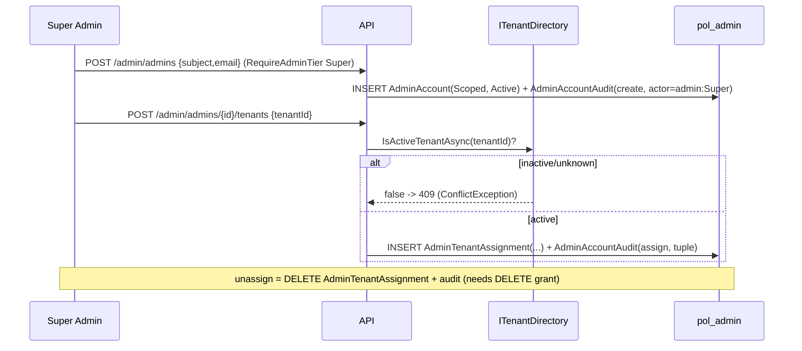

# Design: Admin Actor Rename + Admin Identity Foundation

> Status: approved 2026-06-23
> Notes:, amended 2026-06-23

> **Implementation note (PR `feat/admin-identity-rbac`, 2026-06-23):** PR แรกส่งมอบเฉพาะ **admin-identity
> foundation** (Task B) + `GET /admin/me`. **Producer rename (Task A) DEFERRED** — design ด้านล่างคงไว้เป็น
> canonical record ของ rename PR อนาคต. สองผลที่ใช้กับ PR นี้: (1) migration เป็น **pure-additive** (CREATE 3
> admin tables เท่านั้น; **ไม่** DROP/ADD predicate, **ไม่**แตะ `TenantUsers`/`TenantIsolationPolicy`/
> `fn_tenant_predicate` — §"Migration mechanics" ส่วน rename ใช้กับ rename PR เท่านั้น). (2) `IAdminQuery`
> (คืน `Tenant.Application.GetTenant.TenantView`) วางที่ **host (Hosts/Api)** ไม่ใช่ Identity.Application —
> `IdentityArchitectureTests` ห้าม Identity depend Tenant; ทำตาม pattern `ITenantDirectory` (host-impl). admin
> endpoint ใช้ route เดิม (`/admin/tenants`, `/admin/tenant-users/{subject}/approve`) + claim `tenant_role` เดิม.
>
> **Module placement (decided during impl):** AdminAccount/AdminTenantAssignment/AdminAccountAudit + handlers
> อยู่ใน **module `Admin` ใหม่** (`Admin.Domain`/`Admin.Application`/`Admin.Infrastructure`) แยกจาก `Identity`
> (producer-side actor) — control plane ≠ data plane, รองรับ `Producer` module ในอนาคต. component rows ที่ design
> เขียน "Identity.Domain (new)" map ไป Admin module. Admin ไม่ depend Identity/Tenant: ใช้ port ของตัวเอง
> `IAdminTenantDirectory` (host impl). `IAdminDirectory` ของ design ถูก fold เข้า `ResolveAdminHandler`
> (single caller) — ไม่แยก port. EF configs ของ Admin อยู่ schema `producer` เดิม (discovered ผ่าน
> `ModuleAssemblies.Producer`).

> Spec 1 ของ approved plan (`~/.claude/plans/sprightly-painting-token.md`). Design-First (ยังไม่มี
> requirements.md — /spec-requirements จะ backfill REQ IDs + traceability ทีหลัง). โหมด: module/interface level.
> ผ่าน spec-architect adversarial critique 1 รอบ (2 BLOCKER + 5 MAJOR + 5 MINOR applied — ดู `## Design review` ท้ายไฟล์).

## Architecture Overview

สองงานในก้อนเดียว, **behavior-preserving rename + additive admin foundation** (ยังไม่แตะ enum->catalog /
delegation — นั่นคือ Spec 2):

1. **Actor rename (full stack)** — producer-side actor เปลี่ยนชื่อ `TenantUser*` -> `ProducerAccount*` ทั้ง
   C# type, EF mapping (รวม `ToTable` string literal), table, external HTTP contract, claim, และ SPA
   audience-role label. behavior ไม่เปลี่ยน (test เดิมต้องเขียวด้วยชื่อใหม่).

2. **Admin identity foundation** — admin กลายเป็น first-class entity ใน DB ครั้งแรก:
   - `AdminAccounts` (tier Super/Scoped) + `AdminTenantAssignments` (M:N) + `AdminAccountAudits` (tuple)
   - Super bootstrap = config allowlist self-provision on first login (idempotent, แก้ chicken-and-egg)
   - `IAdminDirectory.ResolveAccessibleTenants` (Super=⊤, Scoped=assigned set)
   - **admin resolution middleware** materialize accessible-tenant set ครั้งเดียว/request
   - **app-layer scoped floor** = `IAdminQuery` seam + Architecture.Tests gate (ดู §Scoped floor) — documented
     exception จาก RLS floor พร้อม compensating control
   - MFA assert `amr/acr` best-effort (Workspace = control จริง)

### Component responsibilities

| Component | Layer | Responsibility |
|---|---|---|
| `ProducerAccount` (was `TenantUser`) | Identity.Domain | aggregate ของ producer actor; Register/Approve/Suspend (logic ไม่เปลี่ยน) |
| `AdminAccount` | Identity.Domain (new) | admin actor; tier (Super/Scoped) + status; SelfProvision/CreateScoped/Suspend; **block self-suspend** |
| `AdminTenantAssignment` | Identity.Domain (new) | M:N edge admin<->tenant; assigned-by + timestamp |
| `IAdminDirectory` | Identity.Application (new) | `ResolveAccessibleTenantsAsync(adminId)` -> Super=All / Scoped=set |
| `ResolveAdminQuery` + `AdminResolutionMiddleware` | Identity.Application + Host (new) | map subject->AdminAccount; **idempotent** self-provision จาก allowlist; ยัด `admin_tier` claim + accessible set ลง `IAdminScope`. NB: มี write path (ต่างจาก read-only producer middleware) |
| `IAdminScope` | BuildingBlocks (new) | per-request holder ของ `AccessibleTenants` (materialized) |
| `IAdminQuery` | Identity.Application + Infra (new) | **single seam** สำหรับ admin cross-tenant read; ฝัง `WHERE TenantId ∈ accessible` (Super=unrestricted); admin handler เข้าถึง business table ได้ทาง seam นี้ "เท่านั้น" |
| `AdminAccountAudit` | Identity.Domain (new) | append-only audit ด้วย `(actor_type, actor_id)` |
| RLS migration (rename + add) | Infrastructure | **manual-authored** predicate DROP/ADD รอบ rename + create admin control-plane tables |

## Sequence Diagrams

### Admin sign-in + idempotent bootstrap self-provision

```mermaid
sequenceDiagram
    participant SPA as Admin SPA
    participant API
    participant MW as AdminResolutionMiddleware
    participant DB as pol_admin (bypass)
    SPA->>API: request + Google ID token (aud=admin)
    API->>API: validate aud + email_verified + hd; assert amr/acr if-present (log absence)
    API->>MW: role=="admin", sub=S
    MW->>DB: AdminAccount by subject S?
    alt found (Active)
        DB-->>MW: AdminAccount(tier)
    else not found AND S in AdminAllowlist:Subjects
        MW->>DB: INSERT AdminAccount(S, Super, Active) + AdminAccountAudit(self-provision)
        alt unique-violation 2601/2627 (concurrent first-login)
            DB-->>MW: conflict -> re-read existing -> proceed (idempotent)
        end
    else not found AND S not in allowlist
        MW-->>API: no admin bound -> 403
    end
    MW->>MW: ResolveAccessibleTenants -> ยัด admin_tier claim + accessible set ลง IAdminScope
    MW->>API: next()
```

### Super creates Scoped admin + assigns tenant (audited)



### Scoped admin cross-tenant read via IAdminQuery seam

```mermaid
sequenceDiagram
    participant Scoped as Scoped Admin
    participant H as Admin handler
    participant Q as IAdminQuery (seam)
    participant DB as pol_admin (RLS bypass!)
    Scoped->>H: GET /admin/tenants/{code}
    Note over H: ArchTest BANS H from touching ProducerDbContext/Set<T> directly
    H->>Q: query (+ IAdminScope.accessible)
    Note over Q: pol_admin bypasses RLS at DB -> seam is the ONLY floor
    Q->>Q: Super -> no filter ; Scoped -> AND TenantId in accessible (fail-closed)
    alt tenant not in accessible
        Q-->>H: empty / 403-404
    else allowed
        Q->>DB: SELECT ... WHERE TenantId in accessible
    end
```

## Data Models & Interfaces

### New tables (control-plane: pol_admin only, NO fn_tenant_predicate, pol_app NO grant)

```
AdminAccounts
  Id            uniqueidentifier  PK (PK_AdminAccounts)
  Subject       nvarchar(256) NULL         -- Google sub; NULL for invited Scoped until first-login binds (F4A)
  Email         nvarchar(320)              -- unique; the invite key before sub is bound
  Tier          int                        -- AdminTier { Scoped=0, Super=1 }
  Status        int                        -- AdminStatus { Active=0, Suspended=1 }  (no PendingApproval)
  CreatedAtUtc  datetime2
  IX_AdminAccounts_Subject UNIQUE (Subject) WHERE Subject IS NOT NULL  -- filtered; idempotency key once bound
  IX_AdminAccounts_Email   UNIQUE (Email)                              -- invite key (pre-binding)

AdminTenantAssignments
  Id                uniqueidentifier PK
  AdminAccountId    uniqueidentifier         -- real FK -> AdminAccounts (same control-plane group)
  TenantId          uniqueidentifier         -- SOFT ref -> Tenants (no FK; validated via ITenantDirectory)
  AssignedByAdminId uniqueidentifier         -- audit who
  AssignedAtUtc     datetime2
  IX_AdminTenantAssignments UNIQUE (AdminAccountId, TenantId)
  -- unassign = hard DELETE (no soft-delete column) -> migration MUST grant DELETE to pol_admin

AdminAccountAudits   -- append-only; (actor_type, actor_id) tuple = decision-4 forward-only
  Id            uniqueidentifier PK
  Action        nvarchar(64)               -- self-provision | create-scoped | assign-tenant | unassign-tenant | suspend
  ActorType     nvarchar(16)               -- 'admin' only in Spec 1 (intentional forward-compat, not dead)
  ActorId       uniqueidentifier           -- acting AdminAccount.Id
  TargetAdminId uniqueidentifier  NULL
  TenantId      uniqueidentifier  NULL
  CorrelationId nvarchar(128)
  OccurredAtUtc datetime2
```

> **Audit bridge:** `AdminAccounts.Subject` เป็น join key ระหว่าง legacy `RegistrationAudits.AdminSubject`
> (string, ของ approve action — ไม่ rewrite ตาม decision-4) กับ `AdminAccountAudits.ActorId` (Guid). audit
> ของ admin คนเดียว "ทำอะไรบ้าง" ต้อง join 2 ตารางผ่าน Subject — observability gap ที่ยอมรับใน Spec 1.

### Renamed tables / columns (sp_rename — data preserved). NO FK on renamed tables.

| from | to |
|---|---|
| table `producer.TenantUsers` | `producer.ProducerAccounts` |
| table `producer.TenantUserProfiles` | `producer.ProducerAccountProfiles` |
| col `ExternalLogins.TenantUserId` | `ExternalLogins.ProducerAccountId` |
| col `TenantUserProfiles.TenantUserId` | `ProducerAccountProfiles.ProducerAccountId` |
| `PK_TenantUsers` | `PK_ProducerAccounts` |
| `PK_TenantUserProfiles` | `PK_ProducerAccountProfiles` |
| `IX_TenantUsers_Subject` | `IX_ProducerAccounts_Subject` |
| `IX_TenantUserProfiles_TenantUserId` | `IX_ProducerAccountProfiles_ProducerAccountId` |

**คงชื่อ** (ไม่มี token `TenantUser`): tables `ExternalLogins`, `RegistrationTickets`, `RegistrationAudits`;
index `IX_ExternalLogins_Provider_Subject` (อยู่บน Provider+Subject ไม่ใช่ TenantUserId).
**คงค่า/column**: `ProducerAccounts.Role int` + `HasConversion<int?>()` (enum = Spec 1; catalog = Spec 2);
enum **values** `Viewer/Finance/TenantAdmin` คงเดิม -> audit string + approve body ไม่พัง.

### C# + EF rename map (NB: `ToTable` string literals ไม่ compiler-verified -> ต้องระบุชัด)

```
TenantUser            -> ProducerAccount            TenantUserRole       -> ProducerAccountRole
TenantUserStatus      -> ProducerAccountStatus      TenantUserProfile    -> ProducerAccountProfile
ITenantUserRepository -> IProducerAccountRepository TenantUserRepository -> ProducerAccountRepository
ResolveTenantUserQuery/Resolution/Handler          -> ResolveProducerAccount*
TenantUserResolutionMiddleware -> ProducerAccountResolutionMiddleware
ApproveTenantUserCommand -> ApproveProducerAccountCommand   ApproveTenantUserRequest -> ApproveProducerAccountRequest
namespace Identity.Application.ResolveTenantUser   -> ...ResolveProducerAccount
```

**ไฟล์ที่มี string literal / helper ที่ compiler ไม่จับ — ต้องอยู่ใน rename task ชัดเจน:**
- `src/Modules/Identity/Identity.Infrastructure/Persistence/IdentityConfigurations.cs` —
  `ToTable("TenantUsers")` -> `"ProducerAccounts"`, `ToTable("TenantUserProfiles")` -> `"ProducerAccountProfiles"`,
  `Property(x => x.TenantUserId)` x2 -> `ProducerAccountId`, class names. (`HasConversion<int?>()` คงเดิม)
- `ProducerDbContextModelSnapshot.cs` — hardcoded `ToTable("TenantUsers")` ฯลฯ -> regen + verify no drift
- `tests/Integration.Tests/IdentityIsolationIntegrationTests.cs` — hardcoded SQL `producer.TenantUsers` ->
  `producer.ProducerAccounts` (`:30,44,48,61,65,71,74,84`)
- `tests` helper `IntegrationDb.InsertTenantUserAsync` (+ ชื่อ method/SQL ข้างใน) -> `InsertProducerAccountAsync`

### External HTTP contract changes

| change | site | ใครกระทบ |
|---|---|---|
| route `/admin/tenant-users/{subject}/approve` -> `/admin/producer-accounts/{subject}/approve` | `Program.cs:413` | **Admin SPA** (update call URL) |
| `ApproveProducerAccountRequest` record name; **JSON field คงรูป `{TenantId, Role}`** | `Program.cs:514` | Admin SPA: ไม่ต้องแก้ body (field เดิม) |
| claim `tenant_role` -> `producer_role` | `IdentityHostWiring.cs:53,91` | server-internal — ไม่มี SPA อ่าน |

### Audience-role key `tenant` — RETAINED (descoped per analyze F8B)

> Decision: **descope** การ rename audience key. key `tenant` คงเดิมทุกจุด — config `Google:Audiences:tenant`,
> env `Google__Audiences__tenant`, middleware literal `IdentityHostWiring.cs:85` `== "tenant"`, policy
> registration `GoogleAuthenticationExtensions.cs:92-93`, และ **13x** `RequireAuthorization("tenant")` ใน
> `Program.cs:211,220,234,241,248,255,262,278,285,296,309,333,340`. เหตุผล: key รั่วเป็นค่า claim runtime ->
> rename = atomic 13-endpoint lockstep, churn สูง / value ต่ำ (label ภายใน, ไม่มีผลต่อ client). rename จำกัดที่
> actor/table/claim (`tenant_role`->`producer_role`)/route เท่านั้น (REQ-2). tenant SPA ไม่กระทบ (REQ-2.4).

### New interfaces (signatures)

```csharp
// Identity.Domain
public enum AdminTier { Scoped = 0, Super = 1 }
public enum AdminStatus { Active = 0, Suspended = 1 }

public sealed class AdminAccount : AggregateRoot<Guid>
{
    public string Subject { get; }       public string Email { get; }
    public AdminTier Tier { get; private set; }   public AdminStatus Status { get; private set; }
    public DateTime CreatedAtUtc { get; }
    public static AdminAccount SelfProvision(string subject, string email, DateTime utc); // tier=Super
    public static AdminAccount CreateScoped(string subject, string email, DateTime utc);  // by a Super
    public void Suspend(Guid actingAdminId);     // throws if actingAdminId == Id (no self-suspend)
}

// Identity.Application
public readonly record struct AccessibleTenants(bool IsUnrestricted, IReadOnlySet<Guid> Tenants)
{
    public static AccessibleTenants All { get; }            // Super
    public static AccessibleTenants Of(IReadOnlySet<Guid> s); // Scoped
    public bool Allows(Guid tenantId) => IsUnrestricted || Tenants.Contains(tenantId);
}
public interface IAdminDirectory
{ Task<AccessibleTenants> ResolveAccessibleTenantsAsync(Guid adminId, CancellationToken ct); }

public sealed record ResolveAdminQuery(string Subject) : IQuery<AdminResolution?>;
public sealed record AdminResolution(Guid AdminId, AdminTier Tier, AccessibleTenants Accessible);

// IAdminQuery — the ONLY admin cross-tenant read seam (filter ฝังใน impl; Super=unrestricted)
public interface IAdminQuery
{
    Task<TenantView?> GetTenantByCodeAsync(string code, CancellationToken ct);  // filtered by IAdminScope
    // Spec-1 surface = admin reads ที่มีจริงเท่านั้น (no speculative cross-tenant reconciliation — F6A)
}

// BuildingBlocks
public interface IAdminScope { AccessibleTenants Accessible { get; } bool IsBound { get; } }
```

### Config

```jsonc
// appsettings — bootstrap super admin (mirror TenantCode allowlist; subjects via env, not committed)
"AdminAllowlist": { "Subjects": [ "<google-sub-1>" ] }   // env: AdminAllowlist__Subjects__0
```

### GET /admin/me — SPA identity bootstrap (REQ-13, additive; PR `feat/admin-identity-rbac`)

หลัง `AdminResolutionMiddleware` resolve + materialize `IAdminScope` แล้ว, `GET /admin/me`
(`RequireAuthorization("admin")`) อ่านจาก `IAdminScope` ตรงๆ — **ไม่มี query path ใหม่** (REQ-6.3 resolve
ครั้งเดียว/request). คืน:

```jsonc
// Super
{ "adminId": "...", "email": "ops@org.com", "tier": "Super",
  "accessibleTenants": { "isUnrestricted": true } }
// Scoped
{ "adminId": "...", "email": "scoped@org.com", "tier": "Scoped",
  "accessibleTenants": { "isUnrestricted": false, "tenants": [ { "id": "...", "code": "vcommerce" } ] } }
```

- Super -> `IsUnrestricted=true` flag, **ไม่** enumerate tenant ทั้งหมด (REQ-13.2).
- Scoped -> เฉพาะ assignment ของตัวเอง; Guid->code map ผ่าน host-side `ITenantDirectory.GetCodesByIdsAsync`
  (เพิ่ม method นี้; เดิมมีแค่ `IsActiveTenantAsync`). ปลอดภัยที่จะคืน code ของ tenant ที่ตัวเองถูก assign.
- `email` มาจาก `AdminAccount.Email` (authoritative; materialize ใน `IAdminScope` ตอน resolve).

### Migration mechanics (1 migration, **manual-authored**, pre-prod, reversible)

> **PR `feat/admin-identity-rbac` (additive-only):** ส่วน rename (predicate DROP/ADD + Rename* ops) ด้านล่าง
> ใช้กับ rename PR เท่านั้น. PR นี้ = CREATE `AdminAccounts`/`AdminTenantAssignments`/`AdminAccountAudits`
> (schema `producer`, NO predicate) + grants (pol_admin SELECT/INSERT/UPDATE; +DELETE บน assignments; audits
> SELECT/INSERT only; pol_app NONE) + Down DROP 3 tables. mirror `AddTenantTable.cs` (ProvisioningAudits) +
> `AddIdentityTables.cs` (child no-predicate / append-only grant). EF auto-scaffold ปลอดภัย (ไม่มีตารางใต้
> policy ถูกแตะ).

```
Up:
  1. ALTER SECURITY POLICY producer.TenantIsolationPolicy
       DROP FILTER PREDICATE ON producer.TenantUsers,
       DROP BLOCK  PREDICATE ON producer.TenantUsers AFTER INSERT/UPDATE;   -- table under policy can't rename
  2. RenameTable/RenameColumn/RenameIndex (EF ops): TenantUsers->ProducerAccounts, TenantUserProfiles->
     ProducerAccountProfiles, ExternalLogins.TenantUserId->ProducerAccountId,
     ProducerAccountProfiles.TenantUserId->ProducerAccountId, PK/index names
  3. ALTER SECURITY POLICY ... ADD FILTER/BLOCK PREDICATE producer.fn_tenant_predicate(TenantId)
       ON producer.ProducerAccounts ... ;                                    -- raw SQL (EF ไม่รู้จัก policy)
  4. Re-GRANT: pol_app SELECT ON ProducerAccounts; pol_admin SELECT/INSERT/UPDATE ON ProducerAccounts + child renamed
  5. CREATE AdminAccounts, AdminTenantAssignments, AdminAccountAudits (NO predicate; pol_admin
       SELECT/INSERT/UPDATE + **DELETE on AdminTenantAssignments** (unassign); pol_app NONE)
Down: reverse — DROP admin tables; DROP/ADD predicate back onto TenantUsers; rename back; re-grant old
```

> **Author manual — ห้าม trust EF auto-scaffold:** ถ้าปล่อย `dotnet ef migrations add` เห็น entity ชื่อใหม่
> vs snapshot เก่า มันจะ scaffold เป็น **DropTable+CreateTable = data loss**. ต้องเขียน Rename* ops เอง +
> raw SQL สำหรับ predicate. `fn_tenant_predicate` เป็น SCHEMABINDING กับ **column `TenantId`** (ไม่ rename) +
> SESSION_CONTEXT — **function body ไม่ต้องแก้**. regen snapshot หลัง migration + verify no drift.

## Technology Decisions

- **Admin = control-plane, ไม่มี per-tenant RLS predicate** — admin cross-tenant by nature; ใส่ predicate
  จะ leak assignment ให้ pol_app หรือซ่อน super-admin row (NULL tenant). ตาม pattern child identity tables
  (`AddIdentityTables.cs:129-141`).
- **Scoped isolation = app-layer (decision-5) — กลไกบังคับเป็นรูปธรรม (ดู §Scoped floor)**. หมายเหตุ
  technical: ทางเลือก per-scope **SESSION_CONTEXT** (ไม่ใช่ per-scope principal — คนละเรื่อง, ตัว
  SESSION_CONTEXT ถูก) เป็นไปได้เชิงกล แต่ predicate ปัจจุบันให้ pol_admin ผ่านด้วย
  `IS_ROLEMEMBER('pol_rls_bypass')=1` (`AddRlsSecurityPolicy.cs:32`); จะให้ SESSION_CONTEXT มีผลต้อง **ถอด
  pol_admin ออกจาก pol_rls_bypass** (`01-principals.sql:49-50`) ซึ่งพังทุก cross-tenant admin read ที่มีอยู่ ->
  จึงเลือก app-layer (decision-5).
- **Bootstrap = config allowlist self-provision, idempotent** — super admin คนแรกไม่มีใคร approve; config
  `AdminAllowlist:Subjects` + self-provision on first login. **empty allowlist** -> boot-time warning/health
  signal (mirror `RequireAdminAudience` guard) + first admin ได้ 403 (fail-closed, ไม่ auto-Super). subjects
  จาก env เท่านั้น.
- **MFA = Workspace-only (decision-3)** — Google ID token มาตรฐานมักไม่ส่ง `amr/acr`; app assert if-present +
  log absence, ไม่มี hard gate. test = synthetic claim เท่านั้น (ไม่ใช่ contract กับ Google).
- **Resolution ครั้งเดียว/request** — admin middleware resolve + materialize accessible set (มี write path
  สำหรับ self-provision — ต่างจาก producer middleware ที่ read-only; ยอมรับ + idempotent).
- **enum คงเดิม** — catalog/delegation = Spec 2.

## Scoped-admin app-layer floor — enforcement (highest-risk; BLOCKER#2 resolution)

ข้อเท็จจริง: `pol_admin` อยู่ใน `pol_rls_bypass` (`01-principals.sql:49-50`) + มี `SELECT` ทุก business table
(`AddRlsSecurityPolicy.cs:100-107`) + `ProducerDbContext` **ไม่มี global query filter** -> DB **ไม่** scope
scoped-admin. floor ย้ายมา app, บังคับด้วย **3 control ซ้อน (ไม่ใช่ "หวังว่า dev จะเรียก guard")**:

1. **Single query seam `IAdminQuery`** — admin cross-tenant read ทุกอันผ่าน seam เดียวที่ inject `IAdminScope`
   และฝัง `WHERE TenantId ∈ accessible` ภายใน (Super = unrestricted). handler ไม่เคยเห็น unfiltered `Set<T>`.
2. **Architecture.Tests enforcement gate** — admin handler ที่อ่าน tenant-scoped **business table cross-tenant**
   ต้องผ่าน `IAdminQuery` เท่านั้น (ห้าม `Set<T>()`/`ProducerDbContext` ตรงสำหรับ read กลุ่มนี้). **Exempt:**
   control-plane provisioning repos (Super-only write — Tenant/PspConnection/Vault) เข้าถึง context ผ่าน
   dedicated repo ได้ (F2A). CI-failing rule -> "mandatory" = enforced ไม่ใช่ convention.
3. **Leak test รวม bypass-attempt** — integration: Scoped เห็นแค่ assigned tenant ผ่าน seam; + ArchTest
   assert ไม่มี admin handler เลี่ยง seam.

> **Residual risk (ยอมรับ):** app-layer floor < RLS floor; seam + ArchTest เป็น compensating control. นี่คือ
> exception ที่ canon (`ARCHITECTURE.md:87-88`) ต้องบันทึก (plan สั่งแก้ canon drift แล้ว).

## Error Handling Strategy

| case | result |
|---|---|
| admin token, subject ∉ allowlist, ไม่มี AdminAccount | 403 (ไม่ auto-provision) |
| concurrent self-provision (subject เดียว 2 request) | catch unique-violation 2601/2627 -> re-read existing -> proceed (idempotent, 1 row) |
| empty/unset `AdminAllowlist:Subjects` ใน prod | boot warning/health-not-ready; first admin -> 403 (fail-closed) |
| Scoped admin query tenant ∉ accessible | empty/403-404 fail-closed (`IAdminQuery`) |
| resolved AdminAccount = Suspended | 403 + bind nothing (REQ-5.6) |
| invited Scoped first login, email matches pending | bind sub -> activate (REQ-3.5) |
| Scoped เรียก provision tenant (`POST /admin/tenants`) | 403 (Super-only, REQ-8.4) |
| assign tenant inactive/unknown | 409 (`ConflictException`, reuse `ITenantDirectory.IsActiveTenantAsync`) |
| assign ซ้ำ | 409 (unique index) |
| Scoped เรียก Super-only action | 403 (`RequireAdminTier(Super)`) |
| admin suspend ตัวเอง | 403 (`AdminAccount.Suspend` throws on self) |
| MFA claim absent | admit + log (ไม่ block) |
| migration Up/Down | reversible; manual-authored (ห้าม auto-scaffold drop/create) |

## Testing Strategy (test -> REQ)

| behavior | test | type | REQ |
|---|---|---|---|
| rename behavior-preserving | existing identity/RLS/authz tests เขียวด้วย `ProducerAccounts`+`producer_role`+route ใหม่ | integration (regression) | 1.1 |
| hardcoded SQL + helper rewrite | `IdentityIsolationIntegrationTests` + `IntegrationDb.InsertProducerAccountAsync` compile+pass | integration | 1.4 |
| audience key retained | `RequireAuthorization("tenant")` x13 + `== "tenant"` คงอยู่ (descope); route/claim renamed | unit/arch | 2.3 |
| suspended admin login | resolved Suspended -> 403 | integration | 5.6 |
| Scoped invite onboarding | Super invite by email -> first login binds sub -> Active | integration | 3.4, 3.5 |
| provision Super-only | Scoped -> `POST /admin/tenants` 403; Super allowed | integration | 8.4 |
| admin tables control-plane | pol_app **cannot SELECT** AdminAccounts/AdminTenantAssignments/AdminAccountAudits | integration (RLS leak) | 3.2 |
| Super bootstrap | allowlist subject first login -> AdminAccount(Super,Active); non-allowlist -> 403 | integration | 5.1, 5.3 |
| empty allowlist | empty -> first admin 403 (ไม่ auto-Super) + boot signal | integration | 5.4 |
| concurrent self-provision | 2 parallel first-login subject เดียว -> 1 row, ทั้งคู่ resolve สำเร็จ | integration | 5.2 |
| resolve_accessible_tenants | Super -> All; Scoped -> exactly assigned set | unit + integration | 6.1, 6.2 |
| **Scoped app-layer floor** | Scoped query unassigned tenant -> denied; Super -> allowed (ผ่าน seam) | integration (critical) | 7.1, 7.3 |
| **bypass attempt** | admin handler ที่แตะ `Set<T>()`/`ProducerDbContext` ตรง -> ArchTest fail | architecture | 7.2 |
| assignment audit | create/assign/unassign/self-provision -> `AdminAccountAudit` row ด้วย tuple | integration | 10.1 |
| unassign | DELETE assignment (pol_admin มี DELETE grant) + audit | integration | 4.2 |
| assign inactive/duplicate tenant | -> 409 | integration | 4.3, 4.4 |
| Super-only / self-suspend block | Scoped -> 403; `AdminAccount.Suspend(self)` throws | unit | 8.1, 8.2 |
| MFA best-effort | synthetic amr/acr present -> asserted/logged; absent -> admitted | unit (synthetic only) | 9.1, 9.2, 9.3 |
| migration round-trip | Up->Down บน real SQL Server -> policy/predicate consistent, no data loss | integration | 11.4 |

## Requirement Traceability

| design element | REQ |
|---|---|
| §C# + EF rename map; §Renamed tables/columns | REQ-1 |
| §External HTTP contract changes | REQ-2.1, 2.2, 2.4 |
| §Audience-role key `tenant` — RETAINED (descoped) | REQ-2.3 |
| §Data Models — AdminAccounts; New interfaces — AdminAccount | REQ-3 |
| §Data Models — AdminTenantAssignments; seq "Super creates Scoped" | REQ-4 |
| seq "idempotent bootstrap self-provision"; §Tech Decisions — Bootstrap | REQ-5 |
| §New interfaces — IAdminDirectory/AccessibleTenants; §Tech Decisions — Resolution | REQ-6 |
| §Scoped-admin app-layer floor | REQ-7 |
| §Error Handling (Super-only/self-suspend); AdminAccount.Suspend | REQ-8 |
| §Tech Decisions — MFA | REQ-9 |
| §Data Models — AdminAccountAudits; §Audit bridge | REQ-10 |
| §Migration mechanics | REQ-11 |
| §Non-Functional; plan canon reconciliation | REQ-12 |
| §GET /admin/me (SPA identity bootstrap) | REQ-13 |

## Non-Functional Considerations

- **Security/compliance** — scoped floor = app-layer exception จาก RLS; compensating control (seam + ArchTest
  + leak/bypass test) เป็น gate. audit append-only ครอบ cross-tenant admin access + assignment change.
- **Blast radius / backward-compat** — rename ~232 occ / 25 files (รวม test project + string literals) + DB ใต้
  SECURITY POLICY; behavior-preserving บังคับ. C# rename แยก commit (compiler-verified) ก่อน migration; แต่
  **commit แรกจะเขียวก็ต่อเมื่อ** string literals (`ToTable`) + test helper ถูก rename ด้วย (compiler ไม่จับ).
- **Migration safety** — table ใต้ policy rename ไม่ได้ถ้าไม่ DROP/ADD predicate; manual-authored; reversible Down.
- **Coordination** — Admin SPA update approve route URL (body field คงรูป); audience rename = atomic server
  change + env `Google__Audiences__producer` lockstep; `AdminAllowlist__Subjects` ตั้งก่อน deploy.
- **Performance** — admin resolution + accessible-set materialize ครั้งเดียว/request.

## Open items

- verify จริงว่า Google ส่ง `amr/acr` ไหม (REQ-9 อาจ no-op — ยอมรับ, test synthetic). resolve ตอน impl.
- resolved by analyze: per-action authority -> REQ-8.4/8.5 (F3A); audience rename -> descoped (F8B);
  Scoped onboarding -> REQ-3.4/3.5 (F4A); IAdminQuery surface -> REQ-7.1 (F6A); suspended login -> REQ-5.6 (F5A)

## Design review (spec-architect critique — applied)

| # | finding | resolution |
|---|---|---|
| BLOCKER 1 | audience rename = runtime contract + lockstep (13 endpoints), ไม่ใช่ config label | §Audience-role rename rewrite: atomic 4-จุด+13 endpoints + deploy ordering + no-orphan test + descope flag |
| BLOCKER 2 | app-layer floor ไม่มีกลไก intercept; pol_admin เลี่ยงได้ | §Scoped floor: `IAdminQuery` seam + Architecture.Tests ban direct `Set<T>()` + bypass-attempt test |
| MAJOR 3 | self-provision race + middleware write ≠ mirror | idempotent (catch 2601/2627 -> re-read) + error row + test; ยอมรับ write path |
| MAJOR 4 | empty allowlist unspecified | boot warning/health + fail-closed + test |
| MAJOR 5 | unassign ไม่มี DELETE grant/schema | hard DELETE + `GRANT DELETE` ใน migration |
| MAJOR 6 | test helper `IntegrationDb` ขาดใน rename | เพิ่มเข้า rename map + test |
| MAJOR 7 | EF auto-scaffold -> drop/create data loss | "manual-authored, ห้าม auto-scaffold" + snapshot verify |
| MINOR 8 | `IdentityConfigurations.cs` `ToTable` literals ขาด (compiler ไม่จับ) | เพิ่มไฟล์ + literal เข้า map + note |
| MINOR 9 | no FK on renamed tables; ชื่อ PK/index | ระบุ "no FK" + PK/index ชื่อจริง |
| MINOR 10 | audit split-identity Subject vs Guid | audit-bridge note (Subject = join key) |
| MINOR 11 | 409/422 ambiguity; MFA test unreachable | 409 only; MFA synthetic-only |
| MINOR 12 | DTO rename ขัด "SPA แตะแค่ route" | ปิด: JSON field คงรูป `{TenantId, Role}`, แค่ route URL |
