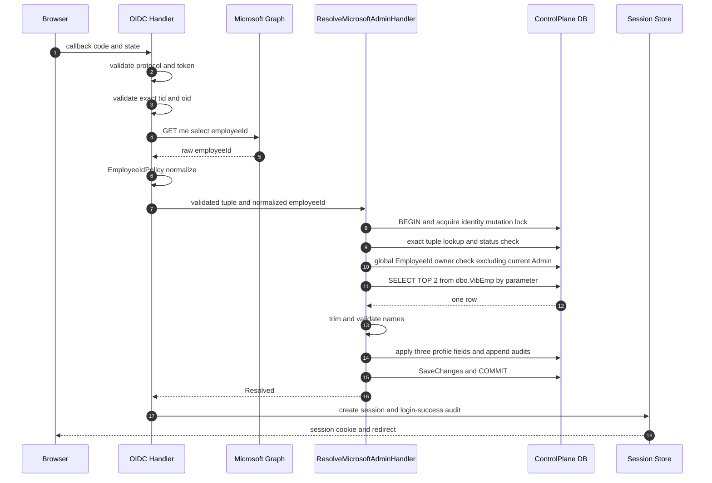
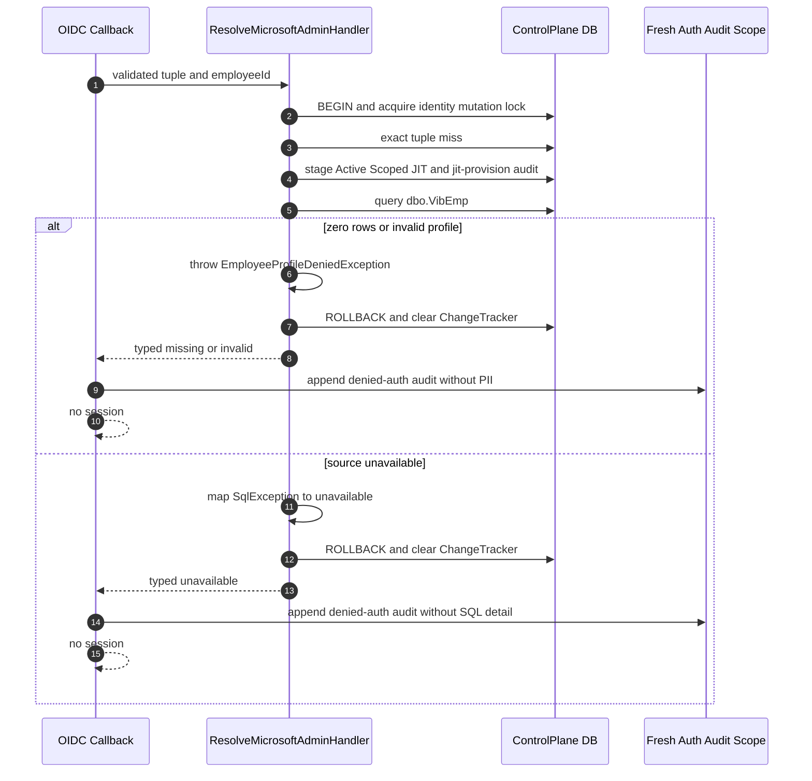
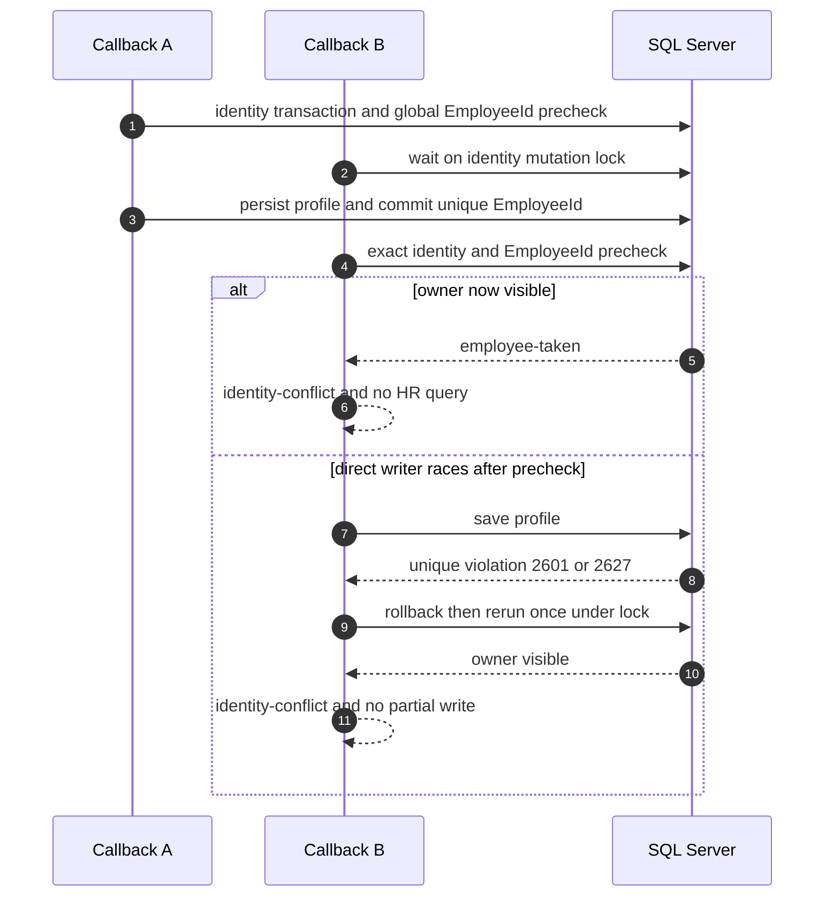

# Design: Admin Employee Profile Sync

> Status: approved 2026-09-03
> Status-Note: amended and approved 2026-09-04 — mutable EmployeeId refresh for an exact Microsoft identity

เอกสารนี้ออกแบบ employee profile flow `Entra → employeeId → dbo.VibEmp → admin.Users` โดยทุก Admin Microsoft OIDC authorization/callbackใหม่ต้องขอ `User.Read`และเรียก Graphหลัง validation ไม่มี optional runtime switchที่ silentlyข้าม profile Exact `(microsoft, validated tid, validated oid)`เป็น authentication identity ส่วน `EmployeeId`เป็น mutable HR profile attributeที่ replaceพร้อมชื่อได้ ส่วน transaction, JIT, sessionและ schema guardเดิมคงอยู่ และ production decision pathไม่อ่าน branch, Office, Divisionหรือ legacy mapping

## Architecture Overview

### Invariant หลัก

1. ASP.NET Core OIDC handlerต้อง validate state, nonce, signature, issuer, audienceและ lifetimeก่อน `MicrosoftWorkforceClaimsValidator` อ่าน exact `tid`/`oid`
2. ทุก Admin Microsoft authorization requestขอ `openid email profile User.Read`และทุก callbackใหม่ที่ validationผ่านเรียก Graphหนึ่งครั้งก่อนเปิด SQL transaction
3. Access tokenอยู่ใน callback stackของ requestเดียวและ `SaveTokens=false` Named clientไม่มี retry/resilience handler
4. Microsoft identity resolutionใช้ exact `(Provider=microsoft, TenantId=tid, Subject=oid)` เท่านั้น Email, `WorkforceEmailKey`และ `EmployeeId`ไม่มีอำนาจใน identity decision
5. ภายใน identity transaction ระบบ resolve exact identityและ statusก่อน ตรวจว่า candidate EmployeeIdถูก Adminรายอื่นถือหรือไม่โดย exclude exact Adminปัจจุบัน แล้วจึง query `dbo.VibEmp`
6. HR readerใช้หนึ่ง parameterized exact query อ่านเพียง `EmpCode`, `FirstNameTh`, `LastNameTh` และคืน cardinalityสูงสุดสองแถว
7. JITหรือexisting profile mutationกับ `UserAudits` commitหรือ rollbackพร้อมกัน Sessionถูกสร้างได้หลัง commitเท่านั้น
8. Profile writerแตะเฉพาะ `EmployeeId`, `FirstName`, `LastName`, `Version` และ `UpdatedAt` ไม่แตะ org fieldsหรือ `AuthorizationVersion`
9. Existing Admin session authentication, request authorizationและ session rotationไม่ reference Graph readerและไม่เรียก Graph
10. Final schemaและ global filtered unique indexมีอยู่แล้ว จึงไม่มี migrationใหม่และไม่แก้ immutable migration history

### Components และ responsibility

| Layer | Component | Change |
|---|---|---|
| Host | `OidcAuthentication` | ขอ `User.Read`และเรียก Graphทุก validated callbackใหม่; classify exact consent codeก่อน remote failure |
| Host options | `OidcProviderOptions` | ลบ `RequireEmployeeProfile`เพื่อปิด silent default-false path |
| Host | `MicrosoftGraphEmployeeIdReader` | requestเดียว, timeout 10s, no retry/resilience handlerและ PII-safe failure;ใช้ configured base URL |
| Host | `MicrosoftOidcFailureClassifier` | exact `consent_required` → profile unavailable; `access_denied`คง user-cancel path |
| Host | `ProvisioningGuards.RequireWorkforceAdminProvider` | เมื่อ Production pin `AdminAuth:GraphBaseUrl` เป็น `https://graph.microsoft.com` |
| Host | `LoginService` | ลบ `EmployeeProfileUnmapped` mappingและคง session-after-commit denial flow |
| Domain | `EmployeeIdPolicy` | reuse trim, blank/control/internal-whitespace/length/case policyเดิมโดยไม่สร้าง normalizerใหม่ |
| Domain | `User.ApplyEmployeeProfile` | ลด signatureเหลือสาม profile fieldsและคืน change flagsสำหรับ Version/audit |
| Domain | `AuditAction.EmployeeProfileSync` | stable action `employee-profile-sync` สำหรับ existing-user EmployeeIdหรือ name change |
| Application | `EmployeeProfile` | เหลือ `FirstName`, `LastName` |
| Application | `EmployeeProfileResolver` | cardinalityและ name validationจาก VibEmp rowชุดเดียว |
| Application | `ResolveMicrosoftAdminHandler` | exact identity/status → other-owner check → HR → replace/audit → single save |
| Persistence | `EmployeeProfileReader` | raw read-only exact queryต่อ `dbo.VibEmp`เพียง statementเดียว |
| Persistence | `UserRepository` | reuse global `GetByEmployeeIdAsync`ภายใต้ identity transaction |
| Database | existing profile migration/model | reuse `nvarchar(16/500/500)`และ global filtered unique index ไม่มี DDLใหม่ |
| Operations | `admin-microsoft-oidc.md` | ลบ branch/LegacyKey mapping flowและเพิ่ม late-table idempotent `GRANT SELECT` step |
| Tests | Admins/Hosts/Architecture/Integration suites | แทน mapping testsด้วย 0/1/2 row, names, exact SQL, atomicity, raceและ privacy coverage |

### Production filesที่ตั้งใจแก้

| File | Change |
|---|---|
| `src/Hosts/Api/Program.cs` | Production Graph origin guardเท่านั้น |
| `src/Hosts/Api/OidcProviderOptions.cs` | remove optional employee-profile property |
| `src/Hosts/Api/Admins/OidcAuthentication.cs` | unconditional scope/Graphและ typed consent marker |
| `src/Hosts/Api/Admins/MicrosoftWorkforceClaims.cs` | consent marker/classifierโดยไม่ parse provider detail |
| `src/Hosts/Api/Admins/LoginService.cs` | final profile denial mapping |
| `src/Modules/Admins/Admins.Domain/Users/Audit.cs` | เพิ่ม action literal |
| `src/Modules/Admins/Admins.Domain/Users/User.cs` | profile writerสาม fieldและ change result |
| `src/Modules/Admins/Admins.Application/Users/EmployeeProfile.cs` | ลด model/source/status resolver |
| `src/Modules/Admins/Admins.Application/Users/ResolveAdmin.cs` | retire unmapped outcome/result |
| `src/Modules/Admins/Admins.Application/Users/ResolveMicrosoftAdmin.cs` | ordering, profile applyและ audit semantics |
| `src/Persistence/Persistence.ControlPlane/Admins/EmployeeProfileReader.cs` | query VibEmp statementเดียว |
| `.env.example`, `docker-compose.prod.yml` | remove retired switchและ default false |
| `docs/runbooks/admin-microsoft-oidc.md` | mandatory flow, consent, grantและ denial instructions |

Implementationลบ keyเดียวกันจาก local `.env`โดยไม่แสดงค่าอื่น ไม่แก้ EF model shape, migration source, model snapshot, `docker/migrations/schema.sql`, `docker/bootstrap` หรือ Merchant authentication เพราะ final schemaและ bootstrap migration chainตรง requirementอยู่แล้ว Testsจะพิสูจน์ shapeแทนการสร้าง redundant migration

## Sequence Diagrams

### Successful existing-user refresh



### JIT profile failure



### EmployeeId conflict and race



## Data Models & Interfaces

### Mandatory Graph callback contract

เลือกวิธีเล็กสุดคือลบ rollout switchทั้ง contract ไม่ใช้ fail-fast booleanเพิ่ม:

- ลบ `OidcProviderOptions.RequireEmployeeProfile`
- `Configure`เพิ่ม `User.Read`หลัง `openid email profile`ทุกครั้งสำหรับ Admin Microsoft scheme
- `OnTokenValidated`เรียก Graph blockเดิมแบบ unconditionalหลัง `MicrosoftWorkforceClaimsValidator`ผ่าน
- ลบ `AdminAuth__Providers__Microsoft__RequireEmployeeProfile`และ `ADMIN_REQUIRE_EMPLOYEE_PROFILE`จาก tracked config/docsและ local `.env`
- Merchant OIDCใช้ registrationคนละ pathและไม่เปลี่ยน scopeหรือ callback

Provider-side consent classificationใช้ typed protocol field ไม่ parse queryหรือ exception message:

```csharp
OnMessageReceived = context =>
{
    if (string.Equals(context.ProtocolMessage.Error, "consent_required", StringComparison.Ordinal))
        MicrosoftOidcFailureClassifier.MarkEmployeeProfileUnavailable(context.HttpContext);
    return Task.CompletedTask;
};
```

`OnRemoteFailure`อ่าน markerนี้ก่อน policy/protocol fallbackแล้วคืน `employee-profile-unavailable` `error_description`, AADSTSและ exception messageไม่ถูกอ่านหรือส่งต่อ `error=access_denied`ไม่ set markerและยังเข้า `OnAccessDenied`เพื่อคืน `access-denied`

### Validated callback contract

Host contractเดิมไม่เปลี่ยน:

```csharp
internal sealed record MicrosoftWorkforceClaims(
    Guid TenantId,
    Guid ObjectId,
    string? Email,
    string? EmployeeId = null);
```

`EmployeeId`ถูก setหลัง `EmployeeIdPolicy.TryNormalize` สำเร็จเท่านั้น Graph callยังอยู่ใน `OnTokenValidated`หลัง workforce validationและก่อน `OnTicketReceived`เรียก database resolver

### HR profile contracts

ลด contractให้ตรง source columnsและ outcomeใหม่:

```csharp
public sealed record EmployeeProfile(string FirstName, string LastName);

public enum EmployeeProfileStatus
{
    Found,
    Missing,
    Invalid,
    SourceUnavailable
}

public sealed record HrEmployeeRow(
    string? EmpCode,
    string? FirstNameTh,
    string? LastNameTh);

public interface IEmployeeProfileSource
{
    Task<IReadOnlyList<HrEmployeeRow>> FindEmployeesAsync(
        string employeeId,
        CancellationToken cancellationToken);
}

public interface IEmployeeProfileReader
{
    Task<EmployeeProfileLookup> LookupAsync(
        string normalizedEmployeeId,
        CancellationToken cancellationToken);
}
```

`EmployeeProfileResolver.ResolveAsync` reuse `MaxNameLength=500` เดิมและทำตามลำดับ:

1. 0 row → `Missing`
2. มากกว่า 1 row → `Invalid`
3. trim `FirstNameTh` และ `LastNameTh`
4. null, blankหรือยาวเกิน 500 → `Invalid`
5. คืน `Found(EmployeeProfile)`

`EmpCode`อยู่ใน projectionตาม source-column contract แต่ไม่ถูก log/audit หลัง SQL exact predicateจับ rowแล้ว Resolverไม่ใช้ EmpCodeทำ fallbackหรือ secondary match

ลบ `LegacyMappedRow`, `CountBranchesAsync`, `FindOfficesAsync`, `FindDivisionsAsync`, `EmployeeProfileStatus.Unmapped` และ `EmployeeProfileLookup.Unmapped`

### Exact parameterized SQL

`EmployeeProfileReader`ใช้ production `ControlPlaneDbContext`ตัวเดียวกับ transaction Named Graph clientไม่มี retry/resilience handlerและ E2E testต้อง assert request countเท่ากับหนึ่งทุก outcome:

```sql
SELECT TOP (2) EmpCode, FirstNameTh, LastNameTh
FROM dbo.VibEmp
WHERE EmpCode = @employeeId;
```

Parameter shape:

```csharp
new SqlParameter("@employeeId", SqlDbType.NVarChar, EmployeeIdPolicy.MaxLength)
{
    Value = normalizedEmployeeId
}
```

ไม่มี `LIKE`, interpolation, concatenation, `dbo.branch`, `cfg.Offices`หรือ `cfg.Divisions` SQL readerยังอยู่ใน `BypassPrimitiveTests.AllowedPorts`เพียง pathเดียว `SqlException`ทุก numberรวม command timeout `-2`, missing object `208`และ permission denied `229`ถูก logเฉพาะ `SqlErrorNumber`กับ correlation IDก่อนคืน `SourceUnavailable` `OperationCanceledException`ไม่ถูก catchเพื่อให้ transaction rollbackและ request cancellation propagate

### Aggregate profile change result

เปลี่ยน writerให้แตะเฉพาะสาม field:

```csharp
public readonly record struct EmployeeProfileChange(
    bool Changed,
    bool EmployeeBound,
    bool EmployeeIdChanged,
    bool NamesChanged);

public EmployeeProfileChange ApplyEmployeeProfile(
    string employeeId,
    string firstName,
    string lastName);
```

กฎ:

- exactสาม fieldเหมือนเดิม → `Changed=false`; ไม่มี tracked modification
- first bindจาก nullตั้ง `EmployeeId`; `EmployeeBound=true`
- EmployeeIdที่ bindแล้วเปลี่ยนเป็น candidateใหม่ได้เมื่อ handlerยืนยันว่าไม่มี ownerรายอื่น
- ชื่อใดเปลี่ยนรวม nullไปเป็นชื่อจริง → `NamesChanged=true`
- เมื่อ fieldใดเปลี่ยน assignสาม fieldแล้ว `BumpResourceVersion()`ครั้งเดียว
- ไม่ assign `PositionId`, `OfficeId`, `LevelId`, `DivisionId`หรือ `AuthorizationVersion`
- `UserUpdatedAtInterceptor` stamp `UpdatedAt`เฉพาะ entity state `Modified`; no-opจึงไม่เปลี่ยน timestamp

Handlerเก็บ `wasExisting = account is not null`ก่อนสร้าง JIT แล้วใช้ result:

| State | Auditsใน mutation transaction |
|---|---|
| New JIT + first profile | `jit-provision`, `employee-bind` |
| Existing + first EmployeeId bind + names changed | `employee-bind`, `employee-profile-sync` |
| Existing + same EmployeeId + names changed | `employee-profile-sync` |
| Existing + changed non-null EmployeeId (ชื่อเปลี่ยนหรือไม่) | `employee-profile-sync` |
| Existing + exact profile no-op | ไม่มี profile audit |

Auditทุก rowใช้ internal AdminIdเป็น actor/target, stable correlation IDและไม่มี EmployeeIdหรือชื่อ

### Handler order และ transaction

`ResolveMicrosoftAdminHandler.RunAsync`ภายใต้ `ControlPlaneUnitOfWork.ExecuteInTransactionAsync`:

1. acquire `admin-user-identity-mutation`
2. exact `(microsoft, tenantId, oid)` lookup
3. exact Suspended → return `Suspended`ก่อน HR
4. exact miss → stage JIT + `jit-provision`
5. global `GetByEmployeeIdAsync(candidateEmployeeId, exceptAdminId)`พบ ownerอื่น → throw `employee-taken`ก่อน HR
6. `LookupAsync` candidate EmployeeIdด้วย statementเดียว
7. validate candidate HR profileโดยยังไม่ mutate account
8. non-Found → throw `EmployeeProfileDeniedException`
9. apply profileและ append auditตาม change flags
10. `SaveChangesAsync`ครั้งเดียว
11. resolve current roles, permissionsและ MerchantAccess
12. commitและคืน `Resolved`

`EmployeeProfileDeniedException`ยังเป็น rollback control flow UoW catchล้าง ChangeTracker ไม่ให้ staged JIT/profile/auditหลุดไป session save `ConflictException`จาก unique raceยัง rerun transactionหนึ่งครั้ง เมื่อ ownerปรากฏ precheckคืน `employee-taken`; conflictซ้ำคืน `identity-conflict`และไม่มี partial write

### Resolve outcomes และ browser mapping

Final production profile outcomes:

| Application outcome | Browser reason | Internal audit reason |
|---|---|---|
| `EmployeeProfileMissing` | `employee-profile-missing` | same |
| `EmployeeProfileInvalid` | `employee-profile-invalid` | same |
| `EmployeeProfileUnavailable` | `employee-profile-unavailable` | `hr-source-unavailable` |
| `IdentityConflict`จาก ownerรายอื่นหรือ unique race | `identity-conflict` | `employee-taken` |

ลบ `ResolveOutcome.EmployeeProfileUnmapped`, `ResolveResult.EmployeeProfileUnmapped` และ switch armใน `LoginService` Frontendอาจคง legacy error copyได้แต่ backendไม่มี producer

### Schema และ migration decision

| Object | Final shape | Decision |
|---|---|---|
| `admin.Users.EmployeeId` | `nvarchar(16) NULL` | reuse |
| `admin.Users.FirstName` | `nvarchar(500) NULL` | reuse |
| `admin.Users.LastName` | `nvarchar(500) NULL` | reuse |
| `IX_Users_EmployeeId` | unique, filter `[EmployeeId] IS NOT NULL` | global reuse |
| `[dbo].[VibEmp]` | external table, absent from EF model | no DDL/no seed |

ไม่สร้าง migrationใหม่เพราะ `20260830172117_Tier0EmployeeProfile`, runtime config, migration-owner configและ model snapshotมี target shapeครบแล้ว การเปลี่ยน application projectionไม่ใช่ schema change Historical `LegacyKey`, branch grantและ migration sourceคง immutableโดยไม่เป็น runtime caller

Migration verification:

- คง `Tier0EmployeeProfileMigrationTests`เดิมทั้งหมดเพื่อไม่ลด historical branch/LegacyKey migration coverage
- reuse testเดิมยืนยัน target columns, global index, fresh databaseไม่มี VibEmpและ conditional SELECT-only grant
- เพิ่ม focused final-schema assertionเฉพาะเมื่อ testเดิมยังไม่พิสูจน์ HEAD shapeหลัง tenant-aware migration
- tableที่สร้างหลัง migrationไม่มี grantและ readerคืน unavailableจน operatorรัน idempotent grant
- รัน `scripts/check-migration-script.sh`แบบ read-only drift check ไม่ใช้ `--write`

### Operations grant

Runbookระบุ privileged operator stepหลัง external sourceถูก provision:

```sql
IF OBJECT_ID(N'dbo.VibEmp', N'U') IS NULL
    THROW 51000, N'HR source is not available.', 1;
GRANT SELECT ON dbo.VibEmp TO pol_app;
```

Operator verify `HAS_PERMS_BY_NAME`หรือ `sys.database_permissions`ว่า `SELECT=1`และ write/DDL permissionsเป็นศูนย์ Applicationไม่พยายาม self-grantและไม่เปลี่ยน HR schema

## Technology Decisions

| ID | Decision | Rationale |
|---|---|---|
| D1 | คง Graphใน `OnTokenValidated` | eventมี validated principalและ transient access tokenโดยไม่ `SaveTokens` |
| D2 | Production pin Graph origin, test override transportได้ | ปิด SSRF/config driftใน Productionโดยคง deterministic E2E seam |
| D3 | reuse `EmployeeIdPolicy` | normalizationและ max lengthมี single sourceเดิม |
| D4 | raw SQLหนึ่ง statementผ่าน named read port | external tableไม่ควรเข้า EF model/migration แต่ queryต้อง composeใน transactionจริง |
| D5 | `TOP (2)` | แยก 0/1/>1โดยไม่ scanเกินจำเป็น |
| D6 | profile contractสองชื่อเท่านั้น | type systemทำให้ branch/org dataกลับเข้ามาโดย accidentยากขึ้น |
| D7 | aggregateคืน change flags | handler auditได้โดยไม่ duplicate comparisonหรือเปิด setters |
| D8 | new profile-sync auditเฉพาะ existing name change | audit observable mutationโดย no-opไม่สร้าง noise |
| D9 | global EmployeeId indexเดิม | runtime single workforce tenantและ upstream HR contractยัง global |
| D10 | ไม่มี migrationใหม่ | final target schemaมีอยู่แล้ว Redundant DDLเพิ่ม rollbackและdrift risk |
| D11 | `SqlException`เป็น unavailable, cancellation propagate | infrastructure failuresมี typed outcomeแต่ caller cancellationไม่ถูก misclassify |
| D12 | operator grant ไม่ใช่ startup self-grant | runtime principalคง least privilegeและ migrationผ่านเมื่อ external tableไม่มี |
| D13 | remove switchแทน fail-fast false switch | compile-time control flowเล็กกว่าและไม่มี config omissionที่ silentlyปิด Graph |
| D14 | classify consentจาก exact `ProtocolMessage.Error`เท่านั้น | แยก provider consentจาก user cancelได้โดยไม่ parse description/AADSTS/exception |
| D15 | Graphอยู่เฉพาะ OIDC callback event | existing sessionและ rotationไม่มี dependencyหรือ outbound call |

ไม่เพิ่ม dependency ใช้ EF Core, `Microsoft.Data.SqlClient`, `System.Text.Json`และ ASP.NET Core primitivesเดิม

## Error Handling Strategy

| Boundary | Failure | Outcome | Write behavior |
|---|---|---|---|
| OIDC protocol | signature, issuer, audience, nonce, lifetime, state | current auth/workforce denial | no Graph, no identity/profile/session |
| Provider consent | exact protocol error `consent_required` | `employee-profile-unavailable` | denied-auth audit only; no description/detail parsing |
| User cancel | framework `access_denied` signal | `access-denied` | existing denied-auth behavior,ไม่ใช่ profile failure |
| Provider errorอื่น | ไม่มี exact safe classifier | current `auth-failed` | ห้าม broad-mapหรือ parse description; documentเป็น unsupported consent classification |
| Token exchange | validated callbackไม่มี access token | `employee-profile-unavailable` | no Graph, resolver, success auditหรือ session |
| Graph | timeout, transport, non-200รวม 401/403, malformed JSON | `employee-profile-unavailable` | denied-auth audit only |
| Graph | missing/null/blank employeeId | `employee-profile-missing` | denied-auth audit only |
| Graph/policy | control, inner whitespace, overlength, wrong JSON type | `employee-profile-invalid` | denied-auth audit only |
| Exact identity | Suspended | `suspended` | no HR query, no profile/session |
| Employee profile | exact identityเสนอ unowned EmployeeIdใหม่และ HR valid | `Resolved` + `employee-profile-sync` | replaceสาม field atomic, commitก่อน session |
| Employee owner | held by another Admin | `identity-conflict` + `employee-taken` | rollback/no HR query/no session |
| VibEmp | 0 row | `employee-profile-missing` | rollback/no session |
| VibEmp | >1 row | `employee-profile-invalid` | rollback/no session |
| Names | null, blank, >500 | `employee-profile-invalid` | rollback/no session |
| SQL | table missing, permission denied, timeout, provider error | `employee-profile-unavailable` + `hr-source-unavailable` | rollback/no SQL detail to browser |
| Client | request cancellation | propagate cancellation | transaction rollback, no session, audit best-effort |
| Save | EmployeeId unique race | rerun once then `identity-conflict` | loser rollback, DB index final guard |
| Session | mutation committedแล้ว session writeล้ม | current `session-write-failed` | committed identity/profileคงอยู่, no partial session |

Logger templatesรับเฉพาะ category, status class, SQL error numberและ correlation ID ห้าม exception object/message, token, employeeId, EmpCode, names, response bodyหรือ parameter value Denied auditใช้ fresh scopeหลัง rollbackและ stable reasonเท่านั้น

## Testing Strategy

### Unit และ application tests

| File | Assertions | REQ |
|---|---|---|
| `tests/Admins.Tests/EmployeeIdPolicyTests.cs` | trim, blank, control, internal whitespace, max 16/17และ uppercaseเดิม | REQ-2.1-REQ-2.9 |
| `tests/Admins.Tests/EmployeeProfileReaderStatusTests.cs` | 0/1/2 rows, trimmed names, null/blank/500/501, no mapping interfaces | REQ-3.9-REQ-3.11, REQ-4.1-REQ-4.9 |
| `tests/Admins.Tests/UserEmployeeProfileTests.cs` | three-field writer, first bind, no-op, name change, changed EmployeeId, org fields preserved, Version/AuthVersion flags | REQ-5.1-REQ-5.20 |
| `tests/Admins.Tests/ResolveMicrosoftAdminEmployeeProfileTests.cs` | Suspended/takenก่อน HR, exact-identity changed-ID refresh, JIT, four final outcomes, audit matrix, rollback, one retry | REQ-5.21-REQ-5.25, REQ-6.1-REQ-6.20 |

### Host E2E tests

`tests/Hosts.Tests/AdminGraphEmployeeProfileE2ETests.cs`คง real OIDC middleware + fake token backchannel + fake Graph handlerและเพิ่ม/คง assertions:

- authorization challengeมี exact scopes `openid email profile User.Read`โดยไม่มี switch-off case
- Graphถูกเรียกครั้งเดียวหลัง valid `tid`/`oid`
- request method/path/queryและ Bearer headerถูกต้อง
- access tokenไม่เข้า ticket/session/audit/log
- statusทุก classรวม 401/403, timeout, malformed/missing/null/wrong typeและ invalid employeeId map literalถูก
- missing tokenไม่เรียก Graphและคืน unavailable
- callback `error=consent_required`กับ synthetic description canaryคืน unavailableโดย canaryไม่อยู่ browser/audit/log
- callback `error=access_denied`ยังคืน `access-denied`
- resolver/sessionไม่ถูกเรียกเมื่อ Graphหรือ consent fail
- หลัง successful OIDC session ให้ clear Graph request recorderแล้วเรียก authenticated `/api/v1/admins/me`ทั้ง serve-activeและ rotation-due path ผลต้องไม่เพิ่ม Graph request count
- `AdminLoginServiceTests`ให้ resolverคืน missing, invalid, unavailableและ identity-conflictแล้ว assert session storeว่างพร้อม denied-auth audit reasonที่ redacted และพิสูจน์ session creationเกิดหลัง resolved profile transactionคืนผลสำเร็จ
- test base URL/handlerไม่ออก networkจริง
- named Graph clientไม่มี retry policyและ fake handlerเห็น requestเดียว
- static ownership testยืนยัน `MicrosoftGraphEmployeeIdReader.ReadAsync`ถูกเรียกจาก OIDC callback fileเท่านั้นและ `SessionAuthenticationHandler`ไม่มี Graph dependency
- Merchant Google/Microsoft challenge scope testsคงเดิมเพื่อพิสูจน์ shared `OidcProviderOptions` removalไม่เปลี่ยน Merchant auth
- Production Graph URL guardอยู่ใน `ProvisioningGuardsTests`

ครอบ REQ-1.1-REQ-1.31, REQ-6.14-REQ-6.20, REQ-7.1-REQ-7.17และ REQ-9.1, REQ-9.10, REQ-9.16-REQ-9.20

### SQL integration tests

`tests/Architecture.Tests/EmployeeProfileReaderIntegrationTests.cs`ใช้ scratch SQL Server, minimal synthetic VibEmp DDLสาม columnและ `pol_app`จริง:

1. migrationถึงก่อน profile migration
2. สร้าง VibEmpขั้นต่ำ
3. migrateถึง HEADเพื่อรับ conditional `SELECT`
4. insert synthetic 0/1/2 rowsและ invalid names
5. เรียก `EmployeeProfileReader.LookupAsync`ผ่าน real `ControlPlaneDbContext`
6. capture `DbCommand`ยืนยัน SQLมี exact `WHERE EmpCode = @employeeId`, parameterหนึ่งตัวและ raw valueไม่อยู่ CommandText
7. assert no prefix/wildcard match
8. assert `SELECT=1`, write/DDL permissionsเป็นศูนย์
9. scratchที่ไม่มี tableและ table-after-migration-no-grantคืน unavailableพร้อม redacted log
10. command timeout testเปิด transactionที่ถือ incompatible table lock แล้วตั้ง `SetCommandTimeout(1)`บน production contextเพื่อให้ queryจริงได้ SQL error `-2`
11. cancellation testใช้ pre-cancelled tokenกับ reader/handlerจริงและ assert transactionไม่มี write Session absenceพิสูจน์แยกที่ Host boundary

ครอบ REQ-3.1-REQ-3.16, REQ-8.7-REQ-8.14และ REQ-9.3-REQ-9.6, REQ-9.11

`tests/Architecture.Tests/Tier0EmployeeProfileTransactionTests.cs`เรียก handler/repository/UoW/readerจริง:

- JIT tuple +สาม profile field + `jit-provision`/`employee-bind` commitเดียว
- existing null EmployeeId bindและชื่อเปลี่ยน appendสอง profile auditsตาม matrix
- refreshชื่อ append `employee-profile-sync`, Version +1, AuthVersionเดิม, org fieldsเดิม
- exact no-opไม่ update Version/UpdatedAt/audit
- candidate EmployeeIdที่ ownerรายอื่นถือไม่ query HR
- exact identityเปลี่ยนจาก `E001`เป็น unowned `E002`แล้ว HR valid: replaceสาม field, preserve AdminId/Tier/roles/MerchantAccess/org/AuthVersion, Version +1และ sync auditเดียว; Host testแยกพิสูจน์ sessionเกิดหลัง resolver commit
- 0/2/invalid/source unavailableของ candidateใหม่ rollback profileเดิมครบ
- duplicate raceแพ้ด้วย global index, `employee-taken`และไม่มี partial row

ครอบ REQ-5.1-REQ-6.20, REQ-7.1-REQ-7.10และ REQ-9.7-REQ-9.10

### Migration และ architecture tests

| Test | Proof | REQ |
|---|---|---|
| `Tier0EmployeeProfileMigrationTests` | columns, lengths, nullability, global filter, fresh without VibEmp, conditional SELECT-only grant | REQ-8.1-REQ-8.12 |
| `Tier0WorkforceArchitectureTests` | no `WorkforceEmailKey`/email decision, no exception/PII log, no unmapped producer, only aggregate EmployeeId writer | REQ-7.5-REQ-7.15, REQ-9.12-REQ-9.14 |
| `BypassPrimitiveTests` | only allowlisted readerใช้ raw SQLและ statementไม่มี write primitive | REQ-3.2-REQ-3.13 |
| model-disjointness assertion | no VibEmp EF entity, runtime/migration-owner profile limits/indexตรงกัน | REQ-8.1-REQ-8.12 |
| runbook review/static test | late grant, no branch/mapping instructions, no synthetic PII leak | REQ-7.12, REQ-8.13-REQ-8.14 |
| audit literal test | `AuditAction.EmployeeProfileSync == "employee-profile-sync"` และ audit payloadมี internal IDs/correlationเท่านั้น | REQ-5.21-REQ-5.23, REQ-7.5-REQ-7.10 |

### Required commands

```bash
dotnet build pol-core.slnx --no-restore -warnaserror
dotnet test pol-core.slnx --no-build --filter "Category!=Integration"
dotnet test pol-core.slnx --filter "Category=Integration"
scripts/check-migration-script.sh
.ai/bin/check-secrets.sh --all
scripts/spec-trace.sh admin-employee-profile-sync
```

## Requirement Traceability

| Design element | Section | REQ |
|---|---|---|
| validated OIDC tupleและ transient Graph ordering | Architecture Overview | REQ-1.1-REQ-1.19 |
| Production Graph pinและ test transport seam | Data Models & Interfaces | REQ-1.20-REQ-1.21 |
| Graph no-partial identity/profile/audit | Error Handling Strategy | REQ-1.22-REQ-1.23 |
| session isolation, token/401/403, consent classificationและ mandatory config | Data Models & Interfaces | REQ-1.24-REQ-1.31 |
| existing `EmployeeIdPolicy` | Data Models & Interfaces | REQ-2.1-REQ-2.9 |
| exact raw SQL statementและ three-column projection | Data Models & Interfaces | REQ-3.1-REQ-3.8 |
| resolver cardinalityและ source outcomes | Data Models & Interfaces | REQ-3.9-REQ-3.16 |
| name validationและ mapping | Data Models & Interfaces | REQ-4.1-REQ-4.9 |
| handler candidate-owner/bind/refresh behavior | Data Models & Interfaces | REQ-5.1-REQ-5.6 |
| aggregate no-op/version/authz/org-field preservation | Data Models & Interfaces | REQ-5.7-REQ-5.20 |
| profile audit change flags, changed-ID semanticsและ action matrix | Data Models & Interfaces | REQ-5.21-REQ-5.25 |
| JIT shape, transaction, rollback, raceและ session boundary | Data Models & Interfaces | REQ-6.1-REQ-6.15 |
| pre-HR denial orderingและ fresh denied audit | Error Handling Strategy | REQ-6.16-REQ-6.20 |
| stable denial, privacyและ retired unmapped outcome | Error Handling Strategy | REQ-7.1-REQ-7.15 |
| consent detail redaction | Data Models & Interfaces | REQ-7.16-REQ-7.17 |
| existing schema, global indexและ no redundant migration | Data Models & Interfaces | REQ-8.1-REQ-8.6 |
| external VibEmp ownership, grantsและ migration assertions | Data Models & Interfaces | REQ-8.7-REQ-8.14 |
| unit, E2E, integration, architectureและ full gate strategy | Testing Strategy | REQ-9.1-REQ-9.15 |
| mandatory scope, one callback call, session isolation, consentและ cancel regression | Testing Strategy | REQ-9.16-REQ-9.20 |
| exact-identity changed EmployeeId RED/GREEN regression | Testing Strategy | REQ-9.21 |

## Design Review Resolutions

ใช้ persona `spec-architect` critique draftแบบ fresh passใน sessionเดียวตามข้อจำกัดของ Pi Findingsทุกข้อถูก applyก่อน gateนี้

| ID | Severity | Finding | Resolution |
|---|---|---|---|
| F1 | MAJOR | แผนแก้ historical migration testเพื่อตัด branchอาจลด regression coverageทั้งที่ migrationไม่เปลี่ยน | คง testเดิมทั้งหมดและเพิ่ม focused assertionเฉพาะเมื่อจำเป็น |
| F2 | MAJOR | SQL timeout testยังไม่บอกวิธีทำ timeoutจริงบน production query | ระบุ incompatible lock + `SetCommandTimeout(1)`บน scratch SQL Server |
| F3 | MAJOR | one Graph requestไม่ได้ปิด hidden retryที่ named client | pinว่าไม่มี retry/resilience handlerและ assert handler request countหนึ่ง |
| F4 | MAJOR | transaction integrationพิสูจน์ session absenceไม่ได้เพราะไม่ผ่าน Host session boundary | เพิ่ม `AdminLoginServiceTests`ต่อทุก profile denialและแยก responsibilityชัด |
| F5 | MEDIUM | denied-auth audit reasonจาก HR failureยังไม่มี Host-level proof | Host test assert fresh denied audit reasonพร้อม empty session |
| F6 | MEDIUM | `employee-profile-sync`เป็น wire-like stable audit literalแต่ไม่มี literal pin | เพิ่ม literal/payload unit assertion |
| F7 | MINOR | reader error listใส่ SQL 2601ซึ่งไม่ใช่ read failureที่ออกแบบ | ตัดออกและ pin `-2`, `208`, `229`ที่เกี่ยวข้อง |

Coverage verdictเดิม: design traceครอบ REQ-1.1ถึง REQ-9.15 ครบ ไม่มี requirementที่ infeasibleหลัง resolution

### Mandatory Graph amendment review

ใช้ `spec-architect` personaตรวจ amendmentแบบ fresh pass Findingsถูก applyใน draftนี้ก่อน review gate

| ID | Severity | Finding | Resolution |
|---|---|---|---|
| A1 | BLOCKING | `OidcProviderOptions`เป็น shared type การลบ propertyอาจลาก Merchant authโดยไม่ตั้งใจ | propertyเป็น Admin-onlyและเพิ่ม Merchant challenge-scope regression;ไม่แก้ Merchant registration |
| A2 | BLOCKING | broad OAuth failure mappingแยก user cancelจาก consentไม่ได้ปลอดภัย | markเฉพาะ exact `ProtocolMessage.Error == "consent_required"`; `access_denied`คง `OnAccessDenied` |
| A3 | MAJOR | static call-site testอย่างเดียวไม่พิสูจน์ existing session/rotationไม่ยิง Graph | เพิ่ม Host E2Eด้วย valid sessionทั้ง activeและ rotation-dueแล้ว assert Graph countไม่เพิ่ม |
| A4 | MAJOR | missing access tokenกับ Graph 401/403ต้องพิสูจน์ no resolver/sessionทุกกรณี | pin casesใน real OIDC middleware E2Eและ reuse redacted denial assertion |
| A5 | MEDIUM | retired keyอาจค้างใน tracked/local configจน operatorเข้าใจว่ายังควบคุม behaviorได้ | ลบ property, `.env.example`, compose passthrough, local `.env` keyและ runbook text |
| A6 | MEDIUM | provider consent errorนอก `consent_required`ไม่มี reliable typed classifier | คง `auth-failed`, ห้าม parse descriptionและบันทึกข้อจำกัด;ไม่ claim live provider coverage |

Coverage verdictของ amendment: traceครอบ REQ-1.24-REQ-1.31, REQ-7.16-REQ-7.17และ REQ-9.16-REQ-9.20 ครบ
