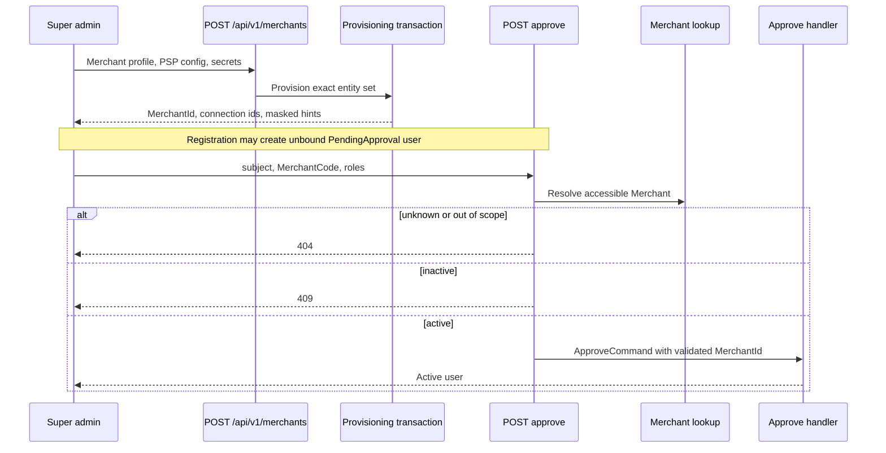

# Design: Admin Merchant Provisioning Contract

> Status: unknown

## Summary

ไม่มี production-code หรือ schema change. งานเพิ่ม durable contract ใน Merchant reference/ERD และ HTTP regression
tests สำหรับ approval boundary ที่ยังไม่มี coverage ตรง endpoint

## Existing flow

## Documentation changes

- Expand `docs/reference/merchants.md` with provisioning request/response, validation, error mapping และ provision → register → approve sequence
- Add logical `Merchants` relationships to `VaultSecrets` and `VaultRevealAudits` in canonical as-built ERD
- Document no physical FK/cascade, encrypted storage, reveal-time append และ fail-closed audit

## Regression test

Add one host test fixture using real route, admin policy, permission filter and CSRF filter. Replace only
`IAdminQuery` and `IMediator` with recording fakes:

| Scenario | Expected observable result |
|---|---|
| Merchant missing/out of scope | HTTP 404, no `ApproveCommand` dispatched |
| Merchant inactive | HTTP 409, no `ApproveCommand` dispatched |
| Merchant active | HTTP 200, dispatched command carries resolved Merchant id and submitted roles |

Domain binding, role assignment, transactionality, vault encryption and audit-chain integrity remain covered by existing
handler, architecture and integration tests; duplicate tests are not added

## Requirement Traceability

| Requirement | Design evidence |
|---|---|
| REQ-1.1–REQ-1.6 | Existing provisioning endpoint plus Merchant reference contract |
| REQ-2.1–REQ-2.4 | Existing `ProvisioningCoordinatorTests` and documented atomic boundary |
| REQ-3.1–REQ-3.6 | Existing vault tests plus ERD/reference custody section |
| REQ-4.1–REQ-4.2 | Documented register/approve sequence |
| REQ-4.3–REQ-4.5 | New HTTP approval-boundary regression fixture |
| REQ-4.6 | Explicit scope guard in requirements and reference |

