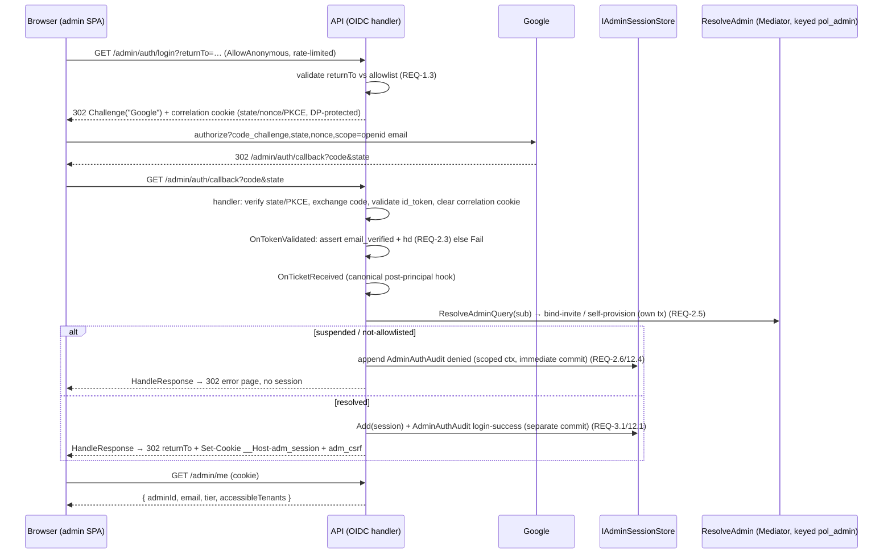

# Design: Admin OIDC Server-Side Session (BFF)

> Status: approved 2026-06-23

> Requirements-first — derived from approved `requirements.md` (approved 2026-06-23). แต่ละ design element
> map กลับ REQ ใน `## Requirement Traceability`. **Revised 2026-06-23 หลัง spec-architect critique** (P1×5,
> P2×6, P3×5 applied; P2-2 mitigation ปรับให้ feasible — ดู `## Session validation & rotation`).

## Architecture Overview

BFF บน host เดียว (`src/Hosts/Api`). reuse กลไก framework ให้มากสุด, hand-roll เฉพาะ session model ที่ requirement
บังคับ (rotation/family/reuse/revoke ที่ framework ไม่มีให้ตรง):

1. **OIDC protocol (reuse framework)** — `AddOpenIdConnect("Google")` ทำ Authorization Code + PKCE + state +
   nonce + correlation cookie + code exchange + id_token validation (JWKS เดียวกับ JwtBearer เดิม). ไม่ hand-roll
   OAuth. (REQ-1, REQ-2)
2. **Session layer (custom)** — `AdminSession` aggregate + `IAdminSessionStore` บนตาราง control-plane ใหม่
   `AdminSessions` (pol_admin only): opaque-token hash, family, status, timestamps + predecessor link. ที่อยู่ของ
   rotation / reuse-detection / revocation. (REQ-3, REQ-5, REQ-6, REQ-11)
3. **Authentication scheme (custom)** — `AdminSessionAuthenticationHandler` อ่าน cookie `__Host-adm_session`
   ทุก `/admin/*`: validate, rotate, slide idle, materialize tier/accessible (read-only), build principal. (REQ-4, REQ-9)
4. **Cross-cutting** — CSRF double-submit filter, 2 CORS policy, rate-limit auth endpoints, `AdminAuthAudits`
   (append-only), Data Protection key-ring. (REQ-7, REQ-10, REQ-1.6, REQ-12)

### Auth schemes + authorization policies (REQ-10) — **[P1-1, P1-2 fix]**

| Scheme | ใช้ที่ | กลไก |
|---|---|---|
| `Google` (OIDC) | login challenge + `/admin/auth/callback` | `AddOpenIdConnect`, confidential client. `SignInScheme` = throwaway cookie scheme `oidc-noop` (ดู Tech #1) |
| `oidc-noop` (cookie) | (ไม่เคยอ่าน) | placeholder ให้ OIDC handler มี sign-in scheme ที่ resolvable — เราข้ามผ่าน `HandleResponse` |
| `AdminSession` (cookie) | ทุก `/admin/*` ที่ต้อง auth | custom `AuthenticationHandler` อ่าน `__Host-adm_session` |
| `Bearer` (JwtBearer/Google) | tenant routes (เดิม) | `AddGoogleIdTokenAuthentication` audience `tenant` |

**Policy `admin` ต้อง redefine (ไม่ใช่แค่ re-point):** ของเดิม `admin` = `RequireAuthenticatedUser().RequireClaim("role","admin")`
authenticate ด้วย default scheme (JwtBearer). ทั้งสองเงื่อนไขใช้กับ session ไม่ได้ — session principal ไม่มี claim
`role=admin` และ default scheme กำลังถอด audience `admin`. นิยามใหม่:

```csharp
authz.AddPolicy("admin", p => p
    .AddAuthenticationSchemes("AdminSession")      // ผูก scheme ชัด ไม่พึ่ง default
    .RequireAuthenticatedUser());                  // drop RequireClaim("role",…)
// tenant policy ผูก JwtBearer ชัดเช่นกัน (ไม่พึ่ง default scheme)
```

call site `.RequireAuthorization("admin")` เดิม **ไม่ต้องแก้** (ชื่อ policy คงเดิม) — แต่ "นิยาม" เขียนใหม่ทั้งอัน (REQ-10.6).

**Principal ที่ handler คืน ต้องพก claim ที่ consumer เดิมใช้ (P1-2):**
- `admin_tier` — `AdminTierAuthorization.RequireAdminTier` (`AdminHostWiring.cs`) อ่าน `User.FindFirst("admin_tier")`.
  ต้องอยู่บน `ClaimsIdentity` ของ principal (ไม่ใช่แค่ใน `IAdminScope`) ไม่งั้น Super-only endpoint 403 หมด.
- `sub` — `POST /admin/tenants` (`Program.cs`) อ่าน `http.User.FindFirst("sub")` เป็น actor id. handler set `sub` =
  `AdminAccount.Subject`. (`IAdminScope.Current.AdminId` ยังเป็น actor หลักของ endpoint อื่น.)

`AdminResolutionMiddleware` เดิม **ถูกลบ**: bind/self-provision ย้ายไป callback (`OnTicketReceived`),
accessible-materialization + `admin_tier` ย้ายมา `AdminSessionAuthenticationHandler` (read-only, REQ-9.4).

## Sequence Diagrams

### Login + callback (REQ-1, REQ-2, REQ-3)



OnRemoteFailure (state mismatch / code-exchange fail / OAuth `error`) → AdminAuthAudit denied (scoped ctx,
immediate commit; AdminAccountId+Subject null) → 302 error page (REQ-2.1/2.7/2.8/12.4).

### Authenticated request + transparent rotation (REQ-4, REQ-5, REQ-9)

```mermaid
sequenceDiagram
    participant B as Browser
    participant H as AdminSessionAuthHandler
    participant S as IAdminSessionStore
    participant D as AdminAccounts (pol_admin)

    B->>H: GET/POST /admin/... (cookie + X-CSRF on unsafe)
    H->>S: FindByTokenHash(sha256(cookie))
    note over H,S: decision table → Active / Superseded(grace|reuse) / Revoked / not-found
    alt reuse (superseded non-immediate-predecessor OR past grace)
        H->>S: RevokeFamily(familyId) (REQ-5.3)
        H-->>B: 401 + AdminAuthAudit family-revoked-reuse
    else not-found / Revoked / expired
        H-->>B: 401 (no family action) (REQ-5.4/4.2)
    else live (Active) or immediate-predecessor within grace
        H->>D: load admin → Status/Tier/assignments (REQ-9.1 read-only)
        alt Suspended
            H-->>B: 401/403 (REQ-9.2)
        else
            H->>H: build principal: admin_tier + sub claims; bind IAdminScope
            opt Active && age ≥ rotationMinutes
                H->>S: TrySupersede via ExecuteUpdate WHERE Status=Active (winner=affected>0) (REQ-5.5)
                H->>S: insert successor (same familyId, predecessor link)
                H-->>B: Set-Cookie new __Host-adm_session + adm_csrf
            end
            H->>S: slide IdleExpires (ExecuteUpdate, lazy ≤1/min)
            H-->>B: 200
        end
    end
```

## Callback side-effects & transaction — **[P1-3, P1-4, P2-4 fix]**

ใช้ **`OnTicketReceived`** (ไม่ใช่ `OnTokenValidated`+HandleResponse) — เป็น hook canonical หลัง principal พร้อม
ก่อน framework sign-in. correlation cookie ถูก handler ล้างเองตอน callback ก่อนถึง hook นี้ (ไม่ต้อง cleanup เอง).
ใน hook resolve scoped services จาก `context.HttpContext.RequestServices`: keyed `"admin"` `ProducerDbContext`,
`IMediator`, `IClock`, `IAdminSessionStore`, `IAdminAuthAuditWriter`.

**ลำดับ + transaction (สำคัญ):**
1. `IMediator.Send(ResolveAdminQuery(sub))`; ถ้า NotFound → `BindInvitedAdminCommand` / `SelfProvisionSuperAdminCommand`
   (แต่ละตัว commit ใน tx ของตัวเองผ่าน `AdminProvisioningUnitOfWork.ExecuteInTransactionAsync`, ซึ่ง
   `ChangeTracker.Clear()` ตอนเริ่ม — จึง session **ต้องสร้างหลังจากนี้** ไม่งั้นถูก clear ทิ้ง).
2. `store.Add(session)` + `auditWriter.Append(login-success)` → `SaveChanges` (commit แยก).
3. `Set-Cookie` (session + csrf) + `Response.Redirect(returnTo)` + `context.HandleResponse()`.

**REQ-2.7 "no partial session":** provisioning (step 1) กับ session (step 2) เป็นคนละ commit. ถ้าพังหลัง step 1
ก่อน step 2 → account ถูก provision แต่ **ไม่มี session** (ไม่ใช่ session ครึ่งใบ) → idempotent: login ซ้ำ resolve
เจอ account เดิม แล้วสร้าง session ใหม่. session+login-audit (step 2) commit อะตอมมิกด้วยกัน. DB failure ใด ๆ →
แปลงเป็น denied audit + error redirect (ไม่ปล่อย 500).

**Set-Cookie ระหว่าง authentication ปลอดภัย:** `UseAuthentication` รันก่อน endpoint เขียน body → header ยังไม่ส่ง.
handler ที่เขียน cookie (callback + rotation) จึงไม่ชน response-already-started ในเส้นทางปกติ.

## Session validation & rotation — **[P2-2 mitigation, P3-2, P3-4 fix]**

decision table ของ handler ต่อ token ที่ presented (Ti = session จาก hash):

| สถานะ Ti | เงื่อนไข | การกระทำ | REQ |
|---|---|---|---|
| not found | — | 401 | 4.2 |
| `Revoked` | — | 401, ไม่แตะ family | 5.4 |
| `Active` | now ≥ idle หรือ ≥ absolute | 401 (expired) | 3.4/4.2 |
| `Active` | live | serve; ถ้า age ≥ rotation → rotate | 5.1 |
| `Superseded` | เป็น immediate predecessor ของ family's Active **และ** now ≤ SupersededAt+grace | serve (lag tolerance), ไม่ rotate | 5.2 |
| `Superseded` | ไม่ใช่ immediate predecessor (เก่ากว่า 1 ขั้น/forked) **หรือ** เกิน grace | **reuse** → RevokeFamily + 401 | 5.3 |

"immediate predecessor" ตัดสินจาก `SupersededBySessionId == family.ActiveSessionId`. ผลพลอยได้: token ที่เก่ากว่า 1
ขั้น = reuse ทันที **ไม่รอ grace** (กระชับ security กว่า time-grace ล้วน).

**Rotation concurrency (REQ-5.5):** `TrySupersedeAsync` = single `ExecuteUpdateAsync(SET Status=Superseded,
SupersededAt=now WHERE Id=@id AND Status=Active)`; affected-row-count = winner flag (ไม่ใช่ EF load-then-save →
ไม่มี lost-update). ผู้ชนะ insert successor + Set-Cookie; ผู้แพ้ (affected 0) serve ภายใต้ grace โดยไม่ rotate
ซ้ำ. READ COMMITTED พอ (row lock serialize 2 UPDATE).

**Residual false-positive ที่ยอมรับ (P2-2, ภายในกรอบ REQ-5.2):** ถ้า response ที่ทำ rotation (ตัวเดียวที่ถือ raw
token ของ successor) **สูญหาย** (user navigate away / tab sleep) client จะถือ predecessor ต่อ; เกิน grace →
family revoke → ผู้ใช้ legit ถูกบังคับ re-login. เราเก็บแค่ hash จึง **คืน successor cookie จาก request อื่นไม่ได้** —
fix แบบ "re-issue" จึง infeasible (rebut). บรรเทา: rotation age (15m) ≫ grace (60s) → rotate ไม่บ่อย; grace
ปรับผ่าน config; กรณีปกติ SPA ได้ cookie ใหม่จาก 200 response เสมอ. ยอมรับเป็น tradeoff ของ opaque rotating cookie.

## Data Models & Interfaces

### `AdminSessions` table (control-plane, schema `producer`, pol_admin only — REQ-11.1)

| Column | Type | Null | Key | Note |
|---|---|---|---|---|
| Id | uniqueidentifier | N | PK | row id (ไม่ใช่ค่า cookie) |
| FamilyId | uniqueidentifier | N | IX | rotation family; family-wide revoke (REQ-11.4) |
| TokenHash | varbinary(32) | N | UQ | SHA-256 ของ opaque token; O(1) lookup (REQ-11.2/11.4) |
| AdminAccountId | uniqueidentifier | N | IX | FK→AdminAccounts |
| Status | int | N | | `AdminSessionStatus` Active=0/Superseded=1/Revoked=2 |
| IssuedAt | datetime2 | N | | |
| IdleExpiresAt | datetime2 | N | IX | sliding (REQ-3.4/3.5); IX สำหรับ prune |
| AbsoluteExpiresAt | datetime2 | N | IX | hard cap (REQ-3.4); IX สำหรับ prune sweep |
| SupersededAt | datetime2 | Y | | grace = SupersededAt + graceSeconds (REQ-5.2) |
| SupersededBySessionId | uniqueidentifier | Y | | successor (immediate-predecessor detection) |
| CreatedIp | nvarchar(45) | Y | | audit (optional) |
| UserAgent | nvarchar(256) | Y | | audit (optional) |

ไม่เก็บ raw token / Google token (REQ-11.2). prune: sweep ลบ `AbsoluteExpiresAt < now` หรือ `Status=Revoked`
เก่ากว่า retention (REQ-11.5).

### `AdminAuthAudits` table (control-plane, append-only — REQ-12) — **[separate จาก AdminAccountAudits]**

`AdminAccountAudit` บังคับ `ActorId != Empty` (`AdminAccountAudit.cs:61`) — auth event มีกรณีไม่มี admin id (state
mismatch / not-allowlisted) จึงต้องตารางแยก.

| Column | Type | Null | Note |
|---|---|---|---|
| Id | uniqueidentifier | N | PK |
| EventType | nvarchar(32) | N | `login-success`/`logout`/`logout-all`/`rotated`/`family-revoked-reuse`/`auth-denied` |
| AdminAccountId | uniqueidentifier | Y | null เมื่อ resolve ไม่ได้ |
| Subject | nvarchar(256) | Y | Google sub เมื่อมี |
| Reason | nvarchar(128) | Y | denied reason, ไม่มี secret (REQ-12.4) |
| CorrelationId | nvarchar(128) | N | |
| OccurredAt | datetime2 | N | |

### Migration `AddAdminSessionTables` (additive, reversible — REQ-11.3) — **[P2-6 grants]**

mirror `AddAdminIdentityTables` (schema `producer`, ไม่มี RLS predicate). **grant ต่อ semantics:**
- `AdminSessions` → `GRANT SELECT, INSERT, UPDATE, DELETE` ให้ `pol_admin` (rotate/revoke = UPDATE, prune = DELETE).
- `AdminAuthAudits` → `GRANT SELECT, INSERT` เท่านั้น (append-only REQ-12.2; ไม่มี DELETE — prune แตะ session เท่านั้น).
- ไม่ grant ให้ `pol_app`. `Down` = drop 2 ตาราง + revoke, ไม่แตะ RLS policy.

### Domain + interfaces (C#)

```csharp
public enum AdminSessionStatus { Active = 0, Superseded = 1, Revoked = 2 }

public sealed class AdminSession : AggregateRoot<Guid>
{
    public Guid FamilyId { get; private set; }
    public byte[] TokenHash { get; private set; }
    public Guid AdminAccountId { get; private set; }
    public AdminSessionStatus Status { get; private set; }
    public DateTime IssuedAt { get; private set; }
    public DateTime IdleExpiresAt { get; private set; }
    public DateTime AbsoluteExpiresAt { get; private set; }
    public DateTime? SupersededAt { get; private set; }
    public Guid? SupersededBySessionId { get; private set; }

    public static AdminSession Start(Guid adminAccountId, byte[] tokenHash, DateTime now, AdminSessionPolicy p); // new family
    public AdminSession Rotate(byte[] newHash, DateTime now, AdminSessionPolicy p);   // successor, same family; marks self Superseded+link
    public bool IsLiveAt(DateTime now);                                               // Active && now<idle && now<absolute
    public bool IsImmediatePredecessorWithinGrace(Guid familyActiveId, DateTime now, TimeSpan grace);
}

public interface IAdminSessionStore
{
    Task<AdminSession?> FindByTokenHashAsync(byte[] hash, CancellationToken ct);
    Task<Guid?> GetFamilyActiveIdAsync(Guid familyId, CancellationToken ct);          // immediate-predecessor check
    void Add(AdminSession session);
    Task<bool> TrySupersedeAsync(Guid sessionId, Guid successorId, DateTime now, CancellationToken ct); // ExecuteUpdate WHERE Status=Active
    Task SlideIdleAsync(Guid sessionId, DateTime idleExpiresAt, CancellationToken ct);// ExecuteUpdate, lazy
    Task RevokeFamilyAsync(Guid familyId, CancellationToken ct);                       // reuse / logout (REQ-5.3/6.1)
    Task RevokeAllForAdminAsync(Guid adminAccountId, CancellationToken ct);            // logout-all (REQ-6.2)
    Task PruneAsync(DateTime now, CancellationToken ct);                              // sweep (REQ-11.5)
}
```

`AdminSessionPolicy` (config `AdminSession:*`): `IdleMinutes`(1440), `AbsoluteHours`(168), `RotationMinutes`(15),
`GraceSeconds`(60), `SameSite`(Lax|None), `ReturnUrlAllowlist`[]. `PreAuthTtlMinutes`(10) ผูก OIDC correlation.

### Endpoints (minimal API) — **[P2-5: login/callback AllowAnonymous, ยกเว้น CSRF/credentialed-CORS]**

จัด `/admin` เป็น **route group** เดียว (refactor endpoint เดิมเข้า group — prefix เดิมอยู่แล้ว) เพื่อผูก
group-level `RequireCors("pol-admin-spa")` + `RequireAuthorization("admin")` + CSRF filter ครั้งเดียว.

| Route | Auth | Note |
|---|---|---|
| `GET /admin/auth/login` | AllowAnonymous, rate-limited, **ไม่ CSRF/credentialed-CORS** | validate returnTo → `Results.Challenge("Google")` |
| `GET /admin/auth/callback` | OIDC handler CallbackPath, AllowAnonymous | top-level GET จาก Google (ไม่มี X-CSRF — filter ข้าม GET) |
| `POST /admin/auth/logout` | AdminSession + CSRF | `RevokeFamily(current)` + clear cookie → 204 |
| `POST /admin/auth/logout-all` | AdminSession + CSRF | `RevokeAllForAdmin` → 204 |
| `GET /admin/me` + `/admin/*` เดิม | AdminSession (+CSRF unsafe) | เปลี่ยนแค่ scheme |

### Cookies — **[P2-1, P3-1: แยก correlation vs session + dev-http]**

| Cookie | ใคร set | attrs | หมายเหตุ |
|---|---|---|---|
| correlation (state/nonce/PKCE) | OIDC handler | `SameSite=None; Secure; HttpOnly` (ต้องรอด cross-site redirect กลับจาก Google), DP-protected, อายุ=PreAuthTtl | dev http → handler ตั้ง `SecurePolicy=SameAsRequest`; localhost ใช้ได้ |
| `__Host-adm_session` | callback + rotation | `HttpOnly; Secure; Path=/; SameSite=Lax` (same-site) / `None` cross-site (REQ-3.2/7.4); opaque 256-bit | lookup = `SHA256(token)`→TokenHash |
| `adm_csrf` | callback + rotation | non-HttpOnly; Secure; Path=/; SameSite ตามข้างบน | double-submit (REQ-7.1) |

**dev-http shim (REQ-3.3):** เมื่อ `IsDevelopment()` + http → session/csrf ถอด `Secure` + ใช้ชื่อไม่มี `__Host-`
prefix (prefix บังคับ Secure → browser ปฏิเสธบน http). prod/non-Dev คง `__Host-`+Secure เสมอ.

## Technology Decisions

1. **OIDC handler (framework) — dep ใหม่ `Microsoft.AspNetCore.Authentication.OpenIdConnect`** (first-party,
   MIT, maintained, pin align .NET 10 ใน `Directory.Packages.props`). reuse state/nonce/PKCE/code-exchange/JWKS;
   ไม่ hand-roll OAuth. **ต้องขออนุมัติ dep ตาม Dependency rules.** ใช้ `OnTicketReceived` + `HandleResponse` เขียน
   session cookie เอง; `SignInScheme` = throwaway cookie `oidc-noop` (resolvable แต่ไม่ถูกเรียกเพราะ HandleResponse
   ตัดก่อน sign-in). **ต้นทุนของ choice นี้:** บังคับมี Data Protection (Tech #5). *Fallback ถ้า dep ถูกปฏิเสธ:*
   hand-roll authorize-redirect + token POST + reuse `Microsoft.IdentityModel` validate + เก็บ pre-auth state
   server-side (ตัด DP ทิ้งได้) — custom security code มากขึ้นแลกกับไม่มี dep/DP.
2. **Custom session แทน `AddCookie`+`ITicketStore`** — family-rotation + reuse-detection + grace ไม่ map เข้า
   lifecycle ของ cookie handler สะอาด; custom ให้ semantics ตรง + unit-test ง่ายกว่า.
3. **Token hash = SHA-256 ของ 256-bit random** (ไม่ใช่ password → ไม่ต้อง bcrypt/argon; entropy พอ). **ตัด optional
   pepper ทิ้ง (P2-7):** `VaultEnvelope` เป็น AES-GCM nonce-random → ไม่ deterministic, lookup ไม่ได้; ทำ pepper
   ต้องเป็น HMAC ซึ่งเพิ่มภาระ key-rotation (dual-read) โดย REQ-11.2 ขอแค่ hash. ไม่คุ้ม — ใช้ SHA-256 ล้วน.
4. **Persistence reuse keyed `"admin"` `ProducerDbContext`** (`AddTenantAdminScope`) — session store/audit
   control-plane เหมือน AdminAccounts; EF config + migration grant mirror `AddAdminIdentityTables`.
5. **Data Protection = code element ที่ต้องเพิ่ม (P2-3)** — OIDC correlation/state พึ่ง DP; repo ยังไม่มี
   `AddDataProtection` เลย. เพิ่ม `AddDataProtection()` + persist key ring ผ่าน **custom `IXmlRepository` บน keyed
   admin `ProducerDbContext`** (ไม่เพิ่ม dep; ~ตาราง `DataProtectionKeys` control-plane) หรือ blob mount.
   **boot guard** (pattern เดียวกับ audience/secret REQ-8.2): non-Dev ที่ key ring เป็น ephemeral → fail-fast.
   ผลต่อ integration test: WebApplicationFactory ต้อง seed/persist DP keys คงที่ ไม่งั้น correlation flaky.
6. **2 CORS policy (P1-5)** — `pol-admin-spa` (admin origin, `AllowCredentials`, `AllowAnyHeader/Method`, origin
   **explicit pin** — credentials ห้ามคู่ wildcard) ผูกที่ `/admin` route group ด้วย `RequireCors`; `pol-tenant-spa`
   (tenant origin, no credentials) เป็น default ของที่เหลือ. `UseCors` คงไว้ก่อน `UseAuthentication` (preflight
   OPTIONS ตอบจาก endpoint CORS metadata ก่อน auth challenge). แทน single global policy เดิม (REQ-10.5).
   Architecture.Test: `/admin/*` ผูก `pol-admin-spa`.
7. **Rate limit auth endpoints (REQ-1.6)** — partitioned limiter keyed by source IP บน `/admin/auth/login` +
   callback, mirror `WebhookRateLimiting`.
8. **Idle-slide lazy write** — `SlideIdleAsync` (ExecuteUpdate) persist ≤ 1/นาที หรือตอน rotate; per-request RBAC =
   read (REQ-9). admin traffic ต่ำ → 1 session-read + 1 admin-read/req รับได้.
9. **Cookie default `SameSite=Lax`** (assume same-site, open Q3) + config switch `None` cross-site (REQ-7.4).
10. **Policy `admin` redefinition (P1-1)** + handler-emitted `admin_tier`/`sub` claims (P1-2) — ดู Architecture Overview.

## Error Handling Strategy

| กรณี | จุดจับ | ผล | REQ |
|---|---|---|---|
| returnTo นอก allowlist | login endpoint | ใช้ default landing | 1.3 |
| state/nonce mismatch, code-exchange fail | OIDC `OnRemoteFailure` | no session, denied audit (scoped ctx commit), 302 error | 2.1/2.7/12.4 |
| OAuth `error` callback | `OnRemoteFailure`/`OnAccessDenied` | no session, denied audit, 302 error | 2.8/12.4 |
| email_verified=false / hd mismatch | `OnTokenValidated`→`Fail` | no session, denied audit | 2.3/12.4 |
| admin suspended / uninvited / not-allowlisted | `OnTicketReceived` resolve | 403, no session, denied audit | 2.6/12.4 |
| **DB/infra failure ระหว่าง callback write** | `OnTicketReceived` try/catch | denied audit + 302 error (ไม่ปล่อย 500); account อาจ provisioned แต่ไม่มี session (idempotent) | 2.7 |
| no/invalid/expired/revoked session cookie | auth handler | 401, no fallthrough | 4.2/5.4 |
| reuse (non-immediate-predecessor / past grace) | auth handler | RevokeFamily + 401 + audit | 5.3/12.1 |
| suspended admin, valid session | auth handler (per-request) | 401/403 | 6.3/9.2 |
| unsafe method, CSRF mismatch | CSRF filter (ข้าม GET + auth endpoints) | 403 | 7.2 |
| client_secret / DP key-ring unset (non-Dev) | boot guard | fail-fast | 8.2 |

ทุก error = RFC7807 ProblemDetails (`UseStatusCodePages`/`AddProblemDetails` เดิม). ไม่ log
secret/token/code/raw-session-id (REQ-8.3).

## Testing Strategy

**Unit (co-located, core logic):**
- `AdminSession`: Start/Rotate, `IsLiveAt` (idle+absolute), immediate-predecessor+grace, SupersededBy link — REQ-3.4/3.5/5.1/5.2.
- decision table (Active/Superseded-grace/Superseded-reuse/Revoked/not-found) — REQ-5.3/5.4.
- returnTo allowlist — REQ-1.3; CSRF double-submit — REQ-7.2; token gen + SHA-256 (raw never stored) — REQ-11.2.

**Integration (SQL :11434, stubbed Google OIDC issuing signed id_tokens; DP keys seeded fixed — P2-3):**
- login→callback→session→/admin/me; returnTo honored — REQ-1/2/3/4.
- **Super-only endpoint ผ่านด้วย session** (`admin_tier` claim บน principal) — P1-2 regression — REQ-8.1.
- reuse: superseded non-immediate-predecessor หรือ past-grace → family revoked, members 401 — REQ-5.3.
- rotation: age≥15m → cookie ใหม่; concurrent rotate (2 parallel) → exactly one successor (ExecuteUpdate count) — REQ-5.5.
- revocation: logout / logout-all / suspend → next request 401 — REQ-6.
- denied paths (+ audit row exists): bad state (OnRemoteFailure), email_verified=false, hd mismatch, suspended, OAuth error — REQ-2/12.4.
- CORS: admin-origin credentialed XHR ok + preflight ตอบก่อน auth; tenant policy credential-less ไม่แตะ — REQ-10.5.
- rate-limit login/callback — REQ-1.6; id-token bearer ถูกปฏิเสธบน `/admin/*` — REQ-4.4/10.2.

**Property-based (pbt-runner):**
- revoked/expired/reuse token ไม่เคย authenticate — REQ-4.2/5.
- หลัง family-revoke ไม่มี member authenticate — REQ-5.3.
- ≤ 1 Active ต่อ family ตลอด rotate sequence — REQ-5.5.

**Architecture.Tests:**
- `/admin/*` (ยกเว้น login+callback) gate scheme `AdminSession` ไม่ใช่ `Bearer`; ไม่มี admin route รับ Google bearer — REQ-4.4/10.1/10.4.
- `/admin/*` ผูก CORS `pol-admin-spa` — REQ-10.5.

## Non-Functional Considerations

- **Data Protection key ring (code + ops):** custom `IXmlRepository` บน keyed admin context (control-plane table)
  หรือ blob; non-Dev fail-fast ถ้า ephemeral. ต้อง persist+shared ข้าม instance (Tech #5).
- **Confidential client:** Google "Web application" client ใหม่ (มี secret) แยกจาก public SPA client เดิม;
  redirect_uri = `{api-origin}/admin/auth/callback` register; secret ใน env/Vault (REQ-8).
- **Throughput:** per-request = 1 session read + 1 admin read; write เฉพาะ rotate (~ทุก 15m) + idle-slide (≤1/min).

## Requirement Traceability

| Section | REQ |
|---|---|
| OIDC login challenge + PKCE/state/nonce + returnTo allowlist + rate limit + scope/no-offline | REQ-1.1, REQ-1.2, REQ-1.3, REQ-1.4, REQ-1.5, REQ-1.6 |
| login-while-authed → new family (multi-session); correlation cookie per attempt | REQ-1.7 |
| OIDC callback: state verify, code exchange, id_token validate, email_verified/hd, derive sub/email | REQ-2.1, REQ-2.2, REQ-2.3, REQ-2.4, REQ-2.7 |
| `OnTicketReceived` → ResolveAdmin bind/self-provision; deny suspended/uninvited; OAuth error; DB-failure handling | REQ-2.5, REQ-2.6, REQ-2.8 |
| `AdminSessions` record + cookie attrs + dev-http shim + idle/absolute lifetime + Google-independent | REQ-3.1, REQ-3.2, REQ-3.3, REQ-3.4, REQ-3.5, REQ-3.6 |
| `AdminSessionAuthenticationHandler` (load/validate, 401, `/admin/me`, bearer retired, CORS creds, principal claims) | REQ-4.1, REQ-4.2, REQ-4.3, REQ-4.4, REQ-4.5 |
| decision table + `Rotate` + immediate-predecessor grace + reuse→`RevokeFamily` + Revoked→401 + ExecuteUpdate supersede | REQ-5.1, REQ-5.2, REQ-5.3, REQ-5.4, REQ-5.5 |
| logout / logout-all endpoints + suspend-via-per-request + revoke-next-request | REQ-6.1, REQ-6.2, REQ-6.3, REQ-6.4 |
| `adm_csrf` double-submit filter (skip GET/auth endpoints) + SameSite Lax/None | REQ-7.1, REQ-7.2, REQ-7.3, REQ-7.4 |
| client_secret + DP key-ring from config/Vault + boot fail-fast + no-log | REQ-8.1, REQ-8.2, REQ-8.3 |
| per-request read-only resolution Status/Tier/accessible into `IAdminScope` + `admin_tier` claim | REQ-9.1, REQ-9.2, REQ-9.3, REQ-9.4 |
| policy `admin` redefine + 2 schemes + retire `admin` audience + tenant unchanged + 2 CORS policy | REQ-10.1, REQ-10.2, REQ-10.3, REQ-10.4, REQ-10.5, REQ-10.6 |
| `AdminSessions` control-plane grant (S/I/U/D) + hash-only + migration + indexes + prune | REQ-11.1, REQ-11.2, REQ-11.3, REQ-11.4, REQ-11.5 |
| `AdminAuthAudits` (S/I only) append-only (login/rotate/logout/family-revoke/denied) + no-secret | REQ-12.1, REQ-12.2, REQ-12.3, REQ-12.4 |
| rewrite `admin-google-sso.md` + `entity-fields.md` + canon (`CODING_STANDARDS.md` Identity bullet, `ARCHITECTURE.md` cross-cutting Identity bullet) | REQ-13.1, REQ-13.2, REQ-13.3 |
