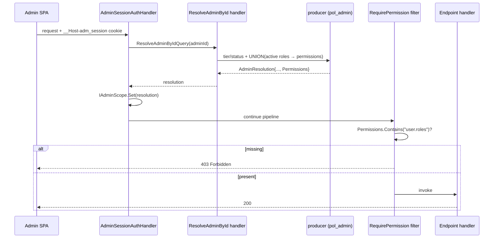
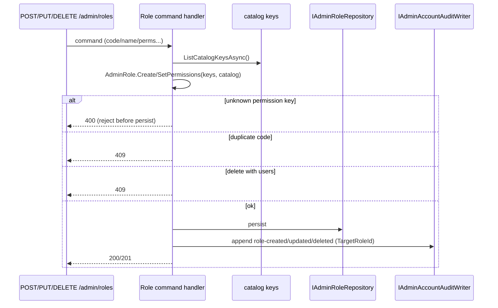
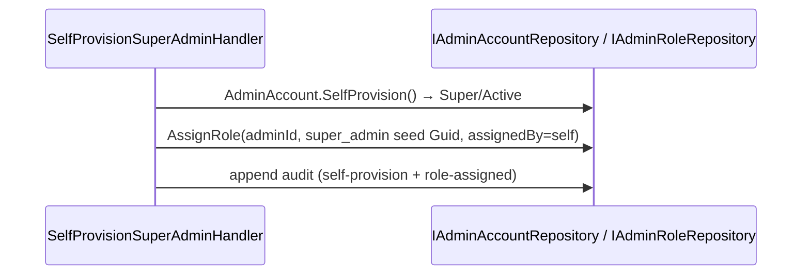

# Design: Admin Role RBAC

> Status: approved 2026-06-24
> Notes:, amended 2026-06-24 (AFK-delegated; spec-architect adversarial critique applied — see Critique Resolutions)

## Architecture Overview

Purely **additive** layer on the existing Admin module (control plane, schema `producer`, `pol_admin`
principal, no RLS predicate). It introduces a second authorization axis — **role → permission** — orthogonal
to the untouched `AdminTier` tenant-reach axis. Nothing in the tier path (`RequireAdminTier`,
`AccessibleTenants`, `IAdminQuery` floor) changes (REQ-7).

New pieces, by layer (each mirrors an existing Admin sibling so the module's conventions are preserved):

- **Domain** (`Admin.Domain`): `AdminRole` aggregate (mirrors `AdminAccount`), `AdminRoleStatus` enum
  (mirrors `AdminStatus`), `AdminRoleAssignment` entity (mirrors `AdminTenantAssignment`). Permission keys
  are validated against a catalog passed in (domain stays persistence-ignorant).
- **Catalog** = reference data in DB, not code: `AdminPermissionGroups` + `AdminPermissions`. The set is
  **feature-sourced** — seeded initially, extended by each feature's own migration (REQ-1).
- **Application** (`Admin.Application`): `IAdminRoleRepository` + CQRS handlers (Create/Update/Delete role,
  AssignRoles, ListRoles, GetRole, ListPermissions). `AdminResolution` gains an effective-permission set,
  materialized in both resolution handlers (REQ-5).
- **Host** (`Hosts/Api`): `RequirePermission` endpoint filter (mirrors `RequireAdminTier`), a startup
  **parity guard** asserting every gated key exists in the catalog (REQ-11), new `/admin/roles`,
  `/admin/permissions`, `/admin/admins/{id}/roles` endpoints, and `/admin/me` extended with `permissions`.
- **Bootstrap**: `SelfProvisionSuperAdminHandler` also assigns the seed `super_admin` role (REQ-8).

```
request → AdminSessionAuthenticationHandler (existing)
            ├─ resolve AdminResolution { AdminId, Email, Tier, Accessible, Permissions(NEW) }
            └─ bind IAdminScope
          → endpoint filter RequirePermission("user.roles") reads IAdminScope.Current.Permissions
          → handler (CQRS via Mediator) → IAdminRoleRepository (pol_admin ProducerDbContext)
```

## Sequence Diagrams

### Per-request resolution + permission gate (REQ-5, REQ-6)


### Role mutation with audit (REQ-2, REQ-3, REQ-10)


### Bootstrap (REQ-8)


## Data Models & Interfaces

### Tables (schema `producer`, control-plane, granted to `pol_admin`, no RLS predicate)
| table | columns | keys |
|---|---|---|
| `AdminPermissionGroups` | `Key` nvarchar(32), `LabelTh` nvarchar(128), `SortOrder` int | PK(Key) |
| `AdminPermissions` | `Key` nvarchar(64), `GroupKey` nvarchar(32), `LabelTh` nvarchar(160), `SortOrder` int | PK(Key), FK GroupKey→AdminPermissionGroups |
| `AdminRoles` | `Id` uniqueidentifier, `Code` nvarchar(64), `Name` nvarchar(128), `Description` nvarchar(256), `Color` nvarchar(16), `Status` int | PK(Id), UNIQUE(Code) |
| `AdminRolePermissions` | `RoleId` uniqueidentifier, `PermissionKey` nvarchar(64) | PK(RoleId,PermissionKey), FK RoleId→AdminRoles, FK PermissionKey→AdminPermissions.Key |
| `AdminRoleAssignments` | `Id`, `AdminAccountId`, `RoleId`, `AssignedByAdminId`, `AssignedAt` | PK(Id), UNIQUE(AdminAccountId,RoleId), FK RoleId→AdminRoles |
| `AdminAccountAudits` (existing) | + `TargetRoleId` uniqueidentifier NULL | additive column |

Catalog tables hold reference data (no domain behavior). `AdminRolePermission` is a **standalone child join
entity** (composite PK `RoleId`+`PermissionKey`, FK→`AdminRoles` and FK→`AdminPermissions.Key`), loaded with the
role and diffed by the repository on update — NOT an EF owned primitive collection (S3). `AdminRoleAssignments`
mirrors `AdminTenantAssignment` exactly (standalone `Entity<Guid>`).

### Seed (initial catalog — REQ-1.3, REQ-2.5; matches `pol-admin/src/lib/mock/producer-role.ts`)
Groups (SortOrder): `txn`(1) `merchant`(2) `finance`(3) `user`(4) `system`(5).
Permissions: `txn.view/refund/export` (txn) · `merchant.view/manage` (merchant) ·
`invoice.view/manage`,`settlement.run` (finance) · `user.view/manage/roles` (user) ·
`audit.view`,`settings.manage`,`apikey.manage` (system) = 14.
Roles: `super_admin`(active, all 14, **stable Guid** `0000…` documented in migration) · `ops_admin`(active:
txn.view/refund/export, merchant.view/manage, user.view) · `finance`(active: txn.view/export,
invoice.view/manage, settlement.run) · `support`(active: txn.view, merchant.view, user.view) ·
`auditor`(**inactive**: txn.view, invoice.view, audit.view).

### Domain (mirror `AdminAccount.cs` / `AdminStatus.cs` / `AdminTenantAssignment.cs`)
```csharp
public enum AdminRoleStatus { Active = 0, Inactive = 1 }

public sealed class AdminRole : AggregateRoot<Guid> {
    public string Code { get; private set; }          // immutable after Create (REQ-2.4)
    public string Name { get; private set; }
    public string Description { get; private set; }
    public string Color { get; private set; }
    public AdminRoleStatus Status { get; private set; }
    public IReadOnlyCollection<string> Permissions => _permissions;   // standalone AdminRolePermission rows (S3)

    public static AdminRole Create(string code, string name, string description, string color,
        IEnumerable<string> permissionKeys, IReadOnlySet<string> catalogKeys);   // throws on unknown key / empty code|name
    public void Rename(string name); public void SetDescription(string d); public void SetColor(string c);
    public void SetPermissions(IEnumerable<string> keys, IReadOnlySet<string> catalogKeys);  // reject unknown (REQ-3.3)
    public void Activate(); public void Deactivate();   // Deactivate throws for the super_admin seed (REQ-8.3)
}
```
`SetPermissions`/`Create` reject any key ∉ `catalogKeys` (trust boundary — the server rejects, the FE only
filters). `Code`/`Name` trimmed, non-empty, `Code` ≤64.

### Application
```csharp
public interface IAdminRoleRepository {
    Task<AdminRole?> GetByCodeAsync(string code, CancellationToken ct);
    Task<IReadOnlyList<AdminRoleListItem>> ListAsync(CancellationToken ct);      // includes userCount
    Task<int> CountAssignmentsAsync(Guid roleId, CancellationToken ct);
    Task AddAsync(AdminRole role, CancellationToken ct);
    Task RemoveAsync(AdminRole role, CancellationToken ct);
    Task SetAdminRolesAsync(Guid adminId, IReadOnlySet<Guid> roleIds, Guid assignedBy, DateTime at, CancellationToken ct);
    Task<IReadOnlySet<string>> ListCatalogKeysAsync(CancellationToken ct);
    Task<PermissionCatalog> ListCatalogAsync(CancellationToken ct);             // groups + permissions
    Task<IReadOnlySet<string>> ListEffectivePermissionsAsync(Guid adminId, CancellationToken ct);  // UNION active roles (LINQ; EF supplies producer schema)
    Task<bool> AssignmentExistsAsync(Guid adminId, Guid roleId, CancellationToken ct);  // idempotent bootstrap/assign (S1)
}   // NO SaveChangesAsync — commit via keyed IUnitOfWork.ExecuteInTransactionAsync (S2)
```
CQRS (Mediator, mirrors existing admin commands): `CreateRoleCommand`, `UpdateRoleCommand`,
`DeleteRoleCommand`, `SetAdminRolesCommand`, `ListRolesQuery`, `GetRoleQuery`, `ListPermissionsQuery`.
`DeleteRoleCommand` returns conflict when `CountAssignmentsAsync > 0` (REQ-4.4). Role handlers do NOT call a
repository `SaveChangesAsync`; they commit via `[FromKeyedServices("admin")] IUnitOfWork.ExecuteInTransactionAsync`
(one transaction per request, mirroring `AssignTenantHandler`/`SuspendAdminHandler`) and append audit via
`IAdminAccountAuditWriter.Append` inside that same transaction (B4/S2).

`AdminResolution` gains `Permissions` as a NON-positional `init` property defaulting to an empty set —
`public IReadOnlySet<string> Permissions { get; init; } = EmptyPermissions;` — so the **4 existing positional
`new AdminResolution(...)` call sites** (`ResolveAdmin.cs:42`, `ResolveAdminById.cs:35`, and BOTH in
`SelfProvisionSuperAdmin.cs:49,59`) keep compiling untouched. Only `ResolveAdminHandler` (by subject) and the
`ResolveAdminByIdQuery` handler set it via `resolution with { Permissions = await ListEffectivePermissionsAsync(...) }`
(B1).

### Effective-permission query (REQ-5.1)
```sql
SELECT DISTINCT rp.PermissionKey
FROM AdminRoleAssignments a
JOIN AdminRoles r ON r.Id = a.RoleId AND r.Status = 0   -- Active only
JOIN AdminRolePermissions rp ON rp.RoleId = r.Id
WHERE a.AdminAccountId = @adminId;
```

### Host — enforcement (mirror `AdminTierAuthorization`)
```csharp
RequirePermission(this RouteHandlerBuilder b, string permission)
// fail-closed: 403 unless scope.IsBound && scope.Current.Permissions.Contains(permission) — never throw 500 if unbound (S4)
```
`RequirePermission` attaches a `RequiredAdminPermission(permission)` to the endpoint metadata (and the
enforcement filter). The parity guard is an **inline boot assertion** (`AdminPermissionParity.Assert`) called
right before `app.Run()`: it enumerates `EndpointDataSource.Endpoints`, collects every `RequiredAdminPermission`
key, and asserts each is in the **code-canonical** `AdminPermissions.AllKeys` (the same vocabulary the migration
seeds the DB from) — throwing (host fails to boot) if any gate references an unknown key (REQ-11). This is
**in-memory, no DB at boot** (the host already fails fast on a missing admin credential at `Program.cs:94`, and
host-tests boot without a live pol_admin DB), and not a `BackgroundService` whose `ExecuteAsync` would not abort
boot (B3). An integration test asserts the seeded DB catalog rows equal `AdminPermissions.All`, so the code
vocabulary and the DB catalog provably never drift.

### API contracts (shapes the FE already renders — `pol-admin/src/types/producer-role.ts`)
| method | path | gate | body / response |
|---|---|---|---|
| GET | `/admin/permissions` | authed admin | `{ groups:[{key,label}], permissions:[{key,label,resource}] }` ordered by SortOrder |
| GET | `/admin/roles` | authed admin | `Role[]` = `{code,name,description,color,status,permissions[],userCount}` |
| GET | `/admin/roles/{code}` | authed admin | `Role` |
| POST | `/admin/roles` | `user.roles` | body `{code,name,description,color,status,permissions[]}` → 201 / 409 / 400 |
| PUT | `/admin/roles/{code}` | `user.roles` | body `{name,description,color,status,permissions[]}` (no code) → 200 / 400 |
| DELETE | `/admin/roles/{code}` | `user.roles` | → 204 / 409(has users) |
| PUT | `/admin/admins/{adminId}/roles` | `user.roles` | body `{roleCodes:string[]}` → 200 |
| GET | `/admin/me` | authed admin | existing + `permissions: string[]` (effective) |

`status` serializes as `"active"`/`"inactive"` via **explicit projection** — there is NO global string-enum
converter in the Api host, so the minimal-API default serializes enums as integers; handlers map the enum to the
lowercase string on output and parse it on input (mirrors how `/admin/me` does `Tier.ToString()`). `resource` in the
permissions array = the permission's `GroupKey` (no extra column). Enum stored as int. (B2/S5)

## Technology Decisions

- **Catalog in DB, not enum** — required for unlimited feature-sourced growth (REQ-1); each feature seeds its
  own permissions via migration. FK from grants → catalog gives integrity for free.
- **Permission check from `IAdminScope`, not claims** — effective set can reach 14+ keys; per-request scope
  is already bound and is the fresh source of truth, avoiding claim bloat and stale-claim risk. Mirrors how
  endpoints already read `scope.Current`.
- **Parity guard as hosted service** — endpoint gates register their keys at map time; the check runs once at
  startup after the graph is built, failing fast on an orphan gate (REQ-11) without per-request cost.
- **Standalone join entity for role permissions** — `AdminRolePermission` (composite PK, FK→catalog) loaded
  with the role and diffed on save, matching the module's standalone-entity style (`AdminTenantAssignment`) and
  giving FK integrity to the catalog (REQ-3.2) without EF owned-primitive-collection complexity (S3).
- **`super_admin` seed = recovery anchor** — stable Guid + undeletable-while-assigned (always assigned to the
  first Super by REQ-8.1) + deactivation guard (REQ-8.3) prevents total role-management lockout without a
  bespoke "last privileged admin" computation.
- **No new module / port to other modules** — roles are control-plane Admin concern; Architecture.Tests
  boundary unchanged (REQ-7.3).

## Error Handling Strategy

| condition | response | REQ |
|---|---|---|
| create role, duplicate `Code` | 409 Conflict | 2.3 |
| create/update role, permission key ∉ catalog | 400 Bad Request (no persist) | 3.3 |
| update attempts to change `Code` | `Code` simply not read from body (immutable) | 2.4 |
| delete role with ≥1 assignment | 409 Conflict | 4.4 |
| deactivate `super_admin` seed | 400/409 (domain throws) | 8.3 |
| gated request missing permission | 403 Forbidden, handler not run | 6.2 |
| startup: gate key absent from catalog | throw in StartAsync → app fails to boot | 11.2 |
| unknown role `{code}` on GET/PUT/DELETE | 404 Not Found | — |
| assign roles, unknown role code in body | 400 Bad Request (no write) | 4.2 (S7) |
| gated route reached unauthenticated (scope unbound) | 403 Forbidden (fail-closed, not 500) | 6.2 (S4) |

Domain invariants throw; command handlers translate to the documented HTTP status. Permission validation
happens BEFORE any persistence so a rejected mutation leaves no partial state.

## Testing Strategy

- **Unit (pure domain, co-located)** — `AdminRole` invariants: empty/over-long code rejected, code immutable
  after create, `SetPermissions`/`Create` reject unknown keys, `super_admin` deactivation guard
  (REQ-2.1–2.4, 3.3, 8.3). Effective-permission union over active roles as pure logic (REQ-5.1–5.4).
- **Integration (real SQL Server :11434, `pol_admin`)** — seed present (5 groups/14 perms/5 roles, REQ-1.3,
  2.5); catalog + grant FK integrity (REQ-1.2, 3.2, 12.1); role CRUD round-trip incl. 409 duplicate (2.3) and
  409 delete-with-users (4.4); `SetAdminRolesAsync` idempotent set-equality (4.2); effective union excludes
  inactive roles (5.1–5.2); `GET /admin/permissions` ordered shape (1.5); catalog extends when a new perm row
  is inserted (1.4); bootstrap Super gets `super_admin` (8.1); `/admin/me` includes permissions (9.1); audit
  rows on role events (10.1–10.2).
- **Host / WAF** — `RequirePermission` returns 403 without the key and 200 with it (6.1–6.2); mutation
  endpoints gated by `user.roles` (6.3); read endpoints need only auth (6.4); parity guard fails boot when a
  gate references an unseeded key (11.1–11.2).
- **Architecture** — Admin module dependency boundary intact; no other host type sends role commands
  cross-module; tier path untouched (7.1–7.3).

## Requirement Traceability

| design element | REQ |
|---|---|
| `AdminPermissionGroups` + `AdminPermissions` tables, FK, seed, `GET /admin/permissions` | REQ-1.1–1.5 |
| `AdminRole` aggregate, `Code` unique/immutable, status, seed roles, CRUD endpoints | REQ-2.1–2.5 |
| `AdminRolePermissions` owned set, FK→catalog, `SetPermissions` reject unknown | REQ-3.1–3.3 |
| `AdminRoleAssignment`, `SetAdminRolesAsync`, userCount, delete-with-users guard | REQ-4.1–4.4 |
| `ListEffectivePermissionsAsync` union over active roles, materialize into scope | REQ-5.1–5.4 |
| `RequirePermission` filter, 403, `user.roles` on mutations, auth-only reads | REQ-6.1–6.4 |
| additive layer; tier path + Architecture.Tests untouched; no tier→permission implication | REQ-7.1–7.3 |
| `SelfProvisionSuperAdminHandler` assigns seed role; stable Guid; deactivation guard | REQ-8.1–8.3 |
| `/admin/me` + `permissions` | REQ-9.1 |
| audit role events + `TargetRoleId` column | REQ-10.1–10.2 |
| `IAdminPermissionRegistry` + `AdminPermissionParityCheck` hosted service | REQ-11.1–11.2 |
| control-plane tables, `pol_admin` grants, append-only audits | REQ-12.1–12.2 |

## Critique Resolutions (spec-architect — all BLOCKER + SHOULD-FIX applied)

- **B1 — `AdminResolution` positional record (4 call sites):** add `Permissions` as a non-positional `init`
  property with an empty-set default; the 4 `new AdminResolution(...)` sites compile unchanged; only the
  by-subject and by-id resolve handlers set it via `with`. (Patched in Application section.)
- **B2 — enum serialization:** no global string-enum converter in the Api host (minimal-API default = enum as
  int); project `status` ↔ `"active"/"inactive"` explicitly; `resource` in `/admin/permissions` = `GroupKey`.
- **B3 — parity guard (refined):** an INLINE boot assertion (`AdminPermissionParity.Assert` before `app.Run()`)
  over `EndpointDataSource` `RequiredAdminPermission` metadata against the code-canonical `AdminPermissions.AllKeys`
  — in-memory, no boot DB (avoids crashing host-tests / blank-credential boots), still fail-fast. A sync test
  asserts the DB seed equals `AdminPermissions.All`. `AdminPermissions` (Domain) holds keys + group mapping (the
  vocabulary); the migration owns the Thai labels/sort. GET /admin/permissions still reads the DB.
- **B4 — audit column + per-table GRANTs:** `AdminAccountAudit` entity gets nullable `TargetRoleId`; its
  `For(...)` factory gains an optional `targetRoleId`; `AdminAccountAuditConfiguration` maps it; migration
  `AddColumn`. GRANTs to `pol_admin` (mirror `AddAdminIdentityTables`): `AdminPermissionGroups`/
  `AdminPermissions` = SELECT, INSERT; `AdminRoles`/`AdminRolePermissions`/`AdminRoleAssignments` = SELECT,
  INSERT, UPDATE, DELETE (role edit + permission re-set + assignment remove, REQ-2.4/4.2); `AdminAccountAudits`
  stays SELECT, INSERT (append-only, REQ-12.2).
- **S1 — idempotent bootstrap assign:** assignment write is guarded by `AssignmentExistsAsync` (mirrors
  `AssignTenantHandler`); `SelfProvisionSuperAdminHandler` assigns `super_admin` guarded on BOTH winner and
  race-loser (re-read) paths, ending with the role bound exactly once on retry/race.
- **S2 — commit pattern:** role handlers commit via `[FromKeyedServices("admin")] IUnitOfWork.ExecuteInTransactionAsync`
  with `IAdminAccountAuditWriter.Append` in the same transaction; no `SaveChangesAsync` on the repo.
- **S3 — permissions persistence:** `AdminRolePermission` standalone child join entity (composite PK, FK→catalog),
  not an EF owned primitive collection.
- **S4 — filter fail-closed:** `RequirePermission` checks `scope.IsBound` and returns 403 (not 500) when unbound.
- **S5 — seed source of truth + `resource`:** `pol-admin` is a SIBLING repo (not under pol-core); the seed
  contract is owned HERE (migration seed + a shared test constant are the source of truth, documented as
  mirroring the FE mock). `resource` = `GroupKey`.
- **S6 — lockout wording:** the recovery-anchor guarantee holds for the bootstrap account only (no code path
  creates a 2nd Super today); re-seed remains the documented fallback. Not an absolute every-Super invariant.
- **S7 — assignment by code:** `PUT /admin/admins/{adminId}/roles` body `{roleCodes:[]}`; handler resolves
  codes→ids and returns 400 on any unknown code before writing.
- **N1:** effective-permission union in LINQ (EF supplies the `producer` schema), not raw SQL.
- **N2:** `Description`/`Color` nullable (`string?`), default empty; only `Code`/`Name` required non-empty.
- **N3:** new migration uses no-`Utc` datetime column names (`AssignedAt`); do NOT copy the legacy `...Utc`
  names still visible in `AddAdminIdentityTables` (renamed later by `RenameDateColumnsDropUtc`).
