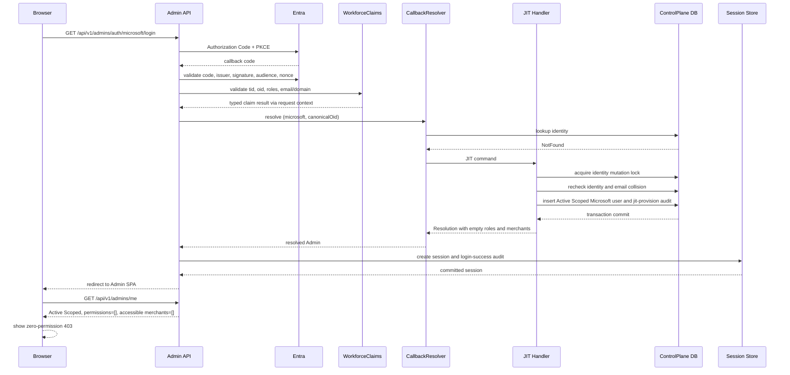
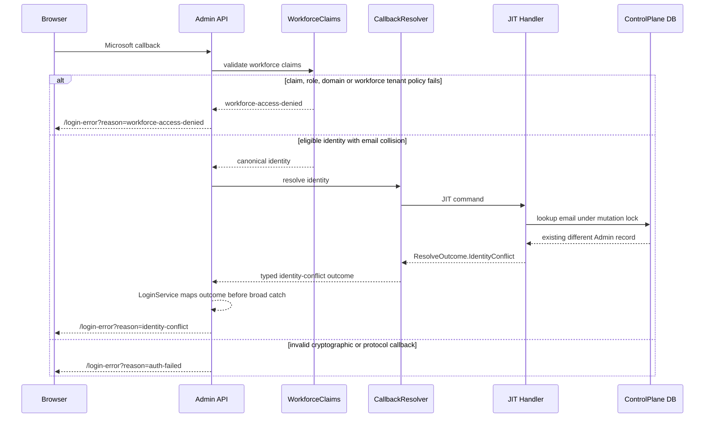
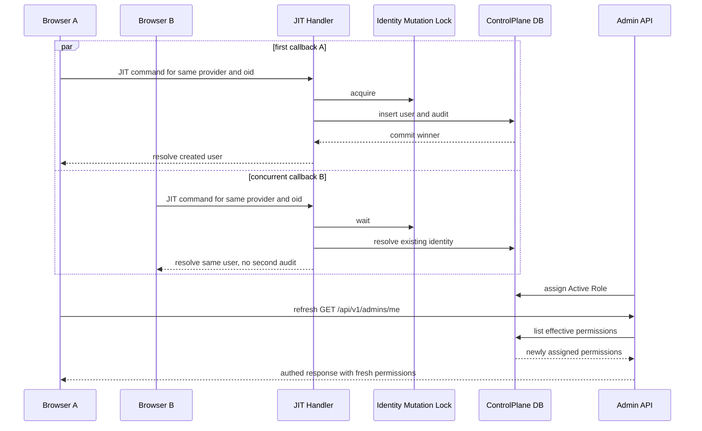

# Design: Microsoft Workforce JIT Provisioning

> Status: approved 2026-08-22

ออกแบบการเปลี่ยน Admin OIDC เป็น Microsoft-only พร้อม workforce claim gate และ atomic JIT provisioning
โดย reuse Admin identity, transaction, lock, audit, session และ RBAC primitives เดิม

## Architecture Overview

### Request boundaries

| Component | Responsibility | Boundary |
|---|---|---|
| `AdminOidcProviders` | Register เฉพาะ `AdminMicrosoft` และ map provider route ทุก environment | Host authentication |
| `MicrosoftWorkforceClaims` | Validate claims, exact role/domain, canonicalize UUID และคืน typed claim result | Pure host policy, ไม่แตะ DB |
| `CallbackResolver` | Resolve identity เดิมหรือ dispatch Microsoft JIT และส่ง typed outcome ต่อ | Host → Application |
| `JitProvisionMicrosoftAdminHandler` | สร้าง Active Scoped user แบบ atomic และคืน typed `ResolveResult` | Admin Application |
| `User` | Factory สำหรับ Microsoft-bound Scoped JIT account | Admin Domain |
| `IUserRepository` | identity/email lookup, existing mutation lock และ persistence | Control-plane persistence |
| `IAdminIdentityRecoveryReader` | เปิด fresh context หลัง transaction conflict เพื่อ re-resolve identity | Application port → Persistence |
| `ResolveHandler` | Resolve status, roles, permissions และ merchant reach สด | Admin Application |
| `AuthGuard` | แยก authenticated zero-permission state เป็นหน้า `403` | `pol-admin` |

### Backend flow

1. OIDC framework ตรวจ code exchange, signature, issuer, audience, nonce, lifetime และ state
2. `MicrosoftWorkforceClaims.Validate` คืน typed success หรือ `PolicyDenied`
3. `OnTokenValidated` เก็บ typed success ใน request context หรือส่ง typed policy failure ให้ `OnRemoteFailure`
4. `OnTicketReceived` รับ typed claim result แล้วเรียก `CallbackResolver` โดยไม่ reparse claims แบบแยก logic
5. Policy gate ปฏิเสธก่อน `CallbackResolver` หากไม่ผ่าน workforce policy
6. `CallbackResolver` resolve `(microsoft, canonicalOid)` ก่อนเสมอ
7. Existing identity ใช้ `ResolveHandler` เดิม จึงรักษา status, tier, roles และ merchant reach
8. Unknown eligible identity ส่ง `JitProvisionMicrosoftAdminCommand` เข้า application layer
9. JIT handler สร้าง user และ `AuditAction.JitProvision` audit ใน transaction เดียว
10. หลัง commit `LoginService` map typed outcome, สร้าง server sessionเฉพาะ `Resolved` แล้ว redirect กลับ Admin SPA
11. `/api/v1/admins/me` อ่าน effective permissions สดทุก request

### Frontend flow

`pol-admin` employee card เรียก Microsoft helper เดิมเพียงตัวเดียว ส่วน Merchant card ไม่เปลี่ยน
`AuthProvider` คงสถานะ `authed` พร้อม `me`; `AuthGuard` ตรวจ `me.permissions.length === 0` แล้วแสดง ErrorCard `403`
เมื่อ role assignment เสร็จ browser refresh จะเรียก `/admin/me` ใหม่และได้ effective permissions ชุดปัจจุบัน

## Sequence Diagrams

### Eligible first login



### Policy denial and identity conflict



### Concurrent first login and later role refresh



## Data Models & Interfaces

### Existing models reused

| Model | Use in this feature | Mutation |
|---|---|---|
| `Admins.Domain.Users.User` | Admin account and `(Provider, Subject)` identity | Add JIT factory only |
| `ProviderIdentity` | Provider plus subject lookup key | Canonical Microsoft `oid` |
| `Resolution` | Session authorization snapshot | Empty permissions/reach for new JIT |
| `Audit` | Append-only admin mutation audit | Add `AuditAction.JitProvision` constant |
| `AuthAudit` | Login success/denial audit | Microsoft subject remains null |
| `AdminRoleAssignment` | Later operator role assignment | No JIT row |
| `MerchantAccess` | Later merchant assignment | No JIT row |

### JIT command

```text
JitProvisionMicrosoftAdminCommand
  identity: ProviderIdentity(provider="microsoft", subject=canonicalOid)
  email: selected email or preferred_username
  correlationId: request trace identifier
```

Handler returns typed `ResolveResult` with `Resolved`, `Suspended`, `IdentityConflict` or `NotFound` outcome.
`LoginService` maps `IdentityConflict` explicitly to `identity-conflict` before its broad exception boundary.
The handler never returns raw `oid`, `tid`, token or email in an audit/error payload. The selected email is used
for the new user record and display data only.

Existing identity path does not update local email during login. The token identifier is used for eligibility;
the persisted Admin record remains the source for `/admin/me` email, avoiding an email-driven identity mutation.

### JIT transaction

1. Start existing keyed Admin unit-of-work transaction
2. Acquire existing `AcquireIdentityMutationLockAsync`
3. Read `(Provider, Subject)` with tracking
4. Return existing active resolution or suspended outcome when found
5. Read existing email under the same lock
6. Return `IdentityConflict` when another record owns selected email
7. Create `User.JitProvisionMicrosoft` with `Active`, `Scoped`, Microsoft provider and canonical subject
8. Append `Audit.For(AuditAction.JitProvision, account.Id, correlationId, occurredAt, targetAdminId: account.Id)`
9. Save user and audit together
10. On unique conflict, roll back and dispose the failed unit-of-work context
11. Call `IAdminIdentityRecoveryReader` backed by `IDbContextFactory<ControlPlaneDbContext>`
12. Re-resolve identity, roles and merchant reach from the fresh context
13. Return the same identity resolution or `IdentityConflict` without writing a second audit

The existing provider-subject and email unique indexes remain the final defense. No table or migration is added.

`IAdminIdentityRecoveryReader` is a narrow application port. Its persistence implementation owns fresh-context
lifecycle; no query or retry uses a `DbContext` that observed the failed `SaveChangesAsync`.

```text
IAdminIdentityRecoveryReader.ResolveAfterConflictAsync(
  ProviderIdentity identity,
  CancellationToken cancellationToken
) -> ResolveResult
```

The implementation opens a new control-plane context, resolves user status, roles and merchant reach, then
disposes that context before returning. The JIT handler never retries through the failed unit of work.

### Workforce claim result

`MicrosoftWorkforceClaims` is a pure result used by Admin host code:

| Field | Rule |
|---|---|
| `TenantId` | one `tid`, valid UUID, normalized lowercase `D`, equals tenant snapshot |
| `ObjectId` | one `oid`, valid UUID, normalized lowercase `D` |
| `SelectedIdentifier` | one `email`, else one `preferred_username` |
| `Roles` | `FindAll("roles")` values containing exact `vcp.employee`; missing or malformed values fail policy |
| `Domain` | exact `viriyah.co.th`, case-insensitive, no subdomain |

The helper is Admin-specific and owns scalar-claim cardinality, UUID normalization, role extraction and domain
comparison. Shared `MicrosoftOidc` behavior used by Merchant authentication is not changed or extended with
workforce policy. The request context carries one typed result from `OnTokenValidated` to `OnTicketReceived`.

### Wire contracts

| Surface | Design |
|---|---|
| Microsoft login | Keep `/api/v1/admins/auth/microsoft/login` |
| Microsoft callback | Keep `/api/v1/admins/auth/microsoft/callback` |
| Google Admin login/callback | Do not map routes or register handler, framework returns `404` |
| `/api/v1/admins/me` | Existing shape, including fresh `permissions` and accessible merchants |
| Role APIs | Existing paths and wire shapes |
| Microsoft pre-provision | Existing endpoint and wire shape |
| JIT API | None, callback-only behavior |

### Typed callback outcomes

`ResolveOutcome` gains `IdentityConflict` while preserving existing `Resolved`, `Suspended` and `NotFound` values.
`LoginService` uses an explicit switch:

| Outcome | Browser reason |
|---|---|
| `Resolved` | create session and redirect |
| `Suspended` | `suspended` |
| `IdentityConflict` | `identity-conflict` |
| `NotFound` | `not-provisioned` only for unexpected non-JIT paths |

## Technology Decisions

| Decision | Choice | Rationale |
|---|---|---|
| OIDC provider | Microsoft-only for Admin in every environment | Removes Google invite/bootstrap paths and keeps Merchant provider boundary intact |
| Eligibility | Pure claim gate in Host | Rejects before user/session creation and avoids Graph dependency |
| Identity key | Existing `(Provider, Subject)` unique index | `oid` is stable while email claims can change |
| JIT orchestration | Mediator command and existing Admin unit of work | Keeps Host free of persistence and domain mutation |
| Concurrency | Existing SQL identity mutation lock plus unique indexes and fresh-context recovery port | Reuses proven race protection and avoids reads from failed EF contexts |
| Audit | Existing append-only `Audit` with `AuditAction.JitProvision` and internal actor/target IDs | No schema change and no external identity/PII in JIT audit |
| Least privilege | New user has `Scoped`, no roles, no merchant access | Tier and role remain orthogonal per Admin Role RBAC |
| Zero permissions | Session succeeds, `/me` returns empty permissions, SPA shows `403` | Supports JIT account creation without implicit privilege |
| Configuration | Register only Microsoft always, validate `Authority`, `ClientId`, `ClientSecret`, `CallbackPath` and tenant at Production boot | Prevents policy weakening through environment override |
| External integration | No Microsoft Graph | Entra token contains required claims and runtime stays deterministic |

## Error Handling Strategy

| Condition | Detection point | Result |
|---|---|---|
| Invalid signature, audience, nonce, lifetime, state or code exchange | Typed OIDC protocol failure classifier | `auth-failed`, no user/session |
| Issuer outside workforce tenant | Typed Microsoft issuer policy classifier | `workforce-access-denied`, no user/session |
| Missing/duplicate scalar claim | `MicrosoftWorkforceClaims` | `workforce-access-denied`, no user/session |
| Missing App Role or wrong domain | `MicrosoftWorkforceClaims` | `workforce-access-denied`, no user/session |
| Existing Suspended identity | `ResolveHandler` | `suspended`, no session and no JIT |
| Existing email owned by another Admin | JIT transaction and typed `IdentityConflict` outcome | `identity-conflict`, no bind/user/session/audit |
| Concurrent unique conflict | Rollback plus `IAdminIdentityRecoveryReader` fresh context | Re-resolve same identity or `identity-conflict` fail closed |
| Unexpected resolution failure | `LoginService` | Existing provider-neutral `resolve-failed` path, no session |
| JIT transaction failure | Unit of work | Roll back user/audit, no session |
| Existing Admin zero permissions | `/api/v1/admins/me` + `AuthGuard` | Authenticated `403` UI, session remains |
| Production Microsoft incomplete | `RequireWorkforceAdminProvider` before OIDC registration | Process fails before accepting requests |
| Production Google Admin enabled | Same boot guard before OIDC registration | Process fails before accepting requests |

Browser error reasons contain only stable labels. Denial audit contains correlation ID and safe reason; Microsoft
external subject remains null. JIT audit contains internal IDs only.

`MicrosoftOidcFailureClassifier` receives typed validation exceptions and event state. Issuer mismatch for a
tenant outside the configured workforce authority is `PolicyDenied`; signature, audience, nonce, lifetime, state
and code-exchange failures are `ProtocolFailure`. It never branches on `Exception.Message` and emits only the two
stable browser labels.

`RequireWorkforceAdminProvider` runs before `AddAdminOidcAuthentication`. Every environment registers only the
Microsoft Admin scheme. Production additionally requires non-empty `Authority`, `ClientId`, `ClientSecret` and
`CallbackPath`, validates tenant-pinned Authority, and rejects a non-empty Admin Google `ClientId`.

## Security and Privacy

- OIDC validation runs before any identity lookup or mutation
- `tid`, `oid`, App Role and exact domain are all required
- `email` and `preferred_username` never select an existing Admin identity
- Guest status does not bypass tenant, role or domain checks
- Suspended identities cannot be recreated by JIT
- User and JIT audit commit atomically under the existing lock
- No raw token, `oid`, `tid`, email or UPN enters JIT audit or application log
- Shared Merchant Microsoft claim behavior remains unchanged
- Existing `prompt=select_account` dirty change remains untouched

## Rollout and Rollback

### Staging

1. Create App Role value `vcp.employee`
2. Enable Enterprise App `Assignment required`
3. Directly assign employee security group
4. Apply Conditional Access and MFA policy in Entra
5. Configure tenant-pinned Microsoft Admin OIDC settings
6. Run automated tests and browser happy/negative controls

### Production cutover

Deploy `pol-admin` first, then `pol-core` in the maintenance window. Before cutover, promote
`supachaip@viriyah.co.th` through existing admin management to `Tier.Super` with `platform_admin`, preserving
existing roles. Verify Microsoft login and `vcp.employee`, enumerate/revoke existing Admin sessions with current
per-user APIs, and revoke the operator session last.

### Rollback

Rollback to previous images. No schema rollback is required. Existing JIT accounts remain stored for audit but
have no role or merchant assignment, so rollback does not grant independent access.

## Testing Strategy

### Backend unit tests

- Pure claim parser: tenant, role, exact domain, mixed case, subdomain, missing/duplicate scalar claims, Guest,
  canonical UUID and error classification
- Domain factory: Active Scoped Microsoft-bound user with no role/merchant state
- JIT handler: existing identity preservation, suspended denial, email collision, audit actor/target and rollback
- Resolution: empty effective permissions and fresh role/merchant reads
- Production guard: missing Microsoft settings and enabled Google fail fast

### Backend integration and E2E tests

- Microsoft callback eligible first login creates one user and one `jit-provision` audit
- Concurrent first login creates one identity and one JIT audit
- Existing identity preserves tier, roles, merchants and status
- Hotmail, `onmicrosoft.com`, wrong tenant, missing role and wrong domain create no user/session
- Google Admin login/callback return `404`
- Merchant Google/Microsoft login contracts remain green
- Audit rows contain internal IDs only and no external identity/PII
- Existing `/me`, role APIs and pre-provision wire contracts remain unchanged

### Frontend tests

- Employee card exposes Microsoft only
- Merchant card retains Google and Microsoft
- Error reasons `workforce-access-denied` and `identity-conflict` render correct copy
- Legacy error copy is provider-neutral
- AuthGuard shows `403` when authenticated `permissions=[]`
- Refresh after role assignment uses new effective permissions
- Existing logout behavior remains green

### Required gates

```bash
dotnet test pol-core.slnx --filter "Category!=Integration"
dotnet test pol-core.slnx --filter "Category=Integration"
```

```bash
npm test
npm run typecheck
npm run lint
npm run build
```

## Requirement Traceability

| Section | REQ |
|---|---|
| Admin Microsoft-only provider registration, callback routes and Merchant boundary | REQ-1.1-1.8, REQ-10.1-10.9 |
| `MicrosoftWorkforceClaims` validation, canonicalization and error classification | REQ-2.1-2.26 |
| Stable provider-subject identity resolution and existing-state preservation | REQ-3.1-3.12 |
| `User.JitProvisionMicrosoft` factory and atomic application command | REQ-4.1-4.12 |
| Identity mutation lock, unique constraints, collision and race recovery | REQ-5.1-5.13 |
| Session creation, `/me` response and fresh RBAC resolution | REQ-6.1-6.10 |
| `jit-provision` audit and privacy boundaries | REQ-7.1-7.10 |
| Employee login card, error copy and zero-permission `403` UI | REQ-8.1-8.8 |
| Production Microsoft configuration and Google fail-fast guard | REQ-9.1-9.7 |

## Design Review Resolutions

Fresh-context `spec-architect` review returned `NEEDS REVISION`. Findings were applied before this draft gate.

| Finding | Severity | Resolution |
|---|---|---|
| Typed `identity-conflict` contract missing | High | Added `ResolveOutcome.IdentityConflict`, explicit `LoginService` mapping and no-write/no-session path |
| OIDC claim/error seam underspecified | High | Added typed claim result in request context and typed policy/protocol failure classifier |
| Unique-conflict recovery lifecycle missing | High | Added `IAdminIdentityRecoveryReader` with `IDbContextFactory` fresh-context boundary |
| Production provider guard imprecise | Medium | Microsoft-only registration in every environment and production guard before OIDC registration |
| `roles` representation underspecified | Medium | Parser uses `FindAll("roles")` multi-value exact match and rejects missing/malformed values |
| Audit action magic string | Nit | Design uses `AuditAction.JitProvision` |
| Helper ownership unclear | Nit | Admin-only `MicrosoftWorkforceClaims` owns workforce policy, shared Merchant helper stays unchanged |
