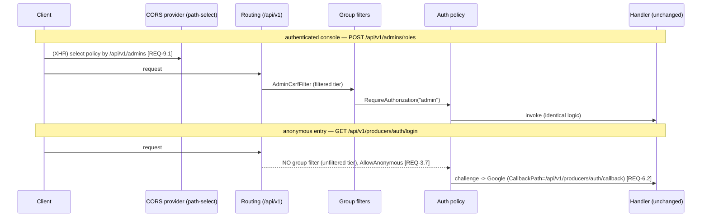

# Design: API Route Scheme (/api/v1/{area})

> Status: approved 2026-07-05

## Architecture Overview

Migration ของ route registration ใน `src/Hosts/Api/Program.cs` เป็นหลัก **บวกกับ path-coupled changes**
ที่ผูกกับ path เดิมและต้องเปลี่ยนตามเพื่อคง behavior: CORS policy selection, OIDC `CallbackPath` config,
`Location` response header, และ string path ใน OpenAPI description. ไม่ใช่ "path-only" ล้วน (บทเรียนจาก
Codex round 1). โครงปัจจุบัน: data-plane + webhook + reports map ตรงบน `app`; admin/producer เป็น
`app.MapGroup("/admin")` / `("/producer")` ที่ติด endpoint filter ระดับ group; anon entry (`producer` login/
register) map top-level นอก group; OIDC callback เป็น **middleware** (`CallbackPath`) ไม่ใช่ mapped endpoint.

ปลายทาง: **1 versioned root group `app.MapGroup("/api/v1")` + 9 area subgroup**; handler/business logic/
auth policy/contract คงเดิม.

```
app
├─ (infra — นอก /api, ไม่ย้าย)   REQ-4
│    ├─ MapPolHealthChecks()    -> /health/live, /health/ready
│    ├─ MapOpenApi()            -> /openapi/v1.json
│    └─ MapScalarApiReference() -> /scalar (+assets)   [Dev-only]
│
└─ var api = app.MapGroup("/api/v1")          REQ-1.1, 1.2, 1.3
     ├─ products / carts / checkouts / orders / payments / webhooks / reports   (data-plane + integration)
     ├─ admins    (single filtered group +AdminCsrfFilter — as today; CSRF no-ops on the GET auth/login)
     └─ producers (2 group ref: unfiltered=login/register anon, filtered=console+ProducerCsrfFilter+BoundFilter)
```

## Requirement Traceability

| Design element | Satisfies REQ |
|---|---|
| `/api/v1` root group + version-first literal segment | REQ-1.1, 1.2, 1.3 |
| 9 plural area subgroups (REQ-2.1 names), area-root empty pattern | REQ-1.4, 2.1 |
| Full old→new route table (below) | REQ-2.2, 2.4, 2.5, 2.6, 2.7, 2.8, 2.9 |
| tenant/identity ไม่มี segment | REQ-2.3 |
| Path prefix change only; policy/tags/body/status/method/query คงเดิม (incl. products write=producer/read=tenant split) | REQ-3.1, 3.2, 3.5, 5.4 |
| admin single filtered group; producer 2-tier (unfiltered anon + filtered console); filter membership preserved | REQ-3.3, 3.4, 3.7, 6.1, 6.3 |
| Webhook auth คงเดิม, HMAC out-of-scope | REQ-3.6 |
| Infra endpoints นอก `/api/v1` | REQ-4.1, 4.2, 4.4 |
| `RouteSchemeConventionTests` + INFRA_ALLOWLIST + **literal `/api/v1`** regex | REQ-1.5, 4.3 |
| Remove legacy routes -> 404 (ทุก method+path + 2 callback) | REQ-5.1, 5.2, 5.3 |
| OIDC callback via config (`CallbackPath`), not routing | REQ-6.2 |
| OpenAPI regen จาก routes + แก้ hardcoded description strings | REQ-7.1, 7.2 |
| อัปเดต route-asserting tests | REQ-7.3 |
| CORS selector -> new prefixes; `Location` headers -> new paths; targeted integration tests | REQ-9.1, 9.2, 9.3, 9.4 |
| Cutover coordination (SPA/PSP/Google) — /spec-tasks DoD | REQ-8.1, 8.2, 8.3 |

## Data Models & Interfaces

ไม่มี data model ใหม่. "contract" = ตาราง route mapping (47 mapped + 2 middleware callback). sub-path เดิม
คงรูปเดิม; เปลี่ยน prefix + (สำหรับ payments) จัด sub-resource `sessions`.

**Data-plane (top-level `app` -> area group; auth per-endpoint คงเดิม):**

| # | method | old | new |
|---|---|---|---|
| 1 | POST | `/products` | `/api/v1/products` |
| 2 | GET | `/products` | `/api/v1/products` |
| 3 | POST | `/carts` | `/api/v1/carts` |
| 4 | POST | `/carts/{cartId}/items` | `/api/v1/carts/{cartId}/items` |
| 5 | GET | `/carts/{cartId}` | `/api/v1/carts/{cartId}` |
| 6 | DELETE | `/carts/{cartId}/items/{productId}` | `/api/v1/carts/{cartId}/items/{productId}` |
| 7 | PUT | `/carts/{cartId}/items/{productId}` | `/api/v1/carts/{cartId}/items/{productId}` |
| 8 | POST | `/carts/{cartId}/clear` | `/api/v1/carts/{cartId}/clear` |
| 9 | POST | `/checkout` | `/api/v1/checkouts` |
| 10 | POST | `/checkout/{checkoutSessionId}/confirm` | `/api/v1/checkouts/{checkoutSessionId}/confirm` |
| 11 | POST | `/payment-sessions` | `/api/v1/payments/sessions` |
| 12 | POST | `/payment-sessions/{paymentSessionId}/redirect` | `/api/v1/payments/sessions/{paymentSessionId}/redirect` |
| 13 | GET | `/orders/{token}/summary` (anon) | `/api/v1/orders/{token}/summary` |
| 14 | POST | `/orders/{orderId}/summary/resend` | `/api/v1/orders/{orderId}/summary/resend` |
| 15 | GET | `/reports/reconciliation` | `/api/v1/reports/reconciliation` |
| 16 | POST | `/webhooks/{pspConnectionId}` (anon+HMAC+rate-limit) | `/api/v1/webhooks/{pspConnectionId}` |

**Admins area (`/admin` group + `AdminCsrfFilter` -> `/api/v1/admins`; account sub-collection at area root):**

| # | method | old | new |
|---|---|---|---|
| 17 | GET | `/admin/auth/login` | `/api/v1/admins/auth/login` |
| 18 | POST | `/admin/auth/logout` | `/api/v1/admins/auth/logout` |
| 19 | POST | `/admin/auth/logout-all` | `/api/v1/admins/auth/logout-all` |
| 20 | POST | `/admin/tenants` | `/api/v1/admins/tenants` |
| 21 | GET | `/admin/tenants/{code}` | `/api/v1/admins/tenants/{code}` |
| 22 | POST | `/admin/tenant-users/{subject}/approve` | `/api/v1/admins/tenant-users/{subject}/approve` |
| 23 | POST | `/admin/tenant-users/{subject}/reject` | `/api/v1/admins/tenant-users/{subject}/reject` |
| 24 | GET | `/admin/me` | `/api/v1/admins/me` |
| 25 | POST | `/admin/admins` (create) | `/api/v1/admins` (area root) |
| 26 | POST | `/admin/admins/{id}/tenants` | `/api/v1/admins/{id}/tenants` |
| 27 | DELETE | `/admin/admins/{id}/tenants/{tenantId}` | `/api/v1/admins/{id}/tenants/{tenantId}` |
| 28 | POST | `/admin/admins/{id}/suspend` | `/api/v1/admins/{id}/suspend` |
| 29 | PUT | `/admin/admins/{id}/roles` | `/api/v1/admins/{id}/roles` |
| 30 | GET | `/admin/permissions` | `/api/v1/admins/permissions` |
| 31 | GET | `/admin/roles` | `/api/v1/admins/roles` |
| 32 | GET | `/admin/roles/{code}` | `/api/v1/admins/roles/{code}` |
| 33 | POST | `/admin/roles` | `/api/v1/admins/roles` |
| 34 | PUT | `/admin/roles/{code}` | `/api/v1/admins/roles/{code}` |
| 35 | DELETE | `/admin/roles/{code}` | `/api/v1/admins/roles/{code}` |

Routing disambiguation: `{id:guid}` (26-29) vs literal `tenants`/`roles`/`permissions`/`me`/`auth`/`tenant-users`
(20-24, 30-35) — guid constraint กับ literal ไม่ชนกัน (literal ชนะก่อน).

**Producers area (`/producer` group + CSRF/bound; `login`/`register` anon top-level -> `/api/v1/producers`):**

| # | method | old | new | filter tier |
|---|---|---|---|---|
| 36 | GET | `/producer/auth/login` | `/api/v1/producers/auth/login` | anon (unfiltered) |
| 37 | POST | `/producer/register` | `/api/v1/producers/register` | anon (unfiltered) |
| 38 | POST | `/producer/auth/logout` | `/api/v1/producers/auth/logout` | console (filtered) |
| 39 | POST | `/producer/auth/logout-all` | `/api/v1/producers/auth/logout-all` | console |
| 40 | GET | `/producer/me` | `/api/v1/producers/me` | console |
| 41 | GET | `/producer/permissions` | `/api/v1/producers/permissions` | console |
| 42 | GET | `/producer/roles` | `/api/v1/producers/roles` | console |
| 43 | GET | `/producer/roles/{code}` | `/api/v1/producers/roles/{code}` | console |
| 44 | POST | `/producer/roles` | `/api/v1/producers/roles` | console |
| 45 | PUT | `/producer/roles/{code}` | `/api/v1/producers/roles/{code}` | console |
| 46 | DELETE | `/producer/roles/{code}` | `/api/v1/producers/roles/{code}` | console |
| 47 | PUT | `/producer/tenant-users/{tenantUserId}/roles` | `/api/v1/producers/tenant-users/{tenantUserId}/roles` | console |

**OIDC callback (middleware `CallbackPath`, NOT mapped — move via config, REQ-6.2):**

| # | old (config) | new (config) | where |
|---|---|---|---|
| C1 | `/admin/auth/callback` | `/api/v1/admins/auth/callback` | `AdminAuthOptions.CallbackPath` + `appsettings*.json` |
| C2 | `/producer/auth/callback` | `/api/v1/producers/auth/callback` | `ProducerOidcOptions.CallbackPath` + `appsettings*.json` |

**Filter-membership preservation (REQ-3.7):** preserve each endpoint's EXACT current filter membership; the
area-prefix change alone must NOT move any endpoint between tiers. **Admin** — ALL admin endpoints, including
`GET /api/v1/admins/auth/login`, stay on the single `AdminCsrfFilter`'d group exactly as today; the CSRF filter
is a no-op on the safe GET method (that is why login works), so admin has NO separate unfiltered tier.
**Producer** — `login` (36) and `register` (37) stay OUTSIDE `ProducerCsrfFilter`/`ProducerBoundProducerFilter`
(unfiltered `producers` ref, exactly as they are mapped top-level today); console (38-47) on the filtered ref.

**Architecture test (new, `tests/Hosts.Tests/RouteSchemeConventionTests.cs`):**

```
boot via WebApplicationFactory -> resolve EndpointDataSource
for each RouteEndpoint e:
    raw = e.RoutePattern.RawText
    assert  Regex.IsMatch(raw, @"^/api/v1/(products|carts|checkouts|orders|payments|admins|producers|webhooks|reports)(/.*)?$")
         OR raw ∈ INFRA_ALLOWLIST
fail listing every offender
```
LITERAL `/api/v1` (fail-closed, REQ-1.5) — ไม่ใช้ `v\d+`. `INFRA_ALLOWLIST` (REQ-4.3) = `/health/live`,
`/health/ready`, `/openapi/{documentName}.json` (prefix `/openapi/`), `/scalar` (prefix). **หมายเหตุ:**
EndpointDataSource เห็นเฉพาะ RouteEndpoint — OIDC callback (middleware) + CORS policy behavior ไม่โผล่ ->
ต้อง integration test แยก (REQ-9.4).

## Sequence Diagrams



## Technology Decisions

- **Minimal-API `MapGroup` nesting** (ASP.NET Core 10) — pattern เดิมของ repo; ไม่มี dependency ใหม่.
- **ปฏิเสธ `Asp.Versioning.*`** — global v1 เดียว, literal segment พอ (REQ-1.3, YAGNI). future v2 = special-case group ตอนนั้น.
- **arch guard = literal `/api/v1`** (fail-closed) — ไม่ยอมรับ version ที่ยังไม่ spec.
- **area-root endpoint map path เต็มตรงบน `/api/v1` group** (`api.MapPost("/products")`) — NOT nested `group.MapGet("")`. [แก้ 2026-07-05 ตอน implement: สมมติฐานเดิมผิด — ASP.NET render `group.MapGet("")` เป็น **trailing-slash** `/api/v1/products/` (ยืนยันผ่าน EndpointDataSource) ผิด clean-path REQ-1.4] ดังนั้น data-plane ทั้งหมด map explicit path บน `api` ตรง (ไม่มี data-plane subgroup); admins/producers ยังเป็น `MapGroup` (ผูก endpoint filter ครั้งเดียว), และ admins-root create (`POST /api/v1/admins`) map บน `api` + `AdminCsrfFilter` per-endpoint. RawText ของทุก route สะอาด ไม่มี trailing slash.
- **`Location` header:** อัปเดต string เป็น path ใหม่โดยตรง (5 จุด) — ไม่ introduce `LinkGenerator`/route-name ในงานนี้ (surgical, ponytail); assert header ใน test.
- **CORS selector:** แก้ `PolCorsPolicyProvider` ให้ match `/api/v1/admins`,`/api/v1/producers` (REQ-9.1).

## Error Handling Strategy

- **Legacy path หลัง cutover (REQ-5.2, 5.3):** route ถูกลบ -> ASP.NET routing คืน **404** อัตโนมัติ; old OIDC callback path ก็ 404 หลังย้าย `CallbackPath`. assert ครบทุก old method+path + 2 callback.
- **Anon-entry filter regression (REQ-3.7):** ถ้า filter หลุด scope ไป login/register -> พัง; จับด้วย anon-login/register integration test ที่ path ใหม่.
- **CORS regression (REQ-9.1, 9.3):** ถ้า selector ไม่อัปเดต -> admin/producer XHR ตกไป tenant default (ไม่มี credentials) -> cookie auth พัง; จับด้วย preflight/credentialed-policy test.
- **OIDC redirect_uri mismatch (REQ-6.2):** ถ้า Google dev redirect_uri ไม่อัปเดตก่อน cutover -> login พัง (external, manual) — DoD gate.
- **Route ตกสำรวจ/วางผิด area:** arch test (REQ-1.5) fail ตอน test time พร้อม list.

## Testing Strategy

- **Arch (Hosts.Tests):** `RouteSchemeConventionTests` — enumerate EndpointDataSource, assert literal `/api/v1/{area}` หรือ infra allowlist — REQ-1.1, 1.5, 2.1, 2.3, 4.3.
- **Legacy 404 (complete):** assert **ทุก** old method+path (47) + 2 old callback -> 404 — generate จาก mapping table, ไม่ sample per-area — REQ-5.3.
- **Path-move integration:** ยิง path ใหม่ assert status/body เดิม — REQ-5.4, 7.3.
- **Auth preservation:** admins-area ปฏิเสธ tenant/producer session (REQ-3.3); products write=producer/read=tenant (REQ-3.5); anon login/register ผ่านที่ path ใหม่ + console ยังติด filter (REQ-3.4, 3.7, 6.1, 6.3).
- **Path-coupled (middleware/CORS — EndpointDataSource มองไม่เห็น, REQ-9.4):** CORS preflight (OPTIONS) ที่ `/api/v1/admins`,`/api/v1/producers` คืน credentialed policy (REQ-9.1, 9.3); OIDC challenge emit callback redirect_uri ใหม่ + callback handled (REQ-6.2); `Location` header ชี้ path ใหม่ (REQ-9.2).
- **OpenAPI/Scalar:** document regenerate ด้วย path ใหม่ + per-op security เดิม; description strings ที่ hardcode legacy path แก้แล้ว (REQ-7.1, 7.2); ปรับ `SfsOpenApiTests`/`ProducerScalarSecurityTests`/`CorsTests`.
- **Infra untouched:** `/health/live`, `/health/ready`, `/openapi/v1.json`, `/scalar` ตอบที่ path เดิม (REQ-4).

## Documentation sync (task-time, ไม่ทำใน design phase)

ยังอ้าง `/api/{surface}/v1` ต้องแก้เป็น `/api/v1/{area}` ตอน implement: `CODING_STANDARDS.md` (API conventions),
`ARCHITECTURE.md`, `docs/reference/platform-modules.md`. memory `money-decimal-and-api-versioning-standards` แก้แล้ว.
