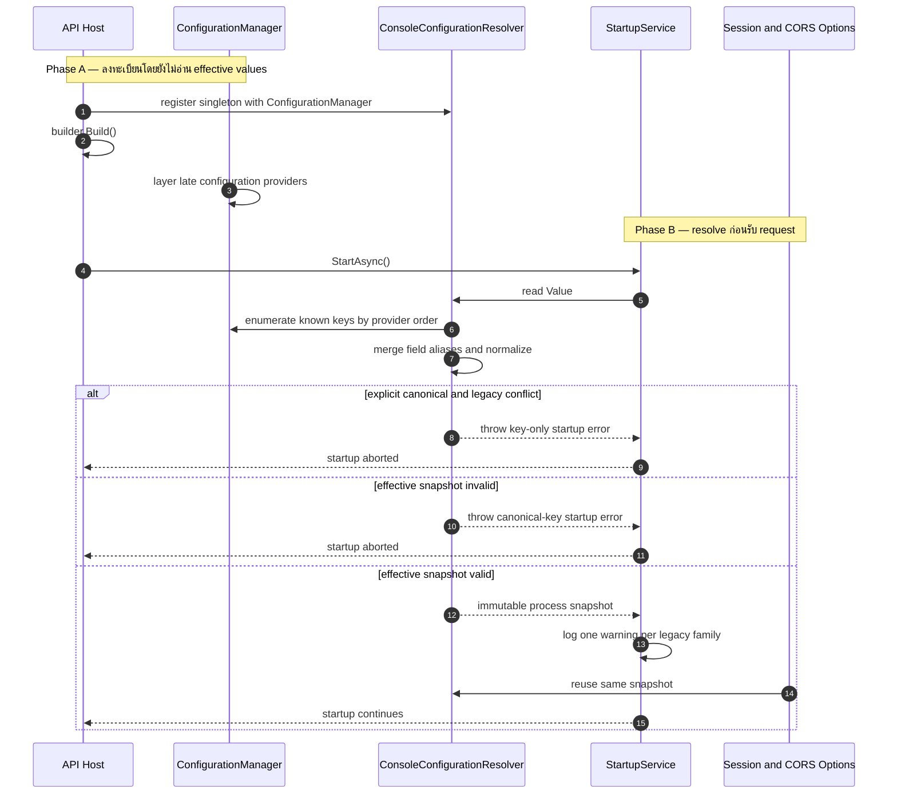
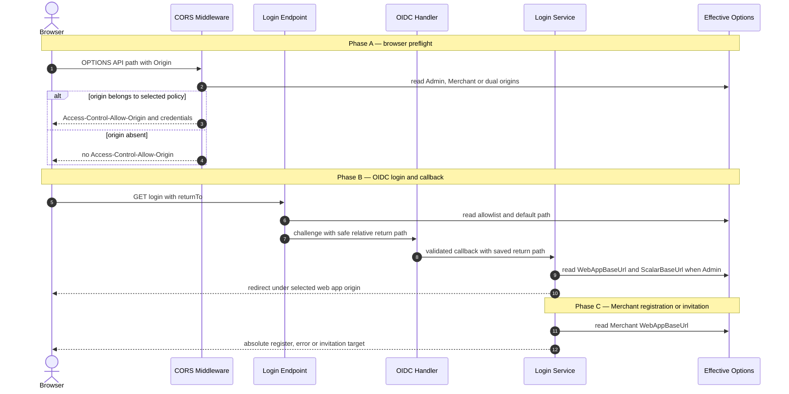

# Design: Console Auth Configuration Contract

> Status: approved 2026-08-18

งานนี้รวมการ resolve session และ CORS config ของสอง console เป็น snapshot เดียวก่อน API รับ request
พร้อม alias ชั่วคราวหนึ่ง release โดยไม่เปลี่ยน OIDC, route, cookie, database หรือ UI contract เดิม

## Architecture Overview

### ขอบเขตที่เปลี่ยน

| ส่วน | ก่อน | หลัง |
|---|---|---|
| Admin session | bind `AdminSession` ตรง, ใช้ property `SpaBaseUrl` | ใช้ `AdminSession` เดิม, rename property เป็น `WebAppBaseUrl` |
| Merchant session | bind `MerchantUser:Session` ตรง | bind canonical `MerchantSession`, รองรับ root เดิมผ่าน resolver |
| Merchant CORS | `Cors:AllowedOrigins` ถูกอ่านแยกใน CORS builder | `Cors:MerchantOrigins` มาจาก snapshot เดียวกับ session |
| Admin CORS | `Cors:AdminOrigins` ถูกอ่านแยกใน CORS builder | ชื่อเดิม, แต่มาจาก snapshot เดียวกัน |
| Startup safety | session/CORS config ผิดอาจพบเมื่อมี request | resolve, normalize และ validate ก่อน API เปิดรับ request |
| OIDC | `AdminAuth` และ `MerchantAuth` bind เข้าระบบเดิม | ไม่เปลี่ยน binding, scheme, PKCE, callback, secret loading หรือ route |

Root cause ของความไม่สอดคล้องอยู่ที่ composition root มีสามทางอ่าน config อิสระ:
`Program.cs` bind session สอง section คนละรูป และ `CorsExtensions` อ่าน origin จาก raw keys อีกชุด
จึงไม่มีจุดเดียวที่ตรวจ alias, conflict และ invariant ก่อนใช้งาน

### โครงสร้างใหม่

| Component | ที่อยู่ | หน้าที่ |
|---|---|---|
| `ConsoleConfigurationResolver` | `src/Hosts/Api/ConsoleConfiguration.cs` ไฟล์ใหม่ | อ่าน provider stack เมื่อ host พร้อม, merge alias ราย field, normalize, validate และสร้าง snapshot |
| `ConsoleConfigurationSnapshot` | ไฟล์เดียวกับ resolver | เก็บ Admin session, Merchant session, CORS origins และ legacy families ที่พบ |
| `ConsoleConfigurationStartupService` | ไฟล์เดียวกับ resolver | force การสร้าง snapshot ใน `StartAsync`, log warning หนึ่งครั้ง และทำให้ error หยุด startup |
| `PolCorsOptions` | `src/BuildingBlocks/BuildingBlocks.Web/CorsExtensions.cs` | typed input ของ CORS policies: `AdminOrigins` และ `MerchantOrigins` |
| session option types | `Admins/AuthOptions.cs`, `Merchants/UserOidcOptions.cs` | ใช้ canonical section/property โดยคง type boundary ของ Admin กับ Merchant User |
| consumers | login services, invitation sender, `Program.cs`, CORS extension | อ่านเฉพาะ effective options จาก snapshot ไม่อ่าน alias เอง |

`UserSessionOptions` คงชื่อ C# เดิม เพราะ principal ยังเป็น Merchant User; เปลี่ยนเฉพาะ
`SectionName` เป็น `MerchantSession` และ property เป็น `WebAppBaseUrl` ตาม external contract
ไม่ rename `MerchantUserSession` auth scheme, cookie หรือ persisted session model

### Effective snapshot lifecycle

1. `Program.cs` ลงทะเบียน resolver แบบ singleton โดย capture `ConfigurationManager` เดิม แต่ยังไม่อ่านค่า
2. `builder.Build()` ทำให้ late-bound configuration providers ถูก layer ครบเหมือน CORS lazy path ปัจจุบัน
3. startup service เรียก `resolver.Value` ก่อน web server รับ request
4. resolver สร้าง snapshot ครั้งเดียว แล้ว startup service log legacy warnings ครั้งเดียว
5. `IOptions<AdminSessionOptions>`, `IOptions<UserSessionOptions>` และ `IOptions<PolCorsOptions>` ชี้ค่าจาก snapshot เดียวกัน

การอ่านแบบ lazy-until-startup คง behavior ของ test host ที่เติม provider ภายหลัง และสอดคล้องกับข้อกำหนด
ให้ restart process เมื่อ config เปลี่ยน ไม่มี dotenv loader, file watcher หรือ hot-reload path ใหม่

### Provider-aware alias resolution

Resolver ใช้ provider order ของ `IConfigurationRoot` โดยตรง ไม่อ่านจาก dictionary ที่ทำให้ source หาย:

1. C# initializer และ committed `appsettings.json` เป็น baseline ไม่ใช่ explicit operator input
2. provider อื่นทั้งหมดเป็น operator layers เช่น environment-specific JSON, user-secrets, environment variables,
   command line, `UseSetting` และ in-memory provider
3. ภายใน canonical family และ legacy family ค่า provider ที่ลงทะเบียนหลังสุดชนะตาม ASP.NET Core
4. Resolver merge ราย logical field เพื่อให้ deployment ย้ายบาง field ก่อน field อื่นได้
5. เมื่อ field เดียวมีทั้ง canonical และ legacy แบบ explicit ให้ normalize แล้วเปรียบเทียบ
6. ค่าเท่ากันเลือก canonical, ค่าต่างกันหยุด startup, มีเพียง legacy ให้ overlay เหนือ baseline

Array candidate ประกอบจาก effective numeric children ตาม provider order ก่อนเปรียบเทียบเป็น set ไม่ concat
canonical กับ legacy list เข้าด้วยกัน

การแยก baseline ดูจาก JSON provider ที่ source path เป็น committed `appsettings.json`; resolver ไม่ใช้
`GetDebugView()` และ enumerate เฉพาะ session/CORS key families จึงไม่แตะ `ClientSecret` หรือ secret family อื่น

### Alias map

| Logical field | Canonical | Legacy | Comparison |
|---|---|---|---|
| Admin web app origin | `AdminSession:WebAppBaseUrl` | `AdminSession:SpaBaseUrl` | normalized URI |
| Merchant timings | `MerchantSession:{Field}` | `MerchantUser:Session:{Field}` | bound numeric value |
| Merchant `SameSite` | `MerchantSession:SameSite` | `MerchantUser:Session:SameSite` | ordinal string |
| Merchant default path | `MerchantSession:DefaultReturnPath` | `MerchantUser:Session:DefaultReturnPath` | ordinal string |
| Merchant allowlist | `MerchantSession:ReturnUrlAllowlist` | `MerchantUser:Session:ReturnUrlAllowlist` | ordinal set |
| Merchant web app origin | `MerchantSession:WebAppBaseUrl` | `MerchantUser:Session:SpaBaseUrl` | normalized URI |
| Merchant browser origins | `Cors:MerchantOrigins` | `Cors:AllowedOrigins` | normalized origin set |

`{Field}` ฝั่ง Merchant timings หมายถึง `IdleMinutes`, `AbsoluteHours`, `RotationMinutes` และ
`GraceSeconds` เท่านั้น ส่วน field รูปอื่นอยู่ในแถวเฉพาะเพื่อกำหนด comparison ชัดเจน

Scalar aliases bind เป็น target type ก่อนเปรียบเทียบ: numeric/Boolean ใช้ typed equality และ string ใช้
ordinal equality ปัจจุบัน preserved session fields ไม่มี Boolean alias จึงไม่มี Boolean key เพิ่มจากงานนี้

Canonical fields ที่ไม่มี alias อ่านตาม provider precedence ปกติ ได้แก่ Admin session fields อื่น,
`Cors:AdminOrigins`, `AdminSession:ScalarBaseUrl`, `AdminAuth`, `MerchantAuth` และ `MerchantUser:Invitation`

### Normalization และ validation order

Resolver ทำตามลำดับตายตัว: resolve source precedence → merge aliases → normalize comparable values →
validate effective snapshot → publish snapshot

| กลุ่ม | Normalization | Validation |
|---|---|---|
| `WebAppBaseUrl` | scheme/host เป็น canonical case, ตัด default port และ trailing root slash | blank ได้, ไม่ blank ต้องเป็น HTTP(S) origin ไม่มี userinfo, query, fragment หรือ non-root path |
| Web app transport | ใช้ parsed `Uri` | non-Development ต้อง HTTPS, Development HTTP ได้เฉพาะ `Uri.IsLoopback` |
| return path | ไม่ trim และคง ordinal text | ต้องขึ้นต้น `/` เดียว, ไม่มี backslash/control char, ห้าม duplicate และ default ต้องอยู่ใน allowlist |
| CORS origin | normalize แบบเดียวกับ origin แล้วเปรียบเทียบเป็น set | ต้องเป็น HTTP(S) origin, ห้าม wildcard/duplicate, ใช้ HTTPS rule เดียวกับ web app |
| empty CORS list | คงเป็น empty list | valid และสร้าง deny-all cross-origin policy |
| Merchant invitation | SMTP ถือว่า configured เมื่อ `MerchantUser:Invitation:Smtp:Host` ไม่ blank | ถ้า configured ต้องมี `MerchantSession:WebAppBaseUrl` ที่ valid และไม่ blank |

Snapshot เก็บ URI/origin รูป normalized เพื่อให้ conflict comparison, redirect prefix และ CORS matching ใช้
representation เดียวกัน ส่วน allowlist คงรายการจาก source ที่ถูกเลือกเพราะ membership เป็น ordinal exact match

### Runtime consumers

- `ReturnUrlPolicy.Resolve` คง algorithm เดิม: invalid `returnTo` ใช้ `DefaultReturnPath`
- Admin และ Merchant login เปลี่ยนเฉพาะ `SpaBaseUrl` เป็น `WebAppBaseUrl`
- Admin `/scalar` ยังคงใช้ `ScalarBaseUrl` ก่อน web app base
- Merchant registration/error redirect และ invitation link ใช้ Merchant web app base เดียวกัน
- `AddPolCors` เลิกรับ raw `IConfiguration`; policy builder รับ `IOptions<PolCorsOptions>` จาก snapshot
- `PolCorsPolicyProvider` และ path classification เดิมไม่เปลี่ยน
- Admin policy, Merchant default policy และ dual-console union ยังคง `AllowCredentials`

## Sequence Diagrams

### Startup resolve, compatibility และ fail-fast



### Login redirect, invitation และ CORS request



## Data Models & Interfaces

### Canonical option shapes

```csharp
internal sealed class AdminSessionOptions
{
    public const string SectionName = "AdminSession";
    public int IdleMinutes { get; init; } = 1440;
    public int AbsoluteHours { get; init; } = 168;
    public int RotationMinutes { get; init; } = 15;
    public int GraceSeconds { get; init; } = 60;
    public string SameSite { get; init; } = "Lax";
    public int PreAuthTtlMinutes { get; init; } = 10;
    public string DefaultReturnPath { get; init; } = "/";
    public string[] ReturnUrlAllowlist { get; init; } = [];
    public string WebAppBaseUrl { get; init; } = "";
    public string ScalarBaseUrl { get; init; } = "";
}

internal sealed class UserSessionOptions
{
    public const string SectionName = "MerchantSession";
    public int IdleMinutes { get; init; } = 1440;
    public int AbsoluteHours { get; init; } = 168;
    public int RotationMinutes { get; init; } = 15;
    public int GraceSeconds { get; init; } = 60;
    public string SameSite { get; init; } = "Lax";
    public string DefaultReturnPath { get; init; } = "/";
    public string[] ReturnUrlAllowlist { get; init; } = [];
    public string WebAppBaseUrl { get; init; } = "";
}

public sealed class PolCorsOptions
{
    public string[] AdminOrigins { get; init; } = [];
    public string[] MerchantOrigins { get; init; } = [];
}
```

Type `UserSessionOptions` ไม่ถูก rename เป็น `MerchantSessionOptions` เพราะ namespace และ actor context ระบุ
Merchant อยู่แล้ว และคำว่า User ยังจำเป็นต่อการแยก principal จาก merchant organization

### Resolved snapshot

```csharp
internal sealed record ConsoleConfigurationSnapshot(
    AdminSessionOptions AdminSession,
    UserSessionOptions MerchantSession,
    PolCorsOptions Cors,
    IReadOnlyList<string> LegacyKeyFamilies);

internal sealed class ConsoleConfigurationResolver
{
    public ConsoleConfigurationSnapshot Value { get; }
}
```

`Value` ใช้ `Lazy<T>` thread-safe ค่าเดียวตลอด process ไม่มี setter, reload callback หรือ public mutation API
ไม่มี interface/factory เพิ่ม เพราะมี implementation และ lifecycle เดียว

### External configuration contract

Tracked runtime config เปลี่ยนเฉพาะ key ฝั่งซ้าย ส่วน Compose external input ฝั่งขวาคงเดิม:

| เดิม | Canonical | Compose source เดิม |
|---|---|---|
| `AdminSession__SpaBaseUrl` | `AdminSession__WebAppBaseUrl` | `ADMIN_FRONTEND_ORIGIN` |
| `MerchantUser__Session__SpaBaseUrl` | `MerchantSession__WebAppBaseUrl` | `MERCHANT_USER_FRONTEND_ORIGIN` |
| `MerchantUser__Session__DefaultReturnPath` | `MerchantSession__DefaultReturnPath` | literal `/dashboard` |
| `MerchantUser__Session__ReturnUrlAllowlist__1` | `MerchantSession__ReturnUrlAllowlist__1` | literal `/dashboard` |
| `Cors__AllowedOrigins__0` | `Cors__MerchantOrigins__0` | `MERCHANT_USER_FRONTEND_ORIGIN` |

`appsettings.json` ย้าย session เดิมออกจาก `MerchantUser` เป็น root `MerchantSession`; ใต้
`MerchantUser` เหลือ `Invitation` และ `Registration` ตาม ownership เดิม

Current artifacts ที่ต้องใช้ canonical names ได้แก่ base/development example settings, launch settings,
`.env.example`, `docker-compose.prod.yml`, local runbook และ Admin reference; historical approved specs ไม่แก้

Local runbook ต้องระบุให้ export ค่า `.env` เข้า process environment ก่อน start API และต้อง restart API
หลังเปลี่ยนค่า เพราะ application ไม่อ่าน `.env` โดยตรง

### API, database และ secret boundary

ไม่มี REST route, request/response schema, OpenAPI operation, Scalar URL, callback path, auth scheme, cookie name,
permission, database table/column หรือ migration เปลี่ยนในงานนี้

Resolver ไม่อ่านหรือ log `AdminAuth`/`MerchantAuth` credential values การ load `ClientSecret` ยังใช้ flow เดิม
จาก process environment, Compose secret file หรือ provider ที่ระบบรองรับอยู่แล้ว

## Technology Decisions

| Decision | เหตุผล | ไม่เลือก |
|---|---|---|
| snapshot เดียวสำหรับ session และ CORS | alias, validation และ consumer ทุกจุดเห็น effective config ชุดเดียว | bind แยกแต่ละ consumer เพราะอาจ fallback คนละ key |
| lazy read หลัง `builder.Build()`, force ใน startup service | คง late-provider behavior เดิมและ fail ก่อนรับ traffic | eager read ใน `Program.cs` เพราะ test-host provider บางชนิดมาทีหลัง |
| provider-aware merge ราย field | รักษา ASP.NET precedence, partial rollout และไม่ชน committed defaults เทียม | `canonical ?? legacy` เพราะแยก explicit input จาก base default ไม่ได้ |
| native `IConfigurationRoot`, `IOptions<T>`, `IHostedService`, `Uri` | dependency ที่ติดตั้งอยู่แล้วพอ | config library, dotenv loader หรือ custom URI package |
| typed `PolCorsOptions` | ตัด raw key lookup ออกจาก CORS โดยไม่เปลี่ยน path provider | duplicate alias resolver ใน BuildingBlocks |
| คง `UserSessionOptions` และ auth wire names | external config symmetryไม่บังคับ rename domain actor หรือ L8 contracts | sweep คำว่า MerchantUser ทั้งระบบ |
| alias อยู่จน cleanup spec หลัง tagged release | migration window ตรวจสอบได้และไม่ลบเองตามเวลา | automatic version switch หรือ alias removal ใน PR เดียวกัน |
| ไม่มี DB/UI change | config contract ไม่แตะ persisted state หรือ frontend behavior | migration, new endpoint หรือ frontend fallback |

## Error Handling Strategy

| Error case | Behavior | ข้อมูลใน log/error |
|---|---|---|
| explicit canonical/legacy field ต่างกัน | throw ระหว่าง startup, host ไม่รับ request | canonical และ legacy key names เท่านั้น |
| URI/origin ผิดรูปหรือ transport ผิด environment | throw ระหว่าง startup | canonical key name กับ rule ที่ผิด ไม่มี value |
| return allowlist ผิดหรือ default ไม่อยู่ใน list | throw ระหว่าง startup | canonical section/field และ reason ไม่มี path value |
| Merchant SMTP configured แต่ web app base blank | throw ระหว่าง startup | `MerchantSession:WebAppBaseUrl` เท่านั้น |
| legacy family ถูกใช้และ valid | startup ต่อ, warning ระดับ Warning หนึ่งครั้งต่อ family | old/new family names ไม่มี values |
| CORS list ว่าง | startup ต่อ, policy ไม่ allow origin ใด | ไม่ต้อง warning เพราะเป็น safe default |
| runtime `returnTo` ไม่ผ่าน allowlist | ใช้ `DefaultReturnPath` เหมือนเดิม | ไม่ echo ค่าเข้า error log |
| browser origin ไม่ผ่าน selected policy | ไม่ส่ง `Access-Control-Allow-Origin` | authentication/authorization/CSRF ยังทำงานแยกตามเดิม |

Startup exception ใช้ `InvalidOperationException` ตาม boot guards ที่มีอยู่ ไม่เพิ่ม exception hierarchy ใหม่
ข้อความทดสอบด้วย key names และ reason codes คงที่ ไม่ interpolate configuration values

## Testing Strategy

### Resolver และ startup

| Test | ระดับ | REQ |
|---|---|---|
| canonical-only bind ทุก option group | unit + host integration | REQ-1.3–REQ-1.9, REQ-8.1 |
| legacy-only map แล้ว warning ครั้งเดียวต่อ family | unit + captured host log | REQ-2.2–REQ-2.5, REQ-8.2 |
| canonical/legacy equivalent หลัง normalize | unit theory | REQ-2.6, REQ-2.11–REQ-2.14, REQ-8.3 |
| canonical/legacy conflict หยุด hostและ message ไม่มี value | unit + host startup | REQ-2.7, REQ-2.9, REQ-8.4 |
| legacy operator override เหนือ C# และ base JSON defaults | host integration ใช้ real provider stack | REQ-2.8, REQ-8.2 |
| late `UseSetting` และ provider precedence | host integration ต่อ canary เดิม | REQ-2.4, REQ-2.5, REQ-3.1 |

### Validation matrix

Theory cases ครบ invalid classes: relative/non-HTTP URI, userinfo, query, fragment, non-root path,
non-loopback Development HTTP, non-Development HTTP, malformed return path, duplicates, missing default,
wildcard CORS และ duplicate normalized origins

Positive cases ครบ blank same-origin, Development loopback HTTP, non-Development HTTPS, equivalent default ports,
empty CORS deny-all และ SMTP configured พร้อม Merchant web app base

### Runtime regression

| Existing suite | การเปลี่ยน test | REQ |
|---|---|---|
| Admin/Merchant login redirect tests | เปลี่ยน property/key เป็น canonical, pin relative/absolute/fallback/Scalar | REQ-4.1–REQ-4.8, REQ-8.7 |
| invitation sender tests | pin canonical Merchant base และ SMTP dependency | REQ-3.20, REQ-4.9 |
| `CorsTests` และ `AdminCorsGuardTests` | ใช้ canonical origins, pin Admin/Merchant/dual/unknown origin | REQ-5.1–REQ-5.8, REQ-8.8 |
| OIDC callback E2E | เปลี่ยนเฉพาะ session keys, assert schemes/routes/callbacks เดิม | REQ-6.1–REQ-6.5 |
| architecture config tests | pin canonical literalsใน tracked artifacts และ Compose RHS เดิม | REQ-7.1–REQ-7.8, REQ-8.9 |
| secret scan | ยืนยันไม่มี `.env`, credential value หรือ config dump ถูก commit/log | REQ-7.7, REQ-7.9 |

ไม่เพิ่ม property-based framework: input classes มี finite partitions และ xUnit theory ตรวจ boundary ได้ตรงกว่า

### Completion gate

```bash
dotnet restore pol-core.slnx
dotnet build pol-core.slnx --no-restore -warnaserror
dotnet test pol-core.slnx --no-build --filter "Category!=Integration"
dotnet test pol-core.slnx --no-build --filter "Category=Integration"
.ai/bin/check-secrets.sh --all
scripts/spec-trace.sh console-auth-config-contract
git diff --check
```

ถ้า script signature ใน repo ต่างจากตัวอย่าง ให้ใช้ command ตาม `TESTING_PROTOCOL.md` ณ implementation time
และบันทึก output จริงใน Evidence ไม่ถือผลออกแบบเป็นผลรัน

## Requirement Traceability

| Design element | Requirements |
|---|---|
| canonical option shapes, section roots และ alias map | REQ-1.1–REQ-1.12 |
| provider-aware field merge และ source classification | REQ-2.1–REQ-2.8, REQ-2.14 |
| key-only warning/error, normalization และ alias lifecycle | REQ-2.3, REQ-2.6–REQ-2.13 |
| startup lifecycle และ validation table | REQ-3.1–REQ-3.20 |
| unchanged `ReturnUrlPolicy` กับ renamed base-url consumers | REQ-4.1–REQ-4.9 |
| typed CORS options กับ unchanged path-policy provider | REQ-5.1–REQ-5.8 |
| API/database/auth boundary | REQ-6.1–REQ-6.6 |
| external contract table, artifact/docs scope และ process-env lifecycle | REQ-7.1–REQ-7.12 |
| resolver/startup test matrix | REQ-8.1–REQ-8.6 |
| redirect, invitation และ CORS regression suites | REQ-8.7, REQ-8.8 |
| architecture literal pins และ completion gate | REQ-8.9, REQ-8.10 |
