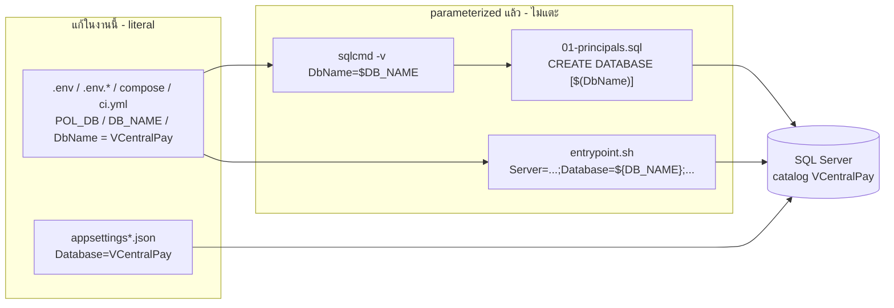
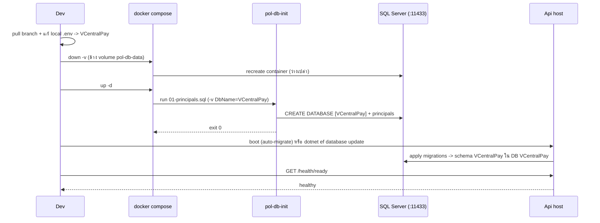

# Design: Rename database `PaymentOrchestration` -> `VCentralPay`

> Status: approved 2026-07-08
> Notes:, amended 2026-07-08
> Mode: design-first (requirements.md derived 2026-07-08 — REQ IDs backfilled below)

## Architecture Overview

งานนี้ rename **ชื่อ database (SQL Server catalog)** จาก `PaymentOrchestration` เป็น `VCentralPay`
ให้เข้าชุดแบรนด์ VCentralPay ต่อจาก PR #68 ที่ rename **SQL schema** `producer` -> `VCentralPay`
ไปแล้ว (merged develop `be2d9e2`, 2026-07-07).

หัวใจของ design: **ชื่อ database เป็นแกนแยกจาก schema อย่างสมบูรณ์** และ runtime path
parameterize ชื่อ database ผ่านตัวแปรอยู่แล้ว — ไม่มี logic ให้ออกแบบใหม่ นี่คือการ propagate ค่าใหม่
ผ่าน "องค์ประกอบตั้งค่า" (configuration surfaces) ที่ยัง hardcode literal อยู่

องค์ประกอบและความรับผิดชอบ (ตามการไหลของชื่อ database เข้าสู่ connection ที่ทำงานจริง):

| องค์ประกอบ | ไฟล์ | บทบาทต่อชื่อ DB | ต้องแก้ไหม |
|---|---|---|---|
| Bootstrap DDL | `docker/bootstrap/01-principals.sql` | `CREATE DATABASE [$(DbName)]`, `USE [$(DbName)]` | ไม่ (parameterized) |
| Prod entrypoint | `docker/entrypoint.sh`, `docker/migrate-entrypoint.sh` | ประกอบ connection string จาก `${DB_NAME}` | ไม่ (parameterized) |
| Dev compose | `docker-compose.yml` | ส่ง `-v DbName="..."` เข้า bootstrap | **ใช่** (literal) |
| Prod compose | `docker-compose.prod.yml` | default `${DB_NAME:-...}` (migrate/api/worker) | **ใช่** (default literal) |
| CI | `.github/workflows/ci.yml` | `POL_DB`, `DbName`, `POL_DESIGN_SQL` | **ใช่** (literal) |
| App config | `appsettings*.json` (Api/Worker) | connection string `Database=...` | **ใช่** (literal) |
| Env templates | `.env.example`, `.env.integration`, `.env.prod.example` | ค่า `POL_DB`/`DB_NAME`/conn strings | **ใช่** (literal) |
| Integration test | `tests/Integration.Tests/IntegrationDb.cs` | fallback `?? "PaymentOrchestration"` | **ใช่** (literal) |
| Docs | `README.md`, `docs/runbooks/*`, `docs/reference/*`, `.ai/specs/*` | เอกสารอ้างชื่อ DB | **ใช่** (ข้อความ) |
| Local env | `.env` (gitignored) | ค่า local จริง | user แก้เอง (ไม่ commit) |

**ขอบเขตชัดเจน — ไม่แตะ** (คนละแกนกับชื่อ catalog):
connection-string keys (`Producer`/`Admin`/`Worker`/`Migrator`), DB principals
(`pol_app`/`pol_admin`/`pol_worker`), container `pol-db`, volumes `pol-db-data`/`sql-data`,
class `ProducerDbContext`, ชื่อ module, SQL schema `VCentralPay`, และ **ชื่อตัวแปร**
`DB_NAME`/`POL_DB`/`$(DbName)` (เปลี่ยนแค่ **ค่า** ไม่เปลี่ยนชื่อตัวแปร)

รวมจุดแก้ committed: ~41 hits ใน 20 ไฟล์ (+ local `.env` ที่ user แก้เอง)

## Sequence Diagrams

### การไหลของชื่อ DB เข้าสู่ connection จริง (แสดงว่าจุดไหน parameterized จุดไหน literal)



### Cutover reset-only (dev / integration — ยืนยัน: ไม่มีข้อมูลจริงต้องเก็บ)



## Data Models & Interfaces

ไม่มี data model / API contract ใหม่ (ไม่มีตาราง/type/endpoint เปลี่ยน). "interface" ที่ออกแบบคือ
**configuration contract** — รูปแบบและค่าที่แต่ละ surface ต้องตรงกัน

**Connection string contract** (คงรูปเดิม เปลี่ยนเฉพาะค่า `Database=`):
```
Server=<host>;Database=VCentralPay;User Id=<principal>;Password=<...>;Encrypt=True;TrustServerCertificate=True
```

**จุดแก้ทั้งหมด (literal `PaymentOrchestration` -> `VCentralPay`):**

- App config: `src/Hosts/Api/appsettings.json` (Producer/Admin) · `src/Hosts/Api/appsettings.Development.json`
  (Producer/Admin/Migrator) · `src/Hosts/Api/appsettings.Development.json.example` · `src/Hosts/Worker/appsettings.json`
  · `src/Hosts/Worker/appsettings.Development.json.example`
- Env templates: `.env.example` (POL_DB + 3 conn + POL_DESIGN_SQL) · `.env.integration` (POL_DB + POL_DESIGN_SQL)
  · `.env.prod.example` (DB_NAME)
- Docker/CI: `docker-compose.yml:41` · `docker-compose.prod.yml:38,59,104` · `.github/workflows/ci.yml:134,156,167`
- Test: `tests/Integration.Tests/IntegrationDb.cs:17` (fallback)
- Live docs: `README.md:57,74` · `docs/runbooks/local-dev-run.md:56,91,235,239,310` (+ cutover note)
  · `docs/runbooks/deploy-self-host.md:109,130` · `docs/reference/db-connection-and-rls.md:164`
- `.ai/specs` (opted-in): `.ai/specs/tenant/tasks.md:26` · `.ai/specs/production-hardening/tasks.md:22`
  · `.ai/specs/production-hardening/design.md:21,107` · `.ai/specs/producer-google-sso/tasks.md:39,48,129`
- Local (ไม่ commit): `.env:7,13,14,15,16` — user แก้เองระหว่าง cutover

หมายเหตุ: `.ai/specs/production-hardening/design.md:21` มีคำ "schema `producer`/`admin`" ที่ stale จาก PR #68
อยู่แล้ว — งานนี้สลับเฉพาะ `PaymentOrchestration` **คงคำ schema เดิมไว้** (out of scope)

## Technology Decisions

1. **Literal string replace, ไม่ refactor ให้อ่านจาก env กลาง.** `appsettings*.json` ยัง hardcode
   `Database=...` ต่อไป ไม่ดึงชื่อ DB มาจากตัวแปรเดียว — การ centralize เป็น refactor นอกขอบเขต งานนี้แค่
   เปลี่ยนค่า `PaymentOrchestration` เป็น token ที่ unique ทั้ง repo (grep ยืนยัน) จึง replace ปลอดภัย ไม่ชนคำอื่น

2. **Cutover = reset-only** (`docker compose down -v && up -d` + migrate) ไม่ใช่ `ALTER DATABASE ... MODIFY NAME`
   หรือ backup/restore. เหตุผล: ยืนยันแล้วไม่มี DB ที่มีข้อมูลจริงต้องเก็บ; ตรง precedent PR #68; ชื่อ DB ใหม่ทำให้
   bootstrap สร้าง `VCentralPay` สดและ migrate จากศูนย์ — CI/fresh-clone ไม่กระทบ

3. **ไม่แตะแกนที่ orthogonal** (keys/principals/container/volume/schema/ชื่อตัวแปร) — เปลี่ยนแค่ที่จำเป็นตาม
   surgical-change principle; ลด blast radius และความเสี่ยง

4. **ไม่เรียก spec-architect** — งานไม่แตะ CORE domain logic (config/infra ล้วน) จึงไม่เข้าเงื่อนไข adversarial critique

## Error Handling Strategy

| กรณีผิดพลาด | ผลลัพธ์ | การป้องกัน |
|---|---|---|
| local `.env` ยังชี้ `PaymentOrchestration` | host connect DB เก่า/ไม่มี -> boot fail หรือ query พัง | cutover step บังคับแก้ `.env` ก่อน + verification |
| ไม่ทำ `down -v` (volume ค้าง) | DB เก่า `PaymentOrchestration` เหลือเป็น orphan, bootstrap สร้าง `VCentralPay` ว่าง -> app boot ได้แต่ไม่มีข้อมูล | runbook เน้น `down -v`; ตรวจ `DB_ID('PaymentOrchestration')` ควรเป็น NULL หลัง cutover |
| ตกหล่น literal บาง surface | host/CI ตัวนั้นชี้ DB ผิด | grep gate = 0 committed hit เป็น Definition of Done |
| Integration :11434 ไม่ recreate | suite รันบน DB เก่า | อัปเดต `.env.integration` + recreate :11434 เป็นส่วนหนึ่งของ cutover |
| อนาคตมี prod ที่มีข้อมูล | bootstrap สร้าง `VCentralPay` ว่าง ทิ้งข้อมูลเดิม | runbook ระบุ path `ALTER DATABASE MODIFY NAME` + backup ก่อน (นอกขอบเขตงานนี้ — pre-prod) |

## Testing Strategy

Design-first — map กับ behaviors (B1-B7); REQ IDs backfill โดย `/spec-requirements`:

- **B1 (grep gate) [REQ-4.1]:** `grep -rniI --exclude-dir={bin,obj,.git,node_modules} "PaymentOrchestration" .` -> 0
  hit ใน config/connection surface. legitimate exceptions: local `.env` (gitignored), cutover note ใน
  `docs/runbooks/local-dev-run.md` (ต้องระบุชื่อเก่าใน `ALTER DATABASE ... MODIFY NAME`), และ spec dir ของ
  feature นี้เอง. เป็น manual/CI check
- **B2 (bootstrap) [REQ-3.1]:** `docker compose down -v && up -d` -> `pol-db-init` exit 0, `DB_ID('VCentralPay')` not NULL
- **B3 (migrate) [REQ-3.2]:** `dotnet ef database update --context ProducerDbContext ...` -> ตาราง schema `VCentralPay` อยู่ใน DB `VCentralPay`
- **B4 (runtime) [REQ-3.3]:** `GET /health/ready` healthy + query จริงผ่าน (เช่น admin login / list)
- **B5 (build+unit) [REQ-6.1, REQ-6.2]:** `dotnet build pol-core.slnx` + Hosts.Tests / Producer.Tests / Architecture.Tests เขียว
- **B6 (integration) [REQ-6.3]:** `source .env.integration` (VCentralPay) + recreate :11434 -> Integration.Tests เขียว
- **B7 (CI) [REQ-6.4]:** push branch -> CI job (fresh-from-zero ด้วยชื่อใหม่) เขียว

ไม่มี unit test ใหม่ให้เขียน — เป็นการเปลี่ยน config; การพิสูจน์คือ suite เดิมยังเขียวบน DB ชื่อใหม่ + grep gate

## Non-Functional Considerations

- **Data safety:** reset-only เป็น destructive ต่อข้อมูล local (ยอมรับได้ — ไม่มีข้อมูลจริง). ไม่มี prod DB ให้ un-rename
- **Reversibility:** rollback = revert branch (git); ไม่มี state ภายนอกให้ย้อน
- **Secrets:** ไม่มีค่า secret เปลี่ยน; local `.env` ไม่เข้า git; password คงอยู่ใน env/file-secret เดิม
- **Downtime:** pre-prod — ไม่มี. (อนาคต prod ต้องใช้ ALTER DATABASE path — ระบุใน runbook)
- **Consistency/brand:** ปิด axis ที่สองให้ครบชุด VCentralPay (schema เสร็จแล้วใน PR #68)

## Requirement Traceability

| Design element | REQ |
|---|---|
| Architecture Overview — inventory ตารางจุดแก้ (literal surfaces) | REQ-1.1, REQ-1.2, REQ-1.3, REQ-1.4 |
| Architecture Overview — "ขอบเขตชัดเจน — ไม่แตะ" | REQ-2.1, REQ-2.2, REQ-2.3 |
| Sequence Diagrams — การไหลของชื่อ DB | REQ-1.5, REQ-2.2 |
| Sequence Diagrams — Cutover reset-only | REQ-3.1, REQ-3.2, REQ-3.3 |
| Data Models & Interfaces — connection string contract + inventory | REQ-1.1, REQ-1.5, REQ-5.1, REQ-5.2 |
| Technology Decisions #1 (literal replace) | REQ-1.5 |
| Technology Decisions #2 (reset-only cutover) | REQ-3.1, REQ-3.4, REQ-3.5 |
| Technology Decisions #3 (orthogonal axes) | REQ-2.1, REQ-2.2, REQ-2.3 |
| Error Handling — stale `.env` / volume ค้าง | REQ-3.4, REQ-3.5 |
| Error Handling — ตกหล่น literal (grep gate) | REQ-4.1 |
| Testing Strategy B1 | REQ-4.1 |
| Testing Strategy B2-B4 | REQ-3.1, REQ-3.2, REQ-3.3 |
| Testing Strategy B5-B7 | REQ-6.1, REQ-6.2, REQ-6.3, REQ-6.4 |
| Architecture/Data Models — DB-rename cutover note | REQ-5.3 |
| Non-Functional — data safety / future prod | REQ-3.5, Edge Cases |
