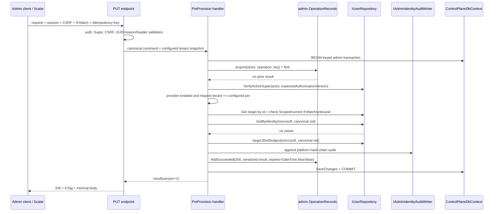

# Design: Entra Scoped Pre-provision

> Status: approved 2026-08-19

## Architecture Overview

เพิ่ม one-time Microsoft identity binding เป็น subresource ของ Scoped admin เดิม:

`PUT /api/v1/admins/{id:guid}/microsoft-identity`

ฟีเจอร์ใช้โครงเดิมทั้งหมด: Admin session, CSRF filter, Super tier gate,
`User.BindSubject`, keyed `"admin"` transaction, `admin.OperationRecords`,
tamper-evident `admin.AuditRecords`, ETag และ shared Problem Details handler. ไม่เพิ่ม Microsoft Graph,
permission ใหม่, bulk endpoint, Admin UI หรือ provider abstraction ทั่วไป

### Component map

| Layer | Change | Reuse / boundary |
|---|---|---|
| `Admins.Domain` | เพิ่ม immutable singleton `WorkforceTenantBinding` | `User.BindSubject(User.MicrosoftProvider, canonicalOid)` เป็น mutation เดียวของ target |
| `Admins.Application` | เพิ่ม command/handler กับ narrow `IAdminIdentityAuditWriter`; เพิ่ม current `AuthorizationVersion` ใน `Resolution`; ขยาย repository/operation portsเท่าที่ flow ใช้ | handler ไม่รู้ HTTP, OIDC options, Governance domain หรือ Microsoft SDK |
| `Persistence.ControlPlane` | tenant-pin initializer store, Active-Super lease, non-expiring replay, tamper-evident audit appender และ runtime EF mapping | context/UoW เดียวทำ target + audit + operation record ให้ atomic |
| `Admins.Infrastructure` + migration owner | migration-owner EF mapping, singleton table, exact subject validation/canonicalization และ grant | `PolDbContext` ยังเป็น migration owner เดียว |
| `Hosts/Api` | Authority parser/snapshot, pre-listen tenant-pin gate, endpoint, OIDC `tid`/`oid` validation, stable auth/CSRF/tier errors | Admin Microsoft เท่านั้น; Merchant Microsoft flow ไม่เปลี่ยน |
| `BuildingBlocks.Application/Web` | `NotFoundException` รองรับ optional stable code; Problem Details ใส่ safe `traceId` | constructor/behavior เดิมยังทำงาน |

### API contract

Request:

```http
PUT /api/v1/admins/{adminId}/microsoft-identity
Cookie: __Host-adm_session=...
X-CSRF-Token: ...
If-Match: "v3"
Idempotency-Key: employee-onboard-20260819-01
Content-Type: application/json

{
  "workforceTenantId": "11111111-1111-4111-8111-111111111111",
  "entraObjectId": "22222222-2222-4222-8222-222222222222",
  "reason": "Employee onboarding ticket HR-1234"
}
```

UUID ทั้งหมดในตัวอย่างเป็นค่าปลอม non-empty ห้ามนำค่า Lab/production เข้า source,
migration หรือ committed configuration

Success และ natural no-op:

```http
HTTP/1.1 200 OK
ETag: "v4"
Content-Type: application/json

{
  "adminId": "33333333-3333-4333-8333-333333333333",
  "provider": "microsoft",
  "subjectBound": true,
  "version": 4
}
```

Response ไม่มี workforce tenant ID, Object ID หรือ email. Request record ใช้
`JsonUnmappedMemberHandling.Disallow`; UUID รับเป็น string เพื่อแยก
`invalid_entra_tenant_id` กับ `invalid_entra_object_id` ได้แน่นอน

### Authorization and transaction boundary

ลำดับ request boundary:

1. `RequireAuthorization("admin")` ตรวจ Admin session สด
2. `RequireCsrf()` ตรวจ double-submit token
3. `RequirePlatformUserTier(Tier.Super)` ตรวจ request snapshot
4. endpoint parse/normalize body, privacy-safe reason, `If-Match`, `Idempotency-Key`
5. handler เริ่ม keyed `"admin"` transaction และตรวจ replay
6. operation ใหม่เท่านั้นจึง revalidate caller เป็น Active Super ด้วย
   `AuthorizationVersion` ปัจจุบัน ก่อนตรวจ provider/target และก่อนเขียน

`Resolution.AuthorizationVersion` เป็น non-positional init property เพื่อไม่ทำลาย caller
เดิม. Session resolver ใส่ค่าจาก `User.AuthorizationVersion`; endpoint ส่ง snapshot นี้เข้า
command. Persistence lease โหลด caller ใหม่ใน transaction, ตรวจ `Status=Active`,
`Tier=Super`, version ตรง และ force conditional no-op update ของ concurrency token เพื่อจับ
authorization change ที่ race ระหว่าง transaction

### Scope explicitly excluded

- ไม่มี bulk pre-provision; client เรียก endpoint รายคนด้วย key แยก
- ไม่มี identity rebind/unbind; ต้องเป็น workflow ใหม่พร้อม session revocation
- ไม่มี Entra invitation API หรือ Graph lookup; operator ใช้ tenant-local Object ID ที่ Entra ออกให้
- ไม่มี UI เพิ่มในรอบนี้; Scalar/API เป็น control surface สำหรับ Lab
- รอบนี้รองรับ Microsoft public cloud `login.microsoftonline.com`; sovereign cloud ต้องมี
  requirements, host allowlist และ test matrix แยก

## Sequence Diagrams

### Boot: validate Authority and pin workforce tenant

```mermaid
sequenceDiagram
    participant Host as Api boot
    participant Parse as AdminMicrosoftTenant parser
    participant Init as IWorkforceTenantBindingStore
    participant DB as SQL Server

    Host->>Parse: Resolve final AdminAuth Microsoft config
    alt Microsoft ClientId blank
        Parse-->>Host: Disabled
        Note over Host: Skip DB initialization; existing pin remains
    else provider enabled
        Parse->>Parse: Require login.microsoftonline.com/{tenant-guid}/v2.0
        Parse-->>Host: Enabled + canonical tenant Guid
        Note over Host: Development migration runs first when configured
        Host->>Init: EnsureAsync(canonicalTenant)
        Init->>DB: BEGIN + sp_getapplock("admin-workforce-tenant-binding")
        Init->>DB: SELECT singleton row Id=1
        alt row absent
            Init->>DB: INSERT Id=1, TenantId + COMMIT
        else row tenant matches
            Init->>DB: COMMIT, no write
        else row tenant differs
            Init-->>Host: safe InvalidOperationException
            Host-->>Host: fail boot before listening
        end
    end
```

### First binding



Target mutation, audit และ operation result อยู่ SaveChanges/transaction เดียวกัน. หาก
unique index, concurrency token, audit insert หรือ operation insert ล้มเหลว transaction rollback
ทั้งหมด

### Exact replay, natural no-op and conflicts

```mermaid
sequenceDiagram
    participant H as PUT endpoint
    participant M as Handler
    participant Op as Operation store
    participant U as admin.Users

    H->>H: auth + Super + CSRF + syntactic validation every request
    H->>M: command
    M->>Op: lock + find(actor, operation, key)
    alt prior hash matches and completed
        Op-->>M: stored non-expiring response
        Note over M: No provider/current-state/If-Match check
        M-->>H: original body + original ETag version
    else prior hash differs
        M-->>H: 409 idempotency_key_reused
    else prior outcome in progress/unknown
        M-->>H: 409 operation_in_progress
    else no prior
        M->>U: revalidate caller, provider/pin, target and If-Match
        alt target already has same Microsoft identity
            M->>Op: store 200 result only
            Note over U: No target version bump; no state-change audit
            M-->>H: 200 natural no-op
        else target bound to other identity
            M-->>H: 409 admin_identity_already_bound
        else identity belongs to other target
            M-->>H: 409 microsoft_identity_already_bound
        else unbound
            M->>U: bind once
        end
    end
```

Logical intent hash:

```text
SHA-256(
  targetAdminId:D + "\n" +
  workforceTenantId:D + "\n" +
  entraObjectId:D + "\n" +
  trimmedReason
)
```

ทุก UUID เป็น lowercase `D`; hash ไม่รวม `If-Match`. Fixed-length UUID fields ทำให้ newline
ก่อน reason ไม่กำกวม. ใช้ `System.Security.Cryptography.SHA256` เท่านั้น

Operation record ของ `PreProvisionMicrosoftIdentity` ใช้ `ExpiresAt=DateTime.MaxValue` จึงไม่ถูก
`OperationRecordPruneService` ลบและ exact replay ไม่มี time window. Existing operations เช่น session
revoke ยังคง expiry 24 ชั่วโมง. Endpoint นี้เป็น Super-only one-time operation; existing rate limit
จำกัด key spam. หากเพิ่ม bulk/high-volume flow ต้องออก retention contract ใหม่ก่อน ไม่ลด replay guarantee

### Employee login after binding

```mermaid
sequenceDiagram
    participant E as Employee browser
    participant Entra as Entra Workforce
    participant OIDC as AdminMicrosoft handler
    participant Login as LoginService
    participant Resolve as ResolveHandler
    participant DB as admin.Users / roles / merchants / sessions

    E->>OIDC: GET /api/v1/admin/auth/login/microsoft
    OIDC->>Entra: Authorization Code + PKCE
    Entra-->>OIDC: validated id_token
    OIDC->>OIDC: parse tid/oid as non-empty UUIDs
    OIDC->>OIDC: require tid == configured tenant; canonicalize oid
    OIDC->>Login: provider=microsoft, subject=canonical oid, emailVerified=false
    Login->>Resolve: Resolve(microsoft, oid)
    Resolve->>DB: identity lookup + fresh status/tier/roles/merchant assignments
    alt no binding, including same email invite
        Resolve-->>Login: NotFound
        Login-->>E: /login-error?reason=not-provisioned
    else Suspended
        Resolve-->>Login: Suspended
        Login-->>E: /login-error?reason=suspended
    else Active Scoped
        Resolve-->>Login: Scoped resolution
        Login->>DB: session + auth audit (Microsoft subject omitted)
        Note over Login: Admin principal carries internal AdminId, not external oid
        Login-->>E: dashboard redirect + Admin cookies
    end
```

## Data Models & Interfaces

### Workforce tenant singleton

```csharp
// Admins.Domain.Users
public sealed class WorkforceTenantBinding : Entity<byte>
{
    public const byte SingletonId = 1;
    public Guid TenantId { get; private set; }

    private WorkforceTenantBinding() { }
    public static WorkforceTenantBinding Create(Guid tenantId);
}
```

Table `admin.WorkforceTenantBindings`:

| Column | SQL | Constraint |
|---|---|---|
| `Id` | `tinyint` | PK, CHECK `Id = 1` |
| `TenantId` | `uniqueidentifier` | required |

ไม่มี update method. Runtime mapping ใส่ `AppendOnlyDescriptor.Mark`; migration grant ให้
`pol_app` เฉพาะ `SELECT, INSERT`. `ControlPlaneWorkerWriteAuthorizer` เพิ่มเฉพาะ
`(WorkforceTenantBinding, Insert)` เพื่อให้ pre-listen initializer เขียนได้จาก background
scope; HTTP authorizer ไม่ได้ capability นี้

```csharp
public interface IWorkforceTenantBindingStore
{
    Task EnsureAsync(Guid configuredTenantId, CancellationToken cancellationToken);
}
```

Implementation ใช้ `ControlPlaneDbContext`, keyed admin UoW และ
`GovernanceSqlLockManager` เดิม. `EnsureAsync` ไม่คืนหรือ log tenant ID

### Tamper-evident identity audit

ใช้ platform-scope `admin.AuditRecords` ที่มี per-scope hash chain, append-only runtime guard และ
external anchor support อยู่แล้ว ไม่เพิ่ม columns ให้ `admin.UserAudits` และไม่สร้าง audit table ใหม่

```csharp
public sealed record AdminIdentityAuditEntry(
    Guid ActorAdminId,
    Guid TargetAdminId,
    string Reason,
    string IdentityFingerprint,
    long ResourceVersion,
    string CorrelationId,
    DateTime OccurredAt);

public interface IAdminIdentityAuditWriter
{
    Task AppendMicrosoftPreProvisionAsync(
        AdminIdentityAuditEntry entry, CancellationToken cancellationToken);
}
```

Port อยู่ `Admins.Application`; implementation อยู่ `Persistence.ControlPlane` ซึ่งอ้างทั้ง Admins และ
Governance อยู่แล้ว จึงไม่สร้าง cross-module dependency จาก Application. Extract private append logic
ของ `GovernanceStore` เป็น internal scoped `GovernanceAuditAppender` แล้วให้ทั้ง store เดิมและ writer
ใหม่นี้ reuse lock/head/hash-chain code เดียวกัน

Audit record:

| Field | Value |
|---|---|
| Scope | `platform` |
| Action | `admin.microsoft-identity.preprovisioned` |
| Actor | internal acting Admin ID |
| Resource | `admin` + target Admin ID |
| Result | `succeeded` |
| Resource version | new target version |
| Correlation/time | request correlation ID + UTC clock |
| Canonical changes JSON | `provider=microsoft`, trimmed reason, `subjectBoundBefore=false`, `subjectBoundAfter=true`, fingerprint |

`AuditRedactor.RedactAndCanonicalize` canonicalize changes ก่อน hash. Fingerprint:

```text
"sha256:" + lowerHex(SHA-256(UTF8(tenantId:D + "\n" + objectId:D)))
```

Reason policy ที่ request boundary ทำให้ accepted reason บันทึกได้ตรงตามที่ trim และไม่กลายเป็น
identity leak: reject ด้วย `invalid_reason` หาก reason มี `@` หรือมี tenant/Object ID ของ request
ในรูป `D`, `N`, `B`, `P` หรือ `X` แบบ case-insensitive. Handler ไม่ interpolate identity/email
ลง reason. Raw tenant/Object ID อยู่เฉพาะ request memory และ `User.Subject` ที่ต้องใช้ resolve;
ไม่อยู่ audit, auth audit, response, exception หรือ application log

### Admin session subject minimization

หลัง OIDC resolve สำเร็จ Admin session principal ใช้ internal Admin ID ใน
`ClaimTypes.NameIdentifier` และไม่ emit external provider subject เป็น `sub`. สี่ host call sites ที่เคย
อ่าน `http.User.FindFirst("sub")` ส่ง `admin:{scope.Current.AdminId:D}` เข้า legacy string fields
`AdminSubject`/`ActorSubject` แทน; canonical actor ID ที่มีอยู่ยังคงใช้ authorization/correlation เหมือนเดิม.
จึงไม่มี Microsoft `oid` ไหลเข้า merchant provisioning/approval/rejection/reveal audits

Microsoft login-success/denial ใช้ `AuthAudit.Subject = null`; Google callback binding และ Google
auth-audit subject คงเดิม. Historical audit rows ไม่ถูก rewrite; invariant นี้ใช้กับ write ใหม่หลัง rollout

### Command, result and request snapshot

```csharp
public sealed record PreProvisionMicrosoftIdentityCommand(
    Guid TargetAdminId,
    Guid WorkforceTenantId,
    Guid EntraObjectId,
    string Reason,
    Guid ActingAdminId,
    long ExpectedAuthorizationVersion,
    long ExpectedTargetVersion,
    string CorrelationId,
    string IdempotencyKey,
    Guid? ConfiguredWorkforceTenantId)
    : ICommand<PreProvisionMicrosoftIdentityResult>;

public sealed record PreProvisionMicrosoftIdentityResult(
    Guid AdminId,
    string Provider,
    bool SubjectBound,
    long Version);
```

`ConfiguredWorkforceTenantId=null` หมายถึง Admin Microsoft provider disabled. ค่านี้มาจาก
validated server configuration ไม่ใช่ request. Application handler ไม่ bind options และไม่เรียก Graph

### Existing ports extended

```csharp
public interface IUserRepository
{
    // existing members unchanged
    Task VerifyActiveSuperAsync(
        Guid callerId, long expectedAuthorizationVersion, CancellationToken cancellationToken);
}

public sealed record AdminOperationReplay(
    string RequestHash, string? ResponseBody, bool InProgress);

public interface IAdminOperationStore
{
    // AcquireAsync / FindAsync unchanged
    void AddSucceeded(
        Guid actorId, string operation, string idempotencyKey, string requestHash,
        int responseStatus, string responseBody, DateTime now, DateTime expiresAt);
}
```

`AddSucceeded` รับ status/expiry: feature ใหม่ส่ง `200` กับ `DateTime.MaxValue`; existing session
revoke ส่ง `204` กับ `now.AddHours(24)`. ไม่เพิ่ม idempotency table ใหม่

`VerifyActiveSuperAsync` ใช้ `AuthorizationLease` เดิมแต่เพิ่ม Tier/Status check. Failure ก่อน
write เป็น `AccessDeniedException(..., "super_required")`. หาก authorization race ทำให้ commit
ชน concurrency handler re-read caller หลัง rollback: caller ไม่ Active Super/version เปลี่ยนคืน
`super_required`; มิฉะนั้นคง `state_conflict` ของ target race

### Handler decision table

| Order after replay miss | Condition | Outcome |
|---|---|---|
| 1 | caller ไม่ Active Super หรือ authorization version เปลี่ยน | `403 super_required` |
| 2 | `ConfiguredWorkforceTenantId` ไม่มี | `409 microsoft_provider_disabled` |
| 3 | request tenant ไม่ตรง configured/persisted pin | `400 entra_tenant_mismatch` |
| 4 | target ไม่มี | `404 admin_not_found` |
| 5 | target tier ไม่ใช่ Scoped | `409 target_not_scoped` |
| 6 | target version ไม่ตรง `If-Match` | `409 state_conflict` |
| 7 | target bound identity เดิม | `200` natural no-op; operation record เท่านั้น |
| 8 | target bound identity อื่น | `409 admin_identity_already_bound` |
| 9 | identity อยู่ target อื่น | `409 microsoft_identity_already_bound` |
| 10 | unbound + identity free | bind, audit, operation result, `200` |

Race handling:

- identity ต่างกันไป target เดียวกัน: `User.Version` concurrency token ให้ winner เดียว;
  loser ได้ `state_conflict`
- identity เดียวกันไปคนละ target: filtered unique index `(Provider, Subject)` ให้ winner เดียว;
  loser re-read identity หลัง rollback แล้ว map เป็น `microsoft_identity_already_bound`
- actor/operation/key เดียวกัน: transaction-owned application lock serialize replay decision

### Migration

Migration เดียวทำสามอย่าง:

1. สร้าง `admin.WorkforceTenantBindings` + singleton CHECK
2. validate existing `Provider='microsoft' AND Subject IS NOT NULL` แบบ exact `D`, ไม่ใช้
   `TRY_CONVERT` อย่างเดียว: `DATALENGTH(Subject)=72` สำหรับ `nvarchar(36)`, conversion ต้องสำเร็จ,
   และ raw value ต้องเท่ากับ `CONVERT(nvarchar(36), convertedGuid)` แบบ case-insensitive; จากนั้น
   group ด้วย converted Guid เพื่อ reject semantic duplicate. `guid + suffix`, braces, `N` format,
   trailing spaces และ malformed value ต้อง `THROW` แบบ generic โดยไม่ echo subject
3. normalize valid Microsoft subject เป็น lowercase UUID `D` และ grant singleton table
   `SELECT, INSERT` ให้ `pol_app`

SQL Server ถือ conversion ไป `uniqueidentifier` เป็น truncating conversion จึงต้องมี exact
length/round-trip guard ก่อน update. `Down` revoke grant และ drop singleton table; casing normalization
ไม่ย้อนกลับเพราะ identity semantic ไม่เปลี่ยน. Production rollout ต้อง backup ก่อน migration;
rollback ปกติให้ถอย app แล้วคง additive table. รัน staging ก่อน production ตาม release policy

## Technology Decisions

### 1. Tenant belongs to database, not each admin row

Admin Microsoft identity ปัจจุบันคือ `(provider, subject)`. เพิ่ม tenant ทุก `User` จะขยาย
aggregate/index/login query โดยไม่จำเป็น เพราะหนึ่ง Admin Console database รองรับ workforce tenant
เดียว. Singleton pin ทำให้ `(microsoft, oid)` ปลอดภัย และจับ Authority drift ตั้งแต่ boot

### 2. Parse enabled Admin Authority in every environment

เมื่อ Microsoft `ClientId` ไม่ว่าง parser บังคับ:

- absolute `https` URI
- host ตรง `login.microsoftonline.com` แบบ ordinal-ignore-case, default port `443` และไม่มี userinfo
- path รูป `/{tenant-guid}/v2.0` เท่านั้น
- tenant เป็น non-empty UUID
- ไม่มี query/fragment

terminal slash หนึ่งตัวรับได้แล้ว normalize ทิ้ง; path segment อื่น, arbitrary host, CIAM host และ
sovereign host ถูกปฏิเสธ. ผลเป็น immutable singleton snapshot. Validation นี้รันทั้ง
Development/Test/Production; secret/placeholder guard เดิมยังคง production-only. Provider disabled
ข้าม Authority/pin

### 3. Explicit pre-listen initialization beats hosted-service ordering

หลัง Development migration และก่อน `app.Run`, `Program.cs` สร้าง background DI scope แล้วเรียก
`IWorkforceTenantBindingStore.EnsureAsync`. วิธีนี้รับประกันว่า Kestrel ยังไม่รับ Microsoft login
หรือ pre-provision ขณะ pin ยังไม่พร้อม และไม่พึ่งลำดับ hosted services. DB-less OIDC
`WebApplicationFactory` tests override store นี้ด้วย fake/no-op; SQL integration tests ใช้ implementation
จริงและเป็นเจ้าของ boot-pin assertions

### 4. Canonicalize at every trust boundary

- request UUID: `Guid.TryParse`, reject `Guid.Empty`, render lowercase `D`
- OIDC `tid`/`oid`: parse, reject empty, require `tid` ตรง Authority snapshot, ส่ง canonical oid
- existing optional `AllowedTenants` ยังคงเป็น additional restriction; ห้ามขยายข้าม pinned tenant
- persisted historical subject: migration normalize
- Microsoft bootstrap allowlist: parse GUID entry และ compare Guid/canonical value;
  Google comparison คง ordinal behavior เดิม

ไม่เปลี่ยน shared Merchant Microsoft handler จึงไม่สร้าง regression ข้าม BFF plane

### 5. Reuse tamper-evident platform audit through narrow port

Security floor ต้องการ append-only และ tamper-evident audit. ฟีเจอร์จึงเขียน `admin.AuditRecords`
ผ่าน `IAdminIdentityAuditWriter` แทน `admin.UserAudits`. `Admins.Application` เห็นเพียง narrow port;
`Persistence.ControlPlane` reuse `GovernanceAuditAppender` ภายในสำหรับ scope lock, head, canonical hash
และ chain update. ไม่เพิ่ม audit table/columns และไม่ทำให้ Application อ้าง Governance domain

### 6. Replay precedes mutable gates

Request ทุกครั้งยังผ่าน auth, Super gate, CSRF และ syntax. หลัง operation lock หาก exact replay
พบผลสำเร็จ handler คืนผลเดิมก่อน provider, tenant pin, caller lease, target state และ current
`If-Match`. นี่ทำให้ retry หลัง response loss เสถียร แม้ provider ถูกปิดหรือ target version เปลี่ยน

Replay ไม่เขียน target/audit. Operation ใหม่เท่านั้นทำ authorization lease และ state checks.
Natural no-op ไม่ใช่ replay จึงต้องใช้ current `If-Match`. Result ของ operation นี้ใช้
`ExpiresAt=DateTime.MaxValue`; prune service จึงไม่ลบและ exact replay ยังทำงานหลัง 24 ชั่วโมง

### 7. One transaction, one save

Binding, `AuditHead`/`AuditRecord`, authorization lease no-op update และ `OperationRecords` ใช้
`ControlPlaneDbContext`/keyed admin UoW เดียว. ไม่มี outbox/Graph call. SQL constraints และ EF
concurrency เป็น final race guards; application pre-check มีไว้คืน code ที่แม่น

### 8. No new dependency

ใช้ ASP.NET Core OIDC, EF Core, SQL Server `sp_getapplock`, `Guid`, `SHA256` และ
`System.Text.Json` ที่มีอยู่. ไม่มี Microsoft Graph SDK, regex package หรือ idempotency library ใหม่

### Adversarial review resolution

| Finding | Resolution |
|---|---|
| replay หายหลัง prune 24 ชั่วโมง | operation นี้ใช้ non-expiring result; existing operations คง 24 ชั่วโมง |
| raw Microsoft `oid` ไหลผ่าน session/downstream audit | ตัด external `sub`; legacy actor subject ใช้ internal Admin ID; reason reject identity/email material |
| `UserAudits` ไม่ tamper-evident | เปลี่ยนเป็น existing hash-chained `AuditRecords` ผ่าน narrow writer |
| SQL GUID conversion truncate suffix | exact byte-length + conversion + round-trip + semantic-duplicate checks ก่อน normalize |
| DB-less OIDC tests ไม่มี SQL | factory override pin store ด้วย fake/no-op; real pin behavior อยู่ SQL integration tests |
| arbitrary HTTPS host ไม่ยืนยัน Workforce authority | allow เฉพาะ public-cloud `login.microsoftonline.com`; sovereign/CIAM อยู่นอก scope |

## Error Handling Strategy

ทุก feature error เป็น `application/problem+json` ตาม RFC 9457 พร้อม `status`, safe `title`,
stable `code`, `traceId`; middleware echo ค่าเดียวกันใน `X-Correlation-ID`. Body/exception/log
ไม่ echo tenant ID, Object ID, email, token, reason หรือ idempotency key

| Status | Code | Producer |
|---|---|---|
| `400` | `invalid_entra_tenant_id` | endpoint UUID parser |
| `400` | `invalid_entra_object_id` | endpoint UUID parser |
| `400` | `entra_tenant_mismatch` | handler configured-pin comparison |
| `400` | `invalid_reason` | endpoint trim/length `1..1000` หรือพบ `@`/request identity material |
| `400` | `invalid_etag` | `VersionEtags.Require` |
| `400` | `invalid_idempotency_key` | `IdempotencyKeys.Require` |
| `401` | `admin_session_required` | `SessionAuthenticationHandler.HandleChallengeAsync` |
| `403` | `csrf_failed` | `CsrfFilter` |
| `403` | `super_required` | tier filter หรือ in-transaction lease |
| `404` | `admin_not_found` | coded `NotFoundException` |
| `409` | `microsoft_provider_disabled` | handler provider snapshot gate |
| `409` | `target_not_scoped` | handler target tier gate |
| `409` | `admin_identity_already_bound` | handler target binding gate |
| `409` | `microsoft_identity_already_bound` | pre-check หรือ post-rollback unique-race mapping |
| `409` | `state_conflict` | expected version หรือ EF concurrency |
| `409` | `idempotency_key_reused` | operation hash mismatch |
| `409` | `operation_in_progress` | prior operation has no final response |

Shared changes additive:

- `NotFoundException` เพิ่ม optional `Code`; one-argument constructor เดิมคงอยู่
- shared exception handler map code นี้และใส่ `traceId`
- Admin session challenge, Super tier filter และ CSRF filter เพิ่ม stable code ให้ endpoint เดิมด้วย

Malformed transport JSON/route ไม่ใช่ logical branch ใน wire table และยังใช้ framework `400/404`.
ทุก branch ที่ acceptance criteria ระบุมี code ตามตาราง. Boot config/pin failure throw generic
`InvalidOperationException` และ process ไม่ listen; error ห้ามมี actual tenant value

## Testing Strategy

### Unit and contract tests

| Test area | Required assertions |
|---|---|
| Domain | one-time `BindSubject`; singleton tenant immutable |
| Handler success | Scoped Active/Suspended target bind ได้; version +1; email/tier/status/profile/roles/merchants unchanged; one hash-chain audit + one non-expiring operation result |
| Handler no-op/replay | exact replay ignores changed valid `If-Match` and provider/current-state drift รวมหลัง prune boundary; natural no-op requires current ETag, no target bump/audit; changed hash/in-progress codes |
| Handler conflicts | provider disabled, tenant mismatch, not found, Super target, other target identity, same identity other target, stale ETag |
| Authorization lease | already-stale/suspended/demoted caller -> `super_required`; concurrent authorization change rolls back target/audit/op |
| Host contract | all 17 stable codes, `traceId`, response shape, `ETag`, CSRF/auth/Super gates, UUID/reason/header validation รวม identity/email rejection, OpenAPI headers |
| OIDC | `tid`/`oid` UUID canonicalization; tenant mismatch/missing claims denied; canonical oid resolves; same email unbound invite remains `not-provisioned`; Google unchanged; Microsoft auth audit/principal stores no raw subject; four downstream actor-subject callsites use internal Admin ID |
| Config | disabled provider; valid public-cloud Authority; placeholder/multi-tenant/non-GUID/wrong host/port/path/query failures; CIAM/sovereign/arbitrary host rejected; uppercase tenant canonicalization; existing `AllowedTenants` remains additive |

Application tests ใช้ fakes เดิมใน `tests/Admins.Tests/AdminFakes.cs`; เพิ่มเฉพาะ method/row ที่
port ใหม่ต้องใช้. Host tests ใช้ existing `OidcCallbackE2ETests` และ WebApplicationFactory patterns;
DB-less factories override `IWorkforceTenantBindingStore` ด้วย deterministic fake/no-op

### SQL integration and migration tests

- fresh migration สร้าง singleton/grant และ `Down` คืน schema ตามที่ประกาศ
- existing valid Microsoft subjects ถูก canonicalize; `guid + suffix`, braces, `N` format, trailing
  spaces, malformed และ semantic duplicate ทำ migration fail โดยไม่ echo subject
- first boot initializes row; second boot same tenant no-op; different Authority tenant fail; concurrent initializers ได้หนึ่ง row
- real SQL concurrency: identity เดียว/สอง targets winner เดียว, identities ต่างกัน/target เดียว winner เดียว
- forced audit/save failure ทิ้ง binding/audit/operation record เป็นศูนย์
- operation result รอด prune boundary และ exact replay คืน body/ETag เดิม
- append-only runtime guard ปฏิเสธ update/delete audit และ tenant pin; audit hash/previous-hash/head
  และ anchor verification ผ่านหลัง append

### Full gate

```bash
dotnet build pol-core.slnx --no-restore -warnaserror
dotnet test pol-core.slnx --no-build --filter "Category!=Integration"
dotnet test tests/Integration.Tests/Integration.Tests.csproj --no-build
scripts/spec-trace.sh entra-scoped-preprovision
```

Integration command ต้องใช้ SQL Server test environment ตาม repo protocol. CI ต้องผ่าน test + lint/
guards ก่อน merge; ห้ามลด coverage หรือ skip test

### Lab verification and measures

1. Super อ่าน `GET /api/v1/admins/{employeeId}` เก็บ baseline `ETag`, tier, status, roles,
   merchants, org profile และ `subjectBound=false`
2. Super เรียก PUT ด้วย tenant/Object ID จาก tenant-local Entra user, reason, CSRF,
   baseline `If-Match` และ unique `Idempotency-Key`
3. วัดผล: `200`, response minimal, `ETag` เพิ่มหนึ่ง; detail เป็น
   `subjectBound=true`; authorization fields เท่า baseline
4. เรียก exact request/key ซ้ำด้วย valid `If-Match` อื่น; วัด body/ETag เดิมและ audit ไม่เพิ่ม
5. ผู้รับ redeem Entra invitation, sign out Microsoft session เก่า แล้ว login Admin Console ด้วย
   employee account
6. วัดผล: ถึง dashboard; `/api/v1/admins/me` เป็น `scoped`, permission และ merchant scope
   ตรง baseline; Entra sign-in log แสดง success และ expected tenant
7. Negative control: Microsoft account ที่ไม่มี binding ได้ `not-provisioned`; ไม่มี Super row/session ใหม่
8. ตรวจ `GET /api/v1/audits` หรือ `admin.AuditRecords`: action/actor/target/reason/
   before-after/fingerprint ครบ, hash chain verify ผ่าน และไม่มี raw tenant/Object ID/email/token

## Requirement Traceability

| Section | REQ |
|---|---|
| API contract, request validation, security gates, tenant Authority/pin, transaction lease และ stable errors | REQ-1.1-1.24 |
| `User.BindSubject`, target invariants, ETag, concurrency constraints, atomic transaction และ minimal response | REQ-2.1-2.19 |
| operation lock/record, canonical intent hash, exact replay precedence และ natural no-op | REQ-3.1-3.9 |
| Admin Microsoft OIDC `tid`/`oid`, fresh resolution/session, no email binding และ Scoped preservation | REQ-4.1-4.12 |
| tamper-evident `AuditRecords`, fingerprint, safe session/auth audit/log/error และ current detail projection | REQ-5.1-5.13 |
| backward compatibility, no hardcode/Graph, automated/contract/integration/Lab verification | REQ-6.1-6.16 |
