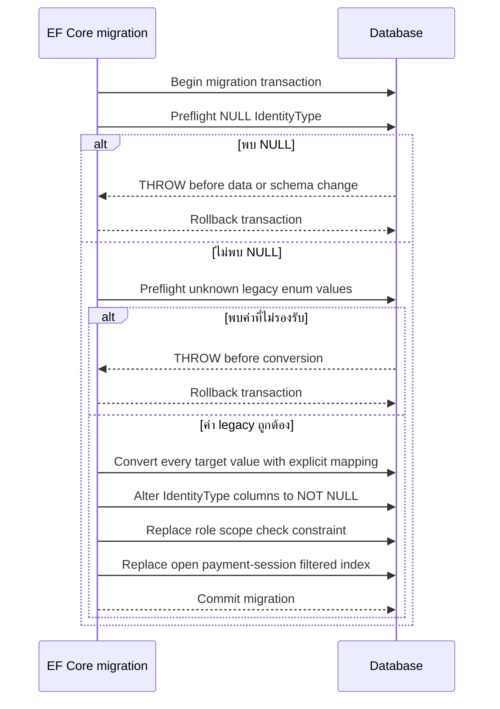
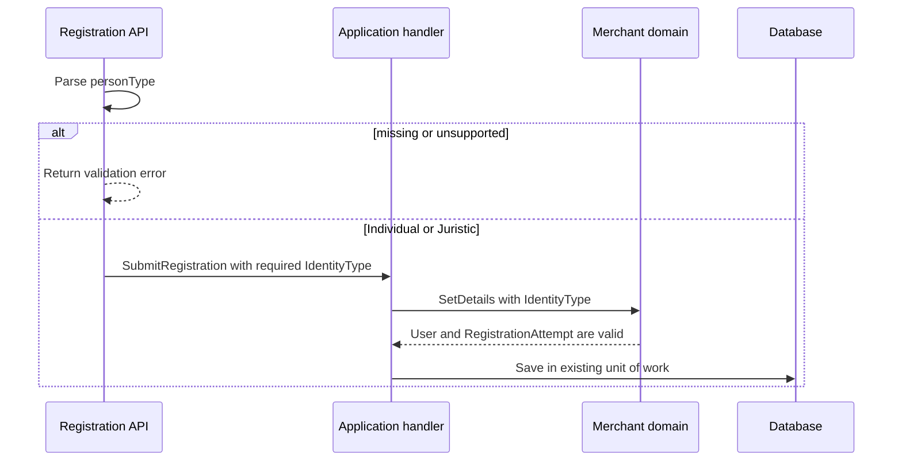

# Design: One-Based Persisted Enum Storage

> Status: approved 2026-08-08
> Date: 2026-08-08

เปลี่ยนค่าตัวเลขของ persisted enum ที่ระบุให้เริ่มที่ `1` โดยให้ domain model, EF Core model, SQL consumer, migration และเอกสารอ้างอิงใช้ contract เดียวกัน

## Architecture Overview

การเปลี่ยนแปลงแบ่งตาม owner ของข้อมูล:

| พื้นที่ | จุดแก้หลัก | หน้าที่ |
| --- | --- | --- |
| Domain | enum ใน `src/Modules/*/*.Domain` | กำหนดค่าคงที่ที่ application ใช้และ serialize ลงฐานข้อมูล |
| Persistence | EF configurations ใน `src/Modules/*/*Infrastructure` และ `src/Persistence/*` | ทำให้ column เป็น `int`, identity field เป็น required และให้ filter/check constraint ตรงกับค่าใหม่ |
| Migration | migration ใหม่ของ `PolDbContext` | แปลงข้อมูลเดิมจาก zero-based เป็น one-based แบบ atomic พร้อม preflight |
| Application/API | merchant registration flow | ปฏิเสธ `IdentityType` ที่หายหรือไม่อยู่ในค่าที่รองรับก่อนเขียนข้อมูล |
| SQL consumers | query, session store, catalog resolution, integration tests | เปลี่ยน literal ให้ตรงกับ persisted contract |
| Reference docs | `docs/reference/**` | แสดง type, nullability, mappings, filter และ migration chain ปัจจุบัน |

ไม่แก้ migration ที่ apply ไปแล้ว (`InitialSchema`, `SecurityObjects`, `SeedData`) เพราะจะทำให้ฐานข้อมูลที่มีประวัติ migration แล้ว diverge จากฐานข้อมูลใหม่ ให้เพิ่ม forward migration หนึ่งรายการและปรับ model snapshot/designer ตามที่ EF สร้าง

## Sequence Diagrams

### Forward migration

### Merchant registration

## Data Models & Interfaces

### Persisted enum contract

| Table | Column | New values |
| --- | --- | --- |
| `admin.Sessions` | `Status` | `Active=1`, `Superseded=2`, `Revoked=3` |
| `admin.Users` | `Tier` | `Scoped=1`, `Super=2` |
| `admin.Users` | `Status` | `Active=1`, `Suspended=2` |
| `iam.PermissionGroups` | `Scope` | `Platform=1`, `Merchant=2` |
| `iam.PermissionGroups` | `Status` | `Active=1`, `Inactive=2` |
| `iam.Permissions` | `Status` | `Active=1`, `Inactive=2` |
| `iam.Roles` | `Status` | `Active=1`, `Inactive=2` |
| `iam.Roles` | `Scope` | `Platform=1`, `Merchant=2` |
| `cfg.Positions` | `Status` | `Active=1`, `Inactive=2` |
| `cfg.Offices` | `Status` | `Active=1`, `Inactive=2` |
| `cfg.Levels` | `Status` | `Active=1`, `Inactive=2` |
| `cfg.Divisions` | `Status` | `Active=1`, `Inactive=2` |
| `merch.Merchants` | `Status` | `Active=1`, `Inactive=2` |
| `merch.RegistrationAttempts` | `Purpose` | `Registration=1`, `Correction=2` |
| `merch.RegistrationAttempts` | `IdentityType` | `Individual=1`, `Juristic=2` |
| `merch.Sessions` | `Status` | `Active=1`, `Superseded=2`, `Revoked=3` |
| `merch.Users` | `Status` | `PendingApproval=1`, `Active=2`, `Rejected=3`, `Suspended=4` |
| `merch.Users` | `IdentityType` | `Individual=1`, `Juristic=2` |
| `shop.Orders` | `Status` | `Pending=1`, `Paid=2`, `Failed=3`, `Expired=4`, `Refunded=5`, `Cancelled=6` |
| `txn.PaymentSessions` | `Psp` | `TwoCTwoP=1`, `Omise=2` |
| `txn.PaymentSessions` | `Status` | `Created=1`, `Redirected=2`, `Paid=3`, `Failed=4`, `Expired=5` |
| `txn.PspConnections` | `Psp` | `TwoCTwoP=1`, `Omise=2` |

Enum declarations use explicit numeric assignments. No value-offset converter is introduced; the database contract remains directly visible in domain code and raw SQL.

### Required identity fields

`merch.Users.IdentityType` and `merch.RegistrationAttempts.IdentityType` become non-nullable `IdentityType` properties in both merchant persistence contexts. `RegistrationForm.IdentityType` and registration history view models use the non-nullable type. The API parser rejects missing or unsupported `personType`; domain `SetDetails` and attempt construction retain enum-defined-value validation as a second boundary.

### Migration operations

The new migration performs these operations in one transaction:

1. Abort if either identity column contains `NULL`.
2. Abort if any target column contains a value outside its known legacy range. This prevents silently changing corrupt or already-converted data.
3. Convert each legacy value explicitly (`0 -> 1`, `1 -> 2`, and so on; `merch.Merchants.Status` only converts its current `Active=0` rows to `1`).
4. Alter both identity columns to `int NOT NULL`.
5. Replace `CK_Roles_ScopeMerchant` with a check using `Scope=1` for platform and `Scope=2` for merchant.
6. Recreate `IX_PaymentSessions_OrderId_Open` with filter `Status IN (1, 2)`.

`Down` reverses the same operations: it checks the one-based values, converts them back, restores nullable identity columns, restores the old role check, and restores the old payment-session filter `Status IN (0, 1)`. Any failed preflight or operation rolls back the transaction.

### Runtime predicates

All active/open/status predicates in current source and integration tests are updated to named one-based values. In particular, open payment sessions use `Status IN (1, 2)`, role scope predicates use `1`/`2`, and session state transitions use `Active=1`, `Superseded=2`, `Revoked=3`. Non-target enums and their predicates remain unchanged.

## Technology Decisions

- Use explicit enum values instead of a global converter. Existing raw SQL, indexes, constraints and seed/migration boundaries require the persisted numbers to be unambiguous.
- Add one EF Core forward migration; do not rewrite historical migrations. This preserves upgradeability for databases that already recorded the old migration IDs.
- Put NULL and invalid-value checks at the first SQL statements in `Up` and `Down`. No guessed backfill is allowed.
- Keep migration-owned seed data historical. Current runtime seed paths use the new enum values; the migration performs the one-time data conversion for existing rows.
- Keep API wire names unchanged (`Active`, `Paid`, `2c2p`, etc.). Only persisted integer values change.
- Add no dependency and no new abstraction. Reuse existing EF migration transaction, configuration, validation, and test patterns.

## Error Handling Strategy

| Failure | Handling | Data effect |
| --- | --- | --- |
| Missing `personType` | API validation error before command handling | No write |
| Unsupported `personType` | API validation error before command handling | No write |
| `NULL` identity in existing database | SQL `THROW` before conversion or DDL | Transaction rolls back; schema/data unchanged |
| Unknown legacy enum value | SQL `THROW` before conversion | Transaction rolls back; schema/data unchanged |
| Migration DDL/index/constraint failure | EF transaction rollback | Partial conversion is not retained |
| Invalid enum supplied to domain boundary | Reject with existing domain/application validation pattern | No invalid entity is persisted |

Migration must run against a backup/staging-verified database before production use. This design does not perform production execution.

## Testing Strategy

- Domain/application tests assert every target enum's underlying value and reject missing/invalid merchant registration identity values.
- Persistence/configuration tests assert both merchant contexts make identity columns required, role scope check uses `1`/`2`, and payment open-session filter uses `(1, 2)`.
- Integration tests run the forward migration against legacy values and verify every converted value, non-null identity columns, role constraint, and filtered-index definition.
- Migration preflight tests insert `NULL` identity values and verify migration fails without changing any target row or schema.
- Rollback tests verify `Down` restores zero-based values, old nullability, role scope constraint, and old filtered-index predicate.
- Existing integration tests cover session transitions, IAM active/inactive resolution, admin isolation, merchant approval, orders, PSP selection, and payment session expiry after literal updates.
- A current reference/document parity check verifies every listed field, mapping, nullability and migration-chain entry in `docs/reference/**`.

## Requirement Traceability

| Section | REQ |
| --- | --- |
| Explicit persisted enum contract table and domain assignments | REQ-1.1, REQ-1.2, REQ-1.3, REQ-1.4, REQ-1.5, REQ-1.6, REQ-1.7, REQ-1.8, REQ-1.9, REQ-1.10, REQ-1.11, REQ-1.12, REQ-1.13, REQ-1.14, REQ-1.15, REQ-1.16, REQ-1.17, REQ-1.18, REQ-1.19, REQ-1.20, REQ-1.21, REQ-1.22 |
| EF mappings, SQL predicates and non-target boundary | REQ-2.1, REQ-2.2, REQ-2.3, REQ-2.4 |
| Required identity fields and registration validation | REQ-3.1, REQ-3.2, REQ-3.3, REQ-3.4 |
| Atomic forward/reverse migration with preflight and index/check updates | REQ-4.1, REQ-4.2, REQ-4.3, REQ-4.4, REQ-4.5, REQ-4.6, REQ-4.7 |
| Current reference docs and regression/parity tests | REQ-5.1, REQ-5.2, REQ-5.3, REQ-5.4 |
