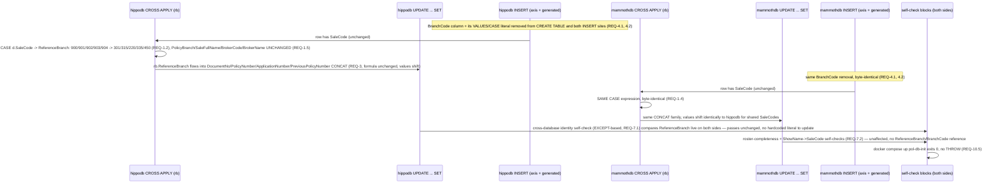

# Design: External Sim Realistic Branch Codes

> Status: approved 2026-08-02

## Architecture Overview

Single-file change, `docker/bootstrap/02-external-sim.sql`, plus `SpDocumentContractTests.cs`,
`SpDocumentGatewayIntegrationTests.cs`, `docs/reference/products.md`, and an append-only footnote
in `products-sp-gateway/HANDOFF.md`. No new components, no schema migration, no new table. Two
independent changes land in the same file, in the same CASE/CROSS APPLY block each side already
has:

1. **Value swap** — `ReferenceBranch`'s `CROSS APPLY` CASE expression (REQ-1) changes its five
   output literals from `{900,901,902,903,904}` to `{301,315,220,335,450}`, byte-identical on both
   hippodb and mammothdb. The `SaleCode`-keyed structure, the `IN ('77001','77006')` pairing on the
   first arm, and every downstream `CONCAT`-based formula (`DocumentNo`/`PolicyNumber`/
   `ApplicationNumber`/`PreviousPolicyNumber`) are untouched — only the five literals substitute.
   (Originally `101`/`115` for the first two groups; corrected to `301`/`315` per REQ-2.4 — see
   "ReferenceBranch value scheme" below.)
2. **Column removal** — `dbo.Documents.BranchCode` (REQ-4) is dropped from both `CREATE TABLE`
   statements and both INSERT sites per database (4 sites total: axis-row `VALUES`, generated-row
   `SELECT`, ×2 databases). `@BranchCode` the SP input parameter (REQ-5) is untouched — it is a
   parameter, not a column, and nothing in its declare/trim/validate path reads
   `dbo.Documents.BranchCode`.

These two changes are independent in mechanism (different columns, different code regions) but
land in the same commit because both trace to the same PDF-driven correction: `ReferenceBranch` is
the one real branch-identifying field in §5.2, so it is both the field being made realistic (REQ-1)
and the field that makes the parallel `BranchCode` column redundant to keep around (REQ-4).

## Sequence Diagrams



## Data Models & Interfaces

### ReferenceBranch value scheme (REQ-1) — replaces the existing CASE literals, structure unchanged

Both `docker/bootstrap/02-external-sim.sql:519-524` (hippodb) and `:1000-1004` (mammothdb) today
read:

```sql
SELECT CASE WHEN d.SaleCode IN ('77001', '77006') THEN '900'
            WHEN d.SaleCode =    '77002'          THEN '901'
            WHEN d.SaleCode =    '77003'          THEN '902'
            WHEN d.SaleCode =    '77004'          THEN '903'
            WHEN d.SaleCode =    '77005'          THEN '904' END AS ReferenceBranch
```

Becomes, on both sides (only the five string literals change; `WHEN` conditions, `SaleCode`
pairing, and column alias are untouched):

```sql
SELECT CASE WHEN d.SaleCode IN ('77001', '77006') THEN '301'
            WHEN d.SaleCode =    '77002'          THEN '315'
            WHEN d.SaleCode =    '77003'          THEN '220'
            WHEN d.SaleCode =    '77004'          THEN '335'
            WHEN d.SaleCode =    '77005'          THEN '450' END AS ReferenceBranch
```

| SaleCode | ReferenceBranch (old) | ReferenceBranch (new) | PolicyBranch (unchanged) |
|---|---|---|---|
| `77001`, `77006` | `900` | `301` | สำนักงานใหญ่ |
| `77002` | `901` | `315` | สาขาสีลม |
| `77003` | `902` | `220` | สาขาเชียงใหม่ |
| `77004` | `903` | `335` | สาขาหาดใหญ่ |
| `77005` | `904` | `450` | สาขาขอนแก่น |

`301`/`315` replace an earlier `101`/`115` choice (REQ-2.4): both start with digit `1`, and Motor's
`PolicyYear = '69'` ends in `9`, so `'69' + '101'`/`'69' + '115'` produce `'691xx'` — containing the
literal substring `'91'`, the exact `SearchText` marker `external-sim-documentno-format` embeds in
axis-row `PolicySequenceNo`s (`'910001'` etc.) to isolate 4 specific rows for
`SpDocumentContractTests.The_search_window_is_evaluated_per_row_when_the_document_type_is_ALL`. That
collision made every document under SaleCode `77001`/`77006`/`77002` false-match `SearchText='91'`
via `DocumentNo LIKE`, not just the 4 intended rows — caught by that test at implementation time, not
by REQ-2's original three-field check (`ReferencePre`/`SaleCode`/`PolicyYear` as whole values, not
concatenation-substring effects against the marker literals). `301`/`315` (leading digit `3`) don't
produce `'91'` or `'80'` at the `'69'+value` boundary and don't contain either substring internally.

Downstream `CONCAT` formulas (`DocumentNo`/`PolicyNumber`/`ApplicationNumber`/
`PreviousPolicyNumber`, `docker/bootstrap/02-external-sim.sql:499-508` hippodb, `:981-990`
mammothdb) reference `rb.ReferenceBranch` positionally inside the same `CONCAT(...)` calls that
exist today — no structural edit, only the value flowing through them changes. Example (hippodb
axis row 1, `SaleCode = '77001'`): `DocumentNo` moves from `69900/กธ/910001` to `69301/กธ/910001`.

### BranchCode column removal (REQ-4)

`CREATE TABLE dbo.Documents` (`:76` hippodb, `:615` mammothdb) drops the line:

```sql
BranchCode           varchar(3)    NULL,        -- validated only, never filtered (REQ-2.11)
```

Both INSERT sites per database (axis-row `VALUES` at `:335`/`:840`, generated-row `SELECT` at
`:385`/`:874`) drop `BranchCode` from the column list `INSERT INTO dbo.Documents (SourceSystem,
BranchCode, DocumentType, ...)` and the paired value expression:
- Axis-row `VALUES`: each row's per-row literal (`'100'`/`'200'`/`'300'`/`'400'`) is removed —
  positionally the second value in every row tuple.
- Generated-row `SELECT`: `CASE g.value % 4 WHEN 0 THEN '100' WHEN 1 THEN '200' WHEN 2 THEN '300'
  ELSE '400' END` (second `SELECT`-list expression) is removed in its entirety.

Header comment "DELIBERATE DEVIATIONS" #2 (`:32-35`), currently:

```
--   2. dbo.Documents has NO InsuranceType column (F6): each SP returns a constant for its side
--      ('Motor' / 'NonMotor'). BranchCode IS a column but is NOT a predicate — §2 makes it required
--      but never defines filter semantics, so the SP validates it and stops there (REQ-2.11); the
--      column is seeded so a future WHERE has data to bite on.
```

Becomes:

```
--   2. dbo.Documents has NO InsuranceType column (F6): each SP returns a constant for its side
--      ('Motor' / 'NonMotor'). dbo.Documents also has NO BranchCode column — §5.2's 32-field output
--      contract has no such field, only ReferenceBranch (varchar(3)) — so there is nothing for a
--      seeded column to back. @BranchCode (§2) stays a required, validated input parameter (REQ-5
--      of external-sim-realistic-branch-codes, supersedes REQ-2.11 of products-sp-gateway); if a
--      real filter is ever added it targets ReferenceBranch, not a separate column.
```

`@BranchCode` parameter declare (`:119`/`:655`), trim (`:144`/`:679`), and `THROW 50004` validation
(`:158-159`/`:690-691`) are unchanged — none of them reference `dbo.Documents.BranchCode`.

## Technology Decisions

| Decision | Rationale |
|---|---|
| New `ReferenceBranch` values `301/315/220/335/450`, not sequential | REQ-1.2, REQ-2 — spreads across different hundreds so the set no longer reads as a row index (`900,901,902,903,904`); avoids the retired `BranchCode` literals (`100/200/300/400`), `ReferencePre = '900'`, `SaleCode` (`77xxx`), and `PolicyYear` (`69`/`26`); also avoids the `'91'`/`'80'` `PolicySequenceNo` search markers (REQ-2.4) — an initial `101/115` choice collided (leading digit `1` + `PolicyYear`'s trailing `9` spells `'91'`), caught by `SpDocumentContractTests` at implementation time |
| Keep the `77001`+`77006` → same-branch pairing | Preserves REQ-1.5's `ReferenceBranch`↔`PolicyBranch` invariant exactly as it exists today (both codes already share `PolicyBranch = 'สำนักงานใหญ่'`) — changing the pairing would be an unrequested behavior change, not a value realism fix |
| Remove the `BranchCode` column entirely rather than stop seeding it with NULL | REQ-4 — a `NULL`-only column is still a dead artifact a future reader could mistake for meaningful schema; full removal matches what the PDF §5.2 output contract actually has (no field at all) |
| Leave `@BranchCode` parameter, trim, and `THROW 50004` untouched | REQ-5, REQ-6 — the parameter is real per PDF §2; only the column backing it (never part of the real contract) is removed. No filter semantics added — production still hardcodes `@BranchCode = "000"`, so adding a live predicate here would break `GET /products` today |
| No self-check changes | REQ-7 — the cross-database identity self-check already compares `ReferenceBranch` live via `EXCEPT` (no hardcoded value); roster-completeness and `ShowName`→`SaleCode` checks never reference `ReferenceBranch` or `BranchCode` at all |

## Error Handling Strategy

No new error paths. `@BranchCode`'s existing `THROW 50004` (empty-parameter rejection) is
unchanged in trigger condition, error number, and message text (REQ-5.3) — it validates the
parameter, which never depended on the column being removed. Self-check `THROW 51002` behavior
(REQ-10.5) is unaffected by either change: the cross-database identity check re-derives
`ReferenceBranch` live from both sides on every bootstrap run, so a value change on both sides in
lockstep produces no drift to catch, and the roster-completeness/`ShowName`→`SaleCode` checks never
touch either field being changed here.

## Testing Strategy

| Test change | REQ(s) | Notes |
|---|---|---|
| Re-pin `MotorSide.PolicyYearBranch` (`"69900"`) / `NonMotorSide.PolicyYearBranch` (`"26900"`) in `SpDocumentContractTests.cs` | REQ-8.1 | Read from live reseeded DB; expected new values `"69301"`/`"26301"` per REQ-1's table, confirmed against the live database at implementation time, not hand-derived here |
| Re-pin `AxisReferenceBranch`, `AxisPolicyNumber`, `AxisDocumentNo`, `PaidPolicyNumber` (+ their `// SaleCode 77001 -> broker 701 -> branch 900` comments) in `SpDocumentGatewayIntegrationTests.cs` (`MotorSide`/`NonMotorSide`, lines ~54-79) | REQ-8.2 | Same live-DB discipline; `TotalRows`/`TotalPages`/`LastPageRows` stay unchanged (REQ-8.3 — `ReferenceBranch` doesn't affect row visibility) |
| Update comment in `Branch_code_is_validated_but_never_filters` (`SpDocumentContractTests.cs:390-393`) — drop "The seed spreads rows over branches 100/200/300/400" | REQ-8.4 | Assertion logic unchanged (`@BranchCode` values `"100"`/`"400"`/`"999"` stay arbitrary strings — the test proves validate-only even more strongly once no column exists to accidentally match) |
| Update comment in `The_branch_code_is_sent_from_options_and_only_validates` (`SpDocumentGatewayIntegrationTests.cs:198-199`) — "'999' matches no seeded row" no longer implies a column exists to match against | REQ-8.4 | Assertion logic unchanged |
| Update `DocumentNo` example (`docs/reference/products.md:160`) and the standalone `ReferenceBranch` example row (`docs/reference/products.md:162`, currently `001` — already stale before this spec, unrelated to either scheme) | REQ-9.1 | Both read from live reseeded DB |
| Append footnote to `products-sp-gateway/HANDOFF.md` pointing to this spec as current-state reference | REQ-9.2 | Append-only, same pattern as commit `9868cf4` |
| `docker compose up pol-db-init` full reseed + self-check pass | REQ-7.1, REQ-7.2, REQ-10.5 | No self-check SQL changes — regression proof only |
| `dotnet build pol-core.slnx -warnaserror`, `dotnet test` (Integration + full solution), `spec-trace.sh` | REQ-10.1-10.4 | Standard DoD gate |

## Requirement Traceability

| Design element | REQ(s) satisfied |
|---|---|
| `ReferenceBranch` CASE literal swap, byte-identical both sides | REQ-1.1, REQ-1.2, REQ-1.3, REQ-1.4 |
| `77001`/`77006` pairing preserved; `PolicyBranch`/`SaleFullName`/`BrokerCode`/`BrokerName` untouched | REQ-1.5 |
| Non-collision value choice (`301/315/220/335/450`) vs `ReferencePre`, `SaleCode`, `PolicyYear`, and the `'91'`/`'80'` `PolicySequenceNo` search markers | REQ-2.1, REQ-2.2, REQ-2.3, REQ-2.4 |
| `CONCAT`-based `DocumentNo`/`PolicyNumber`/`ApplicationNumber`/`PreviousPolicyNumber` formulas unchanged | REQ-3.1 |
| `BranchCode` column dropped from `CREATE TABLE` + both INSERT sites, both DBs; header comment rewritten; supersedes `products-sp-gateway` REQ-2.11 by reference | REQ-4.1, REQ-4.2, REQ-4.3, REQ-4.4, REQ-4.5 |
| `@BranchCode` parameter declare/trim/`THROW 50004` untouched | REQ-5.1, REQ-5.2, REQ-5.3 |
| No filter predicate added on `@BranchCode`/`ReferenceBranch` | REQ-6.1, REQ-6.2 |
| Self-checks unaffected (live `EXCEPT` comparison, no hardcoded literal) | REQ-7.1, REQ-7.2 |
| Test literal/comment re-pin from live DB, `TotalRows`/`TotalPages`/`LastPageRows` unchanged | REQ-8.1, REQ-8.2, REQ-8.3, REQ-8.4 |
| `docs/reference/products.md` examples (lines 160, 162) updated; `HANDOFF.md` footnote appended; closed spec files untouched | REQ-9.1, REQ-9.2, REQ-9.3 |
| Build/test/spec-trace/bootstrap gate | REQ-10.1, REQ-10.2, REQ-10.3, REQ-10.4, REQ-10.5 |
