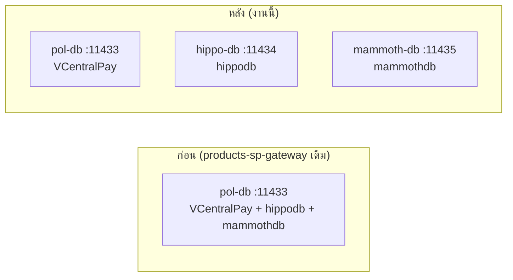
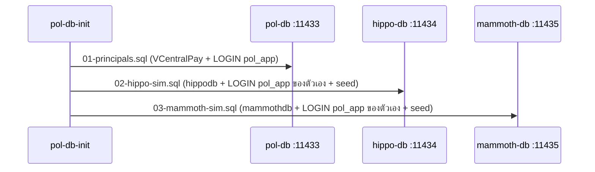

> Status: unknown
# Design: external-sim-separate-containers

> อ้าง `requirements.md` ฉบับนี้ (REQ-1..9) — ไม่ออกแบบใหม่นอกเหนือจากที่ล็อกไว้ในนั้น
>
> Superseded (บางส่วน): **ทุกจุดในเอกสารนี้ที่ระบุว่า sim instance ใช้ principal `pol_app`** ถูกแทนที่โดย
> spec `sim-db-separate-logins` (`.pipeline/sim-db-separate-logins/spec.md`, 2026-08-05) — `hippodb` ใช้
> login `hippo_app` (sqlcmd variable `HIPPO_APP_PASSWORD`), `mammothdb` ใช้ `mammoth_app`
> (`MAMMOTH_APP_PASSWORD`) คนละ password กัน และ bootstrap ลบ `pol_app` เดิมออกจาก sim instance เองแบบ
> idempotent; ฝั่ง prod password มาจาก file secret คนละไฟล์ (`HIPPO_APP_PASSWORD_FILE` /
> `MAMMOTH_APP_PASSWORD_FILE`) ส่วนที่เหลือของ design (topology, ลำดับ bootstrap, schema/SP/seed,
> การ route ของ test) ไม่เปลี่ยน — spec นี้ปิดแล้ว ข้อความด้านล่างคงไว้ตามที่ approve ไม่แก้ย้อนหลัง

## ภาพรวม

การแยกนี้เปลี่ยนแค่ **ที่อยู่ของ sim DB** (server/port/ไฟล์ bootstrap) — schema, SP, seed data, wire
contract ของ `usp_Motor_SearchDocument`/`usp_NonMotor_SearchDocument` ไม่เปลี่ยนแม้แต่ byte เดียว
(REQ-2.7, REQ-5) โค้ด `.NET` ที่เปลี่ยนมีจุดเดียวคือเลิก derive connection string (REQ-4) — ทุกจุดอื่น
เป็น infra/config/test-routing

### Topology ก่อน/หลัง



`SpDocumentOptions.MotorConnectionString`/`NonMotorConnectionString` ชี้ `hippo-db`/`mammoth-db` ตรง ๆ
ผ่าน config (REQ-4) — ไม่มี derive จาก `ConnectionStrings:App` อีกต่อไป เพราะ `InitialCatalog` เปลี่ยน
ได้ แต่ **server เปลี่ยนไม่ได้** ด้วยวิธีนั้น (root cause ของงานนี้)

### Bootstrap chain (local compose)



> Superseded (บางส่วน) โดย `sim-db-separate-logins`: `LOGIN` ของ sim ทั้งสองไม่ใช่ `pol_app` แล้ว —
> `02-hippo-sim.sql` สร้าง `hippo_app`, `03-mammoth-sim.sql` สร้าง `mammoth_app` คนละ password กัน
> (และลบ `pol_app` เดิมออกจาก instance ระหว่าง cutover) ลำดับการรันในไดอะแกรมไม่เปลี่ยน

สาม instance ไม่มี principal ร่วมกัน (คนละ SQL Server process) — `02-hippo-sim.sql` และ
`03-mammoth-sim.sql` จึงต้องสร้าง `LOGIN pol_app` ของตัวเองคนละชุด (REQ-2.4) ต่างจาก
`02-external-sim.sql` เดิมที่อาศัย `LOGIN` จาก `01-principals.sql` ซึ่งรันบน instance เดียวกัน

## ตารางไฟล์

| ไฟล์ | สถานะ | บทบาท |
|---|---|---|
| `docker/bootstrap/02-hippo-sim.sql` | ใหม่ | mechanical split จาก `02-external-sim.sql` (บรรทัด 1-608 เดิม) — header ใหม่ + `CREATE LOGIN pol_app` + seed/self-check ฝั่ง hippodb, ข้อความ self-check เปลี่ยน prefix |
| `docker/bootstrap/03-mammoth-sim.sql` | ใหม่ | mechanical split จาก `02-external-sim.sql` (บรรทัด 610-1117 เดิม) — เหมือน 02-hippo-sim.sql แต่ฝั่ง mammothdb, ตัด cross-database check 2 บล็อกออก (ย้ายไป REQ-3) |
| `docker/bootstrap/02-external-sim.sql` | ลบ | ถูกแทนที่ทั้งหมดโดย 2 ไฟล์ข้างบน |
| `docker-compose.yml` | แก้ | เพิ่ม service `hippo-db`/`mammoth-db`, `pol-db-init` depends_on ทั้ง 3 + entrypoint chain ใหม่ |
| `docker-compose.prod.yml` | แก้ | เพิ่ม env `HIPPO_DB_SERVER`/`HIPPO_DB_PORT`/`MAMMOTH_DB_SERVER`/`MAMMOTH_DB_PORT` ที่ `migrate` + `api` |
| `docker/entrypoint.sh` | แก้ | refactor `build_conn` helper + ประกอบ `SpDocument__*` จาก env ใหม่ |
| `docker/migrate-entrypoint.sh` | แก้ | refactor `wait_for_db` helper, เรียก 3 รอบ, bootstrap 2 ไฟล์ใหม่ต่อ server |
| `docker/migrate-entrypoint.test.sh` | แก้ | เพิ่ม env ทดสอบ, sqlcmd stub แยก probe counter ต่อ `-S`, assert ไฟล์ใหม่ |
| `src/Hosts/Api/Program.cs` | แก้ | ลบ `PostConfigure<SpDocumentOptions>` (derive fallback) |
| `src/Modules/Products/Products.Infrastructure/Sp/SpDocumentOptions.cs` | แก้ | แก้ XML doc (ตัด derive/REQ-3.4 เดิม, คง REQ-5.7 rationale) |
| `.env.example` | แก้ | เพิ่ม `SpDocument__MotorConnectionString`/`__NonMotorConnectionString` |
| `.env.prod.example` | แก้ | เพิ่ม section sim DB tiers (4 env var) |
| `src/Hosts/Api/appsettings.Development.json.example` | แก้ | เพิ่ม section `SpDocument` |
| `tests/Integration.Tests/IntegrationDb.cs` | แก้ | เพิ่ม `SimServer`/`SaForCatalog`, `ForCatalog` route ผ่าน `SimServer` |
| `tests/Integration.Tests/SimCrossInstanceConsistencyTests.cs` | ใหม่ | cross-instance invariant tests (REQ-3) |
| `.github/workflows/ci.yml` | แก้ | เพิ่ม service `hippo`/`mammoth`, env, bootstrap step, render-check placeholder |
| `.gitlab-ci.yml` | แก้ | mirror ci.yml |
| `docs/reference/products.md` | แก้ | topology + connection string sweep |
| `docs/runbooks/local-dev-run.md` | แก้ | service count, topology table, .env.integration ตัวอย่าง |
| `docs/runbooks/deploy-self-host.md` | แก้ | collation cutover แยกคำสั่งต่อ server |
| `docs/reference/db-connection-and-rls.md` | แก้ | flow diagram ของ products search |

## รายละเอียดออกแบบ

### D1 — SQL split (REQ-2)

Mechanical split: คัดบรรทัดช่วง hippodb (1-608 เดิม, ก่อน `USE [mammothdb]`) และช่วง mammothdb
(610-1117 เดิม) ออกเป็นคนละไฟล์ **เนื้อ seed data ต้อง byte-identical** (REQ-2.7) — วิธี verify: ตัดช่วง
`INSERT`/`UPDATE` statement จากไฟล์เดิม (`git show HEAD:docker/bootstrap/02-external-sim.sql`) เทียบ
`diff` กับช่วงเดียวกันในไฟล์ใหม่ ไม่เทียบด้วยตา

สิ่งที่เปลี่ยนนอกเหนือจาก seed data (ไม่ถูก REQ-2.7 คุ้มครอง เพราะไม่ใช่ seed data):
- Header comment: อ้าง spec นี้แทน/เพิ่มเติมจาก `products-sp-gateway`, sqlcmd usage เปลี่ยนจาก "takes no
  sqlcmd variables" เป็นรับ `POL_APP_PASSWORD`
- เพิ่มบล็อก `CREATE LOGIN pol_app` (pattern `01-principals.sql:29-31`) ก่อน `USE [hippodb]`/
  `USE [mammothdb]` — LOGIN เป็น server-level ไม่ต้องอยู่ใต้ `USE` context
  (superseded โดย `sim-db-separate-logins`: sqlcmd variable เป็น `HIPPO_APP_PASSWORD`/
  `MAMMOTH_APP_PASSWORD` และ LOGIN ที่สร้างคือ `hippo_app`/`mammoth_app` พร้อมบล็อก cutover ลบ `pol_app`)
- ข้อความ `THROW`/`PRINT` ของ self-check: prefix `02-external-sim:` -> `02-hippo-sim:` (ไฟล์ hippo) /
  `03-mammoth-sim:` (ไฟล์ mammoth) — บังคับโดย REQ-9.6 (grep `02-external-sim` ต้องเหลือศูนย์)
- `03-mammoth-sim.sql` ตัด cross-database self-check 2 บล็อกออก (ย้ายไป REQ-3 integration test)

### D2 — `.NET` config (REQ-4)

ลบ `PostConfigure<SpDocumentOptions>` ทั้งก้อนใน `Program.cs` (:156-164 เดิม) — comment ที่เหลือ (:150-154)
เขียนใหม่อ้าง spec นี้ supersede REQ-3.4 เดิม, ระบุว่าค่ามาจาก section `SpDocument` เท่านั้น, unset ->
boot ได้ (REQ-4.4/4.5) + search ตอบ 503

`SpDocumentOptions.cs` XML doc ตัดย่อหน้าที่อธิบาย derive/"no environment gains a variable" ทิ้ง คง
rationale ของ REQ-5.7 (`.ValidateOnStart()` ไม่ใช้เพราะ Hosts.Tests boot 17 hosts จริง) ไว้ทั้งหมด

### D3 — Integration test routing (REQ-3, REQ-9.3)

`IntegrationDb.cs` เพิ่ม private `SimServer(catalog)`:

```csharp
private static string SimServer(string catalog) => catalog switch {
    "hippodb"   => Get("POL_HIPPO_SQL_SERVER")   ?? "localhost,11434",
    "mammothdb" => Get("POL_MAMMOTH_SQL_SERVER") ?? "localhost,11435",
    _ => throw new ArgumentOutOfRangeException(nameof(catalog), catalog, "Unknown simulated catalogue.")
};
```

`For(user, pwEnv, catalog)` เดิม (private) แก้ให้เลือก server จาก `SimServer(catalog)` เมื่อ `catalog`
ไม่ null, และ `Server` (VCentralPay instance) เมื่อ `catalog` เป็น null — `AppConn`/`SaConn` (ไม่ส่ง
catalog) จึงยังคงชี้ instance เดิมเป๊ะ ไม่กระทบ `ForCatalog(catalog)` **คง signature เดิม** (call site 3
จุดที่มีอยู่แล้วไม่ต้องแตะ) — ภายในเปลี่ยนจาก "same instance, different Database=" เป็น "different
server ผ่าน SimServer" โปร่งใสต่อ caller เพิ่ม `SaForCatalog(catalog)` สำหรับ `sa` — ใช้ใน
`SimCrossInstanceConsistencyTests.cs` เพราะ `pol_app` ไม่มี `SELECT` บน `dbo.Documents`

`SimCrossInstanceConsistencyTests.cs` (ใหม่): เปิด `SaForCatalog("hippodb")` และ
`SaForCatalog("mammothdb")` พร้อมกัน — Test A query `DocumentNo` ที่ไม่ null จากทั้งสองฝั่งเข้า
`HashSet<string>(StringComparer.OrdinalIgnoreCase)` แล้ว assert ไม่มี intersection; Test B query
`SELECT DISTINCT SaleCode, SaleFullName, BrokerCode, BrokerName, ReferenceBranch, PolicyBranch` ทั้งสอง
ฝั่งเข้า dictionary คีย์ `SaleCode` แล้วเทียบ 5-tuple ด้วย `==` ปกติ (C# string equality เป็น null-safe
โดยธรรมชาติ — `null == null` เป็น `true`, `null == "x"` เป็น `false` — mirror semantics ของ SQL `EXCEPT`
เดิมที่ต้องเขียนแบบ `EXCEPT` เพราะ `<>` ธรรมดาใต้ `ANSI_NULLS ON` เทียบ NULL แล้วได้ `UNKNOWN`)

### D4 — Prod entrypoint plumbing (REQ-6)

`docker/entrypoint.sh` เดิมมี logic ประกอบ connection string ซ้ำ 1 จุด (สำหรับ `ConnectionStrings__App`)
— refactor ดึง logic เดียวกัน (CA-pin / `HostNameInCertificate` เดิมเป๊ะ ไม่แก้) เป็น function
`build_conn <server> <port> <db> <user> <pw>` แล้วเรียก 3 ครั้ง: `ConnectionStrings__App` (เดิม),
`SpDocument__MotorConnectionString` (`HIPPO_DB_SERVER`/`HIPPO_DB_PORT`/hippodb/pol_app), และ
`SpDocument__NonMotorConnectionString` (mammoth เดียวกัน) — 2 อันหลังครอบด้วย
`if [ -n "${HIPPO_DB_SERVER:-}" ]` เพื่อให้ REQ-6.5 เป็นจริง (image เดี่ยวไม่ผ่าน compose prod ยัง boot
ได้)

> Superseded โดย `sim-db-separate-logins`: 2 call หลังไม่ได้ใช้ `DB_PRINCIPAL`/`DB_PW` ของ core แล้ว —
> ใช้ principal ของตัวเอง (`hippo_app`/`mammoth_app`) พร้อม password จาก file secret คนละไฟล์
> (`HIPPO_APP_PASSWORD_FILE` / `MAMMOTH_APP_PASSWORD_FILE`) โครงสร้าง `build_conn` + guard
> `if [ -n "${HIPPO_DB_SERVER:-}" ]` ไม่เปลี่ยน

`docker/migrate-entrypoint.sh` refactor wait-loop เดิม (inline while) เป็น function
`wait_for_db <server> <port>` — คง TLS-hint classification เดิม (grep
`certificate\|SSL Provider\|TLS` จาก `PROBE_OUT`) ไว้ในฟังก์ชันทั้งหมด ไม่ตัดออก เรียก 3 ครั้งตามลำดับ:
`DB_SERVER`/`DB_PORT` (ก่อน `01-principals.sql`, ตำแหน่งเดิม), `HIPPO_DB_SERVER`/`HIPPO_DB_PORT` (ก่อน
`02-hippo-sim.sql`), `MAMMOTH_DB_SERVER`/`MAMMOTH_DB_PORT` (ก่อน `03-mammoth-sim.sql`) — ทั้งสามตัวเป็น
required (`:?`) ที่หัวไฟล์เหมือนกัน `DB_PORT`/`HIPPO_DB_PORT`/`MAMMOTH_DB_PORT` default `1433`

### D5 — migrate-entrypoint.test.sh: per-server probe counter (REQ-9.4)

sqlcmd stub เดิมนับ probe attempt ลงไฟล์เดียว (`$SQLCMD_PROBE_COUNT_FILE`) รวมทุก call — พอมี 3 servers
ต้อง wait ต่อเนื่องกัน ตัวนับจะทับกันข้าม server ทำให้ assertion เดิม (`= 1` สำหรับ "reachable on first
attempt") เพี้ยน แก้โดยแยกไฟล์ตัวนับต่อค่า `-S` ที่ถูกยิงจริง: extract ค่าใน `-S` จาก `"$*"` แล้ว
sanitize เป็นชื่อไฟล์ (`tr -c 'A-Za-z0-9' '_'`) ต่อท้าย `$SQLCMD_PROBE_COUNT_FILE` — logic การ
extract+sanitize ถูก define **ครั้งเดียว** (shell function ใช้ร่วมทั้งใน stub และใน assertion ฝั่ง test
script) กัน 2 ฝั่ง drift กัน `SQLCMD_FAIL_TIMES` (retry threshold) อ่านจาก counter file ต่อ server
เดียวกันนี้ จึงยัง deterministic ต่อ server ที่ทดสอบจริง (ไม่ใช่ global aggregate)

`run_migrate()` เพิ่ม `HIPPO_DB_SERVER`/`MAMMOTH_DB_SERVER` (required ใหม่ตาม D4) ในทุก invocation —
assertion เดิมที่ grep `02-external-sim.sql` เปลี่ยนเป็น grep `02-hippo-sim.sql`/`03-mammoth-sim.sql`
แยกกัน เช็ค `-N`/`-b`/มี `POL_APP_PASSWORD`/ยิงถูก `-S`/ลำดับหลัง `01-principals.sql`

### D6 — `.env.example`/`.env.prod.example` — file tool ถูก deny

ทั้งสองไฟล์อยู่ใน path ที่ permission settings ของ Read/Edit/Write tool deny (ตั้งใจกันแก้ secret file
โดยไม่ตั้งใจ) — ใช้ git subcommand ล้วน (ผ่าน deny เสมอ ตาม precedent เดิมของ repo):
1. `git show HEAD:.env.example` เป็น base content จริง (**ไม่เดาจากความจำ**)
2. แก้ content ใน scratchpad แล้ว `git hash-object -w <scratchpad-file>` -> blob sha
3. `git update-index --cacheinfo 100644,<sha>,.env.example` ผูก blob เข้า index
4. `git checkout-index -f -- .env.example` materialize กลับ working tree
5. verify ด้วย `git diff --cached -- .env.example` (ไม่ใช้ Read — Read ก็ถูก deny เหมือนกัน)

## Requirement Traceability

| Design element | Satisfies |
|---|---|
| D1 — `02-hippo-sim.sql`/`03-mammoth-sim.sql` CREATE DATABASE + CREATE LOGIN + object + seed (byte-identical) | REQ-2.1, REQ-2.2, REQ-2.4, REQ-2.7 |
| D1 — ลบ `02-external-sim.sql` | REQ-2.3 |
| `docker-compose.yml` — service `hippo-db`/`mammoth-db` (image/port/healthcheck/no volume/SA password ร่วม) | REQ-1.1, REQ-1.2, REQ-1.3, REQ-1.4, REQ-1.5 |
| `docker-compose.yml` — `pol-db-init` entrypoint chain (01 -> 02-hippo -> 03-mammoth) | REQ-2.5 |
| D1 — self-check ข้อความ prefix ต่อไฟล์ | REQ-2.6 |
| D1 — ตัด cross-database self-check 2 บล็อก | REQ-3.1 |
| D3 — `SimCrossInstanceConsistencyTests.cs` (sa connections, DocumentNo disjoint, roster identity null-safe) | REQ-3.2, REQ-3.3, REQ-3.4 |
| D2 — ลบ `PostConfigure<SpDocumentOptions>` ใน `Program.cs` | REQ-4.1, REQ-4.2 |
| D2 — comment supersede REQ-3.4 เดิม (ไม่แก้ `products-sp-gateway/requirements.md`) | REQ-4.3 |
| D2 — คง `SpDocumentOptions` ไม่มี `.ValidateOnStart()` | REQ-4.4 |
| `SpDocumentGateway` (ไม่แตะ, พฤติกรรม 503 เดิม) + Program.cs ไม่ fail boot | REQ-4.5 |
| seed data byte-identical (D1) + self-check row-count/visible-count assertion เดิม | REQ-5.1, REQ-5.2, REQ-5.3 |
| `docker-compose.prod.yml` — ไม่มี SQL service ใหม่ | REQ-6.1 |
| `docker-compose.prod.yml` — env 4 ตัวที่ `migrate`+`api` | REQ-6.2, REQ-6.3 |
| D4 — `entrypoint.sh` `build_conn` + conditional export | REQ-6.4, REQ-6.5 |
| D4 — `migrate-entrypoint.sh` `wait_for_db` 3 รอบ + bootstrap ต่อไฟล์ | REQ-6.6 |
| `.github/workflows/ci.yml` — service hippo/mammoth + env + bootstrap step | REQ-7.1, REQ-7.2, REQ-7.3 |
| `.github/workflows/ci.yml` — docker-build render-check placeholder | REQ-7.4 |
| `.gitlab-ci.yml` — mirror ทั้งหมด | REQ-7.5 |
| `docs/reference/products.md` sweep | REQ-8.1 |
| `docs/runbooks/local-dev-run.md` sweep | REQ-8.2 |
| `docs/runbooks/deploy-self-host.md` sweep | REQ-8.3 |
| `docs/reference/db-connection-and-rls.md` sweep | REQ-8.4 |
| Testing Strategy ทั้งหมด (D1-D6 รวมกัน, บิลด์+เทสจริง) | REQ-9.1, REQ-9.2, REQ-9.3, REQ-9.4, REQ-9.5, REQ-9.6 |

## Testing Strategy

- **SQL bootstrap**: `docker compose down -v && docker compose up -d` แล้ว `docker compose ps -a` ทุก
  service `Exited (0)`/`healthy`; `docker compose logs pol-db-init` เห็น `02-hippo-sim: hippodb OK` +
  `03-mammoth-sim: mammothdb OK` — รันซ้ำ (`up -d` บน stack ที่ up อยู่) เพื่อพิสูจน์ idempotent (AC-2)
- **Unit/offline**: `dotnet build pol-core.slnx -warnaserror` + `dotnet test --filter "Category!=Integration"`
- **Integration**: `dotnet test --filter "Category=Integration"` กับ container ใหม่ทั้ง 3 ตัว — ต้อง
  ครอบ `SpDocumentContractTests`/`SpDocumentGatewayIntegrationTests` เดิม (ยังเขียวผ่าน `ForCatalog`
  routing ใหม่) + `SimCrossInstanceConsistencyTests` ใหม่
- **Script-level**: `bash docker/entrypoint.test.sh`, `bash docker/migrate-entrypoint.test.sh`
- **Compose render**: `docker compose -f docker-compose.prod.yml config -q` ทั้งกรณี env ครบ (ผ่าน)
  และขาด `HIPPO_DB_SERVER`/`MAMMOTH_DB_SERVER` (fail ด้วยข้อความ `:?`)
- **Spec gate**: `scripts/spec-trace.sh external-sim-separate-containers`, `grep -rn "02-external-sim"`
  ทั้ง repo
