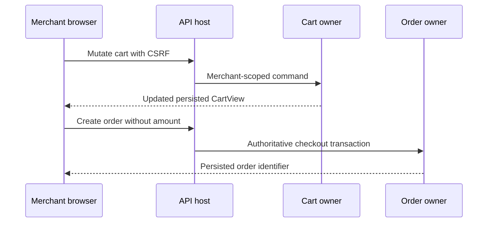
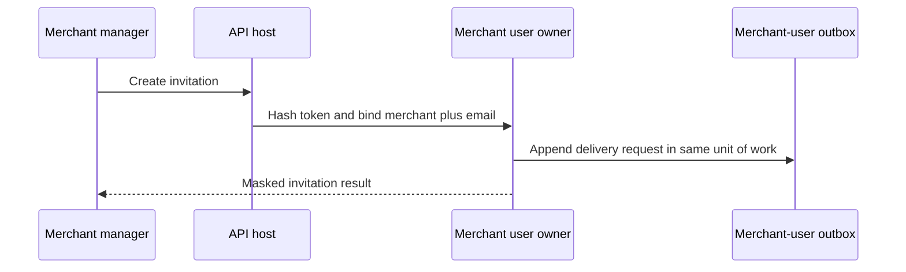

# Design: Merchant Frontend Real API Backend Contract

> Status: unknown

`pol-core` extends existing domain owners and host routes. No second auth system, cart model, payment ledger,
invitation store, role catalog, or cross-context coordinator is introduced.

## Architecture Overview

| Capability | Existing owner | Change |
| --- | --- | --- |
| OIDC and Merchant sessions | `Hosts.Api`, `Merchants` | Opaque session, lifecycle codes, narrow forwarded-header trust |
| Products and carts | `Products`, `Carts` | Sale-code scope, authoritative item data, confirmed cart mutation responses |
| Orders and payments | `Orders`, `Payments` | Authoritative checkout, configured PSP, paged reads, public capability hardening |
| Merchant users | `Merchants`, `Persistence.MerchantUsers` | Tenant-bound invitation, audit, lifecycle, masked projections |
| Roles and permissions | `Iam` | Canonical side-aware catalog and Merchant-scoped operations |

Existing `ProvisioningCoordinator` remains the only cross-context provisioning transaction. Merchant invitation
and user-management operations stay inside `MerchantUserDbContext` and its outbox.

## Sequence Diagrams

## Data Models and Interfaces

- `CartView` is the mutation success contract for add, quantity, remove, and clear.
- `MerchantUserInvitation` is the only invitation aggregate and maps to `merch.MerchantUserInvitations`.
- `DefaultPspSelection` is immutable and resolved during startup so invalid config fails before readiness.
- `ForwardedHeaders:KnownNetworks` accepts only non-wildcard CIDRs; `KnownProxies` accepts explicit IPs.
- `PagedResult<T>` contains safe integer `page`, `limit`, `total`, and consistent `totalPages`.

## Technology Decisions

| Decision | Choice |
| --- | --- |
| HTTP surface | Extend existing area-first Minimal API routes and preserve operation IDs |
| Persistence | Reuse existing three runtime contexts and sanctioned outbox patterns |
| PSP selection | Parse configured code once, resolve at startup, no silent fallback |
| Proxy trust | Loopback defaults plus explicit narrow proxy/network allowlist |
| Money | Server-owned `Money`, fixed four-decimal JSON string contract |
| Authorization | Canonical IAM permission keys with Platform or Merchant scope |

## Error Handling Strategy

- Missing sale code returns `403` plus `sale-code-missing`.
- Unsupported PSP config or wildcard proxy trust fails startup.
- Invalid filters and request fields return coded `400` Problem Details.
- Stale lifecycle and idempotency conflicts return coded `409`.
- Missing resources return tenant-safe `404`; expired public summary reads return `410` where specified.
- Dependency outages return retryable `503`; no mock or success fallback exists.

## Testing Strategy

- Host tests boot real composition for invalid PSP and forwarded-header configuration.
- Module tests cover cart confirmed-state responses, invitation replay, lifecycle, last-manager, and permissions.
- Architecture tests keep tenant bypasses and extra cross-context transactions blocked.
- Integration tests cover migrations, grants, tenant isolation, and concurrency when local principal credentials exist.
- OpenAPI tests pin schema nullability, operation IDs, paging, money, and coded errors.

## Requirement Traceability

| Section | REQ |
| --- | --- |
| OIDC, session, proxy trust | REQ-2, REQ-3, REQ-12 |
| Registration boundary | REQ-4, REQ-12 |
| Product and confirmed cart contract | REQ-5, REQ-6, REQ-12 |
| Order and payment contract | REQ-6, REQ-7, REQ-8 |
| Invitation and Merchant-user lifecycle | REQ-9, REQ-12 |
| IAM role and permission scope | REQ-10, REQ-12 |
| OpenAPI and release gates | REQ-13 |
