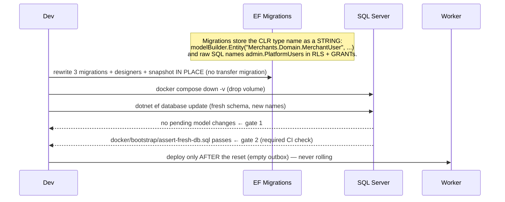
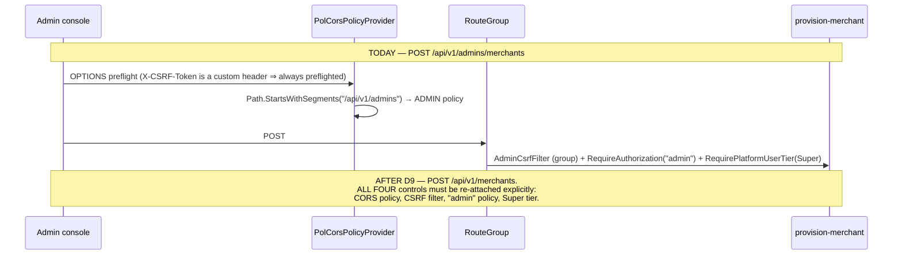

# Design: Hierarchical Naming (namespace + route)

> Status: draft (rev 2 — rewritten after spec-architect critique; 2 blockers + 5 majors folded in)
> Mode: Design-First (no requirements.md yet — `/spec-requirements` backfills EARS + traceability after approval)
> Input: `APPROVED-PLAN.md` in this folder — D1-D15 locked, T1-T11 must be closed here.

## Architecture Overview

This is a **behavior-preserving repo-wide rename**. No endpoint gains or loses a capability, no
authorization decision changes, no row changes meaning. Everything below is a mapping law plus the
places where a mechanical rename would silently break behavior if applied naively.

The problem it fixes: `.ai/shared/ARCHITECTURE.md` §Naming Conventions says only "type/interface:
PascalCase". With no rule for pluralization or nesting, the repo drifted into three inconsistent shapes
at once — singular projects (`Admin`, `Cart`, `Checkout`) beside plural ones (`Merchants`, `Orders`);
parent-prefixed flat types (`MerchantUserRoleDefinition`, `PlatformUserSessionDecision`); and one
compound route area (`/api/v1/merchant-users`) beside eight single-noun ones. Worse, the admin module
ships **two parallel families** (`Admin*` for RBAC, `Platform*` for the user) whose names agree with
neither the route (`/admins`) nor the schema (`admin`).

**The governing constraint is not aesthetics — it is that a rename can remove a security control while
every existing test stays green.** Three of the eleven traps are exactly that shape (T1 CSRF/CORS, plus
the two blockers found in review: a fail-open architecture guard, and a config section that *starts*
binding when its name changes). Those are designed first; the naming law is the easy part.

### The naming law (implementers derive every rename from it)

| ID | Law | Consequence |
|----|-----|-------------|
| **L1** | **Nesting unit = sub-domain** — a cluster of types hanging off one **non-root** aggregate or one cross-cutting concern. Never nest for the sake of symmetry. | `Users/`, `Roles/`, `Permissions/`, `Items/`, `Psp/` |
| **L2** | The module's **root aggregate stays at the module-root namespace.** A module is never nested inside itself, and a sub-namespace is never created to hold only the root. | `Merchants.Domain.Merchant` ✅ — not `Merchants.Domain.Merchants.Merchant` ❌; `Checkouts.Domain.Session` ✅ — not `Checkouts.Domain.Sessions.Session` ❌ |
| **L3** | **Plural** for module project + sub-namespace/folder. **Singular** for the type. (D14/D15) | `Merchants.Domain.Users.User`, `Carts.Domain.Items.Item` |
| **L4** | **Prefix drop**: a type drops every token its namespace already carries — **but stops at the point the shortened name would be ambiguous inside its own module** (a bare verb, or a framework word). | `MerchantUserSession` -> `Merchants.Domain.Users.Session`; but `GetMerchantQuery` stays (`GetQuery` is illegible) |
| **L5** | **Max nesting depth = 2** sub-levels under a layer. Deeper, keep a compound type name. | `Merchants.Domain.Users.Roles.Role` is the floor |
| **L6** | **Ambiguity policy** — file-level alias, one fixed form. Never resolve a collision by re-adding a prefix to one type; that reintroduces the disease. | see below |
| **L7** | **DB tables are schema-qualified only** (SQL has one namespace level, not two). L4 applies only as far as the schema already disambiguates; a table keeps whatever tokens it needs to stay unique *and readable* within its schema. | `admin.Users` ✅ but `admin.UserAudits` stays (`admin.AuthAudits` also exists); `shop.CartItems` stays (`shop.Items` collides with the `OrderItems` rf5 adds) |
| **L8** | **Configuration keys, OpenAPI security-scheme ids, and integration-event type names are NOT namespaced** — they are flat external contracts. L4 has no namespace to lean on, so it does not apply. Changing them is a **contract change**, allowed only as its own reviewed step, never as sweep fallout. | see §5b, §9 |

L8 did not exist in rev 1. It is the single most important thing this review added: without it, a
global find-and-replace on `PlatformUserSession` silently rewires the admin open-redirect allowlist
(§5b) — a change no test in the repo would catch.

### L6 — ambiguity policy (T7, the #1 risk of D4)

After the prefix drop, `User`, `Session`, `Role`, `Item` and `Status` each exist in several namespaces.
C# only cares when **one file** pulls in two of them — which is the composition root (`Program.cs`,
the `Api/<Area>/` files) and the cross-plane tests (`tests/Hosts.Tests/*`).

```csharp
// Fixed alias form: <ModuleSingular><Type> = <Module>.<Layer>.<Sub>.<Type>
// (module token is singularised for the alias — "AdminsUser" reads worse than "AdminUser")
using AdminUser      = Admins.Domain.Users.User;
using MerchantUser   = Merchants.Domain.Users.User;
using AdminSession   = Admins.Domain.Users.Session;
using PaymentSession = Payments.Domain.Session;
```

- Aliases live **only in the consuming file** — never in `GlobalUsings`. A global alias restores the
  flat names repo-wide and cancels the change.
- A module never aliases its own types.
- **Partial qualification (`Users.Session`) is banned** — it reads as a type in one file and a namespace
  in another, which is the exact ambiguity we are paying to remove.
- The discipline applies to `tests/` too (`CorsTests`, `RouteSchemeConventionTests`, both session-handler
  test files consume both planes).

**Honest cost:** the composition root carries an alias block. That is the price of L4, and it is bounded
— the composition root is the one place that legitimately knows every module.

### Component map after the change

```
src/Modules/
  Admins/      (was Admin)      Users/  Roles/  Permissions/  MasterData/
  Merchants/                    Users/  Users/Roles/  Users/Permissions/  [root: Merchant]
  Carts/       (was Cart)       Items/                                    [root: Cart]
  Checkouts/   (was Checkout)   —                                         [root: Session]
  Orders/                       —                                         [root: Order]
  Payments/                     Psp/                                      [root: Session]
  Products/                     —                                         [root: Product]
src/Hosts/Api/
  Admins/  Merchants/  Payments/  Webhooks/   (D7 — namespace Api.<Area>)
```

`Checkouts` and `Payments` get **no `Sessions/` folder**: their session type *is* the module's root
aggregate, and L2 forbids a sub-namespace that holds only the root. (Rev 1 had this wrong — it created
four colliding `Session` types and paid L6's alias cost for nothing.) `Orders` and `Products` gain no
sub-folder either: one aggregate each, nothing for L1 to cluster. This is **not** an inconsistency — L1
is a rule about sub-domains, not a quota (T9).

## Sequence Diagrams

### Cutover (T4 + T5): why this is reset-only, not rolling



### The moved endpoints (T1) — what must survive the move



## Data Models & Interfaces

### 1. Module projects (D14a, T10)

| old | new | touches |
|-----|-----|---------|
| `Admin.{Domain,Application,Infrastructure}` | `Admins.*` | 3 csproj + folder + root namespace |
| `Cart.*` | `Carts.*` | 3 csproj + folder + root namespace |
| `Checkout.*` | `Checkouts.*` | 3 csproj + folder + root namespace |
| `Admin.Tests`, `Cart.Tests`, `Checkout.Tests` | `Admins.Tests`, `Carts.Tests`, `Checkouts.Tests` | 3 csproj |
| `Merchants.*`, `Orders.*`, `Payments.*`, `Products.*` | unchanged | already plural |

`pol-core.slnx` holds `<Folder Name="/src/Modules/Admin/">` + literal csproj paths — 12 entries move.
Folder moves use **`git mv`** (delete+create loses history across a 262-file diff).

**Deliberate mismatch — document, do not "fix":** `SchemaNames.Admin = "admin"` stays singular (D15;
rf1 locked the schema names on 2026-07-12). So `Admins.Domain` writes to schema `admin`. Schemas are
namespaces and singular is the SQL convention. A future reader will want to align them — the answer is
no, and this line is why.

### 2. Domain types

**Admins** (D5 — the `Platform*` family is dissolved; the `Admin*` prefix drops):

| old | new |
|-----|-----|
| `PlatformUser` / `AdminStatus` / `PlatformUserTier` | `Admins.Domain.Users.User` / `.UserStatus` / `.Tier` |
| `PlatformUserSession` (+ `...Status` / `...Decision` / `...DecisionPolicy` / `...Policy`) | `Admins.Domain.Users.Session` (+ `.SessionStatus` / `.SessionDecision` / `.SessionDecisionPolicy` / `.SessionPolicy`) |
| `PlatformUserAudit` / `AdminAuditAction` | `Users.Audit` / `Users.AuditAction` |
| `PlatformAuthAudit` / `PlatformAuthEventType` | `Users.AuthAudit` / `Users.AuthEventType` |
| `PlatformMerchantAccess` | `Users.MerchantAccess` |
| `AdminRole` / `AdminRoleStatus` / `AdminRoleAssignment` / `AdminRolePermission` | `Admins.Domain.Roles.Role` / `.RoleStatus` / `.RoleAssignment` / `.RolePermission` |
| `AdminPermission` / `AdminPermissionGroup` / `AdminPermissions` (const keys) | `Admins.Domain.Permissions.Permission` / `.PermissionGroup` / `.Keys` |
| `MasterData` (abstract), `Position`, `Office`, `Level`, `Division` | `Admins.Domain.MasterData.*` — base renamed **`MasterDataItem`** (a type may not share its namespace's name) |

**Merchants** (root `Merchant` stays put — L2):

| old | new |
|-----|-----|
| `MerchantUser` / `MerchantUserStatus` | `Merchants.Domain.Users.User` / `.UserStatus` |
| `MerchantUserSession` (+ 4 suffixes) | `Merchants.Domain.Users.Session` (+ same suffix pattern as Admins) |
| `ExternalLogin` | `Merchants.Domain.Users.ExternalLogin` |
| `MerchantAuthAudit` / `MerchantAuthEventType` | `Merchants.Domain.Users.AuthAudit` / `.AuthEventType` |
| `RegistrationAudit` / `RegistrationAuditAction` / `RegistrationNotice` / `TicketPurpose` / `PersonType` | `Merchants.Domain.Users.*` — registration is a merchant-**user** concern |
| `MerchantUserRoleDefinition` / `...RoleStatus` / `...RoleAssignment` / `...RolePermission` | `Merchants.Domain.Users.Roles.Role` / `.RoleStatus` / `.RoleAssignment` / `.RolePermission` (L5 floor) |
| `MerchantUserPermission` / `...PermissionGroup` / `MerchantUserPermissions` | `Merchants.Domain.Users.Permissions.Permission` / `.PermissionGroup` / `.Keys` |
| `Merchant`, `MerchantCode`, `MerchantStatus`, `ProvisioningAudit` | unchanged (root, L2) |

**Data-plane modules:**

| old | new |
|-----|-----|
| `CartItem` | `Carts.Domain.Items.Item` |
| `CheckoutSession` / `CheckoutStatus` | `Checkouts.Domain.Session` / `.SessionStatus` — **root, no sub-namespace (L2)** |
| `PaymentSession` / `PaymentStatus` | `Payments.Domain.Session` / `.SessionStatus` — **root, no sub-namespace (L2)** |
| `PspConnection` / `PspCode` / `PspCodes` | `Payments.Domain.Psp.Connection` / `.Code` / `.Codes` |
| `Cart`, `CartStatus`, `Order`, `OrderStatus`, `OrderPaid`, `Product` | unchanged (root, L2) |

### 3. Application + Infrastructure — derived, not enumerated

L4 is mechanical; these layers need no hand-written table. Worked examples fix the pattern for the ~150
handlers/commands/results:

| old | new |
|-----|-----|
| `IMerchantUserRepository` | `Merchants.Application.Users.IUserRepository` |
| `ApproveMerchantUserCommand` / `...Handler` / `...Result` | `Merchants.Application.Users.ApproveCommand` / `ApproveHandler` / `ApproveResult` |
| `CreateMerchantUserRoleCommand` | `Merchants.Application.Users.Roles.CreateCommand` |
| `IPlatformUserSessionStore` | `Admins.Application.Users.ISessionStore` |
| `ListPlatformUserSessionsQuery` | `Admins.Application.Users.ListSessionsQuery` |
| `MerchantUserSessionConfiguration` | `Merchants.Infrastructure.Persistence.Users.SessionConfiguration` |
| `PlatformUserSfs` | `Admins.Infrastructure.Persistence.Users.UserSfs` |
| `GetMerchantQuery` | **unchanged** — L4's floor: `GetQuery` is illegible |

### 4. Routes

| old | new | note |
|-----|-----|------|
| `/api/v1/merchant-users/**` | `/api/v1/merchants/users/**` | D8 — new area `merchants` |
| `POST /api/v1/admins/merchants` | `POST /api/v1/merchants` | D9 — **§5: re-attach all four controls** |
| `GET /api/v1/admins/merchants/{code}` | `GET /api/v1/merchants/{code}` | D9 — **`{code}` stays unconstrained**, see below |
| `POST /api/v1/admins/merchant-users/{subject}/approve\|reject` | `POST /api/v1/admins/merchants/users/{subject}/approve\|reject` | D10 |
| `/api/v1/admins/master-data/{positions\|offices\|levels\|divisions}` | `/api/v1/admins/{positions\|offices\|levels\|divisions}` | D11 — the wrapper is **dropped, not renamed**: `master-data` is a code-organisation word, not a resource, and each master list is already its own collection. Safe: `/admins/{id:guid}` is guid-constrained (`Program.cs:1357`) and literals beat parameters. |
| everything else | unchanged | D12 |

**No route constraint on `{code}` (T2 was overstated).** Rev 1 proposed `{code:regex(...)}` to prevent
`/merchants/{code}` shadowing `/merchants/users/**`. Three things are wrong with that: the templates
cannot collide (4 segments vs ≥5); the proposed regex `^[a-z0-9-]{2,32}$` **matches `users` anyway**, so
it would not have prevented the thing it was for; and adding a constraint *is itself a behavior change* —
today an arbitrary string reaches the handler, which 404s (`Program.cs:877-886`), and `MerchantCode`
normalises to lowercase (`MerchantCode.cs:14-18`), so a lowercase-only constraint could 404 codes that
resolve today. Leave `{code}` as it is.

**Location headers move with the routes** (easy to miss — they are FE contract):
`Program.cs:858` (`/api/v1/admins/merchants/{code}`), `:991`, `:1139` (merchant-user), `:1300`, `:1527`
(master-data), `:1669`.

**Area taxonomy** (`api-route-scheme` amendment, T6): `merchant-users` out, `merchants` in. The
fail-closed guard at `RouteSchemeConventionTests.cs:49` becomes:

```
^/api/v1/(products|carts|checkouts|orders|payments|admins|merchants|webhooks|reports)(/.*)?$
```

The guard is edited **because the spec changed** — never to make a red test green.

### 5. Re-attaching the controls on the two moved endpoints (T1)

Moving `POST /api/v1/admins/merchants` and `GET .../{code}` out of the `admins` group drops **four**
controls, not two. All four are re-attached explicitly on a new group:

| control | where it lives today | after the move |
|---------|---------------------|----------------|
| CSRF | `AddEndpointFilter<AdminCsrfFilter>()` on the group (`Program.cs:759`) | same filter on the new group |
| CORS (admin origins) | path prefix `/api/v1/admins` (`CorsExtensions.cs:79`) | **path table extended — see below** |
| authn/authz | `.RequireAuthorization("admin")` per endpoint (`Program.cs:886`) | unchanged, moves with the endpoint |
| **Super tier** | `.RequirePlatformUserTier(PlatformUserTier.Super)` on POST (`Program.cs:864`) | unchanged, moves with the endpoint |

**CORS stays path-based. Rev 1's "select the policy from endpoint metadata" is withdrawn — it does not
work.** `CorsExtensions.cs:56-59` already documents why: the provider was chosen *precisely* so policy
selection does not depend on endpoint metadata being resolved before the CORS middleware runs. A CORS
preflight is an `OPTIONS` that minimal-API endpoints do not accept (`HttpMethodMetadata.AcceptCorsPreflight`
is false), so `GetEndpoint()` on a preflight yields no admin marker at all. Since `X-CSRF-Token` is a
custom header (`AdminCsrfFilter.cs:15`), **every** admin mutation is preflighted — the metadata approach
would have failed on exactly the requests it was meant to protect, and only in cross-origin deploys
(dev is same-origin behind the SPA proxy at `Program.cs:373`, so it would have looked fine locally).

The predicate becomes an explicit admin-plane table:

```csharp
// admin plane = /api/v1/admins/**  +  /api/v1/merchants  and  /api/v1/merchants/{code}
//               (but NOT /api/v1/merchants/users/**, which is the merchant-user plane)
```

and — because a path table is exactly the thing that rots when an endpoint moves — it is backed by a
**fail-closed guard test**: enumerate `EndpointDataSource`, take every endpoint whose metadata carries
the `"admin"` authorization policy or `AdminCsrfFilter`, and assert `PolCorsPolicyProvider` returns
`AdminPolicyName` for its template. The mechanism stays as-is; the *guard* is what we add.

### 5b. Configuration sections — FROZEN, and one latent bug this refactor would detonate (L8)

**This section exists because of a live bug found in review.** `Program.cs:164` binds
`PlatformUserSessionOptions` from section `"PlatformUserSession"` (`AdminAuthOptions.cs:28`) — but
`appsettings.json:25` defines the section as **`"AdminSession"`**. The names do not match, so admin
session options bind to **nothing** and fall back to defaults: `ReturnUrlAllowlist = []`
(`AdminAuthOptions.cs:39`), which makes `AdminLoginService.Resolve()` discard every `returnTo` and
always use the default path. The `["/"]` in appsettings — and any
`AdminSession__ReturnUrlAllowlist__*` an operator set per `docs/runbooks/deploy-self-host.md:76-77` —
is **dead configuration today**.

A blind sweep renaming the `PlatformUserSession` token to `AdminSession` would rename that `SectionName`
const too — and the section would **start binding**, moving the admin open-redirect allowlist from `[]`
to whatever production has configured. That is an authorization-surface change arriving as rename
fallout, and no test in the repo would catch it.

Therefore:

| key | disposition |
|-----|-------------|
| `Google:Oidc`, `MerchantUser:Oidc`, `MerchantUser:Session`, `MerchantUser:Registration`, `Cors:AllowedOrigins`, `Cors:AdminOrigins`, `ConnectionStrings:*`, `AdminAllowlist:Subjects` | **FROZEN** — env-var contract (`docker-compose.prod.yml:74`, `docker/entrypoint.sh:45`). L8: not namespaced, not swept. |
| `PlatformUserSessionOptions.SectionName` = `"PlatformUserSession"` -> `"AdminSession"` | **Fix it — but as its own commit**, with the behavior change stated in the message, plus tests (`AdminAuthLoginRedirectTests.cs:41`, `AdminLoginServiceTests.cs:105` inject the old key) and a runbook check. **Never inside the rename sweep.** |

### 6. DB tables (L7 — the schema disambiguates, so the drop is partial)

| schema | old | new |
|--------|-----|-----|
| `admin` | `PlatformUsers` / `PlatformUserSessions` / `PlatformAuthAudits` / `PlatformMerchantAccess` | `Users` / `Sessions` / `AuthAudits` / `MerchantAccess` |
| `admin` | `PlatformUserAudits` | `UserAudits` — *keeps `User`: `admin.AuthAudits` also exists (L7)* |
| `admin` | `AdminRoles` / `AdminRoleAssignments` / `AdminRolePermissions` / `AdminPermissions` / `AdminPermissionGroups` | `Roles` / `RoleAssignments` / `RolePermissions` / `Permissions` / `PermissionGroups` |
| `merch` | `MerchantUsers` / `MerchantUserSessions` / `MerchantAuthAudits` | `Users` / `Sessions` / `AuthAudits` |
| `merch` | `MerchantUserRoleDefinitions` / `...RoleAssignments` / `...RolePermissions` / `MerchantUserPermissions` / `...PermissionGroups` | `Roles` / `RoleAssignments` / `RolePermissions` / `Permissions` / `PermissionGroups` |
| `shop`, `txn` | `Products`, `Carts`, `CartItems`, `CheckoutSessions`, `Orders`, `PaymentSessions`, `PspConnections` | **unchanged** — L7: `shop.Items` collides with the `OrderItems` rf5 adds; `CheckoutSessions`/`PaymentSessions` need their qualifier across schemas |

**Every renamed table is named in raw SQL the compiler cannot see.** All of these must move together:

| file | what it holds |
|------|---------------|
| `Migrations/20260711142515_SecurityObjects.cs` | `sec.fn_merchant_predicate` + security policies **and the per-table GRANT matrix** (`:232-238` — `GRANT ... ON admin.PlatformUsers / PlatformUserAudits / PlatformMerchantAccess / PlatformUserSessions / PlatformAuthAudits / AdminPermissionGroups / AdminPermissions / AdminRoles / AdminRolePermissions TO pol_admin`). **Miss one line and that table has no grant — permission-denied at runtime, not at build.** |
| `docker/bootstrap/assert-fresh-db.sql` | `:75-93` — row-count asserts on `admin.AdminPermissions` (16), `admin.AdminRoles` (5), `merch.MerchantUserPermissions` (7), `merch.MerchantUserRoleDefinitions` (2). **This is a required CI check** (`.github/workflows/ci.yml:174-182`). |
| `docker/entrypoint.sh` | `:25` — references `admin.PlatformMerchantAccess` |

### 7. Permission keys (T8 — L4 applied to wire strings)

| catalog | old | new | why |
|---------|-----|-----|-----|
| admin | `merchant_user.approve` / `.reject`, group `merchant_user` | `merchants.users.approve` / `.reject`, group `merchants.users` | mirrors the new admin route (D10) |
| admin | `txn.*`, `merchant.*`, `invoice.*`, `settlement.*`, `user.*`, `audit.*`, `settings.*`, `apikey.*` | **unchanged** | never carried a parent prefix |
| merchant-user | `merchant_user.roles.view` / `.manage` | `roles.view` / `roles.manage` | **self-prefix drop** — inside the merchant-user's own catalog the subject is implicit; `merchant_user.*` was pure redundancy |
| merchant-user | `merchant_user.user.roles` | `users.roles` | same |
| merchant-user | `product.*`, `payment.*` | **unchanged** | |

Keys are seeded in `Migrations/20260711142519_SeedData.cs` and gate the FE — see §9.

### 8. Auth schemes and rate-limit policies

| kind | old | new |
|------|-----|-----|
| auth scheme | `PlatformUserSession` (`PlatformUserSessionAuthenticationHandler.cs:24`) | **`AdminSession`** — the whole point of D5 |
| auth scheme | `MerchantUserSession` (`MerchantUserSessionAuthenticationHandler.cs:27`) | **unchanged — see below** |
| rate-limit policy | `admin-auth`, `merchant-user-auth`, `psp-webhook` | **unchanged** (L8 — flat labels, no namespace to lean on; renaming buys nothing) |
| OIDC callback | `/api/v1/merchant-users/auth/callback` | `/api/v1/merchants/users/auth/callback` (T3 — **also a Google Console change**) |

**`MerchantUserSession` keeps its name.** The principal *is* a merchant **user**; `MerchantSession`
would invite the reader to imagine a merchant-org session that does not exist — reintroducing exactly
the two-meanings-one-stem confusion D5 exists to kill. The scheme id is also a key in
`components.securitySchemes` (`Program.cs:239`), i.e. an FE/Scalar contract (L8), and renaming it adds
nothing the route rename has not already delivered.

The auth-scheme id `PlatformUserSession` -> `AdminSession` **is** worth doing (it is D5's core), and is
safe: it is not a config section. The *config section* of the same name is a separate matter — §5b.

### 9. FE-facing contract changes (T8)

Everything below breaks the SPA and must land in `.ai/specs/rf1-schema-reset/FE-MIGRATION.md`:

- **Routes**: D8 / D9 / D10 / D11 (§4)
- **`Location` headers**: `Program.cs:858, 991, 1139, 1300, 1527, 1669`
- **Permission-key strings** the SPA gates on (§7)
- **OpenAPI security-scheme id** `PlatformUserSession` -> `AdminSession` (`Program.cs:228,239` and the
  policy→scheme map at `:297-303`) — generated clients key on this
- **Operation ids** for master-data (`WithName($"List{segment}")` etc., `Program.cs:1518-1547`)

### 10. Integration events — out of scope, not an exception (L8)

`MerchantUserRegistrationSubmitted` (`src/Contracts/MerchantUserRegistrationSubmitted.cs:14`) **keeps
its name.** `namespace Contracts;` is flat — there is no module namespace, and the registry
(`OutboxDispatcher.cs:144`) is a flat cross-module vocabulary alongside `PaymentPaid`,
`CheckoutConfirmed`, `CustomerOrderNotification`. L8 says D6 does not reach here at all; this is not a
carve-out from D6 but a place D6 never applied. (Rev 1 justified this by rolling-deploy risk — that
argument was wrong: the cutover resets the DB, so the outbox is empty either way. A correct conclusion
resting on a false reason is worse than no reason.)

This name is therefore on the **grep-gate exception list** (§Testing).

## Technology Decisions

| # | decision | rationale |
|---|----------|-----------|
| 1 | `git mv` for every folder move | 262-file diff; delete+create loses per-file history and makes the PR unreviewable |
| 2 | Rewrite the 3 migrations + designers + snapshot in place; reset the DB | Precedent: rf1 (PR #79), schema rename (PR #68), catalog rename (PR #69). Pre-prod; a transfer migration costs more than the data is worth |
| 3 | **Keep the path-based CORS provider**; add a fail-closed guard instead | The metadata alternative is broken on preflight (§5). Guarding the existing mechanism is both safer and a smaller diff than replacing it |
| 4 | Config sections are frozen; the one real fix ships separately (§5b) | A config rename that changes an open-redirect allowlist is not a rename |
| 5 | Aliases in consuming files, never `GlobalUsings` | A global alias restores the flat names and cancels the change |
| 6 | One branch, PR per module | 262 files in one PR gets rubber-stamped, and rubber-stamping is how a dropped CSRF filter ships |
| 7 | Write L1-L8 into `.ai/shared/ARCHITECTURE.md` §Naming Conventions | The absence of this rule is the root cause. Renaming without writing the law down buys three months |

## Error Handling Strategy

A rename adds no runtime error paths. It has **silent-failure modes**, each needing a detector that
exists *before* the sweep:

| failure | how it hides | detector |
|---------|--------------|----------|
| EF snapshot still names an old CLR type (T4) | builds fine; fails at first migration | fresh-DB `dotnet ef database update` → **no pending model changes** |
| Raw SQL still names `admin.PlatformUsers` — RLS predicate, security policy, **or a GRANT** (§6) | compiler cannot see inside a SQL string; a missed GRANT surfaces as runtime permission-denied | RLS matrix test + `assert-fresh-db.sql` on a fresh DB |
| **Architecture.Tests fail OPEN** | `AdminArchitectureTests.cs:34-36,53,67` and `MerchantsArchitectureTests.cs:44-46,67` hardcode `"Admin.Domain"`, `"Cart.Infrastructure"`, … . After the rename those strings match **nothing**, so `ShouldNot.HaveDependencyOnAny(...)` passes **vacuously** — the layer guard dies silently | update the literals **and** add a positive assertion: every forbidden namespace must resolve to ≥1 real assembly, so a typo **fails** instead of passing |
| CSRF / CORS / **Super-tier** dropped by the group move (T1) | endpoint still returns 200 — the *control* is gone, not the route | Hosts.Tests asserting all four controls on the moved endpoints, written **before** the move; plus the fail-closed CORS/endpoint guard (§5) |
| Config section starts binding (§5b) | admin open-redirect allowlist silently widens | separate commit + a test that asserts which section the options bind from |
| Outbox `Type` mismatch (T5) | worker throws at dispatch, not at boot | reset DB (empty outbox) + publish→consume round-trip |
| Google redirect URI not updated (T3) | login breaks **in the environment**, never in CI | operator step in tasks.md, staged before prod |

## Testing Strategy

Behavior-preserving means **the existing suite is the specification**. The bar: every test that passes
today passes after the rename with only *names* changed. A test whose **assertion** had to change is a
behavior change — escalate it, do not edit it.

| layer | covers | design element |
|-------|--------|----------------|
| `dotnet build` on `pol-core.slnx` | all 40 projects resolve after the csproj/folder moves | §1, T10 |
| Architecture.Tests (**hardened first**) | layer boundaries survive nesting — *and the guard cannot fail open* | L1-L5, Error §3 |
| `RouteSchemeConventionTests` | area taxonomy = the new nine; still fail-closed | §4, T6 |
| Hosts.Tests (**new, written before the move**) | moved endpoints keep CSRF + admin CORS + `"admin"` policy + Super tier | §5, T1 |
| Hosts.Tests (**new**) | fail-closed CORS guard: every admin-policy endpoint resolves to `AdminPolicyName` | §5 |
| `CorsTests` | preflight behaviour unchanged (it exercises `OPTIONS` — see §5) | §5 |
| Integration.Tests, fresh DB | no pending model changes; RLS matrix green; `assert-fresh-db.sql` green | §6, T4 |
| Integration.Tests | outbox publish → worker consume round-trips | §10, T5 |
| Admins/Merchants unit tests | permission keys resolve under the new names | §7, T8 |
| manual (dev) | admin + merchant-user Google login on the new callback path | T3 |

**grep gate + its exception list.** `\b(MerchantUser|PlatformUser|AdminRole|PaymentSession|CartItem|CheckoutSession|PspConnection)\b`
must be zero in `src/` and `tests/` **except**:
1. `MerchantUserRegistrationSubmitted` — the integration-event name (§10)
2. `MerchantUser:*` configuration section keys (§5b, L8)
3. comments citing history

Without this list an implementer will either rename the contract (wrong) or dilute the gate (worse).

## Non-Functional Considerations

- **Security is the binding constraint.** Four of this design's findings are ways the refactor removes
  a control while every test stays green: the group move (T1), the fail-open architecture guard, the
  config section that starts binding (§5b), and a missed GRANT line (§6). Each has a named detector
  above; the detectors are written **first**.
- **Reviewability.** 262 files, 40 projects. PR-per-module on one branch.
- **Accepted throwaway (D13).** rf2 replaces both RBAC catalogs with `iam.*`; rf3 replaces
  `PspConnection`; rf6 replaces `PaymentSession`. Roughly half the renamed files are scheduled for
  deletion within five specs. The user accepted this cost — recorded so nobody "discovers" it later.
- **Canon amendments are part of the work.** `.ai/shared/ARCHITECTURE.md` §Naming Conventions (add
  L1-L8), `rf1-schema-reset` design §149 (the `Producer -> MerchantUser` sweep rule locked 2026-07-12),
  and `api-route-scheme`. Note the last is **bigger than "swap one area name"**: that requirements file
  is still written in **pre-rf1 vocabulary** — `requirements.md:43` says `producers`, and REQ-2.3/2.9/3.1/3.3/3.4/3.5/3.7
  still say `tenant`/`producer`. REQ-2.8 also enumerates the literal admin sub-resources, and D10/D11 add
  `merchants/users` and the four master lists to that list. Leaving two contradictory canons in the repo
  is worse than the drift being fixed.

## Open questions for review

1. **§5b — the live bug.** Admin `ReturnUrlAllowlist` is dead configuration today (section name
   mismatch), so `returnTo` is always discarded. The design fixes it in a **separate commit** and keeps
   it out of the sweep. Confirm — or say if you want it filed as its own bugfix spec instead, since it
   is a real (if fail-*closed*) defect independent of this refactor.
2. **§8 — two D6 exceptions.** D6 says "move every wire string", but the design keeps
   `MerchantUserSession` (auth scheme / OpenAPI id) and the rate-limit policy names, on the L8 grounds
   that flat external contracts are not namespaced. Confirm or overrule.
3. **§10 — integration-event name** `MerchantUserRegistrationSubmitted` kept, for the same L8 reason.
   Confirm.
