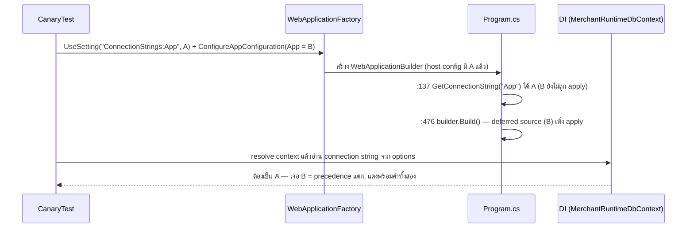

# Design: config ที่เทสต์ตั้งให้ host ต้องเป็นค่าที่ host ใช้จริง

> Status: approved 2026-08-06

ออกแบบตาม requirements ที่ approve แล้ว: D1 = A (gate สแกนทั้ง `tests/`), D2 = B (คง `Program.cs`
บังคับฝั่งเทสต์ + gate) — ไม่มี production code ถูกแตะ, `Program.cs:137` ยังเป็นกับดักที่ gate เฝ้าอยู่

## Architecture Overview

4 ชิ้น ทั้งหมดอยู่ฝั่ง test:

| ชิ้น | ที่อยู่ | หน้าที่ |
|---|---|---|
| sweep 21 ไฟล์ | `tests/Hosts.Tests/` | ย้ายทุกคีย์ `ConnectionStrings:*` จาก `ConfigureAppConfiguration` ไป `UseSetting` — แปลตรงตัว ไม่แตะคีย์อื่นและไม่แตะ assertion |
| gate | `tests/Architecture.Tests/HostTestConfigGateTests.cs` (ไฟล์ใหม่) | text scan ทั้ง `tests/` กันรูปแบบผิดกลับเข้ามา + pin ความจริงใน `Program.cs` ให้ ban list ไม่เน่า |
| canary | `tests/Hosts.Tests/HostConfigPrecedenceCanaryTests.cs` (ไฟล์ใหม่) | boot host จริงด้วยค่าขัดกันสองช่องทาง พิสูจน์ว่า `UseSetting` ชนะและไปถึงจุดอ่านที่ build time โดยไม่เปิด connection |
| REQ-3 (มีอยู่แล้ว) | `MerchantCatalogueLiveEndpointTests.cs` | `CapturingLoggerProvider` + `AssertOk` จาก `8b5c20f` ทำ 3.1-3.3 ครบ — งานนี้แค่ยืนยัน ไม่ย้ายไม่ hoist (ผู้ใช้รายเดียว ตาม requirements ข้อสังเกต 7) |

มุม deep-module: seam ของ harness คือ "ช่องทางฉีด config เข้า host" — วันนี้มีสองช่องที่ลำดับต่างกัน
(`UseSetting` = host config มาก่อนทุก build-time read และชนะทุกแหล่งของเครื่อง;
`ConfigureAppConfiguration` = deferred source ที่มาช้ากว่าจุดอ่านและแพ้ไฟล์ของเครื่อง)
D2 = B แปลว่าเราไม่ยุบช่องให้เหลือช่องเดียว แต่บังคับด้วย gate ว่าคีย์ build-time ผ่านได้เฉพาะช่องแรก

### ลำดับ config ที่เป็นจริง (พิสูจน์แล้วจาก `b575e26` + `WebHardeningTests.cs:30-33`)

| ลำดับ (สูงชนะ) | แหล่ง | มาทันจุดอ่าน build time? |
|---|---|---|
| 1 | `UseSetting` (host config) | ทัน |
| 2 | user-secrets / `appsettings.<Env>.json` / `appsettings.json` (ไฟล์ของเครื่อง) | ทัน — และคือแหล่งที่ host ตกไปใช้เงียบ ๆ บน PR #184 |
| 3 | in-memory source ผ่าน `ConfigureAppConfiguration` ของ factory | ไม่ทัน |

## Sequence Diagrams

boot ของ canary — ช่องทางขัดกันโดยเจตนา:



## Data Models & Interfaces

### gate — `HostTestConfigGateTests` (3 fact + 1 staleness)

```csharp
// ban list — คีย์ที่ Program.cs อ่านก่อน builder.Build() วันนี้; เพิ่มสมาชิกใหม่พร้อมหลักฐานจุดอ่านเสมอ
private static readonly string[] BuildTimeKeyPrefixes = ["ConnectionStrings"];

// allowlist — บรรทัดที่แตะ builder.Configuration ก่อน Build ที่พิสูจน์แล้วว่าปลอดภัยหรือรู้ตัวอยู่แล้ว
private static readonly string[] AllowedPreBuildConfigurationUses = [...];
```

- **Fact 1 — ban ฝั่งเทสต์**: สแกน `*.cs` ทั้ง `tests/` (ข้าม `bin/`/`obj/`) หา
  `.ConfigureAppConfiguration(` แล้วดึง region วงเล็บสมดุลของ invocation นั้น ถ้าใน region มี
  `BuildTimeKeyPrefixes` ตัวใด = offender — ข้อความบอกไฟล์ + คีย์ + รูปแบบถูก (`UseSetting`) ตาม REQ-2.3;
  จับทั้ง literal และ interpolated key (`$"ConnectionStrings:{x}"`) เพราะ match ที่ substring ไม่ใช่ syntax
- **Fact 2 — pin จุดอ่าน**: ข้อความของ `Program.cs` ก่อนบรรทัด `var app = builder.Build()` ต้องยังมี
  `GetConnectionString("App")` — วันไหนจุดอ่านย้ายไปหลัง Build (ทางเลือก A ของ D2 ถูกทำทีหลัง)
  fact นี้แดงเพื่อสั่งถอด `ConnectionStrings` ออกจาก ban list ไม่ใช่ปล่อย ban ค้างแบบเน่า (REQ-2.6)
- **Fact 3 — กันสมาชิกใหม่ของ class**: ทุกบรรทัดก่อน `builder.Build()` ที่มี `builder.Configuration`
  ต้อง match allowlist (รูป `.GetSection(` ซึ่ง lazy หรือ call site ที่มีอยู่แล้ว 9 จุด:
  `:130, :137, :181, :182, :186, :253, :291, :301` + ตระกูล `Configure<T>(GetSection)`) —
  บรรทัดใหม่นอก allowlist = แดงพร้อมคำสั่ง "อ่านหลัง Build หรือเพิ่ม allowlist พร้อมพิสูจน์ว่าเทสต์ฉีดคีย์นี้ผ่าน
  `UseSetting` ได้" — ปิดเคส `Vault:MasterKeyBase64` ถูกเปลี่ยนกลับเป็น eager (edge case ข้อ 3)
- **Fact 4 — allowlist ไม่เน่า**: ทุก entry ใน `AllowedPreBuildConfigurationUses` ต้องยังปรากฏจริงใน
  `Program.cs` — entry ที่หายไปแล้ว = แดงให้ถอด (REQ-2.6, แบบเดียวกับ
  `SaleCodeRenameCompletenessTests.cs:56-69`)

หา repo root แบบเดียวกับต้นแบบ (`pol-core.slnx`, `SaleCodeRenameCompletenessTests.cs:71-78`)
gate ไฟล์เองไม่ติด Fact 1 เพราะ scan จับเฉพาะรูป invocation `.ConfigureAppConfiguration(` ซึ่งในไฟล์ gate
มีแต่ใน string constant ที่ไม่ตามด้วยวงเล็บเปิดในรูปเดียวกัน

### canary — `HostConfigPrecedenceCanaryTests`

- factory ตั้ง `UseSetting("ConnectionStrings:App", A)` โดย A มี `Database=UseSettingWins` เป็น marker
  และตั้งคีย์เดียวกัน = B (`Database=DeferredSourceLoses`) ผ่าน `ConfigureAppConfiguration` — คือ "ค่าที่ขัดกัน
  ในแหล่งลำดับต่ำกว่า" ตาม REQ-4.2 ที่อยู่ใน repo เอง จึง deterministic ทุกเครื่อง (REQ-4.3)
- assertion อ่านค่าที่ host ใช้จริงจาก DI: resolve `MerchantRuntimeDbContext` แล้วอ่าน connection string
  จาก `Database.GetDbConnection().ConnectionString` (สร้าง object ไม่ open — REQ-4.4)
  ต้องมี marker ของ A; ข้อความ fail ระบุค่าทั้งสองตัว (ทำหน้าที่ "ล้มเหลวแบบระบุคีย์" ให้ REQ-1.4)
- ไฟล์ของเครื่อง (`appsettings.Development.json`) อยู่ลำดับกลาง — ต่อให้มี ก็แพ้ `UseSetting` และชนะแค่ B
  ผล assertion จึงไม่ขึ้นกับเครื่อง (REQ-1.3, 4.3)

### sweep 21 ไฟล์

แปลตรงตัวต่อไฟล์: entry `["ConnectionStrings:X"] = v` ใน dict ของ `AddInMemoryCollection` →
`builder.UseSetting("ConnectionStrings:X", v)`; คีย์อื่นใน dict คงที่เดิม; dict ที่ว่างแล้วก็ถอด
`ConfigureAppConfiguration` ทิ้งทั้ง block ได้ — คีย์ตาย `Admin`/`Worker` ยังตั้งต่อแบบเดิม
(ลบ = เปลี่ยนพฤติกรรมเกิน scope, requirements ข้อสังเกต 4 ให้รายงานเท่านั้น)
ระหว่าง sweep ตรวจด้วยว่ามีคีย์อื่นนอก `ConnectionStrings` ในไฟล์เหล่านี้ที่ `Program.cs` อ่านก่อน Build หรือไม่
(เทียบกับรายการ build-time read ที่ Fact 3 pin ไว้) — เจอ = เพิ่มเข้า `BuildTimeKeyPrefixes` พร้อมย้ายช่องทางในไฟล์นั้น

## Technology Decisions

| ทางเลือกที่ใช้ | เหตุผล | ทางที่ตัดทิ้ง |
|---|---|---|
| gate เป็น xUnit fact ใน `Architecture.Tests` | อยู่ในงาน CI `dotnet build + test` ที่ REQ-2.2 ต้องการอยู่แล้ว ไม่ต้องใช้ secret/SQL Server; precedent ตรงรูป (`SaleCodeRenameCompletenessTests`) | script ใน `scripts/` + CI step ใหม่ — เพิ่มจุด wiring โดยไม่ได้อะไรเพิ่ม |
| text scan วงเล็บสมดุล ไม่ใช่ Roslyn | จับ interpolated key ได้เพราะ match ที่ substring; โค้ดสั้นตรวจสอบเองง่าย | Roslyn semantic analysis — แม่นกว่าแต่แพงเกินโจทย์ และ loophole ที่เหลือ (ประกอบ string จากชิ้น) Roslyn ธรรมดาก็ไม่จับ |
| ban ทั้ง prefix `ConnectionStrings` ไม่ใช่เฉพาะ `App` | คีย์ตาย `Admin`/`Worker` ถูกตั้งใน 21 ไฟล์เหมือนกัน — ban ทั้ง prefix ทำให้รูปแบบสม่ำเสมอและกันสมาชิกถัดไปของตระกูลเดียวกัน | ban เฉพาะ `App` — เทสต์ใหม่ copy รูปผิดจากคีย์ข้างเคียงได้ |
| canary อ่านจาก DI options ไม่ mock อะไร | พิสูจน์ precedence จริงถึงจุดที่ `appConnString` ถูกส่งเข้า persistence registration โดยไม่แตะ DB (REQ-4.4) | assert ที่ `app.Configuration` เฉย ๆ — พิสูจน์แค่ merged view ไม่พิสูจน์ว่าค่าที่อ่านตอน build time คือค่าไหน |
| ไม่แตะ `Program.cs` เลย | ตาม D2 = B ที่ approve; ความเสี่ยง boot path เป็นศูนย์ | ย้ายจุดอ่านไปหลัง Build (ทางเลือก A) — Fact 2 เตรียมทางไว้แล้วถ้าทำวันหน้า |

## Error Handling Strategy

| กรณี | พฤติกรรม |
|---|---|
| เทสต์ใหม่ตั้งคีย์ build-time ผ่านช่องช้า | gate Fact 1 แดงบน CI ทุก run — ระบุไฟล์ คีย์ และบอกให้ใช้ `UseSetting` (REQ-2.1, 2.3) |
| จุดอ่านใน `Program.cs` ย้าย/หายไป | Fact 2 แดงสั่งอัปเดต ban list — gate ไม่ค้างเป็นกฎผี (REQ-2.6) |
| มีการอ่าน `builder.Configuration` แบบใหม่ก่อน Build | Fact 3 แดงพร้อมทางเลือกสองทางในข้อความ (REQ-2.4, edge case 3) |
| precedence ของ factory เปลี่ยน (framework upgrade ฯลฯ) | canary แดงพร้อมค่าทั้งสองช่องทาง — จับก่อนที่เทสต์ทั้ง suite จะเขียวหลอกบนเครื่อง dev (REQ-4.5) |
| loophole ที่ยอมรับ: ประกอบคีย์จาก string หลายชิ้น | text scan ไม่จับ — บันทึกเป็นข้อจำกัดใน doc comment ของ gate; canary + review เป็นชั้นถัดไป |

## Testing Strategy

| หลักฐาน | วิธีรัน | พิสูจน์ REQ |
|---|---|---|
| suite เดิมไม่หด | `dotnet test tests/Hosts.Tests` — ผ่าน >= 463 เท่าก่อน sweep (462 non-integration + 1 integration) | 1.5, 1.6 |
| ค่าไปถึงจริงบน CI-เทียบ-dev | Hosts.Tests เขียวทั้งบนเครื่องที่มี/ไม่มี `appsettings.Development.json` (CI คือเครื่องไม่มี) | 1.1, 1.2, 1.3 |
| canary | รัน `HostConfigPrecedenceCanaryTests` ปกติในชุด — เขียว = `UseSetting` ชนะและถึงจุดอ่าน | 4.1, 4.2, 4.3, 4.4 |
| mutation gate (สองครึ่ง) | ครึ่งแดง: ใส่ `["ConnectionStrings:App"]` กลับใน `ConfigureAppConfiguration` ของไฟล์หนึ่งชั่วคราว → Fact 1 ต้องแดงระบุไฟล์; ครึ่งเขียว: ถอดออก → เขียว — บันทึก Evidence | 2.7 |
| mutation canary (สองครึ่ง) | ครึ่งแดง: สลับ canary ให้ตั้งคีย์ผ่าน `ConfigureAppConfiguration` แทน (จำลองรูปแบบเดิมใต้เงื่อนไขค่าขัดกัน) → ต้องแดงพร้อมค่าทั้งสอง; ครึ่งเขียว: รูปแบบใหม่เงื่อนไขเดียวกัน → เขียว — บันทึกเป็น Evidence ในเอกสารงานนี้ | 4.5, 4.6 |
| REQ-3 ยังครบ | อ่าน + รัน `MerchantCatalogueLiveEndpointTests` (integration): `AssertOk` ยังรายงาน body + log + exception ใน output ปกติ, assertion ตรงค่า ไม่มี retry, ไม่มี credential ใน log ที่ capture | 3.1, 3.2, 3.3, 3.4, 3.5 |
| gate อยู่ในงาน CI ที่ถูกต้อง | `Architecture.Tests` รันในงาน `dotnet build + test` (`ci.yml:102`) โดยไม่ต้องมี secret | 2.2, 2.5 |

หมายเหตุ REQ-2.5: มีผลเฉพาะเมื่อ D2 = A — ถูกบันทึกใน requirements แล้วว่าไม่ใช้ (เลือก B จึงใช้ 2.4แทน)
ไม่เรียก `spec-architect` critique — งานนี้เป็น test harness + gate ล้วน ไม่แตะ CORE domain logic

## Requirement Traceability

| design element | REQ ที่ตอบ |
|---|---|
| sweep 21 ไฟล์เป็น `UseSetting` | 1.1, 1.2, 1.3, 1.5 |
| sweep แปลตรงตัว + suite count ไม่ลด | 1.6 |
| gate Fact 1 (ban ฝั่งเทสต์ + ข้อความชี้ไฟล์/รูปแบบถูก) | 1.4, 2.1, 2.3 |
| gate อยู่ใน `Architecture.Tests` (งาน CI ไม่ใช้ secret) | 2.2 |
| gate Fact 3 (กัน read ใหม่ก่อน Build) | 2.4 |
| REQ-2.5 ไม่ใช้ (D2 = B — บันทึกใน requirements) | 2.5 |
| gate Fact 2 + Fact 4 (pin จุดอ่าน + allowlist ไม่เน่า) | 2.6 |
| mutation gate สองครึ่ง | 2.7 |
| `CapturingLoggerProvider` + `AssertOk` ที่มีอยู่ (ยืนยัน ไม่แตะ) | 3.1, 3.2, 3.3, 3.4, 3.5 |
| canary (สองช่องทางขัดกัน, อ่านจาก DI, ไม่เปิด connection) | 1.4, 4.1, 4.2, 4.3, 4.4 |
| mutation canary สองครึ่ง + Evidence ในเอกสาร | 4.5, 4.6 |
