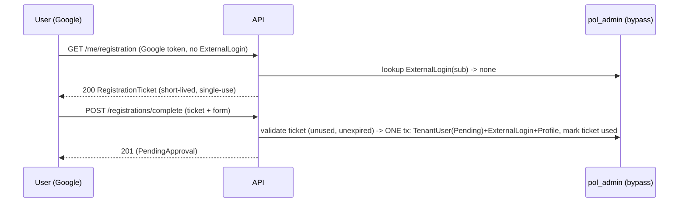

# Design: Identity & RBAC — TenantUser realm

> Status: unknown
> Mirrors the proven Tenant provisioning patterns (aggregate + allowlist-style validation, admin-scoped
> keyed DI, central migration + RLS + grants, ProblemDetails mapping).

## Architecture Overview

New module `src/Modules/Identity/` (3-tier, mirrors Tenant):

- **Identity.Domain** — `TenantUser` aggregate (`AggregateRoot<Guid>`), `TenantUserRole` enum
  {TenantAdmin, Finance, Viewer}, `TenantUserStatus` enum {PendingApproval, Active, Suspended},
  `ExternalLogin` (Provider+Subject -> TenantUserId), `TenantUserProfile`, `RegistrationTicket`
  (subject/email/hd + ExpiresAtUtc + UsedAtUtc, single-use). Factories validate invariants
  (throw `ArgumentException`).
- **Identity.Application** — ports `ITenantUserRepository`, `IRegistrationTicketStore`,
  `IRegistrationAuditWriter`; commands `IssueRegistrationTicket`, `CompleteRegistration`,
  `ApproveTenantUser`; query `ResolveTenantUser` (runtime). Depends on `Payments`? No — depends on
  `Tenant.Application` (to validate the selected tenant exists/active at approval, via a thin port).
- **Identity.Infrastructure** — EF configs + repos + ticket store + audit writer + module registration.

Reuses, does NOT duplicate: Google authn (`GoogleAuthenticationExtensions`), `IClock`, `IUnitOfWork`,
RLS floor (`fn_tenant_predicate`), `ProblemDetailsExceptionHandler`, the pol_admin keyed scope built
for Tenant (registration/approval run cross-tenant under pol_admin, like provisioning).

## The integration point (REQ-6 — the core change)

Today `HttpTenantContext` reads a `tenant_id` token claim (dev shim). This design replaces production
resolution: a scoped `TenantUserContext` resolves the authenticated Google `sub` -> active `TenantUser`
-> (TenantId, Role), binds TenantId as the ambient tenant (the same `AmbientTenant`/`ITenantScope` the
webhook path uses) so RLS `SESSION_CONTEXT('TenantId')` is set, and exposes the Role for authorization.

- Unregistered/pending/suspended subject -> no binding -> tenant routes 403 (REQ-6.3/6.4).
- The `tenant_id`-claim path remains ONLY as a Development fallback (off in production), so existing
  dev flows and Tenant's tests keep working.
- Role gating: a `RequireTenantRole` policy/filter reads the resolved Role (minimal matrix: Viewer =
  read-only; writes require TenantAdmin/Finance) — REQ-7.

## Sequence Diagrams



```mermaid
sequenceDiagram
  participant A as Admin (admin role)
  participant API
  participant DB as pol_admin (bypass)
  A->>API: POST /admin/tenant-users/{sub}/approve {tenantId, role}
  API->>DB: load TenantUser(Pending); validate Tenant exists+active
  API->>DB: ONE tx: set TenantId+Role+Active, write approval audit
  API-->>A: 200 (Active)
```

## Data Models & Interfaces

Tables (schema producer):

- `TenantUsers`: Id (PK), Subject (unique), Email, TenantId (NULL until approved, FK Tenants.Id),
  Role (int), Status (int), CreatedAtUtc. Index unique(Subject).
- `ExternalLogins`: Id (PK), Provider, Subject, TenantUserId (FK), unique(Provider, Subject).
- `TenantUserProfiles`: TenantUserId (PK/FK), DisplayName, ...non-secret.
- `RegistrationTickets`: Id (PK), Subject, Email, HostedDomain, ExpiresAtUtc, UsedAtUtc (NULL), CreatedAtUtc.
- `RegistrationAudits`: control-plane, admin/registration actions (mirrors ProvisioningAudits).

RLS (central migration `AddIdentityTables`, timestamp newest):
- FILTER + BLOCK on `fn_tenant_predicate(TenantId)` for `TenantUsers` (and child tables via their
  TenantId or parent scope). NOTE: a `PendingApproval` row has TenantId NULL -> the predicate must
  permit NULL only under bypass (pol_admin); pol_app never sees a NULL-tenant row. Implement by scoping
  pol_app reads to its own bound TenantId (NULL fails the equality -> hidden), which is the desired
  behaviour (a pending user is invisible to tenants; visible only to pol_admin bypass).
- `RegistrationTickets`/`RegistrationAudits`: control-plane, NOT under tenant predicate; pol_admin only.
- Grants: pol_app SELECT own TenantUsers/ExternalLogins/Profiles; pol_admin SELECT/INSERT/UPDATE all
  identity tables + SELECT/INSERT RegistrationTickets/RegistrationAudits. Down reverts.

Admin-scoped writes reuse Tenant's keyed pol_admin scope (`AddTenantAdminScope`): registration +
approval run under pol_admin (cross-tenant, before a tenant is bound). Generalise the registration to
bind admin-scoped `ITenantUserRepository`/`IRegistrationTicketStore`/`IRegistrationAuditWriter` via the
same keyed "admin" pattern.

## Technology Decisions

- Mirror Tenant: single-transaction writes via `IUnitOfWork.ExecuteInTransactionAsync` (admin UoW that
  clears the change tracker per attempt). Idempotent-under-retry.
- Tenant existence/active check at approval via a thin `ITenantDirectory` port (Identity.Application) ->
  implemented over the admin `ITenantRepository` (Tenant) in the host, to avoid Identity depending on
  Tenant.Infrastructure. Identity.Application -> Tenant.Application only (composition seam, like Tenant
  -> Payments.Application; Identity is a composition module, outside the peer-ban set).
- Registration ticket = opaque GUID, server-stored, single-use; TTL (e.g. 15 min) via `IClock`.

## Error Handling Strategy

Reuse `ProblemDetailsExceptionHandler`: `ArgumentException` -> 400, `NotFoundException` -> 404,
`ConflictException` -> 409 (duplicate subject, ticket replay), admin authz -> 401/403. A new
`ValidationException`-style for 422 is NOT added; inactive-tenant approval maps to `ConflictException`.

## Testing Strategy

- Unit (pure): TenantUser/RegistrationTicket factories (role/status validation, ticket expiry/single-use);
  handler tests with fakes (register issues ticket; complete creates Pending + rejects replay; approve
  sets Active from admin's tenant + rejects non-pending/inactive-tenant; resolver denies pending/suspended).
- Integration ([Trait Integration]): RLS — a tenant sees only its own users; pending (NULL tenant) rows
  invisible to pol_app; pol_admin cross-tenant; app cannot write identity rows; registration tickets
  admin-only; duplicate subject rejected.
- Hosts: admin approve endpoint authz (admin admit / tenant+anon reject); registration endpoints.
- Architecture: Identity.Domain no EF/no Infra; Identity.* no Host; Identity is a composition module.

## Requirement Traceability

| Section | REQ |
|---|---|
| TenantUser aggregate + enums | REQ-1, REQ-7.1 |
| ExternalLogin | REQ-2 |
| RegistrationTicket entity + store | REQ-3 |
| IssueRegistrationTicket / CompleteRegistration handlers | REQ-4, REQ-3 |
| ApproveTenantUser handler + ITenantDirectory | REQ-5, REQ-10.2/10.3 |
| TenantUserContext (runtime resolver) + AmbientTenant bind | REQ-6 |
| RequireTenantRole gating | REQ-7 |
| AddIdentityTables migration + RLS + grants | REQ-8 |
| Google email_verified/hd reuse + audit | REQ-9, REQ-5.6 |
| ProblemDetails mapping | REQ-10 |
