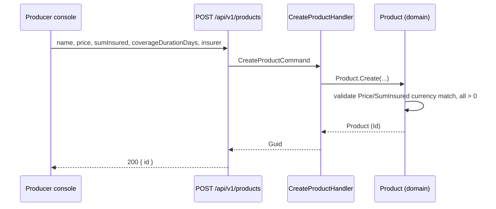
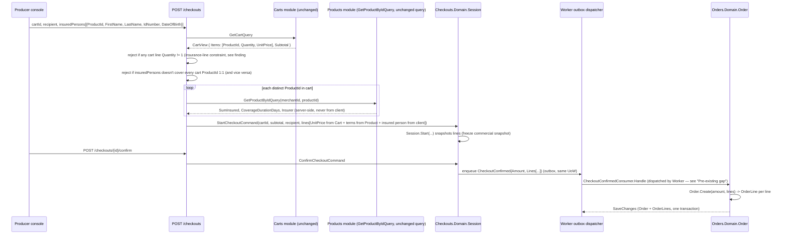
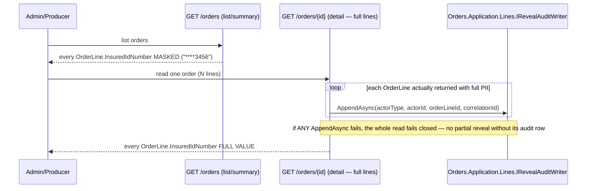

# Design: insurance-pivot

> Status: approved 2026-07-20

> Reviewed by a fresh-context adversarial critique (spec-architect) before this revision. 3 blockers and
> 8 should-fix findings were raised; all are applied below except one explicit rebuttal (event-versioning
> nullability, see Technology Decisions). The critique also surfaced a **pre-existing gap unrelated to
> insurance** that this spec's `OrderLine` addition forces into the open — user confirmed 2026-07-20:
> fixed inside this spec (task 0, before any insurance-specific task). All 4 open points from the previous
> revision are now decided — see "Decisions locked 2026-07-20" at the end of this file.

## Architecture Overview

No new module, no new schema. Every change lands inside modules/files that already exist, following
the exact dual-config (migration-owner + runtime-scalar) and owned-collection patterns already used by
`Cart`/`Item` — this design does not invent a new persistence pattern, it copies the one already proven
for the closest existing analog (a parent aggregate with an owned line collection under merchant
isolation).

| Component | Change | Why this shape |
|---|---|---|
| `Products.Domain.Product` | +3 fields (`SumInsured`, `CoverageDurationDays`, `Insurer`) | flat fields on the existing aggregate — REQ-1 |
| `Orders.Domain.Lines.Line` (new, aliased `OrderLine`) | new child entity owned by `Order` | mirrors `Carts.Domain.Items.Item` exactly (L1/L3 naming) — REQ-6/7 |
| `Orders.Domain.Order` | +`Lines` collection, `Create` takes lines, +1 quantity constraint | mirrors `Cart.Items`/`Cart.AddItem` shape — REQ-6 |
| `Orders.Domain.Lines.RevealAudit` (new) | append-only fact-of-reveal row, 1 per line revealed | mirrors `RegistrationAudit`'s plain shape, NOT `VaultRevealAudit`'s hash chain (see Technology Decisions) — REQ-7.5 |
| `Checkouts.Domain.Session` | +`Lines` collection (snapshot from Cart+Product at `Start`) | closes the existing "Checkout must freeze commercial snapshot" gap — REQ-6 |
| `Contracts.CheckoutConfirmed` | +`Lines` (new nested `CheckoutConfirmedLine` record) | additive v1 field — REQ-6/7 |
| `Orders.Application.CheckoutConfirmedConsumer` | builds `OrderLine`s from the event's lines | REQ-6 |
| `Products.Application.ProductView`/`ProductListItem` | +3 fields each | `ProductView` is what the fixed checkout flow reads server-side (see finding #2 below) — REQ-2/6 |
| `Hosts/src/Api/Persistence/WriteAuthorizers.cs` | add `OrderLine`, `RevealAudit` to `MerchantRequestWriteAuthorizer.OwnedTypes` (Insert) | the detail-read endpoint's audit write happens in the Api host — REQ-7.5 |
| `src/Hosts/Worker/WriteAuthorizer.cs` | add `OrderAggregate` (pre-existing gap) + `OrderLine` to an Insert allowlist | **task 0 — confirmed by user, see "Pre-existing gap" below** |
| `src/Hosts/Api/Program.cs` | extend `CreateProductRequest`/`StartCheckoutRequest` DTOs + new detail-read endpoint | REQ-2/6/7 |

**Explicitly not touched** (verified by reading the code, not assumed): `Carts.Domain` (its `Item` already
carries `ProductId`/`Quantity`/`UnitPrice` — nothing to add), `Orders.Domain.OrderStatus`, `Order.MarkPaid`,
`Payments.Domain.Session`/`SessionStatus`, `IPspAdapter`, the webhook pipeline.

### Pre-existing gap this design surfaces — fix confirmed as task 0 (user, 2026-07-20)

Tracing where `Order.Create`'s INSERT actually executes in production (not assumed — traced end to end):
`ConfirmCheckoutHandler` enqueues `CheckoutConfirmed` via `_outbox.Enqueue(...)` (`Checkouts.Application/
ConfirmCheckout.cs`) → only `src/Hosts/Worker/Program.cs` registers `AddMerchantRuntimeOutboxDispatcher()`
(the Api host does not) → `OutboxDispatcher` (`Persistence.MerchantRuntime/Outbox/OutboxDispatcher.cs`)
publishes the deserialized notification inside a Worker-owned scope, so `CheckoutConfirmedConsumer.Handle`'s
`_unitOfWork.SaveChangesAsync()` runs against `MerchantRuntimeDbContext` guarded by **`src/Hosts/Worker/
WriteAuthorizer.cs`'s `WorkerWriteAuthorizer`** — not the Api host's `MerchantRequestWriteAuthorizer`.

`WorkerWriteAuthorizer.CanWrite` (confirmed by reading the class AND its dedicated test file,
`tests/Hosts.Tests/WorkerWriteAuthorizerTests.cs`, which has a passing case titled
`Worker_denies_an_unrelated_entity_type`) only allows: Update on `OutboxMessage`/`MerchantUserOutbox`, and
Insert on `MerchantRegistrationNotice`. It does **not** allow Insert on `Order`/`OrderAggregate` at all —
and `Orders.Tests/CheckoutConfirmedConsumerTests.cs` only exercises the consumer against fakes
(`FakeOrderRepository`/`FakeUnitOfWork`), never against a real `GuardedRuntimeDbContext` + real
`WorkerWriteAuthorizer`. Nothing in the test suite currently proves an `Order` insert survives the real
Worker write floor.

This is a **pre-existing gap unrelated to this insurance pivot** — it would affect `Order` creation for
ANY product, not just insurance ones, and predates this spec. But `OrderLine` inserts in the SAME
transaction as `Order`'s insert, so REQ-6 cannot ship without resolving it. **Confirmed 2026-07-20:** fix
lands inside this spec as its own first task (task 0, ahead of every insurance-specific task) — add
`typeof(OrderAggregate)` and `typeof(OrderLine)` to an Insert allowlist in `WorkerWriteAuthorizer`,
mirroring exactly how `typeof(MerchantRegistrationNotice)` was already added there for the registration
consumer's mid-dispatch write (same class of problem — "the one write a message HANDLER performs
mid-dispatch," per that class's own doc comment). Task 0's Definition of Done includes a test proving
`Order` (and once added, `OrderLine`) survive the REAL Worker write floor — not a fake `IOrderRepository`
— mirroring `WorkerWriteAuthorizerTests.cs`'s existing style (see Testing Strategy).

## Sequence Diagrams

**1. Create an insurance Product (REQ-1/2)**



**2. Cart → Checkout → Order — server fetches money/insurance terms, client supplies only identity +
insured-person PII (fixes the client-trust issue in finding #2 below)**



**3. Detail read reveals full PII + per-line audit (REQ-7.4/7.5) vs list/summary (masked)**



## Data Models & Interfaces

### REQ-1/2 — `Product`

`Products.Domain.Product` gains 3 properties, validated in `Create` the same way `Name`/`Price` are today
(`ArgumentException`, trimmed strings):

```csharp
public Money SumInsured { get; private set; }
public int CoverageDurationDays { get; private set; }
public string Insurer { get; private set; } = default!;
```

`Product.Create` validates `SumInsured.Amount > 0`, `CoverageDurationDays > 0`, `Insurer` non-blank, and
`SumInsured.Currency == price.Currency` (REQ-1.5) before construction — mirrors the existing
`ArgumentException.ThrowIfNullOrWhiteSpace(name)` style.

EF mapping (both `Products.Infrastructure/ProductConfiguration.cs` — migration-owner — and
`Persistence.MerchantRuntime/Products/ProductConfiguration.cs` — runtime, scalar-only, same shape):

```csharp
builder.ComplexProperty(x => x.SumInsured, p =>
{
    p.Property(m => m.Amount).HasColumnName("SumInsuredAmount").HasPrecision(19, 4);
    p.Property(m => m.Currency).HasColumnName("SumInsuredCurrency").HasMaxLength(3).IsFixedLength().IsUnicode(false);
});
builder.Property(x => x.CoverageDurationDays).IsRequired();
builder.Property(x => x.Insurer).HasColumnName("InsurerName").HasMaxLength(200).IsRequired();
```

Wire DTOs (`src/Hosts/Api/Program.cs`):

```csharp
internal sealed record CreateProductRequest(string Name, Money Price, Money SumInsured, int CoverageDurationDays, string Insurer);
```

`Products.Application.CreateProductCommand`/`ProductListItem` **and `ProductView`** (the read model
`GetProductByIdQuery` returns — needed because the fixed checkout flow reads insurance terms through it,
see REQ-6 below) all gain the same 3 fields, positionally after `Price` — `Money` already round-trips
through `MoneyJsonConverter` (the `{amount, currency}` shape used today), so `SumInsured` needs no new
converter.

### REQ-6 — `OrderLine`

New file `Orders.Domain/Lines/Line.cs`, namespace `Orders.Domain.Lines`, type `Line` — L1/L3/L4 naming
(nesting unit = the line sub-domain hanging off `Order`; plural namespace `Lines`, singular type `Line`;
prefix `Order` dropped because the namespace already supplies it). Every other file that touches it uses
the file-level alias already established for `CartAggregate`/`CartItem` (L6): `using OrderLine =
Orders.Domain.Lines.Line;`.

```csharp
namespace Orders.Domain.Lines;

public sealed class Line : Entity<Guid>
{
    public Guid OrderId { get; private set; }
    public Guid MerchantId { get; private set; }          // denormalized from Order, same reason as Cart.Item.MerchantId
    public Guid ProductId { get; private set; }
    public int Quantity { get; private set; }              // constrained to exactly 1 for this spec — see below
    public Money UnitPrice { get; private set; }           // premium per unit, from Cart.Item at checkout-start (server, never client)

    // Insurance-term snapshot at purchase time (REQ-6.1) — copied from Product.* when the line is built
    // (server-side, at checkout-start — see finding #2), never re-read live, so an edit to Product after
    // purchase cannot change a paid order's terms.
    public Money SumInsured { get; private set; }
    public int CoverageDurationDays { get; private set; }
    public string Insurer { get; private set; } = default!;

    // Insured person, 1 per line (REQ-7.1).
    public string InsuredFirstName { get; private set; } = default!;
    public string InsuredLastName { get; private set; } = default!;
    public string InsuredIdNumber { get; private set; } = default!;
    public DateTime InsuredDateOfBirth { get; private set; }

    private Line() { }

    internal Line(Guid id, Guid orderId, Guid merchantId, Guid productId, int quantity, Money unitPrice,
        Money sumInsured, int coverageDurationDays, string insurer,
        string insuredFirstName, string insuredLastName, string insuredIdNumber, DateTime insuredDateOfBirth)
        : base(id) { /* assign every property; ctor throws ArgumentException on blank name/id or future DOB
                        WITHOUT echoing the value in the message text (REQ-7.3 — no-log applies to exception
                        messages too, not just structured logs) */ }
}
```

**Quantity constraint (closes finding #3 — "1 insured person/line" vs Cart's quantity-merge behavior):**
`Cart.AddItem` merges repeat adds of the same product+price into one line with `Quantity > 1` — but
exactly one insured person is captured per `OrderLine` (locked decision), so `Quantity > 1` on an
insurance line would mean "N policies, 1 insured person," which nobody decided. Rather than touch
`Carts.Domain` (explicitly out of scope — Cart has no concept of "this product is insurance"), the
`/checkouts` endpoint rejects starting a checkout when any cart line has `Quantity != 1`
(`Results.Problem(400, "insurance items must have quantity 1")`). **Confirmed by user, 2026-07-20.**

`Order` gains the owned collection, mirroring `Cart.Items`/`Cart.AddItem` exactly:

```csharp
private readonly List<OrderLine> _lines = [];
public IReadOnlyCollection<OrderLine> Lines => _lines.AsReadOnly();
```

`Order.Create` takes an `IReadOnlyList<OrderLineInput>` (a small input record in `Orders.Application`,
NOT the domain `Line` type, so the caller doesn't need to construct domain entities by hand — mirrors how
`Cart.AddItem` takes primitives, not `Item`), builds one `Line` per input via `Guid.CreateVersion7()`
(mirrors `Cart.AddItem`'s id generation, not `Guid.NewGuid()`), and validates (REQ-6.3/6.7):

- at least 1 line (empty list -> `ArgumentException`, closes REQ-6.7 at the domain boundary — the same
  place `Product.Create` already throws for invalid input)
- every line's `Quantity == 1` (defense in depth — the endpoint already rejects this earlier, REQ-6 above)
- `sum(line.UnitPrice * line.Quantity) == amount` exactly, same currency (REQ-6.3)

EF mapping mirrors `Cart`/`Item` in BOTH configs (migration-owner `Orders.Infrastructure/OrderConfiguration.cs`
+ new `Orders.Infrastructure/Lines/LineConfiguration.cs`, and their runtime twins) — same-cluster,
aggregate-internal relationship, so unlike a cross-module FK it is NOT stripped to scalar-only in the
runtime config (mirrors `CartConfiguration`'s explicit comment on this point):

```csharp
// On Order (both configs):
builder.HasAlternateKey(x => new { x.Id, x.MerchantId });   // NEW on Order — did not exist before this spec
builder.HasMany(x => x.Lines).WithOne()
    .HasForeignKey(l => new { l.OrderId, l.MerchantId })
    .HasPrincipalKey(x => new { x.Id, x.MerchantId })
    .OnDelete(DeleteBehavior.Cascade);
builder.Navigation(x => x.Lines).UsePropertyAccessMode(PropertyAccessMode.Field);

// LineConfiguration (new file, mirrors ItemConfiguration):
builder.ToTable("OrderLines", SchemaNames.Shop);
builder.HasKey(x => x.Id);
builder.Property(x => x.MerchantId).IsRequired(); // denormalized from Order
// ComplexProperty for UnitPrice/SumInsured (same decimal(19,4)+char(3) shape as Product/Item)
builder.Property(x => x.Insurer).HasColumnName("InsurerName").HasMaxLength(200).IsRequired();
builder.Property(x => x.InsuredFirstName).HasMaxLength(200).IsRequired();
builder.Property(x => x.InsuredLastName).HasMaxLength(200).IsRequired();
builder.Property(x => x.InsuredIdNumber).HasMaxLength(20).IsRequired();
builder.Property(x => x.InsuredDateOfBirth).IsRequired();
```

**Write-authorizer allowlist — two DIFFERENT files, two DIFFERENT reasons (do not conflate them):**
`GuardedRuntimeDbContext.GuardPendingChanges` calls `IWriteAuthorizer.CanWrite` for every tracked
Added/Modified/Deleted entry with no exemption — a type not named in the ACTIVE authorizer's allowlist is
denied outright, and "active" depends on which host executes the write:

1. `src/Hosts/Worker/WriteAuthorizer.cs`'s `WorkerWriteAuthorizer` — where `Order`/`OrderLine` INSERT
   actually happens (the outbox-dispatched `CheckoutConfirmedConsumer` path). See "Pre-existing gap"
   above — this needs `OrderAggregate` (missing today) and `OrderLine` (new) added to an Insert-only
   allowlist entry, mirroring `MerchantRegistrationNotice`'s existing entry there.
2. `src/Hosts/Api/Persistence/WriteAuthorizers.cs`'s `MerchantRequestWriteAuthorizer.OwnedTypes` — where
   the NEW detail-read endpoint's `RevealAudit` INSERT happens (an ordinary, synchronous Api-host request,
   guarded the normal way `CartItem` sits next to `CartAggregate` today). `OrderLine` itself does not
   strictly need to be writable here unless a future Api-host code path also inserts/updates it directly;
   add it anyway for symmetry with `OrderAggregate` already being there.

### REQ-6 — `Checkouts.Domain.Session` (freezes the snapshot, server-authoritative)

New sibling file `Checkouts.Domain/Lines/Line.cs`, namespace `Checkouts.Domain.Lines`, type `Line` — same
naming law application as the Orders side, a DIFFERENT CLR type from `Orders.Domain.Lines.Line` (no cross-
module domain reference; the two modules never see each other's domain types, only the `Contracts` DTO).
Holds exactly what `Session.Start` needs to snapshot per line: `ProductId`, `Quantity` (always 1),
`UnitPrice`, `SumInsured`, `CoverageDurationDays`, `Insurer`, and the 4 insured-person fields — captured
at `Start` time, not re-queried later (closes the "Checkout must freeze commercial snapshot" gap already
named in `docs/reference/platform-modules.md` §7). `Session` gains a `Lines` collection mirroring
`Order.Lines` (same `List<T>` + `AsReadOnly()` shape).

**Trust boundary fix (closes finding #2 — the earlier draft let the client dictate `UnitPrice`/
`SumInsured`/`CoverageDurationDays`/`Insurer`, which is exactly the client-supplied-money hole the
platform's own standing rule forbids — "Product เป็น source of truth เสมอ ... ไม่รับราคาจาก client").
The client-facing request carries ONLY identity + PII, never money or insurance terms:**

```csharp
public sealed record StartCheckoutInsuredPerson(
    Guid ProductId, string FirstName, string LastName, string IdNumber, DateTime DateOfBirth);

internal sealed record StartCheckoutRequest(
    Guid CartId, string? Recipient, IReadOnlyList<StartCheckoutInsuredPerson> InsuredPersons);
```

`POST /checkouts`'s handler (`Program.cs`) already fetches `cart.Items` (`CartView.Items`, each carrying
`ProductId`/`Quantity`/`UnitPrice` — verified in `Carts.Application.GetCart`). It now, per distinct
`ProductId` in the cart:

1. rejects the whole request if any cart item has `Quantity != 1` (insurance-line constraint, above)
2. rejects if `InsuredPersons` doesn't cover the cart's `ProductId` set exactly 1:1 (missing entry -> 400;
   an `InsuredPersons` entry for a `ProductId` not in the cart -> 400; a duplicate `ProductId` in
   `InsuredPersons` -> 400, join would be ambiguous otherwise)
3. calls `GetProductByIdQuery(merchantId, productId)` (the existing internal query `Cart` already uses at
   add-item time — reused here unchanged) to fetch `SumInsured`/`CoverageDurationDays`/`Insurer` — server
   -side, from the SAME source of truth `Price` already comes from
4. if the `Product` is missing or `IsActive == false` at this point -> 404/409 [note 2026-07-30: superseded by
   spec `products-sp-53-alignment` (§5.2 field parity) — `IsActive` was dropped; the gate is now
   `PaymentStatus != UNPAID`, same 404/409 statuses] (a product removed/deactivated
   between add-to-cart and checkout-start; the existing system already accepts a smaller version of this
   staleness window for `Price` itself — see Technology Decisions)
5. builds one `StartCheckoutCommand` line per cart item: `UnitPrice` from `cart.Items`, insurance terms
   from step 3, insured-person fields from the matching `InsuredPersons` entry

### REQ-6/7 — `Contracts.CheckoutConfirmed` (additive v1)

```csharp
public sealed record CheckoutConfirmedLine(
    Guid ProductId, int Quantity, Money UnitPrice, Money SumInsured, int CoverageDurationDays, string Insurer,
    string InsuredFirstName, string InsuredLastName, string InsuredIdNumber, DateTime InsuredDateOfBirth);

public sealed record CheckoutConfirmed(
    Guid MerchantId, Guid CheckoutSessionId, Money Amount, string? Recipient, DateTime OccurredAt,
    IReadOnlyList<CheckoutConfirmedLine> Lines) : INotification   // Lines is the ONLY new field, required (see Technology Decisions — rebuttal on nullability)
{
    public const string SchemaVersion = "v1";
}
```

`CheckoutConfirmedConsumer.Handle` maps each `CheckoutConfirmedLine` 1:1 into an `OrderLineInput` and
passes them to `Order.Create`.

### REQ-7.4/7.5 — masking + reveal audit

**Masking boundary, made crisp (closes finding #9):** three Orders read surfaces return `OrderLine` data,
each with its own rule:

1. **Merchant-authenticated list/summary** (`GET /orders`, any reporting view) — `InsuredFirstName`/
   `InsuredLastName`/`InsuredDateOfBirth` returned as-is; `InsuredIdNumber` always projected through
   `MaskIdNumber` below.
2. **Merchant-authenticated detail** (`GET /orders/{orderId}`) — everything returned in full, including
   `InsuredIdNumber`; triggers REQ-7.5's per-line reveal audit.
3. **Anonymous, capability-token-gated customer summary** (`GET /orders/{token}/summary`) — no
   authenticated actor to audit against, and the token is a forwardable link, not a login, so this surface
   gets its OWN, more restrictive rule (confirmed by user, 2026-07-20): `InsuredFirstName`/
   `InsuredLastName` returned as-is (same as the merchant list view), `InsuredIdNumber` masked through the
   SAME `MaskIdNumber` used for surface 1, and `InsuredDateOfBirth` **omitted from the response shape
   entirely** — not masked, not present. No reveal audit here (nothing full-value is ever disclosed on
   this surface, so REQ-7.5 doesn't apply to it).

No shared masking helper (explicit non-goal — `PspSecretEnvelopeFactory.MaskAll` stays private to
Payments). A small private static method, local to wherever the list/summary read model is projected
(`Orders.Application`). Note this picks ONE concrete algorithm — the `••••3a9f` in requirements.md REQ-7.4
was illustrative shorthand for "masked, last 4 visible," not a literal byte-for-byte spec (the actual
`PspSecretEnvelopeFactory.MaskAll` it was inspired by returns a bare last-4 hint with no prefix at all —
verified by reading the code, not assumed; the two conventions were never actually identical):

```csharp
private static string MaskIdNumber(string idNumber) =>
    idNumber.Length <= 4 ? new string('*', idNumber.Length) : $"****{idNumber[^4..]}";
```

Reveal audit — `Orders.Domain.Lines.RevealAudit`, append-only, marked with `AppendOnlyDescriptor.Mark`
(same mechanism `VaultRevealAudit`/`ProvisioningAudit`/`RegistrationAudit` already use — `GuardedRuntimeDbContext`
rejects Modified/Deleted for anything carrying that annotation, independent of `IWriteAuthorizer`).
Deliberately mirrors `RegistrationAudit`'s plain shape, NOT `VaultRevealAudit`'s SHA-256 hash chain — see
Technology Decisions for why. **One row per `OrderLine` actually revealed** (closes finding #8's
granularity gap — a detail read of an N-line order writes N rows, not one):

```csharp
namespace Orders.Domain.Lines;

public sealed class RevealAudit : Entity<Guid>
{
    public Guid OrderLineId { get; private set; }
    public Guid MerchantId { get; private set; }
    public string ActorType { get; private set; } = default!;   // "admin" | "merchant-user"
    public string ActorId { get; private set; } = default!;
    public string CorrelationId { get; private set; } = default!;
    public DateTime RevealedAt { get; private set; }

    private RevealAudit() { }
    public static RevealAudit For(Guid orderLineId, Guid merchantId, string actorType, string actorId,
        string correlationId, DateTime revealedAt) => new() { /* assign */ };
}

// Orders.Application — port; a NEW, separate interface, not IVaultRevealAuditWriter (locked decision).
public interface IRevealAuditWriter
{
    Task AppendAsync(Guid orderLineId, Guid merchantId, string actorType, string actorId,
        string correlationId, CancellationToken cancellationToken);
}
```

**Fail-closed on audit failure (closes finding #8's second half):** the detail-read handler calls
`IRevealAuditWriter.AppendAsync` for every line it is about to reveal in full BEFORE returning the
response (mirrors where `IVaultRevealAuditWriter.AppendAsync` is called relative to a vault reveal — inside
the read, not deferred/fire-and-forget). If any `AppendAsync` call throws, the whole request fails (5xx) —
none of that order's lines are returned with full PII. A reveal that cannot be proven audited must not
happen.

## Technology Decisions

- **`OrderLine` mirrors `Cart.Item`'s EF shape exactly** (denormalized `MerchantId`, composite alternate
  key + FK, cascade delete, field-backed navigation) instead of inventing a different owned-entity
  pattern — it is the same shape of problem (a parent aggregate with an owned line collection under
  merchant isolation) and the codebase already has one proven, tested answer to it.
- **Insurance-term snapshot on `OrderLine`, not a live `ProductId` read** (locked decision, REQ-6.1) —
  `Product` has no versioning (REQ-1 confirms this is out of scope), so a live read would let an edit to
  a `Product` retroactively change what a paid order says it covered. Snapshotting 3 scalar/complex
  columns is cheaper than building `ProductVersion` (a real target-design item already named in
  `docs/reference/platform-modules.md` §5 as **not built**) just to get immutability for this spec.
- **Accepted staleness window between add-to-cart and checkout-start, not closed by this spec** — REQ-6's
  fix (fetch `SumInsured`/`CoverageDurationDays`/`Insurer` server-side at checkout-start, §"Trust boundary
  fix" above) closes the CLIENT-TRUST hole but not a smaller timing gap: `UnitPrice` freezes at
  add-to-cart, while insurance terms freeze at checkout-start — a `Product` edited in between produces a
  line with an old premium and new coverage terms. This is the SAME class of gap the platform already
  documents and accepts for `Price` alone today (`docs/reference/platform-modules.md` §6, "นโยบายราคาเปลี่ยน
  ระหว่างทาง ... ยังไม่มี" — target says Checkout should revalidate against Product, as-built doesn't).
  Closing it for real (freezing ALL of a product's terms at the SAME instant) means Checkout revalidating
  the whole cart against Product at start time for every field, not just adding 3 columns — bigger than
  this spec asked for. Flagged, not fixed.
- **Reveal-audit mirrors `RegistrationAudit`, not `VaultRevealAudit`** — `VaultRevealAudit`'s SHA-256
  hash chain exists because PSP credentials are explicitly the platform's "สินทรัพย์อ่อนไหวสุด" (most
  sensitive asset, `SECURITY_RULES.md`). Insured-person PII is sensitive but the user's locked decision
  did not raise it to that tier (no encryption-at-rest either, REQ-7.6), and `SECURITY_RULES.md`'s general
  audit-log rule already offers "immutable table policy" as a valid tamper-evidence mechanism on its own,
  separate from hash-chaining. Building the heavier mechanism for a data class the user did not ask to
  harden that far would be scope the requirements never asked for.
- **No shared masking/audit utility extracted** (explicit non-goal, REQ-7.4/7.5) — `PspSecretEnvelopeFactory.
  MaskAll` is `private` to one file today; extracting a shared `BuildingBlocks` helper for 2 call sites
  is a refactor nobody asked for and the user explicitly said not to do it.
- **`Guid.CreateVersion7()` for `OrderLine.Id`**, matching `Cart.AddItem`'s id generation, not
  `Guid.NewGuid()` (which `Order.Create`/`Product.Create` use) — mirrors the nearest sibling (a line
  entity created inside its parent's factory method), not the aggregate-root convention.
- **`CheckoutConfirmed.Lines` stays a required (non-nullable) field — explicit rebuttal of the critique's
  suggestion to make it optional for in-flight-message compatibility.** That concern is real for a live
  production system with messages already sitting in the outbox when a new field ships. This project is
  not one: every schema/event change in this repo to date has shipped as a pre-prod, big-bang reset with
  no transfer migration and no live traffic to protect (see `CLAUDE.md`'s standing constraint and every
  prior spec's migration notes). Adding nullable-and-defensive handling for a compatibility scenario this
  project has never had, and has explicitly chosen not to have, is exactly the unrequested robustness the
  project's own conventions argue against. If a later spec changes that convention (a real production
  deploy with live traffic), THAT spec should revisit event nullability — not this one, speculatively.

## Error Handling Strategy

| Case | REQ | Response |
|---|---|---|
| `SumInsured`/`Price` currency mismatch on `Product.Create` | 1.5 | `ArgumentException` → existing 400 mapping (unchanged handler) |
| Missing `sumInsured`/`coverageDurationDays`/`insurer` on create-product request | 2.4 | model-binding 400, same ProblemDetails shape as today |
| Checkout confirm with an empty cart (0 lines) | 6.7 | `ArgumentException` from `Order.Create`/`Session.Start`, surfaced the same way the existing "Cannot check out an empty cart" 400 already is |
| Any cart line has `Quantity != 1` | 6 (constraint) | 400 at `/checkouts`, before any command dispatch |
| `sum(OrderLine.UnitPrice × Quantity) != Amount` | 6.3 | `ArgumentException` from `Order.Create` — a build-time invariant, never reaches the DB |
| Cart `ProductId` with no matching `InsuredPersons` entry (or vice versa; or a duplicate `ProductId` in `InsuredPersons`) | 7.1/7.2 | 400 at the `/checkouts` endpoint, before any command dispatch |
| `Product` missing/inactive when fetching insurance terms at checkout-start | (trust-boundary fix) | 404/409 at `/checkouts` |
| `IdNumber`/name blank, `DateOfBirth` in the future | 7.2 | `ArgumentException` from `Line`'s constructor, message text never echoes the field value (7.3) |
| `IRevealAuditWriter.AppendAsync` throws during a detail read | 7.5 (fail-closed) | 5xx, no PII returned for any line of that request |
| New entity type reaches `SaveChanges` without an allowlist entry (either host) | (regression guard) | `WriteGuardException` — the floor working as designed; add the type to the RIGHT host's `OwnedTypes`, don't bypass |

## Testing Strategy

- **Unit (domain):** `Product.Create` validation (REQ-1.3/1.5); `Order.Create` line-sum invariant (6.3),
  empty-lines rejection (6.7), `Quantity != 1` rejection; `Line` constructor validation (7.2) — INCLUDING
  an assertion that the thrown exception's `Message` does not contain the invalid `IdNumber`/name/DOB
  value verbatim (7.3, closes finding #7); `MaskIdNumber` (7.4, table-driven: short/exact-4/long inputs).
- **Integration (EF):** round-trip `Product` with the 3 new columns; round-trip `Order` with N `OrderLine`s
  via the alternate-key/composite-FK mapping (cascade delete verified by deleting the parent `Order` and
  asserting lines are gone); `AppendOnlyDescriptor` rejects an `UPDATE`/`DELETE` against `RevealAudit` at
  the `GuardedRuntimeDbContext` layer (mirrors the existing `VaultRevealAudit` guard test).
- **Write-authorizer regression, BOTH hosts (closes finding #1 — this is the one that would have caught
  the pre-existing gap):** a test against the REAL `WorkerWriteAuthorizer` (not a fake) asserting it grants
  Insert for `OrderAggregate`/`OrderLine` for the message's own merchant and denies a mismatched
  `targetMerchant` — mirrors `WorkerWriteAuthorizerTests.cs`'s existing style exactly. A second test
  against `MerchantRequestWriteAuthorizer` for `RevealAudit`'s Insert, mirroring the existing `CartItem`
  coverage there.
- **End-to-end (Hosts.Tests), against the REAL Worker DI graph, not fakes:** full happy path — create
  insurance `Product` → add to cart (quantity 1) → start checkout with per-line insured person → confirm →
  **real outbox dispatch through a real `OutboxDispatcher` + real `WorkerWriteAuthorizer`** → `Order` +
  `OrderLine`s created → pay via the existing PSP test double → `Order.Paid` (this is also the test that
  proves REQ-3's "unmodified" claim, by re-running the existing Order/Payment assertions unchanged and
  green); list endpoint shows masked `IdNumber`; detail endpoint shows full value and writes exactly one
  `RevealAudit` row PER LINE returned (7.4/7.5); a run where `IRevealAuditWriter` is made to fail asserts
  the detail read returns no PII (fail-closed); customer summary endpoint response shows the insured
  person's name, a masked `IdNumber` (same format as the list endpoint), and never serializes
  `InsuredDateOfBirth` at all.
- **Negative-path tests for the new 400s:** cart item with no matching `InsuredPersons` entry; extra
  `InsuredPersons` entry for a `ProductId` not in the cart; duplicate `ProductId` in `InsuredPersons`;
  `Quantity > 1` on an insurance line; `Product` deactivated between add-to-cart and checkout-start.

## Requirement Traceability

| REQ | Section |
|---|---|
| 1.1-1.6 | `Product` +3 fields, `Create` validation, `ProductConfiguration` (both configs) |
| 2.1-2.4 | `CreateProductRequest`/`Command`, `ProductListItem`/`ProductView`, unchanged Money wire/error contract |
| 3.1-3.4 | "Explicitly not touched" list; `Order`/`OrderStatus`/`MarkPaid`/`Payments.Domain.Session` untouched; end-to-end test re-runs existing Order/Payment assertions unchanged |
| 4.1-4.2 | Seed migration (new `INSERT` statements for `Products`, mirroring the existing `migrationBuilder.Sql` seed style — no new mechanism) |
| 5.1-5.2 | Docs update (mechanical, no design decision — tracked as a task, not modeled here) |
| 6.1-6.7 | `Orders.Domain.Lines.Line`, `Order.Lines`/`Create`, quantity==1 constraint, `Checkouts.Domain.Lines.Line`, `Session.Lines`, server-side `GetProductByIdQuery` fetch, `Contracts.CheckoutConfirmed.Lines`, `CheckoutConfirmedConsumer`, write-authorizer allowlist fix in BOTH hosts |
| 7.1-7.6 | `Line`'s 4 insured-person fields + validation (no-value-echo), quantity==1 constraint (closes the "1 person/line" ambiguity), `MaskIdNumber` + crisp list/detail/customer-summary boundary, `Orders.Domain.Lines.RevealAudit` + `IRevealAuditWriter` (per-line, fail-closed), REQ-7.6 satisfied by NOT building an encryption mechanism (absence is the point) |

## Decisions locked 2026-07-20 (user — no open points remain)

1. **Pre-existing `WorkerWriteAuthorizer` gap** — fixed inside this spec, as task 0 (ahead of every
   insurance-specific task), with a real-write-floor test as its Definition of Done.
2. **Insurance-line quantity constrained to 1** — confirmed as designed.
3. **Customer summary endpoint** — shows insured-person name + masked `IdNumber` (same format as the
   merchant list view); never shows `InsuredDateOfBirth` or a full `InsuredIdNumber`. No reveal audit on
   this surface (nothing full-value is ever disclosed here).
4. **PII retention** — confirmed as designed: no purge job/period in this spec; owned by compliance/legal
   via its own ADR before production.
