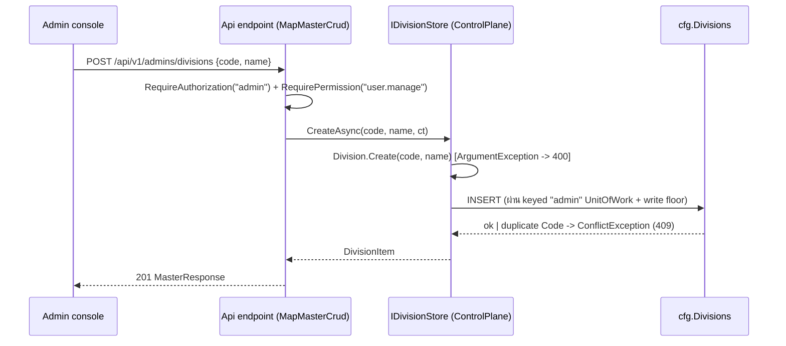
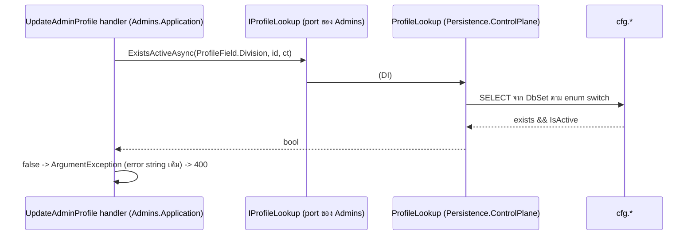

# Design: masterdata-split

> Status: approved 2026-07-19

## Architecture Overview

แยก MasterData ออกเป็น 4 โมดูลอิสระ แล้วลบทิ้ง — ไม่มี shared base/interface ของ master
data เหลือที่ใดใน solution (user-locked). ทุกอย่างบน wire คงเดิม.

**ของใหม่ (ต่อโมดูล x4 — แทน `Divisions` ด้วย `Levels`/`Offices`/`Positions`):**

```
src/Modules/Divisions/
  Divisions.Domain/
    Divisions.Domain.csproj          (ref: SharedKernel เท่านั้น)
    Division.cs                      (sealed : AggregateRoot<Guid> — module root ns, L2)
  Divisions.Application/
    Divisions.Application.csproj     (ref: Divisions.Domain + BuildingBlocks.Application)
    DivisionStore.cs                 (record DivisionItem + interface IDivisionStore)
  Divisions.Infrastructure/
    Divisions.Infrastructure.csproj  (ref: Divisions.Application + BuildingBlocks.Infrastructure
                                      + Microsoft.EntityFrameworkCore.SqlServer)
    DivisionsModuleRegistration.cs   (no-op AddDivisionsModule — assembly anchor, Iam shape)
    Persistence/DivisionConfigurations.cs  (standalone config เต็ม, ToTable("Divisions",
                                            SchemaNames.Cfg) — mirror ทุก facet จาก config เดิม)
```

**ของที่ตาย:** `src/Modules/MasterData/` ทั้ง 3 project, abstract TPC base
`MasterDataItem`, generic `IMasterDataStore`/`MasterItem`, generic `IMasterDataLookup`/
`MasterRef`, `Persistence.ControlPlane/MasterData/` ทั้งโฟลเดอร์,
`tests/Architecture.Tests/MasterDataArchitectureTests.cs`.

**ของที่ rewire (ไม่เปลี่ยนพฤติกรรม):**

| ชั้น | เปลี่ยนเป็น |
|------|-------------|
| `Persistence.ControlPlane` | โฟลเดอร์ต่อโมดูล: `Divisions/DivisionStore.cs` + `Divisions/DivisionConfiguration.cs` (x4, clone semantics จาก `ControlPlaneMasterDataStore` เดิม); `Admins/MasterDataLookup.cs` -> `Admins/ProfileLookup.cs`; DbSets/usings/`OnModelCreating` ใน `ControlPlaneDbContext`; DI ใน `ControlPlanePersistenceRegistration` |
| `Admins.Application` | port ใหม่ `IProfileLookup` (enum-based) แทน `IMasterDataLookup` — **ตัด reference โมดูลทุกตัวทิ้ง**; consumer ที่ inject port: `CreateScopedAdmin.cs`, `UpdateAdminProfile.cs`, `UserQueries.cs` (`MasterRef` -> `ProfileRef`) |
| `Admins.Infrastructure` | `UserConfigurations.cs` usings ใหม่; csproj ref 4 Domain (ชั้นเดียวที่เห็น entity type) |
| `Hosts/Api` | `Program.cs` usings + `MapMasterCrud<TStore, TItem>` delegate-parameterized + `MasterRefToWire(MasterRef?)` เปลี่ยน **param type** เป็น `ProfileRef?` (**คงชื่อ** `MasterRefToWire`/`MasterRefResponse` — word-boundary ไม่ชน token); `WriteAuthorizers.cs` usings; `DesignTimeDbContextFactories.cs` 1 assembly -> 4; `Api.csproj` |
| Tests | `WriteFloorTests.cs:169` (`MasterData.Domain.Positions.Position.Create` -> `Positions.Domain.Position.Create` — live code, หลุดแล้ว build แดง + trip gate); `Architecture.Tests.csproj:62-64` swap 3 MasterData ref -> 12 assembly ใหม่; `Admins.Tests.csproj:26` ตัด `MasterData.Application`; `MasterDataAndProfileTests.cs` แยกสองส่วน (ดู Testing Strategy); comment sweep: `ModelDisjointnessTests.cs:139` (TPC base), `PermissionGateSitesTests.cs:20-21` (`MapMasterCrud<T>` -> `<TStore,TItem>`) |
| Migrations | `.Designer.cs` x4 + `PolDbContextModelSnapshot.cs` — surgery ตาม procedure ด้านล่าง; `Up()/Down()` ไม่แตะ |

**Atomic cutover constraint:** `ModelDisjointnessTests` เทียบ entity ข้าม context ด้วย CLR
type — cutover ฝั่ง runtime (`ControlPlaneDbContext`) กับ design-time (`PolDbContext`
discovery + designer/snapshot) ต้องจบใน task เดียว ห้ามมี state กลางทางที่ context สอง
ฝั่งถือ CLR type คนละชุด.

## Sequence Diagrams

Flow CRUD (เหมือนเดิมทุก hop — เปลี่ยนแค่ type ที่วิ่งข้าม seam):



Flow ตรวจ profile FK (Admins ไม่เห็น module type อีกต่อไป):



## Data Models & Interfaces

DB ไม่เปลี่ยนอะไรเลย — ตาราง/คอลัมน์/index/FK/seed เดิมทุก byte. เปลี่ยนเฉพาะ CLR model.

**Entity (x4 — standalone, ไม่มี base):**

```csharp
namespace Divisions.Domain;

public sealed class Division : AggregateRoot<Guid>
{
    private static readonly Regex CodePattern = new("^[a-z0-9_]+$");
    public string Code { get; private set; } = default!;   // slug, immutable
    public string Name { get; private set; } = default!;
    public bool IsActive { get; private set; }

    private Division() { }                                  // EF materialisation
    private Division(Guid id, string code, string name) : base(id) { /* trim + validate เดิม */ }
    public static Division Create(string code, string name) => new(Guid.NewGuid(), code, name);
    public void Rename(string name) { /* เดิม */ }
    public void Activate() => IsActive = true;
    public void Deactivate() => IsActive = false;
}
```

logic ภายใน (trim, `ArgumentException.ThrowIfNullOrWhiteSpace`, regex check, ข้อความ
`"Code must match ^[a-z0-9_]+$."`) ยกมาจาก `MasterDataItem` เดิมคำต่อคำ — duplicate 4
ชุดโดยตั้งใจ (ราคาของ independence; Level อาจได้ rank, Division อาจได้ hierarchy โดยไม่
กระทบตัวอื่น).

**Store port (x4, ใน `X.Application`):**

```csharp
namespace Divisions.Application;

public sealed record DivisionItem(Guid Id, string Code, string Name, bool IsActive);

public interface IDivisionStore
{
    Task<PagedResult<DivisionItem>> ListAsync(int page, int limit, string? search, CancellationToken ct);
    Task<DivisionItem> CreateAsync(string code, string name, CancellationToken ct);
    Task<DivisionItem> UpdateAsync(Guid id, string name, bool isActive, CancellationToken ct);
}
```

`CreateAsync(code, name)` — store เป็นคนเรียก `Division.Create` เอง (host ไม่ต้องอ้าง
Domain type; ต่างจาก generic เดิมที่ host ส่ง `T.Create` delegate เข้ามา).

**Admins port ใหม่ (ใน `Admins.Application/Users/ProfileLookup.cs` — แทนไฟล์
`MasterDataLookup.cs`):**

```csharp
namespace Admins.Application.Users;

public enum ProfileField { Position, Office, Level, Division }
public sealed record ProfileRef(Guid Id, string Code, string Name);

public interface IProfileLookup
{
    Task<bool> ExistsActiveAsync(ProfileField field, Guid id, CancellationToken ct);
    Task<ProfileRef?> GetRefAsync(ProfileField field, Guid id, CancellationToken ct);
}

public static class ProfileValidation
{
    // ValidateProfileFksAsync — ตรวจ 4 FK เดิม, ข้อความ error เดิมทุกตัวอักษร
}
```

`UserQueries.cs` เปลี่ยน `MasterRef` -> `ProfileRef` (shape field เดิม 3 ตัว — wire DTO
ของ host แปลงเหมือนเดิม จึงไม่ใช่ contract change).

**Persistence.ControlPlane:**

- `Divisions/DivisionStore.cs` (x4): `internal sealed class DivisionStore : IDivisionStore`
  บน `ControlPlaneDbContext` — clone ทุก semantics จาก `ControlPlaneMasterDataStore`
  เดิม: `SfsLike.Escape` + `Like` search, **ordering as-built = `OrderBy(Name)` เท่านั้น
  ไม่มี tiebreaker — คงตามเดิม ห้ามเติม `ThenBy(Id)`** (เติม = เปลี่ยนลำดับแถวที่ Name ซ้ำ
  บน wire, ชน REQ-6.1), duplicate check -> `ConflictException`, not-found ->
  `NotFoundException`, commit ผ่าน keyed `"admin"` `IUnitOfWork`
  (`ExecuteInTransactionAsync` 2 sites/store เหมือนเดิม)
- **Config มี 2 ชุดต่อโมดูล (mirror กันตาม convention เดิม)**: design-time
  `X.Infrastructure/Persistence/XConfigurations.cs` (พหูพจน์ — PolDbContext discover)
  และ runtime `Persistence.ControlPlane/X/XConfiguration.cs` (เอกพจน์ —
  ControlPlaneDbContext apply ตรง) — ทั้งคู่ standalone และต้องดูดซับ facet จาก base
  เดิมให้ครบทุกตัว: `HasKey(Id)` + `Id.ValueGeneratedOnAdd`,
  `Code.HasMaxLength(64).IsRequired()`, `Name.HasMaxLength(200).IsRequired()`,
  `IsActive.IsRequired()`, `HasIndex(Code).IsUnique()`,
  `ToTable("<ตารางเดิม>", SchemaNames.Cfg)`
- `Admins/ProfileLookup.cs`: `internal sealed class ProfileLookup : IProfileLookup` —
  `switch (field)` 8 arms (2 method x 4 field) ยิง query ต่อ DbSet ตรง ๆ
- `ControlPlanePersistenceRegistration`: ตัด `IMasterDataStore`/`IMasterDataLookup`;
  เพิ่ม `AddScoped<IDivisionStore>` x4 + `AddScoped<IProfileLookup>` — ทุกตัว commit
  discipline เดิม
- csproj: ตัด `MasterData.Domain`/`MasterData.Application`; เพิ่ม `X.Domain` +
  `X.Application` x4

**Host endpoint helper (Program.cs — แทน generic เดิมทั้ง block):**

```csharp
static void MapMasterCrud<TStore, TItem>(RouteGroupBuilder admin, string segment,
    Func<TStore, int, int, string?, CancellationToken, Task<PagedResult<TItem>>> list,
    Func<TStore, string, string, CancellationToken, Task<TItem>> create,
    Func<TStore, Guid, string, bool, CancellationToken, Task<TItem>> update,
    Func<TItem, MasterResponse> toWire) where TStore : class
```

4 call sites (`MapMasterCrud<IDivisionStore, DivisionItem>(admin, "divisions", ...)`) —
route path, verb, DTO (`MasterWriteRequest`/`MasterUpdateRequest`/`MasterResponse`),
operation name interpolation, `.RequireAuthorization("admin")`,
`.RequirePermission(Keys.UserManage)` คงเดิมทุกตัวอักษร. helper เดียวเสิร์ฟทั้ง 12
endpoint -> representative-segment pinning ของ `PermissionGateSitesTests` ยังถูกต้อง.

OpenAPI tag: amended 2026-07-20 (REQ-6.3) — แยกต่อโมดูลแทนการรวม (`tag =
$"{Capitalize(segment)}"` ในตัว helper เอง, ไม่มี `"Admin "` prefix เพราะเป็น reference
list ไม่ใช่ admin-account operation, ไม่ต้องเพิ่ม parameter) เพราะรวม 4 โมดูลไว้ใต้
`"Admin Master Data"` เดียวทำให้ Scalar UI ไม่สะท้อนว่าโมดูลแตกกันจริงแล้ว. — amended
2026-08-01 (REQ-6.3): formula ที่ implement จริงคือ `var tag = thaiLabel` (parameter ที่
call site ส่งเข้ามาเป็นคำไทย — `"ตำแหน่ง"`/`"สำนักงาน"`/`"ระดับ"`/`"แผนก"`) **ไม่ใช่**
`$"{Capitalize(segment)}"` ตามที่ระบุไว้ข้างบน — เจตนา "แยกต่อโมดูล" ยังคงอยู่ แค่เปลี่ยนจาก
ป้ายอังกฤษเป็นคำไทยที่ผู้ใช้ Scalar UI (ภาษาไทย) อ่านง่ายกว่า; แก้ design ให้ตรงกับ
`src/Hosts/Api/Program.cs` ของจริง.

**Write floor:** `ControlPlaneAdminWriteAuthorizer.BoundOnlyTypes` คง
`typeof(Position), typeof(Office), typeof(Level), typeof(Division)` — identifier เดิม
resolve เป็น CLR type ใหม่ผ่าน usings ใหม่.

**Migration designer surgery (ไม่มี DDL เปลี่ยน — พิสูจน์ด้วยเครื่อง):**

1. หลัง code cutover ครบ: `dotnet ef migrations add TempSplitCheck` -> **assert
   `Up()`/`Down()` ว่างเปล่า** = machine proof ว่า relational model เท่าเดิม; ได้
   `PolDbContextModelSnapshot.cs` ที่ regen ถูกต้องแถมมา
2. ลบ `TempSplitCheck.cs` + `.Designer.cs` **ด้วยมือ** (ห้าม `ef migrations remove` —
   revert snapshot)
3. Transplant เข้า `.Designer.cs` ทั้ง 4 ด้วย script find-and-assert (Python, scratch):
   ลบ block base `MasterData.Domain.MasterDataItem` (มี `UseTpcMappingStrategy()` +
   `ToTable((string)null)`), แทน block ลูกที่มี `HasBaseType` ด้วย standalone block จาก
   snapshot ใหม่, แก้ string `HasOne("MasterData.Domain.X.Y", null)` ใน Users FK block
   เป็น namespace ใหม่; assert occurrence `MasterData` ต่อไฟล์ = ค่าเดิม (~13) ก่อนแก้
   และ = 0 หลังแก้; **ห้าม bulk-copy model เดียวทับทุก designer** (designer ตัวที่ 4
   ต่างจาก 1-3 นอก MasterData block)
   หมายเหตุตรงไปตรงมา: ตัวที่ load-bearing จริงคือ **snapshot** (EF ใช้ diff) ซึ่ง regen
   เองตั้งแต่ข้อ 1; occurrence ใน 3 designer ประวัติศาสตร์เป็น string ล้วน (compile ผ่าน,
   rename gate strip ทิ้ง) — แก้เพื่อ satisfy REQ-7.3 + zero-grep hygiene ตาม precedent
   PR #109 ไม่ใช่เพราะ gate บังคับ
4. Gate: `ModelConsistencyTests` (pending model changes), `check-migration-lineage.sh`
   (4 ID เดิม), fresh-DB `ef database update` + `assert-fresh-db.sql` (ไฟล์ assert ไม่แตะ)

**Rename gate:** เพิ่ม `MasterData`, `MasterDataItem`, `IMasterDataStore`,
`IMasterDataLookup`, `MasterItem`, `MasterRef` เข้า `TOKENS` ใน
`scripts/check_rename_identifiers.py` หลังลบโมดูลเสร็จ (word-boundary; string/comment
ถูก strip อยู่แล้ว).

## Technology Decisions

| Decision | Rationale |
|----------|-----------|
| ไม่มี shared base ทุกรูปแบบ (ไม่ hoist ไป SharedKernel/BuildingBlocks) | user ปฏิเสธ option นั้นตรง ๆ — base ที่ย้ายบ้านคือ MasterData ในชื่อใหม่; duplicate ~40 บรรทัด x4 คือราคาที่เลือกจ่าย |
| TPC ตาย, entity standalone | ไม่มี base ก็ไม่มี TPC; DDL พิสูจน์แล้วเท่าเดิม (แต่ละ leaf มีตารางเต็มอยู่แล้ว, PK/FK/index name มาจากชื่อตาราง/คอลัมน์, Guid key ไม่มี sequence) |
| typed store ต่อโมดูล + `CreateAsync(code, name)` | ตัด generic ตัวสุดท้ายที่บังคับให้มี base; host เลิกเห็น Domain type |
| `IProfileLookup` enum-based | port ไม่เคยต้องการ entity type จริง — แค่ exists/ref; ผลพลอยได้: Admins.Application หลุดจากทุกโมดูล (แกร่งกว่า published-language เดิม) |
| Admins.Infrastructure ref 4 Domain | FK `HasOne<X>()` คือ coupling จริงระดับ DB — ประกาศไว้ชั้น EF-mapping ชั้นเดียว ตรงไปตรงมาที่สุด |
| ไม่มี migration ที่ 5, แก้ designer ในที่ | ไม่มี DDL; lineage gate grep 4 ID แบบ minimum-set; migration เปล่า pollute chain; precedent PR #109 |
| arch test ไฟล์เดียว Theory ครอบ 4 โมดูล | invariant เหมือนกันเป๊ะ 4 ชุด — clone 4 ไฟล์คือ noise; คง fail-closed `AssertAllResolveToARealAssembly` |
| test project ต่อโมดูล x4 | convention repo (module ไหนมี logic มี test project ของตัวเอง); ไฟล์เดียว ~50 บรรทัดต่อโมดูล |
| endpoint helper เดียว delegate-parameterized | 12 endpoint shape เดียวกันเป๊ะ; แตก 4 block เมื่อ list ใดเริ่ม diverge จริง (ตอนนั้นต้องขยาย permission-gate inventory ด้วย) |
| retire 6 tokens ใน rename gate | บังคับให้ "MasterData ตายจริง" — กันใครลาก identifier เก่ากลับมา |

## Error Handling Strategy

ทุก path เดิม — ไม่มี case ใหม่:

| Case | พฤติกรรม (เดิมทุกประการ) |
|------|--------------------------|
| `code`/`name` ว่าง, code ผิด regex | `ArgumentException` จาก entity ctor -> host แปลง 400 (ข้อความเดิม `"Code must match ^[a-z0-9_]+$."`) |
| `Code` ซ้ำใน create | store โยน `ConflictException` -> 409 |
| `id` ไม่พบใน update | store โยน `NotFoundException` -> 404 |
| profile FK ไม่มีจริง/inactive | `ProfileValidation` โยน `ArgumentException` ข้อความเดิม -> 400 |
| write นอก `BoundOnlyTypes` | `WriteGuardException` + `ISecurityTelemetry` เดิม (write floor ไม่แตะ) |
| designer surgery พลาด | จับโดย gate เรียงชั้น: `ModelConsistencyTests` (unit) -> lineage script -> fresh-DB assert (integration) |
| temp migration ไม่ว่าง | hard stop — config ใหม่ตกหล่น facet; แก้ config ห้าม ship diff |

## Testing Strategy

| Tier | ครอบ | REQ |
|------|------|-----|
| Unit ต่อโมดูล (`Divisions.Tests` ฯลฯ x4, ใหม่) | slug reject / trim / rename / toggle ต่อ entity — **ย้าย domain-invariant tests จาก `MasterDataAndProfileTests.cs:19-50` มาที่นี่** (แตกตามโมดูล) | 6.4, 8.1 |
| `Admins.Tests` (แก้) | `MasterDataAndProfileTests.cs` **เหลือเฉพาะส่วน profile-validation/detail (บรรทัด 52-182 เดิม)** — seed ผ่าน `FakeProfileLookup` (enum-keyed dictionary) **โดยไม่สร้าง module type ใด** (สอดคล้อง 4.3); `FakeMasterDataStore` ตาย | 4.1-4.2, 4.6, 8.2 |
| `Architecture.Tests` (แก้ + แทน 1 ไฟล์) | Theory ไฟล์เดียว fail-closed: Domain ปลอด EF/Infra, 4 โมดูลไม่ ref กันเอง/Admins, Admins.Domain+Application ปลอด 12 assembly, Admins.Infrastructure ref แค่ 4 Domain; อัปเดต assembly list 3 ไฟล์ + transaction inventory | 4.3-4.4, 5.1-5.4, 8.3, 8.4 |
| `Hosts.Tests` (ไม่แก้ logic) | `ModelConsistencyTests` = pending-model-changes gate; `PermissionGateSitesTests` pin representative segment + `user.manage` | 6.2, 6.5, 7.3 |
| Machine proof | temp migration `Up()/Down()` ว่าง (evidence ใน tasks.md) | 7.4 |
| Integration | fresh-DB `ef database update` + `assert-fresh-db.sql` + lineage script + suite เต็ม | 7.5-7.6, 8.6 |
| Build + gates | `dotnet build -warnaserror`, unit ทั้ง solution, `check-rename-identifiers.sh`, `spec-trace.sh` | 2.4, 8.5 |

ไม่มี property-based tests — logic เป็น CRUD + validation ตรง ๆ ที่ unit ครอบพอ.

## Requirement Traceability

| Section | REQ |
|----------------|-----|
| โครง 4 โมดูล x 3 project + slnx (Architecture Overview) | 1.1, 1.6 |
| Entity standalone ต่อโมดูล (Data Models) | 1.2, 1.3, 2.1 |
| ลบ `src/Modules/MasterData/` + กวาด reference (ของที่ตาย) | REQ-1.4 |
| `DesignTimeDbContextFactories` 1 -> 4 assemblies | REQ-1.5 |
| `ToTable` ชื่อเดิม + `SchemaNames.Cfg` (config ต่อโมดูล) | 2.2, 7.1 |
| Retired tokens ใน rename gate | 2.3, 2.4 |
| `IXStore` + `XItem` ต่อโมดูล | 3.1, 3.2 |
| Store impl x4 ใน Persistence.ControlPlane + DI | 3.3, 3.4, 3.6 |
| Entity ctor validation -> 400 (Error Handling) | REQ-3.5 |
| `IProfileLookup`/`ProfileRef`/`ProfileField` + `ProfileValidation` | 4.1, 4.2 |
| Admins.Application ตัด ref ทุกโมดูล; Admins.Infrastructure ref 4 Domain | 4.3, 4.4 |
| `Persistence.ControlPlane/Admins/ProfileLookup.cs` | REQ-4.5 |
| Profile FK validation flow (Sequence Diagrams) | REQ-4.6 |
| Arch test Theory ไฟล์เดียว fail-closed | 5.1, 5.2, 5.3, 5.4 |
| Endpoint helper + call sites + wire คงเดิม | 6.1, 6.3, 6.5 |
| Gate `admin` + `user.manage` คงเดิม | REQ-6.2 |
| Entity logic ยกจาก `MasterDataItem` คำต่อคำ | REQ-6.4 |
| `BoundOnlyTypes` คง 4 type | REQ-6.6 |
| Designer surgery procedure (ไม่แตะ Up/Down, ไม่มี migration ใหม่) | 7.2, 7.3 |
| Temp migration ว่าง = machine proof | REQ-7.4 |
| Fresh-DB + `assert-fresh-db.sql` + lineage | 7.5, 7.6 |
| `ControlPlaneDbContext` map 4 entity ใหม่ (atomic cutover) | REQ-7.7 |
| Test project ใหม่ x4 | REQ-8.1 |
| `FakeProfileLookup` + Admins.Tests เขียว | REQ-8.2 |
| Assembly list 3 ไฟล์ + transaction inventory | 8.3, 8.4 |
| Build -warnaserror + unit + integration suites | 8.5, 8.6 |
| Canon: ARCHITECTURE.md, platform-modules.md, stack/dotnet.md, SchemaNames XML doc, transaction inventory ใน rls spec | 9.1, 9.2, 9.3, 9.4, 9.5 |
