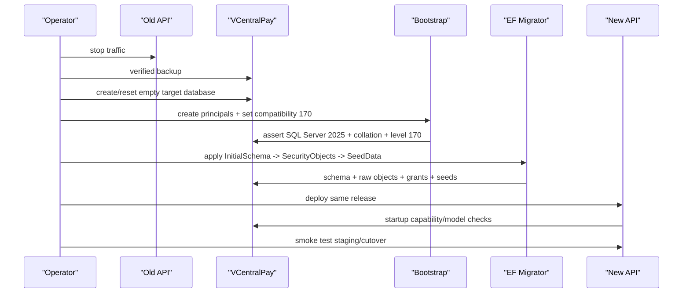
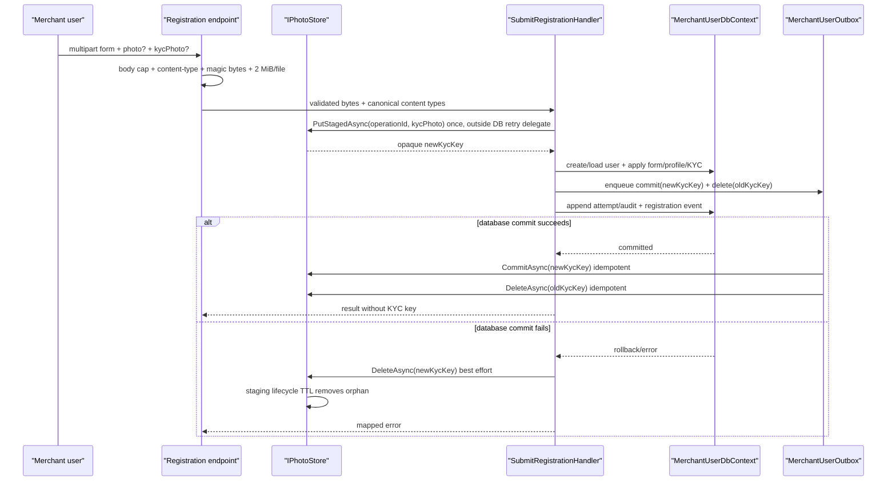
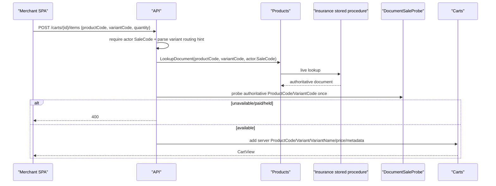
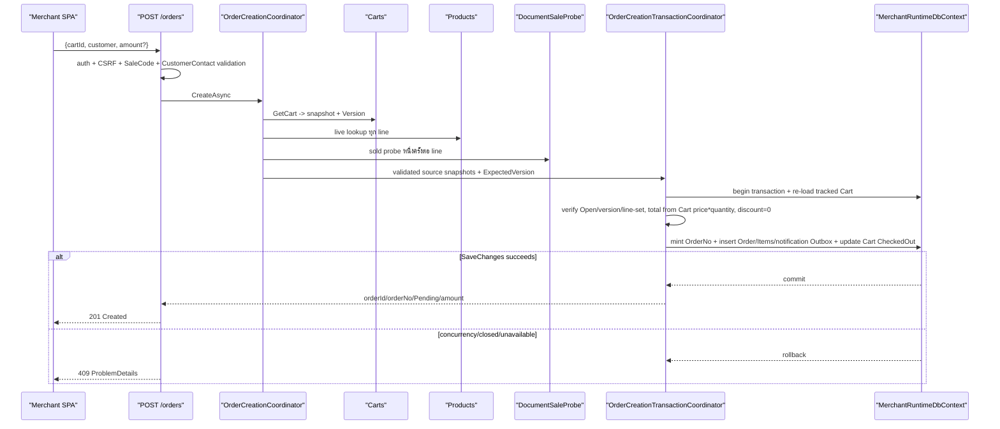
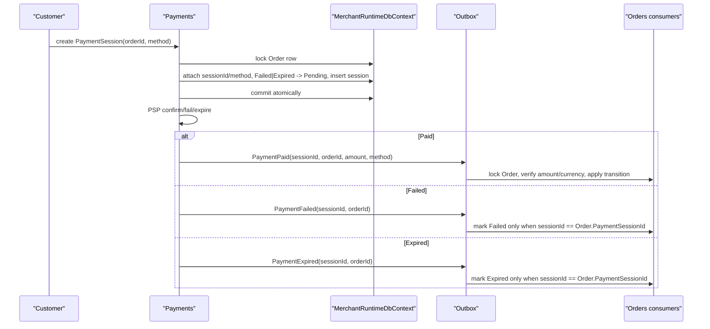
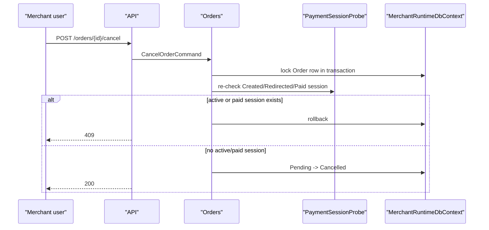

# Design: Merchant-Commerce ERD Reset

> Status: approved 2026-08-07

## Architecture Overview

งานนี้เป็น big-bang schema และ API cutover บน modular monolith เดิม ไม่เพิ่ม database catalog,
message broker หรือ frontend repository ใหม่ จุดเปลี่ยนหลักคือยุบ `Products → Cart → Checkout → Order`
เหลือ `Products → Cart → Order` โดย host layer orchestrate การอ่าน product source และ persistence adapter
commit `Cart + Order + OrderItems + Outbox` ใน transaction เดียวของ `MerchantRuntimeDbContext`.

| ส่วน | ความรับผิดชอบหลัง reset |
|---|---|
| `docs/reference` | เก็บ ERD canon ฉบับอนุมัติและ deviation appendix; schema/model tests อ้างไฟล์นี้ |
| Admins / Iam / Masterdata | rename field ตาม ERD, เพิ่ม status, filter effective permissions เฉพาะ Active |
| Merchants | rename merchant/user/vault fields; registration รับ `kycPhoto`; key-only persistence และ durable object lifecycle cleanup |
| Products | คง insurance stored procedure เป็น source เดียว; ไม่มี local product catalog หรือ generic SKU gateway |
| Carts | ใช้ `ProductCode`/`VariantCode`/`VariantName`/native JSON metadata; price และ metadata สร้างฝั่ง server; `Version` เป็น concurrency floor |
| Orders | สร้างตรงจาก Cart; generic item snapshot; customer summary ไม่คืน metadata; merchant detail คืน metadata พร้อม reveal audit |
| Payments | emit `PaymentPaid`, `PaymentFailed`, `PaymentExpired`; attach current attempt ลง Order; รองรับ retry จาก Failed/Expired |
| Persistence | คง 3 runtime DbContext + `PolDbContext` migration-owner; ใช้ SQL Server 2025 compatibility 170 และ baseline chain ใหม่ |
| Hosts/Api | เพิ่ม `POST /api/v1/orders`; ลบ Checkout/policy routes; OpenAPI และ ProblemDetails เป็น contract เดียว |
| IAM / authorization | ลบ policy groups/keys/grants; catalog เหลือ 19 keys/7 groups; query/write isolation เดิมยัง fail-closed |

### Dependency direction

Cross-module orchestration อยู่ที่ `Hosts/Api/Orders/OrderCreationCoordinator.cs` ตามกฎ host composition เดิม.
Host อ่าน Cart ผ่าน Mediator, อ่าน insurance document ผ่าน Products query และตรวจ sold guard ก่อนเข้า local
transaction. ขั้น commit ใช้ composition-owned `OrderCreationTransactionCoordinator` ซึ่งเรียก owner ports
`ICartForOrderStore` จาก Carts.Application และ `IOrderStore` จาก Orders.Application ภายใต้
`IMerchantRuntimeUnitOfWork` เดียว. แต่ละ aggregate เปลี่ยน state ผ่าน method ของ domain owner; Host ไม่จับ
`DbContext` และ Orders.Application ไม่อ้าง Carts หรือ Products.

`OrderCreationTransactionCoordinator` re-load Cart, ตรวจ `ExpectedVersion`/line set, คำนวณยอดจาก Cart price,
สร้าง Order, freeze Cart และ save ครั้งเดียว. Source I/O เกิดก่อนเปิด DB transaction เพื่อไม่ถือ lock ระหว่าง
เรียก stored procedure ภายนอก. Cross-module atomic writer อนุญาตเฉพาะสอง flow ใน ADR-MCERD-01:
Order creation และ Payment attempt attachment. Architecture test pin type/call site allowlist นี้; flow อื่นต้องใช้
owner command/event หรือแก้ ADR ก่อน.

### Runtime context topology หลัง reset

| Context | Entity cluster | การเปลี่ยน |
|---|---|---|
| `ControlPlaneDbContext` | `admin`, `iam`, `cfg` | rename/status/native JSON config mirror |
| `MerchantUserDbContext` | `merch.Users`/sessions/logins/registration/outbox | KYC key, user FK rename, native UserOutbox payload |
| `MerchantRuntimeDbContext` | `shop`, `txn`, merchant/vault | ลบ Checkout/policy DbSet; generic Cart/Order; lifecycle events |
| `PolDbContext` | migration-owner เท่านั้น | scan model ใหม่และเป็น owner ของ baseline chain |
| `Persistence.Provisioning` contexts | ControlPlane + MerchantRuntime | rename merchant/vault fields; compatibility 170 ทั้งคู่ |

Query filters, `TenantKeyDescriptor`, `GuardedRuntimeDbContext`, `IWriteAuthorizer`, append-only descriptors,
session security, webhook verification และ idempotency mechanism ไม่เปลี่ยนหลักการ. Policy-specific escape hatch
ถูกลบเพราะ entity และ route ต้นเหตุหายไป.

## Sequence Diagrams

### 1. Big-bang database cutover



ไม่มี old/new binary overlap. Rollback หยุด new API, restore database backup แล้ว deploy old API.

### 2. Registration พร้อม optional KYC photo



`kycPhoto` ที่ไม่ส่งไม่เรียก storeและไม่เปลี่ยน key. `operationId` derive จาก registration operation เดิมและ
purpose `kyc-photo`; retry request เดิมจึงได้ object key เดิม. `PutStagedAsync` เกิดนอก EF execution strategy,
เขียน object แบบ idempotent และติด lifecycle TTL 24 ชั่วโมง. Transaction เดียวกับ `KycPhotoObjectKey` enqueue
outbox ให้ promote new object และลบ old object. Consumer replay ได้; missing/committed/deleted key = success.
ถ้า process crash ก่อน DB commit staging TTL เก็บกวาด; ถ้า crash หลัง DB commit outbox ทำงานต่อ.

### 3. เพิ่ม generic insurance item ลง Cart



`VariantName = ShowName ?? ProductGroup.ToString()`. `UnitPrice = TotalPremium THB`.
Quantity มากกว่า 1 คูณราคา แต่เก็บ metadata หนึ่งชุดและ sold guard หนึ่งครั้งต่อ line ตาม decision F10.

### 4. สร้าง Order จาก Cart แบบ atomic



Concurrent requests อ่าน version เดียวกันได้ แต่ Cart update ใช้ concurrency token; transaction ที่ commit
ทีหลังแพ้ `UPDATE ... WHERE Version = @expected`, rollback Order/Items/Outbox ทั้งหมด และตอบ 409.

Availability guarantee linearize ที่ final authoritative lookup/sold probe ก่อน local transaction เท่านั้น เพราะ
upstream stored procedure ไม่มี revision/hold token และอยู่นอก local transaction. หาก upstream เปลี่ยนหลัง probe,
Order อาจถูกสร้าง แต่ payment creation ต้อง probe ซ้ำเป็น money gate และตอบ 409 เมื่อพบ sold/held. ห้ามอ้าง
guarantee แบบ cross-system atomic. Edge case ใน requirements ที่เขียนว่า change ใด ๆ หลัง add-to-cart ต้อง fail
จะ sync เป็น "ตรวจพบโดย final probe" เมื่อ design นี้ได้รับอนุมัติ.

### 5. Payment outcome, retry และ stale-event protection



Failed/Expired event ของ attempt เก่าที่มาช้าถูก ignore. Verified Paid ของ attempt เก่าชนะเพราะเงินจริงเกิดแล้ว;
Order เปลี่ยน `PaymentSessionId`/`PaymentChannel` ไป attempt ที่จ่ายจริง. ก่อนเปิด retry จาก Failed/Expired,
Payments re-confirm attached terminal session กับ PSP อีกครั้งเพื่อลด late-paid/double-charge window.

ทุก writer ของ Order lifecycle ใช้ primitive เดียว: begin transaction แล้ว `GetForUpdateAsync` ด้วย
`UPDLOCK,HOLDLOCK` ก่อนอ่าน/transition/save. ครอบ Paid/Failed/Expired consumers, cancel และ attach/retry.
Lock order คือ Order ก่อน PaymentSession เสมอ. Transition re-check ใต้ lock ทำให้ concurrent writer serialize;
consumer retry หลัง deadlock ใช้ event idempotency เดิม.

### 6. Manual cancel



PSP อาจ settle หลัง probe แม้ local session terminal แล้ว. `Cancelled`/`Refunded` ยัง terminal ตาม approved
state model; late `PaymentPaid` ไม่เปลี่ยน Order. Consumer ส่ง event ไป poison path พร้อม critical alert และ durable
evidence สำหรับ manual reconciliation/refund. Operations SLA: acknowledge ภายใน 15 นาที, reconcile/refund ตาม
PSP runbook. หาก attempt ใหม่และเก่าจ่ายทั้งคู่ first accepted Paid ยังคง Order; event ของ paid session อื่นเข้า
conflict path เดียวกัน. ระบบไม่ claim exactly-once charge.

## Data Models & Interfaces

### ERD canon และ approved deviations

Implementation copies source document to
`docs/reference/merchant-commerce-payment-erd-revised-kyc-simplified.md` และเพิ่ม appendix โดยไม่แก้
field reference ต้นฉบับ. Appendix ระบุ deviation 5 ข้อ:

1. คง fields/tables ปัจจุบันที่ ERD ไม่สั่งลบชัดเจนตาม REQ-1.4.
2. คง `Cart.Version`, `OrderNo`, customer/payment snapshots, discount และ security/audit fields.
3. เพิ่ม `OrderStatus.Cancelled=5`.
4. ใช้ reset-only baseline แทน in-place migration/archival checklist ใน ERD.
5. Runtime รอบนี้รองรับ insurance source เท่านั้น; generic naming ไม่ได้แปลว่ามี SKU gateway/fulfillment แล้ว.

### Schema delta matrix

Field/type/nullable/index/FK ที่ไม่ได้แสดงในตารางนี้ต้องตรง Field Reference ใน ERD canon; current-only fields
อยู่ใน retain allowlist ที่ appendix. ทั้ง migration-owner และ runtime mirror configurations ต้องให้ relational
metadata ตรงกัน.

| Cluster | Target delta |
|---|---|
| `admin.Users` | `Email nvarchar(256)`; เพิ่ม `UpdatedAt datetime2 NULL` |
| `admin.MerchantAccess` | `PlatformUserId` → `AdminUserId`; FK ไป `admin.Users.Id` |
| `admin.Sessions` | `PlatformUserId` → `AdminUserId`; `CreatedIp` → `IpAddress` |
| `admin.AuthAudits` | `PlatformUserId` → `AdminUserId` |
| `admin.RoleAssignments` | `PlatformUserId` → `AdminUserId` |
| `admin.ProvisioningOperations` | `Result` → native `json`; caller field คง `CallerAdminId` ตาม ERD |
| `iam.PermissionGroups` | `LabelTh` → `Name`; เพิ่ม `Status int` Active=0/Inactive=1 |
| `iam.Permissions` | `LabelTh` → `Name`; เพิ่ม `Status int` Active=0/Inactive=1 |
| `cfg.Divisions/Levels/Offices/Positions` | `IsActive bit` → `Status int` Active=0/Inactive=1 |
| `dbo.DataProtectionKeys` | `FriendlyName` → `SecretKey` |
| `merch.Users` | `Email nvarchar(256)`; `PersonType` → `IdentityType`; `IdNumber` → `IdentityNumber`; เพิ่ม `KycPhotoObjectKey nvarchar(256) NULL` |
| merchant-user dependents | `MerchantUserId` → `UserId` ตาม ERD บน Sessions/AuthAudits/ExternalLogins/RegistrationNotices/RoleAssignments; session IP → `IpAddress` |
| `merch.UserOutbox` | `Payload` → native `json` |
| `merch.Merchants` | `DisplayName` → `Name`; ลบ `LegalEntityId`; เพิ่ม `Note nvarchar(max) NULL`; `Metadata` → native `json`; Active=0/Inactive=1 |
| `merch.VaultSecrets` | `Name` → `SecretName`; `KeyId` → `SecretKey` |
| `shop.Carts` | เพิ่ม/คง `SaleCode`; คง `Version`; status Open/CheckedOut |
| `shop.CartItems` | `DocumentNo` → `ProductCode`; `ProductGroup` → `VariantCode varchar(64)`; เพิ่ม `VariantName varchar(128) NULL`, `Metadata json NULL` |
| `shop.Orders` | ลบ `CheckoutSessionId`; เพิ่ม/คง `SaleCode`; status enum ใหม่; คง OrderNo/customer/payment/discount/security fields |
| `shop.OrderItems` | generic product/variant fields เหมือน CartItem; ลบ DocumentType/PolicyNumber/StartDate/EndDate/Insured* top-level; เพิ่ม `Metadata json NULL` |
| `shop.OrderItemRevealAudits` | คง append-only table; audit ทุก merchant detail metadata reveal |
| `txn.*` | schema หลักคงเดิม; `PspConnections.Metadata` และ `OutboxMessages.Payload` ยัง `nvarchar(max)` |

### Native JSON representation

ห้า columns ที่อนุมัติ map ด้วย `.HasColumnType("json")`; CLR storage property ยังเป็น `string`/`string?`
เพื่อให้ outbox/provisioning contract ปัจจุบันไม่ต้องเพิ่ม JSON DOM tracking. Application สร้าง canonical JSON
ผ่าน `System.Text.Json`; client ไม่ bind raw string เข้า Cart/Order constructor.

สำหรับ commerce line เพิ่ม immutable `CommerceItemMetadata` ใน `SharedKernel`:

```csharp
public sealed record CommerceItemMetadata(
    string SourceType,
    string? DocumentType,
    string? PolicyNumber,
    DateOnly? StartDate,
    DateOnly? EndDate);
```

`CommerceItemMetadataCodec` เป็นจุด serialize/parse เดียว. Allowed source type รอบนี้คือ
`insurance_document`. Type ไม่มี insured name, identity number, DOB, phone, email, address หรือ extension data.
Domain `CartItem`/`OrderItem` รับ value object นี้ ไม่รับ arbitrary JSON. Persisted column ชื่อ `Metadata`;
merchant read projection parse เป็น detached `JsonElement`. Invalid persisted JSON fail ตอน SQL write และ fail-loud
ตอน parse; ห้ามกลืนเป็น `{}`.

`merch.Merchants.Metadata` ไม่รับ arbitrary JSON. Provisioning bind เข้า typed
`MerchantMetadata { Branding, Routing, Session, Timezone, Locale }`; nested field ใช้ DTO ที่ระบุ property ชัด
และ `JsonUnmappedMemberHandling.Disallow`. Unknown field หรือ secret-shaped field เช่น `secret`, `token`,
`password`, `apiKey`, `privateKey`, `connectionString` ถูก reject 400. Canonical serializer เขียน allowlist เท่านั้น.
`admin.ProvisioningOperations.Result` allow เฉพาะ IDs/status/error code ที่ไม่ sensitive. Public registration
events ใน `merch.UserOutbox.Payload` ห้ามมี credential, form PII หรือ KYC key; exception เดียวคือ internal
`KycPhotoLifecycleRequested` ซึ่งมี opaque object key, อ่านได้เฉพาะ outbox worker และห้าม log payload.
`txn.PspConnections.Metadata` ใช้ typed non-secret connection metadata เดิม;
`txn.OutboxMessages.Payload` ไม่เปลี่ยน type และ event serializer ยังใช้ registry allowlist.

### Cart domain และ API contract

```json
POST /api/v1/carts/{cartId}/items
{
  "productCode": "S001-69900/บต/900008",
  "variantCode": "CMI",
  "quantity": 2
}
```

- `variantCode` เป็น routing hint เข้า Motor/Non-Motor SP; document ที่ upstream คืนเป็น authoritative.
- Stored `ProductCode = DocumentView.DocumentNo`.
- Stored `VariantCode = DocumentView.ProductGroup.ToString()`.
- Stored `VariantName = DocumentView.ShowName ?? VariantCode`.
- Stored price = `Money.Of(DocumentView.TotalPremium, "THB")`.
- Cart metadata มาจาก `CommerceItemMetadata` ที่ server สร้าง.
- Cart header snapshot `SaleCode` จาก authenticated actor ตอนเปิด Cart; create Order ยัง re-check actor มี SaleCode.
- Duplicate `ProductCode` ใน Cart ใช้ equality/collation rule เดิมและตอบ 400.
- `quantity > 0`; quantity มากกว่า 1 ใช้ได้และ line total = unit price × quantity.

Cart read DTO เปลี่ยนเป็น `productCode`, `variantCode`, `variantName`, `quantity`, `unitPrice`, `lineTotal`,
`metadata`; metadata ที่ Cart API คืนเป็น server-created facts จึงไม่ต้อง reveal audit. Cart mutation request ไม่มี
price, currency, variantName หรือ metadata.

### Direct Order API

Request:

```json
{
  "cartId": "ea000000-0000-4000-8000-000000000001",
  "customer": {
    "name": "สมชาย ใจดี",
    "phone": "0812345678",
    "email": "somchai@example.com"
  },
  "amount": {
    "amount": "3700.0000",
    "currency": "THB"
  }
}
```

`amount` optional. Money converter เดิม reject JSON number และ format output เป็น fixed 4 decimals.
`CustomerContact.Of` คง validation ปัจจุบัน: name required ≤200, phone required 8-15 digits/allowed separators,
email optional ≤320 และต้อง parse เป็น bare address.

Response:

```json
{
  "orderId": "ed000000-0000-4000-8000-000000000016",
  "orderNo": "ORD6900000016",
  "status": "Pending",
  "amount": {
    "amount": "3700.0000",
    "currency": "THB"
  }
}
```

Success ใช้ `201 Created` พร้อม `Location: /api/v1/orders/{orderId}`. Retry Cart ที่ CheckedOut ตอบ 409;
ไม่มี idempotency/result ledger และไม่มี CartId column บน Order.

### Order creation interfaces

```csharp
public sealed record ValidatedProductSnapshot(
    Guid CartItemId,
    string ProductCode,
    string VariantCode,
    string? VariantName,
    CommerceItemMetadata Metadata);

public sealed record CommitOrderFromCartRequest(
    Guid MerchantId,
    Guid CartId,
    int ExpectedCartVersion,
    string SaleCode,
    CustomerContact Customer,
    Money? ClaimedAmount,
    IReadOnlyList<ValidatedProductSnapshot> Products);

public interface IOrderCreationTransactionCoordinator
{
    Task<CreateOrderResult> CommitAsync(
        CommitOrderFromCartRequest request,
        CancellationToken cancellationToken);
}
```

`ICartForOrderStore` อยู่ Carts.Application และ expose เฉพาะ load/freeze ผ่าน Cart aggregate.
`IOrderStore` อยู่ Orders.Application และ expose add Order aggregate. Host composition coordinator ใช้สอง port
กับ `IMerchantRuntimeUnitOfWork`; interface ด้านบนอยู่ Host composition ไม่อยู่ Orders.Application.

`OrderCreationCoordinator` algorithm:

1. Reject missing actor SaleCode 403; validate request/customer/Money 400.
2. Read merchant-scoped Cart. Missing/out-of-scope = 404; non-Open = 409; empty = 400.
3. Capture CartView + `Version`.
4. ต่อ line parse `VariantCode`, live lookup ด้วย actor SaleCode, reject missing/PAID/unusable = 409.
5. Probe sold/held status once per authoritative `(ProductCode, VariantCode)`; any result = 409.
6. Build `ValidatedProductSnapshot` from server fields only.
7. Call transaction coordinator.

`OrderCreationTransactionCoordinator` algorithm ภายใน transaction:

1. Re-load Cart tracked ผ่าน query filter; check status/version/line count/item IDs.
2. Re-check stored ProductCode/VariantCode/quantity ของแต่ละ line ตรง snapshot; mismatch = concurrency conflict.
3. Compute total from persisted Cart UnitPrice × Quantity; discount = Money.Zero(line currency).
4. Compare optional claimed amount exactly including currency.
5. Mint OrderNo; create Order Pending, SaleCode จาก request, customer snapshot, summary token.
6. Create generic OrderItems; metadata ใช้ live validated snapshot; price/quantity ใช้ Cart.
7. Attach notification recipient จาก `CustomerContact.NotificationRecipient` และ enqueue
   `CustomerOrderNotification` ใน same outbox.
8. `Cart.MarkCheckedOut()`; one `SaveChangesAsync`; commit.

Stored Cart price ไม่ reprice ตอน Order เพื่อไม่ silent-change ยอดหลังผู้ใช้เห็น Cart; live lookup ใช้ยืนยัน
availability/authoritative metadata. Claimed amount ช่วย client ตรวจ stale display แต่ไม่เป็นราคา authoritative.

### Order model และ read surfaces

`OrderStatus`:

```text
Pending=0, Paid=1, Failed=2, Expired=3, Refunded=4, Cancelled=5
```

OrderItem fields: `ProductCode`, `VariantCode`, `VariantName`, `Quantity`, `UnitPrice`, retained `Discount`,
`Metadata`. Direct flow set Discount=0. Insurance-specific CLR properties/entities ถูกลบ ไม่ซ่อนเป็น wrapper.

Customer summary line:

```csharp
public sealed record OrderSummaryLine(
    string ProductCode,
    string VariantCode,
    string? VariantName,
    int Quantity,
    Money UnitPrice);
```

Summary raw SQL projection ไม่ SELECT `Metadata`. Merchant detail line เพิ่ม `JsonElement? Metadata`; handler
append `OrderItemRevealAudit` ทุก item ก่อน build response และ fail-closed หาก audit save ไม่สำเร็จ. List view
ไม่คืน metadata. ไม่มี insured PII masking code เหลือเพราะ insured PII columns ถูกลบ.

### Payment attempt attachment และ event contracts

`Payments.Application.Ports.PayableOrderStatus` ขยายให้ map ทุก Order status แบบ total switch; ห้าม default arm.
Payment attempt attachment เป็น sanctioned shared writer ตาม ADR-MCERD-01 เพราะ Session insert และ Order
snapshot ต้อง atomic. Implementation อยู่ Persistence.MerchantRuntime, เรียก Order domain method และถูก pin ด้วย
architecture allowlist. CreateSession transaction ใช้ลำดับ:

1. Lock Order row ผ่าน `GetForMintAsync`.
2. Reject Paid/Cancelled/Refunded.
3. Re-confirm attached Failed/Expired session ก่อน retry; Paid outcome abort new attempt.
4. Create Session in memory.
5. `AttachAttemptAsync(orderId, sessionId, method)` updates Order.PaymentSessionId/PaymentChannel;
   Failed/Expired → Pending.
6. Insert Session และ save Order+Session transaction เดียว.

Contracts:

```csharp
public sealed record PaymentFailed(
    Guid EventId,
    Guid PaymentSessionId,
    Guid OrderId,
    Guid MerchantId,
    string ReasonCode,
    DateTime OccurredAt) : INotification;

public sealed record PaymentExpired(
    Guid EventId,
    Guid PaymentSessionId,
    Guid OrderId,
    Guid MerchantId,
    DateTime OccurredAt) : INotification;
```

ทั้งสาม type อยู่ `src/Contracts` และใช้ stable outbox names
`payments.payment-paid.v2`, `payments.payment-failed.v1`, `payments.payment-expired.v1`.
Envelope เดิมเก็บ `EventId`, `EventType`, `SchemaVersion`, `OccurredAt`, `Payload`; registry map literal แบบ explicit.
`PaymentPaid` เพิ่ม `Method` เพื่อให้ late-paid event เปลี่ยน PaymentChannel ไป attempt ที่จ่ายจริง.
`ReasonCode` เป็น bounded internal code; payload ห้าม raw PSP message, credential หรือ PII. Reset baseline ทำให้
ไม่ต้อง deserialize payload versionเก่าจาก database.

`PaymentConfirmationService` เป็น emitter เดียวของ real transitions:

- `MarkPaid` enqueue PaymentPaid once; Session Paid ได้จาก Created/Redirected/Failed/Expired เมื่อ PSP ยืนยัน.
- `MarkFailed` enqueue PaymentFailed once.
- `MarkExpired` enqueue PaymentExpired once.
- `StartRedirectHandler` ส่ง PSP rejection เข้า service แทนเรียก domain `MarkFailed` ตรง.
- Architecture test allow production call sites ของ `Session.MarkFailed/MarkExpired` เฉพาะ service.

Orders consumers เริ่ม transaction และเรียก `GetForUpdateAsync` ก่อน transition ทุกครั้ง:

- `OrderPaidConsumer`: verify amount+currency; accept Pending/Failed/Expired; set paid session/method; idempotent.
- `OrderPaymentFailedConsumer`: transition Pending→Failed เฉพาะ event session ID ตรง current Order.PaymentSessionId.
- `OrderPaymentExpiredConsumer`: transition Pending→Expired ด้วย correlation rule เดียวกัน.
- Missing Order = ack+telemetry; stale Failed/Expired = ack+debug telemetry; invalid amount/currency = throw ให้ poison path.
- Paid event เมื่อ Order เป็น Cancelled/Refunded หรือ Paid ด้วย session อื่น = conflict poison + critical alert;
  durable outbox error เก็บ event/order/session IDs เท่านั้นเพื่อ reconciliation.

Paid/Cancelled/Refunded terminal. Failed/Expired retryable. Manual cancel ใช้ lock + post-flip probe เดิมและนับ
Created/Redirected/Paid session; active attempt = 409.

### IAM status และ policy retirement

`PermissionGroup`/`Permission` เพิ่ม `Status`; `LabelTh` เปลี่ยน `Name` ทุก DTO/config/seed.
Effective permission query join/filterครบสามชั้น:

```text
Role.Status == Active
AND Permission.Status == Active
AND PermissionGroup.Status == Active
```

Grant rows ของ inactive permission อยู่ได้แต่ไม่ effective; boot parity guard ยังเทียบ endpoint literal กับ
code catalog เพื่อจับ typo. Seed ลบ groups `merchants.policies`, `policies`; ลบ keys
`merchants.policies.read`, `merchants.policies.write`, `policies.read`, `policies.write`; ลบ 6 grants เดิม.
Expected catalog = 19 keys, 7 groups.

### KYC interfaces และ persistence

`SubmitRegistrationCommand` เพิ่ม `KycPhotoBytes`/`KycPhotoContentType`. `User` เพิ่ม
`KycPhotoObjectKey` และ method `SetKycPhoto`. `RegistrationAttempt` ไม่เพิ่ม KYC field: requirements เก็บ
current attempt shape และห้าม KYC read surface. `GetRegistrationHistory` จึงไม่คืน KYC key.

`IPhotoStore` เพิ่ม:

```csharp
Task<string> PutStagedAsync(
    Guid operationId,
    ReadOnlyMemory<byte> bytes,
    string contentType,
    CancellationToken cancellationToken);

Task CommitAsync(string objectKey, CancellationToken cancellationToken);

Task DeleteAsync(string objectKey, CancellationToken cancellationToken);
```

`PutStagedAsync` idempotent ตาม `operationId`; ห้ามอยู่ใน retriable DB delegate. Local adapter validate opaque key
ก่อน operation และใช้ explicit file path; production adapter ใช้ object-store key โดยตรง ไม่ใช้ client filename.
Staged object มี 24-hour lifecycle TTL. Transaction ที่เปลี่ยน user key ต้อง enqueue internal
`KycPhotoLifecycleRequested` สำหรับ `Commit(new)` และ `Delete(old)`; consumer idempotent, retry จาก outbox และ
ห้าม log payload/key. Immediate delete ของ uncommitted new objectเป็น best effort เท่านั้น; TTL คือ crash-safe floor.
Handler เก็บ old key ก่อน apply; absent KYC input ไม่แตะ. Response `UserRegisterResponse` คงมี user ID/statusเท่านั้น.

Body cap เปลี่ยนจาก `PhotoMaxBytes + 64 KiB` เป็น `(2 * PhotoMaxBytes) + 64 KiB`; validate `photo` และ
`kycPhoto` แยก file ละไม่เกิน 2 MiB ด้วย `PhotoValidation`. Unsupported/magic mismatch = 400;
file/body เกิน cap = 413. Logs ห้ามมี file bytes, form PII หรือ object keys.

### Checkout/policy removal inventory

| Scope | ลบ/แก้ |
|---|---|
| Projects | `Checkouts.Domain/Application/Infrastructure`, tests project, solution/project references |
| Domain/Application | Checkout sessions/items/commands/events; ItemPolicy/ItemPolicyAudit/upsert/report readers |
| Persistence | Checkout/policy DbSets, dual configs, repos, filtered indexes, grants, escape-hatch writers/SFS |
| Contracts | `CheckoutConfirmed` และ registry entries/call sites |
| API | `/checkouts/**`, merchant/admin policy PUT, merchant/admin policy reports |
| IAM | 2 groups, 4 keys, 6 grants, gate metadata/tests |
| Security | write-authorizer types, bypass allowlist entries, audit/read exceptions ที่มีไว้เฉพาะ policy |
| Docs/tests | checkout/policy route docs, old OpenAPI assertions, policy reports, escape-hatch inventory |

Old routes ไม่มี alias/redirect/tombstone endpoint จึง route miss เป็น 404.

### Baseline migration chain

ลบ migration `.cs`/`.Designer.cs`/snapshot เดิมทั้งหมด แล้วสร้าง chain ใหม่ 3 migration ตาม precedent rf1:

1. `InitialSchema` — generated model: schemas, tables, columns, FKs, indexes, checks, sequence.
2. `SecurityObjects` — hand SQL: raw `merch.RegistrationNotices`, special indexes/checks, least-privilege
   GRANT matrix และ raw objects ที่ model สร้างไม่ได้.
3. `SeedData` — hand SQL: IAM 19/7 + 4 roles/grants, cfg master data, merchant/PSP/demo data ที่ยัง supported.

ทั้งสามคือ baseline set ใหม่ ไม่ใช่ legacy history. `Down` reverse dependency order และใช้ guarded `IF EXISTS`
สำหรับ raw objects. Production rollback ไม่ใช้ `Down`; restore backup เท่านั้น.

ก่อน statement DDL แรก `InitialSchema` เรียก preflight SQL ที่ fail เมื่อพบ user table/view/procedure ของระบบเก่า,
พบ application schema ใด ๆ หรือพบ row ใน `__EFMigrationsHistory`; ยอมให้เฉพาะ system objects และ history table
ที่ว่างซึ่ง EF อาจสร้างก่อน `Up`. Guard ใช้ transaction เดียวกับ migration และ error ระบุ target database เท่านั้น.
Release wrapper ตรวจ target database ชื่อ `VCentralPay`, explicit `RESET_APPROVED=true`, backup artifact URI/checksum
และ approval evidence ก่อนเรียก migrator. Migration codeไม่ทำ destructive cleanupเอง.

`docker/bootstrap/01-principals.sql` ตั้ง compatibility 170 หลัง create database และ fail หาก engine ไม่ใช่
SQL Server 2025 major 17 หรือ build ต่ำกว่า baseline ที่ทดสอบ SQL Server 2025 RTM-CU5.
CI/staging pin container tagพร้อม immutable digest; ห้ามใช้ floating `latest`. `assert-fresh-db.sql` ตรวจ engine
major/build, compatibility, collation, principals, grants, native JSON columns, removed tables และ seed counts.
Migration preflight fail ก่อน DDL เมื่อ engine/native JSON ไม่รองรับ.

ทุก `.UseSqlServer(...)` path ที่สร้าง runtime/design/provisioning/migrator options เรียก
`sql => sql.UseCompatibilityLevel(170)`: runtime registrations 3 context, 3 design factories,
`DesignTimeDbContextFactories`, provisioning manual contexts, Program migrator และ SQL integration options ที่
assert model behavior. Helper กลางใน Persistence assembly ลดจุดตกหล่น; architecture test scan ทุก call site.
Engine capability, database compatibility และ EF provider compatibility เป็นสาม gate แยกกัน: probe
`SERVERPROPERTY('ProductMajorVersion'/'ProductVersion')`, query `sys.databases.compatibility_level=170` และ inspect
ทุก options builder ว่าใช้ `UseCompatibilityLevel(170)`.

### Documentation and consumer guide

เพิ่ม `.ai/specs/merchant-commerce-erd-reset/FE-MIGRATION.md` ตอน implementation ครอบ:

- `documentNo/productGroup` → `productCode/variantCode`.
- Checkout start/confirm → `POST /orders`.
- removed policy routes/fields.
- request/response examples, Money string, status mapping, error codes.
- Cart/Order read shapes และ metadata audience.

Update canon docs: `.ai/shared/ARCHITECTURE.md`, `.ai/shared/CODING_STANDARDS.md`, `docs/reference/iam.md`,
`merchants.md`, `orders.md`, `entity-fields.md`, `db-connection-and-rls.md`, `src-structure.md`, local-dev/deploy
runbooks. ไม่แก้ frontend repository.

## Technology Decisions

| เรื่อง | ตัดสิน | เหตุผล |
|---|---|---|
| Cross-module flow | host coordinator + owner ports + shared UoW; ADR-MCERD-01 allowlist shared writer 2 flow | รักษา ownership พร้อม atomic commit ที่ event แยกไม่ได้ |
| Source call vs DB transaction | final source lookup/probe ก่อน transaction; Cart version re-check ตอน commit | guarantee เป็น as-of-probe; upstream ไม่มี revision/hold token |
| Price at Order | ใช้ Cart server-owned price; live source revalidate availability/metadata | ไม่ silent reprice หลังผู้ใช้เห็น Cart; client amountไม่ authoritative |
| Duplicate Order protection | Cart optimistic `Version` + Open→CheckedOut transaction | user ยืนยันไม่มี CartId/result ledger; concurrent loser rollback |
| Discount | retain columns; direct flowเขียน zero Money | ไม่มี approved discount source/input ใน API ใหม่ |
| Metadata | typed allowlist → canonical raw JSON → SQL native json | ไม่มี arbitrary client JSON/PII/secrets; EF tracking เรียบง่าย |
| Native JSON scope | เปลี่ยนเฉพาะ 5 columns | exact ERD; Psp/transaction outbox JSON-like fields คง nvarchar |
| Payment retry | Failed/Expired retryable; attach new attempt atomically | คง payment retry behaviorและ status ที่ผู้ใช้เลือก |
| Stale outcome events | correlate Failed/Expired ด้วย current PaymentSessionId; verified Paid ใช้ได้จาก Pending/Failed/Expired | event เก่าไม่ทับ attempt ใหม่; terminal conflictเข้า reconciliation |
| Order serialization | `UPDLOCK,HOLDLOCK` primitive เดียวทุก lifecycle writer | กัน lost update และ pin lock order |
| Late Paid mitigation | re-confirm terminal session; conflict poison + critical alert + refund runbook | ลด window; ยอมรับ PSP late-settlement residual risk |
| Manual cancel | lock Order + session probe; active Created/Redirected/Paid → 409 | serialize local state; ไม่ claim cross-PSP atomicity |
| KYC replacement | deterministic staged put + transactional lifecycle outbox + TTL | crash/retry durable; DB เก็บ key เท่านั้น |
| Migration | fresh 3-step baseline set | แยก generated model/raw security/seed; review และ rollbackชัด |
| Deployment | stop-the-world DB reset | API/schema big-bang และไม่มี data backfill |
| Order status wire | string enum; DB int | คง API readability และ pin persisted valuesแยกกัน |
| SQL compatibility | SQL 2025 RTM-CU5+ major 17 / DB 170 / app 170 | pin tested floor และแยกสาม capability gate |

## Error Handling Strategy

ทุก HTTP error ใช้ RFC 9457 ProblemDetails เดิม; message ไม่ echo SaleCode, customer PII, KYC key, secret,
other Merchant ID หรือ order holder.

| กรณี | พฤติกรรม |
|---|---|
| malformed ProductCode/VariantCode/quantity/customer/Money | 400 |
| claimed amount ไม่ตรง server total/currency | 400 |
| Cart ว่าง | 400 |
| actor ไม่มี SaleCode | 403 ก่อน upstream call |
| Cart missing/other merchant | 404 แบบ indistinguishable |
| Cart ไม่ Open / version stale / retryหลัง success | 409 |
| source document missing/PAID/unusable ตอน order creation | 409 |
| sold/held probe พบ conflict | 409 generic ไม่เปิดเผย order/merchant เจ้าของ |
| insurance SP timeout/connection/rejected response | 503 ผ่าน exception mapping เดิม |
| transaction save/concurrency failure | rollback ทั้งก้อน; 409 สำหรับ known conflict, 500 สำหรับ unexpected |
| duplicate OrderNo | retry mint ภายใน bounded attempt; ถ้ายังชน fail 500 + telemetry |
| invalid native JSON | DB reject; transaction rollback; test pin error |
| unknown/secret-shaped Merchant metadata | 400 ก่อน serialize; ไม่มี persistence |
| engine < SQL Server 2025 RTM-CU5 หรือ DB level !=170 | bootstrap/migration/startup fail-fast |
| baseline target มี legacy/non-empty schema/history | fail ก่อน DDL; ไม่ cleanup target |
| KYC unsupported/magic mismatch | 400 ก่อน store |
| KYC file/body too large | 413 ก่อน handler |
| KYC new object put fails | request fail; DBไม่เริ่ม |
| DB fails หลัง KYC staged put | rollback DB; best-effort delete; TTL เก็บ orphan; original keyคงเดิม |
| KYC lifecycle consumer failsหลัง commit | outbox retry; DB keyใหม่ authoritative; ห้าม log object key |
| PaymentFailed/Expired replay | aggregate no-op; no duplicate transition |
| stale Failed/Expired session ID | ack + debug telemetry; Orderไม่เปลี่ยน |
| PaymentPaid amount/currency mismatch | throw; outbox poison path; Orderไม่เปลี่ยน |
| late Paid ต่อ Cancelled/Refunded หรือ second paid session | conflict poison + critical alert; manual reconcile/refund SLA 15 นาที |
| verified Paid จาก Failed/Expired attempt | Session/Order → Paid; paid attempt becomes snapshot |
| create PaymentSession for Paid/Cancelled/Refunded | 409 |
| create retry from Failed/Expiredแต่ re-confirmพบ Paid | ไม่สร้าง sessionใหม่; 409 หลัง Paid event enqueue |
| manual cancel with Created/Redirected/Paid session | rollback + 409 |
| old checkout/policy route | 404 |
| reveal audit save fails | merchant detail fail-closed; ไม่คืน metadata |

## Testing Strategy

| ชั้น | ครอบ | REQ |
|---|---|---|
| Domain/unit — Admin/IAM/CFG/Merchants | rename/status values, Active-only permission resolution, merchant/vault names | REQ-2.x, 8.12-8.16, 13.1, 13.5, 13.13 |
| `Merchants.Tests` | dual-file validation; KYC omission; staged put/commit/delete replay; crash before/after DB commit; TTL orphan; keyไม่อยู่ response/history/log | REQ-3.x, 11.7, 13.4, 13.29 |
| `Carts.Tests` | generic fields, metadata codec, quantity >1 total, one metadata/sold probe, Version bump/freeze | REQ-5.x, 7.11, 13.2, 13.3 |
| `Orders.Tests` | status values/transitions, zero discount, metadata privacy, reveal audit fail-closed, event correlation/idempotency | REQ-6.36, 7.x, 9.x, 13.6, 13.26, 13.30 |
| `Payments.Tests` | emit Paid/Failed/Expired only on real transition, terminal re-confirm, attach attempt, retry, late Paid | REQ-9.7-9.27, 11.10-11.11, 13.16-13.17, 13.26 |
| Coordinator tests | success/error matrix, upstream unavailable, as-of-probe boundary, stale version, line mismatch, claimed amount, rollback | REQ-6.1-6.36, 13.7-13.9 |
| `Hosts.Tests` | POST Order auth/CSRF/201/ProblemDetails/OpenAPI; old routes 404; KYC multipart body cap | REQ-3.4-3.14, 6.x, 8.7-8.18, 11.5-11.8, 12.x, 13.10-13.11 |
| Architecture tests | context model parity, ADR-MCERD-01 exact type/callsite allowlist, event registry/names/versions, no Checkouts/policy references, bypass allowlist, 19/7 IAM, app compatibilityทุก path | REQ-2.x, 4.7-4.9, 8.19-8.21, 13.12-13.13 |
| SQL integration | fresh baseline; refuse legacy/non-empty target before DDL; exact schema/grants/seeds; engine RTM-CU5+; DB 170; real round-trip 5 native JSON columns valid/invalid/null/Unicode | REQ-1.x, 4.x, 10.x, 13.14, 13.28 |
| Concurrency integration | two POST Order coordinators on Cartเดียว; exactly one Order/Outbox/CheckedOut | REQ-6.9, 6.25-6.26, 6.32-6.35, 13.25 |
| Payment concurrency integration | Order row-lock primitive; Paid-vs-Failed, Paid-vs-Expired, Paid-vs-cancel, Paid-vs-retry; stale current attempt; conflict poison/alert | REQ-9.x, 13.16-13.17, 13.26-13.27 |
| JSON security tests | Merchant metadata allowlist/unknown/secret-shaped negatives; ProvisioningOperations result and public outbox payload exclude secret/PII/KYC key | REQ-4.x, 11.7, 11.9, 13.4, 13.28 |
| E2E | Cart→Order→Payment redirect/webhook→Paid; failure; expiry; summary/detail audience | REQ-5.x, 6.x, 7.14-7.19, 9.x, 13.15-13.17 |
| Release gates | build warnings-as-errors, full tests, spec-trace, secret scan, staging reset/smoke/rollback rehearsal | REQ-13.18-13.24 |

Database tests query `sys.columns`, `sys.types`, `sys.foreign_keys`, `sys.indexes`,
`sys.database_permissions`, `sys.database_principals`, `sys.check_constraints`, `sys.databases` และ seed tables.
Fresh database gate ต้องยืนยัน removed tables ไม่มีจริง ไม่ใช่ตรวจเฉพาะ target tables มีอยู่.
Native JSON round-trip ใช้ contextเจ้าของจริงครบห้า column: `ProvisioningOperations.Result`,
`UserOutbox.Payload`, `Merchants.Metadata`, `CartItems.Metadata`, `OrderItems.Metadata`; ทดสอบ nullable/non-nullable,
Unicode, canonical serialization และ raw invalid insert. Release testส่ง backup URI/checksum/approval evidence แบบ
ค่าปลอมและยืนยัน wrapper refuse เมื่อขาด fieldใด fieldหนึ่ง.

## Requirement Traceability

| Section | REQ |
|---|---|
| ERD canon copy + deviation appendix + retain allowlist | REQ-1.1-1.14 |
| Schema delta matrix + dual configuration parity | REQ-2.1-2.23 |
| Active-only IAM resolver + seed delta | REQ-2.24-2.26, REQ-8.12-8.16, REQ-8.21 |
| KYC multipart, deterministic staging, lifecycle outbox/TTL, no read surface | REQ-3.1-3.17 |
| Native JSON mapping + engine/DB/app compatibility gates | REQ-4.1-4.13 |
| Product lookup + generic Cart contract + quantity semantics | REQ-5.1-5.20 |
| Host coordinator + owner ports/shared UoW + as-of-probe boundary + direct Order API | REQ-6.1-6.36 |
| Generic OrderItem metadata codec + summary/detail projections + reveal audit | REQ-7.1-7.20 |
| Checkout/policy removal inventory + route/permission cleanup | REQ-8.1-8.21 |
| Versioned Payment event contracts, row-lock consumers, retry, conflict reconciliation | REQ-9.1-9.28 |
| Guarded three-step fresh baseline + bootstrap + rollback rule | REQ-10.1-10.15 |
| Existing isolation/write guard + log/privacy/payment/vault controls | REQ-11.1-11.12 |
| OpenAPI cutover + FE migration guide + no aliases/frontend edits | REQ-12.1-12.12 |
| Layered test matrix + CI/staging/backup/rollback gates | REQ-13.1-13.30 |

## Design Review Log

Fresh-context `spec-architect` review รอบ 2026-08-07:

| # | Finding | Resolution |
|---|---|---|
| 1 | Order lifecycle writers เสี่ยง lost update | Apply: ทุก writer ใช้ transaction + `GetForUpdateAsync(UPDLOCK,HOLDLOCK)` และ lock orderเดียว; เพิ่ม four-way concurrency tests |
| 2 | late Paid แข่ง retry/cancel อาจ charged-but-cancelled หรือ double-charge | Apply option manual reconciliation: re-confirm ลด window, conflict poison + critical alert + durable evidence + 15-minute acknowledgement/refund runbook; ไม่ claim exactly-once |
| 3 | KYC inline compensation ไม่ทน crash/retry | Apply: deterministic staged putนอก EF retry delegate, transactional lifecycle outbox, idempotent consumer และ 24-hour TTL พร้อม crash/replay tests |
| 4 | upstream sold validation atomic กับ local transactionไม่ได้ | Rebut stronger linearizability เพราะ approved SP ไม่มี hold/revision token; define guarantee as-of final probe และ probeซ้ำก่อน payment. Requirements edge wordingต้อง syncหลัง design approval |
| 5 | Merchant metadata อาจเก็บ secret | Apply: typed allowlist + disallow unknown/secret-shaped fields; public provisioning/outbox payload allowlists และ negative tests |
| 6 | shared persistence seam ซ่อน cross-module ownership | Apply: Order flowใช้ owner ports + host shared UoW; ADR-MCERD-01 จำกัด shared writerเฉพาะ Order creation/Payment attachment พร้อม architecture allowlist |
| 7 | PaymentFailed/Expired ownership/versionไม่ชัด | Apply: typesอยู่ `src/Contracts`; stable event names, envelope, event ID, schema versionsและ registry tests |
| 8 | SQL gate pinแค่ major 17 | Apply: pin tested floor SQL Server 2025 RTM-CU5+, immutable image digest, แยก engine/DB/provider gates และ round-tripครบ 5 columns |
| 9 | baseline ไม่มี guard กันลง legacy DB | Apply: fail-before-DDL emptiness/history guard, release approval/backup evidence และ refusal tests |

Semantic coverage หลัง resolution: ผ่านภายใต้ as-of-probe interpretationข้อ 4. Requirements sync แล้วเมื่อ
design ได้รับอนุมัติ 2026-08-07.
