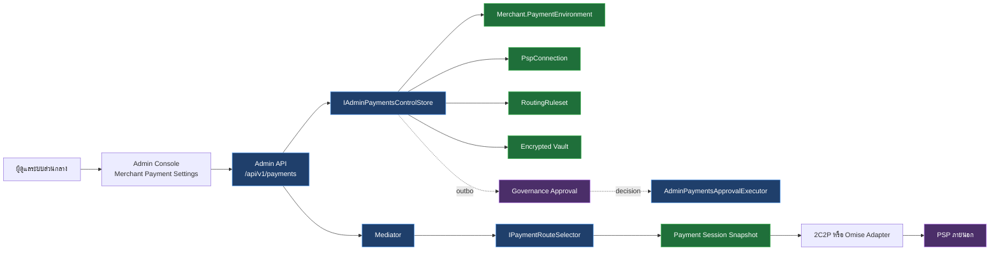
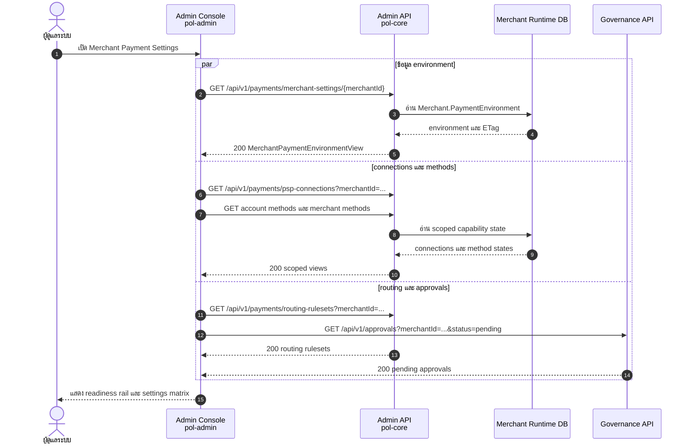
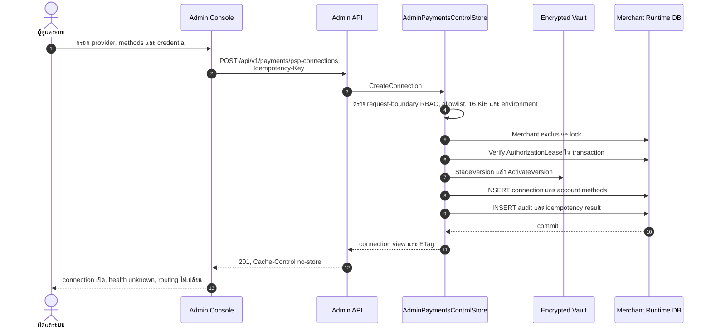
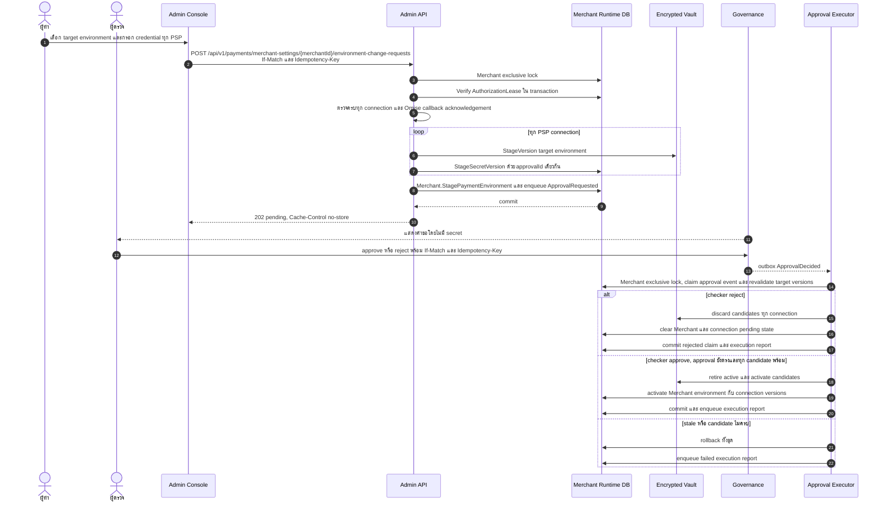
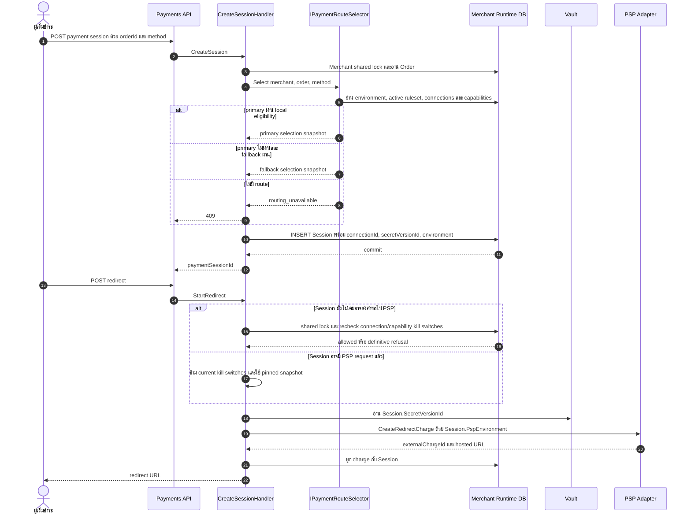
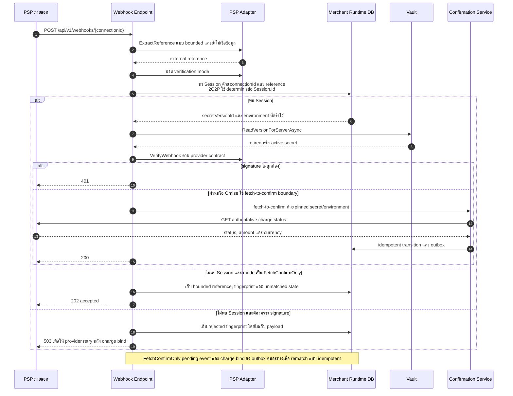
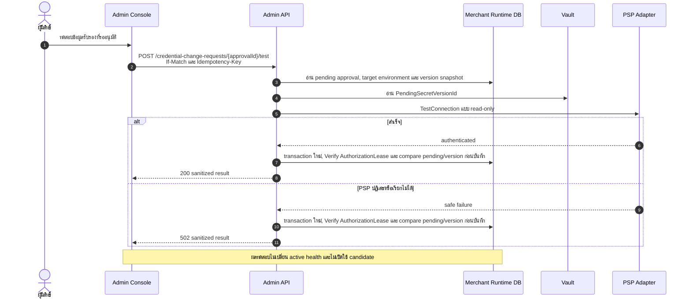
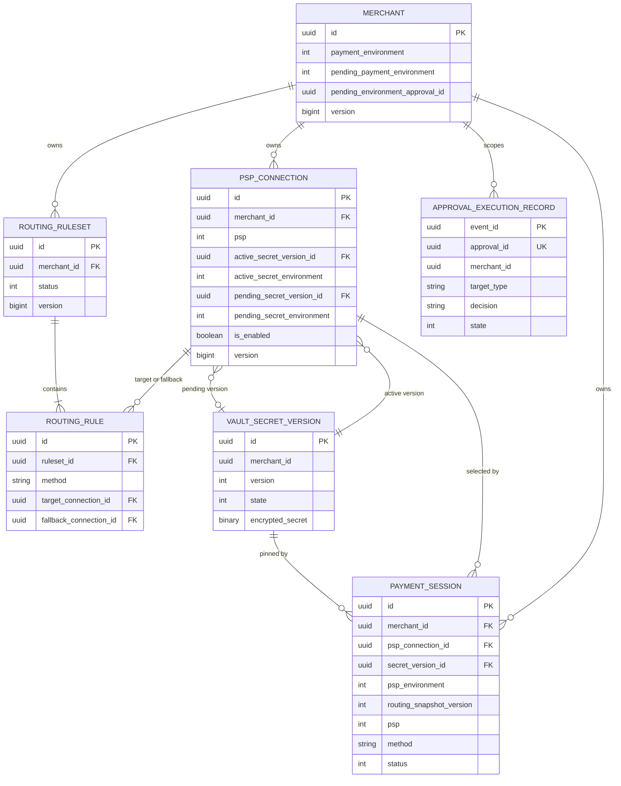

# การออกแบบ: การตั้งค่าผู้ให้บริการรับชำระเงินของร้านค้า

> Status: approved 2026-09-06

เอกสารนี้กำหนดสถาปัตยกรรม API, data, security และ Admin Console สำหรับตั้งค่า 2C2P กับ Omise/Opn
ตาม [requirements.md](requirements.md) โดยต่อยอด control plane, vault, routing และ approval ที่มีอยู่

## Architecture Overview

### เป้าหมายสถาปัตยกรรม

ระบบเพิ่มหน้าตั้งค่าระดับร้านค้าโดยไม่สร้าง payment engine ชุดใหม่ การเชื่อมต่อยังมีหนึ่ง record ต่อ
`(MerchantId, Psp)` ส่วน environment เป็นค่าระดับร้านค้า และ Payment Session ตรึง connection,
secret version กับ environment ก่อนเริ่ม redirect

หลักสำคัญ:

- Admin Console เป็นผู้จัดการเพียง audience เดียว
- PSP selection เกิดฝั่ง server สำหรับทุก payment entry point
- fallback เกิดก่อนสร้าง Payment Session และก่อนเรียก PSP เท่านั้น
- การเปลี่ยน environment เปิดใช้ credential ทุก PSP พร้อมกันผ่าน maker-checker
- secret เก็บใน vault และอ่านตาม version ที่ Payment Session ตรึงไว้
- Omise ทุก method แสดงใน UI แต่ปิดจน method นั้นมี sandbox evidence ใน backend capability

### ส่วนประกอบและความรับผิดชอบ

| ส่วนประกอบ | ที่อยู่ | ความรับผิดชอบ |
|---|---|---|
| Merchant payment settings page | `pol-admin` | รวม environment, connections, methods, routing และ approvals ของร้านค้าเดียว |
| PSP connection controls | `pol-admin` + Admin API | สร้าง เปิด/ปิด ทดสอบ และขอเปลี่ยน credential |
| Method and routing matrix | `pol-admin` + Admin API | แสดง policy สองระดับและแก้ simple routing โดยไม่ทับ advanced rules |
| `Merchant` | Merchants Domain | เป็น source of truth ของ active/pending `PaymentEnvironment` ระดับร้านค้า |
| `Connection` | Payments Domain | ถือ PSP binding, active/pending secret version, health และ webhook acknowledgement |
| `Session` | Payments Domain | ตรึง route selection ที่ใช้จริงตลอดอายุ payment attempt |
| `IPaymentRouteSelector` | Payments Application | เลือก primary/fallback จาก active ruleset และ local eligibility |
| `IAdminPaymentsControlStore` | Payments Application | สัญญา Admin mutations, idempotency, ETag และ tenant scope |
| `AdminPaymentsApprovalExecutor` | Merchant Runtime Persistence | เปิดใช้ routing, credential หรือ environment หลัง approval event |
| `MerchantRuntimeAuthorizationLease` | Merchant Runtime Persistence | recheck Admin authorization version ใน transaction เดียวกับ settings write |
| `ApprovalExecutionRecord` | Payments Domain | claim `ApprovalDecided` แบบ idempotent ก่อนเปลี่ยน state |
| `IVaultSecretStore` | Building Blocks | stage, activate, retire และอ่าน encrypted secret version พร้อม reveal audit |
| 2C2P/Omise adapters | Payments Infrastructure | เลือก endpoint ตาม environment และ normalize redirect/webhook/fetch |

### การไหลของ dependency



### ขอบเขต transaction และ lock

| การทำงาน | Lock | Transaction boundary |
|---|---|---|
| สร้าง/แก้ connection หรือ account method | Merchant exclusive | authorization lease, connection, capability projection, audit และ idempotency ledger |
| สร้าง Payment Session | Merchant shared | route selection, capability recheck และ session snapshot |
| เปลี่ยน credential | Merchant exclusive | authorization lease, stage vault version, connection pending state และ approval outbox |
| เปลี่ยน environment | Merchant exclusive | authorization lease, stage credential ทุก connection, settings pending state และ approval outbox |
| เปิดใช้ environment | Merchant exclusive | approval claim, retire active versions, activate candidates, update settings/connections และ execution outbox |
| เปิดใช้ routing | Merchant exclusive | approval claim, revalidate coverage, supersede active ruleset และ activate draft |

`PaymentAuthorizationSqlLockManager` เป็นกลไกเดิมที่ใช้ serialize shared payment authorization กับ
exclusive settings mutations การเลือก route และสร้าง Session ต้องอยู่ใน transaction เดียวกันเพื่อกัน
TOCTOU ระหว่าง settings change กับ session snapshot

ทุก Admin mutation ส่ง `ActorId` และ `AuthorizationVersion` จาก request boundary เข้า application intent
จากนั้น `MerchantRuntimeAuthorizationLease` อ่าน shadow row ของ `admin.Users` ผ่าน named allowlisted port,
เปรียบเทียบ version และบังคับ concurrency update ใน transaction เดียวกับ business write การ revoke ที่เกิด
ก่อนหรือระหว่าง transaction จึงทำให้ mutation ล้มเหลวพร้อม security telemetry

Created Session ที่ยังไม่เคยอาจส่งคำขอไป PSP ต้อง recheck Merchant, connection และ capability ใต้ shared lock
ก่อน `BeginRedirect` หากถูกปิดให้ fail Session โดยไม่เรียก PSP เมื่อ claim commit แล้วหรือ Session มี external
charge ให้ใช้ snapshot เดิมและ idempotency key เดิม ห้าม emergency kill เปลี่ยน provider กลาง attempt

### Admin Console experience

หน้าหลักใหม่: `/control/psp/settings?merchantId=<uuid>` ส่วน `/control/psp/list` คงเป็น fleet overview
และลิงก์เข้าหน้าร้านค้า Existing create/read/edit dialogs ถูกนำมาใช้ซ้ำ ไม่สร้าง design system ใหม่

แนวภาพ:

| Token | ค่าเดิมที่ใช้ | หน้าที่ |
|---|---|---|
| Primary | Viriyah Blue `#0033A2` | action และ active step |
| Accent | Viriyah Gold `#FCAF17` | สถานะ live และจุดที่ต้องตรวจ |
| Success | `#22C55E` | connection พร้อมใช้งาน |
| Warning | `#FFAB00` | pending approval หรือ health warning |
| Error | `#FF5630` | validation, conflict หรือ unavailable |
| Typography | Barlow, Public Sans, Noto Sans Thai | heading, Latin body และ Thai body |
| Data face | IBM Plex Mono | IDs, masked hints, callback URL และ ETag |

องค์ประกอบจำ: payment readiness rail สรุปลำดับจริง `Environment → Connections → Methods → Routing → Ready`
สถานะแต่ละขั้นใช้ icon, label และข้อความ ไม่พึ่งสีเพียงอย่างเดียว ไม่มี animation ที่ไม่จำเป็น

```text
┌ ร้านค้า: VPrivilege ───────────────── [SANDBOX] [ขอเปลี่ยนเป็น LIVE] ┐
│ Environment ✓ ─ Connections 2/2 ✓ ─ Methods 3/3 ✓ ─ Routing 2/3 ! │
└──────────────────────────────────────────────────────────────────────┘

┌ 2C2P ─ เปิด ─ Healthy ┐   ┌ Omise ─ เปิด ─ Unknown ┐
│ Merchant ID  ···7291  │   │ secretKey  ···c918     │
│ Callback URL [คัดลอก] │   │ Callback URL [คัดลอก] │
│ [ทดสอบ] [เปลี่ยนข้อมูล]│   │ [ทดสอบ] [เปลี่ยนข้อมูล]│
└────────────────────────┘   └────────────────────────┘

┌ ช่องทาง       ร้านค้า     2C2P       Omise       หลัก      สำรอง ┐
│ บัตร          เปิด        เปิด        รอ sandbox   2C2P      —     │
│ PromptPay     เปิด        เปิด        รอเชื่อมต่อ  2C2P      —     │
│ ผ่อนชำระ      เปิด        เปิด        รอเชื่อมต่อ  2C2P      —     │
└─────────────────────────────────────────────────────────────────────┘
```

UI rules:

- หน้าตั้งค่าหลัก require ทั้ง `settings.manage` และ `merchant.view` เพื่อโหลด connection กับ method matrix ครบ
- Environment banner อยู่บนสุดและยืนยันชัดว่า sandbox หรือ live
- Connection card แสดง health เป็นข้อมูลประกอบ ไม่ใช้ปิด method หรือ routing
- Method matrix แยก Merchant policy ออกจาก provider-account method
- Method matrix แสดงสาม canonical methods เสมอและอ่าน availability จาก backend capability ไม่ hardcode ต่อ provider
- Omise method ที่ยังไม่มี sandbox evidence แสดง disabled พร้อมเหตุผล “รอ integration ผ่าน sandbox”
- ถ้าพบ advanced routing หน้าทั่วไปเปลี่ยนเป็น read-only พร้อมลิงก์ไปหน้ารายละเอียด ruleset
- ปุ่มแก้ไขปิดเมื่อ ETag หรือ approval state โหลดไม่ได้
- Secret input ใช้ `type=password`, `autocomplete=new-password` และไม่เก็บใน URL/browser storage
- 2C2P Merchant ID เป็น text field เพราะไม่ใช่ secret แม้ถูกบรรจุใน vault envelope
- Mobile เรียง readiness rail, provider cards และ method rows แบบแนวตั้ง ไม่มี horizontal-only action

### ขอบเขตข้าม repository

| Repository | เจ้าของงาน | Gate |
|---|---|---|
| `pol-core` | domain, persistence, Admin API, routing/session/webhook และ OpenAPI | .NET build, unit, integration, migration, secret scan |
| `pol-admin` | page composition, API client, forms, readiness rail และ browser behavior | typecheck, lint, Vitest, browser verify |

`pol-core` เป็น contract owner การทำงานจริงควรแยกสอง PR แต่ใช้ REQ IDs ชุดเดียวกันและแนบ evidence
ข้าม repository ใน handoff

## Sequence Diagrams

### 1. โหลดหน้าตั้งค่าร้านค้า

Admin Console เรียก API เดิมแบบขนานและเพิ่ม environment resource หนึ่งรายการ ไม่มี aggregate endpoint ใหม่



### 2. สร้าง connection และเปิด method ระดับบัญชี

Initial credential เปิดใช้ทันที แต่ active routing ไม่เปลี่ยน



### 3. เปลี่ยน environment แบบ maker-checker

Environment กับ credential ของทุก connection เปิดใช้พร้อมกันหลัง approval decision



### 4. เลือก primary/fallback และสร้าง Payment Session

Client ไม่ส่ง PSP อีกต่อไป Route selection กับ Session snapshot อยู่ใต้ shared lock เดียวกัน



### 5. Webhook หลัง credential หรือ environment เปลี่ยน

Webhook ของ Session เดิมใช้ secret version เดิมที่ยังอ่านได้แม้ถูก retire 2C2P ใช้ `invoiceNo=Session.Id`
จึง resolve Session ก่อน verify ได้แม้ charge ยังไม่ bind ส่วน pending rematch ใช้เฉพาะ Omise แบบ fetch-confirm-only



### 6. ทดสอบ candidate credential

ผลทดสอบ candidate แยกจาก health ของ active credential และไม่เป็นเงื่อนไขอนุมัติ



## Data Models & Interfaces

### Domain types

```csharp
public enum PspEnvironment
{
    Sandbox = 1,
    Live = 2,
}

public enum WebhookVerificationMode
{
    SignedDeterministicReference = 1,
    FetchConfirmOnly = 2,
}

public sealed record PspRouteSelection(
    Guid PspConnectionId,
    Code Psp,
    Guid SecretVersionId,
    PspEnvironment Environment);
```

Wire values ใช้ lowercase `sandbox` และ `live` ผ่าน explicit converter ห้ามผูก wire contract กับชื่อ enum

### Entity changes

| Entity | การเปลี่ยนแปลง | Invariant |
|---|---|---|
| `merch.Merchants` | เพิ่ม active/pending payment environment fields | Merchant aggregate เป็น source of truth และ pending approval ได้หนึ่งรายการ |
| `txn.PspConnections` | เพิ่ม active/pending secret environment, candidate test result และ webhook acknowledgement | หนึ่ง record ต่อ `(MerchantId, Psp)` และ pending secret ได้หนึ่งรุ่น |
| `txn.PaymentSessions` | เพิ่ม `PspConnectionId`, `SecretVersionId`, `PspEnvironment` | snapshot immutable หลังสร้าง |
| `merch.VaultSecretVersions` | ไม่เปลี่ยน ciphertext shape แต่แก้ expiry semantics | `ExpiresAt` ใช้กับ staged state เท่านั้นและ retired version ยังอ่าน server-side ได้ |
| `txn.RoutingRulesets` | ไม่เปลี่ยน schema | simple UI เขียนเฉพาะ rule ที่ไม่มี amount/Originator predicate |
| `txn.ApprovalExecutionRecords` | เพิ่ม durable approval-event claim | หนึ่งผล execution ต่อ approval decision และ replay เป็น no-op |
| `txn.InboundWebhookEvents` | เก็บ bounded external reference สำหรับ unmatched Omise event | rematch ใช้เฉพาะ `FetchConfirmOnly` และไม่เก็บ raw payload |
| `admin.Users` lease projection | map shadow entity ใน `MerchantRuntimeDbContext` โดยไม่เปลี่ยน schema | อ่าน status/version และทำ concurrency no-op update ได้จาก port เดียว |

`Merchants` fields ที่เพิ่ม:

| Field | SQL type | Null | ความหมาย |
|---|---|---|---|
| `PaymentEnvironment` | `int` | NN | `Sandbox=1`, `Live=2` |
| `PendingPaymentEnvironment` | `int` | NULL | target ที่รอ approval |
| `PendingPaymentEnvironmentApprovalId` | `uniqueidentifier` | NULL | approval เดียวของ environment switch |
| `PaymentEnvironmentUpdatedAt` | `datetime2` | NN | เวลาปรับ environment ล่าสุด |

ใช้ `Merchant.Version` เดิมเป็น ETag และ concurrency token ไม่เพิ่ม version source ชุดที่สอง

`PspConnections` fields ที่เพิ่ม:

| Field | SQL type | Null | ความหมาย |
|---|---|---|---|
| `ActiveSecretEnvironment` | `int` | NN | environment ของ active secret version |
| `PendingSecretEnvironment` | `int` | NULL | environment ของ candidate version |
| `PendingSecretTestResult` | `nvarchar(64)` | NULL | `authenticated` หรือ `probe_failed` |
| `PendingSecretTestedAt` | `datetime2` | NULL | เวลาทดสอบ candidate |
| `WebhookRegistrationHash` | `char(64)` | NULL | SHA-256 ของ callback URL ที่ Admin ยืนยัน |
| `WebhookRegisteredAt` | `datetime2` | NULL | เวลา acknowledgement |
| `WebhookRegisteredBy` | `uniqueidentifier` | NULL | Admin actor |

เมื่อเปิดใช้ pending secret ระบบล้าง active health กลับเป็น `Unknown` และล้างผลทดสอบ active เดิม
Candidate test history อยู่ใน approval/audit ไม่ถูกใช้เป็น health ของ credential ที่เพิ่งเปิดใช้

Connection สร้างได้โดยยังไม่มี account method เพื่อให้ตั้ง credential และทดสอบ provider ก่อน capability ผ่าน
`EnabledMethods` เป็น compatibility projection ที่ยอมรับ empty string ส่วน normalized account-method rows
ยังเป็น authorization source เดียว

`PaymentSessions` fields ที่เพิ่ม:

| Field | SQL type | Null | ความหมาย |
|---|---|---|---|
| `PspConnectionId` | `uniqueidentifier` | NULL | connection ที่ routing เลือก, null เฉพาะ legacy snapshot version 0 |
| `SecretVersionId` | `uniqueidentifier` | NULL | vault version ที่ใช้กับ attempt นี้, null เฉพาะ legacy snapshot version 0 |
| `PspEnvironment` | `int` | NULL | endpoint family ที่ใช้กับ attempt นี้, null เฉพาะ legacy snapshot version 0 |
| `RoutingSnapshotVersion` | `tinyint` | NN | `0` สำหรับ legacy, `1` สำหรับ snapshot contract ใหม่ |

`ApprovalExecutionRecords` fields:

| Field | SQL type | Null | ความหมาย |
|---|---|---|---|
| `EventId` | `uniqueidentifier` | NN, PK | idempotency key จาก `ApprovalDecided` |
| `ApprovalId` | `uniqueidentifier` | NN, UK | approval ตัดสินได้ครั้งเดียว |
| `MerchantId` | `uniqueidentifier` | NN | tenant scope |
| `TargetType` | `nvarchar(64)` | NN | routing, credential หรือ environment |
| `TargetId` | `nvarchar(200)` | NN | resource ที่ถูกตัดสิน |
| `Decision` | `nvarchar(16)` | NN | approved หรือ rejected |
| `State` | `int` | NN | processing, succeeded หรือ failed |
| `Outcome` | `nvarchar(120)` | NULL | safe execution result |
| `CreatedAt` | `datetime2` | NN | เวลา claim |
| `CompletedAt` | `datetime2` | NULL | เวลาจบ |

`InboundWebhookEvents` เปลี่ยน `SignatureValid` เป็น nullable และเพิ่ม `VerificationMode` โดย `true` หมายถึง
ตรวจลายเซ็นผ่าน, `false` หมายถึงลายเซ็นผิด, `null` หมายถึง provider ใช้ fetch-confirm-only นอกจากนี้เพิ่ม
`ExternalChargeId nvarchar(256) NULL` และสถานะ `PendingMatch` พร้อม index
`(PspConnectionId, ExternalChargeId, Status)` เฉพาะ adapter แบบ `FetchConfirmOnly` เท่านั้นที่สร้าง pending event
และ enqueue `InboundWebhookMatchRequested` ส่วน transaction ที่ bind charge จะ enqueue `PspChargeBound`
consumer ทั้งสองใช้ key เดียวและ idempotent จึงปิด race ไม่ว่า webhook หรือ charge bind commit ก่อน

### ความสัมพันธ์ข้อมูล



ความสัมพันธ์และ invariants:

- Session ใช้ composite FK `(MerchantId, PspConnectionId)` ไป connection
- Session ใช้ composite FK `(MerchantId, SecretVersionId)` ไป vault version
- retired vault version ที่มี Session อ้างอยู่ลบไม่ได้ด้วย FK
- CHECK constraint บังคับ `RoutingSnapshotVersion=1` ให้ snapshot fields ไม่เป็น null
- CHECK constraint บังคับ `PendingPaymentEnvironment` และ approval ID ให้ null พร้อมกันหรือมีค่าพร้อมกัน
- Application invariant ใต้ Merchant exclusive lock บังคับ active secret environment ให้ตรง `Merchant.PaymentEnvironment`
- Application invariant ใต้ Merchant exclusive lock บังคับ environment change ใช้ approval ID เดียวบน Merchant และทุก pending connection
- Unique constraint บน `ApprovalExecutionRecords.ApprovalId` ป้องกัน decision event ซ้ำเปลี่ยน state รอบสอง

`VaultSecretVersion.Activate` ต้องล้าง `ExpiresAt` และ `ReadVersionForServerAsync` ตรวจ expiry เฉพาะ state
`Staged` Migration ตั้ง `ExpiresAt=NULL` ให้แถว `Active`/`Retired` เดิม เพื่อปิดบั๊ก credential ที่อนุมัติแล้ว
หมดอายุหลัง 24 ชั่วโมง Staged candidate ที่หมดอายุยังถูก discard ตาม maintenance policy เดิม

Approval executor เขียน claim, business mutation, safe audit และ execution outbox ใน transaction เดียวกัน
Checker rejection ใช้ transaction เดียว discard candidates ทุก connection, ล้าง pending state บน Merchant
กับ connections และบันทึก rejected claim หากเป็น expected failure เช่น candidate หมดอายุ ให้เปิด failure
transaction แยกเพื่อ cleanup และบันทึก failed claim หากเป็น infrastructure failure ที่ commit ไม่สำเร็จจะไม่มี
claimและ dispatcher retry event เดิมได้

### Admin API contracts

API เดิมคง route เพื่อ compatibility และเพิ่มเฉพาะ environment/candidate-test contracts

| Method | Route | Headers | Permission | ผลลัพธ์ |
|---|---|---|---|---|
| GET | `/api/v1/payments/merchant-settings/{merchantId}` | — | `settings.manage` | environment, pending state, ETag |
| POST | `/api/v1/payments/merchant-settings/{merchantId}/environment-change-requests` | `If-Match`, `Idempotency-Key` | `settings.manage` | 202 approval request |
| GET | `/api/v1/payments/psp-connections?merchantId=...` | — | `settings.manage` | scoped connections |
| POST | `/api/v1/payments/psp-connections` | `Idempotency-Key` | `settings.manage` + `merchant.manage` | 201 connection + ETag |
| PUT | `/api/v1/payments/psp-connections/{id}` | `If-Match`, `Idempotency-Key` | `settings.manage` + `merchant.manage` | updated connection |
| POST | `/api/v1/payments/psp-connections/{id}/test` | `If-Match`, `Idempotency-Key` | `settings.manage` | active credential test |
| POST | `/api/v1/payments/psp-connections/{id}/credential-change-requests` | `If-Match`, `Idempotency-Key` | `settings.manage` | 202 pending credential |
| POST | `/api/v1/payments/psp-connections/{id}/credential-change-requests/{approvalId}/test` | `If-Match`, `Idempotency-Key` | `settings.manage` | candidate test result |
| GET/PUT | `/api/v1/payments/psp-connections/{id}/methods/{method}` | `If-Match`, `Idempotency-Key` เมื่อ PUT | `merchant.view/manage` | account method state |
| GET/PUT | `/api/v1/payments/merchants/{merchantId}/methods/{method}` | `If-Match`, `Idempotency-Key` เมื่อ PUT | `merchant.view/manage` | Merchant method policy |
| GET/POST/PUT | `/api/v1/payments/routing-rulesets` | route-specific | `settings.manage` | draft/active rulesets |
| GET/PUT | `/api/v1/payments/merchant-settings/{merchantId}/simple-routing` | `If-Match`, `Idempotency-Key` เมื่อ PUT | `settings.manage` | อ่านหรือสร้าง simple draft โดย server ปฏิเสธ advanced rules |
| POST | `/api/v1/payments/routing-rulesets/{id}/activation-requests` | `If-Match`, `Idempotency-Key` | `settings.manage` | 202 maker-checker |

Environment change request:

```json
{
  "targetEnvironment": "live",
  "omiseWebhookRegistered": true,
  "connections": [
    {
      "pspConnectionId": "00000000-0000-0000-0000-000000000001",
      "psp": "2c2p",
      "pspMerchantId": "merchant-account",
      "secrets": {
        "secretKey": "<write-only>"
      }
    },
    {
      "pspConnectionId": "00000000-0000-0000-0000-000000000002",
      "psp": "omise",
      "secrets": {
        "secretKey": "<write-only>",
        "publicKey": "<write-only>",
        "webhookSecret": "<write-only>"
      }
    }
  ]
}
```

Response ไม่มี secret หรือ envelope:

```json
{
  "approvalId": "00000000-0000-0000-0000-000000000003",
  "merchantId": "00000000-0000-0000-0000-000000000004",
  "targetEnvironment": "live",
  "connectionCount": 2,
  "status": "pending",
  "replayed": false
}
```

Simple routing request รับ rows รูป `{ method, primaryConnectionId, fallbackConnectionId }` เท่านั้น Server
ตรวจ active และ draft ruleset ก่อนเขียน หากพบ `any`, amount หรือ Originator predicate จะคืน
`advanced_routing_read_only` หากไม่มี advanced rule จะสร้าง draft ใหม่จาก active simple rules หรือแทน draft
simple เดิม Response คืน ruleset ID, version และ ETag สำหรับ activation request

`PspConnectionView` เพิ่มเฉพาะ safe fields:

```json
{
  "environment": "sandbox",
  "credentialEnvironment": "sandbox",
  "callbackUrl": "https://api.example.com/api/v1/webhooks/00000000-0000-0000-0000-000000000001",
  "pendingCredentialTest": {
    "result": "authenticated",
    "testedAt": "2026-09-06T10:00:00Z"
  },
  "webhookRegistration": {
    "acknowledged": true,
    "acknowledgedAt": "2026-09-06T09:00:00Z"
  }
}
```

Provider credential schema:

| Provider | Field | ประเภท | บังคับ | การคืนค่า |
|---|---|---|---|---|
| 2C2P | `pspMerchantId` | non-secret config และ vault-envelope companion | ใช่ | ค่า config ปกติ |
| 2C2P | `secretKey` | secret | ใช่ | masked hint |
| Omise | `secretKey` | secret | ใช่ | masked hint |
| Omise | `publicKey` | secret-envelope field ตาม contract เดิม | ไม่ | masked hint |
| Omise | `webhookSecret` | secret | ไม่ | masked hint |

ชื่ออื่นนอกตารางถูกปฏิเสธ Config JSON เดิมเก็บเพื่อ compatibility/display เท่านั้นและห้ามใช้เป็น
authorization หรือ routing source

### Payment API contract change

ใช้ compatibility window สองขั้น Backend รุ่นแรกยังรับ `Psp` แบบ optional เพื่อรองรับ Merchant Console เดิม
แต่ไม่ใช้ค่านั้นเลือก route และส่ง `Deprecation: true` เมื่อพบ field นี้ หลัง telemetry ยืนยันว่าไม่มี caller ส่ง
`Psp` แล้วจึงลบ field ใน contract migration

```csharp
public sealed record CreatePaymentSessionRequest(
    Guid OrderId,
    string Method,
    Guid? MerchantId,
    Code? Psp = null); // compatibility input only, never routing authority
```

Contract สุดท้ายรับเฉพาะ `OrderId`, `Method` และ `MerchantId` ตาม audience Customer capability route
`/api/v1/orders/{token}/pay` ใช้ selector เดียวกัน ห้ามมี entry point ที่ใช้ PSP จาก browser เป็น authority

### Internal interfaces

| Interface | การเปลี่ยนแปลง |
|---|---|
| `IAdminPaymentRoutingSelector` | rename เป็น `IPaymentRouteSelector` และคืน `PspRouteSelection` แทน `Code` |
| `CreateSessionCommand` | ไม่รับ PSP จาก caller รับเฉพาะ order/merchant/method และเลือก route ภายใน handler |
| `IPspAdapter` | รับ `PspEnvironment` ใน test/create/fetch และให้ `SupportedMethods` หมายถึง method ที่มี sandbox evidence แล้วเท่านั้น |
| `IConnectionRepository` | เพิ่ม read by connection ID และ snapshot projection |
| `IVaultSecretStore` | ใช้ `ReadVersionForServerAsync` เดิมกับ active หรือ retired version |
| `IAdminPaymentsControlStore` | เพิ่ม environment read/change และ candidate-test operations |
| `IApprovalDecisionExecutor` | เพิ่ม target type `merchant-payment-settings` |
| `AdminPaymentsAccess` | เพิ่ม `AuthorizationVersion` สำหรับ in-transaction lease recheck |
| `IMerchantRuntimeAuthorizationLease` | narrow port ตรวจ `admin.Users.AuthorizationVersion` ด้วย transaction/concurrency token เดียวกับ write |
| `ISimpleRoutingControlStore` | command แคบที่รับเฉพาะ method, primary, fallback และ refuse เมื่อพบ advanced predicate |
| `IInboundWebhookRematcher` | จับคู่ pending `FetchConfirmOnly` event และเรียก fetch-to-confirm โดยไม่ใช้ raw payload |

`AdminAuthorizationLeaseRow` map เฉพาะ `Id`, `Status` และ `AuthorizationVersion` จาก `admin.Users` ภายใน
`MerchantRuntimeDbContext` ไม่มี tenant query filter เพราะเป็น control-plane identity การเขียน no-op ที่
`AuthorizationVersion` ผ่าน allowlisted `IWriteAuthorizer` เฉพาะ `MerchantRuntimeAuthorizationLease`
Architecture test ต้องปฏิเสธ caller อื่นที่ query หรือแก้ shadow entity นี้

Omise adapter ยังเรียก `TestConnectionAsync` ได้แม้ `SupportedMethods` ว่าง Initial integration code ไม่ทำให้
method effective จน dependency spec เพิ่ม sandbox evidence และเปิด method ใน `SupportedMethods`

Webhook adapter เพิ่ม bounded extraction seam แยกจาก verification:

```csharp
public sealed record PspWebhookReference(string ExternalEventId, string ExternalChargeId);

PspWebhookReference ExtractWebhookReference(string rawPayload);
bool VerifyWebhook(string rawPayload, string signature, string secret, PspEnvironment environment);
WebhookVerificationMode WebhookVerificationMode { get; }
```

ค่าจาก `ExtractWebhookReference` เป็น untrusted lookup key เท่านั้น ห้ามใช้เปลี่ยนสถานะก่อน verify หรือ
fetch-to-confirm Adapter ที่ต้องตรวจ signature ต้อง resolve Session จาก deterministic reference ก่อนรับ event
หากทำไม่ได้ให้ fail closed และรอ provider retry ห้ามส่งเข้า fetch-only rematcher

### Migration and cutover

ใช้ expand/backfill/contract โดยไม่อ้าง active credential ปัจจุบันเป็น historical truth

1. Expand schema เพิ่ม Merchant environment fields, connection environment, approval claim และ nullable Session snapshot fields พร้อม `RoutingSnapshotVersion=0`
2. แก้ vault expiry โดยตั้ง `ExpiresAt=NULL` ให้ active/retired versions และใช้ expiry เฉพาะ staged state
3. Backfill `Merchant.PaymentEnvironment` จากค่า global เดิมก่อนเปิด traffic และสร้าง Merchant ใหม่เป็น sandbox
4. Deploy compatibility backend ที่ยังรับ legacy `Psp` แต่ไม่ใช้เลือก route และสร้าง Session ใหม่ด้วย snapshot version 1
5. Legacy Session ที่ยังไม่มี external charge ถูกเลือก route ใหม่และยกระดับเป็น snapshot version 1 ก่อน first claim
6. Legacy Session ที่มี external charge คง snapshot version 0 ไว้ก่อน ห้าม infer secret จาก `CreatedAt` หรือ `UpdatedAt`
7. Remediation job ใช้ explicit `Psp:LegacyEnvironment` และลอง fetch-to-confirm แบบ read-only กับ non-discarded secret versions ของ connection
8. เมื่อมี secret version เดียวที่ PSP ยืนยัน charge, amount และ currency ตรงกัน จึงเขียน snapshot version 1
9. ถ้าพิสูจน์ historical snapshot ไม่ได้เป็นหนึ่งค่า ให้คง version 0, สร้าง remediation report และ block credential/environment activation ของ Merchant นั้น
10. คง nullable legacy rows ไว้ แต่ CHECK constraint บังคับ snapshot version 1 ต้องมี fields ครบ ห้าม blind backfill จาก active value
11. Deploy `pol-merchant` ที่ไม่ส่ง PSP แล้วตรวจ deprecation telemetry จนไม่พบ legacy caller
12. Contract release ถัดไปลบ `Psp` จาก request และลบ compatibility branch
13. ตัด `PspOptions.UseSandbox` กับ `DefaultPspSelection` จาก runtime หลัง Merchant backfill และ legacy remediation ครบ

Rollback ใช้ compatibility build ที่อ่าน snapshot version 0/1 และยังรับ legacy request ห้ามลบ table,
snapshot columns หรือ vault versions ระหว่าง rollback window

## Technology Decisions

| Decision | เลือก | เหตุผล | ไม่เลือก |
|---|---|---|---|
| Environment ownership | `Merchant.PaymentEnvironment` ใน Merchants Domain | ตรง approved requirement และใช้ Merchant aggregate/version เดิม | table แยกหรือ environment ซ้ำทุก connection |
| Route authority | server-side `IPaymentRouteSelector` | browser เปลี่ยน PSP ไม่ได้และทุก audience ใช้นโยบายเดียว | รับ PSP จาก Merchant request |
| Session stability | snapshot IDs และ environment | credential rotation ไม่ทำลาย in-flight payment | อ่าน active connection ทุกครั้ง |
| Secret retention | อ่าน retired version ที่ Session อ้าง | webhook/fetch ของ Session เดิมยังทำงาน | ลบ old secret ทันทีหรือทดลองหลาย key |
| Secret expiry | expiry ใช้เฉพาะ staged candidate | active credential ไม่หมดอายุหลัง approval | ใช้ `ExpiresAt` กับทุก state |
| Environment switch | approval เดียวเปิดทุก PSP แบบ atomic | ไม่มี mixed live/sandbox config | เปลี่ยนทีละ provider |
| Candidate test | optional และแยกจาก active health | ให้ข้อมูล checker โดยไม่เปลี่ยน approval policy | auto-probe บังคับตอน approval |
| Routing UI | narrow server-side simple-routing command บน ruleset เดิม | reuse schema และป้องกัน client ทับ advanced rules | UI-only guard หรือ routing engine ชุดใหม่ |
| Health | informational | ผล probe อาจเก่าและไม่ใช่ authorization | health-driven automatic failover |
| Authorization race | in-transaction authorization lease | revoke ก่อนหรือระหว่าง write ทำให้ commit ไม่ผ่าน | request-boundary RBAC อย่างเดียว |
| Approval replay | durable execution claim | at-least-once decision event เปลี่ยน state ได้ครั้งเดียว | เชื่อ dispatcher mark-processed |
| Emergency kill | recheck ก่อน first PSP claim เท่านั้น | stop pre-charge Session แต่ไม่เสี่ยงสร้าง charge ซ้ำหลัง ambiguous call | recheck ทุก retry หรือไม่ recheck เลย |
| Page data | compose API เดิมแบบขนาน | ลด backend surface และ reuse contracts | aggregate endpoint ใหม่ |
| UI system | reuse pol-admin tokens/components | consistency และไม่มี dependency ใหม่ | design system หรือ icon library ใหม่ |
| UI capability source | backend capability map | dependency spec เปิด method ได้โดยไม่ deploy frontend ใหม่ | hardcoded provider-method map |
| Unverified provider method | ไม่อยู่ใน adapter effective capability | code ที่ยังไม่มี sandbox evidence ถูก fail-closed แม้ implementation มีอยู่ | เชื่อ `SupportedMethods` จาก code path ที่ไม่เคยทดสอบจริง |

### Security decisions

- Endpoint ที่รับ secret จำกัด body 16 KiB และ field 4,096 ตัวอักษร
- Secret dictionary ใช้ per-provider allowlist ปฏิเสธ unknown field
- Secret-bearing responses ใส่ `Cache-Control: no-store`
- Idempotency hash ใช้ secret fingerprint ไม่เก็บ plaintext หรือ envelope ใน operation result
- Admin API คืน masked hints, callback URL hash state และ sanitized probe result เท่านั้น
- Callback acknowledgement ใช้ SHA-256 ของ URL ปัจจุบัน หาก `Psp.PublicBaseUrl` เปลี่ยน hash ไม่ตรงและสถานะกลับเป็น unacknowledged
- Tenant query filter, sealed write guard และ Merchant lock ครอบ entity ใหม่ทุกตัว
- Admin mutation recheck `AuthorizationVersion` ผ่าน shadow lease row ใน transaction เดียวกับ business write
- 404 ใช้กับ resource ที่ไม่มีหรืออยู่นอก Admin scope เพื่อไม่เปิดเผย existence
- 2C2P ตรวจ JWT signature ด้วย Session secret version ก่อน fetch-to-confirm
- Omise บันทึก verification เป็น `fetch_confirm_only`, ใช้ rate limit กับ fetch-to-confirm และไม่เชื่อ body status
- Successful mutation เก็บ operation/audit outbox ใน transaction เดียวกับ business state
- Denial หรือ failure ที่ transaction rollback ส่ง `ISecurityTelemetry` ไป external tamper-resistant sink
- Approval executor claim `ApprovalDecided` ก่อนเปลี่ยน state และ replay ผลเดิมเมื่อรับ event ซ้ำ
- Audit เก็บ action, actor, merchant, target, outcome, correlation ID และเวลา ไม่เก็บ request body

### External PSP dependency boundary

| Capability | สถานะใน feature นี้ | เงื่อนไขเปิด |
|---|---|---|
| 2C2P card/PromptPay/installment | ใช้งานได้ผ่าน adapter เดิม | regression และ environment tests ผ่าน |
| Omise card | แสดง disabled | dependency spec พิสูจน์ hosted redirect contract ใน sandbox |
| Omise PromptPay | แสดง disabled | dependency spec พิสูจน์ Payment Links+ correlation และ webhook |
| Omise installment | แสดง disabled | dependency spec พิสูจน์ redirect-only source/token flow โดยไม่แตะ PAN |

## Error Handling Strategy

| เงื่อนไข | HTTP/code | การเปลี่ยน state | UI behavior |
|---|---|---|---|
| field ไม่ครบ, unknown field หรือ environment ไม่รู้จัก | 400 `validation_failed` | ไม่มี | ชี้ field และเก็บค่าที่ไม่เป็น secret |
| secret body เกิน 16 KiB | 413 `request_too_large` | ไม่มี | ล้าง secret fields และแจ้งขนาดสูงสุด |
| resource นอก scope หรือไม่มี | 404 `not_found` | ไม่มี | blocking state โดยไม่แยกสาเหตุ |
| permission ไม่พอ | 403 `forbidden` | ไม่มี | ซ่อน mutation actions และแสดง read denial |
| authorization lease stale | 403 `authorization_stale` | business transaction rollback | บังคับ login/refresh สิทธิ์ใหม่ |
| duplicate `(MerchantId, Psp)` | 409 `psp_connection_exists` | ไม่มี | ลิงก์ไป connection เดิม |
| ETag stale | 409 `state_conflict` | ไม่มี | reload resource แล้วให้ตัดสินใจใหม่ |
| idempotency key ต่าง intent | 409 `idempotency_key_reused` | ไม่มี | เริ่ม intent ใหม่ |
| environment หรือ credential pending อยู่แล้ว | 409 `approval_pending` | ไม่มี | เปิด approval detail |
| environment credentials ไม่ครบทุก connection | 409 `environment_credentials_incomplete` | ไม่มี | ระบุ provider ที่ขาดโดยไม่คืน secret |
| candidate หมดอายุ 24 ชั่วโมงก่อน approval | execution failed `credential_candidate_expired` | discard candidates และล้าง pending state | ให้ผู้ทำส่งคำขอใหม่ |
| legacy Session หา historical snapshot ไม่ได้ | 409 `legacy_snapshot_blocked` | ไม่เปิดใช้ credential/environment ใหม่ | แสดง remediation required |
| Omise live ยังไม่ acknowledge callback | 409 `webhook_not_ready` | ไม่มี | แสดง callback URL และ checkbox ยืนยัน |
| routing coverage ไม่ครบ | 409 `routing_incomplete` | draft คงเดิม | highlight method ที่ไม่มี primary |
| พบ advanced rules ในหน้าทั่วไป | 409 `advanced_routing_read_only` | ไม่มี | เปลี่ยน matrix เป็น read-only |
| active connection test ล้มเหลว | 502 `psp_test_failed` | health=`failed` | แสดง sanitized result แต่ไม่ปิด connection |
| candidate test ล้มเหลว | 502 `psp_test_failed` | บันทึก candidate result | approval ยังดำเนินต่อได้ |
| route ไม่มี primary/fallback ที่ eligible | 409 `routing_unavailable` | ไม่สร้าง Session | แจ้งช่องทางไม่พร้อม |
| connection/capability ถูกปิดก่อน first redirect claim | 409 `payment_capability_unavailable` | Session failed โดยไม่เรียก PSP | สร้าง attempt ใหม่หลังแก้ routing |
| PSP create ปฏิเสธแน่ชัด | 502 `psp_rejected` | Session failed ตาม flow เดิม | อนุญาต retry ใหม่ |
| PSP create ให้ผลกำกวม | 503 `psp_ambiguous` | claim/session คงเดิม | retry ด้วย Session เดิม ห้าม fallback |
| webhook signature ไม่ถูกต้อง | 401 `webhook_signature_invalid` | ไม่ fetch และไม่เปลี่ยน payment | ไม่เปิดรายละเอียดใน response |
| fetch-confirm-only webhook หา Session ไม่พบทันที | 202 `webhook_pending_match` | เก็บ bounded reference และรอ rematch | แสดงใน inbound event diagnostics |
| signed webhook resolve Session ไม่ได้ก่อน verify | 503 `webhook_verification_deferred` | ไม่รับ event และไม่ fetch | รอ provider retry หลัง charge bind |
| approval execution stale หรือ partial | execution failed | transaction rollback | แสดง approval failed พร้อม safe outcome |
| approval decision event ถูกส่งซ้ำ | replay stored outcome | ไม่ execute business state ซ้ำ | ไม่แสดงรายการซ้ำ |

Exception mapping ใช้ `ProblemDetailsExceptionHandler` เดิม Error detail จาก PSP, secret identifier,
authorization header และ raw payload ไม่ผ่านออก API หรือ log

## Testing Strategy

### Test layers

| ระดับ | สิ่งที่พิสูจน์ | REQ |
|---|---|---|
| Domain unit | environment state, single pending approval, secret expiry, connection secret environment, immutable Session snapshot | REQ-2.1–REQ-2.16, REQ-3.1–REQ-3.10, REQ-8.1–REQ-8.9 |
| Routing unit | primary/fallback order, local eligibility, no health gate, coverage และ advanced-rule guard | REQ-5.13–REQ-5.16, REQ-6.1–REQ-6.21 |
| Secret factory unit | provider allowlist, size limits, masked hints และ environment mismatch | REQ-4.1–REQ-4.13 |
| Adapter unit | environment endpoint selection, read-only probe, webhook verify/extract และ fetch-to-confirm | REQ-5.1–REQ-5.12, REQ-7.1–REQ-7.11, REQ-11.3–REQ-11.8 |
| Store integration | tenant filters, composite FKs, authorization lease race, approval replay claim และ atomic execution | REQ-2.11–REQ-2.16, REQ-6.12–REQ-6.21, REQ-9.1–REQ-9.11 |
| API contract | routes, permissions, CSRF, 404 hiding, 413, no-store และ safe response shapes | REQ-1.1–REQ-1.8, REQ-4.4–REQ-4.13, REQ-9.3–REQ-9.10 |
| Migration integration | bootstrap จาก global config, temporal legacy backfill, remediation block, vault expiry fix และ rollback compatibility | REQ-2.1–REQ-2.10, REQ-3.1–REQ-3.10, REQ-8.4–REQ-8.6 |
| Frontend unit | readiness derivation, permission gates, method matrix, advanced-rule lock และ error mapping | REQ-1.1–REQ-1.8, REQ-5.3–REQ-5.16, REQ-10.1–REQ-10.11 |
| Browser | keyboard flow, focus, responsive 375/768/1440 และ timed setup | REQ-10.1–REQ-10.12 |

### Critical scenarios

1. หมุน credential หลังสร้าง Redirected Session แล้ว webhook ยัง verify/fetch ด้วย retired version เดิม
2. สลับ sandbox เป็น live พร้อมสอง PSP แล้ว failure กลาง activation rollback ทุกค่า
3. Concurrent session creation กับ environment activation ถูก serialize ด้วย shared/exclusive lock
4. Primary disabled ก่อน Session creation เลือก fallback แต่ timeout หลัง PSP call ไม่สลับ provider
5. Merchant request ที่ส่ง PSP แบบเก่าถูกปฏิเสธหลัง contract cutover
6. Admin นอก Merchant scope ได้ 404 และไม่มีข้อมูล connection/environment ใน log
7. Candidate test ล้มเหลวแต่ checker ยังอนุมัติได้ตาม policy ที่เลือก
8. Omise ทุก method ที่ยังไม่มี sandbox evidence มองเห็นแต่ disabled พร้อมเหตุผลจน backend capability เปลี่ยน
9. Advanced routing ruleset เปิดหน้าทั่วไปแล้วไม่มี mutation ใดเขียนทับ rule เดิม
10. Setup สอง connections, methods และ activation request จบภายใน 5 นาทีด้วย keyboard เท่านั้น
11. Active/retired vault version ที่เคยมี staged expiry ยังอ่านได้หลังผ่าน 24 ชั่วโมง
12. Legacy Session ที่หา historical version ไม่ได้ block environment switch แทน blind backfill
13. Admin ถูก revoke ระหว่าง mutation แล้ว authorization lease ทำให้ business commit ล้ม
14. `ApprovalDecided` event เดิมถูกส่งซ้ำแล้ว executor คืน stored outcome โดยไม่ activate ซ้ำ
15. Omise webhook มาก่อน charge bind ถูก rematch จาก bounded reference หลัง `PspChargeBound`
16. Legacy Merchant client ส่ง `Psp` แล้ว backend รับแต่ไม่ใช้เลือก route พร้อม deprecation telemetry
17. Simple-routing endpoint ปฏิเสธการเขียนเมื่อ ruleset มี amount, Originator หรือ `any` predicate
18. Active และ candidate probe ที่จบหลัง resource เปลี่ยนไม่เขียน stale test result
19. Omise card implementation ที่ยังไม่มี sandbox evidence ไม่ปรากฏเป็น effective capability และ connection ยังสร้างแบบ zero-method ได้

### Verification commands

Backend gate:

```bash
dotnet build pol-core.slnx
dotnet test pol-core.slnx --filter "Category!=Integration"
dotnet test pol-core.slnx --filter "Category=Integration"
```

Frontend gate ใน `pol-admin`:

```bash
npm run typecheck
npm run lint
npm test
npm run build
```

Browser verification ต้องใช้ backend จริงและตรวจ network ว่า response ไม่มี secret, มี ETag/no-store และ mutation
ส่ง CSRF, If-Match กับ Idempotency-Key ครบ

## Requirement Traceability

| Section | REQ |
|---|---|
| Architecture Overview | REQ-1.1–REQ-1.8 |
| Data Models & Interfaces | REQ-2.1–REQ-2.16 |
| Data Models & Interfaces | REQ-3.1–REQ-3.10 |
| Data Models & Interfaces | REQ-4.1–REQ-4.13 |
| Architecture Overview | REQ-5.1–REQ-5.16 |
| Data Models & Interfaces | REQ-6.1–REQ-6.21 |
| Sequence Diagrams | REQ-7.1–REQ-7.11 |
| Sequence Diagrams | REQ-8.1–REQ-8.9 |
| Error Handling Strategy | REQ-9.1–REQ-9.11 |
| Architecture Overview | REQ-10.1–REQ-10.12 |
| Sequence Diagrams | REQ-11.1–REQ-11.8 |

## Design Review Disposition

Fresh-context `spec-architect` review วันที่ 2026-09-06 มีสองรอบ รอบแรกพบ 5 blocking กับ 3 major
รอบสองปิดได้ 6 ข้อและพบ 2 blocking กับ 3 major เพิ่ม แบบฉบับนี้แก้ทุก finding แล้ว
รอบยืนยันสุดท้ายให้ verdict `PASS` และไม่พบ blocker ใหม่

| Finding | Severity | Disposition |
|---|---|---|
| Active credential ยังถือ staged expiry 24 ชั่วโมง | Blocking | แก้ `Activate` ให้ล้าง expiry, reader ตรวจ expiry เฉพาะ staged และ migration ซ่อม active/retired rows |
| Legacy Session backfill จาก active value ผิด historical truth | Blocking | ใช้ snapshot version 0/1, ห้ามใช้ mutable timestamp และยืนยัน historical version ด้วย read-only PSP fetch หรือ remediation block |
| Admin mutation ไม่มี in-transaction AuthorizationLease | Blocking | เพิ่ม authorization version ใน intent และ shadow lease verifier ใน business transaction |
| Webhook มาก่อน charge bind ไม่มี guaranteed recovery | Blocking | 2C2P resolve ด้วย deterministic Session ID ก่อน verify ส่วน Omise fetch-only ใช้ bounded reference กับสอง outbox signals |
| Merchant/backend cutover รับ `Psp` คนละ schema | Blocking | เพิ่ม compatibility window รับแต่ไม่ใช้ legacy field พร้อม telemetry ก่อน contract removal |
| Simple routing guard อยู่แค่ UI | Major | เพิ่ม narrow GET/PUT endpoint ที่ server ตรวจ advanced predicates ก่อนเขียน draft |
| Failure audit และ approval replay ไม่มี durable model | Major | แยก success audit, external denial telemetry และ durable `ApprovalExecutionRecord` claim |
| Disable/rotation ต่อ Created Session ไม่ชัด | Major | recheck kill switches ก่อน first claim และใช้ pinned snapshotหลัง claimอาจแตะ PSP แล้ว |
| Environment rejection ไม่ cleanup pending state | Major | reject transaction discard candidates ทุก connection และ clear pending fields บน Merchant/connections |
| Environment source ไม่ตรง `Merchant.PaymentEnvironment` | Major | ย้าย source of truth เข้า Merchant aggregate และใช้ `Merchant.Version` เดิม |
| Omise card code ยังไม่มี sandbox evidence | Major | `SupportedMethods` แปลว่า verified capability เท่านั้น Omise ทุก method fail-closed แต่ connection สร้างแบบ zero-method ได้ |

Coverage verdict หลังแก้: ทุก REQ ทั้ง 135 ข้ออยู่ใน traceability table และมี executable design path
