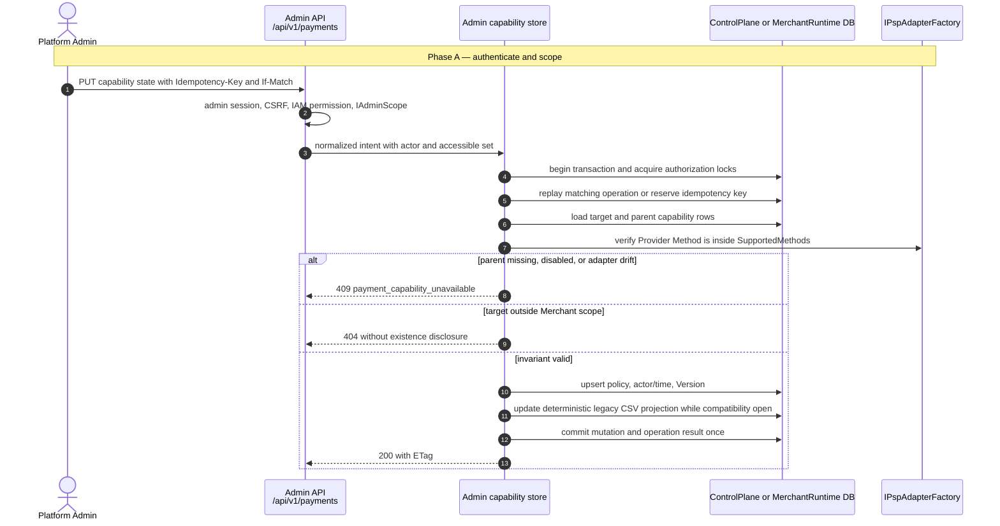
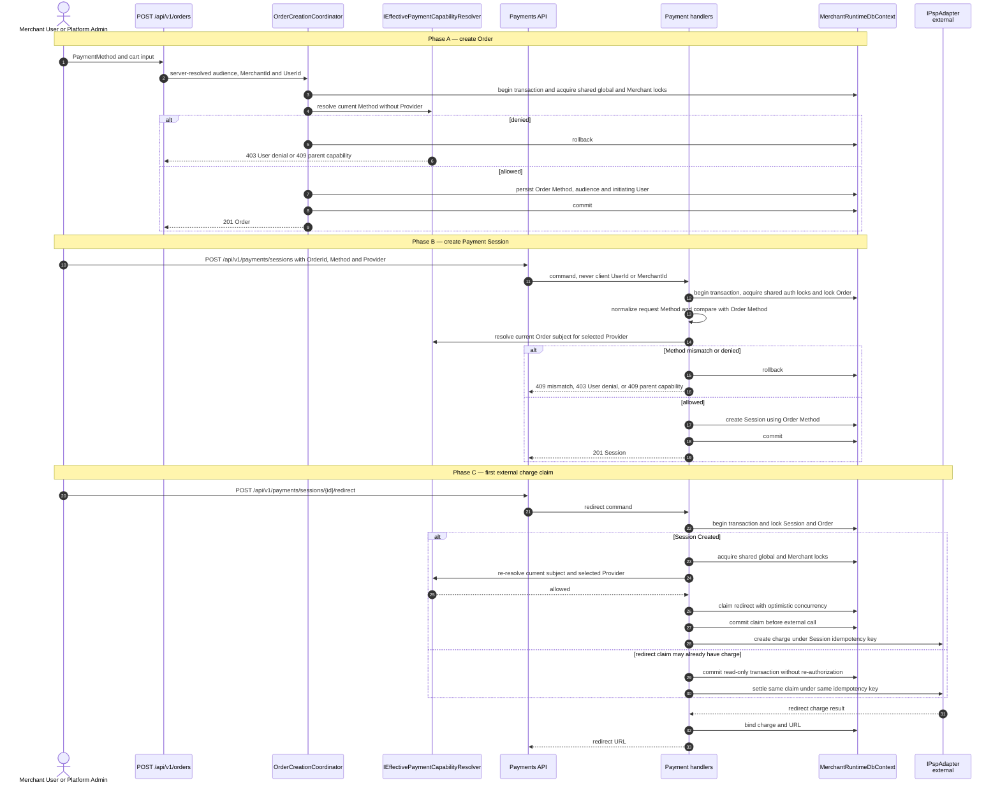
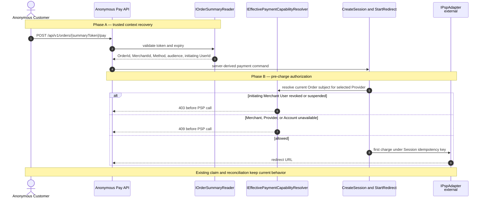
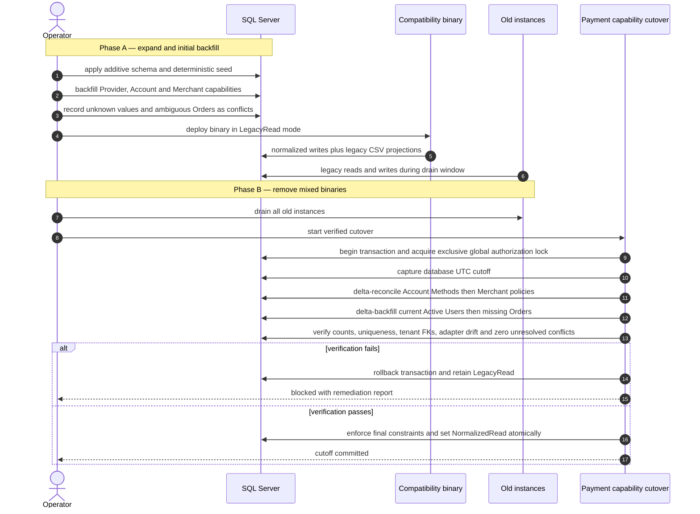
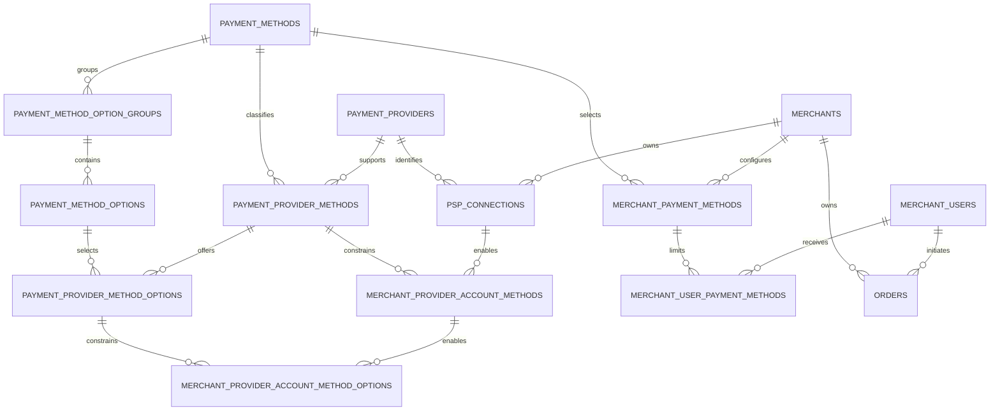

# Design: Merchant User Payment Method Access

> Status: approved 2026-08-17

เอกสารนี้ออกแบบ normalized payment capability, Merchant User policy, payment-flow enforcement และ migration cutover ตาม requirements ที่อนุมัติแล้ว โดย reuse identity, PSP connection, vault, tenant guard และ payment lifecycle เดิม

## Architecture Overview

ระบบเพิ่ม capability catalog และ policy ใต้ module `Payments` แล้วรวมการตัดสินสิทธิ์ไว้ที่ `IEffectivePaymentCapabilityResolver` จุดเดียว ไม่มี UI, user-level option policy, PSP payload ใหม่ หรือ live Omise PromptPay

### Effective capability

สำหรับ initiating audience แบบ Merchant User:

```text
effective method
= active canonical method
∩ active merchant
∩ active provider
∩ enabled merchant provider account
∩ active provider method
∩ enabled account method
∩ enabled merchant method policy
∩ active merchant user
∩ enabled merchant user method policy
∩ registered adapter SupportedMethods
```

สำหรับ Platform Admin ตัดเฉพาะ Merchant User และ User policy ออกจากสมการ ชั้น Merchant, Provider, Account, Method และ adapter ยังบังคับเหมือนเดิม

กฎ fail-closed:

- Missing row และ disabled row ให้ผล deny เหมือนกัน
- Resolve แบบไม่ระบุ Provider อนุญาตเมื่อมี qualifying account อย่างน้อยหนึ่ง chain
- Resolve แบบระบุ Provider ตรวจเฉพาะ account chain นั้น ห้าม fallback ไป Provider อื่น
- Connection health และ credential readiness เป็น runtime availability ไม่ใช่ authorization capability
- Resolver อ่าน state ปัจจุบันทุก request และตรวจ `IPspAdapter.SupportedMethods` ทุกครั้ง ไม่มี authorization cache

### Component ownership

| Component | Runtime owner | Responsibility |
|---|---|---|
| `merch.Users` | `MerchantUserDbContext` | identity, current status, immutable Merchant binding |
| `merch.Merchants` | `MerchantRuntimeDbContext` | Merchant status และ legacy projection |
| Global capability catalog | `ControlPlaneDbContext`, schema `cfg` | Method, Option, Provider และ Provider capability |
| Tenant capability policy | `MerchantRuntimeDbContext`, schema `txn` | Account, Merchant และ User capability |
| `txn.PspConnections` | `MerchantRuntimeDbContext` | existing Merchant Provider Account, config และ vault references |
| `shop.Orders` | `MerchantRuntimeDbContext` | immutable Method, initiating audience และ initiating User |
| `txn.PaymentSessions` | `MerchantRuntimeDbContext` | payment attempt ที่ใช้ Method จาก Order |
| `IEffectivePaymentCapabilityResolver` | `Payments.Application` port, `Persistence.MerchantRuntime` implementation | canonical method และ option decision |
| `IAccountResolver` | existing `Merchants.Application` port | อ่าน User status และ Merchant binding แบบ fresh ผ่าน sanctioned pre-bind reader |
| `IAdminPaymentsControlStore` | existing Admin payment port | five queries และ tenant-scoped capability mutation |
| `IAdminPaymentCatalogStore` | `Payments.Application` port, `Persistence.ControlPlane` implementation | global catalog mutation; reuse platform-scope operation executor |
| `PolDbContext` | migration only | full relational constraints และ migration chain |

Payment catalog ทั้งหกตารางเป็น global reference data ใน schema `cfg` และไม่มี tenant filter ส่วน entity ใหม่ที่มี `MerchantId` ทุกตัวอยู่ `MerchantRuntimeDbContext` พร้อม `TenantKeyDescriptor`, deny-default query filter และ sealed write guard เดิม `PolDbContext` เป็น migration owner ที่เห็นทั้ง model และสร้าง cross-schema FK จริง ไม่มี entity runtime owner ซ้ำและไม่เพิ่ม `DbContext`

Merchant User ไม่มี store สำหรับเขียน capability. Admin cross-merchant read/write reuse `IAdminPaymentsControlStore`, `IAdminScope`, `IgnoreQueryFilters` allowlist และ security telemetry เดิม Global catalog mutation ผ่าน `IAdminPaymentCatalogStore` และต้องเป็น unrestricted Platform Admin ส่วน Account, Merchant และ User mutationต้องอยู่ใน accessible Merchant set

### Request enforcement points

| Point | Trusted authorization subject | Required action |
|---|---|---|
| Merchant User order creation | current `IActorContext.MerchantId` และ `UserId` | resolve Method โดยไม่ระบุ Provider ก่อน `Order` insert |
| Platform Admin order creation | current admin audience และ target Merchant จาก scoped server flow | resolve โดยข้าม User layer ก่อน `Order` insert |
| Payment Session creation | Method, audience และ initiating User จาก locked Order | compare request Method, resolve selected Provider, persist Session จาก immutable Order Method |
| First redirect claim | audience และ initiating User จาก Order ของ Session | resolve selected Provider ก่อน `Session.BeginRedirect` |
| Anonymous pay | Order summary token ไปหา Order context ฝั่ง server | create/resume และ first redirect ใช้ resolver เดียวกัน |
| Existing redirect claim | persisted Session claim | settle ด้วย idempotency key เดิม ห้าม re-authorize หรือสร้าง replacement |
| Webhook และ payment-status | persisted Session/charge | reconcile ต่อโดยไม่อ่าน current authorization |

`payment.create`, `payment.redirect` และ IAM/RBAC เดิมยังเป็น endpoint gate แต่ไม่แทน method authorization

### Authorization serialization

การ resolve อย่างเดียวไม่พอ เพราะ capability อาจถูก revoke ระหว่าง decision กับ write ระบบใช้ SQL Server transaction-owned application lock ตาม pattern `GovernanceSqlLockManager` และ `VaultAuditAppender` เดิม:

1. acquire `Shared` lock `payment-authz:global`
2. acquire `Shared` หรือ `Exclusive` lock `payment-authz:merchant:{merchantId:D}`
3. lock Order/Session row เมื่อ flow ต้องแก้ aggregate

Order creation, Session creation และ first redirect claim ใช้ `Shared` ทั้ง global และ Merchant lock จากนั้นอ่าน User และ capability state ปัจจุบัน แล้ว persist Order, Session หรือ redirect claim ใน transaction เดียวกัน การ commit redirect claim ต้องเสร็จก่อนเรียก PSP ภายนอก จึงไม่มี revoke ที่ commit แทรกระหว่าง final decision กับ claim

Global Method/Provider/Provider capability mutation ใช้ `Exclusive` global lock Tenant capability mutation และ User/Merchant status transition ใช้ `Shared` global แล้ว `Exclusive` Merchant lock ทุก writer ต้องใช้ลำดับเดียวกันเพื่อกัน deadlock User projection ถูกอ่านผ่าน sanctioned parameterized reader ขณะถือ lock จึงไม่ต้องทำ distributed EF transaction ระหว่าง runtime contexts

Cutover ใช้ `Exclusive` global lock หลัง old binaries drain จึง freeze writer ใหม่ทุกชนิด: catalog, account, Merchant/User policy, User activation/reactivation/suspension, Merchant status, Order, Session และ first redirect claim Existing redirect claim, webhook และ reconciliation ไม่ re-authorizeและไม่ใช้ lock นี้ เพราะอาจมี external charge แล้ว

ทุก lock ใช้ `LockOwner = Transaction` และ timeout 15 วินาที การ acquire ไม่สำเร็จต้อง rollback, fail closed และ emit security/operational telemetry ห้ามดำเนิน mutation หรือเรียก PSP ต่อ

### Scope exclusions

- ไม่สร้าง password, `IsAdmin`, many-to-many Merchant membership หรือ identity model ใหม่
- ไม่สร้าง `MerchantUserPaymentMethodOptions`
- ไม่เพิ่ม bank-selection UI, PSP bank payload, `MOBILE_BANKING` หรือ wire Method alias
- ไม่ parse arbitrary `PspConnection.Metadata` เพื่อสร้าง capability หรือ option
- ไม่เพิ่ม dependency และไม่รัน production migration/deploy ใน implementation นี้

## Sequence Diagrams

### Admin enables Merchant or User policy



Global mutation reuse existing control-plane `admin.OperationRecords` แบบ platform scope Tenant mutation uses existing Merchant-scoped operation record Merchant method enable locks and checks a qualifying Account Method chain User method enable locks and checks matching enabled Merchant policy Disable operations keep child rows but make them ineffective through intersection

### Order, Session and first redirect authorization



### Anonymous order-link payment



Anonymous request body never carries MerchantId, MerchantUserId, audience หรือ Method override Customer session cookie ยังไม่ required และ summary-token validation, expiry กับ rate limit เดิมไม่เปลี่ยน

### Expand, reconcile and authorization cutover



Compatibility binariesใช้ authorization lock protocol กับ capability mutation, status transition และ pre-charge writer ทุกตัว Exclusive cutover waits for earlier transactions to commit แล้ว block writer ใหม่จน verification กับ mode flip commitใน transactionเดียว Old binaryไม่รู้ protocol จึงต้อง drain และตรวจว่าไม่มี instance เหลือก่อนเริ่ม cutover

## Data Models & Interfaces

### Fifteen logical concepts

| # | Logical concept | Physical source | Change |
|---:|---|---|---|
| 1 | Merchants | `merch.Merchants` | reuse `Merchant.Status`, keep `EnabledChannels` as compatibility projection |
| 2 | MerchantUsers | `merch.Users` | reuse identity and nullable pre-bind `MerchantId` |
| 3 | PaymentMethods | `cfg.PaymentMethods` | new canonical catalog |
| 4 | PaymentMethodOptionGroups | `cfg.PaymentMethodOptionGroups` | new canonical grouping |
| 5 | PaymentMethodOptions | `cfg.PaymentMethodOptions` | new canonical options |
| 6 | PaymentProviders | `cfg.PaymentProviders` | new canonical provider and adapter identity |
| 7 | PaymentProviderMethods | `cfg.PaymentProviderMethods` | new provider-method capability |
| 8 | PaymentProviderMethodOptions | `cfg.PaymentProviderMethodOptions` | new provider option capability |
| 9 | MerchantProviderAccounts | `txn.PspConnections` | reuse, add normalized `PaymentProviderId` |
| 10 | MerchantProviderConfigurations | `PspConnections.Metadata` | reuse non-secret config, never authorization input |
| 11 | MerchantProviderCredentials | existing vault versions and `PspConnection` references | reuse, no credential material on capability rows |
| 12 | MerchantProviderAccountMethods | `txn.MerchantProviderAccountMethods` | new account-method capability |
| 13 | MerchantProviderAccountMethodOptions | `txn.MerchantProviderAccountMethodOptions` | new account-option capability |
| 14 | MerchantPaymentMethods | `txn.MerchantPaymentMethods` | new Merchant policy |
| 15 | MerchantUserPaymentMethods | `txn.MerchantUserPaymentMethods` | new User policy |

ทุก PK/FK ของ entity ใหม่เป็น `uniqueidentifier` และ .NET `Guid`. `Guid.CreateVersion7()` ใช้ตาม convention เดิม ค่าธรรมชาติอย่าง Method code ไม่ใช้เป็น PK

### Capability relationship map



### Catalog and provider tables

| Table | Main columns | Constraints |
|---|---|---|
| `PaymentMethods` | `Id`, `Code`, `Name`, `IsActive`, `Version` | unique `Code`; seed only `card`, `promptpay`, `installment` |
| `PaymentMethodOptionGroups` | `Id`, `PaymentMethodId`, `Code`, `Name` | unique `(PaymentMethodId, Code)` |
| `PaymentMethodOptions` | `Id`, `PaymentMethodId`, `OptionGroupId`, `Code`, `Name` | composite FK keeps Group under same Method; unique `(OptionGroupId, Code)` |
| `PaymentProviders` | `Id`, `Code`, `AdapterCode`, `Name`, `IsEnabled`, `Version` | unique `Code`; unique `AdapterCode`; alternate key `(Id, AdapterCode)` |
| `PaymentProviderMethods` | `Id`, `PaymentProviderId`, `PaymentMethodId`, `IsActive`, audit fields, `Version` | unique `(PaymentProviderId, PaymentMethodId)` |
| `PaymentProviderMethodOptions` | `Id`, `PaymentProviderMethodId`, `PaymentMethodId`, `PaymentMethodOptionId`, `IsActive`, audit fields, `Version` | composite FKs enforce same Method; unique `(PaymentProviderMethodId, PaymentMethodOptionId)` |

`AdapterCode` เก็บ existing `Payments.Domain.Psp.Code` และเป็น execution identity เดียวของ Provider Stable seed IDs กำหนด Method codes กับ registered Providers ปัจจุบัน 2C2P Provider Methods ต้องตรง adapter ที่รองรับ `card`, `promptpay`, `installment`; Omise มีเฉพาะ `card`. Canonical Option Group/Option seedทำได้แบบ deterministic แต่ production Provider และ Account option assignmentเกิดจาก explicit Admin mutationเท่านั้น VCommerce, KBANK, SCB, KTC และ BAY assignmentอยู่เฉพาะ test/demo fixtures

### Account, Merchant and User policy tables

| Table | Main columns | Constraints |
|---|---|---|
| `PspConnections` | existing columns plus `PaymentProviderId`; existing `Psp` retained | composite FK `(PaymentProviderId, Psp)` to Provider `(Id, AdapterCode)`; unique `(MerchantId, PaymentProviderId)` after backfill |
| `MerchantProviderAccountMethods` | `Id`, `MerchantId`, `PspConnectionId`, `PaymentProviderId`, `PaymentProviderMethodId`, `PaymentMethodId`, `IsEnabled`, audit fields, `Version` | composite FKs bind Account, Provider และ Method; unique `(PspConnectionId, PaymentMethodId)` |
| `MerchantProviderAccountMethodOptions` | `Id`, `MerchantId`, Account Method keys, Provider Method Option keys, `PaymentMethodOptionId`, `IsEnabled`, audit fields, `Version` | composite FKs bind exact selected chain; unique `(MerchantProviderAccountMethodId, PaymentMethodOptionId)` |
| `MerchantPaymentMethods` | `Id`, `MerchantId`, `PaymentMethodId`, `IsEnabled`, `CreatedBy`, `CreatedAt`, `UpdatedBy`, `UpdatedAt`, `Version` | unique `(MerchantId, PaymentMethodId)` plus alternate key for child FK |
| `MerchantUserPaymentMethods` | `Id`, `MerchantUserId`, `MerchantId`, `PaymentMethodId`, `IsEnabled`, audit fields, `Version` | unique `(MerchantUserId, PaymentMethodId)`; composite FKs to User and Merchant policy |

Redundant parent IDs บน Account Method และ Account Method Option เป็น relational guard ไม่ใช่ duplicate authorization state Composite alternate keys/FKs บังคับว่า Account ใช้ Provider เดียวกับ Provider Method และ Option อยู่ใต้ Method chain เดียวกัน

Resolverเลือก Provider และ Account ด้วย `PaymentProviderId`; adapter factory dispatchด้วย `Psp` ที่ composite FK ผูกกับ Provider `AdapterCode` เดียวกัน DB catalogจึงชี้ adapterคนละตัวกับ accountไม่ได้ หลัง cutover `PaymentProviderId` เป็น authorization authority ส่วน `Psp` เป็น execution discriminator ที่ถูก relationally bound ไม่ใช่ source คู่

`MerchantUserPaymentMethods` ใช้ FK `(MerchantUserId, MerchantId)` ไป unique constraint `(Users.Id, Users.MerchantId)` และ FK `(MerchantId, PaymentMethodId)` ไป Merchant policy. เพราะ `Users.MerchantId` ต้อง nullable สำหรับ applicant แต่ EF Core alternate-key metadata บังคับ key property เป็น required, migration จึงสร้าง nullable SQL Server `UNIQUE` constraint และ composite FKs แบบ explicit DDL ส่วน runtime mappings คง scalar-only Constraint integration tests บน SQL Server เป็น gate ห้ามอาศัย SQLite

### Identity and Order changes

`merch.Users` เพิ่ม database check:

```text
Status NOT IN (Active, Suspended)
OR (MerchantId IS NOT NULL AND MerchantId <> empty-guid)
```

Domain transition เดิมยังเป็นผู้กำหนด `MerchantId` ใน transaction เดียวกับ activation. `(Provider, Subject)` unique เดิมคงอยู่ Merchant binding เปลี่ยนจาก non-null ไป Merchant อื่นไม่ได้ผ่าน domain, concurrency token และ write guard

`Orders.Domain.Order` เพิ่ม:

```csharp
public enum OrderInitiatingAudience
{
    MerchantUser = 1,
    PlatformAdmin = 2,
}

public OrderInitiatingAudience InitiatingAudience { get; private set; }
public Guid? InitiatingMerchantUserId { get; private set; }
```

ฐานข้อมูลบังคับ:

- Merchant User audience ต้องมี `InitiatingMerchantUserId` และไม่มี `OriginatorId`
- Platform Admin audience ต้องไม่มี `InitiatingMerchantUserId` และต้องมี existing `OriginatorId`
- `(InitiatingMerchantUserId, MerchantId)` ต้องอ้าง User ของ Merchant เดียวกัน
- `PaymentChannel` ต้องเป็น canonical Method และ immutable หลัง `Order.Create`

`Order.Create` รับ canonical Method, server-derived audience และ initiating identity เป็น required context `OrderCreationCoordinator` เป็น production creation path เดียว Existing `CreateOrderCommand`/`CreateOrderHandler` ไม่มี production callerและต้อง retire เพื่อไม่เหลือ writer ที่สร้าง Order โดยไม่มี authorization context

`CreateSessionHandler` normalize Method จาก requestเพื่อ compatibilityแล้วเทียบกับ locked Order ถ้าตรงจึงสร้าง `Session` ด้วย Order Methodและเรียก `Order.AttachPaymentAttempt(sessionId)` โดยไม่รับหรือเขียน Method `Order.MarkPaid` normalize Methodจาก confirmed paymentแล้วต้องเทียบกับ immutable `PaymentChannel`; mismatchถูก reject และ methodห้าม overwrite ทั้ง first transitionกับ idempotent replay

Implementation inventoryทุก production writerของ `Order.Create`, `PaymentChannel`, `InitiatingAudience`, `InitiatingMerchantUserId`, `AttachPaymentAttempt` และ `MarkPaid` แล้ว routeผ่าน invariantข้างบน Architecture testทำให้ writerใหม่ที่ bypass contextหรือ overwrite Method fail

Internal `OrderSummary` และ `PayableOrder` projections เพิ่ม audience กับ initiating UserId แต่ public summary response ไม่ expose สอง field นี้

### Migration control data

สอง operational relationsใหม่อยู่นอก 15 business conceptsและอยู่ใน control-plane schema:

| Table | Purpose | Key fields |
|---|---|---|
| `cfg.PaymentAuthorizationStates` | singleton authorization mode และ cutoff | `Id`, `Mode`, `CutoffAt`, `Version` |
| `cfg.PaymentCapabilityMigrationConflicts` | durable remediation ledger | `Id`, `Kind`, `MerchantId`, `EntityId`, redacted detail, `DetectedAt`, `ResolvedAt`, `ResolvedBy` |

Mode มี `LegacyRead`, `NormalizedRead`, `FailClosed`. Application binariesอ่าน row นี้ต่อ authorization request ไม่มี environment-version switchหรือ per-instance flag Global mutation reuse existing `admin.OperationRecords` ด้วย `GovernanceScopeKind.Platform` และ `MerchantId = null`; ห้ามใช้ `Guid.Empty` sentinel Merchant-scoped mutationยัง reuse `txn.AdminOperationRecords`; migration provenanceไม่พึ่ง operation ledgerที่มี retention policy

### Resolver contracts

```csharp
public enum PaymentAudience { MerchantUser = 1, PlatformAdmin = 2 }

public sealed record PaymentCapabilitySubject(
    Guid MerchantId,
    PaymentAudience Audience,
    Guid? MerchantUserId);

public sealed record ResolvePaymentMethod(
    PaymentCapabilitySubject Subject,
    string Method,
    string? ProviderCode);

public enum PaymentCapabilityDenial
{
    None,
    UserNotActive,
    UserPolicyDenied,
    MerchantUnavailable,
    MethodUnavailable,
    ProviderUnavailable,
    AccountUnavailable,
    AdapterUnsupported,
}

public sealed record PaymentMethodDecision(
    bool Allowed,
    string Method,
    PaymentCapabilityDenial Denial,
    Guid? QualifyingAccountId);

public interface IEffectivePaymentCapabilityResolver
{
    Task<PaymentMethodDecision> ResolveMethodAsync(
        ResolvePaymentMethod request,
        CancellationToken cancellationToken);

    Task<IReadOnlyList<EffectivePaymentMethod>> ListMethodsAsync(
        PaymentCapabilitySubject subject,
        CancellationToken cancellationToken);

    Task<IReadOnlyList<EffectivePaymentOption>> ResolveOptionsAsync(
        ResolvePaymentMethod request,
        CancellationToken cancellationToken);
}
```

Implementation ใช้ sanctioned exact-scope User projection แล้วตรวจ UserId, MerchantId และ `UserStatus.Active`; query `cfg` catalogกับ `txn` tenant chainแบบ parameterizedจาก SQL databaseเดียวกันขณะถือ authorization locks; สุดท้ายเลือก adapterจาก composite-bound `AdapterCode` และตรวจ `SupportedMethods` ใน memory Denial reasonเป็น internal typed result Merchant User list/options responseไม่เปิด topologyหรือ policyของคนอื่น ไม่มี authorization cache

Options resolver ทำงานตามลำดับ:

1. Resolve Method ของ subject และ selected Provider
2. เลือก `PspConnection` ของ `(MerchantId, PaymentProviderId)` ที่ enabled
3. join enabled Account Method กับ active Provider Method
4. intersect active Provider Method Options กับ enabled Account Method Options
5. คืน canonical Option rows ของ chain นี้เท่านั้น

ถ้า Method ไม่ effective ให้คืน options ชุดว่าง ห้าม union/fallback และไม่มี User option table

### API contracts

Five required queries:

| Query | Route | Permission | Result |
|---|---|---|---|
| Users of Merchant | existing `GET /api/v1/merchants/users?merchantId={id}` | `merchants.users.view` | เฉพาะ Active/Suspended ของ Merchant |
| Methods available to Merchant | `GET /api/v1/payments/merchants/{merchantId}/methods` | `merchant.view` | effective Merchant methods จาก parent chains |
| Methods assigned to User | `GET /api/v1/payments/merchants/{merchantId}/users/{userId}/methods` | `merchants.users.view` | explicit rows, enabled state, effective state, ETag |
| Resolve User Method | `GET /api/v1/payments/merchants/{merchantId}/users/{userId}/methods/{method}/resolution` | `merchants.users.view` | `allowed` หรือ `denied` จาก canonical resolver |
| Resolve User options | `GET /api/v1/payments/merchants/{merchantId}/users/{userId}/methods/{method}/options?provider={code}` | `merchants.users.view` | exact selected Provider options |

Merchant User self reads:

| Route | Permission | Identity input | Result |
|---|---|---|---|
| `GET /api/v1/payments/methods` | `payment.view` | server `IActorContext` only | effective Method codes lowercase |
| `GET /api/v1/payments/methods/{method}/options?provider={code}` | `payment.view` | server `IActorContext` only | effective options หรือ empty set |

Admin mutation route families:

| Route family | Permission | Scope |
|---|---|---|
| `PUT /api/v1/payments/methods/{method}` | `merchant.manage` | unrestricted Admin only |
| `PUT /api/v1/payments/providers/{providerCode}` | `merchant.manage` | unrestricted Admin only |
| `PUT /api/v1/payments/providers/{providerCode}/methods/{method}` | `merchant.manage` | unrestricted Admin only, adapter ceiling checked |
| `PUT /api/v1/payments/providers/{providerCode}/methods/{method}/options/{option}` | `merchant.manage` | unrestricted Admin only, exact Provider Method chain checked |
| `PUT /api/v1/payments/psp-connections/{connectionId}/methods/{method}` | `merchant.manage` | accessible Merchant |
| `PUT /api/v1/payments/psp-connections/{connectionId}/methods/{method}/options/{option}` | `merchant.manage` | accessible Merchant |
| `PUT /api/v1/payments/merchants/{merchantId}/methods/{method}` | `merchant.manage` | accessible Merchant, qualifying chain checked |
| `PUT /api/v1/payments/merchants/{merchantId}/users/{userId}/methods/{method}` | `merchants.users.manage` | accessible Merchant, enabled Merchant policy checked |

แต่ละ global routeมี paired `GET` contract; รวม `GET /api/v1/payments/providers/{providerCode}/methods/{method}/options/{option}` สำหรับอ่าน Provider Method Option stateกับ ETag ทุก mutationต้องมี Admin session, CSRF, `Idempotency-Key`, `If-Match`, audit actor/time และ optimistic concurrency Global mutation reserve/replayผ่าน existing platform-scope `admin.OperationRecords`; tenant mutationใช้ existing Merchant-scoped idempotency record Catalog/Provider/Provider Method/Provider Option, Account และ Merchant read routesใต้ `/api/v1/payments/...` ใช้ `merchant.view`; User policy readsใช้ `merchants.users.view` ไม่มี IAM keyใหม่ Credential materialไม่อยู่ response

Existing Merchant update, PSP connection create/update และ provisioning pathsเป็น compatibility façades ถ้า payloadแตะ `EnabledChannels`, `IsEnabled` หรือ `EnabledMethods` ต้องเรียก normalized mutationเดียวกันภายใต้ authorization locks แล้วเขียน deterministic CSV projection ห้ามมี legacy writerขนาน Config/credential-only PSP updateคง `settings.manage`; capability fieldต้อง `merchant.manage`; requestที่แตะทั้งสองส่วนต้องผ่านทั้งสอง permission

Merchant User ไม่มี mutation route ต่อให้มี `users.manage`, `payment.create` หรือ permission อื่น

### Migration and compatibility algorithm

1. **Expand**: สร้าง normalized tables, state/conflict tables และ nullable `PaymentProviderId`, `InitiatingAudience`, `InitiatingMerchantUserId`; คง legacy columns
2. **Seed**: ใส่ stable Method/Provider rows และ Provider Methods ที่เป็น subset ของ compiled adapter manifest; canonical options seed ได้แต่ไม่ seed production account assignment
3. **Backfill account capability**: split CSV, trim, lowercase, distinct, sort และ intersect adapter; unknown/alias/drift เขียน conflict
4. **Backfill Merchant policy**: intersect `Merchant.EnabledChannels` กับ qualifying Account Method chains
5. **Backfill Orders**: existing valid `Order.OriginatorId` กับ tenant FK เป็น durable trusted Admin marker; row ที่ไม่มี marker mapได้เฉพาะ unique Active/Suspended `(MerchantId, SaleCode)`; zero/multiple matchหรือ conflicting provenanceเป็น conflict ห้าม infer audienceจาก absenceของ operation record
6. **Compatibility deploy**: mode คง `LegacyRead`; capability/status/pre-charge writersทั้งหมดใช้ authorization lock protocol; normalized Admin writes update normalized rowsกับ deterministic legacy projectionsใน transactionเดียว Legacy mutation entry pointsต้อง funnelเข้า writerนี้
7. **Drain**: เอา old application instances ออกทั้งหมดก่อน cutover
8. **Final reconciliation**: begin transactionและ acquire exclusive global lock; capture database UTC cutoff; delta-reconcile Account Methodsจาก current legacy values ต่อด้วย Merchant policies แล้ว backfill current Active Usersและ Ordersที่ยังไม่มี contextตามลำดับ
9. **Verify and enforce**: ตรวจ counts, unique keys, composite FKs, no empty tenant keys, adapter parity และ zero unresolved conflict; tighten new columns/checks/FKs
10. **Cutover**: เปลี่ยน stateเป็น `NormalizedRead` และ commitใน transactionเดียวกับ final reconciliation; failureใดก็ตาม `THROW` และ rollbackกลับ `LegacyRead`
11. **Retain legacy**: columns เดิมยังอยู่แต่ authorization read normalized เท่านั้น; projectionsเขียนต่อจน compatibility window ปิด

Existing Active Users ณ cutoff ได้ enabled policy ตาม effective Merchant methods User ที่ activate หลัง cutoff ไม่มี auto-grant. Suspended User ไม่ได้ policy จาก User backfill แต่ยังใช้เป็น candidate สำหรับ legacy Order creator mapping และ current resolver จะ deny

Projection format เป็น canonical lowercase codes แบบ distinct และ ordinal-sorted joined ด้วย comma. Normalized rows เป็น source เดียวหลัง cutover CSV และ `Metadata` ห้ามอยู่ใน resolver query

Old binariesไม่ถือ lockและยังแก้ CSVได้ จึงห้ามเริ่ม exclusive cutoverจน deployment inventoryกับ active-instance checkยืนยันว่า drainครบ Final transaction block global/tenant capability, status และ Order/Session/first-redirect writerของ compatibility binaryทั้งหมด ทำให้ทุก rowที่ commitก่อน cutoffถูกรวม และไม่มี writer commitแทรกระหว่าง reconciliation, verification กับ mode flip

Rollback:

- ก่อน cutover: deploy compatibility binary เดิม, คง `LegacyRead`, normalized rows และ legacy columnsไว้
- หลัง cutover: deploy ได้เฉพาะ binary ที่เข้าใจ normalized schema และคง `NormalizedRead`
- ถ้า normalized-aware rollback binaryใช้ไม่ได้: เปลี่ยน `FailClosed` เพื่อปิด Order/Session/first redirect ใหม่ แต่ settlement/reconciliation เดิมยังทำงาน แล้ว roll forward
- ไม่มี migration หรือ deploy production ใน implementation phase

## Technology Decisions

1. **Reuse identity and account models**: `merch.Users`, `merch.Merchants`, `txn.PspConnections`, vault version และ `IAccountResolver` ครบ semantics จึงไม่สร้าง duplicate entities
2. **Preserve context ownership**: global `cfg` catalogอยู่ `ControlPlaneDbContext`; tenant `txn` capabilityอยู่ `MerchantRuntimeDbContext`; `PolDbContext` สร้าง cross-schema FKs ไม่เพิ่ม contextหรือ map entityซ้ำ
3. **Serialize authorization decisions**: reuse SQL Server `sp_getapplock` patternด้วย global/Merchant resources ทำให้ resolver decisionกับ Order/Session/claim writeเป็น atomic authorization unitโดยไม่ใช้ distributed transaction
4. **Database constraints first**: uniqueness, Provider-adapter parity, exact parent-chain composite FKs, tenant FKs และ audience checksบังคับใน SQL Server; application precheckให้ errorอ่านได้แต่ DBเป็น final race guard
5. **No SQL trigger**: cross-table enable invariantตรวจขณะถือ authorization locksแล้ว persistครั้งเดียว
6. **Adapter is executable ceiling**: catalog write reject drift, resolver fail-closed และ pre-deploy integration test block release; startupไม่ auto-mutate rows
7. **Order owns Method and initiating context**: client requestเป็น selectorเท่านั้น Orderเป็น immutable lifecycle source Sessionและ paid-event writerไม่แก้ Method
8. **Re-authorize only before first charge claim**: revocationมีผลกับ requestถัดไปที่ยังสร้าง chargeได้ Existing claim settleต่อด้วย keyเดิมเพื่อกัน double charge
9. **Database state controls rollout**: singleton mode + transaction-owned shared/exclusive lock ป้องกัน per-instance split semanticsโดยไม่เพิ่ม environment versioning
10. **Reuse global idempotency**: global catalog mutationใช้ existing platform-scope `admin.OperationRecords` ที่รองรับ null Merchant; tenant mutation reuse existing scoped ledger
11. **Legacy CSV is derived compatibility output**: deterministic dual-writeระหว่าง window ไม่มี dual canonical read
12. **No new dependency**: ใช้ EF Core, SQL Server transactions, existing idempotency/ETag/telemetry และ adapter registry

## Error Handling Strategy

| Case | HTTP | Stable code | Handling |
|---|---:|---|---|
| blank, unknown หรือ alias Method | 400 | `validation_failed` | `PaymentMethods.Normalize` ก่อน lookup |
| malformed Provider selector หรือ body | 400 | `validation_failed` | request validation |
| Order/User/accountไม่มีหรืออยู่นอก resolved/requested Merchant scope | 404 | `not_found` | scoped query หรือ Admin accessible-set check, no leak |
| Merchant User inactive, missing User policy หรือ User policy disabled ใน payment action | 403 | `payment_method_not_allowed` | resolver denial mappedก่อน mutation/PSP |
| Merchant, canonical Method, Provider, Account หรือ parent capability disabled/missing | 409 | `payment_capability_unavailable` | fail-closed resolver or mutation invariant |
| Session request Method ไม่ตรง Order | 409 | `payment_method_mismatch` | compareกับ locked Order ก่อน Session insert |
| authorization application lock timeout | 409 | `payment_authorization_busy` | rollback transaction, no mutation/PSP call, telemetry; caller retryด้วย idempotency key |
| stale `If-Match` หรือ policy Version | 409 | existing concurrency code | optimistic concurrency mappingเดิม |
| duplicate/FK/check หรือ Provider-adapter parity race | 409 | existing conflict code | context unit-of-work SQL 2601/2627/547 mapping + telemetry |
| unresolved migration conflict หรือ adapter drift | cutover blocked | not HTTP | rollback cutover transaction, keep `LegacyRead` |
| post-cutover rollback ไม่มี compatible binary | pre-charge fail closed | `payment_capability_unavailable` | mode `FailClosed`; settlementยังทำต่อ |

Admin resolve query คืน `200` พร้อม `allowed=false`; self Method list omit denied rows; self/admin options คืน `200` กับ empty set เมื่อ Method ไม่ effectiveตาม option contract. HTTP 403 ใช้กับ payment mutation/redirect ที่พยายามใช้ User Method โดยไม่มีสิทธิ์

Error detail ไม่คืน credential, identity subject, policy topology หรือ existence ของ resource นอก scope Security telemetry ใช้ actor, target Merchant, entity, operation, redacted reason และ correlation id ตาม conventionเดิม

## Testing Strategy

| Test layer | Evidence |
|---|---|
| Domain/unit | User state boundary, Method normalization, policy transitions, audit/version, immutable Order Method, audience/identity pairing, `AttachPaymentAttempt`ไม่เขียน Method และ `MarkPaid` reject mismatch |
| Resolver unit | allowed path และ denyทุก layer รวม any-Provider, selected-Provider, adapter ceiling, current-state re-read และ Admin audience |
| Option unit | selected Provider chain, Provider/Account option intersection, empty-on-denied, no union/fallback และไม่มี User option mutation |
| Payments flow | order, session, redirectใช้ resolverเดียวกัน; generic permission bypassไม่ได้; Session mismatch; revoke/suspend raceกับ Order/Session/first claimต้อง serialize; post-claim settleโดยไม่สร้างใหม่ |
| Anonymous flow | server-derived context, no override, token/expiry/rate-limit regression, revokeก่อน charge, Admin-originated orderยังตรวจ parent capability |
| API/host | five required queries, Provider Method Option read/mutation, permission mapping, CSRF, global/tenant idempotency, ETag, Admin scope 404, Merchant self identityจาก server และ stable error codes |
| SQL integration | Guid PK/FK, unique codes/policies/account, Provider `(Id, AdapterCode)` parity FK, User status check, nullable User composite key, cross-Merchant policy rejection, exact option chain, audience constraint และ write guard |
| Migration | successful backfill, deterministic CSV, durable Admin marker, unknown values, unique Suspended creator, zero/multiple/conflicting provenance, delta Account/Merchant/User/Order, cutover-vs-writer races, blocker, projection compatibility และ rollback modes |
| Adapter parity | seeded/persisted Provider Methodsต้องเป็น subsetของ exact composite-bound adapter `SupportedMethods`; catalog/account mapping driftทำ testแดง |
| Architecture | entity owner disjointness, global-catalog allowlist, tenant query-filter coverage, write-authorizer allowlists, sanctioned bypass ports, every Order/Method writer inventory, lock-order inventory และ no raw bypassใหม่ |
| Acceptance | User A ได้ `card`,`promptpay` ไม่ได้ `installment`; User B ได้ `installment` เท่านั้นและเห็น KBANK/SCB ไม่เห็น KTC/BAY |

Real SQL Server integration tests เป็นหลักฐานของ unique/check/composite FK และ migration SQLite ใช้แทนหลักฐานนี้ไม่ได้ ถ้า environmentไม่มี SQL Server ให้รายงาน not run ห้ามอ้าง green

Implementation gate ต้องรันตาม requirements:

```bash
dotnet restore pol-core.slnx
dotnet build pol-core.slnx --no-restore -warnaserror
dotnet test pol-core.slnx --no-build --filter "Category!=Integration"
dotnet test pol-core.slnx --filter "Category=Integration"
scripts/check-rename-identifiers.sh
.ai/bin/check-secrets.sh --all
scripts/spec-trace.sh merchant-user-payment-method-access
```

ห้าม commit `.only`/`.skip`; coverage ห้ามลด; migration tests ต้องพิสูจน์ rollback และไม่รัน production

## Requirement Traceability

| Design element | Requirement coverage |
|---|---|
| Identity reuse, applicant boundary, single Merchant, uniqueness, Guid และ no admin/password shortcut | REQ-1.1–REQ-1.12 |
| Fifteen-concept map, canonical codes, normalized source, option parents, config/credential separation และ input normalization | REQ-2.1–REQ-2.15 |
| Provider/Account schema, transactional invariant, adapter ceiling, qualifying semantics และ one-account cardinality | REQ-3.1–REQ-3.24 |
| Merchant/User policy schema, composite tenant FKs, deny-default, audit/version, parent recheck, filters และ Admin port | REQ-4.1–REQ-4.18 |
| Effective equation, typed resolver, any/selected Provider และ fresh current-state reads | REQ-5.1–REQ-5.13 |
| Five queries, Admin-only management, self reads, errors, IAM keys และ applicant query separation | REQ-6.1–REQ-6.28 |
| Order/Session/redirect enforcement, generic RBAC separation, immutable Method และ post-claim settlement | REQ-7.1–REQ-7.19 |
| Server-owned initiating context, anonymous re-resolution, Admin audience, existing anonymous controls และ DB constraints | REQ-8.1–REQ-8.19 |
| Method-only User policy, selected Provider option intersection, KBANK/SCB example, no KTC/BAY, no fallback/UI | REQ-9.1–REQ-9.16 |
| Expand/backfill/conflicts, compatibility mode, exclusive cutover, delta reconciliation, rollback และ option seed scope | REQ-10.1–REQ-10.33 |
| SQL, resolver, query, payment, anonymous, adapter, acceptance, migration, rollout และ gate evidence | REQ-11.1–REQ-11.28 |

## Design Review Disposition

Fresh-context `spec-architect` review วันที่ 2026-08-17 ให้ verdict `CHANGES REQUIRED` พร้อม 8 findings แก้ครบก่อนขอ approval:

| Finding | Severity | Disposition |
|---|---|---|
| Authorization decision อาจ race กับ revoke ก่อน Order/Session/redirect claim | Blocking | Applied: shared/exclusive application-lock protocol และ decision + mutation transactionเดียว; PSP callหลัง claim commit |
| Cutover freeze และ final reconciliation ไม่ครอบ capability writers | Blocking | Applied: drain old instances, exclusive global lock, delta Account → Merchant → User → Order, verifyและ mode flip transactionเดียว |
| `PaymentProviderId` กับ existing `Psp` เป็น identity สองแหล่ง | Blocking | Applied: Provider `AdapterCode` และ composite FK `(PaymentProviderId, Psp)` |
| Expiring `AdminOperationRecord` ใช้จำแนก legacy Admin Order ไม่ได้ | Blocking | Applied: durable positive `Order.OriginatorId` marker; missing/ambiguous/conflicting provenanceเป็น remediation conflict |
| `Order.Create`, `AttachPaymentAttempt`, `MarkPaid` ยัง bypass/overwrite Method ได้ | Major | Applied: production writerเดียว, immutable Method, attachไม่รับ Method, paid writer compare-only และ architecture inventory test |
| Merchant-scoped idempotency recordใช้กับ global Providerไม่ได้ | Major | Applied: reuse existing platform-scope `admin.OperationRecords`; ไม่มี fake Merchant key |
| ไม่มี Provider Method Option Admin mutation contract | Major | Applied: paired GET/PUT routeพร้อม exact-chain, ETag, idempotency และ unrestricted Admin scope |
| `/api/v1/admins/payments/...` ขัด route area convention | Major | Applied: capability surfaceทั้งหมดอยู่ `/api/v1/payments/...`; audienceบังคับด้วย auth, permission และ scope metadata |
