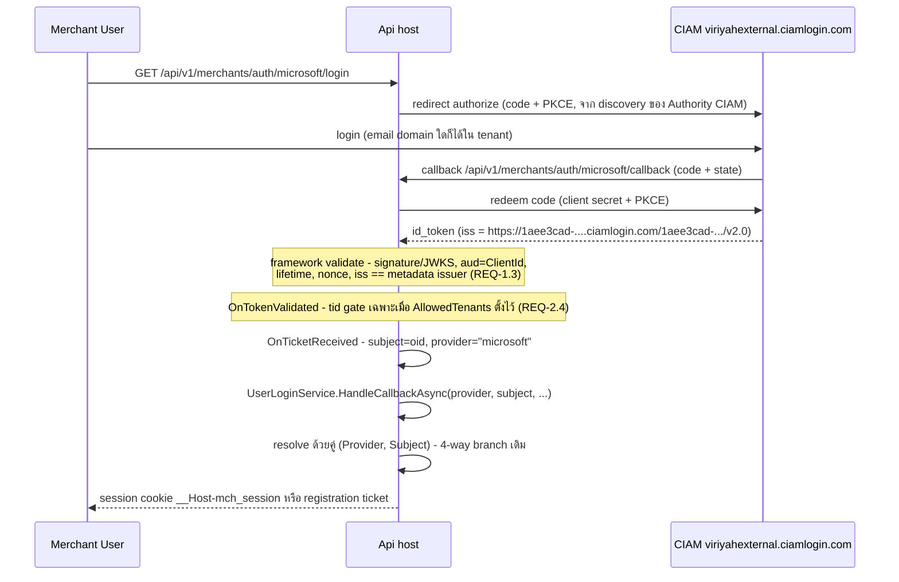
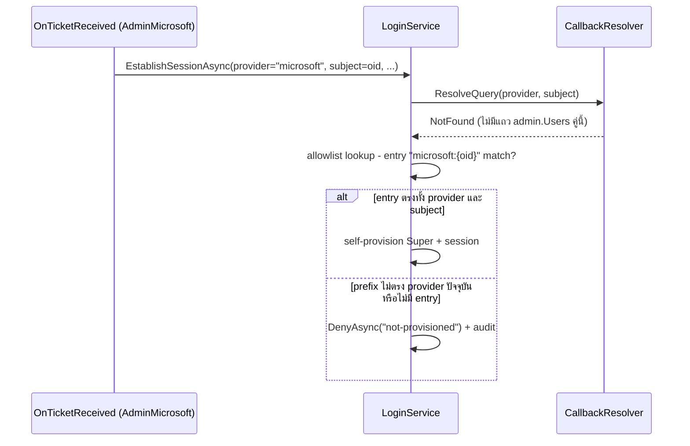

# Design: Microsoft OIDC CIAM Alignment

> Status: approved 2026-08-16

## Architecture Overview

หลักการรวม: **ลบ custom issuer logic ทิ้ง แล้วพิง framework default** — บน .NET 10 handler เส้นทาง default (`JsonWebTokenHandler`) รับ `ConfigurationManager` จาก OpenIdConnect options แล้วเทียบ `iss` ของ token กับ `configuration.Issuer` จาก discovery metadata เองโดยตรง (ไม่ใช่การ copy เข้า `ValidIssuers` แบบ path เก่า — ดู dotnet/aspnetcore #58327; ผลลัพธ์เดียวกัน) ดังนั้น Authority แบบ tenant-pinned (workforce หรือ CIAM) ได้ tenant isolation จากการเทียบ `iss` == metadata issuer โดยไม่ต้องมีโค้ด validate เพิ่มเลย — `ValidateIssuer = true` ที่ตั้งอยู่ทำงานร่วมได้ปกติ ห้ามตีความว่าต้องมี custom validator กลับมา

องค์ประกอบที่แตะ (ทั้งหมดอยู่ host layer + domain identity):

| Component | ไฟล์ | การเปลี่ยน |
|---|---|---|
| Issuer validation | `src/Hosts/Api/OidcProviderOptions.cs` | ลบ `MicrosoftOidc.ValidateIssuer` ทั้ง method; คง `Subject`/`Email`/`Is`/`ProviderName` |
| Admin OIDC wiring | `src/Hosts/Api/Admins/OidcAuthentication.cs` | ลบ `IssuerValidator` assignment; ย้าย `AllowedTenants` gate ไป `OnTokenValidated`; ส่ง provider slug เข้า `LoginService` (ฝั่งนี้ยังไม่ส่ง — ต้องเพิ่ม) |
| Merchant OIDC wiring | `src/Hosts/Api/Merchants/UserOidcAuthentication.cs` | ลบ `IssuerValidator` + ย้าย gate เหมือน admin — ส่วน provider slug **มีอยู่แล้ว** (`:71,137` ส่ง `providerSlug` เข้า `HandleCallbackAsync`) ไม่ต้องเพิ่ม (M7) |
| Boot guard | `src/Hosts/Api/Program.cs` (`RequireOidcProviders`) | ตัดเงื่อนไข `sectionName == "AdminAuth"` — multi-tenant Authority = throw; scope การเรียกคงเดิม (non-Development, `Program.cs:206` — H4) |
| Config defaults | `src/Hosts/Api/appsettings.json`, `docker-compose.prod.yml`, `.env.prod.example` | authority จริงทั้งสอง plane + env mapping ฝั่ง merchant |
| Identity mapping | Domain/Application/Persistence สอง plane (รายไฟล์ดู Data Models) | `Provider` column สอง plane + unique `(Provider, Subject)`; `merch.ExternalLogins` **คงไว้ตามเดิม** (B1 — registration เขียนอยู่จริง) |
| Allowlist | `src/Hosts/Api/Admins/LoginService.cs` | parse `provider:subject`, no-prefix = `google`, เช็ค provider ตรงก่อน self-provision |
| Invitation | `src/Hosts/Api/Program.cs` (`/invitations/start`) | รับ form field `provider` default `google`, จำกัด allowlist verified-email provider (B3) |

## Sequence Diagrams

Login ฝั่ง merchant ผ่าน CIAM (เส้นที่แก้):



Admin allowlist self-provision พร้อม provider check (REQ-4.3/4.4):



## Data Models & Interfaces

### Schema change (1 migration)

| ตาราง | การเปลี่ยน |
|---|---|
| `admin.Users` | เพิ่ม `Provider nvarchar(32) NOT NULL DEFAULT 'google'`; แทน unique เดิมบน `Subject` ด้วย unique `(Provider, Subject)` **คง filter `[Subject] IS NOT NULL`** (B2 — invited admin ยังไม่ bind มี Subject NULL, SQL Server ถือ NULL เท่ากันใน unique index ถ้าไม่ filter จะเชิญ admin คนที่สองไม่ได้) |
| `merch.Users` | เพิ่ม `Provider` + unique `(Provider, Subject)` ไม่ต้อง filter (`Subject` required อยู่แล้ว) |
| `merch.ExternalLogins` | **ไม่แตะ** (B1 supersede A4 — registration เขียนตารางนี้ทุกครั้งที่ `SubmitRegistration.cs:183` ผ่าน `IExternalLoginRepository` + write authorizer allowlist; entity, port, constants `ExternalLogin.Google`/`.Microsoft` อยู่ครบตามเดิม) |

จุดประกาศ EF config มี **2 ที่ต่อ plane** ต้องแก้คู่กันเสมอ (M6 — trap เดิม "2 SessionConfiguration files"):

| plane | migration-owner (ออก DDL) | runtime mirror |
|---|---|---|
| admin | `src/Modules/Admins/Admins.Infrastructure/Persistence/Users/UserConfigurations.cs:33` | `src/Persistence/Persistence.ControlPlane/Admins/UserConfiguration.cs:37` |
| merchant | `src/Modules/Merchants/Merchants.Infrastructure/Persistence/Users/UserConfigurations.cs:39` | `src/Persistence/Persistence.MerchantUsers/Users/UserConfiguration.cs:54` |

- ค่า provider = slug ตัวพิมพ์เล็ก (`google`/`microsoft`) ตรงกับ URL path segment — single source เดียวกับ providers dictionary key lowercase (ค่าคงที่มีแล้วที่ `ExternalLogin.Google`/`.Microsoft`)
- Migration ใช้ `DEFAULT 'google'` backfill แถวเดิมในตัว (REQ-4.5 — แถวที่มีอยู่ทั้งหมดเป็น google จริง) — session ไม่หลุดเพราะ session lookup ใช้ token hash + `AdminId`/`UserId` ไม่แตะ Subject
- `merch.RegistrationAudits`: เพิ่ม `TargetUserId` + backfill join `merch.Users` บน `Subject` (R3)
- **Rollback guard executable (R4+P1-3)**: `Down()` เริ่มด้วย guard `THROW` **ก่อน** DDL ทุกคำสั่ง — ไม่ใช่แค่ comment:

  ```sql
  IF EXISTS (SELECT Subject FROM admin.Users WHERE Subject IS NOT NULL
             GROUP BY Subject HAVING COUNT(*) > 1)
      THROW 50001, 'Down blocked: duplicate Subject across providers in admin.Users — forward-fix or restore backup.', 1;
  IF EXISTS (SELECT Subject FROM merch.Users GROUP BY Subject HAVING COUNT(*) > 1)
      THROW 50001, 'Down blocked: duplicate Subject across providers in merch.Users — forward-fix or restore backup.', 1;
  ```

  (ฝั่ง admin ตัด `Subject IS NULL` ออก — invited admins หลายแถวไม่ใช่ duplicate); `Down()` reverse ครบรวม `RegistrationAudits.TargetUserId`/`ActorAdminId` + FK + index; **production ห้ามใช้ `Down()` — restore backup เท่านั้น** ตาม `docs/runbooks/deploy-self-host.md`
- ไม่มีตารางใหม่ → ไม่ต้อง GRANT เพิ่ม (trap เดิมเกิดเฉพาะ CREATE TABLE)
- L12 ถูก supersede บางส่วนโดย R3: `RegistrationAudits` ได้ `TargetUserId` เป็น read key แล้ว (`TargetSubject` เหลือ display); `RegistrationNotices.Subject` ยังคงเดิม — idempotency ใช้ `UserId` อยู่แล้ว ไม่กระทบ

### Interface changes

```csharp
// Admins.Application — ResolveQuery เดิมรับ subject เดี่ยว
public sealed record ResolveQuery(string Provider, string Subject) : IQuery<ResolveResult>;

// Merchants.Application
public sealed record ResolveLoginQuery(string Provider, string Subject) : IQuery<LoginResolution>;

// Host: LoginService / UserLoginService รับ provider slug เพิ่มจาก callback closure
Task EstablishSessionAsync(HttpContext ctx, string provider, string? subject, string? email,
    bool emailVerified, string? returnTo, CancellationToken ct);
```

Ripple เต็มของ provider slug (M7 — ยืนยันจากโค้ดจริงโดย critique):

- **Host (admin — ต้องเพิ่ม provider)**: `OidcAuthentication.cs:141-149` ส่ง slug เข้า `LoginService.EstablishSessionAsync` (`LoginService.cs:107`); ฝั่ง merchant มีแล้ว ไม่แตะ
- **Query/port ที่เปลี่ยน key เป็น `(Provider, Subject)`**: `ResolveQuery` (`Admins.Application/Users/ResolveAdmin.cs:14,49`) + `IUserRepository.GetBySubjectAsync`; `ResolveLoginQuery` (`Merchants.Application/Users/ResolveLogin.cs:17,57`); `IAccountResolver.FindBySubjectAsync` / `IAccountStore.FindBySubjectAsync` (`UserPorts.cs:93,106`) + caller `SubmitRegistration.cs:159,197`; adapter `MerchantAccountResolver.cs:18-22` (คง `IgnoreQueryFilters()` — อยู่ใน bypass allowlist ของ Architecture.Tests) + `MerchantAccountStore.cs`
- **ลบ dead subject-only seams (P2-5, supersede L11)**: `git rm` ทั้ง `AdminResolveLoginBySubject.cs` (ไม่มี caller อยู่แล้ว) และถอด `IUserRepository.FindBySubjectAsync` (`UserPorts.cs:21` + impl `MerchantUserRepositories.cs:35` — ไม่มี caller เหลือหลัง R1 เพราะ handler ทั้งหมดใช้ pre-bind ports); แก้ Architecture.Tests/allowlist ที่อ้างถึงตาม — เก็บ composite `(Provider, Subject)` lookup เฉพาะ port ที่มี caller จริง (`IAccountResolver`/`IAccountStore`/`ResolveLoginQuery`/`ResolveQuery`)
- **จุดเขียนที่ต้องเซ็ต `Provider` คู่ `Subject` เสมอ**: `SelfProvisionSuperCommand` (`SelfProvisionSuperAdmin.cs:17,48,63`), `BindInvitedCommand` (`BindInvitedAdmin.cs:17`), `User.Register`/`RegisterInvited` (`Merchants.Domain/Users/User.cs:83,91`)
- **Route contract change (R1+P1-4)**: `ApproveReject.cs:148,238` + `GetRegistrationHistory.cs:73` เดิม dispatch แบบ subject-or-id ด้วย `Guid.TryParse` — ชนกับ Entra `oid` ที่เป็น GUID (subject ถูกกินเป็น internal id → 404) แก้: 3 route (`Program.cs:2511,2546,2572`) เปลี่ยน `{subject}` เป็น `{merchantUserId:guid}`, commands เปลี่ยน `string Subject` → `Guid MerchantUserId`, เรียก `FindByIdAsync` อย่างเดียว **Deployment sequence (SPA กับ API deploy แยกกัน)**:
  1. Phase 1 — admin SPA เปลี่ยนไปส่ง `merchantUserId` ก่อน (backend ปัจจุบันรับ GUID อยู่แล้วผ่าน `Guid.TryParse` branch — ไม่ต้องรอ backend)
  2. Phase 2 — backend จำกัด route เป็น `:guid` + ถอด subject branch (spec นี้)
  3. อัพเดทคู่กัน: `docs/reference/merchants.md:99`, `docs/reference/admins.md:273`, `tests/Hosts.Tests/AdminTask5ContractTests.cs:44`, `tests/Hosts.Tests/PermissionGateSitesTests.cs:101`
- **Audit canonical identity (R3+P1-2)**: `merch.RegistrationAudits` เพิ่ม 2 columns — `TargetUserId uniqueidentifier` (migrate nullable → backfill join `merch.Users` บน Subject → `THROW` ถ้ามีแถว unmatched → `ALTER` เป็น `NOT NULL` + FK `Restrict` + index) และ `ActorAdminId uniqueidentifier NULL` (required เชิง invariant สำหรับ approve/reject/reveal/suspend — `ApproveCommand`/`RejectCommand` มี `ActingAdminId` อยู่แล้วแค่ยังไม่ถูกเก็บ; NULL เฉพาะ self-service registration); `ActorSubject`/`TargetSubject` เหลือ display เท่านั้น; `RegistrationAudit.For` + call sites เปลี่ยน signature; `IRegistrationHistoryReader.ListAuditsAsync` เปลี่ยนรับ `userId`; `RegistrationNotices` ไม่แตะ (idempotency ใช้ `UserId` แล้ว)
- **ไม่กระทบ (ยืนยันแล้ว)**: `ResolveById`, session lookup (token hash + `AdminId`/`UserId`)

### AllowedTenants gate (ย้ายจาก IssuerValidator ไป OnTokenValidated)

```csharp
// gate ทำงานเฉพาะเมื่อ AllowedTenants ไม่ว่าง (REQ-2.4) — pinned authority + empty allowlist
// ต้อง login ได้: tenant isolation มาจาก issuer == metadata issuer แล้ว (P1-1)
if (isMicrosoft && oidc.AllowedTenants.Length > 0)
{
    var tid = principal?.FindFirst("tid")?.Value;
    if (string.IsNullOrEmpty(tid))
        context.Fail("tid-required");
    else if (!oidc.AllowedTenants.Contains(tid, StringComparer.OrdinalIgnoreCase))
        context.Fail("tenant-not-allowed");
}
```

`MapFailureReason` เพิ่ม branch: `"tenant-not-allowed" => "tenant-not-allowed"` (branch `tid-required` → `tenant-missing` เดิมคงไว้ — ยิงเฉพาะเมื่อ allowlist ตั้งแล้ว token ไม่มี tid)

Test 3 เคสบังคับ: empty allowlist + missing tid = ผ่าน / non-empty + missing = `tenant-missing` / non-empty + outside = `tenant-not-allowed`

### Config defaults

(amended U1 2026-08-17 — env-inject ล้วน ไม่ commit ค่าใด)

```jsonc
// appsettings.json — authority ว่างทั้งสอง plane; blank + blank ClientId = provider ปิด
"AdminAuth":    { "Providers": { "Microsoft": { "Authority": "" } } }
"MerchantAuth": { "Providers": { "Microsoft": { "Authority": "" } } }
```

```yaml
# docker-compose.prod.yml — passthrough จาก .env ไม่มี default ฝัง
AdminAuth__Providers__Microsoft__Authority: ${ADMIN_ENTRA_AUTHORITY:-}
MerchantAuth__Providers__Microsoft__Authority: ${MERCHANT_ENTRA_AUTHORITY:-}
```

`.env.prod.example` มี `ADMIN_ENTRA_AUTHORITY=`/`MERCHANT_ENTRA_AUTHORITY=` + comment ระบุรูป tenant-id `/v2.0` (ห้ามรูป domain `.onmicrosoft.com` — resolve v1 metadata แล้ว issuer validation fail); ตัวแปร optional (`:-`) render-check ไม่ต้องเพิ่ม placeholder

### Invitation endpoint

```csharp
// ponytail: verified-email allowlist ตอนนี้มี google ตัวเดียว — Microsoft เข้าได้เมื่อมีกลไก
// pre-bind (provider, subject) เป็น spec แยก (B3: Entra email เป็น mutable claim จับคู่ invitation ไม่ได้)
private static readonly HashSet<string> VerifiedEmailProviders = new(StringComparer.Ordinal) { "google" };

var slug = form["provider"].ToString() is { Length: > 0 } p ? p.ToLowerInvariant() : "google";
if (!VerifiedEmailProviders.Contains(slug) || !providers.TryGetValue(slug, out var scheme))
    return Results.NotFound();
```

- `ToLowerInvariant()` ก่อน lookup (L9 — dictionary key เป็น lowercase, login endpoint ก็ normalize ให้)
- อ่าน form หลังเช็ค `HasFormContentType` เดิม — ลำดับเปลี่ยนเล็กน้อย (ต้องอ่าน form ก่อนเลือก provider)

## Technology Decisions

| เรื่อง | ตัดสิน | เหตุผล |
|---|---|---|
| Issuer validation | framework default (metadata issuer) — ลบ custom validator | .NET 10 default path: handler ส่ง `ConfigurationManager` ให้ `JsonWebTokenHandler` เทียบ `iss` กับ `configuration.Issuer` เอง (M5, dotnet/aspnetcore #58327); tenant-pinned authority มี issuer literal ใน metadata ทั้ง workforce และ CIAM (ยืนยันด้วย discovery fetch จริง 2026-08-16); โค้ด auth ลดลง ไม่มี host hardcode (decision A1+A2) |
| Multi-tenant | ตัดทิ้งทั้งระบบ (boot error นอก Development — H4) | ไม่มีผู้ใช้จริง — admin = tenant เดียว, merchant = CIAM tenant เดียว; เพิ่มกลับทีหลังง่ายกว่าแบก validator ไว้ (decision A2); guard คง scope non-Development เดิมให้ dev box ที่ยังไม่ config boot ได้ |
| Discovery ตอน boot | ไม่ fetch เอง — ปล่อย lazy ตาม framework | `ConfigurationManager` ของ handler fetch ครั้งแรกตอนมี request + cache + refresh อัตโนมัติ; network ขาดตอน boot ไม่ทำ host ตาย (ยืนยัน edge case ใน requirements) |
| Provider column vs ExternalLogins | column บนตาราง Users ทั้งสอง plane, **คง ExternalLogins ไว้** | login path resolve จาก Users ตรง (คู่ `(Provider, Subject)`); ExternalLogins ยังถูกเขียนโดย registration — drop = ถอด write path ทั้งชุด เกิน scope (B1 supersede A4) |
| Invitation provider allowlist | verified-email เท่านั้น (`google`) hardcode ใน host | B3: Entra email เป็น mutable claim — จับคู่ invitation ด้วย email ไม่ได้; เปิด Microsoft ต้องมี pre-bind subject เป็น spec แยก |
| Provider slug source | dictionary key lowercase เดิม | มี single source อยู่แล้ว (`providers[name.ToLowerInvariant()]`) ไม่สร้าง enum ใหม่ |
| E2E callback test | WebApplicationFactory + `StaticConfigurationManager` + fake backchannel | pattern ที่ repo ใช้แล้ว (multi-provider-oidc: "test PostConfigure needs StaticConfigurationManager") — inject `OpenIdConnectConfiguration` ปลอม + `BackchannelHttpHandler` ตอบ token endpoint ด้วย id_token เซ็นด้วย test RSA key ที่อยู่ใน JWKS ปลอม ไม่แตะ network จริง; **`Issuer` ใน config ปลอมต้องเป็นค่า literal** ไม่ใช่ template `{tenantid}` แบบที่ `MicrosoftAuthLoginRedirectTests.cs:69` ใช้ — path ใหม่เทียบ exact string (M5) |

## Error Handling Strategy

| กรณี | พฤติกรรม |
|---|---|
| `iss` ไม่ตรง metadata issuer | framework โยน `SecurityTokenInvalidIssuerException` → `OnRemoteFailure` → deny reason `auth-failed` + audit (เส้นเดิม) |
| `AllowedTenants` ตั้งไว้ + token ไม่มี `tid` | `OnTokenValidated` Fail `tid-required` → reason `tenant-missing` (gate ทำงานเฉพาะเมื่อ allowlist ไม่ว่าง — P1-1) |
| `AllowedTenants` ตั้งไว้ + `tid` นอก list | Fail `tenant-not-allowed` → reason `tenant-not-allowed` (ใหม่) |
| `AllowedTenants` ว่าง | ไม่มี tid gate — tenant isolation มาจาก issuer == metadata issuer (REQ-2.4) |
| Multi-tenant Authority ใน config | boot throw จาก `RequireOidcProviders` นอก Development — ข้อความบอก key ที่ผิด + วิธีแก้ ไม่ echo secret |
| Discovery ไม่ตอบตอน **challenge** | handler .NET 10 await `GetConfigurationAsync` ตรงใน challenge path — exception ขึ้น middleware = **5xx** ไม่เข้า `OnRemoteFailure` (R5, ยอมรับตามจริง: outage ชั่วคราวของ IdP = 5xx ไม่เพิ่ม handling); host ไม่ตาย |
| Discovery ไม่ตอบตอน **callback** | code-exchange/validation fail → `OnRemoteFailure` → `auth-failed` + audit ตามเดิม |
| Allowlist entry ตรง subject แต่ผิด provider | ไม่ match → `not-provisioned` deny + audit (fail closed) |
| Invitation ระบุ provider ที่ไม่ config หรือไม่อยู่ใน verified-email allowlist | 404 (B3) |
| CIAM ไม่ส่ง `email` และ `preferred_username` ไม่มี `@` | deny `missing-identity` หลัง validate ผ่าน (`UserLoginService.cs:92-95`) — hard-fail ทุก login ฝั่ง merchant; **pre-rollout gate**: ยืนยัน optional claim `email` ใน app registration + E2E จริงก่อนเปิดใช้ (M8) |
| Migration rollback | `Down()` ถอด `Provider` column + คืน unique เดิมบน `Subject` |

## Testing Strategy

Unit (Hosts.Tests เดิมเป็นหลัก):

- `MicrosoftOidcTests` ปรับ: ตัด test ของ `ValidateIssuer` (method หายไป) → แทนด้วย test ของ `OnTokenValidated` gate 3 เคสบังคับ (P1-1): allowlist ว่าง + tid หาย = ผ่าน / allowlist ตั้ง + tid หาย = `tenant-missing` / allowlist ตั้ง + tid นอก list = `tenant-not-allowed` (REQ-2.4, 6.3 บางส่วน)
- `ProvisioningGuardsTests` ปรับ + เพิ่ม: multi-tenant authority ถูก reject ทั้ง `AdminAuth` และ `MerchantAuth` รวมเคส `AllowedTenants` ตั้งแล้ว (REQ-3.1, 6.6) — เรียก `RequireOidcProviders` ตรงตาม pattern เดิม (guard scope non-Development, H4); เคสเดิมที่ใช้ `/organizations` เป็น config ผ่านต้องแก้เป็น tenant-pinned; test factory ที่ตั้ง `/organizations` (`MicrosoftAuthLoginRedirectTests.cs:37`) รันเป็น Development ไม่โดน guard แต่ควรอัพเดทเป็น tenant-pinned ให้ตรง config ใหม่
- `AdminLoginServiceTests` / `MerchantUserLoginServiceTests` เพิ่ม: resolve ด้วย `(provider, subject)` — subject เดียว provider ต่างไม่ match (REQ-4.1/4.2); allowlist prefix parsing + provider mismatch deny (REQ-4.3/4.4); entry ไม่มี prefix = google ยัง login ได้ (backward compat)
- Invitation: provider slug เลือก scheme ถูก, default google, provider ไม่ config = 404, `microsoft` (config แล้วแต่ไม่ verified-email) = 404, slug ตัวพิมพ์ใหญ่ normalize (REQ-5.1-5.5, L9)

Integration/E2E (Hosts.Tests + WebApplicationFactory):

- E2E callback ต่อ provider ต่อ plane (4 เส้น) ผ่าน middleware จริง: stub `ConfigurationManager` (Issuer = literal, M5) + fake backchannel + id_token เซ็น test key — assert subject mapping oid vs sub, `emailVerified` flag, tid gate, และเคส id_token ไม่มี email ฝั่ง merchant → `missing-identity` (REQ-6.1, M8)
- Error path: `error=access_denied` callback, state mismatch, `MapFailureReason` ทุก branch (REQ-6.2)
- Issuer: id_token ที่ `iss` ตรง stub metadata ผ่าน / `iss` ต่าง tenant ถูกปฏิเสธ — ฝั่ง merchant ใช้ issuer รูป CIAM, ฝั่ง admin ใช้ workforce (REQ-6.3, 1.3/1.4/2.2)
- Cross-plane: seed session ผ่าน fake store ports แล้วยิง cookie ข้าม plane — 401 ทั้งสองทิศ (REQ-6.4)
- Convention test: iterate `EndpointDataSource` ทุก endpoint ต้องมี `IAuthorizeData` หรือ `IAllowAnonymous` — baseline allowlist key = **(HTTP method, route pattern)** อ่าน method จาก `IHttpMethodMetadata` (R2 — path เดียวหลาย method มีจริง เช่น `/orders` GET+POST) พร้อม comment เหตุผลต่อรายการ; precedent ตรงตัว `RouteSchemeConventionTests.cs:56-68` (boot host + enumerate ได้โดยไม่มี DB, ต้อง `CreateClient()` ก่อนให้ startup map ครบ) (REQ-6.5)
- Migration: fresh-DB `ef database update` ยืนยัน column + unique index (admin แบบ filtered) + `ExternalLogins` ยังอยู่ (REQ-4.6) **และ upgrade test** (REQ-6.7/R4): seed admin + merchant identity บน schema ก่อนหน้า → migrate → assert `Provider='google'` ทุกแถว + `RegistrationAudits.TargetUserId`/`ActorAdminId` backfill ตรง + resolve login เดิมผ่าน (พิสูจน์ REQ-4.5 ด้วยข้อมูลจริง ไม่ใช่ fresh DB) **และ rollback tests** (P1-3): `Up → Down → Up` ผ่านเมื่อไม่มี duplicate; seed subject เดียวสอง provider แล้ว `Down()` ต้อง `THROW` ก่อน DDL ใด
- Route contract: approve/reject/registrations ด้วย `merchantUserId` ผ่าน 200, ยิงด้วย subject เดิม (non-GUID) = 404 ชัดเจน (REQ-4.7/R1)

## Requirement Traceability

| Design element | Satisfies |
|---|---|
| appsettings CIAM authority + compose mapping | REQ-1.1, 3.2, 3.3 |
| framework default issuer validation (ลบ custom validator) | REQ-1.3, 1.4, 2.2, 2.5 |
| challenge จาก discovery ของ authority ใหม่ | REQ-1.2 |
| คง subject=oid / email fallback / emailVerified=false | REQ-1.6 |
| ไม่แตะ validation อื่นของ framework | REQ-1.7 |
| appsettings admin authority tenant จริง | REQ-2.1 |
| AllowedTenants gate ใน OnTokenValidated | REQ-2.4 |
| RequireOidcProviders ตัดเงื่อนไข section | REQ-3.1 |
| blank ClientId skip เดิม (ไม่แตะ) | REQ-3.4 |
| ResolveQuery/ResolveLoginQuery รับ (Provider, Subject) | REQ-4.1, 4.2 |
| allowlist prefix parsing + provider check | REQ-4.3, 4.4 |
| migration Provider column default google + unique (Provider, Subject) filtered ฝั่ง admin, คง ExternalLogins | REQ-4.5, 4.6 |
| route `{merchantUserId:guid}` + `FindByIdAsync` เท่านั้น (approve/reject/registrations) | REQ-4.7 |
| `RegistrationAudits.TargetUserId` NOT NULL + FK + backfill + read ด้วย internal id | REQ-4.8 |
| `RegistrationAudits.ActorAdminId` (required สำหรับ admin actions) | REQ-4.9 |
| upgrade migration test (seed identity เดิมแล้ว migrate) | REQ-6.7 |
| invitation form field provider + verified-email allowlist | REQ-5.1, 5.2, 5.3, 5.4, 5.5 |
| E2E callback suite | REQ-6.1 |
| error path suite | REQ-6.2 |
| issuer test suite | REQ-6.3 |
| cross-plane cookie test | REQ-6.4 |
| EndpointDataSource convention test + baseline | REQ-6.5 |
| guard test สอง section | REQ-6.6 |
