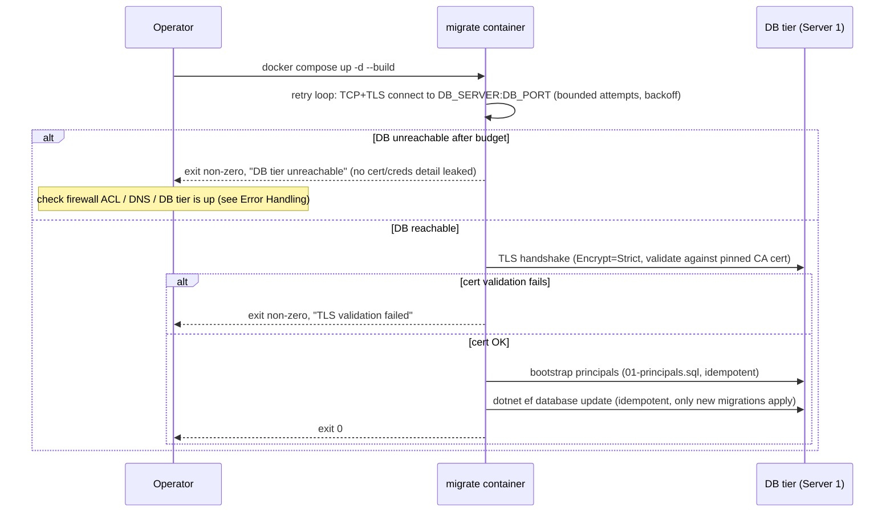
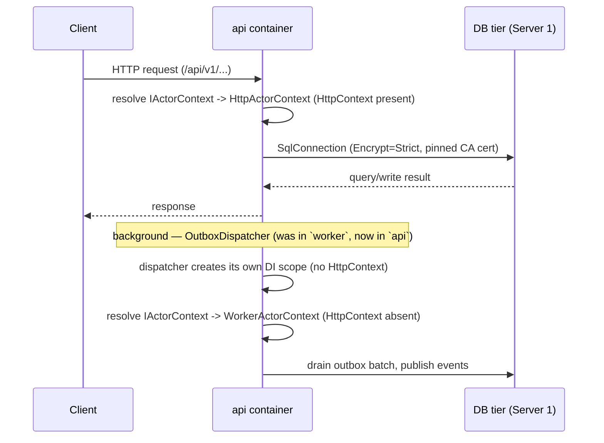

# Design: Multi-Tier Deployment (App tier / DB tier split, PCI-DSS L1)

> Status: approved 2026-07-22, amended 2026-07-22

## Scope note (from /spec-new answers)

This design replaces `docker-compose.prod.yml`'s current single-host topology
(API + Worker + SQL Server all on one Docker host) for **both** UAT and
production. It does **not** cover the Edge/DMZ tier (LB pair, keepalived VIP,
WAF) from the source diagram — that tier is owned by another team and is out
of scope here. It does **not** add the 3 Next.js web frontend containers
(admin/merchant/customer) as `services:` in this repo's compose files — those
apps live in separate repositories; pol-core only needs to keep serving as
their CORS origin target (`MERCHANT_USER_FRONTEND_ORIGIN`/
`ADMIN_FRONTEND_ORIGIN`, unchanged). The two things that change here are:

1. **Database tier moves to its own bare-VM host** (SQL Server 2025 Standard,
   not a Docker container) — the App tier connects to it remotely over
   TCP 1433 with real TLS certificate validation.
2. **Worker merges into the API process** — one deployable host, no separate
   `worker` container/image going forward.

## Architecture Overview

```
Database Tier (Server 1 — bare VM, no Docker)     Application Tier (Server 2 — Docker)
┌─────────────────────────────────┐                ┌───────────────────────────────────┐
│ SQL Server 2025 Standard        │  TCP 1433/TLS   │ migrate (one-shot container)       │
│  - bootstrap principals         │◄───────────────►│ api (long-running container,        │
│  - EF migrations applied here   │  firewall ACL   │      Worker's hosted services       │
│  - PCI-DSS L1 data-at-rest      │                 │      merged in — outbox dispatchers,│
│    control boundary             │                 │      session pruners)               │
└─────────────────────────────────┘                └───────────────────────────────────┘
```

Component responsibilities:

- **`migrate`** (unchanged role, changed connectivity): bootstraps DB
  principals (`pol_app`/`pol_admin`/`pol_worker`) and applies EF migrations
  against the *remote* DB tier, then exits 0. No longer waits on a
  same-Docker-network `sql` service; instead retries a real network+TLS
  connection to the DB tier host (see Error Handling Strategy).
- **`api`** (absorbs Worker): serves HTTP `/api/v1/*` + BFF OIDC sessions
  (unchanged) **and** now hosts the two outbox dispatcher `IHostedService`s
  (`MerchantRuntime` + `MerchantUsers`) that used to run in the separate
  `worker` container. One process, one image, one container per App-tier
  deploy.
- **DB tier host**: provisioned and TLS-certificate-issued by
  infra/DBA (out of scope for this repo's automation — this repo only
  consumes the resulting hostname/port/CA cert). SQL Server 2025 Standard,
  no Docker — a plain Windows/Linux install per infra's own runbook.

### Deleted from this topology

- `docker-compose.prod.yml`'s `sql` service (the in-compose SQL container).
- `docker-compose.prod.yml`'s `worker` service.
- `docker-compose.registry.yml`'s `worker` image override block.
- `src/Hosts/Worker/` as a standalone deployable (its Program.cs
  registrations move into `src/Hosts/Api/Program.cs`; see below for which
  files survive vs. become dead code).
- The GitLab CI `worker` image build/push step (`.gitlab-ci.yml` `package`
  job currently builds 3 images — drops to 2: `api`, `migrate`).

## Sequence Diagrams

### First deploy / migrate (App tier -> remote DB tier)



### Runtime — API (with merged Worker) against remote DB tier



## Data Models & Interfaces

### New/changed environment variables (`docker-compose.prod.yml`, `.env.prod.example`)

| Var | Before | After |
|---|---|---|
| `DB_SERVER` | literal `sql` (Docker-network service name) | real DB-tier hostname/IP (operator-supplied) |
| `DB_PORT` | *(none — implicit default port via service DNS)* | **new**, default `1433` |
| `DB_CA_CERTIFICATE_FILE` | *(none)* | **new** — path to mounted CA/server cert used for pinned validation (see Technology Decisions); non-empty = pinned `Encrypt=Strict` path, unset/empty = `Encrypt=True;TrustServerCertificate=False` (OS trust store) |

*(AN-1: an earlier draft had a `DB_TRUST_SERVER_CERTIFICATE` override knob —
removed. Trust mode is not operator-configurable; there is no env path to an
unvalidated connection. UAT with a self-signed cert pins it via
`DB_CA_CERTIFICATE_FILE` — pinning does not require a CA hierarchy.)*

`ConnectionStrings__Worker` (currently exported by `docker/entrypoint.sh`
alongside `ConnectionStrings__App`) is **deleted** — there is no more
standalone Worker process to consume it once merged.

### `docker/entrypoint.sh` — connection string assembly (changed)

Current (`docker/entrypoint.sh:16-20`):
```bash
CONN="Server=${DB_SERVER};Database=${DB_NAME};User Id=${DB_PRINCIPAL};Password=${DB_PW};Encrypt=True;TrustServerCertificate=True"
export ConnectionStrings__App="$CONN"
export ConnectionStrings__Worker="$CONN"
```

New shape:
```bash
: "${DB_PORT:=1433}"
if [ -n "${DB_CA_CERTIFICATE_FILE:-}" ]; then
  CONN="Server=${DB_SERVER},${DB_PORT};Database=${DB_NAME};User Id=${DB_PRINCIPAL};Password=${DB_PW};Encrypt=Strict;ServerCertificate=${DB_CA_CERTIFICATE_FILE};HostNameInCertificate=${DB_SERVER}"
else
  CONN="Server=${DB_SERVER},${DB_PORT};Database=${DB_NAME};User Id=${DB_PRINCIPAL};Password=${DB_PW};Encrypt=True;TrustServerCertificate=False"
fi
export ConnectionStrings__App="$CONN"
```
(`ConnectionStrings__Worker` line removed — dead once Worker host is gone.)

`docker/migrate-entrypoint.sh` gets the same `DB_PORT`/trust/cert wiring for
`POL_DESIGN_SQL`, plus a bounded retry loop (new) replacing the
`depends_on: sql: condition: service_healthy` gate that only worked for a
same-compose service:
```bash
: "${DB_CONNECT_RETRIES:=30}"
: "${DB_CONNECT_RETRY_DELAY_SECONDS:=5}"
for i in $(seq 1 "$DB_CONNECT_RETRIES"); do
  sqlcmd -S "${DB_SERVER},${DB_PORT}" -U sa -P "$MSSQL_SA_PASSWORD" -Q "SELECT 1" ${SQLCMD_TLS_FLAGS} && break
  [ "$i" -eq "$DB_CONNECT_RETRIES" ] && { echo "[migrate] DB tier unreachable after ${DB_CONNECT_RETRIES} attempts" >&2; exit 1; }
  sleep "$DB_CONNECT_RETRY_DELAY_SECONDS"
done
```
`SQLCMDINI`/trust-store detail for `sqlcmd`'s own TLS validation (as opposed
to the .NET connection string above) is a task-level detail — `sqlcmd`
doesn't take a `ServerCertificate=` pin the way `Microsoft.Data.SqlClient`
does, so the CA cert (PEM) gets installed into the `migrate` container's OS
trust store at RUNTIME by `migrate-entrypoint.sh` (the migrate stage runs as
root) from the mounted `db_ca_cert` secret, so `sqlcmd -N` (encrypt, no `-C`
blind-trust flag) validates correctly. (Amended from the original build-time
`RUN update-ca-certificates` design during the PR #129 Codex round: images
are built in CI where the operator's CA secret does not exist, and deploys
pull with `--no-build`, so a build-time install can never see the cert.)

### `docker-compose.prod.yml` — service shape after this change

- `sql` service: **deleted**.
- `migrate`: env gains `DB_PORT`/`DB_CA_CERTIFICATE_FILE`; `depends_on:
  sql: ...` removed (no local `sql` service to depend on — replaced by the
  retry loop above).
- `api`: same env additions; still `depends_on: migrate: service_completed_successfully`
  (unchanged — same-host ordering is still valid, only the DB hop changed).
  Also gains the two `AddHostedService` registrations formerly in `worker`
  (in-process now, not a compose-level change).
- `worker`: **deleted**.
- `secrets:` block gains `db_ca_cert` (mounted read-only, referenced by
  `DB_CA_CERTIFICATE_FILE`).

`docker-compose.registry.yml`: `worker:` image override block deleted;
`migrate`/`api` remain.

**Filename kept as `docker-compose.prod.yml`** (not renamed to something like
`docker-compose.app-tier.yml`) — it already only ever ran the App-tier
services; the DB was coincidentally same-host before, not something this
file's name promised. Renaming would touch every CI/runbook reference for a
cosmetic gain only.

### `src/Hosts/Api/Program.cs` — composition-root merge (module/interface level)

Two Worker-only pieces move in as-is:

```csharp
services.AddMerchantRuntimePersistence(...).AddMerchantRuntimeOutboxDispatcher();
services.AddMerchantUserPersistence(...).AddMerchantUserOutboxDispatcher();
```
placed alongside the existing `AddHostedService<UserSessionPruneService>()` /
`AddHostedService<SessionPruneService>()` calls (`Program.cs:195,223`) — same
pattern, one more pair of background services in the same host.

**The one real design decision: `IActorContext` (and `IWriteAuthorizer`) must
resolve differently depending on whether the current DI scope is an HTTP
request or a background-dispatcher-created scope.** Api today registers only
`AddScoped<IActorContext, HttpActorContext>()` (`Program.cs:206`); Worker
today registers only `AddScoped<IActorContext, WorkerActorContext>()`
(`Worker/Program.cs:68`). Both can't be the single scoped registration once
merged.

Resolution: use the framework primitive already present in every ASP.NET Core
Web host (`IHttpContextAccessor`, already registered) as the discriminator —
no new interface needed:

```csharp
services.AddScoped<HttpActorContext>();
services.AddScoped<WorkerActorContext>();
services.AddScoped<IActorContext>(sp =>
    sp.GetRequiredService<IHttpContextAccessor>().HttpContext is not null
        ? sp.GetRequiredService<HttpActorContext>()
        : sp.GetRequiredService<WorkerActorContext>());
```
HTTP request scopes always have an `HttpContext` (set by Kestrel/middleware
before user code runs); scopes the `OutboxDispatcher` creates for background
batches never do. Same pattern for `IWriteAuthorizer`, folding
`WorkerWriteAuthorizer` in as the background-scope branch alongside the
existing `MerchantRequestWriteAuthorizer`/`ControlPlaneAdminWriteAuthorizer`
selection logic (`Api/Persistence/WriteAuthorizers.cs`,
`Program.cs:155-159`).

This is the highest-risk part of this design — it sits directly on the
`GuardedRuntimeDbContext`/`IWriteAuthorizer` security boundary
(see `ARCHITECTURE.md`'s multi-merchant isolation floor). Flagging explicitly
for reviewer attention before `/spec-requirements`.

Files that move from `src/Hosts/Worker/` into `src/Hosts/Api/` (new folder,
e.g. `src/Hosts/Api/BackgroundDispatch/`): `WorkerActorContext.cs`,
`WorkerWriteAuthorizer.cs`. Class names kept as-is for this design (minimal
diff) — a rename (e.g. `BackgroundDispatchActorContext`) is a fine follow-up
but not required by this change; flagging as an open option for the reviewer
rather than deciding it here.

Files that become **dead code, deleted** (Api already has real
implementations of everything these stub out): the `Unsupported*`
singletons for `IRoleStore`/`IProvisioningWriter`/`IRoleAssignmentCounter`/
`IRoleAuditSink`/keyed `"admin"` `IUnitOfWork`
(`Worker/UnsupportedControlPlanePorts.cs`), Worker's own
`AddReadinessHealthChecks`/`MapPolHealthChecks` calls (Api's own calls at
`Program.cs:350,462` already cover the merged process), and
`WorkerModuleAssemblies.cs` **if** Api's `HostModuleAssemblies.All`
(`Program.cs:121`) is confirmed a superset (needs a diff pass — flagged as a
task-level verification item, not re-derived here).

The entire `src/Hosts/Worker/` project is deleted once the above lands
(`Worker.csproj`, its `appsettings*.json`, its Dockerfile build-arg
invocations in CI/compose).

## Technology Decisions

- **TLS to DB tier: `Encrypt=Strict` with a pinned CA/server certificate
  file, not OS-trust-store installation.** Rationale: the API/migrate
  containers run as non-root (`appuser`, set in the shared `Dockerfile`);
  installing a CA cert into the OS trust store requires a root build step
  and a rebuild on every cert rotation. `Microsoft.Data.SqlClient`'s
  `Encrypt=Strict` (TDS 8.0) + `ServerCertificate=` connection-string parameter
  validates against an explicitly pinned cert file mounted as a secret —
  rotates by swapping the mounted file + container restart, no image
  rebuild. **Verify in tasks phase**: confirm the `Microsoft.Data.SqlClient`
  version already referenced by this repo supports `Encrypt=Strict` (TDS 8.0,
  added in relatively recent SqlClient releases) before committing to this
  path; fallback is standard `Encrypt=True;TrustServerCertificate=False` with
  the CA cert installed into the OS trust store at Docker build time
  (root `RUN update-ca-certificates` step before the final `USER appuser`
  switch) — functionally equivalent, costs a rebuild per rotation.
  `sqlcmd` (used only by `migrate` for the one-shot bootstrap script, not by
  the running API) doesn't support the `Certificate=` pin either way, so the
  `migrate` image's OS trust store install is needed regardless of which
  path the API takes.
- **DB tier is out of this repo's automation.** SQL Server 2025 Standard on
  a bare VM is provisioned, certificate-issued, and firewalled by
  infra/DBA per their own process — this repo only consumes
  `DB_SERVER`/`DB_PORT`/the CA cert file as inputs. No Ansible/Terraform for
  the DB tier is written as part of this spec.
- **Worker's hosted services move in-process rather than becoming a
  separate deployment unit that talks to the API over a network boundary.**
  Simpler (no new RPC/queue interface needed, no new failure mode between
  API and "worker-as-a-service"), and the user's answer to the /spec-new
  clarifying questions was explicit on this point.
- **Bounded retry loop over `depends_on`** for `migrate` waiting on the DB
  tier, because Compose's `depends_on: condition: service_healthy` only
  works for services defined in the same Compose project — it cannot gate on
  a healthcheck of a host outside Docker entirely.

## Error Handling Strategy

- **DB tier unreachable at migrate time** (network/firewall ACL not open
  yet, DNS wrong, DB tier down): bounded retry loop (default 30 attempts,
  5s apart = 2.5 min budget) then `migrate` exits non-zero. `docker compose
  ps` shows `migrate` as `Exited (1)`, not `(0)` — this is the signal
  operators already check per the existing self-host runbook's verify step,
  so no new tooling needed, just a new failure mode on the same check.
  (This mirrors the real Imperva/firewall diagnosis done earlier for the
  GitLab mirror push — cross-tier network failures should fail loud and
  bounded, never hang silently.)
- **TLS certificate validation failure** (cert expired, wrong CA pinned,
  hostname mismatch): surfaces as a `SqlException` wrapping the TLS
  handshake failure. Split by audience (AN-2): **externally-served
  responses** (`/health/ready`) stay generic — no certificate/chain detail
  echoed, consistent with `AppDbReadinessCheck`'s existing pattern
  (`HealthChecks.cs:34-36`); **container logs** (migrate + api, operator-only)
  DO distinguish network-unreachable from TLS-validation failure — the
  distinction is the primary cross-tier diagnostic signal (same lesson as
  the Imperva 401-vs-403 mirror diagnosis). At runtime the failure surfaces
  through `/health/ready` going `Unhealthy` — no behavior change needed in
  `AppDbReadinessCheck` itself.
- **CA cert rotation on the DB tier side**: not automated by this design —
  operator swaps the mounted `db_ca_cert` secret file and restarts
  `api`/`migrate`. Documented as an operational runbook step (follow-up to
  this spec, not code).
- **Background-scope `IActorContext`/`IWriteAuthorizer` misresolution**
  (e.g. `IHttpContextAccessor.HttpContext` unexpectedly non-null inside a
  dispatcher-created scope, or vice versa): would silently authorize a
  background write as if it were a specific HTTP actor, or reject a
  legitimate background write — this is exactly why it's called out as the
  highest-risk item above. Mitigation: an explicit composition-root test
  (see Testing Strategy) rather than relying on manual review alone.

## Testing Strategy

(REQ IDs backfilled by `/spec-requirements` — see
[requirements.md](requirements.md) and the Requirement Traceability table
below.)

- **"Composition-root merge" (Data Models & Interfaces > Program.cs) — REQ-5.1, REQ-5.2, REQ-5.4, REQ-5.5**: a
  test that resolves `IActorContext` from (a) a scope created inside a
  simulated HTTP request (HttpContext present) and (b) a scope created
  directly via `IServiceScopeFactory` with no HttpContext — asserts (a)
  yields `HttpActorContext` behavior and (b) yields `WorkerActorContext`
  behavior. Same shape for `IWriteAuthorizer`. This is the one test that
  must exist before this spec's tasks are considered done — it directly
  protects the security-boundary risk flagged above.
- **Pre-existing prune services under the new discriminator — REQ-5.6 (AN-4)**:
  `SessionPruneService`/`UserSessionPruneService` already create background
  scopes (`CreateScope`, no HttpContext) and their deletes pass through
  guarded contexts — post-merge they resolve the background branch. A test
  SHALL verify their prune writes still succeed under
  `WorkerActorContext`/background-authorizer resolution (behavior change
  from today's `HttpActorContext`-with-null-HttpContext resolution).
- **"migrate retry loop" (Error Handling > DB tier unreachable) — REQ-3.1, REQ-3.2**: an
  integration-style test (or a bash-level test of `migrate-entrypoint.sh`
  itself) pointing `DB_SERVER` at an unreachable host/port and asserting the
  script exits non-zero within a bounded time (not hanging), with the
  configured attempt count actually attempted.
- **"connection string assembly" (Data Models & Interfaces >
  entrypoint.sh) — REQ-2.2, REQ-2.3, REQ-2.4**: a script-level test asserting a
  non-empty `DB_CA_CERTIFICATE_FILE` produces the `Encrypt=Strict;ServerCertificate=...`
  form, and the unset/empty path produces
  `Encrypt=True;TrustServerCertificate=False` — and that no input can
  produce `TrustServerCertificate=True`.
- **Real TLS validation against the actual DB tier — REQ-2.5, REQ-2.6** cannot be fully
  automated in CI (no real cert available there) — this is called out as a
  manual verification step for the runbook/tasks phase, done once against
  the real Server 1 host during first UAT deploy.
- Existing `Architecture.Tests`/`Hosts.Tests` suites are otherwise
  unaffected — no module/domain boundary changes, only host composition and
  deployment topology.

## Requirement Traceability

| Design element | REQ(s) satisfied |
|---|---|
| `DB_SERVER`/`DB_PORT` env vars, connection string `Server=` value | REQ-1.1, REQ-1.2, REQ-1.3 |
| `migrate` `depends_on: sql` removed, no local DB container | REQ-1.4 |
| Compose filename kept as `docker-compose.prod.yml` | REQ-1.5 |
| `Encrypt=Strict` + `Certificate=` path (entrypoint.sh) | REQ-2.2, REQ-2.7 (migrate image CA trust-store install) |
| `Encrypt=True;TrustServerCertificate=False` hardcoded fallback path (no override knob) | REQ-2.3, REQ-2.4 |
| No `TrustServerCertificate=True` left in prod compose | REQ-2.1, REQ-7.1 |
| TLS failure = fail closed, generic error message | REQ-2.5, REQ-2.6 |
| `migrate` bounded retry loop (default 30 × 5s) | REQ-3.1, REQ-3.3 |
| Retry exhaustion = exit non-zero | REQ-3.2 |
| Bootstrap + EF migration idempotency (unchanged) | REQ-3.4 |
| `AddMerchantRuntimeOutboxDispatcher()`/`AddMerchantUserOutboxDispatcher()` moved into Api `Program.cs` | REQ-4.1, REQ-4.2 |
| `worker` service/image deleted from compose + CI | REQ-4.3, REQ-4.4, REQ-6.3, REQ-6.4 |
| `src/Hosts/Worker/` project + dead-code stub ports removed | REQ-4.5 |
| `WorkerModuleAssemblies.cs` subset-verify-then-delete | REQ-4.6 |
| `IActorContext` factory keyed on `IHttpContextAccessor.HttpContext` | REQ-5.1, REQ-5.2, REQ-5.3 |
| Same discriminator applied to `IWriteAuthorizer` | REQ-5.4 |
| Composition-root test protecting the HTTP/background boundary | REQ-5.5 |
| `sql` service deleted from `docker-compose.prod.yml` | REQ-6.1 |
| `db_ca_cert` secret added to compose `secrets:` block | REQ-6.2 |
| PCI-DSS L1 non-functional constraint (no unvalidated fallback) | REQ-7.1 |
| CA cert file handled like existing `./secrets/*` | REQ-7.2 |
| DB/Edge HA explicitly out of scope, documented ceiling | REQ-7.3 |
| `AppDbReadinessCheck` unchanged, surfaces failures via `/health/ready` | REQ-7.4 |
| Container logs distinguish network vs TLS failure (Error Handling, AN-2) | REQ-2.6 |
| `sa` precondition on DB tier stated in runbook (AN-6) | REQ-3.5 |
| Outbox per-row lease (`READPAST+UPDLOCK+ROWLOCK`) preserved (AN-5) | REQ-4.7 |
| Prune services resolve background branch, tested (AN-4) | REQ-5.6 |
| Runbook/reference docs updated to two-tier topology (AN-7) | REQ-8.1, REQ-8.2, REQ-8.3 |
| Local-dev docs/settings explicitly untouched (AN-7) | REQ-8.4 |

## Non-Functional Considerations

(Design-First required section — the constraints that motivated choosing
Design-First over Requirements-First for this spec.)

- **PCI-DSS L1 — encryption in transit is not optional.** The whole point of
  this spec is replacing `TrustServerCertificate=True` (accepts any
  certificate, including a MITM'd one) with real validation. Any fallback
  path that silently re-accepts unvalidated certs would defeat the
  compliance purpose of splitting the DB onto its own network segment in
  the first place — there is deliberately no "trust everything" default
  left in the new `docker-compose.prod.yml` (unlike the dev-oriented
  `.env.example`/local paths, which are unaffected by this spec and keep
  their existing simpler trust settings).
- **Network segmentation changes failure semantics.** App tier and DB tier
  are now separated by a firewall ACL (per the source diagram). A
  misconfigured ACL must produce a clear, bounded, loud failure
  (`migrate` exits non-zero fast) — not a silent hang or a fallback to some
  degraded local mode. There is no local mode to fall back to anymore.
- **Availability ceiling, explicitly accepted**: the source diagram shows one
  DB tier server (Standard Edition, no replica/AG). This design does not
  add DB high availability — it's out of scope, same as the existing
  self-host runbook's stated ceiling ("ไม่ครอบ: HA / SQL replica / backup
  อัตโนมัติ"). If HA is needed later, it's a separate spec.
  Similarly, the source diagram's Edge/DMZ tier (LB pair with automatic
  failover) is explicitly out of scope per the /spec-new answers.
  Consequence worth naming: right now there is only one App tier server and
  one DB tier server in scope for this spec, so **this design does not by
  itself deliver the diagram's overall HA promise** — it only delivers the
  App-tier/DB-tier network+trust split. That gap is expected, not a defect
  of this design.
- **Latency**: DB round-trips that used to be same-host/loopback now cross a
  real network hop + firewall + TLS handshake overhead. `AppDbReadinessCheck`'s
  timeout (unchanged by this design) may need re-tuning once real Server-1
  latency is measured — flagged as a task-level tuning item, not a design
  change here (no timeout value changes without a real measurement to base
  it on).
- **Secret handling for the new CA cert file**: same discipline as existing
  `./secrets/*` (gitignored, `chmod 600`, never committed) — this spec adds
  exactly one more file to that existing convention, no new secret-handling
  mechanism.
