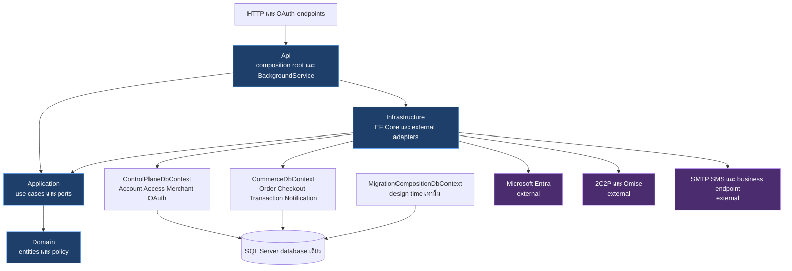
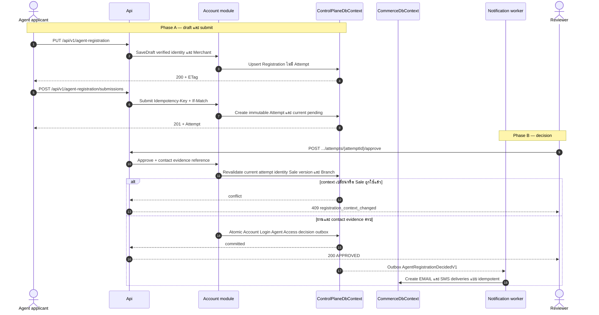
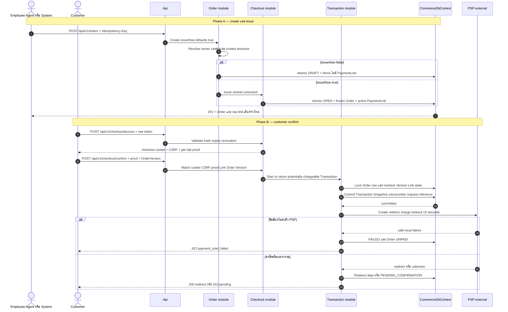
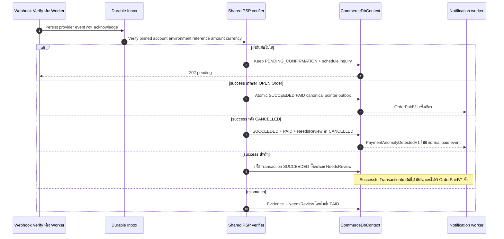
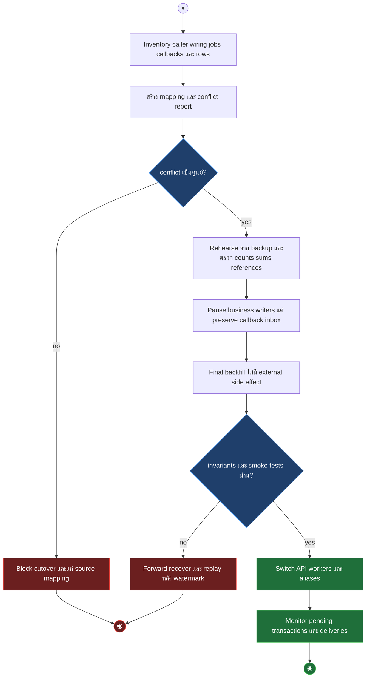
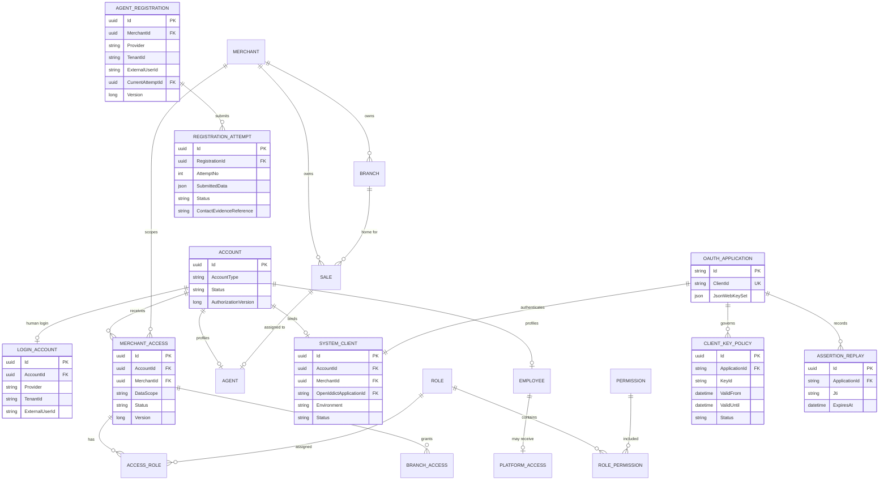
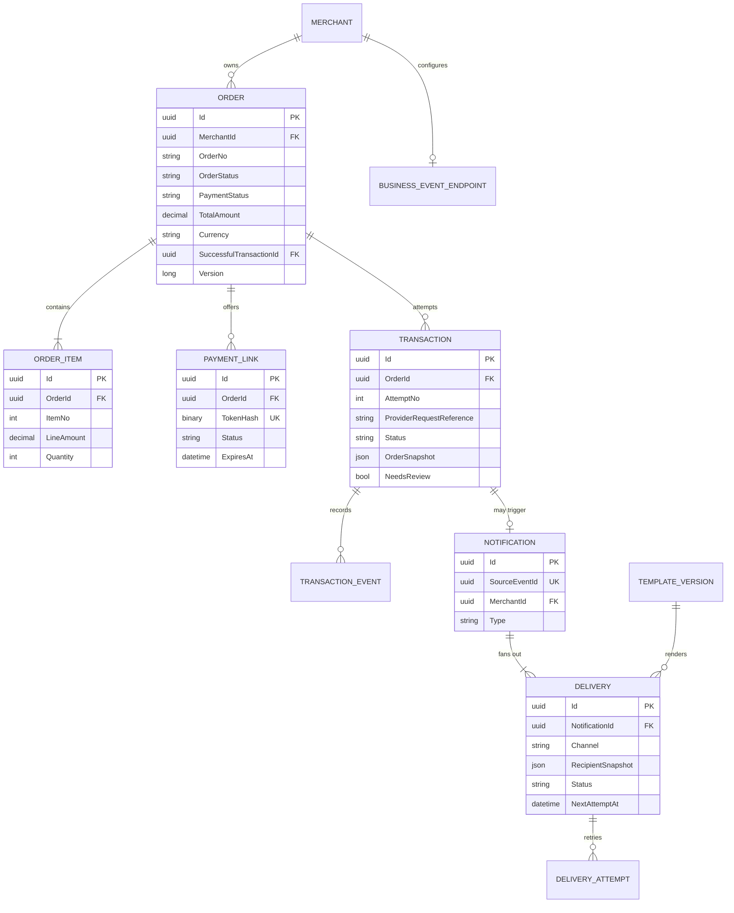

# Design: รื้อ POL Platform รุ่นแรกสำหรับทีมเล็ก

> Status: approved 2026-09-09
>
> Sources: `requirements.md`, `api-scope.json`, `docs/proposals/payment-platform-redesign-2026-09-08/latest-blueprint.md`, `docs/proposals/payment-platform-redesign-2026-09-08/latest-source-review.md`, `pol-platform-latest/04-data-model-and-migration.md`

เอกสารนี้กำหนดแบบเดียวสำหรับ 111 APIs ใน v1 และ 5 APIs ที่ defer โดยคง 7 business modules ภายใน 4 source projects, 2 runtime contexts และ database เดียว ไม่มี `Payment` aggregate หรือ runtime store ชุดที่สาม

## Architecture Overview

### Target topology

| Project | หน้าที่ | Dependency ที่อนุญาต |
|---|---|---|
| `Domain` | 7 module folders, entity, value object, state transition และ policy บริสุทธิ์ | .NET BCL เท่านั้น |
| `Application` | command/query handler, authorization policy, transaction boundary และ external port | `Domain` |
| `Infrastructure` | EF Core mappings, OAuth store, secret protection, PSP/notification adapters และ workers | `Application`, `Domain` |
| `Api` | route จาก `api-scope.json`, middleware, OAuth/OIDC host, DI และ hosted services | `Application`, `Infrastructure` |

`UnitTests`, `ArchitectureTests` และ `IntegrationTests` เป็น test projects ทั้งหมดของ target ไม่สร้าง test project ต่อ module โครงสร้างปัจจุบันที่มีหลาย module projects เป็น migration source ตาม `latest-blueprint.md:136-145` ไม่ใช่ target ที่ต้องรักษา

### Module ownership

| Module | เป็นเจ้าของการเขียน | Contract ข้าม module |
|---|---|---|
| Account | Account, profile, LoginAccount, SystemClient binding, BFF ticket, Registration และ Attempt | stable `AccountId`, registration decision event |
| Access | Permission, Role, MerchantAccess, AccessRole, BranchAccess และ PlatformAccess | `IAccessEvaluator`, authorization version bump |
| Merchant | Merchant, Branch, Sale, Provider catalog/account, CredentialVersion และ PaymentSettingRequest | immutable IDs และ pinned provider configuration |
| Order | Order, OrderItem, `OrderStatus`, `PaymentStatus` และ canonical successful transaction pointer | issued order view, verified transaction result |
| Checkout | PaymentLink และ proof/capability coordination | issue/revoke link, confirm request |
| Transaction | Transaction, TransactionEvent, OrderSnapshot, PSP initiation และ verification | `VerifiedTransactionResult` |
| Notification | Notification, Delivery, DeliveryAttempt, TemplateVersion และ BusinessEventEndpoint | consumes outbox events, never changes source decision |

Platform Core owns audit, idempotency, inbox, outbox, clock, correlation และ Problem Details เท่านั้น ไม่มี business aggregate เพิ่ม กลไกข้าม module เรียกผ่าน Application contracts ใน process เดียว ไม่อ้าง Domain type ของ module อื่นโดยตรง

### Persistence and atomic boundaries

`ControlPlaneDbContext` owns Account, Access, Merchant, OpenIddict และ control-plane outbox. `CommerceDbContext` owns Order, Checkout, Transaction, Notification และ commerce outbox/inbox. ทั้งคู่ใช้ connection string และ database เดียว แต่ handler หนึ่งตัวเขียนผ่าน context เจ้าของ transaction เดียวเท่านั้น

`MigrationCompositionDbContext` รวม mapping ของทั้งสอง runtime contexts และ OpenIddict เพื่อสร้าง migration เดียว แต่ไม่ลงทะเบียนใน runtime DI. แต่ละ entity มี `IEntityTypeConfiguration<T>` ชุดเดียวใน `Infrastructure`; runtime context และ migration composition เรียก mapping ชุดเดียวกัน จึงไม่มีการคัดลอก column, index หรือ constraint แบบที่พบใน `ControlPlaneDbContext` และ `MerchantRuntimeDbContext` ปัจจุบัน

Mutation ที่มี Account ใช้ `AuthorizationLease.VerifyAsync` ตรวจ Account/Client/Access status และ `AuthorizationVersion` ซ้ำภายใน transaction เดียวกับ business write Control-plane handler ใช้ entity/concurrency token ใน `ControlPlaneDbContext`; Commerce handler ใช้ narrow port ที่อ่านและ lock metadata ตารางเดิมผ่าน connection/transaction ของ `CommerceDbContext` โดยไม่สร้าง store สำเนา ถ้า revoke commit ก่อนจะพบ version mismatch ถ้า revoke มาทีหลังต้องรอ business transaction จบตามลำดับเดียวกัน

| Use case | Atomic commit | งานหลัง commit |
|---|---|---|
| Employee JIT | Account, Employee, LoginAccount, auth audit | ไม่มี Access อัตโนมัติ |
| Registration approve | decision, Account, LoginAccount, Agent, initial MerchantAccess/roles, control outbox | materialize Email/SMS deliveries |
| Registration reject | decision, public reason, control outbox | materialize Email/SMS deliveries |
| Create/issue Order | Order, Items, freeze, PaymentLink, idempotency result, commerce outbox | ส่งลิงก์เมื่อร้องขอ |
| Confirm Checkout | Transaction, OrderSnapshot, Order `PROCESSING`, idempotency result | เรียก PSP ด้วย reference เดิม |
| Apply verified result | Transaction/Event, Order payment fields, audit, commerce outbox | Notification และ business webhook |

Outbox consumer ใช้ `SourceEventId` เป็น inbox key เมื่อสร้าง Notification จึงรักษาความเป็น atomic ที่ต้นทางและไม่ต้องเปิด transaction ข้าม contexts

### Scope and migration boundary

รุ่นแรกเป็น maintenance cutover เดียว ไม่มี rolling dual writer ลำดับบังคับคือ inventory, deterministic mapping, dry-run report, rehearsal จาก backup, pause business writers, final backfill, verify invariants, switch routes/workers แล้วเฝ้าระวัง PSP callbacks. เนื่องจาก environment นี้ไม่มี sanitized backup ที่ได้รับอนุมัติ การทดสอบ local ของ Task 9 ใช้ synthetic backup ที่สร้างและ restore เข้า isolated SQL เพื่อพิสูจน์ machinery เท่านั้น; ผลนี้ไม่ใช่หลักฐาน dataset readiness หรือ production cutover readiness.

- ระหว่าง pause ยังรับ callback เข้า durable recovery inbox หรือคิวหน้าระบบ และ replay หลัง target พร้อม ห้ามทิ้งผลเงินจริง
- Backfill ไม่เรียก PSP, ไม่สร้าง charge, ไม่ส่ง Email/SMS/business event และติด `MigrationProvenance`
- `Order.Id` คงเดิม และ `Payments.Session.Id` เป็น `Transaction.Id`; collision หรือ reference ที่พิสูจน์ไม่ได้สร้าง conflict แล้ว block cutover
- `LegacyIdentityMap` ใช้ `(LegacyKind, LegacyId) -> AccountId`; ห้าม map จาก email หรือ display name
- Pending/Rejected user กลายเป็น Registration/Attempt ส่วน active human กลายเป็น Account จาก identity evidence ที่มีจริง
- Human sessions เดิมถูก revoke และให้ login ใหม่ ไม่ย้าย credential หรือสร้าง refresh token ปลอม
- Customer link aliases และ provider callback aliases resolve เข้ารหัสใหม่จน inventory ยืนยันว่า reference หมดอายุ จึงถอดได้
- Rollback เป็น forward recovery: หยุด writer ใหม่, รักษา target database, replay callback/events หลัง watermark แล้วสลับ route ที่พิสูจน์แล้ว ห้าม restore backup ทับข้อมูลหลัง cutover

## Sequence Diagrams

### Registration submit and decision

Registration unique ด้วย `(Provider, TenantId, ExternalUserId)` สำหรับ Agent หนึ่ง identity เท่านั้น `MerchantId` ถูกตรึงเมื่อสร้าง case หาก context ต่อมาคนละ Merchant ให้ `409 registration_merchant_mismatch` การแก้ draft ไม่สร้าง Attempt; draft เริ่ม `CurrentAttemptNo = 0` และ Submit เท่านั้นที่สร้าง snapshot ใหม่

รุ่นแรกไม่มี OTP Reviewer ต้องยืนยัน contact snapshot กับ official business record แล้วบันทึก `ContactEvidenceReference`, `ContactVerifiedByAccountId` และ `ContactVerifiedAt` บน Attempt ก่อน approve การผ่าน format validation อย่างเดียวไม่ถือว่ายืนยันเจ้าของ contact

### Create, issue and confirm payment

การ replay ด้วย Idempotency-Key และ request hash เดิมคืนผลเดิมก่อนตรวจ state ปัจจุบัน ส่วนคำขอ issue ใหม่บน `OPEN` ตอบ `409 order_already_issued` การออกลิงก์ใหม่ใช้ API-087 และ revoke active link เดิมใน commit เดียว

### Apply verified result and anomalies

### Maintenance cutover activity

## Data Models & Interfaces

### Identity, access and merchant model

OpenIddict เป็นเจ้าของ `OpenIddictApplications`, `OpenIddictAuthorizations`, `OpenIddictScopes` และ `OpenIddictTokens` ใน schema `oauth`. Public keys อยู่ที่ `OpenIddictApplication.JsonWebKeySet`; `ClientKeyPolicy` เก็บเพียง validity/status/algorithm metadata และ audit reference ไม่เก็บ public key ซ้ำ APIs 026-028 เปลี่ยน JWK set กับ policy metadata ใน transaction เดียวผ่าน project manager ของ OpenIddict

Physical schema ใช้ `acct`, `access`, `merch`, `ord`, `checkout`, `txn`, `notify`, `platform` และ `oauth` ตาม owner ตารางเดียวไม่ถูก map ซ้ำต่าง schema

| Constraint | กติกา physical model |
|---|---|
| Human identity | unique `(Provider, TenantId, ExternalUserId)` และห้าม unique email |
| Agent registration | unique `(Provider, TenantId, ExternalUserId)`; `MerchantId` immutable |
| Agent to Sale | unique `Agent.SaleId`; Sale และ Agent อยู่ Merchant เดียวกัน |
| MerchantAccess | filtered unique `(AccountId, MerchantId)` เมื่อ `Status = ACTIVE` |
| BranchAccess/Role | FK ต้องย้อนถึง Merchant เดียวกับ Access; ตรวจซ้ำใน write guard |
| PlatformAccess | `EmployeeAccountId` non-null และ unique ไม่มี null Merchant wildcard |
| System client | unique `AccountId`, unique OpenIddict application, Merchant/environment immutable |
| Assertion replay | unique `(ApplicationId, Jti)` และลบหลัง `ExpiresAt + ClockSkew` |

| Entity ที่ไม่ได้ขยายใน ERD | Field set บังคับ |
|---|---|
| `BffSessionTicket` | `TicketKeyHash`, Account/Client IDs, protected authentication ticket, issued/expires/revoked timestamps; ไม่มี raw-token column |
| `PlatformAccessRole` | PlatformAccess/Role IDs; Role ต้องเป็น Platform และ target ต้องเป็น Employee |
| `SystemClientScope` | SystemClient ID + registered scope code; เป็น source สำหรับ scope ที่ OAuth token ออกได้ |
| `MerchantAccessMethod` | MerchantAccess ID + verified method code; intersect กับ SystemClient scope/capability |
| `ProviderAccount` | Merchant/Provider IDs, environment, status, configuration version และ masked metadata |
| `CredentialVersion` | ProviderAccount ID, protected-store reference, key ID, validity/status; ไม่มี plaintext secret |
| `PaymentSettingRequest` | Merchant ID, base/proposed version, proposed config, maker/checker, status, reason และ timestamps |
| `LegacyIdentityMap` | LegacyKind/LegacyId unique, AccountId, evidence reference และ migrated timestamp |
| `MigrationConflict` | run ID, entity kind/key, stable reason code, safe details และ resolution status; unresolved row blocks cutover |

### Access evaluation

ทุก authenticated request ตรวจ Account/Client active, token entry และ `AuthorizationVersion` แล้วใช้ endpoint class ตามตาราง Token context: account-self ตรวจเจ้าของบัญชี, platform ตรวจ PlatformAccess/permission, merchant ตรวจ MerchantAccess/permission/scope และ ownership การขาด context ที่ class นั้นต้องใช้ปฏิเสธแบบ deny-default

| Actor/DataScope | Order predicate |
|---|---|
| Agent `SELF` | `Order.OwnerSaleId == Agent.SaleId` ภายใน Merchant |
| Agent `BRANCH` | current Home Branch ของ Sale เท่ากับ `Order.OwnerBranchIdAtCreation` |
| Agent `ASSIGNED_BRANCHES` | `OwnerBranchIdAtCreation` อยู่ใน current Home Branch หรือ active BranchAccess |
| Employee `BRANCH` | ต้องมี BranchAccess ที่เลือกชัดหนึ่งรายการ แล้วเทียบ snapshot |
| Employee `ASSIGNED_BRANCHES` | snapshot อยู่ใน active BranchAccess ของ Access นั้น |
| Employee/Agent `MERCHANT` | Merchant ตรง Access |
| SYSTEM | ต้องมี active MerchantAccess และ OAuth scope ชัด; `SELF` ถูกปฏิเสธ |

Employee และ SYSTEM ไม่รับ `SELF`; Employee `BRANCH` ที่ไม่ได้ระบุ BranchAccess หนึ่งรายการถูกปฏิเสธ Agent/SYSTEM ไม่ได้รับ PlatformAccess การเปลี่ยน permission, role, Access, Account หรือ Client bump authorization version และ API ตรวจค่าปัจจุบันจาก database ทุก request

### Commerce model

| Invariant | Constraint/guard |
|---|---|
| Order items | อย่างน้อย 1 item, unique `(OrderId, ItemNo)`, `Quantity >= 1` |
| Money | `decimal(19,4)`, JSON เป็น decimal string, currency เดียว, `Subtotal = SUM(LineAmount)`, `Total = Subtotal - OrderDiscount + OrderCharge` |
| Price authority | trusted product/upstream contract หรือ server policy เท่านั้น ไม่มี PSP fee/tax engine และไม่รับราคาจาก customer browser |
| PaymentLink | token เก็บ keyed hash, active link ต่อ Order ไม่เกินหนึ่งด้วย filtered unique index |
| Transaction | unique `(OrderId, AttemptNo)` และ provider reference scoped ด้วย ProviderAccount/environment |
| Charge guard | `OrderSerializationGate` + filtered unique ต่อ Order สำหรับ `CREATED` และ `PENDING_CONFIRMATION` |
| Success evidence | ไม่มี unique-success constraint เก็บ success จริงทุกแถว; canonical pointer set ครั้งแรกและไม่เปลี่ยนจาก duplicate |
| Notification dedupe | unique `SourceEventId`; Delivery unique `(NotificationId, Channel, RecipientFingerprint)` |

`Transaction` ต้องมี Merchant/Order IDs, number/attempt, amount/currency, payment method, ProviderAccount/environment/CredentialVersion, provider request/reference, redirect URL, status/provider status, OrderSnapshot, safe provider metadata, NeedsReview, version และ timestamps `TransactionEvent` เก็บ source, event/reference, occurred/received timestamps และ safe details แบบ append-only

Platform tables ใช้ `IdempotencyRecord` สำหรับ scoped key/request hash/protected result, `OutboxMessage` สำหรับ event/payload/attempt/lease, `InboxMessage` สำหรับ source/message dedupe และ `AuditRecord` สำหรับ privileged mutation Mapping ชุดเดียวถูกนำเข้า runtime context ที่ต้องใช้ ไม่สร้าง business owner เพิ่ม

`OrderSnapshot` มี `schemaVersion`, `provenance`, `capturedAt`, Order ID/version, Merchant, creator/owner IDs และ code snapshots, BusinessType, currency/amount breakdown และ item snapshots ข้อมูลที่ไม่จำเป็นต่อการพิสูจน์การจ่ายไม่ถูกคัดลอก `provenance` ใช้ `CAPTURED_AT_CONFIRM` หรือ `MIGRATION_BACKFILL`

### State and cancellation contracts

`OrderStatus` มี `DRAFT`, `OPEN`, `CANCELLED`; `PaymentStatus` มี `UNPAID`, `PROCESSING`, `PAID` และแยกจากกัน `TransactionStatus` มี `CREATED`, `PENDING_CONFIRMATION`, `SUCCEEDED`, `FAILED`, `CANCELLED`, `EXPIRED` โดย `CREATED` และ `PENDING_CONFIRMATION` ถือว่ายัง potentially chargeable `FAILED`, `CANCELLED` หรือ `EXPIRED` ใช้ได้ต่อเมื่อ provider evidence หรือ transport evidence ยืนยันว่าไม่มี charge และจะไม่มี late capture; ผลกำกวมต้องคง `PENDING_CONFIRMATION`

`SUCCEEDED` เป็น absorbing financial state Event เก่าที่รายงาน pending/fail/cancel/expire ถูก append เป็น TransactionEvent แต่ห้าม downgrade Transaction หรือ Order Result reducer ทุกทางใช้กฎเดียวกันและไม่ตัดสินจากลำดับเวลาที่รับ event อย่างเดียว

เมื่อ verified result เปลี่ยน Transaction เป็น `FAILED`, `CANCELLED` หรือ `EXPIRED` ให้ reducer ตรวจทุก Transaction ของ Order ภายใต้ lock เดียวกัน หากไม่มี verified success และไม่มี potentially-chargeable Transaction เหลือ ให้เปลี่ยน `PaymentStatus` จาก `PROCESSING` เป็น `UNPAID` ใน commit เดียวกัน ถ้ายังมี pending ให้คง `PROCESSING` และห้ามลด `PAID` ไม่ว่ามี event เก่าเข้ามาหรือไม่

| Current state | Cancel result |
|---|---|
| `CANCELLED` | `200` คืนผลเดิม |
| `PAID` หรือมี verified success | `409 order_already_paid` ไม่สร้าง refund/void |
| `DRAFT/UNPAID` ไม่มี potentially chargeable transaction | atomic `CANCELLED` และ revoke links ที่อาจมี |
| `OPEN/UNPAID` ไม่มี potentially chargeable transaction | atomic `CANCELLED` และ revoke active links |
| มี potentially chargeable transaction | `409 payment_pending_verification`, คง Order/Link และ enqueue/coalesce verify รอบเดิม |

Late success ของ `CANCELLED` บันทึก Transaction เป็น `SUCCEEDED`, ตั้ง `PaymentStatus = PAID`, ตั้ง `SuccessfulTransactionId` หากยังว่าง, `NeedsReview = true` และแสดง operational classification `PAID_NEEDS_REVIEW` โดยไม่เปลี่ยน `OrderStatus` กลับ `OPEN` และไม่ emit `OrderPaidV1` ปกติ Duplicate success หลัง paid เก็บทุก Transaction ตามจริง แต่ `SuccessfulTransactionId` ไม่เปลี่ยนและไม่ปลอมอีกแถวเป็น `FAILED`

Confirm, cancel, link rotate/revoke และ apply verified result ใช้ `OrderSerializationGate` ตัวเดียว: เปิด Commerce transaction, อ่าน Order ด้วย `UPDLOCK,HOLDLOCK`, ตรวจ row version/state/link/potential transaction แล้วเขียนก่อนปล่อย lock Confirm commit Transaction ก่อน network call ส่วน cancel ไม่ถือ lock ระหว่าง inquiry; filtered unique index เป็น backstop ไม่ใช่กลไกเดียว

`POST /api/v1/orders` ใช้ `issueNow = true` เมื่อไม่ส่งค่า `false` สร้าง `DRAFT` โดยไม่มี link `PATCH` ใช้ได้เฉพาะ DRAFT และ `issue` ใช้ได้เฉพาะ DRAFT Fresh issue request บน OPEN เป็น conflict แต่ idempotent replay เดิมคืน response เก่าขณะ protected result ยังมีอายุ

### Checkout proof and token contracts

Raw PaymentLink token ใช้ครั้งแรกที่ API-089 และไม่อยู่ใน URL query, log หรือ read model Capability สำหรับแต่ละ tab คือผลรวมของ HttpOnly Secure SameSite cookie, CSRF token และ protected proof ที่ client ส่งใน `X-Checkout-Proof` สำหรับ GET หรือ request body สำหรับ confirm

Proof purpose `checkout-start-v1` ผูก `BrowserBindingId`, `LinkId`, `OrderId`, `OrderVersion`, expiry และ nonce API-090 ถึง API-094 ต้องตรวจ cookie/proof ตรงกัน Confirm ต้องตรวจ CSRF และยืนยัน `OrderId/OrderVersion` ใน body ตรงกับ Order ที่ UI แสดง จึงไม่มีการใช้ cookie ล่าสุดของอีก tab เงียบ ๆ

Browser return ใช้ proof purpose `checkout-status-v1` แยกกัน ผูก `TransactionId`, `OrderId` และ expiry ให้ API-093/094 เท่านั้น ไม่มีสิทธิ์ confirm หรือสร้าง Transaction ใหม่ Link ที่ revoke/expired ถูกตรวจจาก database อีกครั้งทุก confirm

Transaction reference จาก browser return ไม่ใช่หลักฐานชำระหรือสิทธิ์อ่าน API-101/102 ต้องตรวจ protected return binding ที่สร้างก่อน redirect ซึ่งผูก purpose, Transaction, Order และ BrowserBinding ก่อนออก status-only proof; provider signature หรือ inquiry ที่ผ่าน shared verifier เท่านั้นที่รับรองเงินจริง

Protected raw-token replay ของ idempotency และ outbox มี owner, purpose, expiry และ ciphertext แยกจาก hash API อ่านทั่วไปคืน raw token ไม่ได้ เมื่อ protected result หมดอายุ replay ตอบ `409 idempotent_secret_expired`; client ต้องใช้ API-087 ด้วย key ใหม่เพื่อ rotate link

### HTTP and event interfaces

`api-scope.json` เป็น executable inventory ของ method/path/caller และ rules ห้ามสร้าง endpoint จากชื่อตารางเพิ่มเอง

| API group | IDs | v1/deferred | Application owner |
|---|---|---|---|
| Authentication | API-001–013 | 13/0 | Account + OpenIddict |
| Account | API-014–020 | 7/0 | Account |
| System Client | API-021–028 | 8/0 | Account + Access |
| Agent Registration | API-029–039 | 9/2 | Account |
| Access | API-040–051 | 12/0 | Access |
| Merchant | API-052–061 | 10/0 | Merchant |
| Provider Configuration | API-062–077 | 16/0 | Merchant |
| Order | API-078–085 | 8/0 | Order |
| Checkout | API-086–094 | 9/0 | Checkout |
| Transaction | API-095–102 | 8/0 | Transaction |
| Notification | API-103–113 | 8/3 | Notification |
| Operations | API-114–116 | 3/0 | Platform Core |

API-033, API-034 และ API-108–110 ไม่ map route ใน v1 Exact route semantics ใช้ record เดิมใน `api-scope.json`; contract test ต้องยืนยัน 111 v1 operations และ 5 deferred operations โดยไม่มี duplicate method/path

| Shared contract | แบบที่เลือก |
|---|---|
| JSON | camelCase, GUID string, UTC ISO-8601, money เป็น string ทศนิยม 4 ตำแหน่ง |
| Optimistic concurrency | response mutation มี `ETag: "v{Version}"`; stale `If-Match` เป็น `412` |
| Idempotency | scope `(CallerId, MerchantId, Operation, ResourceId, Key)`, เก็บ canonical request hash และ protected response |
| Read | business GET ไม่มี PSP network side effect; API-094/098 เป็น explicit verify commands |
| Errors | Business API ใช้ RFC 9457 Problem Details + stable `code`; OAuth endpoints ใช้ OAuth error response |
| Audit | privileged mutation เก็บ actor, target, before/after safe fields, result, timestamp, correlation ID |

DTO ต่อไปนี้เป็น contract กลางของ routes ใน inventory ฟิลด์ ID, owner, status, total และ version ที่ระบุว่า server-derived หากปรากฏใน request ต้องถูก reject ไม่ใช่ ignore

| DTO | Fields ที่กำหนด |
|---|---|
| `PagedResult<T>` | `items`, `page`, `limit`, `total`; query ใช้ SFS `page`, `limit`, `filters`, `sort`, `search` และ deny-default allowlist ตาม `docs/reference/search-filter-sort.md` |
| `MoneyDto` | `amount` decimal string 4 ตำแหน่ง, `currency` ISO code; ไม่ใช้ JSON number |
| `MeView` | `accountId`, `accountType`, `displayName`, `status`, `authorizationVersion`, `merchantContext` nullable, `permissions`, `scopes` |
| `MerchantAccessReplaceRequest` | required `dataScope: DataScope`, `roleIds: Guid[]`, `branchIds: Guid[]`, `paymentMethods: string[]`; Account/Merchant มาจาก route |
| `PlatformAccessReplaceRequest` | required `roleIds: Guid[]`, `status: ACTIVE or REVOKED`; target ต้องเป็น Employee |
| `SystemClientCreateRequest` | required `merchantId: Guid`, `clientId: string`, `displayName: string`, `environment: SANDBOX or LIVE`; server สร้าง SYSTEM Account/application |
| `SystemClientAccessReplaceRequest` | required `scopes: string[]`, `paymentMethods: string[]`; ทุกค่าต้องอยู่ registry และ grant ceiling |
| `ClientKeyCreateRequest` | required public `jwk: JsonObject`, `kid: string`, `algorithm: string`, `validFrom: DateTimeOffset`, `validUntil: DateTimeOffset`; reject private JWK members |
| `RegistrationDraftRequest` | required `saleCode: string`, `email: string`, `phoneNumber: string`, `profile: { schemaVersion: int, data: JsonObject }`; identity/Merchant/status มาจาก session |
| `RegistrationAttemptView` | `attemptId`, `attemptNo`, `status`, `submittedAt`, public `rejectionReason`, `version`; applicant view ไม่มี internal note |
| `RegistrationSubmitRequest` | empty object; current draft, Idempotency-Key และ If-Match เป็น input จริง |
| `RegistrationApproveRequest` | required `contactEvidenceReference: string`; reviewer/เวลาได้จาก authenticated request และ clock |
| `RegistrationRejectRequest` | required `rejectionReason: string`, optional `internalReviewNote: string?` |
| `ProviderAccountCreateRequest` | required `providerId: Guid`, `displayName: string`, `environment: SANDBOX or LIVE`, `configuration: JsonObject`; ไม่มี secret |
| `CredentialVersionCreateRequest` | required `secretFields: Dictionary<string,string>`, `keyId: string`, `validFrom: DateTimeOffset`, optional `validUntil: DateTimeOffset?`; write-only |
| `PaymentRouteRequest` | required `methodCode: string`, `providerAccountId: Guid`, `credentialVersionId: Guid`, `priority: int >= 1`, `enabled: bool` |
| `PaymentSettingChangeRequest` | required `baseVersion: long`, `environment`, `routes: PaymentRouteRequest[]`, `reason: string`; maker มาจาก token |
| `CreateOrderRequest` | required `businessType: string`, `currency: string`, `items: CreateOrderItemRequest[]`; decimal strings `orderDiscountAmount`/`orderChargeAmount` default `0.0000`; optional `ownerSaleId: Guid?`, `ownerBranchId: Guid?`, `metadata: VersionedMetadata?`, `notificationIntent: NotificationIntentRequest?`; `issueNow: bool` default true |
| `CreateOrderItemRequest` | required `productReference: string`, `productCode: string`, `productName: string`, `quantity: int >= 1`, decimal strings `unitPrice`, `discountAmount`, `taxAmount`, `lineAmount`; optional `metadata: VersionedMetadata?` |
| `PatchDraftOrderRequest` | optional `items: CreateOrderItemRequest[]`, decimal strings `orderDiscountAmount`/`orderChargeAmount`, `ownerSaleId: Guid?`, `ownerBranchId: Guid?`, `metadata: VersionedMetadata?`, `notificationIntent: NotificationIntentRequest?`; omitted = unchanged |
| `NotificationIntentRequest` | required `send: bool`, optional `email: string?`, `phoneNumber: string?`; เมื่อ send เป็น true ต้องมี recipient ที่ policy อนุญาตอย่างน้อยหนึ่งช่องทาง |
| `OrderView` | IDs/no, statuses, amount breakdown, creator/owner snapshots, items, version และ link metadata; ไม่มี raw token |
| `IssueOrderResult` | `OrderView`, `PaymentLinkView`, `rawToken` เฉพาะ create/replay ที่ protected result ยังมีอายุ |
| `CheckoutAccessRequest` | `token`; response body มี `proof`, `csrfToken`, `orderId`, `orderVersion`, `expiresAt` และ set HttpOnly cookie |
| `CheckoutConfirmRequest` | required `orderId: Guid`, `orderVersion: long`, `proof: string`, `csrfToken: string`, `paymentMethod: string`; optional `methodOptions: JsonObject?` default null ตาม method schema ที่ตรึง; ห้าม amount/provider/credential |
| `CheckoutConfirmResult` | `transactionId`, `transactionStatus`, `redirectUrl` nullable, `pollAfterSeconds` nullable; 202 ไม่มี fake redirect URL |
| `CheckoutStatusView` | `orderId`, `paymentStatus`, `transactionId`, `transactionStatus`, `canRetry`, `needsReview`, `updatedAt` |
| `TransactionView` | pinned provider/account/environment/config version, amount/currency, status, safe references, snapshot, needs-review และ version |
| `DeliveryView` | source event, channel, masked recipient, template version, `ACCEPTED/DELIVERED/UNKNOWN/BLOCKED_NOT_CONFIGURED`, attempts และ next action |

เครื่องหมาย `?` หมายถึง nullable; field อื่น required Array ต้องส่งเป็น array แม้ว่าง PATCH DTO ใช้ omitted = unchanged และรับ null เฉพาะ field ที่ประกาศ nullable `VersionedMetadata` คือ `{ schemaVersion: int, data: JsonObject }` เสมอ

`methodOptions` ไม่ใช่ช่องรับ arbitrary fields Adapter ต้องมีชื่อและ version ของ option schema ที่ระบุ field/type/required/allowlist ชัด พร้อม contract tests ก่อนเปิด method ที่ต้องใช้ options หากยังไม่มี schema รับได้เฉพาะ null หรือ object ว่างและปิด method ที่ต้องพึ่ง options Reject unknown field และห้ามรับ amount, owner, provider account หรือ credential ผ่าน options

| API IDs | Write DTO |
|---|---|
| API-022, API-025, API-027 | `SystemClientCreateRequest`, `SystemClientAccessReplaceRequest`, `ClientKeyCreateRequest` |
| API-030, API-031, API-038, API-039 | `RegistrationDraftRequest`, `RegistrationSubmitRequest`, `RegistrationApproveRequest`, `RegistrationRejectRequest` |
| API-048, API-051 | `MerchantAccessReplaceRequest`, `PlatformAccessReplaceRequest` |
| API-065, API-069, API-073 | `ProviderAccountCreateRequest`, `CredentialVersionCreateRequest`, `PaymentSettingChangeRequest` |
| API-076 | empty object + Idempotency-Key + If-Match; checker มาจาก token |
| API-077 | `{ reason: string }` + Idempotency-Key + If-Match |
| API-079, API-081 | `CreateOrderRequest`, `PatchDraftOrderRequest`; PATCH ใช้ได้เฉพาะ DRAFT |
| API-083 | empty object + Idempotency-Key + If-Match |
| API-084 | `{ reason: string }` + Idempotency-Key |
| API-087 | `{ sendNotification: bool = false }` + Idempotency-Key + If-Match |
| API-088 | `{ reason: string }` + Idempotency-Key |
| API-089, API-092 | `CheckoutAccessRequest`, `CheckoutConfirmRequest` |
| API-094, API-098 | empty object; proof+CSRF สำหรับ API-094 และ authenticated scope สำหรับ API-098 |
| API-099 | `{ note: string }` |
| API-107 | `{ reason: string }` + Idempotency-Key |
| API-113 | `{ url: string?, enabled: bool, signingKeyReference: string? }` + If-Match; null URL ใช้เมื่อ disable |

Order owner contract: Agent ต้อง omit owner IDs แล้ว server derive `OwnerSaleId` และ current home branch Employee/SYSTEM ส่ง `ownerSaleId?`, `ownerBranchId?`; เมื่อมี Sale server derive branch และ reject branch ที่ไม่ตรง เมื่อไม่มี Sale BusinessType policy เป็นผู้กำหนดว่าต้องมี explicit branch หรือยอมให้ทั้งคู่ null Merchant-owned Order เท่านั้น

`IOrderSourcePolicy` เลือกจาก trusted BusinessType/Client context ไม่ใช่ field ที่ clientอ้างเอง และเป็นผู้ตรวจ product reference, price, adjustments และ currency `lineAmount = unitPrice * quantity - discountAmount`; `taxAmount` เป็นส่วนที่รวมใน line แล้วและไม่บวกซ้ำ Order charge ไม่รวม PSP fee

Platform JWT claim contract คือ `iss`, `aud`, `sub = AccountId`, `account_type`, `authz_version`, `client_id`, `merchant_id` nullable, `scope`, `iat`, `exp`, `jti` โดยไม่มี email/phone/secret

| Token context | ผู้รับและ endpoint class |
|---|---|
| `ACCOUNT_SELF` | E/A/S ใช้ API-014 และ API-040; E/A ใช้ API-015/016 ไม่มี Merchant wildcard |
| `PLATFORM` | Employee ที่มี active PlatformAccess ใช้ endpoint ที่ระบุ Platform permission เช่น API-050/051/053 และ cross-Merchant admin ผ่าน scoped query seam |
| `MERCHANT` | E/A/S มี `merchant_id` และ active MerchantAccess ใช้ business endpoint ใน Merchant เดียว |

API-003/004 ออก `ACCOUNT_SELF` หรือ `PLATFORM` ตาม registered scopes และ Access ที่ตรวจแล้ว API-012 เปลี่ยนเป็น `MERCHANT` หลังตรวจ MerchantAccess `PLATFORM` ไม่ทำให้เห็นทุก Merchant โดยปริยาย และ SYSTEM token ต้องเป็น `MERCHANT` เดียวกับ Client

Internal event contract ใช้ `AgentRegistrationDecidedV1`, `OrderPaidV1` และ `PaymentAnomalyDetectedV1` พร้อม immutable `EventId`, `OccurredAt`, `MerchantId`, aggregate ID/version และ safe payload Compatibility ของ `PaymentPaid` เดิมเป็น translator ชั่วคราวที่รักษา EventId เดิมและเปิดทีละฝั่งใน cutover ห้าม dual emit สอง logical events

## Technology Decisions

### Runtime and OAuth

| Decision | เลือก | เหตุผล |
|---|---|---|
| Runtime | .NET 10, ASP.NET Core, Mediator, EF Core, SQL Server | ตรง stack ปัจจุบันและลดการเพิ่ม platform |
| Packaging | 4 source projects + module folders | ลด 39 projects โดยยังรักษา dependency tests |
| Background work | `BackgroundService` + database outbox/inbox | process เดียวและไม่มี broker/Redis ใหม่ |
| OAuth server/store | OpenIddict 7.7.0 | ใช้ protocol implementation ที่ดูแลอยู่ ไม่เขียน authorization server เอง |
| Upstream human login | ASP.NET Core OpenID Connect handlers เดิม | รองรับ Entra Workforce/External ID โดยไม่ทำ OAuth store ซ้ำ |
| Secret/proof protection | ASP.NET Core Data Protection + protected store ปัจจุบัน | reuse key ring, encryption และ vault seam ที่มีอยู่ |

เพิ่มเฉพาะ `OpenIddict.Server.AspNetCore`, `OpenIddict.EntityFrameworkCore` และ `OpenIddict.Validation.AspNetCore` รุ่น 7.7.0 ซึ่งใช้ Apache-2.0 และรองรับ target framework นี้ Package requirement ของ `OpenIddict.EntityFrameworkCore` ต้องใช้ EF relational อย่างน้อย 10.0.11 จึง align EF Core packages ทั้ง solution จาก 10.0.8 เป็น 10.0.11 ใน implementation ไม่ติดตั้ง package ในรอบ design นี้ ดู [NuGet package](https://www.nuget.org/packages/OpenIddict.EntityFrameworkCore/7.7.0) และ [release 7.7.0](https://github.com/openiddict/openiddict-core/releases/tag/7.7.0)

OpenIddict เปิด token entry validation และ API ตรวจ Account/Client status กับ `AuthorizationVersion` จาก database ทุก request JWT access token อายุสั้น 5 นาที Human ใช้ authorization code + PKCE; BFF `ITicketStore` เก็บ Data Protection encrypted authentication ticket ที่มี raw access/opaque refresh token ฝั่ง server ส่วน browser cookie มีเพียง ticket key

BFF อยู่ใน `Api` host เดียวและใช้ API-006–013 ที่มีใน inventory เท่านั้น ไม่มี BFF service หรือ route ชุดที่สอง Login route เริ่ม OpenIddict authorization, OIDC handlers เดิมพาไป Entra ตาม realm, callback แลก code ด้วย PKCE ฝั่ง server แล้วเก็บ token ใน `ITicketStore`

เมื่อ browser เรียก business route, `BffSessionAuthenticationHandler` โหลด Platform JWT จาก ticket และส่งเข้า OpenIddict Validation service ใน process เดียวเพื่อสร้าง principal; ไม่ทำ HTTP loopback และไม่ส่ง JWT ให้ JavaScript SYSTEM ส่ง Platform JWT ใน `Authorization: Bearer` ตามปกติ Route ถูก map ครั้งเดียวและ authorization ใช้ `CurrentAccount/CurrentMerchant` ชุดเดียว หาก request มีทั้ง BFF cookie และ Bearer header ให้ปฏิเสธ `400 ambiguous_authentication_context`

API-011 หมุน refresh token ผ่าน OpenIddict manager และเขียน protected ticket เดิมแบบ atomic API-012 ตรวจ MerchantAccess แล้วออก token context ใหม่แทน token ใน ticket จึงไม่มีการเชื่อ `merchantId` จาก browser โดยตรง

ทุก mutation ที่ authenticate ด้วย BFF cookie ต้องตรวจ CSRF token ที่ผูก ticket และ origin ไม่จำกัดเฉพาะ refresh/logout OAuth/OIDC callback ใช้ state/nonce และ provider validation ตาม protocol ไม่ใช้ CSRF token ทั่วไปแทน

OpenIddict store เป็น owner เดียวของ authorization, code, refresh/access token, grant และ revoke `BffSessionTicket` เก็บ browser-session metadata กับ protected ticket เพื่อ API-015/016 เท่านั้น ไม่มี `HumanRefreshTokenFamily` หรือ token tableอีกชุด Logout/revoke ลบ ticket และเรียก OpenIddict revoke ตาม session นั้น

Employee JIT รับเฉพาะ tenant ที่ pin และ Entra app role `POL.Employee` ไม่มี role นี้ตอบ `403 workforce_not_eligible` JIT สร้าง Account/Login/Employee เท่านั้น Token ที่ยังไม่มี Merchant context ใช้ account-self และ platform endpoints ได้ตามตาราง Token context ส่วน merchant-scoped endpoints ต้องมี verified MerchantAccess และ `merchant_id`

SYSTEM ใช้ `client_credentials` + `private_key_jwt` เท่านั้น ไม่มี refresh token Handler ขนาดเล็กเสริม OpenIddict เพื่อบังคับ assertion lifetime ไม่เกิน 60 วินาที, algorithm allowlist, key policy validity/status และ unique replay `(ApplicationId, jti)` โดยใช้ cryptography ของ framework/OpenIddict ไม่เขียน signature algorithm เอง

### Operational defaults

ทุกค่าต้อง bind เป็น typed options และ validate ตอน startup หาก capability นั้นเปิดใช้

| Option | Default | Validation |
|---|---:|---|
| Platform JWT TTL | 5 minutes | มากกว่า 0 และไม่เกิน 5 minutes |
| Registration session TTL | 30 minutes | มากกว่า 0 |
| Checkout start proof TTL | 30 minutes | มากกว่า 0 |
| Status return proof TTL | 15 minutes | ไม่เกิน checkout TTL |
| PaymentLink TTL | 72 hours | มากกว่า checkout TTL |
| Raw token idempotency replay TTL | 30 minutes | ไม่เกิน PaymentLink TTL |
| PSP HTTP timeout | 15 seconds | 1–30 seconds |
| OAuth clock skew | 30 seconds | 0–60 seconds |
| Client assertion max lifetime | 60 seconds | มากกว่า clock skew และไม่เกิน 60 seconds |

Transaction inquiry ใช้ delay 1, 5, 15 และ 60 นาที แล้วคงทุก 60 นาทีจน 24 ชั่วโมง หลัง 24 ชั่วโมงย้ายเข้าคิว manual review และคงสถานะ `PENDING_CONFIRMATION` ไม่เปลี่ยนเป็น `FAILED` Notification retry ใช้ 1, 5, 15, 60 และ 240 นาที จากนั้นย้าย manual queue โดยรักษา Delivery/recipient/template snapshot เดิม

### External capability gates

Provider method จะ live ได้เมื่อ adapter, Merchant/provider account, credential, contract fixture, sandbox evidence, callback verification และ amount/currency rules ผ่านครบ Emergency disable หยุดการเริ่มใหม่แต่ worker ยัง inquiry transaction เดิมด้วย pinned context

Email ใช้ SMTP connector และ production configuration policy ที่มีใน `src/Hosts/Api/Merchants/UserRegistration.cs:148-223` ผ่าน `IEmailSenderPort` แทนสร้าง transport ใหม่ SMS กำหนดเพียง `ISmsSenderPort` กับ contract fixture; จนกว่าจะเลือก vendor ให้ใช้ `NotConfiguredSmsSender`, สร้าง Delivery เป็น `BLOCKED_NOT_CONFIGURED`, ไม่ dispatch และตั้ง live capability เป็น false Mock/capture sender ใช้ทดสอบ orchestrationเท่านั้น ไม่ถือเป็นหลักฐาน delivery live

Missing Entra issuer/tenant/app-role evidence, PSP sandbox/contract evidence, SMS vendor หรือ business endpoint allowlist ทำให้ capability เฉพาะส่วนนั้น disabled และ health/readiness รายงาน stable non-secret reason ไม่ block การ build design หรือเปิดฟังก์ชันที่ไม่พึ่ง capability นั้น

Merchant master ยอมรับเฉพาะ configured allowlist `vprivilege`, `vcommerce`, `vsouvenir` ใน v1 Code immutable และ API-053 เป็นการ register บริษัทที่ pre-authorized เท่านั้น `VCentralPay` เป็นชื่อ platform และห้ามอนุมานว่าเท่ากับ Merchant `vprivilege`; cutover manifest ต้องให้ mapping legacy Company/Merchant/Sale/Branch ที่ explicit และมีเจ้าของรับรอง

## Error Handling Strategy

| Condition | HTTP/code | State effect และ recovery |
|---|---|---|
| malformed body/claim | `400 validation_failed` | ไม่มี write; OAuth ใช้ `invalid_request` |
| token/issuer/signature/state/nonce fail | `401 invalid_authentication` | audit safe reason; ไม่ JIT |
| no role/access/ownership | `403 forbidden` หรือ scoped `404` | deny-default; ไม่เผย row ข้าม Merchant |
| idempotency key กับ payload ต่าง | `409 idempotency_conflict` | คืน original operation metadata แบบไม่เปิด secret |
| stale resource version | `412 precondition_failed` | ไม่มี overwrite |
| registration context เปลี่ยน | `409 registration_context_changed` | reject/resubmit current attempt หลัง reviewer ตัดสิน ไม่ approve จาก snapshot เก่า |
| active/pending attempt ซ้อน | `409 registration_pending` | คืน current attempt reference |
| Order issue/cancel state ผิด | `409` ตาม state matrix | ไม่มี link/transaction/refund แฝง |
| link/proof expired หรือ revoked | `401 checkout_capability_invalid` | status proof แยกยังอ่าน transaction เดิมได้ตามอายุ |
| PSP timeout/unknown | `202 payment_pending_confirmation` | transaction เดิม, reference เดิม, schedule inquiry, no failover |
| PSP amount/currency/reference mismatch | `409 payment_evidence_mismatch` สำหรับ verify command | เก็บ safe evidence, NeedsReview, ไม่ mark paid |
| duplicate/out-of-order callback | `200/202` ตาม provider contract | inbox dedupe และ state reducer idempotent |
| dependency disabled | `503 capability_not_configured` | ไม่ fallback ไป provider/channel อื่นโดยปริยาย |
| notification send unknown | async `UNKNOWN` | inquiry/retry ตาม provider contract ไม่ย้อน source decision |
| readiness dependency fail | `/health/live` ยัง 200, `/health/ready` 503 | คืน component code เท่านั้น ไม่คืน credential/connection string |

Application log ไม่บันทึก access/refresh token, assertion, raw PaymentLink, proof, secret, raw provider payload หรือ PII ใช้ correlation ID, stable error code, hashed/fingerprinted reference และ append-only audit แทน

Worker ใช้ lease/rowversion และ idempotent state reducer Crash ก่อน external call resume Transaction เดิม Crash หลัง external call แต่ก่อน response ถือ unknown และ inquiry เดิม ไม่มี catch block ใดแปลง timeout เป็น terminal failure โดยไม่มี provider evidence

## Testing Strategy

| Test project | Scope | หลักฐานที่ต้องได้ |
|---|---|---|
| `UnitTests` | Money, state matrices, scope predicates, snapshot builder, idempotency hash, proof purpose และ provider result reducer | deterministic tests และ bounded generated cases โดยไม่เพิ่ม property-test dependency |
| `ArchitectureTests` | Domain/Application dependency direction, 7 ownership namespaces, internal visibility, 2 runtime contexts และ migration composition ที่ไม่ถูก register | dependency violations fail ตาม REQ-1.7 |
| `IntegrationTests` | SQL Server constraints/transactions/races, HTTP auth/cookies/CSRF, OpenIddict, outbox/inbox, provider/notification fakes และ migration rehearsal | real database semantics ไม่ใช้ SQLite พิสูจน์ filtered index/race |

Integration suite ต้องครอบ JIT race, registration approve/reject race, cross-Merchant read/write/child/history/export, permission revocation ระหว่าง request, two-tab checkout, issue/cancel race, two different Idempotency-Keys, PSP timeout, duplicate/out-of-order callback, late success หลัง cancel และเงินจริงสำเร็จซ้ำสองรายการ

Contract tests โหลด `api-scope.json` แล้วตรวจ IDs API-001–116, method/path unique, v1 count 111, deferred count 5, route metadata/caller policy ครบ และยืนยันว่า API-033/034/108–110 ไม่มี route Mapping tests ตรวจว่า runtime contexts กับ migration composition ใช้ configuration types เดียวกันและ migration model ไม่มี table owner ซ้ำ

Migration rehearsal สำหรับ external acceptance ต้องเริ่มจาก sanitized backup ที่มีเจ้าของและ chain of custody ตรวจ count ต่อ legacy kind, mapping completeness, Order IDs, `Session.Id -> Transaction.Id`, provider references, amount sums แยก currency, snapshot provenance, pending callbacks และ zero generated external side effects. Local synthetic backup ที่ใช้แทนใน Task 9 ระบุเป็น implementation/local tests complete เท่านั้น และไม่ยกสถานะเป็น production/cutover ready. การพบ unknown/conflict ต้องทำ rehearsal fail

External contract tests แยก capability ต่อ Entra/PSP/Email/SMS การใช้ fake ผ่านพิสูจน์ orchestration เท่านั้น Live-readiness test ต้องมี environment evidence จริง มิฉะนั้นคาดหวัง disabled/`BLOCKED_NOT_CONFIGURED` ไม่ประกาศ cutover-ready

คำสั่ง target ที่ tasks.md ต้องทำให้รันซ้ำได้คือ `dotnet build pol-core.slnx`, `dotnet test tests/UnitTests`, `dotnet test tests/ArchitectureTests` และ `dotnet test tests/IntegrationTests` โดย task ที่ยังอยู่ระหว่าง packaging ใช้ project path ปัจจุบันชั่วคราวพร้อม baseline evidence ก่อนย้าย

## Requirement Traceability

| Design element | REQ | Section |
|---|---|---|
| 4 source/3 test projects, dependency direction, module owner | REQ-1.1, REQ-1.2, REQ-1.3, REQ-1.4, REQ-1.7, REQ-1.8 | Architecture Overview |
| 2 runtime contexts และ shared migration mapping | REQ-1.5, REQ-1.6 | Architecture Overview |
| Account/Login/JIT และ stable identity | REQ-2.1, REQ-2.2, REQ-2.3, REQ-2.4, REQ-2.5, REQ-2.10 | Data Models & Interfaces |
| OpenIddict, PKCE, SYSTEM assertion และ session revoke | REQ-2.6, REQ-2.7, REQ-2.8, REQ-2.9, REQ-2.11, REQ-2.12, REQ-2.13, REQ-2.14 | Technology Decisions |
| Access cardinality, scope, ownership และ delegation | REQ-3.1, REQ-3.2, REQ-3.3, REQ-3.4, REQ-3.5, REQ-3.6, REQ-3.7, REQ-3.8, REQ-3.9, REQ-3.10, REQ-3.11, REQ-3.12 | Data Models & Interfaces |
| Registration case/attempt/decision/contact snapshot | REQ-4.1, REQ-4.2, REQ-4.3, REQ-4.4, REQ-4.5, REQ-4.6, REQ-4.7, REQ-4.8, REQ-4.9, REQ-4.10, REQ-4.11, REQ-4.12 | Sequence Diagrams |
| Merchant master และ provider configuration | REQ-5.1, REQ-5.2, REQ-5.3, REQ-5.4, REQ-5.5, REQ-5.6, REQ-5.7, REQ-5.8, REQ-5.9, REQ-5.10 | Technology Decisions |
| Order items, ownership, money, issue, patch, cancel และ payment split | REQ-6.1, REQ-6.2, REQ-6.3, REQ-6.4, REQ-6.5, REQ-6.6, REQ-6.7, REQ-6.8, REQ-6.9, REQ-6.10, REQ-6.11, REQ-6.12 | Data Models & Interfaces |
| PaymentLink, per-tab capability, confirm และ status return | REQ-7.1, REQ-7.2, REQ-7.3, REQ-7.4, REQ-7.5, REQ-7.6, REQ-7.7, REQ-7.8, REQ-7.9, REQ-7.10 | Data Models & Interfaces |
| Transaction snapshot/guard/retry/verification/result anomalies | REQ-8.1, REQ-8.2, REQ-8.3, REQ-8.4, REQ-8.5, REQ-8.6, REQ-8.7, REQ-8.8, REQ-8.9, REQ-8.10, REQ-8.11, REQ-8.12 | Sequence Diagrams |
| Notification fan-out, status, retry, SSRF และ operator review | REQ-9.1, REQ-9.2, REQ-9.3, REQ-9.4, REQ-9.5, REQ-9.6, REQ-9.7, REQ-9.8, REQ-9.9, REQ-9.10 | Technology Decisions |
| API inventory, concurrency, errors, audit และ health | REQ-10.1, REQ-10.2, REQ-10.3, REQ-10.4, REQ-10.5, REQ-10.6, REQ-10.7, REQ-10.8, REQ-10.9 | Error Handling Strategy |
| Inventory, mapping, backfill, cutover, rollback และ retire | REQ-11.1, REQ-11.2, REQ-11.3, REQ-11.4, REQ-11.5, REQ-11.6, REQ-11.7, REQ-11.8, REQ-11.9, REQ-11.10, REQ-11.11 | Architecture Overview |
| Repeatable gates, critical integration cases และ evidence | REQ-12.1, REQ-12.2, REQ-12.3, REQ-12.4, REQ-12.5, REQ-12.6 | Testing Strategy |
