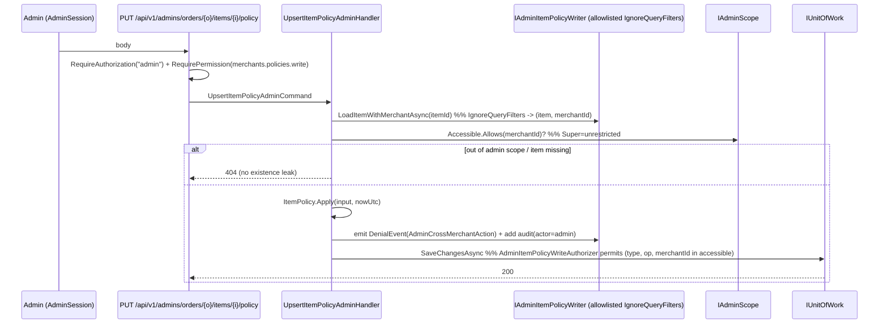

# Design: Insurance Policy-Reference Record

> Status: approved 2026-07-23

## Architecture Overview

Feature เพิ่ม **external insurance-reference data** (เลขกรมธรรม์/รับแจ้ง/สลักหลัง/ต่ออายุ, ประเภทประกัน,
ทะเบียนรถ, เบี้ยสุทธิ/รวม, สถานะตัดชำระเบี้ย) ผูก 1:1 กับ `OrderItem` ที่ขายไปแล้ว + read report 2 plane.
ทั้งหมดอยู่ใน **data plane** (schema `shop`, ใต้ `MerchantRuntimeDbContext`) — ไม่แตะ Order aggregate,
payment engine, หรือ control plane identity.

**องค์ประกอบใหม่ (module `Orders`, sibling ของ `Item`/`RevealAudit` ที่ `Orders.Domain/Items/`):**

| Element | Responsibility |
|---|---|
| `ItemPolicy` (aggregate ใหม่, mutable) | ถือ external reference fields 1:1 กับ `OrderItem`; invariants ทั้งหมดอยู่ในนี้ (domain) |
| `ItemPolicyAudit` (append-only) | 1 row ต่อ 1 write — actor/item/merchant/changed-summary/timestamp/correlation |
| enums `InsuranceCategory`/`ReferenceNumberType`/`PremiumRemittanceStatus` | vocabulary ต่อ item |
| `IItemPolicyRepository` (port, `Orders.Application`) | load-or-create + write (merchant path) |
| `IAdminItemPolicyReader`/`IAdminItemPolicyWriter` (ports) | admin cross-merchant read/write (escape-hatch, allowlisted) |
| `UpsertItemPolicyCommand` + handlers (merchant + admin) | validate + apply + audit + save |
| `ListPolicyReportQuery` (merchant) / `ListPolicyReportAdminQuery` (admin) | SFS-based paged read model |
| iam keys `policies.{read,write}` (Merchant) + `merchants.policies.{read,write}` (Platform) | authz ต่อ plane |

**เหตุผลที่แยก entity ใหม่ (ไม่เพิ่ม field บน `Item`):** `Item` วันนี้ **INSERT-only** (GRANT บน
`shop.OrderItems` = `SELECT, INSERT` เท่านั้น, `GrantInsuranceLineTables.cs:25`), construct ครั้งเดียวเป็น
purchase snapshot ไม่มี mutator, และเขียนผ่าน Order aggregate. External reference data เป็น **mutable, post-sale,
เขียนคนละ actor (admin+producer), มี audit + permission แยก** — ยัดเข้า `Item` จะบังคับให้ grant UPDATE บน
`OrderItems`, เพิ่ม mutator เข้า snapshot aggregate, และโหลดผ่าน Order aggregate ทุกครั้ง (แตะ path ที่ติดกับ
`Order.MarkPaid` guardrails). แยก `ItemPolicy` ทำให้ `Item` คง INSERT-only, isolate lifecycle/authz/audit/grant
(ADR-1 อนุญาตสร้าง entity ใหม่).

## Rename (REQ-7): OrderLine -> OrderItem

Folded 2026-07-23 — **behavior-preserving rename** ของ order line-item concept ให้ตรง `Carts.Domain.Items.Item`
(funnel: Cart Item -> Checkout Item -> Order Item). ต้องเสร็จ **ก่อน/พร้อม** feature (`ItemPolicy` ผูกกับ `OrderItem`).

| เดิม | ใหม่ |
|---|---|
| `Orders.Domain.Lines.Line` | `Orders.Domain.Items.Item` |
| `OrderLineInput` | `OrderItemInput` |
| read models `OrderLineListItem`/`OrderLineDetail` | `OrderItemListItem`/`OrderItemDetail` |
| `Orders.Domain.Lines.RevealAudit` (namespace) | `Orders.Domain.Items.RevealAudit` |
| table `shop.OrderLines` | `shop.OrderItems` |
| table `shop.OrderLineRevealAudits` | `shop.OrderItemRevealAudits` |
| column `OrderLineId` (ทุกตาราง) | `OrderItemId` |
| `Checkouts.Domain.Lines.Line` | `Checkouts.Domain.Items.Item` |
| `CheckoutLineInput` | `CheckoutItemInput` |
| table `shop.CheckoutSessionLines` | `shop.CheckoutSessionItems` |

- **Migration:** forward migration `RenameTable`/`RenameColumn` (`sp_rename` — object_id เดิม → **GRANT บนตารางที่
  rename คงอยู่อัตโนมัติ** ไม่ต้อง re-grant; เฉพาะตารางใหม่ `OrderItemPolicies`/`OrderItemPolicyAudits` ต้อง GRANT ใหม่)
  + อัปเดต EF config (`ToTable`/column) + snapshot. (หรือ big-bang reset down -v ตาม culture repo — ตารางยังไม่ prod.)
- **Gate:** retire token เก่าใน `scripts/check-rename-identifiers.sh` (`OrderLine`, order-line `Line`, `OrderLineId`,
  `CheckoutSessionLine`, `CheckoutLineInput`) — call site เก่าโผล่กลับ = red CI (REQ-7.5).
- **L8 (external contract — deliberate เท่านั้น, REQ-7.6):** integration-event `Contracts.CheckoutConfirmedLine`
  (`CheckoutConfirmed.cs`) -> `CheckoutConfirmedItem` (in-process INotification, big-bang ไม่ alias). ตรวจ config key /
  OpenAPI scheme ว่าไม่มีตัวใดอิง "line" (คาดว่าไม่มี — verify ตอน implement).
- **Behavior:** ไม่แตะ state machine / verify-logic / route semantics (REQ-7.4); เปลี่ยนแค่ชื่อ + `/lines/`->`/items/`.

## Sequence Diagrams

### Write (merchant plane — own scope)

```mermaid
sequenceDiagram
    participant P as Producer (MerchantUser)
    participant API as PUT /api/v1/orders/{o}/items/{i}/policy
    participant H as UpsertItemPolicyHandler
    participant R as IItemPolicyRepository
    participant D as ItemPolicy (domain)
    participant U as IUnitOfWork (MerchantRuntime)
    P->>API: body (reference fields)
    API->>API: RequireAuthorization("merchant-user") + RequirePermission(policies.write)
    API->>H: UpsertItemPolicyCommand (IMerchantScoped, MerchantId=actor)
    H->>R: ItemExistsAsync(itemId)  %% query OrderItems, query-filtered by CurrentMerchant
    alt item ไม่มี / ไม่ใช่ merchant ตัวเอง
        R-->>H: false
        H-->>API: NotFoundException -> 404  (REQ-3.3 — แยกจากกรณี "item มีแต่ยังไม่เคยป้อน policy")
    else item เป็นของ merchant นี้
        H->>R: GetPolicyByItemAsync(itemId)  %% -> existing ItemPolicy หรือ null
        H->>D: existing ?? ItemPolicy.Create(...); then Apply(input, nowUtc)  %% invariants -> ArgumentException=400
        H->>R: add/update ItemPolicy + add audit row (ItemPolicyAudit)
        H->>U: SaveChangesAsync  %% write guard: CanWrite(ItemPolicy, Insert/Update, targetMerchant)
        U-->>API: 200
    end
```

### Write (admin plane — cross-merchant, escape-hatch)



### Read (report — both planes)

```mermaid
sequenceDiagram
    participant C as Admin | MerchantUser
    participant API as GET .../reports/policies
    participant Q as ListPolicyReport[Admin]Query (SFS)
    participant DB as MerchantRuntimeDbContext
    C->>API: query params (SFS: page/limit/filters/sort/search)
    API->>Q: merchant path auto-scoped | admin path IgnoreQueryFilters + accessible filter
    Q->>DB: OrderItems l JOIN Orders o (Order.Status) LEFT JOIN ItemPolicy p
    DB-->>Q: rows
    Q->>Q: MaskIdNumber(InsuredIdNumber); PaymentStatus = map(o.Status)
    Q-->>API: PagedResult<PolicyReportItem>
```

## Data Models & Interfaces

### Domain — `Orders.Domain.Items`

```csharp
public enum InsuranceCategory { Voluntary = 0, Compulsory = 1 }        // ภาคสมัครใจ / ภาคบังคับ(พ.ร.บ.)
public enum ReferenceNumberType { PolicyNumber = 0, NotificationNumber = 1 } // เลขกรมธรรม์ / เลขรับแจ้ง
public enum PremiumRemittanceStatus { NotApplicable = 0, Deducted = 1 }      // N/A / ตัดชำระเบี้ยแล้ว

public sealed class ItemPolicy : Entity<Guid>
{
    public Guid OrderItemId { get; private set; }     // unique (1:1 กับ Item)
    public Guid MerchantId  { get; private set; }     // tenant key (TenantKeyDescriptor.Require)

    public InsuranceCategory?    InsuranceCategory      { get; private set; }  // nullable = unset (REQ-1.11)
    public ReferenceNumberType?  ReferenceNumberType    { get; private set; }
    public string?               ReferenceNumber        { get; private set; }
    public string?               EndorsementNumber      { get; private set; }
    public string?               RenewalReminderNumber  { get; private set; }
    public string?               InsuredObjectReference { get; private set; }  // ทะเบียนรถ (generic)
    // Money แยก Amount+Currency ทั้ง 2 column ตาม CODING_STANDARDS (B1) — nullable ทั้งคู่, มาเป็นคู่ (Amount+Currency)
    public decimal? NetPremiumAmount     { get; private set; }
    public string?  NetPremiumCurrency   { get; private set; }   // char(3), บังคับ "THB" ที่ Apply (REQ-3.8)
    public decimal? GrossPremiumAmount   { get; private set; }
    public string?  GrossPremiumCurrency { get; private set; }
    public PremiumRemittanceStatus PremiumRemittanceStatus { get; private set; } = PremiumRemittanceStatus.NotApplicable;
    public DateOnly? DeductedAt { get; private set; }   // client-supplied local date (REQ-2.2)
    public DateTime  CreatedAt  { get; private set; }
    public DateTime  UpdatedAt  { get; private set; }

    public Money? NetPremium   => NetPremiumAmount   is { } a && NetPremiumCurrency   is { } c ? Money.Of(a, c) : null;
    public Money? GrossPremium => GrossPremiumAmount is { } a && GrossPremiumCurrency is { } c ? Money.Of(a, c) : null;

    internal static ItemPolicy Create(Guid id, Guid orderItemId, Guid merchantId, DateTime nowUtc) { ... }

    // ทุก invariant อยู่ที่นี่ — ผิด = ArgumentException (=> 400 ตาม convention repo)
    public void Apply(ItemPolicyInput input, DateTime nowUtc)
    {
        // (type,value) คู่กันสองทิศ              REQ-3.9 / 3.10  (F4)
        // endorsement/renewal ต้องมี reference    REQ-3.11        (F3)
        // net/gross both-or-neither               REQ-3.12        (F5)
        // net <= gross                            REQ-3.7
        // net.Currency == gross.Currency == "THB" REQ-3.8         (F2) -> store Amount+Currency
        // Deducted <=> DeductedAt present          REQ-2.3 / 2.4
        // DeductedAt ไม่อนาคต (basis = วันไทย UTC+7) REQ-2.5       (F6, m6)
        // revert Deducted->NotApplicable => clear DeductedAt      REQ-2.6 (F6)
        UpdatedAt = nowUtc;
    }
}

public sealed record ItemPolicyInput(                        // primitive input (อยู่ *.Domain ตามบทเรียน insurance-pivot)
    InsuranceCategory? InsuranceCategory, ReferenceNumberType? ReferenceNumberType, string? ReferenceNumber,
    string? EndorsementNumber, string? RenewalReminderNumber, string? InsuredObjectReference,
    Money? NetPremium, Money? GrossPremium,                   // Money (Amount+Currency); Apply บังคับ THB
    PremiumRemittanceStatus PremiumRemittanceStatus, DateOnly? DeductedAt);
```

`ItemPolicyAudit` — append-only sibling (pattern `RevealAudit.cs`): `Id`, `OrderItemId`, `MerchantId`,
`ActorId`, `ActorKind` (Admin|MerchantUser), `Operation` (`Created`|`Updated`), `ChangeSummary`,
`CorrelationId`, `OccurredAt`. `ChangeSummary` = **รายชื่อ field ที่เปลี่ยน** (field name อย่างเดียว เช่น
`"ReferenceNumber,PremiumRemittanceStatus,DeductedAt"`) — ไม่ต้อง redact เพราะ `ItemPolicy` **ไม่มี PII**
(ชื่อ/`InsuredIdNumber` อยู่บน `Item` ไม่ใช่ที่นี่) และ reference number ไม่ใช่ secret (REQ-4.6). เขียนผ่าน UoW
เดียวกับ write, plain shape ไม่ hash-chain (เหตุผลเดียวกับ `RevealAudit.cs:8-11`). Grant = `SELECT, INSERT` (append-only).

### EF configuration (dual-config pattern)

- Runtime twin `Persistence.MerchantRuntime/Orders/Items/ItemPolicyConfiguration.cs`:
  `ToTable("OrderItemPolicies", SchemaNames.Shop)`, `TenantKeyDescriptor.Require(md, nameof(ItemPolicy.MerchantId))`,
  `HasQueryFilter(x => x.MerchantId == context.CurrentMerchant)`, unique index `(OrderItemId)`. Premium =
  `NetPremiumAmount`/`GrossPremiumAmount` `decimal(19,4)` nullable **+** `NetPremiumCurrency`/`GrossPremiumCurrency`
  `char(3)` fixed-len non-unicode nullable (Amount+Currency ทั้งคู่ ตาม CODING_STANDARDS — B1; map เป็น scalar
  nullable ไม่ใช่ `ComplexProperty<Money?>` เพื่อเลี่ยง EF10 optional-complex bug efcore#38043/#37249). ref strings
  `nvarchar(100)` nullable.
- Migration-owner twin `Orders.Infrastructure/Items/ItemPolicyConfiguration.cs` (columns/indexes only).
- `ItemPolicyAudit`: `AppendOnlyDescriptor.Mark(md)` (บล็อก Update/Delete) + query filter + tenant key.
- Register `DbSet` + `ApplyConfiguration` ใน `MerchantRuntimeDbContext.cs`.

### Persistence — migration + GRANT

- Table migration ใหม่ใต้ `BuildingBlocks.Infrastructure/Persistence/Migrations/` (pattern `RevealAudits.cs`):
  `CreateTable("OrderItemPolicies", schema:"shop", ...)` + `CreateTable("OrderItemPolicyAudits", ...)` +
  unique index `OrderItemPolicies(OrderItemId)`, index `(MerchantId)`.
- GRANT migration (pattern `GrantInsuranceLineTables.cs`): `GRANT SELECT, INSERT, UPDATE ON shop.OrderItemPolicies TO pol_app;`
  (**UPDATE** เพราะ mutable) + `GRANT SELECT, INSERT ON shop.OrderItemPolicyAudits TO pol_app;` (append-only).
  `Down` = REVOKE. (Trap insurance-pivot: ตารางใหม่ไม่มี grant อัตโนมัติ, SQLite test จับไม่ได้ — real SQL Server integration test ต้องยืนยัน.)

### Write guard registration

**Merchant plane:** เพิ่ม `typeof(ItemPolicy)` + `typeof(ItemPolicyAudit)` เข้า
`MerchantRequestWriteAuthorizer.OwnedTypes` (`WriteAuthorizers.cs:86-97`) — เปิด **เฉพาะ merchant path**
(default-deny; `CanWrite` ผ่านเมื่อ `_actor.HasActor && targetMerchant == _actor.MerchantId`, `WriteAuthorizers.cs:111`).

**Admin plane — machinery ใหม่ (แก้ M2, เยอะสุด):** admin request เป็น HTTP request แต่ **ไม่มี merchant bound**
(`HasActor=false`) → `MerchantRequestWriteAuthorizer` **deny** เสมอ. การเพิ่ม type เข้า `OwnedTypes` ไม่ช่วย
admin. admin write จึงต้องได้ `MerchantRuntimeDbContext` **instance แยกที่ build ด้วย authorizer คนละตัว** —
mirror `AddProvisioning(connString, new ProvisioningSuperWriteAuthorizer())` (`Program.cs:178`) ที่
`ProvisioningCoordinator` สร้าง context เองต่อ operation (context เป็น `internal sealed`, host สร้างผ่าน factory
ที่ registration expose):

1. Registration ใหม่ (host): factory build `MerchantRuntimeDbContext` ด้วย
   `AdminItemPolicyWriteAuthorizer(IAdminScope)` — **request-scoped `IAdminScope` ตัวเดียวกับที่ admin auth handler set**.
2. `AdminItemPolicyWriteAuthorizer.CanWrite(type, op, targetMerchant)`: allow `(ItemPolicy, Insert|Update)` +
   `(ItemPolicyAudit, Insert)` **ก็ต่อเมื่อ `_scope.IsUnrestricted || _scope.Accessible.Allows(targetMerchant)`**
   — ไม่ใช่ static `(type,op)` allowlist แบบ `ProvisioningSuperWriteAuthorizer` (นั่น Super-only, ไม่เช็ค
   targetMerchant, `WriteAuthorizers.cs:137-138`) เพราะเราต้อง honor **Scoped-admin accessible set** (กันรูรั่ว
   Scoped เขียนข้าม merchant).
3. `targetMerchant` ที่ floor = `ItemPolicy.MerchantId` current value (`GuardedRuntimeDbContext.GuardTenantKey`,
   `:74-75`). handler ตั้ง `MerchantId` = เจ้าของ item จริง (load ผ่าน escape-hatch) → **สองฝั่งใช้ merchantId
   แหล่งเดียวกัน**. `GuardTenantKey` reject `Guid.Empty` + immutable-after-insert ยังทำงานปกติ.
4. Load item + ItemPolicy cross-merchant ผ่านพอร์ต escape-hatch **2 ตัว** ที่ allowlist ใน
   `BypassPrimitiveTests.AllowedPorts` (`:21-37`): `IAdminItemPolicyWriter` (write path) **และ**
   `IAdminItemPolicyReader` (report path, §Read ก็ใช้ `IgnoreQueryFilters`). ทั้งคู่ emit
   `DenialEvent(AdminCrossMerchantAction)` ทุก cross-floor op (pattern `ConnectionRepository.cs:35-45`).

> **Scoping option (ต่อ M2 — ตัดสินที่ human gate):** admin cross-merchant **write** เป็น element ที่ machinery
> มากสุด + ไม่มี precedent ตรง (มีแค่ Super-only provisioning + read escape-hatch). ทางลด scope v1 = **defer admin-write**
> (คง admin-read + merchant read/write) — แต่ต้อง **amend REQ-3.2 + ADR** ก่อน (ตอนนี้ REQ lock ว่าทั้ง admin+producer เขียนได้).

### API surface

| Method + path | Auth | Permission | Scope |
|---|---|---|---|
| `PUT /api/v1/orders/{orderId}/items/{itemId}/policy` | `merchant-user` | `policies.write` | own (query filter) |
| `GET /api/v1/reports/policies` | `merchant-user` | `policies.read` | own (query filter) |
| `PUT /api/v1/admins/orders/{orderId}/items/{itemId}/policy` | `admin` | `merchants.policies.write` | cross-merchant (escape-hatch + `IAdminScope`) |
| `GET /api/v1/admins/reports/policies` | `admin` | `merchants.policies.read` | cross-merchant (escape-hatch + `IAdminScope`, `?merchantId=` filter) |

Endpoints map inline ใน `Hosts/Api/Program.cs` (merchant paths บน `api`; admin paths บน `api.MapGroup("/admins")`);
read ใช้ `SfsQueryParser.Parse` + `.WithMetadata(new SfsQueryParamsMarker())` (pattern `/products` `Program.cs:580-599`).

Wire read model `PolicyReportItem` (camelCase JSON): `insuredName`, `insuredIdNumberMasked`, `insuranceCategory`,
`referenceNumberType`, `referenceNumber`/`endorsementNumber`/`renewalReminderNumber`, `insuredObjectReference`,
`netPremium`/`grossPremium` (**pin type `Money?`** — MoneyJsonConverter เขียน `null` ได้เฉพาะเมื่อ property เป็น
`Money?`; ถ้าเป็น `Money` non-null แล้ว unset จะได้ `{amount:"0.0000",currency:null}` ขยะ — m5), `premiumRemittanceStatus`
+ `deductedAt`, `paymentStatus` (map จาก `Order.Status`), `merchantId` (admin view เท่านั้น). `InsuredIdNumber`
masked ด้วย **copy ของ report query เอง** (mirror `GetOrders.cs:46-47` — helper เป็น private static ไม่ share
โดยเจตนา, m8); masked-list **ไม่เขียน reveal-audit** (ต่างจาก `GetOrderDetail` ที่คืนเต็ม); reference numbers ไม่ mask (REQ-4.6).

### Report query details (SFS + join)

- Query: `OrderItems l JOIN Orders o ON l.OrderId == o.Id LEFT JOIN OrderItemPolicies p ON p.OrderItemId == l.Id`
  (ทุกตารางใน `MerchantRuntimeDbContext`; merchant path query-filter อัตโนมัติ, admin path `IgnoreQueryFilters` +
  `IAdminScope.Accessible`/`?merchantId=`).
- **paymentStatus filter/projection** = map `o.Status` (`AwaitingPayment`/`Paid`/`Cancelled`) — ไม่ใช่ column,
  ApplyFilter map ค่าที่ยื่นมาเป็น predicate บน `o.Status` (REQ-4.3).
- **premiumRemittanceStatus** บน LEFT JOIN: item ที่ไม่มี `ItemPolicy` row → **coalesce เป็น `NotApplicable`**
  ทั้งใน projection และ filter (`= NotApplicable` ต้อง match row ที่ `p` เป็น null ด้วย — REQ-4.7).
- **date range filter** = `Order.CreatedAt` (วันที่ขาย; pin ชัด ไม่ใช่ `DeductedAt`).
- SFS whitelist (pattern `ProductSfs.cs`): filterable/sortable = `insuranceCategory`, `referenceNumberType`,
  `premiumRemittanceStatus`, `paymentStatus`, order-createdAt. **`merchantId` ห้ามอยู่ใน whitelist** (admin ใช้ param
  แยก, `ProductSfs.cs:32`). Sort บน nullable column = NULLS-last.

### iam catalog delta (`Iam.Domain/Permissions/Keys.cs` + migration ใหม่)

- Platform group `merchants.policies` (Scope.Platform): `merchants.policies.read`, `merchants.policies.write`
- Merchant group `policies` (Scope.Merchant): `policies.read`, `policies.write`
- Role grants: `platform_admin` +read+write; `platform_auditor` +read; `merchant_manager` +read+write; `merchant_staff` +read
- Catalog: 8->10 groups, 20->24 keys, grants 28->34. อัปเดต `Keys.cs` (const + `GroupScope`+`GroupKeys`+`All`) +
  hand-written seed migration (mirror `20260712185912_SeedData.cs`) + `KeysTests`. `IamCatalogGrantsTests` ต้องแก้
  **ทั้ง total (28->34) และ per-role counts** (`platform_admin` 13->15, `platform_auditor` 4->5, `merchant_manager`
  7->9, `merchant_staff` 4->5 — `IamCatalogGrantsTests.cs:40,44-47`, m7). (L8: key เป็น external contract — เพิ่มใหม่ได้
  ห้าม rename ของเดิม.)

## Technology Decisions

1. **Entity shape → แยก `ItemPolicy` (1:1 กับ Item)** ไม่เพิ่ม field บน `Item` — เหตุผลใน Architecture Overview
   (Item INSERT-only + mutable/separate-actor/audit/grant). ADR-1 อนุญาต.
2. **Reconciliation → ไม่บังคับ.** `GrossPremium` (external) ไม่ต้องตรง `Item.UnitPrice`/`Order.Amount` — เป็น
   reference data แยก, enforce แค่ `Net <= Gross` + THB. (REQ Open Question ปิด: no reconciliation.)
3. **Filter/paging → reuse SFS** (`SfsQueryParser` + `PagedQuery`/`PagedResult` + repo `ApplyFilters/ApplySearch`,
   pattern `ListProducts`) — implemented แล้ว, เป็น convention บังคับ (CODING_STANDARDS). ไม่สร้างใหม่.
4. **Permission keys** ตาม delta ข้างบน — precedent `merchants.users.*` (Platform group ที่ admin ทำกับ resource
   ของ merchant) + merchant self-group เหมือน `catalog`/`payment`.
5. **Checkout path ไม่แตะ (business)** — external data ป้อน post-sale, ไม่ผ่าน `Checkouts.Domain.Items.Item` snapshot
   หรือ `Contracts.CheckoutConfirmed`. ยืนยัน out of scope.
6. **String length/format → `nvarchar(100)`** ต่อ ref string, trim + non-empty เมื่อ set, **ไม่มี regex** (external
   varies). (N3 ปิด.)
7. **Premium persistence → nullable scalar `decimal(19,4)` Amount + `char(3)` Currency ต่อเบี้ย** (B1 corrected).
   คง **column currency ไว้** ตาม CODING_STANDARDS hard rule (Money = Amount+Currency ทุกชั้น) และ REQ-1.6.
   ใช้ 2 scalar (ไม่ใช่ `ComplexProperty<Money?>`) เพื่อเลี่ยง EF Core 10 optional-complex-type bug
   (efcore#38043/#37249) — ไม่ใช่เพราะ "EF ไม่รองรับ null" (premise เดิมผิด: EF10 รองรับ optional complex แล้ว).
   domain expose `Money?` computed จาก (Amount, Currency); `Apply` บังคับ Currency == THB (REQ-3.8).
8. **Concurrency → last-write-wins** (F7): ไม่ใส่ `RowVersion`/`IsRowVersion()` (default). ทุก write audited
   (`ItemPolicyAudit`), recovery ผ่าน audit trail. หมายเหตุ: `TenantKeyDescriptor` ตั้ง `MerchantId` เป็น
   concurrency token กัน forged detached write อยู่แล้ว (ไม่ทำให้ business field optimistic-locked).
9. **Admin cross-merchant write** = context instance แยก build ด้วย `AdminItemPolicyWriteAuthorizer(IAdminScope)`
   (mirror `AddProvisioning`) + escape-hatch reader/writer allowlisted — spec เต็มใน §Write guard registration (M2).
   authorizer **เช็ค `IAdminScope.Accessible.Allows(targetMerchant)`** (ไม่ static แบบ ProvisioningSuper) กัน Scoped รั่ว.
   **[scoping option ที่ human gate]** machinery มากสุด — ทางลด v1 = defer admin-write (ต้อง amend REQ-3.2 + ADR).

## Error Handling Strategy

| Case | Response | Where |
|---|---|---|
| type set / value empty (สองทิศ) | 400 | `ItemPolicy.Apply` -> `ArgumentException` (REQ-3.9/3.10) |
| endorsement/renewal ไม่มี base reference | 400 | `Apply` (REQ-3.11) |
| net หรือ gross มาตัวเดียว | 400 | `Apply` (REQ-3.12) |
| `Net > Gross` | 400 | `Apply` (REQ-3.7) |
| premium currency != THB | 400 | input mapping/`Apply` (REQ-3.8) |
| `Deducted` ไม่มี `DeductedAt` | 400 | `Apply` (REQ-2.3) |
| `DeductedAt` อนาคต (basis = วันไทย = `DateOnly.FromDateTime(nowUtc.AddHours(7))`) | 400 | `Apply` (REQ-2.5, m6 — DeductedAt เป็น local Thai date, ห้ามเทียบ UTC ตรง) |
| item ไม่มี / ไม่ใช่ merchant ตัวเอง (producer) | 404 | `ItemExistsAsync` (query `OrderItems` scoped) = false -> `NotFoundException` (REQ-3.3, M3 — เช็คก่อน load-or-create) |
| admin scope ไม่ครอบ merchant / item ไม่มี | 404 (no existence leak) | `IAdminScope.Accessible` (pattern `HostWiring.cs:71-93`) |
| ไม่มี permission | 403 | `RequirePermission` filter (REQ-3.6) |
| malformed SFS filter param | 400 | `SfsQueryParser`/`ArgumentException` |

`ArgumentException` -> 400 (ไม่ใช้ `BadHttpRequestException` = IOException -> 500; ตาม SFS gotcha). RFC 9457 ProblemDetails
+ stable `code` ตาม convention เดิม.

## Testing Strategy

- **Unit (co-located, `tests/Orders.Tests`)** — `ItemPolicy.Apply` invariants ทุกกรณี 400: type/value สองทิศ (3.9/3.10),
  endorsement-needs-ref (3.11), net/gross pair (3.12), net<=gross (3.7), THB (3.8), Deducted<->DeductedAt (2.3/2.4),
  future DeductedAt (2.5), clear-on-revert (2.6); nullable/unset happy path (1.7/1.11); duplicate ReferenceNumber ข้าม item ผ่าน (1.10).
- **Integration (`tests/Integration.Tests`, real SQL Server)** — write+read ต่อ plane; producer แก้ item ของ merchant อื่น -> 404
  (3.3); admin scoped out-of-scope -> 404; permission ผิด -> 403 (3.6); mask `InsuredIdNumber` บน report + ไม่ mask ref number (4.5/4.6);
  payment status derive จาก `Order.Status` รวม Cancelled item เขียนได้ (3.4/4.3); **GRANT test** ยืนยัน INSERT/UPDATE บน
  `shop.OrderItemPolicies` ไม่ถูก DB ปฏิเสธ (trap insurance-pivot); persist ข้าม restart (1.9).
- **Catalog drift** — `IamCatalogGrantsTests` counts (10/24/34) + `KeysTests` parity หลังเพิ่ม key.
- **Architecture** — `BypassPrimitiveTests` allowlist ครอบ admin escape-hatch port (fail-closed); `SecurityTelemetryRedactionTests`
  ยัง green (audit/telemetry ไม่ echo PII).
- **PBT (optional, `/spec-pbt`)** — property `Net <= Gross` + THB invariant over generated Money.
- **Rename (REQ-7)** — `dotnet build -warnaserror` green หลัง rename; `check-rename-identifiers.sh` gate green (token
  เก่า retired); existing Orders/Checkouts tests เขียวหลัง rename (behavior-preserving); migration rename ไม่ data loss
  (integration, real SQL Server); OpenAPI/Scalar surface สะท้อน `/items/` path.

## Requirement Traceability

| Section | REQ |
|---|---|
| `ItemPolicy` fields + enums + nullable + duplicate-allowed | REQ-1.1–1.11 |
| `ItemPolicy.Apply` remittance + DeductedAt rules | REQ-2.1–2.6 |
| Upsert commands/handlers + escape-hatch + write guard + permissions + audit + Cancelled-ok | REQ-3.1–3.13 |
| `ListPolicyReport[Admin]Query` + endpoints + SFS + derive payment status + masking + empty-column | REQ-4.1–4.7 |
| seed `OrderItemPolicies` demo rows | REQ-5.1–5.2 |
| ไม่แตะ MarkPaid/Payments/PSP; ไม่ gen เลข/ออกเอกสาร; ไม่ claims/commission; ไม่ bulk import | REQ-6.1–6.5 |
| dual EF config + migration + GRANT + query filter + tenant key | REQ-1.9, REQ-3.3 |
| §Rename: OrderLine->OrderItem (code+DB table+CheckoutLine) + gate + L8 | REQ-7.1–7.7 |
