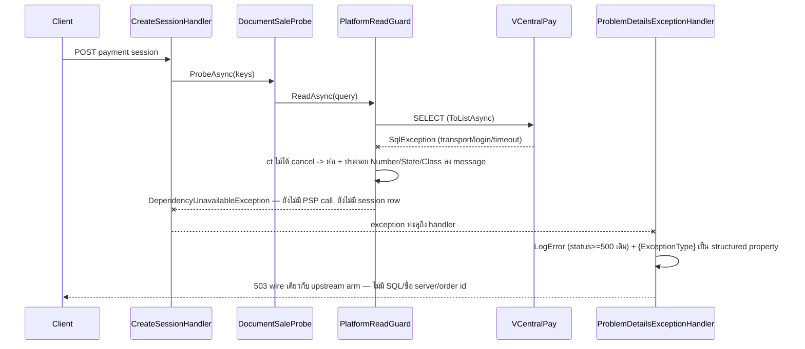

# Design: จำแนกความล้มเหลวของ dependency บนเส้นทางตรวจสถานะขายเอกสาร

> Status: approved 2026-08-06

ออกแบบตาม requirements ที่ approve แล้ว: D1 = B (`DependencyUnavailableException` -> 503),
D2 = S2 (ครอบการอ่านทุกจุดของ `Persistence.MerchantRuntime` ในเส้นทางตอบคำขอ), D3 = P1
(`GET /products` ล้มทั้งคำขอ), D4 = R1 (ไม่มี retry ในงานนี้) — ผ่าน `spec-architect` critique แล้ว 1 รอบ
(ผลอยู่หัวข้อท้ายไฟล์)

## ขอบเขตที่ต้องรู้ก่อนอ่าน — residual ที่จงใจไม่แก้ในงานนี้

**การล่มเต็มรูปแบบของ VCentralPay ผู้ใช้ที่ login แล้วยังเห็น 500 จาก auth ก่อนถึง endpoint**:
ทุกคำขอผ่าน policy `merchant-user` อ่าน session/user จาก `Persistence.MerchantUsers`
(`UserSessionAuthenticationHandler.cs:76,:106` -> `MerchantUserSessionStore.cs:17`) ซึ่งใช้ connection
string เดียวกันแต่**อยู่นอก S2 ที่ approve ไว้** — 503 ใหม่จึงครอบ (ก) การล่มระดับ query/บางส่วน
(ข) เส้น anonymous เช่น webhook และ summary-token เต็มรูปแบบ ส่วน full outage ด่านแรกที่ล้มคือ auth
การขยาย seam ไป `Persistence.MerchantUsers` เป็น follow-up ที่ต้องแก้ requirements (ระบุใน
spec-architect B1) — ถ้าจะรวมเข้างานนี้ต้องขยับ D2 ก่อน implement

## Architecture Overview

4 ชิ้น — production 3 ชิ้นเล็ก + gate 1 ชิ้นฝั่ง test:

| ชิ้น | ที่อยู่ | หน้าที่ |
|---|---|---|
| `DependencyUnavailableException` | `BuildingBlocks.Application` (ไฟล์ใหม่ ข้าง `UpstreamUnavailableException`) | ชนิดของ "ฐานข้อมูลแพลตฟอร์มเราเองอ่านไม่ได้" — สัญญาระดับ **operation**: การอ่านที่ล้มไม่มี side effect (ไม่สัญญาแทนทั้งคำขอ — ดู StartRedirect ด้านล่าง) |
| `PlatformReadGuard` | `Persistence.MerchantRuntime` (ไฟล์ใหม่, internal static) | จับ `DbException` -> เช็ค cancellation ก่อน (แบบ `SpDocumentGateway.cs:84`) -> โยนชนิดใหม่ โดยประกอบ Number/State/Class ของ `SqlException` ลง message (message ไม่ถึง client — REQ-3.3 คุมที่ handler) |
| arm ใน `ProblemDetailsExceptionHandler` | `BuildingBlocks.Web` | `DependencyUnavailableException` -> 503 **wire เดียวกับ arm 503 เดิมทุก byte** (title `"Upstream dependency unavailable"`, detail `null`) — การแยกสองสาเหตุอยู่ฝั่ง log เท่านั้น ผ่าน structured property `{ExceptionType}` ที่เพิ่มใน log call ทั้งสองระดับ |
| gate `PlatformReadGuardCoverageTests` | `tests/Architecture.Tests` (ไฟล์ใหม่) | text scan สองชั้น: (1) read token ครบชุดต้องอยู่ใต้ guard หรือใน allowlist ราย (ไฟล์, method) (2) catch-all — ทุก `*Async(` call บน `_db`/`.Set<` ที่ไม่อยู่ใน token list = แดงบังคับให้เติม token เอง (อุด `ToDictionaryAsync`-class hole) |

หลัก REQ-1.5 โดยโครงสร้าง: guard ห่อเฉพาะ query execution — `SaveChanges`, `BeginTransaction`,
`Commit` ไม่มีทางผ่าน guard; `DbUpdateException` ไม่ได้สืบทอดจาก `DbException` จึงไม่มีวันถูกจับแม้
วางผิดที่ — และมีเทสต์รันจริงคุม regression (Testing Strategy แถว REQ-1.5)

### ขอบเขต S2 — inventory ราย (ไฟล์, method) ไม่มี "ฯลฯ"

**ห่อ (pure read บนเส้นทางตอบคำขอ)**:

| ไฟล์ | จุด |
|---|---|
| `Orders/DocumentSaleProbe.cs` | `:73` |
| `Orders/PaymentSessionProbe.cs` | `:21` |
| `Carts/CartRepository.cs` | `:23` |
| `Checkouts/CheckoutRepository.cs` | `:21`, `:25` |
| `Orders/OrderRepository.cs` | `:20`, `:23`, `:30`, `:38` |
| `Orders/OrderSummaryReader.cs` | `:31`, `:43` |
| `Payments/PayableOrderReader.cs` | `:32`, `:54`, `:71` (บางจุดรันในทรานแซกชันของ create-session — มีเทสต์เฉพาะ, ดู S5) |
| `Payments/SessionRepository.cs` | `:19`, `:26`, `:33` |
| `Payments/Psp/ConnectionRepository.cs` | `:22`, `:26`, `:44` |
| `Merchants/MerchantRepository.cs` | `:32`, `:35`, `:38`, `:47` (`ToDictionaryAsync`), `:56` |
| `Orders/Items/ItemPolicyRepository.cs` | `:21`, `:24` |
| `Orders/Items/AdminItemPolicyReader.cs` | `:53` |
| `Orders/Items/PolicyReportRepository.cs` | `:30` |
| `Webhooks/WebhookMerchantResolver.cs` | `:30` |
| `Vault/VaultRevealAuditVerifier.cs` | `:23` |
| `Vault/LocalEnvelopeVaultStore.cs` | `:89` (read ของ reveal), `:121`, `:127` (`ExistsAsync` — ต้องแปลงจาก expression-bodied เป็น async method) |

**ไม่ห่อ (allowlist ของ gate ราย (ไฟล์, method) พร้อมเหตุผล)**:

| จุด | เหตุผล |
|---|---|
| `MerchantRuntimeUnitOfWork` ทั้งไฟล์ | ฝั่งเขียน — การแปล 3 กรณีเดิมคงที่ (REQ-1.5, REQ-5.3) |
| `Vault/VaultAuditAppender.cs:54,:78` | read เป็นส่วนหนึ่งของหน่วยเขียนเดียวกัน (append chain ใต้ `sp_getapplock` ใน transaction ของตัวเอง) — ไม่ใช่เหตุผลเรื่อง transaction scope แต่เพราะผลรวมของ method เป็นการเขียน |
| `Outbox/OutboxDispatcher.cs` | background drain — ไม่ใช่เส้นทางตอบคำขอ |
| `Orders/OrderNoSequence.cs:39` | `NEXT VALUE FOR` เปลี่ยน state ของ sequence — ไม่ใช่การอ่านล้วน |
| `Idempotency/EfIdempotencyStore.cs:41` | read-before-write ในหน่วยเดียวกันบนเส้น webhook (รูปเดียวกับ `AdminItemPolicyWriter`) |
| `Orders/Items/AdminItemPolicyWriter.cs:46,:51` | read-before-write ในหน่วยเขียน — ยอมรับผลข้างเคียง: reader ของฟีเจอร์เดียวกันได้ 503 แต่ writer คง 500/เดิม (REQ-1.5 บังคับให้เลือกทางนี้) |
| `Vault/LocalEnvelopeVaultStore.cs:44` | read-before-write ของ `StoreAsync` |
| `Orders/DoubleSellAuditor.cs`, `Vault/VaultMaintenance.cs` | เรียกจาก outbox consumer / งาน maintenance — จัดฝั่ง background; implement ต้องยืนยัน caller จริงก่อน commit ฝั่ง เจอว่าอยู่บน request path = ย้ายมาห่อ |

**door ที่ 5 ที่ต้องประกาศ (spec-architect B4)**: `StartRedirectHandler.cs:90-112` เขียน `BeginRedirect`
+ save (durable) แล้วค่อยอ่าน vault (`RevealAsync`) — read นั้นล้มจะได้ 503 ทั้งที่คำขอเขียนไปแล้ว
ซึ่งเป็นพฤติกรรม**เดิม** (วันนี้ก็ 500 หลังเขียนเหมือนกัน) ไม่ใช่ของใหม่ของงานนี้; REQ-2.7 จึงพิสูจน์
เป็นราย door เฉพาะ 4 ด่านในตาราง Overview ของ requirements — ทุกด่านตรวจลำดับแล้ว
ไม่มีการเขียนก่อนเรียก probe (`Program.cs:716`, `:850`, `CreateSessionHandler.cs:73`)

## Sequence Diagrams

ด่านสร้าง payment session เมื่อ DB แพลตฟอร์มล่ม (ด่านที่เดิมพันสูงสุด — REQ-2.4):



`GET /products` (P1): `ListProducts` เรียก probe เพื่อตัดเอกสารที่ขายแล้ว probe โยน -> 503 ทั้งคำขอ
ไม่มีหน้ารายการที่ยังไม่ผ่านการตัดหลุดออกไป (REQ-2.6)

## Data Models & Interfaces

### `DependencyUnavailableException`

```csharp
namespace BuildingBlocks.Application;

/// <summary>A read against OUR OWN platform database (VCentralPay) could not produce a usable answer —
/// connection, TLS/pre-login, timeout, login or permission failure. The promise is scoped to the FAILED
/// OPERATION: that read had no side effect. It says nothing about writes the same request may have
/// committed earlier, and it must never be thrown for a write whose outcome is unknown (same warning as
/// UpstreamUnavailableException).</summary>
public sealed class DependencyUnavailableException : Exception
{
    public DependencyUnavailableException(string message, Exception innerException)
        : base(message, innerException) { }
}
```

### `PlatformReadGuard`

```csharp
namespace Persistence.MerchantRuntime;

internal static class PlatformReadGuard
{
    public static async Task<T> ReadAsync<T>(
        Func<CancellationToken, Task<T>> read, CancellationToken cancellationToken)
    {
        try { return await read(cancellationToken).ConfigureAwait(false); }
        catch (DbException ex)
        {
            // A cancelled command surfaces as a SqlException too (SpDocumentGateway.cs:84) — REQ-1.4.
            cancellationToken.ThrowIfCancellationRequested();
            throw new DependencyUnavailableException(Describe(ex), ex);
        }
    }

    // REQ-4.1: Number/State/Class ประกอบลง message ตรง ๆ — ไม่พึ่งรูปแบบ ToString() ของ SqlClient
    // (spec-architect M3: การผนวกของ ToString มีเงื่อนไข ไม่ deterministic กับ transport failure)
    private static string Describe(DbException ex) => ex is SqlException sql
        ? $"A platform database read failed (SQL error {sql.Number}, state {sql.State}, class {sql.Class})."
        : "A platform database read failed.";
}
```

- จับ `DbException` — ครอบ `SqlException` + SQLite substitution ของ Hosts.Tests เทสต์กับ prod
  เดินเส้นเดียวกัน
- `InvalidOperationException` ของ collation guard (`DocumentSaleProbe.cs:88-91`) **ไม่ถูกจับ** —
  ข้อตัดสินแยกหลัง D1 ตาม requirements
- call site: `await PlatformReadGuard.ReadAsync(ct => query.ToListAsync(ct), cancellationToken)`

### handler — arm ใหม่ + structured log property

```csharp
DependencyUnavailableException =>
    (StatusCodes.Status503ServiceUnavailable, "Upstream dependency unavailable", null),
```

- **wire เท่ากับ arm เดิมทุก byte** (spec-architect S2) — client แยกสองสาเหตุไม่ได้ = ไม่แจกโครงสร้าง
  ภายในฟรี และไม่มี contract change กับ arm เดิม; REQ-4.2 แยกที่ log ไม่ใช่ที่ wire
- log: กฎเดิม `status >= 500 -> LogError` ให้ REQ-4.1 ฟรีอยู่แล้ว (503 >= 500 — spec-architect M1
  จับว่า clause พิเศษเป็น dead code) สิ่งที่เพิ่มจริงคือ template ทั้งสองบรรทัดได้
  `{ExceptionType} = exception.GetType().Name` เป็น structured property -> filter ใน Seq ได้โดย
  ไม่อ่าน stack trace (REQ-4.2): `DependencyUnavailableException` = เราล่ม,
  `UpstreamUnavailableException` = ต้นทางล่ม
- ไม่มี `ISecurityTelemetry` (REQ-4.3), ไม่มี credential ใน log — message ประกอบจากตัวเลขล้วน
  (REQ-4.4)
- OpenAPI metadata (spec-architect S3): เติม `.ProducesProblem(503)` + คำอธิบายให้ endpoint ที่แตะ
  MerchantRuntime read แล้วยังไม่ประกาศ — อย่างน้อย `GetCart` (`Program.cs:750-752`),
  `ConfirmCheckout` (`:936`), `AbandonCheckout` (`:952-955`); กฎ: endpoint ใดเรียก read ใน S2
  ต้องประกาศ 503

### gate `PlatformReadGuardCoverageTests`

- token ครบชุด: `ToListAsync(`, `ToArrayAsync(`, `ToDictionaryAsync(`, `ToHashSetAsync(`,
  `FirstOrDefaultAsync(`, `FirstAsync(`, `SingleOrDefaultAsync(`, `SingleAsync(`, `AnyAsync(`,
  `AllAsync(`, `CountAsync(`, `LongCountAsync(`, `MaxAsync(`, `MinAsync(`, `SumAsync(`,
  `ContainsAsync(`, `FindAsync(`, `LoadAsync(`, `ForEachAsync(`, `AsAsyncEnumerable(`,
  `ExecuteReaderAsync(`, `ExecuteScalarAsync(`
- fact 1: ทุก token ใน `Persistence.MerchantRuntime` ต้องอยู่ภายใน `PlatformReadGuard.ReadAsync`
  หรืออยู่ใน allowlist ราย (ไฟล์, method) — แดงระบุไฟล์:บรรทัด + รูปแบบถูก
- fact 2 (catch-all — spec-architect B3): บรรทัดที่มี `_db.` หรือ `.Set<` และมี `Async(` แต่ไม่ match
  token ใดเลย = แดง บังคับเติม token — ปิดรู method ที่ยังนึกไม่ถึงวันนี้
- fact 3: allowlist staleness — entry ที่ไม่ตรงกับโค้ดจริงแล้ว = แดงให้ถอด

### แก้ doc comment ที่โกหก

`MerchantRuntimeUnitOfWork.cs:7-8` "retry-safe under transient SQL Server faults" — `EnableRetryOnFailure`
ไม่ถูกตั้งที่ใดเลย แก้ถ้อยคำให้ตรงจริง (requirements สั่งแก้ไม่ว่า D4 เลือกทางไหน) — comment เท่านั้น

## Technology Decisions

| ทางเลือกที่ใช้ | เหตุผล | ทางที่ตัดทิ้ง |
|---|---|---|
| guard ที่ read call site | การเขียนผ่านไม่ได้โดยโครงสร้าง (REQ-1.5) + ห่อคลุมทั้ง materialization (ล้มกลาง stream ของ `ToListAsync` ก็ยังโดนจับ) | S3 (arm `SqlException` ที่ handler) — กลืนความล้มเหลวเขียน ถูกตัดตั้งแต่ requirements |
| ไม่ใช้ `IDbCommandInterceptor` (spec-architect S1 — rebutted) | (1) `CommandFailed` ยิงตอน execute เท่านั้น — transport ตายกลาง `reader.ReadAsync` ไม่ผ่าน interceptor class ปิดไม่จริง (2) การ throw แทนที่ exception จาก failure hook เป็นพฤติกรรมที่ไม่มีสัญญาชัดใน EF — ไม่เอาเส้นเงินไปแขวนไว้ (3) interceptor มองการอ่านใน write unit (`VaultAuditAppender` `FromSqlQuery`) เป็น read = misclassify | interceptor 1 ตัว/context — diff เล็กกว่าแต่แลกกับ 3 ข้อซ้าย |
| log ที่ handler ไม่ plumb logger เข้า repo + Number/State/Class ใน message ของ exception | deterministic (ไม่พึ่งเงื่อนไข `ToString()` ของ SqlClient — M3) และ repo ~20 ไฟล์ไม่ต้องเพิ่ม dependency | inject `ILogger` ทุก repo — diff ใหญ่หลายเท่า |
| จับ `DbException` | ครอบ SqlClient + SQLite ของ test harness | จับเฉพาะ `SqlException` — test แยกทางกับ prod |
| ชนิดใหม่ ไม่ reuse `UpstreamUnavailableException` | D1 = B — แยกสาเหตุใน log (REQ-4.2) โดย wire ไม่ต่าง | reuse — เสียการแยกสาเหตุถาวร |
| wire ของ 503 ใหม่ = arm เดิมทุก byte | ไม่แจกข้อมูลภายใน + ไม่มี contract change (S2) | title/detail แยก — client รู้ว่า "เราล่ม" ต่างจาก "ต้นทางล่ม" ฟรี ๆ |

## Error Handling Strategy

| กรณี | พฤติกรรม |
|---|---|
| อ่านล้มเหลว (transport/TLS/timeout/login/สิทธิ์) ทุกจุดที่ห่อ | `DependencyUnavailableException` -> 503 wire คงที่ เหมือนกันทุกด่าน (REQ-1.1, 1.2) — ไม่ชนกับ 400/409 ของ "เอกสารถูกถือครอง" (REQ-1.3) |
| caller ยกเลิกคำขอกลางการอ่าน | `ThrowIfCancellationRequested` ก่อนห่อ -> `OperationCanceledException` เดิม handler ปล่อยผ่าน (`:34-35`) (REQ-1.4) |
| การเขียนล้มเหลว (`SaveChanges`/commit/`VaultAuditAppender`/idempotency write-unit) | ไม่ผ่าน guard — พฤติกรรมเดิมทุกประการ (REQ-1.5, 5.3) มีเทสต์รันจริงคุม (M4) |
| read ล้มภายใน `ExecuteInTransactionAsync` (เช่น `PayableOrderReader` ใน create-session) | ยังต้องออกเป็น 503 — เทสต์เฉพาะยิงจากภายใน transaction กัน exception ถูกแทนที่ตอน rollback/dispose (spec-architect S5) |
| probe ล้มที่ add-item / checkout / create-session | โยนก่อนการเขียนใด ๆ (ตรวจลำดับจริงครบ 3 ด่าน) — ไม่มี cart item, ไม่มี checkout session, ไม่มี PSP call, ไม่มี session row (REQ-2.1-2.4, 2.7) ไม่มี flag ข้าม (REQ-2.5 — ตรวจด้วย review diff ไม่มีกลไก runtime) |
| probe ล้มใน `GET /products` | 503 ทั้งคำขอ (P1) — ไม่มีหน้ารายการที่ไม่ผ่านการตัด (REQ-2.6) |
| `StartRedirect` read vault หลังเขียน durable | 503 โดยมี write ค้างของตัวเอง — พฤติกรรมการเขียนเดิม (วันนี้ 500 หลังเขียนเหมือนกัน) ประกาศเป็น door ที่ 5 ไม่อ้าง REQ-2.7 |
| full outage ผู้ใช้ login แล้ว | 500 จาก auth (`Persistence.MerchantUsers` นอก S2) — residual ประกาศหัวไฟล์ |
| กรณีของ spec เดิม | ไม่แตะ — REQ-7.x/5.4-5.6 ของ `products-external-source-of-truth` คงเดิม (REQ-1.6) |

## Testing Strategy

สองชุดแยกตามสิ่งที่พิสูจน์ (spec-architect B2 — DB ตายทั้งก้อนนับแถวไม่ได้ จึงห้ามใช้ชุดเดียว):

| เทสต์ | วิธี | พิสูจน์ REQ |
|---|---|---|
| unit: guard จำแนกถูก | fake read โยน `DbException`/`SqlException` -> ได้ชนิดใหม่ + inner เดิม + message มี Number/State/Class; token ถูก cancel -> `OperationCanceledException` | 1.1, 1.4, 4.1 |
| host ชุด 1 — status mapping (DB ตาย) | boot host ชี้ `ConnectionStrings:App` ไป `FastFailConn` (ฉีดผ่าน `UseSetting` ตามบทเรียน `host-test-config-precedence`) ยิง 4 ด่าน — assert เฉพาะ 503 + body ไม่มี SQL/server/order id; หมายเหตุ: ด่าน checkout/create-session ล้มที่ read ตัวแรกที่แตะ DB ซึ่งอยู่ใน S2 เหมือนกัน = พิสูจน์ความสม่ำเสมอของ class ไม่ใช่ของ probe ตัวเดียว | 1.2, 1.3, 2.6, 3.1, 3.2, 3.4 |
| host ชุด 2 — ไม่มี state ค้าง (DB มีชีวิต SQLite + fake probe) | replace `IDocumentSaleProbe` ด้วยตัวที่โยน `DependencyUnavailableException` — seed cart/order ได้จริง แล้ว assert: add-item ไม่เพิ่มแถว, create-session ไม่มี session row + fake PSP adapter ไม่ถูกเรียก, checkout ไม่สร้าง session — พิสูจน์ว่า probe คือจุดล้ม ไม่ใช่ read อื่น | 2.1, 2.2, 2.3, 2.4, 2.7 |
| host: read ล้มใน transaction | บังคับ `PayableOrderReader` ล้มภายใน `ExecuteInTransactionAsync` -> ยังได้ 503 (S5) | 1.1, 1.2 |
| write ยังเป็นพฤติกรรมเดิม (M4) | unique violation ตอน save -> 409 เดิม; write ล้มด้วย transport -> 500 ไม่ใช่ 503 | 1.5 |
| integration: ของจริงล่มจริง | ต่อยอด `DocumentSaleProbeIntegrationTests` — connection string ชี้พอร์ตปิด เรียก `ProbeAsync` ตรง -> ได้ชนิดใหม่ ไม่ใช่ `SqlException` ดิบ | 1.1, 2.1 |
| log assertions | `CapturingLoggerProvider`: กรณี dependency ล่ม -> LogError + structured `{ExceptionType}` = `DependencyUnavailableException` (assert ที่ property ไม่ใช่ข้อความ render — M2); ไม่มี password/connection string ใน log | 4.1, 4.2, 4.4 |
| ไม่มี telemetry | `BypassPrimitiveTests` เขียว + diff ไม่มี `ISecurityTelemetry` ใหม่ | 4.3 |
| regression เต็มชุด | `Hosts.Tests` + `Integration.Tests` — กรณีสำเร็จ status/payload เท่าเดิม, จำนวน query ต่อคำขอเท่าเดิม (guard ไม่เพิ่ม query), transaction scope ไม่เปลี่ยน, grep `EnableRetryOnFailure` = 0 | 1.6, 5.1, 5.2, 5.3, 5.4 |
| gate | รัน gate + mutation: เพิ่ม read เปลือย -> fact 1 แดง; เพิ่ม read ด้วย method นอก token list -> fact 2 แดง | seam S2 ปิดทั้ง class |

## ผล spec-architect critique (รอบ 1)

| finding | การตัดสิน |
|---|---|
| B1 auth 500 ก่อนถึง endpoint ตอน full outage | apply บางส่วน — ประกาศเป็น residual หัวไฟล์ + ระบุ follow-up ขยาย seam ไป `Persistence.MerchantUsers` (ต้องแก้ requirements ก่อน ไม่ขยายเงียบ ๆ เกิน D2 ที่ approve) |
| B2 host test พิสูจน์ 2.2-2.4/2.7 ไม่ได้ | apply — แยกสองชุด: DB ตาย (mapping) / SQLite + fake probe (state) |
| B3 token list ไม่ครบ (`ToDictionaryAsync` หลุดจริง) | apply — token ครบชุด + catch-all fact 2 |
| B4 `StartRedirect` เขียนก่อนอ่าน vault | apply — สัญญาของ exception จำกัดระดับ operation, ประกาศ door ที่ 5, REQ-2.7 อ้างราย door เฉพาะ 4 ด่าน |
| B5 allowlist ราย method + ไฟล์ตกหล่น | apply — inventory เต็มราย (ไฟล์, method) รวม `EfIdempotencyStore`, `DoubleSellAuditor`, `VaultMaintenance`, `VaultRevealAuditVerifier`, split `LocalEnvelopeVaultStore` ราย method |
| M1 เงื่อนไข log ใหม่เป็น dead code | apply — ลบ clause, REQ-4.1 ได้จากกฎ status>=500 เดิม |
| M2 REQ-4.2 ไม่มีกลไก filter จริง | apply — structured `{ExceptionType}` ใน log template ทั้งสองบรรทัด |
| M3 `ToString()` ไม่การันตี Number/State/Class | apply — guard ประกอบลง message เอง |
| M4 REQ-1.5 ไม่มีผลรัน | apply — เพิ่ม 2 เทสต์ write regression |
| S1 ใช้ `IDbCommandInterceptor` แทน | **rebut** — `CommandFailed` ไม่ครอบ mid-stream failure (class ปิดไม่จริง), throw-from-hook ไม่มีสัญญาชัด, misclassify read ใน write unit; guard ที่ call site แพงกว่าแต่พิสูจน์ได้ด้วยโครงสร้าง |
| S2 wire แยกสองสาเหตุ = แจกข้อมูลภายใน | apply — wire เดียวกับ arm เดิมทุก byte |
| S3 OpenAPI 503 ไม่ครบ | apply — เติมตามกฎ "แตะ S2 read = ประกาศ 503" |
| S4 เหตุผล exclude `VaultAuditAppender` ไม่ตรง | apply — แก้เหตุผลเป็น "read ในหน่วยเขียนเดียวกัน" |
| S5 exception ถูกแทนที่ตอน rollback/dispose | apply — เทสต์ read-ล้ม-ใน-transaction |
| nit ทั้งสาม | apply — ลบข้อความเท็จ, บันทึกเรื่อง `ExistsAsync`, REQ-2.5 = ตรวจด้วย review diff |

## Requirement Traceability

| design element | REQ ที่ตอบ |
|---|---|
| `PlatformReadGuard` + inventory ห่อครบราย method | 1.1, 1.2, 2.1 |
| wire 503 ไม่ชน 400/409 ของ "ถือครอง" | 1.3 |
| `ThrowIfCancellationRequested` ก่อนห่อ | 1.4 |
| guard ห่อเฉพาะ query execution + allowlist ราย method + เทสต์ write regression | 1.5, 5.3 |
| ไม่แตะ `SpDocumentGateway`/กรณีของ spec เดิม | 1.6 |
| ลำดับ probe-ก่อน-เขียน (ตรวจแล้ว 3 ด่าน) + fake-probe state tests + REQ-2.5 ตรวจด้วย review diff | 2.2, 2.3, 2.4, 2.5, 2.7 |
| `GET /products` ล้มทั้งคำขอ (P1) | 2.6 |
| wire คงที่เดียวกับ arm เดิม (title/detail fixed, ไม่มี identifier ใด) | 3.1, 3.2, 3.3, 3.4 |
| Number/State/Class ใน message + LogError จากกฎ status>=500 เดิม | 4.1 |
| structured `{ExceptionType}` ใน handler log | 4.2 |
| guard ไม่ emit telemetry | 4.3 |
| log ไม่มี credential + เทสต์ยืนยัน | 4.4 |
| regression suite + grep `EnableRetryOnFailure` = 0 + query count เท่าเดิม | 5.1, 5.2, 5.4 |
| แก้ doc comment `MerchantRuntimeUnitOfWork.cs:7-8` | ข้อเสนอนอกขอบเขตที่ requirements สั่งแก้ |
