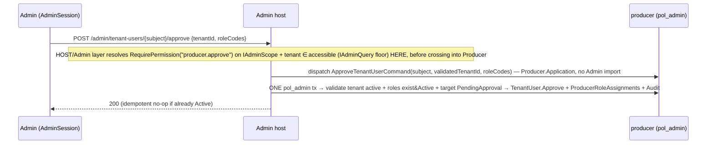

# Design: Producer Google SSO + Role RBAC

> **Amended 2026-07-01:** the `RegistrationTickets` table + `IRegistrationTicketRepository`
> (`HasPendingAsync`/`TryConsumeAsync`) are removed. The registration/correction wire ticket is now a
> stateless signed+time-limited Data Protection token (no server row); the callback persists nothing and
> the account is still created only at submit (REQ-9.6 unchanged). Duplicate/replay safety = the UNIQUE
> indexes on `ProducerAccount.Subject` + `TenantUserProfile.ProducerAccountId` + `ProducerAccount.Resubmit()`'s
> Rejected-only guard. `DisplayName` is server-computed from the now-required `FirstName`+`LastName`. See the
> requirements.md 2026-07-01 amendment; any ticket-row/`HasPending`/`registration-pending` prose below is superseded.

> **Amended 2026-07-01 (person details moved onto the account):** the `TenantUserProfile` entity/table/repo/config
> are DELETED (migration `AddProducerAccountDetailsDropProfile`); its fields + `SetDetails`/`SetPhoto` move onto
> `ProducerAccount` — a "tenant" is the company/app, not the person. Any `TenantUserProfile`/`ITenantUserProfileRepository`
> prose below is superseded; the duplicate-registration guard is now the single UNIQUE `Subject` index on the account.

> Status: approved 2026-06-25 (AFK-delegated per /goal directive; spec-architect critique B1–B3/S1–S10/N1–N3 applied)

Master inputs: approved `requirements.md` (23 REQs, findings F1–F10) + the approved plan
`/Users/king_developer/.claude/plans/producer-google-sso-parsed-frost.md`. Strategy: **duplicate** the
shipped Admin auth/RBAC stacks (copy-rename) into a new `Producer` module. Admin code is touched only for the
additive `producer` permission group + `producer.approve`/`producer.reject` keys (REQ-18) and the shared
`OutboxDispatcher.EventTypes` + `src/Contracts` additions (REQ-20.3, BuildingBlocks).

**Why duplicate (corrected per critique B2):** it is a deliberate choice to avoid destabilising the
freshly-shipped Admin auth — NOT a test constraint. The current `Architecture.Tests` do NOT yet enforce a
Producer↔Admin boundary (the `Modules` list is `[Products,Cart,Checkout,Orders,Payments]`; `AdminArchitectureTests`
forbids the old `Identity.*`, not `Producer.*`). This design therefore ADDS `ProducerArchitectureTests` asserting
`Producer.* ⇏ Admin.*` and `Admin.* ⇏ Producer.*`, else REQ-23.3 is vacuous.

**Naming note (canon reconciliation):** `CODING_STANDARDS.md:53` forward-guessed the rebuilt entity as
`ProducerAccount`. The goal, the removed migration (`TenantUsers`), and `identity-rbac` all use **`TenantUser`** —
that name wins. A small canon-sync (update line 53 + ARCHITECTURE note) is a task (mirrors `admin-oidc-session`
REQ-13 canon reconciliation).

---

## Architecture Overview

A new vertical-slice module `src/Modules/Producer/{Producer.Domain, Producer.Application, Producer.Infrastructure}`
plus host wiring in `src/Hosts/Api/Producer*.cs`, structurally mirroring `Admin`. Two planes stay separate:

- **Producer = data plane.** `TenantUser` (+`ExternalLogin`, `RegistrationTicket`, `TenantUserProfile`,
  `RegistrationAudit`) in schema `producer`. `TenantUsers` is the only RLS-keyed table (FILTER+BLOCK on `TenantId`);
  every other producer table is control-plane (`pol_admin` only, no predicate).
- **Producer session = control-plane BFF.** `ProducerSession`/`ProducerAuthAudit` mirror `AdminSession`/
  `AdminAuthAudit`: opaque cookie, SHA-256 hash at rest, rotation + reuse-detection + revoke, CSRF double-submit.
- **Producer RBAC = control-plane catalog.** `ProducerPermissions`/`ProducerRoles`/`ProducerRolePermissions`/
  `ProducerRoleAssignments` mirror the Admin catalog; `RequireProducerPermission` fail-closed + boot parity guard.
- **Admin = approver (untouched).** The admin approve/reject endpoints are gated by the Admin `RequirePermission`
  reading `IAdminScope` + the existing scoped-accessible-tenant floor (`IAdminQuery`).

Component map (each Producer file → the Admin file it copy-renames):

| Layer | New file | Mirrors |
|---|---|---|
| Domain | `TenantUser.cs`, `TenantUserStatus.cs`, `ExternalLogin.cs`, `RegistrationTicket.cs`, `TenantUserProfile.cs`, `RegistrationAudit.cs` | (new — was the removed Identity module) |
| Domain | `ProducerSession.cs`, `ProducerSessionStatus.cs`, `ProducerSessionDecision.cs`, `ProducerSessionTokens.cs` | `AdminSession.cs`, `AdminSessionDecision.cs`, `AdminSessionTokens.cs` |
| Domain | `ProducerPermissions.cs`, `ProducerRole.cs`, `ProducerRoleStatus.cs`, `ProducerRolePermission.cs`, `ProducerRoleAssignment.cs` | `AdminPermissions.cs`, `AdminRole.cs`, … |
| Application | `ProducerSessionPorts.cs`, `ProducerRolePorts.cs`, `ProducerPorts.cs`, `IProducerScope.cs`+`ProducerResolution`, `IPhotoStore.cs` | `AdminSessionPorts.cs`, `AdminRolePorts.cs`, `IAdminScope.cs` |
| Application | `ResolveLogin.cs`, `ResolveProducerById.cs`, `SubmitRegistration.cs`, `ApproveTenantUser.cs`, `RejectTenantUser.cs`, role CRUD | `ResolveAdmin.cs`, `ResolveAdminById.cs`, `AssignTenant.cs`, `CreateRole.cs`… |
| Infrastructure | `ProducerModuleRegistration.cs`, `Persistence/ProducerConfigurations.cs`, `ProducerSessionConfigurations.cs`, `ProducerRoleConfigurations.cs`, `ProducerRepositories.cs`, `ProducerRoleRepository.cs`, `ProducerSessionStore.cs`, `LocalPhotoStore.cs` | `Admin*` equivalents |
| Host | `ProducerOidcOptions.cs`, `ProducerOidcAuthentication.cs`, `ProducerLoginService.cs`, `ProducerCallbackResolver.cs`, `ProducerSessionAuthenticationHandler.cs`, `ProducerSessionCookies.cs`, `ProducerCsrfFilter.cs`, `ProducerDataProtection.cs`, `ProducerPermissionAuthorization.cs`, `ProducerHostWiring.cs`, `ProducerSessionPruneService.cs` | `Admin*` host files |
| Contracts | `TenantUserRegistrationSubmitted.cs` | `CheckoutConfirmed.cs` |
| Migrations | `AddProducerIdentityTables`, `AddProducerSessionTables`, `AddProducerRoleRbacTables`, `AddProducerApprovePermissionToAdminCatalog` | `20260622175509_AddIdentityTables`, `…AddAdminSessionTables`, `…AddAdminRoleRbacTables` |

---

## Sequence Diagrams

### Flow A — Login → callback → state branch (REQ-8/9)

```mermaid
sequenceDiagram
  participant B as Browser
  participant API as Producer host (BFF)
  participant G as Google
  participant DB as producer (pol_admin)
  B->>API: GET /producer/auth/login?returnTo=…
  API->>API: gen state/nonce/PKCE (Producer DP purpose), validate returnTo allowlist
  API-->>B: 302 → Google authorize (code+S256+state+nonce)
  B->>G: authenticate
  G-->>B: 302 → GET /producer/auth/callback?code&state
  Note over API: framework AddOpenIdConnect handler does code-exchange + JWKS verify + state/nonce/PKCE (NOT hand-written); we hook OnTokenValidated(email_verified/hd) + OnTicketReceived(branch) + OnRemoteFailure(deny)
  API->>DB: ExternalLogin(google, sub)?  (in OnTicketReceived via ProducerCallbackResolver)
  alt none
    API-->>B: 302 → registration page + Registration ticket (signed)
  else TenantUser Active
    API->>DB: ProducerSession.Start (one tx: session+audit)
    API-->>B: Set-Cookie __Host-prd_session + prd_csrf; 302 → returnTo
  else PendingApproval
    API-->>B: 403 "awaiting approval" (no session)
  else Rejected
    API-->>B: 302 → registration page + Correction ticket (signed)
  end
```

### Flow B — Register submit (anonymous, ticket-gated) → event (REQ-3/4/5/7/20)

```mermaid
sequenceDiagram
  participant B as Browser (/register)
  participant API as Producer host
  participant DB as producer (pol_admin, RLS bypass)
  B->>API: POST /producer/register (multipart: ticket + form + photo)
  API->>API: verify ticket signature + Purpose; validate photo (type/magic-byte/size) BEFORE buffering
  API->>DB: ONE pol_admin tx → consume ticket (UPDATE UsedAt WHERE UsedAt IS NULL AND ExpiresAt>now, rowcount=1) + TenantUser(PendingApproval, TenantId=NULL) + ExternalLogin + Profile(+photo key) + OutboxMessage(sentinel tenant) on the SAME keyed pol_admin context
  alt consume rowcount=1
    API-->>B: 201 (or 200 redirect to "awaiting approval")
  else expired/used/wrong purpose (rowcount=0)
    API-->>B: rollback → 400/409, no row
  else unique(provider,subject) violation
    API-->>B: UoW translates SqlException 2627/2601 → 409 (not 500)
  end
  Note over DB: NULL TenantId ⇒ BLOCK (AFTER INSERT and AFTER UPDATE) rejects under tenant ctx ⇒ all register/resubmit/approve writes MUST be pol_admin bypass
```

### Flow C — Admin approve (REQ-6/18)



### Flow D — Authenticated producer request (REQ-10/11/12/17)

```mermaid
sequenceDiagram
  participant B as Browser (prd_session)
  participant H as ProducerSessionAuthenticationHandler
  participant DB as producer (pol_admin)
  B->>H: request + cookie (+ X-CSRF-Token on unsafe)
  H->>DB: find session by SHA-256(token)
  H->>H: decision policy → ServeActive | ServeUnderGrace | rotate | ReuseRevokeFamily | Reject
  H->>DB: re-resolve TenantUser READ-ONLY (status/tenant/effective permissions)
  alt Active
    H->>H: bind IProducerScope + claims (tenant_id, tenant_role, permissions) + ambient TenantId
    H-->>B: handler runs; RequireProducerPermission(key) enforced; Set-Cookie if rotated
  else not Active / no session
    H-->>B: 401/403 (no binding)
  end
```

---

## Data Models & Interfaces

### Domain entities (Producer.Domain)

- **`TenantUser : AggregateRoot<Guid>`** — `Subject` (unique), `Email`, `TenantId Guid?` (NULL until approval),
  `Status`, `CreatedAt`. No role column (F1 — roles live in `ProducerRoleAssignments`). Methods: `Register(subject,
  email, now)` → Pending (raises nothing yet; event enqueued by handler in-tx, REQ-20); `Approve(tenantId, now)`
  (Pending→Active, idempotent no-op if Active, throws on Rejected/Suspended); `Reject(now)` (Pending→Rejected);
  `Resubmit(now)` (Rejected→Pending); `Suspend(now)` (Active→Suspended). Transition guard enforces REQ-1.5.
- **`TenantUserStatus`** enum: `PendingApproval`, `Active`, `Rejected`, `Suspended`.
- **`ExternalLogin`** — `Id`, `Provider` (`"google"`), `Subject`, `TenantUserId`; unique `(Provider, Subject)`.
- **`RegistrationTicket : AggregateRoot<Guid>`** — `Id`, `Subject`, `Email`, `HostedDomain?`, `Purpose`
  (`Registration`|`Correction`), `CreatedAt`, `ExpiresAt`, `UsedAt?`. `Consume(now)` = single-use guard
  (REQ-3.3/3.4). The wire ticket is a signed+encrypted token carrying `{id, subject, email, hd, purpose, exp}`;
  the row is the replay authority.
- **`TenantUserProfile`** — `Id`, `TenantUserId` (unique), `DisplayName`, the producer detail fields,
  `PhotoObjectKey string?`, `PhotoContentType string?` (bytes are NOT here — REQ-7.2).
- **`RegistrationAudit`** (append-only) — `Action`, `ActorSubject`, `TargetSubject`, `Role?`, `TenantId?`,
  `CorrelationId`, `OccurredAt`.
- **`ProducerSession : AggregateRoot<Guid>`** `[DUP→AdminSession]` — `FamilyId`, `TokenHash` (varbinary(32),
  unique), `TenantUserId`, `Status` (`Active`/`Superseded`/`Revoked`), `IssuedAt`, `IdleExpiresAt`,
  `AbsoluteExpiresAt`, `SupersededAt?`, `SupersededBySessionId?`, `CreatedIp`, `UserAgent`. `Start`/`Rotate`/
  `IsLiveAt`/grace = verbatim copy.
- **`ProducerSessionDecision`** `[DUP]` — pure decision table (Reject/ServeActive/ServeUnderGrace/ReuseRevokeFamily).
- **`ProducerSessionTokens`** `[DUP]` — `NewOpaqueToken()` (256-bit b64url) + `Hash()` (SHA-256). Duplicated, Admin
  untouched (rejected the shared-kernel shim to avoid touching shipped auth — plan §D5).
- **`ProducerPermissions`** `[DUP→AdminPermissions]` — code-canonical vocab + `AllKeys` frozen set. Keys: groups
  `catalog`/`payment`/`roles`; keys `product.create`, `product.update`, `payment.create`, `payment.redirect`,
  `producer.roles.view`, `producer.roles.manage`, `producer.user.roles`.
- **`ProducerRole`** `[DUP→AdminRole]` — `Id`, `Code` (immutable, `^[a-z0-9_]+$`, ≤64, unique), `Name`,
  `Description?`, `Color?`, `Status`, `Permissions` (via `SetPermissions(keys, catalogKeys)`). Anchor
  `OwnerCode="tenant_owner"` undeletable/undeactivatable (REQ-16.5).
- **`ProducerRolePermission`** `(RoleId, PermissionKey)` unique; **`ProducerRoleAssignment`** `(TenantUserId,
  RoleId, TenantId, AssignedBy, AssignedAt)` unique on `(TenantUserId, RoleId)`.

### Ports (Producer.Application)

```csharp
public interface IProducerSessionStore {            // [DUP→IAdminSessionStore]
  Task<ProducerSession?> FindByTokenHashAsync(byte[] hash, CancellationToken ct);
  Task<Guid?> GetFamilyActiveSessionIdAsync(Guid familyId, CancellationToken ct);
  void Add(ProducerSession s);
  Task<bool> TrySupersedeAsync(Guid id, Guid successorId, DateTime now, CancellationToken ct);
  Task SlideIdleAsync(Guid id, DateTime idleExpiresAt, CancellationToken ct);
  Task RevokeFamilyAsync(Guid familyId, CancellationToken ct);
  Task RevokeAllForUserAsync(Guid tenantUserId, CancellationToken ct);   // suspend/reject (REQ-12.3)
  Task PruneAsync(DateTime now, CancellationToken ct);
  Task SaveChangesAsync(CancellationToken ct);
}
public interface IProducerRoleRepository {           // incl. effective-permission union over ACTIVE roles (REQ-16.4)
  Task<IReadOnlySet<string>> ListEffectivePermissionsAsync(Guid tenantUserId, CancellationToken ct);
  /* role CRUD + assignment set */
}
public interface IPhotoStore {                        // REQ-7.2
  Task<string> PutAsync(Stream bytes, string contentType, CancellationToken ct);   // → opaque object key
  Task<(Stream bytes, string contentType)?> GetAsync(string objectKey, CancellationToken ct);
}
public interface IProducerScope { bool IsBound { get; } ProducerResolution Current { get; } }
public sealed record ProducerResolution(Guid TenantUserId, string Email, Guid TenantId, IReadOnlySet<string> Permissions);
```

Repositories (`ITenantUserRepository`, `IExternalLoginRepository`, `IRegistrationTicketRepository`,
`ITenantUserProfileRepository`, `IRegistrationAuditWriter`, `IProducerAuthAuditWriter`) all bind the **keyed
`pol_admin` `ProducerDbContext`** (REQ-19.2/19.4).

**`ProducerOutboxWriter` (critique B1 — NOT the stock `IOutbox`/`EfOutbox`).** `EfOutbox` injects the *default*
`ProducerDbContext` (pol_app connection) and throws when no tenant is bound — so it can neither share the
registration's pol_admin transaction nor run tenant-less. The Producer registration handler instead inserts the
`OutboxMessage` row directly into the SAME keyed pol_admin `ProducerDbContext` (via a thin `ProducerOutboxWriter`)
and commits it in the one `SaveChangesAsync` with the TenantUser/ExternalLogin/Profile — true atomicity (REQ-20.2).
The row is stamped with a fixed, non-empty platform **sentinel `TenantId`** (`Guid.Empty` is rejected by
`AmbientTenant.Begin`). The Admin-side consumer writes an idempotent row (unique on `TenantUserId`) to a new
control-plane table **`ProducerRegistrationNotices`** granted INSERT/SELECT to **`pol_worker`** (the
`OutboxDispatcher` principal — it is NOT in `pol_rls_bypass`) and to `pol_admin`, and touches no tenant-scoped
table (critique S5).

### Commands / queries

`ResolveLoginQuery(provider, subject)` → `{ NotFound | Active(ProducerResolution) | PendingApproval | Rejected }`
drives Flow A. `ResolveProducerByIdQuery(tenantUserId)` → fresh READ-ONLY status+tenant+permissions (per-request,
REQ-17.1). `SubmitRegistrationCommand(ticket, form, photo?)` (REQ-4/5/7). `ApproveTenantUserCommand(subject,
validatedTenantId, roleCodes)` / `RejectTenantUserCommand(subject, reason)` (REQ-6). The Admin permission check +
accessible-tenant floor (`IAdminScope`/`IAdminQuery`) run at the HOST before dispatch (critique B3); the command
receives an already-validated tenant id and lives in `Producer.Application` with no Admin import. Role CRUD mirrors Admin.

### API contracts (host)

| Method · Route | Auth | REQ |
|---|---|---|
| `GET /producer/auth/login?returnTo` | anonymous, rate-limited | 8 |
| `GET /producer/auth/callback` | anonymous (OIDC) | 9 |
| `POST /producer/register` (multipart) | **anonymous, ticket-gated**, no CSRF | 3/4/5/7 |
| `POST /producer/auth/logout` · `/logout-all` | ProducerSession + CSRF | 12 |
| `GET /producer/me` | ProducerSession | 17.5 |
| `GET /producer/permissions` · role/assignment **reads** | ProducerSession (authenticated; mirror Admin — no permission gate, or `producer.roles.view`) | 15/16 |
| role **create/update/delete** | ProducerSession + `RequireProducerPermission(producer.roles.manage)` | 16 |
| assign roles to a producer | ProducerSession + `RequireProducerPermission(producer.user.roles)` | 16 |
| `POST /admin/tenant-users/{subject}/approve` · `/reject` | AdminSession + `RequirePermission(producer.approve|producer.reject)` + accessible floor | 6/18 |
| `POST /products` · `/payment-sessions` · `/payment-sessions/{id}/redirect` | `producer` policy + `RequireProducerPermission`, behind `EnforcePermissionsOnWrites` | 17 |

### Config keys

`Producer:Oidc:{Authority,ClientId,ClientSecret,CallbackPath=/producer/auth/callback,ErrorPath}`,
`Producer:Session:{IdleMinutes=30,AbsoluteHours=8,RotationMinutes=15,GraceSeconds=60}`,
`Producer:RegisterUrl` (default `http://localhost:5200/register`), `Producer:HostedDomain?`,
`Producer:SpaOrigin` (CORS, REQ-14.5), `Producer:EnforcePermissionsOnWrites` (default true new envs / false until FE).
Secret via env `Producer__Oidc__ClientSecret`; `appsettings.Development.json` gitignored.

### Migrations (4)

1. **`AddProducerIdentityTables`** — author FRESH, mirroring the dropped `20260622175509_AddIdentityTables.cs`
   schema but **NOT verbatim** (critique S10): drop the old `Role int` column on `TenantUsers` (F1 — roles live in
   assignments) and drop the `Utc` column suffixes (`CreatedAtUtc`→`CreatedAt`, `UsedAtUtc`→`UsedAt`,
   `OccurredAtUtc`→`OccurredAt`, per CODING_STANDARDS); add `RegistrationTickets.Purpose int`,
   `TenantUserProfiles.{PhotoObjectKey,PhotoContentType}` + the detail fields. Also create the control-plane
   `ProducerRegistrationNotices` (unique `TenantUserId`) granted INSERT/SELECT to `pol_worker` + `pol_admin` (S5).
   RLS: `ALTER SECURITY POLICY producer.TenantIsolationPolicy ADD FILTER/BLOCK fn_tenant_predicate(TenantId) ON
   producer.TenantUsers` (BLOCK is AFTER INSERT and AFTER UPDATE — so resubmit/approve UPDATEs are pol_admin too).
   GRANTs: `pol_app` SELECT on `TenantUsers`; `pol_admin` full on parent + children (children no predicate, no
   `pol_app` grant) — REQ-19.
2. **`AddProducerSessionTables`** `[DUP→AddAdminSessionTables]` — `ProducerSessions` + `ProducerAuthAudits`,
   control-plane, `pol_admin` only (+DELETE for prune); indexes TokenHash(unique)/FamilyId/TenantUserId/AbsoluteExpiresAt.
3. **`AddProducerRoleRbacTables`** `[DUP→AddAdminRoleRbacTables]` — 5 RBAC tables, seed catalog + seed TWO roles
   (critique S7): `tenant_owner` (ALL keys, undeletable anchor — a DELIBERATE grant, not the default) AND
   `tenant_member` (`product.*`+`payment.*` only, NO `roles.*`/`user.roles`) as the ordinary approve choice, so
   approving a producer does not by default hand them tenant role-management. `ProducerRoleAssignments` adds
   `TenantId`. Control-plane.
4. **`AddProducerApprovePermissionToAdminCatalog`** — add a new Admin permission group `producer` (LabelTh) to
   `AdminPermissionGroups`; INSERT `producer.approve`/`producer.reject` under it into `AdminPermissions`; add the
   matching consts + `All`/`GroupKeys` entries in `AdminPermissions.cs`; seed-grant both to `super_admin`
   (REQ-18.1). **Declared Admin-side test churn (critique S1):** this moves `AdminPermissions.AllKeys.Count` 14→16,
   group count 5→6, and `super_admin` grants 14→16 — so `AdminRoleTests` (count assert ~`:89`) and
   `AdminRoleRbacGrantsTests` (perm/group/grant counts ~`:22-30`) MUST be updated. This is the accepted, declared
   extent of the Admin touch (REQ-23.2).

---

## Technology Decisions

- **Duplicate, not share** (plan §D5): `Architecture.Tests` forbid Producer↔Admin deps; the author chose
  "mirror, don't share"; copying ~session/RBAC keeps shipped Admin auth untouched. Each `[DUP]` file carries a
  `// ponytail: DUPLICATE of Admin.<X> — deliberate debt, do not refactor into a shared base` comment so
  `/ponytail-debt` can harvest it.
- **Ticket = ASP.NET Core Data Protection** signed+encrypted token (no new dep), distinct purpose string from the
  OIDC state protector. Server row = single-use authority (REQ-3.4).
- **Photo store** = `IPhotoStore` port + `LocalPhotoStore` (gitignored dir, opaque GUID key) for dev; prod swaps an
  S3/Blob adapter behind the same port. Magic-byte sniff is a tiny header check, no image lib (REQ-7.3). Size is
  bounded BEFORE buffering (critique N3): set `MultipartBodyLengthLimit`/`RequestSizeLimit` ≈ cap+overhead at the
  endpoint, read the stream bounded, sniff magic bytes from the first few bytes, reject before `PutAsync` — never
  check `stream.Length` after a full buffer (DoS).
- **martinothamar/Mediator 3.0.1** idioms (`ValueTask`, source-gen, Scoped DbContext), `.NET 10`/`C# 14` nullable,
  schema `producer`, no `Utc` column suffix — per CODING_STANDARDS.
- **Two OIDC clients on one host**: distinct scheme `ProducerGoogle`, callback `/producer/auth/callback`, DP
  application name, and cookie names `__Host-prd_session`/`prd_csrf` (REQ-14.4) — no value shared with Admin's
  `Google` client. Blank `ClientId` ⇒ skip scheme registration (REQ-14.2) so a half-configured env doesn't fault
  the whole host. The flow uses the framework `AddOpenIdConnect` handler (NOT a hand-written callback — critique
  S2): it performs code-exchange + JWKS verify + state/nonce/PKCE; we only hook `OnTokenValidated`
  (email_verified/hd), `OnTicketReceived` (the 4-way branch via `ProducerCallbackResolver`), and
  `OnRemoteFailure`/`OnAccessDenied` (deny → error page). A second throwaway sign-in scheme `producer-oidc-noop`
  (name distinct from Admin's `oidc-noop`) satisfies the framework's sign-in-scheme requirement. `state`/`nonce`/PKCE
  live in the framework's DataProtection-protected correlation cookie (REQ-8.2 maps to that, not a hand-rolled store).
- **Dual-scheme `producer` policy + ambient tenant** (critique S3/S4): `AddPolicy("producer", p =>
  p.AddAuthenticationSchemes(ProducerSession, JwtBearer).RequireAuthenticatedUser())` — authn-only, NO
  `RequireClaim("role", …)` (unlike the `tenant` policy). The producer session principal carries a `tenant_id`
  claim — the exact path `HttpTenantContext` reads — so the existing `CreateProductCommand(tenant.TenantId, …)`
  keeps working unchanged; the handler sets the claim, NOT `ITenantScope.Begin` (which throws on double-bind). The
  principal deliberately omits a `role` claim so it never resolves as a tenant-Bearer principal. A tenant-Bearer
  caller authenticates but binds no `IProducerScope` → fail-closed 403 by `RequireProducerPermission`.
- **Outbox sentinel tenant** (REQ-20.2): registration runs tenant-less on `pol_admin`; `IOutbox` requires a bound
  tenant, so the enqueue uses a fixed platform GUID; the Admin consumer treats it as cross-tenant and touches no
  tenant-scoped table.

## Error Handling Strategy

Per-case → status, via the shared ProblemDetails handler:

| Case | Status | REQ |
|---|---|---|
| no/expired/used/wrong-purpose ticket on register | 400/409, no row | 3.6/22.1 |
| duplicate subject (incl. concurrent) | 409 (unique constraint, one winner) | 4.6/22.4 |
| approve/reject unknown target | 404 | 22.2 |
| approve tenant unknown/inactive | 409/422 | 6.5/22.3 |
| approve tenant out of admin scope, or missing `producer.approve` | 403 | 6.1/6.5 |
| approve non-Pending target / unknown-or-Inactive role | 409 | 6.5 |
| login when PendingApproval | 403 "awaiting approval" | 9.4/22.5 |
| OIDC state mismatch / id_token verify fail / OAuth error | no session, 302 error page + denied audit | 9.5 |
| RequireProducerPermission miss (incl. tenant-Bearer no-scope) | 403, fail-closed | 17.2 |
| session unknown/expired/revoked / reuse after grace | 401 (+ family revoke on reuse) | 11.3/11.4/12 |
| photo wrong type/oversize | 400/413, nothing stored | 7.3/7.4 |

## Testing Strategy

Logic-first: pure unit tests before wiring; integration with the SQL container; `WebApplicationFactory` for flows.

- **Unit (`tests/Producer.Tests`)** — `TenantUser` transitions incl. idempotent approve + illegal-transition guard
  (REQ-1.5/6.4); `RegistrationTicket.Consume` single-use/expiry/purpose (REQ-3); `ProducerSessionDecision` table
  incl. grace/reuse (REQ-11); `ProducerRole` catalog-subset + slug + undeletable anchor (REQ-16);
  effective-permission union over active roles (REQ-16.4); `ReturnUrlPolicy` allowlist (REQ-8.3); photo
  validation: type allowlist + magic-byte + size (REQ-7.3/7.4); `ProducerPermissionParity` over gate metadata
  (REQ-15.5).
- **Integration (`tests/Integration.Tests`)** — RLS: Pending NULL-TenantId insert **rejected under pol_app, allowed
  under pol_admin**; approved row visible only to its tenant; never a NULL row to pol_app (REQ-19); session store
  `TrySuperseded` single-winner + family revoke + prune (REQ-11/12); grants parity (control-plane tables pol_admin
  only); seeded catalog == `ProducerPermissions.All` (REQ-15).
- **Hosts (`tests/Hosts.Tests`)** — `/producer/auth/login` → Google authorize w/ code+PKCE+state+nonce (mirror
  `AdminAuthLoginRedirectTests`); callback branches new→ticket+redirect / Active→cookie+returnTo / Pending→403 /
  Rejected→correction (REQ-9); register submit ticket-gated incl. replay 409 + photo (REQ-3/4/7); approve/reject
  incl. scoped-accessible + idempotent (REQ-6); the 3 endpoints: producer+perm pass / no-perm 403 / **existing
  tenant-Bearer tests green flag-off** / flag-on Bearer fail-closed 403 (REQ-17); producer-cookie request →
  `ITenantContext.TenantId == producer.tenant` (S4); register replay/2-tab → one 201 + one 409, no 500 (S9); the
  sentinel-tenant registration event → Admin consumer succeeds, not poison (S5); **new `ProducerArchitectureTests`**
  asserting `Producer.* ⇏ Admin.*` and `Admin.* ⇏ Producer.*` (REQ-23.3, else vacuous — B2); updated
  `AdminRoleTests`/`AdminRoleRbacGrantsTests` counts (14→16 perms, 5→6 groups, S1).

## Requirement Traceability

| Design element | REQ |
|---|---|
| `TenantUser` aggregate + `TenantUserStatus` + transition guard | 1.1–1.6 |
| `ExternalLogin` `(Provider,Subject)` unique + resolve | 2.1–2.4 |
| `RegistrationTicket` (signed token + server row, Purpose, `Consume`) | 3.1–3.6 |
| `SubmitRegistrationCommand` (ticket-gated, one pol_admin tx, identity-from-ticket) | 4.1–4.6 |
| Reject→Correction ticket→Resubmit (`Resubmit`, Flow A Rejected branch) | 5.1–5.5 |
| `ApproveTenantUserCommand` (tenant+role+accessible+idempotent+audit) | 6.1–6.6 |
| `TenantUserProfile` + `IPhotoStore`/`LocalPhotoStore` + validation | 7.1–7.5 |
| `ProducerOidcAuthentication` login (`GET /producer/auth/login`, PKCE, returnTo, rate-limit) | 8.1–8.4 |
| `ProducerCallbackResolver` + `ProducerLoginService` (verify + branch) | 9.1–9.6 |
| `ProducerSession` + `ProducerSessionCookies` (only-when-Active, lifetime) | 10.1–10.4 |
| `ProducerSessionDecision` + handler rotation/grace/reuse | 11.1–11.5 |
| logout/logout-all + `RevokeAllForUserAsync` + per-request re-resolve | 12.1–12.4 |
| `ProducerCsrfFilter` + ticket-as-capability for register | 13.1–13.4 |
| `ProducerOidcOptions` secret custody + `ProducerDataProtection` + distinct scheme/cookies + CORS | 14.1–14.5 |
| `ProducerPermissions` catalog + `GET /producer/permissions` + `ProducerPermissionParity` | 15.1–15.5 |
| `ProducerRole`/`ProducerRolePermission`/`ProducerRoleAssignment` + effective union + anchor | 16.1–16.5 |
| `ProducerSessionAuthenticationHandler` resolve+bind + `RequireProducerPermission` + dual-scheme + flag + `/producer/me` | 17.1–17.6 |
| `AddProducerApprovePermissionToAdminCatalog` + Admin-gated approve + dual parity | 18.1–18.3 |
| `AddProducerIdentityTables` RLS/grants + pol_admin Pending insert | 19.1–19.5 |
| `TenantUserRegistrationSubmitted` Contract + **`ProducerOutboxWriter`** (keyed pol_admin, same tx) + sentinel tenant + `OutboxDispatcher.EventTypes` (BuildingBlocks) + Admin consumer → `ProducerRegistrationNotices` (pol_worker grant) | 20.1–20.4 |
| `RegistrationAudit`/`ProducerAuthAudit` append-only | 21.1–21.3 |
| ProblemDetails mapping (Error Handling table) | 22.1–22.5 |
| Duplicate strategy (design choice, not test-forced) + tenant-Bearer retained + **new `ProducerArchitectureTests`** (real boundary) + Admin touch = group+keys+EventTypes+test-count updates + backend-only | 23.1–23.4 |

## Open design items (carried from requirements; resolve in tasks/PR)
`EnforcePermissionsOnWrites` default per env; exact producer detail-field set + required/optional; prod register
URL + SPA origin; deploy topology (cookie SameSite); suspend endpoint deferred; canon-sync of `ProducerAccount`→
`TenantUser` naming (`CODING_STANDARDS.md:53` + ARCHITECTURE note).

## spec-architect critique log (fresh-context adversarial review)

All findings VERIFIED against real code and APPLIED (none rebutted). The review's verified-correct claims: RLS
predicate behavior (NULL→UNKNOWN→BLOCK, pol_admin bypass), `EfOutbox` throws without a tenant, dispatcher re-binds
tenant per message as `pol_worker`, `EventTypes` is mandatory, keyed pol_admin `ProducerDbContext` + ModuleAssemblies
discovery work for a new module, the dual-scheme OR pattern is sound, `AdminPermissionParity` is fail-closed.

| # | sev | applied |
|---|---|---|
| B1 | blocker | `ProducerOutboxWriter` on the keyed pol_admin context (stock `EfOutbox` = pol_app + needs tenant → can't share tx). Design + REQ-20.2 updated |
| B2 | blocker | "Architecture.Tests forbid Producer↔Admin" was FALSE; add real `ProducerArchitectureTests`. Rationale corrected; REQ-23.3 updated |
| B3 | blocker | approve = Admin-permission + accessible floor at HOST, then dispatch `ApproveTenantUserCommand(validatedTenantId)` into Producer (no Admin import) |
| S1 | should | REQ-18 expanded: new `producer` Admin group + 2 keys + super_admin grant + AdminPermissions.cs + declared test churn 14→16 / 5→6 |
| S2 | should | Admin OIDC uses framework `AddOpenIdConnect` (hooks), not a custom callback; second `producer-oidc-noop` sign-in scheme. Flow A + decisions fixed |
| S3 | should | `producer` policy = `AddAuthenticationSchemes(ProducerSession, JwtBearer).RequireAuthenticatedUser()`, no `RequireClaim` |
| S4 | should | producer principal carries `tenant_id` claim (the `HttpTenantContext` path), not `ITenantScope.Begin` |
| S5 | should | sentinel non-empty tenant; Admin consumer → control-plane `ProducerRegistrationNotices` granted to `pol_worker` |
| S6 | should | `OutboxDispatcher.EventTypes`/`Contracts` declared as a BuildingBlocks touch (REQ-23.2) |
| S7 | should | seed `tenant_member` (product/payment only) as default approve role; `tenant_owner` = deliberate grant |
| S8 | should | API gating matrix: catalog/role reads authenticated, mutate `roles.manage`, assign `user.roles` |
| S9 | should | consume+insert+outbox in ONE pol_admin tx (rowcount=1); UoW translates unique-violation 2627/2601 → 409 |
| S10 | should | migration authored FRESH (no `Role` column F1, no `Utc` suffix); BLOCK is AFTER INSERT AND UPDATE → resubmit/approve also pol_admin |
| N1–N3 | nit | `RevokeAllForUserAsync` rename noted; `producer` policy dual-scheme (not single-pin); multipart size bound before buffering |
