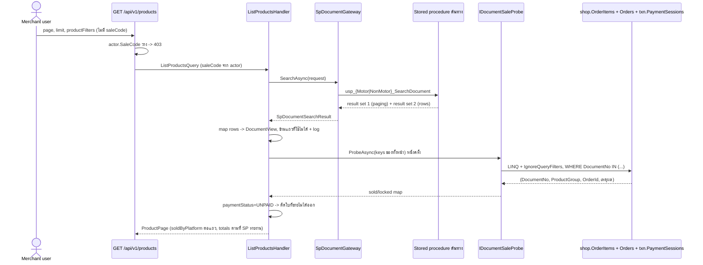
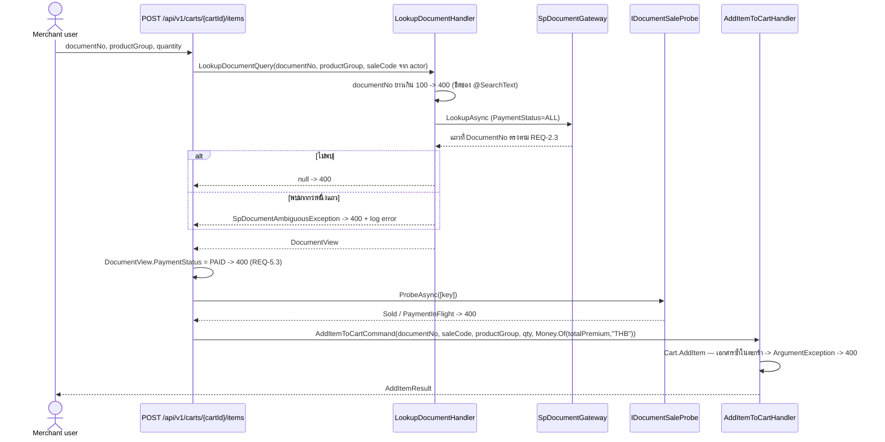
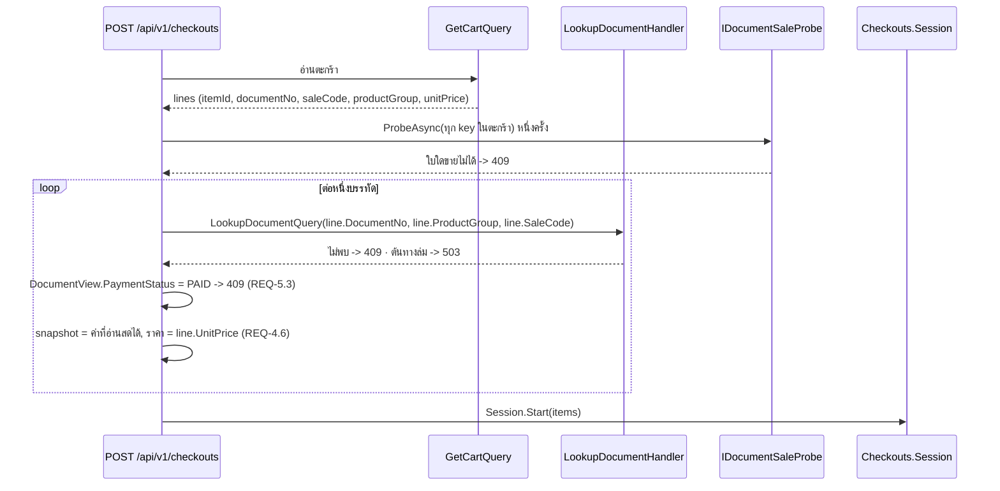
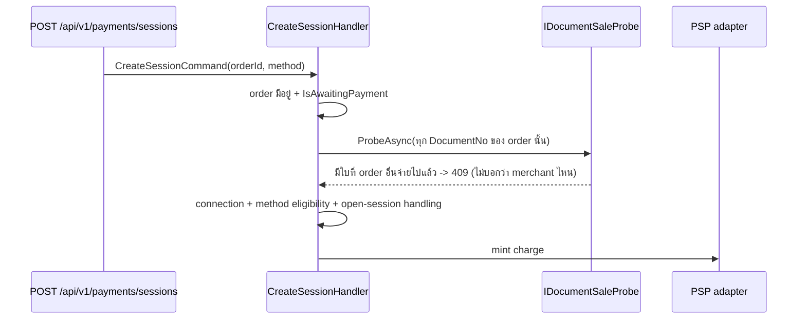

# Design: Products อ่านสดจากฐานข้อมูลภายนอก

> Status: approved 2026-08-05

## Architecture Overview

งานนี้ถอด "แคตตาล็อกสำเนา" ออกจากระบบ แล้วให้ทุกจุดที่เคยอ่านสำเนาไปอ่านจากสองแหล่งแทน:
**ระบบต้นทาง** (ข้อมูลเอกสาร + ราคา) และ **Orders** (เอกสารใบไหนขายไปแล้วหรือกำลังถูกจ่ายอยู่)

### สิ่งที่หายไป

| ของเดิม | เหตุผลที่ลบ |
|---|---|
| ตาราง `shop.Products` | ไม่มีใครอ่านหลังงานนี้ (REQ-6.1) |
| `Product`, `ProductInput` ใน `Products.Domain` | aggregate ตายพร้อมตาราง |
| `IProductRepository` + `ProductRepository` + `ProductConfiguration` (2 ชุดกระจก) | ไม่มี aggregate ให้ persist |
| `CreateProductCommand`, `GetProductByIdQuery` | write seam และ read-by-id ที่ไม่มีที่เก็บให้อ่าน |
| `DocumentPaidOnOrderPaidConsumer` | หน้าที่ mark PAID ย้ายไปเป็นการอนุมานจาก Orders |
| `Contracts.OrderPaid` + entry ใน `OutboxDispatcher.EventTypes` + **จุด enqueue ใน `OrderPaidConsumer`** | consumer เดียวของมันถูกลบ (REQ-8.3) |
| `Product.SoldOrderId` | แทนด้วยผลจาก sold probe (REQ-5.14) |

`Products.Domain` และ `Products.Infrastructure` ไม่หายทั้ง project — enum 4 ตัว (`ProductGroup`,
`DocumentType`, `PaymentStatus`, `InsuranceType`) ยังเป็น published language ของโมดูล และ
`ProductsModuleRegistration` ยังต้องอยู่เพื่อ register `ISpDocumentGateway`

### สิ่งที่เพิ่มและเปลี่ยน

```
Products.Application
  Ports/ISpDocumentGateway.cs        + LookupAsync(documentNo, productGroup, saleCode)
  Ports/SpDocumentContracts.cs       + SpDocumentLookupRequest
  Ports/SpDocumentAmbiguousException.cs (ใหม่, : ArgumentException)
  Ports/SpDocumentItemMapper.cs      คืน DocumentView แทน ProductInput
  DocumentView.cs (ใหม่)             DTO กลางของเอกสารหนึ่งใบ — ProductListItem, snapshot ของตะกร้า
                                     และ snapshot ของ checkout อ่านจากตัวนี้
  LookupDocument.cs (ใหม่)           LookupDocumentQuery -> DocumentView? (internal, ไม่ map route)
  ListProducts.cs                    เลิกใช้ IProductRepository, ใช้ IDocumentSaleProbe

BuildingBlocks.Application
  IDocumentSaleProbe.cs (ใหม่)       port เดียว 3 โมดูลใช้ร่วม
  IActorContext.cs                   + SaleCode (default interface member = null)

Persistence.MerchantRuntime
  Orders/DocumentSaleProbe.cs (ใหม่) adapter — LINQ + IgnoreQueryFilters()
  Orders/DoubleSellAuditor.cs (ใหม่) adapter ของ IDoubleSellAuditor (ชั้นนี้ log ได้)
  Orders/OrderSummaryReader.cs       raw SQL: ProductId -> DocumentNo

Carts.Domain / Carts.Application
  Items/Item.cs                      + DocumentNo, SaleCode, ProductGroup (แทน ProductId)
  Cart.cs                            AddItem คีย์ด้วย DocumentNo + ปฏิเสธซ้ำ;
                                     RemoveItem/SetItemQuantity คีย์ด้วย itemId
  AddItemToCartCommand.cs, CartEdits.cs, GetCart.cs   signature + CartLineView

Checkouts.Domain / Orders.Domain
  Items/Item.cs, Items/*Input.cs, Session.cs, Order.cs   ตัด ProductId ออกจาก ctor และ input

Orders.Application
  IDoubleSellAuditor.cs (ใหม่)       port — Orders.Application log เองไม่ได้ (ดู decision #10)
  OrderPaidConsumer.cs               ตัด enqueue OrderPaid, เรียก auditor แทน
  IOrderSummaryReader.cs, GetOrders.cs, GetOrderDetail.cs, CheckoutConfirmedConsumer.cs
                                     ProductId -> DocumentNo

EF configuration คู่กระจก 6 ไฟล์ (module-owner + runtime) ของ CartItems / CheckoutSessionItems / OrderItems

Merchants.Domain
  Users/User.cs                      ProducerCode -> SaleCode + validate 20/ASCII ใน SetDetails
  Users/RegistrationAttempt.cs       ProducerCode -> SaleCode
  Users/ResolveById.cs, ResolveLogin.cs, UserPorts.cs   Resolution/AccountSnapshot + SaleCode
```

> **ไฟล์ EF คู่กระจก** — ทุกตารางมี configuration สองชุด: ชุดใน `src/Modules/*/​*.Infrastructure/`
> (migration-owner, มี navigation/FK) กับชุดใน `src/Persistence/Persistence.MerchantRuntime/`
> (runtime scalar-only, มี query filter) แก้ชุดเดียว = model กับ DB ไม่ตรง แล้วเจอ
> `PendingModelChangesWarning` ตอน `ef database update`

### ทิศทางการพึ่งพา

`IDocumentSaleProbe` อยู่ที่ `BuildingBlocks.Application` ไม่ใช่ในโมดูลใดโมดูลหนึ่ง เพราะมีสามผู้ใช้
คนละโมดูล (Products.Application, Hosts ตอน add-item/checkout, Payments.Application) — precedent
เดียวกับ `IWebhookMerchantResolver` และ `IProvisioningWriter` ที่อยู่ที่นั่นด้วยเหตุผลเดียวกัน
`ArchitectureBoundaryTests` คุมเฉพาะ module ↔ module จึงไม่กระทบ และ `DocumentKey.ProductGroup`
เป็น `string` (wire value) ไม่ใช่ enum เพื่อไม่ลาก `Products.Domain` เข้า BuildingBlocks

adapter อยู่ `Persistence.MerchantRuntime` ซึ่งเป็นชั้นเดียวที่เห็นทั้ง `shop.OrderItems`,
`shop.Orders` และ `txn.PaymentSessions` — โมดูลไม่อ้างถึงกันตรงตามเดิม

---

## Sequence Diagrams

### ค้นรายการเอกสาร



### เพิ่มเอกสารเข้าตะกร้า



### เริ่ม checkout



### สร้าง payment session



---

## Data Models & Interfaces

### การเปลี่ยนแปลงฐานข้อมูล (migration เดียว)

ลำดับใน `Up()` สำคัญ — backfill ต้องเกิดก่อนตารางต้นทางถูกลบ:

| # | คำสั่ง | เหตุผล |
|---|---|---|
| 1 | `merch.Users`: `RenameColumn ProducerCode -> SaleCode` แล้ว `AlterColumn` เป็น `varchar(20)` | REQ-10.1/10.2/10.6 |
| 2 | `merch.RegistrationAttempts`: เหมือนข้อ 1 | REQ-10.1 |
| 3 | `shop.CartItems`: `AddColumn DocumentNo/SaleCode/ProductGroup` (nullable ชั่วคราว) | REQ-6.2 |
| 4 | `UPDATE ci SET ... FROM shop.CartItems ci JOIN shop.Products p ON p.Id = ci.ProductId` | backfill |
| 5 | `DELETE FROM shop.CartItems WHERE DocumentNo IS NULL` | REQ-6.3 |
| 6 | `AlterColumn` ทั้งสามเป็น NOT NULL | REQ-6.2 |
| 7 | `shop.CartItems`: `DropColumn ProductId` | REQ-2.2 |
| 8 | `shop.CheckoutSessionItems`: `DropColumn ProductId` (มี `DocumentNo`/`ProductGroup` อยู่แล้ว) | REQ-2.2 |
| 9 | `shop.OrderItems`: `DropColumn ProductId` | REQ-2.2 |
| 10 | `CreateIndex IX_OrderItems_DocumentNo ON shop.OrderItems (DocumentNo) INCLUDE (OrderId, ProductGroup)` | REQ-5.15 |
| 11 | `DROP TABLE shop.Products` | REQ-6.1 |

ไม่มีขั้น `REVOKE` แยก — สิทธิ์บนตารางหายไปพร้อม object ตอน `DROP TABLE` การเขียน `REVOKE` หลัง
`DROP` จะ error เพราะ object ไม่มีแล้ว (REQ-6.6 จึงถือว่าปิดโดยขั้นที่ 11 เอง) สิ่งที่ต้องตรวจคือ
ไม่มี GRANT ค้างในสคริปต์ bootstrap ที่อ้างชื่อตารางนี้

`CartItems`/`OrderItems` ไม่มี FK ไปยัง `shop.Products` (ตรวจแล้วใน `PolDbContextModelSnapshot`)
ขั้นที่ 11 จึงไม่ติด FK

`Down()` ทำย้อนกลับทั้ง 11 ขั้นในรูปโครงสร้าง — สร้าง `shop.Products` เปล่ากลับมา, คืนคอลัมน์
`ProductId` เป็น **NOT NULL** ตามของเดิม (ใส่ `defaultValue: Guid.Empty` ให้แถวที่มีอยู่), rename
กลับก่อน `AlterColumn` — **ไม่คืนข้อมูล** (REQ-6.8)

> **กับดักที่เคยเจอในเรพนี้:** `dotnet ef migrations add` มักออก `DropColumn` + `AddColumn` แทน
> `RenameColumn` ซึ่งทำให้ข้อมูลหายเงียบ ๆ — ขั้นที่ 1-2 ต้องตรวจไฟล์ที่ generate มาแล้วแก้ให้เป็น
> `RenameColumn` ก่อน commit

### สคีมาของ `shop.CartItems` หลังเปลี่ยน

| คอลัมน์ | ชนิด | หมายเหตุ |
|---|---|---|
| `Id` | `uniqueidentifier` | มินต์โดย domain (`Guid.CreateVersion7()`), `ValueGeneratedNever` — ใช้เป็น `itemId` ใน route |
| `CartId`, `MerchantId` | `uniqueidentifier` | เดิม |
| `DocumentNo` | `nvarchar(150)` NOT NULL | ตัวระบุเอกสาร |
| `SaleCode` | `varchar(20)` NOT NULL | ค่าที่ต้นทางคืน ไม่ใช่ที่ client ส่ง (REQ-4.7) |
| `ProductGroup` | `varchar(10)` NOT NULL | wire value ของ enum |
| `Quantity`, `UnitPrice_Amount`, `UnitPrice_Currency` | เดิม | |

### พอร์ตใหม่

```csharp
// BuildingBlocks.Application/IDocumentSaleProbe.cs
public sealed record DocumentKey(string DocumentNo, string ProductGroup);

public enum DocumentSaleState { Sellable = 0, Sold = 1, PaymentInFlight = 2 }

/// <summary>เหตุผลที่ขายไม่ได้ พร้อม order ที่ถือไว้ — ไม่ใช่ bool (REQ-5.14)</summary>
public sealed record DocumentSaleStatus(DocumentKey Key, DocumentSaleState State, Guid? HeldByOrderId);

public interface IDocumentSaleProbe
{
    /// <summary>ตรวจทุก key ในคำขอเดียวด้วยการอ่านครั้งเดียว (REQ-5.15) ข้ามทุก merchant (REQ-5.2)
    /// key ที่ไม่ปรากฏในผลลัพธ์ = Sellable</summary>
    Task<IReadOnlyList<DocumentSaleStatus>> ProbeAsync(
        IReadOnlyCollection<DocumentKey> keys, CancellationToken cancellationToken);
}
```

```csharp
// Orders.Application/IDoubleSellAuditor.cs
/// <summary>รายงาน double-sell ตอน order เปลี่ยนเป็น Paid (REQ-5.16/8.2) — ประกาศที่นี่และ implement
/// ใน Persistence.MerchantRuntime เพราะ Orders.Application ไม่ reference logging (csproj เป็นของ spine)</summary>
public interface IDoubleSellAuditor
{
    Task ReportIfDoubleSoldAsync(Guid orderId, CancellationToken cancellationToken);
}
```

```csharp
// BuildingBlocks.Application/IActorContext.cs — เพิ่มแบบ default interface member
/// <summary>รหัสผู้ขายของ merchant user ที่ผูกกับ request นี้ (REQ-4.8/4.9)</summary>
string? SaleCode => null;
```

default implementation ทำให้ test double ~15 ตัวและ `WorkerActorContext` ไม่ต้องแก้ — มีแต่
`HttpActorContext` ที่ override จริง โดยอ่าน claim `sale_code` แบบ lazy per access เหมือน
`merchant_id` (ห้าม snapshot ตอน construct — `bugfix-merchant-prebind-wiring` F5)

```csharp
// Products.Application/Ports/ISpDocumentGateway.cs — เพิ่มเมธอด
Task<SpDocumentItem?> LookupAsync(SpDocumentLookupRequest request, CancellationToken cancellationToken);

// Products.Application/Ports/SpDocumentContracts.cs
public sealed record SpDocumentLookupRequest(string DocumentNo, ProductGroup ProductGroup, string SaleCode);

// Products.Application/Ports/SpDocumentAmbiguousException.cs
public sealed class SpDocumentAmbiguousException : ArgumentException   // -> 400
```

`LookupAsync` เรียก procedure เดิมด้วย `@SearchText = documentNo`, `@PaymentStatus = 'ALL'`,
`@PageNo = 1`, `@PageSize = 25`, `@CountMode = 'FAST'` แล้วกรองแถวที่ `DocumentNo` ตรงตาม REQ-2.3
ในหน่วยความจำ — `@SearchText` เป็น LIKE บนหลายคอลัมน์ จึงคืนแถวที่แค่ขึ้นต้นเหมือนกันมาด้วย
ถ้าเหลือ 0 แถว คืน `null`; มากกว่า 1 แถว โยน `SpDocumentAmbiguousException`

**`@SearchText` เป็น `nvarchar(100)` แต่ `DocumentNo` รับได้ 150** — `SqlParameter.Size` จะตัดค่า
ที่ยาวกว่าเงียบ ๆ แบบเดียวกับ `@SaleCode` (decision #8) `LookupAsync` จึงต้องปฏิเสธ `documentNo`
ที่ยาวเกิน 100 ที่ขอบด้วย 400 ผลคือเอกสารที่ยาว 101-150 ตัวอักษรจะค้นเจอในรายการแต่ใส่ตะกร้าไม่ได้
— ยอมรับได้เพราะเลขจริงยาวราว 20 ตัวอักษร และทางเลือกอื่นคือคิดเงินผิดใบเงียบ ๆ

### `IDocumentSaleProbe` — รูปของ query

เขียนด้วย **LINQ + `IgnoreQueryFilters()`** ไม่ใช่ raw SQL: entity ทั้งสามอยู่ใน
`MerchantRuntimeDbContext` เดียวกัน, `keys.Contains(x.DocumentNo)` และเงื่อนไขเวลาแปลได้ทั้งคู่ และ
LINQ รันบน SQLite ของ `Hosts.Tests` ได้ ต่างจาก raw SQL ที่ schema-qualified แล้วเป็น SQL-Server-only

```
from oi in db.OrderItems.IgnoreQueryFilters()
join o  in db.Orders.IgnoreQueryFilters() on oi.OrderId equals o.Id
where documentNos.Contains(oi.DocumentNo)
   && (o.Status == OrderStatus.Paid
       || db.PaymentSessions.IgnoreQueryFilters().Any(ps =>
              ps.OrderId == o.Id
              && (ps.Status == SessionStatus.Paid
                  || ((ps.Status == SessionStatus.Created || ps.Status == SessionStatus.Redirected)
                      && ps.CreatedAt > openSince))))
select new { oi.DocumentNo, oi.ProductGroup, OrderId = o.Id, o.Status, ... }
```

- `o.Status == Paid` = `Sold` ถาวร (REQ-5.1)
- `ps.Status == Paid` ต้องรวมไว้ เพราะช่วงหลัง webhook mark session เป็น Paid แต่ outbox ยังไม่พลิก
  order (poll ทุก 2 วินาที) เอกสารจะหลุดล็อกทั้งสองด้าน
- `Created`/`Redirected` คู่กับ `openSince = now - Session.OpenTtl` — เขียนเป็นเงื่อนไขเวลาแทนการ
  อ่านสถานะที่ต้องรอใครมา mark ทำให้ล็อกหมดฤทธิ์เองตรงตาม REQ-5.13
- `ProductGroup` จับคู่ในหน่วยความจำหลังดึงผล (residual predicate — REQ-5.1 เทียบทั้งคู่)
- adapter ต้องขึ้น allowlist ใน `Architecture.Tests/BypassPrimitiveTests`

**ไม่ยิง `ISecurityTelemetry.Emit`** — 11 `DenialCategory` ที่ pin ไว้ไม่มีตัวใดหมายถึงการอ่าน
ข้ามชั้นที่เป็น design intent และ probe ทำงานทุกครั้งที่ค้นแคตตาล็อก/add-item/checkout/สร้าง
payment session การ emit ทุกครั้งจะกลบสัญญาณ denial จริงจนไร้ประโยชน์ (ต่างจาก
`ConnectionRepository.ListByTenantAsync` ซึ่งเป็น admin read ที่นาน ๆ เกิดที) เหตุผลนี้ต้องเขียน
กำกับไว้ที่ allowlist entry

### สัญญาบน wire ที่เปลี่ยน

| จุด | เดิม | ใหม่ |
|---|---|---|
| `GET /api/v1/products` แต่ละแถว | `id` (Guid) + `paymentStatus` | ตัด `id`, เพิ่ม `soldByPlatform` (bool) |
| `GET /api/v1/products` query | `productFilters` บังคับ, มี `saleCode` | `productFilters` ไม่บังคับอีกต่อไป และตัด member `saleCode` ทิ้ง |
| `POST /carts/{cartId}/items` | `{ productId, quantity }` | `{ documentNo, productGroup, quantity }` |
| `DELETE /carts/{cartId}/items/{productId:guid}` | path param = product | `DELETE /carts/{cartId}/items/{itemId:guid}` |
| `PUT /carts/{cartId}/items/{productId:guid}` | path param = product | `PUT /carts/{cartId}/items/{itemId:guid}` |
| `GET /carts/{cartId}` แต่ละบรรทัด | `productId` | `itemId`, `documentNo`, `saleCode`, `productGroup` |
| `POST /checkouts` `insuredPersons[]` | `productId` | `documentNo` |
| `GET /orders`, `GET /orders/{id}` แต่ละบรรทัด | `productId` | `documentNo` |
| `GET /orders/{token}/summary` แต่ละบรรทัด (anonymous) | `productId` | `documentNo` |
| `POST /merchants/users/register` (multipart) | `producerCode` | `saleCode` |
| `GET /admins/merchants/users/{subject}/registrations` | `producerCode` | `saleCode` |
| `Contracts.CheckoutConfirmedItem` | `ProductId` + `DocumentNo` | ตัด `ProductId` |
| `Contracts.OrderPaid` | มีอยู่ | ลบทั้ง type + entry ใน `EventTypes` |

`ProductFilterDto` ตัด member `SaleCode` ออกทั้งตัว — `JsonSerializerDefaults.Web` ไม่ error กับ
member ที่ไม่รู้จัก ค่า `saleCode` ที่ client ส่งมาจึงถูกเมินโดยอัตโนมัติ (REQ-4.8) และเมื่อ
`saleCode` ไม่ใช่ input อีกต่อไป `productFilters` ก็ไม่มีเหตุให้บังคับ — คำขอที่ไม่ส่งมาเลยคือ
"ค่าเริ่มต้นทุกช่อง" **ลำดับการตรวจ: 403 (actor ไม่มี `SaleCode`) มาก่อน 400 ของ filter ที่พัง**
เพื่อไม่ให้ผู้ที่ไม่มีสิทธิ์ใช้แคตตาล็อกเลย probe รูปแบบ filter ได้

### seed / demo

`seed-demo.sql` วันนี้สร้าง `shop.Products` 500 แถวแล้ว **อ่านกลับจากตารางนั้น** ไปสร้าง cart item
และ order item ต่อ (`FROM shop.Products p`) หลัง DROP จึงไม่ใช่แค่เปลี่ยนค่า `SaleCode`:

- `SaleCode` ของ merchant user ต้องเป็นรหัสที่มีจริงในต้นทาง (`77001`-`77006`) แทน `PRD-VP-001` (REQ-6.10)
- แถว demo ทุกแถวที่พก `DocumentNo` ต้องเป็นเลขที่ sim สร้างจริง ซึ่ง sim คำนวณเอง
  (`CONCAT('69', ReferenceBranch, '/', Abbrev, '/', PolicySequenceNo)`) — seed ต้อง hardcode ชุดที่
  sim การันตีว่าออกเสมอ มิฉะนั้น demo กด checkout แล้วได้ 409 ทุกใบ
- verify query ท้ายไฟล์ที่นับ `shop.Products` ต้องเปลี่ยนไปนับอย่างอื่น และ `assert-fresh-db.sql`
  ต้องไม่อ้างตารางที่ถูกลบ (REQ-6.9)

---

## Technology Decisions

**1. ไม่มินต์ตัวระบุของตัวเองอีกเลย** — ทางเลือกที่ปัดทิ้งคือ Guid deterministic (UUIDv5 จาก
`DocumentNo`) ซึ่งเก็บ API เดิมไว้ได้ แต่ได้ตัวระบุที่สองที่ไม่มีใครอ่านความหมายได้และยังต้องเก็บ
`DocumentNo` คู่กันอยู่ดี user ตัดสินเลือก `DocumentNo` ตรง ๆ

**2. `DocumentNo` เดี่ยวเป็นตัวระบุ แต่ sold-check เทียบคู่กับ `ProductGroup`** — ความไม่ซ้ำข้าม
catalogue Motor/NonMotor เป็น convention (prefix `69` vs `26` + unique index คนละ instance + test)
ไม่ใช่ constraint ระดับ DB ตอนอ่านเอกสารเราพก `ProductGroup` ไปเลือก procedure อยู่แล้วจึงไม่มีทาง
ได้ราคาผิด ส่วน sold-check ถ้าเทียบ `DocumentNo` เดี่ยวจะ false-positive ซึ่ง fail-closed แต่ก็
เลี่ยงได้ฟรีเพราะ `OrderItems.ProductGroup` มีอยู่แล้ว

**3. ล็อกจาก payment session ไม่ใช่จากสถานะ order** — `AwaitingPayment` ไม่มีทางปลดล็อกอัตโนมัติเลย
(`Order.Cancel` มี caller เดียวคือ endpoint, `Session.MarkExpired`/`MarkFailed` เป็น request-driven
ทั้งหมด, ไม่มี BackgroundService ตัวใดแตะ order หรือ session) ตรงข้ามกับ `Session.IsExpiredAt` ที่
คำนวณจาก `CreatedAt + OpenTtl` ฝั่งอ่านจึงเขียนเป็นเงื่อนไขเวลาได้ ปลดล็อกเองโดยไม่ต้องมี sweeper
ที่จะพังเงียบ

**4. index เดียว ไม่ unique ไม่ denormalize** — `IX_OrderItems_DocumentNo (DocumentNo) INCLUDE
(OrderId, ProductGroup)` · key เป็น `DocumentNo` เดี่ยวเพราะเป็น predicate เดียวที่เป็น IN ทุก
call site; `ProductGroup` มี 4 ค่าไม่ช่วยลดแถวที่อ่าน · **ไม่ unique** เพราะ order ที่ยกเลิกแล้วกับ
order ที่ขายจริงถือเอกสารเดียวกันได้โดยชอบธรรม unique จะไปยิงตอน INSERT ของ order ใหม่ = พังทาง
cancel/retry ทั้งสาย · **ไม่ denormalize** สถานะ order ลง `OrderItems` เพราะ join ด้วย PK 1-25 รอบ
ถูกกว่าการเพิ่ม write ในเส้นทางเงินทุกครั้งที่ order เปลี่ยนสถานะ

**5. ห้ามแตะ collation ในประโยค query** — `VCentralPay` สร้างด้วย `Thai_100_CI_AS` พร้อม gate
`THROW 50000` และไม่มี `HasCollation`/`UseCollation` ที่ใดใน `src` คอลัมน์ `DocumentNo` ทุกตาราง
จึงได้ collation เดียวกันอยู่แล้ว · สี่รูปแบบที่ห้ามเขียนเพราะทำให้ seek พังหรือ throw:

| ห้าม | ผลที่เกิด |
|---|---|
| `WHERE DocumentNo COLLATE X = @p` | non-SARGable, scan ทั้งตาราง |
| `HasCollation("...")` บนบางคอลัมน์ | join ข้ามคอลัมน์ได้ error 468 collation conflict |
| `string.Equals(x.DocumentNo, d, StringComparison.OrdinalIgnoreCase)` | EF Core แปลไม่ได้ throw ตอน runtime |
| `x.DocumentNo.ToUpper() == d.ToUpper()` | non-SARGable และซ้ำซ้อนกับ collation CI |

**เจ้าของกฎ REQ-2.3 คือฝั่ง SQL** (`Thai_100_CI_AS`, linguistic) ส่วนการเทียบฝั่ง C#
(`StringComparer.OrdinalIgnoreCase` ใน mapper และ `Cart.AddItem`) เป็น fast-path ที่ต้อง
**เข้มกว่าหรือเท่ากัน** เท่านั้น — ordinal case-fold กับ linguistic collation ไม่เท่ากันเสมอไป
สำหรับอักขระที่ collation ให้น้ำหนักศูนย์ ที่ตัดสินว่าเอกสารซ้ำจริงหรือไม่คือฝั่ง SQL
การ trim ทำใน C# ก่อนสร้าง parameter (REQ-2.6) ห้าม `LTRIM(RTRIM(col))` ใน SQL

**6. route ของบรรทัดในตะกร้าใช้ `itemId`** — `Carts.Domain.Items.Item.Id` เป็น Guid ที่ domain
มินต์เอง (`Guid.CreateVersion7()`, mapped `ValueGeneratedNever`) อยู่แล้ว แค่ไม่เคย expose ใน
`CartLineView` · `DocumentNo` จริงมี `/` และอักษรไทยจึงใส่ใน path segment ไม่ได้ · ปัด `%2F` ใน
path ทิ้งเพราะพฤติกรรมขึ้นกับ host และปัด DELETE + body ทิ้งเพราะ proxy ตัดได้

**7. เปลี่ยนชื่อบน wire แบบ big-bang ไม่มีช่วงรับสองชื่อ** — precedent `admin-actor-rename` ·
เรพนี้ไม่มีกระบวนการ deprecate wire field เลย fallback แบบ `?? Value(form, "producerCode")` จะค้าง
ถาวร · **gate จับไม่ได้**: `check_rename_identifiers.py` strip string literal ก่อนจับคู่ จึงมองไม่เห็น
`Value(form, "producerCode")` และไม่มี OpenAPI snapshot test — จึงต้องมี test ยึดชื่อ wire (REQ-10.7)
เพราะฟิลด์ optional ที่ลืมแก้จะทำให้ฟอร์มยังตอบ 201 แล้วค่ากลายเป็น null เงียบ ๆ · **test ตาม
REQ-10.4 ต้อง exclude `/Migrations/`** เหมือนที่สคริปต์เดิมทำ เพราะ migration ที่แช่แข็งไว้มี
`ProducerCode = table.Column<string>(...)` เป็น live code ไม่ใช่ string literal

**8. รัดความยาว `SaleCode` ที่ขอบ ไม่ใช่ตอนใช้งาน** — `SpDocumentGateway.Add` ตั้ง
`SqlParameter.Size` ตามสัญญา ค่าที่ยาวกว่าจึงถูก SqlClient ตัดแล้วส่งไป **โดยไม่มี error** =
ค้นด้วยรหัสของคนอื่นเงียบ ๆ · จุดวางกฎคือ `User.SetDetails` ซึ่งเป็นทางเดียวที่ค่าเข้าฟิลด์นี้ได้ ·
เลือก `varchar(20)` non-unicode ให้ mirror ต้นทาง พร้อมบังคับ ASCII ที่ validation เดียวกัน เพราะ
อักษรไทยหายเงียบทั้ง `varchar` และ `nvarchar` · หลักการเดียวกันใช้กับ `@SearchText` 100 ตัวอักษร

**9. ค่า seed ต้องมีอยู่จริงในต้นทาง** — ดูหัวข้อ seed/demo ข้างบน

**10. double-sell check วางที่ `OrderPaidConsumer` ผ่าน port** — จุดเดียวที่เห็น transition จริง
(ไม่ใช่ replay) คือตรงที่ `MarkPaid` คืนค่าว่าเปลี่ยนสถานะสำเร็จ แต่ `Orders.Application` ไม่
reference `Microsoft.Extensions.Logging.Abstractions` (csproj เป็นของ spine — โค้ดในไฟล์นั้นเขียน
คอมเมนต์ยืนยันข้อจำกัดนี้ไว้เอง) จึง log เองไม่ได้ · แทนที่จะเพิ่ม package เข้า csproj ให้ประกาศ
port `IDoubleSellAuditor` แล้ว implement ใน `Persistence.MerchantRuntime` ซึ่ง log ได้อยู่แล้ว —
รูปเดียวกับ `IPaymentSessionProbe` ที่ Orders ใช้อยู่ · auditor ต้องไม่นับ order ที่กำลังประมวลผล
เป็นใบที่สอง (REQ-5.16) มิฉะนั้น outbox redelivery จะปลุกคนกลางดึกทุกรอบ

**11. anchor ของ `Architecture.Tests` ต้องย้าย** — เทสต์ผูก anchor type กับ
`Products.Domain.Product` และ `Products.Application.IProductRepository` ตรง ๆ หลายไฟล์ ถ้าไม่ย้าย
โปรเจกต์เทสต์ compile ไม่ผ่านทั้งชุด (ไม่ใช่แค่ rule เดียว fail):

| ไฟล์ | ของเดิม | ทำอะไร |
|---|---|---|
| `ArchitectureBoundaryTests.cs` | `typeof(Products.Domain.Product)`, `typeof(IProductRepository)` | anchor ใหม่ = `typeof(ProductGroup)`, `typeof(ISpDocumentGateway)` |
| `IamArchitectureTests.cs` | anchor เดียวกัน | เหมือนกัน |
| `ReadFloorTests.cs` | seed ด้วย `Product.Create(new ProductInput(...))` | ลบ case ของ Product (ไม่มี entity แล้ว) |
| `WriteFloorTests.cs` | ใช้ `Product` เป็นตัวแทน entity ที่ไม่มี tenant key | หา entity ไร้ tenant key ตัวอื่นแทน |
| `MoneyColumnMappingTests.cs` | `Product_owns_no_Money_complex_property` | ลบทั้ง test |

---

## Error Handling Strategy

| เงื่อนไข | กลไก | ผลลัพธ์ | REQ |
|---|---|---|---|
| `documentNo` ว่าง/ยาวเกิน 150 | `ArgumentException` ที่ boundary | 400 | 2.5 |
| `documentNo` ยาวเกิน 100 (ขีดของ `@SearchText`) | ปฏิเสธก่อนเรียก gateway | 400 | 3.1 |
| ต้นทางไม่มีเอกสารนั้น (add-item) | `LookupAsync` คืน `null` | 400 | 3.6, 4.5 |
| ต้นทางไม่มีเอกสารนั้น (checkout) | `LookupAsync` คืน `null` | 409 | 3.6, 7.4 |
| ต้นทางคืนแถวตรงเป๊ะ > 1 | `SpDocumentAmbiguousException : ArgumentException` + log error | 400 | 3.7 |
| **ต้นทางคืน `PaymentStatus = PAID` (add-item)** | ตรวจที่ endpoint หลัง lookup | 400 | 5.3 |
| **ต้นทางคืน `PaymentStatus = PAID` (checkout)** | ตรวจที่ endpoint ต่อบรรทัด | 409 | 5.3 |
| ต้นทาง raise 50001-50009 | `SpDocumentSearchRejectedException` (เดิม) | 400 | 7.2 |
| ต้นทางต่อไม่ติด/timeout/5xx | `UpstreamUnavailableException` (เดิม) | 503 | 7.1, 7.5 |
| เอกสารขายแล้ว/กำลังถูกจ่าย (add-item) | probe คืน `Sold`/`PaymentInFlight` | 400 | 5.4 |
| เอกสารขายแล้ว/กำลังถูกจ่าย (checkout) | probe | 409 | 5.5 |
| เอกสารขายแล้วโดย order อื่น (payment session) | probe ก่อน mint charge | 409 | 5.6 |
| เอกสารซ้ำในตะกร้าเดียว | `Cart.AddItem` โยน `ArgumentException` | 400 | 9.4 |
| `itemId` ไม่มีในตะกร้า | `NotFoundException` | 404 | 9.3 |
| merchant user ไม่มี `SaleCode` | ตรวจที่ endpoint **ก่อน** parse `productFilters` | 403 | 4.9 |
| `saleCode` ยาวเกิน 20 / มีอักขระนอก ASCII | `User.SetDetails` โยน `ArgumentException` | 400 | 4.10 |
| ค่าที่จะผูกกับ `@SaleCode` ไม่เท่ากับค่าที่เก็บ | `SaleCodeBindingException` (ตกถัง `_ =>`) | 500 + log | 4.11 |

> `InvalidOperationException` map เป็น **409** ใน `ProblemDetailsExceptionHandler` ไม่ใช่ 500 —
> REQ-4.11 เป็น "bug ของเราเอง ไม่ใช่ของ client" จึงต้องใช้ exception type ของตัวเองที่ตกถัง
> default arm · และ `ArgumentException` คือตัวที่ map เป็น 400 — ห้ามใช้ `BadHttpRequestException`
> (เป็น `IOException` จะกลายเป็น 500)

**ข้อความ error ห้ามเปิดเผย merchant อื่น** (REQ-5.7) — 409 ของ 5.5/5.6 บอกแค่ว่าเอกสารไม่พร้อมขาย
ไม่บอก order id หรือรหัส merchant ที่ถือไว้ ส่วน `HeldByOrderId` ที่ probe คืนมาใช้เฉพาะใน log

---

## Testing Strategy

### Unit (`tests/Products.Tests`, `tests/Carts.Tests`, `tests/Merchants.Tests`)

| test | ครอบ |
|---|---|
| mapper ข้ามแถวที่ใช้ไม่ได้ + แถว `DocumentNo` ซ้ำในหน้าเดียว | REQ-1.6, 1.7 |
| `LookupDocumentHandler`: ไม่พบ -> null, ตรงเป๊ะสองแถว (gateway fake) -> throw, ต่างช่องว่างหัวท้าย -> พบ | REQ-3.4, 3.6, 3.7, 2.3 |
| `LookupDocumentHandler` ใช้ `productGroup` จากแถวที่ต้นทางคืน ไม่ใช่ที่ผู้เรียกส่ง | REQ-3.5 |
| `LookupDocumentHandler` ปฏิเสธ `documentNo` ยาว 101 ตัวอักษร | REQ-3.1 |
| `Cart.AddItem` เอกสารซ้ำ -> `ArgumentException` | REQ-9.4 |
| `Cart.RemoveItem`/`SetItemQuantity` ด้วย `itemId` ที่ไม่มี -> not found | REQ-9.3 |
| `User.SetDetails`: `saleCode` 21 ตัว -> throw, อักษรไทย -> throw, 20 ตัว ASCII -> ผ่าน | REQ-4.10 |
| การผูกพารามิเตอร์ที่ค่าถูกตัด -> `SaleCodeBindingException` | REQ-4.11 |
| `ListProductsHandler` ตัดใบที่ probe บอกว่าขายไม่ได้ เมื่อ `paymentStatus=UNPAID` และคง totals เดิม | REQ-5.8, 1.5 |
| `ListProductsHandler` ตั้ง `soldByPlatform` โดยไม่แก้ `paymentStatus` | REQ-5.9 |
| `DocumentSaleStatus` คืน `HeldByOrderId` ไม่ใช่ bool | REQ-5.14 |
| auditor ไม่รายงานเมื่อ order ที่กำลังประมวลผลเป็นใบเดียวที่ถือเอกสาร (replay ต้องเงียบ) | REQ-5.16, 8.2 |

### Integration (`tests/Integration.Tests`, ต้องมี SQL Server จริง)

| test | ครอบ |
|---|---|
| probe: order `Paid` ถือเอกสาร -> `Sold`; ข้าม merchant เห็นด้วย | REQ-5.1, 5.2 |
| probe: order `AwaitingPayment` ไม่มี session -> `Sellable` | REQ-5.11 |
| probe: session `Created` อายุยังไม่ครบ -> `PaymentInFlight`; เลย TTL -> `Sellable` โดยไม่ต้องแก้แถว | REQ-5.10, 5.13 |
| probe: session `Paid` แต่ order ยัง `AwaitingPayment` -> `PaymentInFlight` | REQ-5.10 |
| probe: 25 key -> นับ command ที่ยิงได้ 1 | REQ-5.15 |
| probe: `DocumentNo` ที่ต่างแค่ตัวพิมพ์ของอักษรละติน (ค่าประดิษฐ์ในตาราง VCentralPay) -> ใบเดียวกัน | REQ-2.3, 2.7 |
| round-trip `DocumentNo` อักษรไทยไม่กลายเป็น `?` และช่องว่างหัวท้ายถูกตัดตั้งแต่บันทึก | REQ-2.6, 2.7 |
| migration: cart ที่มีอยู่ก่อน migrate ได้ `DocumentNo` ครบ, แถวที่ join ไม่เจอถูกลบ | REQ-6.2, 6.3 |
| migration: ค่า `ProducerCode` เดิมยังอยู่ครบใน `SaleCode` หลัง migrate | REQ-10.2 |
| migration: `Down()` แล้วโครงสร้างตรงกับ snapshot ก่อนหน้า | REQ-6.8 |
| `LookupAsync` ยิง SP จริงแล้วได้แถวเดียวจากเลขเอกสารที่มี `/` และอักษรไทย | REQ-3.1, 3.4 |

> อักษรไทยไม่มีตัวพิมพ์ใหญ่/เล็ก การพิสูจน์ case-insensitivity จึงต้องใช้ค่าประดิษฐ์ที่มีอักษร
> ละตินในตารางฝั่ง VCentralPay ไม่ใช่ค่าที่มาจาก SP · และ REQ-3.7 พิสูจน์ผ่าน SP จริงไม่ได้ (SP
> กรอง `SaleCode` ตรงตัว + มี unique index ต่อ instance) จึงเป็น unit test บน gateway fake

### Host / endpoint (`tests/Hosts.Tests`)

| test | ครอบ |
|---|---|
| `GET /products` ไม่เกิด `SaveChanges` (นับผ่าน interceptor) | REQ-1.2 |
| `GET /products` ไม่มีฟิลด์ `id` ในแต่ละแถว | REQ-1.8 |
| `GET /products` เมิน `saleCode` ที่ client ส่งมาใน `productFilters`; ไม่ส่ง `productFilters` เลยก็ผ่าน | REQ-4.8 |
| actor ที่ไม่มี `SaleCode` เรียก `/products` พร้อม filter ที่พัง -> 403 ไม่ใช่ 400 | REQ-4.9 |
| add-item ตั้งราคาจาก `TotalPremium` ที่ต้นทางคืน ไม่ใช่จาก body | REQ-4.1, 4.2 |
| ราคาต้นทางเปลี่ยนหลังใส่ตะกร้า -> checkout ยังใช้ราคาในตะกร้า | REQ-4.6 |
| ต้นทางคืน PAID -> add-item 400, checkout 409 | REQ-5.3 |
| add-item เอกสารที่ขายแล้ว -> 400; checkout -> 409; create payment session -> 409 | REQ-5.4, 5.5, 5.6 |
| ข้อความ 409 ไม่มี order id หรือรหัส merchant | REQ-5.7 |
| เอกสารหลุดหน้าต่างค้นหาระหว่างอยู่ในตะกร้า -> checkout 409 | REQ-7.4 |
| `DELETE`/`PUT` บรรทัดด้วย `itemId`; `GET /carts` คืน `itemId` | REQ-9.1, 9.2 |
| `insuredPersons` ที่มี `documentNo` ซ้ำ -> 400; ครอบไม่ครบทุกบรรทัด -> 400 | REQ-8.4, 8.5 |
| ตะกร้าที่มีบรรทัด quantity != 1 -> checkout 400 (ชั้นที่สอง) | REQ-9.5 |
| `GET /orders/{token}/summary` คืน `documentNo` ไม่ใช่ `productId` | REQ-8.6 |
| ฟอร์มสมัครด้วยคีย์ `saleCode` -> บันทึก; ด้วย `producerCode` -> ไม่บันทึก | REQ-10.7 |
| ประวัติการสมัครมีคีย์ `saleCode` ไม่มี `producerCode` | REQ-10.7 |
| ต้นทางล่ม -> 503 ทั้ง list, add-item และ checkout | REQ-7.1, 7.5 |

> `IDocumentSaleProbe` ใน `Hosts.Tests` ใช้ fake port ตาม precedent ของ `IOrderSummaryReader`
> เมื่อ scenario ไม่ต้องการ SQL Server จริง

### Architecture (`tests/Architecture.Tests`)

| test | ครอบ |
|---|---|
| ไม่มี type ใดอ้าง `shop.Products` หรือ `Product` aggregate | REQ-6.4 |
| ไม่มี call site ของ `IgnoreQueryFilters` นอก allowlist และทุกตัวใน allowlist ยังใช้ bypass จริง | REQ-5.2 |
| ไม่มี `ProducerCode`/`producerCode` เหลือใน `src`, `tests`, `docker` (exclude `/Migrations/`) | REQ-10.4 |
| write authorizer ไม่มี entity `Product` | REQ-6.7 |

---

## Requirement Traceability

| Design element | REQ |
|---|---|
| `ListProductsHandler` เลิกใช้ `IProductRepository` | REQ-1.1, REQ-1.2 |
| `ProductPage` envelope คงรูปเดิม + ลำดับจาก SP | REQ-1.3, REQ-1.4, REQ-1.5 |
| `SpDocumentItemMapper` (คืน `DocumentView`) | REQ-1.6, REQ-1.7 |
| `ProductListItem` ตัดฟิลด์ `Id` | REQ-1.8 |
| `DocumentNo` เป็นคอลัมน์/ฟิลด์แทน `ProductId` ทุกชั้น รวม `OrderSummaryReader` และ read model ของ Orders | REQ-2.1, REQ-2.2, REQ-2.4 |
| กฎ normalize (trim ฝั่ง C#, collation CI ฝั่ง SQL เป็นเจ้าของกฎ) + ข้อห้ามใน query | REQ-2.3, REQ-2.6, REQ-2.7 |
| `LookupDocumentQuery` + validation ที่ boundary (ว่าง/150/100) | REQ-2.5, REQ-3.1, REQ-3.6 |
| `SpDocumentGateway.LookupAsync` (`@PaymentStatus=ALL`, routing จาก `productGroup`) | REQ-3.2, REQ-3.3 |
| กรองแถวตรงเป๊ะในหน่วยความจำ + `SpDocumentAmbiguousException : ArgumentException` | REQ-3.4, REQ-3.7 |
| ใช้ค่าจากแถวที่ต้นทางคืนเป็นค่าจริง | REQ-3.5 |
| `LookupDocumentQuery` ไม่ถูก map เป็น route | REQ-3.8 |
| `AddItemToCartCommand` รับ `Money` ที่ mint จาก `TotalPremium` ของต้นทาง | REQ-4.1, REQ-4.2, REQ-4.3, REQ-4.5 |
| checkout อ่านสดต่อบรรทัดแล้วใช้เป็น snapshot, ราคายังมาจากตะกร้า | REQ-4.4, REQ-4.6 |
| `shop.CartItems` เก็บ `DocumentNo`/`SaleCode`/`ProductGroup` จากค่าที่ต้นทางคืน | REQ-4.7 |
| claim `sale_code` + `IActorContext.SaleCode` + ตัด member `SaleCode` ออกจาก `ProductFilterDto` + gate 403 ก่อน parse | REQ-4.8, REQ-4.9 |
| `User.SetDetails` ตรวจ 20/ASCII + `SaleCodeBindingException` ก่อนผูกพารามิเตอร์ | REQ-4.10, REQ-4.11 |
| `DocumentSaleProbe` LINQ (join Orders, เทียบ `DocumentNo` + `ProductGroup`) | REQ-5.1 |
| `IgnoreQueryFilters` + allowlist (ไม่ยิง telemetry, เหตุผลกำกับที่ entry) | REQ-5.2 |
| gate `DocumentView.PaymentStatus = PAID` ที่ add-item และ checkout | REQ-5.3 |
| gate probe ที่ add-item / checkout / create payment session | REQ-5.4, REQ-5.5, REQ-5.6 |
| ข้อความ error ไม่เปิดเผย merchant อื่น | REQ-5.7 |
| post-filter ของ `ListProductsHandler` + ฟิลด์ `soldByPlatform` | REQ-5.8, REQ-5.9 |
| predicate ของ payment session (รวม `Status = Paid`, เงื่อนไขเวลาแทน row state) | REQ-5.10, REQ-5.11, REQ-5.12, REQ-5.13 |
| `DocumentSaleStatus` คืน state + `HeldByOrderId` | REQ-5.14 |
| `ProbeAsync` รับชุด key + `IX_OrderItems_DocumentNo` | REQ-5.15 |
| `IDoubleSellAuditor` เรียกจาก `OrderPaidConsumer` ตรงที่ transition สำเร็จ, ไม่นับ order ตัวเอง | REQ-5.16, REQ-8.2 |
| migration ขั้นที่ 3-7 (backfill ก่อน DROP) | REQ-6.2, REQ-6.3 |
| migration ขั้นที่ 11 + ลบ type ที่ตายแล้ว + ย้าย anchor ของ `Architecture.Tests` | REQ-6.1, REQ-6.4, REQ-6.5, REQ-6.6, REQ-6.7 |
| `Down()` สร้างโครงสร้างกลับ (`ProductId` NOT NULL) โดยไม่คืนข้อมูล | REQ-6.8 |
| รื้อ `seed-demo.sql` (เลิกสร้าง/อ่าน `shop.Products`, `DocumentNo` ที่ sim ออกจริง) + `assert-fresh-db.sql` + `SaleCode` ที่มีจริง | REQ-6.9, REQ-6.10 |
| exception mapping เดิมของ gateway (`Rejected` -> 400, `UpstreamUnavailable` -> 503) | REQ-7.1, REQ-7.2, REQ-7.3 |
| checkout ตอบ 409/503 ก่อนสร้าง session | REQ-7.4, REQ-7.5 |
| `CheckoutConfirmedItem` ตัด `ProductId`; ลบ `Contracts.OrderPaid` + จุด enqueue + entry ใน `EventTypes` | REQ-8.1, REQ-8.3 |
| `insuredPersons` อ้างด้วย `documentNo` + comparer ตาม REQ-2.3 + กฎครอบทุกบรรทัด | REQ-8.4, REQ-8.5 |
| `OrderSummaryReader` + `GetOrders`/`GetOrderDetail` อ้าง `DocumentNo`; `ItemPolicy` ไม่เปลี่ยนความสัมพันธ์ | REQ-8.6, REQ-8.7 |
| route ด้วย `itemId` + `CartLineView` คืน `itemId` | REQ-9.1, REQ-9.2, REQ-9.3 |
| `Cart.AddItem` ปฏิเสธเอกสารซ้ำ + guard `Quantity != 1` ที่ checkout | REQ-9.4, REQ-9.5 |
| migration ขั้นที่ 1-2 (`RenameColumn` + `AlterColumn`) | REQ-10.1, REQ-10.2, REQ-10.6 |
| rename ฟิลด์บน wire ทั้งสอง endpoint + test ยึดชื่อ + ปรับเอกสาร | REQ-10.3, REQ-10.4, REQ-10.7, REQ-10.8 |
| กฎ mask ของประวัติการสมัครไม่เปลี่ยน | REQ-10.5 |

---

## Review Findings (spec-architect, 2026-08-05)

รับมาแล้วทั้งหมด ไม่มีข้อที่โต้แย้ง — สรุปสิ่งที่แก้:

| รหัส | ระดับ | สิ่งที่แก้ |
|---|---|---|
| B1 | BLOCKING | `OrderSummaryReader` raw SQL `SELECT ProductId` ทำให้ `GET /orders/{token}/summary` และ **ปุ่มจ่ายเงินของลูกค้า** พังตอน migration ลง — เพิ่มเข้ารายการเปลี่ยนและตารางสัญญาบน wire |
| B2 | BLOCKING | ผู้ publish `Contracts.OrderPaid` (`OrderPaidConsumer`) ไม่อยู่ในรายการลบ = compile break; และ `Orders.Application` log ไม่ได้ (csproj ไม่มี logging) — เพิ่ม port `IDoubleSellAuditor` (decision #10) |
| B3 | BLOCKING | REQ-5.3 (ต้นทางบอก PAID) map ไปที่ probe ซึ่งทำหน้าที่นั้นไม่ได้ และหายจากเส้น checkout = regression บนเส้นเงิน — เพิ่ม 2 แถวใน Error Handling + แก้ traceability |
| B4 | BLOCKING | ตกรายการเปลี่ยนของ `Orders.Domain`, `Checkouts.Domain`, EF config อีก 4 ไฟล์ และ read model ของ Orders |
| B5 | BLOCKING | `Architecture.Tests` compile ไม่ผ่านเพราะ anchor ผูกกับ `Product`/`IProductRepository` — เพิ่ม decision #11 พร้อมตารางไฟล์ |
| S1 | SHOULD-FIX | "mapper คงเดิม" เป็นเท็จ (มันผลิต `ProductInput` ที่ถูกลบ) — ตั้ง `DocumentView` เป็น DTO กลาง |
| S2 | SHOULD-FIX | `InvalidOperationException` map เป็น 409 ไม่ใช่ 500 — REQ-4.11 ใช้ `SaleCodeBindingException` |
| S3 | SHOULD-FIX | `SpDocumentAmbiguousException` ต้อง `: ArgumentException` ไม่งั้นตกถัง 500 |
| S4 | SHOULD-FIX | `@SearchText` เป็น `nvarchar(100)` แต่ `DocumentNo` รับ 150 — ปฏิเสธที่ขอบ ไม่ปล่อยให้ตัดเงียบ |
| S5 | SHOULD-FIX | probe ไม่ยิง `ISecurityTelemetry` (ยิงทุก request จะกลบสัญญาณจริง) พร้อมเหตุผลที่ allowlist |
| S6 | SHOULD-FIX | ระบุชัดว่า probe เป็น LINQ ไม่ใช่ raw SQL (raw SQL = SQL-Server-only, Hosts.Tests รันบน SQLite) |
| S7 | SHOULD-FIX | test REQ-10.4 ต้อง exclude `/Migrations/` เพราะ migration ที่แช่แข็งมี `ProducerCode` เป็น live code |
| S8 | SHOULD-FIX | ตัดสินชะตา `ProductFilterDto.SaleCode` (ลบทิ้ง), `productFilters` เลิกบังคับ, และลำดับ 403 ก่อน 400 |
| S9 | SHOULD-FIX | seed ถูกประเมินต่ำเกินจริง — มันสร้างและอ่านกลับจาก `shop.Products` ต้องรื้อทั้งไฟล์ |
| S10 | SHOULD-FIX | เติม test ที่หายไป: 4.1, 4.6, 4.11, 5.3, 5.14, 5.16, 6.8, 7.4, 8.4, 8.5, 8.6, 9.5 |
| S11 | SHOULD-FIX | อักษรไทยไม่มีตัวพิมพ์ใหญ่/เล็ก — เปลี่ยน test case-insensitivity ให้ใช้ค่าประดิษฐ์ |
| S12 | SHOULD-FIX | ประกาศว่าฝั่ง SQL เป็นเจ้าของกฎ REQ-2.3 ส่วน C# เป็น fast-path ที่ต้อง fail-closed |
| N1-N7 | NIT | default interface member ของ `SaleCode`, แก้คำอธิบาย `Item.Id`, ตัดขั้น REVOKE, `Down()` คืน NOT NULL, แก้รูป test ของ `BypassPrimitiveTests`, comparer ของ `insuredPersons`, ย้าย test REQ-3.7 ไป unit |
