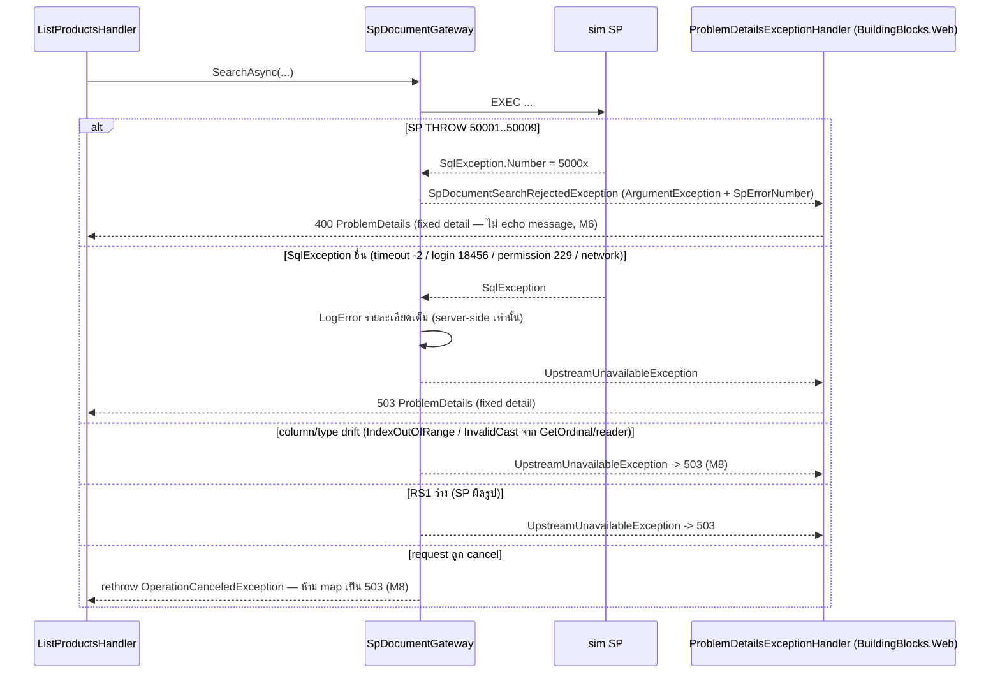

# Design: products-sp-gateway

> Status: approved 2026-07-31
> Notes:, amended 2026-08-01
> Requirements: [requirements.md](requirements.md) (approved 2026-07-31, amended 2026-07-31) — 11 REQ / 73 criteria
> Contract ต้นเรื่อง: `docs/reference/vcentralpay-sp-quick-reference.pdf` v1.0

## Architecture Overview

หลักการ: **anti-corruption layer ชั้นเดียว** ระหว่างระบบเรา (Domain + API type ที่เรากำหนดเอง)
กับ wire contract ของ VCentralPay SP — type ตระกูล `SpDocument*` มีชีวิตอยู่แค่ใน
`Products.Application` (port/mapper/handler) + `Products.Infrastructure` (adapter); ทุกอย่าง
นอกนั้นเห็นเฉพาะ `ProductInput`/`Product`/`ProductListItem`/`ProductPage` (REQ-4.7)
upstream เปลี่ยน -> จุดแก้ = `SpDocumentContracts` + mapper + sim SP เท่านั้น (REQ-4.8)

```
GET /api/v1/products (Hosts/Api/Program.cs:616)
  -> ListProductsHandler (Products.Application/ListProducts.cs — เขียนใหม่)
      1. ProductFilterDto -> SpDocumentSearchRequest (routing + wire conversion; ไม่มี BranchCode)
      2. ISpDocumentGateway.SearchAsync()                    [Products.Application/Ports/]
           -> SpDocumentGateway                              [Products.Infrastructure/Sp/ — ADO.NET
               เติม @BranchCode จาก SpDocumentOptions ที่นี่]
               -> hippodb.dbo.usp_Motor_SearchDocument       (sim ของ motordb@hippo)
                | mammothdb.dbo.usp_NonMotor_SearchDocument  (sim ของ centerdb@mammoth)
      3. SpDocumentItem -> ProductInput (mapper; แถวเสีย = skip + log; dedupe DocumentNo ในหน้า)
      4. IProductRepository.UpsertByDocumentNoAsync(inputs)  [Persistence — Create|Refresh + retry]
      5. ประกอบ ProductPage (§5.1 envelope คัดลอกค่า + ProductListItem จากแถว local มี Guid Id)
```

| Component | Responsibility | ที่อยู่ |
|---|---|---|
| `02-external-sim.sql` | สร้าง hippodb/mammothdb + `dbo.Documents` + SP เต็ม contract + seed + GRANT + self-check | `docker/bootstrap/` |
| `SpDocumentContracts` + `ISpDocumentGateway` | wire DTO + port (แม่แบบ `Payments.Application/Ports/PspContracts`) | `Products.Application/Ports/` |
| `SpDocumentItemMapper` | `SpDocumentItem -> ProductInput?` (null = skip) + dedupe | `Products.Application/Ports/` |
| `SpDocumentGateway` + `SpDocumentOptions` | ADO.NET adapter, routing ตาม `Target`, @BranchCode injection, error mapping | `Products.Infrastructure/Sp/` (precedent: `PspOptions` อยู่ `Payments.Infrastructure/Psp/`) |
| `ListProductsHandler` (ใหม่) | orchestration ตามลำดับข้างบน | `Products.Application/ListProducts.cs` |
| `ProductPage` | §5.1 envelope (type ของเรา — คัดลอกค่า ไม่ส่งต่อ `SpPaginationMetadata`) | `Products.Application/ListProducts.cs` |
| `Product.RefreshFromExternal` + `ProductInput` (+PaymentStatus/PaidDate) | upsert semantics ฝั่ง Domain | `Products.Domain/` |
| `IProductRepository.UpsertByDocumentNoAsync` | upsert + save + retry race (เห็น ChangeTracker) | `Persistence.MerchantRuntime/Products/` |
| `UpstreamUnavailableException` | type ที่ `BuildingBlocks.Application`; map เป็น 503 ที่ `BuildingBlocks.Web/ProblemDetailsExceptionHandler` | ตามระบุ |

## Sequence Diagrams

### Happy path — ค้นสด + upsert

```mermaid
sequenceDiagram
    participant C as Merchant Console
    participant API as GET /api/v1/products
    participant H as ListProductsHandler
    participant G as SpDocumentGateway
    participant DB as hippodb|mammothdb (sim)
    participant R as ProductRepository (shop.Products)

    C->>API: page, limit, productFilters (saleCode, insuranceType, countMode, ...)
    API->>API: SfsQueryParser.ParsePaging (cap 25) + ProductFilterDto.Parse (400 ที่ boundary)
    API->>H: ListProductsQuery
    H->>H: resolve Target: CMI/VMI->Motor, FIRE/MISC->NonMotor (ขัดแย้ง/ว่างทั้งคู่ -> 400)
    H->>G: SearchAsync(SpDocumentSearchRequest)
    G->>DB: EXEC dbo.usp_*_SearchDocument (17 params จาก request + @BranchCode จาก options)
    DB-->>G: RS1 metadata (1 แถว) + RS2 items (<= @PageSize แถว)
    G-->>H: SpDocumentSearchResult
    H->>H: map แต่ละแถว -> ProductInput? (null = skip + LogWarning; dedupe DocumentNo)
    H->>R: UpsertByDocumentNoAsync(inputs)
    R->>R: โหลด tracked -> Create|RefreshFromExternal -> SaveChanges (ชน unique -> reset+reload+retry 1)
    R-->>H: IReadOnlyList<Product> ตามลำดับ inputs
    H-->>API: ProductPage (envelope คัดลอกจาก RS1, items ตามลำดับ SP + Guid Id local)
    API-->>C: 200 JSON (FAST -> totalRows/totalPages = null)
```

### Error paths



## Data Models & Interfaces

### Simulated DBs — `docker/bootstrap/02-external-sim.sql` (idempotent, ทำงานกับ `sqlcmd -b`)

```sql
-- deviation (REQ-1.3): mammothdb ใช้ dbo.Documents ตารางเดียวแทน centerdb+firewebdb+miscwebdb
-- contract ที่ honor คือ output ของ SP ไม่ใช่ topology ภายใน mammoth
IF DB_ID(N'hippodb') IS NULL CREATE DATABASE [hippodb];
IF DB_ID(N'mammothdb') IS NULL CREATE DATABASE [mammothdb];
```

`dbo.Documents` (ทั้งสอง DB โครงเดียวกัน) — คอลัมน์ §5.2 **ยกเว้น `InsuranceType`** (SP derive
คงที่ต่อฝั่ง: Motor SP -> N'Motor', Non-Motor SP -> N'NonMotor') + `BranchCode varchar(3)`
(seed เติมค่า แต่ **ไม่อยู่ใน predicate** — REQ-2.11 validate-only; คอลัมน์มีไว้รอวันเจ้าของ SP
ยืนยัน filter semantics) (REQ-1.2, F6, MINOR-10):

```sql
CREATE TABLE dbo.Documents (
    DocumentId          int IDENTITY PRIMARY KEY,   -- key ภายใน sim + tie-break ordering; ไม่โผล่ใน result set
    SourceSystem        varchar(10)   NOT NULL,     -- hippodb: CMI|VMI · mammothdb: FIRE|MISC
    BranchCode          varchar(3)    NULL,
    DocumentType        varchar(20)   NULL,
    DocumentNo          varchar(150)  NULL,         -- wire ให้ NULL ได้ แต่ seed เติมเสมอ
    PolicyYear          varchar(2)    NULL,
    ReferenceBranch     varchar(3)    NULL,
    ReferencePre        varchar(20)   NULL,
    PolicySequenceNo    varchar(30)   NULL,
    ReferenceYear       varchar(2)    NULL,
    ReferenceNo         varchar(30)   NULL,
    PolicyBranch        nvarchar(250) NULL,
    PolicyType          nvarchar(250) NULL,
    SaleCode            varchar(20)   NULL,
    SaleFullName        nvarchar(500) NULL,
    BrokerCode          varchar(20)   NULL,
    BrokerName          nvarchar(500) NULL,
    PolicyNumber        varchar(150)  NULL,
    ApplicationNumber   varchar(150)  NULL,
    PreviousPolicyNumber varchar(150) NULL,         -- §5.2 สะกด previousPolicyNumber — deviation MINOR-8:
    EndorsementNumber   varchar(150)  NULL,         --   sim ใช้ PascalCase; GetOrdinal fallback CI จึงเข้ากันได้
    StartDate           datetime2(0)  NULL,
    EndDate             datetime2(0)  NULL,
    ShowName            nvarchar(500) NULL,
    NetPremium          decimal(19,2) NULL,
    Stamp               decimal(19,2) NULL,
    TaxVat              decimal(19,2) NULL,
    TotalPremium        decimal(19,2) NULL,
    CommissionPercent   decimal(19,6) NULL,
    CommissionAmount    decimal(19,2) NULL,
    PaidDate            datetime2(0)  NULL,
    LicensePlateNumber  nvarchar(100) NULL,
    PaymentStatus       varchar(10)   NULL);
-- M9: กัน DocumentNo ชนข้ามฝั่ง (IX_Products_DocumentNo ฝั่งเรา unique ทั้งตาราง):
CREATE UNIQUE INDEX UX_Documents_DocumentNo ON dbo.Documents(DocumentNo)
    WHERE DocumentNo IS NOT NULL;
-- + seed สองฝั่งใช้ prefix เลขคนละช่วง (hippodb '77xxx-', mammothdb '88xxx-') — self-check ยืนยัน
```

SP ทั้งสองตัว (`CREATE OR ALTER PROCEDURE dbo.usp_Motor_SearchDocument` /
`dbo.usp_NonMotor_SearchDocument`) — โครงเดียวกัน ต่างที่ allowlist `@ProductGroup`,
smart-search columns, InsuranceType คงที่, และ RENEWAL window:

1. **Trim + default-fill** (REQ-2.2): trim `@BranchCode`/`@SaleCode`; `@PageNo` NULL/<1 -> 1 ·
   `@PageSize` NULL/<1 -> 25, >25 -> 25 · `@PaymentStatus` NULL -> 'UNPAID' ·
   `@DocumentType`/`@ProductGroup` NULL -> 'ALL' · `@CountMode` NULL -> 'EXACT'
2. **Validate raw ก่อน normalize เพิ่มเติม** (REQ-2.4; M1) — ลำดับตายตัวเป็น **การตัดสินใจของ
   spec นี้** (§6 เป็นแค่ตารางเลข ไม่ได้กำหนดลำดับ — M2): 50004 (`@BranchCode` blank) ->
   50005 (`@SaleCode` blank) -> 50001 (DocumentType ∉ {APPLICATION, POLICY, RENEWAL,
   ENDORSEMENT, ALL}) -> 50002 (ProductGroup ∉ allowlist ต่อฝั่ง) -> 50007 (PaymentStatus ∉
   {UNPAID, PAID, ALL}) -> 50006 (CountMode ∉ {EXACT, FAST}) -> 50003 -> 50008 -> 50009
   (date-range inversion) · `THROW 5000x, N'<msg>', 1` · เทียบค่า enum ด้วย
   `COLLATE Latin1_General_BIN2` = **case-sensitive** ตรงกับ boundary (M5 — deviation: DB
   default collation เป็น CI; ถ้า upstream จริง CI กว่า sim = sim เข้มกว่า ปลอดภัยฝั่งเรา) ·
   boundary (`ProductFilterDto.Parse`) คงลำดับเดิมของมัน (JSON parse -> saleCode ->
   paymentStatus -> countMode ใหม่ -> lengths -> dates) — ต่างจาก SP ได้เพราะ boundary จับก่อน
   เสมอใน HTTP path; contract test pin ลำดับของ SP ด้วยเคส multi-invalid
3. **Force PAID หลัง validate** (REQ-2.3; M1): `@PaidDateFrom`/`@PaidDateTo` มีค่า ->
   effective PaymentStatus = 'PAID' — ทำหลัง 50007 ตรวจค่า raw แล้ว เพื่อไม่ฆ่า error path
4. **Predicate** (REQ-2.12): `SaleCode = @SaleCode` (exact, scope axis) · `@InsuredName` ->
   `ShowName LIKE '%' + <escaped> + '%' ESCAPE '\'` · `@PolicyNo` -> `PolicyNumber = @PolicyNo` ·
   `@ApplicationNo` -> `ApplicationNumber = @ApplicationNo` · `@DocumentType`/`@ProductGroup`
   (`SourceSystem`) exact เมื่อ != 'ALL' · effective PaymentStatus exact เมื่อ != 'ALL' ·
   coverage 4 ตัว inclusive บน `StartDate`/`EndDate` · `@PaidDateFrom/To` inclusive บน `PaidDate` ·
   **`@BranchCode` ไม่อยู่ใน predicate** (REQ-2.11) · LIKE input ทุกตัว escape `%`/`_`/`[`
   ภายใน SP (MINOR-5 — โค้ดเดิมใช้ `SfsLike.Escape` ฝั่ง C#; สิทธิ์หน้าที่ย้ายตาม logic ไป SP)
5. **Window ต่อแถว** (REQ-2.5; M3 — ห้ามเลือก window จาก `@DocumentType` ระดับ request เพราะ
   'ALL' มีทั้งสองชนิดปน): Motor ->
   `((DocumentType = 'RENEWAL' AND EndDate >= @today AND EndDate < DATEADD(month, 2, @today))
     OR (DocumentType <> 'RENEWAL' AND StartDate >= DATEADD(month, -6, @today)))`;
   Non-Motor ทุกชนิด -> `StartDate >= DATEADD(month, -6, @today)` โดย
   `@today = CAST(GETDATE() AS date)`
6. **Smart search** (REQ-2.6): `@SearchText` LIKE (escaped) บน DocumentNo/PolicyNumber/
   ApplicationNumber/EndorsementNumber (+ LicensePlateNumber เฉพาะ Motor; "ใบเตือน" ของ §4
   ยังไม่มี field ให้ map — open question ใน requirements)
7. **Materialize -> 2 result sets** (REQ-2.7-2.10; M4): `INSERT INTO #page SELECT TOP
   (@PageSize + 1) ... ORDER BY DocumentNo, DocumentId OFFSET (CAST(@PageNo - 1 AS bigint) *
   @PageSize) ROWS` (bigint กัน overflow เมื่อเรียก SP ตรงด้วย PageNo มหาศาล — MINOR-7);
   `@HasNextPage = CASE WHEN (SELECT COUNT(*) FROM #page) > @PageSize THEN 1 ELSE 0 END`;
   RS1 = 1 แถว (`TotalRows`/`TotalPages` = `COUNT_BIG` + CEILING เมื่อ EXACT, NULL เมื่อ FAST;
   `PageNo`, `PageSize`, `HasNextPage`, `HasPreviousPage = CASE WHEN @PageNo > 1 ...`,
   `CountMode`, `SearchWindowMonths = 6`) **ก่อน** RS2 = `SELECT TOP (@PageSize) ... FROM #page
   ORDER BY DocumentNo, DocumentId` — ลำดับ RS ตายตัวได้เพราะ materialize ก่อน; หน้าเกิน
   ท้ายชุด -> RS2 ว่าง, `HasNextPage = 0`, `HasPreviousPage = 1` (พฤติกรรมประกาศไว้ให้ contract
   test); ordering มี `DocumentId` tie-break กันหน้าซ้ำ/ข้ามเมื่อ DocumentNo ซ้ำ/NULL (MINOR-6)
8. **Principals** (REQ-3.1): `CREATE USER pol_app FOR LOGIN pol_app` ต่อ DB +
   `GRANT EXECUTE ON dbo.usp_..._SearchDocument TO pol_app` (SELECT อาศัย ownership chaining dbo->dbo)
9. **Seed** (REQ-1.4): deterministic, รูปแบบเลียน `seed-demo.sql` (ห้าม copy ค่าจริง), วันที่
   `DATEADD` จาก `GETDATE()`, `SaleCode` ชุดเดิม (`'77001'`, `'S001'`, ...), DocumentNo prefix
   แยกฝั่ง (M9), ครอบทุกแกน: in/out window, RENEWAL in/out 2 เดือน, PAID (+PaidDate) / UNPAID,
   มี/ไม่มีทะเบียนรถ, หลาย BranchCode
10. **Self-check** (REQ-1.5): นับ object + แถว seed + ยืนยัน prefix ไม่ทับ, `THROW` เมื่อไม่ตรง

### Port + wire DTO — `Products.Application/Ports/`

```csharp
public interface ISpDocumentGateway
{
    Task<SpDocumentSearchResult> SearchAsync(SpDocumentSearchRequest request, CancellationToken ct);
}

// SpDocumentContracts.cs — wire truth ของ §2/§5 แยกขาดจาก Domain (REQ-4.2-4.4)
// @BranchCode ไม่อยู่ที่นี่ — adapter เติมจาก SpDocumentOptions (B2, REQ-6.6)
public sealed record SpDocumentSearchRequest(
    InsuranceType Target,               // routing key — server คำนวณเอง (§1.1)
    string SaleCode,
    string? SearchText, string? InsuredName,
    DateOnly? CoverageStartFrom, DateOnly? CoverageStartTo,
    DateOnly? CoverageEndFrom, DateOnly? CoverageEndTo,
    string PaymentStatus,               // wire UNPAID|PAID|ALL (แปลงจาก filter แล้ว)
    string DocumentType, string ProductGroup,   // wire, 'ALL' เมื่อไม่กรอง
    string? PolicyNo, string? ApplicationNo,
    DateTime? PaidDateFrom, DateTime? PaidDateTo,
    int PageNo, int PageSize, string CountMode);

public sealed record SpPaginationMetadata(
    long? TotalRows, long? TotalPages, int PageNo, int PageSize,
    bool HasNextPage, bool HasPreviousPage, string CountMode, int SearchWindowMonths);

public sealed record SpDocumentItem(       // §5.2 ครบ, nullable ทั้งหมด (REQ-4.4)
    string? InsuranceType, string? SourceSystem, string? DocumentType, string? DocumentNo,
    string? PolicyYear, string? ReferenceBranch, string? ReferencePre, string? PolicySequenceNo,
    string? ReferenceYear, string? ReferenceNo, string? PolicyBranch, string? PolicyType,
    string? SaleCode, string? SaleFullName, string? BrokerCode, string? BrokerName,
    string? PolicyNumber, string? ApplicationNumber, string? PreviousPolicyNumber,
    string? EndorsementNumber, DateTime? StartDate, DateTime? EndDate, string? ShowName,
    decimal? NetPremium, decimal? Stamp, decimal? TaxVat, decimal? TotalPremium,
    decimal? CommissionPercent, decimal? CommissionAmount, DateTime? PaidDate,
    string? LicensePlateNumber, string? PaymentStatus);

public sealed record SpDocumentSearchResult(
    SpPaginationMetadata Page, IReadOnlyList<SpDocumentItem> Items);

public sealed class SpDocumentSearchRejectedException(int spErrorNumber, string message)
    : ArgumentException(message)        // ArgumentException -> 400 จาก handler เดิม (REQ-4.5)
{                                       // message = server/log/test เท่านั้น; wire detail fixed (M6)
    public int SpErrorNumber { get; } = spErrorNumber;
}
```

Mapper (`SpDocumentItemMapper.cs`, static): `IReadOnlyList<SpDocumentItem> -> รายการ (item, ProductInput?)`
— trim key fields; `DocumentNo`/`SaleCode` blank, `TotalPremium` NULL/<=0, `SourceSystem`/
`DocumentType`/`PaymentStatus` parse ไม่เข้า enum -> null (caller log + skip, REQ-7.7);
**dedupe `DocumentNo` ภายในหน้า — แถวแรกชนะ** (MINOR-11, กัน Add ซ้ำชน unique ใน save เดียว);
`ProductGroup` <- wire `SourceSystem`, wire `InsuranceType` ignore (REQ-7.10); `PaymentStatus` +
`PaidDate` ส่งเข้า `ProductInput` (B1); datetime naive passthrough (deviation F7)

### Domain — `Products.Domain/`

```csharp
// ProductInput: เพิ่ม PaymentStatus + PaidDate (B1) — คอลัมน์มีอยู่แล้ว ไม่ใช่ schema change (REQ-9.4 คงเดิม)
// Product.Create: เลิก hardcode UNPAID/null — honor ค่าจาก input (แถวใหม่ที่ upstream บอก PAID
//   ต้องเกิดเป็น PAID ไม่งั้น cart gate ปล่อยขายเอกสารที่จ่ายแล้ว — money path)
//   invariant: PAID + PaidDate null => สร้างได้ (PaidDate = null) + caller log warning (REQ-7.6)
// refactor ภายใน: Create + RefreshFromExternal ใช้ private ApplyFields(ProductInput) ตัวเดียว
//   (validation เดิมทั้งชุด: Required/Optional/RequireMoney/Enum.IsDefined/date order/CMI+APPLICATION)
public void RefreshFromExternal(ProductInput input)
// - input.DocumentNo (trim) != DocumentNo -> ArgumentException (REQ-7.3)
// - ProductGroup ใหม่สลับฝั่ง InsuranceType (Motor <-> NonMotor) -> ArgumentException (M9, REQ-7.3)
// - PaymentStatus semantics (REQ-7.4-7.6):
//     local PAID + wire UNPAID  -> คง PAID/PaidDate (field อื่น update)
//     wire PAID + PaidDate      -> set PAID + PaidDate
//     wire PAID + PaidDate null -> set PAID คง PaidDate เดิม (caller log warning)
```

### Application — `Products.Application/ListProducts.cs`

```csharp
public sealed record ProductPage(          // envelope ของเรา — คัดลอกค่าจาก RS1 (REQ-8.1, REQ-4.7)
    IReadOnlyList<ProductListItem> Items,
    long? TotalRows, long? TotalPages, int PageNo, int PageSize,
    bool HasNextPage, bool HasPreviousPage, string CountMode, int SearchWindowMonths);

public sealed record ProductFilterDto      // เพิ่ม 2 field (REQ-6)
{
    public InsuranceType? InsuranceType { get; init; }   // Motor|NonMotor — STJ enum อ่าน case-insensitive
                                                          // (ต่างจาก paymentStatus ที่ CS — สอดคล้อง
                                                          // documentType/productGroup เดิม, ตั้งใจ)
    public string? CountMode { get; init; }              // EXACT|FAST; อื่น -> 400 อ้าง 50006 ใน Parse
    // ... field เดิมทั้งหมดคงไว้ (REQ-6.7); Parse เพิ่มเช็ค countMode ต่อจาก paymentStatus
}

public sealed record ListProductsQuery : IQuery<ProductPage> { /* Page/Limit/ProductFilters เดิม */ }

public sealed class ListProductsHandler(
    ISpDocumentGateway gateway, IProductRepository products,
    ILogger<ListProductsHandler> logger) : IQueryHandler<ListProductsQuery, ProductPage>
// ไม่ต้องมี IUnitOfWork/IOptions — save อยู่ใน UpsertByDocumentNoAsync (M7), BranchCode อยู่ที่ adapter (B2)
```

Routing ใน handler (REQ-6.1-6.4):

| productGroup | insuranceType | ผล |
|---|---|---|
| CMI/VMI | absent หรือ Motor | Motor SP, `@ProductGroup` = ค่านั้น |
| FIRE/MISC | absent หรือ NonMotor | NonMotor SP, `@ProductGroup` = ค่านั้น |
| ระบุ | ขัดแย้ง | 400 (`ArgumentException`) |
| absent | Motor/NonMotor | SP ฝั่งนั้น, `@ProductGroup` = 'ALL' |
| absent | absent | 400 "insuranceType is required when productGroup is absent" (wire detail = fixed — M6) |

### Repository — `IProductRepository` (Products.Application) + impl (Persistence.MerchantRuntime)

```csharp
public interface IProductRepository
{
    void Add(Product product);                                  // คงเดิม (CreateProductCommand)
    Task<Product?> GetAsync(Guid id, CancellationToken ct);     // คงเดิม (cart path)
    /// <summary>Upsert ทั้งหน้า key = DocumentNo: ไม่มี -> Create+Add, มี -> RefreshFromExternal,
    /// SaveChanges ภายใน; ชน IX_Products_DocumentNo (SqlException 2601/2627 ใน DbUpdateException)
    /// -> reset tracker + reload + retry ทั้งชุด 1 ครั้ง (ทำที่นี่เพราะ ChangeTracker
    /// เข้าถึงได้เฉพาะชั้นนี้ — M7). คืน Product ตามลำดับ inputs.</summary>
    Task<IReadOnlyList<Product>> UpsertByDocumentNoAsync(
        IReadOnlyList<ProductInput> inputs, CancellationToken ct);
    // ListAsync ลบ (REQ-9.1) — window/search/paging ทั้งหมดอยู่ใน SP แล้ว
}
```

### Adapter — `Products.Infrastructure/Sp/`

```csharp
public sealed class SpDocumentOptions          // อยู่ Infrastructure ตาม precedent PspOptions (B2)
{
    public const string SectionName = "SpDocument";
    public string BranchCode { get; set; } = "000";             // interim (REQ-6.6); future: actor claim
    public string? MotorConnectionString { get; set; }          // null -> derive (REQ-5.8)
    public string? NonMotorConnectionString { get; set; }
    public int CommandTimeoutSeconds { get; set; } = 15;
}   // ไม่มี ValidateOnStart (REQ-5.7)

public sealed class SpDocumentGateway(IOptions<SpDocumentOptions> options,
    ILogger<SpDocumentGateway> logger) : ISpDocumentGateway
// - new SqlConnection(conn จาก Target) + SqlCommand { CommandType = StoredProcedure,
//   CommandTimeout = options.CommandTimeoutSeconds }
// - parameter typed ครบ 18 ตัว = 17 จาก request + @BranchCode จาก options (B2):
//   SqlDbType.VarChar(3/10/20/30), NVarChar(100/200), Date, DateTime2(0), Int — DBNull เมื่อ null
// - ExecuteReaderAsync(ct): RS1 ReadAsync ต้อง true (ไม่งั้น UpstreamUnavailableException)
//   -> NextResultAsync -> RS2 loop, GetOrdinal ตามชื่อคอลัมน์ (กัน order drift)
// - error mapping (M8-hardened):
//     ct canceled -> rethrow (OperationCanceledException ผ่าน — handler กลางปล่อยอยู่แล้ว)
//     SqlException.Number in 50001..50009 -> SpDocumentSearchRejectedException
//     SqlException อื่น -> LogError เต็ม + UpstreamUnavailableException
//     IndexOutOfRangeException | InvalidCastException (contract drift) -> LogError +
//       UpstreamUnavailableException
```

Program.cs (หลัง config ConnectionStrings): `Configure<SpDocumentOptions>` +
`PostConfigure` เติม connection string ที่ null ด้วย
`new SqlConnectionStringBuilder(appConnString) { InitialCatalog = "hippodb"|"mammothdb" }`
— ไม่มี env var ใหม่ (REQ-3.4), override เป็น motordb/centerdb จริงทาง config ภายหลัง
(Program.cs อ้างแค่ options type ใน `Products.Infrastructure` — ไม่แตะ `Products.Application.Ports`
guard REQ-10.5 จึงถือได้จริง)

DI: `ProductsModuleRegistration.AddProductsModule()` ->
`services.AddSingleton<ISpDocumentGateway, SpDocumentGateway>()` (stateless, REQ-5.9)

### Error mapping กลาง

`UpstreamUnavailableException : Exception` อยู่ `BuildingBlocks.Application`; จุด map อยู่
`BuildingBlocks.Web/ProblemDetailsExceptionHandler.Map()` (MINOR-2) + 1 arm ->
`(StatusCodes.Status503ServiceUnavailable, "Upstream dependency unavailable", null)` fixed detail
(REQ-4.6) — ยุบ 503/504 เหลือ 503 ตัวเดียว (deviation ล็อกใน requirements); 400 ทุกตัวคง fixed
detail `"Invalid request"` ของ handler เดิม — spec นี้ไม่เพิ่มการ echo message (M6)

## Technology Decisions

| ประเด็น | ตัดสิน | เหตุผล |
|---|---|---|
| data access ของ adapter | ADO.NET ตรง (`Microsoft.Data.SqlClient`) ไม่ใช่ EF | 2 result sets + `CommandType.StoredProcedure` + DB นอก EF model; pin **exact patch version** ใน `Directory.Packages.props` (เลขเดียวกับที่ EF SqlServer resolve transitive — ดูด้วย `dotnet list package --include-transitive` ตอน implement, MINOR-3) |
| โครง adapter | class เดียว switch ตาม `Target` — ไม่ทำ factory/base class แบบ PSP | implementation เดียว สอง connection; factory = speculative abstraction |
| lifetime | Singleton | stateless, ถือแค่ options + logger; `SqlConnection` เปิด/ปิดต่อ call (pool จัดการ) |
| `SpDocumentOptions` อยู่ Infrastructure + `@BranchCode` เติมที่ adapter | B2 | Application ไม่มี (และไม่ควรเพิ่ม) package `Microsoft.Extensions.Options`; Program.cs configure ได้เพราะ Api อ้าง Infrastructure อยู่แล้ว (precedent `PspOptions` ที่ `Payments.Infrastructure/Psp/`); guard REQ-10.5 ("นอก Products.* ห้ามอ้าง Ports") ยังถือจริง |
| connection string | derive จาก `ConnectionStrings:App` ผ่าน `PostConfigure` | ไม่มี env var ใหม่ (REQ-3.4) + Hosts.Tests boot ได้ (ค่ามีเสมอ ไม่เปิด connection จนมี request) + override ได้ตอน cutover จริง |
| sim SP อยู่ใน bootstrap SQL ไม่ใช่ EF migration | `02-external-sim.sql` (`CREATE OR ALTER`, idempotent) | hippodb/mammothdb เป็นตัวแทนระบบภายนอก — ห้ามปน migration lineage ของ `PolDbContext` (REQ-9.4) |
| collation ใน sim SP | เทียบ enum value ด้วย `COLLATE Latin1_General_BIN2` (CS) | M5 — DB สร้างใหม่รับ CI collation ของ instance; BIN2 ทำให้ SP เข้มเท่า boundary, contract test deterministic; บันทึกเป็น deviation (upstream จริงอาจ CI กว่า = sim เข้มกว่า ปลอดภัย) |
| ลำดับ validation ของ SP | ประกาศ fixed order (ดู SP step 2) เป็นการตัดสินใจของ spec | M2 — §6 ไม่กำหนดลำดับ; pin ด้วย contract test เคส multi-invalid |
| prod-like mechanism (F4) | เสียบใน `docker/migrate-entrypoint.sh` ต่อจาก 01-principals: `sqlcmd -S "${DB_SERVER},${DB_PORT}" -U sa -P "$MSSQL_SA_PASSWORD" -N -b -i docker/bootstrap/02-external-sim.sql` | ตรวจแล้ว migrate image มี `mssql-tools18` + CA trust wiring (Dockerfile:37-47); `depends_on: service_completed_successfully` = "เสร็จก่อน API รับ traffic" (REQ-3.2); **อัปเดต `migrate-entrypoint.test.sh`**: assert `$SQLCMD_LOG` มี `02-external-sim.sql` หลัง `01-principals.sql`, มี `-N`, ไม่มี `-C` (M12) |
| จุดเสียบ dev | `docker-compose.yml` `pol-db-init`: ต่อ sqlcmd คำสั่งที่สอง `... -C -b -i /bootstrap/02-external-sim.sql` — **เพิ่ม `-b` เพื่อให้ self-check ล้มแล้ว container fail จริง** (M12; คำสั่ง 01 เดิมไม่มี `-b` — เติมเฉพาะคำสั่งใหม่ ไม่แตะของเดิม) | ปิด silent-fail ของ REQ-1.5 |
| จุดเสียบ CI | `ci.yml` + `.gitlab-ci.yml` job integration รัน 02 (sqlcmd `-b`) ก่อน `dotnet test` | ปิด CREATE DATABASE race (REQ-3.3) |
| envelope | `ProductPage` record ใหม่ ไม่ generalize `PagedResult` | §5.1 เฉพาะ products (นอกขอบเขต requirements); `PagedResult` ที่เหลือทั้ง repo ไม่แตะ |
| ordering ของ response | ตามลำดับแถว SP (`ORDER BY DocumentNo, DocumentId` จาก SP) | SP = source of truth; ฝั่งเราไม่ sort ซ้ำ |
| upsert + retry อยู่ใน `ProductRepository` | M7 | retry ต้อง reset ChangeTracker + reload — มีแต่ชั้น Persistence เห็น `DbContext`; port ระดับ Application (`IUnitOfWork`) ทำไม่ได้ (entity Added ค้างสถานะ -> retry ชนซ้ำแน่นอน) |

## Error Handling Strategy

| กรณี | ที่จับ | ผลลัพธ์ wire |
|---|---|---|
| `productFilters` ผิด (saleCode ว่าง, paymentStatus/countMode ผิด, date inversion, insuranceType ขัดแย้ง/ว่าง) | `ProductFilterDto.Parse` / handler routing — ก่อนถึง SP | 400 ProblemDetails, **fixed detail** (message ฝั่งเราอยู่ใน exception สำหรับ log/test — M6) |
| SP `THROW 50001..50009` (เคสที่หลุด boundary หรือเรียกตรง) | `SpDocumentGateway` catch `SqlException` | `SpDocumentSearchRejectedException` -> 400 fixed detail; `SpErrorNumber` ใช้ assert ใน test |
| `SqlException` อื่น: timeout (-2), login (18456), permission (229), network | `SpDocumentGateway` | `LogError` เต็มฝั่ง server -> `UpstreamUnavailableException` -> 503 fixed detail |
| connection string ที่ config มา parse ไม่ได้ (`ArgumentException`/`FormatException` จาก `new SqlConnection`) | `SpDocumentGateway.CreateConnection` (Codex P2, 2026-08-01) | `LogError` + `UpstreamUnavailableException` -> 503 — misconfig ฝั่ง operator ต้องไม่กลายเป็น 400 โทษ caller |
| column/type drift: `IndexOutOfRangeException` (`GetOrdinal` ไม่เจอคอลัมน์) / `InvalidCastException` | `SpDocumentGateway` (M8) | `LogError` + `UpstreamUnavailableException` -> 503 — ไม่ใช่ 500 opaque |
| request ถูก cancel (user ปิดหน้า) | `SpDocumentGateway` เช็ค `ct.IsCancellationRequested` ก่อน map (M8) | rethrow `OperationCanceledException` — ไม่ใช่ 503 ปลอม/alert ปลอม |
| RS1 ไม่มีแถว / result set หาย | `SpDocumentGateway` | `UpstreamUnavailableException` -> 503 |
| แถว item เสีย (key ว่าง / TotalPremium ผิด / enum ไม่รู้จัก) | mapper คืน null -> handler | skip + `LogWarning` (มี DocumentNo ถ้ามี + นับจำนวน skip) — หน้าไม่ล้ม (REQ-7.7) |
| DocumentNo ซ้ำภายในหน้าเดียว (upstream ผิดปกติ) | mapper dedupe แถวแรกชนะ + `LogWarning` (MINOR-11) | หน้าปกติ ไม่ชน unique ใน save เดียวกัน |
| upsert ชน `IX_Products_DocumentNo` (race 2 request) | `ProductRepository.UpsertByDocumentNoAsync` catch `DbUpdateException` (inner 2601/2627) | reset tracker + reload + retry ทั้งชุด 1 ครั้ง -> ยังชน -> โยน (500) — `// ponytail: single retry; หน้า <= 25 แถว ชนซ้ำยากมาก` |
| upsert save ล้มแบบอื่น (หลัง retry) | โยนตามจริง | 500 — ไม่กลืน error ของ money-adjacent write |
| concurrent `MarkPaid` vs upsert save | ไม่มีกลไกเพิ่ม (ตัดสินใน F3) | EF update เฉพาะ property ที่เปลี่ยนจากค่าที่โหลด — PAID ของ consumer รอด; edge case ใน requirements |

## Testing Strategy

| ชุด | ไฟล์ | ครอบ | REQ |
|---|---|---|---|
| SP contract (Integration, :11433, connection = `pol_app` ผ่าน helper ใหม่ `IntegrationDb.ForCatalog("hippodb"\|"mammothdb")` — ตัวเดิม hardcode `Database={POL_DB}`, MINOR-4) | `tests/Integration.Tests/SpDocumentContractTests.cs` | normalization defaults, cap 25, THROW ครบ 9 + **ลำดับ multi-invalid ตาม fixed order** (M2), ลำดับ 2 RS + ชื่อคอลัมน์, FAST -> totals NULL + HasNextPage + RS2 <= PageSize, ทะเบียนรถเฉพาะ Motor, PaidDateFrom บังคับ PAID (และ 50007 ยังยิงเมื่อ PaymentStatus ผิด + PaidDateFrom มา — M1), RENEWAL window ต่อแถวเมื่อ DocumentType=ALL (M3), หน้าเกินท้ายชุด (MINOR-7), case-sensitivity (M5), LIKE escape `%`/`_` (MINOR-5), predicate ครบชุด REQ-2.12 | REQ-2.*, 3.1, 10.1 |
| Adapter integration (:11433) | `tests/Integration.Tests/SpDocumentGatewayIntegrationTests.cs` | mapping ปกติทั้ง 2 ฝั่ง, error mapping (50006 -> `SpDocumentSearchRejectedException` เลขตรง), RS หาย -> `UpstreamUnavailableException`, @BranchCode ถูกเติมจาก options | REQ-5.*, 6.6, 10.2 |
| Handler unit (fake gateway) | `tests/Products.Tests/ListProductsHandlerTests.cs` | routing 5 เคสตามตาราง, envelope คัดลอกค่า (FAST -> null totals), upsert ผ่าน repository port (Create/Refresh ตามผล fake), skip row + แถวอื่นรอด, dedupe ในหน้า, ordering ตาม SP | REQ-6.1-6.4, 7.1-7.2, 7.7, 7.9, 8.1-8.2, 10.3 |
| Filter unit | `tests/Products.Tests/ProductFilterDtoTests.cs` (เพิ่ม) | insuranceType parse/ขัดแย้ง, countMode (absent -> EXACT, ผิด -> 400/50006), ของเดิมไม่แตก | REQ-6.5, 6.7 |
| Domain unit | `tests/Products.Tests/ProductTests.cs` (เพิ่ม) | `Create` honor wire PAID/PaidDate (B1), `RefreshFromExternal`: no-downgrade, PAID+PaidDate, PAID ไม่มี PaidDate, DocumentNo mismatch throw, side-flip Motor<->NonMotor throw (M9), validation reuse | REQ-7.3-7.6 |
| Mapper unit | `tests/Products.Tests/SpDocumentItemMapperTests.cs` | ครบ field, null-key -> null, SourceSystem -> ProductGroup, ignore wire InsuranceType, PaymentStatus/PaidDate เข้า input (B1), dedupe, naive datetime passthrough | REQ-7.7, 7.10 |
| Repository integration (:11433) | `tests/Integration.Tests/` (เพิ่ม) | `UpsertByDocumentNoAsync`: new/refresh/no-downgrade บน DB จริง, retry เมื่อ insert ชน unique (จำลอง race ด้วย pre-insert) | REQ-7.2, 7.4, 7.8, 9.2 |
| Insulation guard (**อยู่ `tests/Hosts.Tests`** ซึ่ง reference `Api` — Architecture.Tests มองไม่เห็น assembly Api, M11) | `tests/Hosts.Tests/SpInsulationTests.cs` | สแกน assembly `pol-core` ทั้งหมดจาก output dir แบบ fail-closed (assert เจอชุด assembly ที่คาดครบก่อน): ไม่มี assembly นอก `Products.Application`/`Products.Infrastructure` อ้าง type ใน `Products.Application.Ports`; `ProductPage`/`ProductListItem` signature ไม่มี `SpDocument*` | REQ-4.7, 4.8, 10.5 |
| ชะตากรรม test เดิม (M10) | `tests/Architecture.Tests/ProductRepositoryListTests.cs` **ลบทั้งไฟล์** (ทดสอบ `ListAsync` ที่ถูกลบ — ใช้ `git rm` เพราะ rename gate อ่าน git index); `tests/Hosts.Tests/ProductInsuranceFieldsRoundTripTests.cs` + `InsuranceCheckoutEndToEndTests.cs` **rewrite** — ctor `ListProductsHandler` เปลี่ยน, list path ผ่าน fake gateway แทน SQLite EF | REQ-9.1, 10.4 |
| ของเดิมไม่แตก | Hosts.Tests + Architecture.Tests เต็มชุด | boot ได้ (options default), boundary เดิม | REQ-10.4 |
| Quality gates | `dotnet build pol-core.slnx -warnaserror` · test suite เต็ม ไม่มี `.only`/`.skip` · `bash scripts/spec-trace.sh products-sp-gateway` พิมพ์ `OK:` · `check-rename-identifiers.sh` + `check-migration-lineage.sh` | ปิดงานทั้ง spec | REQ-11.1-11.4 |
| E2E manual checklist | fresh `docker compose down -v && up` | curl ทั้ง 2 insuranceType, EXACT/FAST, 400 countMode ผิด, add-to-cart ด้วย Id ที่ upsert, 503 เมื่อ stop sim DB, OpenAPI description ใหม่ (`SfsOpenApi.AddProductQueryParameters` เพิ่ม insuranceType/countMode — MINOR-12) | REQ-8.4, 11.5 |

## Requirement Traceability

| Design element | Satisfies |
|---|---|
| `02-external-sim.sql` — CREATE DATABASE + `dbo.Documents` + deviation ตารางเดียว + unique DocumentNo | REQ-1.1, REQ-1.2, REQ-1.3 |
| `02-external-sim.sql` — seed (prefix แยกฝั่ง) + self-check | REQ-1.4, REQ-1.5 |
| SP โครง 10 ขั้น (trim/validate-ordered/force-PAID/predicate/window-ต่อแถว/search/materialize/principals/seed/self-check) | REQ-2.1, REQ-2.2, REQ-2.3, REQ-2.4, REQ-2.5, REQ-2.6, REQ-2.7, REQ-2.8, REQ-2.9, REQ-2.10, REQ-2.12 |
| SP step 4 — `@BranchCode` validate-only ไม่อยู่ใน predicate (คอลัมน์ seed ไว้รอ) | REQ-2.11 |
| `02-external-sim.sql` — principals/GRANT | REQ-3.1 |
| จุดเสียบ compose + CI 2 ตัว + `migrate-entrypoint.sh` (+ อัปเดต `migrate-entrypoint.test.sh`) | REQ-3.2, REQ-3.3 |
| PostConfigure derive connection string | REQ-3.4, REQ-5.8 |
| `ISpDocumentGateway` + `SpDocumentContracts` (BranchCode อยู่ adapter) | REQ-4.1, REQ-4.2, REQ-4.3, REQ-4.4 |
| `SpDocumentSearchRejectedException` (fixed wire detail) / `UpstreamUnavailableException` + arm ใน `BuildingBlocks.Web` handler | REQ-4.5, REQ-4.6 |
| Insulation rule + guard ใน Hosts.Tests (fail-closed) | REQ-4.7, REQ-4.8, REQ-10.5 |
| `SpDocumentGateway` (params/RS order/error mapping M8) | REQ-5.1, REQ-5.2, REQ-5.3, REQ-5.4, REQ-5.5, REQ-5.6 |
| `SpDocumentOptions` (Infrastructure) + @BranchCode injection | REQ-5.7, REQ-6.6 |
| DI singleton + package pin exact | REQ-5.9 |
| Routing table ใน handler + `ProductFilterDto` ใหม่ 2 field | REQ-6.1, REQ-6.2, REQ-6.3, REQ-6.4, REQ-6.5, REQ-6.7 |
| `ListProductsHandler` orchestration (gateway -> map -> upsert -> envelope) | REQ-7.1, REQ-7.9 |
| `ProductInput` +PaymentStatus/PaidDate, `Create` honor wire, upsert ผ่าน repository | REQ-7.2 |
| `Product.RefreshFromExternal` + `ApplyFields` refactor + side-flip guard | REQ-7.3, REQ-7.4, REQ-7.5, REQ-7.6 |
| Mapper (`SpDocumentItem -> ProductInput?` + dedupe) | REQ-7.7, REQ-7.10 |
| `UpsertByDocumentNoAsync` retry race ใน Persistence | REQ-7.8, REQ-9.2 |
| `ProductPage` + endpoint metadata + SfsOpenApi update | REQ-8.1, REQ-8.2, REQ-8.3, REQ-8.4 |
| Repository surface ใหม่ (ลบ `ListAsync`, คง Add/GetAsync) | REQ-9.1, REQ-9.3 |
| ไม่มี EF migration (sim อยู่ bootstrap; ProductInput ไม่ใช่ schema) | REQ-9.4 |
| Testing Strategy ตารางข้างบน (รวม quality gates + E2E) | REQ-10.1, REQ-10.2, REQ-10.3, REQ-10.4, REQ-10.5, REQ-11.1, REQ-11.2, REQ-11.3, REQ-11.4, REQ-11.5 |

## Design review log

spec-architect adversarial critique รอบ 1 (2026-07-31) — 2 BLOCKER + 12 MAJOR + 12 MINOR,
**รับทั้งหมด ไม่มี rebut**; requirements re-stamp amended พร้อมกัน (B1/B2/M6/M7/M9 แตะ REQ):

- B1 `ProductInput` ไม่มี PaymentStatus/PaidDate -> seed PAID จะเกิดเป็น UNPAID = ขายเอกสารที่จ่ายแล้ว (money path) — แก้: เพิ่ม 2 field + `Create` honor wire
- B2 `SpDocumentOptions`/`IOptions` ใน Application คอมไพล์ไม่ผ่าน + Program.cs จะละเมิด guard ตัวเอง — แก้: options อยู่ Infrastructure, @BranchCode เติมที่ adapter
- M1-M5, M9, MINOR-5/6/7 โครง SP: validate ก่อน force-PAID, fixed validation order, window ต่อแถว, materialize ก่อน 2 RS, collation BIN2, unique DocumentNo + prefix แยกฝั่ง, LIKE escape, tie-break, bigint OFFSET
- M6 wire detail เป็น fixed string เสมอ (handler ห้าม echo message) — ปรับคำอ้างทั้ง spec
- M7 retry ย้ายเข้า `UpsertByDocumentNoAsync` (Persistence เห็น ChangeTracker)
- M8 cancellation passthrough + contract drift -> 503
- M10-M12 ชะตากรรม 3 ไฟล์ test เดิม (`git rm` trap), guard ย้ายไป Hosts.Tests fail-closed, sqlcmd `-b` + assertion ใน migrate-entrypoint.test.sh
- MINOR-1/2/3/4/8/9/10/11/12 ตามที่ปรากฏใน body (นับ criteria 73, handler อยู่ BuildingBlocks.Web, pin exact, `IntegrationDb.ForCatalog`, previousPolicyNumber casing, ใบเตือน open question, REQ-2.11 ใน body, dedupe, SfsOpenApi)

### As-built deviations (สรุปจาก task 1-6, บันทึกตอนปิดงาน task 7)

รายละเอียดเต็มของแต่ละข้ออยู่ใน `HANDOFF.md` section ของ task นั้น ๆ และใน `Evidence:` ของ `tasks.md` —
ที่นี่เก็บเฉพาะข้อที่ **ทำต่างจากถ้อยคำใน design นี้** เพื่อให้คนอ่าน design ภายหลังไม่หลงทาง

- **SQL (task 1)** — snippet ใน design เขียนได้ไม่ตรง T-SQL จริง 3 จุด: `CREATE DATABASE` ต้องห่อ `EXEC()`
  (statement เดียวต่อ batch), `TOP (@PageSize + 1)` + `OFFSET` ใช้ร่วมกันไม่ได้ (ของจริงใช้
  `OFFSET ... FETCH NEXT (@PageSize + 1) ROWS ONLY`), และเพิ่ม temp table `#match` ก่อน `#page` เพื่อให้
  predicate อยู่ที่เดียวแทนการเขียนซ้ำ 4 ชุด; นอกจากนั้น database ใช้ `COLLATE Thai_100_CI_AS` (เลขเอกสารมี
  อักษรไทยใน `varchar` ตาม §5.2) และขอบบน coverage เทียบ `< DATEADD(day, 1, @To)` เพื่อให้ inclusive จริง
  เมื่อพารามิเตอร์เป็น `date` แต่คอลัมน์เป็น `datetime2(0)`
- **Mapper (task 4)** — `MappedSpDocument` พก `SkipReason` เพิ่มจาก shape `(item, ProductInput?)` ใน design
  (handler ต้อง log ได้ว่าข้ามเพราะอะไร) และ `PaymentStatus`/`PaidDate` บน `ProductInput` อยู่ในกลุ่ม
  พารามิเตอร์บังคับ ไม่ใช่ท้าย record ที่มี default — default `UNPAID` คือช่องเงียบเดียวกับที่ B1 เกิด
- **Adapter (task 5)** — `RawConnectionTests` ต้องยกเว้น `SpDocumentGateway` ด้วย **ชื่อ type เดียว**
  (REQ-5.1 สั่ง ADO.NET ตรง ส่วน guard เดิมห้าม production infrastructure แตะ `SqlConnection` เลย);
  `Integration.Tests` เพิ่ม `ProjectReference` ไป `Products.Infrastructure` (task 5) และ
  `Persistence.MerchantRuntime` + `InternalsVisibleTo` (task 6) เพื่อขับ type ตัวจริง — ทำให้ insulation
  guard ของ REQ-10.5 **ต้องสแกน production assembly เท่านั้น**
- **Handler (task 6)** — routing validation (ขัดแย้ง / ว่างทั้งคู่) อยู่ที่ `ResolveTarget` ใน handler
  ไม่ใช่ `ProductFilterDto.Parse` ⇒ เคสเหล่านั้นถูกทดสอบใน `ListProductsHandlerTests` ไม่ใช่
  `ProductFilterDtoTests` ตามที่ตาราง Testing Strategy วางไว้; `Products.Application` ได้
  `Microsoft.Extensions.Logging.Abstractions` เป็น package ใหม่ (ไม่มี Application project ไหนเข้าถึง
  `ILogger` ได้มาก่อน แต่ REQ-7.6/7.7 สั่งให้ handler log)
- **ชะตากรรม test เดิม (task 6)** — `InsuranceCheckoutEndToEndTests` เปลี่ยนความหมายของ assert ท้ายเส้น
  จาก "เอกสาร PAID หลุดจากลิสต์ UNPAID" (ตัวกรองย้ายไป SP แล้ว โค้ดเราไม่ได้ทำอีก) เป็น
  "upstream บอก UNPAID แล้ว local PAID ต้องไม่ถูก downgrade" (REQ-7.4)
- **Post-PR review (Codex P2 บน PR #150, 2026-08-01)** — การเทียบ `DocumentNo` ฝั่ง CLR เปลี่ยนเป็น
  case-insensitive (`OrdinalIgnoreCase`) ให้ตรง semantics ของ `IX_Products_DocumentNo` ซึ่ง unique ใต้
  collation `Thai_100_CI_AS` (ยืนยันจาก DB จริง): dictionary ใน `UpsertByDocumentNoAsync`,
  dedupe ใน `SpDocumentItemMapper`, guard ใน `RefreshFromExternal` (refresh แล้ว adopt casing จาก wire
  เหมือน field อื่น) — ก่อนแก้ แถว case-variant จาก upstream จะถูก stage เป็น Add ซ้ำชน index -> retry ->
  500; และ `SpDocumentGateway` ห่อ connection string ที่ parse ไม่ได้เป็น `UpstreamUnavailableException`
  (503) แทนที่จะปล่อย `ArgumentException` ไหลออกเป็น 400
