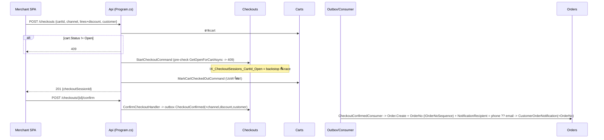

# Design: Purchase Flow Completion (ปิด flow ซื้อประกันภัย End-to-End)

> Status: approved 2026-08-02, amended 2026-08-03 (ปิด freeze race ด้วย Cart.Version — review PR #166)

## Architecture Overview

ไม่มีโมดูลใหม่ ไม่มี outbox event type ใหม่ ไม่มี iam key ใหม่ ไม่มี hosted service ใหม่ — งานทั้งหมดคือ (ก) wire domain method ที่มีอยู่แล้วแต่ไม่มี production caller, (ข) เพิ่ม field ที่ snapshot ตอน checkout แล้ว carry ไป order, (ค) เปิด endpoint ฝั่งลูกค้าแบบ anonymous capability ตาม precedent ของ webhook

| ส่วน | ความรับผิดชอบใหม่/ที่แก้ |
|---|---|
| Carts | `ValueGeneratedNever` บน Item.Id (REQ-1), `Cart.Reopen()`, `MarkCartCheckedOutCommand`, `ReopenCartCommand` — guard mutation เมื่อไม่ Open **มีอยู่แล้วใน domain** เหลือแค่ endpoint map 409 + test (REQ-2) |
| Checkouts | `GetOpenForCartAsync` (port ใหม่บน `ICheckoutRepository`) + filtered unique index, `AbandonCheckoutCommand` + แก้ `Session.Abandon()` ให้ Abandoned→no-op, รับ `PaymentChannel`/`Discount`/customer 3 field (REQ-2, REQ-6) |
| Orders | `CancelOrderCommand`, มินต์ `OrderNo` ผ่าน port `IOrderNoSequence`, เก็บ channel/discount/customer + derive `NotificationRecipient` จาก field ใหม่, filter `orderNo` (SFS shape), ถอด `PaymentSessionId` จาก summary (REQ-4, REQ-7, REQ-8.9) |
| Payments | `Session.OpenTtl`/`IsExpiredAt`, **`PaymentConfirmationService`** (เส้น confirm เดียว แชร์ webhook + payment-status + lazy expire + release), `ReleaseOpenSessionCommand`, `ConfirmPaymentStatusCommand`, map `GetSessionQuery` + แก้ 404, ขยาย `TwoCTwoPAdapter` ครบ 3 ช่องทาง (REQ-3, REQ-6.1, REQ-8) |
| Products | กรองแถว PAID ออกจากผลค้นเมื่อ filter UNPAID, `SoldOrderId` + double-sell signal ที่แยก replay ได้ (REQ-5) |
| Hosts/Api | endpoint ใหม่: abandon, cancel, GET payment session, POST `{token}/pay`, POST `{token}/payment-status`; rate-limit policy ใหม่ `customer-payment` |

หลักยึด: cross-module ผ่าน outbox contract เดิม (additive) หรือ orchestrate ที่ host layer; ฝั่งลูกค้าใช้ summary token เป็น capability + `actorScope.Begin(merchantId)` แบบ webhook (`Program.cs:591-614`) — ยืนยันแล้ว `MerchantGuardBehavior`/`MerchantRequestWriteAuthorizer` รองรับโดยไม่แก้ allowlist

## Sequence Diagrams

### Merchant สร้างคำสั่งซื้อ (freeze + backstop)



ยกเลิกกลางทาง: `POST /checkouts/{id}/abandon` → `AbandonCheckoutCommand` (`Session.Abandon()`: Started→Abandoned, **Abandoned→no-op (แก้จาก throw)**, Confirmed→409) → `ReopenCartCommand` (`Cart.Reopen()`: CheckedOut→Open, Open→no-op) — retry ได้เสมอ

### Customer จ่ายเงิน (2C2P redirect-only, confirm เส้นเดียว)

```mermaid
sequenceDiagram
    participant CSPA as Customer SPA
    participant API as Api
    participant PAY as Payments
    participant PSP as 2C2P

    CSPA->>API: POST /orders/{token}/pay (anonymous, customer-payment rate limit)
    API->>API: OrderSummaryReader.GetByTokenAsync -> order + merchantId + channel + orderNo
    alt token ไม่พบ/หมดอายุ -> 404 / order Paid -> 409 / Cancelled -> 404 / channel null -> 409
        API-->>CSPA: error
    end
    API->>API: actorScope.Begin(merchantId)
    API->>PAY: CreateSessionCommand (คืน session เดิมเมื่อ method+psp ตรง = resume ฟรี)
    Note over PAY: เจอ open session หมดอายุ -> PaymentConfirmationService ตัดสินก่อน:<br/>ไม่มี chargeId = expire ได้เลย / มี chargeId = fetch-to-confirm ก่อน<br/>แล้วค่อย MarkExpired + mint ใหม่ (2-phase save ใน tx เดียว)
    API->>PAY: StartRedirectCommand (claim-then-charge เดิม; Redirected+มี URL = คืน URL เดิม)
    PAY->>PSP: CreateRedirectChargeAsync (channel: CC/QR/IPP ตาม method)
    API-->>CSPA: 200 {redirectUrl}
    CSPA->>PSP: redirect / ลูกค้าจ่าย
    PSP-->>CSPA: redirect กลับ (FrontendReturnUrl)
    CSPA->>API: POST /orders/{token}/payment-status
    API->>PAY: ConfirmPaymentStatusCommand -> PaymentConfirmationService
    alt session เปิด + มี chargeId
        PAY->>PSP: FetchChargeAsync
        alt Paid + ยอด/สกุลตรง
            PAY->>PAY: claim + MarkPaid + enqueue PaymentPaid (เฉพาะ transition จริง)
        else Paid แต่ยอดไม่ตรง
            PAY->>PAY: LogCritical -> pending
        else PSP = Failed
            PAY->>PAY: MarkFailed -> failed (เปิด session ใหม่ได้ทันที)
        else ยังไม่จ่าย + เกิน TTL
            PAY->>PAY: MarkExpired -> failed
        end
    else session เปิด + ไม่มี chargeId
        PAY->>PAY: เกิน TTL -> MarkExpired + failed / ยังไม่เกิน -> pending (ไม่ fetch)
    end
    API-->>CSPA: {status: paid|failed|pending|cancelled}
```

Webhook ยังเป็น source of truth เส้นหลัก — ทั้งสองเส้นวิ่งผ่าน `PaymentConfirmationService` ตัวเดียว semantics จึงเหมือนกันโดยโครงสร้าง ไม่ใช่โดยสัญญา

## Data Models & Interfaces

### `PaymentConfirmationService` (Payments.Application — หัวใจเส้น money)

แตกส่วน fetch→verify→claim→mark→enqueue ออกจาก `HandlePspWebhookHandler` ให้ 4 ผู้เรียกใช้ร่วม: webhook, `ConfirmPaymentStatusCommand`, lazy expire ใน `CreateSessionHandler`, `ReleaseOpenSessionCommand` กติกา:

1. **Expire ได้เมื่อพิสูจน์ได้ว่าไม่มี charge เท่านั้น**: `PspExternalChargeId == null` → expire ได้เลย; ไม่ null → `FetchChargeAsync` ก่อนเสมอ — Paid → เดินเส้น confirm (ห้าม expire), Failed → `MarkFailed`, ยังเปิด → expire ได้เมื่อเกิน TTL; fetch ล้ม (timeout/5xx) = ambiguous → ไม่ตัดสินอะไร (ผู้เรียกตอบ 409/`pending` ตามบริบท)
2. **Idempotency key แชร์**: `{psp}:{connectionId}:charge:{chargeId}:confirmed` — claim โดย service ตัวเดียว ทั้ง webhook และ payment-status; ฝั่ง webhook ยังคง key `event:{EventId}` เดิมเป็น key เสริม (dedup ระดับ delivery)
3. **Enqueue `PaymentPaid` เฉพาะเมื่อ transition เกิดจริง** (เช็ค `Status != Paid` ก่อน `MarkPaid`) — race webhook↔status ต่อให้ทั้งคู่ผ่าน claim คนละ key ก็ยิง event ได้ครั้งเดียว
4. **Session terminal (`Expired`/`Failed`) แต่ PSP ยืนยัน Paid**: `LogCritical` (orderId, sessionId, chargeId, amount) + คืน outcome `Conflicted` — webhook ตอบ 200 (ไม่ 500 ไม่ retry loop), payment-status คืน `failed` (REQ-3.4/3.5) — refund = manual ops
5. เทียบยอด/สกุลก่อน mark เสมอ (พฤติกรรม webhook เดิม) — ไม่ตรง → `LogCritical` + ไม่ mark

### คอลัมน์ใหม่ + ลำดับ migration (rolling-deploy safe)

| ตาราง | คอลัมน์ | ชนิด | หมายเหตุ |
|---|---|---|---|
| `shop.CheckoutSessions` | `PaymentChannel` | `varchar(20) NOT NULL DEFAULT 'CARD'` | wire `CARD`/`PROMPTPAY_QR`/`INSTALLMENT`; DEFAULT ให้โค้ดเก่า INSERT ผ่านระหว่าง rollout |
| | `CustomerName` | `nvarchar(200) NOT NULL DEFAULT N'(ไม่ระบุ)'` | |
| | `CustomerPhone` | `varchar(20) NOT NULL DEFAULT ''` | |
| | `CustomerEmail` | `nvarchar(320) NULL` | |
| | (ลบ) `Recipient` | — | backfill ก่อน drop: มี `@` → `CustomerEmail`, อื่น → `CustomerPhone` |
| `shop.CheckoutSessionItems` | `Discount` (Money complex) | `DiscountAmount decimal(19,4) NOT NULL DEFAULT 0` + `DiscountCurrency char(3) NOT NULL DEFAULT 'THB'` | ตามมาตรฐาน Money ทุกชั้น — ห้าม scalar ที่ seam; invariant `SameCurrencyAs(UnitPrice)` |
| `shop.Orders` | `OrderNo` | `varchar(13)` — ADD nullable → backfill → `NOT NULL` → unique index | backfill: `UPDATE ... SET OrderNo = CONCAT('ORD', <พ.ศ.%100>, FORMAT(NEXT VALUE FOR shop.OrderNoSeq,'D8'))` |
| | `PaymentChannel` | `varchar(20) NULL` | แถวเก่าไม่มี channel — pay ตอบ 409 (ดู Error Handling) |
| | `CustomerName/Phone/Email` | เหมือน CheckoutSessions (`NOT NULL` + DEFAULT / NULL) | `NotificationRecipient` เดิม**คงไว้** — ยังเป็น source of truth ของปลายทางส่งลิงก์ (consumer เขียน = `CustomerPhone ?? CustomerEmail`) |
| `shop.OrderItems` | `Discount` (Money complex) | เหมือน CheckoutSessionItems | |
| `shop.Products` | `SoldOrderId` | `uniqueidentifier NULL` | ผู้ซื้อรายแรก — ใช้แยก replay จาก double-sell (REQ-5.4) |
| sequence `shop.OrderNoSeq` | `bigint START 1` | | + `GRANT UPDATE ON OBJECT::shop.OrderNoSeq TO pol_app` |

ลำดับใน migration เดียว (เขียนมือ): (a) ADD คอลัมน์ nullable/มี DEFAULT ทั้งหมด → (b) backfill (`OrderNo`, แตก `Recipient`) → (c) ALTER `OrderNo` เป็น NOT NULL → (d) unique index `OrderNo` + filtered unique index `IX_CheckoutSessions_CartId_Open` (`CartId` WHERE `[Status] IN (0,1)`, named overload ทั้ง 2 mirror) → (e) DROP `Recipient`

**OrderNo**: sequence เดียว global ไม่ reset ต่อปี (unique จาก sequence ล้วน ปีเป็น display prefix จากวันมินต์) — format `$"ORD{(year+543)%100:D2}{seq:D8}"`; มินต์ผ่าน **port `IOrderNoSequence`** (interface ใน `Orders.Application`, impl `src/Persistence/Persistence.MerchantRuntime/Orders/OrderNoSequence.cs` ใช้ raw SQL `NEXT VALUE FOR` — **เพิ่มไฟล์นี้เข้า `BypassPrimitiveTests.AllowedPorts`** เป็นส่วนหนึ่งของ task) เรียกใน `CheckoutConfirmedConsumer` ก่อน enqueue `CustomerOrderNotification` (event ต้องมี OrderNo); replay idempotent เช็ค existing ด้วย `CheckoutSessionId` ก่อนมินต์ — รูเลขจาก retry ยอมรับได้

### Domain changes

| Type | เปลี่ยน |
|---|---|
| `Carts.Domain.Cart` | `Reopen()` ใหม่ (CheckedOut→Open, Open→no-op) — guard mutation `Status == Open` **มีครบแล้ว** (`Cart.cs:41,62,72,85`) ไม่แตะ |
| `Carts.Domain.Items.Item` | config `ValueGeneratedNever()` ทั้ง 2 mirror |
| `Checkouts.Domain.Session` | field ใหม่ channel/customer; `Items` + `Discount: Money`; `Start(...)` validate: channel ∈ ชุด, `0 ≤ Discount ≤ gross` + `SameCurrencyAs`, name/phone required + format พื้นฐาน, email format เมื่อมี, ยอดรวม = Σ(gross − discount); **`Abandon()` แก้: Abandoned→no-op (เดิม throw)** |
| `Checkouts.Application.ICheckoutRepository` | + `GetOpenForCartAsync(cartId)` |
| `Orders.Domain.Order` | + `OrderNo`, channel/customer; `Items` + `Discount: Money`; `Create` invariant: ยอด = Σ net + currency เดียวกัน |
| `Orders.Application.IOrderNoSequence` | port ใหม่ (ดูข้างบน) |
| `Payments.Domain.Session` | `OpenTtl = 24h` (static), `IsExpiredAt(now)` — ไม่มีคอลัมน์ใหม่ |
| `Products.Domain.Product` | `MarkPaid(paidDate, orderId)` เก็บ `SoldOrderId` ครั้งแรก |
| `Contracts.OrderPaid` | + `OrderId: Guid` (additive — default `Guid.Empty` สำหรับ payload เก่า = ข้าม signal) |

### Commands / Queries ใหม่

| ชื่อ | โมดูล | พฤติกรรม |
|---|---|---|
| `MarkCartCheckedOutCommand(CartId)` | Carts | endpoint เรียกหลัง StartCheckout สำเร็จ |
| `ReopenCartCommand(CartId)` | Carts | `Cart.Reopen()` |
| `AbandonCheckoutCommand(CheckoutSessionId)` | Checkouts | REQ-2.5/2.6/2.9 |
| `ReleaseOpenSessionCommand(OrderId)` | Payments | ผ่าน `PaymentConfirmationService`: ไม่มี open → ok; ไม่มี chargeId → expire; มี chargeId → fetch ก่อน (Paid → `ConflictException` — order จ่ายแล้ว ห้าม cancel; ambiguous → `ConflictException`); open สด → `ConflictException` |
| `CancelOrderCommand(OrderId)` | Orders | `Order.Cancel()` (Paid→throw, Cancelled→no-op) |
| `ConfirmPaymentStatusCommand(OrderId)` | Payments | คืน `PaymentStatusResult` ∈ {`Paid`,`Failed`,`Pending`,`Cancelled`} — order Paid/Cancelled ตอบจาก order โดยไม่แตะ session (REQ-8.12); ที่เหลือตาม sequence |
| `GetSessionQuery` (มีอยู่) | Payments | map route + not-found → `NotFoundException` → 404 |

### `IOrderSummaryReader` contract change

`OrderSummary` record: + `MerchantId` (host ใช้ bind actor — **ห้าม project ออก response**), + `OrderNo`, + `PaymentChannel`, − `PaymentSessionId`; `OrderSummaryResponse` (wire): + `orderNo`, − `paymentSessionId` — test ยืนยัน JSON ไม่มี `merchantId`

### Endpoints ใหม่/แก้ (ใต้ `/api/v1`)

| Route | Gate | หมายเหตุ |
|---|---|---|
| `POST /checkouts/{id}/abandon` | merchant-user + CSRF | REQ-2.5-2.9 |
| `POST /orders/{orderId}/cancel` | merchant-user + CSRF | Release→Cancel; ไม่มี iam key |
| `GET /payments/sessions/{id}` | merchant-user | REQ-8.8 |
| `POST /orders/{token}/pay` | AllowAnonymous + `customer-payment` | REQ-8.1-8.4, 8.10, 8.11 |
| `POST /orders/{token}/payment-status` | AllowAnonymous + `customer-payment` | ตอบ `{status}` เท่านั้น |
| `POST /checkouts` (แก้) | เดิม | + `paymentChannel`, `customer{name,phone,email}`, `lines[].discount`; เช็ค cart Open |
| `GET /orders` (แก้) | เดิม | filter รูปแบบ SFS: `filters=orderNo:eq:<value>` (adopt SFS เฉพาะ field นี้ก่อน — endpoint นี้ยังไม่มี SFS เลย, เต็มรูปเป็นงานแยก) |
| `GET /orders/{token}/summary` (แก้) | เดิม | + `orderNo`, − `paymentSessionId` |
| cart mutation 4 เส้น (แก้) | เดิม | map domain exception → 409 (guard มีแล้ว) |

Rate limiting: policy ใหม่ `customer-payment` — partition ด้วย source IP (precedent `Webhooks/RateLimiting.cs` — ห้าม partition ด้วยค่าจาก client), เข้มกว่า webhook มาก (sliding window ~10 req/นาที/IP) เพราะแต่ละ call มีต้นทุนจริง (vault reveal + PSP inquiry); `payment-status` **short-circuit ไม่ fetch PSP** เมื่อ order/session terminal แล้ว

### Contract evolution (`src/Contracts/` — additive เท่านั้น)

- `CheckoutConfirmed` + `PaymentChannel?`, `CustomerName?`, `CustomerPhone?`, `CustomerEmail?`, ต่อ line + `DiscountAmount`/`DiscountCurrency` (default 0/THB) — payload เก่า deserialize ได้ (REQ-7.5); **emitter ใหม่ต้องเติมครบ**; consumer: `Order.NotificationRecipient = CustomerPhone ?? CustomerEmail ?? Recipient(เดิม)` — เส้นแจ้งลูกค้า + resend ไม่ขาดผู้เขียน
- `CustomerOrderNotification` + `OrderNo?`
- `OrderPaid` + `OrderId` (default Empty → consumer ข้าม double-sell signal)
- Channel mapping จุดเดียวที่ pay/create-session: `CARD`→`card`, `PROMPTPAY_QR`→`promptpay`, `INSTALLMENT`→`installment` (ค่า `Session.Method` verbatim เดิม)

### 2C2P adapter + connection (F-01)

`TwoCTwoPAdapter`: ขยาย `SupportedMethods` = {card, promptpay, installment} และ `PaymentChannelFor`: `card`→`"CC"`, `promptpay`→`"QR"`, `installment`→`"IPP"` (PGW v4.3 channel codes — verify กับ sandbox จริงตอน implement) **Ops step บังคับ (บันทึกใน tasks + PR)**: `txn.PspConnections.EnabledMethods` ของ connection ที่มีอยู่ต้องเพิ่ม `promptpay`/`installment` มิฉะนั้น `EnsureEligible` ยัง 409 — ใส่ใน seed-demo + คู่มือ deploy; ช่องทางที่ merchant เลือกได้จริงถูกคุมด้วย connection config ต่อ merchant อยู่แล้ว (แผงหน้าจอโชว์ 3 ช่องเสมอ แต่ order ที่เลือกช่องที่ connection ไม่รองรับจะถูกปัด 400 ตั้งแต่ checkout — เช็ค eligibility ตอน start checkout ผ่าน host-layer query ไปยัง Payments)

### การเลือก PSP connection ฝั่งลูกค้า

`pay` เลือก connection ของ merchant ที่ `Psp == Code.TwoCTwoP` + active + eligible กับ method (eligibility 2 ชั้นเดิมของ `CreateSessionHandler`) — ไม่มี connection ที่ใช้ได้ → 409 generic

## Technology Decisions

| เรื่อง | ตัดสิน | เหตุผล |
|---|---|---|
| Cart freeze point | ตอน `StartCheckout` ผ่าน endpoint orchestration 2 UoW + `Cart.Version` optimistic token (amended 2026-08-03, review PR #166) | snapshot ตรึงตอน Start; index กัน checkout ที่สอง; race "แก้ cart แทรกระหว่าง snapshot→freeze" ปิดด้วย Version ที่ทุก mutation bump (รวม edit ที่แตะแค่ `CartItems`) — freeze แบก `ExpectedVersion` จาก snapshot, แพ้ race → abandon session ที่เพิ่งเปิด + 409 ให้ merchant เริ่มใหม่; rowversion ใช้ไม่ได้ (item-edit ไม่แตะแถว `Carts` + SQLite ไม่มี) |
| Session expiry | lazy expire ผ่าน `PaymentConfirmationService` — ไม่มี sweeper | แก้ตรงจุดที่เจ็บ (เปิดใหม่/เช็คสถานะ/cancel); **ห้าม expire session ที่มี chargeId โดยไม่ fetch ก่อน** (กฎ money-path — ambiguous ห้ามตัดสิน) |
| Expire + mint ใหม่ | 2-phase `SaveChanges` ใน `ExecuteInTransactionAsync` เดียว | filtered unique index มองไม่เห็นโดย EF ordering — ลำดับ UPDATE ก่อน INSERT ต้อง deterministic ไม่เดิมพันกับ `ModificationCommandComparer`; ยัง atomic ตาม REQ-3.2 |
| TTL = 24h | ค่าคงที่ใน domain | ยาวกว่าอายุ hosted page 2C2P มาก; ไม่ทำ config จนกว่าจะมีเหตุ |
| OrderNo | sequence เดียว + ปี display prefix, port `IOrderNoSequence` | ไม่ reset ต่อปี = ไม่มี race ข้ามปี; raw SQL อยู่ใน Persistence ตาม `BypassPrimitiveTests` allowlist |
| Customer pay auth | summary token capability + `actorScope.Begin` host layer | precedent webhook พิสูจน์แล้วทั้ง guard/authorizer |
| Confirm logic | `PaymentConfirmationService` เดียว 4 ผู้เรียก | เส้น money ห้ามมี copy; race ปิดด้วย enqueue-on-transition ไม่ใช่ด้วย key อย่างเดียว |
| Resume (REQ-8.10) | **ไม่เขียนโค้ดใหม่** — พฤติกรรมเดิม: `CreateSessionHandler` คืน session เดิมเมื่อ method+psp ตรง, `StartRedirectHandler` คืน URL เดิมเมื่อ Redirected+มี URL | มีอยู่แล้ว เหลือ test คุม |
| REQ-2.7 | **ไม่แตะ domain** — guard มีครบ เหลือ endpoint map 409 + test | ของมีอยู่แล้ว |
| กรองผลค้น | post-filter ในแอปหลัง upsert | cap 25 แถว/หน้า — ถูกกว่าแก้สัญญา SP; ตัดสินจาก string ที่ส่งให้ SP เท่านั้น |
| Discount = `Money` | complex type เดิมแบบ `UnitPrice` | มาตรฐาน repo: Money ทุกชั้น ห้าม scalar ที่ seam — `CheckoutConfirmed` คือ seam ตรงตัว |
| Double-sell signal | `OrderPaid.OrderId` + `Product.SoldOrderId` — Critical เฉพาะ `SoldOrderId != null && != orderId` | แยก outbox redeliver (ปกติ, เงียบ) จาก double-sell จริง — signal ไม่เป็น noise |
| `AttachPaymentSession`/`Order.PaymentSessionId` | ไม่ wire ไม่ลบ — ถอดจาก read surface | join key จริง = `PaymentPaid.OrderId` (canon); ลบคอลัมน์ = churn ไม่จำเป็น |

## Error Handling Strategy

| กรณี | พฤติกรรม |
|---|---|
| mutation บน cart ไม่ Open | domain throw (มีแล้ว) → endpoint 409 (REQ-2.7) |
| start checkout ซ้ำ (แพ้ race) | unique index → `DbUpdateException` → 409 เดียวกับ pre-check |
| `MarkCartCheckedOut` ล้มหลัง session เปิด | cart ค้าง Open แต่ index กัน start ที่สอง — ทางฟื้น: abandon (no-op ได้ทุกขั้น) → start ใหม่ |
| cart ถูกแก้แทรกหลัง snapshot ก่อน freeze (amended 2026-08-03) | `ExpectedVersion` mismatch หรือ token ชนตอน commit → `ConcurrencyConflictException` → endpoint abandon session ที่เพิ่งเปิดแล้วตอบ 409 "cart changed"; ฝั่ง edit ที่ commit ทีหลัง freeze โดน token ปัดที่ SaveChanges ของตัวเอง → 409 |
| pay: token ไม่พบ/ผิด/**หมดอายุ** | **404 ทั้งหมด** (REQ-8.2 — ต่างจาก summary เดิมที่ตอบ 410 สำหรับหมดอายุ; endpoint ลูกค้าใหม่ใช้ 404 opaque) |
| pay: order Paid / Cancelled | 409 / 404 (REQ-8.11) |
| pay: order เก่า `PaymentChannel` null | 409 Problem — merchant ยกเลิกแล้วสร้างใหม่ (เฉพาะข้อมูลก่อน deploy) |
| pay: ไม่มี eligible 2C2P connection | 409 generic |
| pay ซ้ำ session สด | resume จาก handler เดิม (REQ-8.10) |
| checkout เลือก channel ที่ connection ไม่รองรับ | 400 ตั้งแต่ start checkout (eligibility check ที่ endpoint) |
| payment-status: PSP = `Failed` | `MarkFailed` → `failed` — `Failed` หลุด filter index → เปิด session ใหม่ได้ทันที ไม่ต้องรอ 24h (REQ-8.5) |
| payment-status: ยอด/สกุลไม่ตรง | ไม่ mark, `LogCritical`, `pending` (REQ-8.7) |
| payment-status: session ไม่มี chargeId | ไม่ fetch — เกิน TTL → `MarkExpired`+`failed`, ยังไม่เกิน → `pending` (REQ-8.13) |
| จ่ายสำเร็จหลัง session terminal | `PaymentConfirmationService` → `LogCritical` + outcome `Conflicted`: webhook ตอบ 200 (ไม่ 500 loop, claim ไม่ rollback), status → `failed`; refund manual (REQ-3.4/3.5) |
| `FetchChargeAsync` ล้ม (ambiguous) | ไม่เปลี่ยนสถานะใด — status → `pending`, release/cancel → 409 |
| double-sell จริง (`SoldOrderId` ต่าง order) | `LogCritical`; redeliver เดิม → เงียบ (REQ-5.4) |
| outbox consumer ล้มซ้ำ | เดิม: 8 attempts → poison + LastError — known ops gap (DLQ review) |
| token TTL 72h > session TTL 24h | ยอมรับ — ลิงก์ตายก่อนจ่ายได้ถ้า merchant ส่งช้า; ทางแก้ = resend (rotate token) — บันทึก known gap |

## Testing Strategy

| ชั้น | ครอบ | REQ |
|---|---|---|
| `Carts.Tests` | Reopen transitions, MarkCheckedOut, guard 4 mutation (test คุมของเดิม) | 1.2, 2.1, 2.5, 2.7 |
| `Checkouts.Tests` | Start validate (channel/discount Money/currency/customer/ยอดรวม), Abandon: Started→Abandoned/Abandoned→no-op/Confirmed→throw | 2.5-2.9, 6.1-6.8 |
| `Orders.Tests` | Cancel guards, OrderNo format, consumer: carry field + `NotificationRecipient` derivation + fallback payload เก่า + ไม่มินต์ซ้ำตอน replay, filter orderNo | 4.x, 7.x, 6.8 |
| `Payments.Tests` | `IsExpiredAt`, `PaymentConfirmationService` ทุก branch (paid/mismatch/Failed/expired-paid `Conflicted`/ambiguous/no-chargeId), enqueue-on-transition (double claim ≠ double event), lazy expire verify-first, Release 3 ทาง, GetSession 404, adapter mapping CC/QR/IPP + `SupportedMethods` | 3.x, 8.5-8.8, 8.13 |
| `Products.Tests` | filter UNPAID ตัด PAID, `SoldOrderId` first-write, Critical เฉพาะ order ต่าง / replay เงียบ | 5.1, 5.4 |
| `Hosts.Tests` — `MerchantLifecycleEndpointTests` ใหม่ (pattern `RegistrationHistoryEndpointTests`) | add-item ไม่ 409 (regression 2-scope), start ซ้ำ 409, abandon→restart, cancel, CSRF, pay/payment-status (fake `IPspAdapter`), summary: +orderNo −paymentSessionId −merchantId, token หมดอายุ → 404 | 1.1, 2.2-2.3, 4.6, 8.1-8.4, 8.9-8.12 |
| `Hosts.Tests` — `InsuranceCheckoutEndToEndTests` แก้ | เดินสอง handler จริง (ลบ workaround + comment เก่า) + chain ถึง `DocumentPaidOnOrderPaidConsumer` | 1.1, 1.4, 5.3 |
| `Integration.Tests` (:11433) | index `IX_CheckoutSessions_CartId_Open`, **2-phase expire+insert ผ่าน `IX_PaymentSessions_OrderId_Open`**, OrderNo sequence + GRANT, กรองผลค้น (fixture INSERT/DELETE เอง — ห้ามแตะ seed 42 แถว SaleCode 77001) | 2.4, 3.2, 7.1, 5.1 |
| Migration proof | fresh-DB `ef database update` + rerun bootstrap + **DB มีข้อมูล**: backfill OrderNo/Recipient ถูกต้อง | 7.1, 7.5 |

## Requirement Traceability

| Design element | Satisfies |
|---|---|
| `ValueGeneratedNever` 2 mirror + empty migration + regression 2-scope | REQ-1.1, 1.4 (1.2, 1.3 พฤติกรรมเดิม + test) |
| Endpoint orchestration Start→MarkCheckedOut + cart Open check | REQ-2.1, 2.2 |
| `GetOpenForCartAsync` (port ใหม่) + `IX_CheckoutSessions_CartId_Open` | REQ-2.3, 2.4 |
| `AbandonCheckoutCommand` + `Session.Abandon` no-op fix + `ReopenCartCommand` + gate | REQ-2.5, 2.6, 2.8, 2.9 |
| Domain guard เดิม + endpoint 409 map + test | REQ-2.7 |
| `Session.OpenTtl`/`IsExpiredAt` + lazy expire verify-first + 2-phase save | REQ-3.1, 3.2, 3.3 |
| `PaymentConfirmationService` outcome `Conflicted` + LogCritical | REQ-3.4, 3.5 |
| `ReleaseOpenSessionCommand` (verify-first) + `CancelOrderCommand` + endpoint | REQ-4.1-4.6 |
| post-filter + `SoldOrderId`/`OrderPaid.OrderId` signal | REQ-5.1-5.4 |
| `Session.Start` validation + endpoint amount/eligibility check | REQ-6.1-6.7 |
| `CheckoutConfirmed` additive + `NotificationRecipient` derivation | REQ-6.8, 7.5 |
| `IOrderNoSequence` + consumer mint + read surfaces + SFS filter | REQ-7.1-7.4 |
| `POST {token}/pay` composition + guards + resume เดิม | REQ-8.1-8.4, 8.10, 8.11 |
| `ConfirmPaymentStatusCommand` 4 ค่า + `PaymentConfirmationService` | REQ-8.5-8.7, 8.12, 8.13 |
| `GetSessionQuery` route + `NotFoundException` | REQ-8.8 |
| `OrderSummary` contract change (−paymentSessionId, ห้าม leak merchantId) | REQ-8.9, 8.4 |
| `TwoCTwoPAdapter` CC/QR/IPP + connection ops step | REQ-6.1, 8.1 |

## Design review log (spec-architect critique — ตัดสินครบ 16 ข้อ)

| # | ระดับ | ตัดสิน |
|---|---|---|
| F-01 | blocker | **Apply (ก)** — ขยาย adapter ครบ 3 ช่องทาง (CC/QR/IPP) + ops step `EnabledMethods` + eligibility check ตอน checkout (หน้าจอ SPA มี 3 ช่อง = scope จริง) |
| F-02 | blocker | **Apply** — ลำดับ migration nullable→backfill→NOT NULL→index + DB DEFAULT ทุกคอลัมน์ NOT NULL กัน rolling deploy |
| F-03 | blocker | **Apply** — consumer derive `NotificationRecipient = CustomerPhone ?? CustomerEmail ?? Recipient` — เส้นแจ้งลูกค้าไม่ขาดผู้เขียน; `NotificationRecipient` ยังเป็น source of truth ปลายทางส่ง |
| F-04 | major | **Apply** — lazy expire ผ่าน `PaymentConfirmationService`: ไม่มี chargeId = expire ได้, มี = fetch ก่อน |
| F-05 | major | **Apply** — key แชร์ `charge:{id}:confirmed` + enqueue-on-transition เป็น guard ตัวจริง |
| F-06 | major | **Apply** — outcome `Conflicted`: webhook 200 ไม่ 500 loop |
| F-07 | major | **Apply** — PSP `Failed` → `MarkFailed` → เปิด session ใหม่ได้ทันที |
| F-08 | major | **Apply** — + `Cancelled` ใน result + guard chargeId null ไม่ fetch |
| F-09 | major | **Apply** — 2-phase SaveChanges ใน tx เดียว + integration test |
| F-10 | major | **Apply** — port `IOrderNoSequence` ใน Persistence + เพิ่ม allowlist + GRANT |
| F-11 | major | **Apply (ก)** — `OrderPaid.OrderId` + `Product.SoldOrderId`; Critical เฉพาะ order ต่าง |
| F-12 | major | **Apply** — `OrderSummary` +MerchantId/OrderNo/PaymentChannel −PaymentSessionId; token หมดอายุ → 404 บน endpoint ลูกค้า; token 72h vs TTL 24h = known gap |
| F-13 | major | **Apply** — `Discount` เป็น `Money` (19,4 + currency + `SameCurrencyAs`); requirements REQ-6.3 amend ตาม |
| F-14 | minor | **Apply** — policy `customer-payment` ~10/นาที/IP + short-circuit terminal |
| F-15 | minor | **Apply** — REQ-2.7/8.10 = ของเดิม + test คุม ตัด domain change/branch ใหม่ออก |
| F-16 | minor | **Apply** — `GetOpenForCartAsync` ลงตาราง port, `Abandon()` no-op ลงตาราง domain, `orderNo` ใช้ SFS shape `filters=orderNo:eq:` |
