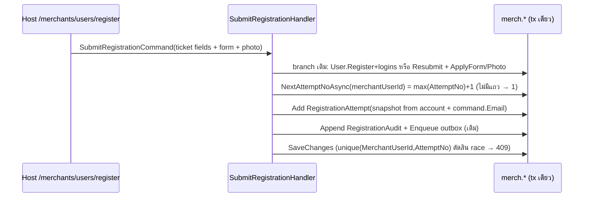
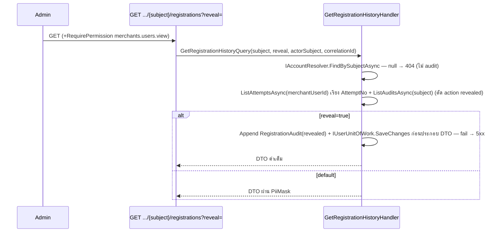

# Design: Registration Attempt History

> Status: approved 2026-08-02, amended 2026-08-02 (REQ-2.7 accessible-merchant floor — review PR #161)

## Architecture Overview

เพิ่ม 4 ชิ้นตามแนว module เดิม (Clean Architecture + CQRS, Mediator):

| ชิ้น | ที่อยู่ | หน้าที่ |
|------|--------|---------|
| `RegistrationAttempt` entity | `Merchants.Domain/Users/RegistrationAttempt.cs` | snapshot ฟอร์มต่อ submit — append-only, ผูก `MerchantUserId`, ลอกโครงจาก `RegistrationAudit` |
| `IRegistrationAttemptWriter` + `IRegistrationHistoryReader` ports | `Merchants.Application/Users/UserPorts.cs` | writer ใช้ใน submit tx; reader ใช้ใน query ประวัติ |
| `GetRegistrationHistory` query + handler | `Merchants.Application/Users/GetRegistrationHistory.cs` | ประกอบ attempts + timeline, mask PII, เขียน audit `revealed` (fail-closed) |
| Endpoint `GET /api/v1/admins/merchants/users/{subject}/registrations` | `src/Hosts/Api/Program.cs` (โซน admin :1490-1533) | ตาม pattern reject: dispatch ผ่าน Mediator, gate `Keys.MerchantUserView` |

หลักยึด:

- **ตาราง `merch.RegistrationAttempts`** อยู่ cluster `MerchantUserDbContext` (ไม่มี query filter — เหมือน `RegistrationAudits`) + mirror config ฝั่ง migration-owner `Merchants.Infrastructure`
- **การเขียน** เกิดที่เดียว: `SubmitRegistrationHandler` หลัง `ApplyForm`/`ApplyPhotoAsync` ของทั้ง 2 branch (โค้ดร่วมหลัง if/else) ใน tx เดิม — REQ-1.1/1.8
- **Write guard**: submit เป็น request แบบ unbound → `MerchantRequestWriteAuthorizer` default-deny type ที่ไม่รู้จัก — **ต้องเพิ่ม `typeof(RegistrationAttempt)` ลง `OwnedTypes`** (`src/Hosts/Api/Persistence/WriteAuthorizers.cs:108`) ไม่งั้น `WriteGuardException` ทุก register/resubmit (B2)
- **การอ่าน user** ผ่าน `IAccountResolver` (filter-free, pre-bind seam) — REQ-2.4; attempts/audits อ่านตรงจาก DbSet (ตารางไม่มี filter) แบบ `AsNoTracking`
- **Append-only floor = 2 ชั้น** (REQ-1.7): `AppendOnlyDescriptor.Mark` (runtime — `GuardedRuntimeDbContext` throw ก่อนถึง authorizer เมื่อ Modified/Deleted, `GuardedRuntimeDbContext.cs:65-71`) + GRANT เฉพาะ `SELECT, INSERT` ที่ DB — ชั้น `IWriteAuthorizer` ไม่ใช่กลไก append-only (M3)

## Sequence Diagrams

### Submit (ทั้ง Registration และ Correction)



### Admin ดูประวัติ



## Data Models & Interfaces

### Entity `RegistrationAttempt` (`Entity<Guid>`, private setters, factory `Capture(...)`)

| Column | Type/EF | หมายเหตุ |
|--------|---------|----------|
| `Id` | Guid PK | |
| `MerchantUserId` | Guid + FK → `merch.Users(Id)` `OnDelete(Restrict)` | REQ-1.3 — ดูหมายเหตุ FK ด้านล่าง |
| `AttemptNo` | int | `HasIndex(MerchantUserId, AttemptNo).IsUnique()` — REQ-1.4/1.5 |
| `Purpose` | `TicketPurpose` (int) | Registration/Correction |
| `FirstName`/`LastName` | maxlength ตาม config `User` เดิม, required | snapshot หลัง trim |
| `PersonType` | `PersonType?` (int?) | |
| `IdNumber`/`ProducerCode`/`LicenseNumber`/`Phone` | nullable, maxlength ตาม `User` | |
| `Email` | required, maxlength ตาม `User.Email` | **จาก `command.Email` (ticket)** — REQ-1.2/A3 |
| `PhotoObjectKey`/`PhotoContentType` | nullable | reference เท่านั้น — REQ-1.6 |
| `SubmittedAt` | DateTime (UTC, ไม่มี suffix) | = `now` ของ handler |

**หมายเหตุ FK (B3 — ตัดสินแล้ว):** นี่คือ FK ตัวแรกใน cluster `merch` (config เดิมประกาศเจตนา scalar-only — `Persistence.MerchantUsers/Users/UserConfiguration.cs:9-11`) เหตุที่แหก: REQ-1.3 บังคับ FK ตรง ๆ. ต้องประกาศ relationship `HasOne<User>().WithMany().HasForeignKey(x => x.MerchantUserId).OnDelete(DeleteBehavior.Restrict)` **ทั้ง 2 ฝั่ง config** (ไม่มี CLR navigation — ใช้ scalar property เดิม): ฝั่ง migration-owner เพื่อให้ DDL มี constraint, ฝั่ง runtime เพื่อให้ `MerchantUserDbContext` รู้ dependency graph แล้วเรียง INSERT `Users` ก่อน `RegistrationAttempts` ใน SaveChanges เดียวกัน (branch Registration) — ถ้าประกาศฝั่งเดียว EF ไม่รับประกัน ordering → SQL 547 ปลอมตัวเป็น 409. อัปเดต comment scalar-only ของไฟล์ runtime config ให้ตรงความจริงด้วย

EF config 2 ฝั่ง mirror กัน (ตาม pattern `RegistrationAudit`):
- migration-owner: `Merchants.Infrastructure/Persistence/Users/UserConfigurations.cs`
- runtime: `Persistence.MerchantUsers/Users/UserConfiguration.cs` + `AppendOnlyDescriptor.Mark` + DbSet ใน `MerchantUserDbContext`

เพิ่มเติมตารางเดิม: `RegistrationAudits` เพิ่ม `HasIndex(x => x.TargetSubject)` (non-unique, ทั้ง 2 ฝั่ง) — timeline query กรองด้วย `TargetSubject` ทุก request, ตาราง audit โตทั้ง platform ไม่ควร scan (m1)

### Ports (เพิ่มใน `UserPorts.cs`)

```csharp
public interface IRegistrationAttemptWriter
{
    Task<int> NextAttemptNoAsync(Guid merchantUserId, CancellationToken ct); // max+1, ไม่มีแถว → 1
    void Add(RegistrationAttempt attempt);
}

public interface IRegistrationHistoryReader
{
    // ทั้งคู่ AsNoTracking (handler จะ SaveChanges ใน branch reveal — ไม่ track สิ่งที่ไม่เขียน)
    Task<IReadOnlyList<RegistrationAttempt>> ListAttemptsAsync(Guid merchantUserId, CancellationToken ct); // ORDER BY AttemptNo
    Task<IReadOnlyList<RegistrationAudit>> ListAuditsAsync(string targetSubject, CancellationToken ct);
    // ORDER BY OccurredAt + WHERE Action != 'revealed' — timeline คือเหตุการณ์ lifecycle (REQ-2.3);
    // ถ้าไม่ตัด revealed ออก ทุกการกด reveal จะงอก timeline ถาวร = self-amplifying growth
    // บน endpoint ที่ไม่มี pagination (M2) — เหตุผล bounded ของ G3 จะพังทันที
}
```

Adapters ใน `Persistence.MerchantUsers/Users/MerchantUserRepositories.cs` (ตาม pattern writer/reader เดิม); race บน `NextAttemptNoAsync` ปล่อยให้ unique index ตัดสิน → `MerchantUserUnitOfWork` map เป็น 409 (กลไกเดิม S9) — REQ-1.9. ยอมรับว่า message 409 จะเป็น `"A registration already exists for this identity."` ซึ่งไม่ตรงเหตุ race นี้เป๊ะ — เคสแทบไม่เกิดจริง ไม่คุ้มแยก branch (m6)

### Query + DTO

```csharp
public sealed record GetRegistrationHistoryQuery(
    string Subject, bool Reveal, string ActorSubject, string CorrelationId,
    bool IsUnrestrictedAdmin, IReadOnlySet<Guid> AccessibleMerchantIds)
    : IQuery<RegistrationHistoryResult?>; // null → host คืน 404
// REQ-2.7 (amended, review PR #161): host ส่ง scope.Accessible เป็น primitives ตาม pattern เดียวกับ
// merchants.policies queries (module นี้อ้าง Admins-plane type ไม่ได้) — handler เช็คหลัง resolve:
// target ที่ MerchantId ไม่ใช่ NULL และอยู่นอก set → คืน null (404 เดียวกับ not-found, ไม่ audit,
// ไม่ถึง reveal branch); pending/rejected (NULL) ไม่จำกัด — floor เดียวกับ approve endpoint

public sealed record RegistrationHistoryResult(
    string Subject, UserStatus Status,
    IReadOnlyList<AttemptView> Attempts, IReadOnlyList<TimelineEntry> Timeline);

public sealed record AttemptView(
    int AttemptNo, TicketPurpose Purpose, DateTime SubmittedAt,
    string FirstName, string LastName, PersonType? PersonType,
    string? IdNumber, string? ProducerCode, string? LicenseNumber, string? Phone,
    string Email, string? PhotoObjectKey, string? PhotoContentType);

public sealed record TimelineEntry(
    string Action, string? ActorSubject, string? Role, string? Reason,
    Guid? MerchantId, DateTime OccurredAt, string CorrelationId);
```

**ไม่มี `DisplayName` ระดับ result (B1):** `AccountSnapshot` (`UserPorts.cs:27`) ไม่มี field นี้ และค่า "ปัจจุบัน" ก็ไม่ใช่ค่าของ attempt ไหนอยู่ดี — REQ-3.3 (ชื่อแสดงเต็มเสมอ) ตอบด้วย `FirstName`/`LastName` เต็มใน `AttemptView` ทุกแถว (`DisplayName` เป็นค่า derive `"{First} {Last}"` อยู่แล้ว) ไม่ขยาย `AccountSnapshot` เพื่อเลี่ยงการแตะ projection ของ `ResolveLogin`/session re-resolution

**Precedent (M1/M6):** query-มี-side-effect + fail-closed reveal audit เป็น as-built อยู่แล้วที่ `GetOrderDetailHandler` (`Program.cs:908-911` — "saves the audit before building the response") — ใช้แบบเดียวกัน: handler รับ `IRegistrationAuditWriter` + `IUserUnitOfWork` (seam เดียวกับ `ApproveHandler`/`RejectHandler`) แล้ว **SaveChanges audit `revealed` ก่อนประกอบ DTO** — REQ-3.5/3.7 ได้ fail-closed จริง ไม่ประดิษฐ์กลไกใหม่

### Masking (`PiiMask` — static pure ใน `GetRegistrationHistory.cs`)

- `Last4(string?)`: null → null; length > 4 → `"****" + 4 ตัวท้าย`; length ≤ 4 → `"****"` (คงที่ ไม่ leak ความยาว) — ใช้กับ `IdNumber`/`LicenseNumber`/`Phone` (REQ-3.1)
- `Email(string?)`: null → null; รูป `local@domain` → `ตัวแรกของ local + "***@" + domain`; ไม่มี `@` → `"****"` (fail-safe mask ทั้งค่า) (REQ-3.2)
- `FirstName`/`LastName`/`ProducerCode`/`Reason` ไม่ mask (REQ-3.3, G4)
- **จงใจต่างจาก `Orders.Application/GetOrders.cs:49-50` (`MaskIdNumber`)** ซึ่งเคสสั้นคืน `*` เท่าความยาวจริง (leak ความยาว) — REQ-3.1 กำหนด `****` คงที่; ไม่ไปแก้ของ Orders (นอก scope, ต้องขออนุมัติแยก) (M6)

### Endpoint (Program.cs โซน admin — ตาม pattern reject :1518-1533)

```csharp
admin.MapGet("/merchants/users/{subject}/registrations",
    async (string subject, IMediator mediator, HttpContext http, CancellationToken ct,
           bool reveal = false) =>   // ต้องมี default — ไม่งั้น request ที่ไม่ส่ง ?reveal= ได้ 400 ฆ่าเคสหลัก (B4)
    {
        var result = await mediator.Send(new GetRegistrationHistoryQuery(
            subject, reveal, http.User.FindFirst("sub")?.Value ?? "unknown", http.TraceIdentifier), ct);
        return result is null ? Results.NotFound() : Results.Ok(result);
    })
    .RequireAuthorization("admin").RequirePermission(Keys.MerchantUserView)
    .WithTags(...).Produces<RegistrationHistoryResult>()...
```

จงใจคืน Application record ตรงสู่ wire (ไม่หุ้ม host response record แบบ approve/reject): enum ออกเป็น string อยู่แล้วผ่าน global `JsonStringEnumConverter` (`Program.cs:441-442`), ไม่มี field ไหนต้องแปลงเพิ่ม — หุ้มก็แค่ duplicate ทุก field (m4)

### Permission + seed

- `Iam.Domain/Permissions/Keys.cs`: เพิ่ม `MerchantUserView = "merchants.users.view"` ใต้ group `merchants.users` เดิม — update `GroupKeys`/`All` + **XML doc header "22 keys / 9 groups" → 23** (`GroupScope` ไม่แตะ)
- `RegistrationAuditAction`: เพิ่ม `Revealed = "revealed"`
- Grant: `platform_admin` role เดียว (= ชุดที่ถือ approve/reject จริงใน seed; `platform_auditor` ไม่ได้ถือ — ตาม decision REQ-4.1 ที่ user ยืนยันแล้ว) → `iam.Permissions` 22→23, `iam.RolePermissions` 30→31, groups 9 / roles 4 คงเดิม
- **`SortOrder = 25`** (M5): ค่าที่ใช้แล้วคือ 1-24 (SeedData 1-20 + SeedPolicyPermissions 21-24; 14/15 ถูกลบโดยไม่ reflow) — ห้ามหยิบ 23 ตามจำนวนแถว; ใส่ `LabelTh` ด้วยตาม pattern seed เดิม

### Migrations (timestamp > `20260731065539`)

1. `AddRegistrationAttempts` — **scaffold จาก model diff** (config ฝั่ง `Merchants.Infrastructure`): CreateTable + FK + unique index + index `RegistrationAudits(TargetSubject)`
2. `GrantAndSeedRegistrationHistory` — **scaffold เปล่าแล้ว hand-edit** (pattern `SeedPolicyPermissions.cs:9-10` — ต้องได้ `.Designer.cs` + snapshot ให้ `ModelConsistencyTests` ผ่าน, m2):
   - `GRANT SELECT, INSERT ON merch.RegistrationAttempts TO pol_app;` (append-only — ไม่มี UPDATE/DELETE)
   - `INSERT iam.Permissions('merchants.users.view', group 'merchants.users', SortOrder 25, LabelTh)` + `INSERT iam.RolePermissions(platform_admin)`
   - `Down()`: ลบ children→parents + REVOKE

## Technology Decisions

- **ไม่มี dependency ใหม่** — EF Core/Mediator/pattern เดิมทั้งหมด
- `AttemptNo` คำนวณด้วย `max+1` ใน tx แทน sequence/identity: ปริมาณต่อ user ต่ำ, race ถูกปิดด้วย unique index อยู่แล้ว (กลไก 409 เดิม), ไม่เพิ่ม DB object
- Masking ทำที่ Application layer ไม่ใช่ host: unit-test ได้ตรง handler, host เป็นแค่ passthrough
- Snapshot อ่านค่าจาก `account` หลัง `ApplyForm`/`ApplyPhotoAsync` (ได้ค่า trim แล้ว + photo key ปัจจุบันของ attempt นั้น) ยกเว้น `Email` จาก `command` (A3)
- Timeline ประกอบฝั่ง handler จาก 2 list (attempts + audits) — ไม่ join ใน SQL: ปริมาณเล็ก, โครง response ชัด, ไม่ต้องแตะ escape-hatch ใด
- **นอก SFS convention (M7):** endpoint นี้เป็น sub-resource ของ user เดี่ยว (ประวัติของ subject เดียว) ไม่ใช่ collection surface — SFS (`docs/reference/search-filter-sort.md`) ใช้กับ list endpoint; เหตุผล bounded ยืนได้เพราะ attempts ต่อ user ต่ำโดยพฤติกรรม + timeline ตัด `revealed` ออกแล้ว (ไม่มี self-amplifying growth)

## Error Handling Strategy

| กรณี | พฤติกรรม | REQ |
|------|----------|-----|
| subject ไม่พบ | handler คืน null → host 404; ไม่เขียน audit ใด | 2.5, 3.6 |
| target ผูก merchant นอก accessible set ของ admin | handler คืน null → 404 เดียวกัน (no existence leak, ไม่ audit) | 2.7 |
| ไม่มี permission `merchants.users.view` | endpoint filter เดิม fail-closed 403 | 4.3 |
| race `AttemptNo` ชน | unique index → `MerchantUserUnitOfWork` map 409 (message เดิม, ยอมรับกำกวม — m6) | 1.9 |
| snapshot เขียน fail ใน submit | exception ใน tx → rollback ทั้งก้อน (submit ล้มทั้ง request) | 1.8 |
| audit `revealed` เขียน fail | SaveChanges throw ก่อนประกอบ DTO → 5xx ไม่คืนข้อมูล | 3.7 |
| `?reveal=` ไม่ส่งมา | default `false` (masked) — ไม่ใช่ 400 (B4) | 3.1 |
| `reveal` ไม่ใช่ bool | minimal API binding fail → 400 (default framework) | — |
| user ไม่มี attempt | `Attempts = []` + timeline ปกติ 200 | 2.6 |

## Testing Strategy

| Test | ที่อยู่ | ครอบ REQ |
|------|---------|----------|
| submit เขียน attempt ทั้ง 2 branch, field ครบ, `Email` จาก command, photo เป็น reference, `AttemptNo` 1→2 | `tests/Merchants.Tests/SubmitRegistrationHandlerTests.cs` (ขยาย — **ctor handler เพิ่ม dependency ตัวที่ 8: ทุก instantiation เดิมต้องแก้**, M4) | 1.1, 1.2, 1.4, 1.6 |
| attempt writer fail → exception หลุดจาก handler (smoke); atomicity จริงพิสูจน์ที่ lifecycle/integration (m7) | `SubmitRegistrationHandlerTests` + `MerchantIdentityLifecycleTests` | 1.8 |
| `PiiMask` ทุก edge: >4/≤4/null/email ไม่มี `@` | `tests/Merchants.Tests/GetRegistrationHistoryHandlerTests.cs` (ใหม่) | 3.1, 3.2 |
| default masked, reveal เต็ม + audit 1 แถว persist (รวม list ว่าง), 404 ไม่ audit, audit fail → throw, เรียง AttemptNo, timeline ไม่มี `revealed` | `GetRegistrationHistoryHandlerTests` | 2.2, 2.5, 2.6, 3.3-3.7 |
| endpoint: ไม่มี key → 403, มี key → 200, **ไม่ส่ง `?reveal=` → 200 masked (B4)** | `tests/Hosts.Tests/` | 4.2, 4.3, 3.1 |
| lifecycle e2e: register→reject→resubmit → 2 attempts ใต้ `MerchantUserId` เดียว + endpoint คืน timeline ครบ | `tests/Architecture.Tests/MerchantIdentityLifecycleTests.cs` (ขยาย) | 1.3, 1.4, 2.1, 2.3 |
| append-only: Update/Delete `RegistrationAttempt` → `WriteGuardException` **ข้อความ append-only** (ไม่ใช่ authorizer — M3) | pattern test append-only เดิม | 1.7 |
| pins ที่แตกเพราะ key/gate ใหม่ (M4): `tests/Iam.Tests/KeysTests.cs` (`ExpectedKeys`, 22→23, platform 15→16), `tests/Hosts.Tests/PermissionGateSitesTests.cs` (`Sites[]`, 25→26 + header comment), `tests/Hosts.Tests/PermissionAuthorizationTests.cs` (`RealGateSites`) | ตามไฟล์ | 4.1, 4.2 |
| iam counts 23/31 + scope + per-role grants; grants ตารางใหม่ (`SELECT,INSERT` เท่านั้น) | `tests/Integration.Tests/IamCatalogGrantsTests.cs` + `MerchantUserAccountControlPlaneTests` | 4.1, 4.4 |
| `assert-fresh-db.sql` ตัวเลขใหม่ (Permissions 23, RolePermissions 31) | `docker/bootstrap/assert-fresh-db.sql` | 4.4 |
| docs ตารางมือ: `docs/reference/merchants.md` (endpoint + keys), `docs/reference/iam.md` (m8) | docs update | 2.1, 4.1 |

## Requirement Traceability

| Design element | REQ |
|----------------|-----|
| `RegistrationAttempt` entity + EF config 2 ฝั่ง | 1.2, 1.6 |
| FK ประกาศทั้ง 2 config (DDL constraint + insert ordering) | 1.3 |
| เขียน attempt ใน `SubmitRegistrationHandler` (โค้ดร่วมหลัง 2 branch, tx เดิม) + `OwnedTypes` เพิ่ม type | 1.1, 1.8 |
| `NextAttemptNoAsync` max+1 + unique index `(MerchantUserId, AttemptNo)` | 1.4, 1.5, 1.9 |
| `AppendOnlyDescriptor` + GRANT `SELECT,INSERT` (2 ชั้น) | 1.7 |
| `GetRegistrationHistoryQuery`/handler + `IRegistrationHistoryReader` (ตัด `revealed` จาก timeline) | 2.1, 2.2, 2.3, 2.6 |
| `IAccountResolver` ใน handler (filter-free) | 2.4, 2.5 |
| accessible-merchant floor ใน handler (primitives จาก `IAdminScope.Accessible`) | 2.7 |
| `PiiMask` + `Reveal` flag; ชื่อเต็มผ่าน `AttemptView.FirstName/LastName` | 3.1, 3.2, 3.3, 3.4 |
| audit `revealed` persist ผ่าน `IUserUnitOfWork` ก่อนประกอบ DTO (precedent `GetOrderDetailHandler`) | 3.5, 3.6, 3.7 |
| `Keys.MerchantUserView` + seed migration (SortOrder 25) + `RequirePermission` | 4.1, 4.2, 4.3 |
| `assert-fresh-db.sql` + `IamCatalogGrantsTests` + pins (KeysTests/GateSites) update | 4.4 |
