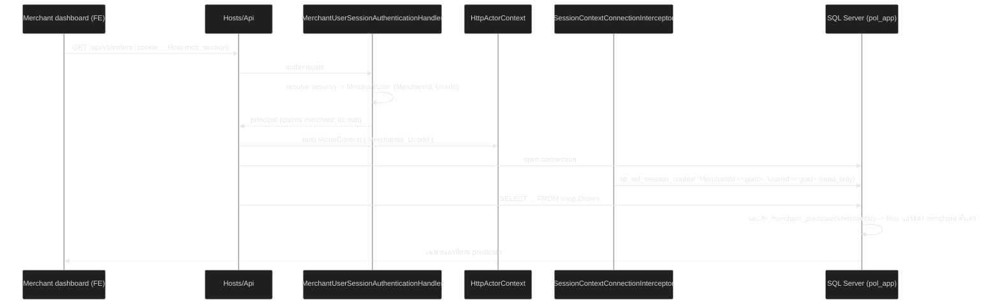
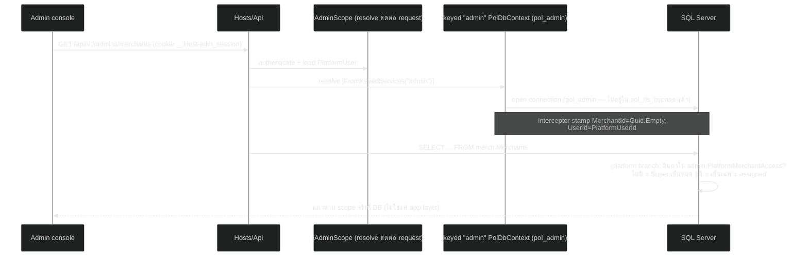
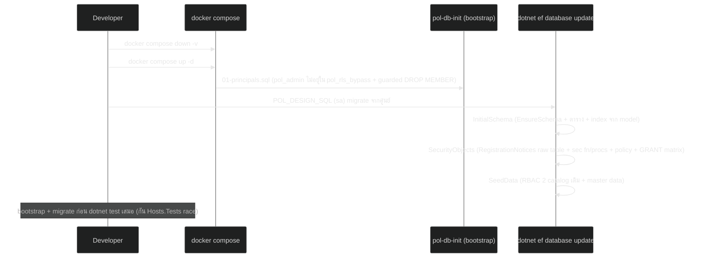

# Design: rf1-schema-reset — Big-bang foundation ของ v5 restructure

> Status: approved 2026-07-11, amended 2026-07-11 (backfill traceability หลัง derive requirements; sync ผล /spec-analyze F2 tier-based Super branch + F5/F6/F7 — ดู findings log ใน requirements.md)
> Mode: Design-First (requirements.md จะ derive จาก design นี้ทีหลัง)
> Master plan: `~/.claude/plans/users-king-developer-downloads-payment-tidy-whale.md` (approved 2026-07-11)
> Source design doc: `/Users/king_developer/Downloads/Payment_Orchestration_Schema_Design-v5.md`

## Architecture Overview

rf1 คือ foundation spec ของ roadmap 11 spec: เปลี่ยนฐานทั้งระบบจาก schema เดียว `VCentralPay` + RLS ชั้นเดียว (TenantId) ไปเป็น multi-schema + multi-layer RLS ตาม v5 โดย **business behavior ฝั่ง server เดิมคงทั้งหมด** (funnel ซื้อขาย + จ่ายเงินเดิมยังทำงานครบ) — rf1 เปลี่ยนโครง ไม่เพิ่ม feature. ข้อยกเว้นที่เป็น client-facing contract change โดยเจตนา: (ก) wire rename ทั้งหมด (ข) funnel auth เปลี่ยนจาก Bearer เป็น session cookie (ค) Money wire เปลี่ยนเป็น string amount — FE ต้องตามแก้

องค์ประกอบที่เปลี่ยน:

1. **Persistence layer** — `ProducerDbContext` → `PolDbContext`, ลบ `HasDefaultSchema`, ทุก entity config ระบุ `ToTable(name, schema)` ผ่านค่าคงที่ `SchemaNames`; ลบ migration chain เดิม (25 ตัว) + snapshot แล้ว generate ใหม่ 3 migration: `InitialSchema` (generated จาก model), `SecurityObjects` (hand SQL — raw DDL ทุกตัวที่ model ไม่รู้จัก: ตาราง RegistrationNotices, sec functions/procs, security policy, GRANT matrix), `SeedData` (hand SQL — seed ทุกตัวเป็น raw `Sql` ใน chain เดิม ไม่ใช่ `InsertData`: RBAC 2 catalog + master data). **คำเตือนจาก audit chain เดิม:** `ProducerRegistrationNotices` เป็น raw-SQL table ที่ถูกกันออกจาก EF model (`ProducerConfigurations.cs:87-93`) — generated migration จะไม่มีมัน; ทุก GRANT/seed/RLS object ก็เป็น raw SQL ทั้งหมด → ต้อง enumerate ยกมาใส่ `SecurityObjects`/`SeedData` ครบ แล้วพิสูจน์ด้วย fresh-DB gate
2. **Schema layout (rf1)** — 5 business schemas + 1 object-only: `shop` (funnel), `txn` (payment เดิม interim + outbox/idempotency), `admin` (control plane), `merch` (merchant + merchant user + vault), `sec` (RLS functions/procs — ไม่มีตาราง), `dbo` (framework: DataProtectionKeys, __EFMigrationsHistory). schema `cfg`/`iam`/`recon`/`audit` มาใน rf3/rf2/rf10/rf11
3. **Actor model rename ทั้งระบบ** — Tenant→Merchant, AdminAccount→PlatformUser, AdminTenantAssignment→PlatformMerchantAccess, ProducerAccount→MerchantUser, TenantId→MerchantId (code + DB + wire + route + event + config) — big-bang ไม่มี alias/legacy token ค้าง
4. **Module merge** — `src/Modules/Tenant` + `src/Modules/Producer` → `src/Modules/Merchants` (3 โปรเจกต์ + test project เดียว); ลบ `src/Modules/Identity` shells
5. **RLS layer 1 ใหม่** — `sec.fn_merchant_predicate` รองรับ 3 branch: merchant ตรง context / platform Super (ไม่มีแถวใน `admin.PlatformMerchantAccess`) / platform Scoped (เห็นเฉพาะ merchant ที่ assigned) — **scoped-admin ย้ายจาก app-layer-only ลงมาบังคับที่ DB จริง**; `pol_admin` ออกจาก `pol_rls_bypass`; interceptor stamp 2 key (`MerchantId`, `UserId`); layer 2 (hierarchy) มาใน rf6
6. **Auth surface** — ตัด Google id-token Bearer (`tenant` audience) ทั้ง path; funnel endpoints ย้ายไป policy `merchant-user` (BFF session เดิมของ producer, rename); admin BFF คงเดิม (rename ภายใน)
7. **Money** — `Money { MinorUnits: long }` → `Money { Amount: decimal, Currency: string }`, DB `DECIMAL(19,4)` + `char(3)`, wire = JSON string (ปิด gap 22 / ADR 16)

สิ่งที่ **ไม่** อยู่ใน rf1: iam catalog กลาง (rf2 — 2 catalog เดิมคงอยู่แค่ rename/ย้าย schema), cfg module (rf3), MerchantCredential/WebhookConfig (rf4), insurance fields + MerchantUserHierarchy (rf5), Payment/PaymentAttempt ใหม่ + RLS layer 2 (rf6)

## Sequence Diagrams

### 1. Merchant-user request → RLS layer 1



### 2. Platform admin (Scoped) request → PlatformMerchantAccess branch



### 3. Cutover ฐานข้อมูล (dev/CI)



## Data Models & Interfaces

### Schema map + rename map (ตารางทั้งหมดหลัง rf1 — ชื่อตารางพหูพจน์ตาม convention เดิม)

| Schema | ตารางใหม่ | จากเดิม | หมายเหตุ |
|---|---|---|---|
| shop | Products | Products | + `MerchantId` (จาก TenantId) |
| shop | Carts / CartItems | Carts / CartItems | CartItems ยัง parent-scoped ผ่าน CartId |
| shop | CheckoutSessions | CheckoutSessions | |
| shop | Orders | Orders | |
| txn | PaymentSessions | PaymentSessions | **interim** — rf6 แทนด้วย Payments/PaymentAttempts แล้วค่อย drop |
| txn | PspConnections | PspConnections | **interim** — rf3 แทนด้วย cfg.GatewayConfigs |
| txn | OutboxMessages | OutboxMessages | TenantId→MerchantId; dispatcher ยัง drain ข้าม merchant (block-insert เท่านั้น) |
| txn | IdempotencyRecords | IdempotencyRecords | TenantId→MerchantId |
| admin | PlatformUsers | AdminAccounts | + FK master data 4 ตัวเดิม; ไม่มี PasswordHash |
| admin | PlatformMerchantAccess | AdminTenantAssignments | unique (PlatformUserId, MerchantId) — **ตาราง lookup ของ RLS predicate** |
| admin | PlatformUserRoles | AdminRoleAssignments | catalog เดิมคงอยู่จนถึง rf2 |
| admin | AdminRoles / AdminRolePermissions / AdminPermissions / AdminPermissionGroups | ชื่อเดิม | ย้าย schema เฉย ๆ — rf2 จะแทนด้วย iam.* |
| admin | PlatformUserAudits | AdminAccountAudits | |
| admin | PlatformAuthAudits | AdminAuthAudits | |
| admin | PlatformUserSessions | AdminSessions | |
| admin | Positions / Offices / Levels / Divisions | เดิม | + seed เดิม port มา |
| admin | ProvisioningAudits | ProvisioningAudits | provisioning เป็นงาน platform |
| merch | Merchants | Tenants | `Code` + CHECK constraint allowlist (`vprivilege`,`vcommerce`,`vsouvenir`) + app validation (`MerchantCode` จาก `TenantCode`) |
| merch | MerchantUsers | ProducerAccounts | + คอลัมน์ `MerchantId uniqueidentifier NULL` (ตั้งค่าตอน approve) — **ดูดซับ ProducerTenantAssignments แล้ว drop ตารางนั้น** |
| merch | MerchantUserRoles | ProducerRoleAssignments | catalog เดิมคงอยู่จนถึง rf2 |
| merch | MerchantUserRoleDefinitions / ...RolePermissions / ...Permissions / ...PermissionGroups | ProducerRoles / ProducerRolePermissions / ProducerPermissions / ProducerPermissionGroups | rename Producer→MerchantUser; rf2 แทนด้วย iam.* |
| merch | ExternalLogins | ExternalLogins | Google sub → MerchantUser |
| merch | MerchantUserSessions | ProducerSessions | |
| merch | MerchantAuthAudits | ProducerAuthAudits | |
| merch | RegistrationAudits / RegistrationNotices | RegistrationAudits / ProducerRegistrationNotices | onboarding ตัวแทนเดิมคงไว้ |
| merch | VaultSecrets | VaultSecrets | composite key (MerchantId, Name) |
| merch | VaultRevealAudits | VaultRevealAudits | hash chain + bigint identity เดิม |
| dbo | DataProtectionKeys | DataProtectionKeys | framework |
| sec | (ไม่มีตาราง) | — | functions + procs เท่านั้น |

Drop ใน rf1: `ProducerTenantAssignments` (ดูดซับ), Identity module shells. `usp_resolve_order_summary` / `usp_resolve_webhook_tenant` เขียนใหม่ใน SecurityPolicy migration เป็น `sec.usp_resolve_order_summary` / `sec.usp_resolve_webhook_merchant` (logic เดิม, ชื่อคอลัมน์ใหม่)

### C# rename map (หลัก — ที่เหลือ mechanical ตาม pattern เดียวกัน)

| เดิม | ใหม่ |
|---|---|
| `ProducerDbContext` (+ `Schema` const) | `PolDbContext` + `SchemaNames { Shop, Txn, Admin, Merch, Sec }` |
| `ITenantContext { TenantId, HasTenant }` | `IActorContext { Guid MerchantId, Guid? UserId, bool HasActor }` |
| `ITenantScoped` / `TenantGuardBehavior` | `IMerchantScoped` / `MerchantGuardBehavior` |
| `HttpTenantContext` / `WorkerTenantContext` / `AmbientTenant` / `ITenantScope` | `HttpActorContext` / `WorkerActorContext` / `AmbientActor` / `IActorScope` (Begin รับ merchantId + optional userId) |
| `Tenant` / `TenantCode` / `TenantStatus` | `Merchant` / `MerchantCode` / `MerchantStatus` |
| `ProvisionTenantHandler` ฯลฯ | `ProvisionMerchantHandler` ฯลฯ |
| `AdminAccount` / `AdminTier` / `AdminTenantAssignment` | `PlatformUser` / `PlatformUserTier` (Super/Scoped คงเดิม) / `PlatformMerchantAccess` |
| `ProducerAccount` / `ProducerSession` / `IProducerUnitOfWork` | `MerchantUser` / `MerchantUserSession` / `IMerchantsUnitOfWork` |
| `ProducerBoundProducerFilter` | `MerchantBoundFilter` (fail-close เมื่อ `MerchantUser.MerchantId == null`) |
| `TenantIsolationPolicy` / `fn_tenant_predicate` | `MerchantIsolationPolicy` / `sec.fn_merchant_predicate` |
| claim `tenant_id` | claim `merchant_id` (BFF session principal เท่านั้น — Bearer path ถูกลบ) |
| config `Tenant:DevTenantId` | `Merchant:DevMerchantId` |
| `ConnectionStrings__Producer` | `ConnectionStrings__App` (จับคู่ principal `pol_app`; Admin/Worker/POL_DESIGN_SQL คงเดิม) |
| event `TenantUserRegistrationSubmitted` | `MerchantUserRegistrationSubmitted` |
| `PaymentPaid.TenantId` (+ ทุก contract ที่มี TenantId) | `MerchantId` |

Naming rule ของ sweep: token `Tenant`/`tenant` → `Merchant`/`merchant`, `Producer`/`producer` → `MerchantUser`/`merchant-user` (ยกเว้น vocabulary PSP: `PspConnection` ฯลฯ คงเดิมจนตาย rf3/rf6, และ principal names `pol_app`/`pol_admin`/`pol_worker` คงเดิม) — จบแล้ว grep `\b[Tt]enant|[Pp]roducer\b` ใน `src/ tests/ docker/ .github/` ต้องเหลือศูนย์ (ยกเว้น comment อ้างประวัติ + docs ที่ mark stale)

### Money (SharedKernel)

```csharp
public readonly record struct Money
{
    public decimal Amount { get; }      // scale <= 4 บังคับตอนสร้าง (reject ไม่ใช่ round)
    public string Currency { get; }     // ISO 4217 ตัวใหญ่ 3 ตัว (Iso4217 validation เดิม)
    // Of(decimal, string) / Add / Zero / เทียบสกุลก่อนคำนวณ — semantics เดิม, ถอด MinorUnits ทิ้ง
}
```

- EF mapping = complex type บน **property ชนิด Money** (ไม่ใช่ scalar): `builder.ComplexProperty(x => x.Price, p => { p.Property(m => m.Amount).HasColumnName("PriceAmount").HasPrecision(19, 4); p.Property(m => m.Currency).HasColumnName("PriceCurrency").HasMaxLength(3).IsFixedLength(); })` — เลิก pattern backing-scalar (`*MinorUnits` + `Ignore`). Column naming rule: `{Prop}Amount` + `{Prop}Currency` (PascalCase ไม่มี underscore — default EF จะออก `Price_Amount` ต้อง override ทุกจุด); currency = `char(3)` (เดิม nvarchar(3) — type change โดยเจตนา, ISO 4217 เป็น ASCII)
- Wire (JSON): `{"amount": "1500.0000", "currency": "THB"}` — amount เป็น **string fixed 4 decimals** ทั้งรับ (รับ scale ≤ 4) และส่ง (emit 4 ตำแหน่งเสมอ ตรง DB decimal(19,4)); custom `JsonConverter` reject JSON number กัน IEEE754; format invariant culture. **`MoneyJsonConverter` เดิม emit `minorUnits` เป็น number และไม่เคยถูก register ใน `ConfigureHttpJsonOptions` (`Program.cs:319` มีแค่ `PspCodeJsonConverter`)** — rf1 เขียน converter ใหม่ + register ใน**ทุก serializer ที่ contract ผ่าน**: HTTP (`ConfigureHttpJsonOptions`) และ outbox/worker serializer options (event contracts ถือ Money)
- **Blast radius จริง (audit แล้ว):** วันนี้ Money ไม่ข้าม wire เป็น object — DTO ถือ flat `*MinorUnits: long` + `Currency` แยก field (~10+ DTO ใน `Program.cs`: createProduct/addItem/createPaymentSession/orderSummary ฯลฯ) และ event contracts ก็ flat (`CheckoutConfirmed`, `PaymentPaid`, `CustomerOrderNotification`). rf1 rewrite DTO ทั้งหมดให้ถือ `{amount, currency}` object + rewrite contracts ให้ถือ `Money` + update ผู้บริโภคทุกจุด: Products.Price, Cart subtotal, CheckoutSessions amount lock, Orders, PaymentSessions, PSP adapters (2C2P/Omise format major-unit string จาก decimal ตรง — ตัดโค้ดหาร 100)

### SessionContextConnectionInterceptor (contract ใหม่)

```
on connection open:
  actor = actor source ของ registration นั้น (ดูตารางล่าง)
  if !actor.HasActor            -> ไม่ stamp เลย (SESSION_CONTEXT ว่างทั้งคู่ -> RLS deny-all โดยธรรมชาติ)
  if actor.MerchantId == Guid.Empty && actor.UserId == null -> throw InvalidOperationException (sentinel เปล่าห้ามหลุด)
  stamp ทั้งสอง key เสมอ (กัน stale ข้าม pooled reuse — ห้าม stamp แบบมีเงื่อนไข):
    sp_set_session_context N'MerchantId', actor.MerchantId, @read_only=1
    sp_set_session_context N'UserId',     actor.UserId (NULL ได้ — stamp NULL explicit), @read_only=1
```

Actor source แยกตาม registration (แก้ปัญหา chicken-and-egg — keyed admin context ถูกใช้ resolve ตัว admin เอง):

| Registration | Principal | Actor source | ตอน unbound |
|---|---|---|---|
| หลัก (default) | pol_app | `IActorContext` → `HttpActorContext` (session claims) / `WorkerActorContext` (`IActorScope.Begin`) | ไม่ stamp |
| keyed `"admin"` | pol_admin | `AdminActorContext` (scoped, คนละตัวกับ request actor) — เติมโดย admin session middleware = `{ Guid.Empty, PlatformUserId }` | **ไม่ stamp** (ห้าม throw — path ที่ unbound โดยชอบ: admin session resolve เอง, anonymous `/merchant-users/register`, worker registration handlers; ทุก path นี้แตะเฉพาะตาราง identity ที่อยู่นอก policy) |

- Keyed registration ต้องคง **EF model cache**: register options ผ่าน DI callback (`AddKeyedScoped` + options builder ที่ resolve `AdminActorContext` จาก scope ปัจจุบัน, `UseApplicationServiceProvider`) — **ห้าม** hand-build `DbContextOptions` ใหม่ต่อ request (model rebuild ต่อ request)
- Worker: `IActorScope.Begin(merchantId)` ต่อ message (ไม่มี UserId = stamp NULL); `AmbientActor.Begin` reject `Guid.Empty` เหมือน `AmbientTenant` เดิม — กัน worker/webhook หลุดเข้า platform branch
- Spike ก่อนเขียนจริง (ต่อยอด spike 2026-06-21): `@read_only=1` สอง key บน pooled connection + `sp_reset_connection` ล้างจริง + cross-schema predicate (ข้อ RLS ล่าง) บน SQL 2025 จริง

### RLS (SecurityObjects migration — hand SQL, สร้าง clause จาก tuple list (schema, table, predicate, kind) ห้าม interpolate prefix)

```sql
CREATE FUNCTION sec.fn_merchant_predicate(@MerchantId uniqueidentifier)
RETURNS TABLE WITH SCHEMABINDING AS RETURN
SELECT 1 AS allowed
WHERE IS_ROLEMEMBER(N'pol_rls_bypass') = 1                                    -- เหลือเฉพาะ login-less EXECUTE AS users
   OR @MerchantId = CAST(SESSION_CONTEXT(N'MerchantId') AS uniqueidentifier)  -- merchant branch
   OR (CAST(SESSION_CONTEXT(N'MerchantId') AS uniqueidentifier) = CONVERT(uniqueidentifier, '00000000-0000-0000-0000-000000000000')
       AND SESSION_CONTEXT(N'UserId') IS NOT NULL                             -- guard: sentinel เปล่า = deny (ห้ามถอด)
       AND (EXISTS (SELECT 1 FROM [admin].PlatformUsers u                     -- Super = เช็ค tier จริง (REQ-3.2, F2:
                    WHERE u.Id = CAST(SESSION_CONTEXT(N'UserId') AS uniqueidentifier)
                      AND u.Tier = 1 /* Super */)                             --  deviate doc §8 "absence = super" โดยเจตนา
            OR EXISTS (SELECT 1 FROM [admin].PlatformMerchantAccess a         --  ปิด fail-open: Scoped ไม่มีแถว = เห็นศูนย์)
                       WHERE a.PlatformUserId = CAST(SESSION_CONTEXT(N'UserId') AS uniqueidentifier)
                         AND a.MerchantId = @MerchantId)));
```

- `sec.fn_cartitem_predicate(@CartId)` — port ตัวเดิม (parent-scoped ผ่าน shop.Carts; precedent nested-under-policy เดิมใช้ได้)
- **Policy `sec.MerchantIsolationPolicy`** (`WITH (STATE = ON, SCHEMABINDING = ON)`) FILTER+BLOCK ครอบ: shop.Products, shop.Carts, shop.CartItems (parent), shop.CheckoutSessions, shop.Orders, txn.PaymentSessions, txn.PspConnections, txn.IdempotencyRecords, merch.VaultSecrets, merch.Merchants (self-row: predicate บนคอลัมน์ `Id`); BLOCK-insert เท่านั้น: txn.OutboxMessages, merch.VaultRevealAudits — coverage เดิมครบ + เพิ่ม Merchants
- **merch.Merchants เข้า policy = control ใหม่โดยเจตนา (เดิม Tenants ไม่อยู่ใต้ policy):** ผลคือ provisioning INSERT merchant ใหม่ทำได้เฉพาะ Super (Id ใหม่ไม่มีทางอยู่ใน PMA ของ scoped admin → scoped โดน BLOCK) — ตรง semantics doc; funnel ไม่กระทบ (ยืนยันแล้ว: ไม่มี pol_app path อ่าน Tenants — อ่านผ่าน keyed pol_admin เท่านั้น) — ต้องมี test ทั้ง Super insert ผ่าน + Scoped insert โดน BLOCK
- **Ownership:** ทุก schema สร้างแบบ `AUTHORIZATION dbo` (fn/policy/table owner เดียวกัน → ownership chaining ทำให้ผู้ query ไม่ต้องมี SELECT บน `admin.PlatformUsers`/`admin.PlatformMerchantAccess` ที่ predicate อ้างข้าม schema — rf6 เพิ่ม `merch.MerchantUserHierarchy`) — fresh-DB gate assert owner = dbo ทุก schema
- Procs (`WITH EXECUTE AS`): `sec.usp_resolve_webhook_merchant` (user rename `pol_webhook_resolver`→`pol_resolver`), `sec.usp_resolve_order_summary` (pol_resolver), `sec.usp_vault_audit_head` (pol_vault_auditor) — logic port เดิม
- **GRANT matrix** (อยู่ใน SecurityObjects migration, per-table; ยึด as-built handler เป็น ground truth): pol_app = S/I/U บน shop.*, txn.PaymentSessions(S/I/U)|PspConnections(S)|IdempotencyRecords(S/I)|OutboxMessages(I), merch.Merchants(S), merch.VaultSecrets(S/I/U), merch.VaultRevealAudits(I), EXECUTE procs. **merch ตาราง identity/session/RBAC/registration = pol_admin เท่านั้น (ตาม as-built — registration + BFF resolve + anonymous `/register` เขียนผ่าน keyed pol_admin ทั้งหมด, `ProducerModuleRegistration.cs:19-22` + `ProducerHostWiring.cs:30`; pol_app ไม่มี grant พวกนี้)**. pol_admin = CRUD admin.* + merch.*, S บน shop.*+txn.* (scoped ผ่าน RLS context). pol_worker = txn.OutboxMessages(S/U), txn.PaymentSessions(S/U), shop.Orders(S/I/U — CheckoutConfirmedConsumer สร้าง Orders), shop.CheckoutSessions(S/U), merch.RegistrationNotices(S/I)
- **Bootstrap (`docker/bootstrap/01-principals.sql`):** ลบ `ALTER ROLE pol_rls_bypass ADD MEMBER pol_admin` + ใส่ guarded `DROP MEMBER` (กัน stale volume); rename user `pol_webhook_resolver`→`pol_resolver`; อื่นคงเดิม

### Auth policies (Hosts/Api)

| Policy | Scheme | ใช้กับ |
|---|---|---|
| `admin` | AdminSession cookie (เดิม) | /admins/* |
| `merchant-user` | MerchantUserSession cookie **single-scheme** (rename จาก ProducerSession; cookie `__Host-mch_session`, csrf `mch_csrf`) — เอา `JwtBearerDefaults` ออกจาก `AddAuthenticationSchemes` (เดิม dual-scheme ที่ `ProducerSessionAuthenticationHandler.cs:204-205`) | /merchant-users/* + **ทุก endpoint ที่เคยใช้ policy `tenant`: /products, /carts, /checkouts, /orders (protected รวม summary/resend), /payments/sessions, /reports/reconciliation** |
| (ลบ) `tenant` Bearer | `AddGoogleIdTokenAuthentication` ถูกถอดทั้งไฟล์ + ลบ policy `tenant` (`GoogleAuthenticationExtensions.cs:99`) | — |
| anon | — | order summary token, webhook เดิม, /merchant-users/register + auth/login |

**Default authentication scheme (จุดพังเงียบ):** วันนี้ `AddGoogleIdTokenAuthentication` เป็นคนเรียก `AddAuthentication(JwtBearerDefaults.AuthenticationScheme)` — Bearer คือ default scheme ของทั้งแอป และ Admin/Producer OIDC ใช้ parameterless `AddAuthentication()` โดยพึ่งตัวนี้. ถอดแล้วต้องตั้ง default ใหม่ explicit: `AddAuthentication(MerchantUserSessionDefaults.AuthenticationScheme)` (แต่ละ protected group ยัง pin scheme ของตัวเองผ่าน policy — default มีผลกับ middleware `UseAuthentication` populate principal)

- Route renames: `/api/v1/producers/*` → `/api/v1/merchant-users/*`; `/api/v1/admins/tenants` → `/admins/merchants`; `/admins/tenant-users/{subject}/approve|reject` → `/admins/merchant-users/...`; JSON field `tenantId` → `merchantId` ทุก DTO; Scalar/OpenAPI security annotations ตาม
- Dev fallback: `Merchant:DevMerchantId` ใช้เมื่อไม่มี session (dev เท่านั้น — พฤติกรรมเดิมของ DevTenantId)

## Technology Decisions

| # | ตัดสินใจ | เหตุผล |
|---|---|---|
| T1 | DbContext เดียว (`PolDbContext`) ครอบทุก schema | 1 connection = 1 SESSION_CONTEXT stamp + 1 tx + 1 migration history; keyed "admin" pattern เดิมใช้ต่อ |
| T2 | Catalog ยังชื่อ `VCentralPay` | แยก schema อยู่ใน catalog เดียว; เปลี่ยนชื่อ catalog ซ้ำ = churn ไร้ค่า (เพิ่งทำ PR #69) |
| T3 | ลบ `HasDefaultSchema` + Architecture test บังคับ schema allowlist | entity ที่ลืมระบุ schema ต้อง fail CI ไม่ใช่หลุดไป dbo เงียบ |
| T4 | Sentinel = `Guid.Empty` ใน `MerchantId` + บังคับ `UserId IS NOT NULL` | ค่า explicit ทำให้ no-context = deny-all fail-safe; ไม่มี key ที่สามให้ลืม; domain factory เดิม reject empty GUID อยู่แล้ว ไม่ชนกับ merchant จริง |
| T5 | `pol_admin` ออกจาก `pol_rls_bypass` — scoped admin บังคับที่ DB | หัวใจ v5 §8; `IAdminQuery` app floor คงไว้เป็น belt-and-braces (Architecture.Tests เดิมคงอยู่) |
| T6 | ตาราง RBAC 2 catalog เดิมยังอยู่ (แค่ rename/ย้าย schema) | rf2 ค่อยรวมเป็น iam — rf1 ต้อง behavior-preserving; ลด blast radius |
| T7 | PaymentSessions/PspConnections เก็บ interim ใน `txn` | ระบบจ่ายเงินได้ตลอด rf1→rf6 ไม่มีช่อง capability หาย (user ตัดสิน) |
| T8 | Money = EF complex type + JSON string wire | complex type ตัด backing-scalar hack; string กัน IEEE754 double ที่ FE |
| T9 | Migration reset = 3 ไฟล์ (`InitialSchema` generated / `SecurityObjects` hand / `SeedData` hand) | แยก review ง่าย; SCHEMABINDING บังคับตารางต้องมาก่อน function; raw-DDL ที่ model ไม่รู้จักมีบ้านชัดเจน |
| T10 | ชื่อตารางพหูพจน์ทั้งหมด (`merch.Merchants`) | ตาม convention as-built เดิม (Tenants, Orders) — สม่ำเสมอสำคัญกว่า doc ที่เขียนเอกพจน์ |
| T11 | Wire rename big-bang รวม JSON field + event ชื่อ (supersede กฎ freeze `tenant-user(s)` ใน CODING_STANDARDS) | pre-prod ไม่มี consumer จริง (user ตัดสิน); rf1 ต้อง update canon docs ให้สะท้อนกฎใหม่ |
| T12 | ~~Guid v7 ที่ base Entity~~ **ถอดออกจาก rf1** — ยกไปทำตอนสร้างตาราง txn ใหม่ (rf6) เฉพาะ factory ของ entity ใหม่ | ไม่มี single seam จริง (id mint ~15 จุด, ปน v4/v7 อยู่แล้ว); sweep เหมาเสี่ยงแปลง `Order.SummaryToken` ซึ่งเป็น opaque capability token — v7 leak timestamp = ปัญหา security; ไม่ behavior-preserving |
| T13 | Interceptor stamp ทั้งสอง key เสมอ (UserId = NULL explicit เมื่อไม่มี) | กัน stale value ข้าม pooled reuse โดยไม่พึ่ง reset behavior; Integration.Tests เดิมปิด pooling — path นี้ไม่เคยถูกทดสอบ ต้องมี pooled test ใหม่ |
| T14 | Registration/identity/session writes คงอยู่บน keyed pol_admin ตาม as-built (รวม anonymous `/merchant-users/register`) | ลด blast radius — ย้าย principal = งานใหม่ไม่จำเป็น; ตาราง identity อยู่นอก policy จึงเขียนได้แม้ unbound scope (ไม่ stamp) |

## Error Handling Strategy

| กรณี | พฤติกรรม |
|---|---|
| Connection เปิดโดยไม่มี actor context (data-plane query) | ไม่ stamp → RLS FILTER คืน 0 แถว / BLOCK ปฏิเสธ insert — fail-safe เดิม |
| Keyed admin context เปิดตอน `AdminActorContext` ยัง unbound (admin session resolve ตัวเอง / anonymous register / worker registration handlers) | ไม่ stamp — **ห้าม throw**; ปลอดภัยเพราะ path เหล่านี้แตะเฉพาะตาราง identity/session/registration ที่อยู่นอก policy; ถ้า handler ใดหลุดไป query ตารางใต้ policy จะได้ 0 แถว (fail-safe) |
| Interceptor เจอ sentinel `Guid.Empty` แต่ `UserId == null` (bound แล้วแต่ผิดรูป) | throw `InvalidOperationException` ทันที (fail-fast ฝั่ง app ก่อนถึง DB) |
| Scoped admin INSERT merch.Merchants (provision merchant ใหม่) | โดน BLOCK ที่ DB (Id ใหม่ไม่อยู่ใน PMA) → app map 403 — provisioning = Super-only โดยเจตนา (control ใหม่) |
| Scoped admin ที่ยังไม่มีแถว PMA เลย query ตารางใต้ policy | 0 แถว (fail-closed ตาม REQ-3.11 — Super branch เช็ค tier จริง ไม่ใช่ absence ใน PMA; ถ้าใช้ doc-literal semantics actor นี้จะเห็นหมด = fail-open ที่ถูกปิดแล้ว) |
| Scoped admin query merchant นอก scope | RLS FILTER คืน 0 แถว (อ่าน) / BLOCK error (เขียน) — app map BLOCK violation → 403 + **ห้าม retry** (กัน duplicate จาก retry logic ของ provisioning saga เดิม) |
| `MerchantUser.MerchantId == null` (ยังไม่ approve) เรียก funnel endpoint | `MerchantBoundFilter` fail-close → 403 (พฤติกรรม ProducerBoundProducerFilter เดิม) |
| Money รับ scale > 4 หรือ JSON number | reject → `ArgumentException` → RFC 9457 400 (ตาม SFS gotcha เดิม: ห้าม BadHttpRequestException) |
| Migration รันบน DB เก่า (ไม่ได้ down -v) | `EnsureSchema` ผ่านแต่ตารางเก่าอยู่ schema เดิม → คู่มือ + CI ใช้ fresh container เท่านั้น; bootstrap guarded `DROP MEMBER` แก้ pol_admin ค้าง bypass |
| SecurityObjects migration ล้มกลางคัน | `Down()` = DROP POLICY/fn/proc `IF EXISTS` ย้อนลำดับ; `Up()` สร้างตามลำดับ table→fn→policy→grant — ห้ามพึ่ง transaction ครอบ (ALTER SECURITY POLICY ไม่ transactional — บทเรียนเดิม) |
| Webhook เดิมระหว่าง interim | `sec.usp_resolve_webhook_merchant` + `AmbientActor` bind merchant เหมือนเดิม — flow เดิมไม่เปลี่ยน semantics |

## Testing Strategy

| Test | ครอบ | ชนิด |
|---|---|---|
| Architecture: ทุก entity มี schema ∈ {shop, txn, admin, merch} + module list ใหม่ (Merchants แทน Tenant/Producer) + `IAdminQuery` seam เดิม | REQ-1.4, REQ-2.4 | Architecture.Tests |
| Money: scale validation, currency mismatch, JSON string round-trip, reject JSON number, model assertion (คอลัมน์ `{Prop}Amount` decimal(19,4) + `{Prop}Currency` char(3) ทุก entity ที่ถือ Money) | REQ-6.1-6.5, 6.8 | SharedKernel.Tests + BuildingBlocks.Tests |
| Interceptor: stamp 2 key เสมอ (UserId NULL explicit), ไม่ stamp เมื่อไม่มี actor / unbound admin scope, throw เมื่อ sentinel เปล่าแบบ bound, keyed admin stamp Empty+PlatformUserId | REQ-4.1-4.5 | BuildingBlocks.Tests (+ integration) |
| **Pooled reuse (integration, pooling เปิด):** request มี UserId ตามด้วย request ไม่มี UserId บน pool เดียวกัน — ต้องไม่เห็น stale UserId (Integration.Tests เดิมปิด pooling — เพิ่ม fixture pooled ใหม่) | REQ-4.1 | Integration.Tests |
| **RLS matrix (integration, :11434):** merchant A ไม่เห็น B (ทุกตารางใต้ policy), Super (Tier=Super) เห็นหมด, Scoped เห็นเฉพาะ assigned, **Scoped ที่ไม่มีแถว PMA เห็น 0 แถว (fail-closed)**, Scoped เขียนข้าม scope โดน BLOCK, Super insert Merchants ผ่าน / Scoped insert โดน BLOCK, no-context = 0 แถว, `pol_admin` ยืนยัน `IS_ROLEMEMBER('pol_rls_bypass')=0`, webhook resolve proc ยังทำงาน, schema owner = dbo ทุกตัว | REQ-3 ทั้งชุด (รวม 3.11) | Integration.Tests |
| Funnel E2E เดิมยังเขียว: product→cart→checkout→order→payment session→(mock webhook)→order paid — บนชื่อใหม่ + **auth แบบ session cookie (test infra รื้อจาก Bearer shim เป็น session — ไม่ใช่แค่ rename)** | REQ-2, REQ-5.4, REQ-8 | Hosts.Tests + Integration.Tests |
| Route surface: /merchant-users/*, /admins/merchants, ไม่มี /producers|/admins/tenants เหลือ; JSON field merchantId; policy funnel = merchant-user single-scheme; ไม่มี Bearer scheme + default scheme ใหม่ทำงาน (admin/merchant-user login ยังผ่าน) | REQ-5.1-5.4, REQ-8.1-8.2 | Hosts.Tests |
| Registration→approve→session flow เดิมบนชื่อใหม่ (MerchantUser.MerchantId ตั้งตอน approve; ก่อน approve โดน MerchantBoundFilter; anonymous register ผ่าน unbound keyed context) | REQ-9 | Merchants.Tests (merge จาก Tenant.Tests+Producer.Tests) |
| Fresh-DB gate: container ใหม่ → bootstrap → `ef database update` จากศูนย์ → assert raw objects ครบ (RegistrationNotices + procs 3 + fn 2 + policy + grants + seeds RBAC/master-data) → รัน test ทั้งชุด | REQ-7.7 | CI + runbook |
| Grep gate: `\b[Tt]enant|[Pp]roducer\b` ใน src/tests/docker/.github = 0 (ยกเว้นรายการยกเว้นที่ระบุ) — hardcode ที่รู้แล้วต้องโดน sweep: `IntegrationDb.cs` (schema/column/SESSION_CONTEXT key/`PriceMinorUnits`), `WebHardeningTests.cs:51` + `HostContainerTests.cs:47` (`Tenant:DevTenantId`) | REQ-2.7 | script/manual ใน task evidence |

## Non-Functional Considerations

(เหตุที่เลือก Design-First — constraints เหล่านี้ขับ design)

- **Security floor ต้องไม่ต่ำลงชั่วขณะ:** ทุก commit ระหว่าง rf1 ต้องมี RLS coverage ≥ เดิม (8+2 ตาราง) — ห้ามมีช่วงที่ตารางเปิดโล่ง; policy ใหม่ + grants ต้องอยู่ migration เดียวกับ InitialSchema chain (รันติดกัน)
- **Fail-safe เหนือ fail-open:** ทุก branch ของ predicate ออกแบบให้ "ไม่มี context = เห็นศูนย์"; sentinel เปล่า = deny + app throw; FILTER เงียบเป็นความเสี่ยงหลัก → RLS matrix test เป็น deliverable บังคับของ rf1 (ไม่ใช่ rf9 อย่างเดียว — rf9 เพิ่ม hierarchy scenarios)
- **Behavior-preserving:** ไม่มี business behavior ใหม่/หาย — จำนวน endpoint เท่าเดิม (ลบเฉพาะ Bearer path), test suite เดิมทั้งหมดต้องผ่านหลัง rename (แปลงชื่อ ไม่ลด coverage)
- **Reset ปลอดข้อมูลจริง:** pre-prod เท่านั้น; ไม่มี transfer migration; runbook ระบุ down -v ชัด; CI/dev ports :11433/:11434 ตามเดิม; gitignored `.env`/`.env.integration`/`appsettings.Development.json` ต้องแก้มือ (operator note — pattern เดียวกับ PR #69, รวม `ConnectionStrings__Producer`→`__App`)
- **Canon docs สะท้อนความจริง:** rf1 ต้อง update `.ai/shared/ARCHITECTURE.md` + `CODING_STANDARDS.md` (schema layout ใหม่, actor names ใหม่, ถอดกฎ freeze `tenant-user(s)`, Money as-built = DECIMAL แล้ว) + `docs/runbooks/local-dev-run.md`; `docs/reference/*.md` เดิมใส่ stale banner ชี้ master plan (rewrite เต็มเป็นงานของ spec ปลายทางแต่ละตัว)
- **FE coordination:** admin console + producer dashboard (คนละ repo) พังทันทีที่ deploy rf1 — ต้องแจ้งทีม FE พร้อม mapping table (route + JSON field + cookie ชื่อใหม่) ก่อน merge

## Requirement Traceability

| Design element | REQ |
|---|---|
| Architecture Overview ข้อ 1-2 (PolDbContext, ToTable, 3 migrations) + T1-T3, T10 | REQ-1, REQ-7 |
| Schema map + rename map (ตาราง) | REQ-1.2, REQ-2.1-2.6 |
| C# rename map + sweep rule | REQ-2, REQ-4.6, REQ-8.2-8.4 |
| Module merge Merchants + ลบ Identity (Overview ข้อ 4) | REQ-2.4 |
| RLS section: fn_merchant_predicate 3 branch + guard + tier-based Super | REQ-3.1-3.5, REQ-3.11 |
| RLS section: policy coverage + Merchants self-row + BLOCK provisioning | REQ-3.6-3.7 |
| RLS section: bypass role + bootstrap + procs + dbo ownership | REQ-3.8-3.10, REQ-7.8 |
| Interceptor contract (stamp เสมอ, unbound, sentinel guard, actor sources, model cache) + T13 | REQ-4.1-4.5 |
| Worker binding (AmbientActor) | REQ-4.6-4.7 |
| Auth policies + default scheme note | REQ-5 |
| Money section + T8 | REQ-6 |
| Migration 3 ไฟล์ + raw objects enumerate + fresh-DB gate + T9 | REQ-7 |
| API surface renames + Scalar/OpenAPI + dev fallback | REQ-8 |
| Registration flow (unbound keyed writes, MerchantBoundFilter) + T14 | REQ-9 |
| Non-Functional Considerations (canon docs, runbook, stale banner, FE mapping, operator note) | REQ-10 |
| Error Handling ตาราง | REQ-3.4-3.7, REQ-4.2-4.3, REQ-6.2/6.5, REQ-7.6, REQ-9.3 |
