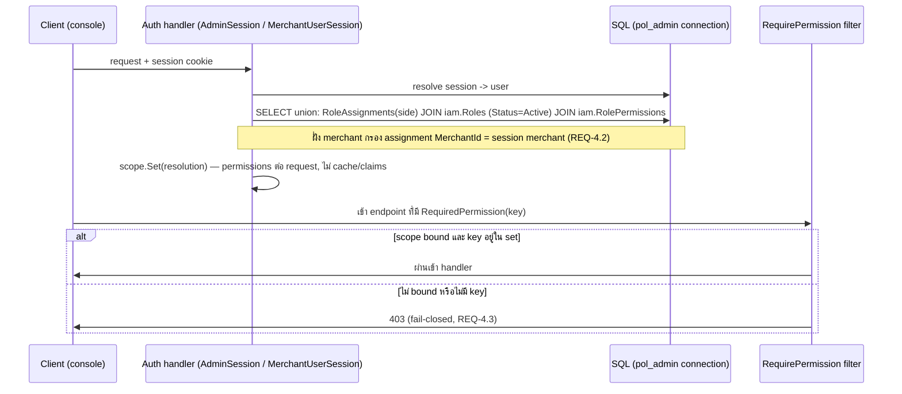
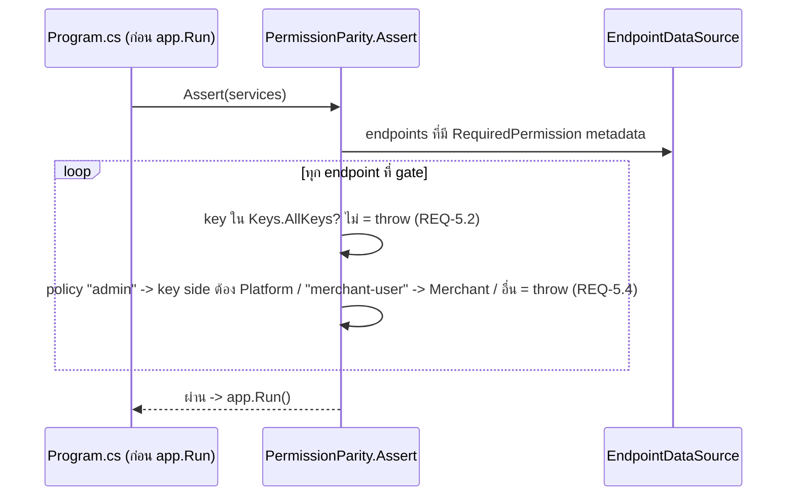

# Design: rf2-iam-rbac — Central IAM catalog แทน 2 catalog ซ้ำ

> Status: approved 2026-07-12
> Requirements: requirements.md (approved 2026-07-12) — 10 REQ / 53 criteria
> Depends: rf1-schema-reset (merged PR #79) + hierarchical-naming (merged PR #96)

## Architecture Overview

องค์ประกอบ 6 ส่วน — หลักคือ module ใหม่ `Iam` เป็นเจ้าของ catalog, ส่วน console module
(Admins/Merchants) เหลือแค่ assignment + นโยบายฝั่งตน:

1. **Module `Iam` ใหม่** (`src/Modules/Iam/`) — เจ้าของ vocabulary + role aggregate:
   - `Iam.Domain` — `Permissions/` (`Keys` vocabulary 20 keys/8 groups + `Scope` ต่อ group,
     `Permission`, `PermissionGroup`), `Roles/` (`Role`, `RolePermission`, `RoleStatus`, `Scope`)
     — ตาม naming law: root types อยู่ตาม sub-domain, ไม่มี prefix ซ้ำ namespace (L1-L4)
   - `Iam.Application` — role CRUD commands/queries เดียว (Create/Update/Delete/Get/List +
     permission catalog query) parameterized ด้วย **side context** (Platform | Merchant+MerchantId)
     ที่ endpoint ฝั่งนั้นส่งเข้ามา — แทน handler ซ้ำ 2 ชุดเดิม
   - `Iam.Infrastructure` — EF configurations (schema `iam`) + `RoleStore` (CRUD) ; **ไม่มี**
     resolution query ที่นี่ (มันต้อง join assignment ที่ module อื่นเป็นเจ้าของ)
2. **Dependency rule ใหม่ (บันทึกเป็น decision):** `Iam.Domain` เป็น *published language* —
   module อื่น (Admins/Merchants) อ้างถึงตรงได้เหมือน `SharedKernel`; ห้าม `Iam.*` อ้าง module อื่น.
   เหตุผล: กฎ "โมดูลไม่อ้างกันตรง" มีไว้กันการ couple ระหว่าง peer business module — catalog สิทธิ์
   เป็น vocabulary กลางที่การ duplicate เพื่อเลี่ยง reference คือตัวปัญหาที่ rf2 ตั้งใจฆ่า
   (Architecture.Tests เพิ่ม rule: `Iam` ไม่ reference module ใด, module ใดก็ reference ได้แค่
   `Iam.Domain` ไม่ใช่ `Iam.Infrastructure`)
3. **Assignment คงอยู่ per side** — `Admins.Domain.Roles.RoleAssignment` (ตาราง
   `admin.RoleAssignments`) + `Merchants.Domain.Users.Roles.RoleAssignment`
   (`merch.RoleAssignments`) เดิม เปลี่ยนเฉพาะ FK `RoleId` → `iam.Roles` + validation scope
   (REQ-3.4/3.5). Resolution query (`ListEffectivePermissionsAsync`) อยู่ที่
   Admins/Merchants.Infrastructure เดิม แต่ join ตาราง `iam.*` ผ่าน `PolDbContext` เดียวกัน
4. **Unified endpoint authorization** (`src/Hosts/Api/Iam/PermissionAuthorization.cs` ใหม่) —
   metadata `RequiredPermission(Key)` เดียว + extension `RequirePermission(key)` เดียว + endpoint
   filter เดียวอ่านจาก scope ที่ bound (`IAdminScope` ก่อน แล้ว `IUserScope`; ไม่ bound = 403) —
   แทน `HostWiring.RequirePermission` + `UserPermissionAuthorization` เดิม
5. **Parity guard เดียว side-aware** (`PermissionParity.Assert`) — scan `EndpointDataSource`:
   (ก) ทุก gated key ⊆ `Keys.AllKeys` (ข) side ของ key (จาก group `Scope`) ตรงกับ policy ของ
   endpoint (`admin` → Platform, `merchant-user` → Merchant; mapping policy→side อ้าง source
   เดียวกับ policy→scheme ที่ Program.cs มีอยู่ — ไม่เขียน switch ซ้ำ) — endpoint ที่ gate แต่
   policy ไม่รู้จัก / มี authorize metadata หลาย policy = throw, fail-closed. เรียกก่อน
   `app.Run()` เหมือนเดิม. หมายเหตุ: filter ลอง `IAdminScope` ก่อนแล้ว `IUserScope` — ปลอดภัย
   เพราะทุก endpoint เป็น single-scheme (pin โดย REQ-10.3); ถ้าอนาคตมี dual-auth endpoint
   ต้องทบทวนลำดับนี้
6. **Catalog เดิมตาย** — `Admins.Domain/{Permissions,Roles}/{Permission,PermissionGroup,Role,
   RolePermission,RoleStatus}`, `Merchants.Domain/Users/{Permissions,Roles}/…` (ยกเว้น
   `RoleAssignment` 2 ตัว), handlers ซ้ำใน Admins/Merchants.Application, guard 2 ตัว, ตาราง 8 ตัว
   — ลบทั้งหมด; `// ponytail: DUPLICATE` markers = grep target ยืนยันลบครบ (REQ-1.5)

## Sequence Diagrams

### 1. Per-request permission resolution + gate (สองฝั่ง, กลไกเดียว)



### 2. Merchant role create + grant (scope validation ครบวง)

```mermaid
sequenceDiagram
    participant M as Merchant_Manager (roles.manage)
    participant E as POST /merchants/users/roles
    participant A as Iam.Application CreateRole (side=Merchant, merchantId=caller)
    participant DB as iam.Roles / iam.RolePermissions
    M->>E: {code, name, permissionKeys}
    E->>A: command + side context
    A->>A: Scope=Merchant, MerchantId=caller (REQ-3.7); code ชน shared visible = 409
    A->>A: ทุก key: มีใน catalog? (400) + group.Scope == Merchant? (400, REQ-6.6)
    A->>DB: insert role + grants (FK PermissionKey กัน key ผี, REQ-2.6)
    DB-->>M: 201 — merchant อื่นมองไม่เห็น role นี้ (REQ-3.6)
```

### 3. Boot parity guard (side-aware)



## Data Models & Interfaces

### Schema `iam` (ตารางใหม่ 4 ตัว)

| Table | Columns (หลัก) | Constraints |
|---|---|---|
| `iam.PermissionGroups` | `Key nvarchar(64)` PK, `Scope int` NOT NULL (0=Platform, 1=Merchant), `Label nvarchar(200)`, `SortOrder int` | — |
| `iam.Permissions` | `Key nvarchar(128)` PK, `GroupKey` FK → `PermissionGroups.Key` (Restrict), `Label`, `SortOrder` | FK (REQ-1.1) |
| `iam.Roles` | `Id uniqueidentifier` PK, `Code nvarchar(64)` NOT NULL, `Scope int` NOT NULL, `MerchantId uniqueidentifier` NULL, `Name`, `Status int`, timestamps — field set เดิมของ Role คงครบ | UNIQUE `(MerchantId, Code)` (NULL = shared bucket เดียว → code ไม่ชนใน bucket; ต่าง merchant ใช้ code ซ้ำกันได้ — กัน 409 รั่วข้าม tenant); CHECK `(Scope = 0 AND MerchantId IS NULL) OR Scope = 1` (REQ-3.3) |
| `iam.RolePermissions` | `RoleId` FK → `iam.Roles` (Cascade), `PermissionKey` FK → `iam.Permissions.Key` (Restrict) | PK `(RoleId, PermissionKey)` (REQ-2.6) |

Assignment (แก้ FK อย่างเดียว — ชื่อตารางคงเดิมตาม L7; v5 เรียก `UserRole` แต่ repo convention
= พหูพจน์ + ชื่อเดิมสื่อความหมายกว่า — ปิด open question #1):

- `admin.RoleAssignments`: `RoleId` FK → `iam.Roles` (Restrict) — เดิมชี้ `admin.Roles`
- `merch.RoleAssignments`: `RoleId` FK → `iam.Roles` (Restrict) + index `(MerchantUserId, MerchantId)` เดิม
- คอลัมน์ `AssignedByAdminId` → rename `AssignedById` ทั้ง 2 ตาราง (ปิด F15 — ฝั่ง merch
  ผู้ assign คือ merchant user, ชื่อเดิม misnomer; ทำพร้อม FK re-point ใน migration เดียวกัน)
- **Resolution defense-in-depth (จาก critique P2-2):** merchant resolution join เพิ่มเงื่อนไข
  `role.MerchantId IS NULL OR role.MerchantId = @merchantId` (ไม่พึ่ง assignment แถวถูกอย่างเดียว)
  — assignment ที่ชี้ role ของ merchant อื่น (scope ถูกแต่ merchant ผิด) ไม่ contribute permission

หมายเหตุ DB constraints (critique P3-2/P3-5): CHECK + UNIQUE `(MerchantId, Code)` นิยามใน
**EF model** (`HasCheckConstraint`/`HasIndex().IsUnique().HasFilter(null)`) ไม่ใช่ raw
`migrationBuilder.Sql` — ลง ModelSnapshot ให้ model-consistency guard ใช้ได้.
**`HasFilter(null)` บังคับ** (Codex P2, PR #98): SQL Server provider default ใส่ filter
`[MerchantId] IS NOT NULL` ให้ unique index บน nullable column — filtered index จะไม่คุม
แถว NULL เลย ทำให้ shared role code ซ้ำ insert ได้; ต้อง clear filter เป็น unfiltered index
ถึงจะได้ shared-NULL-bucket uniqueness ตามพฤติกรรม SQL Server ที่ถือ NULL เท่ากันใน
unique index (non-ANSI — ถูกต้องบน stack ที่ pin, มี integration test pin พฤติกรรมนี้)

### `Iam.Domain` types

```csharp
namespace Iam.Domain.Permissions;
public enum Scope { Platform = 0, Merchant = 1 }
public static class Keys
{
    // 8 groups + Scope ต่อ group (REQ-2.1): txn, merchant, user, system, merchants.users = Platform
    //                                        catalog, payment, roles = Merchant
    // 20 keys — literal เดิมทุกตัว (REQ-1.3); ไม่มี invoice.*/settlement.run (REQ-2.2)
    public static readonly IReadOnlyList<(string Key, string GroupKey)> All;      // 20 รายการ
    public static readonly IReadOnlySet<string> AllKeys;                          // parity reference
    public static readonly IReadOnlyDictionary<string, Scope> KeySide;            // key -> side (REQ-5.4/6.4/6.6)
}

namespace Iam.Domain.Roles;
public sealed class Role   // aggregate — invariants ใน domain
{
    public const string PlatformAdminCode = "platform_admin";
    public const string MerchantManagerCode = "merchant_manager";
    public bool IsSeedAnchor { get; }          // 2 anchor (REQ-2.4) — Deactivate()/delete guard 409
    public Scope Scope { get; }                // immutable (REQ-3.1)
    public Guid? MerchantId { get; }           // null = shared/seed (REQ-3.2)
    // Code slug ^[a-z0-9_]+$ <=64 immutable, Status strict parse — กฎเดิมยกมาทั้งชุด (REQ-6.3)
}
```

### `Iam.Application` (handler เดียวต่อ operation, side context เป็น input)

```csharp
public sealed record RoleSideContext(Scope Scope, Guid? MerchantId); // Platform => MerchantId null
// CreateRoleCommand / UpdateRoleCommand / DeleteRoleCommand / GetRoleQuery / ListRolesQuery /
// GetPermissionCatalogQuery — ทุกตัวรับ RoleSideContext ที่ประกอบจาก "จุดเดียว" (critique P2-3):
//   helper กลาง derive จาก bound scope จริง — IAdminScope bound -> (Platform, null),
//   IUserScope bound -> (Merchant, me.MerchantId); ห้าม endpoint ประกอบ record เองต่อ call site
// วิธีนี้ scope ไม่มาจาก request body และ wiring ผิด side ต่อ endpoint เป็นไปไม่ได้
// (fail-closed by construction) + มี pin test endpoint<->side (Testing)
```

- Visibility ใน **ทุก read/lookup ของ store ที่ย้ายมา** — ไม่ใช่แค่ List (critique P2-6;
  wart เดิม: merchant RoleRepository ไม่กรองอะไรเลยใน GetByCode/CodeExists/List/GetListItem/
  GetRoleIdsByCodes): Platform context → `Scope=Platform AND MerchantId IS NULL`;
  Merchant context → `Scope=Merchant AND (MerchantId IS NULL OR MerchantId=@m)` (REQ-3.6/3.9);
  assignment code-resolution (`GetRoleIdsByCodes`) ใช้ visible set เดียวกัน
- Mutation ใน store: Merchant context แก้/ลบได้เฉพาะแถว `MerchantId=@m` — เจอ shared = 409 (REQ-3.8)
- Dup-code pre-check: ภายใน visible set + **ทั้ง NULL bucket ข้าม scope** (critique P2-5 —
  Platform role กับ shared merchant seed อยู่ bucket uniqueness เดียวกัน; pre-check ที่กรอง Scope
  จะพลาดแล้วไปตายที่ UNIQUE เป็น 500) + map unique-violation จาก DB → 409 เป็น backstop
- Grant validation: ทุก key ต้องอยู่ใน `Keys.AllKeys` (400 เดิม) และ `KeySide[key] == role.Scope`
  (400 ใหม่, REQ-6.6)

### Assignment commands (อยู่ module เดิม)

- `Admins.Application` `SetAdminRoles`: lookup role ใน Platform visible set — code นอก set = 400
  (ครอบ REQ-3.4 ในตัว: Merchant role ไม่อยู่ใน set)
- `Merchants.Application` `MerchantSetRoles` + `Approve(RoleCodes)`: lookup ใน Merchant visible set
  ของ merchant target = validation REQ-3.5/7.2; target นอก merchant = 404 เดิม (REQ-7.3)

### Wire contracts

- ทุก endpoint route + gate key + DTO shape เดิม (REQ-4.5, 6.1, 6.2, 6.4) — **ยกเว้น** เพิ่ม field
  additive เดียว: merchant role DTO ได้ `shared: bool` (true = seed กลาง แก้ไม่ได้) — ไม่งั้น FE
  ไม่มีทางรู้ว่าแถวไหนจะ 409 (REQ-3.8); additive JSON field = non-breaking, ไม่ใช่ L8 contract
- `Scope`/`MerchantId` ไม่ออก wire — side เป็น implicit ต่อ console (REQ-6.4)

### Seed (REQ-2) — stable GUIDs ใน `SeedData`

| Role | Id (literal) | Scope | Permissions |
|---|---|---|---|
| `platform_admin` (anchor) | `11111111-1111-1111-1111-111111111111` (สืบทอดจาก super_admin — bootstrap idempotent-assign อ้าง code ไม่ใช่ id แต่คง id เดิมกัน drift อื่น) | Platform | ทั้ง 13 platform keys |
| `platform_auditor` | `55555555-…` (สืบทอด auditor), **Status=Active** (ต่างจาก auditor เดิมที่ seed Inactive — role นี้เป็น seed ใช้งานจริงตามแผน v5) | Platform | txn.view, merchant.view, user.view, audit.view |
| `merchant_manager` (anchor) | `aaaaaaaa-…` (สืบทอด merchant_owner) | Merchant | ทั้ง 7 merchant keys |
| `merchant_staff` | `bbbbbbbb-…` (สืบทอด merchant_member) | Merchant | product.create, product.update, payment.create, payment.redirect |

Roles เดิมที่ไม่ carry: `ops_admin`, `finance`, `support` — สร้างใหม่ได้ผ่าน role CRUD ถ้าต้องใช้
(throwaway D13; ไม่มี user ผูกใน fresh reset)

Bootstrap (critique P3-1): `SelfProvisionSuperAdmin.cs` swap constant `Role.SuperAdminCode` →
`Iam.Domain.Roles.Role.PlatformAdminCode` (Admins.Application ได้ reference `Iam.Domain` ตาม
published-language rule); `RoleAssignment.Create` เดิมของ Admins.Domain คงใช้ต่อ — semantics
idempotent-by-code + no-op เมื่อ seed role หาย ยกมาครบ (REQ-8.1)

## Technology Decisions

| เรื่อง | ตัดสิน | เหตุผล |
|---|---|---|
| Migration strategy (ปิด open question #3; แก้ตาม critique P2-1) | **Regenerate chain 3 ไฟล์แบบ EF-native** — `dotnet ef migrations remove` ถอยจนหมด chain แล้ว `migrations add` ใหม่ทั้ง 3 (InitialSchema generated จาก model ใหม่ — มี `iam.*`, ไม่มี catalog เก่า; SecurityObjects + SeedData เป็น empty-model migration ที่ hand-fill Sql เนื้อหาแก้แล้ว) — ห้าม hand-edit ไฟล์เดิมในที่ เพราะ `Designer.cs` 3 ไฟล์ + `PolDbContextModelSnapshot.cs` เป็น cumulative snapshot: ถ้าไม่ regen, `migrations add` ของ rf3 จะ diff กับ snapshot เก่า (ยังมี admin/merch catalog, ไม่มี iam) แล้ว generate DDL ผิด. เพิ่ม guard ถาวร: test `Assert.False(db.Database.HasPendingModelChanges())` | reset-only cutover ตาม precedent rf1/PR#68-69 (pre-prod, ไม่มี data migration — D13); fresh DB ไม่ต้อง create-แล้ว-drop ตาราง 8 ตัว; DB เก่าต้อง `docker compose down -v` → bootstrap → migrate (operator note ใน requirements) |
| DbContext | `PolDbContext` เดียวเดิม — เพิ่ม `iam` entity configurations; **`Iam.Infrastructure` config assembly ต้องถูกเพิ่มเข้า `ModuleAssemblies` ที่ประกอบ `PolDbContext` ทุกจุด** (Program.cs API + Worker + test harness ทุกตัวที่ต้อง map iam — critique P2-4: ไม่งั้น iam entity ไม่อยู่ใน model, resolution join ประกอบไม่ได้); ทุก identity/RBAC operation (สองฝั่ง) อยู่บน keyed `"admin"` (pol_admin) เหมือนเดิม | จาก audit จริง: merchant identity/session/role stores ทุกตัวรันบน keyed pol_admin อยู่แล้ว (`SessionStore.cs`, `UserRepositories.cs`) — pol_app ไม่เคยแตะ catalog |
| Grant matrix `iam` (ปิด open question #2) | `pol_admin`: SELECT บน `Permissions`/`PermissionGroups`, CRUD บน `Roles`/`RolePermissions`; `pol_app`: **ไม่มี grant ใดบน `iam.*`**; assignment tables คง grant เดิม (pol_admin CRUD) | mirror pattern เดิมเป๊ะ (REQ-9.1) — resolution ทั้งสอง path รันบน pol_admin; funnel (pol_app) ไม่ resolve permission |
| RLS บน `iam.*` | ไม่มี policy (REQ-9.2). **Residual risk (บันทึกตามที่ requirements สั่ง):** `iam.Roles`/`RolePermissions` มีแถว per-merchant; isolation = app-layer visibility filter (REQ-3.6) + query ทุกตัวออกจาก `Iam.Application` store ที่รับ `RoleSideContext` บังคับ — read path นอก store ไม่มี (Architecture.Tests กัน handler อื่น query `iam.Roles` ตรง); ความเสี่ยงคงเหลือ = code path อนาคตข้าม store → mitigate ด้วย test REQ-10 + drift guard 7.6 | ใส่ RLS บนตารางที่ถูก resolve ระหว่าง authenticate = เสี่ยง chicken-and-egg (SESSION_CONTEXT ยังไม่ครบตอน resolve) และ role metadata ไม่ใช่ payment data |
| Module reference | `Iam.Domain` = published language (อ้างตรงได้); ห้ามอ้าง `Iam.Infrastructure` ข้าม module; enforce ใน Architecture.Tests | ทางเลือก Mediator-only ถูก reject: catalog อยู่ใน DbContext เดียวกัน การบังคับ query ข้าม Mediator เพิ่ม ceremony โดยไม่ได้ isolation จริง |
| Scope บน wire | ไม่ expose — side มาจาก endpoint context เท่านั้น | client เลือก side ไม่ได้ = fail-closed by construction; ลด surface ของ contract |
| ชื่อ assignment table | คง `RoleAssignments` (ไม่ตาม v5 `UserRole`) | L7 + convention พหูพจน์ + ชื่อเดิมตรง semantics; ลด diff |

## Error Handling Strategy

| กรณี | ที่ตรวจ | ผล |
|---|---|---|
| endpoint ไม่มี scope bound / key ไม่อยู่ใน permission set | endpoint filter | 403 (REQ-4.3) |
| gated key นอก catalog | boot guard | throw ก่อน `app.Run()` (REQ-5.2) |
| gated key ผิด side กับ policy ของ endpoint / endpoint gate แต่ policy ไม่รู้จัก | boot guard | throw (REQ-5.4) |
| grant key นอก catalog | `Iam.Application` | 400 (REQ-6.3) |
| grant key ผิด side กับ `role.Scope` | `Iam.Application` | 400 (REQ-6.6) |
| assign Platform role ให้ MerchantUser / กลับกัน / merchant-specific ของ merchant อื่น | visible-set lookup ใน assignment command | 400 (REQ-3.4/3.5/7.4) |
| merchant update/delete role ที่ไม่ใช่ของตน (รวม shared seed) | store mutation filter | 409 (REQ-3.8) |
| admin create Platform role code ชน shared merchant seed (NULL bucket เดียวกัน ต่าง scope) | pre-check ทั้ง NULL bucket + unique-violation → 409 backstop | 409 (REQ-6.3; critique P2-5) |
| deactivate/delete anchor (`platform_admin`/`merchant_manager`) | domain guard | 409 (REQ-2.4/6.5) |
| delete role ที่ยังมี assignment | store (count ทั้ง 2 ตาราง assignment) | 409 (REQ-6.3) |
| dup code ใน bucket เดียว (shared/ต่อ merchant) | UNIQUE `(MerchantId, Code)` + pre-check | 409 (REQ-6.3) |
| merchant create code ชน shared visible code | app pre-check (index กันไม่ได้ — คนละ bucket) | 409 (กัน `roles/{code}` กำกวม) |
| status parse ค่าแปลก | strict parse เดิม | 400 (REQ-6.3) |
| unknown role code (read/assign) | lookup ใน visible set | 404 read / 400 assign (REQ-6.3/7.4) |
| target merchant user นอก merchant ของ caller | เดิม | 404 (REQ-7.3) |
| `RolePermissions` อ้าง key ผี (raw SQL/seed ผิด) | DB FK | reject (REQ-2.6) |
| assignment scope ผิดหลุดถึง DB (write path ข้าม validation) | integration drift guard — assert ทั้ง Scope ตรงฝั่ง **และ** ฝั่ง merch: `role.MerchantId ∈ {NULL, assignment.MerchantId}` (critique P2-2 — ครอบเท่า validation 3.5 ที่มันค้ำ) | test แดง (REQ-7.6) |

## Testing Strategy

| ชั้น | Test | REQ |
|---|---|---|
| Unit (`Iam.Tests` ใหม่) | `Keys` pin: 20 keys / 8 groups / `KeySide` ครบ + literal ชุดเต็ม | REQ-10.1, 2.1, 2.2 |
| Unit | `Role` invariants: Scope immutable, CHECK Platform→MerchantId null, anchor guard, slug/status | REQ-3.1, 3.3, 2.4, 6.3 |
| Unit (Hosts.Tests) | unified filter: bound admin / bound merchant / unbound / key หาย → 403 | REQ-4.1, 4.3 |
| Unit (Hosts.Tests) | parity guard: key นอก catalog throw, key ผิด side throw, policy แปลก throw, ชุดจริงผ่าน | REQ-5.1, 5.2, 5.4 |
| Unit (Hosts.Tests) | endpoint↔key mapping pin ทั้ง 20 จุด (จับ swap `user.roles`/`users.roles`) **+ pin endpoint↔side ของ role-management endpoints** (จับ wiring RoleSideContext ผิดฝั่ง — critique P2-3) | REQ-10.4, 4.5, 3.9 |
| Unit (Hosts.Tests) | OpenAPI scheme ids pin เดิม | REQ-10.3 |
| Integration | seed drift: `iam` rows SetEquals vocabulary (keys+groups+4 roles+grants ต่อ role) | REQ-10.2, 2.3, 2.5 |
| Integration | grants matrix: pol_admin CRUD/SELECT ตามตาราง, pol_app โดน deny บน `iam.*` | REQ-9.1 |
| Integration | ไม่มี RLS policy บน `iam.*` (query sys.security_policies) | REQ-9.2 |
| Integration | fresh-DB migrate จากศูนย์ (bootstrap → ef update) — ตาราง iam ครบ, catalog เก่าไม่มี | REQ-9.3, 1.4, 2.5 |
| Integration | model-consistency guard: `HasPendingModelChanges() == false` (จับ snapshot drift — critique P2-1) | REQ-9.3 |
| Integration | UNIQUE NULL-bucket pin: insert shared role code ซ้ำ 2 แถว → DB reject (พฤติกรรม SQL Server NULL-equal — critique P3-2) | REQ-6.3 |
| Integration | resolution defense-in-depth: merch assignment ชี้ role ของ merchant อื่น → ไม่ contribute permission (critique P2-2) | REQ-4.2 |
| Integration | FK: RolePermissions bogus key reject; assignment FK → iam.Roles | REQ-2.6, 7.1 |
| Integration | drift guard: assignment ทุกแถว scope ตรงฝั่ง | REQ-7.6 |
| Integration (RBAC E2E) | merchant A สร้าง custom role → B ไม่เห็น; merchant แก้ shared = 409; cross-side grant = 400; assign ข้าม scope = 400; revoke มีผล request ถัดไป; Scoped+platform_admin ทำ action ได้แต่เห็นข้อมูลแคบ (orthogonality) | REQ-3.5-3.9, 6.6, 4.4, 8.2, 8.3 |
| Integration | bootstrap self-provision → ได้ `platform_admin` idempotent | REQ-8.1 |
| Existing suites | Admins/Merchants role CRUD + approve flow ทั้งชุดเดิมต้องเขียวบน catalog ใหม่ (พฤติกรรม 6.1-6.5, 7.2-7.5, 4.2, 4.6) — ปรับ namespace/seed id เท่านั้น ห้ามลด assertion | REQ-6, 7, 4.2, 4.6 |
| Architecture.Tests | entity→schema allow-set test — **สร้างใหม่** (critique P2-4: test ตามสัญญา rf1 REQ-1.4 ไม่มีอยู่จริงใน tests/ — เขียนครั้งนี้ครอบทุก module รวม `iam`); module reference rules (`Iam` ไม่อ้างใคร, ใครอ้างได้แค่ `Iam.Domain`); ห้าม query `iam.Roles` นอก Iam store/resolution repos | REQ-1.6 |
| Grep gates | `ponytail: DUPLICATE` (RBAC) = 0; `PermissionParity`/`UserPermissionParity` เดิมหาย | REQ-1.5, 5.3 |

## Requirement Traceability

| Section | REQ |
|---|---|
| Schema `iam` 4 ตาราง + FK/CHECK/UNIQUE (Data Models) | REQ-1.1, 2.6, 3.1, 3.2, 3.3 |
| `Iam.Domain.Permissions.Keys` vocabulary เดียว + `KeySide` | REQ-1.2, 1.3, 2.1, 2.2 |
| ลบ catalog เก่า (Architecture Overview ข้อ 6, migration InitialSchema) | REQ-1.4, 1.5 |
| Architecture.Tests schema/reference rules | REQ-1.6 |
| Seed table (Data Models — Seed) + SeedData migration | REQ-2.1, 2.2, 2.3, 2.5 |
| `Role.IsSeedAnchor` + domain guard | REQ-2.4, 6.5 |
| `RoleSideContext` + visibility/mutation filter ใน Iam.Application | REQ-3.4, 3.5, 3.6, 3.7, 3.8, 3.9 |
| Unified `RequiredPermission` metadata + filter (Sequence 1) | REQ-4.1, 4.3 |
| Resolution join ใน Admins/Merchants.Infrastructure (Sequence 1) | REQ-4.2, 4.6 |
| Gate sites คงเดิม 20 จุด (Wire contracts) | REQ-4.5 |
| Revoke-next-request (ไม่ cache — Sequence 1) | REQ-4.4 |
| `PermissionParity.Assert` side-aware (Sequence 3) | REQ-5.1, 5.2, 5.4 |
| ลบ guard เดิม 2 ตัว (Architecture Overview ข้อ 6) | REQ-5.3 |
| Endpoint mapping เดิม + `Iam.Application` handlers (Wire contracts) | REQ-6.1, 6.2, 6.4 |
| กฎ role เดิมใน `Role` aggregate + store (Error Handling) | REQ-6.3 |
| Grant side validation (Sequence 2, Error Handling) | REQ-6.6 |
| Assignment FK re-point + `AssignedById` rename (Data Models) | REQ-7.1 |
| Approve + SetRoles ผ่าน visible-set lookup | REQ-7.2, 7.3, 7.4 |
| ไม่มี admin endpoint จัดการ Merchant-scope role (RoleSideContext ฝั่ง admin = Platform) | REQ-7.5 |
| Integration drift guard assignment scope | REQ-7.6 |
| Bootstrap `SelfProvisionSuperAdmin` → `platform_admin` | REQ-8.1 |
| Tier untouched (ไม่มี design element แตะ Tier/RLS/fn_merchant_predicate) + orthogonality test | REQ-8.2, 8.3 |
| Grant matrix `iam` (Technology Decisions) | REQ-9.1 |
| No-RLS + residual risk (Technology Decisions) | REQ-9.2 |
| Migration strategy 3 ไฟล์ in-place (Technology Decisions) | REQ-9.3 |
| Testing Strategy pins/drift guards | REQ-10.1, 10.2, 10.3, 10.4 |
