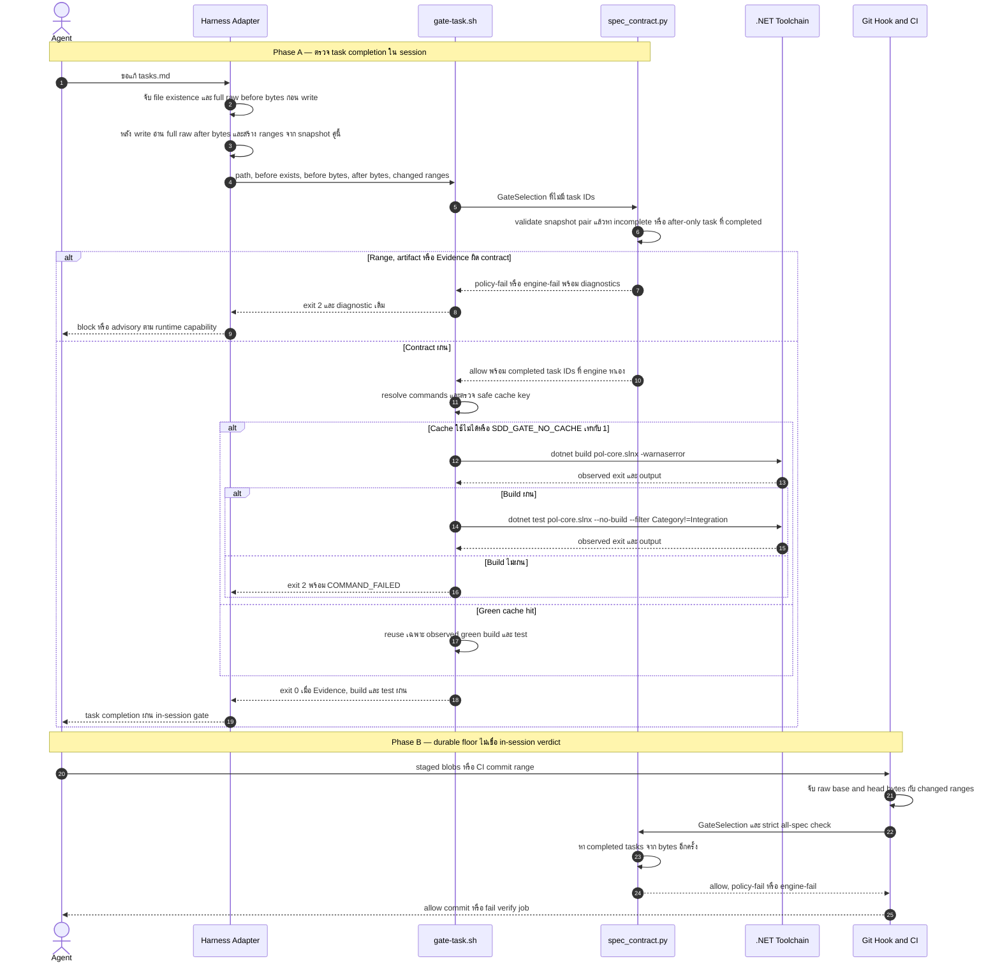
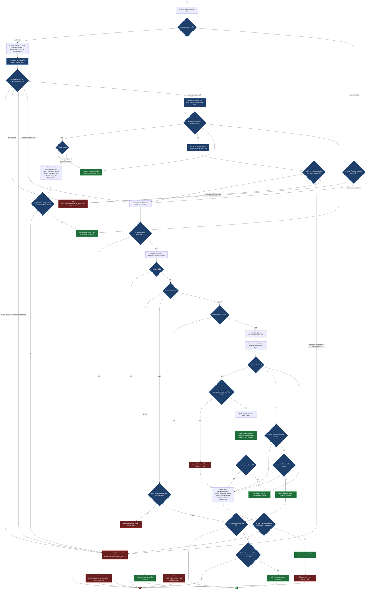

# Design: SDD Operating-Layer Parity

> Status: approved 2026-08-25

เอกสารนี้กำหนดสถาปัตยกรรมของ SDD operating layer ให้ `pol-core` ใช้ contract และ verdict เดียวกันบน Claude, Codex และ OpenCode พร้อม migration canonical historical specs 61 directories แบบไม่สร้างหลักฐานขึ้นเอง โดยนับ feature `sdd-operating-layer-parity` แยก และไม่แตะ product runtime หรือขยาย CI นอก verify paths

## Architecture Overview

สถาปัตยกรรมมีสอง engine และหนึ่ง writer เท่านั้น การ parse artifact อยู่ใน Python stdlib จุดเดียว ส่วน shell และ harness adapter มีหน้าที่เลือก scope, ส่ง input และแปลงผลกลับเป็นกลไก block ของ runtime นั้น

| Component | Ownership | รับข้อมูลจาก | ส่งผลให้ | ฐาน requirement หรือ filesystem |
|---|---|---|---|---|
| `Spec Contract Engine` | status grammar, status reference, phase, task, Evidence, EARS, trace, slice, state และ completed-task discovery | artifact bytes, canonical directory location กับ explicit CLI arguments | typed records, normalized verdict, diagnostics | `requirements.md:51-115`, `requirements.md:117-145` |
| `Enforcement Engine` | quote-aware command spans, Evidence selection, command resolution, cache และ command execution | raw command, `GateSelection`, CI range | allow หรือ block พร้อม diagnostic เดิม | `requirements.md:117-161`, `requirements.md:252-265` |
| Harness adapters | payload extraction, raw before/after byte capture, changed-range capture และ runtime-specific block mapping | Claude, Codex, OpenCode | `GateSelection` หรือ raw guard request เข้า engine กลาง | `.claude/hooks/task-gate.sh:7-38`, `.codex/hooks/task-gate.sh:27-83`, `.opencode/plugins/task-gate.js:37-68` |
| `spec-retrofit.py` | writer เดียวของ historical artifact migration แบบ field-level, crash-consistent existing-file exchange และ owner-locked batch recovery | current bytes, historical blobs, clean-tree snapshot, batch ID | recovered atomic batch หรือ field-level blocker โดยไม่ทับ foreign bytes | `requirements.md:163-190`, `scripts/spec-retrofit.py:481-622`, `scripts/spec-retrofit.py:2256-2353` |
| Shared consumers | task graph, slice, state และ repository binding | engine CLI หรือ import seam | pane-loop, cost, sync, SessionStart | `scripts/pane-loop.sh:79-135`, `scripts/cost_lib.py:11-17`, `.claude/settings.json:39-45` |
| Repository alignment | source-to-assertion checks และ protected CI comparator | filesystem, canonical docs, merge-base blobs | fail-closed alignment diagnostics | `requirements.md:26-49`, `.github/workflows/ci.yml:17-273`, `.gitlab-ci.yml:22-258` |
| CI verify cutover | strict checks หลัง migration ผ่าน โดยรักษา shell inventory เดิม | GitHub/GitLab verify jobs | durable merge evidence | `.github/workflows/ci.yml:17-82`, `.gitlab-ci.yml:22-55` |

Boundary ที่ห้ามข้าม:

- `scripts/spec_contract.py` เป็น read-only ต่อ `.ai/specs/**` ทุกคำสั่ง ห้ามเขียนหรือ normalize artifact โดยตรง
- `scripts/spec-retrofit.py` เป็น writer เดียว และเขียนได้เฉพาะ canonical historical named set 61 directories ที่อยู่ใน migration scope
- `.ai/bin/*.sh` ห้ามถือ Markdown grammar สำเนา ทุก validation ต้องเรียก `spec_contract.py`
- `scripts/guard_contract.py` ทำเฉพาะ detection-only shell parsing และไม่ execute input ส่วน policy verdict ยังคงอยู่ที่ enforcement entry points
- Adapter, pre-commit และ CI ห้ามหา completed task หรือ parse Markdown เอง ต้องส่ง raw before/after bytes กับ changed ranges ให้ `spec_contract.py`
- Adapter ห้ามมี regex สำหรับ status, task ID, Evidence, requirement reference หรือ trace
- `src/**`, `tests/**`, `docker/**`, `pol-core.slnx`, `Directory.Packages.props` และ runtime dependency manifests เป็น protected paths ที่ต้อง byte-identical ตาม `requirements.md:26-49`
- งานนี้ไม่เพิ่ม B0, goals, runs, calibration, `spec_to_goal`, Universal PR Quality Gate, review-fanout policy, Pi extension หรือ dependency ตาม `requirements.md:20-24`

Dependency direction เป็นแบบทางเดียว:

```text
Harness payload / staged blobs / CI range
    -> thin adapter captures before_bytes, after_bytes, changed_ranges
    -> .ai/bin enforcement entry point
    -> scripts/spec_contract.py discovers completed tasks and validates Evidence
    -> artifact verdict

Raw guard command
    -> .ai/bin/lib-guard.sh
    -> scripts/guard_contract.py emits NormalizedCommandSpan tree
    -> existing destructive and bypass policies

scripts/spec-retrofit.py --batch <id>
    -> scripts/spec_contract.py strict parser plus migration-only compatibility probe
    -> historical git blobs and field-level proof
    -> recovery journal from captured bytes
    -> shared crash-consistent existing-file exchange with durable intent for one proven-safe batch
```

ไม่มี database, daemon, network service หรือ persisted runtime state ใหม่ Cache ของ task gate อยู่ใต้ git dir และไม่ใช่ source of truth

## Sequence Diagrams

ลำดับนี้เป็น critical path ของ task completion ตั้งแต่ in-session hook ถึง durable git/CI floor โดย verdict มาจาก engine กลางชุดเดียว แม้ timing ของแต่ละ harness ต่างกัน



กฎของ sequence:

- Completed-task discovery อยู่ใน `spec_contract.py` เท่านั้น Caller ส่งเพียง bytes กับ ranges และห้ามส่ง selected task IDs
- Evidence validation รันก่อน cache lookup ทุกครั้ง จึงไม่มี cache hit ใดช่วย Evidence ที่ผิดได้
- Build ผ่านแต่ test ไม่ผ่านยังเป็น block และห้ามเขียน cache key
- Adapter แสดง timing ตาม runtime จริง แต่ไม่เปลี่ยน normalized verdict
- Git hook และ CI ตรวจซ้ำจาก staged หรือ committed bytes ไม่รับ verdict จาก session เป็นหลักฐาน

## Data Models & Interfaces

Record ทั้งหมดเป็น immutable value ระหว่าง invocation ไม่มี ORM หรือ persisted schema ใหม่ Python implementation ใช้ `dataclasses.dataclass(frozen=True, slots=True)` และ type ที่รองรับ Python 3.12

| Record | ฟิลด์บังคับ | Owner ของ bytes | Invariant |
|---|---|---|---|
| `SourceLocation` | `path`, `line`, `column` | parser | path เป็น repo-relative POSIX, line เริ่มที่ 1 |
| `Diagnostic` | `code`, `verdict`, `location`, `message`, `details` | engine | code เสถียร, message deterministic, ไม่มี secret |
| `ArtifactStatus` | `kind`, `date`, `superseded_by`, `notes`, `location` | phase artifact | grammar parse แยกจาก referential check |
| `RequirementCriterion` | `ref`, `kind`, `statement`, `heading`, `location` | `requirements.md` หรือ `bugfix.md` | ID unique และ EARS รูปเต็ม |
| `TaskBlock` | `task_id`, `title`, `completed`, `ordinal`, `span`, `satisfies`, `depends_on`, `verify`, `batch`, `evidence` | `tasks.md` | ID case-sensitive, unique, file order คงเดิม |
| `EvidenceRecord` | `observations`, `viewports`, `deviations`, `span` | task block เดียว | field ครบและไม่มี unfinished marker |
| `TraceRow` | `refs`, `section`, `location` | named columns ใน trace table | strict refs มาจาก canonical tokens เท่านั้น |
| `DesignSection` | `heading`, `body`, `span` | `design.md` | heading อยู่นอก code fence |
| `SpecSnapshot` | `feature`, `canonical_location`, `workflow`, `artifacts`, `criteria`, `tasks`, `trace`, `state`, `diagnostics` | directory เดียว | state derive จาก bytes กับ canonical location เท่านั้น |
| `ChangedByteRange` | `before_start`, `before_end`, `after_start`, `after_end` | scope selector | offset อยู่ใน bounds, เรียง, ไม่ overlap และเป็น canonical diff ของ snapshot pair เดียวกัน |
| `GateSelection` | `path`, `before_exists`, `before_bytes`, `after_bytes`, `changed_ranges`, `source` | adapter, pre-commit หรือ CI | ไม่มี task ID หรือ Markdown verdict; `before_bytes` เป็น full file เมื่อมีไฟล์ และว่างได้เฉพาะเมื่อทั้งไฟล์ไม่มีอยู่ก่อน |
| `ShellToken` | `value`, `raw_start`, `raw_end`, `quote_context`, `had_escape` | `guard_contract.py` | dequoted value ไม่ทำให้ raw bytes หรือ quote origin หาย |
| `NormalizedCommandSpan` | `raw_start`, `raw_end`, `executable`, `tokens`, `source`, `depth`, `children` | `guard_contract.py` | separator นับเฉพาะนอก quote และ child span อ้าง raw parent bytes |
| `GateCacheRecord` | `schema_version`, `key`, `commands`, `toolchain`, `result` | `gate-task.sh` | เก็บได้เฉพาะ `result=green` |
| `VerificationEvidenceRecord` | `check_id`, `target`, `scope_label`, `evidence_class`, `procedure`, `exit_code`, `observed_result`, `reason`, `environment_constraint`, `substitute_evidence`, `limitations` | verifier หรือ CI | `scope_label` อยู่ใน closed set; unverified record ต้องบอกสิ่งที่ไม่ได้รัน เหตุผล ข้อจำกัด หลักฐานทดแทน และห้ามถูกอ้างเป็น pass |
| `MigrationProof` | `kind`, `target_field`, `task_id`, `source_path`, `commit`, `line`, `text_sha256` | current file หรือ historical blob | proof ผูก field เดียว, commit message กับ code existence ใช้ไม่ได้ |
| `LegacyContainer` | `label`, `fence_marker`, `payload_bytes`, `span` | historical field เดิม | payload bytes verbatim และ canonical parser ignore ทั้ง container |
| `MigrationAction` | `path`, `target_field`, `task_id`, `field_span`, `before_bytes`, `after_bytes`, `proofs` | retrofit planner | field-level bytes exact, task ID optional, span ชี้ field เดียว, proof อย่างน้อยหนึ่งรายการต่อ field |
| `MigrationBlocker` | `code`, `path`, `target_field`, `task_id`, `line`, `current_evidence`, `historical_evidence` | retrofit planner | compatibility result จบได้เฉพาะ blocker หรือ action ไม่มี guessed resolution |
| `DurableWriteIntent` | `schema_version`, `target_path`, `swap_name`, `expected_sha256`, `planned_sha256`, `expected_device`, `expected_inode`, `planned_device`, `planned_inode` | existing-file writer | intent อยู่ใต้ trusted git-dir root, fsync ก่อน exchange, ชี้ swap entry ใน target directory และ writer ถือ `.owner.lock` แบบ `LOCK_EX` ตลอดอายุ write |

ความสัมพันธ์สำคัญ:

- `SpecSnapshot` มี workflow shape เดียวจาก `requirements-first`, `design-first`, `bugfix` หรือ `ambiguous` และรับ canonical location แยกจาก artifact content
- `TaskBlock.evidence` เป็นของ task block เดียว ห้าม sibling task ชดเชยกัน
- `TaskBlock.satisfies` และ metadata อื่นอ่านเฉพาะก่อน `Evidence:`
- `TraceRow.refs` อ่านจาก named `REQ` column เท่านั้น Bare dotted refs ไม่เข้าสู่ strict coverage และ `TraceRow.section` ต้อง resolve ไป `DesignSection.heading` exact
- `GateSelection` เป็น raw transport record หาก `before_exists=true` ต้องส่ง full existing-file `before_bytes` แม้ edit จะเพิ่ม task ใหม่; `before_exists=false` และ empty `before_bytes` ใช้ได้เฉพาะเมื่อ target file ทั้งไฟล์ไม่มีอยู่ก่อน
- Engine parse full before/after snapshots แล้วเลือกทั้ง exact-ID transition จาก incomplete เป็น completed และ after-only task ที่ถูกเพิ่มมาเป็น completed โดย require after opening span ทับ `changed_ranges`; task ที่ completed อยู่ก่อนแล้วไม่ถูกเลือกซ้ำ
- Engine require `changed_ranges` เท่ากับ canonical non-equal diff opcodes ที่สร้างจาก `before_bytes` กับ `after_bytes` คู่นั้นแบบ exact หาก range มาจาก snapshot อื่น, ขาด, เกิน หรือ out-of-bounds ให้คืน `GATE_RANGE_INVALID` แบบ engine-fail
- `NormalizedCommandSpan.children` เก็บ command substitutions และ wrapper payload ที่ parse ซ้ำแบบ detection-only โดยไม่ execute bytes ใด
- `MigrationAction` ทุกตัวผูก field เดียวและอ้าง `MigrationProof` ของ field นั้น ส่วน input ที่ไม่มี proof กลายเป็น `MigrationBlocker`
- `DurableWriteIntent` เป็น recovery truth ต่อ write หนึ่งรายการและไม่แทน batch journal Intent บอกตำแหน่ง swap กับ expected/planned inode identity เพื่อจำแนก crash state ส่วน batch journal ยังคงบอกว่าควร restore path ใด
- Legacy text ที่ต้องเก็บถูกครอบด้วย `LegacyContainer` โดยใช้ fence ยาวกว่าลำดับ backtick ยาวสุดใน payload อย่างน้อยหนึ่งตัว เพื่อคง payload bytes verbatim และไม่ปิด fence ก่อนเวลา

Python import seam ที่ consumer ภายในใช้ได้:

```python
from pathlib import Path
from collections.abc import Iterable, Sequence


def parse_status(data: bytes, path: Path) -> tuple[ArtifactStatus | None, tuple[Diagnostic, ...]]: ...
def validate_status_reference(status: ArtifactStatus, specs_root: Path) -> tuple[Diagnostic, ...]: ...
def parse_task_blocks(data: bytes, path: Path) -> tuple[tuple[TaskBlock, ...], tuple[Diagnostic, ...]]: ...
def parse_requirement_criteria(data: bytes, path: Path) -> tuple[tuple[RequirementCriterion, ...], tuple[Diagnostic, ...]]: ...
def parse_bugfix_criteria(data: bytes, path: Path) -> tuple[tuple[RequirementCriterion, ...], tuple[Diagnostic, ...]]: ...
def parse_traceability_table(data: bytes, path: Path) -> tuple[tuple[TraceRow, ...], tuple[DesignSection, ...], tuple[Diagnostic, ...]]: ...
def resolve_task_selector(tasks: Sequence[TaskBlock], selector: str) -> tuple[tuple[str, ...], tuple[Diagnostic, ...]]: ...
def discover_completed_tasks(selection: GateSelection) -> tuple[tuple[str, ...], tuple[Diagnostic, ...]]: ...
def validate_evidence(tasks: Sequence[TaskBlock], selected_ids: Iterable[str]) -> tuple[Diagnostic, ...]: ...
def check_phase_gate(feature_dir: Path, phase: str, workflow: str) -> tuple[SpecSnapshot, tuple[Diagnostic, ...]]: ...
def build_spec_slice(feature_dir: Path, task_id: str) -> tuple[str, tuple[Diagnostic, ...]]: ...
def derive_spec_state(feature_dir: Path, canonical_specs_root: Path) -> tuple[str, tuple[Diagnostic, ...]]: ...
```

CLI JSON ใช้ envelope เดียวและ sort key เสมอ ตัวอย่าง policy failure:

```json
{
  "diagnostics": [
    {
      "code": "STATUS_MALFORMED",
      "details": {},
      "line": 3,
      "message": "status ไม่ตรง canonical grammar",
      "path": ".ai/specs/host-test-config-precedence/requirements.md",
      "verdict": "policy-fail"
    }
  ],
  "schemaVersion": 1,
  "verdict": "policy-fail"
}
```

## Shared Python Contract Engine

`scripts/spec_contract.py` เป็น Python stdlib module และ CLI เดียวสำหรับ Markdown semantics ทั้งหมด Current parser drift ที่ต้องยุบอยู่ใน `scripts/spec_trace.py:23-153`, `scripts/pane-loop.sh:82-134`, `scripts/cost_lib.py:11-17` และ SessionStart shell expression ใน `.claude/settings.json:39-45`

### CLI contract

| Command | Input หลัก | Output |
|---|---|---|
| `check --feature FEATURE --strict` | spec directory เดียว | diagnostics ครบ contract และ trace |
| `check --all --strict` | `.ai/specs/*` รวม active chain | sorted diagnostics ทุก directory |
| `gate phase --feature FEATURE --phase PHASE --workflow WORKFLOW` | explicit phase กับ workflow | upstream approval และ trace verdict |
| `diff-ranges --before-file SNAP --after-file SNAP --format json` | exact snapshot pair | deterministic `ChangedByteRange` list ที่ไม่มี Markdown semantics |
| `gate evidence --path PATH --after-file SNAP --ranges-file JSON` ร่วมกับ `--before-file SNAP` หรือ `--before-missing` | full snapshot pair กับ existence state และ changed byte ranges ไม่มี task ID | Engine หา completed tasks แล้วคืน Evidence v2 verdict; `--before-missing` ใช้เมื่อทั้งไฟล์ไม่มีอยู่ก่อนเท่านั้น |
| `slice --feature FEATURE --task TASK_ID` | exact feature และ task ID | ordered slice text พร้อม `MISSING:` |
| `state --all --format summary` | spec tree | active list lexical กับ blocked count |
| `task-ids --feature FEATURE --pending --format lines` | `tasks.md` | exact string IDs ตาม file order |
| `task-ids --feature FEATURE --selector SELECTOR --format json` | selector | resolved exact IDs หรือ diagnostic |

Exit codes ของ Python CLI:

| Exit | Meaning | Normalized verdict |
|---:|---|---|
| `0` | parse หรือ gate สำเร็จ รวม known slice ที่มี `MISSING:` | `allow` |
| `1` | artifact หรือ policy violation รวม unknown feature/task | `policy-fail` |
| `2` | I/O, invalid CLI config, subprocess หรือ internal engine failure | `engine-fail` |

Public hook wrappers รักษา runtime contract เดิม: exit `0` คือ allow และ non-zero จาก engine ถูก map เป็น exit `2` เพื่อ block พร้อมส่ง diagnostic เดิมออก stderr ส่วน CI เรียก Python CLI โดยตรงเพื่อแยก policy failure จาก engine failure ได้

### Deterministic diagnostics

Diagnostic code เป็น stable public contract แบ่ง prefix ดังนี้:

| Prefix | ตัวอย่าง code | Failure class |
|---|---|---|
| `STATUS_` | `STATUS_MISSING`, `STATUS_MULTIPLE`, `STATUS_MALFORMED`, `STATUS_UNKNOWN`, `STATUS_CONFLICT`, `STATUS_TARGET_MISSING` | status grammar และ referential check |
| `PHASE_` | `PHASE_UPSTREAM_NOT_APPROVED`, `PHASE_TRACE_INVALID`, `PHASE_WORKFLOW_AMBIGUOUS` | downstream gate |
| `TASK_` | `TASK_ID_INVALID`, `TASK_ID_DUPLICATE`, `TASK_DEPENDENCY_UNKNOWN`, `TASK_DEPENDENCY_CYCLE`, `TASK_SELECTOR_AMBIGUOUS` | task graph |
| `GATE_` | `GATE_RANGE_INVALID`, `GATE_SNAPSHOT_MISSING`, `GATE_CAPTURE_STALE` | raw selection transport และ completed-task discovery |
| `EVIDENCE_` | `EVIDENCE_MISSING`, `EVIDENCE_UNFINISHED_MARKER`, `EVIDENCE_COMMAND_MISSING`, `EVIDENCE_RESULT_MISSING`, `EVIDENCE_VIEWPORTS_INVALID`, `EVIDENCE_DEVIATIONS_MISSING`, `EVIDENCE_PLANNED_ONLY` | completion proof |
| `EARS_` | `EARS_FORM_INVALID`, `EARS_MAJOR_MISMATCH`, `EARS_ID_DUPLICATE` | criteria lint |
| `TRACE_` | `TRACE_COLUMNS_MISSING`, `TRACE_REF_UNKNOWN`, `TRACE_SECTION_UNKNOWN`, `TRACE_FENCE_UNCLOSED` | trace table |
| `SLICE_` | `SLICE_FEATURE_UNKNOWN`, `SLICE_TASK_UNKNOWN`, `SLICE_MAPPING_MISSING` | slice |
| `STATE_` | `STATE_EMPTY_DIRECTORY`, `STATE_AMBIGUOUS_SHAPE`, `STATE_ARTIFACT_BLOCKED` | derived state |
| `COMMAND_` | `COMMAND_UNRESOLVED`, `COMMAND_FAILED`, `COMMAND_CACHE_INVALID` | task gate execution |
| `RANGE_` | `RANGE_BASE_UNRESOLVED`, `RANGE_ZERO_SHA_UNRESOLVED` | CI diff |
| `CI_` | `CI_SHELL_INVENTORY_REMOVED`, `CI_PROTECTED_JOB_CHANGED`, `CI_PROTECTED_JOB_PARSE_FAILED` | workflow preservation เทียบ merge-base |
| `VERIFY_` | `VERIFY_SCOPE_INVALID`, `VERIFY_UNVERIFIED_FIELDS_MISSING`, `VERIFY_PASS_CLAIM_FORBIDDEN` | verification evidence scope, required unverified metadata และข้อห้ามอ้าง pass |
| `MIGRATION_` | `MIGRATION_DIRTY_TREE`, `MIGRATION_PROOF_MISSING`, `MIGRATION_PROOF_CONFLICT`, `MIGRATION_HEAD_CHANGED`, `MIGRATION_FILE_CHANGED`, `MIGRATION_RECOVERY_REQUIRED`, `MIGRATION_RECOVERY_FAILED` | field-level retrofit และ batch recovery |
| `REPO_` | `REPO_ORIGIN_MISSING`, `REPO_MANIFEST_MISMATCH` | GitHub sync binding |

การเรียง diagnostics ใช้ tuple `(path, line, column, code, message)` หลัง normalize path เป็น repo-relative POSIX ไม่มี timestamp, locale-dependent text, ANSI color หรือ unordered set ใน output JSON และ text

### Artifact status และ phase gate

Canonical status grammar มีเพียงสี่รูป:

```text
> Status: draft
> Status: approved 2026-08-25
> Status: superseded 2026-08-25 by prior-feature
> Status: unknown
```

- Parser นับเฉพาะ line นอก fenced code block และต้องพบหนึ่ง line ต่อ phase artifact
- `approved` กับ `superseded` require วันที่ calendar-valid รูป `YYYY-MM-DD`
- Grammar pass ตรวจ Feature ID หลัง `by` ด้วย `[A-Za-z0-9][A-Za-z0-9_-]{0,63}` เท่านั้น โดยไม่อ่าน filesystem
- Referential pass แยกต่างหากตรวจว่า target directory อยู่ใต้ canonical specs root, มีจริง, ไม่ชี้ตัวเอง และไม่หลุดผ่าน symlink Failure ใช้ `STATUS_TARGET_MISSING` หรือ diagnostic เฉพาะ reference โดยไม่เปลี่ยนผล grammar
- `check`, `gate`, `slice` และ `state` strict path ต้องเรียกทั้ง grammar กับ referential pass ส่วน unit fixture ของ grammar ทดสอบได้โดยไม่สร้าง directory ปลอม
- Annotation เช่น amendment หรือ quick-mode อยู่ใน `> Status-Note:` แยกต่างหากและไม่มีผลต่อ approval
- `unknown` เป็น canonical migration holding state แต่ downstream phase block เสมอ
- Approval ห้าม derive จาก checkbox, code, commit message, conversation หรือ `.pipeline` artifact

Phase matrix:

| Workflow | Phase เป้าหมาย | Gate |
|---|---|---|
| Requirements-first | `design` | `requirements.md` approved |
| Design-first | `design` | caller ส่ง workflow explicit, ยังไม่มี `requirements.md` และไม่มี downstream artifact |
| Design-first | `requirements` | `design.md` approved |
| Feature ทั้งสองแบบ | `tasks` | `requirements.md` และ `design.md` approved |
| Feature ทั้งสองแบบ | `implement` | requirements, design, tasks approved และ feature trace ผ่าน |
| Bugfix | `tasks` | `bugfix.md` approved |
| Bugfix | `implement` | bugfix, tasks approved และ `F/B` trace ผ่าน |

Missing downstream artifact ใน authoring chain ที่ upstream valid เป็น `active` ไม่ใช่ `blocked` แต่ caller ข้าม phase ไม่ได้

### Task ID, selector และ dependency

Canonical task opening คือ `- [ ] TASK_ID. title` หรือ `- [x] TASK_ID. title` โดย `TASK_ID` match `[A-Za-z0-9][A-Za-z0-9_-]{0,63}` แบบ case-sensitive

- Preserve byte value และ file order เดิม
- Exact ID lookup ทำก่อน range interpretation ดังนั้น literal ID `1-3` ชนะ selector range
- เมื่อไม่มี exact ID และ selector match `^[0-9]+-[0-9]+$` endpoint IDs ทั้งสองต้องมีจริงและอยู่ตามลำดับหน้าไปหลังในไฟล์ จากนั้นเลือก contiguous task span แบบ inclusive ตาม file order
- Duplicate ID, unknown dependency, reverse หรือ unresolved range และ dependency cycle เป็น policy failure พร้อม path, line และ code
- `Satisfies:`, `Depends on:`, `Verify:` และ `Batch:` อ่านเฉพาะ bytes ก่อน `Evidence:` ใน task block
- Consumer ทุกตัวเก็บ ID เป็น string ห้าม cast เป็น integer

### Evidence v2

Completed task ที่ถูกเลือกต้องมี block นี้ใน task region เดียวกัน:

```text
Evidence:
  - test: `python3 -m unittest discover -s scripts/tests -p 'test_*.py'` -> 184 passed, 0 failed
  - viewports: n/a — tooling-only ไม่มี UI surface
  - deviations: none
```

สำหรับ UI ต้องมี observed result ของ 375, 768 และ 1440 ครบใน `viewports` line

- `test` มีได้หลาย line แต่ทุก line ต้องมี backticked command, token `->` และ non-empty observed result
- `viewports` ต้องเป็นสาม viewport ครบ หรือ `n/a —` ตามด้วยเหตุผลจริง Bare `n/a` ไม่ผ่าน
- `deviations: none` ผ่าน ค่าอื่นต้องเป็นคำอธิบายจริง
- Reject unfinished marker set ตาม adversarial fixture และข้อความที่บอกเพียงแผนว่าจะรัน
- Sibling Evidence, `Verify:`, test name, code existence หรือ CI ของงานอื่นใช้แทนไม่ได้
- Runtime gate, pre-commit และ CI ใช้ validator เดียวกัน ต่างกันเฉพาะ `GateSelection`

### EARS, trace และ code fence

EARS รับเฉพาะรูปเต็มห้ารูปใน `.ai/shared/EARS.md:10-20` หลัง normalize whitespace Keyword ต้อง uppercase และต้องมีข้อความครบทั้ง trigger/condition กับ behavior

Feature criterion อยู่ใต้ `## REQ-N:` และ ID `N.M` ต้องมี major ตรง heading กับ unique ส่วน bugfix ใช้ `F-N` และ `B-N` ที่ unique แยก namespace Bugfix lint และ trace ทำงานแม้ไม่มี `requirements.md`

Trace parser:

- หา section `## Requirement Traceability` นอก code fence
- Require named columns exact `REQ` และ `Section` โดย column order ไม่สำคัญ
- นับ references เฉพาะ `REQ` column
- `Section` ต้องเท่ากับข้อความของ real `##` heading แบบ exact และ case-sensitive
- รองรับ table ที่ไม่มี trailing pipe
- Unclosed fence เป็น `TRACE_FENCE_UNCLOSED` และ block
- Strict reference รับ `REQ-N.M`, same-major range และ whole `REQ-N` ซึ่งขยายจาก criteria จริง
- Bare dotted reference ไม่ถูกสร้างเป็น `TraceRow.refs`, ไม่นับ coverage และทำ strict check fail เสมอ
- Compatibility probe ไม่มี public green verdict ใช้ได้เฉพาะใน `spec-retrofit.py` เพื่อสร้าง field-level `MigrationAction` หรือ `MigrationBlocker` สำหรับ bare dotted reference, status alias และ legacy Evidence
- `check`, `gate`, `slice`, `state`, pre-commit และ CI ไม่มี `--compat` option และห้ามเรียก compatibility result ว่า allow หรือ canonical
- Token boundary กัน version, duration และ prose เช่น `v2.2` หรือ `2.2s`

### Spec slice และ derived state

Slice output เรียงตายตัว:

1. Status ของ phase artifacts
2. Verbatim task block
3. Linked feature `REQ` blocks หรือ bugfix `F/B` criteria
4. Design sections ที่ trace resolve ได้ เรียงตาม design file
5. `MISSING:` diagnostics ที่ sort ตาม source location

Unknown task exit `1` และแสดง available IDs ตาม file order Known task ที่ mapping ขาด exit `0` พร้อม `MISSING:` เพื่อบังคับ caller full-read แล้วเรียก phase gate ห้าม silently omit หรือเดา section

State precedence ใช้ artifact bytes ร่วมกับ canonical directory location:

1. `archived` เมื่อ normalized real directory อยู่ใต้ canonical root `.ai/specs/archive/` เท่านั้น ชื่อ directory, status text หรือ symlink ที่ชี้เข้าหรือออกใช้แทน location ไม่ได้
2. `blocked` เมื่อ directory อยู่นอก archive และ shape, status, status reference, task graph, Evidence, trace หรือ I/O ผิด
3. `superseded` เมื่อ authoritative root เป็น canonical superseded, artifacts ที่มีชี้ target เดียวกัน และไม่มี pending task
4. `complete` เมื่อ artifact chain approved, tasks completed, Evidence v2 และ trace ผ่าน
5. `active` สำหรับ valid authoring chain ที่ยังไม่ครบหรือยังมี pending task

State enumeration ถือ direct children ของ `.ai/specs/` เป็น normal spec directories และ children ของ `.ai/specs/archive/` เป็น archived spec directories ส่วน container `.ai/specs/archive/` เองไม่ใช่ spec Empty archive container จึงไม่เป็น blocked spec

State fixture ต้องใช้ bytes ชุดเดียวกันใน active location กับ archive location เพื่อพิสูจน์ว่า location เปลี่ยนผลเป็น `archived` และใช้ archive-like directory name นอก canonical path เป็น negative fixture เพื่อพิสูจน์ว่า name อย่างเดียวไม่พอ

SessionStart แสดงเพียง `Active specs: name-a name-b. Blocked specs: 3.` โดยชื่อ active เรียง lexical และไม่ list complete, superseded หรือ archived

## Enforcement Engine

`.ai/bin/` เป็น executable floor กลาง Current `gate-task.sh` มี fail-open เมื่อ command resolve ไม่ได้และมี zero-test exception ที่ `gate-task.sh:39-71`; target design ปิดทั้งสองทางและย้าย Evidence semantics ไป Python engine

### Entry points และ scope selection

| Path | หน้าที่หลัง cutover | สิ่งที่ห้ามมี |
|---|---|---|
| `.ai/bin/lib-guard.sh` | thin bridge ไป quote-aware span parser และ diagnostic helper | shell tokenization สำเนา, Markdown parsing |
| `scripts/guard_contract.py` | สร้าง `NormalizedCommandSpan` tree แบบ detection-only | execute, shell expansion, policy verdict |
| `.ai/bin/check-destructive.sh` | policy บน normalized command spans | normalization สำเนา |
| `.ai/bin/check-bypass.sh` | floor-tamper และ bypass policy | normalization สำเนา |
| `.ai/bin/check-evidence.sh` | thin CLI ไป `spec_contract.py gate evidence` | AWK, grep Evidence validator หรือ task selection |
| `.ai/bin/gate-task.sh` | command resolution, Evidence call, cache, build/test, exit mapping | task/Evidence parser สำเนา |
| Harness pre/post adapters | จับ full before/after snapshots และ tool-correlated changed ranges | completed-task detection |
| `.githooks/pre-commit` | staged secret scan แล้วส่ง HEAD/index snapshots กับ ranges | Evidence presence parser ปัจจุบันที่ `.githooks/pre-commit:19-89` |
| `scripts/ci-evidence-scope.sh` | resolve CI diff range แล้วส่ง base/HEAD snapshots กับ ranges | Evidence semantics หรือ task ID extraction |

`GateSelection` producer ส่งข้อมูลดิบเท่านั้น:

| Caller | `before_exists` และ `before_bytes` | `after_bytes` | `changed_ranges` |
|---|---|---|---|
| Claude Edit/Write | `true` กับ pre-tool full target bytes; `false` กับ empty bytes เฉพาะ path ไม่มีอยู่ | post-tool full bytes จาก disk | canonical byte diff ของ snapshot คู่เดียวกัน |
| Codex Edit/apply patch | `true` กับ full pre-tool snapshot ที่ correlate ด้วย tool call; `false` เฉพาะ path ไม่มีอยู่ | post-tool full bytes จาก disk | canonical byte diff ของ snapshot คู่เดียวกัน |
| OpenCode | `true` กับ full `tool.execute.before` snapshot; `false` เฉพาะ path ไม่มีอยู่ | full `file.edited` bytes | canonical byte diff ของ path-correlated snapshot คู่เดียวกัน |
| pre-commit | `true` กับ full `HEAD:PATH`; `false` กับ empty bytes เฉพาะ added path ที่ไม่มีใน `HEAD` | full index blob `:PATH` | canonical byte diff ของ HEAD/index snapshot คู่เดียวกัน |
| CI | `true` กับ full resolved base blob; `false` กับ empty bytes เฉพาะ path ที่ไม่มีใน base | full `HEAD:PATH` blob | canonical byte diff ของ base/HEAD snapshot คู่เดียวกัน |

กฎของ selection:

- Adapter, pre-commit และ CI ขอ ranges จาก `spec_contract.py diff-ranges` ด้วย full snapshot pair เดียวกับที่จะส่ง gate จึงไม่มี diff algorithm สำเนาใน shell หรือ JavaScript
- Range generator ใช้ line-preserving `difflib.SequenceMatcher` พร้อม `autojunk=False` แล้วแปลง non-equal opcodes เป็น byte offsets สี่ค่าแบบเรียงและไม่ overlap ผลที่ส่งต้องเท่ากับ canonical opcode list ของ snapshot คู่นั้นแบบ exact
- Caller ส่ง path, `before_exists`, full snapshots, ranges และ source enum เท่านั้น ห้ามส่ง completed IDs, checkbox count หรือ Evidence verdict
- เมื่อเพิ่ม task ลง existing `tasks.md` caller ต้องส่ง full existing-file `before_bytes` และ full post-edit `after_bytes`; empty `before_bytes` ใช้ได้เฉพาะเมื่อ `before_exists=false` เพราะ target file ทั้งไฟล์ไม่มีอยู่ก่อน
- `spec_contract.py` parse task graph จากทั้งสอง snapshots แล้วเลือก (ก) exact-ID transition จาก incomplete ไป completed หรือ (ข) after-only task ที่เพิ่มมาในสถานะ completed โดย opening span ฝั่ง after ต้องทับ changed range จาก snapshot pair เดียวกัน
- Task ที่ completed อยู่ใน before snapshot แล้วไม่ถูก reselect จาก edit อื่น และ after-only completed task ใน existing file ไม่ทำให้ caller ลด before snapshot เหลือ empty bytes
- Snapshot หาย, existence state ขัดกับ bytes, correlation หาย, range out-of-bounds หรือ range ไม่ตรง snapshot pair เป็น `GATE_*` engine-fail ห้าม fallback เป็น whole-file completed scan
- Pre-commit และ CI สร้าง selection ต่อ changed `tasks.md` ทุกไฟล์ แล้วเรียก engine แยก file เพื่อคง path-specific diagnostics

### Command resolution และ execution

Resolve build และ test แยกกันตามลำดับ:

1. ใช้ non-empty `SDD_TYPECHECK_CMD` หรือ `SDD_TEST_CMD`
2. ถ้า env ว่างและ repo root มี `pol-core.slnx` ใช้ target defaults
3. ถ้า command ใดยัง resolve ไม่ได้ คืน `COMMAND_UNRESOLVED` แบบ engine-fail และ block

Target defaults:

```bash
dotnet build pol-core.slnx -warnaserror
dotnet test pol-core.slnx --no-build --filter "Category!=Integration"
```

- รันจาก git repo root ด้วย `bash -lc`
- ใช้ process exit status จริง ไม่มี special pass สำหรับ zero tests
- รวม stdout/stderr และเมื่อ fail แสดงท้ายสุดไม่เกิน 40 lines หรือ 16 KiB แล้วแต่ว่าอย่างใดถึงก่อน
- ห้าม dump environment และห้าม echo command expansion ที่อาจมี secret
- Task gate ไม่เพิ่ม live SQL, Docker, deploy หรือ release execution

### Safe cache

Cache เก็บเฉพาะ observed green build และ test result:

- อยู่ใต้ `$(git rev-parse --git-dir)/sdd-gate-cache/v1`
- Evidence validation รันทุก invocation และไม่อยู่ใน cache
- Key เป็น SHA-256 ของ sorted repo file inventory จาก `git ls-files --cached --others --exclude-standard` โดยตัด `.ai/specs/**`, `.git/**` และ cache path ออก รวม path, file mode, file bytes, resolved commands และ toolchain signature
- Toolchain signature รวม absolute executable path กับ version output ของ command หลัก ถ้าหาไม่ได้ให้ disable cache และรันจริง
- Cache read/write ปิดเมื่อ `SDD_GATE_NO_CACHE=1`, inventory/hash สร้างไม่ได้ หรือ working tree มี submodule ที่ hash ไม่ได้
- เขียน key หลัง build และ test exit `0` ทั้งคู่เท่านั้น ด้วย temp file และ atomic rename
- เก็บล่าสุดสูงสุด 8 keys การ prune failure ไม่เปลี่ยน green verdict แต่รายงาน warning deterministic

### Guard normalization และ bypass resistance

`lib-guard.sh` ส่ง raw command ไป `scripts/guard_contract.py` เพื่อสร้าง tree ของ `NormalizedCommandSpan` แบบ detection-only แล้วส่ง span ชุดเดียวให้ destructive และ bypass policy ไม่มี normalized string แบบลบ quote ทั้งก้อนอีกต่อไป

Quote-aware scanner ทำตามลำดับนี้:

1. เดิน raw bytes พร้อม state ของ unquoted, single quote, double quote, escape และ nested construct โดยถือ newline, `;`, `&&`, `||` และ `|` เป็น separator เฉพาะเมื่ออยู่นอก quote และนอก child construct ระดับปัจจุบัน
2. สร้าง argv พร้อม raw byte span ต่อ token Quote removal ใช้เพื่อ resolve command token เท่านั้น ส่วน argument bytes และสถานะ quoted คงไว้ให้ policy แยก command จริงจาก benign quoted data
3. สร้าง child spans สำหรับ `$()`, backtick, `<()`, `>()` และ Bash function substitution `${ ...; }` กับ `${| ...; }` แล้ว parse child แบบ recursive
4. หลัง strip leading environment assignments, optional `rtk proxy`, absolute binary directory, `env`, `sudo` และ `xargs` ให้ resolve executable จริงโดยไม่ execute expansion
5. เมื่อ executable เป็น `sh` หรือ `bash` และมี `-c` ให้ parse static command-string argument เป็น child span เมื่อเป็น `eval` ให้ประกอบ static argv ที่เหลือตาม shell separator space แล้ว parse เป็น child span
6. สำหรับ Git ให้ตัด global options รวม value ของ `-c`, `-C` และ long options ก่อนหา subcommand แต่คง raw spans ไว้สำหรับ diagnostic
7. Unclosed quote, unclosed substitution, recursion เกิน 8 ชั้น หรือ span เกิน 512 รายการคืน engine-fail และ block ไม่ fallback ไป flat regex

Policy rules:

- Policy ตรวจ executable, argv และ child tree เท่านั้น ห้ามค้น destructive token ใน quoted argument ธรรมดา
- Quoted command name เช่น `"rm" -rf /tmp/x` ยัง resolve executable เป็น `rm` และ block
- `sh -c`, `bash -c`, `eval` และ executable substitution ถูกตรวจ recursive แต่ `printf '%s' 'rm -rf /tmp/x'`, `echo "git push origin main"`, `grep 'DELETE FROM users' docs.md` และ `git commit -m "document git push origin main"` ต้อง allow
- Existing destructive และ bypass guard corpus ทุก verdict เป็น golden compatibility floor ห้ามแก้ผลเดิมระหว่าง refactor
- เพิ่ม benign quoted-data fixtures คู่กับทุก policy family และ mutation ที่ทำให้ separator ใน quote ถูกแยกเป็น command ต้องแดง

ทุก adapter ส่ง raw command ให้ `.ai/bin/check-*.sh` โดยตรง ห้าม pre-normalize เอง Conformance fixtures ครอบ separators นอก quote, child substitutions, wrapper recursion, env prefix, absolute path, Git global options และ quoted-data baselines ตาม adversarial case 42

## Adapter Seams

Parity หมายถึง normalized input เดียวกันได้ `allow`, `policy-fail` หรือ `engine-fail` เดียวกัน ไม่ได้หมายถึง hook timing เหมือนกัน

| Capability | Claude | Codex | OpenCode | Pi |
|---|---|---|---|---|
| Phase gate, trace, slice, task IDs | skill เรียก engine | shared skill เรียก engine | command router เรียก shared skill และ engine | procedural skill เรียก engine |
| Destructive และ bypass guard | PreToolUse hard block | interactive hook หลัง `/hooks` trust | `tool.execute.before` hard block | floor-only |
| Task gate | PostToolUse block verdict | PostToolUse เมื่อ hook fire | post-write advisory verdict | floor-only |
| Active state | SessionStart automatic | entry procedure | entry procedure | procedural |
| Durable floor | git hooks และ CI | git hooks และ CI | git hooks และ CI | git hooks และ CI |
| Subagents | native | native | native | unsupported ใน runtime นี้ |
| MCP/browser | native | configured MCP | configured MCP | unsupported ใน runtime นี้ |

Normalized adapter requests:

```python
@dataclass(frozen=True, slots=True)
class HarnessGuardRequest:
    command: str
    cwd: Path


@dataclass(frozen=True, slots=True)
class HarnessTaskEdit:
    path: Path
    before_exists: bool
    before_bytes: bytes
    after_bytes: bytes
    changed_ranges: tuple[ChangedByteRange, ...]
    selection_source: str
```

Adapter contract:

1. Pre-write hook จับ file existence กับ full file bytes ก่อน tool ทำงานและผูก snapshot กับ tool correlation ID; task ใหม่ใน existing file ยังใช้ full before snapshot
2. Post-write hook อ่าน full file bytes หลัง tool ทำงาน แล้วเรียก `diff-ranges` จาก full snapshot คู่เดียวกัน
3. Resolve repo-relative path โดยไม่ตาม symlink ออกนอก repo
4. ส่ง `GateSelection` ที่มี path, `before_exists`, full before/after bytes, exact changed ranges และ source เท่านั้น; empty before bytes ใช้ได้เฉพาะเมื่อ target file ไม่มีอยู่ก่อน
5. Preserve diagnostic code/message และ map non-zero เป็น block หรือ advisory ตาม runtime capability จริง

Adapter ห้ามนับ checkbox, หา task ID, parse Evidence หรือ suppress `engine-fail` เป็น allow หาก payload extraction, pre/post correlation หรือ snapshot capture ทำไม่ได้ ให้ส่ง `ADAPTER_PAYLOAD_INVALID` หรือ `GATE_SNAPSHOT_MISSING` เป็น engine-fail ไม่ใช่ exit `0`

Shared consumer changes:

- `scripts/pane-loop.sh` เลิก regex numeric ที่ `scripts/pane-loop.sh:82-134,181` และใช้ `task-ids` output ตาม file order หลังส่ง `/spec-retro` ให้จับ snapshot `(path, sha256)` ใต้ `retrospectives/**/*.md` แล้วรอจน artifact set เปลี่ยนแทนการรอ `HEAD` ที่ `scripts/pane-loop.sh:202,217-221`
- `scripts/cost_lib.py` import parser seam และเก็บ ID เป็น string แทน `TASK_ID_RE = r"\d+"` ที่ `scripts/cost_lib.py:11-17`
- `spec-sync-github` derive `owner/repo` จาก `git remote get-url origin`, รองรับ HTTPS และ SSH forms และ compare กับ manifest ก่อน I/O ปิด hardcode ที่ `.claude/skills/spec-sync-github/SKILL.md:16-21,90-106`; origin หายคืน `REPO_ORIGIN_MISSING` exit `2`, mismatch คืน `REPO_MANIFEST_MISMATCH` exit `1`
- `scripts/spec-state.sh` เรียก state engine และเปลี่ยน target defaults จาก `app` กับ `package.json` ที่ `scripts/spec-state.sh:53-59` เป็น `src` กับ `pol-core.slnx`
- `scripts/session-start-active-specs.sh` เรียก `state --all --format summary` แทนการ list ทุก directory ที่ `.claude/settings.json:39-45`
- Phase skills เรียก `gate phase` ก่อน downstream authoring และใช้ `slice` ก่อน full-read fallback
- `spec-retro` ลบ step automatic commit ที่ `.claude/skills/spec-retro/SKILL.md:125-128`; pane-loop ถือว่า retro สำเร็จเมื่อมี retrospective artifact ใหม่หรือ bytes เปลี่ยนเท่านั้น ไม่อ่าน `HEAD` และไม่ commit เอง Commit อยู่ภายใต้ human-authorized Ship flow เท่านั้น

Pane-loop retrospective completion contract:

- Capture sorted `(repo-relative path, SHA-256 bytes)` ของ `retrospectives/**/*.md` ทันทีก่อนส่ง `/spec-retro`
- Poll artifact inventory จนมี path ใหม่หรือ hash เปลี่ยน แล้ว validate changed artifact มี schema headings ของ retrospective และ filesystem timestamp ไม่เก่ากว่า command start
- หาก artifact ไม่เปลี่ยนภายใน timeout หรือมีหลาย concurrent changes ที่ระบุ artifact ของ session นี้ไม่ได้ ให้หยุดและเปิด pane ค้างไว้ ห้ามส่ง `/clear`, `/exit` หรือถือว่า no-op สำเร็จ
- Git `HEAD`, commit count และ working-tree cleanliness ไม่มีส่วนใน completion predicate

Canonical docs และ templates ต้องสะท้อน filesystem ปัจจุบัน ไม่ copy stale contract ตัวอย่าง drift ที่ต้องแก้คือ `.ai/shared/stack/dotnet.md:26-64` ซึ่งยังกล่าวถึง module และ RLS shape เก่า ขณะที่ current app-layer isolation อยู่ใน `.ai/shared/ARCHITECTURE.md:102-198`

Pi alignment เป็นเอกสารเท่านั้น:

- Pre-tool guard และ task gate เป็น floor-only
- Native subagent กับ MCP/browser เป็น unsupported
- ห้ามเพิ่ม `.pi/extensions/**`
- งานที่ต้อง native subagent หรือ MCP/browser handoff ไป Claude, Codex หรือ OpenCode

## Migration Algorithm

Migration scope คือ canonical historical directories ที่ระบุชื่อไว้ 61 รายการ Directory `.ai/specs/sdd-operating-layer-parity/` เป็น original current feature ที่ไม่รวมใน retrofit count และต้องรายงานแยก ส่วน feature ใหม่ภายหลังอยู่นอก historical migration scope โดยไม่เปลี่ยน membership ทั้งนี้ `check --all --strict` ยังตรวจ direct spec directory ทุกตัวตาม contract

แหล่งความจริงของ membership คือ tuple `CANONICAL_HISTORICAL_FEATURES` ใน `scripts/spec-retrofit.py` ซึ่ง pin ชื่อครบ 61 ตัว ห้าม derive จากจำนวน directory ปัจจุบันหรือ exclusion แบบ open-world

### CLI และ exit contract

```bash
python3 scripts/spec-retrofit.py --dry-run --batch canonical-complete
python3 scripts/spec-retrofit.py --dry-run --batch approved-aliases --format json
python3 scripts/spec-retrofit.py --apply-safe --batch bugfix
python3 scripts/spec-retrofit.py --check --batch final-all-spec
python3 scripts/spec-retrofit.py --feature foundation-scaffold --dry-run --batch canonical-complete
```

CLI รับ mode หนึ่งค่าใน `--dry-run`, `--apply-safe`, `--check` และ require `--batch <id>` เสมอ หนึ่ง invocation วางแผน, apply หรือ check ได้หนึ่ง batch เท่านั้น ห้ามใช้ implicit all-batches mode

| Exit | Meaning |
|---:|---|
| `0` | batch dry-run ไม่มี blocker, batch apply กับ recovery retirement สำเร็จ หรือ batch check ผ่าน |
| `1` | batch มี blocker, check พบ safe change ค้าง หรือ strict contract ไม่ผ่าน |
| `2` | dirty tree, recovery ค้างหรือกู้ไม่ได้, HEAD/hash เปลี่ยน, I/O, git หรือ internal engine failure |

Dry-run, check และ report ทุก format ห้ามแก้ target หรือ recovery root ที่ active, crash หรือ malformed marker หากพบ active journal, intent หรือ `.clearing-*` root ให้คืน `MIGRATION_RECOVERY_REQUIRED` exit `2` โดยรักษา bytes เดิม Valid retired root เป็น retained history และไม่เปลี่ยน verdict ของ read-only mode ส่วน `--emit-resolution-template` เขียนได้เฉพาะ output path ที่ผู้เรียกระบุหลังยืนยันว่าไม่มี active recovery state ค้าง และห้าม retire หรือทำ physical cleanup recovery state เช่นกัน Output sort ด้วย `(batch_id, path, target_field, task_id, action, code, line)`

### Classification และ proof

| Input class | Field-level safe action | Blocker condition |
|---|---|---|
| Canonical status | no-op | status ซ้ำหรือขัดกัน |
| Approved หรือ draft ที่มี annotation | action ต่อ `status.line` และ `status.note` แยกกัน โดย preserve annotation bytes | date invalid หรือ annotation บอก pending review ขัดกับ approval |
| Superseded status | action ต่อ `status.line` เมื่อ date กับ target unique แล้ว referential check ผ่าน | target หาย, ชี้ตัวเองหรือหลายค่า |
| Alias เช่น `implemented`, `complete`, `approved-for-implementation`, missing status | action ต่อ `status.line` จาก explicit historical blob ของ path เดิม | ไม่มี proof หรือ proof ขัดกัน |
| Valid task ID | no-op และใช้ optional `task_id` เป็น owner ของ field action | invalid หรือ duplicate |
| Legacy Evidence ที่มี command กับ observed result | action ต่อ `evidence.observations` ของ task เดิม | field proof หาย, planned-only หรือ proof อยู่คนละ task |
| Legacy viewport หรือ deviation | action ต่อ `evidence.viewports` หรือ `evidence.deviations` แยก field | proof ของ field นั้นหาย ห้ามอนุมานจาก observation field |
| Legacy Evidence text เดิม | เพิ่ม `LegacyContainer` แบบ fenced โดย payload bytes verbatim | สร้าง fence ที่ปิด payload losslessly ไม่ได้ |
| Trace header หรือ bare dotted ref | action ต่อ `trace.header.REQ`, `trace.ref` หรือ `trace.section` แยกกันเมื่อ exact mapping resolve unique | ต้องใช้ fuzzy, substring, case folding หรือ semantic guess |
| Empty หรือ ambiguous directory | ไม่มี safe action | report blocker |

Field-level action contract:

- JSON output เป็น authoritative representation โดย encode `before_bytes` และ `after_bytes` เป็น Base64 เพื่อรักษา exact bytes รวม CRLF, Unicode และ trailing newline Text output แสดง escaped preview กับ SHA-256 แต่ใช้แทน JSON เพื่อ apply ไม่ได้
- `target_field` ใช้ stable vocabulary เช่น `status.line`, `status.note`, `evidence.observations`, `evidence.viewports`, `evidence.deviations`, `trace.header.REQ`, `trace.ref`, `trace.section`, `legacy.container`
- `task_id` เป็น optional และต้องมีเมื่อ field อยู่ใน task block Action สอง field ของ task เดียวกันเป็นสอง records และแต่ละ record มี proof ของตัวเอง
- Planner reject actions ที่ byte spans overlap หรือ action หลังหนึ่งทำให้ before bytes ของ action ถัดไปไม่ตรง Composition ทำตาม descending byte offset ต่อ file เพื่อไม่ให้ offset drift
- Compatibility probe คืนได้เฉพาะ `MigrationAction` หรือ `MigrationBlocker` และไม่ถูกนำไปสร้าง canonical allow verdict

Legacy container ใช้รูปนี้ โดย fence marker ยาวกว่าลำดับ backtick ยาวสุดใน payload และ payload ระหว่าง newline แรกกับ newline ก่อน closing fence ต้อง byte-identical:

`````markdown
Legacy-Evidence:
````sdd-legacy
<legacy bytes verbatim>
````
`````

Canonical parser treat `sdd-legacy` เป็น fenced code block ที่ ignore ทั้งก้อนเหมือน fence อื่น และ retrofit parser เท่านั้นที่อ่าน payload เพื่อ proof หรือ round-trip verification

Historical proof algorithm:

1. อ่าน current bytes ก่อน
2. ใช้ `git log --follow --format=%H -- PATH` เพื่อ enumerate commits ของ path เดิม
3. อ่าน blob ด้วย `git show COMMIT:PATH` ผ่าน `subprocess.run` แบบ `shell=False`
4. รับ proof แยก field เฉพาะ explicit status, command/result, viewport, deviation หรือ exact trace mapping ใน blob และผูก optional task ID เดิม
5. Commit message, checkbox, code existence, current test pass, sibling field หรือ conversation ใช้เป็น proof ไม่ได้
6. Proof ขัดกันคืน `MIGRATION_PROOF_CONFLICT` ต่อ target field และหยุดเฉพาะ batch นั้นก่อนเขียน

### Crash-consistent existing-file exchange

Existing-file writer ทุก caller ใช้ shared protocol เดียวกันแทน rename-away และ `os.replace()` ส่วน initial original กับ initial manifest ที่ส่ง `expected_missing=True` คง no-clobber install เดิม เพราะ contract ของ path นั้นกำหนดว่า entry ต้องยังไม่มี

| Platform | Primitive | Binding |
|---|---|---|
| Darwin | `renameatx_np(..., RENAME_SWAP)` | `ctypes.CDLL(None, use_errno=True)` กับ flag `0x2` |
| Linux | `renameat2(..., RENAME_EXCHANGE)` | `ctypes.CDLL(None, use_errno=True)` กับ flag `0x2` |

ห้าม hardcode syscall number และห้าม fallback ไป `os.replace()`, rename-away หรือ exchange-only หาก symbol ไม่มี หรือ probe บน filesystem เดียวกับ target คืน `ENOSYS`, `EINVAL`, `EOPNOTSUPP`, `EXDEV` หรือ error อื่น ให้ cleanup ได้เฉพาะ disposable probe files แล้วคืน engine failure ก่อน canonical mutation

Existing-file write ทำตามลำดับนี้:

1. เปิด target ผ่าน directory fd แบบ `O_NOFOLLOW`, require regular file link เดียว แล้วจับ expected bytes, SHA-256, device และ inode
2. สร้าง planned swap entry ใน directory และ filesystem เดียวกับ target เขียน bytes, preserve mode และ fsync file
3. Probe exchange ด้วย disposable entries สองตัวใน directory เดียวกัน แล้ว exchange กลับ หาก probe ไม่ผ่านให้ cleanup เฉพาะ disposable probe entries และหยุดก่อนแตะ canonical entry
4. สร้าง intent recovery root แบบ no-clobber ใต้ `$(git rev-parse --git-dir)/sdd-retrofit-write-intents/v1/<token>/` พร้อม `intent.json` และ `.owner.lock` แล้ว writer เปิด lock file, acquire `flock(LOCK_EX)` และถือ fd ตั้งแต่ก่อน fsync intent กับ publish จน commit, atomic swap-back หรือ rollback พิสูจน์ state สำเร็จ หรือ process ตาย จากนั้น fsync intent, lock file, intent directory และ parent root
5. Re-read canonical entry แล้ว require expected SHA-256 กับ inode identity เดิม ก่อนเรียก platform exchange ระหว่าง canonical basename กับ planned swap basename
6. หลัง exchange ให้ re-read ทั้งสอง entries ถ้า canonical เป็น planned และ swap เป็น expected ให้ fsync target directory, cleanup displaced expected entry ซึ่งเป็น disposable swap entry ตาม protocol นี้เท่านั้น, fsync directory แล้ว retire claimed intent recovery root ผ่าน `_retire_claimed_recovery_root(claimed_fd, owner_lock_fd, operation)`
7. ถ้า swap ถือ foreign entry เพราะเกิด race หลัง precheck ให้ atomic exchange กลับก่อน cleanup เพื่อคืน foreign bytes ไป canonical basename แล้วคืน `MIGRATION_FILE_CHANGED`
8. Fault หรือ process interruption ทุกจุดปล่อย intent recovery root กับ swap entryไว้ให้ mutating startup จำแนกจาก state table ห้าม `finally` เดาหรือทำ physical cleanup กับ recovery root ที่ยังพิสูจน์ไม่ได้

คำว่า `expected`, `planned` และ `foreign` ในตารางหมายถึงทั้ง SHA-256 และ inode identity ตรง intent ไม่ใช่ hash อย่างเดียว

| Canonical entry | Swap entry | Recovery action |
|---|---|---|
| expected | planned | Exchange ยังไม่เกิดหรือ swap-back จบแล้ว Cleanup planned swap ได้เฉพาะเป็น disposable target-directory entry จาก protocol นี้ แล้ว retire claimed intent root ด้วย operation `uncommitted` |
| planned | expected | Exchange สำเร็จ Cleanup displaced expected swap ได้เฉพาะเป็น disposable target-directory entry จาก protocol นี้ แล้ว retire claimed intent root ด้วย operation `committed` |
| planned | missing | Displaced expected swap ไม่มีอยู่แล้ว Retire claimed intent root ด้วย operation `committed` |
| expected | missing | Rollback หรือ no-op state พิสูจน์แล้ว Retire claimed intent root ด้วย operation `uncommitted` |
| planned | foreign | Exchange กลับแบบ atomic เพื่อคืน foreign entry ไป canonical แล้วดำเนินตามแถว foreign/planned |
| foreign | planned | รักษา foreign canonical Cleanup planned swap ได้เฉพาะเป็น disposable target-directory entry จาก protocol นี้, retire claimed intent root ด้วย operation `foreign-conflict` และคืน `MIGRATION_FILE_CHANGED` |
| expected | foreign | Preserve canonical, swap, intent และ batch journal ทั้งหมด แล้วคืน `MIGRATION_RECOVERY_FAILED` |
| foreign | expected | Preserve canonical, swap, intent และ batch journal ทั้งหมด แล้วคืน `MIGRATION_RECOVERY_FAILED` |
| foreign | missing | Preserve canonical, swap, intent และ batch journal ทั้งหมด แล้วคืน `MIGRATION_RECOVERY_FAILED` |
| ทุกคู่ state อื่นที่ไม่ตรงกับแถวก่อนหน้า รวม missing, symlink, non-regular หรือ identity อื่นของ canonical หรือ swap | — | Preserve canonical, swap, intent และ batch journal ทั้งหมด แล้วคืน `MIGRATION_RECOVERY_FAILED`; ห้าม physical cleanup หรือ exchange |

### Append-only recovery retirement

Recovery root คือ intent root, journal root หรือ legacy `.clearing-*` root ที่อยู่ใต้ trusted recovery parent เท่านั้น Recovery root ไม่เป็น disposable swap entry และ terminal state ทุกชนิดต้อง retain root และ children ไว้ in place

`_retire_claimed_recovery_root(claimed_fd, owner_lock_fd, operation)` เป็น seam เดียวสำหรับ terminal retirement รับเฉพาะ fd ของ root และ owner lock ที่ caller เปิด, verify และ claim แล้ว จึงไม่มี `base_fd` หรือ `name` ให้ helper ใช้ traverse, move หรือเลือก root ใหม่ได้ Helper สร้าง `.retired-v1` แบบ zero-byte no-clobber ด้วย `O_CREAT | O_EXCL | O_NOFOLLOW` และ mode owner-only แล้ว fsync เฉพาะ marker fd กับ claimed directory fd ก่อนคืนผล โดยถือ owner lock จน fsync ครบ Marker ไม่มี schema, digest หรือ payload ใด

Caller matrix นี้เป็น contract เดียวของ retirement ทั้ง implementation และ tests:

| Caller | State ที่ retire | Owner-lock contract | `operation` |
|---|---|---|---|
| `_create_write_intent()` | error ก่อน publish intent | `owner_lock_fd=None` ได้เฉพาะเมื่อไม่มี entry `.owner.lock`; หากมี entry ต้องเปิด ตรวจ และ claim ก่อน | `create-error` |
| `_delete_write_intent()` | terminal หรือ reconciled write intent | valid claimed owner lock fd บังคับ | terminal operation ตาม reconciled state |
| `_remove_cleanup_tombstone()` | legacy stale `.clearing-*` | valid claimed owner lock fd บังคับ | `legacy-cleaning` |
| `_remove_incomplete_journals()` | opaque pre-manifest generation | valid stale owner lock fd บังคับ | `incomplete-before-manifest` |
| `clear_journal()` | recovered, rollback หรือ verified terminal journal | valid claimed owner lock fd บังคับ | terminal operation ตาม journal state |

`.clearing-*` ไม่มี deletion protocol แยก แต่เป็น legacy caller ที่ต้องเข้าผ่าน seam และ marker contract เดียวกัน

- Marker valid ต้องมี basename exact `.retired-v1`, เป็น regular file link เดียว ขนาด 0 mode owner-only และ inode ที่เปิดตรงกับ directory entry Marker missing บน root ที่ claimed แล้วหมายถึง active หรือ crash-before-marker ไม่ใช่ terminal state
- Marker malformed ได้แก่ symlink, non-regular file, hardlink, nonzero size, mode ไม่ owner-only หรือ inode mismatch ต้อง preserve bytes และคืน `MIGRATION_RECOVERY_FAILED` ไม่มี mutating path ใดซ่อมหรือแทน marker อัตโนมัติ
- Read-only mode ไม่ acquire lock, ไม่สร้าง marker และไม่เปลี่ยน recovery root: valid retired root เป็น retained terminal history ส่วน active หรือ crash state คืน `MIGRATION_RECOVERY_REQUIRED`
- Mutating startup เปิด root และ `.owner.lock` ด้วย `O_NOFOLLOW`, verify identity และใช้ `flock(LOCK_EX | LOCK_NB)` Active owner ทำให้คืน `MIGRATION_RECOVERY_REQUIRED` โดย tree byte-identical; stale owner ที่ claim ได้จึง reconcile ตาม state table และ retire root เฉพาะหลัง canonical target state พิสูจน์แล้ว
- ไม่มี automatic `unlink`, `rmdir`, `rmtree` หรือ rename ของ recovery root, marker หรือ child ใด การ purge retention เป็น manual operator procedure นอก scope และต้องไม่ถูกเรียกจาก retrofit tool

การ cleanup ทางกายภาพอนุญาตเฉพาะ disposable probe entry และ disposable planned/displaced swap entry ที่อยู่ใน target directory และเข้า state ที่ table พิสูจน์ไว้แล้วเท่านั้น ข้อยกเว้นนี้ไม่ครอบ intent/journal/`.clearing-*` root, marker หรือ child ใด

### Safe apply และ concurrency

`--apply-safe --batch <id>` ใช้ **total generation resolver** ก่อน mutation ใด ๆ โดยถือ parent `.mutation.lock` แบบ exclusive ตลอด pass ตั้งแต่ scan แรกจนสร้าง generation ใหม่หรือคืน verdict. Lock นี้เป็น serialization ของ journal parent; ไม่แทน owner lock ของแต่ละ recovery root และไม่ถูกนับเป็น recovery root.

1. ภายใต้ `.mutation.lock` ให้ scan และ classify entry ทุกตัวใต้ trusted journal parent โดย ignore `.mutation.lock` และ valid retired root เท่านั้น; root ที่ unretired ทุกตัวต้องเก็บ classification, logical `batchId` (มีได้จาก valid manifest เท่านั้น), generation และ owner-lock state ก่อน mutation แรก
2. Claim owner lock แบบ non-blocking ของ **ทุก** root ที่ stale และ structurally valid ตาม sorted root order แล้วถือ claim/lock เหล่านั้นตลอด resolver pass; ห้าม retire, restore, clear หรือสร้าง generation ระหว่าง scan, classification และ claim นี้
3. ใช้ precedence กับ full classified set: malformed root ใด ๆ คืน `MIGRATION_RECOVERY_FAILED`; ถัดมาหาก owner ใด active คืน `MIGRATION_RECOVERY_REQUIRED`; ถัดมาหากมี unretired manifest generations ตั้งแต่สอง root ที่มี logical `batchId` เดียวกัน คืน `MIGRATION_RECOVERY_FAILED` ทั้งสามกรณีไม่ mutate root ใดและไม่สร้าง generation ใหม่
4. เมื่อเหลือเพียง stale valid roots ให้ process **ครบทุก root** ตาม sorted root order โดย lock ที่ claim ค้างอยู่: opaque pre-manifest root retire ด้วย `incomplete-before-manifest`; manifest root ทุก batch (ไม่จำกัด target batch) hash-guard `pending_path` และ `applied_paths`, restore captured original bytes เฉพาะ current hash ที่ตรง captured-before หรือ planned-after แล้ว retire root. Hash guard ที่ไม่ผ่าน preserve bytes และคืน `MIGRATION_RECOVERY_FAILED`
5. หลัง process ครบทุก root ให้ rescan และ classify journal parent ใหม่ภายใต้ `.mutation.lock` เดิมก่อน claim generation ใหม่. State ที่ยอมรับได้มีเพียง `.mutation.lock` และ valid retired roots. Root ใหม่หรือ root ที่ยัง unretiredห้ามถูก claim หรือ mutate ใน pass นี้: malformed หรือ duplicate logical `batchId` คืน `MIGRATION_RECOVERY_FAILED`; active owner หรือ stale valid unretired root คืน `MIGRATION_RECOVERY_REQUIRED`; ทั้งหมดห้ามสร้าง generation ใหม่
6. เมื่อ rescan ผ่าน จึง require clean working tree รวม untracked files, ยืนยัน batch ID อยู่ใน fixed registry และยืนยัน canonical historical membership ตรง named set 61 directories; รายงาน original current feature และ feature อื่นนอก migration scope แยก
7. Capture `HEAD`, exact full-file before bytes, SHA-256 และ expected field-level `before_bytes` ของทุก target file ของ target batch
8. สร้าง field-level actions, compose planned full-file bytes ใน memory และ temp file directory เดียวกับ target แล้ว parse และ validate planned bytes ทุกไฟล์ รวม strict parser ignore กับ round-trip ของ `LegacyContainer` ก่อน existing-file exchange ใด
9. จึงสร้าง root `.journal-<32hex>` ด้วย exclusive `mkdir`, สร้างและ claim `.owner.lock` แล้ว publish `manifest.json` state `preparing` ที่มี logical `batchId`, generation, captured HEAD, target path, captured-before SHA-256, planned-after SHA-256, exact original bytes, `pending_path` และ `applied_paths`; fsync manifest กับ snapshot files และใช้ content CAS สำหรับ manifest update รอบถัดไป ห้ามสร้าง legacy root หรือ preparing marker
10. ก่อน shared crash-consistent existing-file exchange ของทุกไฟล์ตาม sorted path ให้ re-check `HEAD`, SHA-256 กับ exact full-file bytes ของ target ปัจจุบัน และ expected field-level `before_bytes` ทุก action ของไฟล์นั้นเทียบ captured snapshot
11. หาก precondition ใดเปลี่ยน ให้หยุดก่อนเขียนไฟล์ปัจจุบัน, คง current/remaining targets ไว้ตาม bytes ที่พบ และเข้า hash-guarded recovery เฉพาะ `pending_path` กับไฟล์ก่อนหน้าที่อยู่ใน `applied_paths`
12. เมื่อ precondition ผ่าน ให้บันทึก target เป็น `pending_path` และ fsync journal ก่อนเรียก shared crash-consistent existing-file exchange พร้อม durable intent เพื่อ publish planned bytes; หลัง helper commit, fsync target, parse post-write, mark path เข้า `applied_paths`, clear `pending_path` และ fsync journal ก่อนวนไฟล์ถัดไป
13. หาก shared helper failure, process interruption หรือ post-write parse fail ให้ hash current bytes ก่อน restore ทุก `pending_path` และ `applied_paths` แล้วเรียก shared crash-consistent existing-file exchange พร้อม durable intent เพื่อ restore captured original bytes เฉพาะ path ที่ current hash ตรง captured-before หรือ planned-after เท่านั้น Path ที่ไม่ตรงทั้งสองต้อง preserve current bytes, คง journal และทำให้ invocation คืน `MIGRATION_RECOVERY_FAILED` exit `2`; ห้าม restore untouched current/remaining targets
14. เมื่อ writes ครบ ให้รัน `--dry-run --batch <id>` ใน process เดียวกัน Safe actions ต้องเป็นศูนย์ แล้วรัน strict check ของ batch
15. หลัง verification ผ่าน ให้ retire claimed journal root in place ผ่าน `_retire_claimed_recovery_root(claimed_fd, owner_lock_fd, "verified")` Final cutover ใช้ invocation แยก `--check --batch final-all-spec` เพื่อพิสูจน์ canonical historical named set 61 ตัว และรายงาน current feature แยก

การ classify root ใช้ valid `manifest.json` เป็นแหล่งเดียวของ logical `batchId`; opaque root ที่ไม่มี manifest เป็น global incomplete pre-manifest generation และไม่มี batch identity. Legacy bare `<batch_id>` root ใช้ generation `0` เพื่ออ่านและ reconcile เท่านั้น. ทุก existing-file apply และ recovery restore ใช้ shared crash-consistent existing-file exchange พร้อม durable intent โดยทุก target มี per-file concurrency precondition ก่อน helper ทำงาน และ batch มี compensating recovery จาก captured bytes เฉพาะ path ที่ journal ระบุว่า tool อาจเขียน Recovery เป็น idempotent เมื่อ current hash ตรง captured-before และ publish captured original bytes กลับได้เมื่อ current hash ตรง planned-after เท่านั้น ค่าอื่นพิสูจน์ว่ามี owner อื่นแก้หลัง helper commit จึงห้าม overwrite ไม่พึ่ง commit, `git reset` หรือ automatic commit Tool ไม่ commit, push หรือเปิด CI เอง

`.clearing-*` legacy recovery roots ใช้ generation `0` และ owner validation เดียวกับ journal root เมื่อ state terminal พิสูจน์แล้วให้ retire in place ด้วย marker เดียวกัน ไม่ให้มี protocol cleanup tombstone แยกต่างหาก

Retention เป็น contract ด้าน disk: recovery roots ที่ retired แล้วไม่ถูก garbage-collect อัตโนมัติ, `--dry-run`, `--check` และ repeat `--apply-safe` ที่ no-op ต้องไม่เพิ่ม root/marker ใหม่, และ repeated successful logical batches อาจเพิ่ม retained history หนึ่ง root ต่อ invocation ที่เริ่ม apply ได้ Operator เป็นผู้กำหนด disk budget และ manual purge นอก scope เท่านั้น

### Activity flow



Batch registry และลำดับดำเนินงานตายตัว:

| Batch ID | Scope |
|---|---|
| `canonical-complete` | Canonical-complete feature specs |
| `approved-aliases` | Approved status aliases ที่ไม่มี conflict |
| `bugfix` | Bugfix specs |
| `alphanumeric-tasks` | Specs ที่มี alphanumeric task IDs |
| `evidence` | Missing หรือ malformed Evidence fields |
| `conflicting-status` | Conflicting statuses ที่ต้องจบเป็น blockers จนมี proof |
| `ambiguous-directories` | Empty หรือ ambiguous directories ที่ต้องจบเป็น blockers จนมี proof |
| `final-all-spec` | Strict audit canonical historical named set 61 ตัว, original current feature และ report ของ feature อื่นนอก migration scope |

หนึ่ง invocation รับ batch เดียวตามตาราง `final-all-spec` เป็น read-only และรับเฉพาะ `--check`; mode อื่นกับ batch นี้เป็น invalid CLI exit `2` Batch ที่มี blocker ไม่ทำ safe subset ต่อโดยอัตโนมัติ Tool รายงานทั้งหมดแล้วหยุด เพื่อให้ review boundary ชัดและไม่ซ่อน partial interpretation หลัง batch ผ่าน operator อาจสร้าง checkpoint commit ผ่าน Ship flow แต่ retrofit tool และ pane-loop ไม่ commit เอง

## CI Cutover

CI cutover เกิดหลัง migration second dry-run เป็น no-op, `--check` ตรวจ canonical historical named set 61 ตัวกับ original current feature ตามจริง, strict all-tree check ผ่าน และ cross-harness conformance ผ่านเท่านั้น

> Implementation state 2026-08-29: strict CI layer ถูก rollback ตาม REQ-8.1 หลัง all-tree check ตรวจ `63` directories แล้วพบ historical residual `53` directories (`0` unchecked). Baseline CI ใช้ `scripts/spec-trace.sh --all-compatible` ตรวจ requirements directories ทั้ง `52` รายการผ่าน compatibility reader โดยไม่ข้าม ledger; reader รองรับ `Satisfies:` เดิมและ bare task trace lines หลัง migration. Task 9 และ 10 กลับเป็น incomplete จน corpus strict ผ่าน; canonical engine และ local checks ยังคงทำงาน

### GitHub

คง job keys และ names เดิมตาม `.github/workflows/ci.yml:17-20,84-153`:

- `verify`
- `dotnet`
- `docker-build`
- `dotnet-integration`

เปลี่ยนเฉพาะ `verify`:

1. `actions/checkout@v4` ใช้ `fetch-depth: 0`
2. คง shell inventory เดิมทั้งหมดจาก `.github/workflows/ci.yml:31-45`: `.claude/hooks/tests/*.test.sh`, `docker/entrypoint.test.sh`, `docker/migrate-entrypoint.test.sh`, `scripts/check-release-evidence.test.sh`
3. คง nullglob, empty-suite failure, per-file execution และ aggregated final status ของ shell loop เดิม Additive fixtures ใต้ glob เดิมเพิ่มได้แต่ลบหรือแทน existing inventory ไม่ได้
4. คง Python 3.12 ที่ `.github/workflows/ci.yml:55-60` แล้วรัน `python3 -m unittest discover -s scripts/tests -p 'test_*.py'`
5. คง full-tree secret scan และ rename gate เดิม
6. รัน `scripts/ci-evidence-scope.sh` ด้วย raw base/HEAD snapshots กับ ranges
7. รัน `python3 scripts/spec_contract.py check --all --strict`
8. รัน feature `REQ` และ bugfix `F/B` trace ผ่าน engine เดียว
9. รัน source-to-assertion alignment กับ cross-harness conformance fixtures
10. รัน shell-inventory preservation, protected-job byte comparator และ protected-path diff guard ก่อนจบ job

ห้ามเปลี่ยน bytes ของ job blocks `dotnet`, `docker-build` และ `dotnet-integration` เทียบ merge-base รวม command, image, service, environment, secret topology, comments และ semantics

### GitLab

คง stages และ jobs ที่ `.gitlab-ci.yml:11-258` เดิมทั้งหมด เพิ่ม checks ชุดเดียวกับ GitHub ใน job `verify` ที่ `.gitlab-ci.yml:22-55` เท่านั้น และคง shell inventory เดิม `.claude/hooks/tests/*.test.sh` พร้อม empty-suite failure กับ aggregated status

ห้ามเปลี่ยน bytes ของ `dotnet`, `integration`, `package`, `.deploy-template`, `deploy-uat` หรือ `deploy-prod` เทียบ merge-base รวม manual gate, registry, SSH, SQL services, variables, rules และ release semantics

### Protected workflow comparator

`scripts/ci-workflow-preservation.py --base SHA` ใช้ Python stdlib อ่าน workflow blobs จาก merge-base และ current tree แล้วเปรียบเทียบ raw bytes:

- GitHub extractor หา `jobs:` ที่ top level แล้วตัด block ของ protected job key ที่ indent สองช่องถึง sibling key ถัดไป
- GitLab extractor ตัด protected top-level job block จาก key ที่ indent ศูนย์ถึง sibling key ถัดไป
- Comparator require protected key ทุกตัวมีครั้งเดียวทั้ง base และ current Reject tab indentation, duplicate key, missing blob, missing base, YAML merge key หรือ block boundary ที่ resolve ไม่ได้เป็น `CI_PROTECTED_JOB_PARSE_FAILED` แบบ engine-fail exit `2`
- Raw block bytes ต้อง identical ทุก byte รวม comments, whitespace, command, image, service, env, variable และ rule Difference เป็น `CI_PROTECTED_JOB_CHANGED` แบบ policy-fail exit `1`
- GitHub `verify` shell inventory extractor อ่าน base `tests=(...)` array แล้ว require base token set เป็น subset ของ current token set ลบหรือแทน token เดิมเป็น `CI_SHELL_INVENTORY_REMOVED` exit `1` ส่วน additive test path ผ่านได้
- GitLab `verify` require existing `.claude/hooks/tests/*.test.sh` inventory token, empty-suite failure และ aggregate-status structure ยังคงอยู่ โดยใช้ fixture comparison ไม่อ้าง protected block equality

Comparator รัน local ด้วย merge-base เดียวกับ CI และรันใน GitHub/GitLab verify ก่อน strict checks Failure ใด fail closed ห้าม skip เพราะ parser ไม่เข้าใจ workflow shape

### Scope ของ comparator และ protected-path guard

> เพิ่ม 2026-08-30 จาก `bugfix-ci-sdd-scope-gate`: guard สองตัวนี้พิสูจน์ว่า "งาน SDD layer ไม่แตะ product" (`REQ-1.1`-`1.11`, `REQ-7.10`) ไม่ใช่กฎห้ามแก้ product ถาวร การรันกับทุก range ทำให้ PR product ทุกตัวแดง (พบครั้งแรกบน PR #208 ที่แก้ `docker/` และ job `dotnet-integration`)

- `ci-workflow-preservation.py --base SHA --sdd-scope` พิมพ์ `touched` เมื่อ diff `base..working tree` มี path ใน SDD operating layer และ `untouched` เมื่อไม่มี; base resolve ไม่ได้เป็น engine-fail `2`
- SDD operating layer = `.ai/bin/**`, `.claude/hooks/**`, `.githooks/**`, `scripts/tests/**`, `scripts/spec*`, `scripts/ci-*`, `scripts/guard_contract.py`, `scripts/guard_policy.py`, `scripts/repo_policy_alignment.py`, `scripts/pane-loop*`; ไม่รวม `.ai/specs/**`, `.ai/shared/**` และไฟล์ workflow เอง เพราะ feature PR แก้สิ่งเหล่านี้ร่วมกับ product เป็นปกติ
- verify path ทั้ง GitHub และ GitLab รัน comparator และ `git diff --quiet` protected-path guard เฉพาะเมื่อ `touched`; range ที่ `untouched` พิมพ์เหตุผลแล้วข้ามสองขั้นนี้ ส่วน Evidence scope, Python unit tests, strict all-spec, alignment และ conformance รันทุก range เหมือนเดิม
- `test_real_merge_base_comparator_green` skip เมื่อ layer untouched ด้วยเงื่อนไขเดียวกัน เพราะ unit suite รันใน verify ของทุก PR
- เมื่อ `touched` comparator ยังต้อง byte-identical ทุก protected job และ product path ต้องไม่เปลี่ยน เหมือนเดิมทุกประการ

### Diff range

| Event | Range |
|---|---|
| GitHub pull request | `merge-base(origin/BASE_REF, HEAD)..HEAD` |
| GitHub push | `BEFORE_SHA..HEAD` |
| GitLab branch หรือ tag ที่มี before SHA | `BEFORE_SHA..HEAD_SHA` |
| Initial push ที่ before เป็น all-zero | empty-tree SHA ถึง `HEAD_SHA` |

Range object หรือ merge-base resolve ไม่ได้คืน `RANGE_BASE_UNRESOLVED` หรือ `RANGE_ZERO_SHA_UNRESOLVED` แบบ engine-fail ห้าม skip Diff selector สร้าง base/HEAD snapshots กับ changed byte ranges ต่อ `tasks.md` แล้วให้ contract engine หา completed transitions และ resolve task region เอง

### Cutover gate

ก่อน commit ที่เปิด strict CI ต้องมี observed pass ครบ:

- `spec-retrofit.py --check --batch final-all-spec` ตรวจ canonical historical named set 61 ตัวจริง, รายงาน original current feature แยก และ blocker เป็นศูนย์
- Dry-run รอบสองของทุก applied batch มี safe actions เป็นศูนย์
- Python unit tests ผ่าน
- GitHub shell inventory เดิมครบ และ shell fixtures ทุก inventory path ผ่าน
- Cross-harness conformance ผ่าน
- Source-to-assertion alignment รวม negative fixtures ผ่าน
- Protected GitHub/GitLab job bytes เทียบ merge-base ผ่าน
- Local strict all-spec audit ผ่าน
- Protected-path diff guard ยืนยันไม่มี product/runtime path เปลี่ยน

Remote required-check หรือ GitLab authorization ที่ยังไม่มีสิทธิ์ตรวจจริงต้องบันทึก remote row เป็น `unverified` และแนบทั้ง `temporary-static-workflow` กับ `temporary-local-ci-equivalent` ที่มี scope และ limitation ชัดตาม `requirements.md:245-250` ห้ามอนุมานจาก workflow bytes หรือ local pass ว่า server-side rule ถูกเปิดหรือ remote verified แล้ว

## Error Handling Strategy

ทุก failure ใช้ fail-closed default ยกเว้น known slice ที่ mapping ขาด ซึ่งตั้งใจ exit `0` พร้อม `MISSING:` เพื่อให้ caller full-read fallback

| Failure | Verdict และ exit | Diagnostic | Caller action |
|---|---|---|---|
| Status missing, malformed, multiple, conflict หรือ unknown | policy-fail `1` | `STATUS_*` | block downstream phase |
| Task ID หรือ dependency graph ผิด | policy-fail `1` | `TASK_*` | block selector และ consumer ทุกตัว |
| Gate snapshot หรือ changed ranges ผิด | engine-fail `2` | `GATE_*` | block และห้าม caller หา task เอง |
| Evidence ผิด | policy-fail `1` | `EVIDENCE_*` | task ยังคง incomplete |
| Build/test command resolve ไม่ได้ | engine-fail `2` | `COMMAND_UNRESOLVED` | block ห้าม silent skip |
| Build/test non-zero | policy-fail `1` ภายใน, wrapper exit `2` | `COMMAND_FAILED` | แสดง redacted output tail |
| Known slice mapping ขาด | allow `0` | `SLICE_MAPPING_MISSING` และ `MISSING:` | full-read แล้ว gate phase |
| Unknown feature หรือ task | policy-fail `1` | `SLICE_FEATURE_UNKNOWN` หรือ `SLICE_TASK_UNKNOWN` | แสดง available IDs |
| CI range resolve ไม่ได้ | engine-fail `2` | `RANGE_*` | fail verify job |
| Protected workflow parse หรือ base resolve ไม่ได้ | engine-fail `2` | `CI_PROTECTED_JOB_PARSE_FAILED` | fail verify job |
| Protected job bytes หรือ shell inventory เปลี่ยน | policy-fail `1` | `CI_PROTECTED_JOB_CHANGED`, `CI_SHELL_INVENTORY_REMOVED` | revert verify-external change ห้ามแก้ protected jobs |
| Git origin หาย | engine-fail `2` | `REPO_ORIGIN_MISSING` | ห้าม GitHub I/O และรายงาน repository resolution failure |
| Manifest repository ไม่ตรง origin | policy-fail `1` | `REPO_MANIFEST_MISMATCH` | ห้าม GitHub I/O จนแก้ manifest หรือใช้ repo ที่ถูกต้อง |
| Historical proof หายหรือขัดกัน | policy-fail `1` | `MIGRATION_PROOF_*` | report field-level blocker ห้าม fabricate |
| Dirty tree หรือ concurrent change | engine-fail `2` | `MIGRATION_DIRTY_TREE`, `MIGRATION_HEAD_CHANGED`, `MIGRATION_FILE_CHANGED` | re-check ก่อนทุก replace; current file ไม่ถูกเขียนและ recover เฉพาะ pending/applied paths |
| Mid-batch failure หรือ recovery ไม่ครบ | engine-fail `2` | `MIGRATION_RECOVERY_REQUIRED`, `MIGRATION_RECOVERY_FAILED` | hash current pending/applied path ก่อน restore; restore เฉพาะ before/planned-after match มิฉะนั้น preserve current bytes, คง journal และหยุด |
| Adapter payload parse ไม่ได้ | engine-fail | `ADAPTER_PAYLOAD_INVALID` | block หรือ advisory ตาม runtime แต่ห้าม allow |
| Verification record ใช้ scope นอก closed set, ขาด unverified metadata หรืออ้าง pass | policy-fail `1` | `VERIFY_SCOPE_INVALID`, `VERIFY_UNVERIFIED_FIELDS_MISSING`, `VERIFY_PASS_CLAIM_FORBIDDEN` | final verification ห้ามผ่านจน record ซื่อสัตย์ต่อ check ที่รันไม่ได้ |
| Internal exception | engine-fail `2` | `ENGINE_INTERNAL` | deterministic message ไม่มี stack trace ใน normal mode |

Verification record ใช้ `VerificationEvidenceRecord` และ `scope_label` closed set ต่อไปนี้เท่านั้น ห้ามรับค่าอื่น:

| `scope_label` | `evidence_class` | ใช้เมื่อ | ข้อจำกัดที่ต้องบันทึก |
|---|---|---|---|
| `remote-github-unverified` หรือ `remote-gitlab-unverified` | `unverified` | remote authorization ไม่พร้อมหรือ remote command รันไม่ได้ | `check_id`, exact command/check, เหตุผล, authorization limitation, substitute evidence ถ้ามี และข้อความ `unverified; must not be claimed as pass` |
| `local-environment-unverified` | `unverified` | Docker, SQL หรือ local check อื่นรันไม่ได้เพราะ environment constraint | `check_id`, exact command/check, non-empty `reason`, non-empty `environment_constraint`, `substitute_evidence` หรือ `none` และข้อความ `unverified; must not be claimed as pass` |
| `temporary-static-workflow` | `temporary` | ตรวจ workflow bytes, topology, protected jobs และ static policy โดยไม่เรียก remote | พิสูจน์เฉพาะ repository workflow definition ไม่พิสูจน์ ruleset, permission หรือ remote execution |
| `temporary-local-ci-equivalent` | `temporary` | รัน command ชุดเดียวกับ verify path ใน local environment | พิสูจน์เฉพาะ local execution กับ environment ที่บันทึก ไม่พิสูจน์ hosted runner หรือ server-side authorization |
| `remote-github-verified` หรือ `remote-gitlab-verified` | `verified` | มี observed remote output จาก authorized command จริง | เก็บ command, target, exit code และ observed result ของ remote run |

ทุก unverified record ต้องเก็บ exact command ใน `procedure` หรือ exact named check เมื่อไม่มี command, ตั้ง `exit_code=null`, ตั้ง `observed_result=not-run` และเก็บ `substitute_evidence` เป็นรายการ `check_id` ของหลักฐานทดแทนหรือค่า `none` ห้ามละ check ที่รันไม่ได้ออกจาก final report และห้ามใช้ substitute evidence เปลี่ยน unverified record เป็น pass

เมื่อ remote authorization ไม่พร้อม verification record ของ remote check หนึ่งรายการต้องมี `check_id` เดียวกันสามแถว: remote `unverified`, `temporary-static-workflow` และ `temporary-local-ci-equivalent` ทั้งสองแถว temporary ต้องมี exact procedure, exit code, observed result และ limitations ถ้าขาดอย่างใดอย่างหนึ่ง record ถือว่า incomplete และ final verification ห้ามผ่าน environment-limitation gate

Temporary evidence รายงานได้เฉพาะข้อความ `temporary local evidence; remote unverified` และห้าม aggregate, rename หรือสรุปเป็น `remote verified`, `remote pass` หรือถ้อยคำเทียบเท่า Label `remote-*-verified` ใช้ได้เมื่อมี observed remote output เท่านั้น เมื่อ authorization พร้อมภายหลังให้เพิ่ม remote verified record ใหม่โดยไม่แก้ประวัติ temporary records Local/environment unverified record คง `unverified` จน check เดิมถูกรันจริงและมี verified record ใหม่แยกต่างหาก

Failure output rules:

- Text และ JSON ใช้ code เดียวกันและเรียงลำดับเดียวกัน
- Repository-binding CLI pin `REPO_ORIGIN_MISSING` เป็น exit `2` และ `REPO_MANIFEST_MISMATCH` เป็น exit `1` ทุก format และทุก harness ห้าม remap สองค่านี้เป็นชนิดเดียวกัน
- Normal mode ไม่พิมพ์ Python traceback ใช้ `--debug` เฉพาะ local diagnosis และห้าม CI เปิด
- Path เป็น repo-relative ไม่พิมพ์ home directory
- Command output ถูก cap และไม่พิมพ์ environment, token, password, connection string หรือ PII
- Remote check ที่ authorization ไม่พร้อมต้องบันทึกสาม record ที่ link ด้วย `check_id` ตาม contract ข้างต้น และคง remote status เป็น `unverified` จนมี observed remote output จริง
- Docker/SQL check ที่จำเป็นและ sandbox ปิด resource ให้ verifier รันเฉพาะ check นั้นนอก sandbox ถ้ายังรันไม่ได้ให้สร้าง `local-environment-unverified` record พร้อม `check_id`, exact command/check, reason, environment constraint, substitute evidence หรือ `none` และข้อห้ามอ้าง pass
- Local check อื่นที่ environment ทำให้รันไม่ได้ใช้ contract `local-environment-unverified` เดียวกัน ห้าม omit จาก final report หรือสรุป substitute evidence เป็น pass
- SQL verification ใช้ ephemeral credentials และห้ามอ่าน `.env` หรือ secret files

## Rollback

Rollback แยกตาม commit layer และ migration batch ไม่มี dual-write status หรือ Evidence schema

| Layer | Rollback unit | สิ่งที่คงอยู่ |
|---|---|---|
| Additive contract engine และ tests | revert engine commit | product runtime ไม่เปลี่ยน |
| Enforcement entry points และ adapters | revert enforcement commit | engine tests และ Markdown เดิมยังอ่านได้ |
| Trace, slice, state และ consumers | revert consumer commit | historical data ไม่ถูกลบ |
| Historical migration | ก่อน commit ใช้ captured-byte recovery ของ batch, หลัง commit revert เฉพาะ batch commit | batch ก่อนหน้าคงอยู่ |
| Harness docs และ canonical docs | revert adapter/docs commit | core engine กับ migrated artifacts คงอยู่ |
| CI cutover | revert workflow commit ก่อน layer อื่น | local engine และ migration checks ยังใช้ได้ |

Rollback procedure:

1. ถ้า CI cutover ทำ pipeline fail ให้ revert เฉพาะ CI commit ก่อน ห้ามแก้ protected product jobs เพื่อทำให้เขียว
2. ถ้า migration batch fail กลาง invocation ให้ recovery journal restore captured bytes ก่อน หาก batch ถูก commit แล้วจึง revert เฉพาะ batch commit และรัน `--dry-run --batch <id>` ใหม่
3. ถ้า adapter/enforcement rollback ให้คง migrated Markdown ที่ผ่าน canonical parser แล้ว
4. ถ้า parser rollback ให้ยืนยัน protected-path diff guard ยังเป็นศูนย์
5. ห้ามเปิด legacy reader ใน runtime, dual-write status หรือ dual-write Evidence หลัง cutover
6. ไม่มี DB backup หรือ product data rollback เพราะงานนี้ไม่มี database หรือ product migration

## Testing Strategy

Testing ใช้ Python stdlib `unittest`, shell fixtures เดิม และ .NET commands เดิม ไม่มี dependency ใหม่ Test ทุกกลุ่ม assert observable verdict, exit code, diagnostic code, ordering และ output bytes ที่สำคัญ

| Test path | Scope | Requirement groups |
|---|---|---|
| `scripts/tests/test_spec_contract.py` | status grammar/reference, phase, raw GateSelection, task, Evidence, EARS, strict trace, slice, state | `REQ-2`, `REQ-3` |
| `scripts/tests/test_spec_retrofit.py` | field actions, per-field proof, legacy container, opaque journal generation resolver, append-only retirement, batch CLI, captured-byte recovery, no-fabrication | `REQ-5`, `REQ-8` |
| `scripts/tests/test_guard_contract.py` | quote-aware spans, child substitutions, wrapper recursion, malformed input | `REQ-9` |
| `scripts/tests/test_repo_policy_alignment.py` | source-to-assertion matrix, verification-record scope labels และ negative mutations | `REQ-1`, `REQ-6`, `REQ-7`, `REQ-8` |
| `scripts/tests/test_ci_workflow_preservation.py` | shell inventory subset และ protected job byte comparator | `REQ-1`, `REQ-7` |
| `.claude/hooks/tests/check-evidence.test.sh` | adapters ส่ง snapshot/ranges และ engine หา completed task | `REQ-3` |
| `.claude/hooks/tests/gate-task.test.sh` | .NET defaults, command fail, zero tests, cache, no-cache | `REQ-3` |
| `.claude/hooks/tests/ci-evidence-scope.test.sh` | PR, push, initial push, unresolved range และ raw snapshots | `REQ-7`, `REQ-9` |
| `.claude/hooks/tests/spec-slice.test.sh` | feature, bugfix, alphanumeric IDs, `MISSING:` | `REQ-2` |
| `.claude/hooks/tests/cross-harness-conformance.test.sh` | Claude, Codex, OpenCode verdict parity และ end-to-end SDD fixture | `REQ-6`, `REQ-9` |
| `.claude/hooks/tests/repo-policy-alignment.test.sh` | Python alignment entry point, MCP pins, Pi floor-only, protected paths | `REQ-1`, `REQ-6`, `REQ-7` |
| Existing destructive และ bypass fixtures | verdict corpus เดิม plus benign quoted-data pairs | `REQ-9` |

### Source-to-assertion alignment matrix

`scripts/repo_policy_alignment.py` อ่าน source จริงและ canonical assertion โดยไม่ใช้ hardcoded pass flag ทุก extractor มี negative fixture ใน temporary tree ที่ mutate source หรือ assertion หนึ่งจุดแล้วต้อง fail ด้วย code ที่กำหนด:

| Assertion | Source of truth | Canonical assertion | Positive comparison | Negative fixture และ expected code |
|---|---|---|---|---|
| Current modules | first-level directories ใต้ `src/Modules/` ที่มี `*.csproj` อย่างน้อยหนึ่งไฟล์ | structured current-module table ใน `.ai/shared/ARCHITECTURE.md` | exact sorted set = `Admins`, `Carts`, `Divisions`, `Governance`, `Iam`, `Levels`, `Merchants`, `Notifications`, `Offices`, `Orders`, `Payments`, `Positions`, `Products`, `Reporting`; empty retired containers `Checkouts` กับ `MasterData` ไม่นับเป็น module | เพิ่ม fake project module, เติม `.csproj` ใต้ retired container หรือเอา `Orders` ออกจาก docs -> `ALIGN_MODULES_MISMATCH` |
| Runtime DbContexts | `src/Persistence/Persistence.*/**/*DbContext.cs` class declarations | DbContext cluster table ใน `.ai/shared/ARCHITECTURE.md` กับ `.ai/shared/stack/dotnet.md` | exact runtime set = `ControlPlaneDbContext`, `MerchantUserDbContext`, `MerchantRuntimeDbContext` | ลบหนึ่ง context หรือเพิ่ม `PolDbContext` เข้า runtime set -> `ALIGN_DBCONTEXTS_MISMATCH` |
| Migration owner | `PolDbContext.cs`, `PolDbContextModelSnapshot.cs`, design-time factory และ runtime registrations | assertion ว่า `PolDbContext` เป็น single migration owner และไม่ใช่ request runtime context | owner class กับ snapshot มีจริง, migration files อ้าง owner, ไม่มี `AddDbContext<PolDbContext>` runtime registration | ลบ snapshot หรือเพิ่ม runtime registration -> `ALIGN_MIGRATION_OWNER_MISMATCH` |
| App-layer isolation | runtime contexts, `GuardedRuntimeDbContext.cs`, filtered configurations และ `ModelDisjointnessTests.cs` | isolation section ใน `.ai/shared/ARCHITECTURE.md` | ทั้งสาม runtime contexts inherit sealed write floor, merchant contexts มี deny-default merchant binding และ model ownership disjoint | ถอด base class, `CurrentMerchant` หรือ filter marker หนึ่งจุด -> `ALIGN_ISOLATION_MISMATCH` |
| CI jobs | top-level job keys ใน `.github/workflows/ci.yml` และ `.gitlab-ci.yml` | CI topology table ใน canonical docs | GitHub exact four jobs `verify`, `dotnet`, `docker-build`, `dotnet-integration` และ GitLab declared topology ตรงไฟล์ | ลบ, rename หรือเพิ่ม GitHub job หรือทำ docs drift -> `ALIGN_CI_JOBS_MISMATCH` |
| Handoff schema | code block ใต้ `## Schema` ใน `.ai/shared/AGENT_HANDOFF_PROTOCOL.md` | `.ai/templates/handoff-note-template.md` และ adapter references | H1 shape กับ H2 headings exact order และ cardinality เดียวกัน | ลบ, reorder หรือ rename heading หนึ่งตัว -> `ALIGN_HANDOFF_SCHEMA_MISMATCH` |
| Git boundaries | `.ai/shared/TASK_PROTOCOL.md`, `.ai/shared/SECURITY_RULES.md`, `.githooks/pre-push`, `check-destructive.sh` และ adapter docs | policy matrix ใน canonical docs | human authorization, PR-only protected branches, no force push และ executable protected refs สอดคล้องกัน | เอา `develop` ออกจาก protected refs, allow non-fast-forward หรือเปลี่ยน docs เป็น auto-commit -> `ALIGN_GIT_BOUNDARY_MISMATCH` |

Negative fixtures copy เฉพาะ source files ที่ matrix row ใช้ลง `tempfile.TemporaryDirectory` แล้ว mutate หนึ่ง invariant จึงไม่มี test ใดแก้ working tree จริง Positive assertion ต้อง fail หาก source extractor ได้ศูนย์รายการ เพื่อกัน false green จาก path หรือ grammar drift

`test_repo_policy_alignment.py` ต้องมี verification fixture สำหรับ `REQ-8.13` แบบ data-driven ครบ Docker, SQL และ generic local check ที่ environment ทำให้รันไม่ได้ ทุก case ต้องสร้าง `local-environment-unverified` พร้อม `check_id`, exact command/check, `exit_code=null`, `observed_result=not-run`, reason, environment constraint, substitute evidence หรือ `none` และข้อความ `unverified; must not be claimed as pass` Negative variants ที่ตัด field บังคับ, ใช้ scope นอก closed set หรืออ้าง pass ต้องคืน `VERIFY_UNVERIFIED_FIELDS_MISSING`, `VERIFY_SCOPE_INVALID` หรือ `VERIFY_PASS_CLAIM_FORBIDDEN` ตามลำดับ

`test_spec_contract.py` ใช้ data-driven cases ครบ adversarial input classes 1 ถึง 42 จาก `requirements.md:267-314` ส่วน `test_spec_retrofit.py` ครอบ migration และ retirement boundary cases ต่อไปนี้:

- Unicode กับ CRLF โดย preserve bytes ที่ไม่เกี่ยว
- Code fence ทั้ง backtick และ tilde พร้อม language tag
- Table reordered columns และไม่มี trailing pipe
- Task ID ยาว 1 กับ 64 characters และ reject 65 characters
- `A1` กับ `a1` อยู่ร่วมกัน
- Whole `REQ-N`, same-major range และ cross-major range reject
- Empty directory, requirements plus bugfix ambiguity และ active authoring chain
- Status grammar valid แต่ superseded target หาย เพื่อพิสูจน์ grammar pass แยกจาก referential fail
- Artifact bytes เดียวกันใต้ active path กับ canonical archive path และ archive-like name นอก archive
- Bare dotted trace ref strict fail และ compatibility probe คืนได้เฉพาะ migration action หรือ blocker
- GateSelection range valid, out-of-bounds, stale snapshot, pre-existing completed task, newly-completed transition, after-only completed task ใน existing file ที่ใช้ full before snapshot และ absent whole file ที่ใช้ `before_exists=false`
- Migration เปลี่ยน `HEAD`, target hash หรือ expected field `before_bytes` ระหว่าง file แรกกับ file ถัดไปแล้วต้องหยุดก่อนเขียน current file, restore prior applied paths และไม่ทับ concurrent bytes ของ current/remaining files
- Recovery race fixture แก้ applied path หลัง shared crash-consistent existing-file exchange ให้ current hash ไม่ตรงทั้ง captured-before และ planned-after แล้วต้อง preserve current bytes, คง journal และคืน `MIGRATION_RECOVERY_FAILED`
- Retirement matrix ครบห้า caller และเงื่อนไขตาม canonical table: `_create_write_intent()` เมื่อ create-error, `_delete_write_intent()` เมื่อ terminal/reconcile, `_remove_cleanup_tombstone()` เมื่อ legacy clearing, `_remove_incomplete_journals()` เมื่อ pre-manifest และ `clear_journal()` เมื่อ terminal
- Marker fixture ครบ valid retired, active no marker, active lock และ crash before marker; malformed ต้องครอบ symlink, non-regular, hardlink, nonzero size, non-owner-only mode และ inode mismatch โดยห้ามมี digest mismatch
- Generation resolver fixture ครอบ full scan/classify และ claim stale valid roots ทั้งหมดก่อน mutation แรกภายใต้ parent mutation lock, manifest-only `batchId`, global pre-manifest no-manifest root แบบ active/stale/malformed, stale manifest generationเดียวและหลาย batch ที่ recover/retire ได้ตาม sorted order, opaque stale หลาย root ที่ retire ครบ, mixed active+stale ที่คืน `MIGRATION_RECOVERY_REQUIRED` โดยไม่มี mutation, mixed malformed+stale ที่คืน `MIGRATION_RECOVERY_FAILED` โดยไม่มี mutation, duplicate same batch ที่คืน exact `MIGRATION_RECOVERY_FAILED`, legacy generation `0`, no preparing marker และ post-pass rescan ที่พบ root ใหม่แล้วห้าม claim generation ใหม่
- Retention fixture ยืนยัน repeat no-op ไม่เพิ่ม recovery root/marker และไม่มี automatic GC ของ retained history
- Mutation test ที่ recovery-root operations ต้องแดงเมื่อพบ auto destructive syscall เช่น `unlink`, `rmdir`, `rmtree` หรือ rename บน root, marker หรือ child และต้องอนุญาตเฉพาะ disposable target-directory swap cleanup ที่ table ระบุ
- JSON กับ text output ให้ code และ ordering เดียวกัน

Required mutation checks ต้องแดงเมื่อ:

1. เปลี่ยน task parser กลับเป็น numeric-only
2. ให้ EARS ผ่านเพียงเพราะพบ `WHEN`
3. ให้ parser อ่าน `Satisfies:` หลัง Evidence
4. ให้ sibling Evidence ช่วย task ที่ขาด Evidence
5. ให้ Section match แบบ substring หรือ case-insensitive
6. ลบ engine call ออกจาก adapter หนึ่งตัว หรือให้ adapter ส่ง selected task ID เอง
7. ให้ missing command resolution exit `0`
8. ให้ CI range resolve ไม่ได้แล้ว skip
9. ให้ bare dotted ref นับ strict coverage หรือ compatibility probe คืน canonical allow
10. ให้ separator ภายใน quoted data แตกเป็น command หรือหยุด recursive parse ของ `sh -c`, `bash -c`, `eval`
11. ลบ existing GitHub shell inventory token หรือเปลี่ยน protected GitHub/GitLab job byte หนึ่งตัว
12. ทำ negative source-alignment fixture ใด fixture หนึ่งผ่าน
13. ลบ per-file recheck ก่อน file ที่สอง, ให้ concurrent change ถูก replace หรือให้ recovery ทับ current/remaining file ที่ tool ยังไม่ได้เขียน
14. ทำ process fail หลัง shared crash-consistent existing-file exchange file แรกแล้วไม่ restore captured before bytes ของ pending/applied paths
15. สลับ exit ของ `REPO_ORIGIN_MISSING` กับ `REPO_MANIFEST_MISMATCH` หรือ collapse เป็น exit เดียว
16. ตัด `temporary-static-workflow` หรือ `temporary-local-ci-equivalent` ออกจาก remote-unavailable record หรือ relabel temporary evidence เป็น remote verified
17. ให้ recovery overwrite applied path ที่ current hash ไม่ตรงทั้ง captured-before และ planned-after, retire journal ก่อนพิสูจน์ target state หรือคืนค่าอื่นแทน `MIGRATION_RECOVERY_FAILED`
18. ให้ caller ใดทำ physical destructive syscall หรือ rename กับ recovery root, marker หรือ child แทน `_retire_claimed_recovery_root`, ยอมรับ malformed marker, หรือให้ duplicate active logical batch ผ่าน

Final verification commands:

```bash
python3 -m unittest discover -s scripts/tests -p 'test_*.py'
for test_file in .claude/hooks/tests/*.test.sh docker/entrypoint.test.sh docker/migrate-entrypoint.test.sh scripts/check-release-evidence.test.sh; do bash "$test_file"; done
python3 scripts/repo_policy_alignment.py --check
BASE_SHA="$(git merge-base HEAD origin/develop)"
python3 scripts/ci-workflow-preservation.py --base "$BASE_SHA"
python3 scripts/spec-retrofit.py --check --batch final-all-spec
python3 scripts/spec_contract.py check --all --strict
dotnet restore pol-core.slnx
dotnet build pol-core.slnx --no-restore -warnaserror
dotnet test pol-core.slnx --no-build --filter "Category!=Integration"
```

Final report ต้องบันทึก `VerificationEvidenceRecord` ต่อ check พร้อม exact procedure, exit code, pass/fail count, observed output, scope label และ limitations ห้ามใช้ implementation summary แทน proof และห้ามให้ temporary local evidence ถูกสรุปเป็น remote verified Check ที่รันไม่ได้ต้องใช้ unverified scope ที่ตรงชนิด พร้อม reason, environment constraint, substitute evidence หรือ `none` และข้อห้ามอ้าง pass

## Critical Paths

### เพิ่ม

| Path | หน้าที่ |
|---|---|
| `scripts/spec_contract.py` | shared read-only contract engine, byte ranges, completed-task discovery และ CLI |
| `scripts/tests/test_spec_contract.py` | contract unit tests และ adversarial cases |
| `scripts/guard_contract.py` | quote-aware detection-only `NormalizedCommandSpan` parser |
| `scripts/tests/test_guard_contract.py` | quote, substitution, wrapper recursion และ quoted-data tests |
| `scripts/spec-retrofit.py` | field-level dry-run, one-batch safe apply, captured-byte recovery และ historical strict check |
| `scripts/tests/test_spec_retrofit.py` | migration safety, recovery และ no-fabrication tests |
| `scripts/repo_policy_alignment.py` | source-to-assertion alignment engine |
| `scripts/tests/test_repo_policy_alignment.py` | alignment negative fixtures |
| `scripts/ci-workflow-preservation.py` | shell inventory และ protected job byte comparator |
| `scripts/tests/test_ci_workflow_preservation.py` | merge-base workflow mutation fixtures |
| `.ai/bin/lib-guard.sh` | thin bridge ไป shared guard span parser |
| `.ai/bin/check-evidence.sh` | thin Evidence CLI wrapper |
| `scripts/ci-evidence-scope.sh` | GitHub/GitLab raw snapshot และ changed-range selection |
| `scripts/spec-slice.sh` | thin compatibility wrapper ไป engine slice |
| `scripts/session-start-active-specs.sh` | active summary wrapper |
| `.claude/hooks/tests/check-evidence.test.sh` | Evidence selection fixture |
| `.claude/hooks/tests/ci-evidence-scope.test.sh` | CI range fixture |
| `.claude/hooks/tests/spec-slice.test.sh` | slice fixture |
| `.claude/hooks/tests/cross-harness-conformance.test.sh` | verdict parity และ end-to-end fixture |
| `.claude/hooks/tests/repo-policy-alignment.test.sh` | docs/config/scope alignment fixture |

### แก้

| Area | Exact paths |
|---|---|
| Enforcement floor | `.ai/bin/gate-task.sh`, `.ai/bin/check-destructive.sh`, `.ai/bin/check-bypass.sh`, `.githooks/pre-commit` |
| Trace/state/consumers | `scripts/spec_trace.py`, `scripts/spec-trace.sh`, `scripts/spec-state.sh`, `scripts/pane-loop.sh`, `scripts/cost_lib.py` |
| Claude | `.claude/settings.json`, `.claude/hooks/*.sh`, `.claude/skills/spec-*/SKILL.md` |
| Codex | `.codex/config.toml`, `.codex/hooks/*.sh`, `.codex/agents/*.toml` |
| OpenCode | `.opencode/plugins/*.js`, `.opencode/commands/spec-*.md`, `opencode.json` |
| Shared routers | `.agents/skills/spec-*/SKILL.md` |
| Adapter truth | `.ai/agents/claude/AGENT.md`, `.ai/agents/codex/AGENT.md`, `.ai/agents/opencode/AGENT.md`, `.ai/agents/pi/AGENT.md`, `AGENTS.md`, `CLAUDE.md`, `.ai/README.md` |
| Canonical docs | `.ai/shared/TASK_PROTOCOL.md`, `.ai/shared/EARS.md`, `.ai/shared/TESTING_PROTOCOL.md`, `.ai/shared/SECURITY_RULES.md`, `.ai/shared/ARCHITECTURE.md`, `.ai/shared/PROJECT_CONTEXT.md`, `.ai/shared/REVIEW_PROTOCOL.md`, `.ai/shared/stack/dotnet.md` |
| Template | `.ai/templates/handoff-note-template.md` |
| CI verify only | `.github/workflows/ci.yml`, `.gitlab-ci.yml` |
| Historical artifacts | `.ai/specs/*/{requirements,design,tasks,bugfix,handoff}.md` เฉพาะ retrofit action ที่มี proof |

### ห้ามแตะ

- `src/**`
- `tests/**`
- `docker/**`
- `pol-core.slnx`
- `Directory.Packages.props`
- Runtime dependency manifests และ lock files
- GitHub jobs `dotnet`, `docker-build`, `dotnet-integration`
- GitLab jobs `dotnet`, `integration`, `package`, `.deploy-template`, `deploy-uat`, `deploy-prod`
- `.pi/extensions/**`
- B0, goals, runs, calibration, `spec_to_goal`, Universal PR Quality Gate และ review-fanout files

Protected-path fixture เปรียบเทียบ changed-path set กับรายการนี้และ fail ก่อน CI verify จบ

## Technology Decisions

### เลือก Python stdlib parser ownership

เลือก owner หนึ่งตัวต่อ grammar: `scripts/spec_contract.py` ถือ Markdown, diff ranges และ completed-task discovery ส่วน `scripts/guard_contract.py` ถือ quote-aware shell span parsing ภายใน Enforcement Engine แทน parser ซ้ำใน shell และ JavaScript เพราะ fence, task block, trace table, quote state และ nested substitutions ต่างมี state ข้าม token การคง flat regex หรือ parser หลายภาษาถูกตัดทิ้งเพราะ current drift มีหลักฐานที่ `scripts/spec_trace.py:23-153`, `scripts/pane-loop.sh:82-134`, `scripts/cost_lib.py:11-17` และ `.ai/bin/check-destructive.sh:13-35` งานนี้ไม่ใช่ hot path จึงให้ correctness และ locality ชนะ process-start cost

### เลือก staged migration ก่อน strict CI

เลือก additive engine และ tests ตามด้วย retrofit batches, adapter cutover แล้วจึงเปิด strict verify การเปิด strict all-tree ตั้งแต่ commit แรกถูกตัดทิ้งเพราะ canonical historical named set 61 directories มี status และ trace variants จริง การ staged cutover ป้องกันทุก PR แดงก่อนมี deterministic migration path

### เลือก verdict parity แทน timing parity

เลือกให้ normalized input ได้ verdict เดียวกัน แต่ยอมรับ Claude hard block, Codex interactive-trust constraint, OpenCode post-write advisory และ Pi floor-only ตาม runtime จริง การสร้าง Pi extension หรือ timing shim ถูกตัดทิ้งเพราะอยู่นอก scope และทำให้ capability docs อ้างเกิน runtime Durable authority ยังคงเป็น git hooks กับ CI

ไม่มี design decision ค้าง Runtime migration blocker ที่พบภายหลังเป็น data decision ราย artifact และมี safe behavior ตายตัวคือ report, stop และห้ามเดา

## Requirement Traceability

| REQ | Section | Design element |
|---|---|---|
| REQ-1.1 | Critical Paths | Protected path `src/**` |
| REQ-1.2 | Critical Paths | Protected path `tests/**` |
| REQ-1.3 | Critical Paths | Protected path `docker/**` |
| REQ-1.4 | Critical Paths | Protected solution file |
| REQ-1.5 | Critical Paths | Protected package props |
| REQ-1.6 | Critical Paths | Protected runtime manifests |
| REQ-1.7 | CI Cutover | GitHub `dotnet` byte comparator |
| REQ-1.8 | CI Cutover | GitHub `docker-build` byte comparator |
| REQ-1.9 | CI Cutover | GitHub `dotnet-integration` byte comparator |
| REQ-1.10 | CI Cutover | GitLab package byte comparator |
| REQ-1.11 | CI Cutover | GitLab deploy byte comparator |
| REQ-1.12 | Testing Strategy | Current module source assertion |
| REQ-1.13 | Testing Strategy | Runtime DbContext source assertion |
| REQ-1.14 | Testing Strategy | App-layer isolation source assertion |
| REQ-1.15 | CI Cutover | Four-job topology pin และ negative fixture |
| REQ-1.16 | Testing Strategy | Handoff schema source assertion |
| REQ-1.17 | Testing Strategy | Human-authorized git boundary assertion |
| REQ-1.18 | Technology Decisions | Python stdlib and no dependency |
| REQ-2.1 | Shared Python Contract Engine | Canonical status grammar |
| REQ-2.2 | Shared Python Contract Engine | Fence-aware status parser |
| REQ-2.3 | Shared Python Contract Engine | Single status line invariant |
| REQ-2.4 | Shared Python Contract Engine | Missing status block |
| REQ-2.5 | Shared Python Contract Engine | Malformed status block |
| REQ-2.6 | Shared Python Contract Engine | Conflicting status block |
| REQ-2.7 | Shared Python Contract Engine | Unknown status block |
| REQ-2.8 | Shared Python Contract Engine | No checkbox approval inference |
| REQ-2.9 | Shared Python Contract Engine | No code approval inference |
| REQ-2.10 | Shared Python Contract Engine | No commit-message approval inference |
| REQ-2.11 | Shared Python Contract Engine | No conversation approval inference |
| REQ-2.12 | Shared Python Contract Engine | Requirements-first design gate |
| REQ-2.13 | Shared Python Contract Engine | Design-first requirements gate |
| REQ-2.14 | Shared Python Contract Engine | Feature tasks requirements gate |
| REQ-2.15 | Shared Python Contract Engine | Feature tasks design gate |
| REQ-2.16 | Shared Python Contract Engine | Feature implement artifact chain |
| REQ-2.17 | Shared Python Contract Engine | Feature trace gate |
| REQ-2.18 | Shared Python Contract Engine | Bugfix tasks gate |
| REQ-2.19 | Shared Python Contract Engine | Bugfix implement artifact chain |
| REQ-2.20 | Shared Python Contract Engine | Bugfix trace gate |
| REQ-2.21 | Shared Python Contract Engine | Exact case-sensitive task ID grammar |
| REQ-2.22 | Shared Python Contract Engine | Task ID byte preservation |
| REQ-2.23 | Shared Python Contract Engine | Task file-order preservation |
| REQ-2.24 | Shared Python Contract Engine | Duplicate ID diagnostic |
| REQ-2.25 | Shared Python Contract Engine | Unknown dependency diagnostic |
| REQ-2.26 | Shared Python Contract Engine | Cycle diagnostic |
| REQ-2.27 | Shared Python Contract Engine | Selector ambiguity diagnostic |
| REQ-2.28 | Shared Python Contract Engine | Full EARS forms |
| REQ-2.29 | Shared Python Contract Engine | Criterion major invariant |
| REQ-2.30 | Shared Python Contract Engine | Criterion ID uniqueness |
| REQ-2.31 | Shared Python Contract Engine | Bugfix F lint |
| REQ-2.32 | Shared Python Contract Engine | Bugfix B lint |
| REQ-2.33 | Shared Python Contract Engine | F trace through Satisfies |
| REQ-2.34 | Shared Python Contract Engine | B trace through Satisfies |
| REQ-2.35 | Shared Python Contract Engine | Bugfix path without requirements |
| REQ-2.36 | Shared Python Contract Engine | Named REQ column coverage |
| REQ-2.37 | Shared Python Contract Engine | Exact Section heading resolution |
| REQ-2.38 | Shared Python Contract Engine | Fence-aware design heading |
| REQ-2.39 | Shared Python Contract Engine | Ignore prose and other columns |
| REQ-2.40 | Shared Python Contract Engine | Satisfies before Evidence only |
| REQ-2.41 | Shared Python Contract Engine | Depends on before Evidence only |
| REQ-2.42 | Shared Python Contract Engine | Verify before Evidence only |
| REQ-2.43 | Shared Python Contract Engine | Batch before Evidence only |
| REQ-2.44 | Shared Python Contract Engine | Slice status ordering |
| REQ-2.45 | Shared Python Contract Engine | Verbatim task block |
| REQ-2.46 | Shared Python Contract Engine | Linked feature requirements |
| REQ-2.47 | Shared Python Contract Engine | Linked bugfix criteria |
| REQ-2.48 | Shared Python Contract Engine | Mapped design sections |
| REQ-2.49 | Shared Python Contract Engine | Ordered MISSING diagnostics |
| REQ-2.50 | Shared Python Contract Engine | No silent mapping omission |
| REQ-2.51 | Shared Python Contract Engine | No guessed section |
| REQ-2.52 | Shared Python Contract Engine | Five derived states |
| REQ-2.53 | Shared Python Contract Engine | State from artifact bytes and canonical directory location |
| REQ-2.54 | Adapter Seams | Lexical active list |
| REQ-2.55 | Adapter Seams | Compact blocked count |
| REQ-2.56 | Adapter Seams | Complete list suppression |
| REQ-2.57 | Adapter Seams | Superseded list suppression |
| REQ-2.58 | Adapter Seams | Archived list suppression |
| REQ-2.59 | Adapter Seams | Full-read fallback on MISSING |
| REQ-3.1 | Enforcement Engine | Evidence in same task block |
| REQ-3.2 | Enforcement Engine | Execution observation contract |
| REQ-3.3 | Enforcement Engine | Viewports field |
| REQ-3.4 | Enforcement Engine | Deviations field |
| REQ-3.5 | Enforcement Engine | Unfinished marker rejection |
| REQ-3.6 | Enforcement Engine | Sibling isolation |
| REQ-3.7 | Enforcement Engine | Command required |
| REQ-3.8 | Enforcement Engine | Observed result required |
| REQ-3.9 | Enforcement Engine | Missing viewports rejection |
| REQ-3.10 | Enforcement Engine | Missing deviations rejection |
| REQ-3.11 | Enforcement Engine | Planned-only rejection |
| REQ-3.12 | Enforcement Engine | Default build command |
| REQ-3.13 | Enforcement Engine | Default test command |
| REQ-3.14 | Enforcement Engine | Missing build command block |
| REQ-3.15 | Enforcement Engine | Missing test command block |
| REQ-3.16 | Enforcement Engine | Build non-zero block |
| REQ-3.17 | Enforcement Engine | Test non-zero block |
| REQ-3.18 | Enforcement Engine | Exit-status truth for zero tests |
| REQ-3.19 | Enforcement Engine | Green build cache only |
| REQ-3.20 | Enforcement Engine | Green test cache only |
| REQ-3.21 | Enforcement Engine | Evidence never cached |
| REQ-3.22 | Enforcement Engine | No-cache real build |
| REQ-3.23 | Enforcement Engine | No-cache real test |
| REQ-4.1 | Adapter Seams | pane-loop string IDs |
| REQ-4.2 | Adapter Seams | cost parser string IDs |
| REQ-4.3 | Adapter Seams | GitHub sync string IDs |
| REQ-4.4 | Adapter Seams | Case-sensitive ID preservation |
| REQ-4.5 | Adapter Seams | Shared consumer unknown dependency block |
| REQ-4.6 | Adapter Seams | Shared consumer cycle block |
| REQ-4.7 | Adapter Seams | Repository derive from origin |
| REQ-4.8 | Adapter Seams | Manifest mismatch block |
| REQ-4.9 | Adapter Seams | No hardcoded repository |
| REQ-5.1 | Migration Algorithm | Sorted dry-run actions |
| REQ-5.2 | Migration Algorithm | Sorted dry-run blockers |
| REQ-5.3 | Migration Algorithm | Field-level evidence-backed report |
| REQ-5.4 | Migration Algorithm | Dry-run no target writes |
| REQ-5.5 | Migration Algorithm | Clean tree gate |
| REQ-5.6 | Migration Algorithm | HEAD capture |
| REQ-5.7 | Migration Algorithm | File hash capture |
| REQ-5.8 | Migration Algorithm | Crash-consistent existing-file exchange |
| REQ-5.9 | Migration Algorithm | Task ID preservation |
| REQ-5.10 | Migration Algorithm | Task order preservation |
| REQ-5.11 | Migration Algorithm | Lossless fenced legacy container |
| REQ-5.12 | Migration Algorithm | HEAD change stop และ captured-byte recovery |
| REQ-5.13 | Migration Algorithm | File hash change stop และ captured-byte recovery |
| REQ-5.14 | Migration Algorithm | Missing status proof blocker |
| REQ-5.15 | Migration Algorithm | Missing Evidence proof blocker |
| REQ-5.16 | Migration Algorithm | Missing trace proof blocker |
| REQ-5.17 | Migration Algorithm | No approval fabrication |
| REQ-5.18 | Migration Algorithm | No command-result fabrication |
| REQ-5.19 | Migration Algorithm | No viewport fabrication |
| REQ-5.20 | Migration Algorithm | No deviation fabrication |
| REQ-5.21 | Migration Algorithm | Second dry-run no-op ต่อ batch |
| REQ-5.22 | Migration Algorithm | `final-all-spec` strict check canonical historical named set 61 ตัว และ current feature แยก |
| REQ-6.1 | Adapter Seams | Claude normalized verdict |
| REQ-6.2 | Adapter Seams | Codex verdict parity |
| REQ-6.3 | Adapter Seams | OpenCode verdict parity |
| REQ-6.4 | Adapter Seams | Timing-independent verdict |
| REQ-6.5 | Adapter Seams | Pi pre-tool truth |
| REQ-6.6 | Adapter Seams | Pi task-gate truth |
| REQ-6.7 | Adapter Seams | Pi subagent truth |
| REQ-6.8 | Adapter Seams | Pi MCP/browser truth |
| REQ-6.9 | Adapter Seams | No Pi extension |
| REQ-7.1 | CI Cutover | GitHub Python tests |
| REQ-7.2 | CI Cutover | GitLab Python tests |
| REQ-7.3 | CI Cutover | GitHub existing shell inventory plus fixtures |
| REQ-7.4 | CI Cutover | GitLab existing shell inventory plus fixtures |
| REQ-7.5 | CI Cutover | Raw snapshot and range Evidence selection |
| REQ-7.6 | CI Cutover | Strict all-spec check |
| REQ-7.7 | CI Cutover | Feature and bugfix trace |
| REQ-7.8 | CI Cutover | Policy alignment fixture |
| REQ-7.9 | CI Cutover | Cross-harness fixture |
| REQ-7.10 | CI Cutover | Verify-only changes กับ protected-job byte comparator |
| REQ-7.11 | Testing Strategy | Observed Python result |
| REQ-7.12 | Testing Strategy | Observed shell result |
| REQ-7.13 | Testing Strategy | Observed retrofit result |
| REQ-7.14 | Testing Strategy | Observed restore result |
| REQ-7.15 | Testing Strategy | Observed build result |
| REQ-7.16 | Testing Strategy | Observed non-integration result |
| REQ-7.17 | Testing Strategy | Observed end-to-end fixture |
| REQ-8.1 | Rollback | CI-first rollback |
| REQ-8.2 | Rollback | Batch-only rollback |
| REQ-8.3 | Rollback | Dry-run after rollback |
| REQ-8.4 | Rollback | Keep valid migrated Markdown |
| REQ-8.5 | Rollback | Parser rollback leaves runtime unchanged |
| REQ-8.6 | Rollback | No dual status schema |
| REQ-8.7 | Rollback | No dual Evidence schema |
| REQ-8.8 | Error Handling Strategy | Remote verification honesty |
| REQ-8.9 | Error Handling Strategy | Scoped local substitute evidence |
| REQ-8.10 | Error Handling Strategy | Unsandboxed Docker/SQL checks |
| REQ-8.11 | Error Handling Strategy | No secret-file reads |
| REQ-8.12 | Error Handling Strategy | Ephemeral SQL credentials |
| REQ-8.13 | Error Handling Strategy | Unverified state with reason |
| REQ-9.1 | Enforcement Engine | Same verdict from normalized input |
| REQ-9.2 | Error Handling Strategy | Invalid input fail closed |
| REQ-9.3 | Enforcement Engine | No regex side path |
| REQ-9.4 | Adapter Seams | No adapter-specific green path |
| REQ-9.5 | Testing Strategy | Engine-call mutation |
| REQ-9.6 | Enforcement Engine | Red command cannot become green |
| REQ-9.7 | Enforcement Engine | Quote-aware NormalizedCommandSpan tree |
| REQ-9.8 | Enforcement Engine | Semantic-equivalent command verdict กับ quoted-data baseline |
