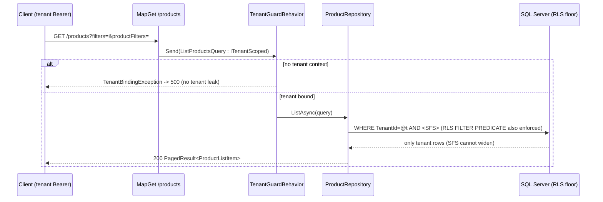

# Design: Search / Filter / Sort (SFS) + Pagination

> Status: unknown
> hazards, coercion/DoS/overflow/OpenAPI gaps resolved, see D10-D15). Full C# + SQL companion:
> `docs/reference/search-filter-sort.md` (checked against repo + EF Core 10.0.9). This file is the spec-level
> design; it cites that doc by section rather than duplicating code.

## Architecture Overview

SFS is a **cross-cutting query convention**, not a module. A JSON-DSL query string is parsed at the Hosts
layer into shared value types (`BuildingBlocks.Application`), carried through a Mediator `IQuery<>` that
extends `PagedQuery`, and applied in the module repository as narrowing `.Where`/ordering over an EF Core
`IQueryable<T>` that is already bound by the tenant RLS floor. Result is a `PagedResult<T>`.

```
HTTP query string  ?page=&limit=&filters=[...]&sort=[...]&search={...}
      | SfsQueryParser.Parse (Hosts/Api, System.Text.Json)         REQ-1, REQ-2, REQ-8.1
      v  named tuple (Page, Limit, Filters, Sort, Search)
List{X}Query : PagedQuery [, ITenantScoped]  --Mediator-->  handler   REQ-7.2, REQ-9
      v
Repository.ListAsync(query):  src = Set<T>().AsNoTracking()
      .ApplySearch(q.Search)        // whitelist + EscapeLike + EF.Functions.Like   REQ-5, REQ-6.4
      .ApplyFilters(q.Filters)      // two-gate whitelist + per-operator .Where     REQ-3, REQ-6
   total = src.LongCountAsync()     // count after filter/search, before paging      REQ-2.5
   items = src.ApplySort(q.Sort)    // whitelist + NULLS-last + default fallback     REQ-4
            .Skip((Page-1)*Limit).Take(Limit).Select(project).ToListAsync()
      v  (RLS FILTER PREDICATE at SQL Server still applies underneath)               REQ-7.1
PagedResult<T>
```

Layer placement (mirrors existing pol-core conventions — see `docs/reference/src-structure.md`):

- **BuildingBlocks.Application** — contract types (enum + records + `PagedQuery` + `PagedResult<T>`). No
  ASP.NET reference; same home as `ITenantScoped` / `TenantGuardBehavior`. (REQ-9)
- **Hosts/Api** — `SfsQueryParser` (only layer that knows `HttpContext`); per-endpoint wiring; typed-DTO
  parser (`ParseProductFilters`). (REQ-1, REQ-2, REQ-8, REQ-10)
- **{Module}.Application / .Infrastructure** — the `List{X}Query`, handler, and repository `ListAsync` with
  per-endpoint whitelists + `ApplyFilters`/`ApplySort`/`ApplySearch`/`EscapeLike`. (REQ-3..7)

## Data Models & Interfaces

### Contract types (BuildingBlocks.Application) — REQ-9
Full source: doc section 2.3. Summary:

| Type | Shape | Note |
|---|---|---|
| `enum FilterOperator` | 14 members, each `[JsonStringEnumMemberName("eq"...)]`, enum-level `[JsonConverter(JsonStringEnumConverter<>)]` | host has no global string-enum converter (REQ-9.2) |
| `enum SortDirection` | `Asc`/`Desc` with `"ASC"`/`"DESC"` member names + converter | REQ-1.4 |
| `record FilterOption` | `(string Field, FilterOperator Operator, JsonElement? Value, JsonElement[]? Values)` | value as `JsonElement` (REQ-9.3) |
| `record SortOption` | `(string Field, SortDirection Order = Asc)` | no `nullsFirst` flag (NULLS-last is invariant) |
| `record SearchOption` | `(string Query, string[]? Fields)` | |
| `abstract record PagedQuery` | `Page=1, Limit=25, Filters=[], Sort=[], Search=null` | module query inherits + adds fields |
| `record PagedResult<T>` | `(IReadOnlyList<T> Items, int Page, int Limit, long Total)` + `TotalPages` | REQ-2.4 |

### Operator -> SQL Server mapping — REQ-3.5
14 operators, value/values shape, and translated SQL: doc section 2.2 (table) + section 4.1 (per-operator C#
`.Where` reference). Text operators (`like`/`ilike`/`contains`) use `EF.Functions.Like(col, pattern, "\\")`
(3-arg escape overload, verified EF Core 10.0.9). `in`/`not_in` -> `values.Contains(col)`. `between` -> two
comparisons. Postgres-isms adapted: no `ILIKE` (CI collation), no `NULLS LAST` (emulated).

### Per-endpoint whitelists — REQ-3.1, REQ-4.1, REQ-5.1, REQ-6.1/6.2
Three immutable collections co-located with the repository:
`FrozenDictionary<string, FilterOperator[]> Filter`, `FrozenSet<string> Sort`, `FrozenSet<string> Search`.
Placement variants (inline `file static`, class-private, extracted file): doc section 8. Default = inline.

### Apply pipeline (extension methods on `IQueryable<T>`) — REQ-3..6
`ApplyFilters` (two-gate guard: `Filter.TryGetValue(field)` then `allowed.Contains(op)`, else `continue`;
`switch (field, op)` -> typed `.Where`), `ApplySort` (whitelist `Contains`; inline NULLS-last for nullable
columns; mandatory default fallback), `ApplySearch` (whitelist intersection; `EscapeLike`; OR-combined single
`Where`). Reference implementations: doc sections 4, 5, 6. Dynamic OR composition for many search fields:
doc section 6.1.

## Sequence Diagrams

### List request (control-plane, e.g. GET /admin/roles) — REQ-1..6, REQ-8
```mermaid
sequenceDiagram
    participant C as Client
    participant EP as MapGet endpoint (Hosts/Api)
    participant P as SfsQueryParser
    participant M as Mediator (ListRolesQuery)
    participant R as AdminRoleRepository
    participant DB as SQL Server (producer, pol_admin)
    C->>EP: GET /admin/roles?page=&limit=&filters=&sort=&search=
    EP->>P: Parse(Request.Query)
    alt malformed JSON
        P-->>C: throw ArgumentException -> 400 ProblemDetails
    else ok
        P-->>EP: (Page, Limit, Filters, Sort, Search)
        EP->>M: Send(ListRolesQuery { ... })
        M->>R: ListAsync(query, ct)
        R->>DB: WHERE <search OR> AND <filters> ; COUNT
        R->>DB: ORDER BY <sort, NULLS-last> OFFSET/FETCH
        DB-->>R: rows + total
        R-->>M: PagedResult<AdminRoleListItem>
        M-->>EP: result
        EP-->>C: 200 PagedResult<RoleResponse> (items mapped)
    end
```

### Tenant-scoped list (GET /products) — RLS non-widening, REQ-7, REQ-10


## Design Decisions

- **D1 — JSON-DSL over typed query params.** Keep the `filters=[{...}]`/`sort=[{...}]`/`search={...}` contract
  identical to `nong-kaewta-api` for cross-project consistency (user decision). Cost: a parse step; benefit:
  one client contract, generic operator set. (REQ-1)
- **D2 — `switch (field, operator)` over dynamic LINQ.** Type-safe, EF-translatable, no new dependency, no
  string->SQL surface. Dynamic LINQ (`System.Linq.Dynamic.Core`) is rejected as both a dependency and an
  injection surface. The hand-built `Expression` many-field search (doc 6.1) is **out of scope for v1** (D14) —
  the inline OR of doc section 6 is the v1 path (it parameterizes reliably). (REQ-6.5, REQ-11, doc 4/6)
- **D3 — Silent-drop unknown field/operator; 400 only for malformed JSON.** Protects existing clients from a
  single typo; JSON that cannot parse at all is a hard 400. Strict per-field errors are opt-in via the typed
  DTO (REQ-10). (REQ-3.3/3.4, REQ-8.1/8.4)
- **D4 — `ArgumentException` for 400, never `BadHttpRequestException`.** `ProblemDetailsExceptionHandler.Map`
  has an `ArgumentException => 400` arm but no `BadHttpRequestException` arm; the latter derives from
  `IOException` and falls to `_ => 500`. (REQ-8.1)
- **D5 — SFS composes on the RLS floor, never widens.** pol-core has no EF global query filter; isolation is
  the SQL-native 3-layer floor (`fn_tenant_predicate` + security policy, `SessionContextConnectionInterceptor`,
  `TenantGuardBehavior`). SFS is pure narrowing; tenant queries mark `ITenantScoped` + keep an explicit
  `.Where(TenantId)` as belt-and-suspenders; whitelists never expose cross-tenant fields. (REQ-7)
- **D6 — NULLS-last emulated inline per nullable field.** `OrderBy(x => x.Col == null).ThenBy(x => x.Col)`
  -> `ORDER BY CASE WHEN Col IS NULL THEN 1 ELSE 0 END, Col`. A generic helper needs a nullable-only guard;
  deferred. (REQ-4.4, doc 5)
- **D7 — Escape all LIKE input incl `like`.** `EscapeLike` (`\ % _ [`) + 3-arg `EF.Functions.Like` ESCAPE for
  filter `like`/`ilike`/`contains` and search. Closes the TS source's unescaped filter-LIKE latent bug.
  (REQ-5.4, REQ-6.4, doc 2.2/6)
- **D8 — `page`/`limit` clamped, not rejected.** `page>=1` (avoids negative OFFSET -> 500 DoS), `limit` in
  `[1..25]` (เพดาน 25 หลัง `products-sp-53-alignment` REQ-4; เดิม `[1..100]`). Count after filter/search,
  before paging. (REQ-2)
- **D9 — Contract types in BuildingBlocks.Application, parser in Hosts.** Keeps the domain-shared types free
  of ASP.NET; only Hosts touches `HttpContext`. (REQ-9.1)
- **D10 — Wrong-typed filter value is a 400, not 409/500.** Every `JsonElement.Get*()` in the apply path is
  guarded (try/catch or `TryGet*`) and re-thrown as `ArgumentException`. Unguarded, `GetInt64()` on a string
  throws `InvalidOperationException` -> 409 and `GetDateTime()` on a bad string throws `FormatException` -> 500,
  both breaking REQ-8's promise. (REQ-8.5)
- **D11 — Query-cost caps.** Reject with 400 when `filters` > 50, `sort` > 10, or any `values[]` > 200
  (defaults) — bounds expression/SQL size and stays under SQL Server's ~2100 parameter limit. (REQ-6.6)
- **D12 — Overflow-safe offset.** Compute `Skip` offset in `long` and clamp `page` to an offset ceiling so a
  huge `page` cannot overflow `int` into a negative OFFSET (500). (REQ-2.6)
- **D13 — Declare SFS params in OpenAPI.** Because the params are read from the raw query string (not typed
  minimal-API parameters) ASP.NET emits nothing for them; each SFS endpoint adds them via `.WithOpenApi(...)`
  so Scalar shows them (project standard, PR #25). (REQ-13)
- **D14 — Dynamic many-field search (doc 6.1) deferred.** Its `Expression.Constant(pattern)` may be inlined as
  a SQL literal (plan-cache pollution; term in logs), conflicting with REQ-6.3. v1 uses the inline OR
  (parameterized). If revived, it must capture via closure member-access, never `Expression.Constant`. (REQ-6.3)
- **D15 — No computed/unmapped members in server-side `Select`.** The paged repository must project only mapped
  scalars or materialize the entity first and map client-side. `AdminRole.PermissionKeys` (`[.. ...]` computed)
  and `ToListItem(role, count)` cannot run in a server `Select`; `Product.Price` (`Money.Of(...)`) likewise.
  The AdminRole exemplar materializes then maps with `ToListItem(role, userCount)`, and **preserves
  `UserCount`** (correlated count subquery or the existing separate count) — losing it is a REQ-12.1
  regression. (REQ-12.1)

## Requirement Traceability

| REQ | Section |
|---|---|
| REQ-1 | SfsQueryParser + contract enums/records (D1); doc 2 |
| REQ-2 | clamps in parser + `PagedResult<T>` + count-before-page (D8); doc 3 |
| REQ-3 | `ApplyFilters` two-gate + `switch`, `FrozenDictionary` (D2,D3); doc 4 |
| REQ-4 | `ApplySort` whitelist + NULLS-last + default (D6); doc 5 |
| REQ-5 | `ApplySearch` whitelist + `EscapeLike` (D7); doc 6 |
| REQ-6 | deny-by-default whitelist, `Frozen*`, EF param, escape (D2,D7); doc 9.1 |
| REQ-7 | `ITenantScoped` + RLS floor composition (D5); doc 9.2 |
| REQ-8 | `ArgumentException`->400, ProblemDetails (D4); doc 2.5/2.6 |
| REQ-9 | contract types in BuildingBlocks.Application (D9); doc 2.3 |
| REQ-10 | typed `{module}Filters` DTO + DataAnnotations; doc 7 |
| REQ-11 | System.Text.Json + EF Core only (D2); doc anti-dep notes |
| REQ-12 | opt-in per endpoint; `new PagedResult<Wire>(...)` mapping; Architecture.Tests; doc 12 (D15) |
| REQ-13 | `.WithOpenApi(...)` param declarations on each SFS endpoint (D13) |

## Testing Strategy

Per `TESTING_PROTOCOL.md`, two tiers (doc section 11):
- **Tier 1 (unit, hand-written fakes):** parser clamps + malformed-JSON 400; silent-drop of unknown
  field/operator; `PagedResult.TotalPages`; contract JSON round-trip (string tokens).
- **Tier 2 (Integration.Tests, live SQL Server :11434):** NULLS-last ordering; wildcard escape correctness;
  **RLS non-widening** (tenant A filter never returns tenant B rows). `EF.Functions.Like` has no in-memory
  impl -> must run on real SQL.

## Out of Scope

Keyset/seek pagination; a generic reflection/expression filter engine; the dynamic many-field `Expression`
search (doc 6.1, deferred per D14); frontend adoption; migrating every existing endpoint (v1 ships the pattern
+ two exemplars). Note: the Products exemplar replaces the existing `ProductView` read model / `GetProductsQuery`
path with `ProductListItem` (scalar-projected) — that swap is part of the exemplar task, not a silent change.
