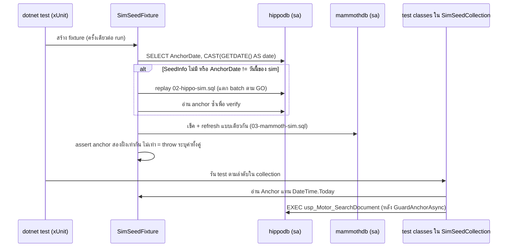

# Design: ทำให้วันที่ของ sim seed เสถียร

> Status: approved 2026-08-06

ออกแบบตาม requirements ที่ approve แล้ว: D1 = A+C (refresh อัตโนมัติ + test อ่าน anchor จาก sim),
D2 = A (UTC ทุกฝั่ง), D3 = A (xUnit fixture เป็นคน re-seed) — SP ยังใช้ `GETDATE()` จริงทุกประการ

## Architecture Overview

3 ชิ้น แก้ที่ชั้น seed กับชั้น test เท่านั้น — ไม่มี production code ถูกแตะ:

| ชิ้น | ที่อยู่ | หน้าที่ |
|---|---|---|
| anchor marker `dbo.SeedInfo` | `02-hippo-sim.sql`, `03-mammoth-sim.sql` | seed เขียนวันที่ anchor ของข้อมูลลงตารางเดียวแถวเดียว ให้ฝั่ง test อ่านได้ |
| `SimSeedFixture` | `tests/Integration.Tests/` (ไฟล์ใหม่) | collection fixture: เช็ค anchor เทียบวันนี้ของ sim เอง stale ก็ replay bootstrap script แล้ว verify; expose `Anchor` ให้ test ใช้แทน `DateTime.Today` |
| `SimSeedCollection` | `tests/Integration.Tests/` (ไฟล์ใหม่) | collection definition ผูก fixture + serialize test class ที่แตะ sim ไม่ให้อ่านคาระหว่าง re-seed |

มุม deep-module: interface ของ fixture มีแค่ `DateTime Anchor` (+ ชื่อ collection) —
การตัดสินใจทั้งหมด (เช็ค stale, replay script, substitute password, กัน midnight-crossing, verify สองฝั่งตรงกัน)
เป็น implementation ที่ caller ไม่ต้องรู้ ทุก test class ได้ leverage จาก seam เดียวนี้

### หลักการ anchor เดียว (REQ-2)

"วันนี้" ทุกฝั่งวัดจาก**นาฬิกาของ sim container เท่านั้น** — host clock/timezone ไม่อยู่ในสมการเลย:

- seed เขียน `SeedInfo.AnchorDate = CAST(GETDATE() AS date)` ก้อนเดียวกับที่ใช้ seed ข้อมูล
- fixture เทียบ `AnchorDate` กับ `CAST(GETDATE() AS date)` ใน query เดียวบน sim — ไม่มีค่า host ปน
- test อ่าน `fixture.Anchor` (ค่าที่มาจาก `SeedInfo`) แทน `DateTime.Today` ทุกจุด
- container ทั้งสองรัน `TZ=UTC` อยู่แล้ว (สภาพจริงวันนี้ + CI runner) — ประกาศหน่วยเป็น comment
  หัวไฟล์ seed ทั้งสอง (REQ-2.4)

## Sequence Diagrams

flow ของ `dotnet test` หลังแก้:



## Data Models & Interfaces

### `dbo.SeedInfo` (ทั้งสอง sim database)

```sql
CREATE TABLE dbo.SeedInfo (
    Id         int  NOT NULL PRIMARY KEY CHECK (Id = 1),  -- บังคับแถวเดียว
    AnchorDate date NOT NULL);                             -- UTC (container TZ=UTC)
```

- seed เขียนแบบ delete-then-insert ใน batch เดียวกับ `DECLARE @today` ของข้อมูล — anchor กับข้อมูลมาจากค่าเดียวกันเสมอ
- `GRANT SELECT ON dbo.SeedInfo TO hippo_app` / `mammoth_app` — guard ต่อ query ของ contract tests
  รันบน connection ของ principal นั้น (fixture เองใช้ `sa` ผ่าน `SaForCatalog` ที่มีอยู่แล้ว)
- ไม่ใช่ส่วนของ SP contract — SP ไม่อ่านตารางนี้ (`GETDATE()` เดิมทุกบรรทัด) production code ไม่รู้จักมันเลย
  วันที่ cutover ไป upstream จริงจึงไม่มีอะไรพัง (fixture เป็นของ sim suite เท่านั้น)

### `SimSeedFixture` (interface ต่อ caller)

```csharp
[CollectionDefinition(SimSeedCollection.Name)]
public sealed class SimSeedCollection : ICollectionFixture<SimSeedFixture>
{
    public const string Name = "sim-seed";
}

internal sealed class SimSeedFixture : IAsyncLifetime
{
    public DateTime Anchor { get; }               // AnchorDate ที่ verify แล้ว (Kind ไม่สำคัญ — ใช้เป็น date)
    public Task GuardAnchorAsync(SqlConnection c); // throw พร้อมค่าทั้งสองตัวเมื่อ anchor != @today ของ sim
}
```

- `InitializeAsync` ต่อ catalog: อ่าน anchor เทียบวันนี้ของ sim; stale หรือตารางยังไม่มี ก็ replay script
  แล้วอ่านซ้ำ; ยัง stale หลัง replay ครบ 2 รอบ (ข้ามเที่ยงคืนกลาง seed) = throw ระบุค่าทั้งสอง
- replay = อ่านไฟล์ bootstrap จริงจาก `docker/bootstrap/` แทนที่ `$(HIPPO_APP_PASSWORD)`/
  `$(MAMMOTH_APP_PASSWORD)` จาก env ที่ `IntegrationDb` บังคับอยู่แล้ว แตก batch ตาม `GO` —
  ทางเดียวกับที่ bootstrap container รัน ไม่มี seed implementation ที่สอง
- connection ของ replay ชี้ `Database=master` (กันเคส database ยังไม่ถูกสร้าง) — script มี `USE` ของมันเอง
- `THROW` จาก self-check ของ script โผล่เป็น `SqlException` = ทุก test ใน collection แดงพร้อมเหตุผลจริง

### การแตก batch ใช้ร่วม

`SplitBatches` + ตัวหา repo root ที่วันนี้เป็น private อยู่ใน `SeedDemoIntegrationTests` ถูก hoist เป็น
`internal static class SqlScripts` ใน `Integration.Tests` — ผู้ใช้รายที่สอง (fixture) เกิดขึ้นจริงแล้ว
`SeedDemoIntegrationTests` เปลี่ยนมาเรียกตัวกลางนี้ (พฤติกรรมเดิมทุกประการ)

### test class ที่เข้า collection

ทุก class ที่เปิด connection ไปหา sim instance ต้องเข้า `[Collection(SimSeedCollection.Name)]` —
กันอ่านคาระหว่าง `DELETE FROM dbo.Documents` ของ re-seed (xUnit default รัน class ขนานกัน,
precedent เดียวกับ `IamCatalogCollection`):

| class | ใช้ `Anchor` | หมายเหตุ |
|---|---|---|
| `SpDocumentContractTests` | ใช้ (แทน `DateTime.Today` ที่ `:465`, `:571-572`) | + เรียก `GuardAnchorAsync` ใน `SearchAsync` helper เดิม; แก้ comment `:19` ที่อ้าง "stable on any run day" |
| `SpDocumentGatewayIntegrationTests` | ไม่ใช้ (ไม่มี assertion ผูกวันที่ตรง ๆ) | พึ่ง `TotalRows` 42/40 จึงต้องการ seed สด |
| `SeedDemoIntegrationTests` | ไม่ใช้ | `LookupAsync` จริงผ่าน window ของ SP (REQ-5.2) |
| `SimCrossInstanceConsistencyTests` | ไม่ใช้ | เข้า collection เพื่อ scheduling เท่านั้น — assertion ไม่ถูกแตะ (REQ-5.5) |
| `DocumentNoCollationIntegrationTests` | ไม่ใช้ | เดียวกัน (REQ-5.5) |

## Technology Decisions

| ทางเลือกที่ใช้ | เหตุผล | ทางที่ตัดทิ้ง |
|---|---|---|
| replay ไฟล์ bootstrap เดิมทั้งไฟล์ | seed logic มีที่เดียว (locality) — self-check, grant, collation gate ติดมาด้วยครบ | เขียน re-seed เฉพาะส่วนข้อมูล = seed สองชุดที่ drift จากกันได้ |
| refresh เฉพาะเมื่อ anchor stale | CI ที่เพิ่ง bootstrap สด = ข้ามทันที ไม่ช้าลง; local จ่ายค่า re-seed ครั้งเดียวต่อวัน | re-seed ทุก run = เผาเวลาโดยไม่จำเป็น |
| marker `SeedInfo` แถวเดียว | ให้ทั้งขา C (test อ่าน anchor) และขา detect stale — จุดเดียวตอบสองโจทย์ | อนุมาน anchor จาก `MAX(StartDate)` ของข้อมูล = ผูกกับรูป seed ที่เปลี่ยนได้ และไม่แยก "ข้อมูลเก่า" ออกจาก "ข้อมูลผิด" |
| collection fixture (xUnit) | fail-safe ต่อคนรัน `dotnet test` ตรง ๆ (REQ-4.4) + มี precedent ใน repo | script wrapper = ขัด REQ-4.4 (ถูกตัดตั้งแต่ D3) |
| anchor วัดจากนาฬิกา sim ล้วน | ปิดขา timezone ของ host โดยสิ้นเชิง — ไม่มีการเทียบ host-date กับ container-date เลย | ให้ host คำนวณ "วันนี้ UTC" เอง = ยังพึ่งนาฬิกาสองเรือน |

## Error Handling Strategy

| กรณี | พฤติกรรม |
|---|---|
| `SeedInfo` ยังไม่มี (volume เก่าก่อนงานนี้) | ถือเป็น stale ก็ replay — คนอัพเดต branch ไม่ต้อง `down -v` (REQ-4.4) |
| anchor stale หลัง replay 2 รอบ | throw `InvalidOperationException` ระบุ anchor กับ `@today` ของ sim ทั้งคู่ (REQ-1.4) |
| anchor สองฝั่งไม่เท่ากันหลัง refresh | throw ระบุค่าทั้งสองฝั่ง — ไม่เลือกฝั่งใดฝั่งหนึ่งเงียบ ๆ |
| ข้ามเที่ยงคืน UTC กลาง suite (หลัง fixture ผ่านแล้ว) | `GuardAnchorAsync` ก่อน EXEC ทุกครั้งใน contract tests แดงพร้อมค่าทั้งสอง + คำแนะนำ rerun — เปลี่ยนอาการงงเป็นข้อความอ่านรู้เรื่อง (REQ-1.4); ชุดที่ไป path gateway คงเหลือ residual แคบระดับวินาที-นาที ยอมรับและบันทึกไว้ |
| self-check ใน script THROW ระหว่าง replay | `SqlException` ทะลุขึ้นมา ทุก test ใน collection แดงด้วยข้อความของ self-check เอง |
| env var password หาย | ข้อความเดิมของ `IntegrationDb.Require` ชี้ไฟล์ bootstrap + ตัวแปรที่ขาด |

## Testing Strategy

ชุด integration เดิมคือ test ของงานนี้ — คุณค่าเดิมห้ามลด (REQ-3.x, REQ-4.x ทั้งหมด ยืนยันด้วย diff
ว่า assertion ค่าเป๊ะ 42/40 และ landmark ทุกตัวไม่ถูกแตะ) เพิ่มหลักฐานเชิง mutation ตอน implement:

| หลักฐาน | วิธีรัน | พิสูจน์ REQ |
|---|---|---|
| จำลอง container เก่า | `UPDATE SeedInfo SET AnchorDate -= 1 day` + เลื่อน `StartDate`/`EndDate` ทุกแถวถอยหลัง 1 วัน แล้วรัน suite ต้องเขียว (fixture re-seed เอง) | 1.1, 1.3, 5.4 |
| mutation ครึ่งแดง | แก้ window ใน `02-hippo-sim.sql` เป็น `-5` เดือนชั่วคราว แล้วรัน ต้องมี test แดง (fixture replay ใช้ไฟล์ที่ mutate จึงถึง SP จริง) | 4.5, 3.1-3.4 |
| guard พูดได้ | `UPDATE SeedInfo SET AnchorDate -= 1 day` โดยไม่แตะข้อมูล แล้วเรียก `GuardAnchorAsync` ตรง ๆ ต้องได้ข้อความมีค่าทั้งสองตัว | 1.4 |
| timezone ของ host ไม่มีผล | รัน suite ด้วย `TZ=Asia/Bangkok dotnet test` ต้องผลเท่ารัน UTC | 1.2, 2.2, 2.3 |
| grep ยืนยันขา C | `grep -rn "DateTime.Today" tests/Integration.Tests` ต้องเหลือ 0 จุด | 2.3 |
| ผลข้างเคียงปิดครบ | `SeedDemoIntegrationTests` + `MerchantCatalogueLiveEndpointTests` + `SimCrossInstanceConsistencyTests` + `DocumentNoCollationIntegrationTests` เขียวทั้งชุด | 5.1, 5.2, 5.5 |

ไม่เรียก `spec-architect` critique — งานนี้ไม่แตะ CORE domain logic (test harness + seed SQL ล้วน)

## Requirement Traceability

| design element | REQ ที่ตอบ |
|---|---|
| fixture refresh เมื่อ anchor stale | 1.1, 1.3, 5.1, 5.4 |
| anchor วัดจากนาฬิกา sim ล้วน + test ใช้ `Anchor` | 1.2, 2.1, 2.2, 2.3 |
| comment ประกาศหน่วย UTC หัวไฟล์ seed ทั้งสอง | 2.4 |
| `GuardAnchorAsync` + throw ระบุค่าทั้งสอง | 1.4, 5.3 |
| `SeedInfo` marker (แหล่ง anchor เดียว) | 2.1, 5.3 |
| ไม่แตะ SP / assertion ค่าเป๊ะคงเดิม / ไม่มี skip | 3.1-3.5, 4.1-4.3 |
| collection fixture รันเองใน `dotnet test` | 4.4 |
| replay ไฟล์ bootstrap เดิม (self-check ติดมาครบ) | 4.5, 5.3 |
| ทุก class ที่แตะ sim เข้า collection เดียว | 5.2, 5.5 |
| อัปเดต `docs/runbooks/local-dev-run.md` (ไม่ต้อง `down -v` เพื่อแก้วันที่อีก) + แก้ comment `SpDocumentContractTests.cs:19` | 5.6, Edge case ข้อสุดท้าย |
