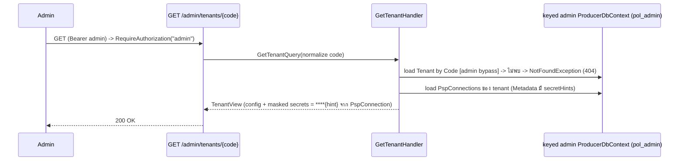

# Design: Tenant Provisioning (control-plane)
> Status: approved 2026-06-22
> Auto-approved under AFK goal (2026-06-22) หลัง spec-architect adversarial review ผ่าน; ไม่มี human gate ขณะนั้น.

อ้างอิง: requirements.md (REQ-1..REQ-11, approved 2026-06-22 amended 2026-06-22) · `docs/reference/payment-orchestration-modules.md` section 2.4 · `.ai/shared/ARCHITECTURE.md` · `.ai/shared/CODING_STANDARDS.md` · `.ai/shared/SECURITY_RULES.md`.
v2 หลัง spec-architect critique — ดูส่วน "Design Review Resolution" ท้ายไฟล์.

## Architecture Overview

โมดูลใหม่ `src/Modules/Tenant/` เป็น **provisioning/composition module** ที่อยู่ "เหนือ" 5 business module ไม่ใช่ peer ใน Mediator mesh — มัน provision โมดูลอื่น (สร้าง `PspConnection` ของ Payments) จึงอนุญาตให้ `Tenant.Application` อ้าง `Payments.Application` ได้ และ **จงใจไม่ใส่ `Tenant` ลง array `Modules[]`** ใน `tests/Architecture.Tests/ArchitectureBoundaryTests.cs` (peer-ban policed เฉพาะ module ใน array นั้น).

```
src/Modules/Tenant/
  Tenant.Domain/            -> SharedKernel เท่านั้น
    Tenant.cs               aggregate (AggregateRoot<Guid>); Create() validate+Status=Active; (no FK)
    TenantStatus.cs         enum { Active = 0 }  (REQ-1.5/F1)
    TenantCode.cs           allowlist { vprivilege, vcommerce, vsouvenir } + Normalize() + IsAllowed()
  Tenant.Application/       -> Tenant.Domain + Contracts + BuildingBlocks.Application + Payments.Application + Mediator.Abstractions
    ITenantRepository.cs            Add / GetByCodeAsync / ExistsByCodeAsync
    IProvisioningAuditWriter.cs     Append(entry)  (REQ-11)
    ProvisionTenant/{ProvisionTenantCommand,ProvisionTenantResult,ProvisionTenantHandler}.cs
    GetTenant/{GetTenantQuery,GetTenantHandler,TenantView}.cs   masked read-back
  Tenant.Infrastructure/    -> Tenant.Application + BuildingBlocks.Infrastructure + EF.SqlServer
    Persistence/{TenantConfiguration,TenantRepository}.cs
    Persistence/{ProvisioningAudit,ProvisioningAuditConfiguration,ProvisioningAuditWriter}.cs
    TenantModuleRegistration.cs
```

**Reuse:** `IUnitOfWork.ExecuteInTransactionAsync` (`EfUnitOfWork`), `IVaultSecretStore.StoreAsync` (`LocalEnvelopeVaultStore`), `PspConnection.Create` (Payments), `Iso4217`, `IClock`, `ProblemDetailsExceptionHandler`, `GoogleAuthenticationExtensions` (role `admin`), RLS predicate `producer.fn_tenant_predicate`, `CorrelationIdMiddleware`.

**แก้ของเดิม (Payments):**
- `IPspConnectionRepository.cs` เพิ่ม `void Add(PspConnection)` (+ impl = `_db.Set<PspConnection>().Add`).
- เพิ่ม port `IPspSecretEnvelopeFactory` ใน **`Payments.Application/Ports`** (Payments เป็นเจ้าของ secret shape) — impl ใน `Payments.Infrastructure/Psp`. signature ดู Ports ด้านล่าง. รับ provided secrets -> validate required (secretKey) -> serialize เป็น envelope JSON + คืน hint (last-4) ต่อ field. (เหตุผล: shape `PspSecretEnvelope` เป็น `internal` ของ Payments.Infrastructure, `Tenant.Application` แตะตรงไม่ได้ — S1/S7).
- ขยาย `OmiseSecret` ให้ถือ optional `PublicKey` / `WebhookSecret` (store-as-provided ตาม reference 2.4); `TwoCTwoPSecret` คง `MerchantId`+`SecretKey`. adapter เดิมอ่าน field เท่าที่ใช้ (เพิ่ม field = forward, ไม่ break).
- `PspConnectionConfiguration.cs`: `Metadata` `HasMaxLength(4000)` -> `nvarchar(max)` (payload Omise ยาว) — alter ใน migration.

### Admin connection (P1) — REQ-4.4 / REQ-8.5  [v2: keyed, ไม่ subclass]

provisioning ต้องรันใต้ `pol_admin` (RLS bypass) และ **ทุก write ต้องอยู่บน DbContext instance เดียว** (atomic tx ข้าม connection ไม่ได้). ใช้ **keyed registration ของ `ProducerDbContext` ตัวเดิม** (ไม่ subclass — เลี่ยงปัญหา `sealed` + design-time second-context discovery):

- ใน Api host: `AddKeyedScoped<ProducerDbContext>("admin", (sp,_) => new ProducerDbContext(adminOptions))` โดย `adminOptions = new DbContextOptionsBuilder<ProducerDbContext>().UseSqlServer(cfg.GetConnectionString("Admin")).Options` — **ไม่ใส่** `SessionContextConnectionInterceptor` (admin cross-tenant ไม่เซ็ต `SESSION_CONTEXT`; bypass มาจาก login membership). model สร้างจาก `OnModelCreating` เดิม (cache ร่วม type เดียวกัน) -> design-time migrations ยังเห็น `ProducerDbContext` ตัวเดียว.
- keyed `"admin"` ของ `IUnitOfWork` / `ITenantRepository` / `IPspConnectionRepository` / `IVaultSecretStore` / `IProvisioningAuditWriter` — factory new คลาสเดิมโดยฉีด keyed admin `ProducerDbContext` (ทุกคลาสรับ `ProducerDbContext` อยู่แล้ว).
- `ProvisionTenantHandler` + `GetTenantHandler` รับ dependency ผ่าน `[FromKeyedServices("admin")]` -> share instance เดียวใน scope -> 1 transaction จริง. (`IPspSecretEnvelopeFactory` เป็น stateless ไม่ต้อง keyed.)
- request tenant-facing เดิมใช้ `ProducerDbContext` (`pol_app`) + interceptor ไม่แตะ.
- **boot fail-fast (N3):** ถ้า connection string `Admin` ขาด -> host crash ที่ startup (มิเรอร์ vault keyring validation `Program.cs:106`).

## Sequence Diagrams

### Provision (POST /admin/tenants)

```mermaid
sequenceDiagram
    participant A as Admin (Google aud=admin)
    participant API as POST /admin/tenants
    participant H as ProvisionTenantHandler
    participant F as IPspSecretEnvelopeFactory
    participant UoW as ExecuteInTransactionAsync (pol_admin, retry-safe)
    participant DB as keyed admin ProducerDbContext
    participant V as IVaultSecretStore (admin-keyed)

    A->>API: submit config JSON (Bearer admin)
    API->>API: RequireAuthorization("admin")  (else 401/403)
    API->>H: ProvisionTenantCommand
    H->>H: normalize code; validate allowlist/psp/currency/non-empty/no-dup-psp
    H->>F: Build(psp, secrets) ต่อ connection -> envelopeJson + hints (validate secretKey required) — fail -> 400
    H->>DB: GetByCodeAsync(code) [admin ctx, เห็น cross-tenant] -> exists -> 409
    rect rgb(235,235,235)
    note over H,V: ExecuteInTransactionAsync — delegate idempotent-under-retry<br/>(สร้าง entity+DEK ในนี้; ตัวแปร result re-init ต้นทุกรอบ)
    H->>DB: Tenant.Create(Active) + Add
    loop each pspConnection
        H->>DB: PspConnection.Create(tenantId, psp, methods, secretRef, metadata+hints) + Add
        H->>V: StoreAsync(tenantId, secretRef, envelopeJson)  [SaveChanges ภายใน -> enlist tx เดียว]
    end
    H->>DB: ProvisioningAudit Append (adminSub, code, tenantId, ts, correlationId)
    H->>DB: SaveChanges  -> Commit (rollback ทุก flush ถ้าพลาด)
    end
    H->>H: build masked result จาก input (post-commit; ไม่อ่าน vault)
    H-->>API: result (TenantId, connections, masked)
    API-->>A: 201 Created + Location: /admin/tenants/{code}
```

> ไม่มี FK ระหว่าง `PspConnection`/`VaultSecret` กับ `Tenants` (ตัดสินใจ: ไม่ retro-add FK) -> incremental `SaveChanges` ที่ `StoreAsync` เรียกภายใน flush ออกได้ทุกลำดับโดยไม่ชน FK; commit/rollback คุมโดย outer transaction เดียว (B1).

### Read-back (GET /admin/tenants/{code})  [v2: อ่าน hint จาก PspConnection, ไม่อ่าน vault]



## Data Models & Interfaces

### `producer.Tenants` (central migration `AddTenantTable`)

| column | type | note |
|---|---|---|
| `Id` | uniqueidentifier PK | tenant identity (= `SESSION_CONTEXT('TenantId')` ตอน runtime) |
| `Code` | nvarchar(64) | **unique index**, normalized lowercase (REQ-1.7) |
| `DisplayName` | nvarchar(200) | |
| `LegalEntityId` | nvarchar(32) | |
| `Status` | int | `TenantStatus` (Active) |
| `Country` | nvarchar(2) | |
| `Currency` | nvarchar(3) | validate `Iso4217.IsSupported` |
| `EnabledChannels` | nvarchar(256) | csv verbatim; ว่างได้ (N6) |
| `CreatedAtUtc` | datetime2 | `IClock.UtcNow` |
| `Metadata` | nvarchar(max) | json: branding/routing/session/timezone/locale/createdByAdmin |

`PspConnection.Metadata` (existing, alter -> nvarchar(max)) เก็บ non-secret psp config + `secretHints` (map field -> last-4) สำหรับ read-back.

### `producer.ProvisioningAudits` (REQ-11) — control-plane table

`Id` (PK), `TenantId`, `TenantCode` nvarchar(64), `AdminSubject` nvarchar(128), `CorrelationId` nvarchar(64) **not null** (จาก `CorrelationIdMiddleware`; ถ้าไม่มี -> generate ใหม่ ไม่ปล่อย null, N4), `OccurredAtUtc` datetime2. ไม่มี secret (REQ-11.3).
**RLS:** ไม่อยู่ใต้ tenant predicate. คุมด้วย grant: `pol_admin` SELECT+INSERT เท่านั้น; `pol_app` ไม่มี grant -> แตะไม่ได้.

### RLS policy ของ `Tenants` (manual SQL ใน migration `AddTenantTable`)

```sql
ALTER SECURITY POLICY producer.TenantIsolationPolicy
  ADD FILTER PREDICATE producer.fn_tenant_predicate(Id) ON producer.Tenants,
  ADD BLOCK  PREDICATE producer.fn_tenant_predicate(Id) ON producer.Tenants AFTER INSERT,
  ADD BLOCK  PREDICATE producer.fn_tenant_predicate(Id) ON producer.Tenants AFTER UPDATE;
```
ใช้ `Id` (PK = tenant identity): runtime `pol_app` อ่านได้เฉพาะแถวตัวเอง (REQ-8.2/10), `pol_admin` bypass cross-tenant (REQ-8.4), forge ไม่ได้ (REQ-8.3). `AddTenantTable` **ต้องมี timestamp ใหม่กว่า `20260622022145_AddVaultRevealAudit`** (ALTER policy ที่มีอยู่ — S4).

### Grants (migration `AddTenantTable`)  [v2: pol_admin INSERT-only บน VaultSecrets]

```sql
GRANT SELECT ON producer.Tenants TO pol_app;                       -- runtime own-row read (RLS-filtered)
GRANT SELECT, INSERT, UPDATE ON producer.Tenants TO pol_admin;     -- provision + read-back
GRANT INSERT ON producer.PspConnections TO pol_admin;              -- provision (เดิมมี SELECT อยู่แล้ว -> read-back)
GRANT INSERT ON producer.VaultSecrets   TO pol_admin;              -- provision store (write-only; NO SELECT -> ไม่อ่าน ciphertext)
GRANT SELECT, INSERT ON producer.ProvisioningAudits TO pol_admin;
```
**`Down`:** revoke 5 grant ข้างบน + `ALTER SECURITY POLICY producer.TenantIsolationPolicy DROP FILTER PREDICATE ON producer.Tenants, DROP BLOCK PREDICATE ON producer.Tenants AFTER INSERT, DROP BLOCK PREDICATE ON producer.Tenants AFTER UPDATE;` (3 predicate แยก operation — S4) + drop ตาราง `Tenants`/`ProvisioningAudits` + revert `PspConnection.Metadata` length.

### Ports / signatures

```csharp
public interface ITenantRepository {
    void Add(Tenant tenant);
    Task<Tenant?> GetByCodeAsync(string normalizedCode, CancellationToken ct);
    Task<bool> ExistsByCodeAsync(string normalizedCode, CancellationToken ct);
}
public interface IProvisioningAuditWriter { void Append(ProvisioningAudit entry); }

// Payments.Application/Ports — ใหม่ (Payments เป็นเจ้าของ secret shape; S1/S7)
public interface IPspSecretEnvelopeFactory {
    // validate required keys (secretKey) -> throw ArgumentException ถ้าขาด; serialize provided secrets เป็น envelope JSON;
    // คืน hint (last-4) ต่อ field ที่ส่งมา. ไม่ log, ไม่ return plaintext.
    PspSecretEnvelopeResult Build(PspCode psp, IReadOnlyDictionary<string,string> secrets);
}
public sealed record PspSecretEnvelopeResult(string EnvelopeJson, IReadOnlyDictionary<string,string> Hints);

// Payments.Application/Ports/IPspConnectionRepository.cs — เพิ่ม
void Add(PspConnection connection);

public static Tenant Create(string code, string displayName, string legalEntityId, string country,
    string currency, IReadOnlyList<string> enabledChannels, string metadataJson, DateTime nowUtc);
```

`ProvisionTenantCommand` map 1:1 กับ payload 2.4 (camelCase). `SecretsSpec` write-only — ไม่ปรากฏใน response/log. `secretRefName = "psp/" + psp.ToCode()` (deterministic; ปลอดภัยเพราะ REQ-3.6 ห้าม psp ซ้ำ + vault PK `(TenantId,Name)`, N5).

## Technology Decisions

- **single transaction (REQ-4.1) ทับ saga (ARCHITECTURE.md:94) — ต้องมี ADR.** `LocalEnvelopeVaultStore` เขียน `VaultSecretBlob` ลง `ProducerDbContext` เดียวกัน -> DB กับ vault ไม่ใช่คนละ store ตอนนี้ -> single tx atomic. **Decision:** เขียน ADR `docs/adr/0001-tenant-provisioning-single-transaction.md`: valid เฉพาะ vault DB-backed; vault -> external KMS/HSM = trigger บังคับกลับ saga. เป็น task.
- **idempotent-under-retry (B2):** `ExecuteInTransactionAsync` ใช้ execution strategy ที่ re-run delegate ทั้งก้อนเมื่อ transient fault. ดังนั้น handler ต้อง: สร้าง entity + DEK (ผ่าน `StoreAsync`) **ภายใน delegate**, ตัวแปรเก็บ id/result **re-initialize ที่ต้น delegate ทุกรอบ** (assign ไม่ append), และ **build masked result หลัง** `ExecuteInTransactionAsync` คืน (จาก input ที่ immutable + ตัวแปร id ที่ run สำเร็จล่าสุด). dup-check `GetByCodeAsync` อยู่ **นอก** delegate ใต้ admin ctx (เห็น cross-tenant; unique index เป็น race backstop).
- **incremental SaveChanges (B1):** `StoreAsync` เรียก `SaveChanges` ภายในทุกครั้ง -> flush เป็นช่วงๆ แต่ commit/rollback คุมโดย outer transaction; ไม่มี FK จึงไม่ชนลำดับ.
- **admin context = keyed `ProducerDbContext`** (ไม่ subclass — เลี่ยง `sealed`/second-context migration; S3/S5). Worker host เป็น precedent ของ "แยก principal ด้วย connection string"; ที่นี่อยู่ host เดียวจึงใช้ keyed registration.
- **masked read-back เก็บ hint ที่ `PspConnection` (B3/F3):** provisioning คำนวณ hint (last-4) จาก input ผ่าน `IPspSecretEnvelopeFactory` แล้วเก็บใน `PspConnection.Metadata.secretHints`; read-back อ่านจาก `PspConnection` (pol_admin มี SELECT อยู่แล้ว) -> ไม่อ่าน vault, `pol_admin` ไม่ต้อง SELECT `VaultSecrets`. (เลิกใช้ `MaskedAsync`/column-grant ที่ critique พบว่า materialize ciphertext column -> 500.)
- **secret shape เป็นของ Payments (S1/S7):** `Tenant.Application` ไม่รู้ shape; เรียก `IPspSecretEnvelopeFactory`. required = `secretKey`; field อื่น store-as-provided. `OmiseSecret` ขยายถือ optional publicKey/webhookSecret.
- **TenantStatus = `{ Active }`** (REQ-1.5/F1) — YAGNI.

## Error Handling Strategy

reuse `ProblemDetailsExceptionHandler` (detail string คงที่ ไม่ leak `.Message`):

| กรณี | กลไก | HTTP |
|---|---|---|
| allowlist/psp/currency/empty/dup-psp/missing-secret(secretKey) | `ArgumentException` (validate/factory/envelope factory) | 400 |
| Code ซ้ำ (pre-check) | throw `ConflictException` ใหม่ | 409 |
| race ชน unique index | catch `DbUpdateException`(SqlException 2627/2601) -> `ConflictException` (มิเรอร์ `EfIdempotencyStore`) | 409 |
| GET ไม่พบ code | `NotFoundException` (มีอยู่) | 404 |
| ไม่มี auth / role ผิด | `RequireAuthorization("admin")` | 401 / 403 |
| อื่น | opaque (มีอยู่) | 500 |

`ConflictException` = `public sealed class ConflictException : Exception` (**ไม่** derive `InvalidOperationException`); วาง arm ใน `Map` switch **ก่อน** `InvalidOperationException` arm (กัน match ผิด — S6); detail = string คงที่. ห้าม log payload/secret (REQ-6.3); error ไม่มี secret (REQ-6.4).

## Testing Strategy

pure-logic-first (LESSONS.md). ทุก test map REQ.

- **`tests/Tenant.Tests/` (pure domain, ก่อน):** `TenantCodeTests` allowlist+normalize (1.6,1.7); `TenantCreateTests` fields/currency/Status=Active (1.1–1.5); `ProvisionTenantHandlerTests` (fakes ทุก port + fake UoW run-lambda-inline **และ run ซ้ำ** เพื่อพิสูจน์ idempotent-under-retry B2) — allowlist reject=no-write (3.1,1.6), empty/dup/missing-secretKey -> 400 (3.5,3.6,3.7), 1 PspConnection+1 StoreAsync ต่อ psp (2.2,2.3), audit appended (11.1), dup code -> 409 (5.2), result masked จาก input + hint เก็บที่ connection (6.5,2.5), retry ไม่ทำให้ result/connection ซ้ำ (B2)
- **`tests/Integration.Tests/` (real SQL, มิเรอร์ `RlsIsolationTests`):** pol_admin insert Tenant+children+audit 1 tx (8.4,8.5,4.1,11.2); pol_app เห็นเฉพาะแถวตัวเอง (8.2,10); pol_app insert Tenants id อื่นไม่ได้ (8.3); **vault StoreAsync ล้มกลางลูป (connection ที่ 2) -> rollback 0 แถวทุกตาราง** (4.2/B1); read-back masked = ****hint ไม่เคย plaintext + **ยืนยัน pol_admin ไม่ SELECT VaultSecrets** (6.2,9,B3); dup code -> 409 + ไม่มีแถวที่สอง (5.2,5.3)
- **`tests/Hosts.Tests/`:** /admin/tenants 401 anon / 403 token `tenant` / 201|200 token `admin` (7.1,7.2,7.3); GET unknown -> 404 (9.2); body มีเฉพาะ masked (6.2)
- **`tests/Architecture.Tests/`:** Tenant-specific facts (ไม่พึ่ง `Modules[]`): `Tenant.Domain` ไม่อ้าง EF; `Tenant.*` ไม่อ้าง Host; เพิ่ม `Tenant.Infrastructure` ใน `RawConnectionTests.ProductionInfrastructure[]` (ใช้ `SqlException` ไม่ใช่ `SqlConnection`); fact ว่า `ProvisionTenantHandler`/`GetTenantHandler` ctor deps (UoW/repo/vault) ผูก keyed `"admin"` (กัน non-keyed หลุด — S2)

## Requirement Traceability

| Section | REQ |
|---|---|
| `Tenants` table + columns/Metadata + unique Code | 1.1, 1.2, 1.3, 1.4 |
| `TenantStatus = { Active }` | REQ-1.5 |
| `TenantCode.IsAllowed` / `.Normalize` | 1.6, 1.7 |
| handler happy path (Tenant+PspConnection+vault+Active) | 2.1, 2.2, 2.3, 2.4 |
| 201 + Location + masked result (จาก input) | REQ-2.5 |
| create-only | REQ-2.6 |
| validate-before-write; psp/currency/empty/dup/secretKey ผ่าน envelope factory | 3.1–3.7 |
| `ExecuteInTransactionAsync` single tx + rollback + idempotent-under-retry | 4.1, 4.2, 4.3 |
| keyed admin `ProducerDbContext` share instance | REQ-4.4 |
| `GetByCodeAsync` + unique index + `ConflictException` | 5.1, 5.2, 5.3 |
| vault ciphertext (INSERT-only) + masked + no-log + no-leak | 6.1, 6.2, 6.3, 6.4 |
| hint จาก input เก็บที่ `PspConnection`; read-back จากที่นั่น | REQ-6.5 |
| `RequireAuthorization("admin")` + not `ITenantScoped` + admin no-tenant-claim invariant | 7.1, 7.2, 7.3, 7.4 |
| admin OAuth audience config (prerequisite task) | REQ-7.5 |
| RLS FILTER+BLOCK `fn_tenant_predicate(Id)` + pol_admin connection | 8.1–8.5 |
| `GetTenantHandler` masked read-back (จาก PspConnection) + 404 | 9.1, 9.2, 9.3 |
| runtime own-row read (RLS) | 10.1, 10.2 |
| `ProvisioningAudits` + `IProvisioningAuditWriter` (same tx, correlationId not-null, no secret) | 11.1, 11.2, 11.3 |

## Design Review Resolution (spec-architect, 2026-06-22)

- **B1** (StoreAsync internal SaveChanges / sequence ไม่ตรง): APPLIED — sequence v2 ระบุ flush ภายใน + ไม่มี FK + commit/rollback คุมโดย outer tx; integration test vault-fail-mid-loop (4.2).
- **B2** (execution strategy retry delegate): APPLIED — Technology Decisions "idempotent-under-retry": entity/DEK ใน delegate, result var re-init ต้น delegate, build result post-commit, dup-check นอก delegate ใต้ admin ctx; unit test run lambda ซ้ำ.
- **B3** (column-grant + `MaskedAsync` ขัดกัน -> 500): APPLIED (เปลี่ยนกลไก) — เก็บ hint ที่ `PspConnection.Metadata`, read-back ไม่อ่าน vault, `pol_admin` INSERT-only บน VaultSecrets. amend REQ-6.5.
- **B4 / N7** (`RawConnectionTests` hardcoded + exempt จาก `Modules[]` = หลุดทุกกฎ): APPLIED — เพิ่ม Tenant-specific architecture facts + ใส่ `Tenant.Infrastructure` ใน array; ใช้ `SqlException` (allowed) ไม่ใช่ `SqlConnection`.
- **S1/S7** (secret shape internal + ขัด REQ-3.7): APPLIED — `IPspSecretEnvelopeFactory` ใน Payments.Application เป็นเจ้าของ shape+validate+hint; amend REQ-3.7 (secretKey required + store-extras); ขยาย `OmiseSecret` optional publicKey/webhookSecret. **Scope touch-point: แตะ Payments.Infrastructure (envelope shape) — flag ให้ user.**
- **S2** (admin JWT tenant_id claim / non-keyed leak): APPLIED — admin context ไม่ผูก interceptor; invariant: admin OAuth client ไม่ออก `tenant_id` claim (REQ-7.5/7.4); architecture test ว่า handler deps keyed.
- **S3/S5** (subclass `sealed` + migration discovery; keyed ง่ายกว่า): APPLIED — เลิก subclass, ใช้ keyed `ProducerDbContext` ตัวเดิม; ไม่แตะ `sealed`, design-time เห็น context เดียว.
- **S4** (migration ordering + Down DROP syntax): APPLIED — `AddTenantTable` timestamp ใหม่กว่า `AddVaultRevealAudit`; Down DROP 1 FILTER + 2 BLOCK แยก operation.
- **S6** (`ConflictException` base/arm order): APPLIED — `: Exception`, วางก่อน `InvalidOperationException` arm.
- **N1** atomicity note: APPLIED (B1). **N2** Metadata size: NOTED — admin endpoint trusted; ไม่ cap body ใน slice นี้ (low risk). **N3** admin conn fail-fast: APPLIED. **N4** correlationId not-null+fallback: APPLIED. **N5** secretRefName safe: NOTED. **N6** EnabledChannels ว่างได้: NOTED (ต่างจาก pspConnections[] ที่ห้ามว่าง).

## Operational Prerequisites (REQ-7.5)

ก่อนใช้งานจริง (และก่อน admin endpoint จะทำงาน) ต้องจัดเตรียม 4 อย่าง — ทั้งหมด fail ชัด (boot fail-fast
หรือ 401/403) ไม่ fail เงียบ:

1. **pol_admin login + grants** — สร้างโดย `docker/bootstrap/01-principals.sql` (รับ `POL_ADMIN_PASSWORD`)
   แล้ว migration `AddTenantTable` GRANT สิทธิ์ provisioning (Tenants RW, PspConnections/VaultSecrets INSERT,
   ProvisioningAudits SELECT/INSERT). prod: รัน service `migrate` ก่อน hosts.
2. **`ConnectionStrings:Admin` (pol_admin)** — dev: `appsettings.Development.json`; prod: `docker/entrypoint.sh`
   ประกอบจาก `ADMIN_DB_PASSWORD_FILE` (= secret `pol_admin_password`) ใน `docker-compose.prod.yml` api service.
   ถ้าไม่ตั้ง -> API throw ตอน boot (ทั้งระบบ provisioning พึ่งมัน).
3. **Admin OAuth client / `Google:Audiences:admin`** — client id ของ admin SPA = audience ที่ map เป็น role
   `admin`; non-Development จะ throw ถ้า unset/placeholder. dev/prod ตั้งผ่าน `.env.example` /
   `.env.prod.example` (`ADMIN_GOOGLE_CLIENT_ID`). **invariant (S2): admin OAuth client ต้องไม่ออก `tenant_id`
   claim** — admin path เป็น cross-tenant ใต้ pol_admin (ไม่มี single tenant binding).
4. **AddTenantTable migration applied** — Tenants/ProvisioningAudits tables + RLS predicate (FILTER+BLOCK บน
   `fn_tenant_predicate(Id)`) + grants. ไม่มี = endpoint 500 (table หาย) หรือ RLS หลุด.
