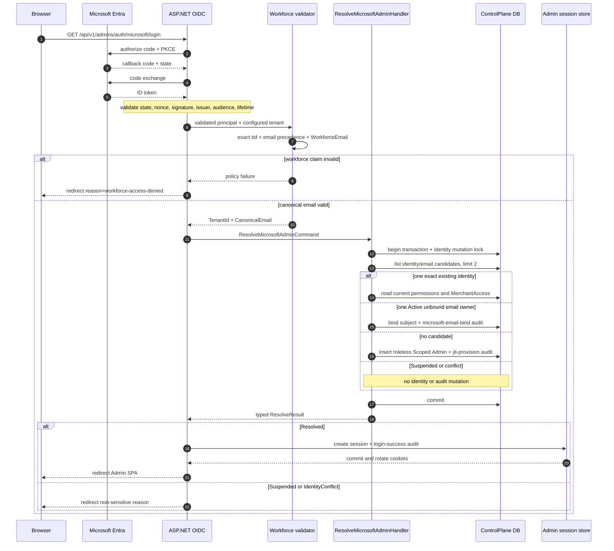
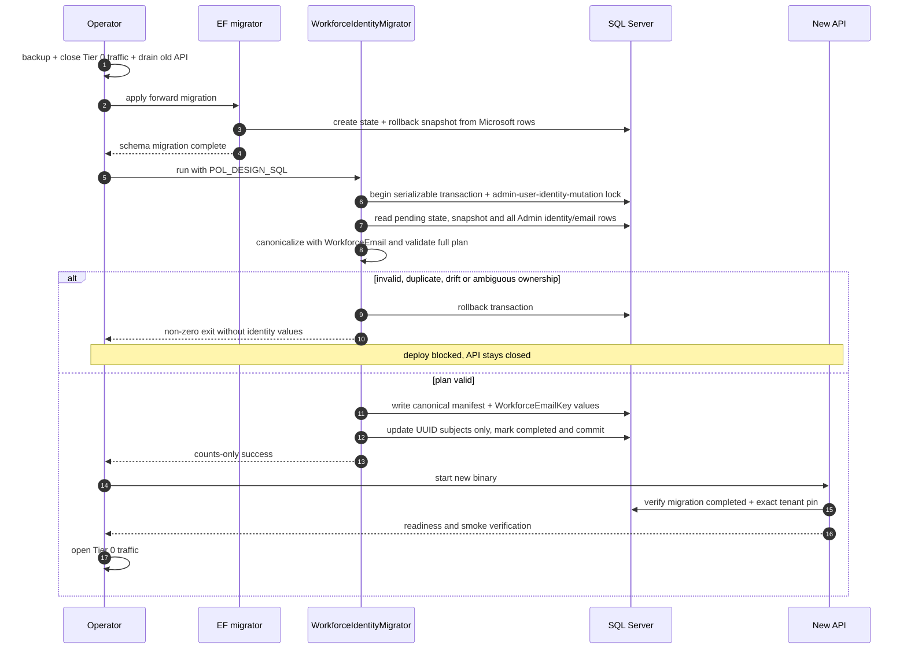

# Design: Tier 0 : Microsoft Azure ID (สำหรับพนักงาน)

> Status: approved 2026-08-23

เปลี่ยน Admin Microsoft workforce identity จาก Entra `oid` เป็น canonical corporate email
และเลิกใช้ App Role gate โดยคง OIDC middleware, Admin authorization, session, CSRF และ audit controls เดิม

## Architecture Overview

### Boundary และ component

| Component | Responsibility | Change |
|---|---|---|
| ASP.NET Core OIDC handler | Authorization Code, PKCE, state, nonce, code exchange, signature, issuer, audience และ lifetime | คงเดิม |
| `MicrosoftWorkforceClaimsValidator` | ตรวจ exact `tid`, เลือก email claim และคืน typed canonical email | ลบการอ่าน `oid`, `roles` และ literal `vcp.employee` |
| `WorkforceEmail` | pure canonicalizer สำหรับ claim, stored Admin email และ migration | เพิ่มใน Admin domain; ใช้ `System.Net.Mail.MailAddress` |
| `MicrosoftWorkforceClaims` | ถือ `TenantId` และ `CanonicalEmail`; สร้าง identity `(microsoft, canonicalEmail)` | แทน `ObjectId` และ selected raw identifier |
| `CallbackResolver` | ส่ง Microsoft callback เข้า command เดียวที่ resolve, bind หรือ JIT | Microsoft ไม่ผ่าน generic `ResolveQuery` ก่อน เพื่อไม่ข้าม divergence check |
| `ResolveMicrosoftAdminHandler` | serialize, ตรวจ candidate ทั้ง identity/email, bind หรือ JIT และ resolve authorization | แทน handler ที่ทำ JIT-only |
| `User.WorkforceEmailKey` | persisted canonical corporate email สำหรับ exact lookup | nullable, max 254, unique filtered index; stored `Email` ไม่เปลี่ยน |
| `IUserRepository` | คืน candidate สูงสุด 2 แถวจาก canonical identity หรือ `WorkforceEmailKey` | เพิ่ม query เฉพาะ Tier 0; reuse mutation lock เดิม |
| `Audit` | บันทึก `microsoft-email-bind` หรือ `jit-provision` ด้วย internal Admin ID | ไม่เก็บ email, `oid` หรือ token |
| `WorkforceIdentityMigrator` tool | snapshot-aware preflight และ atomic oid-to-email conversion | operator-only console; รันหลัง EF migration ก่อน API |
| `WorkforceTenantBindingStore` | ตรวจ completed state และ identity/key invariants ก่อนเปิด Tier 0 แล้วคง tenant pin เดิม | เพิ่ม read-only startup gate |

ไม่มี Microsoft Graph call, runtime dual lookup ด้วย `oid`, App Role mapping, dependency ใหม่ หรือ UI change

### Runtime callback flow

1. OIDC middleware ตรวจ protocol และ token controls เดิมทั้งหมด
2. `OnTokenValidated` ตรวจ workforce `tid` และ canonical email ก่อน lookup ใด
3. typed claim result ใช้ canonical email เดียวเป็นทั้ง Microsoft subject และ JIT email
4. application canonicalize command ซ้ำและใช้ output ค่าเดียว; ไม่มี second email input ที่อาจต่างจาก subject
5. `CallbackResolver` ส่ง Microsoft identity เข้า `ResolveMicrosoftAdminCommand` โดยตรง
6. handler เปิด Admin transaction, acquire `admin-user-identity-mutation` lock และอ่าน candidate set
7. handler เลือก resolve, bind, JIT, suspended หรือ conflict ตามตาราง decision
8. binding/JIT กับ identity audit commit ใน transaction เดียว
9. เฉพาะ `Resolved` จึงสร้าง session และ login-success audit ตาม flow เดิม

### Candidate decision

`ListTier0CandidatesAsync(canonicalEmail)` คืน Admin สูงสุด 2 แถวที่เข้าอย่างน้อยหนึ่งเงื่อนไข:

- `(Provider = microsoft, Subject = canonicalEmail)` ภายใต้ case-insensitive DB collation
- `WorkforceEmailKey = canonicalEmail` ภายใต้ case-insensitive DB collation

`WorkforceEmailKey` ถูกสร้างด้วย `WorkforceEmail` เท่านั้น จึงไม่มี SQL trim/lower prefilter ที่อาจพลาด
.NET whitespace semantics. Handler canonicalize stored `Email` ซ้ำก่อนยืนยัน ownership; ถ้า persisted key,
stored email และ canonical claim ไม่ตรงกันให้ fail closed

| Candidate state | Outcome | Mutation |
|---|---|---|
| 0 แถว | JIT-create Active Scoped Admin | subject/email = canonical email; no role; no MerchantAccess; `jit-provision` audit |
| 1 แถว และ exact Microsoft identity ตรง | resolve Admin เดิม | ไม่มี identity mutation หรือ binding audit |
| 1 แถว, canonical stored email ตรง, Active, Subject `NULL` | bind Admin เดิม | stored Provider เป็น placeholder; `BindSubject(microsoft, canonicalEmail)` + `microsoft-email-bind` audit |
| 1 แถว และ Suspended | `Suspended` | ไม่มี bind, JIT, audit mutation หรือ session |
| 1 แถว, Subject ไม่เป็น `NULL`, แต่ bound provider/subject อื่น | `IdentityConflict` | ไม่มี overwrite หรือ session |
| 2 แถว | `IdentityConflict` | fail closed แม้แต่ละแถว match คนละเงื่อนไข |
| DB match แต่ C# canonical comparison ไม่ตรง | `IdentityConflict` | fail closed |

`IdentityConflict` ไม่ส่ง email หรือ record detail ไป browser. หลัง unique-constraint race,
`IAdminIdentityRecoveryReader` ใช้ fresh context และ candidate rule เดียวกัน; resolve ได้เฉพาะเมื่อเหลือ
Admin เดียวที่ exact canonical Microsoft identity ตรง มิฉะนั้นคืน conflict. นิยาม bound ใช้
`Subject IS NOT NULL`; `Provider=google, Subject=NULL` จาก `User.CreateScoped` ยังเป็น unbound placeholder

## Sequence Diagrams

### Tier 0 callback: resolve, bind หรือ JIT



### Offline subject migration และ cutover



## Data Models & Interfaces

### Canonical email

`Admins.Domain.Users.WorkforceEmail.TryCanonicalize(string?, out string canonical)` เป็น single source
สำหรับ runtime และ migration:

1. trim whitespace หน้า/ท้าย
2. reject empty หรือยาวเกิน 254 ตัวอักษร
3. reject non-ASCII และ whitespace ภายใน
4. เรียก `MailAddress.TryCreate`
5. require `parsed.Address` เท่าค่า trimmed แบบ ordinal เพื่อ reject display name หรือ parser rewrite
6. require `parsed.Host` เท่ากับ `viriyah.co.th` แบบ ordinal-ignore-case
7. invariant-lowercase ทั้ง address แล้วคืน canonical value

claim selection อยู่ host layer: exact one `email` ชนะเสมอ; fallback ไป exact one
`preferred_username` เฉพาะเมื่อไม่มี `email`. Invalid authoritative `email` ไม่ fallback

### Runtime types

```text
MicrosoftWorkforceClaims(TenantId, CanonicalEmail)
  Identity = ProviderIdentity("microsoft", CanonicalEmail)

ResolveMicrosoftAdminCommand(CanonicalEmail, CorrelationId)

IUserRepository.ListTier0CandidatesAsync(CanonicalEmail, CancellationToken)
  -> IReadOnlyList<User> with Count in 0..2

IAdminIdentityRecoveryReader.ResolveAfterConflictAsync(
  ProviderIdentity canonicalIdentity, CancellationToken)
  -> ResolveResult
```

`User.JitProvisionMicrosoft` รับ canonical email ค่าเดียวและใช้ค่านั้นกับ `Subject` และ `Email`
เพื่อตัด state ที่สองค่าต่างกัน. `User` constructor ตั้ง nullable `WorkforceEmailKey` ผ่าน canonicalizer
เดียวกันสำหรับทุก create path. `User.BindSubject` เดิมถูก reuse สำหรับ existing Admin; row ที่
`Subject=NULL` ยัง unbound และ method เปลี่ยน default Provider placeholder ได้

เพิ่ม `AuditAction.MicrosoftEmailBind = "microsoft-email-bind"`. Binding audit ใช้ target Admin ID
เป็นทั้ง actor และ target; audit หนึ่งแถวเกิดเฉพาะ transition `Subject NULL -> canonicalEmail`

### Database schema

`admin.Users` เพิ่ม derived lookup column หนึ่งตัว:

- `Subject nvarchar(256)` รองรับ canonical email สูงสุด 254
- `WorkforceEmailKey nvarchar(254) NULL` เก็บ output จาก `WorkforceEmail` หรือ `NULL` เมื่อ stored email
  ไม่ใช่ valid corporate email
- unique index `(Provider, Subject)` เดิมทำงานใต้ required `Thai_100_CI_AS` จึง case-insensitive
- filtered unique indexใหม่บน `WorkforceEmailKey` ทำให้ trim/case/Unicode-whitespace variants
  ของ corporate email มี owner ได้ไม่เกินหนึ่ง Admin
- stored `Email`, `Tier`, `Status`, `AuthorizationVersion`, `Version` และ profile columns ไม่ถูก migration แก้
- RoleAssignments และ MerchantAccess ไม่ถูกแตะ

forward EF migration เพิ่ม migration-only tables ซึ่งไม่เข้า runtime entity model:

| Table | Columns | Purpose |
|---|---|---|
| `admin.WorkforceIdentityMigrations` | `Id=1`, `CompletedAt NULL`, `SnapshotCount`, `ConvertedCount`, `NoOpCount` | fail-closed deployment state; ทุก DB ต้องผ่าน tool แม้ไม่มี Microsoft row |
| `admin.WorkforceIdentitySubjectRollback` | `AdminUserId PK/FK`, `LegacySubject NULL`, `CanonicalSubject NULL`, `ConversionKind NULL` | snapshot legacy subject; tool เติม expected canonical result/state ก่อน update |

rollback table ไม่ grant ให้ `pol_app`; tool ใช้ privileged `POL_DESIGN_SQL` เท่านั้น. API runtime ได้
`SELECT` เฉพาะ migration-state table เพื่อ startup gate

### Migration plan validation

`src/Tools/WorkforceIdentityMigrator` เป็น console projectเล็ก มี entry point เดียวและอ่าน connection string
จาก `POL_DESIGN_SQL`; ห้ามรับหรือพิมพ์ connection string ผ่าน argument/log

ภายใต้ serializable transaction และ applock เดิม tool SHALL:

1. acquire lock และ load state ทุกครั้ง; completed state ไม่ bypass invariant verification
2. เมื่อ pending, require current Microsoft Admin ID set เท่ากับ rollback snapshot set
3. เมื่อ pending, require current subject เท่ากับ snapshotted legacy subject แบบ binary
4. canonicalize stored email ของ Admin ทุกแถวด้วย `WorkforceEmail` และ derive expected `WorkforceEmailKey`
5. รับ pending Microsoft subject เฉพาะ non-empty UUID แบบ `D` หรือ exact canonical candidate
6. treat exact canonical candidate เป็น no-op
7. reject duplicate canonical corporate email ใน Admin ทุกแถว, duplicate Microsoft candidate,
   candidate ชน Microsoft canonical subject หรือ canonical email owner อื่น
8. validate ทุกแถวก่อนส่ง write แรก
9. เขียน `CanonicalSubject` + `ConversionKind` ลง manifest และ populate `WorkforceEmailKey` ทุก Admin
10. update เฉพาะ UUID subject ด้วย parameterized command และ exactly-one-row assertion
11. mark counts + completed state ใน transaction เดียวแล้ว commit
12. เมื่อ state complete, verify read-only ว่า `WorkforceEmailKey` ทุกแถวตรง canonicalizer และ Microsoft
    subject ทุกแถวเป็น exact canonical email ที่ตรง key; UUID, unknown subject หรือ key drift ทำให้ non-zero exit

tool ไม่ update Admin email, ID, Status, Tier, authorization/resource versions, role, permission หรือ
MerchantAccess. Error และ success output มีเฉพาะ category/count; ไม่มี email หรือ legacy subject.
API ไม่ reference tool project; migrate image เป็น caller เดียวใน production. Startup storeตรวจ completed state
และ invariant ชุดเดียวแบบ read-only จึงไม่เปิด API หาก old binary/restore/operator drift ใส่ UUID หรือ bad key

### Retired oid pre-provision surface

ลบ route mapping `PUT /api/v1/admins/{id:guid}/microsoft-identity`, request DTO, handler,
special audit writer และ DI wiring. ไม่มี replacement endpointหรือ tombstone handler; unmatched route ผ่าน
status-code middleware เดิมและตอบ normal RFC7807 `404` โดยไม่มี identity mutation

## Technology Decisions

### D1: Shared domain canonicalizer, not duplicate host/migration parsers

ใช้ `System.Net.Mail.MailAddress` ที่มีใน BCL แล้ว. Host, application comparison และ migration reuse
`WorkforceEmail`; persisted `WorkforceEmailKey` เก็บ output นี้เพื่อให้ DB lookup ไม่มี parser/trim ชุดที่สอง.
ไม่มี regex email parser หรือ package ใหม่

### D2: One Microsoft resolution command owns every candidate branch

Microsoft callback ไม่เรียก generic identity resolution ก่อน command. ถ้า resolve identity ก่อนแล้ว return
ทันที ระบบจะมองไม่เห็น email owner ที่ชี้อีก Admin และละเมิด divergence fail-closed rule

### D3: Existing global identity lock stays the serialization boundary

binding, JIT, invite/create และ migration ใช้ resource `admin-user-identity-mutation` เดิม. ไม่เพิ่ม lock
per-email หรือ distributed coordinator เพราะ Admin onboarding throughput ต่ำและ global lock ปิด race ครบกว่า

### D4: Data conversion runs in migrate container, not API request/runtime write floor

SQL migration สร้าง rollback snapshot; .NET console ทำ semantic preflight ด้วย canonicalizer เดียวกับ runtime.
`docker/migrate-entrypoint.sh` เรียก tool หลัง `dotnet ef database update`; non-zero exit บล็อก API ผ่าน
`service_completed_successfully`. วิธีนี้ไม่เพิ่ม raw SQL bypass หรือ User-update capability ให้ runtime
`ControlPlaneDbContext`. Tool อยู่ project แยก, ไม่ถูก reference หรือ publish เข้า API image และใช้
`Microsoft.Data.SqlClient` version ที่ repo pin อยู่แล้ว

### D5: Persisted canonical key closes SQL/.NET normalization gaps

Microsoft subjectยังใช้ composite unique indexเดิม. Stored Admin email matching ใช้ nullable
`WorkforceEmailKey` + filtered unique indexใหม่ แทน SQL `TRIM/LOWER`; key ถูกสร้างด้วย BCL canonicalizer
เดียวกับ claim จึงครอบคลุม space, tab และ Unicode whitespace แบบเดียวกันโดยไม่โหลด Admin table ทุก callback

### D6: Delete obsolete pre-provision path

ลบ code แทนเก็บ disabled branch. Normal 404 จาก unmatched routeตรง requirement และลด oid-bearing surface

### D7: Sensitive exceptions never reach logs or console

Tier 0 resolution และ migration log เฉพาะ fixed category, correlation ID และ exception type allowlist;
ห้ามส่ง exception object/message/inner exception เข้า logger เพราะ SQL unique errors อาจ echo key value.
Console entry point catch ทุก exception, พิมพ์ fixed failure category และคืน non-zero. Framework OIDC
คง IdentityModel PII logging disabled

## Error Handling Strategy

| Failure | Typed/internal outcome | Browser/operation result | Mutation |
|---|---|---|---|
| invalid issuer | OIDC policy failure classifier | `workforce-access-denied` | denied-auth audit only |
| wrong/missing/duplicate `tid` หรือ unusable email | workforce policy failure | `workforce-access-denied` | denied-auth audit only |
| signature, audience, lifetime, state, nonce, code exchange | framework remote failure | `auth-failed` | denied-auth audit only |
| Suspended identity/email owner | `ResolveOutcome.Suspended` | `suspended` | none |
| ambiguous/divergent/bound-other identity | `ResolveOutcome.IdentityConflict` | `identity-conflict` | none |
| unique race resolves exact winner | `Resolved` | normal session | loser writes no extra audit |
| unique race cannot resolve exact winner | `IdentityConflict` | `identity-conflict` | no session |
| migration invalid/duplicate/drift | migration exception with generic category | tool exit non-zero; deploy blocked | whole conversion transaction rolled back |
| migration state missing/pending หรือ completed data invariant drift | startup failure | API not ready | none |
| retired endpoint | unmatched route | normal RFC7807 `404` | none |

`LoginService` คง fresh-scope denied-auth audit, session-write rollback, cookie rotation และ safe redirect เดิม.
Tier 0 catch pathsไม่ส่ง exception object/message เข้า logger; ใช้ fixed category + correlation ID เท่านั้น.
Application log ห้ามมี canonical email, raw `oid`, authorization code, token, cookie หรือ session token

## Rollout and Rollback

### Production cutover

1. ผ่าน staging พร้อม migration compatibility tests และ Tier 0 smoke
2. สร้าง verified backup และบันทึก artifact/checksum ตาม release evidence
3. เปิด maintenance window: ปิด Tier 0 traffic และ drain old API ทุก instance
4. รัน new migrate container: EF snapshot แล้ว .NET migration tool
5. require tool success, completed state, manifest counts, canonical-key invariant และ no-partial verification
6. startเฉพาะ new API binary, ตรวจ readiness และ approved synthetic Tier 0 smoke
7. เปิด traffic และบันทึก cutover evidence

ห้าม old oid binary กับ new canonical-email binary รับ Tier 0 trafficพร้อมกัน

### Rollback boundary

- ก่อนเปิด traffic: หยุด rollout, restore verified pre-migration backupซึ่งคืน oid subjects, deploy prior
  application version แล้ว verify auth/readiness. Migration `Down` มี guarded restore จาก rollback snapshot
  สำหรับ non-production proof; production policyยังใช้ backup restore
- `Down` guard abort ก่อน DDL หาก Microsoft row set drift, completed manifest ขาด expected
  `CanonicalSubject`/`ConversionKind` หรือ current subject ไม่เท่ากับ manifest state แบบ binary
- หลังเปิด traffic: ห้าม deploy oid-only binaryหรือ restore oid subjects; ใช้ forward recovery เพราะ new JIT
  identities และ authorization/audit state อาจเกิดแล้ว

### Residual identity risk

Corporate email mutable และ reusable จึงยืนยัน person continuity ได้น้อยกว่า `oid`:

- rename: canonical emailใหม่ที่ไม่ match สร้าง roleless Scoped JIT account; ไม่มี authorization transfer
- reuse: emailเก่าอาจ resolve Admin เดิม; lifecycle owner ต้อง suspend prior owner ก่อนองค์กร reuse email

exact tenant/domain, no implicit role, conflict checks, audit และ suspended rejection ลดผลกระทบแต่ไม่ลบ risk นี้

## Testing Strategy

### Pure/domain tests

- `WorkforceEmail`: trim/case, exact domain, subdomain, malformed, display name, internal whitespace,
  non-ASCII, 254/255 boundary และ parser exact-address behavior
- `User`: canonical `WorkforceEmailKey` on every create path; non-corporate emailได้ `NULL` key
- `User.JitProvisionMicrosoft`: subject=email=key canonical, Active, Scoped; no implicit role/access aggregate
- binding audit actionและ actor/target internal ID

### Host/OIDC tests

- exact tenant pass; wrong/missing/duplicate tenant fail `workforce-access-denied`
- `email` precedence; preferred fallback only when email absent; duplicate/malformed/wrong-domain fail
- missing roles, empty roles และ unrelated roles ทุกแบบผ่าน; `oid` missing/malformed/duplicate ถูก ignore
- OIDC callback resolves canonical email while framework tests retain code, PKCE, state, nonce, signature,
  issuer, audience และ lifetime coverage
- invalid issuer maps `workforce-access-denied`; other protocol failures map `auth-failed`
- static production-source scan rejects Tier 0 `vcp.employee`, `roles`/`oid` branch และ old route mapping

### Application/persistence tests

- existing exact identity preserves Tier, roles, permissions และ MerchantAccess
- Active unbound canonical email binds same Admin, changes no stored email, emits one bind audit รวมกรณี
  `Provider=google, Subject=NULL`
- Suspended email/identity owner denies without bindหรือ session
- bound-other, two candidate rows และ identity/email divergence return conflict
- unknown email creates one Active Scoped roleless Admin with no MerchantAccess
- concurrent bind/JIT writes at most one Admin and transition audit; recovery returns exact winner only
- real SQL proves persisted key resolves leading/trailing space, tab และ Unicode whitespace ตาม .NET `Trim`,
  enforces one canonical owner และไม่ยอม Unicode/width collation fold เป็น false match

### Migration tests against real SQL Server

- valid unique UUID rows convert; IDs/status/tier/versions/role assignments/MerchantAccess remain unchanged
- canonical-email row matching derived candidate is no-op
- invalid/missing/wrong-domain email aborts with every subject unchanged
- duplicate canonical email, canonical-subject collision, ambiguous Admin owner และ unknown subject abort atomically
- completed rerun is idempotentแต่ยัง revalidate; inject UUID, unknown subject หรือ bad key หลัง complete
  ทำให้ tool และ API startup gate fail
- Up -> tool -> guarded Down restores legacy subjects in non-production
- migration command failure returns non-zero so `migrate` service cannot satisfy API dependency

### Privacy canary tests

- capture application logger/console output สำหรับ identity conflict, unique race, OIDC remote failure,
  resolution exception และ migration abort
- seed distinct canaries สำหรับ canonical email, raw oid, authorization code, ID token, access token,
  cookie และ session token
- assert canaryทุกค่าหายจาก log, exception rendering, audit rows, browser reason และ tool output;
  fixed category/correlation metadataยังอยู่เพื่อ operational diagnosis

### Regression and gates

- Merchant Google/Microsoft auth, Admin Google retirement, `/api/v1/admins/me`, RBAC และ MerchantAccess tests stay green
- retired route test asserts normal `404` and no mutation
- architecture testยืนยัน API projectไม่ reference/publish migration tool และ raw transaction siteอยู่เฉพาะ tool
- update current docs/config tests; historical approved specs stay unchanged
- run `dotnet build pol-core.slnx --no-restore -warnaserror`
- run `dotnet test pol-core.slnx --no-build --filter "Category!=Integration"`
- run `dotnet test pol-core.slnx --filter "Category=Integration"`
- run shell guard suite, full-tree secret scan และ `scripts/spec-trace.sh tier-0-microsoft-canonical-email`
- repositoryไม่มี lint command; report `lint: not wired` แทน claim ว่าผ่าน
- infrastructure failureก่อน assertionนับเป็น failed/blocked ไม่ใช่ pass

## Requirement Traceability

| Requirement | Design element | Verification |
|---|---|---|
| REQ-1.1-1.14 | framework OIDC boundary, typed post-validation gate, failure classifier | OIDC callback/framework tests + current docs |
| REQ-2.1-2.17, 2.26-2.34 | `WorkforceEmail`, claim precedence, exact tenant/domain, pre-lookup gate | pure validator + host denial tests |
| REQ-2.18-2.25, 2.28 | role/oid-free claims recordและ production path; no Graph | missing/empty/unrelated role tests + static scans |
| REQ-3.1-3.13 | canonical identity key, existing CI unique index, candidate resolution | application + real-SQL identity tests |
| REQ-4.1-4.25 | one Microsoft command, Subject-based bound definition, existing bind, least-privilege JIT, atomic audit | handler/domain tests + authorization-preservation integration |
| REQ-5.1-5.12 | global lock, limit-2 candidate set, fresh-context recovery | concurrency and divergence tests |
| REQ-6.1-6.18, 6.20-6.28 | EF snapshot, .NET migration tool, completed-state gate, guarded rollback | real-SQL migration compatibility suite + script test |
| REQ-6.19 | route deletion | host 404/no-mutation test |
| REQ-7.1-7.9 | no Entra role mapping; existing authorization/session/CSRF paths | regression suite |
| REQ-7.10-7.21 | internal-ID audits, privacy rules, exact binding transition | audit tests + capturing logger/console canaries |
| REQ-8.1-8.8 | Admin-only scope, existing primitives, no new package | regression/build/dependency diff review |
| REQ-9.1-9.10, 9.28 | current docs, maintenance, backup, rollback, rename/reuse risk | documentation review |
| REQ-9.11-9.25 | named Tier 0 unit, callback, concurrency และ DB migration tests | test inventory + spec trace |
| REQ-9.26-9.27 | actual CI-aligned build/test/guard commands and honest infra result | Evidence blocks + CI |

## Spec-architect Critique Resolution

| Finding | Decision | Resolution |
|---|---|---|
| Bound Provider ambiguity | accepted | amend REQ-4.7 และเพิ่ม REQ-4.24-4.25: bound iff `Subject IS NOT NULL`; default Provider บน null-subject row เป็น placeholder |
| SQL trim false-negative | accepted | เพิ่ม `WorkforceEmailKey` ที่ populate ด้วย BCL canonicalizer + filtered unique index; runtime queryไม่ parse email ใน SQL |
| Rollback ไม่มี expected canonical value | accepted | manifest เพิ่ม `CanonicalSubject` และ `ConversionKind`; tool เขียนพร้อม conversion, guarded Downใช้ binary equality |
| Completed marker trust drift | accepted | tool rerunและ API startup revalidate subject/key invariants แม้ state complete |
| Privacy proof อ่อน | accepted | sanitize catch logging/console และเพิ่ม canary capture tests ครบ email, oid, code, tokens และ cookies |
