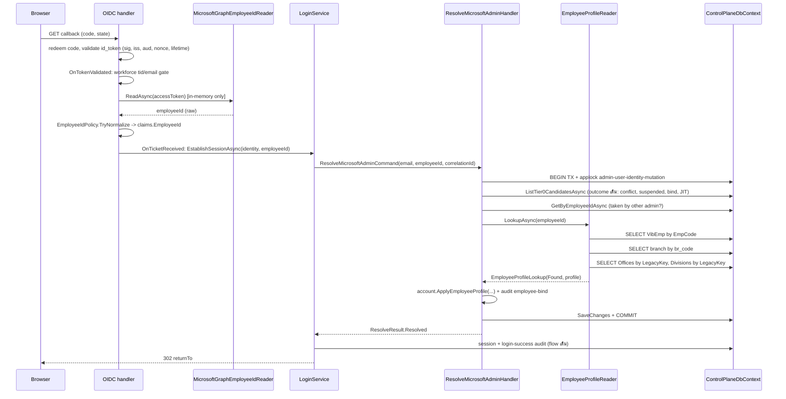
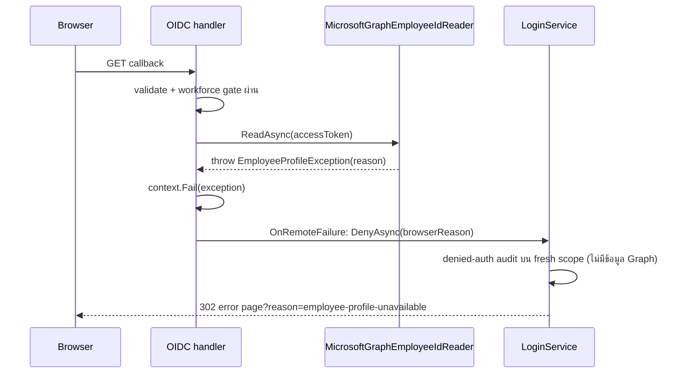
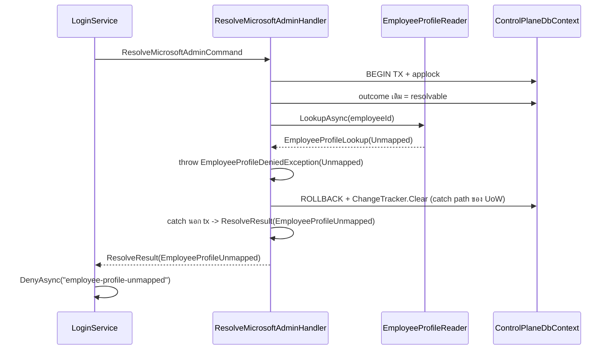

# Design: Tier 0 Graph Employee Profile

> Status: approved 2026-08-30

เอกสารนี้อธิบายวิธี implement `requirements.md` (approved 2026-08-30) ของฟีเจอร์ Tier 0 Graph Employee
Profile บนโค้ดปัจจุบัน: เพิ่ม Graph call ใน OIDC event, เพิ่ม HR lookup port ใน admin resolution transaction
เดิม และเพิ่มคอลัมน์ profile ใน `admin.Users` โดยไม่เปลี่ยน identity key และคง flow เดิมเมื่อ switch ปิด

## Architecture Overview

หลักการ: แทรก 2 จุดใน pipeline เดิม ไม่สร้าง flow ใหม่

| ชั้น | Component | หน้าที่ | ไฟล์ |
|---|---|---|---|
| Host | `OidcAuthentication` | เพิ่ม scope `User.Read` เมื่อ switch เปิด; `OnTokenValidated` เรียก Graph หลัง workforce gate แล้วเก็บ `employeeId` ใน `MicrosoftWorkforceClaims` | `src/Hosts/Api/Admins/OidcAuthentication.cs` (แก้) |
| Host | `MicrosoftGraphEmployeeIdReader` | `GET /v1.0/me?$select=employeeId` ด้วย named `HttpClient` timeout 10s, parse `System.Text.Json`, คืน `employeeId` หรือ throw `EmployeeProfileException(reason)`; log เฉพาะ status class + category + correlation id | `src/Hosts/Api/Admins/MicrosoftGraphEmployeeIdReader.cs` (ใหม่) |
| Host | `MicrosoftWorkforceClaims` + `MicrosoftOidcFailureClassifier` | record เพิ่ม `EmployeeId?`; classifier map `EmployeeProfileException.Reason` เป็น browser reason | `src/Hosts/Api/Admins/MicrosoftWorkforceClaims.cs` (แก้) |
| Host | `LoginService` / `ICallbackResolver` | ส่ง `employeeId` เข้า command; map outcome ใหม่เป็น browser reason; audit reason ภายใน | `src/Hosts/Api/Admins/LoginService.cs` (แก้) |
| Host | `OidcProviderOptions.RequireEmployeeProfile`, `AdminAuthOptions.GraphBaseUrl`, boot guard | switch + Graph base URL + fail boot เมื่อ switch เปิดแต่ provider ว่างใน Production | `src/Hosts/Api/OidcProviderOptions.cs`, `AuthOptions.cs`, `Program.cs` (แก้) |
| Domain | `EmployeeIdPolicy` | pure: trim, reject control/whitespace ภายใน, ยาวเกิน 16, normalize uppercase invariant | `src/Modules/Admins/Admins.Domain/Users/EmployeeIdPolicy.cs` (ใหม่) |
| Domain | `User` | property `EmployeeId`, `FirstName`, `LastName`; method `ApplyEmployeeProfile` | `src/Modules/Admins/Admins.Domain/Users/User.cs` (แก้) |
| Domain | `AuditAction.EmployeeBind` | ค่า `employee-bind` | `src/Modules/Admins/Admins.Domain/Users/Audit.cs` (แก้) |
| Domain | `Office.LegacyKey`, `Division.LegacyKey` | property อ่านอย่างเดียว (operator เติมผ่าน SQL ตาม runbook) | `src/Modules/Offices/Offices.Domain/Office.cs`, `src/Modules/Divisions/Divisions.Domain/Division.cs` (แก้) |
| Application | `ResolveMicrosoftAdminCommand` + handler | รับ `EmployeeId?`; หลัง outcome เดิมผ่าน เรียก `IEmployeeProfileReader` ใน tx เดิม แล้ว `ApplyEmployeeProfile` | `src/Modules/Admins/Admins.Application/Users/ResolveMicrosoftAdmin.cs` (แก้) |
| Application | `IEmployeeProfileReader`, `EmployeeProfileLookup`, `EmployeeProfile` | port อ่าน HR + mapping คืน outcome typed | `src/Modules/Admins/Admins.Application/Users/EmployeeProfilePorts.cs` (ใหม่) |
| Application | `ResolveOutcome` + `ResolveResult.DenialReason` | outcome ใหม่ 3 ค่า + reason ภายในสำหรับ audit | `src/Modules/Admins/Admins.Application/Users/ResolveAdmin.cs` (แก้) |
| Application | `IUserRepository.GetByEmployeeIdAsync` | pre-check employeeId ถูก admin **รายอื่น** ถือ (ยกเว้น `Id` ตัวเอง) | `UserPorts.cs` (แก้) |
| Application | `EmployeeProfileDeniedException` | typed exception ที่ handler throw ภายใน tx เพื่อบังคับ rollback + `ChangeTracker.Clear()` แล้ว catch นอก tx คืน `ResolveResult` | `EmployeeProfilePorts.cs` (ใหม่) |
| Persistence | `EmployeeProfileReader` | read port บน `ControlPlaneDbContext` เดียวกับ tx: `SqlQueryRaw` + `SqlParameter` ต่อ `cfg.VibEmp`/`cfg.branch` (allowlisted), LINQ ต่อ `Offices`/`Divisions`; `SqlException` → `SourceUnavailable` | `src/Persistence/Persistence.ControlPlane/Admins/EmployeeProfileReader.cs` (ใหม่) |
| Tests (แก้ตาม interface) | `RecordingAdminResolver` ใน `OidcCallbackE2ETests.cs`, fakes ใน `AdminLoginServiceTests.cs`, `AdminCallbackResolverInviteBindTests.cs`, fake `IUserRepository` ใน Admins.Tests | signature `ICallbackResolver.ResolveAtCallbackAsync(identity, employeeId, ...)` และ `IUserRepository.GetByEmployeeIdAsync` | `tests/Hosts.Tests/*`, `tests/Admins.Tests/*` (แก้) |
| Persistence | EF config mirror ×2 | `UserConfiguration`, `OfficeConfiguration`, `DivisionConfiguration` ทั้ง migration-owner และ runtime | `Admins.Infrastructure/Persistence/Users/UserConfigurations.cs`, `Offices.Infrastructure/...`, `Divisions.Infrastructure/...`, `Persistence.ControlPlane/{Admins,Offices,Divisions}/*Configuration.cs` (แก้) |
| Persistence | migration `Tier0EmployeeProfile` | 5 คอลัมน์ + 3 filtered unique index + conditional GRANT | `src/BuildingBlocks/BuildingBlocks.Infrastructure/Persistence/Migrations/<ts>_Tier0EmployeeProfile.cs` (ใหม่), `docker/migrations/schema.sql`, `docker/bootstrap/assert-fresh-db.sql` (แก้) |
| Ops | `.env.example`, runbook | key ใหม่, consent, mapping, deploy order, rollback, release EmployeeId script | `.env.example`, `docs/runbooks/admin-microsoft-oidc.md` (แก้/ใหม่) |

ขอบเขตที่ไม่แตะ: `MerchantAuth`, `UpdateProfile` endpoint, `PositionId`/`LevelId`, `cfg.VibEmp`/`cfg.branch` DDL

### ทางเลือกที่ตัดทิ้ง

| ทางเลือก | เหตุผลที่ตัด |
|---|---|
| map `cfg.VibEmp`/`cfg.branch` เป็น keyless entity ใน EF | `ModelDisjointnessTests` บังคับทุก entity ของ runtime context ต้องอยู่ใน `PolDbContext` ด้วย → ต้องเพิ่มใน migration-owner + `ExcludeFromMigrations` ซึ่งไม่มี precedent ใน repo; raw SQL port ที่ allowlist แล้วมี precedent (`WorkforceTenantBindingStore`) — ใช้เฉพาะ 2 ตารางนี้ ส่วน `Offices`/`Divisions` เป็น EF entity อยู่แล้วใช้ LINQ |
| `SqlQuery<T>($"...")` interpolated | regex ของ `BypassPrimitiveTests` จับเฉพาะ `.SqlQueryRaw`/`.FromSql*`/`.ExecuteSql*` — ใช้ `SqlQuery<T>` จะทำให้ allowlist entry ถูกตัดสินว่า stale (test แดง) หรือหลุด gate เงียบ; ใช้ `SqlQueryRaw` + `SqlParameter` ตาม precedent |
| recovery reader read-only หลัง `ConflictException` (path เดิม) | ไม่ apply profile จึงขัด REQ-3.13/4.16/5.11; เมื่อ switch เปิดใช้ re-run transaction 1 ครั้งแทน (ดู Application) |
| เรียก Graph ใน `OnTicketReceived` | `TicketReceivedContext` ไม่มี `TokenEndpointResponse`; ต้อง stash token ใน `HttpContext.Items` เพิ่ม surface โดยไม่ได้อะไร (A8) |
| mapping table แยก | ตัดสินแล้วใน requirements F3b — `LegacyKey` column บน master row |
| `SaveTokens=true` | token จะเข้า authentication ticket (แม้ handler เรา `HandleResponse` ก่อน sign-in) ขัด REQ-1.4/1.5 |

## Sequence Diagrams

### Happy path (switch เปิด)



### Failure path (Graph ล้ม)



### Failure path (HR/mapping ล้มใน transaction)



## Data Models & Interfaces

### Schema (migration `Tier0EmployeeProfile`)

| ตาราง | คอลัมน์ | ชนิด | index / constraint |
|---|---|---|---|
| `admin.Users` | `EmployeeId` | `nvarchar(16)` NULL | `IX_Users_EmployeeId` unique, filter `[EmployeeId] IS NOT NULL` |
| `admin.Users` | `FirstName` | `nvarchar(500)` NULL | — |
| `admin.Users` | `LastName` | `nvarchar(500)` NULL | — |
| `cfg.Offices` | `LegacyKey` | `nvarchar(100)` NULL | `IX_Offices_LegacyKey` unique, filter `[LegacyKey] IS NOT NULL` |
| `cfg.Divisions` | `LegacyKey` | `nvarchar(100)` NULL | `IX_Divisions_LegacyKey` unique, filter `[LegacyKey] IS NOT NULL` |

`OfficeId`/`DivisionId` คง `uniqueidentifier` FK เดิม ไม่แตะ

Raw SQL ท้าย `Up()` (ไม่ผ่าน EF model):

```sql
IF OBJECT_ID(N'cfg.VibEmp', N'U') IS NOT NULL EXEC(N'GRANT SELECT ON cfg.VibEmp TO pol_app');
IF OBJECT_ID(N'cfg.branch', N'U') IS NOT NULL EXEC(N'GRANT SELECT ON cfg.branch TO pol_app');
```

`Down()` = `DropIndex` ×3 + `DropColumn` ×5 เท่านั้น ไม่มี statement ต่อ `cfg.VibEmp`/`cfg.branch`
(grant ที่เคยให้คงอยู่ ไม่เป็นอันตราย) หลัง `dotnet ef migrations add` ต้องรัน
`scripts/check-migration-script.sh --write` และแก้ `docker/bootstrap/assert-fresh-db.sql` 3 จุด:
เพิ่ม MigrationId ใน `@expectedMigrations` VALUES, เปลี่ยน `<> 21` เป็น `<> 22` (2 ที่), และข้อความ
"through Tier0WorkforceEmailIdentity" เป็นชื่อ migration ใหม่ (seed count `cfg.Offices` 8 /
`cfg.Divisions` 10 ไม่เปลี่ยน)

### Domain

```csharp
// Admins.Domain/Users/EmployeeIdPolicy.cs — pure, unit-tested
public static class EmployeeIdPolicy
{
    public const int MaxLength = 16;
    /// trim -> reject empty (Missing) -> reject control char / internal whitespace / > 16 (Invalid)
    /// -> ToUpperInvariant
    public static EmployeeIdCheck TryNormalize(string? raw, out string normalized);
}
public enum EmployeeIdCheck { Ok, Missing, Invalid }

// Admins.Domain/Users/User.cs
public string? EmployeeId { get; private set; }
public string? FirstName { get; private set; }
public string? LastName { get; private set; }

/// Binds EmployeeId on first call (throws InvalidOperationException if a DIFFERENT id is already bound —
/// the handler checks first and returns IdentityConflict; this guard is defence-in-depth).
/// Returns true when any of the five fields changed (Version bumped), false when identical (no bump).
public bool ApplyEmployeeProfile(string employeeId, string firstName, string lastName, Guid officeId, Guid divisionId);
```

`EmployeeId` มี private setter และ `ApplyEmployeeProfile` เป็น writer เดียว (REQ-2.15); static gate ใน
`Tier0WorkforceArchitectureTests` ยืนยันว่าใน `src/` ไม่มี assignment `EmployeeId =` นอกไฟล์ `User.cs`

```csharp
// Offices.Domain/Office.cs และ Divisions.Domain/Division.cs
/// legacy source key (cfg.branch.br_code / cfg.VibEmp.DepartmentID) ที่ operator เติมผ่าน SQL; ไม่มี mutator ใน code
public string? LegacyKey { get; private set; }
```

### Application

```csharp
public sealed record ResolveMicrosoftAdminCommand(
    string CanonicalEmail, string? EmployeeId, string CorrelationId) : ICommand<ResolveResult>;
// EmployeeId = null เมื่อ switch ปิด -> handler ข้าม profile ทั้งหมด (REQ-12.4/12.5)

public enum ResolveOutcome
{
    Resolved, Suspended, NotFound, IdentityConflict,
    EmployeeProfileMissing, EmployeeProfileInvalid, EmployeeProfileUnmapped, EmployeeProfileUnavailable
}
public sealed record ResolveResult(ResolveOutcome Outcome, Resolution? Resolution, string? DenialReason = null)
{
    public static ResolveResult EmployeeConflict(string reason) => new(ResolveOutcome.IdentityConflict, null, reason);
    // reason: "employee-mismatch" | "employee-taken"
    public static readonly ResolveResult HrSourceUnavailable =
        new(ResolveOutcome.EmployeeProfileUnavailable, null, "hr-source-unavailable");
}

public sealed record EmployeeProfile(string FirstName, string LastName, Guid OfficeId, bool OfficeActive,
    Guid DivisionId, bool DivisionActive);
public enum EmployeeProfileStatus { Found, Missing, Invalid, Unmapped, SourceUnavailable }
public sealed record EmployeeProfileLookup(EmployeeProfileStatus Status, EmployeeProfile? Profile);

public interface IEmployeeProfileReader
{
    /// ต้องถูกเรียกภายใน transaction ของ keyed "admin" unit of work เท่านั้น (REQ-7.16)
    /// SqlException ใด (invalid object, permission, timeout) -> SourceUnavailable ไม่ throw
    Task<EmployeeProfileLookup> LookupAsync(string normalizedEmployeeId, CancellationToken ct);
}

/// throw ภายใน tx เพื่อให้ ExecuteInTransactionAsync เข้า catch path (rollback + ChangeTracker.Clear);
/// handler catch นอก tx แล้วคืน Result — ไม่มี staged entity (JIT user, bind) รอดออกมา
public sealed class EmployeeProfileDeniedException(ResolveResult result) : Exception { public ResolveResult Result { get; } = result; }

// IUserRepository เพิ่ม — ไม่นับแถวที่ Id == exceptAdminId
Task<User?> GetByEmployeeIdAsync(string employeeId, Guid exceptAdminId, CancellationToken ct);
// IAdminIdentityRecoveryReader คง signature เดิม (ใช้เฉพาะ path switch ปิด)
```

ลำดับใน `ResolveMicrosoftAdminHandler.Handle` (ภายใน `ExecuteInTransactionAsync` + applock เดิม):

1. `ListTier0CandidatesAsync` → outcome เดิม (`IdentityConflict`, `Suspended`) คืนทันที ไม่แตะ HR (REQ-7.14/7.15)
2. เลือก `account` = candidate เดิม (bind ถ้าจำเป็น) หรือ `User.JitProvisionMicrosoft` — ยังไม่ `SaveChanges`
3. ถ้า `EmployeeId` ใน command เป็น null → ข้ามไป 7 (switch ปิด)
4. ถ้า `account.EmployeeId` ไม่ null และไม่เท่ากับ command → throw `Denied(EmployeeConflict("employee-mismatch"))`
5. ถ้า `GetByEmployeeIdAsync(employeeId, exceptAdminId: account.Id)` พบ admin อื่น → throw `Denied(EmployeeConflict("employee-taken"))`
6. `LookupAsync` → status ≠ Found → throw `Denied(outcome ตาม status)`;
   Found → Inactive check ตาม REQ-4.11/4.17, 5.7/5.12 (Inactive และต่างจากเดิม → throw `Denied(Unmapped)`) →
   `ApplyEmployeeProfile`; ถ้า bind ครั้งแรก append `Audit.For(AuditAction.EmployeeBind, ...)`
7. `SaveChangesAsync` ครั้งเดียว (JIT/bind audit เดิม + profile + employee-bind audit ใน commit เดียว) → `ResolveAsync`

นอก tx: `catch (EmployeeProfileDeniedException e) => e.Result` — UoW ได้ rollback + clear change tracker แล้ว
(กลไกเดิมใน `ControlPlaneUnitOfWork.ExecuteInTransactionAsync` catch block) จึงไม่มี JIT/bind ค้างให้
`SessionStore` ของ request เดียวกัน save ทีหลัง (REQ-7.4-7.8)

`ConflictException` (unique index race):

- switch ปิด (`EmployeeId == null`): path เดิม `_recovery.ResolveAfterConflictAsync(email)` ไม่เปลี่ยน (REQ-10.5)
- switch เปิด: re-run transaction ทั้งชุดอีก 1 ครั้ง (lock serialize แล้ว รอบสองจะเห็น winner row และ apply
  profile ตามปกติ — ตรง REQ-3.13/4.16/5.11); ถ้ารอบสอง `ConflictException` อีก → `EmployeeConflict("employee-taken")`
  (REQ-2.13); recovery reader แบบ read-only ไม่ถูกใช้เพราะไม่ apply profile

### Persistence — `EmployeeProfileReader`

raw SQL 2 statement (ไฟล์เพิ่มใน `BypassPrimitiveTests.AllowedPorts`) ใช้
`_db.Database.SqlQueryRaw<T>(sql, new SqlParameter("@p", value))` ตาม precedent
`WorkforceTenantBindingStore` — ห้าม string concatenation; `Offices`/`Divisions` ใช้ LINQ บน DbSet เดิม:

```sql
-- 1) employee: คืน 0/1/2 แถว (TOP 2 เพื่อจับซ้ำ)
SELECT TOP (2) FirstNameTh, LastNameTh, und_brcode, DepartmentID
FROM cfg.VibEmp WHERE EmpCode = @employeeId;
-- 2) branch: คืน 0/1/2 แถว
SELECT TOP (2) br_code FROM cfg.branch WHERE br_code = @undBrCode;
```

```csharp
// 3) office mapping / 4) division mapping — parameterized โดย EF
var offices = await _db.Offices.AsNoTracking().Where(o => o.LegacyKey == brCode)
    .Select(o => new { o.Id, o.Status }).Take(2).ToListAsync(ct);
var divisions = await _db.Divisions.AsNoTracking().Where(d => d.LegacyKey == departmentId)
    .Select(d => new { d.Id, d.Status }).Take(2).ToListAsync(ct);
```

กฎ trim: ทุก key ผ่าน `.Trim()` ฝั่ง C# ก่อนเป็น parameter; SQL Server เทียบ `char`/`varchar` โดยไม่สน
trailing space อยู่แล้ว (REQ-4.4) ชื่อผ่าน `.Trim()` แล้วเช็ค empty/`> 500` (REQ-3.9-3.10, 3.15-3.16)
`SqlException` จาก statement 1-2 (invalid object name 208, permission denied 229, อื่น) → `SourceUnavailable`
โดย log เฉพาะ SQL error number + correlation id (REQ-3.18-3.19)

status mapping ของ reader:

| เงื่อนไข | Status |
|---|---|
| `SqlException` จาก HR table | SourceUnavailable |
| VibEmp 0 แถว | Missing |
| VibEmp 2 แถว, ชื่อว่าง, ชื่อ > 500, branch 2 แถว, Offices/Divisions 2 แถว (defence-in-depth — unique index กันอยู่, ทดสอบระดับ unit ด้วย fake เท่านั้น) | Invalid |
| `und_brcode` ว่าง, branch 0 แถว, Offices 0 แถว, `DepartmentID` ว่าง, Divisions 0 แถว | Unmapped |
| ครบ 1 แถวทุกชั้น | Found (พร้อม `OfficeActive`/`DivisionActive` ให้ handler ตัดสิน Inactive กับค่าเดิม) |

### Host — Graph reader และ OIDC event

```csharp
internal sealed class EmployeeProfileException(string reason) : Exception { public string Reason { get; } = reason; }
// reason ∈ { "employee-profile-unavailable", "employee-profile-missing", "employee-profile-invalid" }

internal sealed class MicrosoftGraphEmployeeIdReader(
    IHttpClientFactory factory, IOptions<AdminAuthOptions> options, ILogger<MicrosoftGraphEmployeeIdReader> logger)
{
    public const string ClientName = "microsoft-graph";      // AddHttpClient(ClientName, c => c.Timeout = 10s)
    /// GET {GraphBaseUrl}/v1.0/me?$select=employeeId, Authorization: Bearer <token>
    /// non-200 / timeout / HttpRequestException / JsonException -> unavailable
    /// missing or null employeeId -> missing; คืน raw string (ยังไม่ normalize)
    /// log: LogWarning("Graph employee lookup failed. Category {Category} StatusClass {StatusClass} CorrelationId {CorrelationId}")
    /// ห้ามส่ง exception object, URL, body หรือ token เข้า logger (gate: Tier0WorkforceArchitectureTests)
    public Task<string> ReadAsync(string accessToken, string correlationId, CancellationToken ct);
}
```

`OnTokenValidated` (async):

```text
gate ผ่าน -> if (!oidc.RequireEmployeeProfile) claims = new(tid, email, EmployeeId: null)
          -> else token = context.TokenEndpointResponse?.AccessToken (null -> unavailable)
             raw = await reader.ReadAsync(token)             // ก่อนทุก DB access (REQ-1.9-1.11)
             EmployeeIdPolicy.TryNormalize(raw) -> Missing/Invalid -> context.Fail(EmployeeProfileException)
             claims = new(tid, email, EmployeeId: normalized)
```

`MicrosoftOidcFailureClassifier.BrowserReason` เพิ่มลำดับ: `EmployeeProfileException` ใน chain → คืน
`Reason` ของมัน; อื่นเหมือนเดิม `LoginService.EstablishSessionAsync` map outcome ด้วย switch แบบ
**exhaustive ต่อ enum member** (ไม่มี `_ =>` arm; `ResolveOutcome` ที่ไม่รู้จัก = compile warning เป็น error
ผ่าน `-warnaserror`) — กัน outcome ใหม่หลุดเป็น `not-provisioned`:

| `ResolveOutcome` | browser reason | audit reason |
|---|---|---|
| `NotFound` | `not-provisioned` | เดียวกัน (เดิม) |
| `Suspended` | `suspended` | เดียวกัน (เดิม) |
| `EmployeeProfileMissing` | `employee-profile-missing` | เดียวกัน |
| `EmployeeProfileInvalid` | `employee-profile-invalid` | เดียวกัน |
| `EmployeeProfileUnmapped` | `employee-profile-unmapped` | เดียวกัน |
| `EmployeeProfileUnavailable` | `employee-profile-unavailable` | `hr-source-unavailable` |
| `IdentityConflict` + `DenialReason` | `identity-conflict` | `DenialReason` (`employee-mismatch`/`employee-taken`) |
| `IdentityConflict` ไม่มี reason | `identity-conflict` | `identity-conflict` (เดิม) |

`AuthAudit.Reason` เป็น `nvarchar(128)` เพียงพอ ไม่มี PII ใน reason ทุกค่า

### Configuration

| key | type | default | ใช้ที่ |
|---|---|---|---|
| `AdminAuth:Providers:Microsoft:RequireEmployeeProfile` | bool | `false` | `OidcProviderOptions.RequireEmployeeProfile` (Microsoft-only, เหมือน `AllowedTenants`) |
| `AdminAuth:GraphBaseUrl` | string | `https://graph.microsoft.com` | `MicrosoftGraphEmployeeIdReader` |

`.env.example` เพิ่ม `# AdminAuth__Providers__Microsoft__RequireEmployeeProfile=false` และ
`# AdminAuth__GraphBaseUrl=https://graph.microsoft.com`; `docker-compose.prod.yml` passthrough
`ADMIN_REQUIRE_EMPLOYEE_PROFILE` (default `false`) — ต้องเพิ่ม placeholder ใน render-check ทั้ง 2 CI ตาม
lesson `multi-tier-deployment`

Boot guard: ใน `ProvisioningGuards.RequireOidcProviders("AdminAuth")` เพิ่ม — เมื่อ `IsProduction` และ
`RequireEmployeeProfile=true` แต่ `ClientId` ว่าง → throw diagnostic เดิม (REQ-12.8) switch อ่านครั้งเดียวตอน
`AddOpenIdConnect` configure (REQ-12.7)

## Technology Decisions

| การตัดสิน | เหตุผล |
|---|---|
| Graph call ใน `OnTokenValidated` ด้วย `TokenEndpointResponse.AccessToken` | เป็น event เดียวที่มี access token โดยไม่ต้อง `SaveTokens`; ยืนยันกับ `Microsoft.AspNetCore.Authentication.OpenIdConnect` 10.0.8 (code flow: redeem → validate → `TokenValidated` พร้อม response) |
| named `HttpClient` ผ่าน `IHttpClientFactory` | precedent `PaymentsModuleRegistration` (`AddHttpClient(name, c => c.Timeout = ...)`); test แทน primary handler ผ่าน `ConfigurePrimaryHttpMessageHandler` (REQ-11.6) |
| `System.Text.Json` `JsonDocument` อ่าน property เดียว | ไม่เพิ่ม dependency (REQ-1.13); tolerant ต่อ property อื่นที่ Graph อาจส่ง |
| raw SQL port แทน EF entity สำหรับ HR tables | ตารางไม่อยู่ใน EF model และห้ามแตะ DDL; `SqlQuery<T>` interpolation = parameterized (REQ-7.10); allowlist `BypassPrimitiveTests` |
| `LegacyKey` เป็น real property บน aggregate (private set, ไม่มี mutator) | C# identifier ↔ column PascalCase ตาม CODING_STANDARDS; อ่านได้ใน future API โดยไม่ต้อง shadow property; mutation อยู่นอก scope (UI out) |
| normalize uppercase invariant + collation default | ตัดสิน F2a; ข้อมูลจริงเป็นตัวเลข; หลีกเลี่ยง `COLLATE` ต่อคอลัมน์ |
| ไม่ retry Graph | REQ-1.18; callback ต้องจบเร็ว, user กด login ใหม่ได้ |
| `EmployeeId` ไม่ใช่ concurrency token, ไม่ bump `AuthorizationVersion` | profile ไม่กระทบ authorization (REQ-7.12); `Version` bump ผ่าน `ApplyEmployeeProfile` เท่านั้น |
| `UpdatedAt` stamp | `UserUpdatedAtInterceptor` เดิมจัดการทุก Modified row (REQ-7.13) ไม่ต้องเขียนเพิ่ม |

## Error Handling Strategy

| ที่ | เงื่อนไข | การจัดการ | REQ |
|---|---|---|---|
| Graph reader | timeout (`TaskCanceledException` จาก `HttpClient.Timeout`), `HttpRequestException`, status ≠ 200, `JsonException` | throw `EmployeeProfileException("employee-profile-unavailable")`; log status class + category + correlation id เท่านั้น | 1.14-1.16, 1.22 |
| Graph reader | ไม่มี `employeeId` / null | `employee-profile-missing` | 1.17 |
| `OnTokenValidated` | `TokenEndpointResponse.AccessToken` null | `employee-profile-unavailable` | 1.4 |
| `EmployeeIdPolicy` | ว่างหลัง trim | `employee-profile-missing` | 2.2 |
| `EmployeeIdPolicy` | control char, whitespace ภายใน, > 16 | `employee-profile-invalid` | 2.3-2.4 |
| OIDC failure → `OnRemoteFailure` | ทุก `EmployeeProfileException` | `DenyAsync(reason)` บน fresh scope; ไม่มี session/user/audit success | 1.19-1.21 |
| handler | outcome เดิมไม่ resolvable | คืนก่อน HR lookup | 7.14-7.15, 10.2-10.3 |
| handler | `EmployeeId` เดิมไม่ตรง | `IdentityConflict` + `employee-mismatch`; ไม่ overwrite | 2.8-2.9 |
| handler | employeeId ถูก admin อื่นถือ | `IdentityConflict` + `employee-taken` | 2.10 |
| handler | reader คืน Missing/Invalid/Unmapped | throw `EmployeeProfileDeniedException` → UoW rollback + `ChangeTracker.Clear()` (JIT/bind ที่ stage ไว้ถูกทิ้ง) → catch นอก tx คืน outcome | 3.4-3.5, 4.2-4.10, 5.2-5.6, 7.4-7.8 |
| reader | `SqlException` จาก `cfg.VibEmp`/`cfg.branch` (ตารางไม่มี, ไม่มีสิทธิ์, timeout) | `SourceUnavailable` → handler throw `Denied(HrSourceUnavailable)` → browser `employee-profile-unavailable`, audit `hr-source-unavailable` | 3.18-3.19 |
| handler | Office/Division Inactive และต่างจากเดิม | `EmployeeProfileUnmapped` | 4.11, 5.7 |
| handler | Office/Division Inactive แต่เท่าเดิม | คงค่า resolve ต่อ | 4.17, 5.12 |
| `SaveChanges` | unique index `IX_Users_EmployeeId` ชน (`ConflictException` จาก UoW map SQL 2627/2601) | switch เปิด: re-run tx 1 ครั้ง → `Resolved` พร้อม profile หรือ `employee-taken`; switch ปิด: recovery เดิม | 2.12-2.13, 10.5 |
| `LoginService` | exception จาก resolver | `resolve-failed` เดิม | 10.1 |
| boot | switch เปิด + provider ว่างใน Production | boot ล้มด้วย diagnostic | 12.8 |

ไม่มี catch ใดที่กลืน exception แล้วเดินต่อสร้าง session; ทุก failure ปิดที่ `DenyAsync`

## Testing Strategy

| ชุด | ไฟล์ | ครอบ | REQ |
|---|---|---|---|
| Unit (Admins.Tests) | `EmployeeIdPolicyTests.cs` | trim, empty, control, whitespace ภายใน, 16/17 ตัว, uppercase | 2.1-2.4, 2.16 |
| Unit (Admins.Tests) | `UserEmployeeProfileTests.cs` | bind ครั้งแรก bump Version, identical no bump, mismatch throw, refresh fields | 2.6-2.9, 2.18, 3.13-3.14, 4.16, 5.11, 7.11-7.12 |
| Unit (Admins.Tests) | `ResolveMicrosoftAdminEmployeeProfileTests.cs` (fake repo/reader/UoW ที่นับ SaveChanges และบันทึกว่า exception ผ่าน tx) | ลำดับ outcome เดิมก่อน reader (reader ไม่ถูกเรียกเมื่อ suspended/conflict), null employeeId ข้าม, taken (ยกเว้นตัวเอง)/mismatch, Missing/Invalid/Unmapped/SourceUnavailable → throw ใน tx ไม่ save, Inactive same/different, audit employee-bind ครั้งเดียว, `ConflictException` → re-run 1 ครั้งแล้ว `employee-taken`, LegacyKey 2 แถว (fake) → Invalid | 2.5-2.15, 2.17, 3.4-3.5, 3.18-3.19, 4.2-4.14, 5.2-5.10, 7.1-7.9, 7.14-7.17, 10.4-10.7, 12.4-12.6 |
| Host E2E (Hosts.Tests) | `AdminGraphEmployeeProfileE2ETests.cs` ต่อยอด `OidcCallbackE2ETests` scaffold + fake Graph handler | challenge มี/ไม่มี `User.Read` ตาม switch; 200 → resolver ได้ employeeId normalized; 401/403/429/5xx/404/timeout/malformed/missing/oversized → redirect reason ถูก, resolver ไม่ถูกเรียก, session store ว่าง, denied audit 1 รายการไม่มี PII; switch ปิด → ไม่มี Graph request | 1.1-1.23, 2.2-2.4, 9.7-9.8, 10.13, 11.6, 12.1-12.3, 12.7 |
| Host (Hosts.Tests) | `AdminLoginServiceTests.cs` (เพิ่ม case) | outcome ใหม่ → reason + audit reason ภายใน | 2.17, 3.4-3.5 |
| Host (Hosts.Tests) | `ConsoleConfigurationStartupTests.cs` (เพิ่ม case) | boot guard switch เปิด + ClientId ว่าง | 12.8 |
| Integration (`Category=Integration`) | `EmployeeProfileReaderIntegrationTests.cs` — fixture (sa) สร้าง `cfg.VibEmp`/`cfg.branch` ขั้นต่ำเมื่อไม่มี **แล้ว `GRANT SELECT ... TO pol_app` ทันที**; บน dev DB ตารางมีอยู่แล้วพร้อม PII จริง จึงทุก case INSERT/DELETE เฉพาะ row ของตัวเอง (prefix `ZTEST-`, `br_code` `Z0`-`Z9`) และ assert เฉพาะ key ตัวเอง ห้ามนับแถวรวม; `LegacyKey` ตั้งบน seed office/division แล้วคืนค่า NULL ตอนจบ; reader รันด้วย `pol_app` | Found, Missing, duplicate EmpCode, blank name, name > 500, blank `und_brcode`, branch 0/2, LegacyKey 0, `DepartmentID` blank, trailing space ของ `br_code`, `DivisionID` ไม่ถูกอ่าน (แถวที่ `DivisionID` ต่างแต่ `DepartmentID` ตรงต้อง Found), HR table ไม่มีสิทธิ์ (REVOKE ชั่วคราวใน throwaway DB) → SourceUnavailable | 3.1-3.3, 3.6-3.12, 3.15-3.19, 4.1-4.8, 4.15, 4.18, 5.1-5.6, 5.13, 6.6-6.7, 7.10, 11.7 |
| Integration | `Tier0EmployeeProfileTransactionTests.cs` ต่อ handler จริงบน `ControlPlaneDbContext` | commit 5 field พร้อมกัน, rollback เมื่อ Unmapped (ไม่มี user/audit ใหม่), unique index race 2 admin → conflict, UpdatedAt stamp | 2.11-2.14, 7.2-7.9, 7.13, 8.4 |
| Integration | `Tier0EmployeeProfileMigrationTests.cs` | คอลัมน์/ชนิด/index/FK คงเดิม, `Down` ไม่แตะ HR tables, grant `pol_app` SELECT เมื่อมีตาราง | 8.1-8.13 |
| Architecture.Tests | `BypassPrimitiveTests` allowlist เพิ่ม `EmployeeProfileReader.cs`; `Tier0WorkforceArchitectureTests` เพิ่ม `MicrosoftGraphEmployeeIdReader.cs` และ `EmployeeProfileReader.cs` เข้า file list ของ `Tier0_catch_paths_never_pass_exception_objects_to_logger`, assert ไม่มี `SaveTokens = true`, ไม่มี `Log.*(employeeId|FirstName|LastName|accessToken)`, ไม่มี assignment `EmployeeId =` นอก `User.cs` | 1.4-1.6, 2.15, 9.1-9.6 |
| Static gate | secret scan + PII scan ของ repo, `spec-trace.sh` | 9.9-9.10 |
| Docs | review runbook + `.env.example` diff | 11.1-11.5, 11.8 |

Mutation-check (ถอด guard แล้วต้องแดง): Graph employeeId guard → E2E missing case; VibEmp uniqueness →
integration duplicate case; Office/Division mapping guard → Unmapped cases; no-partial-session → transaction
rollback test + E2E session store ว่าง

## Requirement Traceability

| Design element | Section | REQ |
|---|---|---|
| `OidcAuthentication` scope + `OnTokenValidated` ordering | Data Models & Interfaces | REQ-1.1-REQ-1.2, REQ-1.7-REQ-1.11, REQ-1.23, REQ-12.2-REQ-12.3, REQ-12.7 |
| `MicrosoftGraphEmployeeIdReader` (มี `ILogger` + `correlationId`) | Data Models & Interfaces | REQ-1.3-REQ-1.6, REQ-1.12-REQ-1.18, REQ-1.22, REQ-11.1, REQ-11.6 |
| `EmployeeProfileException` + classifier + `OnRemoteFailure` | Error Handling Strategy | REQ-1.19-REQ-1.21 |
| `EmployeeIdPolicy` | Data Models & Interfaces | REQ-2.1-REQ-2.4, REQ-2.16 |
| `User.EmployeeId/FirstName/LastName` (private set, writer เดียว + static gate) + `ApplyEmployeeProfile` | Data Models & Interfaces | REQ-2.5-REQ-2.9, REQ-2.15, REQ-2.18, REQ-3.6-REQ-3.8, REQ-3.13-REQ-3.14, REQ-4.12, REQ-4.16-REQ-4.17, REQ-5.8, REQ-5.11-REQ-5.12, REQ-7.11-REQ-7.12, REQ-10.6-REQ-10.7 |
| handler ordering + `GetByEmployeeIdAsync(exceptAdminId)` + `EmployeeConflict` + exhaustive switch ใน `LoginService` | Data Models & Interfaces | REQ-2.10, REQ-2.17, REQ-3.19, REQ-7.1, REQ-7.14-REQ-7.17, REQ-10.2-REQ-10.5, REQ-12.4-REQ-12.6 |
| `IX_Users_EmployeeId` + re-run 1 ครั้งหลัง `ConflictException` (switch เปิด) / recovery เดิม (switch ปิด) | Error Handling Strategy | REQ-2.11-REQ-2.14, REQ-8.4, REQ-10.5 |
| `AuditAction.EmployeeBind` | Data Models & Interfaces | REQ-2.14 |
| `EmployeeProfileReader` SQL 1 (VibEmp, `SqlQueryRaw`) + `SqlException` → `SourceUnavailable` | Data Models & Interfaces | REQ-3.1-REQ-3.5, REQ-3.9-REQ-3.12, REQ-3.15-REQ-3.19, REQ-7.10 |
| `EmployeeProfileReader` SQL 2 (branch, `SqlQueryRaw`) | Data Models & Interfaces | REQ-4.1-REQ-4.6, REQ-4.15, REQ-4.18 |
| `EmployeeProfileReader` LINQ `Offices`/`Divisions` by `LegacyKey` | Data Models & Interfaces | REQ-4.7-REQ-4.11, REQ-4.13-REQ-4.14, REQ-5.1-REQ-5.7, REQ-5.9-REQ-5.10, REQ-5.13, REQ-6.6-REQ-6.7 |
| `LegacyKey` column + index + no seed | Data Models & Interfaces | REQ-6.1-REQ-6.5, REQ-8.13 |
| `EmployeeProfileDeniedException` → rollback + `ChangeTracker.Clear()` ใน `ExecuteInTransactionAsync` | Error Handling Strategy | REQ-7.2-REQ-7.9 |
| `UserUpdatedAtInterceptor` (เดิม) | Data Models & Interfaces | REQ-7.13 |
| migration `Tier0EmployeeProfile` + `check-migration-script.sh` | Data Models & Interfaces | REQ-8.1-REQ-8.3, REQ-8.5-REQ-8.12 |
| logging discipline + audit reason values + tests | Testing Strategy | REQ-9.1-REQ-9.10 |
| flow เดิมคงไว้ (`MerchantAuth`, Google, `UpdateProfile`, authz version) | Architecture Overview | REQ-10.1, REQ-10.8-REQ-10.13 |
| config keys, `.env.example`, runbook, boot guard | Data Models & Interfaces | REQ-11.2-REQ-11.5, REQ-11.8, REQ-12.1, REQ-12.8 |
| integration fixture DDL | Testing Strategy | REQ-11.7 |

