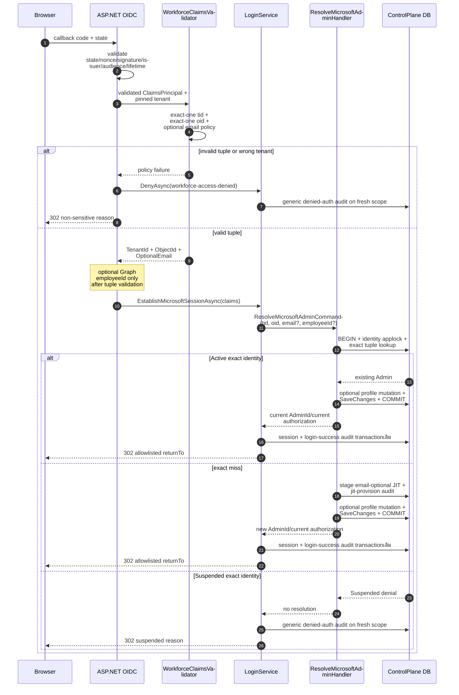
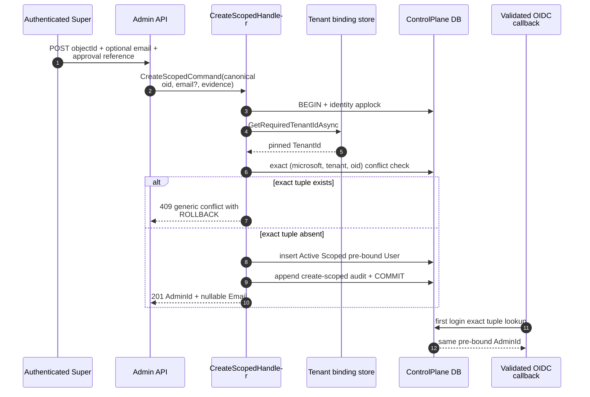
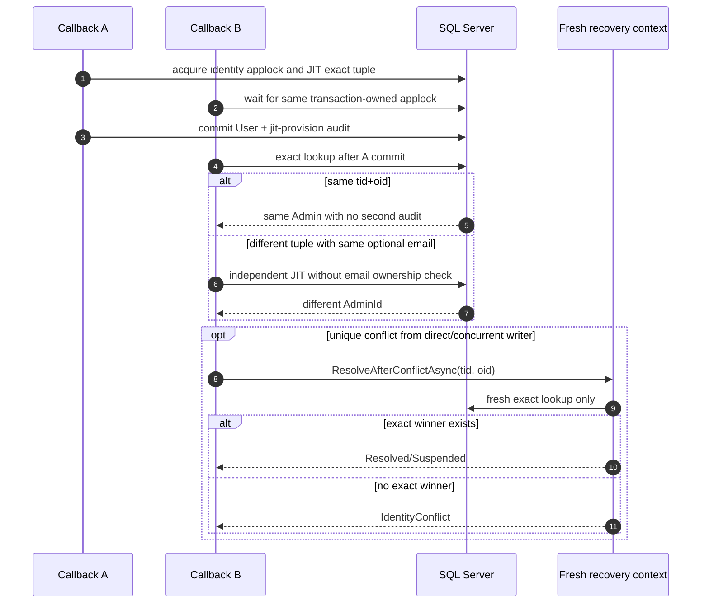
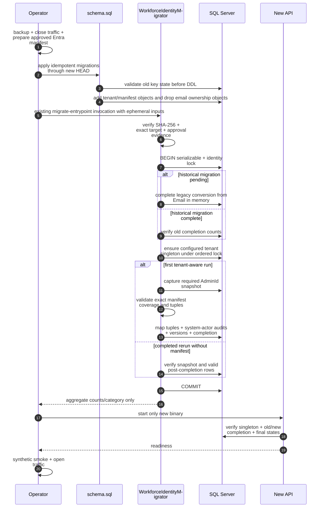

# Design: Tier 0 Microsoft Tenant-Aware Immutable Identity

> Status: approved 2026-09-02
> Status-Note: amended and approved 2026-09-02 — no-email-auth/offline-manifest design

เอกสารนี้เปลี่ยน Admin Microsoft workforce identity จาก
`(Provider=microsoft, Subject=canonicalEmail)` เป็น `(Provider=microsoft, TenantId=tid, Subject=oid)`
โดย runtime ใช้ validated token tuple เท่านั้น Email เป็น nullable non-unique contact attributeและไม่มีส่วนใน
identity decision ข้อมูลเดิมถูก mapด้วย verified offline manifestก่อนเปิด traffic ไม่ใช้ first-login email fallback
และไม่เปลี่ยน employee profile, RBAC, session ownership หรือ Merchant-user authentication

## Architecture Overview

### Invariant หลัก

1. Host เชื่อ `tid`/`oid` เฉพาะจาก `ClaimsPrincipal` หลัง ASP.NET Core OIDC handlerตรวจ state, nonce,
   signature, issuer, audienceและ lifetimeแล้ว Runtime writes derive subjectด้วย `ObjectId.ToString("D")`
2. Optional emailใช้เมื่อ exact-one claim หลัง trim non-emptyและยาวไม่เกิน 320เท่านั้น ไม่มี corporate-domain gate,
   ไม่มี `preferred_username` fallback และไม่มีอำนาจต่อ lookup/conflict/JIT/authorization
3. Microsoft runtime resolutionมีเพียง exact `(microsoft, tenantId, oid)` หากไม่พบจึง JIT tupleใหม่ ไม่มี candidate
   query, bind branchหรือ recoveryด้วย email/`WorkforceEmailKey`/`EmployeeId`
4. New invite pre-boundด้วย configured/persisted tenant + verified Entra `oid` ตั้งแต่ createสำเร็จ First loginจึงเป็น
   exact lookup ไม่ใช่ bind
5. Existing Microsoftและ unbound invited rowsเปลี่ยน tupleเฉพาะ mandatory offline mapperที่ targetด้วย `AdminId`
   snapshotและ strict manifest ห้าม runtimeอ่าน manifest
6. JIT, employee profileและ related `UserAudits` commitใน transaction/identity lockเดียวกัน Session +
   login-success auditคง transactionถัดไปตาม flowเดิม
7. Runtimeยังรับ tenantเดียว DBบังคับ non-null `Users.TenantId` reference singleton Foreign tenant rowถูก FK reject;
   triple indexเป็น future seamไม่ใช่ multi-tenant admission
8. Final model/schemaไม่มี `WorkforceEmailKey`; tokenนี้อยู่ได้เฉพาะ immutable historical migrationและ new
   drop/rollback migration source

### Components และ ownership

| Layer | Component / file | Responsibility / change |
|---|---|---|
| Host | `src/Hosts/Api/Admins/MicrosoftWorkforceClaims.cs` | exact-one `tid`/`oid`; typed `Guid TenantId/ObjectId`; optional normalized Emailและ EmployeeId; no preferred-username fallback |
| Host | `src/Hosts/Api/Admins/OidcAuthentication.cs` | คง framework validation; validate tupleก่อน optional email/Graph/DB; ส่ง typed claimsไป session service |
| Host | `src/Hosts/Api/Admins/LoginService.cs` | Microsoft-specific typed resolver seam; nullable Emailไม่เข้า session/audit subject; generic non-Microsoft behaviorเดิม |
| Host wire | `src/Hosts/Api/Program.cs` เฉพาะ Admin create/response blocks | `POST /api/v1/admins` รับ `ObjectId`, optional Email, approval reference; Admin me/list/detail/create responsesใช้ nullable Email |
| Shared host option | `src/Hosts/Api/OidcProviderOptions.cs` | shared Merchant subject selectionคงเดิม; Adminไม่ใช้ shared email/preferred-username identity helper |
| Domain | `src/Modules/Admins/Admins.Domain/Users/User.cs` | เพิ่ม nullable TenantId/Email; ลบ WorkforceEmailKey; Microsoft invite/JIT factoriesรับ Guid tuple; bound tuple private-setและ immutable |
| Domain | `src/Modules/Admins/Admins.Domain/Users/MicrosoftWorkforceIdentityPolicy.cs` (ใหม่) | pure final-state classifier: BoundMicrosoft หรือ BoundNonMicrosoft; canonical provider/tenant/oid invariant ไม่มี email input |
| Application | `src/Modules/Admins/Admins.Application/Users/ResolveMicrosoftAdmin.cs` | exact tuple → existing/Suspended หรือ JIT; employee profile compositionและ rollbackเดิม |
| Application | `src/Modules/Admins/Admins.Application/Users/UserPorts.cs` | exact Microsoft lookupเท่านั้น; recoveryรับ tenant/object id; generic lookupเห็นเฉพาะ TenantId NULL |
| Application | `src/Modules/Admins/Admins.Application/Users/CreateScopedAdmin.cs` | validate verified-oid evidence, derive singleton tenant, exact tuple conflict check, create pre-bound Scoped Admin; Email optional/non-unique |
| Application | `src/Modules/Admins/Admins.Application/Users/WorkforceTenantBindingPorts.cs` | `GetRequiredTenantIdAsync`; startup/tool initialization contractไม่เปิด tenantที่สอง |
| Persistence | `src/Persistence/Persistence.ControlPlane/Admins/UserRepository.cs` | parameterized exact tuple lookup; remove candidate queryและ email duplicate ownership check; EmployeeId global profile queryเดิม |
| Persistence | `src/Persistence/Persistence.ControlPlane/Admins/ControlPlaneIdentityRecoveryReader.cs` | fresh exact tuple recoveryเท่านั้น |
| Persistence | `src/Persistence/Persistence.ControlPlane/Admins/WorkforceTenantBindingStore.cs` | verify old/new completion states, singletonและ final User statesโดยไม่อ่าน email bridge |
| Persistence | migration-owner/runtime `UserConfiguration` ×2 | identical TenantId/triple index/FK/CHECK, nullable Email, no Email unique indexและ no WorkforceEmailKey mapping |
| Tool | `src/Tools/WorkforceIdentityMigrator/Program.cs` | strict manifest/digest/target/evidence, ordered locks, ensure tenant, snapshot/map/audit atomically, completed rerun without manifest |
| Migration | `src/BuildingBlocks/BuildingBlocks.Infrastructure/Persistence/Migrations/<timestamp>_Tier0MicrosoftTenantAwareIdentity.cs` | forward schemaต่อจาก `20260830172117_Tier0EmployeeProfile`; pre-DDL old-state guard; add tenant/manifest objects; drop email ownership objects; guarded Down |
| Generated DB | snapshot, `docker/migrations/schema.sql`, `docker/bootstrap/assert-fresh-db.sql` | sync HEAD, migration countและ exact metadata assertions |
| Ops | `docs/runbooks/admin-workforce-jit-rollout.md`, `docs/runbooks/admin-microsoft-oidc.md` | Entra export/manifest approval, no-email cutover, rollback cutoff, exact target, future tenant blockers |

ไม่แก้ `SharedKernel.ProviderIdentity`, Merchant repositories/OIDC/session, RBAC catalog, RoleAssignments,
MerchantAccess, HR/profile mapping, `docker/migrate-entrypoint.sh` หรือ migration
`20260830172117_Tier0EmployeeProfile` Scope expansionของ `Program.cs` จำกัดเฉพาะสาม Admin wire blocksข้างต้น

### Runtime resolution precedence

ภายใต้ keyed `admin` transactionและ applock `admin-user-identity-mutation`:

1. validate non-empty `TenantId/ObjectId`, normalize subjectครั้งเดียวและ optional Emailตาม trim/length policy
2. `GetByMicrosoftIdentityAsync(tenantId, objectId)` ด้วย exact provider+tenant+subject
3. exact Suspended → `Suspended`; exact Active → existing Admin โดยไม่อ่าน Email
4. exact miss → `JitProvisionMicrosoft(tenantId, objectId, email, now)` เป็น Active + Scoped
5. หาก profile switchเปิด จึงตรวจ global EmployeeId/HRและ apply profile
6. `SaveChangesAsync` ครั้งเดียวแล้ว resolve current Roles/Permissions/MerchantAccess
7. unique conflict → fresh exact tuple recovery; no exact winner → generic `IdentityConflict`

| Exact outcome | Result | Identity mutation |
|---|---|---|
| Active Admin | same AdminId/current authorization | none |
| Suspended Admin | `Suspended` | none |
| No row | JIT Active Scoped roleless | insert tuple + optional Email + `jit-provision` audit |
| Same Email on another tuple | independent exact miss/JIT | no bind, transferหรือ email conflict |
| Same oid with foreign tenant | blocked by tenant validator/FK | no cross-tenant lookup |
| Unique triple winner | fresh exact recovery | no second JIT audit |
| No exact winnerหลัง conflict | `IdentityConflict` | rollback |

`EmployeeId` query/indexยัง globalเพราะเป็น HR profile invariantใน current single-tenant phase ไม่ใช่ auth fallback

### Pre-bound invite

`POST /api/v1/admins` ยังคง Super-only + CSRF แต่ requestเปลี่ยนเป็น required `ObjectId`, optional `Email`,
required non-sensitive `IdentityApprovalReference` และ profile FKเดิม Handler validate reference non-emptyและไม่เกิน
128 characters,ใช้เป็น `create-scoped` audit CorrelationId, canonical Guid, derive tenantจาก persisted singletonและ
rejectเฉพาะ exact tuple Duplicate Emailซ้ำได้ `User.CreateScopedMicrosoft` persist Active/Scoped tupleทันที,
no Role/MerchantAccess, `Version=1` และ append auditด้วย acting Super First loginต้อง exact validated token tuple
ตรง persisted tuple HTTP traceยังใช้สำหรับ request diagnosticsแต่ไม่แทน approval reference

## Sequence Diagrams

### Validated callback และ exact-only resolution



### Pre-bound Microsoft invite



### Concurrent JIT และ exact recovery



### Deployment offline mapping และ mandatory verifier



## Data Models & Interfaces

### Domain model

```csharp
// Admins.Domain.Users.User
public Guid? TenantId { get; private set; }
public string? Email { get; private set; }
// WorkforceEmailKey removed.

public static User CreateScopedMicrosoft(
    Guid tenantId, Guid objectId, string? email, DateTime createdAt,
    Guid? positionId = null, Guid? officeId = null,
    Guid? levelId = null, Guid? divisionId = null);
// Provider=microsoft, TenantId=tenantId, Subject=objectId.ToString("D"), Active+Scoped, Version=1

public static User JitProvisionMicrosoft(
    Guid tenantId, Guid objectId, string? email, DateTime createdAt);
// Same tuple shape, nullable contact Email, no Role or MerchantAccess.
```

Microsoft runtimeไม่มี bind method `Provider/TenantId/Subject` มี private settersและถูก setเฉพาะ two factoriesข้างต้น
ส่วน offline mapperเป็น privileged raw-SQL boundaryที่ถูก allowlist/testแยก Generic `BindSubject` คงไว้เฉพาะ
historical non-Microsoft behaviorและ reject tenant-aware row

เพิ่ม pure final-state policy:

```csharp
public enum MicrosoftWorkforceIdentityState
{
    BoundMicrosoft,
    BoundNonMicrosoft
}

public static class MicrosoftWorkforceIdentityPolicy
{
    public static bool IsCanonicalObjectId(string? subject);

    public static bool TryClassifyFinal(
        string provider,
        Guid? tenantId,
        string? subject,
        Guid persistedTenantId,
        out MicrosoftWorkforceIdentityState state);
}
```

กฎ policy:

- `BoundMicrosoft` = exact lowercase provider, tenantตรง singleton, canonical non-empty oidรูปแบบ lowercase `D`
- `BoundNonMicrosoft` = providerไม่ใช่ microsoft, TenantId NULL, Subject non-null
- providerที่ equals-ignore-caseแต่ไม่ exact lowercase, NULL Subject, foreign/missing tenantหรือ noncanonical oid = invalid
- policyไม่มี Email, WorkforceEmailKey, token/raw claimหรือ logging input

Optional contact helperเป็น pure policyแยกจาก identity:

```csharp
public static class AdminContactEmail
{
    public const int MaxLength = 320;
    public static bool TryNormalize(string? value, out string? normalized);
}
```

`TryNormalize` trim, reject blank/overlengthเป็น absent, preserve trimmed casingและไม่ตรวจ corporate domain Hostจัดการ
claim countก่อนเรียก helper Domain factoriesเรียกซ้ำเพื่อกัน caller bypass

Tuple immutabilityใช้ app-layer floorเดิม: architecture test scan assignmentของ `TenantId`/bound `Subject`, runtime
raw SQL ban, private settersและ exact factory inputs DB CHECK/FK/unique indexบังคับ validity/race แต่ไม่เพิ่ม trigger
Privileged mapperเป็น writerนอก aggregateเพียงจุดเดียวและต้องผ่าน manifest/lock transaction

Offline per-row auditใช้ `Audit.ForSystem` กับ deterministic well-formed migration actor GUID,
`ActorType="system"`, target AdminId, existing action `microsoft-email-bind` และ non-sensitive approval correlation
ไม่เปลี่ยน audit schema

### Host claim contract

```csharp
internal sealed record MicrosoftWorkforceClaims(
    Guid TenantId,
    Guid ObjectId,
    string? Email,
    string? EmployeeId = null)
{
    public string Subject => ObjectId.ToString("D");
}
```

`MicrosoftWorkforceClaimsValidator.TryValidate` ใช้ `FindAll("tid")`และ `FindAll("oid")` แยกกัน Require countหนึ่ง,
`Guid.TryParse`, non-emptyและ tenantตรง `AdminMicrosoftTenantSnapshot` ก่อนพิจารณา email Email policy:

- zero claims → NULL
- one claim → `AdminContactEmail.TryNormalize`; blank/overlength → NULL
- more than one claim → NULL
- ไม่อ่าน `preferred_username`/UPNและไม่ fail valid tupleเพราะ email

OIDC scopesคง `openid profile email`; `profile` ทำให้ Entraส่ง `oid`, ส่วน `email` เป็น best-effort contactเท่านั้น

`OidcAuthentication.OnTokenValidated` order:

1. framework validate token/protocolครบแล้วจึงเข้า event
2. validatorตรวจ exact-one `tid`/`oid`และ pinned tenant
3. invalid tuple → mark policy failure + `context.Fail`; no Graph/DB/session
4. valid tuple → normalize optional emailโดยไม่มี denial
5. profile switchเปิดจึงใช้ Graph/EmployeeId flowเดิม
6. เก็บ typed recordใน `HttpContext.Items`
7. `OnTicketReceived` เรียก typed Microsoft seamโดยไม่ reparse principal

```csharp
Task<ResolveResult> ResolveMicrosoftAtCallbackAsync(
    Guid tenantId,
    Guid objectId,
    string? email,
    string? employeeId,
    string correlationId,
    CancellationToken ct);

Task EstablishMicrosoftSessionAsync(
    HttpContext http,
    MicrosoftWorkforceClaims claims,
    string? returnTo,
    CancellationToken ct);
```

Generic `ResolveAtCallbackAsync(ProviderIdentity, ...)` และ session coreคงสำหรับ historical non-Microsoft tests แต่
`GetByIdentityAsync` จำกัด `TenantId IS NULL` Microsoft session/audit subjectยัง NULLและ Emailไม่อยู่ cookie/session

### Host wire contract

```csharp
internal sealed record CreateAdminRequest(
    Guid ObjectId,
    string? Email,
    string IdentityApprovalReference,
    Guid? PositionId = null,
    Guid? OfficeId = null,
    Guid? LevelId = null,
    Guid? DivisionId = null);

internal sealed record AdminMeResponse(Guid AdminId, string? Email, ...);
internal sealed record AdminListItemResponse(Guid AdminId, string? Email, ...);
internal sealed record AdminDetailResponse(Guid AdminId, string? Email, ...);
```

Routeยังเป็น `POST /api/v1/admins`, authorization/CSRF/status codesเดิม Malformed JSON Guidเป็น 400ตาม ASP.NET;
Guid.Empty, blank/overlength evidenceและ overlength Emailผ่าน explicit validation `Email` nullหรือ invalid contact
ไม่ block invite identity แต่ normalized resultเป็น NULL OpenAPIต้องสะท้อน required ObjectId/evidenceและ nullable Email

### Application contracts และ handler

```csharp
public sealed record ResolveMicrosoftAdminCommand(
    Guid TenantId,
    Guid ObjectId,
    string? Email,
    string? EmployeeId,
    string CorrelationId) : ICommand<ResolveResult>;

public sealed record CreateScopedCommand(
    Guid ObjectId,
    string? Email,
    string IdentityApprovalReference,
    Guid ActingAdminId,
    string CorrelationId,
    Guid? PositionId = null,
    Guid? OfficeId = null,
    Guid? LevelId = null,
    Guid? DivisionId = null) : ICommand<CreateScopedResult>;

public sealed record CreateScopedResult(Guid AdminId, string? Email);

public interface IUserRepository
{
    Task<User?> GetByMicrosoftIdentityAsync(Guid tenantId, Guid objectId, CancellationToken ct);
    // generic/historical non-Microsoft only: WHERE TenantId IS NULL
    Task<User?> GetByIdentityAsync(ProviderIdentity identity, CancellationToken ct);
    Task<User?> GetByEmployeeIdAsync(string employeeId, Guid exceptAdminId, CancellationToken ct);
}

public interface IAdminIdentityRecoveryReader
{
    Task<ResolveResult> ResolveAfterConflictAsync(
        Guid tenantId, Guid objectId, CancellationToken ct);
}

public interface IWorkforceTenantBindingStore
{
    Task EnsureAsync(Guid configuredTenantId, CancellationToken ct);
    Task<Guid> GetRequiredTenantIdAsync(CancellationToken ct);
}
```

Application validate Guid non-empty, canonicalize subjectด้วย `D`, normalize optional Emailซ้ำและไม่รับ
caller-provided Provider/Subject string Microsoft handlerไม่มี candidate classifierหรือ bind method

`CreateScopedHandler` acquire identity lock, validate bounded non-sensitive approval reference, read
`GetRequiredTenantIdAsync`, exact tuple conflict-checkและ profile FK validationใน transactionเดิม แล้วเรียก
`User.CreateScopedMicrosoft` Create auditใช้ approval referenceเป็น CorrelationIdเพื่อให้ evidence traceได้ Emailไม่อยู่
duplicate check `GetByEmailAsync` คงไว้เฉพาะ historical
non-Microsoft/self-provision callersและห้าม Microsoft resolverเรียก

Conflict recoveryคง employee-profile transaction semanticsเดิม:

- `EmployeeId == null`: หลัง unique conflictใช้ fresh context exact `(microsoft, tenantId, oid)` lookupเท่านั้น
- `EmployeeId != null`: rerun transactionหนึ่งครั้งหลัง rollback+`ChangeTracker.Clear`; exact/EmployeeId precheckและ
  profile applyต้องครบ หาก second conflictระบุ ownerไม่ได้คืน generic `IdentityConflict`
- optional Emailไม่ถูกใช้ระบุ conflict sourceหรือ recovery winner

### Persistence query shapes

```csharp
var canonicalObjectId = objectId.ToString("D");
return _db.Users.SingleOrDefaultAsync(x =>
    x.Provider == User.MicrosoftProvider
    && x.TenantId == tenantId
    && x.Subject == canonicalObjectId, ct);

// Generic provider identity cannot see tenant-aware Microsoft rows.
return _db.Users.FirstOrDefaultAsync(x =>
    x.TenantId == null
    && x.Provider == identity.Provider
    && x.Subject == identity.Subject, ct);
```

Microsoft resolver, invite conflictและ fresh recoveryใช้ methodแรกเท่านั้น ไม่มี queryด้วย Email,
WorkforceEmailKey, preferred usernameหรือ EmployeeId `GetByEmailAsync` อาจคงสำหรับ historical non-Microsoft
commandsแต่ static testห้าม callจาก Microsoft files ใช้ LINQ parameterization ไม่มี `IgnoreQueryFilters`, set-based
DMLหรือ parameter logging

### SQL Server schema

| Object | Final shape |
|---|---|
| `admin.Users.TenantId` | `uniqueidentifier NULL`; final Microsoft rows non-null, migration-only pre-map rowsอาจ null |
| `admin.Users.Email` | `nvarchar(320) NULL`; no unique index |
| `AK_WorkforceTenantBindings_TenantId` | alternate keyบน `admin.WorkforceTenantBindings(TenantId)` |
| `FK_Users_WorkforceTenantBindings_TenantId` | nullable FK, `ON DELETE NO ACTION` |
| `CK_Users_TenantId_MicrosoftProvider` | `[TenantId] IS NULL OR [Provider] COLLATE Latin1_General_100_BIN2 = N'microsoft'` |
| `IX_Users_Provider_TenantId_Subject` | unique `(Provider, TenantId, Subject)`, filter `[Subject] IS NOT NULL` |
| `IX_Users_TenantId` | non-unique FK support index |
| `admin.WorkforceTenantIdentityMigrations` | singleton state: Id, CompletedAt, SnapshotCount, MappedCount, NoOpCount |
| `admin.WorkforceTenantIdentitySnapshot` | PK/FK `AdminUserId` only; captured first-run set, no tid/oid/email |
| removed | `IX_Users_Provider_Subject`, `IX_Users_Email`, `IX_Users_WorkforceEmailKey`, `Users.WorkforceEmailKey` |

Migration creates new state/snapshot tablesด้วย raw SQLตาม historical migration-table convention, CHECK non-negative
counts, singleton `Id=1`, FK snapshot→Users `NO ACTION` และ grants read-only state/snapshot accessให้ `pol_app`
Toolใช้ privileged migration connectionสำหรับ writes State starts incomplete with zero counts; tool completesแม้ snapshot
emptyเพื่อให้ startupมี durable gate

SQL Serverถือ NULLเป็น key valueใน unique indexดังนั้น non-Microsoft `(Provider,NULL,Subject)` ยัง unique Subject
NULLถูก filterเฉพาะเพื่อให้ pre-tool rowsอยู่ได้ชั่วคราว New invitesไม่ใช้ NULL Subject Same oid/different tenantไม่ชน
triple index แต่ singleton FKตั้งใจ reject tenantที่สองจน registry migrationภายหลัง

คงเดิม:

- filtered global unique `IX_Users_EmployeeId`
- profile columns/FKs/indexesจาก `Tier0EmployeeProfile`
- singleton check `CK_WorkforceTenantBindings_Singleton`
- RoleAssignments, MerchantAccess, Sessions, AuthAuditsและ existing UserAudits

Migration-owner `Admins.Infrastructure.Persistence.Users.UserConfiguration` และ runtime
`Persistence.ControlPlane.Admins.UserConfiguration` map final User shapeตรงกัน ไม่มี WorkforceEmailKey property/shadow,
Email optionalและ triple identity objectsชื่อเดียวกัน Raw migration-state tablesไม่ใช่ aggregate EF model

### Mandatory `WorkforceIdentityMigrator` และ manifest

`docker/migrate-entrypoint.sh` ยังคง apply committed schemaก่อนเรียก toolและไม่เปลี่ยน order First-run operatorที่มี
legacy rowsใช้ `docker compose run`/equivalentเพื่อส่ง ephemeral inputsโดยไม่แก้ script:

- `WORKFORCE_IDENTITY_MANIFEST_FILE`
- `WORKFORCE_IDENTITY_MANIFEST_SHA256`
- `WORKFORCE_IDENTITY_TARGET` รูปแบบ exact `server:port/database`
- `WORKFORCE_IDENTITY_APPROVAL_EVIDENCE`
- `WORKFORCE_IDENTITY_CORRELATION_ID` แบบ non-sensitive
- `WORKFORCE_TENANT_ID`

Manifest JSONใช้ BCL `System.Text.Json` strict parser ไม่มี dependencyใหม่:

```json
{
  "schemaVersion": 1,
  "entries": [
    {
      "adminId": "11111111-1111-4111-8111-111111111111",
      "tenantId": "22222222-2222-4222-8222-222222222222",
      "objectId": "33333333-3333-4333-8333-333333333333"
    }
  ]
}
```

Entryยอมรับ exact propertiesสามตัวเท่านั้นและ reject duplicate/unknown JSON properties GUIDต้อง non-emptyและ
canonicalizeใน memory Input fileมี hard ceiling 10 MiBและ entriesต้องไม่เกิน captured snapshot count File/digest/raw
evidenceไม่ถูก copyเข้า outputหรือ DB ก่อน transaction Toolคำนวณ SHA-256ด้วย streaming BCLและ compare fixed-time
จากนั้น connect, query actual server/databaseและเทียบทั้ง DB environment targetกับ approved targetก่อน write

Transaction algorithmภายใต้ `Serializable`:

1. acquire `admin-user-identity-mutation` applock
2. load singleton old `WorkforceIdentityMigrations`, rollback snapshotและ Usersด้วย update/hold locks
3. pending old state: derive canonical legacy valueจาก non-null existing Emailใน memory, complete rollback manifestและ
   old countsโดยไม่อ่าน/เขียน removed WorkforceEmailKey; completed old state: verify counts/snapshot
4. acquire `admin-workforce-tenant-binding` lockตาม orderเดิม หาก first-run required setไม่ว่าง require
   `WORKFORCE_TENANT_ID`, insert missing singletonหรือ reject mismatch หาก setว่างอนุญาต API `EnsureAsync`สร้างภายหลัง
5. load new singleton state ถ้า incompleteให้ capture exact AdminId setที่ `Provider=microsoft OR Subject IS NULL` ลง
   snapshot tableก่อน manifest comparison Bound non-Microsoft rowsถูก exclude
6. require manifest AdminIdsเท่ากับ captured set, tenantทุก entryตรง configured/singleton, tuplesไม่ซ้ำและ targetsมีจริง
7. target legacy/unbound row → update Provider/TenantId/Subject/Version/UpdatedAt, insert `microsoft-email-bind` audit
   ด้วย deterministic system actor + target AdminId + non-sensitive correlation Targetที่ final tupleตรงแล้วเป็น no-op;
   divergent final tuple fail
8. write aggregate countsและ CompletedAt แล้ว commit old/new state, snapshot, mappingsและ auditsพร้อมกัน

Completed rerunไม่ต้องมี manifest inputs Load singleton tenant + old/new states, require snapshot count/rowsตรง,
require snapshot targetsยังเป็น valid final Microsoft, classify Usersทุก rowด้วย final policyและยอมรับ valid JIT/invites
ที่ไม่อยู่ snapshot Invalid stateคืน fixed category + non-zeroโดยไม่มี mutation

Tool outputมีเฉพาะ `snapshot`, `mapped`, `no-op` countsและ fixed category ห้าม echo path, digest, evidence, target,
AdminId, tid, oid, Email, EmployeeId, SQL exceptionหรือ response body `WorkforceIdentitySubjectRollback` เดิมคงไว้
สำหรับ guarded reverse pathแต่ไม่ใช่ final oid source

## Migration, Cutover and Rollback

### Forward migration `Up()`

ลำดับ commandใน EF transaction:

1. raw SQL preconditionเป็น commandแรก: require old migration singleton/counts valid; pending stateต้องมี
   WorkforceEmailKeyทุก rowเป็น NULL; completed stateต้องตรง canonical legacy Email invariant มิฉะนั้น THROWก่อน DDL
2. add `AK_WorkforceTenantBindings_TenantId`
3. add nullable `admin.Users.TenantId uniqueidentifier` และ provider CHECK
4. drop `IX_Users_Provider_Subject`, `IX_Users_Email` และ `IX_Users_WorkforceEmailKey`
5. alter `Users.Email` เป็น `nvarchar(320) NULL` แล้ว drop `Users.WorkforceEmailKey`
6. create unique `IX_Users_Provider_TenantId_Subject` filter `[Subject] IS NOT NULL` และ support `IX_Users_TenantId`
7. add nullable FK to binding alternate keyด้วย `NoAction`
8. create raw-SQL singleton `WorkforceTenantIdentityMigrations` + AdminId-only snapshot table, constraints/grantsและ
   incomplete row `Id=1`

`Up()` ไม่มี User/audit/profile/session UPDATE Identity mappingเกิดหลัง schemaใน mandatory toolเท่านั้น Existing
Provider/Subject/Email/EmployeeId/profile/authorization/session/audit valuesจึงไม่เปลี่ยน

Migration sourceใช้ dynamic SQLหรือ command boundaryเมื่ออ้าง objectที่เพิ่งสร้างเพื่อให้ idempotent scriptจาก empty DB
ไม่เกิด same-batch compile false-greenตาม `.ai/shared/stack/dotnet.md` หลัง generateต้อง sync Designer,
`PolDbContextModelSnapshot.cs`, `docker/migrations/schema.sql` ผ่าน `scripts/check-migration-script.sh --write` และ
fresh-bootstrap metadata/mutation assertions

### Guarded `Down()`

raw SQL commandแรกตรวจทุก unsafe old constraintก่อน DDL:

```sql
IF EXISTS (SELECT 1 FROM admin.Users WHERE TenantId IS NOT NULL)
   OR EXISTS (SELECT 1 FROM admin.Users WHERE Email IS NULL)
   OR EXISTS (
       SELECT Email FROM admin.Users
       GROUP BY Email HAVING COUNT_BIG(*) > 1)
    THROW 51000, 'Tenant-aware identity rollback requires verified mapping or backup restore.', 1;
```

Guardยัง require new manifest `MappedCount=0` และ state/table shapeครบ หากผ่านจึง:

1. revoke/drop new snapshotและstate tables
2. drop FK/support index/CHECK/triple index/TenantId/alternate key
3. add nullable WorkforceEmailKey; old state pending →คงทุกค่า NULL, old state completed → reconstructด้วย exact
   canonical Email ruleที่ Up prevalidated
4. recreate filtered unique WorkforceEmailKey, unique non-null Emailและ filtered unique `(Provider,Subject)`
5. alter Emailกลับ non-nullหลัง data guardผ่าน

ทุก operationอยู่ migration transactionเดียว Guard failureคง migration historyและทุก HEAD object/dataโดยไม่มี partial
DDL หลัง mapper/JIT/pre-bound inviteมี non-null TenantIdจึงต้อง forward recoveryหรือ approved backup restore ห้าม
fabricate reverse oidหรือ deploy old email-only binaryบน tenant-aware data

### Production cutover

1. authoritative Entra exportจับคู่ Admin inventoryด้วย AdminIdและจัดทำ invite/migration approval evidence
2. สร้าง strict manifest, SHA-256และ exact `server:port/database` target โดยไม่ commitหรือ log contents
3. stagingรัน full flow + synthetic identity/profile smokeแล้วลบ manifest copy
4. backup databaseและบันทึก checksum/rollback evidenceตาม release process
5. maintenance windowปิด Admin Microsoft trafficและ drain old binaryทุก instance
6. apply idempotent schema script แล้วรัน existing migrate entrypointพร้อม ephemeral first-run inputs
7. require tool exit 0, old/new completion states valid, snapshot remaining count zero จากนั้นลบ ephemeral manifest
8. startเฉพาะ new binary Startup verify configured tenantตรง singletonและ every Userอยู่ final state
9. production smokeใช้ operator-approved existing pre-mapped accountสำหรับ email-less exact/session; JITและ invite
   mutation smokeรันใน stagingเท่านั้น
10. เปิด trafficและ monitor aggregate categories (`resolved`, `jit`, `suspended`, `identity-conflict`) โดยไม่มี PII

ห้าม mixed-version traffic Schemaใหม่ drop WorkforceEmailKey/Email uniquenessจึง incompatibleกับ old binary หาก mapper
ล้มให้คง trafficปิด แก้ manifest/inputแล้ว rerun forward ห้าม start old binary

### Manifest completion gate

Operator/readinessใช้ aggregate-only checks:

```sql
SELECT SnapshotCount, MappedCount, NoOpCount,
       CASE WHEN CompletedAt IS NULL THEN 0 ELSE 1 END AS IsComplete
FROM admin.WorkforceTenantIdentityMigrations
WHERE Id = 1;

SELECT COUNT_BIG(*) AS InvalidFinalRows
FROM admin.Users
WHERE Subject IS NULL
   OR (Provider COLLATE Latin1_General_100_BIN2 = N'microsoft' AND TenantId IS NULL);
```

Toolและ startupทำ canonical oid/provider/singleton checksที่เข้มกว่า aggregate SQLนี้ Queryมีไว้ operator readiness
ไม่ใช่ auth lookup Completed rerunไม่ require manifestและต้องไม่ขยาย captured snapshotด้วย JIT/inviteใหม่

### สิ่งที่ต้องเปลี่ยนก่อน multi-tenant จริง

| Current assumption | Required follow-up ก่อนรับ tenant ที่สอง |
|---|---|
| singleton `WorkforceTenantBinding` + FK | approved registry/allowlist, issuer/authority selectionต่อ tenant, onboarding auditและ FKไป registry |
| optional non-unique Email | privacy/retention decisionต่อ tenant แต่ห้ามกลับมาเป็น identity key |
| no WorkforceEmailKey | ห้ามสร้าง replacement email bridge; registry identityยังใช้ tid+oid |
| global EmployeeId unique | HR-domain decisionว่า namespace globalหรือ `(TenantId,EmployeeId)` |
| tenant-pinned single Authority | registry-driven exact issuer/discovery metadata; ห้าม generic `common`/`organizations` trust |
| first-run AdminId snapshot | tenant-aware migration ownership/versioningสำหรับ tenant onboardingใหม่ |

## Technology Decisions

| ID | Decision | Rationale |
|---|---|---|
| D1 | Claims/applicationใช้ `Guid TenantId/ObjectId`; DB Subjectเป็น canonical lowercase `D` string | กัน representation duplicateโดยไม่เปลี่ยน shared ProviderIdentity/non-Microsoft schema |
| D2 | Microsoft callbackมี typed tenant-aware seamแยกจาก generic ProviderIdentity | pair typeไม่มี tenantและเสี่ยง caller bypass |
| D3 | exact tupleหรือ JITเท่านั้น ไม่มี runtime candidate/bind/email recovery | emailไม่มี auth powerตาม final contract |
| D4 | pure final `MicrosoftWorkforceIdentityPolicy` ไม่มี Email input | startup/tool/runtime state validationไม่ driftกลับไป bridge |
| D5 | new invite pre-boundด้วย singleton tenant + verified export oid + evidence | first loginเป็น exact token proofโดยไม่สร้าง invite-token feature |
| D6 | alternate key + FK + provider CHECK + filtered triple index | DBปิด foreign tenant/direct invalid stateและ raceขณะยังรองรับ pre-tool null rows |
| D7 | verified offline AdminId manifestแทน first-login bind | preserve AdminIdโดยไม่มี email takeover windowหรือ fabricated oid |
| D8 | คง global identity applockและ one SaveChangesใน runtime | throughputต่ำและรักษา profile/audit atomicityเดิม |
| D9 | Email nullable/non-unique, trim/length-onlyและ no auto-refresh | contact dataไม่ควร blockหรือเปลี่ยน identity |
| D10 | EmployeeIdยัง global | ไม่เปลี่ยน HR semanticsใน single-tenant phase |
| D11 | adapt mandatory toolและคง migrate entrypoint/order | รองรับ old pending state + new manifestโดยไม่แก้ proven orchestration |
| D12 | pre-DDL Up validation + guarded Down | drop bridgeได้แต่ rollbackต้อง failก่อน partial DDLเมื่อ reverseไม่ปลอดภัย |
| D13 | BCL/EF Core/SQL Server primitivesเท่านั้น | `Guid`, `SHA256`, `CryptographicOperations`, `Utf8JsonReader`, EF migrationsเพียงพอ |
| D14 | ไม่เพิ่ม DB triggerสำหรับ tuple immutability | private writers/static gate/raw-SQL allowlist + CHECK/FK/uniqueตรง architecture floor |
| D15 | persist AdminId-only first-run snapshot; completed rerunไม่ require manifest | manifest ephemeralและ post-completion JIT/inviteไม่ใช่ migration residue |
| D16 | offline auditใช้ deterministic system actor + target AdminId | attributionตรงผู้กระทำโดยไม่เปลี่ยน audit schema/action literal |
| D17 | digest + exact target + approval evidenceก่อน mapping write | bind artifactเข้ากับ operator decisionและ DB target |
| D18 | drop WorkforceEmailKey property/column/indexที่ HEAD | tool derive old canonical valueจาก Emailใน memoryได้ จึงไม่มี non-auth callerค้าง |
| D19 | tool ensure singletonเมื่อ mapping setไม่ว่าง; zero-row fresh DBให้ API initialize | รักษา FK/orderโดยไม่บังคับ manifest configบน empty bootstrap |
| D20 | `Program.cs` scopeแคบเฉพาะ create route/requestและ nullable response contracts | wire changeจำเป็นแต่ไม่เปิด unrelated host refactor |

## Error Handling Strategy

| Boundary | Failure | Result | Writes allowed |
|---|---|---|---|
| OIDC framework | signature/audience/nonce/lifetime/state/code exchange | `auth-failed` | generic denied-auth audit only |
| OIDC issuer | invalid issuer | `workforce-access-denied` | generic denied-auth audit only |
| workforce tuple validator | missing/duplicate/malformed/empty tidหรือ oid, wrong tenant | `workforce-access-denied` | generic denied-auth audit only; no Graph/identity/profile/session |
| optional email parser | absent, duplicate, blankหรือ overlength | Email=NULL | authentication continues; no profile-contact write for invalid value |
| exact lookup | exact Admin Suspended | `suspended` | denied-auth audit only |
| exact lookup | no row | JIT Active Scoped | tuple/UserAudit/profile transaction only |
| employee profile | Graph/HR/mapping/mismatch/taken | existing employee outcome/reason | resolution transaction rollback; fresh denied-auth audit |
| SaveChanges | same tuple race | fresh exact tenant+oid recovery resolves winner | no second JIT audit |
| SaveChanges | duplicate optional Email | impossible by final schema | test/schema regression; never identity policy |
| unexpected second unique conflict | no exact winner | generic `identity-conflict` | rollback; no email inference |
| invite request | empty/malformed oidหรือ missing/bad approval reference | 400 | no User/create audit |
| invite request | exact tuple already exists | generic 409 | no write; Emailไม่ใช้ conflict |
| startup verifier | tenant mismatch, incomplete old/new state, invalid final User | boot failure | no repair or traffic |
| tool input | digest/target/evidence mismatch | fixed category + non-zero | no DB write |
| tool manifest | missing/incomplete/extra/duplicate/foreign/divergent | fixed category + non-zero | transaction rollback |
| tool tenant | singleton mismatch | fixed category + non-zero | no identity write |
| migration Up | old key/completion invariant drift | SQL 51000 before DDL | none |
| migration Down | mapped/JIT/invite row, NULL/duplicate Emailหรือ invalid state | SQL 51000 before DDL | none |

Catch/loggingใช้ fixed category + correlation idเท่านั้น ห้าม exception object/messageที่อาจมี SQL values ห้าม tid,
oid, Email, EmployeeId, token, cookie, manifest path/content/digest/evidence/targetหรือ response bodyใน logs/audits/
browser reason Offline bind auditคง action `microsoft-email-bind` แต่ actor=`system`, target=AdminIdและ correlationเป็น
non-sensitive approval reference JITคง `jit-provision`; Microsoft auth audit subjectคง NULL

## Testing Strategy

### Unit/domain — `tests/Admins.Tests`

| Test area | Planned files / assertions | REQ |
|---|---|---|
| final-state policy | `MicrosoftWorkforceIdentityPolicyTests.cs`: bound Microsoft/non-Microsoft, provider case drift, NULL/non-D oid, foreign/missing singleton, no Email input | REQ-1.34-1.39, REQ-2.6-2.22 |
| contact policy | `AdminContactEmailTests.cs`: exact trim, empty, overlength, casing, non-corporate valueและ NULL | REQ-1.40-1.46, REQ-2.32-2.46, REQ-5.4-5.5 |
| User aggregate | `AdminAccountTests.cs`, `UserEmployeeProfileTests.cs`: pre-bound invite, email-less JIT tuple, duplicate Email allowed, tuple immutable, profile/AuthorizationVersion unchanged | REQ-2, REQ-5 |
| exact resolution | `ResolveMicrosoftAdminTests.cs`: exact email-less/rename, same Email different tuple, same oid foreign tenant, no candidate API, exact recovery, roles/access preserved | REQ-3, REQ-6 |
| profile composition | `ResolveMicrosoftAdminEmployeeProfileTests.cs`: exact/JIT + profile, rollback User/profile/audits, global EmployeeId semantics | REQ-5 |
| invite creation | `AdminHandlerTests.cs`, `ProfileValidationTests.cs`: required oid/evidence, singleton tenant, optional duplicate Email, exact tuple conflict, pre-bound authorization state | REQ-2.8-2.9, REQ-2.42-2.47, REQ-9.34 |
| manifest pure policy | `WorkforceIdentityManifestPolicyTests.cs`: strict JSON properties, canonical GUIDs, duplicate/extra/missing coverage, digest parseและ final divergence | REQ-4 |
| fakes | `AdminFakes.cs` mirrors exact tupleและ tenant getter; Microsoft fakeไม่มี candidate/email matching | support |

### Host/OIDC — `tests/Hosts.Tests`

- `MicrosoftOidcTests.cs`: exact-one tid/oid, missing/duplicate/malformed/empty, canonical `D`, wrong tenant;
  zero/one/duplicate/blank/overlength/non-corporate Email; no preferred-username fallback; Merchant helper unchanged
- `OidcCallbackE2ETests.cs`: signed callbackส่ง validated tuple + nullable Emailผ่าน typed seam; protocol denialไม่มี
  Graph/resolver/session write; email-less callbackสำเร็จ
- `AdminGraphEmployeeProfileE2ETests.cs`: invalid tupleไม่เรียก Graph; valid email-less tuple + switch onส่ง EmployeeId;
  switch offไม่เรียก Graph/HR
- `AdminLoginServiceTests.cs`: typed nullable Email seam, every outcome mapping, Microsoft audit subject NULL,
  no claim/email valuesใน logger/browser/session
- `AdminCallbackResolverInviteBindTests.cs`: renameเนื้อหาให้ยืนยัน Microsoft exact commandไม่มี bind/candidate;
  non-Microsoft behaviorเดิม
- Program/OpenAPI host testsยืนยัน create requestมี objectId/evidence/optional emailและ me/list/detail Email nullable
- existing Merchant OIDC/login suitesต้องผ่านโดยไม่แก้ expected behavior

### Architecture/static — `tests/Architecture.Tests`

- `Tier0WorkforceArchitectureTests`: exact `FindAll("oid")`; ban preferred username, WorkforceEmailKeyและ candidate
  symbolsจาก current Admin Microsoft/domain/persistence/tool source; allow tokenเฉพาะ old/new migration files;
  tuple writersจำกัด factories + mapper allowlist; no PII/exception logging
- `WorkforceTenantBindingStoreTests`: old/new completion, final states, zero-row initialization, invalid/foreign/null-subject
  failโดยไม่อ่าน bridgeหรือ echo values
- `ModelDisjointnessTests`: runtime/migration-owner User modelsตรงกันเรื่อง nullable Email, TenantId/FK/triple indexและ
  absenceของ Email/WorkforceEmailKey indexes/property
- `Tier0EmployeeProfileTransactionTests`: real handler/repository/UoW JIT/profile commit, profile failure rollbackและ
  Version/AuthorizationVersion unchanged rules
- `Tier0WorkforceIdentityMigrationSqlTests`: strict manifest, digest/target/evidence, old pending without key column,
  singleton create/mismatch, first snapshot, system audits, completed no-manifest rerun, post-JIT acceptance, no-output canary
- static Program scope testยืนยัน diff surfaceจำกัด Admin create/nullable response blocksและ Merchant routesไม่เปลี่ยน

### SQL Server migration — `tests/Integration.Tests`

เพิ่ม `Tier0MicrosoftTenantAwareIdentityMigrationTests.cs` และปรับ existing migration assertions:

1. empty database → HEAD: TenantId/Email nullability, triple index order/filter/unique, support index, CHECK,
   alternate key/FK, new state/snapshot tables, no WorkforceEmailKeyหรือ unique Email index, profile FKsเดิม
2. upgradeจาก `20260830172117_Tier0EmployeeProfile`: legacy Microsoft/invite/non-Microsoft + profile, RoleAssignment,
   MerchantAccess, Sessionและ audits; Upไม่เปลี่ยน row valuesนอกจาก DDL shape
3. Up precondition: completed key driftและ pending non-null key THROWก่อน objectใดเปลี่ยน
4. DB constraints: duplicate exact triple/non-Microsoft pair reject, Subject NULL pre-tool rows coexist,
   non-Microsoft+TenantId fail CHECK, unknown tenant fail FK, same Email different tuples coexist
5. first tool run: exact manifest maps Active/Suspended/invite, bumps Version once, system-actor audit, preserves every
   AdminId/status/tier/role/access/profile/session/audit; missing/extra/duplicate/foreign/divergent input rolls backทั้งหมด
6. completed rerun without manifest: snapshot stable, valid new JIT/invite accepted, no second audit; invalid final row fails
7. safe Down before tenant write reconstructs exact old key/index/nullability; pending/completed old statesทั้งคู่
8. guarded Down after map/JIT/inviteหรือ unsafe Email data THROWก่อน DDLและคง migration history/all HEAD objects
9. fresh baselineและ `docker/bootstrap/assert-fresh-db.sql` ตรวจ metadataจริงพร้อม mutation tests

Concurrency integrationใช้ real handler/repository/toolและสอง connections:

- same tid+oid JITพร้อมกัน → Admin/auditเดียวและ callbackทั้งคู่ได้ AdminIdเดียว
- different tuplesพร้อม same optional Email → independent Admin rows ไม่มี bind/conflictจาก Email
- direct unique winnerระหว่าง read/save → fresh exact recoveryเท่านั้น
- concurrent first mapper invocations → identity applockให้ commit/audit/snapshotชุดเดียว อีก invocationเป็น completed rerun

scratch databaseใช้ synthetic GUID/email/EmployeeId, `Pooling=false`, cleanup guardเดิม ไม่มี production query

### Documentation/gates

- `admin-workforce-jit-rollout.md`: authoritative export, strict manifest format, SHA-256, exact target, approval inputs,
  no-mixed-version maintenance, aggregate completion, ephemeral deletionและ forward recovery
- `admin-microsoft-oidc.md`: tid+oid authority, optional email policy, email-less login/JIT, pre-bound invite,
  no EmployeeId unlinkและ no WorkforceEmailKey fallback
- document singleton FK/Authority/EmployeeId blockersก่อน multi-tenantและห้ามสร้าง email bridgeใหม่
- `docker/bootstrap/assert-fresh-db.test.sh` mutation testsต้องแดงเมื่อลบ Email/key absence, state-tableหรือ index assertions
- static gateห้าม current source token/candidate driftและ `.Skip`; fixtures synthetic; no dependencyใหม่

คำสั่ง final verification:

```bash
dotnet build pol-core.slnx --no-restore -warnaserror
dotnet test pol-core.slnx --no-build --filter "Category!=Integration"
dotnet test pol-core.slnx --filter "Category=Integration"
scripts/check-migration-script.sh
.ai/bin/check-secrets.sh --all
scripts/spec-trace.sh tier0-microsoft-tenant-aware-identity
```

ผลที่ commandไม่ได้รันหรือ infrastructure failก่อน assertionต้องรายงาน unverified/blocked

## Requirement Traceability

| REQ | Section |
|---|---|
| REQ-1 | Architecture Overview |
| REQ-2 | Data Models & Interfaces |
| REQ-3 | Architecture Overview |
| REQ-4 | Data Models & Interfaces |
| REQ-5 | Sequence Diagrams |
| REQ-6 | Error Handling Strategy |
| REQ-7 | Migration, Cutover and Rollback |
| REQ-8 | Migration, Cutover and Rollback |
| REQ-9 | Error Handling Strategy |
| REQ-10 | Testing Strategy |

## Spec-architect Critique Resolution

Piไม่มี native subagentจึง adopt `spec-architect` critique persona inlineและตรวจ designกับ requirements/filesystemใหม่
ทั้งชุด Findingsเดิมที่ email-bridge-specificถูก supersedeด้วยรายการนี้

| Finding | Severity | Decision | Resolution |
|---|---|---|---|
| current-row manifest coverageจะบังคับ post-JIT rowsเข้า ephemeral manifestตอน rerun | BLOCKING | accepted | persist first-run AdminId snapshot; completed rerunไม่มี manifestและยอมรับ valid later rows |
| migrate toolรันก่อน API initializerจึง FK mappingไม่มี singleton | BLOCKING | accepted | ordered identity→tenant locks; tool ensure singletonเมื่อ required setไม่ว่าง; empty DBให้ startup initialize |
| offline auditใช้ targetเป็น actorจะสร้าง false attribution | BLOCKING | accepted | deterministic system actor + target AdminId + non-sensitive approval correlation |
| pre-bound inviteตรวจแค่ GUID shapeอาจผูกสิทธิ์ให้ oidผิด | BLOCKING | accepted | authenticated Superต้องมี verified Entra export reference; persisted create auditใช้ approval reference |
| optional Emailไม่มี deterministic profile policy | MAJOR | accepted | exact-one + trim + non-empty + max 320, preserve casing, no domain gate; invalidเป็น NULL |
| singleton FKทำให้ same oid/different tenant persistพร้อมกันไม่ได้ | MAJOR | intentional | current tenant pinต้องชนะ; separationอยู่ที่ typed policy/triple indexจน registry migration |
| dropping WorkforceEmailKeyทำให้ old pending tool branchพัง | BLOCKING | accepted | derive old canonical valueจาก legacy Emailใน memoryแล้ว complete old stateก่อน manifest mapping |
| Down reconstruct old keyไม่ได้หาก pre-feature drift | BLOCKING | accepted | Up validates pending/completed key invariantก่อน DDL; Down guardเป็น commandแรกและ reconstructจาก validated state |
| pre-bound invite/nullable Emailต้องแก้ Programนอก scopeเดิม | BLOCKING | accepted by user | narrow scopeเฉพาะ create route/requestและ three nullable Admin response records |
| invite approval referenceตรวจแล้วทิ้งจะไม่มี durable evidence | MAJOR | accepted | use referenceเป็น existing create-scoped audit CorrelationId; HTTP traceคง diagnostics |
| first-run empty DBไม่มี tenant envใน current compose | MAJOR | accepted | zero required snapshot completesโดยไม่ binding; API EnsureAsync inserts configured singletonก่อน traffic |
| approved target stringอาจไม่ตรง connectionจริง | BLOCKING | accepted | compare inputกับ DB env targetและ query actual server/databaseก่อน write |
| strict JSON parserอาจรับ duplicate propertiesหรือ unbounded file | MAJOR | accepted | Utf8JsonReader reject duplicate/unknown fields, 10 MiB ceilingและ entry ceilingเท่ากับ snapshot |
| sequence diagramเดิมสร้าง sessionหลัง Suspended branch | MAJOR | accepted | split Active/JIT success writesออกจาก Suspended denial branch |
| generated idempotent SQLอาจ compile objectที่เพิ่งสร้างใน batchเดียว | MAJOR | accepted | dynamic SQL/command boundaries + empty-DB script testตาม dotnet stack lesson |
| nullable Emailกระทบ me/list/detail/create wireมากกว่า create route | MAJOR | accepted | narrow Program scopeระบุครบ four contractsและ OpenAPI host test |

Coverage verdict: canonical `REQ | Section` traceครอบ REQ-1ถึงREQ-10ทั้งหมด Designไม่มี runtime email identity
fallbackและไม่มี requirementที่ถูกตัดว่า infeasible Remaining implementation riskสูงสุดคือ strict migrator/rollback SQL
ซึ่งถูกบังคับด้วย real SQL Server first-run/rerun/mutation tests
