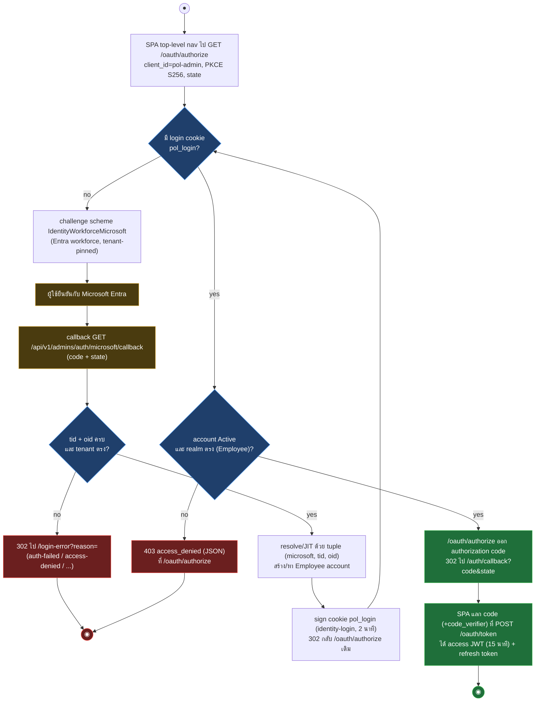
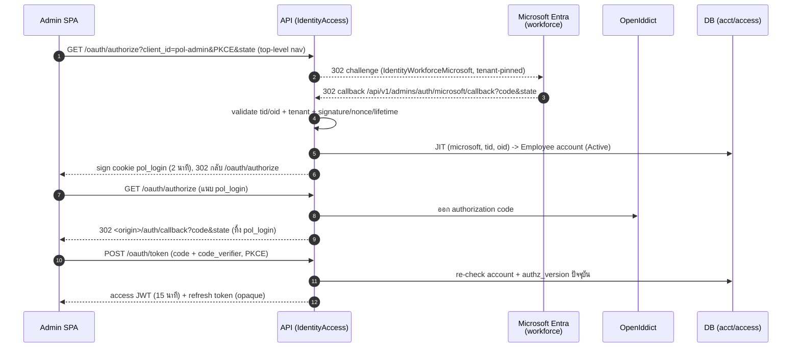
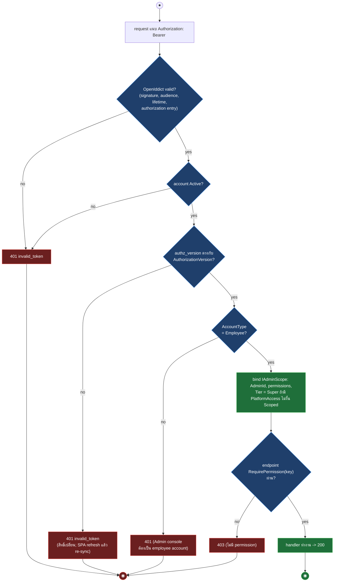
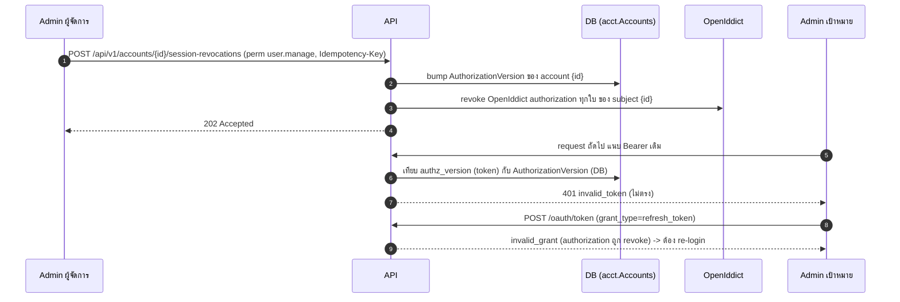

# Admins Module — Identity, Platform Token (Bearer) & RBAC Reference

> As-built 2026-09-17. Source: `src/Api/Api/IdentityAccess/*.cs` (login + token), `src/Api/Api/Admins/*.cs`,
> `Program.cs` (routes), `CorsExtensions.cs`; canonical data model:
> `src/Infrastructure/Modules/Accounts.Infrastructure/Persistence/AccountConfigurations.cs`,
> `src/Infrastructure/Modules/Access.Infrastructure/Persistence/AccessConfigurations.cs`,
> `src/Infrastructure/Persistence/Persistence.ControlPlane/Iam/*Configuration.cs`.
> สัญญาสำหรับทีม **admin console frontend** ที่ต่อกับ API นี้. แก้ auth/route/CORS เมื่อไหร่ update ไฟล์นี้ตามด้วย.
> ศัพท์/schema กลางดู [`ARCHITECTURE.md`](../../.ai/shared/ARCHITECTURE.md) ·
> [`rf1-schema-reset/design.md`](../../.ai/specs/rf1-schema-reset/design.md) (rename map เต็ม).
>
> ขอบเขต: เฉพาะ flow ของ admin console. merchant-user console เป็น **คนละกลไก**: ยังเป็น server-side OIDC BFF
> (cookie `__Host-mch_session` + `mch_csrf`, prefix `/api/v1/merchants/auth/{provider}/…`, scheme `MerchantUserMicrosoft`,
> config `MerchantAuth:Providers:*`, `MerchantSession:*`) ส่วน admin console ใช้ **platform JWT ใน `Authorization: Bearer`**
> ทางเดียว ไม่มี cookie/CSRF (legacy admin cookie stack ถูก retire 2026-09-14).
>
> **Microsoft-only OIDC:** ทั้งสอง plane รับเฉพาะ `microsoft` — Admin ใช้ workforce tenant (scheme
> `IdentityWorkforceMicrosoft`, config `IdentityAccess:Workforce:*`), merchant-user ใช้ CIAM tenant (scheme
> `MerchantUserMicrosoft`, config `MerchantAuth:Providers:Microsoft`). Google ถูก retire 2026-09-05: provider ที่ไม่ใช่
> Microsoft ที่ยังมี ClientId ฝั่ง merchant จะทำให้ boot guard throw นอก Development.

**Ports (dev):** API `https://localhost:5001` · Customer SPA `https://localhost:3000` · Admin Console
`https://localhost:3001` · Merchant-user Console `https://localhost:3002` (`Cors:AdminOrigins` /
`Cors:MerchantOrigins` ใน `appsettings.Development.json`)

**โมดูลในแผนที่แพลตฟอร์ม:** ดู [platform-modules.md](platform-modules.md) และ
[admin-control-plane.md](admin-control-plane.md) สำหรับ top-level admin operations.

## บทบาทหน้าที่

Admin คือ **Employee account (Tier 0 workforce)** ที่ทำงานบน admin console ฝั่งแพลตฟอร์ม มีหน้าที่ดูแลระบบข้าม
merchant เช่น provision merchant + PSP, จัดการบัญชี/สิทธิ์ (account, role, platform/merchant access), อนุมัติ
agent registration, ดู reporting และ governance/audit. Employee ต่างจาก actor อีกสองชนิดในระบบ:

| Actor | Tier | credential | console |
|---|---|---|---|
| **Employee** (admin) | Tier 0 (workforce) | platform JWT (Bearer) จาก OpenIddict | admin console |
| **Agent** (merchant staff) | Tier 1 (merchant side) | Microsoft CIAM OIDC | merchant/agent console (คนละกลไก, นอกเอกสารนี้) |
| **SYSTEM client** | — | `client_credentials` (private_key_jwt) | machine-to-machine API |

ตัวตนและสิทธิ์ของ admin **ไม่ได้อยู่ในโมดูล `Admins` แล้ว** โมดูล `Admins` เหลือเป็นชั้นบาง ๆ (glue) ต่อ request
เท่านั้น ได้แก่ `IAdminScope` (scope ที่ resolve สดต่อ request), `Tier` enum และ audit constants. ตัวตน สิทธิ์ และ
role จริงย้ายไป canonical model กลาง **3 โมดูล**:

- **Accounts** — ตัวตน (`Account`, `Employee`, `LoginAccount`, `Agent`, `SystemClient`)
- **Access** — การให้สิทธิ์เข้าถึง (`PlatformAccess` = สิทธิ์ระดับแพลตฟอร์ม, `MerchantAccess` = สิทธิ์ราย merchant)
- **Iam** — catalog กลางของ `Role` กับ `Permission`

Source: `src/Api/Api/IdentityAccess/PlatformTokenAuthentication.cs` (comment อธิบาย flow),
`src/Domain/Modules/Admins.Domain/Users/Tier.cs`, `src/Application/Modules/Admins.Application/IAdminScope.cs`.

## สถาปัตยกรรมการทำงาน

การทำงานของ admin แบ่งเป็น 3 ชั้น: (1) login ออก token, (2) ตรวจ token + bind scope ทุก request,
(3) authorization ต่อ endpoint.

### ชั้น 1 — Login (ออก platform JWT)

SPA เป็น OpenIddict public client (`pol-admin`, Authorization Code + PKCE). API เป็นฝ่ายคุยกับ Microsoft Entra
(confidential client) แล้วออก JWT ของแพลตฟอร์มเองให้ SPA — browser ไม่เคยถือ Microsoft token. ดูขั้นตอนข้อความ
เต็มที่ [หลักการ](#หลักการ-อ่านก่อนเขียนโค้ด).





### ชั้น 2 — ตรวจ token + bind scope ทุก request

ทุก request ที่แนบ `Authorization: Bearer` ถูกตรวจด้วย scheme `PlatformToken`: route policy `admin`/`dual-console`
มาถึง scheme นี้ผ่าน policy scheme `ConsoleSession` (forward เมื่อ audience เป็น Admin) ส่วน route policy
`identity-platform` (`/me*`, logout) ใส่ scheme `PlatformToken` ตรง. handler ห่อ OpenIddict validation แล้วตรวจซ้ำต่อ
request ว่า account ยัง Active และ `authz_version` ใน token ตรงกับ `AuthorizationVersion` ปัจจุบันใน DB — ถ้าไม่ตรง
ปฏิเสธ 401. เฉพาะ route audience Admin เท่านั้นที่บังคับ bind `IAdminScope` (ต้องเป็น `AccountType.Employee` ไม่งั้น
401) (source: `PlatformTokenAuthentication.cs:43-109`, `TryBindAdminScopeAsync` ที่ `:84`).

หมายเหตุ: activity ด้านล่างเป็น flow ของ route policy `admin` (มีขั้น `RequirePermission`); route policy
`identity-platform` ใช้เส้นทางเดียวกันถึงขั้น bind scope แต่ไม่มีขั้น `RequirePermission`.



### ชั้น 3 — Authorization ต่อ endpoint

route ของ admin ใช้ **สอง policy**:

- **`identity-platform`** — สำหรับ context ของ caller เอง: `GET /api/v1/me`, `/me/access`, `/me/merchants`,
  `/me/sessions`, `POST /api/v1/auth/logout`. ต้องมี token valid + account Active เท่านั้น ไม่ต้องมี permission
  (source: `IdentityAccessWiring.cs:103`)
- **`admin`** + `RequirePermission(key)` — สำหรับ action ที่แตะข้อมูลคนอื่น/ระบบ: `/api/v1/accounts*`, `/roles*`,
  `/permissions`, `/system-clients*`. filter อ่าน `IAdminScope.Current.Permissions` แบบ fail-closed และ boot-time
  ตรวจ parity ว่าทุก key ที่ gate อยู่ใน catalog และ side ตรง policy (source: `ConsoleSessionAuthentication.cs`,
  `PermissionAuthorization.cs:86,153`)

การเพิกถอน session ของ admin คนอื่น (`POST /accounts/{id}/session-revocations`, perm `user.manage`, ต้องส่ง
`Idempotency-Key`) ทำ **สองอย่างในคำสั่งเดียว**: bump `AuthorizationVersion` ของ account เป้าหมาย และ revoke
OpenIddict authorization ทุกใบของ subject นั้น. token เดิมจึงถูกปฏิเสธ 401 ที่ request ถัดไปทันที (ไม่ต้องรอหมดอายุ)
และ refresh ก็ใช้ต่อไม่ได้ (`invalid_grant`) ผู้ใช้ต้อง login ใหม่ (source: `IdentityAccessStore.cs:406-421`,
handler `CanonicalAccessEndpoints.cs:152` คืน `202 Accepted`).



## หลักการ (อ่านก่อนเขียนโค้ด)

Admin console มี credential เดียวคือ **employee platform token** (JWT) ที่ API ออกให้ผ่าน OpenIddict. SPA เป็น
**OpenIddict public client** (`client_id` = `IdentityAccess:WorkforceClientId`, default `pol-admin`) ใช้
Authorization Code + PKCE (S256). FE **ไม่** แตะ Microsoft โดยตรง และ **ไม่** ถือ Microsoft id_token — การยืนยันกับ
Entra ทำที่ API (confidential client) แล้ว API ออก token ของแพลตฟอร์มเองให้ SPA.

Flow login:

1. SPA นำ browser ไป (top-level navigation) ที่ `GET /oauth/authorize?client_id=pol-admin&response_type=code&redirect_uri=<origin>/auth/callback&code_challenge=…&code_challenge_method=S256&state=…`
2. API ไม่มี login cookie → challenge scheme `IdentityWorkforceMicrosoft` (Microsoft Entra workforce, tenant-pinned Authority,
   Authorization Code + PKCE + state + nonce ฝั่ง API)
3. ผู้ใช้ยืนยันกับ Microsoft → Microsoft redirect กลับ `/api/v1/admins/auth/microsoft/callback` (redirect URI ที่ register บน Entra app)
4. callback ตรวจ signature/issuer/audience/nonce/lifetime, บังคับ `tid`/`oid` อย่างละหนึ่งค่าและ exact tenant แล้ว
   resolve/JIT ด้วย exact tuple `(microsoft, tid, oid)` (`IdentityBffLoginService`) จากนั้น sign in cookie `pol_login`
   อายุ 2 นาที (scheme `identity-login`) แล้วส่ง browser กลับไป `/oauth/authorize` request เดิม
5. `/oauth/authorize` ออก authorization code แล้ว redirect ไป `<origin>/auth/callback?code=…&state=…`; cookie `pol_login` ถูกทิ้ง
6. SPA แลก code (+ `code_verifier`) ที่ `POST /oauth/token` ได้ **access JWT** (อายุ `IdentityAccess:AccessTokenMinutes` = 15 นาที) +
   **refresh token** (opaque, อายุ `IdentityAccess:RefreshTokenMinutes` = 480 นาที prod / 1440 dev, ออกใหม่อายุเต็มทุกครั้งที่ refresh
   → session slide ขณะใช้งาน)
7. ทุก API call แนบ `Authorization: Bearer <access JWT>`; ก่อนหมดอายุหรือเมื่อได้ 401 ให้ refresh (`grant_type=refresh_token`)

ไม่มี admin session cookie, ไม่มี CSRF header และไม่มี `credentials: 'include'` บน route admin อีกต่อไป.

## Platform token กับ Admin scope

route ที่ใช้ policy `admin` และ `dual-console` ผ่าน policy scheme `ConsoleSession` ซึ่ง forward audience Admin ไป scheme
`PlatformToken` (`src/Api/Api/IdentityAccess/PlatformTokenAuthentication.cs`): ห่อ OpenIddict validation (signature,
audience, lifetime, token/authorization entry) แล้วตรวจต่อ request ว่า account ยัง Active และ `authz_version` ใน token ตรงกับ
`AuthorizationVersion` ปัจจุบัน ถ้าไม่ตรง → 401 `invalid_token` (SPA refresh แล้ว version จะ re-sync). ไม่มี cookie fallback.

`IAdminScope` ถูก bind จาก authorization snapshot ของ Employee account: `AdminId` = `AccountId`, `permissions` = permission
ของ platform role, platform access = tier `Super` (เห็นทุก merchant) ส่วน employee ที่ไม่มี platform access เป็น `Scoped`
ตาม `MerchantAccess` ที่ Active. SYSTEM client และ account ที่ไม่ใช่ Employee ไม่ bind จึงเข้า admin console ไม่ได้.

Canonical commerce authorization ใช้ `Accounts.Domain.Account` และ `Access.Domain` แยกต่างหาก: `Employee` มี `PlatformAccess`,
`Agent` ผูก Sale/Branch owner, `System` ใช้ client assertion และ scope. `GET /api/v1/accounts...` กับ merchant/platform-access
routes จึงไม่ใช่ alias ของ `/api/v1/admins...` และไม่ควรใช้ `AdminId` เป็น `CreatedByAccountId` ใน canonical Order.

Order/transaction support ที่เปิดให้ Admin console ต้องตรวจ `IAdminScope` และ Account/Order parent ตาม endpoint; Admin tier ให้ขอบเขต
merchant ส่วน IAM permission/Account Access ให้ action และ business visibility.

Tier 0 ใช้ immutable tuple `Provider=microsoft`, validated tenant `tid` และ canonical directory object `oid`.
Email เป็น optional non-unique contact อาจ absent, mutable, reused หรือซ้ำกันได้ Runtime ไม่ fallback ไป Email,
UPN, `preferred_username`, `WorkforceEmailKey` หรือ `EmployeeId` และไม่อ่าน `roles` เพื่อให้สิทธิ์ Unknown exact tuple
สร้าง roleless Scoped JIT account Existing Admin ถูก offline-map หรือ pre-bound invite ก่อน login ไม่มี runtime bind
ด้วย Email.

## Token lifetime และ revocation

| รายการ | ค่า/พฤติกรรม |
|---|---|
| access JWT | 15 นาที (`IdentityAccess:AccessTokenMinutes`); authorization ถูก re-check จาก DB ทุก request |
| refresh token | 480 นาที prod, 1440 dev (`IdentityAccess:RefreshTokenMinutes`); ออกใหม่อายุเต็มทุกครั้งที่ refresh |
| logout | `POST /api/v1/auth/logout` (Bearer) revoke OpenIddict authorization ของ login นี้ → access + refresh ใช้ต่อไม่ได้ทันที |
| sessions ของตัวเอง | `GET /api/v1/me/sessions` (หนึ่งรายการต่อ login, ไม่มี token material) / `DELETE /api/v1/me/sessions/{sessionId}` |
| revoke token ของ admin คนอื่น | `POST /api/v1/accounts/{accountId}/session-revocations` (permission `user.manage`) bump `AuthorizationVersion` ของ account → token เดิมถูกปฏิเสธ 401 ที่ request ถัดไปเพราะ `authz_version` ไม่ตรง (ดู [`iam.md`](iam.md)) |

- `OAuth:Issuer` ต้อง pin เป็น public origin ของ API (dev `https://localhost:5001`): ถ้าไม่ pin OpenIddict derive issuer จาก host
  ของแต่ละ request → code/token ที่ออกผ่าน proxy ถูกปฏิเสธ (`invalid_grant`/401) เมื่อเรียกตรง และกลับกัน
- JavaScript ถือ token ได้ จึงมี XSS reach ที่ httpOnly cookie ไม่มี; ขอบที่คงไว้คือ PKCE, token/authorization entry validation,
  re-check `AuthorizationVersion` ทุก request และอายุ access token 15 นาที

## Proxy / origin

Bearer ไม่ผูกกับ origin จึง **ไม่บังคับ** same-origin proxy อีกต่อไป แต่ต้องคง 2 เงื่อนไข:

- `/oauth/authorize` เป็น top-level navigation (ไม่ต้อง CORS); `POST /oauth/token` และ `/oauth/revoke` ถูกเรียกจาก JavaScript
  → CORS policy dual-console ครอบให้แล้ว (`IsDualConsole` ใน `CorsExtensions.cs`) origin ของ SPA ต้องอยู่ใน `Cors__AdminOrigins`
- ทุก request ที่แตะ `/oauth/*` และ API ต้องไปถึง API ด้วย host เดียวกับ `OAuth:Issuer` (ผ่าน proxy ก็ได้ แต่ห้ามสลับ host ระหว่าง
  authorize/token/API call)

ถ้ายังใช้ Next.js proxy (`rewrites`) ให้ครอบ `/oauth/:path*`, `/api/v1/:path*` และ area ของ
admin control plane (`/api/v1/{originators,payments,reports,approvals,audits,api-clients,webhooks,notifications}/:path*`)
เหมือนเดิม; backend honor `X-Forwarded-Host` (`UseForwardedHeaders`) แล้ว. เครื่อง dev ต้อง trust ASP.NET Core HTTPS
certificate (`dotnet dev-certs https --trust`) ก่อนให้ Next.js proxy ไป `:5001`; ถ้า Node.js ยังไม่อ่าน system CA ให้รัน frontend
ด้วย `NODE_OPTIONS=--use-system-ca`.

## Setup ฝั่ง FE

- **ไม่** ต้องขอ Microsoft token ใน browser และ **ไม่** ต้องโหลด MSAL/GIS script. Entra client id + secret เป็นของ server
  (confidential client, ฉีดผ่าน `IdentityAccess__Workforce__ClientId` / `IdentityAccess__Workforce__ClientSecret`)
- SPA ต้องรู้แค่ `client_id=pol-admin`, redirect URI `<origin>/auth/callback` (API register ให้ OpenIddict public client ตอน boot
  จาก `IdentityAccess:WorkforceWebAppBaseUrl`) และ PKCE
- ปุ่ม "Sign in with Microsoft" = สร้าง `code_verifier`/`state` แล้ว redirect (top-level) ไป `/oauth/authorize`
- หน้า `/auth/callback` แลก code ที่ `POST /oauth/token` (`application/x-www-form-urlencoded`) แล้วเก็บ access/refresh token ใน memory
  ของ SPA; ทุก API call แนบ `Authorization: Bearer`
- หน้า `/login-error?reason=<label>` รับ redirect เมื่อ login ที่ Entra/JIT ล้มเหลว (ดู Error model)
- admin SPA origin ต้องอยู่ใน `Cors__AdminOrigins` ฝั่ง server

```js
// เริ่ม login (PKCE)
const verifier = randomBase64Url(32); sessionStorage.setItem('pkce', verifier)
const challenge = base64Url(await sha256(verifier))
location.href = '/oauth/authorize?' + new URLSearchParams({
  client_id: 'pol-admin', response_type: 'code', redirect_uri: location.origin + '/auth/callback',
  code_challenge: challenge, code_challenge_method: 'S256', state: randomBase64Url(16),
})
```

## CSRF

**ไม่มี** บน route admin: Bearer header ไม่ถูก browser แนบข้าม site เอง จึงไม่ต้องมี double-submit token. CSRF ยังมีเฉพาะ
merchant-user console (`mch_csrf`) และ route `dual-console` จะบังคับ audience CSRF เฉพาะเมื่อ caller เป็น merchant cookie —
Bearer ผ่านโดยไม่ต้องส่งอะไรเพิ่ม.

## ขั้นแรกหลัง login: `GET /api/v1/me`

หลัง SPA ได้ access token แล้ว ยิง `GET /api/v1/me` (identity + `merchantContext`) และ `GET /api/v1/me/access`
(permission set + merchant access ของ token นี้) ด้วย Bearer. First-login JIT ฝั่ง server สร้าง `acct.Accounts`
(`Employee`, `Active`) แบบไม่มี platform access / merchant access — FE ไม่ต้องส่งอะไรพิเศษ; employee ที่ยังไม่ได้รับ
platform access หรือ merchant access จะ 403 บน route ที่ต้องใช้สิทธิ์.

```js
async function bootstrap() {
  const res = await api('/api/v1/me');
  if (res.status === 401) return login(location.pathname);  // token หมด/ถูก revoke และ refresh ไม่สำเร็จ -> re-login
  const me = await res.json();          // { accountId, accountType: "Employee", displayName, merchantContext }
  const access = await (await api('/api/v1/me/access')).json();
  return { me, access };
}
```

## Endpoints

legacy admin identity plane (`/api/v1/admins/**` ทั้ง 20 route, ตาราง `admin.Users`/`MerchantAccess`/`RoleAssignments`/
`AuthAudits`/`Workforce*`, tool `WorkforceIdentityMigrator`) ถูก retire 2026-09-14 ทุก route ตอบ `404` และไม่อยู่ใน
OpenAPI อีก (`RetiredCommerceRoutesTests`) canonical surface ตาม `.ai/specs/platform-restructure-v1/api-scope.json`:

| งานเดิม (`/api/v1/admins/...`) | canonical | permission |
|---|---|---|
| `GET /admins/me` | `GET /api/v1/me`, `GET /api/v1/me/access` | policy `admin` |
| `GET /admins`, `GET /admins/{id}` | `GET /api/v1/accounts`, `GET /api/v1/accounts/{accountId}` (SFS, ETag = `AuthorizationVersion`) | `user.manage` |
| `POST /admins` (pre-provision) | ไม่มี — employee login ก่อน (JIT) แล้วค่อย assign | — |
| `POST .../suspend`, `.../reactivate`, `.../tier` | `PATCH /api/v1/accounts/{accountId}` (`status` = `Active`/`Suspended`; suspend ตัวเอง = 403) + `PUT /api/v1/accounts/{accountId}/platform-access` (`status` `Active`/`Revoked` = tier Super/Scoped) | `user.manage` |
| `POST/DELETE .../merchants/{merchantId}` | `PUT/DELETE /api/v1/accounts/{accountId}/merchant-access/{merchantId}` | `user.manage` |
| `PUT .../roles`, `GET .../effective-permissions` | `PUT/GET /api/v1/accounts/{accountId}/platform-access` (`roleIds`) | `user.manage` |
| `GET /admins/permissions` | `GET /api/v1/permissions` | `user.roles` |
| `GET/POST /admins/roles`, `GET/PUT /admins/roles/{code}` | `GET/POST /api/v1/roles`, `GET/PUT /api/v1/roles/{roleId}` (roleId ไม่ใช่ code; ไม่มี DELETE) | `user.roles` |
| `.../merchants/users/{id}/registrations`, `approve`, `reject` | `GET /api/v1/agent-registrations/{id}/attempts`, `POST .../attempts/{attemptId}/approve|reject` | ดู `merchants.md` |

ทุก mutation บน `/accounts/*` ต้องส่ง `If-Match` (ETag จาก GET) และ `Idempotency-Key`; source:
`src/Api/Api/IdentityAccess/CanonicalAccessEndpoints.cs`.

### Admin control plane

- `POST /api/v1/merchants` (provision merchant + PSP connection) — `Tier.Super` (= มี platform access active);
  caller ถูก re-verify ใน transaction ผ่าน `acct.Accounts.AuthorizationVersion` + `access.PlatformAccess`
- payments/provider/merchant configuration, governance, notifications, reporting: ดู [`api-endpoints.md`](api-endpoints.md)

## Logout

```js
async function logout() {
  await api('/api/v1/auth/logout', { method: 'POST' }); // revoke authorization ของ login นี้ (ทุก token ของ login นี้ตาย)
  clearTokens();                                          // ทิ้ง access/refresh ใน memory
  login();                                                // กลับไปหน้า sign-in
}
```

ออกจากทุกอุปกรณ์: list `GET /api/v1/me/sessions` แล้ว `DELETE /api/v1/me/sessions/{sessionId}` ทีละรายการ.

## Redirect หลัง login

ไม่มี `returnTo` และไม่มี allowlist ฝั่ง server แล้ว: `/oauth/authorize` redirect ได้เฉพาะ `redirect_uri` ที่ตรงกับที่ register ไว้กับ
OpenIddict public client (`<IdentityAccess:WorkforceWebAppBaseUrl>/auth/callback`) และ SPA เป็นคนพา user กลับหน้าเดิมเองผ่าน `state`
(หรือ `sessionStorage`). `AdminSession` config เหลือแค่ `WebAppBaseUrl` (origin ของ SPA สำหรับ host ใช้นอก auth) และ
`ScalarBaseUrl` (Scalar UI, Development เท่านั้น).

## Error model

ทุก error เป็น RFC7807 ProblemDetails — `Content-Type: application/problem+json`, มี `title` + `status`.

| Status | ความหมาย | FE ทำอะไร |
|---|---|---|
| 401 | ไม่มี/หมดอายุ/ถูก revoke Bearer, หรือ `authz_version` ไม่ตรง (สิทธิ์เปลี่ยน) | refresh ที่ `POST /oauth/token`; ถ้า refresh ได้ `invalid_grant` -> login ใหม่ที่ `/oauth/authorize` |
| 403 | token valid แต่: account suspended / ไม่ active / tier ไม่พอ / ไม่มี permission | "ไม่มีสิทธิ์" |
| 404 | merchant นอก scope หรือไม่มีจริง (กัน existence leak) | not-found |
| 409 | duplicate (code / assignment ซ้ำ) | conflict |
| 400 | body ผิด format | validation error |

> login ที่ล้มเหลวก่อนได้ code (protocol/state/code exchange/signature/issuer/audience/nonce/lifetime ผิด,
> `tid`/`oid` missing/duplicate/malformed, tenant mismatch, suspended หรือ eligibility denial) server redirect ไป
> `<IdentityAccess:WorkforceWebAppBaseUrl>/login-error?reason=<label>` (ไม่ใช่ JSON): `auth-failed` (remote/protocol failure),
> `access-denied` (user ยกเลิกที่ Entra) หรือ code ของ `IdentityAccessException` ที่แทน `_` ด้วย `-` เช่น
> `workforce-not-eligible`, `account-suspended` — reason ไม่มี claim, Email หรือ EmployeeId.

## helper รวม (adminApi.js)

```js
// lib/adminApi.js — token อยู่ใน memory ของ SPA; ไม่มี cookie/CSRF
let access = null, refresh = null

export function login() { /* สร้าง PKCE แล้ว redirect ไป /oauth/authorize (ดู Setup ฝั่ง FE) */ }

async function token(params) {
  const res = await fetch('/oauth/token', {
    method: 'POST', headers: { 'Content-Type': 'application/x-www-form-urlencoded' },
    body: new URLSearchParams({ client_id: 'pol-admin', ...params }),
  })
  if (!res.ok) return false
  ;({ access_token: access, refresh_token: refresh } = await res.json())
  return true
}

export const exchangeCode = (code) =>
  token({ grant_type: 'authorization_code', code, code_verifier: sessionStorage.getItem('pkce'),
          redirect_uri: location.origin + '/auth/callback' })

export async function adminFetch(path, opts = {}, retried = false) {
  const res = await fetch(path, { ...opts, headers: { ...opts.headers, Authorization: 'Bearer ' + access } })
  if (res.status !== 401 || retried) return res
  if (refresh && await token({ grant_type: 'refresh_token', refresh_token: refresh })) return adminFetch(path, opts, true)
  login() // refresh ไม่ผ่าน -> re-login
  return res
}

export const logout = () => adminFetch('/api/v1/auth/logout', { method: 'POST' })
```

## ห้าม

- อย่าขอ Microsoft token/MSAL ใน browser หรือส่ง Microsoft id_token มาที่ API — API รับเฉพาะ platform JWT ที่ออกจาก `/oauth/token`
- อย่าเก็บ token ลง `localStorage`/cookie ที่ script อื่นอ่านได้; เก็บใน memory และ refresh ด้วย refresh token
- อย่าเรียก `/api/v1/admins/auth/microsoft/callback` ตรง ๆ หรือนำ authorize URL เก่ามาใช้ซ้ำ (code/state ใช้ครั้งเดียว)

## Dev / CORS

- API เดียว serve ทั้ง 2 console, **CORS แยก policy**: admin = `Cors__AdminOrigins` (dev `https://localhost:3001`),
  merchant-user = `Cors__MerchantOrigins` (dev `https://localhost:3002`, เป็น default policy, credentialed เพราะยังเป็น cookie).
  เลือก policy **ตาม path** ผ่าน `PolCorsPolicyProvider` ไม่ใช่ตาม origin. path table (`IsAdminPlane`) ครอบ admin-plane area
  อื่นด้วย (`/approvals`, `/audits`, `/originators`, `/products/documents`, `/orders/export`, `/api-clients`,
  `/notifications`, `/reports`) ไม่ใช่แค่ `/accounts`/`/merchants`; `/oauth/token`, `/oauth/revoke`, `/api/v1/me*` และ
  `/api/v1/auth/logout` อยู่ใน dual-console policy (ทั้งสอง SPA เรียกจาก JavaScript). prod ต้องตั้ง origin จริง — ไม่ตั้ง = block ทุก cross-origin
- admin XHR ส่ง `Authorization: Bearer` ไม่ต้อง `credentials: 'include'`
- backend dev ต้องใส่ Entra client id + secret จริงที่ `IdentityAccess__Workforce__ClientId` /
  `IdentityAccess__Workforce__ClientSecret` (user-secrets หรือ `.env`), tenant-pinned `IdentityAccess__Workforce__Authority`,
  `IdentityAccess__WorkforceTenantId`/`WorkforceIssuer`/`WorkforceAudience`, `IdentityAccess__WorkforceWebAppBaseUrl` และ
  `OAuth__Issuer=https://localhost:5001` ถึงจะ login จริงได้ (ดู [local-dev-run.md](../runbooks/local-dev-run.md) §7).
- bootstrap Super ไม่ใช้ external allowlist; promote corporate account ผ่าน admin management API ก่อน production.
- ตาราง `admin.WorkforceTenantBindings` ถูก retire 2026-09-14; tenant pin มาจาก config `IdentityAccess:WorkforceTenantId`
  ที่ต้องตรงกับ tenant ใน `IdentityAccess:Workforce:Authority` (`Program.cs` `RequireWorkforceAdminProvider`). Authority ยัง
  pin tenant เดียว Triple identity index ไม่ใช่ multi-tenant admission; ต้องมี approved tenant registry/allowlist design
  ก่อนรับ tenant ที่สอง.
- OpenAPI document เปิดเฉพาะ Development (`/openapi/...`) — prod ไม่ publish; document `admin` โฆษณา security scheme
  `PlatformToken` (http bearer JWT)

**backend ทำให้แล้ว (FE ไม่ต้องแตะ):**
- CORS allow `https://localhost:3001`
- honor `X-Forwarded-Host` (`UseForwardedHeaders`)
- register OpenIddict public client `pol-admin` + redirect URI `<WorkforceWebAppBaseUrl>/auth/callback` ตอน boot
- Microsoft redirect URI registration ของ `/api/v1/admins/auth/microsoft/callback` (ฝั่ง ops/backend)

## prod

topology เดียวกัน; `OAuth__Issuer` ต้องเป็น public origin ของ API และ `IdentityAccess__WorkforceWebAppBaseUrl` เป็น origin ของ SPA
(prod compose ป้อนจาก `ADMIN_ENTRA_*` + `ADMIN_FRONTEND_ORIGIN` ดู [deploy-self-host.md](../runbooks/deploy-self-host.md) §5.2).
FE code ไม่ต้องเปลี่ยน.

## ข้อมูลใน database (table / field)

ทุก entity ระบุ schema เอง (ไม่มี default `dbo`; `SchemaNames.cs`). ข้อมูลที่ admin ใช้กระจายใน 4 schema:
`acct` (ตัวตน), `access` (การให้สิทธิ์), `iam` (catalog RBAC) และ `admin` (audit ของ control plane).
ตารางด้านล่างเก็บ column สำคัญ/PK/FK/concurrency token ไม่ครบทุก column — ดู field เต็มที่ EF configuration ที่อ้างไว้.

### schema `acct` — ตัวตน (`AccountConfigurations.cs`)

| Table | column สำคัญ | ใช้ตอนไหน |
|---|---|---|
| `acct.Accounts` | `Id` (PK), `AccountType` (1=Employee/2=Agent/3=System), `Status` (Active/Suspended), **`AuthorizationVersion`** (concurrency token), `DisplayName` | ตัวตนกลาง; `AuthorizationVersion` คือ field ที่ token ทุกใบ re-check ต่อ request และใช้เพิกถอน session (`:12`) |
| `acct.LoginAccounts` | `AccountId`, `Provider`/`TenantId`/`ExternalUserId` (unique tuple), `Email` (non-unique) | resolve/JIT ตอน login ด้วย tuple `(microsoft, tid, oid)`; Email เป็น contact ไม่ใช้ให้สิทธิ์ (`:30`) |
| `acct.Employees` | `AccountId` (PK), `EmployeeCode` (unique filtered), `DepartmentCode`, `Metadata` (json) | ข้อมูลเฉพาะ Employee; PlatformAccess FK ชี้มาที่นี่ (`:49`) |
| `acct.SystemClients` | `ClientId` (unique), `MerchantId`, `Status`, `AllowedGrantTypes` (= `client_credentials`) | จัดการผ่าน `/api/v1/system-clients*` (`:78`) |

### schema `access` — การให้สิทธิ์ (`AccessConfigurations.cs`)

| Table | column สำคัญ | ใช้ตอนไหน |
|---|---|---|
| `access.PlatformAccess` | `EmployeeAccountId` (unique, FK -> `acct.Employees`), `Status`, `Version` (concurrency) | มี row Active = admin เป็น Tier **Super** (เห็นทุก merchant); ไม่มี = **Scoped** (`:69`) |
| `access.PlatformAccessRoles` | `PlatformAccessId`, `RoleId`, `RoleScope` (CHECK 1/3 = Platform/Shared) | ผูก platform role ให้ admin (`:87`) |
| `access.MerchantAccess` | `AccountId`, `MerchantId`, `DataScope` (1-4), `Status`, `Version` | ขอบเขต merchant ของ admin ที่เป็น Scoped (unique `(AccountId,MerchantId)` filtered Active) (`:12`) |
| `access.AccessRoles` | `MerchantAccessId`, `MerchantId`, `RoleId` (FK -> MerchantAccess) | ผูก merchant role ราย merchant access (`:33`) |

### schema `iam` — catalog RBAC (`RoleConfiguration.cs`, `PermissionConfiguration.cs`)

| Table | column สำคัญ | ใช้ตอนไหน |
|---|---|---|
| `iam.Roles` | `Id` (PK), `Code`, `Name`, `Status`, `Version` (concurrency), **`Scope`** (Platform/Merchant/Shared), `MerchantId` (nullable) | catalog role กลาง; CHECK บังคับ Platform/Shared ต้อง `MerchantId` NULL; unique `(MerchantId,Code)` (`RoleConfiguration.cs:18`) |
| `iam.RolePermissions` | `RoleId`, `PermissionKey` (unique คู่, FK cascade) | permission ที่ role หนึ่งมี (`RoleConfiguration.cs:41`) |
| `iam.Permissions` | `Key` (PK), `GroupKey`, `Name`, `Status`, `SortOrder` | catalog permission key เช่น `user.manage`, `user.roles` (`PermissionConfiguration.cs:30`) |
| `iam.PermissionGroups` | `Key` (PK), `Scope`, `Name`, `SortOrder` | จัดกลุ่ม permission ตาม side (`PermissionConfiguration.cs:16`) |

### schema `admin` — เหลือเฉพาะ audit ของ control plane

| Table | บทบาท |
|---|---|
| `admin.UserAudits` | audit log แบบ append-only ของ admin action (`AuditConfiguration.cs:16`) |
| `admin.ProvisioningOperations` | บันทึก provisioning operation (`ProvisioningOperationConfiguration.cs:19`) |

ตาราง legacy ของ admin identity plane (`admin.Users`, `admin.MerchantAccess`, `admin.RoleAssignments`,
`admin.AuthAudits`, `admin.WorkforceTenantBindings`) ถูก drop แล้วใน migration
`20260914111802_RetireLegacyAdminIdentityPlane` — ปัจจุบันข้อมูลตัวตน/สิทธิ์ทั้งหมดอยู่ที่ `acct`/`access`/`iam`.

## Source of truth

- employee login (Entra challenge, callback JIT, `pol_login`, login-error redirect): `src/Api/Api/IdentityAccess/IdentityAccessWiring.cs`
- OAuth endpoints (`/oauth/authorize`, `/oauth/token`, `/api/v1/auth/logout`, `/api/v1/me/sessions`):
  `src/Api/Api/IdentityAccess/IdentityAccessEndpoints.cs`; OpenIddict public client registration:
  `src/Api/Api/IdentityAccess/WorkforceClientRegistration.cs`
- Bearer scheme + `IAdminScope` binding: `src/Api/Api/IdentityAccess/PlatformTokenAuthentication.cs`; policy scheme
  `ConsoleSession`: `src/Api/Api/Iam/ConsoleSessionAuthentication.cs`; options: `src/Api/Api/IdentityAccess/IdentityAccessOptions.cs`
- production boot guard: `ProvisioningGuards.RequireWorkforceAdminProvider` ใน `src/Api/Api/Program.cs`
- admin console origins (`AdminSession:WebAppBaseUrl`/`ScalarBaseUrl`): `src/Api/Api/Admins/AuthOptions.cs`
- routes (`/api/v1/merchants` provisioning): `src/Api/Api/Program.cs`
- top-level admin control routes: `src/Api/Api/ControlPlane/AdminControlEndpoints.cs`,
  `src/Api/Api/ControlPlane/AdminMerchantIdentityEndpoints.cs`
- governance/approval/audit: `src/Api/Api/Governance/GovernanceEndpoints.cs`
- API clients/secrets: `src/Api/Api/Iam/ApiClientEndpoints.cs`
- webhook/notification delivery: `src/Api/Api/Notifications/DeliveryEndpoints.cs`,
  `src/Api/Api/Webhooks/InboundWebhookEndpoints.cs`
- reporting/transaction projection: `src/Api/Api/Reporting/AdminReportingEndpoints.cs`
- OpenAPI audience documents: `src/Api/Api/OpenApiDocuments.cs`
- CORS split + path-based policy selection: `src/Api/BuildingBlocks.Web/CorsExtensions.cs`
- tier enum: `src/Domain/Modules/Admins.Domain/Users/Tier.cs` (CLR name `Tier` ไม่ใช่ `AdminTier` แล้ว)
- accessible-merchants value object: `src/Application/Modules/Admins.Application/Users/AccessibleMerchants.cs`
- canonical business identity/access: `src/Api/Api/IdentityAccess/CanonicalAccessEndpoints.cs`, `src/Application/Modules/Accounts.Application/IdentityAccessContracts.cs`, `src/Domain/Modules/Access.Domain/AccessModels.cs`
- EF configuration ของ schema: `src/Infrastructure/Modules/Accounts.Infrastructure/Persistence/AccountConfigurations.cs` (`acct`),
  `src/Infrastructure/Modules/Access.Infrastructure/Persistence/AccessConfigurations.cs` (`access`),
  `src/Infrastructure/Persistence/Persistence.ControlPlane/Iam/{RoleConfiguration,PermissionConfiguration}.cs` (`iam`)
- schema map: `src/Infrastructure/BuildingBlocks.Infrastructure/Persistence/SchemaNames.cs`
