# Entity Field Reference (persisted model)

> Generated 2026-07-26 from `PolDbContextModelSnapshot.cs` (the authoritative EF model) + the entity
> configurations under `src/Persistence/Persistence.{ControlPlane,MerchantUsers,MerchantRuntime}/**/`,
> the domain entities/enums (XML doc = ที่มาของช่องหมายเหตุ), raw-SQL migrations (grant matrix / check
> constraints / seed) และ `docker/bootstrap/seed-demo.sql` + `Iam.Domain/Permissions/Keys.cs`
> (= ที่มาของช่องตัวอย่าง). ครอบคลุม **42 ตาราง** ใน 7 schema. แก้ entity/migration เมื่อไหร่ regenerate
> ไฟล์นี้ตามด้วย.
>
> ขอบเขต: เฉพาะ entity ที่ persist ลง DB. Value object ที่ไม่มีตารางของตัวเอง (`Money` = `Amount:decimal` +
> `Currency:string`) ถูก map เป็นคอลัมน์คู่ของ entity เจ้าของ (เช่น `UnitPriceAmount`/`UnitPriceCurrency`).
>
> **เพิ่มเมื่อ 2026-07-30**: เติมชั้นคำอธิบายเชิงลึก (deep-dive) ให้ครบทุกตาราง — ย่อหน้า
> "ภาพรวมสำหรับคนที่ไม่ใช่ developer" ก่อนเข้าเนื้อหา, ER diagram ต่อ schema, block 4 หัวข้อ
> (**คืออะไร**/**บทบาท**/**ถ้าไม่มีตารางนี้จะพังยังไง**/**ทำงานยังไง**) ต่อทุกตาราง, ตัวอย่าง flow จริง
> ข้ามตาราง 6 อัน และ FAQ ปิดท้าย. ชั้นนี้เป็น**คำอธิบายเพิ่ม ไม่ใช่แหล่งข้อมูล field ใหม่** — field/type/key
> ยังคง generate จาก source เดิมด้านบนเสมอ ถ้าตารางไหนขัดกับ deep-dive ให้เชื่อตาราง field เป็นหลัก
> แล้วแจ้งแก้ deep-dive ตาม.

## สารบัญ

หา field ของตารางใดตารางหนึ่งเร็วๆ ให้ **Ctrl+F หาชื่อ `schema.Table`** (ทุกตารางมี header รูปแบบคงที่
`### <Entity> -> \`schema.Table\``) — TOC ด้านล่างลิสต์แค่ระดับหัวข้อใหญ่ ลิงก์เป็น best-effort ถ้ากดแล้วไม่ตรง
ให้ scroll/ค้นหาแทน.

- [ภาพรวมสำหรับคนที่ไม่ใช่ developer](#ภาพรวมสำหรับคนที่ไม่ใช่-developer)
- [Legend](#legend)
- [Schema map](#schema-map-7-schemas--schemanamescs)
- [admin schema](#admin-schema-context-controlplane--7-ตาราง) — 7 ตาราง
- [iam schema](#iam-schema-context-controlplane--4-ตาราง) — 4 ตาราง
- [cfg schema](#cfg-schema-context-controlplane--4-ตาราง) — 4 ตาราง
- [dbo schema](#dbo-schema-context-controlplane--1-ตาราง) — 1 ตาราง
- [merch schema](#merch-schema--12-ตาราง-8--merchantusers-4--merchantruntime) — 12 ตาราง
- [shop schema](#shop-schema-context-merchantruntime--10-ตาราง) — 10 ตาราง
- [txn schema](#txn-schema-context-merchantruntime--4-ตาราง) — 4 ตาราง
- [Schema objects beyond tables](#schema-objects-beyond-tables)
- [Enums](#enums)
- [ตัวอย่าง flow จริงข้ามตาราง](#ตัวอย่าง-flow-จริงข้ามตาราง) — F1-F6
- [คำถามที่พบบ่อย](#คำถามที่พบบ่อย)

---

## ภาพรวมสำหรับคนที่ไม่ใช่ developer

**ระบบนี้ทำอะไร**: pol-core เป็นแพลตฟอร์ม "ขายแผนประกันภัย + รับชำระเงิน" แบบ captive ให้บริษัทในเครือ
3 แห่ง (vPrivilege / vCommerce / vSouvenir) — ตัวแทนขายเลือกแผนประกัน ใส่ตะกร้า checkout แล้วลูกค้าจ่ายเงินผ่าน
การ redirect ไปหน้าเว็บของผู้ให้บริการรับชำระเงิน (PSP เช่น 2C2P/Omise) โดยตรง เงินไม่เคยวิ่งผ่านแพลตฟอร์มนี้เลย
(settle ตรงเข้าบัญชีของแต่ละบริษัท) — **แพลตฟอร์มนี้ไม่ได้ออกกรมธรรม์ ไม่ได้เป็น PSP เอง และไม่แตะข้อมูลบัตร**
รายละเอียดธุรกิจเต็มอยู่ที่ [`.ai/shared/PROJECT_CONTEXT.md`](../../.ai/shared/PROJECT_CONTEXT.md) และ
[`platform-modules.md`](platform-modules.md) — หน้านี้พูดถึงแค่ "ข้อมูลที่เก็บลง DB มีรูปร่างแบบนี้เพราะอะไร"

**เอกสารนี้เข้าคู่กับ analogy "ตึกให้เช่า"** ที่ [`db-connection-and-rls.md`](db-connection-and-rls.md#อธิบายแบบเข้าใจง่าย-ตึกให้เช่า)
และ [`layers-guide.md`](layers-guide.md#อธิบายแบบเข้าใจง่าย-ตึกให้เช่า) ใช้อธิบาย 6 layer ของโค้ด — ถ้า Persistence
คือ "ห้องเก็บของที่มีพนักงานตรวจบัตรก่อนเข้า-ออก" เอกสารนี้ (`entity-fields.md`) คือ **"ป้ายละเอียดที่แปะอยู่บนกล่อง
เอกสารแต่ละกล่องในห้องเก็บของนั้น"** — บอกว่ากล่องไหนเก็บอะไร ใครอ่านได้ ห้ามทิ้งเมื่อไหร่ และกล่องไหนต้องล็อกคู่กับกล่องอื่นเสมอ

**ภาพรวมว่าใครคุยกับใคร** (แบบง่าย ไม่ใช่ ER diagram เต็ม — ดู diagram ละเอียดในแต่ละ schema ด้านล่าง):

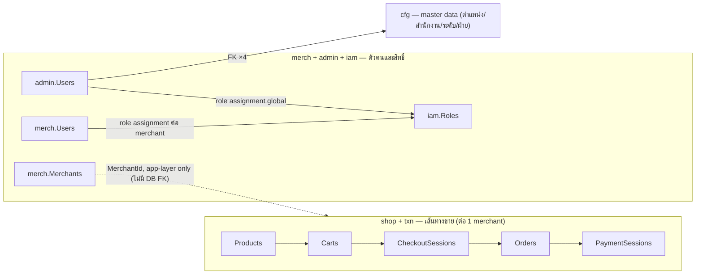

**ทำไม 3 บริษัทใช้ DB เดียวกันได้โดยไม่ปนกัน**: ทุกตารางใน `shop`/`txn`/`merch` (MerchantRuntime) มี
`MerchantId` และถูกกรองอัตโนมัติทุก query โดย EF query filter ในชั้นแอป (ไม่ใช่ DB — ดู "ไม่มี RLS" ใน Legend
ด้านล่าง และรายละเอียดเต็มที่ [`db-connection-and-rls.md`](db-connection-and-rls.md)) — เหมือนพนักงานตรวจบัตร
ที่ยืนหน้าห้องเก็บของ ไม่ใช่กุญแจแยกคนละดอกต่อห้อง.

## Legend

- **Type** = SQL Server column type. `nvarchar(n)` = Unicode string ยาวสุด n; `nvarchar(max)` = ไม่จำกัด;
  `char(3)` = fixed-length non-Unicode (ใช้กับ ISO-4217 currency เท่านั้น); `decimal(19,4)` = Money
  (มาตรฐานเดียวทั้งระบบ — ห้าม float/double/minor-units); `datetime2` = UTC timestamp (เก็บเป็น UTC เสมอ;
  field/column **ไม่ใส่** suffix `Utc`); `date` = DateOnly; `uniqueidentifier` = Guid; `bigint` = `long`;
  `bit` = bool; `varbinary` = bytes; `rowversion` = optimistic-concurrency token.
- **Null** = Y ถ้า nullable, N ถ้า NOT NULL.
- **Key** = PK / AK (alternate key) / FK / UQ (unique index) / IX (non-unique index) / UQ\* หรือ IX\* =
  filtered index / CK = check constraint.
- **ตัวอย่าง** = ค่าตัวแทน 1 ค่าของคอลัมน์นั้น. หัวข้อของแต่ละตารางบอกที่มา — `ตัวอย่าง: seed-demo.sql`
  (ค่าจริงจาก demo dataset), `ตัวอย่าง: migration <ชื่อ>` (ค่า seed จริงใน migration) หรือ
  `ตัวอย่าง: derive จาก <ไฟล์>` (ไม่มี seed — อ่านจากโค้ดที่ generate ค่าจริง). กติกาการเขียน:
  - GUID ย่อกลางด้วย `…` (`e1000000-…-0001` = `e1000000-0000-4000-8000-000000000001`) — รูปย่อเพื่ออ่านง่าย
    **ไม่ใช่ค่าที่ copy ไปวางได้ตรงๆ**; GUID ที่เป็น literal ในโค้ด/migration เขียนเต็มเมื่อสั้นพอ.
  - hash/secret ใส่แค่ **รูปทรง** ไม่ใช่ค่าจริง — เช่น `0x9f86d0…` (varbinary 32 bytes),
    `A3F1…` (SHA-256 hex 64 ตัว).
  - `NULL` เขียนตรงๆ เมื่อ null เป็นสถานะที่มีความหมาย (เงื่อนไขอยู่ในช่องหมายเหตุ).
  - PII ทุกค่าเป็นค่าปลอมจาก `seed-demo.sql` (dataset นั้นปลอมทั้งชุดโดยออกแบบ) — ห้ามยกค่าจริงจาก prod มาใส่.
  - `เวลาที่เขียน` = คอลัมน์ timestamp ที่ค่ามาจากนาฬิกา ณ ตอนเขียน (ไม่มีตัวอย่างเจาะจง เขียนรูปแบบ
    `2026-07-26T08:15:00Z` แทน).
- enum-backed column เก็บเป็น `int` (ดูค่าใน [Enums](#enums)) ยกเว้น `Carts.Status` ที่เก็บเป็น
  **string ชื่อ enum** (`HasConversion<string>`).
- **Context** = runtime DbContext ที่เป็นเจ้าของตารางนั้นตอน runtime. มี 3 ตัว (ทั้งหมด `internal sealed`,
  ไม่ประกาศ migration): `ControlPlane` (admin.\* + iam.\* + cfg.\* + dbo.DataProtectionKeys),
  `MerchantUsers` (merch.Users/Sessions/ExternalLogins/AuthAudits/RegistrationAudits/RegistrationNotices/
  RoleAssignments/UserOutbox), `MerchantRuntime` (shop.\* + txn.\* + merch.Merchants/VaultSecrets/
  VaultRevealAudits/ProvisioningAudits — เป็น isolation floor: ทุก entity มี global query filter
  `MerchantId == CurrentMerchant`).
  `PolDbContext` **ไม่ใช่** runtime context — มันเป็น migration owner อย่างเดียว (ถือ relational model เต็ม
  รวม cross-context FK จริง) และ discover entity config จาก `ModuleAssemblies` ผ่าน
  `ApplyConfigurationsFromAssembly`.
- **ไม่มี RLS**: security policy / predicate function / EXECUTE-AS bypass proc ถูกรื้อทิ้งทั้งหมดใน migration
  `20260719081817_RlsTeardownAndOnePrincipal` — isolation ย้ายไปอยู่ที่ EF global query filter + write
  authorizer ใน app layer. เหลือ DB principal เดียวคือ `pol_app` (ดู
  [Schema objects](#schema-objects-beyond-tables)).

### ทำไมต้องมีกฎพวกนี้ (สำหรับคนที่ไม่ใช่ developer)

คอลัมน์ **Key** ด้านบนใช้ตัวย่อ 6 แบบ — นี่คือ "ทำไมต้องมี" ของแต่ละแบบ ไม่ใช่แค่ตัวย่อขยายความ:

- **PK (Primary Key)**: เลขบัตรประจำตัวของแต่ละแถว บังคับไม่ให้มี 2 แถวใช้เลขเดียวกัน — เหมือนเลขบัตร
  ประชาชนที่ห้ามซ้ำ ทุกตารางมีเสมอ 1 ชุด
- **FK (Foreign Key)**: สายสัมพันธ์บังคับระหว่าง 2 ตาราง เช่น `admin.Users.PositionId` ต้องชี้ไปหาแถวที่มีจริง
  ใน `cfg.Positions` เท่านั้น ห้ามชี้ไปหาตำแหน่งที่ไม่มีอยู่ — และเพราะทั้งระบบนี้ใช้ FK แบบ `Restrict` เป็นค่า
  เริ่มต้น จึง**ลบแถวต้นทางไม่ได้ถ้ายังมีแถวอื่นอ้างอิงอยู่** (ลบตำแหน่งงานที่ยังมีคนตำแหน่งนั้นอยู่ไม่ได้)
  กันข้อมูลลอยที่หาต้นทางไม่เจอ
- **AK (Alternate Key)**: เลขบัตรสำรอง — ตารางหนึ่งมี PK ได้แค่ 1 ชุด แต่บางทีต้องมีชุดที่สองที่ห้ามซ้ำเหมือนกัน
  เพื่อให้ตารางลูกมาผูก FK แบบ composite ได้ (พก `MerchantId` ติดไปกับ FK เองโดยไม่ต้องพึ่ง predicate แยก)
- **UQ (Unique index)**: กฎ "ห้ามซ้ำ" ที่ไม่ใช่บัตรหลัก เช่น 1 email ต่อ 1 บัญชี — ถ้าไม่มีกฎนี้ระบบจะยอมให้
  สมัคร 2 บัญชีด้วย email เดียวกันได้เงียบๆ
- **IX (index ธรรมดา)**: ตัวช่วยค้นหาเร็ว ไม่ได้บังคับกฎอะไรเลย แค่ทำให้ query ที่ filter/join บ่อยๆ ไม่ต้องไล่
  อ่านทั้งตาราง
- **CK (Check constraint)**: กฎเงื่อนไขที่ตัวฐานข้อมูลบังคับเอง ไม่ต้องพึ่งโค้ดแอปเลย เช่น ห้าม role ระดับ
  Platform ผูก `MerchantId` (`CK_Roles_ScopeMerchant`) — แม้โค้ดแอปมี bug ก็ยังเขียนข้อมูลผิดกฎนี้ลง DB ไม่ได้
- **rowversion**: ตราประทับที่ฐานข้อมูลสร้างเองอัตโนมัติทุกครั้งที่แถวถูกแก้ ใช้กันเหตุการณ์ "2 คนแก้พร้อมกัน"
  (optimistic concurrency) — ถ้าค่าที่ฝั่งแอปถืออยู่ไม่ตรงกับใน DB แล้ว แปลว่ามีคนอื่นแก้ไปก่อนแล้ว ต้องอ่านใหม่
  ไม่ใช่เขียนทับเงียบๆ (ตัวอย่างจริง: `txn.PaymentSessions.RowVersion` กัน webhook 2 อันที่มาพร้อมกัน claim
  session เดียวกันซ้อนกัน)
- **migration**: ใบสั่งเปลี่ยนโครงสร้าง DB ที่เขียนเป็นโค้ด (C# ไฟล์ใน git) ไม่ใช่กดปุ่มแก้ผ่านหน้าจอ — ทุกคนใน
  ทีมและทุก environment รัน migration ชุดเดียวกันจึงได้โครงสร้าง DB เหมือนกันเป๊ะ ย้อนดูประวัติการเปลี่ยนแปลงได้
  จาก git log ของโฟลเดอร์ migration ตรงๆ

## Schema map (7 schemas — `SchemaNames.cs`)

| Schema | เนื้อหา | Runtime context |
|---|---|---|
| `shop` | funnel: Products, Carts, CartItems, CheckoutSessions(+Items), Orders(+Items, policies, audits) | MerchantRuntime |
| `txn` | payment (interim): PaymentSessions, PspConnections, OutboxMessages, IdempotencyRecords | MerchantRuntime |
| `admin` | control plane: platform users, session/auth/audit, role assignment, provisioning ops | ControlPlane |
| `merch` | merchant + merchant-user + vault | MerchantUsers · MerchantRuntime |
| `iam` | central RBAC catalog (rf2) — vocabulary เดียวแทน catalog เดิมที่เคยซ้ำสองฝั่ง | ControlPlane |
| `cfg` | config/reference data: Positions, Offices, Levels, Divisions (masterdata-split) | ControlPlane |
| `dbo` | framework-owned — **ข้อยกเว้นเดียว** ของ schema guard: `DataProtectionKeys` | ControlPlane |

> ทุก entity configuration ต้องเรียก `ToTable(name, schema: SchemaNames.X)` เอง — ไม่มี `HasDefaultSchema`
> fallback, entity ที่ลืม schema จะ fail Architecture.Tests guard แทนที่จะตกลง `dbo` เงียบๆ.
> `VCentralPay` คือชื่อ **catalog** (database) ไม่ใช่ schema — ห้ามเขียน `VCentralPay.<Table>`.

---

## admin schema (context: ControlPlane) — 7 ตาราง

schema `admin` เก็บทุกอย่างที่เกี่ยวกับ "คนควบคุมแพลตฟอร์ม" เอง (platform operator) แยกขาดจาก `merch` ที่เก็บ "คนของร้านค้า" — ทั้งสองฝั่งมี field รูปร่างคล้ายกันมาก (Users/Sessions/AuthAudits/RoleAssignments) เพราะทั้งคู่ผ่าน BFF session pattern เดียวกัน แต่เป็นคนละตารางคนละ context (`ControlPlane` vs `MerchantUsers`/`MerchantRuntime`) โดยตั้งใจ — admin ไม่ผ่าน merchant isolation floor เลยเพราะ admin คือคนที่ *ดูแล* isolation นั้น ไม่ใช่คนที่ถูก isolate (รายละเอียดกลไก isolation ปัจจุบันอยู่ที่ `docs/reference/db-connection-and-rls.md` — schema นี้ "ไม่มี RLS" เหมือนกันทั้งระบบ). บทบาททางธุรกิจของแต่ละตารางดู `docs/reference/admins.md`; ที่นี่โฟกัสแค่ "ทำไม DB ต้องมีรูปร่างแบบนี้"

ข้อสังเกตเชิงกลไกที่สำคัญ: แทบทุก FK จาก `admin.*` กลับไปหา `admin.Users` (PlatformUserId ใน MerchantAccess/Sessions/AuthAudits/UserAudits/RoleAssignments) เป็น **soft reference ไม่มี DB FK จริง** แม้จะอยู่ schema เดียวกันก็ตาม — verify แล้วจาก EF configuration ทั้งฝั่ง migration-owner (`Admins.Infrastructure/Persistence/Users/UserConfigurations.cs:43-55`, `SessionConfigurations.cs:12-49`) และฝั่ง runtime (`Persistence.ControlPlane/Admins/UserConfiguration.cs:40-70`, `SessionConfiguration.cs:10-49`) ไม่มีที่ไหนเรียก `HasOne<User>()` เลยสักจุด มีแค่ index ธรรมดา ตรงข้ามกับ FK ไป `cfg.*`/`iam.Roles` ที่เป็น FK จริงมี `OnDelete: Restrict`. เหตุผลที่น่าจะเป็น (ไม่มีเอกสารยืนยันตรงๆ ว่าทำไม แค่สังเกตจาก pattern): ตารางที่ไม่มี FK กลับไป Users ล้วนเป็นตารางที่ "ห้ามลบ Users ทิ้งไม่ได้จริงๆ อยู่แล้ว" (audit/session ต้องคงอยู่แม้ user ถูกลบ ถ้าเคยลบได้) และ MerchantAccess ก็มี pattern เดียวกันแม้จะลบได้ (unassign = hard delete) — ดู [TODO-VERIFY] ท้ายเอกสาร

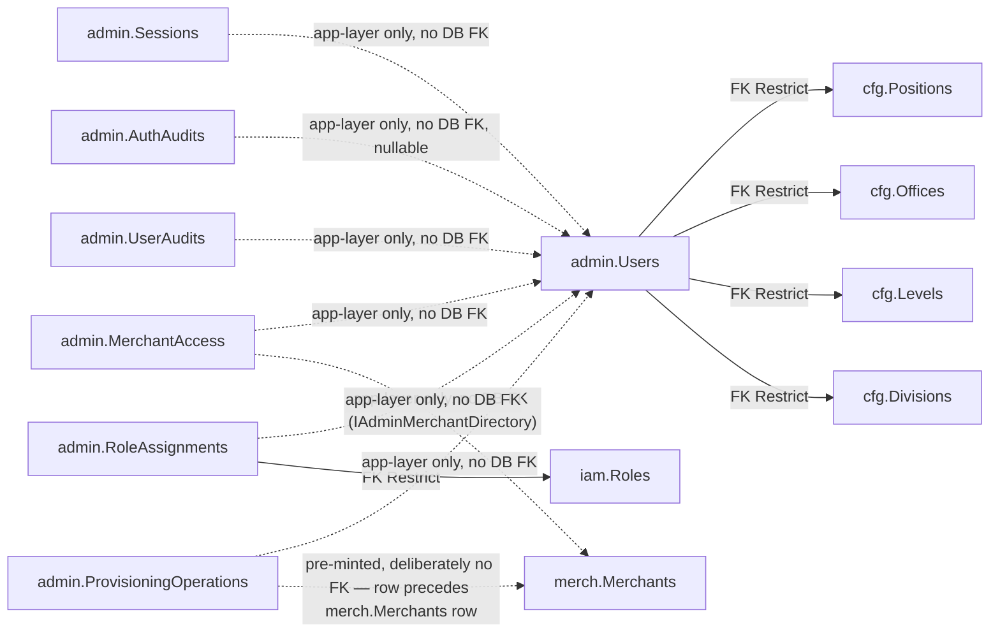

### User -> `admin.Users`
Platform user ของ control plane. `Super` = unrestricted; `Scoped` = เห็นเฉพาะ merchant ที่อยู่ใน
`admin.MerchantAccess`. `Subject` เป็น null จนกว่า login ครั้งแรกจะ bind (invite-by-email).
FK 4 ตัวไป `cfg.*` เป็น cross-schema จริง (`OnDelete: Restrict`) — master data ลบไม่ได้ถ้ายังมีคนอ้างอยู่.

> ตัวอย่าง: `seed-demo.sql` (6 demo rows `e2000000-…`) — โครงสร้าง/กติกาจาก `Admins.Domain/Users/User.cs`.

| Field | Type | Null | Key | ตัวอย่าง | หมายเหตุ |
|---|---|---|---|---|---|
| Id | uniqueidentifier | N | PK | `e2000000-…-0001` | `Guid.NewGuid()` ตอน `SelfProvision`/`CreateScoped` (แอป assign ไม่ใช่ DB) |
| Subject | nvarchar(256) | Y | UQ* | `demo-adm-1` (ของจริง: `117…` 21 หลักจาก Google) | OIDC `sub`; unique เฉพาะตอน NOT NULL (`[Subject] IS NOT NULL`). NULL = บัญชี invite ที่ยังไม่เคย login — `BindSubject` เขียนครั้งเดียว re-bind ไม่ได้ |
| Email | nvarchar(320) | N | UQ | `superadmin1@demo.pol.local` | verified email จาก id_token; **unique เสมอ** = invite key ที่ใช้ resolve บัญชีก่อนจะมี `Subject` |
| Tier | int | N | | `1` (Super) | `Tier` (Scoped=0, Super=1). Super = ข้ามทุก merchant; Scoped = เห็นเฉพาะที่อยู่ใน `admin.MerchantAccess` |
| Status | int | N | | `0` (Active) | `UserStatus` (Active=0, Suspended=1). ไม่มี PendingApproval ฝั่ง admin — สร้างโดย Super หรือ bootstrap allowlist เท่านั้น |
| AuthorizationVersion | bigint | N | | `0` (บัญชีที่ยังไม่เคยถูกแก้สิทธิ์) | concurrency token — bump ใน tx เดียวกับทุก write ที่เปลี่ยนสิทธิ์ (Status/Tier/Session/MerchantAccess/RoleAssignment); caller ที่ถือค่าเก่าจะ fail authorization lease |
| PositionId | uniqueidentifier | Y | FK, IX | `a1000000-…-0001` | -> `cfg.Positions.Id` (Restrict). ตำแหน่ง — NULL ได้ (บัญชี invite ที่ยังไม่ระบุ) |
| OfficeId | uniqueidentifier | Y | FK, IX | `b2000000-…-0001` | -> `cfg.Offices.Id` (Restrict). สถานที่ปฏิบัติงาน |
| LevelId | uniqueidentifier | Y | FK, IX | `c3000000-…-0001` | -> `cfg.Levels.Id` (Restrict). ระดับ |
| DivisionId | uniqueidentifier | Y | FK, IX | `d4000000-…-0001` | -> `cfg.Divisions.Id` (Restrict). ฝ่าย/ภาค — ทั้ง 4 FK แก้พร้อมกันทีเดียวผ่าน `UpdateProfile` (null = ล้างมิตินั้น) |
| CreatedAt | datetime2 | N | | `2026-07-26T08:15:00Z` | เวลาที่เขียน (`SYSUTCDATETIME()` ใน seed / `IClock.UtcNow` ใน handler) |

**คืออะไร**: บัญชีของ "คนควบคุมแพลตฟอร์ม" เอง (platform operator) — ไม่ใช่ลูกค้าร้านค้า ไม่ใช่พนักงานร้านค้า แต่คือทีมงานฝั่งเจ้าของระบบที่เข้ามาดูแล/อนุมัติ/ตั้งค่าทั้งแพลตฟอร์ม เช่นทีม ops หรือทีม support ส่วนกลาง
**บทบาท**: เป็นจุดยึด (anchor) ของทุกอย่างใน schema `admin` — Sessions/AuthAudits/UserAudits/RoleAssignments/MerchantAccess ทุกตัวอ้างกลับมาที่นี่ผ่าน `PlatformUserId`. บริบทธุรกิจของ Super/Scoped ดู `docs/reference/admins.md`
**ถ้าไม่มีตารางนี้จะพังยังไง**: ไม่มีที่เก็บว่า "ใครคือ operator" เลย — Sessions จะไม่รู้ว่า cookie นี้ของใคร, MerchantAccess จะไม่มีอะไรให้ผูก "สิทธิ์เห็น merchant ไหน" เข้ากับ, การ login ครั้งแรกจะไม่มีที่ resolve ว่า Google account นี้เป็น operator หรือไม่ — ระบบ admin console ทั้งระบบพังตั้งแต่ขั้น authenticate
**ทำงานยังไง**: สร้างได้ 2 ทาง — `User.SelfProvision` (`Admins.Domain/Users/User.cs:65-71`) สำหรับ Super คนแรกที่ bootstrap จาก config allowlist ตอน login ครั้งแรก (bind `Subject` ทันทีเพราะ caller authenticate แล้ว) กับ `User.CreateScoped` (`User.cs:76-83`) ที่ Super สร้างให้คนอื่นแบบ invite-by-email (`Subject` เป็น `null` ไปก่อน). `BindSubject` (`User.cs:87-93`) ผูก Google `sub` ครั้งเดียวเท่านั้น re-bind ไม่ได้ (throw `InvalidOperationException`) — นี่คือเหตุผลที่ `Email` ต้อง unique เสมอ (เป็น invite key ตอนที่ยังไม่มี `Subject`). `Suspend`/`ChangeTier` (`User.cs:97-128`) มี self-guard กันตัวเองล็อกตัวเองไม่ได้ (`actingAdminId == Id` → throw) และทั้งคู่เรียก `BumpAuthorizationVersion()` (`User.cs:135`) ในทุก write ที่กระทบสิทธิ์ — เป็น concurrency lease ที่ `ProvisioningCoordinator` ใช้ล็อกตอน provision merchant (ดู `admin.ProvisioningOperations` ด้านล่าง) และเป็นสิ่งที่ทำให้ session ของ caller ที่ถือ `AuthorizationVersion` เก่าล้มเหลวทันทีถ้าสิทธิ์เปลี่ยนกลางทาง

### MerchantAccess -> `admin.MerchantAccess`
M:N ระหว่าง Scoped platform user กับ merchant ที่เข้าถึงได้ (accessible set). unassign = hard delete.

> ตัวอย่าง: `seed-demo.sql` (4 rows `e3000000-…` — เฉพาะ Scoped; Super ไม่มีแถวเลย เพราะไม่ต้องใช้ตารางนี้).

| Field | Type | Null | Key | ตัวอย่าง | หมายเหตุ |
|---|---|---|---|---|---|
| Id | uniqueidentifier | N | PK | `e3000000-…-0001` | surrogate key; `Guid.NewGuid()` ตอน `MerchantAccess.Create` |
| PlatformUserId | uniqueidentifier | N | UQ | `e2000000-…-0003` (Scoped admin) | unique กับ MerchantId; soft reference ไป `admin.Users.Id` |
| MerchantId | uniqueidentifier | N | UQ | `e1000000-…-0001` (vprivilege) | unique กับ PlatformUserId. **ไม่มี DB FK** — Admins ไม่ reference โมดูล Merchants; ตรวจว่ามีจริง/active ผ่าน `IAdminMerchantDirectory` ตอน assign |
| AssignedByAdminId | uniqueidentifier | N | | `e2000000-…-0001` (Super) | admin ที่สั่ง assign (Super) |
| AssignedAt | datetime2 | N | | `2026-07-26T08:15:00Z` | เวลาที่เขียน |

**คืออะไร**: รายการ "merchant ไหนที่ Scoped admin คนนี้เข้าถึงได้" — ถ้า Super คือคนเห็นทุกร้าน Scoped ก็คือคนที่เห็นเฉพาะร้านที่มีชื่ออยู่ในตารางนี้
**บทบาท**: เป็น accessible-set ที่ resolve ตอน login ทุกครั้ง (`docs/reference/admins.md`) MerchantId เป็น soft reference ไป merchant ของอีกโมดูล ตรวจว่ามีจริง/active ผ่าน `IAdminMerchantDirectory.IsActiveMerchantAsync` (`Admins.Application/IAdminMerchantDirectory.cs:13`) ไม่ใช่ DB FK — เพราะ Admins module ตั้งใจไม่ reference โมดูล Merchants ตรงๆ
**ถ้าไม่มีตารางนี้จะพังยังไง**: ไม่มีที่บันทึกว่า Scoped admin คนไหนดูร้านไหนได้ — ถ้าตัดออกไปเฉยๆ ระบบต้องเลือกทางใดทางหนึ่ง: ให้ Scoped เห็นทุกร้าน (เท่ากับไม่มี Scoped จริง Super กับ Scoped ต่างกันแค่ชื่อ) หรือไม่เห็นร้านไหนเลย (ล็อก Scoped ทุกคนออกจากงาน)
**ทำงานยังไง**: `MerchantAccess.Create` (`Admins.Domain/Users/MerchantAccess.cs:28-35`) validate แค่ id ไม่ว่าง — ตัว business rule จริงอยู่ที่ `AssignMerchantHandler.Handle` (`Admins.Application/Users/AssignMerchant.cs:38-64`): เช็ค merchant active ก่อนเปิด transaction, แล้วในทรานแซคชันเดียวกันเช็คซ้ำว่า target เป็น Scoped (Super ไม่ต้องใช้ตารางนี้), กันแถวซ้ำ `(PlatformUserId, MerchantId)` ด้วย `GetAssignmentAsync` ก่อน insert, และเขียน `admin.UserAudits` แถว `assign-merchant` คู่กันเสมอ ยืนยันจาก EF config (`Admins.Infrastructure/Persistence/Users/UserConfigurations.cs:43-55` และ runtime-mirror `Persistence.ControlPlane/Admins/UserConfiguration.cs:40-52`) ว่า `PlatformUserId`/`MerchantId` เป็น scalar ล้วน ไม่มี `HasOne` เลยแม้แต่ตัวเดียว — ตรงข้ามกับ XML doc comment เดิมในไฟล์ entity (`MerchantAccess.cs:5-9`) ที่ยังเขียนว่า "This table is the RLS predicate's lookup table (`sec.fn_merchant_predicate`...)" ซึ่งเป็นคำอธิบายที่ตกยุคแล้ว — RLS ถูกรื้อทิ้งทั้งระบบใน migration `20260719081817_RlsTeardownAndOnePrincipal` (ดู `docs/reference/db-connection-and-rls.md` สำหรับกลไก isolation ปัจจุบัน)

### Session -> `admin.Sessions`
server-side session ของ admin BFF. cookie value (opaque 256-bit) **ไม่เคยเก็บ** — เก็บแค่ SHA-256 hash.
session รวมเป็น rotation family (`FamilyId`): rotate = ออก successor ใน family เดิม + mark ตัวเก่า
`Superseded` พร้อม link ไป successor (กัน replay = reuse detection). prune ลบ row ที่เลย absolute expiry.

> ตัวอย่าง: derive จาก `Admins.Domain/Users/Session.cs` + `Session:*` ใน `appsettings.json`
> (IdleMinutes 30 / AbsoluteHours 8 / RotationMinutes 15) — ไม่มี seed (session เกิดตอน login จริงเท่านั้น).

| Field | Type | Null | Key | ตัวอย่าง | หมายเหตุ |
|---|---|---|---|---|---|
| Id | uniqueidentifier | N | PK | `7c1f4d2e-…-9a30` | `Guid.NewGuid()` ตอน `Session.Start`/`Rotate` |
| FamilyId | uniqueidentifier | N | IX | `2b9e0a71-…-4f08` | rotation family; family-wide revoke. GUID ใหม่ตอน login, สืบทอดต่อทุก rotate |
| TokenHash | varbinary(32) | N | UQ | `0x9f86d0…` (32 bytes) | SHA-256 ของ cookie token (lookup O(1)). **cookie value จริงไม่เคยถูกเก็บ** |
| PlatformUserId | uniqueidentifier | N | IX | `e2000000-…-0001` | -> `admin.Users.Id`; logout-all |
| Status | int | N | | `0` (Active) | `SessionStatus` (Active=0, Superseded=1, Revoked=2). flip เป็น Superseded/Revoked ด้วย set-based update ใน store ไม่ใช่ tracked entity |
| IssuedAt | datetime2 | N | | `2026-07-26T08:15:00Z` | เวลาที่ออก session นี้ |
| IdleExpiresAt | datetime2 | N | | `2026-07-26T08:45:00Z` (= IssuedAt + 30m) | idle sliding (~30m), slide lazy |
| AbsoluteExpiresAt | datetime2 | N | IX | `2026-07-26T16:15:00Z` (= IssuedAt + 8h) | hard cap (~8h); prune sweep key. successor สืบทอดค่าเดิม — rotate ไม่ต่ออายุ hard cap |
| SupersededAt | datetime2 | Y | | `NULL` (session ที่ยัง Active) | เวลาที่ถูก rotate |
| SupersededBySessionId | uniqueidentifier | Y | | `NULL` / `9d33ab10-…-1c72` | successor (immediate-predecessor / reuse check). ใช้ token ของ predecessor ที่ไม่ใช่ตัวติดกัน = ถือว่าถูกขโมย revoke ทั้ง family |
| CreatedIp | nvarchar(45) | Y | | `203.0.113.24` (รองรับ IPv6 เต็ม 45 ตัว) | IP ตอน login; NULL ได้เมื่ออ่านไม่ได้ |
| UserAgent | nvarchar(256) | Y | | `Mozilla/5.0 (Macintosh; Intel Mac OS X 10_15_7) …` | ตัดที่ 256 ตัว |

**คืออะไร**: "ใบยืนยันตัวตน" ชั่วคราวของ operator หลัง login สำเร็จ — คล้ายบัตรผ่านเข้าออฟฟิศที่มีวันหมดอายุ ต้องแตะบัตรใหม่เรื่อยๆ (rotate) ไม่ใช่ล็อกอินครั้งเดียวแล้วใช้ตลอดชีวิต
**บทบาท**: เป็นแกนของ server-side session (BFF pattern) ที่ฝั่ง admin console ใช้แทน id_token ตรงๆ — cookie ที่ browser ถือเป็นแค่ opaque 256-bit token, ไม่ใช่ตัวข้อมูลจริง; รายละเอียด flow login เต็มดู `docs/reference/admins.md`
**ถ้าไม่มีตารางนี้จะพังยังไง**: admin console ต้องกลับไปให้ browser ถือ Google id_token เป็น bearer token ส่งทุก request แทน (id_token อายุยาว ไม่มี server-side revoke ทันที) ถ้า token หลุดไปแล้วไม่มีทางตัดสิทธิ์ได้จนกว่า token จะหมดอายุเอง — ต่างจาก session ที่ revoke ได้ทันทีด้วยการ flip `Status`
**ทำงานยังไง**: session รวมกันเป็น "rotation family" ผ่าน `FamilyId` ที่สืบทอดตลอดทุก rotate (login ใหม่ = family ใหม่). โครงสร้างหลัก 3 ชั้น:
- **Rotate**: `Session.Rotate` (`Admins.Domain/Users/Session.cs:68-77`) สร้าง successor ใน family เดิม, สืบทอด `AbsoluteExpiresAt` เดิม (rotate ไม่ต่ออายุ hard cap 8 ชม.) แต่คำนวณ `IdleExpiresAt` ใหม่ (idle 30 นาที), แล้ว mark ตัวเองเป็น `Superseded` พร้อม `SupersededBySessionId` ชี้ไป successor
- **Reuse detection**: `SessionDecisionPolicy.Decide` (`Admins.Domain/Users/SessionDecision.cs:24-34`) เป็น pure decision table — session ที่ `Superseded` จะถูกยอมรับ (`ServeUnderGrace`) เฉพาะถ้าเป็น **immediate predecessor** ของ Active session ปัจจุบันใน family เดียวกัน (`Session.IsImmediatePredecessorWithinGrace`, `Session.cs:87-91`) และยังอยู่ใน grace window เท่านั้น — token ที่ superseded ไปมากกว่า 1 รอบ หรือหมด grace แล้ว ถือเป็น `ReuseRevokeFamily` (โดนขโมย) → revoke ทั้ง family
- **Atomic persist**: `SessionStore.TrySupersedeAsync` (`Persistence.ControlPlane/Admins/SessionStore.cs:45-64`) เป็น set-based `ExecuteUpdate` แบบ single-winner — ถ้า 2 request รอตัวเดียวกันมา rotate พร้อมกัน มีแค่ตัวเดียวชนะ (affected=1), ตัวที่แพ้ (affected=0) เห็น cookie เดิมยังไม่ถูกเปลี่ยนแล้ว serve under grace แทนโดยไม่ต่อ cookie ใหม่ ป้องกัน race สร้าง successor ซ้อน
- **Trigger จริง**: `SessionAuthenticationHandler.HandleAuthenticateAsync` (`Hosts/Api/Admins/SessionAuthenticationHandler.cs:61-125`) เป็นจุดเดียวที่เรียกทั้งหมดนี้ทุก request ที่มี cookie — decode hash, เรียก decision table, ถ้า `ReuseRevokeFamily` เขียน `admin.AuthAudits` ทันทีก่อน 401 (`:84-89`), ถ้าเลย rotation age (15 นาที) เรียก `TryRotateAsync` (`:127-142`) มิฉะนั้น slide idle แบบ lazy สูงสุด ~1 นาทีครั้ง (`MaybeSlideIdleAsync`, `:144-154`) เพื่อไม่ให้ทุก request ต้อง write DB

```csharp
// SessionAuthenticationHandler.cs:79-95 (ตัดมาโดยย่อ)
switch (SessionDecisionPolicy.Decide(session, familyActiveId, now, policy))
{
    case SessionDecision.Reject: return AuthenticateResult.Fail("...");
    case SessionDecision.ReuseRevokeFamily:
        await _sessions.RevokeFamilyAsync(session.FamilyId, ct);
        _audit.Append(AuthAudit.For(AuthEventType.FamilyRevokedReuse, ...));
        return AuthenticateResult.Fail("Session reuse detected.");
    // ServeActive / ServeUnderGrace -> ผ่าน ไป resolve principal ต่อ
}
```

### AuthAudit -> `admin.AuthAudits`  (append-only)
audit ของ auth lifecycle (login-success/logout/logout-all/rotated/family-revoked-reuse/auth-denied).
แยกจาก `admin.UserAudits` เพราะ auth event อาจไม่มี user id ที่ resolve ได้ (denial ก่อน resolve).
ไม่เก็บ secret/token/raw session id.

> ตัวอย่าง: derive จาก `Admins.Domain/Users/AuthAudit.cs` (`AuthEventType` constants) — ไม่มี seed.

| Field | Type | Null | Key | ตัวอย่าง | หมายเหตุ |
|---|---|---|---|---|---|
| Id | uniqueidentifier | N | PK | `f4a10c88-…-2b61` | `Guid.NewGuid()` ตอน `AuthAudit.For` |
| EventType | nvarchar(32) | N | | `login-success` | login-success/logout/logout-all/rotated/family-revoked-reuse/auth-denied — ค่าคงที่ใน `AuthEventType` |
| PlatformUserId | uniqueidentifier | Y | IX | `e2000000-…-0001` / `NULL` | null เมื่อยังไม่ resolve user (deny ก่อน resolve) |
| Subject | nvarchar(256) | Y | | `demo-adm-1` | OIDC `sub`; ยังบันทึกได้แม้ resolve บัญชีไม่เจอ |
| Reason | nvarchar(128) | Y | | `not-allowlisted` | label สั้น ไม่ sensitive (เหตุผล deny). NULL บน event ที่สำเร็จ |
| CorrelationId | nvarchar(128) | N | | `9f2c1ab34d5e4f6789012345abcdef01` | จาก header `X-Correlation-ID` ถ้า well-formed (ตัวอักษร/ตัวเลข/`-`/`_` ยาว <=128) ไม่งั้น mint เป็น `Guid` N-format |
| OccurredAt | datetime2 | N | | `2026-07-26T08:15:00Z` | เวลาที่เกิด event |

**คืออะไร**: บันทึกเหตุการณ์ "เข้า-ออกระบบ" ทุกครั้งของ operator — login สำเร็จ, logout, logout ทุกเครื่อง, session ถูกหมุนใหม่ (rotate), session โดนขโมยแล้วถูกตัดทั้ง family, หรือ login ถูกปฏิเสธ
**บทบาท**: เป็น forensic trail ของ auth lifecycle แยกจาก `admin.UserAudits` เพราะเหตุการณ์ auth บางแบบ (เช่น deny ก่อน resolve ว่าเป็นใคร) **ไม่มี** `PlatformUserId` ที่ resolve ได้เลย — บริบทธุรกิจดู `docs/reference/admins.md`
**ถ้าไม่มีตารางนี้จะพังยังไง**: ถ้า cookie ของ operator คนหนึ่งหลุดไปแล้วมีคนเอาไปใช้ (reuse) ระบบจะตัดสิทธิ์ session นั้นได้ (`SessionDecisionPolicy` ยังทำงาน) แต่จะไม่มีหลักฐานเหลือให้สืบว่าเกิดอะไรขึ้น เกิดตอนไหน มาจาก subject ไหน — เหตุการณ์ security ที่สำคัญที่สุดกลับกลายเป็นเหตุการณ์ที่ตรวจสอบย้อนหลังไม่ได้เลย
**ทำงานยังไง**: ชนิด event เป็นค่าคงที่ใน `AuthEventType` (`Admins.Domain/Users/AuthAudit.cs:6-14`) และ factory `AuthAudit.For` (`:47-53`) รับ `adminAccountId`/`subject`/`reason` เป็น optional ทั้งคู่ (ต่างจาก `Audit` ที่ actor บังคับ) จุดเรียกจริงกระจายอยู่หลายที่: `login-success`/`auth-denied` ที่ `Hosts/Api/Admins/LoginService.cs:146,169`, `logout`/`logout-all` ที่ `Hosts/Api/Program.cs:1017,1038`, และ `rotated`/`family-revoked-reuse` ที่ `SessionAuthenticationHandler.cs:139,86-87` (เขียนคู่กับ audit ผ่าน `IAuthAuditWriter` — implementation จริงคือ `AuthAuditWriter` ที่ `Persistence.ControlPlane/Admins/SessionStore.cs:101-110`)

### Audit -> `admin.UserAudits`  (append-only)
audit ของทุก admin action (account lifecycle: self-provision/create-scoped/assign/unassign/suspend/
reactivate/session-revoke; role lifecycle: role create/update/delete/assign/unassign).

> ตัวอย่าง: derive จาก `Admins.Domain/Users/Audit.cs` (`AuditAction` constants) — ไม่มี seed.

| Field | Type | Null | Key | ตัวอย่าง | หมายเหตุ |
|---|---|---|---|---|---|
| Id | uniqueidentifier | N | PK | `3ce77a05-…-8d42` | `Guid.NewGuid()` ตอน `Audit.For` |
| Action | nvarchar(64) | N | | `assign-merchant` | ชื่อ action — ค่าคงที่ใน `AuditAction`: self-provision/create-scoped/assign-merchant/unassign-merchant/suspend/reactivate/session-revoke/tier-changed/update-profile/role-created/role-updated/role-deleted/role-assigned/role-unassigned |
| ActorId | uniqueidentifier | N | | `e2000000-…-0001` | user ที่ทำ — **required** (ต่างจาก `admin.AuthAudits` ที่ยอม null ได้); self-provision ใช้ id ของตัวเอง |
| ActorType | nvarchar(16) | N | | `admin` | `"admin"` ค่าเดียวตอนนี้ — เผื่อ actor แบบ system/automation ในอนาคต |
| TargetAdminId | uniqueidentifier | Y | | `e2000000-…-0003` | platform user เป้าหมาย (ถ้ามี); NULL บน role CRUD |
| TargetRoleId | uniqueidentifier | Y | | `11111111-1111-1111-1111-111111111111` | role เป้าหมาย (role action เท่านั้น) |
| MerchantId | uniqueidentifier | Y | | `e1000000-…-0001` | merchant ที่เกี่ยว (assign/unassign); NULL บน action อื่น |
| CorrelationId | nvarchar(128) | N | | `9f2c1ab34d5e4f6789012345abcdef01` | ผูก audit row กับ request เดียวกันข้ามตาราง (ดู `CorrelationIdMiddleware`) |
| OccurredAt | datetime2 | N | | `2026-07-26T08:15:00Z` | เวลาที่เกิด action |

**คืออะไร**: บันทึก "ใครทำอะไรกับบัญชี operator หรือ role คนไหน" — ต่างจาก AuthAudits ที่เป็นเรื่อง login/logout, ตารางนี้เป็นเรื่อง lifecycle ของบัญชีและสิทธิ์ (สร้าง/suspend/assign merchant/assign role ฯลฯ)
**บทบาท**: เป็น accountability trail ของทุก action ที่กระทบสิทธิ์หรือการมีอยู่ของบัญชี operator คนอื่น — บริบทธุรกิจดู `docs/reference/admins.md`
**ถ้าไม่มีตารางนี้จะพังยังไง**: การกระทำที่กระทบสิทธิ์คนอื่นโดยตรง เช่น Super suspend บัญชีคนอื่น, เปลี่ยน Tier, assign/unassign merchant, assign/unassign role — จะไม่มีบันทึกว่าใครสั่ง สั่งเมื่อไหร่ ถ้าเกิดข้อพิพาทว่า "ใครถอดสิทธิ์ฉัน" จะตอบไม่ได้เลยเพราะไม่มีร่องรอย
**ทำงานยังไง**: action เป็นค่าคงที่ใน `AuditAction` (`Admins.Domain/Users/Audit.cs:6-28`) ครอบทั้งบัญชี (self-provision/create-scoped/assign-merchant/unassign-merchant/suspend/reactivate/session-revoke/tier-changed/update-profile) และ role (role-created/updated/deleted/assigned/unassigned). Factory `Audit.For` (`:75-83`) บังคับ `actorId` ไม่ว่าง (ต่างจาก AuthAudits) — self-provision ใช้ id ของบัญชีตัวเองเป็น actor (ยืนยันจาก `SelfProvisionSuperHandler.cs:48-51`: `Audit.For(AuditAction.SelfProvision, account.Id, ..., targetAdminId: account.Id)` เขียนในทรานแซคชันเดียวกับ insert `admin.Users` และ insert `admin.RoleAssignments` แถวแรก). role assign/unassign เขียนคู่กับทุก diff จริงที่ `SetRolesHandler.Handle` (`Admins.Application/Users/SetAdminRoles.cs:62-79`) — เขียน 1 แถว audit ต่อ 1 role ที่เพิ่ม/ลบ ไม่ใช่ 1 แถวต่อ 1 การเรียก API

### RoleAssignment -> `admin.RoleAssignments`
ผูก platform user กับ role ใน `iam.Roles` — **ไม่มี** `MerchantId` (global, ต่างจากฝั่ง merch ที่ผูก merchant).
effective permission = union ของ `PermissionKey` จากทุก role ที่ `Status = Active`.

> ตัวอย่าง: `seed-demo.sql` (6 rows `e4000000-…`) — RoleId ชี้ role ที่ migration `SeedData` สร้างไว้แล้ว.

| Field | Type | Null | Key | ตัวอย่าง | หมายเหตุ |
|---|---|---|---|---|---|
| Id | uniqueidentifier | N | PK | `e4000000-…-0001` | surrogate key; `Guid.NewGuid()` ตอน `RoleAssignment.Create` |
| PlatformUserId | uniqueidentifier | N | UQ | `e2000000-…-0001` | unique กับ RoleId (1 คน 1 role ได้ครั้งเดียว) |
| RoleId | uniqueidentifier | N | FK, IX, UQ | `11111111-1111-1111-1111-111111111111` (platform_admin) | -> `iam.Roles.Id` (Restrict) — role ที่ยังมีคนถืออยู่ ลบไม่ได้ |
| AssignedById | uniqueidentifier | N | | `e2000000-…-0001` | admin ที่สั่ง assign |
| AssignedAt | datetime2 | N | | `2026-07-26T08:15:00Z` | เวลาที่เขียน |

**คืออะไร**: บันทึกว่า operator คนไหนถือ role อะไรบ้าง — role เองเป็นแค่ "ชื่อมัดรวมสิทธิ์" (อยู่ใน `iam.Roles`), ตารางนี้คือเส้นเชื่อมที่บอกว่าคนนี้ถือ role นั้นจริง
**บทบาท**: เป็นครึ่งหนึ่งของ RBAC — อีกครึ่งคือ catalog กลาง `iam.Roles`/`iam.RolePermissions` (`docs/reference/admins.md` มีบริบทธุรกิจเต็ม) โดยนิยาม effective permission = union ของ `PermissionKey` จากทุก role ที่ `Status = Active`
**ถ้าไม่มีตารางนี้จะพังยังไง**: `iam.Roles`/`iam.RolePermissions` จะเหลือแค่ "รายชื่อ role พร้อมสิทธิ์ที่ role นั้นให้" แบบลอยๆ ไม่มีอะไรผูกว่า operator คนไหนถือ role ไหนอยู่ — ทุกคนจะไม่มีสิทธิ์อะไรเลย (permission check จะ fail-closed เป็น deny ทั้งหมด) เพราะ `PermissionAuthorization.IsAllowed` ไม่มีที่มาของ effective permission set ให้เช็ค
**ทำงานยังไง**: unique index บน `(PlatformUserId, RoleId)` กันคนเดียวถือ role เดียวซ้ำ. resolve effective permission จริงที่ `RoleRepository.ListEffectivePermissionsAsync` (`Persistence.ControlPlane/Admins/RoleRepository.cs:53-64`) — join `admin.RoleAssignments` → `iam.Roles` (กรองผ่าน `RoleVisibility.For(Scope.Platform, null)` กัน role ฝั่ง merchant หลุดเข้ามา + กรอง `Status == Active`) → `iam.RolePermissions` → distinct `PermissionKey`. resolve ครั้งนี้เกิดใหม่ทุก request ไม่ใช่ claim ที่ cache ไว้ในตัว session (verify จาก `SessionAuthenticationHandler` ที่ resolve ผ่าน `ISessionResolver`/`ResolveByIdQuery` ทุกครั้ง ไม่ได้ยัดสิทธิ์ลง cookie). การเขียนจริง (add/remove ให้ตรงกับ list ที่ส่งมา) อยู่ที่ `SetRolesHandler.Handle` (`Admins.Application/Users/SetAdminRoles.cs:41-87`) เป็น set-diff แบบเต็ม (เพิ่มที่ขาด ลบที่เกิน) audit ทุก add/remove แยกแถว. gate จริงที่ `PermissionAuthorization.IsAllowed` (`Hosts/Api/Iam/PermissionAuthorization.cs:52-55`) fail-closed ถ้าไม่มี scope bound เลย และมี boot-time guard `PermissionParity.Assert` (`:69-81`, logic จริงที่ `FindProblems`, `:86-106`) เช็คตั้งแต่ boot ว่าทุก key ที่ endpoint gate ด้วย ต้องอยู่ใน catalog จริงและตรง `Scope` กับ policy ของ endpoint นั้น (endpoint `admin` policy ถือ key ฝั่ง merchant = boot fail ทันที ไม่ใช่ runtime surprise)

### ProvisioningOperation -> `admin.ProvisioningOperations`
idempotency ledger ของ merchant provisioning (multi-context coordinator). `OperationKey` unique = replay
ตัวเดิมคืนผลเดิม; `ExpectedAuthorizationVersion` ล็อกกับ `admin.Users.AuthorizationVersion` ตอนเริ่ม.

> ตัวอย่าง: derive จาก `BuildingBlocks.Infrastructure/Provisioning/ProvisioningOperation.cs` +
> `ProvisionMerchantHandler.cs` (คนตั้ง `OperationKey`) + `ProvisioningCoordinator.cs` — ไม่มี seed.

| Field | Type | Null | Key | ตัวอย่าง | หมายเหตุ |
|---|---|---|---|---|---|
| Id | uniqueidentifier | N | PK | `c05be1d4-…-77a9` | `Guid.NewGuid()` ตอน `ProvisioningOperation.Create` |
| OperationKey | nvarchar(200) | N | UQ | `provision-merchant:vprivilege` | index name `UX_ProvisioningOperations_Key`. handler ประกอบเป็น `provision-merchant:{code}` — INSERT ผ่าน raw SQL ก่อนทำงานจริง จึงชน unique index ได้ชัดเจนเมื่อมี request คู่ขนาน |
| CallerAdminId | uniqueidentifier | N | | `e2000000-…-0001` (ต้องเป็น Super ที่ Active) | replay ที่ caller ต่างจากเดิม = 409 ไม่คืนผลเดิมให้ |
| ExpectedAuthorizationVersion | bigint | N | | `0` | snapshot ของสิทธิ์ผู้เรียก — pin ไว้ที่ request boundary; replay เทียบกับค่าที่เก็บ ไม่ใช่ค่าที่อ่านใหม่ |
| RequestHash | nvarchar(64) | N | | `A3F1…` (SHA-256 hex ตัวใหญ่ 64 ตัว) | กัน key ซ้ำแต่ payload ต่าง = `Convert.ToHexString(SHA256(JSON ของ ProvisionSpec))` |
| MerchantId | uniqueidentifier | N | | `e1000000-…-0001` | merchant ที่ provision — pre-mint ที่นี่ก่อน แล้วใช้เป็น `merch.Merchants.Id` จริง (ตั้งใจไม่ทำ FK เพราะแถวนี้เกิดก่อน) |
| Result | nvarchar(max) | Y | | `{"MerchantId":"e1000000-…","Connections":[…]}` | JSON ผลลัพธ์ (null = ยังไม่จบ); replay ที่ match คืน body ตัวนี้ตรงๆ |
| CreatedAt | datetime2 | N | | `2026-07-26T08:15:00Z` | เวลาที่เริ่ม operation |

**คืออะไร**: "ใบเสร็จกันทำซ้ำ" ของการเปิดร้านค้าใหม่ (provision merchant) — ถ้า request เปิดร้านเดิมถูกยิงซ้ำ (เช่น client timeout แล้ว retry เอง) ตารางนี้คือสิ่งที่ทำให้ระบบจำได้ว่า "คำขอนี้เคยรันไปแล้ว" แล้วคืนผลเดิมกลับไป แทนที่จะเปิดร้านซ้ำหรือพังครึ่งๆ กลางๆ
**บทบาท**: เป็น idempotency ledger ของจุดเดียวในระบบที่เขียนข้าม 2 runtime context พร้อมกันในทรานแซคชันจริงเดียวกัน (`ControlPlaneDbContext` + `MerchantRuntimeDbContext`) — เปิดร้านค้าใหม่ต้องสร้าง `merch.Merchants` + `txn.PspConnections` + vault secret + audit พร้อมกันแบบ all-or-nothing บริบทธุรกิจดู `docs/reference/admins.md`
**ถ้าไม่มีตารางนี้จะพังยังไง**: retry ของ `POST /api/v1/merchants` ที่ timeout ฝั่ง client (แต่ server เขียนสำเร็จแล้ว) จะไม่มีทางรู้ว่า merchant code นี้ "เคยพยายามแล้ว" — ถ้าใช้แค่เช็ค `ExistsByCodeAsync` เพียงอย่างเดียวจะโดน race window (2 request พร้อมกันผ่านเช็คทั้งคู่ก่อนมี merchant จริง) และถ้าเขียนล้มครึ่งทาง (เช่น connection หลุดหลัง insert `merch.Merchants` แต่ก่อน insert `VaultSecrets`) จะไม่มีทางกู้คืนหรือ resume ได้เลยเพราะไม่มีที่บันทึกว่า "operation นี้รันไปถึงไหนแล้ว"
**ทำงานยังไง**: จุดเดียวที่เขียนคือ `ProvisioningCoordinator.AttemptAsync` (`Persistence.Provisioning/ProvisioningCoordinator.cs:100-194`) แบ่งเป็นขั้น: (1) เปิด transaction เดียวคร่อมทั้ง 2 context ผ่าน `UseTransactionAsync` (`:108-110`); (2) recheck สิทธิ์ caller **ในทรานแซคชัน** ด้วย `WITH (UPDLOCK, HOLDLOCK)` เทียบ `Tier=Super AND Status=Active AND AuthorizationVersion=expected` (`VerifyCallerIsActiveSuperAsync`, `:196-221`) — ล็อกกัน caller ถูกถอดสิทธิ์กลางอากาศระหว่าง request คู่ขนานอื่นเปลี่ยน `admin.Users.AuthorizationVersion`; (3) insert แถว ledger ด้วย **raw parameterized SQL** ก่อนทำงานจริงใดๆ (`TryInsertLedgerRowAsync`, `:223-248`) ไม่ใช่ `DbSet.Add` เพื่อให้ค่า key ซ้ำชนกับ `UX_ProvisioningOperations_Key` ทันทีแบบ deterministic — ถ้าซ้ำ (`IsDuplicateKeyViolation` เช็ค SQL error 2601/2627 + ชื่อ index ตรง, `:254-259`) จะ rollback แล้วเช็คว่า caller/request-hash ตรงกับแถวเดิมไหม (ตรง = คืนผลเดิม, ไม่ตรง = 409); (4) ถ้าไม่ซ้ำ ก็สร้าง `Merchant`+`Connection`(s)+`VaultSecretBlob`(s)+`ProvisioningAudit` ทั้งหมดโดยใช้ `mintedMerchantId` ที่ pre-mint ไว้ตั้งแต่ตอนสร้างแถว ledger (`:117-169`) แล้ว `SaveChangesAsync(acceptAllChangesOnSuccess: false)` ทั้ง 2 context ก่อน commit จริง ค่อย `AcceptAllChanges()` (`:178-191` — กันไม่ให้ change tracker คิดว่าเขียนสำเร็จก่อนจะ commit จริง); (5) ถ้า retry เจอ exception ที่ดู transient (`IsTransient`, `:288-293`) จะไม่ retry มั่วๆ แต่ verify ก่อนว่า attempt ก่อนหน้า commit ไปจริงไหม (`TryVerifySucceededAsync`, `:261-276`) กัน "commit-unknown" (เครือข่ายขาดหลัง commit แต่ก่อน ack) ไม่ให้ retry ซ้ำสิ่งที่สำเร็จไปแล้ว. `operationKey` ประกอบจาก `provision-merchant:{code}` ที่ `ProvisionMerchantHandler.Handle` (`Merchants.Application/ProvisionMerchant/ProvisionMerchantHandler.cs:93`) และ endpoint จริงคือ `POST /api/v1/merchants` (`Hosts/Api/Program.cs:1058`) ที่ dispatch ผ่าน mediator ไปหา handler นี้

จุดที่ต้องแก้ความเข้าใจผิดจาก comment เก่า: ทั้ง `ProvisioningCoordinator.cs:17-26` และ `ProvisioningOperationConfiguration.cs:8-14` ยังมี XML doc comment เขียนว่า "scaffolding only... not yet wired as the live ProvisionMerchantHandler implementation" / "documented pre-migration phantom" — ตรวจโค้ดจริงแล้วพบว่าตกยุค: ตาราง `admin.ProvisioningOperations` ถูกสร้างจริงแล้วใน migration `20260719081817_RlsTeardownAndOnePrincipal.cs` (`grep "name: \"ProvisioningOperations\""` เจอในไฟล์นี้), DI ผูก `IProvisioningWriter` → `ProvisioningCoordinator` จริงที่ `Hosts/Api/Program.cs:196` (`builder.Services.AddProvisioning(...)`) และ endpoint `POST /api/v1/merchants` เรียกจริงผ่าน `ProvisionMerchantHandler` ที่รับ `IProvisioningWriter` เข้า constructor ตรงๆ — wired ครบ 100% ไม่ใช่ scaffolding ค้างแล้ว

---

## iam schema (context: ControlPlane) — 4 ตาราง

schema นี้เกิดจากการรวม catalog สิทธิ์ที่เคยแยกกันสองชุด (ฝั่ง admin กับฝั่ง merchant-user) ให้เหลือ vocabulary เดียว — รายละเอียด domain model/invariants/endpoints เต็มดู `docs/reference/iam.md`, บริบทว่า RBAC รับใช้ flow ธุรกิจไหนต่อ actor ดู `docs/reference/admins.md`/`docs/reference/merchants.md`. เหตุผลที่แยกเป็น 4 ตารางไม่ใช่ 1: สองตารางบน (`PermissionGroups`/`Permissions`) เป็น catalog นิ่ง (`pol_app` SELECT อย่างเดียว, แก้ได้ทาง migration เท่านั้น) ส่วนสองตารางล่าง (`Roles`/`RolePermissions`) เป็นข้อมูลที่แก้ได้ runtime (ทั้ง admin สร้าง custom role และ merchant สร้าง role ของตัวเองได้) — แยกกันเพื่อให้ grant บน DB principal ต่างกันได้ตรงตามจริง ไม่ใช่ table เดียวที่ mixed สิทธิ์แก้ได้/แก้ไม่ได้ปนกัน. ตารางบน->ล่างผูกกันด้วย FK Restrict ตามลำดับชั้น (group -> key -> grant), ส่วน `Roles` ผูกออกไปยัง assignment table ต่อฝั่ง (`admin.RoleAssignments`/`merch.RoleAssignments`, FK Restrict คนละโมดูล ไม่อยู่ใน schema นี้) ซึ่งเป็นจุดที่ role จริง ๆ ถูกมอบให้คนใช้งาน.

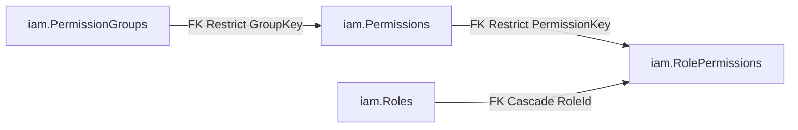

catalog กลางของ rf2 — vocabulary เดียวที่แทน catalog เดิมซึ่งเคยซ้ำกันสองชุด (admin/merch). ไม่มี RLS
predicate; per-merchant visibility บน `Roles`/`RolePermissions` เป็น app-layer floor.
`pol_app` ได้แค่ **SELECT** บน `PermissionGroups`/`Permissions` (catalog seed โดย migration, immutable at
runtime) แต่ได้ SELECT/INSERT/UPDATE/DELETE บน `Roles`/`RolePermissions`.

### PermissionGroup -> `iam.PermissionGroups`  (9 seed rows)

> ตัวอย่าง: migration `20260712185912_SeedData` (8 กลุ่มแรก) + `20260723150000_SeedPolicyPermissions`
> (อีก 2 กลุ่ม) − `20260731065539_RetireCatalogPermissions` (ถอด 1 กลุ่ม `catalog`, 2026-07-31) —
> vocabulary ต้นทางคือ `Iam.Domain/Permissions/Keys.cs` (integration test บังคับว่าไม่ drift).

| Field | Type | Null | Key | ตัวอย่าง | หมายเหตุ |
|---|---|---|---|---|---|
| Key | nvarchar(32) | N | PK | `merchants.users` | เช่น `txn`, `merchant`, `user`, `system`, `merchants.users`, `payment`, `roles`, `merchants.policies`, `policies` — string คงที่ ห้าม rename หลัง ship |
| LabelTh | nvarchar(128) | N | | `ผู้ใช้งานร้านค้า` | ป้ายภาษาไทยที่คอนโซลใช้จัดหัวข้อ |
| Scope | int | N | | `0` (Platform) | `Scope` (Platform=0, Merchant=1). กลุ่ม Platform 6 กลุ่ม / Merchant 3 กลุ่ม — คุมว่า key ในกลุ่มนี้ให้กับ role ฝั่งไหนได้ |
| SortOrder | int | N | | `5` | ลำดับแสดงผล 1-10 (ไม่มี unique constraint) |

**คืออะไร**: บัญชีรายชื่อ "หมวดหมู่สิทธิ์" กลาง (เช่นหมวด `merchants.users`, หมวด `payment`) ที่ใช้จัดกลุ่มสิทธิ์ย่อยใน `iam.Permissions` ให้อยู่หมวดเดียวกันตอนแสดงในหน้าตั้งค่า role ของทั้งสองคอนโซล
**บทบาท**: เป็นชั้นบนสุดของ catalog สิทธิ์กลางที่แทนที่ catalog ซึ่งเคยซ้ำกันสองชุด (admin/merch) — ดู `docs/reference/iam.md` สำหรับบริบท RBAC เต็ม คอลัมน์ `Scope` (Platform 6 กลุ่ม / Merchant 3 กลุ่ม) คือจุดเดียวที่กำหนดว่าหมวดนี้เปิดให้ role ฝั่งไหนใช้ — `iam.Permissions` ไม่เก็บ Scope ซ้ำ สืบทอดจากที่นี่เท่านั้น
**ถ้าไม่มีตารางนี้จะพังยังไง**: `iam.Permissions` จะไม่มีที่ผูก label ภาษาไทย/ลำดับแสดงผลเป็นหมวด และไม่มีที่มาของ Scope กลาง (ต้องเก็บ Scope ซ้ำในทุกแถวของ Permissions แทน เสี่ยง drift ระหว่าง permission ที่ควรอยู่หมวดเดียวกันแต่ Scope ไม่ตรงกัน) หน้าตั้งค่า role ต้องแสดงสิทธิ์ทั้งหมด 22 รายการเป็น list แบนราบไม่มีหัวข้อจัดกลุ่ม
**ทำงานยังไง**: seed คงที่ผ่าน migration 2 รอบแรก (`20260712185912_SeedData` 8 กลุ่มแรก + `20260723150000_SeedPolicyPermissions` อีก 2 กลุ่ม) แล้วถอด 1 กลุ่ม (`catalog`) ใน `20260731065539_RetireCatalogPermissions` เหลือ 9 กลุ่ม `pol_app` ได้แค่ SELECT (ไม่มี grant INSERT/UPDATE/DELETE ให้เลย — catalog immutable at runtime) แก้ได้ทางเดียวคือเปิด migration ใหม่

### Permission -> `iam.Permissions`  (22 seed rows)

> ตัวอย่าง: migration `SeedData` (20 keys) + `SeedPolicyPermissions` (4 keys) − `RetireCatalogPermissions`
> (ถอด 2 keys: `product.create`/`product.update`, 2026-07-31) — catalog นี้ `pol_app`
> อ่านได้อย่างเดียว แก้ผ่าน migration เท่านั้น.

| Field | Type | Null | Key | ตัวอย่าง | หมายเหตุ |
|---|---|---|---|---|---|
| Key | nvarchar(64) | N | PK | `merchants.policies.write` | เช่น `txn.view`, `roles.manage`, `payment.redirect`. ระวังคู่ที่หน้าตาคล้าย: `user.roles` (Platform) กับ `users.roles` (Merchant) เป็นคนละ key |
| GroupKey | nvarchar(32) | N | FK, IX | `merchants.policies` | -> `iam.PermissionGroups.Key` (Restrict) — `Scope` ของ key มาจากกลุ่ม ไม่ได้เก็บซ้ำที่นี่ |
| LabelTh | nvarchar(160) | N | | `แก้ไขข้อมูลกรมธรรม์ร้านค้า` | ป้ายภาษาไทยของสิทธิ์ |
| SortOrder | int | N | | `22` | ลำดับแสดงผล 1-22 เรียงข้ามกลุ่ม |

**คืออะไร**: บัญชีรายชื่อ "สิทธิ์" แต่ละอันแบบละเอียด (เช่น แก้ไขข้อมูลกรมธรรม์ร้านค้า, ดูรายงาน) ที่ role หนึ่งจะ grant ให้ได้ทีละรายการ
**บทบาท**: เป็น vocabulary กลางที่ endpoint ทุกจุดใน API อ้างถึงผ่าน permission key เดียวกัน ทั้งฝั่ง admin และ merchant — ดู `docs/reference/iam.md` สำหรับ flow RBAC เต็ม
**ถ้าไม่มีตารางนี้จะพังยังไง**: ไม่มีที่ยืนยันว่า permission key ที่โค้ด endpoint อ้างถึง (`.RequirePermission("...")`) เป็นคำที่มีจริงในระบบ — boot-time parity guard `PermissionParity.Assert` (`src/Hosts/Api/Iam/PermissionAuthorization.cs:69`, เรียกจาก `Program.cs:2152` หลัง endpoint ทั้งหมด map เสร็จ) จะไม่มีอะไรให้เช็คคู่กับ key ที่ endpoint กำหนด typo ในโค้ดจะไม่ถูกจับตอน boot อีกต่อไป (จาก `InvalidOperationException` ตอน start กลายเป็น 403 เงียบ ๆ ตอน runtime แทน)
**ทำงานยังไง**: seed 2 รอบแรกเช่นกัน (`SeedData` 20 keys + `SeedPolicyPermissions` 4 keys) แล้วถอด 2 keys (`product.create`/`product.update`) ใน `RetireCatalogPermissions` เหลือ 22 แต่ละแถวผูก `GroupKey` (FK Restrict ไป `PermissionGroups`) และไม่เก็บ `Scope` ของตัวเอง — ยืนยันตรงกับ in-memory catalog: `Keys.KeySide` (`src/Modules/Iam/Iam.Domain/Permissions/Keys.cs:115-116`) คือ `All.ToDictionary(x => x.Key, x => GroupScope[x.GroupKey])` derive จาก group เสมอ ไม่มีค่าซ้ำเก็บแยก — DB กับโค้ด C# สอดคล้องกัน 100% `pol_app` ได้แค่ SELECT เหมือน `PermissionGroups`

### Role -> `iam.Roles`  (4 seed rows)
seed 4 role ด้วย fixed id: `platform_admin` (anchor, ทุก Platform key), `platform_auditor`,
`merchant_manager` (anchor, ทุก Merchant key), `merchant_staff` — ทั้งหมด `Status = Active`,
`MerchantId = NULL` (shared/seed). anchor role ห้าม deactivate/delete (บังคับใน Role aggregate).

> ตัวอย่าง: migration `SeedData` (id คงที่ 4 ตัว) — กติกาจาก `Iam.Domain/Roles/Role.cs`.

| Field | Type | Null | Key | ตัวอย่าง | หมายเหตุ |
|---|---|---|---|---|---|
| Id | uniqueidentifier | N | PK | `11111111-1111-1111-1111-111111111111` (platform_admin) | seed 4 ตัวใช้ id คงที่: `1111…`=platform_admin, `5555…`=platform_auditor, `aaaa…`=merchant_manager, `bbbb…`=merchant_staff; role ที่สร้างใหม่เป็น `Guid.NewGuid()` |
| Code | nvarchar(64) | N | UQ | `platform_admin` | unique กับ MerchantId (unfiltered) — merchant สร้าง role โค้ดซ้ำกับ seed ได้เพราะคนละ bucket. บังคับ slug `^[a-z0-9_]+$` (ลงใน route `/admins/roles/{code}`) และแก้ไม่ได้หลังสร้าง |
| Name | nvarchar(128) | N | | `ผู้ดูแลแพลตฟอร์ม` | ชื่อที่แสดงในคอนโซล (แก้ได้) |
| Description | nvarchar(256) | Y | | `เข้าถึงได้ทุกส่วนของแพลตฟอร์ม รวมถึงการตั้งค่าความปลอดภัย` | คำอธิบาย; NULL ได้ |
| Color | nvarchar(16) | Y | | `red` (seed ใช้ `red`/`gray`/`blue`) | สี badge ในคอนโซล; NULL ได้ |
| Status | int | N | | `0` (Active) | `RoleStatus` (Active=0, Inactive=1). Inactive = ไม่ให้สิทธิ์อะไรเลยแม้ยังมี assignment ค้างอยู่ |
| Scope | int | N | | `0` (Platform) | `Scope` (Platform=0, Merchant=1). **immutable** ตั้งตอน Create เท่านั้น; permission ที่ grant ได้ต้อง scope ตรงกัน |
| MerchantId | uniqueidentifier | Y | UQ, CK | `NULL` (seed/shared) หรือ `e1000000-…-0001` (role ของ merchant นั้น) | null = shared/seed role |
| — | — | — | CK | — | `CK_Roles_ScopeMerchant`: `([Scope] = 0 AND [MerchantId] IS NULL) OR [Scope] = 1` |

**คืออะไร**: ชื่อ "บทบาท" หนึ่งชุด (เช่น "ผู้ดูแลแพลตฟอร์ม") ที่รวมสิทธิ์หลายรายการเข้าด้วยกัน แล้วเอาไปมอบให้คนใช้งานคนหนึ่งได้ ทั้งชุด role ที่ platform สร้างไว้ให้ (seed) และ role ที่ merchant สร้างเองได้
**บทบาท**: เป็น aggregate เดียวที่แทนที่ role type ซึ่งเคยซ้ำกันสองชุด (`Admins.Domain.Roles.Role` / `Merchants.Domain.Users.Roles.Role`) — ผูกออกไปยัง assignment table ต่อฝั่ง (`admin.RoleAssignments`/`merch.RoleAssignments`, FK Restrict, คนละโมดูล) ซึ่งเป็นจุดที่มอบ role ให้คนจริง ดู `docs/reference/iam.md` สำหรับบริบท RBAC เต็ม
**ถ้าไม่มีตารางนี้จะพังยังไง**: ไม่มีที่ผูก grant ใด ๆ เข้ากับชื่อบทบาทที่มนุษย์เข้าใจได้เลย และไม่มี "recovery anchor" กันคนล็อกตัวเองออกจากระบบ — `Role.PlatformAdminCode`/`Role.MerchantManagerCode` (`src/Modules/Iam/Iam.Domain/Roles/Role.cs:20-24`) ถูก comment เรียกตรงๆ ว่า "the lockout-recovery roles" หากตารางนี้หาย role กู้คืนสองตัวนี้ก็ไม่มีที่อยู่ ทุกฝั่งเสี่ยงล็อกตัวเองออกถาวรถ้า role อื่นถูกลบ/ปิดหมด
**ทำงานยังไง**: `Role.cs` เป็นจุดบังคับกฎทั้งหมด — `IsSeedAnchor` (บรรทัด 56-59) เช็คว่าเป็น seed anchor ก็ต่อเมื่อ `MerchantId is null` **และ** `Code` ตรงกับ anchor คงที่ (merchant สร้าง custom role โค้ดซ้ำชื่อ `platform_admin` ได้เพราะคนละ MerchantId bucket แต่จะไม่ถูกนับเป็น anchor) `Deactivate()`/`EnsureDeletable()` (บรรทัด 101-114) throw `InvalidOperationException` ถ้าเป็น anchor `SetPermissions()` (บรรทัด 120-144) reject ทั้ง key นอก catalog และ key ที่ `catalog[k] != Scope` ของ role เอง (cross-scope grant เป็นไปไม่ได้ในระดับ domain) DB บังคับซ้ำด้วย `CK_Roles_ScopeMerchant` และ unique index `(MerchantId, Code)` ที่ `.HasFilter(null)` แบบตั้งใจ (`RoleConfigurations.cs:34`, comment อ้างว่า filter ค่า default ของ SQL Server provider จะยกเว้นแถว NULL ทุกแถวออกจาก uniqueness เงียบ ๆ — Codex P2 เคยจับได้ใน PR #98) ทำให้ shared/seed role ชื่อซ้ำกันไม่ได้แต่ merchant คนละรายใช้โค้ดซ้ำกันได้

### RolePermission -> `iam.RolePermissions`  (30 seed rows)

> ตัวอย่าง: migration `SeedData` (28 grants) + `SeedPolicyPermissions` (6 grants) − `RetireCatalogPermissions`
> (ลบ 4 grants: `merchant_manager`/`merchant_staff` × `product.create`/`product.update`, 2026-07-31) — id ใช้
> `NEWID()` ไม่คงที่ข้าม environment.

| Field | Type | Null | Key | ตัวอย่าง | หมายเหตุ |
|---|---|---|---|---|---|
| Id | uniqueidentifier | N | PK | `6f0d…` (seed ใช้ `NEWID()`) | surrogate key — ไม่ใช่ค่าที่ต้องอ้างถึง ให้ค้นด้วย (RoleId, PermissionKey) แทน |
| RoleId | uniqueidentifier | N | FK, UQ | `11111111-1111-1111-1111-111111111111` | -> `iam.Roles.Id` (Cascade); unique กับ PermissionKey — ลบ role แล้ว grant หายตาม |
| PermissionKey | nvarchar(64) | N | FK, IX, UQ | `merchants.policies.read` | -> `iam.Permissions.Key` (Restrict) — กัน phantom key. Scope ของ key ต้องตรงกับ Scope ของ role (บังคับใน `Role.Create`) |

**คืออะไร**: ตารางเชื่อม (junction) ที่บอกว่า "บทบาทนี้ได้สิทธิ์อะไรบ้าง" — แต่ละแถวคือ 1 คู่ (role, permission) ที่ถูก grant จริง
**บทบาท**: เป็นข้อมูล grant จริงที่ `iam.Roles`/`iam.Permissions` (ทั้งคู่แค่ตั้งชื่อ) ต้องมีตารางนี้ถึงจะมีความหมายเชิงสิทธิ์จริง ดู `docs/reference/iam.md` สำหรับบริบท RBAC เต็ม
**ถ้าไม่มีตารางนี้จะพังยังไง**: role ทุกตัวจะกลายเป็นแค่ชื่อเปล่า ไม่มีสิทธิ์อะไรติดมาด้วยเลย และผูกกับ boot-time guard จริง — `PermissionParity.Assert` (`src/Hosts/Api/Iam/PermissionAuthorization.cs:69`, เรียกจาก `Program.cs:2152`) วนเช็คทุก `RequiredPermission` metadata ที่ endpoint ประกาศไว้ ว่า (a) key มีอยู่ใน `Keys.AllKeys` จริง และ (b) side ของ key ตรงกับ auth policy ของ endpoint (`AuthPolicyScheme`) — ถ้าไม่มีระบบ grant นี้เลยก็ไม่มีทางเช็คได้ว่า role ไหนควรได้ key ไหนจริง กฎ scope-matching ทั้งหมดจะพังไปด้วย
**ทำงานยังไง**: `Id` เป็น surrogate key (`NEWID()`) ที่ไม่ควรอ้างถึงตรง ๆ ให้ค้นด้วย `(RoleId, PermissionKey)` แทน — บังคับด้วย unique index `(RoleId, PermissionKey)` จริงที่ `RoleConfigurations.cs:50` และ FK `PermissionKey -> Permissions.Key` เป็น `DeleteBehavior.Restrict` (`RoleConfigurations.cs:53-54`, กัน key ที่มี role ถืออยู่ถูกถอดจาก catalog ได้) ส่วน `RoleId -> Roles.Id` เป็น `Cascade` (`RoleConfigurations.cs:37-38`, ลบ role แล้ว grant หายตาม) การบังคับ side ตรงกัน (permission Scope ต้องตรง role Scope) ทำที่ domain layer ก่อนถึง DB — ดู `Role.SetPermissions` ในบล็อก `iam.Roles` ด้านบน ไม่ใช่ constraint ระดับ DB

---

## cfg schema (context: ControlPlane) — 4 ตาราง

เหตุผลที่แยกเป็น 4 ตาราง/4 โมดูลอิสระ (แทนที่จะรวมเป็น "master data" ตารางเดียวแบบ generic key-value) มีหลักฐานตรงในโค้ด — comment บน aggregate เอง (`Division.cs:11`) บอกว่า "Standalone aggregate since masterdata-split — the retired shared base logic lives inline, verbatim": เดิมเคยมี base class กลางรองรับทั้ง 4 concept ร่วมกัน แล้วถูกแยกให้แต่ละมิติ (ฝ่าย/ระดับ/สำนักงาน/ตำแหน่ง) เป็น aggregate + module ของตัวเอง (`Divisions.Domain`, `Levels.Domain`, `Offices.Domain`, `Positions.Domain` แยก Application/Infrastructure ครบชุดคนละโมดูล) เพื่อให้แต่ละมิติวิวัฒนาการ schema ได้อิสระจากกัน (เช่น ถ้าวันหนึ่ง Position ต้องมี field เพิ่มที่ Office ไม่ต้องมี ก็ไม่กระทบตารางอื่น) แม้วันนี้ทั้ง 4 ตารางจะมีรูปคอลัมน์เหมือนกันเป๊ะโดยบังเอิญก็ตาม — รายละเอียด business ของแต่ละมิติ ดู `docs/reference/admins.md` (Levels โดยเฉพาะ ดู [`levels.md`](levels.md)). ส่วน `IsActive` แทนการลบแถวจริง: grant ที่ให้ `pol_app` มีแค่ SELECT/INSERT/UPDATE ไม่มี DELETE เลย (`docs/reference/entity-fields.md` บรรทัด 1325) สอดคล้องกับ FK Restrict จาก `admin.Users` (4 คอลัมน์ nullable, บรรทัด 223-226 ของไฟล์นี้) — แถวที่มีคนอ้างอยู่ลบไม่ได้อยู่แล้วในระดับ DB, `Division.Deactivate()` (`Division.cs:47`) เป็นแค่ปิดไม่ให้ assign ใหม่ ส่วนบัญชีที่อ้างแถว inactive อยู่แล้วยังอ้างต่อได้ปกติ (guard "ห้าม assign ใหม่" อยู่ที่ application layer ไม่ใช่ DB)

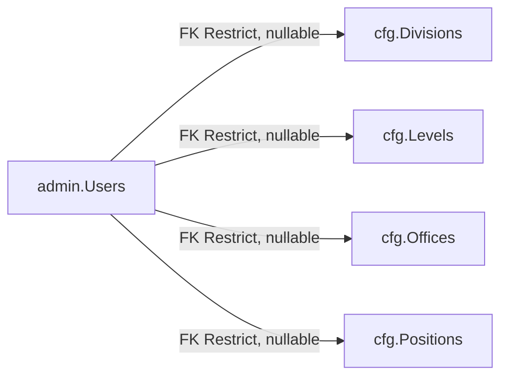

reference data ของฝ่ายบุคคล เจ้าของคือ 4 โมดูล standalone (Divisions/Levels/Offices/Positions,
masterdata-split 2026-07-19). ทั้ง 4 ตารางมีรูปเดียวกันเป๊ะ และถูกอ้างเป็น FK จาก `admin.Users`.

| Table | Seed rows |
|---|---|
| `cfg.Divisions` | 10 |
| `cfg.Levels` | 10 |
| `cfg.Offices` | 8 |
| `cfg.Positions` | 12 |

> ตัวอย่าง: migration `20260712185912_SeedData` — id คงที่ (ห้ามใช้ `NEWID()` ใน migration) namespaced
> ต่อตาราง: `a1…`=Positions, `b2…`=Offices, `c3…`=Levels, `d4…`=Divisions. CI fresh-DB gate pin จำนวนแถวไว้.

| Field | Type | Null | Key | ตัวอย่าง | หมายเหตุ |
|---|---|---|---|---|---|
| Id | uniqueidentifier | N | PK | `a1000000-…-0007` (positions/manager) | id คงที่ทุก environment — `admin.Users` FK ชี้มาที่นี่จึงย้ายไม่ได้ |
| Code | nvarchar(64) | N | UQ | `manager` / `hq` / `level_3` / `customer_service` | slug lowercase snake_case ใช้อ้างอิงในโค้ด/import |
| Name | nvarchar(200) | N | | `ผู้จัดการ` / `สำนักงานใหญ่` / `ระดับ 3` / `ฝ่ายบริการลูกค้า` | ชื่อภาษาไทยที่แสดงผล |
| IsActive | bit | N | | `1` | seed ทั้งหมดเป็น 1; ปิดใช้งานด้วย 0 แทนการลบ (FK เป็น Restrict ลบไม่ได้ถ้ายังมีคนอ้าง) |

**คืออะไร**: 4 บัญชีรายชื่อข้อมูลอ้างอิงฝ่ายบุคคลที่แอดมินคนหนึ่งผูกตัวเองเข้าไปได้ — `cfg.Divisions` (ฝ่าย/ภาค), `cfg.Levels` (ระดับ), `cfg.Offices` (สถานที่ปฏิบัติงาน), `cfg.Positions` (ตำแหน่ง) — คนละมิติ ไม่เกี่ยวกัน แต่หน้าตาคอลัมน์เหมือนกันเป๊ะ (Id/Code/Name/IsActive)
**บทบาท**: เป็น dropdown/reference data ที่ `admin.Users` ผูกเข้าไปทีละ 4 มิติผ่าน 4 FK คนละคอลัมน์ (`PositionId`/`OfficeId`/`LevelId`/`DivisionId`, ทั้งหมดแก้พร้อมกันได้ทีเดียวผ่าน `UpdateProfile`) — บริบทการใช้งานจริงในโปรไฟล์แอดมิน ดู `docs/reference/admins.md`
**ถ้าไม่มีตารางนี้จะพังยังไง**: `admin.Users` ไม่มีที่ผูกโปรไฟล์ HR (ตำแหน่ง/สถานที่/ระดับ/ฝ่าย) เป็น structured data ต้องเก็บเป็น free-text แทน เสี่ยงพิมพ์ชื่อเดียวกันหลายแบบ (เช่น "สำนักงานใหญ่" vs "สนง.ใหญ่") และหน้ารายงาน/filter ตาม dimension เหล่านี้ทำไม่ได้เลยเพราะไม่มี id คงที่ให้ join
**ทำงานยังไง**: ทั้ง 4 ตัว seed คงที่ผ่าน `20260712185912_SeedData` ด้วย id คงที่ต่อ prefix (`a1…`=Positions/`b2…`=Offices/`c3…`=Levels/`d4…`=Divisions, ห้าม `NEWID()` ใน migration เพราะ `admin.Users` FK ชี้ตรงมาที่ id เหล่านี้) `Code` เป็น slug ตรวจด้วย regex `^[a-z0-9_]+$` และ immutable หลังสร้าง (identity ของแถว, ดู `Division.cs:16,32` — `Rename` แก้ได้แค่ `Name` เท่านั้น) `Activate()`/`Deactivate()` สลับ `IsActive` ตรงๆ ไม่มี soft-delete flag แยก แถว inactive ยังถูก FK อ้างต่อได้ (data ประวัติศาสตร์ไม่หาย) แค่ห้าม assign ใหม่ (guard ที่ application layer)

---

## dbo schema (context: ControlPlane) — 1 ตาราง

`dbo` ไม่ใช่ schema แบบ 9 schema อื่นในระบบ (ไม่มีเจ้าของ business module) — เป็นข้อยกเว้นเดียวที่ schema guard ยอมให้อยู่ตรงนี้เพราะเป็น framework-owned table (ASP.NET Core Data Protection) ไม่ใช่ domain entity ของโปรเจกต์ ไม่มี business flow ให้ pointer ไปที่ไหนเพราะไม่มีความหมายทางธุรกิจเลย มีไว้เพียงให้ระบบ login/OIDC ทำงานได้ข้าม restart/ข้าม instance

### DataProtectionKey -> `dbo.DataProtectionKeys`
ASP.NET Core Data Protection key ring (plumbing, ไม่ใช่ domain entity) — ให้ OIDC correlation/state/nonce
cookies รอด restart + shared ข้าม instance. **ข้อยกเว้นเดียว** ของ schema guard ที่ยอมให้อยู่ `dbo`
(framework-owned). `pol_app` มีแค่ SELECT/INSERT (key ring เป็น append-only).

> ตัวอย่าง: derive จาก ASP.NET Core Data Protection (`EntityFrameworkCoreXmlRepository`) — framework
> เขียนเองทั้งหมด ไม่มี seed และแอปไม่เคยเขียน/อ่านตารางนี้ตรงๆ.

| Field | Type | Null | Key | ตัวอย่าง | หมายเหตุ |
|---|---|---|---|---|---|
| Id | int (identity) | N | PK | `1` | identity ของ SQL Server (ตารางเดียวในระบบที่ไม่ใช่ GUID) |
| FriendlyName | nvarchar(256) | Y | | `key-3a1f9c2e-8d44-4f10-b7c5-9e0a6d21b834` | ชื่อที่ framework ตั้งให้ key (รูปแบบ `key-<guid>`); NULL ได้ |
| Xml | nvarchar(max) | N | | `<key id="3a1f9c2e-…" version="1">…</key>` | key-ring element ที่ framework เข้ารหัสมาแล้ว (opaque) — ห้าม parse/แก้เอง |

**คืออะไร**: ที่เก็บ "กุญแจเข้ารหัส" ที่ ASP.NET Core ใช้ปกป้องข้อมูลชั่วคราวระหว่างขั้นตอน login (เช่น cookie ที่บอกว่า "กำลังรอ Google ตอบกลับ") ไม่ใช่ตารางที่เก็บข้อมูลธุรกิจใด ๆ
**บทบาท**: เป็น plumbing ของ framework ล้วน ๆ ไม่ผูกกับ business flow ไหนเลย มีไว้เพื่อให้ OIDC correlation/state/nonce cookie (ระหว่างขั้นตอน admin login ผ่าน Google) รอดจาก server restart และใช้ร่วมกันได้ข้าม instance เวลารันหลาย instance
**ถ้าไม่มีตารางนี้จะพังยังไง**: framework จะ fallback ไปใช้ key ring แบบ ephemeral (in-memory) แทน — ทุกครั้งที่ restart กุญแจหายหมด ทำให้ทุก login ที่ค้างอยู่กลางทาง (ระหว่างถูก redirect ไป Google แล้วยังไม่ callback กลับ) ล้มเหลวทันที และถ้ารันหลาย instance พร้อมกัน คนละ instance จะถอดรหัส cookie ของกันและกันไม่ได้เลย (login พังแบบสุ่มตาม instance ที่รับ request) — มี fail-fast guard จริงป้องกันเคสนี้: `AdminDataProtection.RequirePersistentDataProtection` (`src/Hosts/Api/Admins/AdminDataProtection.cs:29-36`) throw `InvalidOperationException` ตอน boot ถ้านอก Development แล้ว key ring ที่ผูกไว้ไม่ใช่ store ที่ persist ลง DB จริง (เช็คผ่าน marker interface `IPersistedXmlRepository` ไม่ใช่เช็ค type ภายในตรง ๆ)
**ทำงานยังไง**: แอปไม่เคยอ่าน/เขียนตารางนี้ตรง ๆ ผ่าน business code เลย — มีแค่ `EfCoreXmlRepository` (`src/Persistence/Persistence.ControlPlane/DataProtection/EfCoreXmlRepository.cs:25-53`) implement `IXmlRepository` ของ framework สองเมธอดเท่านั้น: `GetAllElements()` อ่านทุกแถวผ่าน `ControlPlaneDbContext` แล้ว parse เป็น XML, `StoreElement()` append แถวใหม่แล้ว `SaveChanges()` — ไม่มี update/delete เลย (comment ยืนยันตรง: "The framework only ever appends keys + reads them") wiring จริงอยู่ที่ `AdminDataProtection.AddAdminDataProtection` (`AdminDataProtection.cs:15-22`) ที่ตั้ง `ApplicationName = "pol-admin-bff"` คงที่แล้วผูก `KeyManagementOptions.XmlRepository` เข้ากับ instance นี้ — Keys อ่านแบบ lazy ตอน protect/unprotect ครั้งแรก ไม่แตะ SQL ตอน boot สิทธิ์ DB จริงคือ `GRANT SELECT, INSERT ON dbo.DataProtectionKeys TO pol_app;` (`src/BuildingBlocks/BuildingBlocks.Infrastructure/Persistence/Migrations/20260719081817_RlsTeardownAndOnePrincipal.cs:338`) ตรงกับ append-only semantics ข้างต้นเป๊ะ

---

## merch schema — 12 ตาราง (8 = MerchantUsers, 4 = MerchantRuntime)

schema `merch` เก็บทั้งข้อมูล "ร้านค้า" (merchant) และ "คนที่ทำงานแทนร้านค้า" (merchant user) ไว้ใน SQL schema เดียวกัน แต่โค้ดฝั่ง .NET แบ่งเป็น 2 runtime context แยกขาดจากกันจริงๆ ไม่ใช่แค่แบ่งโฟลเดอร์: **MerchantUsers** (8 ตาราง — Users/Sessions/AuthAudits/ExternalLogins/RegistrationAudits/RegistrationNotices/RoleAssignments/UserOutbox) คุมโดย `MerchantUserDbContext` ผ่าน connection pol_admin (control-plane เดียวกับฝั่ง admin) เพราะ "ตัวตนคน" ต้องมีอยู่ได้ก่อนที่จะรู้ว่าเขาทำงานให้ร้านไหน (สมัครก่อน อนุมัติทีหลัง MerchantId ถึงจะถูกเซ็ต) — ส่วน **MerchantRuntime** (4 ตาราง — Merchants/VaultSecrets/VaultRevealAudits/ProvisioningAudits) คุมโดย `MerchantRuntimeDbContext` เพราะเป็นข้อมูลที่ scope ต่อร้านค้าเสมอ (รายละเอียดกลไก query-filter/isolation ดู docs/reference/db-connection-and-rls.md หัวข้อ "ไม่มี RLS")

ผลข้างเคียงที่ verify แล้วจากโค้ดจริง (EF config ทุกไฟล์ในทั้ง 2 context comment ไว้ตรงกันว่า "None of these entities carry a CLR navigation to another type in this cluster") คือไม่มี FK จริงในฐานข้อมูลข้าม 2 context นี้เลยสักเส้นเดียว แม้จะอยู่ schema เดียวกัน — `merch.Users.MerchantId -> merch.Merchants.Id` เป็น app-layer ล้วนๆ เช่นเดียวกับทุกเส้นที่โยงไป `merch.Merchants.Id` จากอีกฝั่ง ยกเว้นเส้นเดียวที่มี FK จริงข้ามไปนอก schema: `merch.RoleAssignments.RoleId -> iam.Roles.Id` (`ON DELETE RESTRICT`, สร้างไว้ตั้งแต่ migration `20260712185344_InitialSchema.cs:688-694` และยังไม่เคยถูก drop แม้ EF model ปัจจุบันของ `Persistence.MerchantUsers` จะเลิกประกาศ `HasOne` แล้วก็ตาม — ดูรายละเอียดที่หัวข้อ `merch.RoleAssignments` ด้านล่าง)

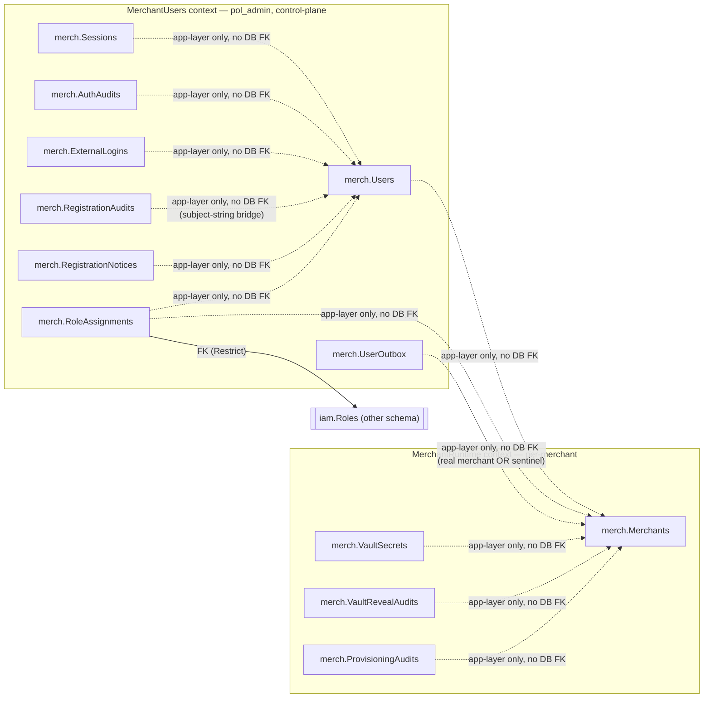

### User -> `merch.Users`  (context: MerchantUsers)
merchant-user identity + person details. `MerchantId` เป็น column บน user เอง (nullable — bind ตอน admin
approve; ก่อนหน้านั้น user ยัง `PendingApproval` และไม่ผูก merchant). ไม่มี column role
(อยู่ใน `merch.RoleAssignments`).

> ตัวอย่าง: `seed-demo.sql` (12 rows `e5000000-…` — ครบทั้ง 4 Status และ 2 PersonType);
> field รูปถ่ายไม่มีใน seed — derive จาก `Merchants.Infrastructure/LocalPhotoStore.cs`.

| Field | Type | Null | Key | ตัวอย่าง | หมายเหตุ |
|---|---|---|---|---|---|
| Id | uniqueidentifier | N | PK | `e5000000-…-0001` | `Guid.NewGuid()` ตอน `User.Register` |
| Subject | nvarchar(256) | N | UQ | `demo-mch-1` | OIDC `sub`; unique = 1 record/subject (replay/dedup guard ตอน submit). ต่างจากฝั่ง admin ตรงที่ **NOT NULL** — ฝั่งนี้ผู้สมัครสมัครเองหลัง login แล้ว |
| Email | nvarchar(320) | N | | `somchai.p@demo.pol.local` | จาก id_token (informational) — ไม่ unique, ไม่ใช่ key ที่ใช้ resolve |
| Status | int | N | | `1` (Active) | `UserStatus` (PendingApproval=0, Active=1, Rejected=2, Suspended=3). เส้นทาง: Register->PendingApproval; approve->Active; reject->Rejected; resubmit->PendingApproval; suspend->Active->Suspended |
| MerchantId | uniqueidentifier | Y | | `e1000000-…-0001` (`NULL` ตอน PendingApproval) | merchant ที่ทำงานแทน (bind ตอน approve). approve ซ้ำ merchant เดิม = no-op; approve เข้า merchant อื่น = throw |
| DisplayName | nvarchar(200) | N | | `สมชาย พริวิเลจ` | server-compute จาก FirstName+LastName (ตัดที่ 200 ตัว) — ฟอร์มส่งค่านี้มาเองไม่ได้ |
| FirstName | nvarchar(200) | N | | `สมชาย` (นิติบุคคลใน seed ใช้ `-`) | required — ประกอบเป็น DisplayName |
| LastName | nvarchar(200) | N | | `พริวิเลจ` | required |
| PersonType | int | Y | | `0` (Individual) | `PersonType` (Individual=0, Juristic=1) |
| IdNumber | nvarchar(64) | Y | | `1100200300401` (บุคคล) / `0105561000045` (นิติบุคคล 13 หลัก) | เลขบัตรประชาชน/เลขนิติบุคคล — ค่าปลอมทั้งหมดใน seed |
| ProducerCode | nvarchar(64) | Y | | `PRD-VP-001` | รหัสตัวแทน; NULL ได้ (ผู้สมัครที่ยังไม่อนุมัติมัก NULL) |
| LicenseNumber | nvarchar(64) | Y | | `LIC-2024-00101` | เลขใบอนุญาตตัวแทน; NULL ได้ |
| Phone | nvarchar(32) | Y | | `0812345001` | เก็บ verbatim ไม่ normalize |
| PhotoObjectKey | nvarchar(256) | Y | | `4d9b1e77c0a34fb1a2e5c6d7e8f90123.jpg` | opaque key (server-gen); bytes อยู่นอก DB. รูปแบบ `{Guid:N}{นามสกุลตาม content-type}` — **ไม่เคยใช้ชื่อไฟล์จาก client** (กัน path traversal) |
| PhotoContentType | nvarchar(128) | Y | | `image/jpeg` | content-type ที่ผ่าน validate (type/magic byte/size) แล้ว ส่งกลับพร้อม `nosniff` |
| CreatedAt | datetime2 | N | | `2026-07-26T08:15:00Z` | เวลาที่สมัคร |

**คืออะไร**: บัญชีของ "คน" ที่เข้ามาทำงานแทนร้านค้า/บริษัทในเครือ (staff/manager ของ merchant) — คนสมัครเข้ามาเองผ่านการ login ด้วย Google/Microsoft ก่อน แล้วรอแอดมินอนุมัติทีหลังถึงจะผูกกับร้านค้าจริง รายละเอียดตัวบุคคล (ชื่อ, เลขบัตร, เลขใบอนุญาตตัวแทน, รูปถ่าย) เก็บอยู่บนบัญชีเดียวกันนี้เลย ไม่แยกเป็น profile คนละตาราง
**บทบาท**: เป็นจุดเริ่มต้นของ flow "สมัคร -> รออนุมัติ -> ใช้งานได้" ทั้งหมดฝั่ง merchant-user ทุกตารางอื่นใน MerchantUsers context (Sessions/AuthAudits/ExternalLogins/RoleAssignments) อ้างกลับมาที่ Id ของตารางนี้ ดูภาพรวม flow ธุรกิจเต็มที่ docs/reference/platform-modules.md
**ถ้าไม่มีตารางนี้จะพังยังไง**: ไม่มีที่เก็บเลยว่า "คนนี้คือใคร ผูกกับร้านไหน สถานะอนุมัติถึงไหนแล้ว" — login callback จะไม่มีทางแยกคนที่ยังไม่เคยสมัคร (ต้องออก registration ticket) กับคนที่สมัครแล้วรออนุมัติ (403) กับคนที่ใช้งานได้แล้ว (ออก session) เพราะการ resolve ทั้งหมดอิงจากแถวเดียวนี้เท่านั้น
**ทำงานยังไง**: state machine 4 สถานะคุมโดย domain method ล้วนใน `User.cs` — `Register` สร้างที่ PendingApproval (User.cs:71-76), `Approve` เข้า Active + set MerchantId แบบ idempotent (approve ซ้ำ merchant เดิม = no-op, approve เข้า merchant อื่น = throw, User.cs:115-132), `Reject`/`Resubmit` สลับ Rejected<->PendingApproval (User.cs:135-140, 144-149) `Suspend` มีเมธอดอยู่จริง (User.cs:153-158) แต่ grep ทั้ง repo ไม่พบ command handler ฝั่ง merchant เรียกมันเลยสักจุด (`SuspendCommand` ที่มีจริงมีแค่ฝั่ง Admin — `Admins.Application/Users/SuspendAdmin.cs`) วันนี้จึงยังไม่มี host endpoint ไหนตั้ง Suspended ได้จริง. `Status` และ `MerchantId` ถูกตั้งเป็น EF concurrency token (`UserConfiguration.cs:20-30`) กัน approve/reject 2 คำสั่งแข่งกันบนแถวเดิมพร้อมกัน — ฝ่ายแพ้ race ได้ `DbUpdateConcurrencyException` -> 409 ทั้ง transaction ไม่มีทาง commit ครึ่งๆ กลางๆ. อ่านตารางนี้แบบไม่กรอง merchant ได้ทาง `IAccountResolver`/`IAccountStore` เท่านั้น (`IgnoreQueryFilters()` escape-hatch ports — `MerchantAccountResolver.cs`, `MerchantAccountStore.cs`) เพราะ flow ก่อนอนุมัติยังไม่มี actor ผูก merchant ให้ query filter ปกติทำงานได้ — กลไก query-filter/isolation เต็มดู docs/reference/db-connection-and-rls.md

### Session -> `merch.Sessions`  (context: MerchantUsers)
server-side session ของ merchant-user BFF — โครงเหมือน `admin.Sessions` เป๊ะ (owner `MerchantUserId`
แทน `PlatformUserId`): opaque token เก็บแค่ SHA-256, rotation family + reuse detection, prune by
absolute expiry.

> ตัวอย่าง: derive จาก `Merchants.Domain/Users/Session.cs` + `MerchantAuth`/`Session:*` config — ไม่มี seed.

| Field | Type | Null | Key | ตัวอย่าง | หมายเหตุ |
|---|---|---|---|---|---|
| Id | uniqueidentifier | N | PK | `5e82ba14-…-0cd7` | `Guid.NewGuid()` ตอน Start/Rotate |
| FamilyId | uniqueidentifier | N | IX | `a71c93f0-…-6b25` | rotation family — สืบทอดข้ามทุก rotate; revoke ทั้ง family ได้ทีเดียว |
| TokenHash | varbinary(32) | N | UQ | `0x5f2e7b…` (32 bytes) | SHA-256 ของ cookie token — cookie จริงไม่ถูกเก็บ |
| MerchantUserId | uniqueidentifier | N | IX | `e5000000-…-0001` | -> `merch.Users.Id`; logout-all/suspend revoke |
| Status | int | N | | `0` (Active) | `SessionStatus` (Active=0, Superseded=1, Revoked=2) |
| IssuedAt | datetime2 | N | | `2026-07-26T08:15:00Z` | เวลาที่ออก session |
| IdleExpiresAt | datetime2 | N | | `2026-07-26T08:45:00Z` | idle sliding (~30m) |
| AbsoluteExpiresAt | datetime2 | N | IX | `2026-07-26T16:15:00Z` | hard cap (~8h); prune key |
| SupersededAt | datetime2 | Y | | `NULL` | เวลาที่ถูก rotate; NULL ตราบที่ยัง Active |
| SupersededBySessionId | uniqueidentifier | Y | | `NULL` | reuse check — ชี้ไป session ตัวถัดไปใน family |
| CreatedIp | nvarchar(45) | Y | | `203.0.113.24` | IP ตอน login |
| UserAgent | nvarchar(256) | Y | | `Mozilla/5.0 (iPhone; CPU iPhone OS 17_5 …)` | ตัดที่ 256 ตัว |

**คืออะไร**: เซสชันฝั่งเซิร์ฟเวอร์ของคนที่ login เข้ามาทำงานแทนร้านค้า คู่กับ cookie ที่ browser ถืออยู่ ทำให้ login ค้างได้โดยไม่ต้องล็อกอินใหม่ทุก request
**บทบาท**: หนุน BFF session ของฝั่ง merchant-user ทั้งหมด โครง+กลไก rotation family/reuse detection เหมือน `admin.Sessions` เป๊ะทุกจุด ต่างแค่ผู้ถือ `MerchantUserId` แทน `PlatformUserId` (ยืนยันจาก ponytail comment ที่ `Merchants.Domain/Users/Session.cs:23` — "DUPLICATE of Admins.Domain.Users.Session ... deliberate debt, do not refactor into a shared base") — ดูกลไก rotation/reuse-detection เต็มที่หัวข้อ `admin.Sessions` ด้านบน ไม่ขอพูดซ้ำที่นี่
**ถ้าไม่มีตารางนี้จะพังยังไง**: ไม่มีที่เก็บว่า cookie ไหนยังใช้ได้จริง ทุก request หลัง login ต้อง login ใหม่ทุกครั้ง และไม่มีทาง revoke session ทันทีตอน reject/suspend ผู้ใช้ (logout-all ก็ทำไม่ได้)
**ทำงานยังไง**: เหมือน `admin.Sessions` ทุกประการ — ดูหัวข้อนั้น

### AuthAudit -> `merch.AuthAudits`  (context: MerchantUsers, append-only)
โครงเดียวกับ `admin.AuthAudits` ต่างที่ owner เป็น `MerchantUserId`.

> ตัวอย่าง: derive จาก `Merchants.Domain/Users/AuthAudit.cs` — ไม่มี seed.

| Field | Type | Null | Key | ตัวอย่าง | หมายเหตุ |
|---|---|---|---|---|---|
| Id | uniqueidentifier | N | PK | `b207e5cc-…-41af` | `Guid.NewGuid()` ตอนเขียน audit |
| EventType | nvarchar(32) | N | | `auth-denied` | login-success/logout/logout-all/rotated/family-revoked-reuse/auth-denied |
| MerchantUserId | uniqueidentifier | Y | IX | `e5000000-…-0001` / `NULL` | null เมื่อยังไม่ resolve |
| Subject | nvarchar(256) | Y | | `demo-mch-1` | OIDC `sub` |
| Reason | nvarchar(128) | Y | | `pending-approval` | label สั้น ไม่ sensitive — ห้ามใส่ token/secret/raw session id |
| CorrelationId | nvarchar(128) | N | | `9f2c1ab34d5e4f6789012345abcdef01` | ผูกกับ request เดียวกัน |
| OccurredAt | datetime2 | N | | `2026-07-26T08:15:00Z` | เวลาที่เกิด event |

**คืออะไร**: log เหตุการณ์ login/logout ของ merchant-user แบบเขียนแล้วห้ามแก้ (append-only) ไว้สืบสวนย้อนหลังได้ว่าใคร login/logout/ถูก deny ตอนไหน
**บทบาท**: โครงเดียวกับ `admin.AuthAudits` เป๊ะ ต่างแค่ owner เป็น `MerchantUserId` แทน `PlatformUserId` — ดูกลไกเต็มที่หัวข้อ `admin.AuthAudits` ด้านบน
**ถ้าไม่มีตารางนี้จะพังยังไง**: สืบสวน security incident ไม่ได้เลยว่าใคร login สำเร็จ/ถูก deny ตอนไหนจาก IP ไหน เหลือแต่ log ระดับ infrastructure (ถ้ามี) ที่ไม่ผูกกับ MerchantUserId/Subject ให้ query ตรงๆ ได้
**ทำงานยังไง**: `AuthAudit.For` (AuthAudit.cs:46-52) รับ `EventType` บังคับ ส่วน `MerchantUserId`/`Subject`/`Reason` เป็น optional (auth ถูก deny ก่อน resolve บัญชีได้ก็ยังเขียน audit ได้ — comment `AuthAudit.cs:17-19` ย้ำว่า `Reason` ต้องเป็น label สั้นไม่ sensitive ห้ามใส่ token/secret/raw session id)

### ExternalLogin -> `merch.ExternalLogins`  (context: MerchantUsers)
map external identity (Google / Entra) -> merchant user. unique `(Provider, Subject)`.

> ตัวอย่าง: `seed-demo.sql` (12 rows `e6000000-…`, 1:1 กับ `merch.Users`, provider `google` ทั้งหมด).

| Field | Type | Null | Key | ตัวอย่าง | หมายเหตุ |
|---|---|---|---|---|---|
| Id | uniqueidentifier | N | PK | `e6000000-…-0001` | `Guid.NewGuid()` ตอน `ExternalLogin.Create` |
| Provider | nvarchar(32) | N | UQ | `google` | unique กับ Subject; ค่าคงที่ 2 ตัวคือ `google` / `microsoft` (Entra) |
| Subject | nvarchar(256) | N | UQ | `demo-mch-1` | unique กับ Provider. Google ใช้ claim `sub`, Entra ใช้ `oid` |
| MerchantUserId | uniqueidentifier | N | | `e5000000-…-0001` | -> `merch.Users.Id`. คนหนึ่งผูกได้หลาย provider แต่ (Provider, Subject) ห้ามซ้ำ |

**คืออะไร**: บันทึกว่าบัญชี merchant-user คนนี้ login เข้ามาผ่านช่องทาง (provider) ไหน เช่น Google หรือ Microsoft/Entra ผูกเลข subject ที่ provider ออกให้เข้ากับบัญชีเดียวในระบบ
**บทบาท**: เป็นสะพานระหว่าง identity ภายนอก (Google/Microsoft) กับบัญชี merchant-user ภายใน เขียนครั้งเดียวตอนสมัคร (`SubmitRegistration.cs:100` — `_logins.Add(ExternalLogin.Create(...))`)
**ถ้าไม่มีตารางนี้จะพังยังไง**: ระบบจะไม่มีที่บันทึกเลยว่าบัญชีแต่ละคนสมัครผ่าน provider ไหน (`merch.Users` เองไม่มีคอลัมน์ Provider) — ตรวจสอบ/support ปัญหาการ login ย้อนหลังไม่ได้ว่าคนนี้เคยใช้ Google หรือ Microsoft
**ทำงานยังไง**: ปัจจุบันตารางนี้เป็น write-only จริงๆ จากมุมมอง application layer — `IExternalLoginRepository` (`UserPorts.cs:56-59`) มีแค่เมธอด `Add` ไม่มีเมธอดอ่านเลยสักตัว และ login resolution จริง (`ResolveLoginHandler`/`ResolveByIdHandler`) query ตรงจาก `merch.Users.Subject` ผ่าน `IAccountResolver` (`MerchantAccountResolver.cs:18-22`) โดยไม่ join ตารางนี้เลย — unique `(Provider, Subject)` บนตารางนี้จึงยังไม่ใช่กลไกที่ login พึ่งพาจริง ตัวที่บังคับ dedup จริงคือ unique index บน `merch.Users.Subject` เอง (ไม่ผูกกับ provider). โค้ดปัจจุบันเรียก `ExternalLogin.Create` แค่จุดเดียวคือตอน Registration ครั้งแรกเท่านั้น (grep ยืนยันไม่มี call site อื่น) — flow "ผูกหลาย provider เข้าบัญชีเดียว" ที่ unique `(Provider, Subject)` (แทนที่จะ unique `Subject` เดี่ยว) รองรับไว้โดย schema ยังไม่มี handler ไหนเขียนโค้ดจริงมาเรียกใช้

### RegistrationAudit -> `merch.RegistrationAudits`  (context: MerchantUsers, append-only)
audit ของ register/resubmit/approve/reject/suspend.

> ตัวอย่าง: derive จาก `Merchants.Domain/Users/RegistrationAudit.cs` (`RegistrationAuditAction`) — ไม่มี seed.

| Field | Type | Null | Key | ตัวอย่าง | หมายเหตุ |
|---|---|---|---|---|---|
| Id | uniqueidentifier | N | PK | `8ad4c0f1-…-3e69` | `Guid.NewGuid()` ตอน `RegistrationAudit.For` |
| Action | nvarchar(64) | N | | `approved` | registered/resubmitted/approved/rejected/suspended |
| ActorSubject | nvarchar(256) | Y | | `demo-adm-1` (`NULL` เมื่อ register เอง) | admin ที่ทำ (NULL = self-service). เก็บเป็น **subject string** ไม่ใช่ id — นี่คือสะพานไป `admin.Users.Subject` |
| TargetSubject | nvarchar(256) | N | | `demo-mch-3` | merchant user เป้าหมาย |
| Role | nvarchar(64) | Y | | `merchant_manager` (หลาย role คั่นด้วย comma) | role codes ตอน approve (joined); NULL บน action อื่น |
| Reason | nvarchar(1024) | Y | | `เอกสารใบอนุญาตไม่ชัดเจน` | เหตุผล (rejection reason ฯลฯ) — free text ที่ admin กรอก |
| MerchantId | uniqueidentifier | Y | | `e1000000-…-0001` | merchant ตอน approve; NULL ก่อนหน้านั้น |
| CorrelationId | nvarchar(128) | N | | `9f2c1ab34d5e4f6789012345abcdef01` | ผูกกับ request เดียวกัน |
| OccurredAt | datetime2 | N | | `2026-07-26T08:15:00Z` | เวลาที่เกิด action |

**คืออะไร**: log เหตุการณ์สำคัญของ "เอกลักษณ์" merchant-user แบบเขียนแล้วห้ามแก้ (append-only) — ใครสมัคร ใครแก้ไขสมัครใหม่ ใครอนุมัติ/ปฏิเสธบัญชีไหนเมื่อไหร่ด้วยเหตุผลอะไร
**บทบาท**: audit trail คู่กับ flow อนุมัติ/ปฏิเสธที่ `ApproveReject.cs` จัดการ (ภาพรวมธุรกิจเต็มดู docs/reference/platform-modules.md) ต่างจาก `merch.AuthAudits` ตรงที่ตัวนี้บันทึก "การเปลี่ยนสถานะบัญชี" ไม่ใช่ "การ login/logout"
**ถ้าไม่มีตารางนี้จะพังยังไง**: ไม่มีหลักฐานว่าใคร (แอดมินคนไหน) อนุมัติ/ปฏิเสธบัญชีไหนเมื่อไหร่ด้วยเหตุผลอะไร กรณีมีข้อพิพาทเรื่องการอนุมัติ ตรวจสอบย้อนหลังไม่ได้เลย
**ทำงานยังไง**: `RegistrationAuditAction` (`RegistrationAudit.cs:6-13`) ประกาศไว้ 5 ค่า (registered/resubmitted/approved/rejected/suspended) แต่ grep ทั้ง repo พบว่าโค้ดจริงเรียกใช้แค่ 4 ค่าแรกเท่านั้น — `Registered`/`Resubmitted` จาก `SubmitRegistrationHandler` (`SubmitRegistration.cs:106,121`), `Approved` จาก `ApproveHandler` (`ApproveReject.cs:93`), `Rejected` จาก `RejectHandler` (`ApproveReject.cs:144`) — ค่า `Suspended` ไม่มี call site ไหนเขียนแถว audit ด้วยค่านี้เลย สอดคล้องกับที่ `merch.Users` ยังไม่มี Suspend command handler ที่ใช้งานได้จริงตอนนี้ (ดูหัวข้อ `merch.Users`). `ActorSubject` เก็บเป็น subject string ไม่ใช่ FK เพราะ actor เป็นได้ทั้งแอดมิน (สะพานไป `admin.Users.Subject`) หรือ NULL ตอน self-service — ไม่มี FK ข้าม schema ให้จริงในฐานข้อมูล (data mechanics เฉยๆ ไม่ใช่ business rule)

### RegistrationNotice -> `merch.RegistrationNotices`  (context: MerchantUsers)
notice "awaiting approval" ที่ dispatcher เขียน idempotent ต่อ outbox event. ตารางนี้ **`ExcludeFromMigrations`**
— EF ไม่เคย diff/create ให้; สร้างด้วย raw SQL ใน migration `20260712185646_SecurityObjects` และ
`docker/bootstrap/assert-fresh-db.sql` เช็คว่ามันมีอยู่จริงบน fresh DB.

> ตัวอย่าง: derive จาก `Merchants.Domain/Users/RegistrationNotice.cs` — ไม่มี seed (dispatcher เขียนตอน
> consume outbox event เท่านั้น).

| Field | Type | Null | Key | ตัวอย่าง | หมายเหตุ |
|---|---|---|---|---|---|
| Id | uniqueidentifier | N | PK | `d1e77b90-…-5a04` | `Guid.NewGuid()` ตอน `RegistrationNotice.For` |
| MerchantUserId | uniqueidentifier | N | UQ | `e5000000-…-0003` | one notice per registration (idempotent) — unique index คือสิ่งที่ทำให้ consumer ทน at-least-once delivery |
| Subject | nvarchar(256) | N | | `demo-mch-3` | OIDC `sub` ของผู้สมัคร (คัดลอกมาจาก event ไม่ได้ join กลับ) |
| Email | nvarchar(320) | N | | `wanida.k@demo.pol.local` | อีเมลผู้สมัคร ณ เวลาสมัคร |
| DisplayName | nvarchar(200) | N | | `วนิดา คงพริวิเลจ` | ชื่อที่จะโชว์ในรายการรออนุมัติ |
| HostedDomain | nvarchar(256) | Y | | `demo.pol.local` (`NULL` ถ้าเป็น Gmail ทั่วไป) | claim `hd` จาก Google Workspace |
| OccurredAt | datetime2 | N | | `2026-07-26T08:15:00Z` | event time — เวลาที่ผู้ใช้กดสมัคร |
| CreatedAt | datetime2 | N | | `2026-07-26T08:15:02Z` | notice time — เวลาที่ dispatcher เขียนแถวนี้ (ช้ากว่า OccurredAt เล็กน้อย) |

**คืออะไร**: กระดาษแจ้งเตือน "มีคนสมัครมาใหม่ รออนุมัติอยู่นะ" ที่ระบบเขียนไว้ให้ฝั่งแอดมินเห็น หลังจากคนสมัครกดส่งฟอร์มสมัครสำเร็จ
**บทบาท**: เป็นปลายทาง (consumer) ของ transactional-outbox event `MerchantUserRegistrationSubmitted` — `merch.UserOutbox` ด้านล่างคือฝั่งผู้ส่ง เขียนโดย `RegistrationConsumer` (`RegistrationConsumer.cs`) ตอน dispatcher มา consume event
**ถ้าไม่มีตารางนี้จะพังยังไง**: `RegistrationConsumer` จะไม่มีที่เขียนผลลัพธ์เลย — ทุกครั้งที่ dispatcher พยายาม consume event `MerchantUserRegistrationSubmitted` จะ throw ตอน SaveChanges ซ้ำๆ จนแตะ max attempts แล้วหยุดหยิบแถวนั้นถาวร สัญญาณ "มีคนสมัครใหม่" จะหายไปเงียบๆ ไม่มีที่ไหนรู้เลย
**ทำงานยังไง**: `RegistrationConsumer.Handle` (`RegistrationConsumer.cs:28-42`) idempotent ด้วย exists-check ก่อน (บรรทัด 32) แล้วค่อย Add + `TrySaveAsync` ที่ swallow unique-violation เป็น no-op (บรรทัด 39-41) กัน at-least-once delivery เขียนซ้ำ. สิ่งที่ verify แล้วว่ายังไม่มี: grep ทั้ง repo ไม่พบ query/handler ไหนอ่านตารางนี้กลับมาแสดงผลเลยนอกจาก `ExistsAsync` (idempotency check ของ consumer เอง) — `IRegistrationNoticeWriter` (`UserPorts.cs:110-118`) มีแค่ `ExistsAsync`/`Add`/`TrySaveAsync` ไม่มีเมธอด List เลยสักตัว วันนี้ตารางนี้จึงเป็นจุดพักสัญญาณที่เขียนแล้วแต่ยังไม่มีหน้าจอ/query ฝั่งแอดมินมาอ่านออกไปใช้จริง (ตารางสร้างด้วย raw SQL แยกจาก EF migration ปกติตามที่บอกไว้แล้วในไฟล์นี้ — SecurityObjects migration ยืนยันไม่มี FK บนตารางนี้ มีแค่ unique index)

### RoleAssignment -> `merch.RoleAssignments`  (context: MerchantUsers)
ผูก merchant user กับ role ใน `iam.Roles`. ต่างจากฝั่ง admin ตรงที่ **มี** `MerchantId`
(assignment ผูก merchant). effective permission = union ของ key ทุก role ที่ Active ของ user ใน merchant นั้น.

> ตัวอย่าง: `seed-demo.sql` (6 rows `e7000000-…` — เฉพาะ user ที่ Active, merchant ละ 2 คน manager/staff).

| Field | Type | Null | Key | ตัวอย่าง | หมายเหตุ |
|---|---|---|---|---|---|
| Id | uniqueidentifier | N | PK | `e7000000-…-0001` | surrogate key |
| MerchantUserId | uniqueidentifier | N | UQ, IX | `e5000000-…-0001` | unique กับ RoleId; อีก index `(MerchantUserId, MerchantId)` |
| MerchantId | uniqueidentifier | N | IX | `e1000000-…-0001` | merchant ที่ approve — ต่างจาก `admin.RoleAssignments` ที่ไม่มีคอลัมน์นี้ |
| RoleId | uniqueidentifier | N | FK, IX, UQ | `aaaaaaaa-aaaa-aaaa-aaaa-aaaaaaaaaaaa` (merchant_manager) | -> `iam.Roles.Id` (Restrict) — ต้องเป็น role ฝั่ง Merchant |
| AssignedById | uniqueidentifier | N | | `e5000000-…-0001` | admin ที่อนุมัติ **หรือ** merchant user เองตอน self-service (ชื่อเดิม AssignedByAdminId เรียกผิด) |
| AssignedAt | datetime2 | N | | `2026-07-26T08:15:00Z` | เวลาที่เขียน. ไม่มีคอลัมน์ status ต่อ assignment — union สิทธิ์ดูที่ status ของ role แทน |

**คืออะไร**: บันทึกว่า merchant-user คนไหนถือ role อะไรบ้างในร้านค้าไหน (เช่น "คนนี้เป็น manager ของร้าน vprivilege") หนึ่งคนถือได้หลาย role พร้อมกันในร้านเดียวกัน
**บทบาท**: เป็นแหล่งความจริงเดียวของสิทธิ์ (permission) ฝั่ง merchant-user — effective permission = union ของ key ทุก role ที่ Active ของ user ใน merchant นั้น ต่างจาก `admin.RoleAssignments` ตรงที่มีคอลัมน์ `MerchantId` เพิ่มมาผูก scope การมอบสิทธิ์ไว้กับร้านค้าที่ approve เข้าไป (ponytail comment ที่ `RoleAssignment.cs:12` — "DUPLICATE of Admins.Domain.Roles.RoleAssignment (+ MerchantId rename)")
**ถ้าไม่มีตารางนี้จะพังยังไง**: merchant-user ทุกคนที่ Active จะไม่มีทางรู้เลยว่าทำอะไรได้บ้าง permission check ทุกจุดได้ empty set เสมอ ระบบจะ fail-closed ทั้งหมดฝั่ง merchant — ไม่ใช่แค่ approve ไม่ทำงาน แต่ user ที่ approve ไปแล้วก็ใช้งานอะไรไม่ได้เลยเพราะไม่มี role ผูกอยู่
**ทำงานยังไง**: การอ่าน "effective permission" ต้องข้าม 2 runtime context เพราะ `iam.Roles`/`iam.RolePermissions` ย้ายไปอยู่ `ControlPlaneDbContext` คนละ context กับ `MerchantUserDbContext` ที่ตารางนี้อยู่ — `Persistence.MerchantUsers.csproj` ห้าม reference `Iam.Domain` ข้าม runtime context ตรงๆ (comment "NEVER Iam.Domain") ดังนั้น `MerchantUserRoleRepository` (`MerchantUserRoleRepository.cs`) ทำได้แค่ 5 เมธอดที่แตะตารางนี้ตัวเดียว (`AddAssignment`/`RemoveAssignment`/`ListRoleIdsForUserAsync`/`GetAssignmentAsync`/`AssignmentExistsAsync`, บรรทัด 38-55) ส่วนอีก 4 เมธอดที่ต้อง join ข้าม context (`GetRoleIdsByCodesAsync`/`GetActiveRoleIdsByCodesAsync`/`ListEffectivePermissionsAsync`/`ListActiveRoleCodesForUserAsync`) **throw `NotSupportedException` ตรงๆ** (บรรทัด 57-78) — ใช้งานได้จริงเฉพาะตอนถูกเรียกผ่าน `HostMerchantRoleRepository` (`Hosts/Api/Merchants/HostWiring.cs:21-68`) ที่ host ประกอบขึ้นจาก 2 พอร์ต: หา role id ในร้านนี้จากตารางนี้ก่อนผ่าน `IMerchantRoleAssignmentReader` แล้วเอา role id ไปเปิด `iam.Roles`/`iam.RolePermissions` อีกทีผ่าน `IMerchantRoleReader` (`Persistence.ControlPlane`) — DI wiring (`HostWiring.cs:84-87`) แทน `IRoleRepository` ตัวเปล่าด้วยตัว composite นี้เสมอ handler ปกติจึงไม่มีทางไปชนตัว throw ได้ถ้า DI ผูกถูกจุด. ตารางเองมี FK จริงระดับ DB ไปยัง `iam.Roles.Id` (`ON DELETE RESTRICT`, ยืนยันจาก migration `20260712185344_InitialSchema.cs:688-694` — ยังไม่เคยถูก drop แม้ EF model ปัจจุบันจะเลิกประกาศ `HasOne` ไว้แล้วก็ตาม) แต่ `MerchantId` (ไปยัง `merch.Merchants.Id`) เป็น app-layer เท่านั้น ไม่มี FK จริงในฐานข้อมูล

### MerchantUserOutbox -> `merch.UserOutbox`  (context: MerchantUsers)
transactional outbox ของฝั่ง merchant-user (แยกจาก `txn.OutboxMessages` — event registration ย้ายมาที่นี่
ตอน RlsTeardown, และ `txn.OutboxMessages` ถูก CHECK constraint ห้ามถือ sentinel merchant id อีก).
index `(ProcessedAt, LeaseExpiresAt)` สำหรับ poll.

> ตัวอย่าง: derive จาก `BuildingBlocks.Infrastructure/Outbox/MerchantUserOutbox.cs` +
> `MerchantRegistrationOutboxWriter.cs` + `MerchantUserOutboxDispatcher.cs` — ไม่มี seed.

| Field | Type | Null | Key | ตัวอย่าง | หมายเหตุ |
|---|---|---|---|---|---|
| Id | uniqueidentifier | N | PK | `019820c4-…-7f31` (`Guid.CreateVersion7()`) | UUIDv7 = เรียงตามเวลา ทำให้ insert ไม่กระจายทั้ง index |
| MerchantId | uniqueidentifier | N | | `f0f0f0f0-0000-4000-8000-00000000ad17` (sentinel) | ผู้สมัครที่ยังไม่ถูก approve ยังไม่มี merchant จริง จึงใช้ sentinel — เป็นค่าเดียวที่ write authorizer ยอมให้ actor ที่ยัง unbound เขียนได้ |
| Type | nvarchar(256) | N | | `MerchantUserRegistrationSubmitted` | ชนิด message = **ชื่อคลาส** ของ notification (`type.Name` ไม่ใช่ full name) |
| Payload | nvarchar(max) | N | | `{"MerchantUserId":"e5000000-…","Subject":"demo-mch-3",…}` | JSON ของ notification object |
| OccurredAt | datetime2 | N | | `2026-07-26T08:15:00Z` | เวลาที่ enqueue (tx เดียวกับการเขียน domain) |
| ProcessedAt | datetime2 | Y | IX | `NULL` (ยังไม่ส่ง) | null = ยังไม่ส่ง; ตั้งค่าแล้ว Error/Lease ถูกล้างพร้อมกัน |
| Attempts | int | N | | `0` (เพิ่ม 1 ทุกครั้งที่ lease) | เกิน max attempts แล้ว dispatcher เลิกหยิบ |
| Error | nvarchar(2048) | Y | | `NULL` / `SqlException: timeout expired` | error ล่าสุด (ตัดที่ 2048) |
| LeaseExpiresAt | datetime2 | Y | IX | `2026-07-26T08:16:00Z` (lease 1 นาที) | หมดอายุแล้ว dispatcher ตัวอื่นหยิบต่อได้ |
| LeaseOwner | nvarchar(256) | Y | | `pol-api-7d9c4:1` (`{MachineName}:{ProcessId}`) | dispatcher ที่ถือ lease — อ่านแถวที่ lease อยู่ได้เฉพาะ owner ตัวเอง |

**คืออะไร**: กล่องจดหมายชั่วคราวเวอร์ชันฝั่ง merchant-user (คู่กับ `txn.OutboxMessages` ของฝั่ง MerchantRuntime) — เขียนเหตุการณ์ "มีคนสมัครเป็น merchant-user ใหม่" ไว้ในธุรกรรมเดียวกับการสร้างบัญชี แล้วให้ dispatcher พื้นหลังมาหยิบไปส่งต่อทีหลัง แยกตารางเพราะผู้สมัครที่ยังไม่ผ่านอนุมัติยังไม่มีร้านค้าจริงให้ผูก
**บทบาท**: เป็นฝั่งผู้ส่งของ transactional-outbox event `MerchantUserRegistrationSubmitted` ที่ `merch.RegistrationNotices` เป็นฝั่งผู้รับ (ดูหัวข้อด้านบน) — ก่อนหน้านี้ event ประเภทนี้เคยเขียนปนอยู่ใน `txn.OutboxMessages` ด้วย sentinel MerchantId ตัวเดียวกัน แต่ถูกแยกออกมาเป็นตารางของตัวเองเพราะ `txn.OutboxMessages` มี CHECK constraint ห้ามถือ sentinel merchant id นี้อีกต่อไป (`CK_OutboxMessages_NoSentinel`, ยืนยันจาก migration `20260719081817_RlsTeardownAndOnePrincipal.cs:285`)
**ถ้าไม่มีตารางนี้จะพังยังไง**: ผู้สมัครที่ยังไม่ผ่านอนุมัติจะไม่มีทางเขียน event "สมัครแล้วนะ" ได้เลย เพราะยังไม่มี MerchantId จริงให้ใช้กับ `txn.OutboxMessages` (ซึ่งบล็อก sentinel ไว้แล้ว) — ฝั่งแอดมินจะไม่รู้เลยว่ามีคนสมัครใหม่รออนุมัติอยู่ นอกจากไปเปิด `merch.Users` ไล่ดู Status=PendingApproval เองตรงๆ
**ทำงานยังไง**: sentinel MerchantId คงที่ (`f0f0f0f0-0000-4000-8000-00000000ad17`, `MerchantRegistrationOutboxWriter.cs:30-33`) ไม่ใช่แค่ทางเลือกออกแบบ แต่เป็นข้อบังคับจาก write floor: `MerchantUserOutbox.MerchantId` เป็น non-nullable Guid (ต่างจาก `merch.Users.MerchantId` ที่ nullable ได้) และ `GuardedRuntimeDbContext.GuardTenantKey` (`GuardedRuntimeDbContext.cs:95-105`) throw ทันทีถ้าเจอ `Guid.Empty` บน tenant key ที่ non-nullable — ก่อนที่ write authorizer จะถูกเรียกด้วยซ้ำ แถวที่ยังไม่มี merchant จริงจึงต้องมี placeholder ที่ไม่ใช่ Empty มาแทน. sentinel ตัวนี้ได้รับยกเว้นเฉพาะเจาะจงที่ write authorizer: `MerchantRequestWriteAuthorizer.CanWrite` (`WriteAuthorizers.cs:106-115`) เช็ค `targetMerchant == MerchantRegistrationOutboxSentinel.MerchantId` ที่บรรทัด 112 แล้วอนุญาตให้เขียนได้ทันทีแม้ actor จะยังไม่ผูก merchant เลย (unbound) — เป็นค่า non-Empty ค่าเดียวที่ actor unbound เขียนผ่านได้ ค่าอื่นทุกตัวยังต้องมี actor ที่ผูก merchant ตรงกันเท่านั้น. ฝั่ง dispatcher (`MerchantUserOutboxDispatcher.DispatchBatchAsync`, `MerchantUserOutboxDispatcher.cs:71-116`) ใช้ EF LINQ ธรรมดาผ่าน `IMerchantUserOutboxDrain.LeaseNextBatchAsync` (`MerchantUserOutboxDrain.cs:37-58`) ที่เรียก `IgnoreQueryFilters()` แล้ว claim ทีละ 50 แถว (poll ทุก 2 วิ, lease 1 นาที, `MerchantUserOutboxDispatcher.cs:24-27`) — **ไม่ใช่** raw SQL `UPDATE ... WITH (READPAST, UPDLOCK, ROWLOCK)` แบบ `txn.OutboxMessages` เพราะตอนออกแบบยังไม่มี throughput จริงให้ต้อง optimize (comment `MerchantUserOutboxDrain.cs:14-19` บอกไว้ตรงๆ ว่าเป็นงานค้างถ้าจะ harden ทีหลัง) เกิน 8 attempts แล้วหยุด claim เหมือนกับฝั่ง `txn.OutboxMessages`

### Merchant -> `merch.Merchants`  (context: MerchantRuntime)
ร้านค้า/บริษัทในเครือ 1 ราย. scalar เป็นคอลัมน์; key อื่นเก็บ verbatim ใน `Metadata` (JSON).

> ตัวอย่าง: `seed-demo.sql` (3 rows `e1000000-…` = ทั้ง allowlist) — validation จาก `Merchants.Domain/Merchant.cs`.

| Field | Type | Null | Key | ตัวอย่าง | หมายเหตุ |
|---|---|---|---|---|---|
| Id | uniqueidentifier | N | PK | `e1000000-…-0001` | **คือ merchant identity เอง** — ทุกตาราง merchant-scoped อ้างค่านี้ ไม่มีคอลัมน์ owner แยก. provisioning pre-mint ค่านี้ไว้ใน `admin.ProvisioningOperations` ก่อน |
| Code | nvarchar(64) | N | UQ | `vprivilege` | merchant code (มนุษย์อ่าน, ใช้ใน route). normalize เป็น **lowercase** ตอน Create + ต้องอยู่ใน allowlist `vprivilege`/`vcommerce`/`vsouvenir` |
| DisplayName | nvarchar(200) | N | | `บริษัท วีพริวิเลจ จำกัด` | ชื่อที่แสดง |
| LegalEntityId | nvarchar(64) | N | | `0105561000011` | เลขนิติบุคคล 13 หลัก — required (seed ใช้ค่าปลอม) |
| Country | nvarchar(2) | N | | `TH` | ISO 3166-1 alpha-2 — บังคับ uppercase + ยาว 2 ตัวพอดี |
| Currency | nvarchar(3) | N | | `THB` | ISO 4217 — uppercase, validate กับ `Iso4217.IsSupported` |
| EnabledChannels | nvarchar(256) | N | | `card,promptpay,installment` | CSV ของช่องทาง; เก็บ verbatim ไม่ validate ความหมาย (`""` ได้ถ้าไม่ส่งมา) |
| Metadata | nvarchar(max) | N | | `{}` (seed) / `{"branding":{"logoUrl":"…"}}` | JSON verbatim (branding/routing/session/...) — **non-secret เท่านั้น**; default `{}` ไม่ใช่ NULL |
| Status | int | N | | `0` (Active) | `MerchantStatus` (Active=0) — ค่าเดียวตอนนี้ |
| CreatedAt | datetime2 | N | | `2026-07-26T08:15:00Z` | เวลาที่ provision |

**คืออะไร**: บัตรประจำตัวของกิจการลูกค้าแต่ละราย (ร้านค้า/บริษัท) 1 แถวต่อ 1 กิจการที่สมัครใช้แพลตฟอร์ม — เก็บชื่อ ประเทศ สกุลเงิน และช่องทางที่เปิดใช้งาน
**บทบาท**: `Id` คือ merchant identity ตัวจริงที่ทุกตาราง merchant-scoped อ้างอิง (ไม่มีคอลัมน์ owner แยก) บริบทธุรกิจกว้างๆ ดู platform-modules.md; กลไก isolation ระดับ app-layer ดู db-connection-and-rls.md
**ถ้าไม่มีตารางนี้จะพังยังไง**: ไม่มี anchor id ให้ `txn.PspConnections`/`merch.VaultSecrets`/`merch.ProvisioningAudits` ผูก และฝั่ง admin ตรวจไม่ได้ว่า merchant ที่ขอ cross-merchant access มีอยู่จริง/active หรือไม่ — `MerchantDirectory.IsActiveMerchantAsync` (`src/Hosts/Api/Admins/HostWiring.cs:24-25`) เรียกผ่าน `IMerchantDirectoryReader` ลงไปที่ `MerchantRepository` ซึ่ง query ตารางนี้ตรงๆ
**ทำงานยังไง**: `Merchant.CreateWithId` (`Merchants.Domain/Merchant.cs:65-94`) validate `Code` ผ่าน allowlist `MerchantCode.IsAllowed` (normalize lowercase ก่อน) validate `Currency` ผ่าน `Iso4217.IsSupported` และ `Country` ต้องยาว 2 ตัวพอดี — `EnabledChannels`/`Metadata` เก็บ verbatim ไม่ validate ความหมาย (comment บรรทัด 56 ในไฟล์เดียวกันยืนยันตรงนี้). `Id` ไม่ได้สุ่มตอน insert ปกติ — `ProvisioningCoordinator.AttemptAsync` (`Persistence.Provisioning/ProvisioningCoordinator.cs:117`) mint `mintedMerchantId = Guid.NewGuid()` ไว้ก่อน แล้วส่งเข้า `Merchant.CreateWithId` (บรรทัด 137) ในธุรกรรมเดียวกับ `admin.ProvisioningOperations` ledger row. `Status` ถูกตั้งเป็น `Active` เสมอในตัว constructor และไม่มี mutator method ให้เปลี่ยนสถานะภายหลังในโค้ดปัจจุบัน (grep `MerchantStatus` ทั้ง repo เจอแค่จุด create + จุดอ่านใน `MerchantRepository.cs:38`) — ทั้งที่ migration ให้สิทธิ์ `UPDATE` กับ `pol_app` ไว้แล้ว (`RlsTeardownAndOnePrincipal.cs:307`) ยังไม่มี caller ใช้สิทธิ์นั้นจริง

### VaultSecretBlob -> `merch.VaultSecrets`  (context: MerchantRuntime)
envelope encryption ต่อ secret. PK = (MerchantId, Name). secret write-only, อ่านกลับ mask.

> ตัวอย่าง: derive จาก `BuildingBlocks.Infrastructure/Vault/VaultSecretBlob.cs` + `VaultOptions.cs` +
> `PspSecretEnvelopeFactory.cs` — **ไม่มี seed โดยตั้งใจ** (demo dataset ไม่เขียน secret จริงลง DB).

| Field | Type | Null | Key | ตัวอย่าง | หมายเหตุ |
|---|---|---|---|---|---|
| MerchantId | uniqueidentifier | N | PK | `e1000000-…-0001` | PK ส่วนแรก — 1 secret ต่อ (merchant, ชื่อ) |
| Name | nvarchar(128) | N | PK | `psp/vprivilege/2c2p` | ชื่อ secret (= `PspConnections.SecretRefName`) |
| EncryptedSecret | varbinary(max) | N | | `0x8c14fa…` | ciphertext (เข้ารหัสด้วย DEK) — envelope JSON ของ PSP ที่ adapter parse ตอน reveal |
| EncryptedDek | varbinary(max) | N | | `0x3ab902…` | DEK ห่อด้วย per-merchant KEK |
| KeyId | nvarchar(64) | N | | `local-envelope-v1` (dev) / `vault-key-2026q3` | key id+version ที่ใช้ห่อ DEK — rotate master key ได้โดยไม่ต้องเข้ารหัส secret ใหม่ทั้งหมด |
| Hint | nvarchar(16) | N | | `3a9f` | 4 ตัวท้ายของค่าที่เข้ารหัส **ดิบๆ ไม่มี prefix mask** (`LastFour`) — ค่ายาว <= 4 ตัวเก็บเป็น `*` เท่าจำนวนตัวอักษรแทน. ฝั่ง provisioning เอา 4 ตัวท้ายของ **envelope JSON ทั้งก้อน** ไม่ใช่ของ secret เดี่ยว. ตัว `••••`/`****` ที่เห็นบนหน้าจอถูกเติมตอนแสดงผล ไม่ได้อยู่ในคอลัมน์นี้ |
| CreatedAt | datetime2 | N | | `2026-07-26T08:15:00Z` | ตอน provision |
| UpdatedAt | datetime2 | N | | `2026-07-26T08:15:00Z` (= CreatedAt จนกว่าจะ rotate) | ขยับตอน `Rotate` |

**คืออะไร**: ตู้เซฟเก็บความลับของการเชื่อมต่อ PSP แต่ละช่องทาง (เช่น API key/secret ของ 2C2P) ต่อร้านค้า — เข้ารหัสสองชั้นก่อนลง DB, plaintext ไม่เคยแตะ storage
**บทบาท**: ให้ฝั่ง Payments ดึง secret กลับมาใช้ตอนต้องเรียก PSP จริงเท่านั้น (ไม่ใช้เก็บ config ทั่วไป) — บริบทธุรกิจของ payment flow ดู payment-orchestration-modules.md
**ถ้าไม่มีตารางนี้จะพังยังไง**: ต้องหาที่เก็บ API key/secret ของ PSP แต่ละร้านแบบ plaintext ที่อื่น (เช่น env var ต่อ merchant) ซึ่งไม่ scale และเสี่ยง leak สูงกว่ามาก และระบบเรียกเก็บเงินจริงกับ PSP ไม่ได้เลยเพราะไม่มีที่ดึง secret มาประกอบ request
**ทำงานยังไง**: envelope encryption 2 ชั้น เขียนผ่าน 2 จุด — `LocalEnvelopeVaultStore.StoreAsync` (`Persistence.MerchantRuntime/Vault/LocalEnvelopeVaultStore.cs:32-58`, path rotate secret ของ connection ที่มีอยู่แล้ว) และ `ProvisioningCoordinator.AttemptAsync` (`Persistence.Provisioning/ProvisioningCoordinator.cs:150-163`, path ตอน provision ร้านใหม่ครั้งแรก — เขียน `VaultSecretBlob` ตรงๆ ใน tx เดียวกับ `merch.Merchants`/`txn.PspConnections`/`merch.ProvisioningAudits`) ทั้งสองจุดเรียก primitive เดียวกัน: `VaultEnvelope.DeriveKek` (`VaultEnvelope.cs:15-16`, HKDF-SHA256 salt=merchantId info=`"pol-core/vault/kek/v1"` frozen ห้ามเปลี่ยน) derive per-merchant KEK จาก keyring master key สุ่ม DEK ใหม่ 32 bytes ต่อ secret เข้ารหัส plaintext ด้วย DEK ผ่าน `VaultEnvelope.Encrypt` (AES-256-GCM คืน `nonce||ciphertext||tag` ต่อกัน — `VaultEnvelope.cs:18-32`) แล้วห่อ DEK ด้วย KEK ด้วยฟังก์ชันเดียวกัน เก็บทั้งคู่ + `KeyId` (รองรับ master-key rotation ผ่าน `VaultSecretBlob.Rewrap` โดยไม่ต้อง re-encrypt secret ทั้งหมด) — zero memory DEK/KEK ใน `finally` เสมอ

```
kek = DeriveKek(masterKey, merchantId)        // HKDF-SHA256, salt=merchantId
dek = Random(32 bytes)                        // สุ่มใหม่ทุก secret
encryptedSecret = Encrypt(dek, plaintext)      // AES-256-GCM
encryptedDek    = Encrypt(kek, dek)            // wrap DEK ด้วย KEK
```

หมายเหตุจุดที่ต้องระวัง: `LocalEnvelopeVaultStore.InsertAsync` (บรรทัด 65-84) มี XML doc comment อ้างว่ามีไว้ให้ principal ที่ถือแค่สิทธิ์ INSERT (ไม่ต้อง SELECT) ใช้ตอน provisioning ได้ — แต่ grep ทั้ง repo แล้ว path จริงที่ provisioning ใช้ (`ProvisioningCoordinator`) ไม่ได้เรียก `InsertAsync` เลย (เขียน `VaultSecretBlob` ตรงเข้า DbSet เอง) ตัว `InsertAsync` มี caller เดียวคือ test (`tests/Architecture.Tests/LocalEnvelopeVaultStoreTests.cs:111`) และ grant ปัจจุบันหลัง 1-principal collapse ก็ให้ `pol_app` มีสิทธิ์ `SELECT` บนตารางนี้อยู่แล้ว (`RlsTeardownAndOnePrincipal.cs:308: GRANT SELECT, INSERT, UPDATE ON merch.VaultSecrets TO pol_app`) — คำอธิบายเรื่อง "จำกัดสิทธิ์ principal ไม่ให้อ่าน plaintext กลับ" ใน comment นั้นเป็นของยุค RLS หลายพรินซิเพิลเดิม ตอนนี้ไม่มีผลจริงแล้ว

### VaultRevealAudit -> `merch.VaultRevealAudits`  (context: MerchantRuntime, append-only, tamper-evident)
chain hash ต่อ merchant (`Seq` + `Hash`/`PrevHash`). หลัง 1-principal collapse `pol_app` อ่าน head
ได้ตรงจากตาราง (proc `usp_vault_audit_head` ถูกลบไปพร้อม RLS).

> ตัวอย่าง: derive จาก `BuildingBlocks.Infrastructure/Vault/VaultRevealAudit.cs` — ไม่มี seed.

| Field | Type | Null | Key | ตัวอย่าง | หมายเหตุ |
|---|---|---|---|---|---|
| Id | bigint (identity) | N | PK | `1` | identity ของ SQL Server (ต่อเนื่องข้าม merchant) |
| MerchantId | uniqueidentifier | N | IX | `e1000000-…-0001` | index `(MerchantId, Id)` — ใช้หา head ของ chain |
| Seq | bigint | N | UQ | `1` (แถวแรกของ merchant นั้น) | unique `(MerchantId, Seq)` — ลำดับต่อ merchant เริ่มที่ 1 ไม่ใช่ต่อทั้งตาราง |
| Hash | varbinary(32) | N | | `0x7d21e9…` (SHA-256) | hash ของ entry นี้ = SHA-256 ของ buffer ที่ต่อกันตามลำดับนี้เป๊ะ (`VaultRevealAudit.ComputeHash`): `PrevHash` 32 bytes ++ `MerchantId` GUID 16 bytes (`Guid.TryWriteBytes`) ++ ความยาวชื่อ int32 little-endian 4 bytes ++ `SecretName` UTF-8 ++ `RevealedAt.Ticks` int64 little-endian ++ `Seq` int64 little-endian. **RevealedAt มาก่อน Seq** และชื่อถูก length-prefix ไว้กันความกำกวมของการต่อ string |
| PrevHash | varbinary(32) | N | | `0x0000…00` (32 zero bytes ที่ Seq=1) | hash ของ entry ก่อนหน้า (chain) — genesis ของทุก merchant คือศูนย์ 32 bytes |
| SecretName | nvarchar(128) | N | | `psp/vprivilege/2c2p` | ชื่อ secret ที่ถูกเปิดอ่าน (ไม่ใช่ค่าที่อ่านได้) |
| RevealedAt | datetime2 | N | | `2026-07-26T08:15:00Z` | เวลาที่ reveal — เป็น input ของ hash ด้วย จึงแก้ย้อนหลังไม่ได้แบบเงียบ |

**คืออะไร**: สมุดบันทึกแบบแก้ไขไม่ได้ (append-only) ว่า "secret ชื่ออะไรของร้านไหนถูกเปิดอ่านเมื่อไหร่" — ไม่เก็บค่าที่อ่านได้ เก็บแค่ข้อเท็จจริงว่าเกิดการเปิดอ่านขึ้น แต่ละแถวผูกกับแถวก่อนหน้าด้วย hash ทำให้ถ้าใครพยายามแก้/ลบแถวเก่า แถวถัดไปจะ verify hash ไม่ผ่านทันที
**บทบาท**: เป็น tamper-evident log คู่กับการ reveal secret ทุกครั้งใน `merch.VaultSecrets` — ใช้ตรวจสอบย้อนหลังตอน incident response ว่า secret ของร้านไหนถูกอ่านไปกี่ครั้ง เมื่อไหร่ (ไม่ใช่ log การเข้าถึงทั่วไป เจาะจงแค่ vault reveal)
**ถ้าไม่มีตารางนี้จะพังยังไง**: การ reveal secret (`RevealAsync`) จะไม่มีร่องรอยว่าเกิดขึ้นเลย ถ้า credential รั่วออกไปจะสืบไม่ได้ว่าใคร/ระบบไหนเคยอ่าน secret ตัวไหนไปบ้าง และถ้าใช้ log ธรรมดาแทน แถวก็ถูกลบ/แก้ทีหลังได้แบบเงียบๆ ไม่มีกลไกตรวจจับการแก้ไขย้อนหลังแบบ hash chain นี้
**ทำงานยังไง**: `LocalEnvelopeVaultStore.RevealAsync` (`LocalEnvelopeVaultStore.cs:86-116`) เขียน audit ก่อนคืน plaintext เสมอ (บรรทัด 114 เรียก `_auditWriter.AppendAsync` ก่อน `return plaintext` — ถ้า audit เขียนพลาด exception จะโยนขึ้นและ plaintext จะไม่ leak ออกไป) ตัวเขียนจริงคือ `VaultAuditAppender.AppendAsync` (`Persistence.MerchantRuntime/Vault/VaultAuditAppender.cs:39-61`): เปิด transaction ของตัวเอง บน SQL Server จะ acquire exclusive applock ก่อน (`AcquireChainLockAsync`, resource `"vault-audit:{merchantId}"`, `sp_getapplock` Exclusive/Transaction/15s timeout — บรรทัด 65-89, verify จากโค้ดจริงที่แตกกิ่งด้วย `db.Database.IsSqlServer()` บรรทัด 47 ไม่ใช่แค่ comment) กันสอง reveal ของ merchant เดียวกันชนกันตอนคำนวณ `Seq`/`Hash`; อ่าน head ปัจจุบัน (`Seq`/`Hash` ล่าสุดของ merchant นั้น) แล้ว append แถวใหม่ผ่าน `VaultRevealAudit.Append` ก่อน commit. `VaultRevealAudit.ComputeHash` (`BuildingBlocks.Infrastructure/Vault/VaultRevealAudit.cs:42-57`) เป็นจุดคำนวณ hash เดียวที่ทั้ง append และ verify (ถ้ามี) เรียกร่วมกัน:

```
buffer = PrevHash(32B)
       ++ MerchantId.TryWriteBytes(16B)
       ++ int32-LE ความยาวชื่อ (4B, length-prefix กันความกำกวมตอนต่อ string)
       ++ SecretName UTF-8
       ++ int64-LE RevealedAt.Ticks
       ++ int64-LE Seq
Hash = SHA256(buffer)
```

genesis ของทุก merchant คือ `PrevHash` = 32 zero bytes ที่ `Seq=1` (`VaultRevealAudit.Genesis`, บรรทัด 27) ระดับ DB เองก็บังคับ append-only ซ้ำอีกชั้น — migration ให้ `pol_app` แค่ `SELECT, INSERT` บนตารางนี้ ไม่มี `UPDATE`/`DELETE` เลย (`RlsTeardownAndOnePrincipal.cs:309`) ดังนั้นแม้ credential เดียวที่แอปใช้ก็ physically แก้แถวเก่าไม่ได้ผ่าน SQL ปกติ ไม่ใช่แค่ domain model ไม่มี mutator เท่านั้น

### ProvisioningAudit -> `merch.ProvisioningAudits`  (context: MerchantRuntime, append-only)
audit ของการ provision merchant.

> ตัวอย่าง: derive จาก `Merchants.Domain/ProvisioningAudit.cs` — ไม่มี seed (เขียนใน tx เดียวกับการ provision).

| Field | Type | Null | Key | ตัวอย่าง | หมายเหตุ |
|---|---|---|---|---|---|
| Id | uniqueidentifier | N | PK | `2f6b8ad3-…-90c1` | `Guid.NewGuid()` ตอน `ProvisioningAudit.Create` |
| MerchantId | uniqueidentifier | N | | `e1000000-…-0001` | merchant ที่เพิ่ง provision |
| MerchantCode | nvarchar(64) | N | | `vprivilege` | code ณ เวลานั้น (denormalize ไว้ อ่าน audit ได้โดยไม่ต้อง join) |
| AdminSubject | nvarchar(256) | N | | `demo-adm-1` | `sub` ของ admin ผู้ provision |
| CorrelationId | nvarchar(128) | N | | `9f2c1ab34d5e4f6789012345abcdef01` | ผูกกับ request เดียวกัน |
| OccurredAt | datetime2 | N | | `2026-07-26T08:15:00Z` | commit/rollback พร้อมกับการ provision |

**คืออะไร**: บันทึกถาวรว่า "แอดมินคนไหนเปิดร้านค้าไหน เมื่อไหร่ ผ่าน request/correlation อะไร" — เขียนครั้งเดียวตอนเปิดร้านใหม่ แก้ไขไม่ได้ทีหลัง
**บทบาท**: เป็นหลักฐานของการ provision merchant ผ่าน admin cross-merchant bypass (F6 ใน "ตัวอย่าง flow จริงข้ามตาราง" ท้ายไฟล์) — บริบท isolation/cross-merchant access ดู db-connection-and-rls.md, บริบทธุรกิจของ admin ดู platform-modules.md
**ถ้าไม่มีตารางนี้จะพังยังไง**: ตอน incident (เช่นมีร้านที่ไม่ควรถูกสร้างโผล่ขึ้นมา) จะไม่มีหลักฐานย้อนหลังเลยว่าแอดมินคนไหนเป็นคนสั่ง provision — เพราะขั้นตอนนี้เป็นการเขียนข้าม isolation boundary ปกติของ merchant (admin สร้างแทนตัว merchant เอง) ไม่มี audit trail อื่นในระบบมาแทนที่ตรงนี้ได้
**ทำงานยังไง**: `ProvisioningAudit.Create` (`Merchants.Domain/ProvisioningAudit.cs:36-46`) validate `MerchantCode`/`AdminSubject`/`CorrelationId` ไม่ว่าง สร้าง `Id` ด้วย `Guid.NewGuid()` เขียนโดย `ProvisioningCoordinator.AttemptAsync` (`Persistence.Provisioning/ProvisioningCoordinator.cs:168-169`) ในธุรกรรมเดียวกันเป๊ะกับ `merch.Merchants`/`txn.PspConnections`/`merch.VaultSecrets` — ทั้ง `controlPlane` (ledger `admin.ProvisioningOperations`) และ `merchantRuntime` DbContext ถูก bind เข้า `DbTransaction` เดียวกันตัวเดียวกัน (`UseTransactionAsync`, บรรทัด 108-110) แล้ว `SaveChangesAsync(acceptAllChangesOnSuccess: false)` ทีละ context ก่อน `CommitAsync` ร่วม (บรรทัด 180-188) ถ้าล้มระหว่างทางไม่ว่าจุดไหน ทุกอย่างรวมถึงแถวนี้ rollback พร้อมกันหมด ไม่มีทางที่ merchant ถูกสร้างสำเร็จแต่ audit หาย ระดับ DB เองก็บังคับ append-only เพิ่มอีกชั้น — `pol_app` มีแค่ `SELECT, INSERT` บนตารางนี้ ไม่มี `UPDATE`/`DELETE` (`RlsTeardownAndOnePrincipal.cs:318`)

---

## shop schema (context: MerchantRuntime) — 10 ตาราง

`shop` คือ schema เดียวที่เก็บ "เส้นทางขายของจริง" ทั้งสาย ตั้งแต่หยิบแผนประกันใส่ตะกร้าไปจนถึงกรอกเลขกรมธรรม์หลังปิดการขาย: Products (มีอะไรขาย) -> Carts/CartItems (กำลังเลือก แก้ไขได้อิสระ) -> CheckoutSessions/CheckoutSessionItems (ล็อกราคา+ผู้เอาประกันแล้ว) -> Orders/OrderItems (ปิดการขายแล้ว INSERT-only) -> OrderItemPolicies (จุดเดียวที่แก้ไขได้หลังขาย สำหรับกรอกเลขกรมธรรม์/สถานะหักส่งทีหลัง) พ่วง 2 ตาราง audit (OrderItemPolicyAudits, OrderItemRevealAudits) ที่เกิดจากการเขียน/เปิดอ่าน PII ของ OrderItems เท่านั้น เหตุผลที่แยกเป็น 4 ระดับ (ไม่รวมเป็นตารางเดียว) คือแต่ละระดับมี "จุดห้ามย้อนกลับ" คนละจุด — ราคาต้อง snapshot ตอนล็อก ไม่ตามแคตตาล็อกที่แก้ทีหลัง, Order ต้อง INSERT-only กันแก้ยอดหลังลูกค้าจ่ายเงินแล้ว รายละเอียดธุรกิจเต็ม (ทำไมขายแบบ 1 คนต่อ 1 บรรทัด, ภาคสมัครใจ/พ.ร.บ.) ดู [`platform-modules.md`](platform-modules.md)

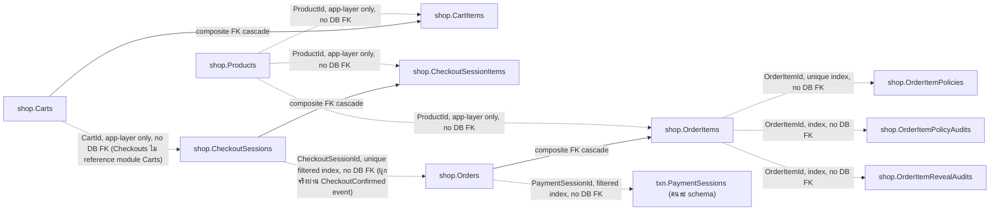

ทุกตารางในนี้อยู่ใต้ global query filter `MerchantId == CurrentMerchant`. actor ที่ยัง unbound
resolve เป็น `Guid.Empty` ซึ่งไม่มี row จริงถืออยู่ → เห็นศูนย์แถวทุกตาราง.

### Product -> `shop.Products`

> ย้ายไปรวมที่ [`products.md`](products.md) แล้ว (schema เต็ม + field table + business rules) —
> แก้/อ่านที่นั่น ที่นี่เก็บไว้แค่ pointer กัน broken link

### Cart -> `shop.Carts`
ตะกร้าของผู้ซื้อ 1 ใบ. อายุสั้นตามเจตนาการออกแบบ — มี method `MarkCheckedOut()` ที่ freeze การแก้ไข แต่ grep ทั้ง repo แล้วไม่มีจุดไหนใน production code เรียกมันเลย (เจอแค่ 1 caller ใน unit test) ปัจจุบัน cart จึงยังเป็น `Open` ต่อไปเรื่อยๆ แก้ไขได้แม้ checkout เริ่มไปแล้วก็ตาม.

> ตัวอย่าง: `seed-demo.sql` (6 rows `ea000000-…` — 2 ใบต่อ merchant, มีทั้ง Open และ CheckedOut).

| Field | Type | Null | Key | ตัวอย่าง | หมายเหตุ |
|---|---|---|---|---|---|
| Id | uniqueidentifier | N | PK | `ea000000-…-0001` | app assign |
| MerchantId | uniqueidentifier | N | AK | `e1000000-…-0001` | alternate key `AK_Carts_Id_MerchantId` (composite FK target) — ทำให้ `shop.CartItems` พก merchant key ติดไปกับ FK เอง |
| Status | nvarchar(16) | N | | `Open` (ไม่ใช่ `0`) | `CartStatus` เก็บเป็น **ชื่อ string** (Open/CheckedOut) — ตารางเดียวในระบบที่ enum ไม่ได้เก็บเป็น int |
| CreatedAt | datetime2 | N | | `2026-07-26T08:15:00Z` | เวลาที่เปิดตะกร้า |

**คืออะไร**: ตะกร้าสินค้า 1 ใบต่อการช้อปครั้งหนึ่ง เก็บว่าตัวแทนขายเลือกแผนประกันอะไรไว้บ้างก่อนกดยืนยันราคาเป็นเรื่องจริงจัง
**บทบาท**: เป็นพื้นที่ "ลองจัดของ" ก่อนไปถึง `shop.CheckoutSessions` — เพิ่ม/ลบ/ปรับจำนวนได้อิสระที่นี่ อ้างกับ CheckoutSessions ด้วย id เปล่า ไม่มี FK เชื่อมกัน (ดู `shop.CheckoutSessions.CartId`)
**ถ้าไม่มีตารางนี้จะพังยังไง**: ตัวแทนขายต้องเลือกแผนทั้งหมดในคลิกเดียวแล้วยืนยันทันที ไม่มีที่พักให้ปรับจำนวน/สลับแผนก่อนตัดสินใจจริง — ทุกครั้งที่เปลี่ยนใจต้องเปิด checkout session ใหม่ (ซึ่งเป็น record ที่ล็อกยอดแล้ว แพงกว่าการแก้ตะกร้าเฉยๆ)
**ทำงานยังไง**: `Cart.AddItem`/`RemoveItem`/`SetItemQuantity`/`Clear` (Carts.Domain/Cart.cs:39-89) ทุกตัว throw ถ้า `Status != Open` — แต่ `Status` เปลี่ยนได้ทางเดียวคือ `Cart.MarkCheckedOut()` (Cart.cs:92) ซึ่ง grep ทั้ง repo (src + tests) เจอแค่ 1 caller คือ unit test เดียว (`tests/Carts.Tests/CartTests.cs:74`) — **ไม่มี production code เรียกมันเลย** ปัจจุบัน cart ทุกใบจึงเป็น `Open` ต่อไปเรื่อยๆ แก้ไขได้แม้ผู้ใช้กดเช็คเอาต์ไปแล้วและมี `CheckoutSession` ล็อกยอดคู่ขนานอยู่ก็ตาม — endpoint `POST /api/v1/checkouts` (Program.cs:752-796) อ่าน cart ผ่าน `GetCartQuery` แค่เพื่อคำนวณ subtotal เท่านั้น ไม่เรียกอะไรกับ cart status เลย เอกสารเชิงลึกของโมดูลนี้ ดู [`carts.md`](carts.md)

### Item -> `shop.CartItems`
FK **composite** `(CartId, MerchantId)` -> `Carts (Id, MerchantId)` cascade — merchant key เดินทางไปกับ FK
เอง จึงไม่ต้องพึ่ง predicate แยกแบบสมัย RLS. ราคา snapshot จาก catalog ตอนเพิ่ม (ไม่ใช่ราคา client).

> ตัวอย่าง: `seed-demo.sql` (14 rows `eb000000-…`).

| Field | Type | Null | Key | ตัวอย่าง | หมายเหตุ |
|---|---|---|---|---|---|
| Id | uniqueidentifier | N | PK | `eb000000-…-0002` | app assign |
| CartId | uniqueidentifier | N | FK, IX | `ea000000-…-0001` | composite กับ MerchantId (Cascade) — ลบตะกร้าแล้วรายการหายตาม |
| MerchantId | uniqueidentifier | N | FK, IX | `e1000000-…-0001` | index `(CartId, MerchantId)`. denormalize จากตะกร้าแม่ — ค่าต้องตรงกันเสมอ (ต่าง = data bug) |
| ProductId | uniqueidentifier | N | | `e9000000-…-0002` | ต้องเป็นสินค้าของ merchant เดียวกับตะกร้า |
| Quantity | int | N | | `2` | จำนวนชิ้น |
| UnitPriceAmount | decimal(19,4) | N | | `1850.0000` | snapshot จาก Product — **ไม่ใช่ราคาที่ client ส่งมา** และไม่ขยับตามการแก้ catalog ทีหลัง |
| UnitPriceCurrency | char(3) | N | | `THB` | สกุลของราคาที่ snapshot |

**คืออะไร**: 1 แถว = 1 รายการแผนประกันที่อยู่ในตะกร้าใบหนึ่ง เก็บว่าซื้อแผนไหน กี่ชิ้น และราคาต่อชิ้นที่ล็อกไว้ตอนหยิบใส่ตะกร้า
**บทบาท**: เป็นลูกของ `shop.Carts` (1 คาร์ทมีได้หลายรายการ) และเป็นต้นทางของยอด subtotal ที่ `shop.CheckoutSessions` มาล็อกต่อ — `ProductId` ชี้ไปยัง `shop.Products` แต่ไม่มี FK จริง (มีแค่ query ที่ต้องดึงสินค้า merchant เดียวกัน)
**ถ้าไม่มีตารางนี้จะพังยังไง**: `Cart` จะไม่มีที่เก็บว่าใส่อะไรไว้บ้าง เหลือแค่ "กล่องเปล่า" ที่บอกได้แค่ว่ามีตะกร้าอยู่แต่ไม่รู้ข้างในมีอะไร คำนวณ subtotal ไม่ได้เลย
**ทำงานยังไง**: `AddItemToCartHandler.Handle` (Carts.Application/AddItemToCartHandler.cs:22-36) เรียก `Cart.AddItem` (Cart.cs:39-57) ซึ่งถ้าเจอ `ProductId` + ราคาเดิมอยู่แล้วจะ merge quantity เข้าบรรทัดเดิม (`IncreaseQuantity`, Item.cs:37) แทนสร้างแถวใหม่ — ราคาไม่ได้มาจาก client: endpoint `POST /api/v1/carts/{cartId}/items` (Program.cs:670-692) เรียก `GetProductByIdQuery` ก่อนเสมอ เช็ค `product is null || product.PaymentStatus != PaymentStatus.UNPAID` → 400 "Unknown or inactive product." แล้วค่อย mint `Money.Of(product.TotalPremium, "THB")` ส่งเข้า command (THB hardcode จุดเดียวในระบบทั้งหมด, REQ-8.4) composite FK `(CartId, MerchantId)` มาจาก `CartConfiguration.cs:31-37` — ต้องเปิด `HasAlternateKey` บน `(Id, MerchantId)` ก่อนเพราะ `MerchantId` ไม่ใช่ PK ของ Cart เอง FK ถึงจะ compose ได้

### Session -> `shop.CheckoutSessions`
ล็อกยอดจาก subtotal ของ cart (ไม่ใช่ค่าจาก client). Confirm -> emit CheckoutConfirmed -> Orders เปิด order.

> ตัวอย่าง: `seed-demo.sql` (4 rows `ec000000-…` — Confirmed 2, Started 1, Abandoned 1).

| Field | Type | Null | Key | ตัวอย่าง | หมายเหตุ |
|---|---|---|---|---|---|
| Id | uniqueidentifier | N | PK | `ec000000-…-0001` | app assign |
| MerchantId | uniqueidentifier | N | AK | `e1000000-…-0001` | alternate key `AK_CheckoutSessions_Id_MerchantId` — เป้าของ composite FK จาก `shop.CheckoutSessionItems` |
| CartId | uniqueidentifier | N | | `ea000000-…-0002` | ตะกร้าที่ล็อกยอดมา (อ้างด้วย id ล้วน ไม่มี FK — Checkouts ไม่ reference โมดูล Carts) |
| AmountAmount | decimal(19,4) | N | | `56500.0000` | = SUM(Quantity x UnitPrice) ของตะกร้า ณ เวลา start |
| AmountCurrency | char(3) | N | | `THB` | สกุลของยอดที่ล็อก |
| NotificationRecipient | nvarchar(320) | Y | | `somchai.p@demo.pol.local` (`NULL` = ไม่ส่ง) | email ผู้รับลิงก์สรุป (optional) — ไหลต่อไปที่ order ตอน confirm |
| Status | int | N | | `1` (Confirmed) | `SessionStatus` (Started=0, Confirmed=1, Abandoned=2) |
| CreatedAt | datetime2 | N | | `2026-07-26T08:15:00Z` | เวลาที่เปิด checkout |

**คืออะไร**: "ใบเสนอราคาที่ล็อกแล้ว" ของตะกร้าหนึ่งใบ ณ ช่วงเวลาที่กดเช็คเอาต์ — ราคา/รายการ/เงื่อนไขประกันถูกแช่แข็งไว้ ต่อให้แผนใน catalog เปลี่ยนราคาทีหลัง ใบเสนอราคานี้ก็ไม่ขยับตาม
**บทบาท**: เป็นสะพานระหว่าง `shop.Carts` (แก้ไขได้อิสระ) กับ `shop.Orders` (จ่ายเงินจริงแล้ว) — `Confirm` สำเร็จจะ enqueue event `CheckoutConfirmed` ผ่าน transactional outbox ให้ `Orders` module มาเปิด order เอง (`Checkouts` ไม่เรียก `Orders` ตรงๆ — ดูกลไก outbox เต็มที่ตัวอย่าง `txn.OutboxMessages` ด้านล่างของไฟล์)
**ถ้าไม่มีตารางนี้จะพังยังไง**: ไม่มีจุดกลางที่ล็อกราคาไว้ก่อนจ่ายเงิน — ถ้าให้ `Order` คำนวณราคาสดจาก `Cart` ตรงๆ ราคาจะขยับได้ตลอดช่วงที่ลูกค้ากำลังกรอกข้อมูลจ่ายเงิน (แผนขึ้นราคา/ปิดขายกลางทาง) ทำให้ยอดที่ลูกค้าเห็นตอนกดเช็คเอาต์กับยอดที่โดนเรียกเก็บจริงไม่ตรงกัน
**ทำงานยังไง**: `Session.Start` (Checkouts.Domain/Session.cs:51-72) รับ `amount`/`items` ที่คำนวณมาแล้วจาก endpoint (ไม่คำนวณเองในนี้) reject `items` ว่าง (บรรทัด 59-60) แล้ว snapshot ทุกบรรทัดทันที (บรรทัด 64-69) `Confirm()` (บรรทัด 75-81) เปลี่ยน `Started`->`Confirmed` เท่านั้น เรียกจริงจาก `ConfirmCheckoutHandler.Handle` (Checkouts.Application/ConfirmCheckout.cs:40) ซึ่งเปิด outbox message ใน transaction เดียวกับการเปลี่ยนสถานะพอดี (บรรทัด 47-51) — แต่ `Abandon()` (Session.cs:84-90) กลับ**ไม่มี caller เลยแม้แต่ในเทสต์**: grep ทั้ง repo (`src` + `tests`) หา `.Abandon(` หรือ `SessionStatus.Abandoned` เจอแค่ definition ในตัวเองเท่านั้น ไม่มี handler/endpoint ไหนเรียก แถว `Abandoned` ที่เห็นใน `seed-demo.sql` จึงมาจาก raw SQL seed เท่านั้น ไม่มี code path จริงที่ทำให้ session เข้าสถานะนี้ได้ในระบบปัจจุบัน

### Item -> `shop.CheckoutSessionItems`
1 บรรทัด = 1 ผู้เอาประกัน. field ผู้เอาประกัน + ราคา/เอกสารประกัน (`DocumentNo`/`ProductGroup`/
`DocumentType`/`PolicyNumber`/`StartDate`/`EndDate`) เป็น **snapshot ณ เวลาซื้อ** จาก `Product`
(ไม่ตามการแก้ catalog ทีหลัง). FK composite `(SessionId, MerchantId)` -> `CheckoutSessions (Id, MerchantId)`
cascade.

> ตัวอย่าง: derive จาก `Checkouts.Domain/Items/Item.cs` (validate ชุดเดียวกับ `shop.OrderItems`) — ไม่มี seed;
> ค่าที่ยกมาเทียบเคียงกับ `shop.OrderItems` ใน `seed-demo.sql` ซึ่งเป็นปลายทางของข้อมูลชุดเดียวกัน.

| Field | Type | Null | Key | ตัวอย่าง | หมายเหตุ |
|---|---|---|---|---|---|
| Id | uniqueidentifier | N | PK | `7b0e5c19-…-42fd` | app assign ตอน `Session.Start` |
| SessionId | uniqueidentifier | N | FK, IX | `ec000000-…-0001` | composite กับ MerchantId (Cascade) |
| MerchantId | uniqueidentifier | N | FK, IX | `e1000000-…-0001` | index `(SessionId, MerchantId)`; denormalize จาก session แม่ |
| ProductId | uniqueidentifier | N | | `e9000000-…-0006` | สินค้าที่ซื้อ |
| Quantity | int | N | | `1` | บังคับ 1 เสมอ — 1 บรรทัด = 1 ผู้เอาประกัน |
| UnitPriceAmount | decimal(19,4) | N | | `15900.0000` | เบี้ยที่ตกลง ณ เวลา start |
| UnitPriceCurrency | char(3) | N | | `THB` | สกุลเบี้ย |
| DocumentNo | nvarchar(150) | N | | `S001-69900/บต/900008` | snapshot จาก `Product.DocumentNo` ณ เวลา start |
| ProductGroup | varchar(10) | N | | `CMI` | wire value ของ `Product.ProductGroup` — string ล้วน ไม่ reference enum ข้ามโมดูล |
| DocumentType | varchar(20) | N | | `POLICY` | wire value ของ `Product.DocumentType` |
| PolicyNumber | varchar(150) | Y | | `P-2569-000123` | snapshot จาก `Product.PolicyNumber` |
| StartDate | datetime2(0) | Y | | `2026-07-01T00:00:00` | snapshot จาก `Product.StartDate`; `Create` throw ถ้า `StartDate > EndDate` |
| EndDate | datetime2(0) | Y | | `2027-06-30T00:00:00` | snapshot จาก `Product.EndDate` |
| InsuredFirstName | nvarchar(200) | N | | `สมชาย` | PII — อ่านแบบ mask, การเปิดจริงถูก audit |
| InsuredLastName | nvarchar(200) | N | | `ใจดี` | PII |
| InsuredIdNumber | nvarchar(20) | N | | `1103700123456` (13 หลัก) | PII |
| InsuredDateOfBirth | datetime2 | N | | `1985-03-15T00:00:00Z` | PII — เก็บเป็น datetime2 (ไม่ใช่ `date`) |

**คืออะไร**: 1 แถว = 1 คนที่จะได้รับความคุ้มครองในใบเสนอราคานั้น (ไม่ใช่ 1 แผน) เก็บชื่อ-นามสกุล-เลขบัตร-วันเกิดของผู้เอาประกัน พร้อมราคา/เอกสารประกันที่ตกลงกัน ณ ตอนกดเช็คเอาต์
**บทบาท**: เป็นก้อนข้อมูลที่ event `CheckoutConfirmed` แนบไปให้ `Orders` module ใช้สร้าง `shop.OrderItems` ต่อ (โครงสร้าง field เหมือนกันแทบทุกตัว เพราะเป็นข้อมูลชุดเดียวกันที่ "จบทาง" ที่ Order) validate ชุดเดียวกับ `Orders.Domain.Items.Item` เพื่อกันคำขอเสียหลุดไปถึง `Order.Create`
**ถ้าไม่มีตารางนี้จะพังยังไง**: ใบเสนอราคาจะไม่มีที่เก็บว่า "ใครคือผู้เอาประกัน" เลย รู้แค่ว่าซื้อแผนอะไรกี่ชิ้น แต่ตอบไม่ได้ว่าคุ้มครองใคร — เขียนกรมธรรม์จริงไม่ได้เพราะไม่มีชื่อ-เลขบัตรผู้เอาประกันติดไปกับยอดที่ล็อกไว้
**ทำงานยังไง**: สร้างพร้อม `Session` ใน `Session.Start` (Session.cs:64-69) — internal ctor ของ `Item` (Checkouts.Domain/Items/Item.cs:40-77) validate ชื่อ/นามสกุล/เลขบัตรห้ามว่าง (บรรทัด 57-59) และวันเกิดห้ามเป็นอนาคต (บรรทัด 60-61) แต่**ไม่มี**การเช็ค `Quantity == 1` อยู่ใน constructor นี้เลย — endpoint `POST /checkouts` (Program.cs:747-748) เช็คก่อนแล้วว่าทุกบรรทัดของ cart ต้อง `Quantity == 1` ถึงจะยอมสร้าง session ต่อ (reject ตั้งแต่ต้นทาง 400 ก่อนหลุดมาถึงชั้นนี้)

### Order -> `shop.Orders`
`Id` ไม่ใช่ value-generated (แอป assign). `SummaryToken` = capability opaque สำหรับลูกค้าเปิดหน้าสรุปแบบ
anonymous (อ่านตรงจากตาราง — proc `usp_resolve_order_summary` ถูกลบไปพร้อม RLS).

> ตัวอย่าง: `seed-demo.sql` (40 rows `ed000000-…` — 25 Paid / 10 AwaitingPayment / 5 Cancelled);
> รูปแบบ token/TTL จาก `Orders.Domain/Order.cs`.

| Field | Type | Null | Key | ตัวอย่าง | หมายเหตุ |
|---|---|---|---|---|---|
| Id | uniqueidentifier | N | PK | `ed000000-…-0016` | app-assigned (ไม่ใช่ value-generated) |
| MerchantId | uniqueidentifier | N | IX, AK | `e1000000-…-0001` | alternate key `AK_Orders_Id_MerchantId` — เป้าของ composite FK จาก `shop.OrderItems` |
| CheckoutSessionId | uniqueidentifier | Y | UQ* | `ec000000-…-0001` (`NULL` ถ้าไม่ได้มาทาง checkout) | unique เมื่อ NOT NULL (1 order ต่อ session) — กัน CheckoutConfirmed ที่ถูก replay สร้าง order ซ้ำ |
| PaymentSessionId | uniqueidentifier | Y | IX* | `ee000000-…-0016` (`NULL` ก่อนเริ่มจ่าย) | index เมื่อ NOT NULL |
| AmountAmount | decimal(19,4) | N | | `56500.0000` | ยอดที่ต้องชำระ — `MarkPaid` ตรวจยอด+สกุลซ้ำก่อนเปลี่ยนสถานะ |
| AmountCurrency | char(3) | N | | `THB` | สกุลของยอด |
| Status | int | N | | `1` (Paid) | `OrderStatus` (AwaitingPayment=0, Paid=1, Cancelled=2) |
| SummaryToken | nvarchar(64) | N | UQ | `3f7a91c0e4b8426d8c15aa72e6d40391` (`Guid` N-format 32 hex; seed ใช้ `demo-ord-00016`) | opaque capability token — ลูกค้าเปิดหน้าสรุปแบบ anonymous ด้วยค่านี้; หมุนใหม่ทุกครั้งที่ resend |
| SummaryTokenExpiresAt | datetime2 | N | | `2026-07-29T08:15:00Z` (= CreatedAt + 72h) | TTL ของลิงก์สรุป — เปิดหลังหมดอายุได้ 410 Gone |
| NotificationRecipient | nvarchar(320) | Y | | `somchai.p@demo.pol.local` (`NULL` = ไม่มีผู้รับ) | ไหลมาจาก checkout session; ใช้ตอน resend ลิงก์สรุป |
| PaidAt | datetime2 | Y | | `2026-07-26T10:15:00Z` (`NULL` เมื่อยังไม่จ่าย) | set ตอน webhook ยืนยัน Paid |
| CreatedAt | datetime2 | N | | `2026-07-26T08:15:00Z` | เวลาที่เปิด order |

**คืออะไร**: บันทึกคำสั่งซื้อกรมธรรม์ 1 ใบที่เกิดขึ้นจริง — เปิดสถานะ "รอชำระ" ทันทีที่ลูกค้ายืนยัน checkout แล้วเปลี่ยนเป็น "จ่ายแล้ว" เมื่อ PSP ยืนยันเงินเข้าจริง ลูกค้าไม่ต้องล็อกอินก็เปิดดูสรุปคำสั่งซื้อของตัวเองได้ผ่านลิงก์พิเศษที่หมดอายุอัตโนมัติ

**บทบาท**: เป็นจุดต่อระหว่าง Checkouts กับ Payments — รายละเอียดธุรกิจเต็มดูที่ platform-modules.md; ที่นี่โฟกัสแค่กลไกระดับ DB สองเส้นทางเขียนแถวนี้: (1) `CheckoutConfirmedConsumer.Handle` (`src/Modules/Orders/Orders.Application/CheckoutConfirmedConsumer.cs:31-53`) กิน event `CheckoutConfirmed` แล้วเช็ค `GetByCheckoutSessionIdAsync` ก่อนสร้างซ้ำ (idempotent skip, บรรทัด 33-36) — [TODO-VERIFY: ยังไม่ได้ไล่ยืนยันว่า outbox dispatcher ฝั่ง Checkouts เป็นตัวส่ง `CheckoutConfirmed` เข้าคิวจริงๆ ไฟล์นี้แค่เห็นจุด enqueue ใน `ConfirmCheckoutHandler`] (2) `CreateOrderHandler.Handle` (`CreateOrderCommand.cs:28-60`) — path นี้มีอยู่ในโค้ดจริงแต่ **grep ทั้ง `src/Hosts/Api/Program.cs` ไม่พบ endpoint ไหน map ไปที่ `CreateOrderCommand` เลย** (มีแต่ `GET /orders`, `GET /orders/{token}/summary`, `POST /orders/{orderId}/summary/resend`) ตอนนี้ path (2) ถูกเรียกจากเทสต์เท่านั้น (`tests/Orders.Tests/CustomerNotificationTests.cs`) — ในโปรดักชันจริงมีทางเดียวที่สร้างแถวนี้คือทาง checkout confirm เท่านั้น

**ถ้าไม่มีตารางนี้จะพังยังไง**: ลูกค้าจ่ายเงินไปแล้วไม่มีที่ไหนบันทึกว่า "ต้องจ่ายเท่าไหร่ ของอะไร" ให้ webhook จาก PSP มาเทียบยืนยันตอนเงินเข้า (`Order.MarkPaid` ใช้ยอด+สกุลของแถวนี้เป็นฐานเทียบ) และไม่มีที่เก็บ token ที่ลูกค้าใช้เปิดหน้าสรุปแบบไม่ต้องล็อกอิน — ลูกค้าจะไม่มีทางเช็คสถานะคำสั่งซื้อของตัวเองได้เลยหลังปิด browser

**ทำงานยังไง**: `Order.Create` (`Order.cs:94-125`) app-assign `Id`+`SummaryToken` เอง (`Guid.NewGuid().ToString("N")`, บรรทัด 69) ไม่ใช่ value-generated โดย DB, บังคับผลรวม `UnitPrice*Quantity` ของทุก item ต้องเท่ากับ `Amount` เป๊ะ (บรรทัด 111, ตรงกับหมายเหตุใน `shop.OrderItems`) มิฉะนั้น throw `ArgumentException` (=400) ตอนสร้าง — สอดคล้องกับ constraint "sum ของ line ต้องเท่ากับ Orders.Amount" ที่ระบุไว้แล้วในตาราง `OrderItems` ข้างบน (ไม่ใช่แค่ convention เอกสาร แต่มีโค้ด enforce จริง) การจ่ายเงินยืนยันผ่าน `OrderPaidConsumer.Handle` (`OrderPaidConsumer.cs:33-56`) หา order ด้วย `notification.OrderId` เท่านั้น — คอลัมน์ `PaymentSessionId`/`AttachPaymentSession` (`Order.cs:127-139`) เป็น legacy link ที่ **ไม่มี production caller เขียนเลย** (grep ทั้ง `src` ไม่พบใครเรียก `AttachPaymentSession`) คงไว้เพื่อ backward-compat กับ event เก่าเท่านั้น การ resend ลิงก์สรุปทำผ่าน `ResendOrderSummaryHandler.Handle` (`ResendOrderSummary.cs:30-46`) เรียก `order.ReissueSummary` (`Order.cs:78-85`) หมุน token+ต่อ TTL ใหม่ — reject (409) ถ้า order ไม่ได้อยู่สถานะ `AwaitingPayment` แล้ว ระดับ DB: `CheckoutSessionId` เป็น filtered unique index (`OrderConfiguration.cs:48-50`, `WHERE [CheckoutSessionId] IS NOT NULL`) เป็น backstop กัน `CheckoutConfirmed` ที่ replay ซ้ำสร้าง order สอง ใบจริง (ไม่ใช่แค่ app-layer check) และมี alternate key `(Id, MerchantId)` (บรรทัด 57) เป็นเป้าของ composite FK จาก `shop.OrderItems`

### Item -> `shop.OrderItems`
เดิมชื่อ `OrderLines` — rename ด้วย `sp_rename` ใน migration `20260723122929_RenameOrderLinesToOrderItems`
(rows/GRANT/PK/FK คงอยู่). โครงเหมือน `CheckoutSessionItems` เป๊ะ ต่างที่ parent เป็น Order.
INSERT-only (ค่าที่ต้องแก้ทีหลังไปอยู่ `OrderItemPolicies` แทน).

> ตัวอย่าง: `seed-demo.sql` (4 rows `ef000000-…` — 2 รายการอยู่ order เดียวกันและเป็นคนเอาประกันคนเดียวกัน
> เพื่อครอบเคส "ภาคสมัครใจ + พ.ร.บ. รถคันเดียว"; `ef…0004` ตั้งใจไม่มีแถวใน `OrderItemPolicies`).

| Field | Type | Null | Key | ตัวอย่าง | หมายเหตุ |
|---|---|---|---|---|---|
| Id | uniqueidentifier | N | PK | `ef000000-…-0001` | app assign ตอน `Order.Create` |
| OrderId | uniqueidentifier | N | FK, IX | `ed000000-…-0016` | composite กับ MerchantId -> `Orders (Id, MerchantId)` (Cascade) |
| MerchantId | uniqueidentifier | N | FK, IX | `e1000000-…-0001` | index `(OrderId, MerchantId)`; denormalize จาก order แม่ |
| ProductId | uniqueidentifier | N | | `e9000000-…-0006` | สินค้าที่ขาย |
| Quantity | int | N | | `1` | บังคับ 1 — 1 บรรทัด = 1 ผู้เอาประกัน; ผลรวมของทุกบรรทัดต้องเท่ากับ `Orders.Amount` เป๊ะ |
| UnitPriceAmount | decimal(19,4) | N | | `15900.0000` | เบี้ยที่ขายจริง (snapshot ณ เวลาซื้อ) |
| UnitPriceCurrency | char(3) | N | | `THB` | สกุลเบี้ย |
| DocumentNo | nvarchar(150) | N | | `S001-69900/บต/900008` | snapshot จาก `Product.DocumentNo` ณ เวลาซื้อ |
| ProductGroup | varchar(10) | N | | `CMI` | wire value ของ `Product.ProductGroup` — string ล้วน ไม่ reference enum ข้ามโมดูล |
| DocumentType | varchar(20) | N | | `POLICY` | wire value ของ `Product.DocumentType` |
| PolicyNumber | varchar(150) | Y | | `P-2569-000123` | snapshot จาก `Product.PolicyNumber` |
| StartDate | datetime2(0) | Y | | `2026-07-01T00:00:00` | snapshot จาก `Product.StartDate` |
| EndDate | datetime2(0) | Y | | `2027-06-30T00:00:00` | snapshot จาก `Product.EndDate` |
| InsuredFirstName | nvarchar(200) | N | | `สมชาย` | PII |
| InsuredLastName | nvarchar(200) | N | | `ใจดี` | PII |
| InsuredIdNumber | nvarchar(20) | N | | `1103700123456` | PII |
| InsuredDateOfBirth | datetime2 | N | | `1985-03-15T00:00:00Z` | PII |

**คืออะไร**: แต่ละแถวคือ "1 คนที่ถูกเอาประกัน" ภายใต้คำสั่งซื้อ 1 ใบ (1 บรรทัด = 1 กรมธรรม์ที่ขาย = 1 คนเอาประกัน เพราะ `Quantity` ถูกล็อกไว้ที่ 1 เสมอ) เก็บราคา/field เอกสารประกัน/ข้อมูลผู้เอาประกัน ณ วินาทีที่ซื้อ ไม่ตามการเปลี่ยนแปลงของสินค้าในแคตตาล็อกภายหลัง

**บทบาท**: บันทึกฝั่ง "ขายแล้ว" คู่กับ `shop.Orders` — เป็น snapshot ที่ไม่มีวันแก้ ต่างจาก `shop.OrderItemPolicies` ที่เป็นข้อมูลกรอกทีหลัง เดิมชื่อ `OrderLines`, rename ด้วย `sp_rename` (ยืนยันแล้วว่ามีไฟล์ migration `20260723122929_RenameOrderLinesToOrderItems.cs` จริงตรงกับที่ระบุไว้ข้างบน)

**ถ้าไม่มีตารางนี้จะพังยังไง**: ไม่มีที่เก็บว่า order หนึ่งใบขายกรมธรรม์กี่ฉบับให้ใคร ราคาต่อฉบับเท่าไหร่ — ถ้าราคาสินค้าถูกแก้ในแคตตาล็อกทีหลัง คำสั่งซื้อเก่าจะแสดงราคาผิด (ราคาปัจจุบันแทนราคาที่จ่ายจริง) และไม่มีที่ให้ `shop.OrderItemPolicies` ผูกเลขกรมธรรม์เข้ากับ "คนที่ถูกเอาประกัน" คนไหน

**ทำงานยังไง**: `Item` (`src/Modules/Orders/Orders.Domain/Items/Item.cs:13-87`) เป็น INSERT-only จริง — ทุก property เป็น `private set` และถูก set ครั้งเดียวใน constructor (บรรทัด 71-85) ไม่มี method ไหนแก้ค่าทีหลังเลย ตัวเดียวที่สร้างมันคือ `Order.Create` (`Order.cs:117-124`) วนสร้าง `Item` ทีละบรรทัดพร้อมกับ order แม่ในธุรกรรมเดียวกัน ระดับ DB: composite FK ไปที่ `Orders (Id, MerchantId)` ผ่าน `HasForeignKey(i => new { i.OrderId, i.MerchantId }).HasPrincipalKey(...).OnDelete(Cascade)` (`OrderConfiguration.cs:59-63`)

### ItemPolicy -> `shop.OrderItemPolicies`
policy-reference record ต่อ OrderItem — aggregate **mutable** 1:1 กับ OrderItem (ต่างจาก OrderItem เองที่
INSERT-only) สำหรับกรอกเลขกรมธรรม์/เบี้ย/สถานะหักส่งหลังการขาย. invariant บังคับใน `Apply` ของ aggregate.

> ตัวอย่าง: `seed-demo.sql` (3 rows `f1000000-…` ครอบทั้ง Voluntary/Compulsory และ Deducted/NotApplicable) —
> invariant จาก `Orders.Domain/Items/ItemPolicy.cs`.

| Field | Type | Null | Key | ตัวอย่าง | หมายเหตุ |
|---|---|---|---|---|---|
| Id | uniqueidentifier | N | PK | `f1000000-…-0001` | app assign ตอน `ItemPolicy.Create` |
| OrderItemId | uniqueidentifier | N | UQ | `ef000000-…-0001` | 1:1 กับ `shop.OrderItems.Id` — item ที่ยังไม่กรอกกรมธรรม์จะ **ไม่มีแถวที่นี่เลย** (ไม่ใช่แถวที่ null ทั้งหมด) |
| MerchantId | uniqueidentifier | N | IX | `e1000000-…-0001` | ตั้งครั้งเดียวตอน Create — `Apply` ไม่แตะ |
| InsuranceCategory | int | Y | | `0` (Voluntary/ภาคสมัครใจ) | `InsuranceCategory` (Voluntary=0, Compulsory=1). null = ยังไม่กรอก (ไม่มีสมาชิก enum สำหรับ "ยังไม่ระบุ") |
| ReferenceNumberType | int | Y | | `0` (PolicyNumber) | `ReferenceNumberType` (PolicyNumber=0, NotificationNumber=1). ต้องมาคู่กับ `ReferenceNumber` ทั้งสองทาง |
| ReferenceNumber | nvarchar(100) | Y | | `POL-2026-VP-000123` | เลขกรมธรรม์/เลขรับแจ้ง (แล้วแต่ type). ค่าว่าง/ช่องว่างถือเป็น "ยังไม่กรอก" (เก็บเป็น null) |
| RenewalReminderNumber | nvarchar(100) | Y | | `REM-2026-VC-045` | เลขใบเตือนต่ออายุ — กรอกได้เมื่อมี `ReferenceNumber` แล้วเท่านั้น |
| EndorsementNumber | nvarchar(100) | Y | | `END-2026-0007` | สลักหลัง — กรอกได้เมื่อมี `ReferenceNumber` แล้วเท่านั้น |
| InsuredObjectReference | nvarchar(100) | Y | | `กข-1234 กรุงเทพมหานคร` | อ้างอิงวัตถุที่เอาประกัน (ทะเบียนรถ ฯลฯ) — generic ไม่ผูกกับ Motor |
| GrossPremiumAmount | decimal(19,4) | Y | | `15900.0000` | เบี้ยรวม — ต้องตั้งคู่กับ Net (both-or-neither) และ >= Net |
| GrossPremiumCurrency | char(3) | Y | | `THB` | บังคับ THB เท่านั้น |
| NetPremiumAmount | decimal(19,4) | Y | | `15000.0000` (เท่ากับ Gross ก็ได้) | เบี้ยสุทธิ |
| NetPremiumCurrency | char(3) | Y | | `THB` | บังคับ THB เท่านั้น |
| PremiumRemittanceStatus | int | N | | `1` (Deducted) | `PremiumRemittanceStatus` (NotApplicable=0, Deducted=1) |
| DeductedAt | date | Y | | `2026-07-15` (`NULL` เมื่อ NotApplicable) | `DateOnly` — วันที่หักส่ง. required เมื่อ Deducted, ห้ามเป็นอนาคต (เทียบวันที่ไทย UTC+7), และถูกล้างอัตโนมัติเมื่อกลับเป็น NotApplicable |
| CreatedAt | datetime2 | N | | `2026-07-26T08:15:00Z` | เวลาที่สร้างระเบียนเปล่า |
| UpdatedAt | datetime2 | N | | `2026-07-26T09:40:00Z` | ขยับทุกครั้งที่ `Apply` สำเร็จ |

**คืออะไร**: ที่กรอกเลขกรมธรรม์จริง (ที่บริษัทประกันออกให้) ผูกกับคนที่ถูกเอาประกันแต่ละคนหลังขายเสร็จแล้ว — ต่างจาก `shop.OrderItems` ที่ freeze ตอนซื้อ ตารางนี้แก้ไขได้เรื่อยๆ ตามสถานะงานเอกสารจริง (รอเลข → ได้เลข → สลักหลัง → หักเบี้ยส่งบริษัทประกันแล้ว)

**บทบาท**: เป็น "ระเบียนอ้างอิงกรมธรรม์" ที่ปฏิบัติงาน (merchant-user หรือ admin) กรอกเข้ามาทีหลัง ไม่ใช่ระบบ generate เอง (ตามคอมเมนต์ใน `ItemPolicy.cs:7` — ADR-1/REQ-6.3) มี 2 ทางเขียน: merchant plane ผ่าน `UpsertItemPolicyHandler` (`UpsertItemPolicyCommand.cs:25-64`, gate ด้วย `IMerchantScoped`) และ admin cross-merchant escape-hatch ผ่าน `UpsertItemPolicyAdminHandler` (`UpsertItemPolicyAdminCommand.cs:35-71`, เช็ค accessible-merchant-set เอง เพราะไม่มี merchant ผูกกับ request)

**ถ้าไม่มีตารางนี้จะพังยังไง**: ต้องยัดฟิลด์ที่แก้ได้ (เลขกรมธรรม์, สถานะหักเบี้ย) ลงใน `shop.OrderItems` ที่เป็น INSERT-only snapshot โดยตรง — จะทำให้ item ที่เป็น purchase-time record ต้องมี UPDATE grant และ mutator ทั้งที่ควรเป็น immutable, และ audit trail ของการซื้อกับการแก้เอกสารทีหลังจะปนกันจนแยกไม่ออกว่าใครแก้อะไรตอนไหน (เหตุผลตรงนี้มาจากคอมเมนต์ design ในโค้ดจริง `ItemPolicy.cs:6-12` ไม่ใช่การเดา)

**ทำงานยังไง**: `Apply` (`ItemPolicy.cs:104-179`) เป็นจุดเดียวที่บังคับทุก invariant ของตาราง — ตัวอย่างที่ enforce จริง (ไม่ใช่แค่ pattern บังเอิญ): `ReferenceNumberType`/`ReferenceNumber` ต้องมาคู่กันทั้งสองทาง (บรรทัด 115-122), `EndorsementNumber`/`RenewalReminderNumber` ต้องมี `ReferenceNumber` อยู่แล้วก่อน (บรรทัด 125-128), `NetPremium`/`GrossPremium` ต้อง both-or-neither และเป็น THB เท่านั้น + Net <= Gross (บรรทัด 131-148), `DeductedAt` บังคับเมื่อ `Deducted` เท่านั้น ห้ามเป็นอนาคต (เทียบ `nowUtc.AddHours(7)` เป็นวันไทย, บรรทัด 151-162) แล้วถูกล้างอัตโนมัติเมื่อกลับเป็น `NotApplicable` (บรรทัด 177) ทั้งสอง handler ใช้ pattern เดียวกัน: `existing ?? ItemPolicy.Create(...)` (`UpsertItemPolicyCommand.cs:46-48`) — โหลดถ้ามีอยู่แล้ว ไม่มีก็สร้างใหม่ นี่คือเหตุผลที่ item ที่ยังไม่เคยถูกกรอกจะไม่มีแถวในตารางนี้เลย (ไม่ใช่แถวที่ทุกฟิลด์ null)

### ItemPolicyAudit -> `shop.OrderItemPolicyAudits`  (append-only)
audit ของทุกการเขียน `OrderItemPolicies`.

> ตัวอย่าง: derive จาก `Orders.Domain/Items/ItemPolicyAudit.cs` — ไม่มี seed.

| Field | Type | Null | Key | ตัวอย่าง | หมายเหตุ |
|---|---|---|---|---|---|
| Id | uniqueidentifier | N | PK | `c8f43ba7-…-1d05` | `Guid.NewGuid()` ตอน `ItemPolicyAudit.For` |
| OrderItemId | uniqueidentifier | N | IX | `ef000000-…-0001` | item ที่ถูกเขียนกรมธรรม์ |
| MerchantId | uniqueidentifier | N | IX | `e1000000-…-0001` | index `(MerchantId, OccurredAt)` |
| Operation | int | N | | `0` (Created) | `AuditOperation` (Created=0, Updated=1) |
| ActorKind | int | N | | `1` (Merchant) | `ActorKind` (Admin=0, Merchant=1) |
| ActorId | nvarchar(200) | N | | `e5000000-…-0001` (merchant user) / `demo-adm-1` (admin subject) | ตัวตนผู้เขียน — เก็บเป็น string เพราะสอง actor kind ใช้คนละรูปแบบ id |
| ChangeSummary | nvarchar(500) | N | | `ReferenceNumber,EndorsementNumber` (`""` เมื่อเขียนแล้วไม่มีอะไรเปลี่ยน) | **ชื่อ field ที่เปลี่ยน คั่นด้วย comma — ไม่เคยเก็บค่า** จึงไม่ต้อง redact แถวนี้เลย |
| CorrelationId | nvarchar(200) | N | | `9f2c1ab34d5e4f6789012345abcdef01` | ผูกกับ request เดียวกัน |
| OccurredAt | datetime2 | N | | `2026-07-26T09:40:00Z` | เวลาที่เขียน |

**คืออะไร**: บันทึก append-only ว่า "ใครแก้เลขกรมธรรม์ของ item ไหน ตอนไหน แก้ field อะไรบ้าง" — ไม่เก็บว่าค่าก่อน/หลังคืออะไร เก็บแค่ชื่อ field ที่เปลี่ยน

**บทบาท**: audit trail คู่กับ `shop.OrderItemPolicies` — ทุกครั้งที่มีการเขียนสำเร็จ (ทั้งสร้างใหม่และแก้ของเดิม) จะมี 1 แถวเสมอ แม้ผลลัพธ์จะไม่ต่างจากเดิมเลยก็ตาม (audit "ทุกความพยายามเขียน" ไม่ใช่แค่ "ทุกการเปลี่ยนแปลงจริง")

**ถ้าไม่มีตารางนี้จะพังยังไง**: ไม่มีทางตรวจสอบย้อนหลังว่าใครแก้เลขกรมธรรม์ตอนไหน — ถ้าเลขกรมธรรม์ผิดหรือมีข้อพิพาทกับลูกค้า จะสืบไม่ได้ว่า merchant-user คนไหนหรือ admin คนไหนเป็นคนกรอกค่านั้นเข้าไป

**ทำงานยังไง**: `ItemPolicyAudit.For` (`ItemPolicyAudit.cs:45-54`) ถูกเรียกจากทั้งสองทางเขียนของ `shop.OrderItemPolicies`: `UpsertItemPolicyHandler` (`UpsertItemPolicyCommand.cs:56-59`, `ActorKind.Merchant`) และ `UpsertItemPolicyAdminHandler` (`UpsertItemPolicyAdminCommand.cs:65-68`, `ActorKind.Admin`) — ตรงกับค่า `ActorKind` (Admin=0, Merchant=1) ในตารางฟิลด์ข้างบน `ChangeSummary` คำนวณจากการเทียบ snapshot ก่อน/หลัง `Apply` แบบ field-by-field (`UpsertItemPolicyCommand.cs:72-92`) เทียบทีละ field คั่นด้วย comma — โค้ดคอมเมนต์ยืนยันชัดว่า "never a value" (`ItemPolicyAudit.cs:22-24`) จึงไม่ต้อง redact แถวนี้เลยจริงๆ (ไม่ใช่แค่คำอธิบายในเอกสาร) ระดับ DB ถูก mark `AppendOnlyDescriptor.Mark(builder.Metadata)` (`ItemPolicyAuditConfiguration.cs:36`) ทำให้ `GuardedRuntimeDbContext` ปฏิเสธ UPDATE/DELETE บนตารางนี้ไม่ว่า `IWriteAuthorizer` จะอนุญาตแค่ไหนก็ตาม (ยืนยันจาก DB config จริง ไม่ใช่แค่ XML doc comment)

### RevealAudit -> `shop.OrderItemRevealAudits`  (append-only)
audit ของการเปิดอ่าน PII ผู้เอาประกันแบบไม่ mask (unmask reveal).

> ตัวอย่าง: derive จาก `Orders.Domain/Items/RevealAudit.cs` — ไม่มี seed.

| Field | Type | Null | Key | ตัวอย่าง | หมายเหตุ |
|---|---|---|---|---|---|
| Id | uniqueidentifier | N | PK | `0a5cd8e2-…-6f37` | `Guid.NewGuid()` ตอน `RevealAudit.For` |
| OrderItemId | uniqueidentifier | N | IX | `ef000000-…-0001` | 1 แถวต่อ 1 item ที่ถูกเปิด — อ่าน order ที่มี N item เขียน N แถว |
| MerchantId | uniqueidentifier | N | IX | `e1000000-…-0001` | index `(MerchantId, RevealedAt)` |
| ActorType | nvarchar(32) | N | | `merchant-user` | `"admin"` หรือ `"merchant-user"` — ตอนนี้เขียนแค่ `merchant-user` (endpoint อ่านของ admin ยังไม่อยู่ใน scope) |
| ActorId | nvarchar(200) | N | | `e5000000-…-0001` | ตัวตนผู้เปิดอ่าน |
| CorrelationId | nvarchar(200) | N | | `9f2c1ab34d5e4f6789012345abcdef01` | ผูกกับ request เดียวกัน |
| RevealedAt | datetime2 | N | | `2026-07-26T09:40:00Z` | เวลาที่เปิดอ่าน (ไม่ใช่ hash chain แบบ `merch.VaultRevealAudits`) |

**คืออะไร**: บันทึก append-only ทุกครั้งที่มีคนเปิดดูข้อมูลส่วนตัวเต็มรูปแบบ (ไม่ mask) ของผู้เอาประกันคนหนึ่ง — เช่น เลขบัตรประชาชนเต็ม 13 หลัก แทนที่จะเห็นแบบ `xxx-xxx-x1234`

**บทบาท**: audit ฝั่ง "เปิดอ่าน" คู่กับ `shop.OrderItemPolicyAudits` ที่เป็น audit ฝั่ง "เขียน" — เกิดจาก 1 endpoint เดียวคือ detail-read ของ order (`GetOrderDetailHandler`)

**ถ้าไม่มีตารางนี้จะพังยังไง**: จะไม่มีทางพิสูจน์ได้เลยว่า merchant-user คนไหนเคยเห็นเลขบัตรประชาชนเต็มของลูกค้ารายไหนบ้าง — ถ้าข้อมูลรั่วออกไปจะสืบย้อนกลับไม่ได้ว่าใครเป็นคนเปิดอ่านครั้งสุดท้ายก่อนรั่ว

**ทำงานยังไง**: `GetOrderDetailHandler.Handle` (`GetOrderDetail.cs:38-56`) เป็นจุดเดียวที่เขียนตารางนี้ — วน `foreach (var item in order.Items)` เรียก `_audits.AppendAsync` ทีละ item (บรรทัด 43-46) แล้ว **`SaveChangesAsync` ก่อน** ค่อยประกอบ response กลับไป (บรรทัด 49-55) เป็น fail-closed จริง: ถ้าการ save audit ล้ม handler throw ทันที ไม่มี response ไหนหลุดออกไปเลย (ยืนยันจาก flow จริงในโค้ด ตรงกับคอมเมนต์ `GetOrderDetail.cs:12-14` ที่บอกว่า "a reveal that cannot be proven audited must not happen" — คอมเมนต์นี้ตรงกับโค้ดจริง ไม่ใช่คอมเมนต์ที่ล้าหลังกว่าโค้ด) order ที่มี N item จึงเขียน N แถวเสมอ 1 ต่อ 1 `RevealAudit.For` (`RevealAudit.cs:39-46`) ผ่าน `RevealAuditWriter` (`src/Persistence/Persistence.MerchantRuntime/Orders/Items/RevealAuditWriter.cs:21`) ตอนนี้เขียนแค่ `ActorType = "merchant-user"` จริง เพราะเป็น endpoint เดียวที่เรียก — endpoint อ่านฝั่ง admin ยังไม่มีในโค้ด (grep ทั้ง `src` ไม่พบ caller อื่นของ `IRevealAuditWriter` นอกจาก `GetOrderDetail.cs`) ระดับ DB ถูก mark `AppendOnlyDescriptor.Mark` เหมือนกัน (`RevealAuditConfiguration.cs:33`) กัน UPDATE/DELETE ผ่าน `GuardedRuntimeDbContext`

---

## txn schema (context: MerchantRuntime) — 4 ตาราง

`txn` (context: MerchantRuntime) คือ 4 ตารางที่รวมกันเป็น "ช่วงเวลาที่เงินกำลังเคลื่อนจริง" — ตั้งแต่สร้างความพยายามจ่าย ไปจนถึง PSP ยืนยันเงินเข้า ทั้ง 4 ตารางอยู่ใน `DbContext` เดียวกัน (`MerchantRuntimeDbContext`) โดยตั้งใจ เพราะ webhook handler ต้อง claim idempotency + เปลี่ยนสถานะ session + enqueue event ลง outbox เป็นธุรกรรม SQL เดียวกันเป๊ะๆ (`HandlePspWebhookHandler.cs:64-119`) — แยกคนละ DbContext จะทำให้ atomic ข้ามตารางแบบนี้ทำไม่ได้เลย

ความสัมพันธ์ข้าม schema ทั้งหมด (ไปยัง `shop.Orders`, `merch.Merchants`, `merch.VaultSecrets`) เป็น app-layer join ล้วนๆ ไม่มี FK จริงในฐานข้อมูลสักเส้น (เช็คจากคอลัมน์ Key ในตารางฟิลด์ทั้ง 4 ข้างบน — ไม่มีที่ไหนขึ้น `FK`) แม้แต่ในตารางกลุ่มเดียวกันเอง `PaymentSessions` ก็ไม่ได้เก็บ `PspConnectionId` เป็นคอลัมน์ — resolve connection ด้วย tuple `(MerchantId, Psp)` สดทุกครั้งแทน ดู platform-modules.md สำหรับเหตุผลเชิงธุรกิจของขอบเขต module และ db-connection-and-rls.md สำหรับกลไก isolation ปัจจุบัน (ไม่มี RLS แล้ว)

sentinel `MerchantId` ของผู้สมัคร merchant-user ที่ยังไม่มี merchant จริง ถูกกันไม่ให้เข้า `txn.OutboxMessages` ด้วย CHECK constraint แล้วเบนไป `merch.UserOutbox` แทน (มี dispatcher/lease คนละชุด เป็น EF LINQ ธรรมดา ไม่ raw-SQL READPAST เหมือนที่นี่ เพราะยังไม่มี production traffic ชนกันจริงจนต้อง optimize)

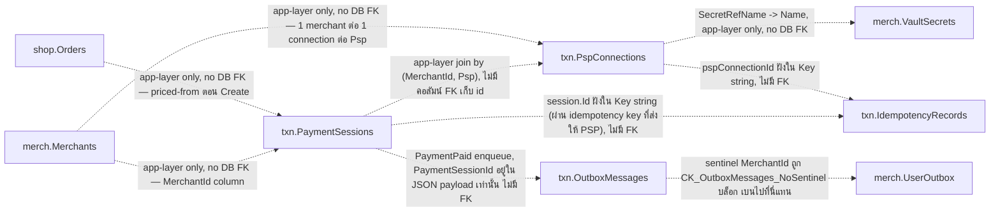

### Session -> `txn.PaymentSessions`
แตะ PSP ครั้งแรกตอนสร้าง redirect. `RowVersion` กัน concurrent claim. `(Psp, PspExternalChargeId)` unique
กัน webhook ซ้ำ.

> ตัวอย่าง: `seed-demo.sql` (36 rows `ee000000-…`, 1 ต่อ order ยกเว้น 4 order ที่ยังไม่เริ่มจ่าย).

| Field | Type | Null | Key | ตัวอย่าง | หมายเหตุ |
|---|---|---|---|---|---|
| Id | uniqueidentifier | N | PK | `ee000000-…-0016` | app assign; ใช้เป็น `Idempotency-Key` ที่ส่งให้ Omise ด้วย (`ToString("N")`) |
| MerchantId | uniqueidentifier | N | | `e1000000-…-0001` | copy จาก order แม่ |
| OrderId | uniqueidentifier | N | IX | `ed000000-…-0016` | order ที่กำลังชำระ |
| AmountAmount | decimal(19,4) | N | | `56500.0000` | copy จาก order แม่ — webhook ตรวจยอดนี้ก่อนยืนยัน Paid |
| AmountCurrency | char(3) | N | | `THB` | copy จาก order แม่ |
| Method | nvarchar(32) | N | | `promptpay` | payment method code (card/promptpay/installment) — ต้องอยู่ใน `EnabledMethods` ของ connection |
| Psp | int | N | | `0` (2C2P) | `Code` (TwoCTwoP=0, Omise=1) |
| PspExternalChargeId | nvarchar(256) | Y | UQ* | `demo_chrg_16` (`NULL` ก่อน PSP ตอบ) | unique กับ Psp เมื่อ NOT NULL — กัน webhook ตัวเดิมถูกประมวลผลซ้ำ |
| RedirectUrl | nvarchar(2048) | Y | | `https://demo.psp.local/checkout/16` | `authorize_uri` ของ PSP; NULL ตราบที่ยัง Created |
| Status | int | N | | `2` (Paid) | `SessionStatus` (Created=0, Redirected=1, Paid=2, Failed=3, Expired=4) |
| RowVersion | rowversion | N | | `0x00000000000007D1` (SQL Server สร้างเอง) | concurrency token — กัน claim ซ้อนจาก webhook ที่มาพร้อมกัน; **ห้ามใส่ค่าตอน INSERT** |
| CreatedAt | datetime2 | N | | `2026-07-26T08:20:00Z` | ตอนสร้าง session (หลัง order ~5 นาทีใน seed) |
| UpdatedAt | datetime2 | N | | `2026-07-26T09:20:00Z` | ขยับตอนสถานะเปลี่ยน |

**คืออะไร**: บันทึกความพยายามจ่ายเงินหนึ่งครั้งของลูกค้าต่อ order หนึ่งใบ — ตั้งแต่กดจ่าย ไปจนถึงหน้า PSP redirect ไปจนถึงผลลัพธ์ (จ่ายสำเร็จ/ล้มเหลว/หมดอายุ) ถ้า order เดียวลองจ่ายหลายรอบ (รอบแรกบัตรถูกปฏิเสธ รอบสองเปลี่ยนไปใช้ promptpay) แต่ละรอบคือคนละแถว
**บทบาท**: จุดต่อระหว่าง order (`shop.Orders`) กับ PSP จริง — ดู platform-modules.md สำหรับ flow checkout เต็ม ทั้ง endpoint สร้าง session, endpoint ขอ redirect และ webhook ยืนยันผล ล้วนอ่าน/เขียนตารางนี้เป็นศูนย์กลาง
**ถ้าไม่มีตารางนี้จะพังยังไง**: ระบบจะไม่มีที่บันทึกว่า order นี้ผูกกับ charge อะไรที่ PSP ไหน — webhook ที่ PSP ยิงกลับมารู้จักแค่ external charge id ของมันเอง ไม่รู้จัก order id ของเรา ถ้าไม่มีตารางนี้เป็นสะพาน (`GetByExternalChargeAsync`) จะ resolve กลับไปหา order ไม่ได้เลย และไม่มีที่กันสอง redirect claim จากสอง request พร้อมกันไปสร้าง charge ซ้อนกันที่ PSP (double charge)
**ทำงานยังไง**:
- สร้าง (`CreateSessionHandler.Handle`, `CreateSessionHandler.cs:44-97`): ราคาตั้งต้นมาจาก `order.Amount` เท่านั้น ไม่ใช่จาก client ผ่าน 2 ชั้น eligibility ก่อนสร้างได้จริง — `connection.EnsureEligible(method)` (merchant เปิด method นี้ไว้จริงไหม) แล้ว `_adapters.For(psp).SupportedMethods.Contains(method)` (adapter ของเรารองรับ method นี้จริงไหม) ถ้า order มี session เปิดอยู่แล้วบน channel เดียวกัน คืนตัวเดิม (กันสร้างซ้ำตอนลูกค้ากด submit สองที) เปิดอยู่คนละ channel ถึงจะโยน 409 (ไม่มี void/cancel ที่ PSP เลยแทนที่ไม่ได้)
- DB floor กันสองแถวเปิดพร้อมกันจริง: filtered unique index `IX_PaymentSessions_OrderId_Open` บน `OrderId` `WHERE [Status] IN (0, 1)` (Created/Redirected) — migration `20260726151538_OneOpenPaymentSessionPerOrder.cs:62-68` แอปเช็คข้างบนพลาด race ได้ (สอง request มาพร้อมกันเป๊ะ) แต่ index นี้ไม่พลาด — violation แปลงเป็น 409 ที่ `MerchantRuntimeUnitOfWork`
- Redirect แบบ claim-ก่อน-ค่อยชาร์จ (`StartRedirectHandler.cs:79-142`): claim การ redirect (`session.BeginRedirect`) แล้ว save ภายใต้ `RowVersion` (optimistic concurrency) **ก่อน** เรียก PSP จริงเสมอ — ผู้แพ้ race เจอ `ConcurrencyConflictException` แล้วได้ URL ของผู้ชนะคืนไปแทนที่จะไปสร้าง charge ที่สอง
- แยกความล้มเหลว "พิสูจน์แล้วว่าไม่มี charge" ออกจาก "ไม่แน่ใจ" ชัดเจน (`StartRedirectHandler.cs:106-137`): เฉพาะ `PspRejectedException` (PSP ปฏิเสธตรงๆ) หรือความล้มเหลวก่อนแตะ PSP เท่านั้นที่เรียก `MarkFailed` — ปล่อยให้ order เปิด session ใหม่ได้ (index ข้างบนถึงจะยอมให้เปิดแถวใหม่จริง) ความล้มเหลวกำกวมอื่น (timeout, 5xx, parse error) **ปล่อยผ่านไม่ catch** — claim ยังคงอยู่ที่ `Redirected` รอ call ถัดไปมา "settle" ด้วยการยิง PSP ซ้ำภายใต้ idempotency key เดิม (ทั้งสอง adapter ใช้ `session.Id.ToString("N")` เป็น key เดียวกันเสมอ — `TwoCTwoPAdapter.cs:43`, `OmiseAdapter.cs:81`) ซึ่งได้ charge เดิมกลับมาแทนที่จะสร้างใหม่
- ยืนยันจาก webhook (`HandlePspWebhookHandler.cs:64-119`): fetch-to-confirm กับ PSP จริงก่อนเชื่อ body ของ webhook เอง เทียบยอดที่ PSP เก็บจริงกับ `session.Amount` (บรรทัด 84 — กันยอดผิด) claim multi-key idempotency เป็นก้าวสุดท้ายก่อน `session.MarkPaid` แล้ว enqueue `PaymentPaid` ผ่าน outbox ในธุรกรรมเดียวกัน — รายละเอียดคีย์อยู่ที่ `txn.IdempotencyRecords` ด้านล่าง
- ตารางนี้ไม่ได้เก็บ `PspConnectionId` เป็นคอลัมน์ — connection ที่ session ใช้ resolve จาก tuple `(MerchantId, Psp)` สดทุกครั้ง (`ConnectionRepository.GetAsync`, `ConnectionRepository.cs:20`) ไม่ใช่ FK

### Connection -> `txn.PspConnections`
config การเชื่อม PSP ต่อ merchant. secret จริงอยู่ใน vault (`SecretRefName` ชี้ไป `merch.VaultSecrets.Name`).
webhook resolve merchant จากตารางนี้ตรงๆ (proc `usp_resolve_webhook_merchant` ถูกลบไปพร้อม RLS).

> ตัวอย่าง: `seed-demo.sql` (6 rows `e8000000-…` — merchant ละ 2 PSP; `e8…0006` เป็น `IsEnabled = 0`).

| Field | Type | Null | Key | ตัวอย่าง | หมายเหตุ |
|---|---|---|---|---|---|
| Id | uniqueidentifier | N | PK | `e8000000-…-0001` | id นี้ถูกใส่ในทั้ง webhook URL และ idempotency key |
| MerchantId | uniqueidentifier | N | UQ | `e1000000-…-0001` | unique `(MerchantId, Psp)` — 1 merchant มีได้ 1 connection ต่อ PSP |
| Psp | int | N | UQ | `0` (2C2P) | `Code` — wire code เป็น `"2c2p"`/`"omise"` |
| EnabledMethods | nvarchar(256) | N | | `card,promptpay,installment` | CSV ของ method. runtime บังคับแค่ว่า **ต้องไม่ว่าง** (`ProvisionMerchantHandler` + `Connection.Create`) — ไม่มีที่ไหนเทียบกับ `merch.Merchants.EnabledChannels` เลย ค่านอก channel จึงบันทึกลงได้; ที่ seed ทำให้เป็น subset เป็นคุณสมบัติของ `seed-demo.sql` ไม่ใช่ invariant ของ model |
| SecretRefName | nvarchar(128) | N | | `psp/vprivilege/2c2p` | -> `merch.VaultSecrets.Name` (write-only secret). seed ตั้งชื่อไว้เฉยๆ โดยไม่มี secret จริงหนุนหลัง |
| Metadata | nvarchar(max) | Y | | `NULL` / `{"Config":{…},"MerchantId":"…","SecretHints":{"secretKey":"3a9f"}}` | non-secret PSP config verbatim + hint สำหรับอ่านกลับ. `SecretHints` เก็บ **4 ตัวท้ายดิบๆ** เหมือน `merch.VaultSecrets.Hint` — prefix `****` ถูกเติมตอนประกอบ response ไม่ได้ลง DB |
| IsEnabled | bit | N | | `1` | ปิดชั่วคราวด้วย 0 โดยไม่ต้องลบ config |
| CreatedAt | datetime2 | N | | `2026-07-26T08:15:00Z` | ตอน provision |

**คืออะไร**: การตั้งค่าการเชื่อมต่อไปยัง PSP หนึ่งเจ้า (2C2P หรือ Omise) ของ merchant หนึ่งราย — เก็บว่าเปิด method ไหนบ้าง ไปหา secret ที่ไหน และปิดใช้งานชั่วคราวได้ไหม
**บทบาท**: เป็น "สมุดที่อยู่" ที่ทุกจุดต้องคุยกับ PSP จริง (สร้าง session, ขอ redirect, รับ webhook) ต้องเปิดอ่านก่อนเสมอ ดู platform-modules.md / payment-orchestration-modules.md สำหรับบริบทธุรกิจของการ provision connection
**ถ้าไม่มีตารางนี้จะพังยังไง**: ไม่มีที่เก็บว่า merchant ไหนเชื่อม PSP ไหนด้วย secret ตัวไหน เปิด method อะไรได้บ้าง ที่ร้ายแรงกว่านั้น webhook endpoint (`/api/v1/webhooks/{pspConnectionId}`) รู้จักแค่ connection id ที่ฝังอยู่ใน URL เท่านั้น ไม่รู้จัก merchant เลยตั้งแต่ต้น ถ้าไม่มีตารางนี้เป็นตัวกลาง resolve จะไม่มีทาง map จาก id ที่ไม่น่าเชื่อถือ (มาจาก URL ภายนอก) กลับไปเป็น merchant ที่เชื่อถือได้เลย เท่ากับต้องเชื่อ URL ตรงๆ ซึ่งเปิดช่องให้ปลอม callback อ้าง merchant ใดก็ได้
**ทำงานยังไง**:
- webhook URL ที่ส่งให้ PSP ตอนสร้าง charge คำนวณจาก connection id ล้วนๆ ไม่มี merchant/psp ฝังในพาธ: `{PublicBaseUrl}/api/v1/webhooks/{pspConnectionId}` (`PspAdapterBase.cs:59-63`)
- ตอน webhook เด้งกลับมา (`Program.cs:560-583`) endpoint อ่าน `pspConnectionId` จาก route เท่านั้น (ยังไม่เชื่อ body/signature) แล้วเรียก `WebhookMerchantResolver.ResolveMerchantAsync` (`WebhookMerchantResolver.cs:21-34`) ซึ่งรัน raw SQL `SELECT TOP 1 MerchantId FROM txn.PspConnections WHERE Id = @id` ใน DI scope แยกก่อนเปิด connection ของ request หลัก (กัน connection หลักถูกใช้งานก่อน merchant ผูก) — หา id ไม่เจอ = 404 ทันที ก่อนแตะโค้ด business ใดๆ โค้ดเดิมเคยเป็น stored proc `sec.usp_resolve_webhook_merchant` ที่ bypass RLS แต่ถูกลบไปพร้อม rls-to-query-filter เพราะไม่มี RLS ให้ bypass แล้ว (รายละเอียด isolation ปัจจุบันอยู่ที่ db-connection-and-rls.md)
- eligibility ตรวจ 2 ชั้นจริงบนตารางนี้ ไม่ใช่แค่ตอนสร้าง: `Connection.EnsureEligible` (`Connection.cs:80-88`) เรียกทั้งจาก `CreateSessionHandler.cs:66` ตอนสร้าง session และจาก `StartRedirectHandler.cs:86` ตอนขอ redirect ซ้ำ — เพราะ connection อาจถูกปิด (`IsEnabled=0`) หรือตัด method ออกระหว่างสองจังหวะนั้นได้ ปฏิเสธได้ทั้งสองจุด ไม่ใช่เช็คทีเดียวตอนสร้างแล้วเชื่อตลอด
- ไม่มีคอลัมน์ FK เชื่อม `PaymentSessions` เข้ากับแถวนี้ — resolve ด้วย tuple `(MerchantId, Psp)` ทุกครั้งที่ต้องใช้ (`ConnectionRepository.cs:20`)

### OutboxMessage -> `txn.OutboxMessages`
transactional outbox + lease สำหรับ dispatcher. index `(ProcessedAt, LeaseExpiresAt)` สำหรับ poll.

> ตัวอย่าง: derive จาก `BuildingBlocks.Infrastructure/Outbox/OutboxMessage.cs` +
> `Persistence.MerchantRuntime/Outbox/EfOutbox.cs` — ไม่มี seed (demo dataset ไม่เขียน outbox).

| Field | Type | Null | Key | ตัวอย่าง | หมายเหตุ |
|---|---|---|---|---|---|
| Id | uniqueidentifier | N | PK | `019820c4-…-7f31` (`Guid.CreateVersion7()`) | UUIDv7 = เรียงตามเวลา |
| MerchantId | uniqueidentifier | N | CK | `e1000000-…-0001` | `CK_OutboxMessages_NoSentinel`: `MerchantId <> 'f0f0f0f0-0000-4000-8000-00000000ad17'` — sentinel row ย้ายไป `merch.UserOutbox` แล้ว |
| Type | nvarchar(256) | N | | `CheckoutConfirmed` / `PaymentPaid` | ชนิด message = ชื่อคลาสของ event (`type.Name`) |
| Payload | nvarchar(max) | N | | `{"PaymentSessionId":"ee000000-…","OrderId":"ed000000-…",…}` | JSON ของ event object |
| OccurredAt | datetime2 | N | | `2026-07-26T09:20:00Z` | enqueue ใน tx เดียวกับการเปลี่ยนสถานะ domain |
| ProcessedAt | datetime2 | Y | IX | `NULL` (ยังไม่ส่ง) | null = ยังไม่ส่ง |
| Attempts | int | N | | `0` | เพิ่มทุกครั้งที่ dispatcher claim |
| Error | nvarchar(2048) | Y | | `NULL` | error ล่าสุด |
| LeaseExpiresAt | datetime2 | Y | IX | `2026-07-26T09:21:00Z` | หมดอายุแล้วให้ตัวอื่นหยิบต่อ |
| LeaseOwner | nvarchar(256) | Y | | `pol-api-7d9c4:1` | dispatcher ที่ถือ lease (`{MachineName}:{ProcessId}`) — claim ผ่าน raw SQL ต่างจากฝั่ง `merch.UserOutbox` |

**คืออะไร**: กล่องจดหมายชั่วคราวที่ระบบเขียน "เหตุการณ์ที่เพิ่งเกิดขึ้นจริง" ลงไปพร้อมกับข้อมูลจริงในธุรกรรมเดียวกัน (เช่น "ลูกค้าเพิ่งยืนยัน checkout แล้ว") แล้วมีโปรแกรมพื้นหลัง (dispatcher) มาหยิบไปส่งต่อทีหลัง เหมือนใบสั่งงานที่วางไว้บนโต๊ะให้ทีมถัดไปมาหยิบ แทนที่จะเดินไปบอกด้วยปากเปล่าซึ่งอาจลืมหรือบอกไม่ทัน
**บทบาท**: เป็นกลไก transactional outbox ที่ทำให้การเขียนข้อมูลธุรกิจ (เช่น สร้าง Order) กับการแจ้งโมดูลอื่น (เช่น "มี Order ใหม่นะ") เกิดขึ้นในธุรกรรมเดียวกันเสมอ ถ้าฐานข้อมูลล้ม การแจ้งก็ไม่เกิดตามไปด้วย ไม่มีทางที่ข้อมูลจริงถูกเขียนไปแล้วแต่การแจ้งเหตุการณ์หายไป ดูตัวอย่าง flow เต็มที่หัวข้อ "ตัวอย่าง flow จริงข้ามตาราง" ด้านล่างของไฟล์
**ถ้าไม่มีตารางนี้จะพังยังไง**: ถ้าตัดออกแล้วให้ handler เรียกโมดูลอื่นตรงๆ ในโค้ดเดียวกัน ธุรกรรมที่ยาวขึ้นเสี่ยง fail กลางทางแล้วข้อมูลค้างครึ่งๆ กลางๆ (เช่น Order สร้างสำเร็จ แต่ระบบแจ้งเตือนลูกค้าไม่เคยรู้) และถ้าย้ายไปเรียกข้ามระบบตรงๆ โดยไม่ผ่าน outbox ก่อน ธุรกรรม DB สำเร็จแต่ส่งข้อความไม่สำเร็จ (หรือกลับกัน) จะทำให้เหตุการณ์หายหรือซ้ำแบบสุ่ม
**ทำงานยังไง**: `OutboxDispatcher.DispatchBatchAsync` (`OutboxDispatcher.cs:65-141`) แบ่ง 2 phase — phase lease ใช้ raw SQL `UPDATE TOP(50) ... WITH (READPAST, UPDLOCK, ROWLOCK)` claim สูงสุด 50 แถวต่อรอบแบบ atomic (กัน dispatcher หลายตัวแย่งแถวเดียวกัน) ตั้ง `LeaseOwner`/`LeaseExpiresAt` (1 นาที) และเพิ่ม `Attempts` ตอน claim (ไม่ใช่ตอน fail) ในคำสั่งเดียว; phase publish เปิด actor scope เป็น merchant เจ้าของ event ก่อน publish แล้ว `MarkProcessed`/`MarkFailed` (fail เคลียร์ lease ทันทีให้รอบถัดไปหยิบซ้ำเร็วขึ้น) แถวที่ `Attempts >= 8` จะไม่ถูก claim อีก กลายเป็น "หยุดนิ่ง" รอคน review ด้วยมือ ไม่มี DLQ table แยก

### IdempotencyRecord -> `txn.IdempotencyRecords`
idempotency key store (PK = Key string). กัน replay/duplicate.

> ตัวอย่าง: derive จาก `HandlePspWebhookHandler.cs` (คนสร้าง key) + `EfIdempotencyStore.cs` — ไม่มี seed.

| Field | Type | Null | Key | ตัวอย่าง | หมายเหตุ |
|---|---|---|---|---|---|
| Key | nvarchar(400) | N | PK | `2c2p:e8000000-…-0001:event:evt_5f3a91` | idempotency key. webhook เขียน 2 key ต่อ 1 event: `{psp}:{connectionId}:event:{eventId}` และ `{psp}:{connectionId}:charge:{chargeId}:{status}` — ใส่ connection id เพราะ event id ของ PSP unique แค่ระดับ merchant |
| Context | nvarchar(256) | N | | `psp-webhook` | scope/handler ของ key |
| MerchantId | uniqueidentifier | N | | `e1000000-…-0001` | merchant ที่ claim key — claim เกิดหลัง resolve merchant แล้วเสมอ |
| CreatedAt | datetime2 | N | | `2026-07-26T09:20:00Z` | เวลาที่ claim |

**คืออะไร**: ตารางกันเหตุการณ์ซ้ำ (duplicate event) — ก่อนระบบจะ "ทำอะไรจริง" อย่างที่แก้คืนไม่ได้ (เช่น mark ว่าจ่ายเงินแล้ว) ต้องมาจองคีย์ที่นี่ก่อนเสมอ ถ้าคีย์เดิมเคยถูกจองไปแล้วแปลว่า "เคยทำไปแล้ว อย่าทำซ้ำ"
**บทบาท**: เป็นก้าวสุดท้ายก่อน mutate ใน webhook flow ของ `txn.PaymentSessions` (ดูรายละเอียด flow เต็มที่ตารางนั้น) — ผู้เรียกใช้จริงจุดเดียวตอนนี้คือ `HandlePspWebhookHandler`
**ถ้าไม่มีตารางนี้จะพังยังไง**: PSP ทุกเจ้า retry webhook เดิมซ้ำเป็นปกติ (ไม่ได้รับ 200 ทันก็ยิงใหม่) ถ้าไม่มีการกันซ้ำ แต่ละครั้งที่ webhook เดิมมาซ้ำจะพยายาม `session.MarkPaid` และ enqueue `PaymentPaid` ใหม่อีกรอบ — `MarkPaid` เองพอทนซ้ำได้ถ้า charge id ตรงกัน (คืนเฉยๆ ไม่ throw) แต่ไม่มีอะไรกัน `_outbox.Enqueue` ไม่ให้ยิง `PaymentPaid` ซ้ำ (มันถูกเรียกไปแล้วก่อนจะรู้ว่าซ้ำ) → consumer ปลายทางได้ event ซ้ำ
**ทำงานยังไง**: PK ของตารางคือ `Key` เอง (ไม่มี surrogate id, `20260712185344_InitialSchema.cs:151-162`) — unique constraint บนคอลัมน์นี้คือ guard ตัวจริง ไม่ใช่แค่ convention เขียนที่ `EfIdempotencyStore.TryBeginAsync` (`EfIdempotencyStore.cs:27-67`) เป็น 2 ชั้น: fast path เช็ค `AnyAsync` ก่อนว่ามีคีย์ไหนถูกจองไปแล้วไหม (กันเขียนขยะกรณีชัดเจนว่าซ้ำ, provider-agnostic) ถ้าผ่านค่อย insert ทุกคีย์ทีเดียวแล้ว `SaveChangesAsync` — ถ้าเจอ unique-violation ระหว่างนั้น (SQL error 2627/2601 เท่านั้น, `EfIdempotencyStore.cs:69-71`) แปลว่ามีอีก request แซงหน้าไปพอดี (race ที่ fast path จับไม่ทัน) ก็ detach entry ที่ pending อยู่คืน `false` ให้ caller รู้ว่าเป็น replay แล้ว rollback ธุรกรรมของตัวเอง — `DbUpdateException` ชนิดอื่น (deadlock, timeout) ไม่ถูกจับ ปล่อยให้ throw ขึ้นไปเป็น 5xx ให้ PSP retry ใหม่ เพราะมันไม่ใช่ "เคยทำแล้ว" (ถ้ากลืน error นี้เป็น "ซ้ำ" เฉยๆ payment event จริงจะหายไปเงียบๆ) ผู้ใช้จริงตอนนี้คือ `HandlePspWebhookHandler.cs:94-101` ซึ่งจองพร้อมกัน 2 คีย์ต่อ 1 event: `{psp}:{connectionId}:event:{eventId}` และ `{psp}:{connectionId}:charge:{chargeId}:{status}` — ฝัง connection id เพราะ event id ของ PSP unique แค่ระดับ merchant ไม่ใช่ระดับ global [TODO-VERIFY: grep ทั้ง repo (โค้ด C#) ไม่เจอ TTL/purge job สำหรับตารางนี้เลย ไม่มีคอลัมน์วันหมดอายุและไม่มี background job ใดอ่าน/ลบแถวเก่าเท่าที่หาเจอในซอร์สนี้ — ยังไม่ยืนยันได้ว่ามี SQL Agent job หรือ ops script ภายนอก repo ที่ดูแลเรื่องนี้อยู่หรือไม่]

---

## Schema objects beyond tables

### DB principal — `pol_app` (ตัวเดียว)

`docker/bootstrap/01-principals.sql` สร้าง login+user `pol_app`. migration
`20260719081817_RlsTeardownAndOnePrincipal` ยุบ principal เดิมทั้งหมด (`pol_admin`, `pol_worker`,
`pol_resolver`, `pol_vault_auditor` + role `pol_rls_bypass`) เข้ามาเป็น `pol_app` ตัวเดียว, และให้ grant
เป็น union ของสิทธิ์เดิมทั้งหมด. `docker/bootstrap/assert-fresh-db.sql` บังคับสถานะปลายทางนี้บน fresh DB
(fail ถ้ามี legacy principal / RLS object โผล่กลับมา).

| ชั้น | สิทธิ์ที่ `pol_app` ถือ |
|---|---|
| `shop.Products` · `shop.Carts` · `shop.CartItems` · `shop.CheckoutSessions` · `shop.Orders` | SELECT, INSERT, UPDATE, DELETE |
| `shop.OrderItems` · `shop.CheckoutSessionItems` · `shop.OrderItemRevealAudits` | SELECT, INSERT |
| `shop.OrderItemPolicies` | SELECT, INSERT, UPDATE |
| `shop.OrderItemPolicyAudits` | SELECT, INSERT |
| `txn.PaymentSessions` · `txn.OutboxMessages` | SELECT, INSERT, UPDATE |
| `txn.PspConnections` · `txn.IdempotencyRecords` | SELECT, INSERT |
| `merch.Merchants` · `merch.VaultSecrets` · `merch.UserOutbox` · `merch.Users` | SELECT, INSERT, UPDATE |
| `merch.VaultRevealAudits` · `merch.RegistrationNotices` · `merch.ExternalLogins` · `merch.RegistrationAudits` · `merch.AuthAudits` · `merch.ProvisioningAudits` | SELECT, INSERT |
| `merch.Sessions` · `merch.RoleAssignments` | SELECT, INSERT, UPDATE, DELETE |
| `admin.Users` · `admin.ProvisioningOperations` | SELECT, INSERT, UPDATE |
| `admin.UserAudits` · `admin.AuthAudits` | SELECT, INSERT |
| `admin.MerchantAccess` · `admin.Sessions` · `admin.RoleAssignments` | SELECT, INSERT, UPDATE, DELETE |
| `cfg.Positions` · `cfg.Offices` · `cfg.Levels` · `cfg.Divisions` | SELECT, INSERT, UPDATE |
| `iam.PermissionGroups` · `iam.Permissions` | SELECT (catalog immutable at runtime) |
| `iam.Roles` · `iam.RolePermissions` | SELECT, INSERT, UPDATE, DELETE |
| `dbo.DataProtectionKeys` | SELECT, INSERT (key ring append-only) |

> grant ที่ authoritative อยู่ใน migration: `RlsTeardownAndOnePrincipal` (matrix หลัก),
> `GrantInsuranceLineTables`, `GrantOrderItemPolicyTables`. ตารางที่ rename ผ่าน `sp_rename` เก็บ GRANT เดิม
> ไว้อัตโนมัติ ไม่ต้อง re-grant.
>
> Blast radius ที่รับไว้โดยตั้งใจ (signed-off tradeoff ของการยุบเหลือ principal เดียว): แอปถูกเจาะ =
> อ่าน vault plaintext + audit chain ได้ระดับ DB. เดิมมี principal แยกกันช่วยกันไว้ — ตอนนี้ isolation
> ย้ายไปอยู่ที่ app layer (EF global query filter + write authorizer) แทน.

### ไม่มีอยู่แล้ว (ห้ามเขียนอ้างถึงอีก)

`sec` schema ทั้ง schema, security policy `MerchantIsolationPolicy`, predicate function
`fn_merchant_predicate`/`fn_cartitem_predicate`/`fn_outbox_predicate`, EXECUTE-AS proc
`usp_resolve_webhook_merchant`/`usp_resolve_order_summary`/`usp_vault_audit_head`, และ principal
`pol_admin`/`pol_worker`/`pol_resolver`/`pol_vault_auditor`/`pol_rls_bypass` — ทั้งหมดถูกรื้อใน
`RlsTeardownAndOnePrincipal` (+ `DropEmptySecSchema` เก็บ container ที่ว่างแล้วทิ้ง). โค้ดที่เคยเรียก proc
เหล่านี้อ่านตารางตรงแทนแล้ว.

### ตารางที่ EF ไม่ได้สร้าง

`merch.RegistrationNotices` (`ExcludeFromMigrations`) — สร้างด้วย raw SQL ใน
`20260712185646_SecurityObjects`. EF map มันไว้อ่าน/เขียนได้ แต่ไม่เคย diff เพื่อ generate DDL ให้.

### Check constraints (2 ตัวทั้งระบบ)

| Constraint | ตาราง | นิยาม |
|---|---|---|
| `CK_Roles_ScopeMerchant` | `iam.Roles` | `([Scope] = 0 AND [MerchantId] IS NULL) OR [Scope] = 1` — Platform role ห้ามผูก merchant |
| `CK_OutboxMessages_NoSentinel` | `txn.OutboxMessages` | `MerchantId <> 'f0f0f0f0-0000-4000-8000-00000000ad17'` — sentinel อยู่ `merch.UserOutbox` เท่านั้น |

---

## Enums

ค่าจริงของคอลัมน์ `int` ที่ enum-backed (ค่า stable, แยกจากชื่อ enum). ทุกตัวใช้ `HasConversion<int>()`
ยกเว้น `CartStatus` ที่ `HasConversion<string>()`.

| Enum | คอลัมน์ที่ใช้ | ค่า |
|---|---|---|
| `Admins.Domain.Users.Tier` | `admin.Users.Tier` | Scoped=0, Super=1 |
| `Admins.Domain.Users.UserStatus` | `admin.Users.Status` | Active=0, Suspended=1 |
| `Admins.Domain.Users.SessionStatus` | `admin.Sessions.Status` | Active=0, Superseded=1, Revoked=2 |
| `Merchants.Domain.Users.UserStatus` | `merch.Users.Status` | PendingApproval=0, Active=1, Rejected=2, Suspended=3 |
| `Merchants.Domain.Users.PersonType` | `merch.Users.PersonType` | Individual=0, Juristic=1 |
| `Merchants.Domain.Users.SessionStatus` | `merch.Sessions.Status` | Active=0, Superseded=1, Revoked=2 |
| `Merchants.Domain.MerchantStatus` | `merch.Merchants.Status` | Active=0 (suspend/pending เพิ่มภายหลัง — YAGNI) |
| `Iam.Domain.Roles.RoleStatus` | `iam.Roles.Status` | Active=0, Inactive=1 |
| `Iam.Domain.Permissions.Scope` | `iam.Roles.Scope`, `iam.PermissionGroups.Scope` | Platform=0, Merchant=1 |
| `Carts.Domain.CartStatus` | `shop.Carts.Status` (string) | Open, CheckedOut (เก็บเป็นชื่อ ไม่ใช่ int) |
| `Checkouts.Domain.SessionStatus` | `shop.CheckoutSessions.Status` | Started=0, Confirmed=1, Abandoned=2 |
| `Orders.Domain.OrderStatus` | `shop.Orders.Status` | AwaitingPayment=0, Paid=1, Cancelled=2 |
| `Orders.Domain.Items.InsuranceCategory` | `shop.OrderItemPolicies.InsuranceCategory` | Voluntary=0, Compulsory=1 |
| `Orders.Domain.Items.ReferenceNumberType` | `shop.OrderItemPolicies.ReferenceNumberType` | PolicyNumber=0, NotificationNumber=1 |
| `Orders.Domain.Items.PremiumRemittanceStatus` | `shop.OrderItemPolicies.PremiumRemittanceStatus` | NotApplicable=0, Deducted=1 |
| `Orders.Domain.Items.AuditOperation` | `shop.OrderItemPolicyAudits.Operation` | Created=0, Updated=1 |
| `Orders.Domain.Items.ActorKind` | `shop.OrderItemPolicyAudits.ActorKind` | Admin=0, Merchant=1 |
| `Payments.Domain.SessionStatus` | `txn.PaymentSessions.Status` | Created=0, Redirected=1, Paid=2, Failed=3, Expired=4 |
| `Payments.Domain.Psp.Code` | `txn.PaymentSessions.Psp`, `txn.PspConnections.Psp` | TwoCTwoP=0, Omise=1 (wire code: `"2c2p"`/`"omise"`) |

---

## ตัวอย่าง flow จริงข้ามตาราง

6 flow ด้านล่าง verify กับโค้ดจริงแล้วทุกจุด (Read/Grep source โดยตรง ไม่ใช่เดาจาก field note) — เขียนไว้เพื่อ
ให้เห็นว่า "field ที่แยกกันอยู่คนละตาราง" ประกอบกันเป็นเหตุการณ์ทางธุรกิจ 1 เหตุการณ์ได้ยังไงจริง ๆ

### F1. Session หมุนตัวเอง (rotation) และตรวจจับการขโมย token (reuse detection)

โครงเดียวกันทั้ง `admin.Sessions` และ `merch.Sessions` (ดูรายละเอียดเต็มในบล็อกของแต่ละตารางด้านบน) —
ตัวอย่างนี้ใช้ฝั่ง admin แทน:

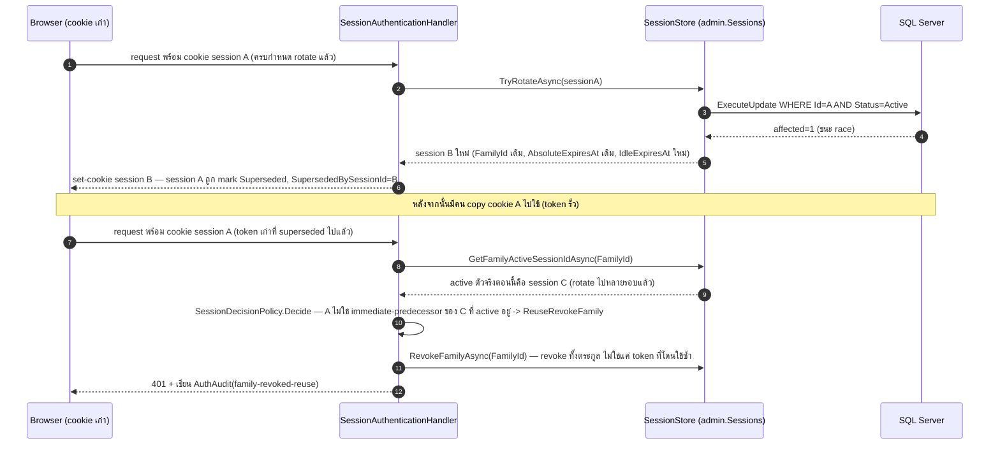

**ตาราง/แถวที่ถูกแตะ**: `admin.Sessions` (INSERT session ใหม่ + UPDATE session เก่าเป็น Superseded ทุก rotate,
UPDATE เป็น Revoked ทั้งตระกูลตอน reuse) → `admin.AuthAudits` (INSERT 1 แถวตอน revoke). กลไกเดียวกันเป๊ะฝั่ง
`merch.Sessions`/`merch.AuthAudits` แค่สลับ `PlatformUserId` เป็น `MerchantUserId`.

### F2. สิทธิ์ที่แท้จริงของผู้ใช้ (RBAC effective permission)

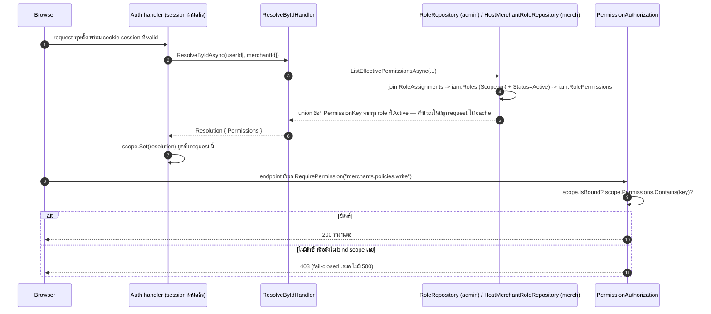

ฝั่ง admin query จาก `ControlPlaneDbContext` เดียวจบ (ไม่มี `MerchantId` ใน `admin.RoleAssignments`) ส่วนฝั่ง
merchant ต้องผสม 2 `DbContext` เข้าด้วยกัน (`merch.RoleAssignments` อยู่ `MerchantUsers` context, `iam.Roles`/
`iam.RolePermissions` อยู่ `ControlPlane` context) เพราะ assembly `Persistence.MerchantUsers` ถูกห้าม reference
`iam.*` ข้าม context ตรงๆ — host จึงประกอบ query จาก 2 port แยกกันแทน. ป้องกันไม่ให้ endpoint อ้าง permission
key ที่ไม่มีจริงหรือผูก policy ผิดฝั่งด้วย boot-time guard (`PermissionParity.Assert`) ที่ throw ตั้งแต่ boot
ถ้าไม่ตรง ไม่ปล่อยให้ไปพังตอน runtime.

**ตาราง/แถวที่ถูกแตะ**: อ่านอย่างเดียวทุก request — `admin.RoleAssignments`/`merch.RoleAssignments`, `iam.Roles`,
`iam.RolePermissions` (เขียนก็ต่อเมื่อ admin ไป assign/unassign role ให้ใคร).

### F3. จากตะกร้าสินค้าไปเป็นคำสั่งซื้อ (Checkout → Order)

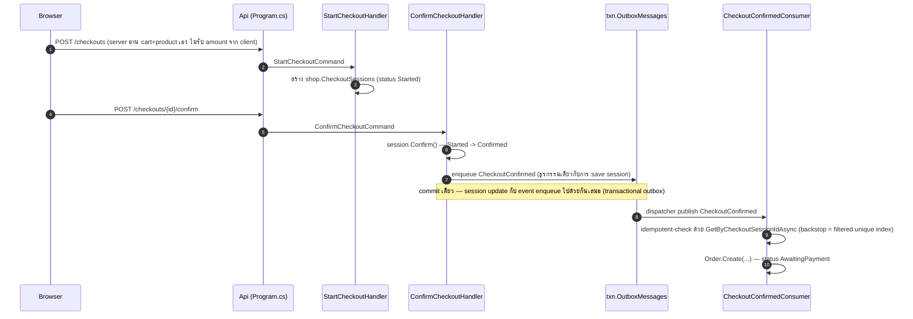

**ข้อควรรู้**: `shop.Carts` มี method `MarkCheckedOut()` ที่ตั้งใจไว้ให้ freeze ตะกร้าตอนเริ่ม checkout แต่
grep ทั้ง repo แล้วไม่มีจุดไหนใน production เรียกมันจริง (มีแค่ unit test เรียก) — ตะกร้าจึงยังคงสถานะ `Open`
ต่อไปแม้ checkout session จะเริ่มไปแล้วก็ตาม เป็นตัวอย่าง dead/unwired method ที่ยังไม่ถูกต่อสายเข้า flow จริง.

**ตาราง/แถวที่ถูกแตะ**: `shop.Carts`/`shop.CartItems` (อ่านอย่างเดียว) → `shop.CheckoutSessions` +
`shop.CheckoutSessionItems` (INSERT แล้ว UPDATE status) → `txn.OutboxMessages` (INSERT event) →
`shop.Orders` + `shop.OrderItems` (INSERT).

### F4. จากคำสั่งซื้อไปจ่ายเงินสำเร็จ (Order → Payment → Paid)

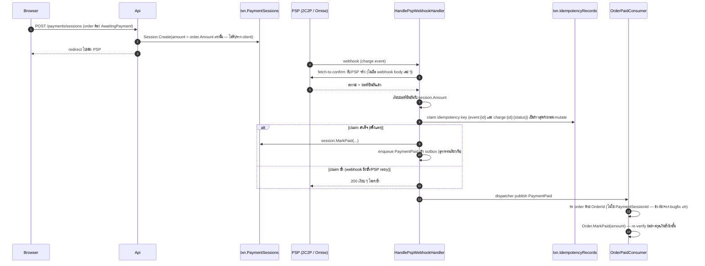

**ตาราง/แถวที่ถูกแตะ**: `txn.PaymentSessions` (INSERT แล้ว UPDATE เป็น Paid) → `txn.IdempotencyRecords`
(INSERT 2 key ต่อ event) → `txn.OutboxMessages` (INSERT) → `shop.Orders` (UPDATE เป็น Paid, set `PaidAt`).

### F5. เก็บรหัสลับอย่างปลอดภัย (Vault envelope encryption + reveal audit hash chain)

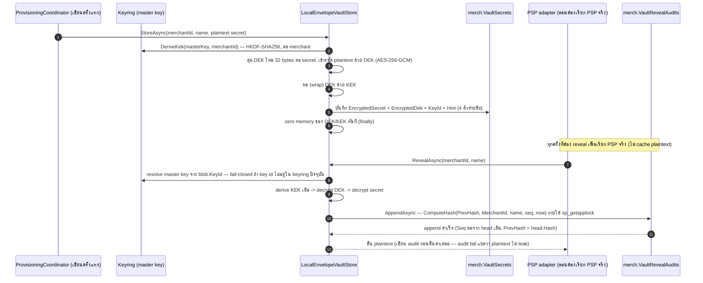

**ตาราง/แถวที่ถูกแตะ**: `merch.VaultSecrets` (1 แถวต่อ secret, UPDATE ตอน rotate) → `merch.VaultRevealAudits`
(append-only, 1 แถวต่อการ reveal 1 ครั้ง — ไม่เคยลบ/แก้).

### F6. เปิดร้านค้าใหม่ (Merchant provisioning ข้าม 3 schema)

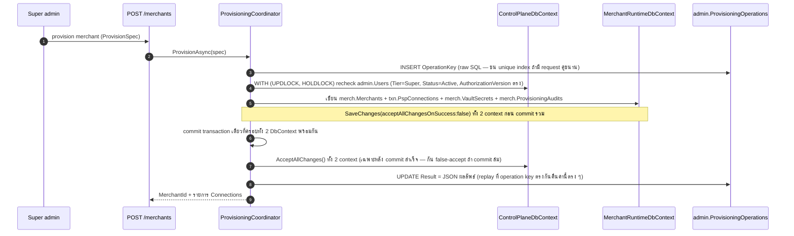

**ข้อควรรู้**: นี่คือจุดเดียวในทั้งระบบที่ `ControlPlaneDbContext` กับ `MerchantRuntimeDbContext` แชร์ physical
transaction เดียวกันจริง (โค้ดมี comment กำกับไว้ตรง ๆ ว่านี่คือข้อยกเว้นเดียว) — XML doc comment เก่าในไฟล์
`ProvisioningCoordinator.cs` เคยเขียนว่ากลไกนี้ "ยังไม่ wired เข้า handler จริง" แต่ตรวจ DI registration
(`Program.cs`) และ endpoint mapping จริงแล้วพบว่า **wired สมบูรณ์ 100%** ตั้งแต่ `POST /merchants` — เป็น
ตัวอย่างเตือนใจว่า comment ในโค้ดอาจล้าหลังกว่าของจริง ต้องเช็ค DI/endpoint เสมอ ไม่เชื่อ comment เฉย ๆ.

**ตาราง/แถวที่ถูกแตะ**: `admin.Users` (recheck อย่างเดียว ไม่เขียน) → `admin.ProvisioningOperations` (INSERT
แล้ว UPDATE `Result`) → `merch.Merchants` + `txn.PspConnections` + `merch.VaultSecrets` +
`merch.ProvisioningAudits` (INSERT พร้อมกันทั้งหมดใน tx เดียว) — ข้าม admin/merch/txn 3 schema จริง.

---

## คำถามที่พบบ่อย

**ทำไมไม่มี field "เลขกรมธรรม์" ที่ออกโดยระบบตรงๆ**: เพราะแพลตฟอร์มนี้ไม่ได้ออกกรมธรรม์ (ไม่ใช่ระบบ policy
issuance) — `shop.OrderItemPolicies.ReferenceNumber` เป็นแค่ช่องให้แอดมิน/ตัวแทน**กรอกย้อนหลัง**เลขกรมธรรม์
จริงที่บริษัทประกันออกให้นอกระบบ ไม่ใช่เลขที่ระบบสร้างเอง — ดูบริบทธุรกิจเต็มที่
[`.ai/shared/PROJECT_CONTEXT.md`](../../.ai/shared/PROJECT_CONTEXT.md)

**ทำไม session เก็บแค่ hash ของ cookie ไม่เก็บ cookie ตรงๆ**: ถ้า DB รั่ว คนอ่านได้แค่ hash ที่ reverse กลับเป็น
cookie จริงไม่ได้ (SHA-256 ทางเดียว) — ต่างจาก DB ที่เก็บ token ตรงๆ ซึ่งรั่วครั้งเดียวเท่ากับทุก session ที่
active อยู่ถูกขโมยหมด

**ทำไมหลายตาราง (เช่น `shop.Products`, `txn.PspConnections`) ไม่มี DB Foreign Key ไปหา `merch.Merchants`
ทั้งที่มีคอลัมน์ `MerchantId`**: เพราะ isolation ของระบบนี้ย้ายจาก DB-level (RLS) มาเป็น app-layer ล้วนแล้ว
(ดู "ไม่มี RLS" ใน [Legend](#legend)) — `MerchantId` ทำหน้าที่เป็นตัวกรองที่ EF query filter ใช้ ไม่ใช่ FK
ที่ DB บังคับ รายละเอียดเต็มที่ [`db-connection-and-rls.md`](db-connection-and-rls.md)

**ทำไม `shop.Carts.Status` เก็บเป็น string (`"Open"`/`"CheckedOut"`) แต่ enum ตัวอื่นทั้งระบบเก็บเป็น int**:
เป็นข้อยกเว้นเดียวในทั้งระบบ (`HasConversion<string>()`) — ไม่มีเหตุผลเชิงเทคนิคพิเศษที่พบในโค้ด เป็นทางเลือก
ตอนออกแบบตารางนี้ตารางเดียว ดู [Enums](#enums)

**ทำไม `shop.OrderItems` เป็น INSERT-only แต่ `shop.OrderItemPolicies` แก้ไขได้**: `OrderItems` คือ snapshot
ของสิ่งที่ขายจริง ณ เวลาซื้อ (ต้องคงที่ตลอดไปเพื่อความถูกต้องของบัญชี) ส่วน `OrderItemPolicies` คือข้อมูลที่
ทยอยกรอกได้ทีหลัง (เลขกรมธรรม์ยังไม่ออกตอนขาย ต้องกรอกย้อนหลัง) — จึงแยกเป็น 2 ตารางคนละอายุการแก้ไข แทนที่จะ
เปิดให้แก้ `OrderItems` ตรงๆ

**ทำไมมี outbox 2 ตาราง (`txn.OutboxMessages` กับ `merch.UserOutbox`)**: เพราะผู้สมัคร merchant-user ใหม่ยัง
ไม่มี merchant จริงตอนสมัคร (รอ admin approve ก่อน) แต่ `txn.OutboxMessages.MerchantId` เป็น non-nullable และ
มี CHECK constraint กัน sentinel MerchantId ปลอมไม่ให้โผล่ในตารางนี้อีก — ดูรายละเอียดเต็มที่บล็อกของ
`merch.UserOutbox` ด้านบน

**ทำไม field เงินต้องเป็น `decimal(19,4)` เสมอ ห้าม float/double**: เพราะ float/double เป็นเลขฐาน 2 ที่ปัด
เศษทศนิยมฐาน 10 ไม่เป๊ะ (เช่น 0.1 + 0.2 ไม่เท่ากับ 0.3 พอดีในหลายภาษา) เงินสะสมข้ามหลายรายการนานพอจะคลาดเคลื่อน
ได้ — เป็นมาตรฐานที่ล็อกไว้ทั้งระบบตั้งแต่ rf1 (2026-07-05) ดู `Money` ใน `SharedKernel`

**อยากรู้ว่า RLS หายไปไหน ทำไม `pol_app` มีสิทธิ์เยอะมาก**: RLS (row-level security ของ SQL Server) ถูกรื้อ
ทิ้งทั้งหมดในเดือนกรกฎาคม 2026 — isolation ย้ายมาเป็น EF query filter + write authorizer ในชั้นแอปแทน DB จึง
เหลือ principal เดียว (`pol_app`) ที่ได้สิทธิ์กว้างขึ้นเป็นการแลกเปลี่ยนที่ตั้งใจ (signed-off tradeoff) — ดู
[Schema objects beyond tables](#schema-objects-beyond-tables) ด้านบน

**จะเพิ่มตารางใหม่ ต้องอัปเดตไฟล์นี้ยังไง**: เพิ่ม `###` block ใหม่ (header + intro + field table + 4-label
deep-dive) ใต้ schema ที่ตารางนั้นอยู่ ถ้าเป็น schema ใหม่ให้เพิ่ม `##` section ใหม่พร้อม flowchart — ปรับ
จำนวน "N ตาราง" ใน blockquote บนสุดและใน TOC ด้วย
