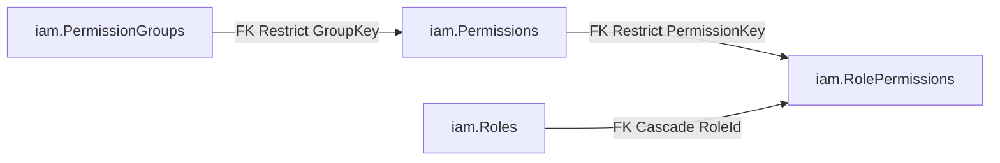

# โมดูล Iam — RBAC Catalog กลาง (Permission / Role)

> **[สร้างครั้งแรก 2026-08-01]** sync กับโค้ดจริงที่ commit ล่าสุดที่แตะโมดูลนี้ (`c81d3e2`, ถอด
> `product.create`/`product.update` ออกจากแคตตาล็อก) แหล่งความจริงของตัวเลข catalog คือ
> `src/Modules/Iam/Iam.Domain/Permissions/Keys.cs` เท่านั้น — ถ้าไฟล์นี้กับ `Keys.cs` ขัดกัน ให้ยึด `Keys.cs`
> ก่อนเสมอ (มี integration test บังคับว่า seed ใน DB ต้องตรงกับ `Keys.All` ไม่ให้ drift)

## บริบท

โมดูล `Iam` คือ**แคตตาล็อกสิทธิ์กลางเดียว** (spec `rf2-iam-rbac`, 2026-07-13) ที่แทนที่ระบบ RBAC ที่เคยแยกกัน
สองชุดโดยสิ้นเชิง: `Admins.Domain.Permissions.Keys` (ฝั่ง admin console) และ
`Merchants.Domain.Users.Permissions.Keys` (ฝั่ง merchant-user console, จงใจ duplicate โครงจาก admin) ปัญหาของ
การแยกสองชุดคือไม่มีกลไกจับ "cross-side grant" (เช่น เผลอ grant สิทธิ์ฝั่ง merchant ให้ role ฝั่ง admin) — โมดูลนี้
ปิดช่องนั้นด้วยโครงสร้าง ไม่ใช่ด้วย convention: `Scope` (Platform/Merchant) ผูกอยู่กับทุก group/key/role ตั้งแต่ต้น
และ `Role.SetPermissions()` reject การ grant ข้าม scope ที่ระดับ domain

หลัง rf2 มีอีก 2 รอบที่แก้ไข catalog:
1. **`policy-reference-record`** (2026-07-30) เพิ่ม group `merchants.policies`/`policies` (+4 keys/+2 groups)
   สำหรับ endpoint อ่าน/เขียน `ItemPolicy` (ดู `docs/reference/products.md`)
2. **`RetireCatalogPermissions`** (migration `20260731065539`, 2026-07-31) ถอด `product.create`/`product.update`
   (group `catalog`) ทิ้ง เพราะ orphan หลัง `POST /api/v1/products` ถูกถอด (catalog อ่านอย่างเดียวผ่าน HTTP แล้ว)

ผลคือตัวเลขปัจจุบันจริง (ไม่ใช่ 20/8 ตาม rf2 baseline เดิม): **22 keys / 9 groups / 4 roles**

## Domain model (`Iam.Domain`)

| Type | ไฟล์ | บทบาท |
|---|---|---|
| `Scope` enum | `Permissions/Keys.cs:7` | `Platform=0`/`Merchant=1` — ค่านี้ผูกกับทุก group/key/role ทั้งระบบ |
| `PermissionGroup` | `Permissions/PermissionGroup.cs` | resource bucket (reference data), PK = `Key`, มี `Scope`/`LabelTh`/`SortOrder` |
| `Permission` | `Permissions/Permission.cs` | สิทธิ์ละเอียด (reference data), PK = `Key`, FK ไป `GroupKey` — ไม่เก็บ `Scope` ของตัวเอง (derive จาก group) |
| `Role` | `Roles/Role.cs` | aggregate root หลัก — ดู invariants ด้านล่าง |
| `RolePermission` | `Roles/RolePermission.cs` | child entity ของ `Role`, unique `(RoleId, PermissionKey)` |
| `RoleVisibility` | `Roles/RoleVisibility.cs` | expression กลางกำหนดว่าฝั่งไหนเห็น role แถวไหน — นิยามครั้งเดียว ไม่ re-derive ต่อ caller |

### Invariants สำคัญของ `Role` (`Roles/Role.cs`)

- **`Scope` immutable** — set ตอน `Create()` เท่านั้น ห้ามเปลี่ยนภายหลัง
- **Platform role ห้ามมี `MerchantId`** — บังคับทั้งใน `Create()` (throw `ArgumentException`) และ DB CHECK
  constraint `CK_Roles_ScopeMerchant` (`([Scope] = 0 AND [MerchantId] IS NULL) OR [Scope] = 1`)
- **`SetPermissions()`** (บรรทัด 120-144) reject 2 กรณี: key นอกแคตตาล็อก และ key ที่ `catalog[key] != Scope`
  ของ role เอง — cross-side grant เป็นไปไม่ได้ที่ domain layer ไม่ใช่แค่ validation ชั้นบน
- **`IsSeedAnchor`** — true เมื่อ `MerchantId is null` **และ** `Code` ตรงกับ `Role.PlatformAdminCode`
  (`"platform_admin"`) หรือ `Role.MerchantManagerCode` (`"merchant_manager"`) เท่านั้น (merchant สร้าง custom
  role ชื่อซ้ำ `platform_admin` ได้เพราะคนละ `MerchantId` bucket แต่จะไม่ถูกนับเป็น anchor) — anchor
  `Deactivate()`/`EnsureDeletable()` throw `InvalidOperationException` เสมอ (เป็น lockout-recovery role)
- **Unique `(MerchantId, Code)` แบบ `HasFilter(null)`** (`RoleConfigurations.cs:34`) — ตั้งใจไม่ใช้ default
  filtered index ของ SqlServer provider (ซึ่งจะยกเว้นทุกแถว NULL ออกจาก uniqueness เงียบๆ, Codex P2 เคยจับได้
  ใน PR #98) ทำให้ shared/seed role ชื่อซ้ำกันไม่ได้ แต่ merchant คนละรายใช้โค้ดซ้ำกันได้

## Catalog ปัจจุบัน — 22 keys / 9 groups / 4 roles

แหล่งความจริงเดียว: `Iam.Domain/Permissions/Keys.cs:31-104` (migration seed ต้องตรงกับ `Keys.All` เป๊ะ)

### Groups (9)

| Group key | Scope | Keys ในกลุ่ม |
|---|---|---|
| `txn` | Platform | `txn.view`, `txn.refund`, `txn.export` |
| `merchant` | Platform | `merchant.view`, `merchant.manage` |
| `user` | Platform | `user.view`, `user.manage`, `user.roles` |
| `system` | Platform | `audit.view`, `settings.manage`, `apikey.manage` |
| `merchants.users` | Platform | `merchants.users.approve`, `merchants.users.reject` |
| `merchants.policies` | Platform | `merchants.policies.read`, `merchants.policies.write` |
| `payment` | Merchant | `payment.create`, `payment.redirect` |
| `roles` | Merchant | `roles.view`, `roles.manage`, `users.roles` |
| `policies` | Merchant | `policies.read`, `policies.write` |

รวม **Platform-scope 15 keys / 6 groups** (admin console เห็นเฉพาะกลุ่มนี้), **Merchant-scope 7 keys / 3 groups**
(merchant-user console เห็นเฉพาะกลุ่มนี้) — คนละ vocabulary กันคนละฝั่งโดยสิ้นเชิง

> ระวังคู่ที่หน้าตาคล้าย: `user.roles` (Platform, กลุ่ม `user`) กับ `users.roles` (Merchant, กลุ่ม `roles`) เป็น
> คนละ key คนละ C# member (`Keys.UserRoles` / `Keys.UsersRoles`) — เคยเป็นคนละ catalog คนละคอนโซลมาก่อน

### Roles (4 seed, GUID คงที่)

| Code | Scope | Anchor | Seed permissions | GUID |
|---|---|---|---|---|
| `platform_admin` | Platform | ใช่ (ปิด/ลบไม่ได้) | ทุก Platform key (15) | `11111111-1111-1111-1111-111111111111` |
| `platform_auditor` | Platform | ไม่ | subset อ่านอย่างเดียว | `55555555-...` |
| `merchant_manager` | Merchant | ใช่ (ปิด/ลบไม่ได้) | ทุก Merchant key (7) | `aaaaaaaa-aaaa-aaaa-aaaa-aaaaaaaaaaaa` |
| `merchant_staff` | Merchant | ไม่ | `payment.create`, `payment.redirect`, `policies.read` | `bbbbbbbb-bbbb-bbbb-bbbb-bbbbbbbbbbbb` |

merchant สร้าง custom role ของตัวเองเพิ่มได้ (ผูก `MerchantId`) ผ่าน endpoint ด้านล่าง — ไม่ใช่แค่ 4 role นี้ตายตัว

## Application layer (CQRS ผ่าน Mediator)

| Handler | ไฟล์ | ทำอะไร |
|---|---|---|
| `CreateRoleHandler` | `Roles/CreateRole.cs` | duplicate code ใน visible set (รวม shared NULL bucket) → 409; permission key ผิด catalog/scope → 400 |
| `UpdateRoleHandler` | `Roles/UpdateRole.cs` | ไม่เห็น role → 404; merchant แก้ role ที่ตัวเองไม่ได้เป็นเจ้าของ (รวม shared seed ที่มองเห็นแต่แก้ไม่ได้) → 409; deactivate seed anchor → 409 |
| `DeleteRoleHandler` | `Roles/DeleteRole.cs` | เงื่อนไขเดียวกับ update + role ที่ยังมี assignment ผูกอยู่ (นับข้าม 2 ฝั่ง) → 409 |
| `ListRolesHandler` / `GetRoleHandler` | `Roles/RoleQueries.cs` | read model, เติม `UserCount` จาก `IRoleAssignmentCounter` (store เองคืน 0 เสมอ — ไม่ own assignment table) |
| `GetPermissionCatalogHandler` | `Roles/RoleQueries.cs` | คืน catalog กรองตาม `Scope` เดียว (ไม่ใช่ `RoleSideContext` เต็ม — catalog ไม่มี per-merchant data) |

**Ports กันไม่ให้ `Iam.Application` reference `Admins`/`Merchants` โดยตรง** (`RolePorts.cs`,
`IRoleAssignmentCounter.cs`, `IRoleAuditSink.cs`): `IRoleStore`, `IRoleAssignmentCounter`, `IRoleAuditSink` — host
เป็นผู้ bridge ให้ (ดู "Authorization wiring" ด้านล่าง)

**`RoleSideContext`** (`Roles/RoleSideContext.cs`) — value object เดียวที่บอกว่า operation รันในฐานะฝั่งไหน
(`Platform()` = `MerchantId=null`, `Merchant(merchantId)`) ทุก command/query ของ `Iam.Application` รับ record นี้
เป็น parameter ตรงๆ — client ไม่มีทาง smuggle side selection ผ่าน request body ได้ เพราะ host เป็นจุดเดียวที่
ประกอบ record นี้ (`RoleSideContextResolver` ใน host, ดูด้านล่าง)

## Infrastructure

**Schema `iam` (context: ControlPlane) — 4 ตาราง** รายละเอียด field-level เต็มดู
[`entity-fields.md`](entity-fields.md#iam-schema-context-controlplane--4-ตาราง)

- `PermissionGroups`/`Permissions` = catalog นิ่ง — `pol_app` ได้แค่ **SELECT** (seed ผ่าน migration เท่านั้น
  ไม่มี grant INSERT/UPDATE/DELETE)
- `Roles`/`RolePermissions` = แก้ได้ runtime — `pol_app` ได้ SELECT/INSERT/UPDATE/DELETE เต็ม
- **ไม่มี RLS predicate** — per-merchant visibility บน `Roles`/`RolePermissions` เป็น app-layer floor
  (`RoleVisibility.For`) ทั้งหมด ไม่ใช่ DB policy (ดู design's residual-risk note)
- EF configs: `Iam.Infrastructure/Persistence/{Permissions,Roles}/*Configurations.cs` — `IamModuleRegistration
  .AddIamModule()` **ไม่ลงทะเบียน repository ใดๆ** แค่ force-load assembly ให้ EF discover configuration เท่านั้น
- **Store จริงอยู่คนละที่**: `RoleStore` (implement `IRoleStore`) ย้ายไปอยู่
  `Persistence.ControlPlane/Iam/RoleStore.cs` ผูกกับ `ControlPlaneDbContext` แล้ว (ไม่ใช่ `Iam.Infrastructure`
  อีกต่อไป) — ทุก read เรียก `RoleVisibility.For(...)` ก่อนเสมอ ไม่มี unscoped query เหลือ
- Assignment table ต่อฝั่ง (`admin.RoleAssignments`/`merch.RoleAssignments`) อยู่นอก schema นี้ ใน
  `Admins`/`Merchants.Infrastructure`, FK Restrict กลับมาที่ `iam.Roles.Id`

## Authorization wiring (`src/Hosts/Api/Iam/`)

| ชิ้นส่วน | ไฟล์ | ทำอะไร |
|---|---|---|
| `AuthPolicyScheme.For(policy)` | `PermissionAuthorization.cs` | ตาราง 1 จุด map policy → (auth scheme, `Scope`): `"admin"` → (`AdminSession`, Platform), `"merchant-user"` → (`MerchantUserSession`, Merchant) |
| `RequirePermission(permission)` | `PermissionAuthorization.cs` | extension บน `RouteHandlerBuilder` — endpoint filter เช็ค `IAdminScope`/`IUserScope` ที่ bind อยู่ (fail-closed → 403 เสมอ ไม่มี 500) |
| `PermissionParity.Assert(services)` | `PermissionAuthorization.cs` | **boot-time guard** — วนทุก endpoint ที่ gate ด้วย `RequirePermission`, เช็ค (a) key อยู่ใน `Keys.AllKeys` (b) `Keys.KeySide[key]` ตรงกับ `Scope` ที่ policy ของ endpoint นั้นบ่งบอก — ผิดคือ boot fail ทันที ไม่ใช่ runtime surprise เรียกจาก `Program.cs` หลัง endpoint ทั้งหมด map เสร็จ ก่อน `app.Run()` |
| `RoleSideContextResolver` | `RoleHostWiring.cs` | จุดเดียวที่ประกอบ `RoleSideContext` จาก scope ที่ bind (`ForAdmin`/`ForMerchantUser`) — `Iam.Application` เห็นไม่ได้ทั้ง `IAdminScope`/`IUserScope` เพราะเป็น peer-module type |
| `AdminRoleAuditSink : IRoleAuditSink` | `RoleHostWiring.cs` | เขียน audit ใน transaction เดียวกับ role write; no-op เมื่อไม่มี admin bind (merchant-side role CRUD ไม่เคยถูก audit) |
| `HostRoleAssignmentCounter : IRoleAssignmentCounter` | `RoleHostWiring.cs` | รวม count จาก `IAdminRoleAssignmentCountReader` + `IMerchantRoleAssignmentCountReader` — merchant context นับเฉพาะ merchant ตัวเอง กัน leak จำนวนผู้ใช้ข้าม tenant |
| `AddIamRoleManagement()` | `RoleHostWiring.cs` | ลงทะเบียน 2 ตัวบน ต้องเรียกหลัง `AddAdminIdentity` + `AddControlPlanePersistence`/`AddMerchantUserPersistence` |

## API endpoints

### Admin console (`/api/v1/admins`, policy `"admin"`)

| Method | Path | Gate | Handler |
|---|---|---|---|
| GET | `/permissions` | (auth เฉยๆ ไม่ gate permission) | `GetPermissionCatalogQuery(Scope.Platform)` |
| GET | `/roles` (SFS) | (auth เฉยๆ) | `ListRolesQuery` |
| GET | `/roles/{code}` | (auth เฉยๆ) | `GetRoleQuery` |
| POST | `/roles` | `user.roles` | `CreateRoleCommand` |
| PUT | `/roles/{code}` | `user.roles` | `UpdateRoleCommand` |
| DELETE | `/roles/{code}` | `user.roles` | `DeleteRoleCommand` |
| PUT | `/{id}/roles` | `user.roles` | `SetRolesCommand` (Admins module, ใช้ `RoleCodes`) |

### Merchant-user console (`/api/v1/merchants/users`, policy `"merchant-user"`)

| Method | Path | Gate | Handler |
|---|---|---|---|
| GET | `/permissions` | (auth เฉยๆ) | `GetPermissionCatalogQuery(Scope.Merchant)` |
| GET | `/roles` | (auth เฉยๆ) | `ListRolesQuery` (limit = `int.MaxValue`, ไม่มี SFS บน wire นี้) |
| GET | `/roles/{code}` | (auth เฉยๆ) | `GetRoleQuery` |
| POST | `/roles` | `roles.manage` | `CreateRoleCommand` |
| PUT | `/roles/{code}` | `roles.manage` | `UpdateRoleCommand` |
| DELETE | `/roles/{code}` | `roles.manage` | `DeleteRoleCommand` |
| PUT | `/{merchantUserId}/roles` | `users.roles` | `MerchantSetRolesCommand` (Merchants module) |

## Migration history

| Migration | วันที่ | ผล |
|---|---|---|
| `20260712185912_SeedData` | 2026-07-12 | rf2 baseline: 20 keys / 8 groups / 4 roles, 28 role-permission grants |
| `20260723150000_SeedPolicyPermissions` | 2026-07-23 | +4 keys (`merchants.policies.{read,write}`, `policies.{read,write}`) / +2 groups / +6 grants → ชั่วคราว 24/10 |
| `20260731065539_RetireCatalogPermissions` | 2026-07-31 | -2 keys (`product.create`/`product.update`) / -1 group (`catalog`) / -4 grants (`merchant_manager`+`merchant_staff` × 2 key) — orphan หลัง `POST /api/v1/products` ถูกถอด |

**ผลลัพธ์ปัจจุบัน: 22 keys / 9 groups / 4 roles, `iam.RolePermissions` 30 seed rows** (28 + 6 − 4)

## Cross-reference

- Business flow ที่ใช้ permission เหล่านี้ (RBAC ต่อ actor): [`admins.md`](admins.md) §"Role & permission
  management", [`merchants.md`](merchants.md) §"RBAC + permission enforcement"
- Field-level schema เต็ม (คอลัมน์/type/FK/seed row): [`entity-fields.md`](entity-fields.md)
- Architecture layer walkthrough (มุมมอง 6-layer, ไม่ใช่ business reference): [`layers-guide.md`](layers-guide.md)
  §8 Iam
- Module map ระดับ platform: [`platform-modules.md`](platform-modules.md) §3.2/§4.2 (ชี้กลับมาไฟล์นี้)

## Source of truth

`src/Modules/Iam/Iam.Domain/Permissions/Keys.cs` (catalog), `src/Modules/Iam/Iam.Domain/Roles/Role.cs`
(invariants), `src/Hosts/Api/Iam/*.cs` (authorization wiring + endpoint gate) — ตัวเลข/พฤติกรรมในไฟล์นี้ต้อง sync
กับโค้ด 3 จุดนี้เสมอ
