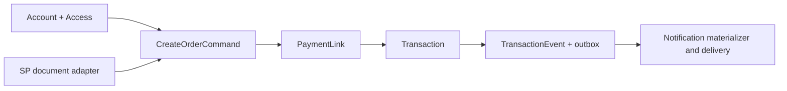

# คู่มือ Layers ของ pol-core

เอกสารนี้อธิบาย dependency direction และ ownership ของ source ปัจจุบัน. รายการ path ยึด 4 source projects ใน `pol-core.slnx`; ชื่อ folder รุ่นเก่าใน spec หรือ compatibility fixture ไม่ใช่ runtime layer.

## Dependency direction

```text
Api -> Infrastructure -> Application -> Domain -> SharedKernel
Application/Contracts เป็น seam สำหรับ event และ DTO ข้าม module
```

| ชั้น | หน้าที่ | ตัวอย่าง path |
|---|---|---|
| Shared kernel | entity base, `Money`, currency, JSON/value primitives | `src/Domain/SharedKernel/` |
| Domain | aggregate, invariant, enum, domain event | `src/Domain/Modules/` |
| Application | command/query/handler, DTO, policy และ port | `src/Application/Modules/` |
| Contracts/building blocks | cross-module event, actor, unit of work, guards | `src/Application/Contracts/`, `src/Application/BuildingBlocks.Application/` |
| Infrastructure | adapter, persistence mapping, repository, outbox, vault, provider integration | `src/Infrastructure/Modules/`, `src/Infrastructure/Persistence/` |
| API host | composition root, HTTP endpoint, auth/BFF, middleware, background dispatch | `src/Api/Api/`, `src/Api/BuildingBlocks.Web/` |

`Domain` ไม่ reference EF Core/Infrastructure. ทุก domain module อยู่ใน `Domain` project เดียวกัน จึงใช้ namespace/module boundary และ architecture tests กันการเรียก implementation ข้าม module; event/behavior ข้าม module ใช้ `Application/Contracts`, application ports หรือ host coordinator.

## Module placement

Current module roots คือ `Access`, `Accounts`, `Admins`, `Carts`, `Checkouts`, `Governance`, `Iam`, `Merchants`, `Notifications`, `Orders`, `Payments`, `Products`, `Reporting` และ support modules `Migration`/`Platform`. ไม่ใช่ทุก module จะมี project ครบทุก layer.

| Module | Domain | Application | Infrastructure/host |
|---|---|---|---|
| `Accounts` | `src/Domain/Modules/Accounts.Domain/` | `src/Application/Modules/Accounts.Application/` | `src/Infrastructure/Modules/Accounts.Infrastructure/`, `src/Api/Api/Accounts/` |
| `Access` | `src/Domain/Modules/Access.Domain/` | policy อยู่ `Accounts.Application` | `src/Infrastructure/Modules/Access.Infrastructure/` |
| `Orders` | `src/Domain/Modules/Orders.Domain/` | `src/Application/Modules/Orders.Application/` | `src/Infrastructure/Modules/Orders.Infrastructure/`, `src/Api/Api/Orders/` |
| `Payments` | `src/Domain/Modules/Payments.Domain/` | `src/Application/Modules/Payments.Application/` | `src/Infrastructure/Modules/Payments.Infrastructure/`, `src/Api/Api/Payments/` |
| `Notifications` | `src/Domain/Modules/Notifications.Domain/` | `src/Application/Modules/Notifications.Application/` | `src/Infrastructure/Persistence/Persistence.MerchantRuntime/Notifications/`, `src/Api/Api/Notifications/` |

รายละเอียด module อื่นอยู่ [platform-modules.md](platform-modules.md).

## Persistence ownership

Runtime มี 2 contexts และ migration owner 1 ตัว:

| Owner | Responsibility |
|---|---|
| `ControlPlaneDbContext` | `acct`, `access`, `admin`, `iam`, `oauth`, `cfg`, merchant identity/profile/vault และ `txn` provider/routing/capability/approval configuration |
| `CommerceDbContext` | `shop`, `checkout` และ `txn` เฉพาะ payment attempts, Transactions/events, inbound webhooks, outbox และ notification runtime |
| `PolDbContext` | design-time full model และ EF migrations เท่านั้น; ไม่ register ที่ API runtime |

Runtime contexts derive `GuardedRuntimeDbContext`. Commerce rows ใช้ query filter ตาม `CurrentMerchant`; identity access checks ใช้ Account authorization snapshot, DataScope, owner Sale/Branch และ authorization lease. Writes ผ่าน sealed `IWriteAuthorizer`; raw SQL/`IgnoreQueryFilters`/bulk DML ต้องอยู่ใน named allowlist.

## Business flow



Canonical `/orders` เป็น Account/Access path ที่ตรวจ trusted owner/pricing และใช้ `issueNow` branch. `/orders/from-cart` เป็น legacy commerce route ที่ยังใช้ `OrderCreationCoordinator`; มันไม่เปลี่ยน canonical DTO.

## Tests และ boundaries

- `tests/UnitTests` ตรวจ invariants, policy, handler และ reducer
- `tests/ArchitectureTests` ตรวจ layer references, mapping owner, filters, write guard, bypass และ retired surface
- `tests/IntegrationTests` ตรวจ SQL Server migration chain, host route, transaction ordering, outbox, notification leases และ provider capture

Local implementation evidence ผ่านตาม handoff แต่ live external credentials/authorization ไม่มี. เอกสารนี้จึงไม่อ้าง production-ready.

## Source of truth

- `src/Api/Api/Program.cs`
- `src/Api/Api/ControlPlane/CanonicalCommerceEndpoints.cs`
- `src/Application/Modules/Orders.Application/OrderWorkflow.cs`
- `src/Application/Modules/Platform.Application/Transactions/`
- `src/Infrastructure/Persistence/Persistence.ControlPlane/`
- `src/Infrastructure/Persistence/Persistence.MerchantRuntime/`
