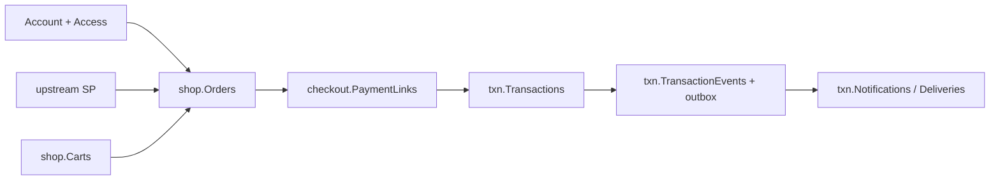
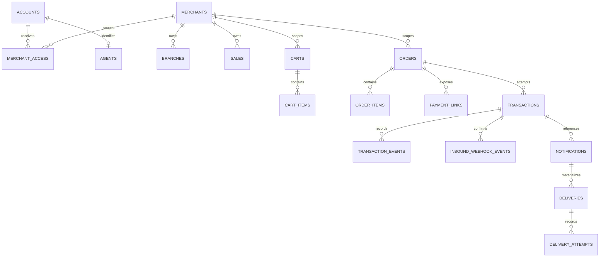

# Merchant–Commerce–Payment ERD Reference

เอกสารนี้สรุป persisted model ปัจจุบันของ `pol-core` หลัง `platform-restructure-v1`. ใช้ model snapshot และ EF mappings เป็นหลัก; target/historical shape ที่ไม่ตรง source ไม่ถือเป็น current schema.

## Current flow

`POST /api/v1/orders` เป็น canonical create ที่ใช้ Account/Access และ trusted pricing. `POST /api/v1/orders/from-cart` เป็น compatibility route ที่ `OrderCreationCoordinator` ตรวจ Cart/source ซ้ำ. `checkout` ใน current model คือ capability/payment-link และ transaction entry point ไม่ใช่ legacy CheckoutSession aggregate.

## Conceptual ERD

เส้นที่แสดงเป็น conceptual ownership/scope; ไม่ได้หมายความว่า physical FK มีครบทุกเส้น. Cross-context authorization ใช้ explicit application port และ merchant scope.

## Context และ schema inventory

| Schema | Current tables/ขอบเขต | Runtime owner |
|---|---|---|
| `acct` | `Accounts`, `LoginAccounts`, `Employees`, `Agents`, `SystemClients`, key/BFF/registration tables | `ControlPlaneDbContext` |
| `access` | `MerchantAccess`, `AccessRoles`, `BranchAccess`, `PlatformAccess`, `PlatformAccessRoles`, `SystemClientScopes`, `MerchantAccessMethods` | `ControlPlaneDbContext` |
| `admin` | Admin identity/session, governance/audit, provisioning, control webhook/notification delivery, operation records | `ControlPlaneDbContext` |
| `iam` | permissions/groups/roles/grants, API clients, one-time secret tickets | `ControlPlaneDbContext` |
| `merch` | merchants/branches/sales/originators, merchant-user identity/session, vault and user outbox | `ControlPlaneDbContext` |
| `shop` | carts, cart items, orders, order items, reveal audits | `CommerceDbContext` |
| `checkout` | `PaymentLinks`, `PaymentLinkReplays` | `CommerceDbContext` |
| `txn` | split owner: `ControlPlaneDbContext` owns provider/routing/capability/approval configuration; `CommerceDbContext` owns payment sessions, transactions/events, inbound webhooks, idempotency/outbox and notification runtime | both runtime contexts |
| `cfg` | payment methods/providers/options/capability migration rows | `ControlPlaneDbContext` |
| `oauth` | OpenIddict state and assertion replay | `ControlPlaneDbContext` |
| `dbo` | Data Protection keys and EF history | framework/migration owner |

Runtime ใช้ `ControlPlaneDbContext` และ `CommerceDbContext` เท่านั้น. `PolDbContext` เป็น migration owner. ทั้ง runtime ใช้ principal `pol_app`, query filter/actor binding และ guarded write; ไม่มี SQL RLS, bypass principal หรือ `SESSION_CONTEXT`.

## Account, Access และ Merchant identity

`Accounts` แยก `Employee`, `Agent`, `System` จาก console `Admins`/`MerchantUser`. `MerchantAccess` มี `DataScope` (`Merchant`, `Self`, `Branch`, `AssignedBranches`), status/version และ role/branch/method grants. `Agent` ผูก Sale เดียว; owner resolution ของ canonical Order ใช้ Sale/Branch ที่ trusted.

Merchant-user KYC registration ใช้ `merch.Users`/registration rows และเก็บ object key แทน binary:

- multipart `kycPhoto` ไม่เกิน 2 MiB
- allowlisted media type และ magic bytes
- deterministic staging key ตาม operation id
- `(Key, CreatedNew)` ทำให้ retry bytes เดิม idempotent และ bytes ต่างกันถูกปฏิเสธ
- DB/outbox เก็บ key และ lifecycle; failed attempt ลบเฉพาะ object ที่ call นั้นสร้าง
- orphan TTL 24 ชั่วโมง; prune เริ่มหลัง 5 นาทีและทำทุก 1 ชั่วโมง
- single-host ใช้ `merchant-user-photos:/app/merchant-user-photos`; multi-host ต้อง shared object store

API/history/log ไม่คืน object key, filesystem path, credential หรือ PII ที่ไม่จำเป็น.

## Commerce fields

### `shop.Carts` และ `shop.CartItems`

Cart เก็บ `MerchantId`, nullable `SaleCode`, optional `OriginatorId`, status/version. Item เก็บ `ProductCode`, `SaleCode`, `VariantCode`, `VariantName`, quantity, `Money` unit price และ typed `CommerceItemMetadata` ใน native `json`. Duplicate product ใน Cart เดียวกันถูกปฏิเสธแบบ case-insensitive.

### `shop.Orders` และ `shop.OrderItems`

Order เก็บ `OrderNo`, merchant/owner snapshot, business type, customer contact, `SubtotalAmount`, adjustment, `TotalAmount`, `PaymentStatus`, `SuccessfulTransactionId`, compatibility `PaymentSessionId`, status/version, PaymentLink notification intent และ timestamps. Item เก็บ product/variant snapshot, quantity, unit/discount/tax/line money, trusted metadata และ `VersionedMetadata` ของ request.

Lifecycle status มี `Draft`, `Open`, `Pending`, `Paid`, `Failed`, `Expired`, `Refunded`, `Cancelled`; `PaymentStatus` แยกเป็น `Unpaid`, `Processing`, `Paid`.

### `checkout.PaymentLinks` และ replay

`PaymentLinks` เก็บ keyed token hash 32 bytes, Order/Merchant, status, expiry, revoke/rotation pointer และ version. `PaymentLinkReplays` เก็บ operation/idempotency/request hash และ protected ciphertext ของ raw token เฉพาะ replay; raw token ไม่อยู่ durable plaintext.

### `txn.Transactions` และ `txn.TransactionEvents`

Transaction pin provider/account/environment, credential/config version, amount/currency, request/provider references, redirect/return binding, safe Order snapshot และ inquiry state. `TransactionEvent` append-only provider evidence; raw webhook/signature ไม่เก็บ.

### Notification runtime

`txn.NotificationInboxMessages` dedupe control/outbox handoff ด้วย `SourceEventId`; `txn.Notifications` เก็บ payload snapshot + order/transaction references; `txn.TemplateVersions` เป็น released template; `txn.Deliveries` เก็บ immutable recipient/template/endpoint snapshots; `txn.DeliveryAttempts` append-only; `txn.NotificationReviewNotes` เก็บ review note append-only. Delivery claim/reclaim ใช้ `LeaseOwner`/`LeaseExpiresAt` และ attempt predicate.

## Native JSON allowlist

Native JSON columns 11 จุดตาม model snapshot คือ `acct.Agents.Metadata`, `acct.AgentRegistrations.ProfileJson`, `acct.AgentRegistrationAttempts.ProfileJson`, `acct.Employees.Metadata`, `merch.UserOutbox.Payload`, `admin.ProvisioningOperations.Result`, `merch.Merchants.Metadata`, `shop.CartItems.Metadata`, `shop.OrderItems.Metadata`, `shop.OrderItems.RequestMetadata` และ `shop.Orders.Metadata`. `txn.OutboxMessages.Payload` และ provider metadata ที่กำหนดเป็น `nvarchar(max)` ไม่ใช่ native JSON. ห้ามเก็บ credential, raw token หรือ unnecessary PII ใน JSON.

## API boundary

| Area | Current routes |
|---|---|
| Products | `GET /api/v1/products` |
| Cart | `/api/v1/carts...` |
| Canonical Order | `POST /api/v1/orders`, `/orders/{orderId}` patch/issue/payment-links/cancel |
| Compatibility Order/PaymentSession | `/api/v1/orders/from-cart`, `/payments/sessions...` |
| Customer capability | `/api/v1/checkout/access`, `/checkout/summary`, `/checkout/confirm`, `/checkout/status`, `/checkout/verify` |
| Transaction admin | `/api/v1/transactions...` |
| Provider/webhook | `/api/v1/webhooks/payment-providers/...`, `/api/v1/webhooks/{pspConnectionId}` |
| Identity/access | `/api/v1/accounts...`, `/agent-registration...`, `/agent-registrations...` |
| Control plane | `/api/v1/merchants...`, `/originators...`, `/payments...`, `/approvals...`, `/audits...`, `/notifications...`, `/reports...` |

ไม่มี current route สำหรับ `/api/admin/v1`, `/api/producer/v1` หรือ legacy `/api/v1/checkouts*`.

## Migration and raw objects

Migration chain มี 47 migrations และจบที่ `20260911163519_ReviewFixPaymentLinkNotificationIntent`. `Task9MigrationReadiness` เพิ่ม deterministic mapping/conflict report, target-owner backfill, writer lease, watermark recovery และ rollback machinery; local rehearsal ไม่ใช่ production cutover.

Raw objects สำคัญคือ `shop.OrderNoSeq`, `merch.RegistrationNotices` และ explicit grants/sequence ที่ migration owner สร้าง. Production rollback ต้องใช้ verified backup/restore ตาม runbook; `Down` ไม่ใช่ production rollback.

## Retired surfaces

ไม่มี current project/table/contract สำหรับ local `shop.Products`, policy issuance/reporting, SQL RLS/security policy/bypass principal หรือ standalone Worker runtime. `PaymentSession`/legacy Cart route ยังคงเป็น compatibility surface ที่ต้องแยกจาก canonical Transaction path.

## Source of truth

- `src/Infrastructure/BuildingBlocks.Infrastructure/Persistence/Migrations/PolDbContextModelSnapshot.cs`
- `src/Infrastructure/Persistence/Persistence.ControlPlane/ControlPlaneDbContext.cs`
- `src/Infrastructure/Persistence/Persistence.MerchantRuntime/MerchantRuntimeDbContext.cs` (`CommerceDbContext` implementation)
- `src/Domain/Modules/Accounts.Domain/`
- `src/Domain/Modules/Access.Domain/`
- `src/Domain/Modules/Orders.Domain/`
- `src/Domain/Modules/Payments.Domain/Transaction.cs`
- `src/Domain/Modules/Notifications.Domain/DeliveryModels.cs`
- `src/Api/Api/Program.cs`
