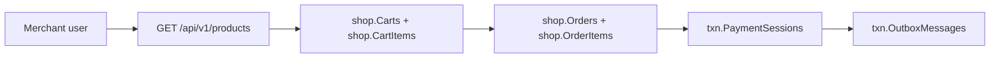
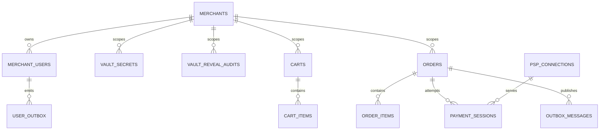

# Merchant–Commerce–Payment ERD Reference

> As-built 2026-08-07. เอกสารนี้อ้างอิง persisted model และ migration ปัจจุบัน ไม่ใช่ target design.

## Current flow



Products อ่านจาก upstream แบบ live. ไม่มี `shop.Products` และไม่มี persisted Checkout.

## Conceptual ERD



เส้น `CARTS → ORDERS` เป็น business transition ใน `OrderCreationCoordinator`; ไม่มี Checkout aggregate คั่นกลาง.
ความสัมพันธ์ข้าม context ที่ใช้ authorization หรือ event ไม่ได้หมายความว่ามี physical FK ทุกเส้น.
ความสัมพันธ์ `MERCHANTS → VAULT_SECRETS` และ `MERCHANTS → VAULT_REVEAL_AUDITS` เป็น logical scope ผ่าน
`MerchantId`; ไม่มี physical FK หรือ cascade delete.

## Schema inventory

| Schema | Current tables | Context/owner |
|---|---|---|
| `admin` | `Users`, `Sessions`, `RoleAssignments`, `MerchantAccess`, `AuthAudits`, `UserAudits`, `ProvisioningOperations` | `ControlPlaneDbContext` |
| `iam` | `PermissionGroups`, `Permissions`, `Roles`, `RolePermissions` | `ControlPlaneDbContext` |
| `cfg` | `Divisions`, `Levels`, `Offices`, `Positions` | `ControlPlaneDbContext` |
| `merch` | `Merchants`, `Users`, `Sessions`, `ExternalLogins`, `RoleAssignments`, `AuthAudits`, `RegistrationAttempts`, `RegistrationAudits`, `RegistrationNotices`, `ProvisioningAudits`, `UserOutbox`, `VaultSecrets`, `VaultRevealAudits` | `MerchantUserDbContext` / `MerchantRuntimeDbContext` |
| `shop` | `Carts`, `CartItems`, `Orders`, `OrderItems`, `OrderItemRevealAudits` | `MerchantRuntimeDbContext` |
| `txn` | `PaymentSessions`, `PspConnections`, `IdempotencyRecords`, `OutboxMessages` | `MerchantRuntimeDbContext` |
| `dbo` | `DataProtectionKeys` | migration owner / ASP.NET Core |

`PolDbContext` เป็น migration owner เท่านั้น. Runtime ใช้ `ControlPlaneDbContext`, `MerchantUserDbContext` และ
`MerchantRuntimeDbContext`. ทุก runtime context ใช้ principal `pol_app`; ไม่มี SQL RLS, bypass principal หรือ
`SESSION_CONTEXT`. Merchant isolation ใช้ query filter, actor context และ guarded write.

## Merchant and KYC

`merch.Users` เก็บ `KycPhotoObjectKey` เท่านั้น. ไม่เก็บ binary, filesystem path หรือ KYC payload ใน row.
Profile photo ใช้ field แยกจาก KYC.

Registration รับ optional multipart `kycPhoto`:

- ขนาดไม่เกิน 2 MiB
- ตรวจ allowlisted media type และ magic bytes
- staging key deterministic ตาม `KycOperationId`
- `PutStagedAsync` คืน `(Key, CreatedNew)`
- retry operation เดิมกับ bytes เดิมใช้ object เดิม; bytes ต่างกันถูก reject
- staging ทำก่อน DB execution-strategy transaction
- DB/outbox เก็บ key และ lifecycle commit/replace/delete แบบ idempotent
- เมื่อ attempt ล้มเหลว discard staging เฉพาะกรณี call นี้สร้าง object ใหม่ (`CreatedNew=true`)
- omission ตอน resubmit คง key เดิม

`LocalPhotoStore` ลบ orphan staging ที่อายุเกิน 24 ชั่วโมง. `PhotoStagingPruneService` เริ่ม sweep หลัง 5 นาที
และทำซ้ำทุก 1 ชั่วโมง; sweep error ถูก log แล้ว service ทำงานต่อ.

Production single-host ใช้ named volume:

```text
merchant-user-photos:/app/merchant-user-photos
```

Horizontal/multi-host deployment ยังต้องมี shared object-store adapter; local volume ไม่ใช่ shared storage.

API/history/log ไม่คืน object key, path, credential หรือ PII ที่ไม่จำเป็น.

## Commerce fields

### `shop.Carts`

| Field | ความหมาย |
|---|---|
| `MerchantId`, `SaleCode` | actor/server binding |
| `Status` | `Open` หรือ `CheckedOut` |
| `CreatedAt` | เวลาสร้าง |
| `Version` | application-managed concurrency token |

### `shop.CartItems`

| Field | Type/กฎ |
|---|---|
| `Id` | client-minted `Guid` mutation handle |
| `CartId`, `MerchantId` | aggregate/merchant boundary |
| `ProductCode` | upstream document identifier, `nvarchar(150)` |
| `SaleCode` | upstream/server value, `varchar(20)` |
| `VariantCode` | upstream product-group value, `varchar(64)` |
| `VariantName` | server display snapshot, nullable |
| `Quantity` | positive integer |
| `UnitPriceAmount`, `UnitPriceCurrency` | server-owned `Money` |
| `Metadata` | typed native `json` snapshot |

### `shop.Orders` and `shop.OrderItems`

Order stores merchant, order number, sale code, amount, payment attempt/status, customer contact and summary-link
fields. `OrderItems` stores `ProductCode`, `VariantCode`, `VariantName`, quantity, unit price, discount and typed
metadata. It does not store upstream document payload as arbitrary columns.

Order status values:

| Value | Wire name |
|---:|---|
| 0 | `Pending` |
| 1 | `Paid` |
| 2 | `Failed` |
| 3 | `Expired` |
| 4 | `Refunded` |
| 5 | `Cancelled` |

## Payment

`txn.PaymentSessions` belongs to `OrderId + MerchantId` and stores payment method, PSP connection, amount/currency,
status, correlation and concurrency fields. Open-session uniqueness prevents more than one payable attempt per Order.

Payment lifecycle publishes versioned `PaymentPaid`, `PaymentFailed` and `PaymentExpired`. Order state changes are
serialized with order-row locking; stale event correlation is ignored. Webhook verification is idempotent and uses
fetch-to-confirm before accepting PSP state.

## Native JSON allowlist

Exactly five current columns use SQL Server native `json`:

| Column | Purpose |
|---|---|
| `admin.ProvisioningOperations.Result` | closed provisioning result |
| `merch.Merchants.Metadata` | typed merchant extension |
| `shop.CartItems.Metadata` | typed Cart item snapshot |
| `shop.OrderItems.Metadata` | immutable Order item snapshot |
| `merch.UserOutbox.Payload` | closed registration/KYC lifecycle event |

`txn.OutboxMessages.Payload` เป็น `nvarchar(max)` ตาม migration ไม่ใช่ native `json`.

Native JSON ห้ามเก็บ credential, password, token, object key หรือ unnecessary customer PII.

## Current API boundary

Current root คือ `/api/v1`. Audience ถูกกำหนดด้วย authorization policy ไม่ใช่ audience-first path.

| Area | Current routes |
|---|---|
| Products | `GET /api/v1/products` |
| Cart | `/api/v1/carts...` |
| Order | `/api/v1/orders...` |
| Payment | `/api/v1/payments/sessions...` |
| Merchant user | `/api/v1/merchants/auth...`, `/api/v1/merchants/users...` |
| Admin | `/api/v1/admins...` |

ไม่มี current route สำหรับ `/api/admin/v1`, `/api/producer/v1` หรือ `/api/v1/checkouts*`.

## Migration and raw objects

Migration chain ปัจจุบันมีสี่ตัว:

1. `20260807042818_InitialSchema`
2. `20260807042828_SecurityObjects`
3. `20260807042833_SeedData`
4. `20260808161508_OneBasedPersistedEnumStorage`

Raw objects สำคัญ:

- `shop.OrderNoSeq`
- `merch.RegistrationNotices` ซึ่ง exclude จาก EF migrations model
- security grants ใน `SecurityObjects`

Production rollback ใช้ verified backup/restore ตาม runbook; ไม่ใช้ `Down` เป็น production rollback.

## Retired surfaces

ไม่มี current project/table/contract/grant สำหรับ:

- `CheckoutSession`, `CheckoutSessionItems`, `CheckoutConfirmed` และ `/api/v1/checkouts*`
- `shop.Products` และ legacy product catalogue persistence
- policy entity, policy audit/report และ policy route
- SQL RLS/security policy/bypass principal

## Source of truth

- `src/BuildingBlocks/BuildingBlocks.Infrastructure/Persistence/Migrations/20260807042818_InitialSchema.cs`
- `src/BuildingBlocks/BuildingBlocks.Infrastructure/Persistence/Migrations/20260807042828_SecurityObjects.cs`
- `src/BuildingBlocks/BuildingBlocks.Infrastructure/Persistence/Migrations/20260807042833_SeedData.cs`
- `src/BuildingBlocks/BuildingBlocks.Infrastructure/Persistence/Migrations/20260808161508_OneBasedPersistedEnumStorage.cs`
- `src/BuildingBlocks/BuildingBlocks.Infrastructure/Persistence/Migrations/PolDbContextModelSnapshot.cs`
- `docs/reference/entity-fields.md`
- `src/Hosts/Api/Program.cs`
