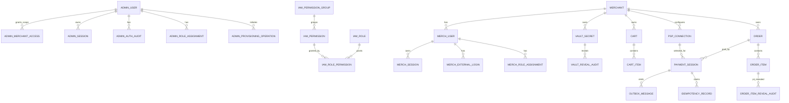

# ERD เชิงแนวคิด + Field Reference — Revised เพิ่มเติม KYC 2026-08-06

> เวอร์ชันนี้แก้ไขจาก `merchant-commerce-payment-erd-analyzed-updated.md` ตามรายการเปลี่ยน field/type/entity ที่ผู้ใช้ให้มาโดยตรง  
> หมายเหตุ: บางจุดเป็น **target ERD / migration target** และอาจยังไม่ตรงกับ persisted EF model ปัจจุบันใน `entity-fields.md` จนกว่าจะสร้าง migration จริง

## 1. สรุปการเปลี่ยนแปลงหลัก

| กลุ่ม | สิ่งที่เปลี่ยน |
|---|---|
| Admin | เพิ่ม `UpdatedAt`, เปลี่ยน field ที่อ้าง `admin.Users.Id` เป็น `AdminUserId`, เปลี่ยน IP field เป็น `IpAddress` |
| IAM | `LabelTh` → `Name`, เพิ่ม `Status` ใน `PermissionGroups` และ `Permissions` |
| CFG | `IsActive` → `Status int` ใน Divisions/Levels/Offices/Positions |
| Merch | เปลี่ยน `DisplayName` → `Name`, ลบ `LegalEntityId`, เพิ่ม `Note`, native JSON, เพิ่ม `KycPhotoObjectKey` ใน `merch.Users` |
| Shop | ลบ Checkout tables, ลบ policy tables, เปลี่ยน Product fields เป็น `ProductCode`/`VariantCode`/`VariantName` + `Metadata json` |
| JSON | `admin.ProvisioningOperations.Result`, `merch.UserOutbox.Payload`, `merch.Merchants.Metadata`, `CartItems.Metadata`, `OrderItems.Metadata` เป็น native `json` |

> แก้ไขเพิ่มเติมรอบ KYC: ลบ `KycStatus`, `KycSelfiePhotoObjectKey`, `KycSubmittedAt`, `KycReviewedAt`, `KycReviewedByAdminUserId`, `KycRejectReason` และเปลี่ยน `KycDocumentPhotoObjectKey` เป็น `KycPhotoObjectKey`.

## 2. ERD ภาพรวมหลังแก้ไข



## 3. ตารางที่ลบออกจาก ERD รอบนี้

| ตาราง | สถานะใหม่ | เหตุผล/ผลกระทบ |
|---|---|---|
| `shop.CheckoutSessions` | ลบออก | Order flow ใหม่ไม่ใช้ persisted checkout session |
| `shop.CheckoutSessionItems` | ลบออก | snapshot รายการย้ายไปที่ `shop.OrderItems.Metadata` หรือ order creation flow |
| `shop.OrderItemPolicies` | ลบออก | ไม่เก็บ policy-reference table แยกใน ERD รอบนี้ |
| `shop.OrderItemPolicyAudits` | ลบออก | audit การแก้ policy-reference ถูกลบตาม policy table |
| Insurance-specific columns บน `shop.OrderItems` | ลบออก | `DocumentType`, `PolicyNumber`, `StartDate`, `EndDate`, `Insured*` ย้ายไป `Metadata json` หากยังจำเป็น |

## 4. Field Reference หลังแก้ไข


### Schema `admin`

### `admin.Users` — บัญชีผู้ดูแลระบบแพลตฟอร์ม

| Field | Type | Null | Key | คำแปลไทย | ตัวอย่าง | หมายเหตุ |
|---|---:|:---:|---|---|---|---|
| `Id` | `uniqueidentifier` | N | PK | รหัสผู้ดูแลระบบ | `e2000000-…-0001` | Primary key ของ `admin.Users` |
| `Subject` | `nvarchar(256)` | Y | UQ* | รหัสตัวตนจาก IdP | `demo-adm-1` | OIDC `sub`; nullable สำหรับบัญชี invite ที่ยังไม่ bind |
| `Email` | `nvarchar(256)` | N | UQ | อีเมล | `superadmin1@demo.pol.local` | ปรับจาก `nvarchar(320)` เป็น `nvarchar(256)` ตามข้อกำหนดใหม่ |
| `Tier` | `int` | N |  | ระดับสิทธิ์ Admin | `1` (Super) | Scoped=0, Super=1 |
| `Status` | `int` | N |  | สถานะ | `0` (Active) | Active=0, Suspended=1 |
| `AuthorizationVersion` | `bigint` | N |  | เวอร์ชันสิทธิ์ | `0` | ใช้เป็น authorization lease/concurrency |
| `PositionId` | `uniqueidentifier` | Y | FK, IX | รหัสตำแหน่ง | `a1000000-…-0001` | อ้างถึง `cfg.Positions.Id` |
| `OfficeId` | `uniqueidentifier` | Y | FK, IX | รหัสสำนักงาน | `b2000000-…-0001` | อ้างถึง `cfg.Offices.Id` |
| `LevelId` | `uniqueidentifier` | Y | FK, IX | รหัสระดับ | `c3000000-…-0001` | อ้างถึง `cfg.Levels.Id` |
| `DivisionId` | `uniqueidentifier` | Y | FK, IX | รหัสฝ่าย/ภาค | `d4000000-…-0001` | อ้างถึง `cfg.Divisions.Id` |
| `CreatedAt` | `datetime2` | N |  | วันที่สร้าง | `2026-08-06T16:00:00Z` | เวลาที่สร้างบัญชี |
| `UpdatedAt` | `datetime2` | Y |  | วันที่แก้ไขล่าสุด | `2026-08-06T16:30:00Z` | เพิ่มใหม่ตามข้อกำหนด; nullable ได้สำหรับแถวเก่าก่อน migration หรือกำหนด default ตาม migration |

### `admin.MerchantAccess` — สิทธิ์เข้าถึง Merchant ของ Admin แบบ Scoped

| Field | Type | Null | Key | คำแปลไทย | ตัวอย่าง | หมายเหตุ |
|---|---:|:---:|---|---|---|---|
| `Id` | `uniqueidentifier` | N | PK | รหัสรายการสิทธิ์ | `e3000000-…-0001` | Primary key |
| `AdminUserId` | `uniqueidentifier` | N | UQ | รหัสผู้ดูแลระบบ | `e2000000-…-0003` | เปลี่ยนจาก `PlatformUserId`; สื่อชัดว่าอ้างถึง `admin.Users.Id` |
| `MerchantId` | `uniqueidentifier` | N | UQ | รหัสบริษัท/นิติบุคคล | `e1000000-…-0001` | merchant ที่ Scoped admin เข้าถึงได้ |
| `AssignedByAdminId` | `uniqueidentifier` | N |  | รหัส Admin ผู้มอบหมาย | `e2000000-…-0001` | ผู้สั่ง assign |
| `AssignedAt` | `datetime2` | N |  | วันที่มอบหมาย | `2026-08-06T16:00:00Z` | เวลาที่เขียน |

### `admin.Sessions` — เซสชันฝั่ง Admin

| Field | Type | Null | Key | คำแปลไทย | ตัวอย่าง | หมายเหตุ |
|---|---:|:---:|---|---|---|---|
| `Id` | `uniqueidentifier` | N | PK | รหัส session | `7c1f4d2e-…-9a30` | Primary key |
| `FamilyId` | `uniqueidentifier` | N | IX | รหัสตระกูล session | `2b9e0a71-…-4f08` | ใช้ rotation/reuse detection |
| `TokenHash` | `varbinary(32)` | N | UQ | Hash ของ cookie token | `0x9f86d0…` | เก็บ hash ไม่เก็บ token จริง |
| `AdminUserId` | `uniqueidentifier` | N | IX | รหัสผู้ดูแลระบบ | `e2000000-…-0001` | เปลี่ยนจาก `PlatformUserId`; อ้างถึง `admin.Users.Id` |
| `Status` | `int` | N |  | สถานะ session | `0` (Active) | Active=0, Superseded=1, Revoked=2 |
| `IssuedAt` | `datetime2` | N |  | วันที่ออก session | `2026-08-06T16:00:00Z` | เวลาที่ออก session |
| `IdleExpiresAt` | `datetime2` | N |  | หมดอายุเมื่อไม่ได้ใช้งาน | `2026-08-06T16:30:00Z` | idle sliding window |
| `AbsoluteExpiresAt` | `datetime2` | N | IX | หมดอายุสูงสุด | `2026-08-07T00:00:00Z` | hard cap |
| `SupersededAt` | `datetime2` | Y |  | วันที่ถูกแทนที่ | `NULL` | มีค่าเมื่อ rotate แล้ว |
| `SupersededBySessionId` | `uniqueidentifier` | Y |  | session ตัวถัดไป | `NULL` | successor session |
| `IpAddress` | `nvarchar(45)` | Y |  | ที่อยู่ IP | `203.0.113.24` | เปลี่ยนจาก `CreatedIp`; รองรับ IPv4/IPv6 |
| `UserAgent` | `nvarchar(256)` | Y |  | ข้อมูลอุปกรณ์/เบราว์เซอร์ | `Mozilla/5.0 ...` | ตัดความยาวตาม policy |

### `admin.AuthAudits` — ประวัติ Login/Logout ฝั่ง Admin

| Field | Type | Null | Key | คำแปลไทย | ตัวอย่าง | หมายเหตุ |
|---|---:|:---:|---|---|---|---|
| `Id` | `uniqueidentifier` | N | PK | รหัส audit | `f4a10c88-…-2b61` | Primary key |
| `EventType` | `nvarchar(32)` | N |  | ประเภทเหตุการณ์ | `login-success` | login/logout/rotated/auth-denied ฯลฯ |
| `AdminUserId` | `uniqueidentifier` | Y | IX | รหัสผู้ดูแลระบบ | `e2000000-…-0001` | เปลี่ยนจาก `PlatformUserId`; nullable เมื่อยัง resolve user ไม่ได้ |
| `Subject` | `nvarchar(256)` | Y |  | รหัสตัวตนจาก IdP | `demo-adm-1` | OIDC subject |
| `Reason` | `nvarchar(128)` | Y |  | เหตุผล | `not-allowlisted` | label สั้น ไม่เก็บข้อมูลลับ |
| `CorrelationId` | `nvarchar(128)` | N |  | รหัสโยงเหตุการณ์ | `9f2c1ab34d5e...` | เชื่อม request เดียวกัน |
| `OccurredAt` | `datetime2` | N |  | วันที่เกิดเหตุการณ์ | `2026-08-06T16:00:00Z` | เวลาที่เกิด event |

### `admin.UserAudits` — ประวัติการกระทำของ Admin

| Field | Type | Null | Key | คำแปลไทย | ตัวอย่าง | หมายเหตุ |
|---|---:|:---:|---|---|---|---|
| `Id` | `uniqueidentifier` | N | PK | รหัส audit | `3ce77a05-…-8d42` | Primary key |
| `Action` | `nvarchar(64)` | N |  | การกระทำ | `assign-merchant` | ชื่อ action |
| `ActorId` | `uniqueidentifier` | N |  | รหัสผู้กระทำ | `e2000000-…-0001` | Admin ที่ทำ action |
| `ActorType` | `nvarchar(16)` | N |  | ประเภทผู้กระทำ | `admin` | ค่าเริ่มต้นคือ admin |
| `TargetAdminId` | `uniqueidentifier` | Y |  | Admin เป้าหมาย | `e2000000-…-0003` | nullable |
| `TargetRoleId` | `uniqueidentifier` | Y |  | Role เป้าหมาย | `11111111-1111-1111-1111-111111111111` | nullable |
| `MerchantId` | `uniqueidentifier` | Y |  | Merchant ที่เกี่ยวข้อง | `e1000000-…-0001` | nullable |
| `CorrelationId` | `nvarchar(128)` | N |  | รหัสโยงเหตุการณ์ | `9f2c1ab34d5e...` | เชื่อม request เดียวกัน |
| `OccurredAt` | `datetime2` | N |  | วันที่เกิดเหตุการณ์ | `2026-08-06T16:00:00Z` | เวลาที่เกิด action |

### `admin.RoleAssignments` — การมอบ Role ให้ Admin

| Field | Type | Null | Key | คำแปลไทย | ตัวอย่าง | หมายเหตุ |
|---|---:|:---:|---|---|---|---|
| `Id` | `uniqueidentifier` | N | PK | รหัส assignment | `e4000000-…-0001` | Primary key |
| `AdminUserId` | `uniqueidentifier` | N | UQ | รหัสผู้ดูแลระบบ | `e2000000-…-0001` | เปลี่ยนจาก `PlatformUserId`; อ้างถึง `admin.Users.Id` |
| `RoleId` | `uniqueidentifier` | N | FK, IX, UQ | รหัส role | `11111111-1111-1111-1111-111111111111` | อ้างถึง `iam.Roles.Id` |
| `AssignedById` | `uniqueidentifier` | N |  | รหัสผู้มอบหมาย | `e2000000-…-0001` | Admin ผู้ assign |
| `AssignedAt` | `datetime2` | N |  | วันที่มอบหมาย | `2026-08-06T16:00:00Z` | เวลาที่เขียน |

### `admin.ProvisioningOperations` — Ledger กันสร้าง Merchant ซ้ำ

| Field | Type | Null | Key | คำแปลไทย | ตัวอย่าง | หมายเหตุ |
|---|---:|:---:|---|---|---|---|
| `Id` | `uniqueidentifier` | N | PK | รหัส operation | `c05be1d4-…-77a9` | Primary key |
| `OperationKey` | `nvarchar(200)` | N | UQ | key ของ operation | `provision-merchant:vprivilege` | กำหนดขนาด `nvarchar(200)` ให้พอสำหรับ operation prefix + business key โดยไม่ใช้ `max` |
| `CallerAdminId` | `uniqueidentifier` | N |  | รหัส Admin ผู้เรียก | `e2000000-…-0001` | ต้องเป็น Active Super |
| `ExpectedAuthorizationVersion` | `bigint` | N |  | เวอร์ชันสิทธิ์ที่คาดหวัง | `0` | pin ตอนเริ่ม request |
| `RequestHash` | `nvarchar(64)` | N |  | hash ของ request | `A3F1…` | SHA-256 hex |
| `MerchantId` | `uniqueidentifier` | N |  | รหัส Merchant ที่สร้าง | `e1000000-…-0001` | pre-minted merchant id |
| `Result` | `json` | Y |  | ผลลัพธ์ JSON | `{"merchantId":"e100..."}` | เปลี่ยนจาก `nvarchar(max)` เป็น native JSON |
| `CreatedAt` | `datetime2` | N |  | วันที่สร้าง operation | `2026-08-06T16:00:00Z` | เวลาที่เริ่ม operation |


### Schema `iam`

### `iam.PermissionGroups` — หมวดสิทธิ์

| Field | Type | Null | Key | คำแปลไทย | ตัวอย่าง | หมายเหตุ |
|---|---:|:---:|---|---|---|---|
| `Key` | `nvarchar(32)` | N | PK | รหัสหมวดสิทธิ์ | `merchants.users` | string key คงที่ |
| `Name` | `nvarchar(128)` | N |  | ชื่อหมวดสิทธิ์ | `ผู้ใช้งานร้านค้า` | เปลี่ยนจาก `LabelTh` เป็น `Name` |
| `Scope` | `int` | N |  | ขอบเขตสิทธิ์ | `1` (Merchant) | Platform=0, Merchant=1 |
| `Status` | `int` | N |  | สถานะ | `0` (Active) | เพิ่มใหม่: Active=0, Inactive=1 |
| `SortOrder` | `int` | N |  | ลำดับแสดงผล | `5` | ใช้จัดเรียง UI |

### `iam.Permissions` — รายการสิทธิ์

| Field | Type | Null | Key | คำแปลไทย | ตัวอย่าง | หมายเหตุ |
|---|---:|:---:|---|---|---|---|
| `Key` | `nvarchar(64)` | N | PK | รหัสสิทธิ์ | `merchants.policies.write` | permission key |
| `GroupKey` | `nvarchar(32)` | N | FK, IX | รหัสหมวดสิทธิ์ | `merchants.policies` | อ้างถึง `iam.PermissionGroups.Key` |
| `Name` | `nvarchar(160)` | N |  | ชื่อสิทธิ์ | `แก้ไขข้อมูลกรมธรรม์ร้านค้า` | เปลี่ยนจาก `LabelTh` เป็น `Name` |
| `Status` | `int` | N |  | สถานะ | `0` (Active) | เพิ่มใหม่: Active=0, Inactive=1 |
| `SortOrder` | `int` | N |  | ลำดับแสดงผล | `22` | ใช้จัดเรียง UI |

### `iam.Roles` — บทบาท/Role

| Field | Type | Null | Key | คำแปลไทย | ตัวอย่าง | หมายเหตุ |
|---|---:|:---:|---|---|---|---|
| `Id` | `uniqueidentifier` | N | PK | รหัส role | `11111111-1111-1111-1111-111111111111` | Primary key |
| `Code` | `nvarchar(64)` | N | UQ | รหัส role | `platform_admin` | slug คงที่ |
| `Name` | `nvarchar(128)` | N |  | ชื่อ role | `ผู้ดูแลแพลตฟอร์ม` | ชื่อแสดงผล |
| `Description` | `nvarchar(256)` | Y |  | คำอธิบาย | `เข้าถึงได้ทุกส่วนของแพลตฟอร์ม` | nullable |
| `Color` | `nvarchar(16)` | Y |  | สี badge | `red` | nullable |
| `Status` | `int` | N |  | สถานะ | `0` (Active) | Active=0, Inactive=1 |
| `Scope` | `int` | N |  | ขอบเขต role | `0` (Platform) | Platform=0, Merchant=1 |
| `MerchantId` | `uniqueidentifier` | Y | UQ, CK | รหัส Merchant | `NULL` | null = shared/platform role |

### `iam.RolePermissions` — สิทธิ์ที่ผูกกับ Role

| Field | Type | Null | Key | คำแปลไทย | ตัวอย่าง | หมายเหตุ |
|---|---:|:---:|---|---|---|---|
| `Id` | `uniqueidentifier` | N | PK | รหัส role-permission | `6f0d…` | surrogate key |
| `RoleId` | `uniqueidentifier` | N | FK, UQ | รหัส role | `11111111-1111-1111-1111-111111111111` | อ้างถึง `iam.Roles.Id` |
| `PermissionKey` | `nvarchar(64)` | N | FK, IX, UQ | รหัสสิทธิ์ | `merchants.policies.read` | อ้างถึง `iam.Permissions.Key` |


### Schema `cfg`

### `cfg.Divisions` — ฝ่าย/ภาค

| Field | Type | Null | Key | คำแปลไทย | ตัวอย่าง | หมายเหตุ |
|---|---:|:---:|---|---|---|---|
| `Id` | `uniqueidentifier` | N | PK | รหัสรายการ | `a1000000-…-0007` | id คงที่/primary key |
| `Code` | `nvarchar(64)` | N | UQ | รหัสอ้างอิง | `manager` | slug lowercase snake_case |
| `Name` | `nvarchar(200)` | N |  | ชื่อ | `ผู้จัดการ` | ชื่อที่แสดงผล |
| `Status` | `int` | N |  | สถานะ | `0` (Active) | เปลี่ยนจาก `IsActive bit`; Active=0, Inactive=1 |

### `cfg.Levels` — ระดับ

| Field | Type | Null | Key | คำแปลไทย | ตัวอย่าง | หมายเหตุ |
|---|---:|:---:|---|---|---|---|
| `Id` | `uniqueidentifier` | N | PK | รหัสรายการ | `a1000000-…-0007` | id คงที่/primary key |
| `Code` | `nvarchar(64)` | N | UQ | รหัสอ้างอิง | `manager` | slug lowercase snake_case |
| `Name` | `nvarchar(200)` | N |  | ชื่อ | `ผู้จัดการ` | ชื่อที่แสดงผล |
| `Status` | `int` | N |  | สถานะ | `0` (Active) | เปลี่ยนจาก `IsActive bit`; Active=0, Inactive=1 |

### `cfg.Offices` — สำนักงาน/สถานที่ปฏิบัติงาน

| Field | Type | Null | Key | คำแปลไทย | ตัวอย่าง | หมายเหตุ |
|---|---:|:---:|---|---|---|---|
| `Id` | `uniqueidentifier` | N | PK | รหัสรายการ | `a1000000-…-0007` | id คงที่/primary key |
| `Code` | `nvarchar(64)` | N | UQ | รหัสอ้างอิง | `manager` | slug lowercase snake_case |
| `Name` | `nvarchar(200)` | N |  | ชื่อ | `ผู้จัดการ` | ชื่อที่แสดงผล |
| `Status` | `int` | N |  | สถานะ | `0` (Active) | เปลี่ยนจาก `IsActive bit`; Active=0, Inactive=1 |

### `cfg.Positions` — ตำแหน่งงาน

| Field | Type | Null | Key | คำแปลไทย | ตัวอย่าง | หมายเหตุ |
|---|---:|:---:|---|---|---|---|
| `Id` | `uniqueidentifier` | N | PK | รหัสรายการ | `a1000000-…-0007` | id คงที่/primary key |
| `Code` | `nvarchar(64)` | N | UQ | รหัสอ้างอิง | `manager` | slug lowercase snake_case |
| `Name` | `nvarchar(200)` | N |  | ชื่อ | `ผู้จัดการ` | ชื่อที่แสดงผล |
| `Status` | `int` | N |  | สถานะ | `0` (Active) | เปลี่ยนจาก `IsActive bit`; Active=0, Inactive=1 |


### Schema `dbo`

### `dbo.DataProtectionKeys` — กุญแจ Data Protection ของ ASP.NET Core

| Field | Type | Null | Key | คำแปลไทย | ตัวอย่าง | หมายเหตุ |
|---|---:|:---:|---|---|---|---|
| `Id` | `int identity` | N | PK | รหัส key | `1` | identity ของ SQL Server |
| `SecretKey` | `nvarchar(256)` | Y |  | ชื่อ/รหัส secret key | `key-3a1f9c2e-...` | เปลี่ยนจาก `FriendlyName` เป็น `SecretKey` |
| `Xml` | `nvarchar(max)` | N |  | XML key ring | `<key id="...">...</key>` | ค่า key-ring ที่ framework จัดการ |


### Schema `merch`

### `merch.Users` — ผู้ใช้งานฝั่ง Merchant + KYC

KYC ในรอบนี้เก็บบน `merch.Users` โดยตรงเฉพาะ key รูปภาพ KYC ที่ผู้ใช้อัปโหลด (`KycPhotoObjectKey`) ส่วนสถานะ/กระบวนการ review KYC ยังไม่อยู่ใน ERD รอบนี้

| Field | Type | Null | Key | คำแปลไทย | ตัวอย่าง | หมายเหตุ |
|---|---:|:---:|---|---|---|---|
| `Id` | `uniqueidentifier` | N | PK | รหัสผู้ใช้งานฝั่ง Merchant | `e5000000-…-0001` | Primary key ของ `merch.Users` |
| `Subject` | `nvarchar(256)` | N | UQ | รหัสตัวตนจาก IdP | `demo-mch-1` | OIDC subject |
| `Email` | `nvarchar(256)` | N |  | อีเมล | `somchai.p@demo.pol.local` | ปรับจาก `nvarchar(320)` เป็น `nvarchar(256)` |
| `Status` | `int` | N |  | สถานะบัญชี | `1` (Active) | PendingApproval=0, Active=1, Rejected=2, Suspended=3 |
| `MerchantId` | `uniqueidentifier` | Y |  | รหัสบริษัท | `e1000000-…-0001` | nullable ก่อน approve |
| `DisplayName` | `nvarchar(200)` | N |  | ชื่อที่แสดงผล | `สมชาย พริวิเลจ` | คำนวณจากชื่อ/นามสกุล |
| `FirstName` | `nvarchar(200)` | N |  | ชื่อจริง | `สมชาย` | required |
| `LastName` | `nvarchar(200)` | N |  | นามสกุล | `พริวิเลจ` | required |
| `IdentityType` | `int` | Y |  | ประเภทตัวตน | `0` (Individual) | เปลี่ยนจาก `PersonType`; Individual=0, Juristic=1 |
| `IdentityNumber` | `nvarchar(64)` | Y |  | เลขประจำตัว/เลขนิติบุคคล | `1100200300401` | เปลี่ยนจาก `IdNumber` |
| `SaleCode` | `varchar(20)` | Y |  | รหัสผู้ขาย | `77001` | ใช้ผูกกับระบบต้นทาง |
| `LicenseNumber` | `nvarchar(64)` | Y |  | เลขใบอนุญาต | `LIC-2024-00101` | nullable |
| `Phone` | `nvarchar(32)` | Y |  | เบอร์โทรศัพท์ | `0812345001` | เก็บตามที่กรอก |
| `PhotoObjectKey` | `nvarchar(256)` | Y |  | key รูปโปรไฟล์ | `users/usr_001/photo.jpg` | รูปโปรไฟล์/รูปถ่ายผู้ใช้งาน |
| `PhotoContentType` | `nvarchar(128)` | Y |  | content type ของรูป | `image/jpeg` | ผ่าน validation แล้ว |
| `KycPhotoObjectKey` | `nvarchar(256)` | Y |  | key รูปภาพ KYC | `kyc/usr_001/id-card.jpg` | เปลี่ยนจาก `KycDocumentPhotoObjectKey`; เก็บ key รูปภาพ KYC ที่ upload เท่านั้น |
| `CreatedAt` | `datetime2` | N |  | วันที่สร้าง | `2026-08-06T16:00:00Z` | เวลาที่สมัคร |

### `merch.Sessions` — เซสชันฝั่ง Merchant

| Field | Type | Null | Key | คำแปลไทย | ตัวอย่าง | หมายเหตุ |
|---|---:|:---:|---|---|---|---|
| `Id` | `uniqueidentifier` | N | PK | รหัส session | `5e82ba14-…-0cd7` | Primary key |
| `FamilyId` | `uniqueidentifier` | N | IX | รหัสตระกูล session | `a71c93f0-…-6b25` | rotation family |
| `TokenHash` | `varbinary(32)` | N | UQ | Hash ของ cookie token | `0x5f2e7b…` | เก็บ hash ไม่เก็บ token จริง |
| `UserId` | `uniqueidentifier` | N | IX | รหัสผู้ใช้งานฝั่ง Merchant | `e5000000-…-0001` | เปลี่ยนจาก `MerchantUserId`; อ้างถึง `merch.Users.Id` |
| `Status` | `int` | N |  | สถานะ session | `0` (Active) | Active=0, Superseded=1, Revoked=2 |
| `IssuedAt` | `datetime2` | N |  | วันที่ออก session | `2026-08-06T16:00:00Z` | เวลาที่ออก session |
| `IdleExpiresAt` | `datetime2` | N |  | หมดอายุเมื่อไม่ได้ใช้งาน | `2026-08-06T16:30:00Z` | idle sliding window |
| `AbsoluteExpiresAt` | `datetime2` | N | IX | หมดอายุสูงสุด | `2026-08-07T00:00:00Z` | hard cap |
| `SupersededAt` | `datetime2` | Y |  | วันที่ถูกแทนที่ | `NULL` | มีค่าเมื่อ rotate แล้ว |
| `SupersededBySessionId` | `uniqueidentifier` | Y |  | session ตัวถัดไป | `NULL` | successor session |
| `IpAddress` | `nvarchar(45)` | Y |  | ที่อยู่ IP | `203.0.113.24` | เปลี่ยนจาก `CreatedIp`; รองรับ IPv4/IPv6 |
| `UserAgent` | `nvarchar(256)` | Y |  | ข้อมูลอุปกรณ์/เบราว์เซอร์ | `Mozilla/5.0 ...` | ตัดความยาวตาม policy |

### `merch.AuthAudits` — ประวัติ Login/Logout ฝั่ง Merchant

| Field | Type | Null | Key | คำแปลไทย | ตัวอย่าง | หมายเหตุ |
|---|---:|:---:|---|---|---|---|
| `Id` | `uniqueidentifier` | N | PK | รหัส audit | `b207e5cc-…-41af` | Primary key |
| `EventType` | `nvarchar(32)` | N |  | ประเภทเหตุการณ์ | `auth-denied` | login/logout/rotated ฯลฯ |
| `UserId` | `uniqueidentifier` | Y | IX | รหัสผู้ใช้งานฝั่ง Merchant | `e5000000-…-0001` | เปลี่ยนจาก `MerchantUserId`; nullable เมื่อยัง resolve user ไม่ได้ |
| `Subject` | `nvarchar(256)` | Y |  | รหัสตัวตนจาก IdP | `demo-mch-1` | OIDC subject |
| `Reason` | `nvarchar(128)` | Y |  | เหตุผล | `pending-approval` | label สั้น ไม่ sensitive |
| `CorrelationId` | `nvarchar(128)` | N |  | รหัสโยงเหตุการณ์ | `9f2c1ab34d5e...` | เชื่อม request เดียวกัน |
| `OccurredAt` | `datetime2` | N |  | วันที่เกิดเหตุการณ์ | `2026-08-06T16:00:00Z` | เวลาที่เกิด event |

### `merch.ExternalLogins` — บัญชี Login ภายนอกที่ผูกกับ Merchant user

| Field | Type | Null | Key | คำแปลไทย | ตัวอย่าง | หมายเหตุ |
|---|---:|:---:|---|---|---|---|
| `Id` | `uniqueidentifier` | N | PK | รหัส external login | `e6000000-…-0001` | Primary key |
| `Provider` | `nvarchar(32)` | N | UQ | ผู้ให้บริการ IdP | `google` | google/microsoft |
| `Subject` | `nvarchar(256)` | N | UQ | รหัสตัวตนจาก IdP | `demo-mch-1` | unique กับ Provider |
| `UserId` | `uniqueidentifier` | N |  | รหัสผู้ใช้งานฝั่ง Merchant | `e5000000-…-0001` | เปลี่ยนจาก `MerchantUserId`; อ้างถึง `merch.Users.Id` |

### `merch.RegistrationAudits` — ประวัติการสมัคร/อนุมัติ Merchant user

| Field | Type | Null | Key | คำแปลไทย | ตัวอย่าง | หมายเหตุ |
|---|---:|:---:|---|---|---|---|
| `Id` | `uniqueidentifier` | N | PK | รหัส audit | `8ad4c0f1-…-3e69` | Primary key |
| `Action` | `nvarchar(64)` | N |  | การกระทำ | `approved` | registered/resubmitted/approved/rejected/suspended |
| `ActorSubject` | `nvarchar(256)` | Y |  | subject ผู้กระทำ | `demo-adm-1` | nullable เมื่อ self-service |
| `TargetSubject` | `nvarchar(256)` | N |  | subject เป้าหมาย | `demo-mch-3` | merchant user เป้าหมาย |
| `Role` | `nvarchar(64)` | Y |  | role ที่มอบให้ | `merchant_manager` | nullable |
| `Reason` | `nvarchar(1024)` | Y |  | เหตุผล | `เอกสารใบอนุญาตไม่ชัดเจน` | free text |
| `MerchantId` | `uniqueidentifier` | Y |  | รหัส Merchant | `e1000000-…-0001` | nullable ก่อน approve |
| `CorrelationId` | `nvarchar(128)` | N |  | รหัสโยงเหตุการณ์ | `9f2c1ab34d5e...` | เชื่อม request เดียวกัน |
| `OccurredAt` | `datetime2` | N |  | วันที่เกิดเหตุการณ์ | `2026-08-06T16:00:00Z` | เวลาที่เกิด event |

### `merch.RegistrationNotices` — รายการแจ้งเตือนผู้สมัครรออนุมัติ

| Field | Type | Null | Key | คำแปลไทย | ตัวอย่าง | หมายเหตุ |
|---|---:|:---:|---|---|---|---|
| `Id` | `uniqueidentifier` | N | PK | รหัส notice | `d1e77b90-…-5a04` | Primary key |
| `UserId` | `uniqueidentifier` | N | UQ | รหัสผู้ใช้งานฝั่ง Merchant | `e5000000-…-0003` | เปลี่ยนจาก `MerchantUserId`; one notice per registration |
| `Subject` | `nvarchar(256)` | N |  | รหัสตัวตนจาก IdP | `demo-mch-3` | คัดลอกมาจาก event |
| `Email` | `nvarchar(320)` | N |  | อีเมล | `wanida.k@demo.pol.local` | อีเมลผู้สมัคร ณ เวลาสมัคร |
| `DisplayName` | `nvarchar(200)` | N |  | ชื่อที่แสดงผล | `วนิดา คงพริวิเลจ` | ชื่อผู้สมัคร |
| `HostedDomain` | `nvarchar(256)` | Y |  | domain จาก IdP | `demo.pol.local` | nullable |
| `OccurredAt` | `datetime2` | N |  | วันที่เกิด event | `2026-08-06T16:00:00Z` | event time |
| `CreatedAt` | `datetime2` | N |  | วันที่สร้าง notice | `2026-08-06T16:00:02Z` | notice time |

### `merch.RoleAssignments` — การมอบ Role ให้ Merchant user

| Field | Type | Null | Key | คำแปลไทย | ตัวอย่าง | หมายเหตุ |
|---|---:|:---:|---|---|---|---|
| `Id` | `uniqueidentifier` | N | PK | รหัส assignment | `e7000000-…-0001` | Primary key |
| `UserId` | `uniqueidentifier` | N | UQ, IX | รหัสผู้ใช้งานฝั่ง Merchant | `e5000000-…-0001` | เปลี่ยนจาก `MerchantUserId`; อ้างถึง `merch.Users.Id` |
| `MerchantId` | `uniqueidentifier` | N | IX | รหัส Merchant | `e1000000-…-0001` | scope ของ assignment |
| `RoleId` | `uniqueidentifier` | N | FK, IX, UQ | รหัส role | `aaaaaaaa-aaaa-aaaa-aaaa-aaaaaaaaaaaa` | อ้างถึง `iam.Roles.Id` |
| `AssignedById` | `uniqueidentifier` | N |  | รหัสผู้มอบหมาย | `e5000000-…-0001` | admin หรือ merchant user ตาม flow |
| `AssignedAt` | `datetime2` | N |  | วันที่มอบหมาย | `2026-08-06T16:00:00Z` | เวลาที่เขียน |

### `merch.UserOutbox` — Outbox ฝั่ง Merchant user ก่อนมี Merchant จริง

| Field | Type | Null | Key | คำแปลไทย | ตัวอย่าง | หมายเหตุ |
|---|---:|:---:|---|---|---|---|
| `Id` | `uniqueidentifier` | N | PK | รหัส outbox | `019820c4-…-7f31` | UUIDv7 |
| `MerchantId` | `uniqueidentifier` | N |  | รหัส Merchant หรือ sentinel | `f0f0f0f0-0000-4000-8000-00000000ad17` | sentinel สำหรับ user ที่ยังไม่มี merchant จริง |
| `Type` | `nvarchar(256)` | N |  | ประเภท event | `MerchantUserRegistrationSubmitted` | ชื่อ message |
| `Payload` | `json` | N |  | payload JSON | `{"userId":"e500..."}` | เปลี่ยนจาก `nvarchar(max)` เป็น native JSON |
| `OccurredAt` | `datetime2` | N |  | วันที่เกิด event | `2026-08-06T16:00:00Z` | เวลาที่ enqueue |
| `ProcessedAt` | `datetime2` | Y | IX | วันที่ประมวลผลแล้ว | `NULL` | null = ยังไม่ส่ง |
| `Attempts` | `int` | N |  | จำนวนครั้งที่พยายาม | `0` | retry count |
| `Error` | `nvarchar(2048)` | Y |  | error ล่าสุด | `NULL` | nullable |
| `LeaseExpiresAt` | `datetime2` | Y | IX | วันหมดอายุ lease | `2026-08-06T16:01:00Z` | ใช้ dispatcher claim |
| `LeaseOwner` | `nvarchar(256)` | Y |  | เจ้าของ lease | `pol-api-7d9c4:1` | dispatcher owner |

### `merch.Merchants` — บริษัทในเครือ/ผู้ขายนิติบุคคล

ลบ `LegalEntityId`; เปลี่ยน `DisplayName` เป็น `Name`; เพิ่ม `Note`; เปลี่ยน `Metadata` เป็น native JSON

| Field | Type | Null | Key | คำแปลไทย | ตัวอย่าง | หมายเหตุ |
|---|---:|:---:|---|---|---|---|
| `Id` | `uniqueidentifier` | N | PK | รหัส Merchant | `e1000000-…-0001` | merchant identity |
| `Code` | `nvarchar(64)` | N | UQ | รหัส Merchant | `vprivilege` | normalize lowercase |
| `Name` | `nvarchar(200)` | N |  | ชื่อ Merchant | `บริษัท วีพริวิเลจ จำกัด` | เปลี่ยนจาก `DisplayName` เป็น `Name` |
| `Country` | `nvarchar(2)` | N |  | ประเทศ | `TH` | ISO 3166-1 alpha-2 |
| `Currency` | `nvarchar(3)` | N |  | สกุลเงินหลัก | `THB` | ISO 4217 |
| `EnabledChannels` | `nvarchar(256)` | N |  | ช่องทางชำระเงินที่เปิดใช้ | `card,promptpay,installment` | CSV ของช่องทาง |
| `Metadata` | `json` | N |  | ข้อมูลเสริม JSON | `{"branding":{}}` | เปลี่ยนจาก `nvarchar(max)` เป็น native JSON |
| `Note` | `nvarchar(max)` | Y |  | หมายเหตุ | `ใช้สำหรับธุรกิจของที่ระลึก` | เพิ่มใหม่ |
| `Status` | `int` | N |  | สถานะ | `0` (Active) | ปรับเป็น Active=0, Inactive=1 |
| `CreatedAt` | `datetime2` | N |  | วันที่สร้าง | `2026-08-06T16:00:00Z` | เวลาที่ provision |

### `merch.VaultSecrets` — ที่เก็บ Secret แบบเข้ารหัส

| Field | Type | Null | Key | คำแปลไทย | ตัวอย่าง | หมายเหตุ |
|---|---:|:---:|---|---|---|---|
| `MerchantId` | `uniqueidentifier` | N | PK | รหัส Merchant | `e1000000-…-0001` | PK ส่วนแรก |
| `SecretName` | `nvarchar(128)` | N | PK | ชื่อ secret | `psp/vprivilege/2c2p` | เปลี่ยนจาก `Name` เป็น `SecretName` |
| `EncryptedSecret` | `varbinary(max)` | N |  | secret ที่เข้ารหัส | `0x8c14fa…` | ciphertext |
| `EncryptedDek` | `varbinary(max)` | N |  | DEK ที่เข้ารหัส | `0x3ab902…` | encrypted data encryption key |
| `SecretKey` | `nvarchar(64)` | N |  | รหัส key สำหรับเข้ารหัส | `local-envelope-v1` | เปลี่ยนจาก `KeyId` เป็น `SecretKey` |
| `Hint` | `nvarchar(16)` | N |  | คำใบ้ secret | `3a9f` | last-4/hint ไม่ใช่ secret จริง |
| `CreatedAt` | `datetime2` | N |  | วันที่สร้าง | `2026-08-06T16:00:00Z` | เวลาที่สร้าง |
| `UpdatedAt` | `datetime2` | N |  | วันที่แก้ไขล่าสุด | `2026-08-06T16:00:00Z` | ขยับตอน rotate |

### `merch.VaultRevealAudits` — ประวัติการเปิดอ่าน Secret แบบ hash-chain

| Field | Type | Null | Key | คำแปลไทย | ตัวอย่าง | หมายเหตุ |
|---|---:|:---:|---|---|---|---|
| `Id` | `bigint identity` | N | PK | รหัส audit | `1` | identity |
| `MerchantId` | `uniqueidentifier` | N | IX | รหัส Merchant | `e1000000-…-0001` | chain ต่อ merchant |
| `Seq` | `bigint` | N | UQ | ลำดับต่อ Merchant | `1` | เริ่มที่ 1 |
| `Hash` | `varbinary(32)` | N |  | hash ของแถวนี้ | `0x7d21e9…` | SHA-256 |
| `PrevHash` | `varbinary(32)` | N |  | hash แถวก่อนหน้า | `0x0000…00` | genesis = zero bytes |
| `SecretName` | `nvarchar(128)` | N |  | ชื่อ secret ที่ถูกเปิด | `psp/vprivilege/2c2p` | สอดคล้องกับ `VaultSecrets.SecretName` |
| `RevealedAt` | `datetime2` | N |  | วันที่เปิดอ่าน | `2026-08-06T16:00:00Z` | เวลาที่ reveal |

### `merch.ProvisioningAudits` — ประวัติการสร้าง Merchant

| Field | Type | Null | Key | คำแปลไทย | ตัวอย่าง | หมายเหตุ |
|---|---:|:---:|---|---|---|---|
| `Id` | `uniqueidentifier` | N | PK | รหัส audit | `2f6b8ad3-…-90c1` | Primary key |
| `MerchantId` | `uniqueidentifier` | N |  | รหัส Merchant | `e1000000-…-0001` | merchant ที่ provision |
| `MerchantCode` | `nvarchar(64)` | N |  | รหัส Merchant | `vprivilege` | denormalized code |
| `AdminSubject` | `nvarchar(256)` | N |  | subject ของ Admin | `demo-adm-1` | ผู้ provision |
| `CorrelationId` | `nvarchar(128)` | N |  | รหัสโยงเหตุการณ์ | `9f2c1ab34d5e...` | เชื่อม request เดียวกัน |
| `OccurredAt` | `datetime2` | N |  | วันที่เกิดเหตุการณ์ | `2026-08-06T16:00:00Z` | เวลาที่เกิด event |


### Schema `shop`

### `shop.Carts` — ตะกร้าสินค้า

| Field | Type | Null | Key | คำแปลไทย | ตัวอย่าง | หมายเหตุ |
|---|---:|:---:|---|---|---|---|
| `Id` | `uniqueidentifier` | N | PK | รหัสตะกร้า | `ea000000-…-0001` | Primary key |
| `MerchantId` | `uniqueidentifier` | N | AK | รหัส Merchant | `e1000000-…-0001` | alternate key สำหรับ composite FK |
| `SaleCode` | `varchar(20)` | Y | IX | รหัสผู้ขาย | `77001` | เพิ่มใหม่; ใช้ผูกกับระบบต้นทาง/merchant user |
| `Status` | `nvarchar(16)` | N |  | สถานะตะกร้า | `Open` | Open/CheckedOut |
| `CreatedAt` | `datetime2` | N |  | วันที่สร้าง | `2026-08-06T16:00:00Z` | เวลาที่เปิดตะกร้า |

### `shop.CartItems` — รายการในตะกร้า

Product fields ถูกปรับเป็น generic commerce naming: `ProductCode` + `VariantCode` + `VariantName` และเพิ่ม `Metadata json`

| Field | Type | Null | Key | คำแปลไทย | ตัวอย่าง | หมายเหตุ |
|---|---:|:---:|---|---|---|---|
| `Id` | `uniqueidentifier` | N | PK | รหัสรายการตะกร้า | `eb000000-…-0002` | Primary key |
| `CartId` | `uniqueidentifier` | N | FK, IX | รหัสตะกร้า | `ea000000-…-0001` | composite กับ MerchantId |
| `MerchantId` | `uniqueidentifier` | N | FK, IX | รหัส Merchant | `e1000000-…-0001` | denormalize จาก cart |
| `ProductCode` | `nvarchar(150)` | N | IX | รหัสสินค้า/เลขเอกสาร | `S001-69900/บต/900008` | เปลี่ยนจาก `DocumentNo`; ใช้ได้ทั้งเลขเอกสารประกันและ SKU/product code |
| `SaleCode` | `varchar(20)` | Y |  | รหัสผู้ขาย | `77001` | คงไว้ระดับรายการถ้าต้อง snapshot จากต้นทาง; cart มี `SaleCode` ระดับหัวใบด้วย |
| `VariantCode` | `varchar(64)` | N |  | รหัสตัวเลือก/กลุ่มผลิตภัณฑ์ | `CMI` หรือ `RED` | เปลี่ยนจาก `ProductGroup varchar(10)` เป็น `VariantCode varchar(64)` |
| `VariantName` | `varchar(128)` | Y |  | ชื่อตัวเลือก/กลุ่มสินค้า | `ประกันรถยนต์ภาคบังคับ` หรือ `สีแดง` | เพิ่มใหม่ |
| `Quantity` | `int` | N |  | จำนวน | `2` | จำนวนที่เลือก |
| `UnitPriceAmount` | `decimal(19,4)` | N |  | ราคาต่อหน่วย | `1850.0000` | snapshot จาก server/source of truth |
| `UnitPriceCurrency` | `char(3)` | N |  | สกุลเงินราคาต่อหน่วย | `THB` | ISO 4217 |
| `Metadata` | `json` | Y |  | ข้อมูลเสริมของรายการ | `{"documentType":"POLICY"}` | เพิ่มใหม่; native JSON สำหรับ field เฉพาะธุรกิจ |

### `shop.Orders` — คำสั่งซื้อ

ลบ `CheckoutSessionId`; เพิ่ม `SaleCode`; เปลี่ยนสถานะเป็น Pending/Paid/Failed/Expired/Refunded

| Field | Type | Null | Key | คำแปลไทย | ตัวอย่าง | หมายเหตุ |
|---|---:|:---:|---|---|---|---|
| `Id` | `uniqueidentifier` | N | PK | รหัสคำสั่งซื้อ | `ed000000-…-0016` | Primary key |
| `MerchantId` | `uniqueidentifier` | N | IX, AK | รหัส Merchant | `e1000000-…-0001` | alternate key สำหรับ composite FK |
| `PaymentSessionId` | `uniqueidentifier` | Y | IX* | รหัส PaymentSession | `ee000000-…-0016` | nullable ก่อนเริ่มชำระ |
| `AmountAmount` | `decimal(19,4)` | N |  | ยอดเงิน | `56500.0000` | ยอดรวม order |
| `AmountCurrency` | `char(3)` | N |  | สกุลเงิน | `THB` | ISO 4217 |
| `Status` | `int` | N |  | สถานะ Order | `0` (Pending) | เปลี่ยน enum เป็น Pending=0, Paid=1, Failed=2, Expired=3, Refunded=4 |
| `SaleCode` | `varchar(20)` | Y | IX | รหัสผู้ขาย | `77001` | เพิ่มใหม่; snapshot จาก cart/merchant user |
| `SummaryToken` | `nvarchar(64)` | N | UQ | Token หน้าสรุป | `3f7a91c0e4b8426d8c15aa72e6d40391` | opaque capability token |
| `SummaryTokenExpiresAt` | `datetime2` | N |  | วันหมดอายุ Token | `2026-08-09T16:00:00Z` | TTL ของลิงก์ |
| `NotificationRecipient` | `nvarchar(320)` | Y |  | ผู้รับแจ้งเตือน | `somchai@example.com` | optional |
| `PaidAt` | `datetime2` | Y |  | วันที่จ่ายสำเร็จ | `2026-08-06T16:30:00Z` | nullable |
| `CreatedAt` | `datetime2` | N |  | วันที่สร้าง | `2026-08-06T16:00:00Z` | เวลาที่เปิด order |

### `shop.OrderItems` — รายการในคำสั่งซื้อ

ลบ field เฉพาะประกันออกทั้งหมด เช่น `DocumentType`, `PolicyNumber`, `StartDate`, `EndDate`, `Insured*`; ใช้ `Metadata json` เก็บข้อมูลเฉพาะธุรกิจแทน

| Field | Type | Null | Key | คำแปลไทย | ตัวอย่าง | หมายเหตุ |
|---|---:|:---:|---|---|---|---|
| `Id` | `uniqueidentifier` | N | PK | รหัสรายการคำสั่งซื้อ | `ef000000-…-0001` | Primary key |
| `OrderId` | `uniqueidentifier` | N | FK, IX | รหัสคำสั่งซื้อ | `ed000000-…-0016` | composite กับ MerchantId |
| `MerchantId` | `uniqueidentifier` | N | FK, IX | รหัส Merchant | `e1000000-…-0001` | denormalize จาก order |
| `ProductCode` | `nvarchar(150)` | N | IX | รหัสสินค้า/เลขเอกสาร | `S001-69900/บต/900008` | เปลี่ยนจาก `DocumentNo`; ใช้ได้ทั้งประกันและสินค้า |
| `VariantCode` | `varchar(64)` | N |  | รหัสตัวเลือก/กลุ่มผลิตภัณฑ์ | `CMI` หรือ `RED` | เปลี่ยนจาก `ProductGroup varchar(10)` เป็น `VariantCode varchar(64)` |
| `VariantName` | `varchar(128)` | Y |  | ชื่อตัวเลือก/กลุ่มสินค้า | `ประกันรถยนต์ภาคบังคับ` หรือ `สีแดง` | เพิ่มใหม่ |
| `Quantity` | `int` | N |  | จำนวน | `1` | จำนวนที่ซื้อ |
| `UnitPriceAmount` | `decimal(19,4)` | N |  | ราคาต่อหน่วย | `15900.0000` | snapshot ณ เวลาซื้อ |
| `UnitPriceCurrency` | `char(3)` | N |  | สกุลเงินราคาต่อหน่วย | `THB` | ISO 4217 |
| `Metadata` | `json` | Y |  | ข้อมูลเสริมของรายการ | `{"policyNumber":"P-2569-000123"}` | เพิ่มใหม่; ใช้เก็บ field เฉพาะธุรกิจแทนคอลัมน์ insurance-specific ที่ถูกลบ |

### `shop.OrderItemRevealAudits` — Audit การเปิดอ่านข้อมูลอ่อนไหวของ OrderItem

ยังคงไว้เฉพาะกรณีข้อมูลอ่อนไหวถูกเก็บใน `OrderItems.Metadata`; ถ้าไม่มี PII ใน metadata สามารถพิจารณาลด scope ใน spec ถัดไป

| Field | Type | Null | Key | คำแปลไทย | ตัวอย่าง | หมายเหตุ |
|---|---:|:---:|---|---|---|---|
| `Id` | `uniqueidentifier` | N | PK | รหัส audit | `0a5cd8e2-…-6f37` | Primary key |
| `OrderItemId` | `uniqueidentifier` | N | IX | รหัสรายการคำสั่งซื้อ | `ef000000-…-0001` | item ที่ถูกเปิดอ่าน |
| `MerchantId` | `uniqueidentifier` | N | IX | รหัส Merchant | `e1000000-…-0001` | index `(MerchantId, RevealedAt)` |
| `ActorType` | `nvarchar(32)` | N |  | ประเภทผู้กระทำ | `merchant-user` | admin/merchant-user |
| `ActorId` | `nvarchar(200)` | N |  | รหัสผู้กระทำ | `e5000000-…-0001` | id ของ actor |
| `CorrelationId` | `nvarchar(200)` | N |  | รหัสโยงเหตุการณ์ | `9f2c1ab34d5e...` | เชื่อม request เดียวกัน |
| `RevealedAt` | `datetime2` | N |  | วันที่เปิดอ่าน | `2026-08-06T16:00:00Z` | เวลาที่เปิดอ่าน |


### Schema `txn`

### `txn.PaymentSessions` — PaymentSession / Attempt แบบ fused ปัจจุบัน

| Field | Type | Null | Key | คำแปลไทย | ตัวอย่าง | หมายเหตุ |
|---|---:|:---:|---|---|---|---|
| `Id` | `uniqueidentifier` | N | PK | รหัส PaymentSession | `ee000000-…-0016` | current fused payment record |
| `MerchantId` | `uniqueidentifier` | N |  | รหัส Merchant | `e1000000-…-0001` | copy จาก order |
| `OrderId` | `uniqueidentifier` | N | IX | รหัสคำสั่งซื้อ | `ed000000-…-0016` | order ที่กำลังชำระ |
| `AmountAmount` | `decimal(19,4)` | N |  | ยอดเงิน | `56500.0000` | ยอดที่ต้องชำระ |
| `AmountCurrency` | `char(3)` | N |  | สกุลเงิน | `THB` | ISO 4217 |
| `Method` | `nvarchar(32)` | N |  | ช่องทางชำระเงิน | `promptpay` | card/promptpay/installment |
| `Psp` | `int` | N |  | รหัส PSP | `0` (2C2P) | TwoCTwoP=0, Omise=1 |
| `PspExternalChargeId` | `nvarchar(256)` | Y | UQ* | รหัส charge จาก PSP | `demo_chrg_16` | nullable ก่อน PSP ตอบ |
| `RedirectUrl` | `nvarchar(2048)` | Y |  | URL redirect | `https://demo.psp.local/checkout/16` | nullable |
| `Status` | `int` | N |  | สถานะ PaymentSession | `2` (Paid) | Created=0, Redirected=1, Paid=2, Failed=3, Expired=4 |
| `RowVersion` | `rowversion` | N |  | ตัวกันเขียนซ้อน | `0x00000000000007D1` | SQL Server สร้างเอง |
| `CreatedAt` | `datetime2` | N |  | วันที่สร้าง | `2026-08-06T16:00:00Z` | เวลาสร้าง session |
| `UpdatedAt` | `datetime2` | N |  | วันที่แก้ไขล่าสุด | `2026-08-06T16:30:00Z` | เวลาสถานะเปลี่ยน |

### `txn.PspConnections` — การเชื่อมต่อ PSP

| Field | Type | Null | Key | คำแปลไทย | ตัวอย่าง | หมายเหตุ |
|---|---:|:---:|---|---|---|---|
| `Id` | `uniqueidentifier` | N | PK | รหัส PSP connection | `e8000000-…-0001` | ใช้ใน webhook URL/idempotency key |
| `MerchantId` | `uniqueidentifier` | N | UQ | รหัส Merchant | `e1000000-…-0001` | unique กับ Psp |
| `Psp` | `int` | N | UQ | รหัส PSP | `0` (2C2P) | TwoCTwoP=0, Omise=1 |
| `EnabledMethods` | `nvarchar(256)` | N |  | ช่องทางที่เปิดใช้ | `card,promptpay,installment` | CSV |
| `SecretRefName` | `nvarchar(128)` | N |  | ชื่ออ้างอิง secret | `psp/vprivilege/2c2p` | ชี้ไป `merch.VaultSecrets.SecretName` |
| `Metadata` | `nvarchar(max)` | Y |  | ข้อมูลเสริม JSON | `{"environment":"sandbox"}` | non-secret config; ยังไม่ถูกสั่งเปลี่ยนเป็น native JSON ในรอบนี้ |
| `IsEnabled` | `bit` | N |  | เปิดใช้งานหรือไม่ | `1` | ปิด connection ได้ด้วย 0 |
| `CreatedAt` | `datetime2` | N |  | วันที่สร้าง | `2026-08-06T16:00:00Z` | เวลาที่ provision |

### `txn.OutboxMessages` — Outbox ธุรกรรม

| Field | Type | Null | Key | คำแปลไทย | ตัวอย่าง | หมายเหตุ |
|---|---:|:---:|---|---|---|---|
| `Id` | `uniqueidentifier` | N | PK | รหัส outbox | `019820c4-…-7f31` | UUIDv7 |
| `MerchantId` | `uniqueidentifier` | N | CK | รหัส Merchant | `e1000000-…-0001` | ห้าม sentinel |
| `Type` | `nvarchar(256)` | N |  | ประเภท event | `PaymentPaid` | ชื่อ message |
| `Payload` | `nvarchar(max)` | N |  | payload JSON | `{"orderId":"ed000..."}` | ยังไม่ถูกสั่งเปลี่ยนเป็น native JSON ในรอบนี้ |
| `OccurredAt` | `datetime2` | N |  | วันที่เกิด event | `2026-08-06T16:30:00Z` | enqueue time |
| `ProcessedAt` | `datetime2` | Y | IX | วันที่ประมวลผลแล้ว | `NULL` | null = pending |
| `Attempts` | `int` | N |  | จำนวนครั้งที่พยายาม | `0` | retry count |
| `Error` | `nvarchar(2048)` | Y |  | error ล่าสุด | `NULL` | nullable |
| `LeaseExpiresAt` | `datetime2` | Y | IX | วันหมดอายุ lease | `2026-08-06T16:31:00Z` | dispatcher lease |
| `LeaseOwner` | `nvarchar(256)` | Y |  | เจ้าของ lease | `pol-api-7d9c4:1` | dispatcher owner |

### `txn.IdempotencyRecords` — ตารางกันซ้ำ/idempotency

| Field | Type | Null | Key | คำแปลไทย | ตัวอย่าง | หมายเหตุ |
|---|---:|:---:|---|---|---|---|
| `Key` | `nvarchar(400)` | N | PK | idempotency key | `2c2p:e800...:event:evt_5f3a91` | primary key |
| `Context` | `nvarchar(256)` | N |  | บริบท | `psp-webhook` | handler/scope |
| `MerchantId` | `uniqueidentifier` | N |  | รหัส Merchant | `e1000000-…-0001` | merchant ที่ claim key |
| `CreatedAt` | `datetime2` | N |  | วันที่สร้าง | `2026-08-06T16:30:00Z` | เวลาที่ claim |

## 5. Flow หลังลบ Checkout tables

### 5.1 Flow ประกันภัย / เอกสารจากต้นทาง

```text
MerchantUser เลือกเอกสาร/สินค้า
→ Cart + CartItems(ProductCode, VariantCode, Metadata)
→ Create Order(Pending) จาก Cart โดย server คำนวณยอดเอง
→ OrderItems snapshot ProductCode/Variant/Metadata
→ PaymentSession
→ PSP Redirect
→ Webhook + fetch-to-confirm
→ Order.Status = Paid
```

### 5.2 Flow ของที่ระลึก / สินค้าจริง

```text
MerchantUser เลือก SKU/Variant
→ Cart + CartItems(ProductCode=SKU, VariantCode, VariantName, Metadata)
→ Create Order(Pending)
→ OrderItems snapshot SKU/variant/metadata
→ PaymentSession
→ PSP Webhook
→ Order.Status = Paid
→ ระบบ fulfillment ภายนอกหรือ module ใหม่รับต่อผ่าน Outbox event
```

## 6. ตัวอย่าง JSON หลังแก้ชื่อ field

### 6.1 merch.Users พร้อม KYC

```json
{
  "id": "e5000000-0000-4000-8000-000000000001",
  "email": "somchai.p@demo.pol.local",
  "identityType": 0,
  "identityNumber": "1100200300401",
  "saleCode": "77001",
  "kycPhotoObjectKey": "kyc/usr_001/id-card.jpg"
}
```

### 6.2 shop.CartItems แบบ ProductCode/VariantCode

```json
{
  "cartId": "ea000000-0000-4000-8000-000000000001",
  "productCode": "S001-69900/บต/900008",
  "variantCode": "CMI",
  "variantName": "ประกันรถยนต์ภาคบังคับ",
  "quantity": 1,
  "unitPriceAmount": "1850.0000",
  "unitPriceCurrency": "THB",
  "metadata": {
    "sourceType": "insurance_document",
    "documentType": "POLICY",
    "policyNumber": "P-2569-000123"
  }
}
```

### 6.3 shop.Orders status ใหม่

```json
{
  "orderId": "ed000000-0000-4000-8000-000000000016",
  "merchantId": "e1000000-0000-4000-8000-000000000001",
  "saleCode": "77001",
  "status": 0,
  "statusMeaning": "Pending",
  "amountAmount": "56500.0000",
  "amountCurrency": "THB"
}
```

## 7. Migration / Spec checklist

| งาน | หมายเหตุ |
|---|---|
| Rename columns | ใช้ migration แบบ `sp_rename`/rename column เพื่อรักษาข้อมูลเดิมถ้าตารางมี production data |
| Native JSON | ต้องเลือก DB engine/version ที่รองรับ native JSON หรือกำหนด mapping ให้ชัดเจน |
| Delete tables | `shop.CheckoutSessions`, `shop.CheckoutSessionItems`, `shop.OrderItemPolicies`, `shop.OrderItemPolicyAudits` ต้องมี data migration/archival ก่อน drop |
| KYC | รอบนี้เก็บเฉพาะ `KycPhotoObjectKey`; ถ้าต้องมีสถานะ/หลายรูป/หลายรอบตรวจ ให้พิจารณาแยก `merch.UserKycVerifications` ใน spec ถัดไป |
| Order status | เปลี่ยน enum ต้อง map status เดิม: AwaitingPayment → Pending, Cancelled ต้องตัดสินว่าจะ map เป็น Failed/Expired หรือเก็บสถานะใหม่ |

## Approved deviation appendix (2026-08-07)

1. คง field/table ปัจจุบันที่ ERD ไม่สั่งลบชัดเจนตาม REQ-1.4.
2. คง Cart.Version, OrderNo, customer/payment snapshots, discount และ security/audit fields.
3. เพิ่ม OrderStatus.Cancelled=5.
4. ใช้ reset-only baseline แทน in-place migration/archival checklist.
5. Runtime รอบนี้รองรับ insurance stored procedure source เท่านั้น; ไม่เพิ่ม generic SKU gateway หรือ fulfillment.
