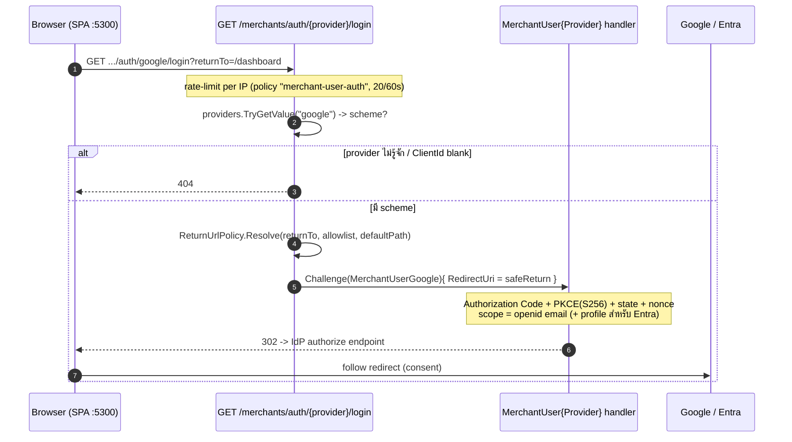
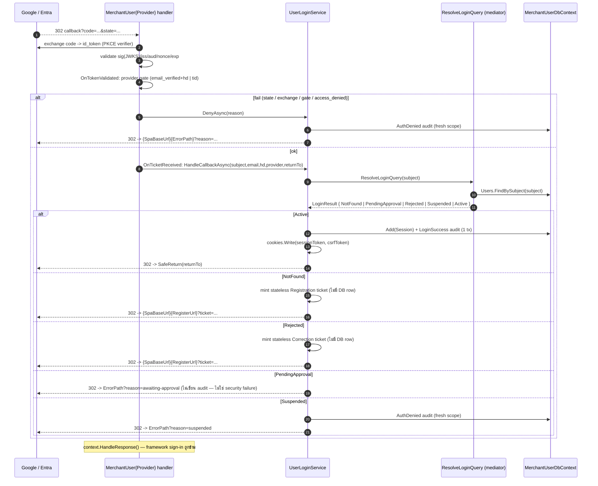
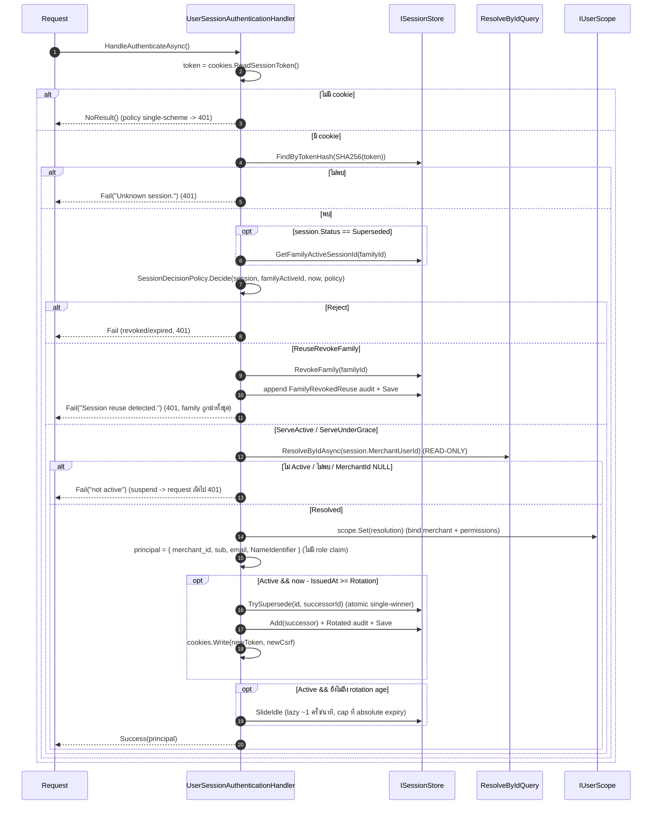
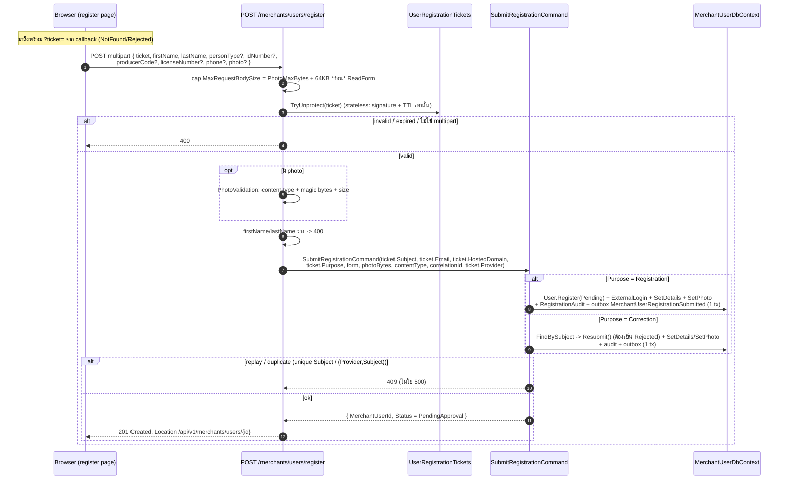
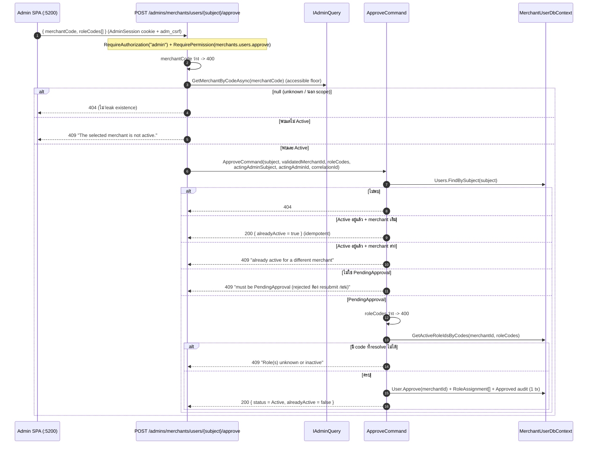
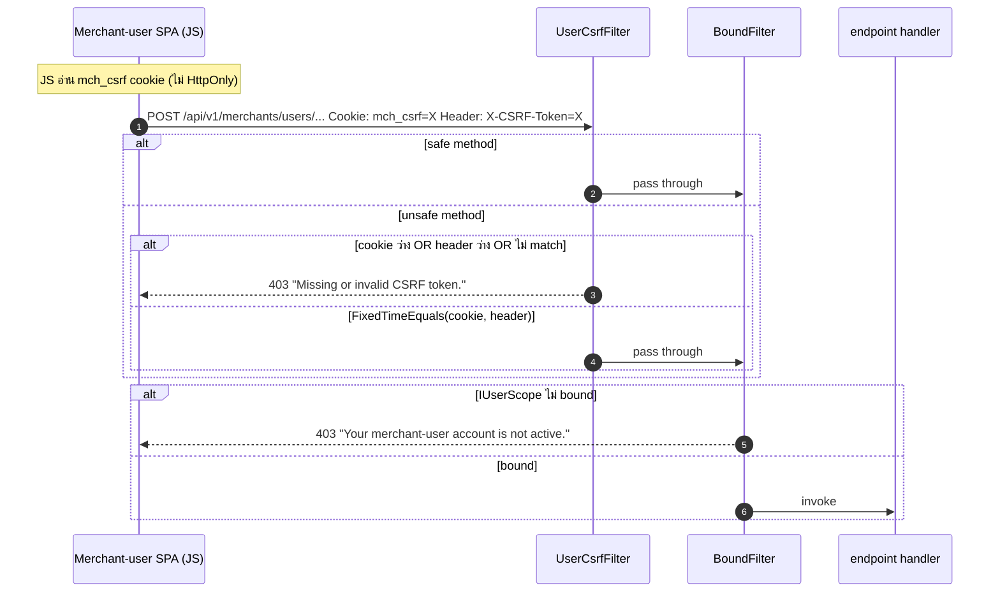
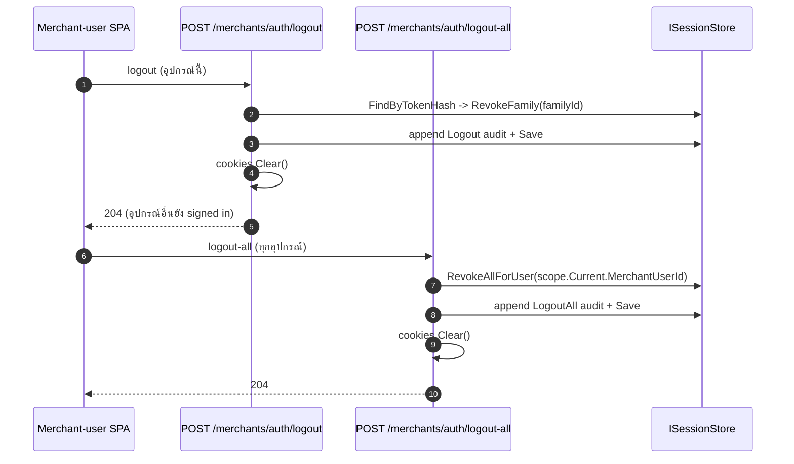

# Merchant-user Module — OIDC BFF (Google + Entra) + Sequence Diagrams

> Generated 2026-07-25 จากโค้ดจริงบน `develop`: `src/Hosts/Api/Merchants/*.cs`, `src/Hosts/Api/Program.cs`
> (route tree), `src/Modules/Merchants/**`, `src/Persistence/Persistence.MerchantUsers/**`,
> `src/Hosts/Api/Iam/PermissionAuthorization.cs`, `src/BuildingBlocks/BuildingBlocks.Web/CorsExtensions.cs`.
> เอกสารนี้เป็น **สัญญาสำหรับทีม merchant-user SPA** + คู่มือกลไกฝั่ง backend. แก้ auth/route/cookie/CORS เมื่อไหร่
> ให้ update ไฟล์นี้ตามด้วย.
>
> ไฟล์นี้เดิมชื่อ `producer-module.md`. module `Producer` **ไม่มีอยู่แล้ว** — ถูก merge เข้ากับ `Tenant` เป็น
> **`Merchants` module** เดียว (rf1), actor `ProducerAccount` -> **`Merchants.Domain.Users.User`** (เรียกในเอกสาร/
> โค้ดว่า *merchant-user*), route `/api/v1/producers/*` -> **`/api/v1/merchants/{auth,users}/*`**, cookie
> `prd_*` -> **`mch_*`**, schema `producer` -> **`merch`**. ทุกชื่อในไฟล์นี้ derive จากโค้ดปัจจุบัน ไม่ได้ยกมาจาก
> ฉบับเดิม.

**Ports (dev):** API `http://localhost:5100` · Admin SPA `:5200` · Merchant-user SPA `:5300`

**โมดูลในแผนที่แพลตฟอร์ม:** ดู [platform-modules.md](platform-modules.md) · **เทียบ admin console:**
[admin-module.md](admin-module.md) (กลไกเดียวกัน คนละ actor) · **ตาราง/ฟิลด์:**
[entity-fields.md](entity-fields.md)

---

## สารบัญ

1. [หลักการ (อ่านก่อนเขียนโค้ด)](#1-หลักการ-อ่านก่อนเขียนโค้ด)
2. [แผนที่ component](#2-แผนที่-component)
3. [Config](#3-config)
4. [Sequence: login redirect (challenge)](#4-sequence-login-redirect-challenge)
5. [Sequence: callback 4-way state machine](#5-sequence-callback-4-way-state-machine)
6. [Sequence: per-request session auth](#6-sequence-per-request-session-auth)
7. [Sequence: registration (ticket -> submit)](#7-sequence-registration-ticket---submit)
8. [Sequence: admin approve / reject (cross-plane)](#8-sequence-admin-approve--reject-cross-plane)
9. [Sequence: CSRF double-submit](#9-sequence-csrf-double-submit)
10. [Sequence: logout / logout-all](#10-sequence-logout--logout-all)
11. [Endpoints](#11-endpoints)
12. [Cookies + CSRF](#12-cookies--csrf)
13. [RBAC + permission enforcement](#13-rbac--permission-enforcement)
14. [Auth policy merchant-user (single-scheme) + fail-closed](#14-auth-policy-merchant-user-single-scheme--fail-closed)
15. [DI seams + persistence cluster](#15-di-seams--persistence-cluster)
16. [ตาราง DB](#16-ตาราง-db)
17. [ความต่างจาก Admin console](#17-ความต่างจาก-admin-console)
18. [FE integration (proxy / fetch / helper)](#18-fe-integration-proxy--fetch--helper)
19. [Error model](#19-error-model)
20. [Setup / Dev](#20-setup--dev)
21. [Source of truth](#21-source-of-truth)

---

## 1. หลักการ (อ่านก่อนเขียนโค้ด)

Merchant-user auth เป็น **server-side OIDC BFF** (Backend-for-Frontend) แบบเดียวกับ admin console. FE **ไม่** แตะ
IdP โดยตรง, **ไม่** ถือ id_token, **ไม่** แนบ `Authorization` header. auth ทั้งหมดคือ **session cookie** ที่ server
ออกให้หลัง login สำเร็จ.

```
                Browser (merchant-user SPA, :5300)
                          |
   GET /api/v1/merchants/auth/{provider}/login   (top-level navigation)
                          v
   +---------------------------------------------------------+
   |  API host (src/Hosts/Api)                                |
   |                                                          |
   |  [MerchantUser{Provider} OIDC scheme] --code+PKCE--> IdP |
   |        |  OnTicketReceived                               |
   |        v                                                 |
   |  UserLoginService.HandleCallbackAsync                    |
   |        |  ResolveLoginQuery (mediator)                   |
   |        v  4-way branch                                   |
   |  Active         -> Session + mch_* cookies + returnTo    |
   |  NotFound       -> registration ticket -> /register      |
   |  Rejected       -> correction ticket   -> /register      |
   |  Pending/Susp.  -> ErrorPath?reason=                     |
   |                                                          |
   |  [MerchantUserSession cookie scheme] (ทุก request)        |
   |        re-resolve READ-ONLY -> IUserScope                |
   |        rotation / reuse-detect / idle-slide              |
   |                                                          |
   |  policy "merchant-user" (single-scheme)                  |
   |  RequirePermission (fail-closed, side-aware)             |
   +---------------------------------------------------------+
                          |
              MerchantUserDbContext (pol_app, query-filtered)
                          |
                   schema: merch.*
```

หลักการสำคัญ 6 ข้อ:

1. **BFF** — token ของ IdP ไม่เคยถึง browser. browser ถือแค่ opaque session token; server เก็บเฉพาะ SHA-256 hash.
2. **ไม่ self-provision** — callback ของ subject ที่ไม่รู้จักออกได้แค่ registration ticket ไม่สร้าง account/session.
3. **merchant มาจาก record ไม่ใช่ token** — `User.MerchantId` ถูก set ตอน admin approve เท่านั้น (NULL ก่อนหน้านั้น).
4. **single-scheme** — policy `merchant-user` รับเฉพาะ `MerchantUserSession`. Bearer path ถูกถอดทิ้งทั้งระบบแล้ว (rf1).
5. **re-resolve ทุก request** — status/merchant/permission ถูกอ่านสดจาก DB ทุก request -> suspend/reject/เปลี่ยน role
   มีผลภายใน 1 request ไม่ต้องรอ cookie หมดอายุ.
6. **multi-provider** — `{provider}` ใน path รับ `google` หรือ `microsoft` (Entra ID). provider ที่ไม่รู้จักหรือไม่ได้
   config -> **404**.

> **สำคัญสุด:** `returnTo` ต้องเป็น relative path บน origin เดียวกัน (ขึ้นต้น `/` และไม่ใช่ `//`) และอยู่ใน
> `MerchantUser:Session:ReturnUrlAllowlist`. ค่านอก allowlist ถูกแทนด้วย `DefaultReturnPath` (กัน open-redirect).

---

## 2. แผนที่ component

ไฟล์ host ทั้งหมดอยู่ `src/Hosts/Api/Merchants/` (namespace `Api.Merchants`) — ชื่อ type ไม่มี prefix `MerchantUser`
เพราะ namespace บอกอยู่แล้ว (naming law L1-L8, `ARCHITECTURE.md`).

| Layer | ไฟล์ / type | หน้าที่ |
|---|---|---|
| OIDC client | `UserOidcAuthentication.cs` | ลงทะเบียน scheme `MerchantUser{Provider}` ต่อ provider, hook 4 events, Google/Entra deltas |
| OIDC options | `UserOidcOptions.cs` | bind `MerchantAuth` + `MerchantUser:Session` |
| Provider map | `UserOidcProviders` (`UserOidcAuthentication.cs`) | slug (`google`/`microsoft`) -> scheme name; ไม่มีใน map = 404 |
| Callback brancher | `UserLoginService.cs` | 4-way state branch, ออก session / ticket / deny |
| Login resolver | `ResolveLogin.cs` (Application) | subject -> `LoginOutcome` + `Resolution` |
| Session auth | `UserSessionAuthenticationHandler.cs` | decision table + principal + rotation + idle-slide |
| Session resolver | `ResolveById.cs` (Application) | re-resolve READ-ONLY ทุก request |
| Decision policy | `SessionDecision.cs` (Domain) | pure decision table |
| Session aggregate | `Session.cs` (Domain) | rotation family, supersede, grace |
| Session store | `MerchantUserSessionStore.cs` (Persistence) | atomic set-based supersede/revoke/slide/prune |
| Cookies | `UserSessionCookies.cs` | `__Host-mch_session` / `mch_csrf` read/write/clear |
| CSRF | `UserCsrfFilter.cs` | double-submit guard บน unsafe method |
| Bound guard | `BoundFilter` (`UserPermissionAuthorization.cs`) | fail-close ทั้ง group ถ้า scope ไม่ bound |
| Permission gate | `Api.Iam.PermissionAuthorization` | `RequirePermission` + boot parity guard (ใช้ร่วมกับ admin) |
| Scope | `UserScope` / `IUserScope` | per-request holder ของ `Resolution` |
| Prune | `UserSessionPruneService.cs` | background sweep ลบ session ที่เลย absolute expiry |
| Rate limit | `UserAuthRateLimiting.cs` | policy `merchant-user-auth` — 20 req / 60s sliding ต่อ IP |
| Tokens | `UserTokens.cs` | opaque 256-bit token + SHA-256 hash |
| Registration | `UserRegistration.cs` | form mapping, `UserRegistrationOptions`, ticket protector |
| Host wiring | `HostWiring.cs` | scope, cookies, photo store, ticket protector, cross-context `IRoleRepository` |
| Approve/Reject | `ApproveReject.cs` (Application) | admin cross-plane commands |
| Roles | `SetUserRoles.cs` + `Iam.Application.Roles` handlers | role assignment + role CRUD (catalog กลาง) |

หลายไฟล์มี comment `// ponytail: DUPLICATE of Api.Admin...` — โครง auth/session ตั้งใจ duplicate จาก admin stack
ไม่ refactor เป็น shared base.

---

## 3. Config

### `MerchantAuth` (`UserOidcOptions`)

| key | default (committed) | หมายเหตุ |
|---|---|---|
| `ErrorPath` | `/login-error` | SPA path ที่ callback เด้งไปพร้อม `?reason=` เมื่อ deny/fail |
| `RegisterUrl` | `/register` | SPA register page ที่ applicant ถูกเด้งไปพร้อม `?ticket=`. **relative** โดยตั้งใจ — ถูกทำเป็น absolute ด้วย `SpaBaseUrl` ตอน redirect (default absolute localhost จะส่ง localhost ขึ้น prod เงียบ ๆ) |
| `Providers:{Name}` | `Google` + `Microsoft` | dictionary ของ `OidcProviderOptions` (ดูตารางล่าง) |

### `MerchantAuth:Providers:{Google|Microsoft}` (`OidcProviderOptions`)

| key | default | หมายเหตุ |
|---|---|---|
| `Authority` | Google: `https://accounts.google.com` · Microsoft: `https://login.microsoftonline.com/organizations/v2.0` | |
| `ClientId` | `""` | **blank = ข้าม scheme ของ provider นั้น** (login ของมัน 404) แทนที่จะพัง host ทั้งตัว |
| `ClientSecret` | `""` | secret จริง — inject ผ่าน `MerchantAuth__Providers__{Provider}__ClientSecret` เท่านั้น ห้าม commit/log |
| `CallbackPath` | `/api/v1/merchants/auth/{google\|microsoft}/callback` | OIDC middleware handle เอง (ไม่มี mapped endpoint) |
| `HostedDomain` | `""` | **Google only** — guard `hd` claim; blank = บัญชี Google ที่ verified ใดก็ได้ |
| `AllowedTenants` | `[]` | **Microsoft only** — allowlist Entra `tid`; ว่าง = ทุก tenant ที่ Authority ยอม |

### `MerchantUser:Session` (`UserSessionOptions`)

| key | default | |
|---|---|---|
| `IdleMinutes` | 30 | idle window |
| `AbsoluteHours` | 8 | hard cap (rotation ไม่ยืด) |
| `RotationMinutes` | 15 | rotation age |
| `GraceSeconds` | 60 | predecessor grace |
| `SameSite` | `Lax` | `None` สำหรับ cross-site deploy (บังคับ Secure) |
| `DefaultReturnPath` | `/` | |
| `ReturnUrlAllowlist` | `["/"]` | กัน open-redirect (same-origin relative path เท่านั้น) |
| `SpaBaseUrl` | `""` | absolute origin ของ merchant-user SPA (dev = `http://localhost:5300`). blank = คง relative |

### `MerchantUser:Registration` (`UserRegistrationOptions`)

ไม่มีใน `appsettings.json` ที่ commit — ใช้ code default. override ต่อ deployment ได้.

| key | default | |
|---|---|---|
| `TicketTtlMinutes` | 10 | อายุ wire ticket (บังคับโดย Data Protection time limit) |
| `PhotoMaxBytes` | `PhotoValidation.DefaultMaxBytes` | เพดานรูปที่รับ |
| `PhotoStoreRootPath` | `merchant-user-photos` | ที่ `LocalPhotoStore` เขียน blob (gitignored); relative = ใต้ content root ของ host |

### Boot guard

นอก Development: `ProvisioningGuards.RequireOidcProviders(config, "MerchantAuth", requireAtLeastOne: false)` —
ทุก provider ที่ `ClientId` ไม่ blank ต้องไม่ใช่ placeholder และ **ต้องมี secret ถูก inject** ไม่งั้น fail ตอน boot.
ต่างจาก admin ตรงฝั่ง merchant-user **อนุญาตให้ไม่มี provider เลย** (ปิด login ฝั่งนี้ทั้งชุดได้ตั้งใจ) ส่วน admin
บังคับอย่างน้อย 1.

> ไม่มี flag `EnforcePermissionsOnWrites` อีกแล้ว — ของเดิมเป็น transitional toggle ตอนยังมี Bearer fallback;
> rf1 ถอด Bearer ออกหมด write endpoint จึง gate permission แบบไม่มีเงื่อนไข.

---

## 4. Sequence: login redirect (challenge)

`GET /api/v1/merchants/auth/{provider}/login?returnTo=...` — anonymous, rate-limited. resolve provider slug จาก
`UserOidcProviders`, validate `returnTo` กับ allowlist, แล้ว `Results.Challenge` เข้า scheme ของ provider นั้น.



`SaveTokens = false`, `GetClaimsFromUserInfoEndpoint = false`, `MapInboundClaims = false` — เก็บ claim ดิบ
(`sub`/`oid`/`email`/`hd`/`tid`/`email_verified`) และไม่เก็บ token ของ IdP ไว้เลย.

---

## 5. Sequence: callback 4-way state machine

IdP เด้งกลับ `CallbackPath` ของ provider นั้น. OIDC middleware verify เอง (code exchange + JWKS sig +
iss/aud/nonce/lifetime). `OnTokenValidated` เช็ค gate เฉพาะ provider. `OnTicketReceived` เรียก
`UserLoginService.HandleCallbackAsync` แล้ว `HandleResponse()` short-circuit framework sign-in
(cookie scheme `merchant-user-oidc-noop` จึงไม่เคยถูกเขียนจริง).

identity มาจาก id_token ที่ verify แล้วเท่านั้น — request/form override ไม่ได้.

| provider | subject | email | gate ใน `OnTokenValidated` |
|---|---|---|---|
| Google | `sub` | `email` | `email_verified == "true"` **และ** `hd == HostedDomain` (ถ้าตั้ง) |
| Microsoft (Entra) | **`oid`** (ไม่ใช่ `sub` — `sub` เป็น pairwise ต่อ app registration) | `email` หรือ fallback `preferred_username` ที่มี `@` | `tid` ต้องไม่ว่าง; issuer validator เทียบ issuer กับ `tid` ของ token เอง + `AllowedTenants` |



`ResolveLoginHandler` mapping (merchant มาจาก column `User.MerchantId` ไม่ใช่ตาราง assignment แยกอีกแล้ว):

| `User.Status` | Outcome | ผล |
|---|---|---|
| (subject ไม่พบ) | `NotFound` | registration ticket |
| `PendingApproval` | `PendingApproval` | 302 -> `ErrorPath?reason=awaiting-approval` |
| `Rejected` | `Rejected` | correction ticket |
| `Active` + `MerchantId` มีค่า | `Active` | เปิด session + resolve effective permissions (scoped ที่ merchant นั้น) |
| `Active` + `MerchantId` NULL | `Suspended` | deny (invariant violation) |
| `Suspended` / อื่น | `Suspended` | deny |

**Atomicity:** session row + login-success audit commit ใน **tx เดียว**. ทุก deny เขียน audit บน **fresh scope**
(`IServiceScopeFactory.CreateScope`) เพื่อไม่ให้ half-built session บน request context ถูก commit ไปด้วย.
ไม่ log secret / token / code / raw session id / ticket.

### Dedup / replay safety

callback **ไม่ persist อะไรเลย** ในเคส NotFound/Rejected — mint แค่ stateless wire token (signed + time-limited
ผ่าน Data Protection purpose `MerchantUser.RegistrationTicket.v1`) แล้ว redirect. ไม่มีตาราง ticket. การกัน record
ซ้ำมาจาก **unique index บน `merch.Users.Subject`** (+ `(Provider, Subject)` บน `merch.ExternalLogins`) ตอน submit:
submit ซ้ำ (replay token เดิม หรือ 2 tab) ชน unique index -> unit of work แปลงเป็น **409** ไม่ใช่ 500. ฝั่ง
Correction กันเพิ่มด้วย `User.Resubmit()` ที่ throw ถ้า status ไม่ใช่ `Rejected`. callback ซ้ำก่อน submit = mint
token ใหม่เฉย ๆ (harmless, self-expiring).

### `reason` codes ที่ FE ต้อง handle ที่ `ErrorPath`

| reason | ที่มา | FE ควรแสดง |
|---|---|---|
| `awaiting-approval` | `PendingApproval` | "การสมัครของคุณรอการอนุมัติ" — render เป็น **info** ไม่ใช่ error |
| `suspended` | `Suspended` / invariant violation | "บัญชีถูกระงับ ติดต่อผู้ดูแล" |
| `missing-identity` | id_token ไม่มี subject/email | error ทั่วไป + ปุ่มลองใหม่ |
| `resolve-failed` | resolve ล้มเหลว (DB/exception) | error ทั่วไป + ปุ่มลองใหม่ |
| `session-write-failed` | เขียน session ไม่สำเร็จ | error ทั่วไป + ปุ่มลองใหม่ |
| `ticket-issue-failed` | mint ticket ไม่สำเร็จ | error ทั่วไป + ปุ่มลองใหม่ |
| `email-unverified` | Google `email_verified != true` | "อีเมลยังไม่ยืนยันกับ Google" |
| `hd-mismatch` | `hd` ไม่ตรง `HostedDomain` | "โดเมนนี้ไม่ได้รับอนุญาต" |
| `tenant-missing` | Entra id_token ไม่มี `tid` | error ทั่วไป |
| `access-denied` | ผู้ใช้กดปฏิเสธที่ IdP | "คุณยกเลิกการเข้าสู่ระบบ" |
| `auth-failed` | state mismatch / code exchange fail / อื่น ๆ | error ทั่วไป + ปุ่มลองใหม่ |

---

## 6. Sequence: per-request session auth

ทุก request ที่ใช้ policy `merchant-user` เข้า `UserSessionAuthenticationHandler` ตอน authentication:
อ่าน cookie -> หา session ด้วย hash -> decision table -> re-resolve READ-ONLY -> สร้าง principal + bind scope ->
rotation / idle-slide.



Decision table (`SessionDecisionPolicy.Decide`):

| Status | เงื่อนไข | Decision |
|---|---|---|
| `Revoked` | — | `Reject` |
| `Active` | live (idle & absolute ยังไม่หมด) | `ServeActive` |
| `Active` | หมดอายุ | `Reject` |
| `Superseded` | เป็น immediate predecessor ของ Active ใน family **และ** ยังอยู่ใน grace | `ServeUnderGrace` |
| `Superseded` | ไม่ใช่ immediate predecessor หรือเลย grace | `ReuseRevokeFamily` |

Rotation family (`Session`): `Start` เปิด family ใหม่ (`FamilyId` ใหม่); `Rotate` ออก successor ใน family เดิม +
mark predecessor `Superseded` + link `SupersededBySessionId`. successor **inherit absolute expiry เดิม** (rotation
ไม่ยืด hard cap; ยืดได้แค่ idle). reuse ของ token ที่ถูก supersede แล้วเลย grace = สัญญาณ theft -> revoke ทั้ง family.

principal ที่ออกมา: claim `merchant_id` (ให้ `HttpActorContext` path เดิมอ่านต่อ), `sub`, `email`,
`ClaimTypes.NameIdentifier` = `MerchantUserId`. **ไม่มี role claim** (role/permission อยู่ใน `IUserScope` ไม่ใช่
claim) และ **ไม่เรียก** `IActorScope.Begin` (double-bind throw).

---

## 7. Sequence: registration (ticket -> submit)

`POST /api/v1/merchants/users/register` — anonymous, ticket-gated, rate-limited, multipart. signed ticket คือ
capability barrier (ไม่มี session CSRF บน pre-session route). identity มาจาก ticket ไม่ใช่ form.



- `DisplayName` server-compute จาก `firstName + lastName` (clamp 200 chars) — **ไม่ใช่** field ที่ client ส่ง.
- รูปเก็บนอก DB: `IPhotoStore.PutAsync` คืน opaque object key (dev = `LocalPhotoStore` เขียน directory ที่
  gitignored); DB เก็บแค่ `PhotoObjectKey` + `PhotoContentType`.
- outbox event `MerchantUserRegistrationSubmitted` commit ใน tx เดียวกัน; consumer `RegistrationConsumer`
  (รันบน background dispatch scope) เขียน `merch.RegistrationNotices` แบบ idempotent บน `MerchantUserId`
  ให้ฝั่ง admin เห็นว่ามีคนรออนุมัติ.
- **ยังไม่มี** endpoint `GET /api/v1/merchants/users/{id}` และไม่มี endpoint เสิร์ฟรูป — `Location` header ของ 201
  จึงชี้ไป route ที่ยังไม่ถูก map (known gap).

---

## 8. Sequence: admin approve / reject (cross-plane)

Admin (ไม่ใช่ merchant-user) อนุมัติ/ปฏิเสธ. Admin permission (`merchants.users.approve` / `.reject`) +
accessible-merchant floor (`IAdminQuery`) ตรวจที่ **host** ก่อน dispatch — command ที่ส่งเข้า Merchants module
รับ merchant id ที่ validate แล้ว ไม่มี Admin import.



**Reject** (`POST /api/v1/admins/merchants/users/{subject}/reject`, `merchants.users.reject`): set `Rejected` +
`RevokeAllForUserAsync` (ฆ่า session ที่ live อยู่) + audit พร้อม `reason` (trim/cap 1024) ใน tx เดียว.
non-Pending -> 409; unknown -> 404.

> `User.Approve` เป็นตัวบังคับ invariant เอง (idempotent เมื่อ merchant เดิม, throw เมื่อเปลี่ยน merchant) —
> handler แค่อ่านผลลัพธ์ไปประกอบ response.

---

## 9. Sequence: CSRF double-submit

`UserCsrfFilter` ผูกกับ **สอง group**: `/api/v1/merchants/auth` และ `/api/v1/merchants/users` (ผูกครั้งเดียวต่อ
group ผ่าน `AddEndpointFilter<UserCsrfFilter>()`). unsafe method (POST/PUT/PATCH/DELETE) ต้องมี header
`X-CSRF-Token` = cookie `mch_csrf`, compare แบบ constant-time. safe method (GET/HEAD/OPTIONS/TRACE) ยกเว้น.
pre-session route (login / callback / register) ถูก map **นอก** group นี้ จึงไม่โดน.



defense-in-depth: session cookie เป็น `SameSite=Lax` อยู่แล้ว — CSRF filter เป็นชั้นเสริม.

> **ช่องที่ต้องรู้:** endpoint funnel (`/api/v1/products`, `/carts/*`, `/checkouts`, `/payments/*`, `/orders/*`,
> `/reports/*`) gate ด้วย policy `merchant-user` เหมือนกัน แต่ **ไม่ได้อยู่ใน group ที่ผูก `UserCsrfFilter`** และไม่มี
> `UseAntiforgery` global — ป้องกัน CSRF ของ endpoint กลุ่มนี้จึงพึ่ง `SameSite=Lax` ของ session cookie อย่างเดียว.

---

## 10. Sequence: logout / logout-all



`logout` ทนต่อ cookie ที่หาย/ไม่รู้จัก (เคลียร์ cookie แล้วคืน 204 อยู่ดี); `logout-all` อ่าน id จาก
`IUserScope.Current` จึงต้องมี session ที่ resolve แล้ว.

---

## 11. Endpoints

auth = **session cookie** (`credentials: 'include'`). method ที่เปลี่ยน state บน 2 group ด้านล่างต้องมี
`X-CSRF-Token`. permission = key จาก catalog กลาง `iam` (Merchant side).

### Merchant-user auth (`/api/v1/merchants/auth`)

| Method | Path | Auth | CSRF | Permission | Success | หมายเหตุ |
|---|---|---|---|---|---|---|
| GET | `/api/v1/merchants/auth/{provider}/login` | anonymous | — | — | 302 | rate-limited; `?returnTo=<allowlisted path>`; provider ไม่รู้จัก/ไม่ config -> 404 |
| GET | `/api/v1/merchants/auth/{provider}/callback` | (OIDC middleware) | — | — | 302 | **ไม่มี mapped endpoint** — เป็น `CallbackPath` ของ scheme; 4-way branch |
| POST | `/api/v1/merchants/auth/logout` | `merchant-user` | ต้อง | — | 204 | revoke session family ปัจจุบัน (อุปกรณ์นี้) + clear cookie |
| POST | `/api/v1/merchants/auth/logout-all` | `merchant-user` | ต้อง | — | 204 | revoke ทุก session ของ user นี้ |

### Merchant-user resources (`/api/v1/merchants/users`)

| Method | Path | Auth | CSRF | Permission | Success | หมายเหตุ |
|---|---|---|---|---|---|---|
| POST | `/api/v1/merchants/users/register` | anonymous + ticket | — | — | 201 | multipart; rate-limited; 400/409/413/429 |
| GET | `/api/v1/merchants/users/me` | `merchant-user` | — | — | 200 | identity + merchant + active role codes + effective permissions |
| GET | `/api/v1/merchants/users/permissions` | `merchant-user` | — | — | 200 | permission/group catalog ฝั่ง Merchant |
| GET | `/api/v1/merchants/users/roles` | `merchant-user` | — | — | 200 | role ที่ merchant นี้เห็น (shared + ของตัวเอง) |
| GET | `/api/v1/merchants/users/roles/{code}` | `merchant-user` | — | — | 200 | unknown / ไม่เห็น -> 404 |
| POST | `/api/v1/merchants/users/roles` | `merchant-user` | ต้อง | `roles.manage` | 201 | dup code (รวม shared code) -> 409; key นอก catalog หรือฝั่ง Platform -> 400 |
| PUT | `/api/v1/merchants/users/roles/{code}` | `merchant-user` | ต้อง | `roles.manage` | 200 | code immutable; role ที่ไม่ใช่ของ merchant นี้ (รวม shared seed) -> 409; deactivate `merchant_manager` -> 409 |
| DELETE | `/api/v1/merchants/users/roles/{code}` | `merchant-user` | ต้อง | `roles.manage` | 204 | ไม่ใช่ของ merchant นี้ -> 409; `merchant_manager` ลบไม่ได้ -> 409; มี user ผูกอยู่ -> 409 |
| PUT | `/api/v1/merchants/users/{merchantUserId}/roles` | `merchant-user` | ต้อง | `users.roles` | 204 | set roles เป็น set ที่ให้มาเป๊ะ ๆ ภายใน merchant ตัวเอง; unknown code -> 400; target นอก merchant -> 404 |

### Admin cross-plane (`/api/v1/admins/merchants/users`)

| Method | Path | Auth | CSRF | Permission | Success | หมายเหตุ |
|---|---|---|---|---|---|---|
| POST | `/api/v1/admins/merchants/users/{subject}/approve` | `admin` | ต้อง (`adm_csrf`) | `merchants.users.approve` | 200 | body `{ merchantCode, roleCodes[] }`; idempotent; 400/404/409 |
| POST | `/api/v1/admins/merchants/users/{subject}/reject` | `admin` | ต้อง (`adm_csrf`) | `merchants.users.reject` | 200 | body `{ reason? }`; revoke sessions; 404/409 |

### Funnel endpoints ที่ merchant-user ใช้ (policy เดียวกัน, คนละ group)

หลัง rf1 ถอด Bearer ทิ้ง endpoint สายธุรกิจทั้งหมดย้ายมา gate ด้วย policy `merchant-user` ตัวเดียวกัน — merchant
มาจาก claim `merchant_id` ผ่าน `IActorContext` ไม่ใช่จาก body:

| Method | Path | Permission |
|---|---|---|
| POST | `/api/v1/products` | `product.create` |
| GET | `/api/v1/products` | — |
| POST · GET · PUT · DELETE | `/api/v1/carts`, `/api/v1/carts/{cartId}`, `/api/v1/carts/{cartId}/items[/{productId}]`, `/api/v1/carts/{cartId}/clear` | — |
| POST | `/api/v1/checkouts`, `/api/v1/checkouts/{checkoutSessionId}/confirm` | — |
| POST | `/api/v1/payments/sessions` | `payment.create` |
| POST | `/api/v1/payments/sessions/{paymentSessionId}/redirect` | `payment.redirect` |
| GET | `/api/v1/orders`, `/api/v1/orders/{orderId}` | — |
| POST | `/api/v1/orders/{orderId}/summary/resend` | — |
| PUT | `/api/v1/orders/{orderId}/items/{itemId}/policy` | `policies.write` |
| GET | `/api/v1/reports/reconciliation` | — |
| GET | `/api/v1/reports/policies` | `policies.read` |

`merchantUserId` / `merchantId` / `orderId` ฯลฯ เป็น Guid. JSON body/field เป็น camelCase.

### Response shape ที่ FE ใช้บ่อย

```jsonc
// GET /api/v1/merchants/users/me
{
  "merchantUserId": "…",
  "email": "user@example.com",
  "merchantId": "…",
  "roles": ["merchant_manager"],          // active role codes เท่านั้น
  "permissions": ["product.create", "roles.manage", "…"]
}

// GET /api/v1/merchants/users/roles  (array)
[{
  "code": "merchant_manager", "name": "…", "description": null, "color": null,
  "status": "active",                      // lowercase บน wire เสมอ
  "permissions": ["…"], "userCount": 3,
  "shared": true                           // true = role ที่ Platform seed ให้ทุก merchant
}]

// POST /api/v1/merchants/users/register  (201)
{ "merchantUserId": "…", "status": "PendingApproval" }

// POST /api/v1/admins/merchants/users/{subject}/approve  (200)
{ "merchantUserId": "…", "status": "Active", "alreadyActive": false }
```

`status` ของ **role** เป็น lowercase (`active`/`inactive`) และ parse แบบ strict — ค่าอื่น (typo/blank/null) = 400
ไม่ default เป็น Active. ส่วน `status` ของ **user** เป็น PascalCase enum name (`PendingApproval` / `Active` /
`Rejected` / `Suspended`).

---

## 12. Cookies + CSRF

| Cookie | อ่านจาก JS ได้ | flags | บทบาท |
|---|---|---|---|
| `__Host-mch_session` (https) / `mch_session` (dev-http) | **ไม่** (HttpOnly) | HttpOnly, Secure, `Path=/`, SameSite, IsEssential | opaque 256-bit token; server เก็บแค่ SHA-256 (32 bytes); idle 30m, absolute 8h |
| `mch_csrf` | **ได้** (ไม่ HttpOnly) | Secure, `Path=/`, SameSite, IsEssential | double-submit CSRF |

- **https** -> prefix `__Host-` (บังคับ Secure + `Path=/` + ไม่มี `Domain`)
- **dev-http** (Development **และ** request ไม่ใช่ https) -> ถอด `Secure` + ถอด prefix (`mch_session`) เพราะ
  `__Host-` ต้อง Secure ที่ browser reject บน http
- **นอก Development** -> ไม่เคยถอด `Secure` แม้จะเป็น http
- `SameSite=None` ถูก downgrade เป็น `Lax` อัตโนมัติบน dev-http (None ต้องคู่กับ Secure)
- **Rotation:** server หมุน session cookie ให้เองทุก ~15m ผ่าน `Set-Cookie` ใน response ปกติ — FE ไม่ต้องทำอะไร.
  cookie `mch_csrf` ถูกเขียนใหม่พร้อมกัน ดังนั้น **อ่านค่า CSRF สดจาก cookie ทุกครั้งที่ยิง** อย่า cache ในตัวแปร.
- **Revocation ทันที:** suspend/reject user, logout-all, หรือตรวจพบ replay -> ทั้ง family ถูก revoke, request ถัดไป
  401 ทันที ไม่ต้องรอ token หมดอายุ.
- `UserTokens.NewOpaqueToken()` = `Base64Url(RandomNumberGenerator.GetBytes(32))`; `Hash()` = SHA-256 32 bytes
  (ค่าที่เก็บลง `merch.Sessions.TokenHash`, `varbinary(32)`).

---

## 13. RBAC + permission enforcement

catalog **กลางชุดเดียว** module `Iam` schema `iam` (rf2) — ไม่มี catalog แยกต่อ console อีกแล้ว. vocabulary อยู่ใน
`Iam.Domain.Permissions.Keys` (24 keys / 10 groups) และ migration seed `iam.Permissions` / `iam.PermissionGroups`
จาก vocabulary เดียวกัน. แต่ละ group มี `Scope` = `Platform` (admin console) หรือ `Merchant` (merchant-user console).

Merchant-side keys ที่ merchant-user ใช้ได้:

| group | keys |
|---|---|
| `catalog` | `product.create`, `product.update` |
| `payment` | `payment.create`, `payment.redirect` |
| `roles` | `roles.view`, `roles.manage`, `users.roles` |
| `policies` | `policies.read`, `policies.write` |

Platform-side keys ที่เกี่ยวกับ merchant-user (admin ถือ, group `merchants.users`): `merchants.users.approve`,
`merchants.users.reject` — บวก group `merchants.policies` (`merchants.policies.read` / `.write`) สำหรับ
cross-merchant escape-hatch ของ admin.

```
RequirePermission(key):
   admin bound ? admin.Permissions.Contains(key)
               : userScope.IsBound && userScope.Current.Permissions.Contains(key)
   ไม่ผ่าน -> 403 (ไม่มี 500, ไม่มี super-bypass)
```

`IAdminScope` กับ `IUserScope` ไม่มีทาง bind พร้อมกันใน request เดียว (คนละ scheme/policy) จึงเช็ค admin ก่อน
ปลอดภัยและ deterministic.

**Boot parity guard** (`Api.Iam.PermissionParity.Assert`, เรียกก่อน `app.Run()` หลัง map endpoint ครบ) — pure
in-memory, ไม่แตะ DB, เช็ค 3 อย่างต่อ (key, policy) ที่ gate ไว้:

1. key ต้องอยู่ใน `Keys.AllKeys`
2. policy ต้องเป็นตัวที่ `AuthPolicyScheme.For` รู้จัก (`admin` -> `AdminSession` / Platform,
   `merchant-user` -> `MerchantUserSession` / Merchant)
3. **side ของ key ต้องตรงกับ side ที่ policy บอก** — endpoint ใต้ policy `merchant-user` ที่ gate ด้วย key ฝั่ง
   Platform (หรือกลับกัน) = boot failure ไม่ใช่ runtime surprise

role ฝั่ง merchant มี 2 แบบ: **shared** (Platform seed, `Role.MerchantId` เป็น null — เห็นทุก merchant, แก้/ลบไม่ได้
จากฝั่ง merchant) และ **ของ merchant นั้นเอง**. `merchant_manager` เป็น lockout-recovery role — deactivate/delete
ไม่ได้. `userCount` ที่ merchant console เห็นนับเฉพาะ user ใน merchant ตัวเอง (ไม่ leak ยอดของ merchant อื่น
แม้เป็น shared role).

effective permissions resolve ใหม่ทุก request (`ResolveByIdQuery` -> `IRoleRepository.ListEffectivePermissionsAsync`)
-> เปลี่ยน role ใน DB มีผลทันทีภายใน 1 request.

---

## 14. Auth policy merchant-user (single-scheme) + fail-closed

```csharp
AddPolicy("merchant-user", p => p
    .AddAuthenticationSchemes(UserSessionAuthenticationHandler.SchemeName)  // "MerchantUserSession"
    .RequireAuthenticatedUser());
```

- **single-scheme** — dual-scheme เดิม (`ProducerSession` OR tenant Bearer) ถูกถอดทิ้งพร้อม Bearer ทั้งระบบ (rf1 T11)
- ไม่มี cookie -> handler คืน `NoResult()` -> policy ไม่มี scheme อื่นให้ fall through -> **401**
- fail-closed 2 ชั้นบน 2 group: `BoundFilter` (403 ถ้า `IUserScope` ไม่ bound) แล้วค่อย `RequirePermission`
  (403 ถ้าไม่มี key)
- principal ไม่มี role claim โดยตั้งใจ — authority เรื่อง role/permission อยู่ที่ `IUserScope` ที่ resolve สดเท่านั้น

---

## 15. DI seams + persistence cluster

`MerchantUserDbContext` (`Persistence.MerchantUsers`, `internal sealed`) เป็น **runtime context 1 ใน 3 cluster**
(อีกสองคือ `ControlPlaneDbContext`, `MerchantRuntimeDbContext`) ที่ต่อ DB ด้วย **login เดียว `pol_app`** — RLS
ถูกถอดออกทั้งระบบแล้ว (spec `rls-to-query-filter`), เส้นแบ่งความปลอดภัยคือ **EF query filter + `IWriteAuthorizer`
ต่อ capability** ไม่ใช่ DB principal.

> comment ในโค้ดหลายที่ยังเขียนว่า "keyed pol_admin" — เป็นซากจากยุคก่อน `rls-to-query-filter` ไม่ตรงกับ runtime
> ปัจจุบัน. ของจริงดู `Program.cs` (`AddMerchantUserPersistence(appConnString, ResolveMerchantWriteAuthorizer)`).

| เรื่อง | ของจริงปัจจุบัน |
|---|---|
| connection | `appConnString` (login `pol_app`, `Application Name=Api`) — เดียวกันทุก cluster |
| write floor | `HttpMerchantWriteAuthorizer(IAdminScope, IActorContext)` สำหรับ HTTP request — เลือกต่อ write: admin scope bound -> `AdminApprovalWriteAuthorizer` (ชุด approve/reject เท่านั้น, confine ตาม accessible set), ไม่ bound -> `MerchantRequestWriteAuthorizer(IActorContext)`; `WorkerWriteAuthorizer()` สำหรับ background dispatch scope (เลือกด้วย `BackgroundDispatchScope.IsHttpRequest`) — spec `bugfix-merchant-prebind-wiring` |
| query filter | **เฉพาะ `merch.Users` และ `merch.RoleAssignments`** — `x.MerchantId == context.CurrentMerchant`. อีก 5 entity ใน cluster (Sessions / ExternalLogins / AuthAudits / RegistrationAudits / RegistrationNotices) **ไม่มี** filter |
| pending carve-out | `User.MerchantId` เป็น nullable; NULL ไม่มีวันเท่า `CurrentMerchant` ใน SQL -> pending row ถูกซ่อนจาก merchant actor โดยอัตโนมัติ เห็นได้เฉพาะผ่าน pre-bind seam ที่ suppress filter ชัดเจน: `IAccountResolver` (login/by-id read) + `IAccountStore` (tracked load ของ registration/correction/approve/reject) |
| migration owner | `PolDbContext` เท่านั้น — cluster นี้ไม่ประกาศ migration เอง |

ports ที่ `AddMerchantUserPersistence` bind (ทั้งหมดอยู่บน `MerchantUserDbContext` เดียวกัน scope เดียวกัน ->
handler ที่ stage ข้ามหลาย port commit เป็น **tx เดียว**):

`IUserRepository` (bound in-session เท่านั้น — ติด query filter), `IAccountResolver` + `IAccountStore`
(pre-bind seams, filter-free — login resolve / session re-resolve / registration / correction / approve /
reject), `IExternalLoginRepository`, `IRegistrationAuditWriter`, `IRegistrationOutboxWriter`,
`IRegistrationUnitOfWork`, `IUserUnitOfWork`, `ISessionStore`, `IAuthAuditWriter`, `IRegistrationNoticeWriter`,
`IRoleRepository` (keyed `"merchantUserPartial"`), `IMerchantRoleAssignmentReader`,
`IMerchantRoleAssignmentCountReader`, `IMerchantUserOutboxDrain`.

**Cross-context composition:** `IRoleRepository` 5 member ที่แตะแค่ `merch.RoleAssignments` ใช้ adapter keyed
`"merchantUserPartial"`; อีก 4 member ที่ต้องอ่าน `iam.Roles` / `iam.RolePermissions` (คนละ context) ถูกประกอบที่
host (`HostMerchantRoleRepository` ใน `HostWiring.cs`): resolve role ids **ใน merchant นี้** ก่อน แล้วค่อย resolve
ids นั้นกับ catalog `iam`. ลงทะเบียนด้วย explicit factory ไม่ใช่ constructor injection — ไม่งั้น parameter
`IRoleRepository partial` จะ resolve กลับมาที่ตัวเองแล้ว recurse.

`HostWiring.AddMerchantsIdentity()` ผูกเฉพาะของที่ host เป็นเจ้าของ: `UserScope` / `IUserScope` (scoped),
`UserSessionCookies` (singleton), `IPhotoStore` (singleton, `LocalPhotoStore`), `UserRegistrationTickets`
(singleton) และ override `IRoleRepository` ข้างบน.

Prune sweep (`UserSessionPruneService`) รันใน API host: delay 5 นาทีแรก แล้วทุก 1 ชั่วโมง เรียก
`ISessionStore.PruneAsync` ลบ session ที่เลย absolute expiry.

---

## 16. ตาราง DB

schema = `merch` ทั้งหมด. รายละเอียดฟิลด์: [entity-fields.md](entity-fields.md).

| ตาราง | query filter | หมายเหตุ |
|---|---|---|
| `merch.Users` | **มี** (`MerchantId == CurrentMerchant`, NULL = ซ่อน) | merchant-user account **+ person details** (`DisplayName` server-computed, `FirstName`/`LastName` NOT NULL, `PersonType`/`IdNumber`/`ProducerCode`/`LicenseNumber`/`Phone`, `PhotoObjectKey`/`PhotoContentType`); `MerchantId` **nullable** — NULL จนกว่า admin approve; **UNIQUE บน `Subject`** = 1 record ต่อ subject (dedup/replay guard) |
| `merch.Sessions` | ไม่มี | BFF session rotation family; UNIQUE `TokenHash` (`varbinary(32)`), index `FamilyId` / `MerchantUserId` / `AbsoluteExpiresAt` |
| `merch.ExternalLogins` | ไม่มี | provider subject -> `MerchantUserId`; UNIQUE `(Provider, Subject)` |
| `merch.AuthAudits` | ไม่มี (append-only) | `login-success` / `logout` / `logout-all` / `rotated` / `family-revoked-reuse` / `auth-denied`; `MerchantUserId` nullable (deny ก่อน resolve ได้) |
| `merch.RegistrationAudits` | ไม่มี (append-only) | submit / resubmit / approve / reject trail + `Reason` |
| `merch.RegistrationNotices` | ไม่มี | outbox notice ให้ฝั่ง admin; UNIQUE `MerchantUserId` (idempotent). ตาราง + index สร้างด้วย **raw SQL ใน `SecurityObjects` migration**, EF mark `ExcludeFromMigrations()` |
| `merch.RoleAssignments` | **มี** | edge (merchantUserId, roleId, merchantId) — role จริงอยู่ใน catalog กลาง `iam.Roles` |
| `merch.UserOutbox` | (outbox) | integration event ของ cluster นี้ (`MerchantUserRegistrationSubmitted`) |

> ตาราง `merch.Merchants` / `merch.VaultSecrets` / `merch.VaultRevealAudits` อยู่ **schema เดียวกันแต่คนละ context**
> (`MerchantRuntimeDbContext`) — floor บังคับตาม DbContext cluster ไม่ใช่ตาม schema.

ตาราง role/permission catalog ทั้งหมดย้ายไป schema `iam` ตั้งแต่ rf2 — ฝั่ง merchant ไม่มี catalog ของตัวเองแล้ว.

---

## 17. ความต่างจาก Admin console

| มิติ | Admin console | Merchant-user console |
|---|---|---|
| route prefix | `/api/v1/admins/**` (+ `/api/v1/admins/auth/{provider}/**`) | `/api/v1/merchants/auth/**` + `/api/v1/merchants/users/**` |
| OIDC scheme | `AdminGoogle` / `AdminMicrosoft` | `MerchantUserGoogle` / `MerchantUserMicrosoft` |
| sign-in noop scheme | `oidc-noop` | `merchant-user-oidc-noop` |
| config section | `AdminAuth` + `AdminSession` | `MerchantAuth` + `MerchantUser:Session` |
| cookie | `__Host-adm_session` / `adm_csrf` | `__Host-mch_session` / `mch_csrf` |
| session scheme | `AdminSession` | `MerchantUserSession` |
| policy | `admin` | `merchant-user` |
| callback branch | self-provision ได้ (deny-dance bootstrap Super คนแรกจาก `AdminAllowlist:Subjects`) | **ไม่ self-provision** — 4-way (Active / NotFound / Rejected / Pending) |
| not-found / rejected | — | mint registration / correction ticket -> `/register?ticket=` |
| ต้องมี provider อย่างน้อย 1 | **ใช่** (`requireAtLeastOne: true`) | ไม่ (`false`) — ปิด login ฝั่งนี้ทั้งชุดได้ |
| principal claim หลัก | `admin_tier` | `merchant_id` (เข้า `HttpActorContext` path เดิม) |
| ตัดสิทธิ์ระดับ tier | มี (`AdminTier.Super` / `Scoped`) | **ไม่มี tier** — permission axis อย่างเดียว |
| lifecycle | invite -> bind ตอน login แรก | register (ticket) -> PendingApproval -> admin approve/reject -> Active |
| merchant edge | `AdminMerchantAssignments` (หลาย merchant ต่อ admin) | column `User.MerchantId` (**1 merchant ต่อ account**, absorb ตาราง assignment เดิม) |
| schema | `admin` | `merch` |
| DbContext cluster | `ControlPlaneDbContext` (ไม่มี query filter) | `MerchantUserDbContext` (filter เฉพาะ `Users` + `RoleAssignments`) |
| CORS policy | `pol-admin-spa` (`Cors:AdminOrigins`) | default policy (`Cors:AllowedOrigins`) |
| rate-limit policy | `admin-auth` | `merchant-user-auth` |
| DP ticket purpose | — | `MerchantUser.RegistrationTicket.v1` |
| approve/reject | n/a | cross-plane จาก admin endpoint (`merchants.users.approve` / `.reject`) |

แก่น: กลไก auth/session/RBAC เป็น **copy โดยตั้งใจ** (มี comment `ponytail: DUPLICATE`). ต่างเพราะ merchant-user
มี lifecycle หลายสถานะ + ผูก merchant เดียว + ต้องผ่าน approval; admin = ผู้คุมระบบที่ provision ตัวเองได้.

---

## 18. FE integration (proxy / fetch / helper)

### Proxy — same-origin (บังคับ)

backend redirect หลัง login เป็น absolute URL ที่ประกอบจาก `SpaBaseUrl` และ cookie ผูกกับ origin ของ API ->
SPA กับ API ควรอยู่ origin เดียวกัน. ตั้ง Next.js proxy:

```js
// next.config.js
module.exports = {
  async rewrites() {
    return [{ source: '/api/v1/merchants/:path*', destination: 'http://localhost:5100/api/v1/merchants/:path*' }]
  },
}
```

Next.js rewrites ส่ง `X-Forwarded-Host` ให้ backend เอง — backend honor แล้ว (`UseForwardedHeaders`) ไม่ต้องทำเพิ่ม.

> ถ้า SPA เรียก API ข้าม origin จริง ๆ origin ของ SPA ต้องอยู่ใน `Cors:AllowedOrigins` (default policy —
> `AllowCredentials` เปิดอยู่). **หมายเหตุ dev config:** `appsettings.Development.json.example` เคยตั้ง
> `Cors:AllowedOrigins = ["http://localhost:5120"]` ซึ่งเป็นพอร์ตยุค tenant SPA เดิม ไม่ใช่ `:5300` ของ
> merchant-user console — template แก้เป็น `:5300` แล้ว แต่ `appsettings.Development.json` ของเครื่องที่
> copy ไปก่อนหน้านั้นยังค้างค่าเก่าอยู่. ใช้ proxy same-origin จึงไม่กระทบ แต่ถ้าจะยิงข้าม origin ต้องแก้ก่อน.

### Setup ฝั่ง FE

- **ไม่** ต้องขอ OAuth client เอง, **ไม่** ต้องโหลด GIS/MSAL script — client id + secret เป็นของ server
  (confidential client)
- ปุ่ม "เข้าสู่ระบบด้วย Google/Microsoft" = **top-level navigation** ไป
  `/api/v1/merchants/auth/{provider}/login?returnTo=...` — อย่าใช้ `fetch` (flow เด้งออกไป IdP แล้วกลับ)
- ทุก API call ตั้ง `credentials: 'include'`
- หน้าที่ต้องมี: `/login`, `/register` (รับ `?ticket=`), `/login-error` (รับ `?reason=`) และ landing ที่อยู่ใน
  `ReturnUrlAllowlist`

### CSRF (double-submit) — บังคับบน POST/PUT/PATCH/DELETE ของ 2 group

```js
const readCookie = (n) =>
  decodeURIComponent(document.cookie.match(new RegExp('(?:^|; )' + n + '=([^;]+)'))?.[1] ?? '')

export function login(provider = 'google', returnTo = '/dashboard') {
  window.location.href =
    `/api/v1/merchants/auth/${provider}/login?returnTo=` + encodeURIComponent(returnTo)
}

export async function merchantFetch(path, opts = {}) {
  const method = (opts.method ?? 'GET').toUpperCase()
  const headers = { ...opts.headers }
  // อ่าน mch_csrf สดทุกครั้ง — server หมุน cookie ให้ระหว่าง response ปกติ
  if (!['GET', 'HEAD', 'OPTIONS'].includes(method)) headers['X-CSRF-Token'] = readCookie('mch_csrf')
  const res = await fetch(path, { ...opts, headers, credentials: 'include' })
  if (res.status === 401) login()          // session หมด / ถูก revoke / reuse -> re-login
  return res
}

export const logout = (all = false) =>
  merchantFetch(`/api/v1/merchants/auth/logout${all ? '-all' : ''}`, { method: 'POST' })
```

### ขั้นแรกหลัง login: `GET /api/v1/merchants/users/me`

session cookie เป็น HttpOnly -> JS อ่านไม่ได้ (ตั้งใจ กัน XSS). หลัง callback set cookie + redirect กลับ `returnTo`
แล้ว FE ยิง `/me` เพื่ออ่าน identity / merchant / permissions:

```js
async function bootstrap() {
  const res = await merchantFetch('/api/v1/merchants/users/me')
  if (res.status === 401) return           // merchantFetch เด้งไป login ให้แล้ว
  if (res.status === 403) return showNotActive()   // session valid แต่ scope ไม่ bound / ไม่ active
  const me = await res.json()
  renderNav(me.permissions)                // ใช้ permissions จัด UI — อย่า hardcode role
}
```

### register form (multipart)

```js
const body = new FormData()
body.set('ticket', new URLSearchParams(location.search).get('ticket'))
body.set('firstName', firstName)          // required
body.set('lastName', lastName)            // required
body.set('personType', personType)        // optional; ค่าที่ parse ไม่ได้ = null (ไม่ error)
body.set('idNumber', idNumber)            // optional
body.set('producerCode', producerCode)    // optional
body.set('licenseNumber', licenseNumber)  // optional
body.set('phone', phone)                  // optional
if (photoFile) body.set('photo', photoFile)

// pre-session route: ไม่มี CSRF, ไม่ต้อง credentials — ticket คือ capability barrier
const res = await fetch('/api/v1/merchants/users/register', { method: 'POST', body })
```

`displayName` **ไม่ใช่** field ที่ส่ง — server compute จาก `firstName + lastName`. `subject` / `email` ก็ไม่ใช่ —
มาจาก ticket เท่านั้น.

### ห้าม

- อย่าใช้ `Authorization: Bearer` — Bearer path ถูกถอดทั้งระบบแล้ว (rf1)
- อย่าอ่าน/เก็บ session cookie เอง (HttpOnly)
- อย่า cache ค่า `mch_csrf` ไว้ในตัวแปรข้ามหลาย request — rotation เปลี่ยนค่ามันได้ทุกเมื่อ
- อย่าถือ `roles` / `permissions` ที่ cache ฝั่ง client เป็น authority — server re-resolve ทุก request อยู่แล้ว

---

## 19. Error model

ทุก error เป็น RFC7807 ProblemDetails (`application/problem+json`, มี `title` + `status`) — **ยกเว้น** callback ที่
เป็น browser navigation ซึ่งตอบเป็น 302 redirect + `?reason=` เสมอ (ดู §5).

| Status | ความหมาย | FE ทำอะไร |
|---|---|---|
| 400 | body/form ผิด, ticket invalid/expired, role code ไม่รู้จัก, role status ผิดรูป | validation error |
| 401 | ไม่มี session cookie / session หมด / ถูก revoke / ตรวจพบ reuse | redirect ไป `/api/v1/merchants/auth/{provider}/login` |
| 403 | session valid แต่: scope ไม่ bound (`BoundFilter`), ไม่มี permission, **หรือ CSRF token หาย/ไม่ตรง** | "ไม่มีสิทธิ์" หรือ refresh CSRF แล้วลองใหม่ |
| 404 | provider ไม่รู้จัก/ไม่ config; role/target นอก merchant หรือไม่มีจริง (กัน existence leak) | not-found |
| 409 | duplicate subject (replay), dup role code, merchant ไม่ active, state ไม่ถูกต้อง (ต้องเป็น PendingApproval) | conflict |
| 413 | upload เกิน `PhotoMaxBytes` | "ไฟล์ใหญ่เกินไป" |
| 429 | เกิน rate limit ของ `/auth/{provider}/login` หรือ `/users/register` (20/60s ต่อ IP) | "ลองใหม่อีกครั้ง" |

---

## 20. Setup / Dev

1. สร้าง OIDC client (confidential) แยกจากของ admin — redirect URI ต้องตรง `CallbackPath`:
   - Google: `<api-origin>/api/v1/merchants/auth/google/callback`
   - Microsoft: `<api-origin>/api/v1/merchants/auth/microsoft/callback`

   > redirect URI ต้องเป็น **origin ของ API** (dev = `http://localhost:5100`) ไม่ใช่ origin ของ SPA.

2. ตั้ง config (secret ผ่าน env / user-secrets / secret manager เท่านั้น — ห้าม commit):

   ```
   MerchantAuth__Providers__Google__ClientId=<merchant-user-client-id>
   MerchantAuth__Providers__Google__ClientSecret=<secret>
   MerchantAuth__RegisterUrl=/register
   MerchantUser__Session__SpaBaseUrl=http://localhost:5300
   MerchantUser__Session__ReturnUrlAllowlist__0=/
   MerchantUser__Session__ReturnUrlAllowlist__1=/dashboard
   ```

   `ClientId` blank = ข้าม scheme ของ provider นั้น (API ตัวอื่นยัง up, login ของ provider นั้น 404).

   > **สำคัญ:** helper ตัวอย่างข้างบน default `returnTo='/dashboard'` — deployment ต้องมี `/dashboard` ใน
   > `ReturnUrlAllowlist` ไม่งั้นถูกเด้งกลับ `DefaultReturnPath`. committed default คือ `["/"]` เท่านั้น.

3. รัน migration -> เปิด API. login: เปิด `GET /api/v1/merchants/auth/google/login` ใน browser.

4. dev over http (localhost) -> cookie เป็น `mch_session` (ถอด `Secure` + prefix). FE proxy
   `/api/v1/merchants/*` + backend `UseForwardedHeaders`.

5. flow ตรวจ end-to-end:
   `:5300/login` -> เลือก provider -> `/api/v1/merchants/auth/{provider}/login` -> IdP -> callback
   -> **subject ใหม่** -> 302 `:5300/register?ticket=...`
   -> `POST /api/v1/merchants/users/register` -> 201 `PendingApproval`
   -> login ซ้ำตอนนี้ -> 302 `:5300/login-error?reason=awaiting-approval`
   -> admin (`:5200`) `POST /api/v1/admins/merchants/users/{subject}/approve` `{ merchantCode, roleCodes }`
   -> login อีกครั้ง -> session cookie + `GET /api/v1/merchants/users/me` คืน merchant / roles / permissions

6. OpenAPI + Scalar (`/openapi/v1.json`, `/scalar`) เปิดเฉพาะ Development — prod ไม่ publish.

**prod:** topology เดียวกัน (reverse proxy -> same-origin), cookie เป็น `Secure` + `__Host-` อัตโนมัติบน https.
FE code ไม่ต้องเปลี่ยน. ต้องตั้ง `Cors:AllowedOrigins` จริง (ว่าง = block ทุก cross-origin) และต้อง inject
`ClientSecret` ไม่งั้น boot fail.

---

## 21. Source of truth

- OIDC client + provider deltas: `src/Hosts/Api/Merchants/UserOidcAuthentication.cs`,
  `src/Hosts/Api/OidcProviderOptions.cs` (`MicrosoftOidc`)
- callback 4-way branch: `src/Hosts/Api/Merchants/UserLoginService.cs`
- session auth + rotation/reuse/revoke: `src/Hosts/Api/Merchants/UserSessionAuthenticationHandler.cs`,
  `src/Modules/Merchants/Merchants.Domain/Users/{Session,SessionDecision}.cs`,
  `src/Persistence/Persistence.MerchantUsers/Users/MerchantUserSessionStore.cs`
- cookies + CSRF: `src/Hosts/Api/Merchants/UserSessionCookies.cs`, `.../UserCsrfFilter.cs`
- registration: `src/Hosts/Api/Merchants/UserRegistration.cs`,
  `src/Modules/Merchants/Merchants.Application/Users/SubmitRegistration.cs`
- approve/reject: `src/Modules/Merchants/Merchants.Application/Users/ApproveReject.cs`
- actor entity: `src/Modules/Merchants/Merchants.Domain/Users/User.cs`
- routes (`/api/v1/merchants/auth` + `/api/v1/merchants/users` + admin cross-plane): `src/Hosts/Api/Program.cs`
- permission gate + boot parity: `src/Hosts/Api/Iam/PermissionAuthorization.cs`;
  vocabulary: `src/Modules/Iam/Iam.Domain/Permissions/Keys.cs`
- persistence cluster: `src/Persistence/Persistence.MerchantUsers/**`
- CORS split: `src/BuildingBlocks/BuildingBlocks.Web/CorsExtensions.cs`
- canon: [`ARCHITECTURE.md`](../../.ai/shared/ARCHITECTURE.md) ·
  [`CODING_STANDARDS.md`](../../.ai/shared/CODING_STANDARDS.md)
